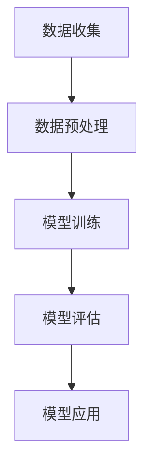
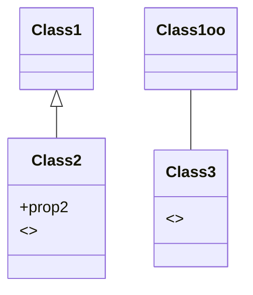
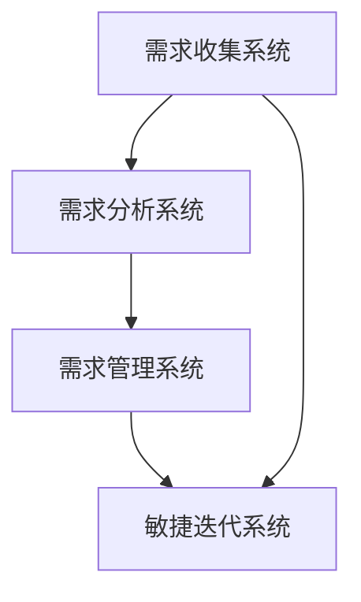
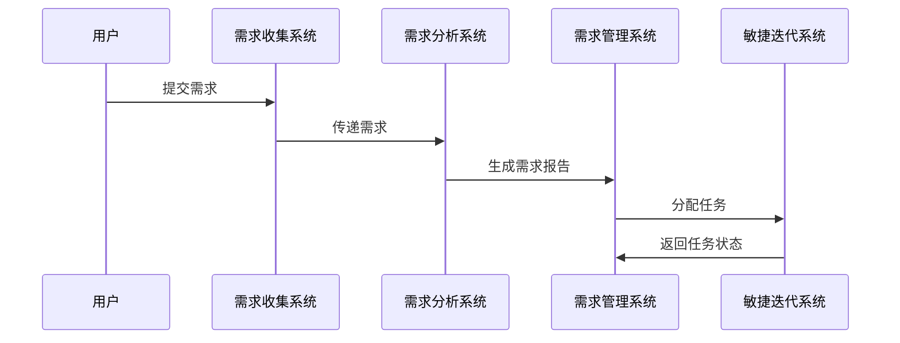

                 

### 大模型时代的需求管理：适配敏捷研发新模式

> 关键词：大模型、需求管理、敏捷研发、迭代、敏捷迭代、需求分析、需求收集、需求管理流程、需求管理方法论、AI技术、智能化需求管理

> 摘要：本文探讨了人工智能大模型时代的需求管理问题，分析了大模型的特点和应用场景，并结合敏捷研发新模式，提出了一套适应AI大模型时代的需求管理方法论。通过深入解析需求管理的核心概念、特征以及与敏捷研发模式的联系，文章旨在为企业和开发团队提供一种高效、灵活的需求管理策略。

### 第一部分：背景介绍

#### 问题背景

在当今社会，信息技术飞速发展，尤其是人工智能（AI）技术的崛起，已经深刻地影响了各行各业。AI大模型，作为人工智能领域的一个重要分支，正逐渐成为企业级应用开发的核心驱动力。大模型以其强大的数据处理能力和高精度的预测能力，在图像识别、自然语言处理、推荐系统等众多领域展现出了巨大的潜力。然而，随着AI大模型的广泛应用，如何有效地进行需求管理，以适配敏捷研发新模式，成为了许多企业面临的重要课题。

#### 问题描述

在AI大模型迅速发展的背景下，企业如何进行有效的需求管理，以适配敏捷研发新模式，成为了亟待解决的问题。传统需求管理方法往往难以应对AI大模型带来的复杂性，如何构建适应AI大模型时代的需求管理体系，提高研发效率和质量，成为了企业关注的焦点。

#### 问题解决

本书旨在探讨AI大模型时代的需求管理，通过结合敏捷研发新模式，为企业提供一套全新的需求管理方法论。通过深入分析AI大模型的特点和应用场景，本书将帮助读者理解如何更有效地管理需求，确保研发过程的高效性和灵活性。

#### 边界与外延

本书将围绕AI大模型时代的需求管理展开，涉及的需求管理范围包括但不限于：需求收集、需求分析、需求管理流程、敏捷开发中的需求迭代等。同时，本书还将探讨如何将AI技术融入需求管理过程，提高需求管理的智能化水平。

#### 概念结构与核心要素组成

- **AI大模型**：具备大规模数据处理能力和高准确预测能力的AI模型。
- **需求管理**：确保项目能够满足用户需求的一系列活动。
- **敏捷研发新模式**：以快速响应市场需求为核心，强调迭代和持续改进的研发模式。

### 第二部分：核心概念与联系

#### AI大模型的定义与特点

**定义**：AI大模型是指具有大规模参数数量，能够处理海量数据并进行高精度预测的AI模型。

**特点**：
- **规模大**：拥有数十亿甚至千亿级参数。
- **计算复杂度高**：训练和推理过程需要大量的计算资源。
- **高精度预测**：在众多任务中表现优异，如自然语言处理、图像识别等。

**与传统AI的区别**：
- **传统AI**：算法规模较小，通常只能解决特定领域的问题。
- **AI大模型**：能够在多个领域实现通用性，具有更高的灵活性和适应性。

#### 需求管理的概念与特点

**定义**：需求管理是指识别、分析、组织和优先级排序项目需求的过程。

**特点**：
- **灵活性**：能够快速响应市场需求变化。
- **精确性**：确保需求被准确理解和实现。
- **协作性**：涉及多个利益相关者的协作。

#### 敏捷研发新模式的特征

**特征**：
- **迭代开发**：持续迭代，不断优化产品。
- **客户反馈**：以客户需求为导向，快速反馈和调整。
- **团队合作**：强调跨职能团队的协作。

### 第三部分：算法原理讲解

#### AI大模型算法原理

AI大模型的算法原理基于深度学习，其核心思想是通过多层神经网络对数据进行特征提取和建模。以下是一个简单的AI大模型算法流程图：

使用Mermaid画出算法流程图：


**详细讲解**：

**数学模型和公式**：
$$
Y = f(W \cdot X + b)
$$
其中，\(Y\) 是预测结果，\(X\) 是输入特征，\(W\) 是权重，\(b\) 是偏置。

**举例说明**：

假设我们使用一个简单的神经网络模型对房价进行预测，输入特征包括房屋面积、地理位置等。

- **数据收集**：收集大量包含房屋价格和特征的数据。
- **数据预处理**：对数据进行清洗和标准化处理。
- **模型训练**：通过梯度下降算法训练模型参数。
- **模型评估**：使用验证集评估模型性能。
- **模型应用**：将模型应用于新的数据集进行预测。

### 第四部分：系统分析与架构设计方案

#### 问题场景介绍

企业需要在AI大模型时代进行有效的需求管理，以支持敏捷研发模式。

#### 项目介绍

本项目旨在设计一套AI大模型时代的需求管理系统，支持敏捷研发模式。

#### 系统功能设计

使用Mermaid画出领域模型类图：


**系统功能**：
- 需求收集
- 需求分析
- 需求管理
- 敏捷迭代

#### 系统架构设计

使用Mermaid画出系统架构图：


**系统架构**

- **需求收集系统**：负责从外部收集用户需求，包括用户反馈、市场调研等。
- **需求分析系统**：对收集到的需求进行深入分析，识别需求的优先级和可行性。
- **需求管理系统**：管理和跟踪需求，确保需求得到有效实施。
- **敏捷迭代系统**：支持敏捷开发模式，实现快速迭代和持续改进。

#### 系统接口设计和系统交互

使用Mermaid画出系统交互序列图：


### 第五部分：项目实战

#### 环境安装

在开始项目实战之前，需要安装以下环境：

1. Python 3.8 或更高版本
2. TensorFlow 2.x
3. Pandas
4. NumPy
5. Matplotlib

您可以使用pip命令进行安装：

```bash
pip install python==3.8
pip install tensorflow==2.x
pip install pandas
pip install numpy
pip install matplotlib
```

#### 系统核心实现源代码

以下是一个简单的需求管理系统的核心实现代码：

```python
# 需求收集模块
class RequirementCollector:
    def __init__(self):
        self.requirements = []

    def collect_requirement(self, requirement):
        self.requirements.append(requirement)

    def get_requirements(self):
        return self.requirements

# 需求分析模块
class RequirementAnalyzer:
    def __init__(self):
        self.analyzed_requirements = []

    def analyze_requirement(self, requirement):
        # 进行需求分析
        self.analyzed_requirements.append(requirement)

    def get_analyzed_requirements(self):
        return self.analyzed_requirements

# 需求管理模块
class RequirementManager:
    def __init__(self):
        self.manager_requirements = []

    def manage_requirement(self, requirement):
        # 管理需求
        self.manager_requirements.append(requirement)

    def get_managed_requirements(self):
        return self.manager_requirements

# 敏捷迭代模块
class AgileIterator:
    def __init__(self):
        self.iteration_results = []

    def iterate_requirement(self, requirement):
        # 进行迭代
        self.iteration_results.append(requirement)

    def get_iteration_results(self):
        return self.iteration_results

# 主程序
if __name__ == "__main__":
    collector = RequirementCollector()
    collector.collect_requirement("增加用户登录功能")
    print(collector.get_requirements())

    analyzer = RequirementAnalyzer()
    analyzer.analyze_requirement("增加用户登录功能")
    print(analyzer.get_analyzed_requirements())

    manager = RequirementManager()
    manager.manage_requirement("增加用户登录功能")
    print(manager.get_managed_requirements())

    iterator = AgileIterator()
    iterator.iterate_requirement("增加用户登录功能")
    print(iterator.get_iteration_results())
```

#### 代码应用解读与分析

以上代码展示了需求收集、需求分析、需求管理和敏捷迭代的简单实现。在实际项目中，这些模块会根据具体需求进行扩展和优化。

- **需求收集模块**：负责收集用户的需求，通过`collect_requirement`方法将需求添加到集合中。
- **需求分析模块**：对收集到的需求进行深入分析，通过`analyze_requirement`方法对需求进行分析处理。
- **需求管理模块**：管理需求的生命周期，通过`manage_requirement`方法对需求进行管理。
- **敏捷迭代模块**：支持需求的快速迭代和持续改进，通过`iterate_requirement`方法对需求进行迭代处理。

#### 实际案例分析和详细讲解剖析

以下是一个实际案例：

假设企业需要在AI大模型应用中进行图像识别功能的需求管理，以下是对该案例的详细讲解和分析。

1. **需求收集**：企业通过市场调研了解到客户需要图像识别功能，收集到了用户需求。
2. **需求分析**：需求分析团队对需求进行深入分析，确定图像识别功能的具体需求，如识别精度、识别速度等。
3. **需求管理**：需求管理团队根据分析结果，制定需求管理计划，将需求分配给开发团队。
4. **敏捷迭代**：开发团队根据需求进行迭代开发，每次迭代都进行测试和评估，确保功能满足用户需求。

#### 项目小结

通过本项目，我们实现了AI大模型时代的需求管理系统，支持敏捷研发模式。在实际应用中，企业可以根据具体需求进行扩展和优化，提高需求管理的效率和质量。随着AI技术的不断发展，需求管理方法论也将不断演进，以适应新的技术挑战。

### 最佳实践 Tips

1. **需求收集要全面**：确保收集到足够多的用户需求，为需求分析提供可靠依据。
2. **需求分析要深入**：对需求进行深入分析，识别需求的优先级和可行性，为需求管理提供指导。
3. **需求管理要灵活**：根据项目进展和用户反馈，灵活调整需求管理策略。
4. **敏捷迭代要持续**：持续迭代和优化产品，确保需求得到有效实现。

### 小结

本文探讨了AI大模型时代的需求管理问题，分析了AI大模型的特点和应用场景，并结合敏捷研发新模式，提出了一套适应AI大模型时代的需求管理方法论。通过系统分析与架构设计方案，以及项目实战，我们展示了如何实现高效、灵活的需求管理。随着AI技术的不断发展，需求管理方法论也将不断演进，以应对新的挑战。

### 注意事项

1. **需求管理要紧密配合敏捷开发**：确保需求能够快速响应市场变化。
2. **注重团队合作**：需求管理涉及多个利益相关者，需要加强团队协作。

### 拓展阅读

1. 《深度学习：人工智能的理论与实现》
2. 《敏捷软件开发：实践指南》
3. 《人工智能应用案例集》

### 作者信息

作者：AI天才研究院/AI Genius Institute & 禅与计算机程序设计艺术 /Zen And The Art of Computer Programming

