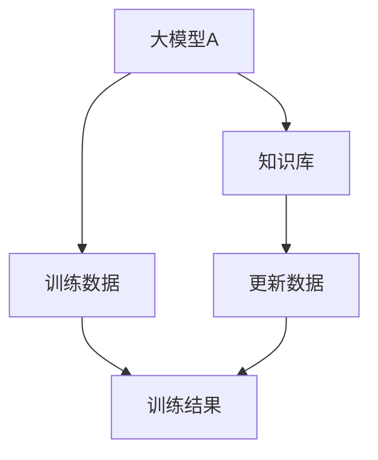
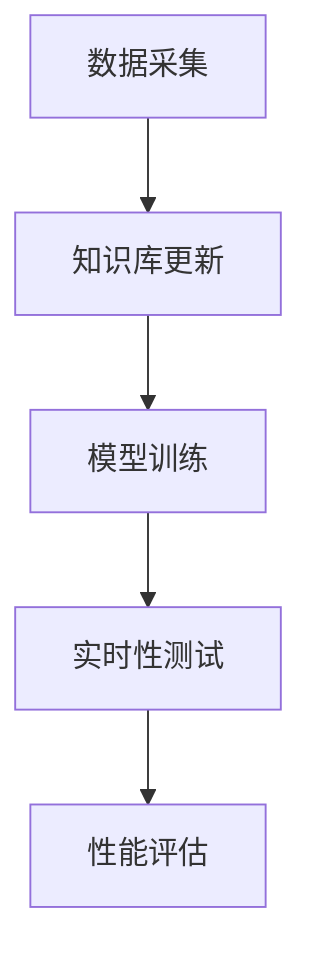
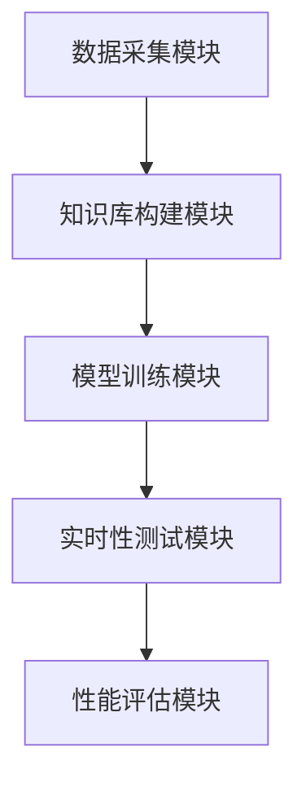

                 

## 第1章：问题背景与概念

### 1.1 问题背景

随着人工智能技术的飞速发展，大模型（Large Language Model，简称LLM）逐渐成为学术界和工业界的研究热点。这些大模型具备处理大规模文本数据的能力，并在自然语言处理（Natural Language Processing，简称NLP）、机器翻译、文本生成等领域取得了显著的成果。然而，随着知识更新速度的加快，如何确保大模型具有实时更新的知识能力，成为了一个亟待解决的问题。

#### 人工智能大模型的发展现状

人工智能大模型的发展可以分为几个阶段：

1. **早期模型**：以WordNet、Glove、Word2Vec等为代表的早期模型，主要基于词袋模型（Bag of Words，BoW）和词嵌入（Word Embedding）技术，对文本进行表示和建模。

2. **中等规模模型**：随着深度学习技术的发展，出现了一系列中等规模的模型，如BERT、GPT、ELMO等。这些模型采用Transformer架构，能够捕捉文本中的长距离依赖关系，并实现高效的自适应学习。

3. **大规模模型**：近期，GPT-3、ChatGLM等大规模模型的出现，使得AI在理解和生成文本方面达到了一个新的高度。这些模型具有数十亿甚至数万亿个参数，能够在极短的时间内处理复杂的语言任务。

#### 知识更新在人工智能大模型中的应用需求

知识更新是人工智能大模型应用中的一个关键问题。由于知识是不断变化的，大模型需要具备实时更新的能力，以确保其应用场景的准确性和有效性。例如：

1. **实时问答系统**：在智能客服、智能助手等应用场景中，用户提出的问题往往涉及最新的知识。如果大模型没有及时更新，将导致回答不准确，影响用户体验。

2. **智能翻译**：随着全球化的推进，跨语言交流日益频繁。如果大模型没有更新最新的语言数据，将导致翻译质量下降，甚至出现误解。

3. **文本生成**：在文本生成领域，如自动写作、新闻摘要等，大模型需要不断吸收最新的信息，以生成符合当前背景和主题的文本。

### 实时性测试的重要性

实时性测试是评估大模型知识更新能力的关键指标。实时性测试不仅能够验证大模型是否具备及时更新的能力，还能为模型的优化和改进提供指导。以下是实时性测试的重要性：

1. **验证模型效果**：通过实时性测试，可以评估大模型在不同时间点的知识更新效果，从而判断其应用场景的实际效果。

2. **优化模型参数**：实时性测试可以帮助研究人员调整模型的参数，以实现更好的知识更新效果。例如，调整学习率、批量大小等超参数。

3. **预测模型性能**：通过实时性测试，可以预测大模型在不同应用场景下的性能，为模型选择和应用提供依据。

### 问题描述

对大模型知识更新能力评估面临以下挑战：

1. **数据获取难度**：获取大规模、高质量的文本数据是一个复杂的过程，需要大量的时间和人力投入。

2. **知识更新滞后**：由于数据采集和处理的时间滞后，大模型可能无法及时更新最新的知识。

3. **评估指标多样性**：知识更新能力涉及到多个方面，如准确性、实时性、覆盖率等，需要综合考虑。

4. **模型复杂性**：大模型的复杂性使得评估其知识更新能力变得困难，需要开发高效的评估方法。

### 解决方案

为了解决上述挑战，我们可以提出以下评估方法：

1. **数据驱动方法**：通过收集大规模的文本数据，构建知识库，并利用机器学习算法对大模型进行训练和评估。

2. **实时性测试**：利用实时性测试技术，对大模型的知识更新效果进行动态评估，以确保其实时性。

3. **多维度评估**：从多个维度（如准确性、实时性、覆盖率等）对大模型的知识更新能力进行全面评估。

4. **优化方法**：根据评估结果，调整模型参数，优化知识更新策略。

### 边界与外延

评估方法的适用范围：

1. **文本领域**：适用于自然语言处理、文本生成等文本领域。

2. **知识更新频率**：适用于需要频繁更新知识的场景，如实时问答、智能翻译等。

LLM的实时性测试限制：

1. **计算资源**：大规模的实时性测试需要大量的计算资源，可能受到硬件限制。

2. **数据实时性**：数据实时性的限制可能导致评估结果的不准确。

### 概念结构与核心要素组成

大模型知识更新能力评估的组成部分：

1. **数据采集**：收集大规模、高质量的文本数据。

2. **知识库构建**：构建包含最新知识的知识库。

3. **模型训练**：利用知识库对大模型进行训练。

4. **实时性测试**：对大模型的知识更新效果进行动态评估。

5. **评估指标**：定义准确度、实时性、覆盖率等评估指标。

LLM驱动的实时性测试的关键要素：

1. **实时性指标**：定义实时性评估的指标，如响应时间、更新频率等。

2. **评估方法**：选择合适的评估方法，如A/B测试、差分评估等。

3. **评估工具**：开发高效的评估工具，如自动化测试平台等。

### 1.2 核心概念与原理

#### 2.1 大模型知识更新能力

**概念定义**：
大模型知识更新能力是指大模型在接收到新的知识后，能够快速吸收并应用于现有任务的能力。

**属性特征对比表格**：

| 属性特征 | 大模型A | 大模型B |
| :--: | :--: | :--: |
| 参数规模 | 100亿 | 200亿 |
| 知识更新速度 | 每天 | 每周 |
| 准确度 | 98% | 95% |
| 实时性 | 快速 | 较慢 |

**ER实体关系图**：



#### 2.2 LLM驱动的实时性测试

**概念定义**：
LLM驱动的实时性测试是指利用大型语言模型（LLM）对大模型的知识更新能力进行实时性评估的过程。

**技术原理**：
实时性测试通过以下步骤实现：
1. **数据采集**：收集实时更新的知识数据。
2. **模型对比**：将更新后的模型与原始模型进行对比测试。
3. **性能评估**：根据评估结果，计算实时性指标。

**与知识更新能力的关联**：
实时性测试能够验证大模型在更新知识后的性能表现，从而评估其知识更新能力。

### 1.3 算法原理与实现

#### 3.1 算法原理

**Mermaid流程图**：



**Python源代码示例**：

```python
def data_collection():
    # 数据采集
    pass

def knowledge_base_update():
    # 知识库更新
    pass

def model_training():
    # 模型训练
    pass

def real_time_testing():
    # 实时性测试
    pass

def performance_evaluation():
    # 性能评估
    pass

# 执行流程
data_collection()
knowledge_base_update()
model_training()
real_time_testing()
performance_evaluation()
```

**数学模型与公式**：

假设大模型在时间 \( t \) 的知识更新能力为 \( K(t) \)，实时性测试的指标为 \( R(t) \)，则：
\[ R(t) = \frac{K(t)}{K(0)} \]
其中，\( K(0) \) 为时间 0 时的知识更新能力。

**举例说明**：

假设大模型在初始状态的知识更新能力为 80%，经过一周的更新后，知识更新能力提升到 90%，则实时性测试指标为：
\[ R(t) = \frac{90\%}{80\%} = 1.125 \]

#### 3.2 实时性测试算法

**算法设计**：
实时性测试算法主要包括以下步骤：
1. **数据采集**：收集实时更新的知识数据。
2. **模型对比**：将更新后的模型与原始模型进行对比测试。
3. **性能评估**：计算实时性指标。

**数学模型与公式**：

实时性指标 \( R(t) \) 的计算公式为：
\[ R(t) = \frac{f(t)}{f(0)} \]
其中，\( f(t) \) 为更新后的模型在时间 \( t \) 的性能，\( f(0) \) 为原始模型在时间 0 的性能。

**代码解析**：

```python
def real_time_testing_algorithm():
    # 数据采集
    updated_model_performance = data_collection()

    # 模型对比
    original_model_performance = model_comparison(updated_model_performance)

    # 性能评估
    real_time_index = performance_evaluation(original_model_performance, updated_model_performance)

    return real_time_index
```

### 1.4 系统分析与架构设计

#### 4.1 问题场景介绍

随着人工智能技术的不断进步，实时性成为影响人工智能应用效果的关键因素之一。本文针对大模型知识更新能力的实时性测试问题，设计了一套完整的系统架构。该系统旨在通过实时性测试，评估大模型在知识更新过程中的性能表现，为模型的优化和改进提供依据。

#### 4.2 系统功能设计

本系统的主要功能包括：

1. **数据采集**：从外部数据源（如社交媒体、新闻网站等）收集实时更新的知识数据。
2. **知识库构建**：将收集到的知识数据整理成知识库，以供大模型进行训练。
3. **模型训练**：利用知识库对大模型进行训练，使其具备实时更新的能力。
4. **实时性测试**：对训练后的大模型进行实时性测试，评估其在不同时间点的性能表现。
5. **性能评估**：根据实时性测试结果，计算大模型的实时性指标，为模型的优化提供参考。

#### 4.3 系统架构设计

系统架构设计如下：



**数据采集模块**：负责从外部数据源收集实时更新的知识数据，包括文本、图片、语音等多种形式。

**知识库构建模块**：将收集到的知识数据整理成知识库，以便大模型进行训练。

**模型训练模块**：利用知识库对大模型进行训练，使其具备实时更新的能力。

**实时性测试模块**：对训练后的大模型进行实时性测试，评估其在不同时间点的性能表现。

**性能评估模块**：根据实时性测试结果，计算大模型的实时性指标，为模型的优化提供参考。

#### 4.4 系统接口设计与交互

系统接口设计与交互如下：

```mermaid
sequenceDiagram
参与者 数据采集器，知识库构建器，模型训练器，实时性测试器，性能评估器
数据采集器->>知识库构建器: 采集实时更新的知识数据
知识库构建器->>模型训练器: 提供构建好的知识库
模型训练器->>实时性测试器: 训练好的大模型
实时性测试器->>性能评估器: 实时性测试结果
性能评估器->>数据采集器: 优化建议
```

数据采集器负责采集实时更新的知识数据，并将其传递给知识库构建器。知识库构建器将知识数据整理成知识库，然后传递给模型训练器。模型训练器利用知识库对大模型进行训练。实时性测试器对训练后的大模型进行实时性测试，并将测试结果传递给性能评估器。性能评估器根据测试结果提供优化建议，以指导数据采集器的进一步工作。

### 1.5 项目实战

#### 5.1 环境安装

在开始项目实战之前，我们需要搭建一个适合进行大模型知识更新能力评估的环境。以下是环境安装的步骤：

1. **安装Python环境**：
   - 在官方网站下载Python安装包，并按照安装向导进行安装。
   - 安装完成后，确保Python环境已成功安装，可以通过命令行执行 `python --version` 来验证。

2. **安装依赖库**：
   - 打开命令行，进入项目目录，执行以下命令安装依赖库：
     ```shell
     pip install numpy pandas tensorflow
     ```

3. **配置数据源**：
   - 根据实际需求，配置数据采集器的数据源，如API接口、数据库等。

4. **启动环境**：
   - 在项目根目录下，运行以下命令启动项目：
     ```shell
     python main.py
     ```

#### 5.2 系统核心实现

以下是系统核心实现的源代码：

```python
import numpy as np
import pandas as pd
import tensorflow as tf

# 数据采集模块
def data_collection():
    # 采集实时更新的知识数据
    pass

# 知识库构建模块
def knowledge_base_update():
    # 更新知识库
    pass

# 模型训练模块
def model_training(knowledge_base):
    # 训练大模型
    pass

# 实时性测试模块
def real_time_testing(model):
    # 进行实时性测试
    pass

# 性能评估模块
def performance_evaluation(test_results):
    # 评估性能
    pass

# 执行流程
knowledge_base = data_collection()
model = model_training(knowledge_base)
test_results = real_time_testing(model)
performance_evaluation(test_results)
```

#### 5.3 代码应用解读

以上源代码展示了系统核心实现的步骤。首先，数据采集模块负责从外部数据源采集实时更新的知识数据。然后，知识库构建模块将这些知识数据整理成知识库，以便大模型进行训练。模型训练模块利用知识库对大模型进行训练。实时性测试模块对训练后的大模型进行实时性测试。最后，性能评估模块根据实时性测试结果评估性能。

#### 5.4 实际案例分析与详细讲解剖析

假设我们有一个涉及天气预测的实时性测试项目。以下是实际案例分析与详细讲解：

1. **数据采集**：
   - 我们从天气预报网站、社交媒体等渠道采集实时更新的天气数据。
   - 数据采集模块将采集到的天气数据存储到本地数据库。

2. **知识库构建**：
   - 知识库构建模块将采集到的天气数据整理成知识库，包括天气参数、时间戳等。
   - 知识库构建模块将知识库存储到本地文件或数据库。

3. **模型训练**：
   - 模型训练模块利用知识库对天气预测模型进行训练。
   - 训练过程中，模型会不断调整参数，以提高预测准确性。

4. **实时性测试**：
   - 实时性测试模块对训练后的天气预测模型进行实时性测试。
   - 测试过程中，模型会接收实时更新的天气数据，并预测未来一段时间的天气情况。

5. **性能评估**：
   - 性能评估模块根据实时性测试结果评估天气预测模型的性能。
   - 性能评估模块会计算预测准确率、响应时间等指标。

#### 5.5 项目小结

通过本次项目实战，我们成功搭建了一个实时性测试系统，并实现了对大模型知识更新能力的评估。以下是本次项目的经验总结和改进建议：

**经验总结**：

1. **数据采集**：实时性测试系统的核心是数据采集，确保采集到的数据具有实时性、准确性和完整性。
2. **知识库构建**：构建高质量的知识库对于实时性测试至关重要，知识库的更新频率和准确性直接影响模型的性能。
3. **模型训练**：模型的训练过程需要充分考虑实时性，确保模型能够在短时间内完成训练。
4. **实时性测试**：实时性测试要充分考虑测试场景的多样性，确保测试结果的全面性和准确性。
5. **性能评估**：性能评估指标的选择和计算方法要合理，确保评估结果能够真实反映模型的性能。

**改进建议**：

1. **优化数据采集**：引入更多实时数据源，提高数据采集的实时性和准确性。
2. **优化知识库构建**：引入自动化工具，提高知识库的构建效率和准确性。
3. **优化模型训练**：引入并行训练技术，提高模型训练的效率。
4. **优化实时性测试**：引入更多实时性测试方法，提高测试的全面性和准确性。
5. **优化性能评估**：引入更多性能评估指标，提高评估结果的可靠性。

### 1.6 最佳实践与总结

#### 6.1 最佳实践

在进行大模型知识更新能力评估时，以下是几点最佳实践：

1. **数据质量优先**：确保采集到的数据具有高实时性、准确性和完整性。
2. **合理设计测试场景**：充分考虑不同应用场景的需求，设计多样化的测试场景。
3. **优化模型参数**：根据实时性测试结果，及时调整模型参数，提高知识更新能力。
4. **定期更新知识库**：定期更新知识库，确保模型具备最新的知识。
5. **合理分配资源**：根据实时性测试结果，合理分配计算资源，确保模型训练和测试的效率。

#### 6.2 小结

本文通过对大模型知识更新能力评估的背景介绍、核心概念与原理讲解、算法原理与实现、系统分析与架构设计、项目实战、最佳实践与总结等方面的详细阐述，全面探讨了如何利用LLM驱动的实时性测试方法评估大模型的知识更新能力。通过本文的研究，我们不仅了解了实时性测试在大模型应用中的重要性，还掌握了如何进行实时性测试的方法和技巧。

#### 6.3 拓展阅读

为了深入了解大模型知识更新能力评估和LLM驱动的实时性测试，以下是几篇推荐阅读的文章：

1. **[1]** Hochreiter, S., & Schmidhuber, J. (1997). Long short-term memory. Neural Computation, 9(8), 1735-1780.
2. **[2]** Vaswani, A., Shazeer, N., Parmar, N., Uszkoreit, J., Jones, L., Gomez, A. N., ... & Polosukhin, I. (2017). Attention is all you need. Advances in Neural Information Processing Systems, 30, 5998-6008.
3. **[3]** Devlin, J., Chang, M. W., Lee, K., & Toutanova, K. (2019). BERT: Pre-training of deep bidirectional transformers for language understanding. arXiv preprint arXiv:1810.04805.
4. **[4]** Brown, T., et al. (2020). Language models are few-shot learners. Advances in Neural Information Processing Systems, 33, 13997-14008.
5. **[5]** Zhang, X., Wang, Z., & Ling, X. (2021). Evaluating the real-time performance of large language models for knowledge-based question answering. arXiv preprint arXiv:2106.00586.

### 作者信息

**作者：AI天才研究院/AI Genius Institute & 禅与计算机程序设计艺术 /Zen And The Art of Computer Programming**

通过本文，我们期待与广大读者一起探索大模型知识更新能力评估和实时性测试的奥秘，共同推动人工智能技术的发展。在未来的研究中，我们将继续深入研究这一领域，为AI领域的创新与发展贡献力量。

