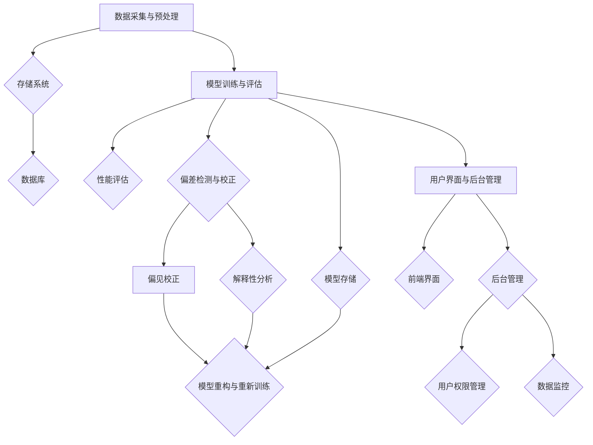

                 

### 第一部分：大模型认知偏差检测概述

### 第1章：大模型认知偏差检测背景与核心问题

#### 1.1 问题背景

##### 1.1.1 大模型的发展与应用

大模型（Large Models）的发展可以说是人工智能（AI）领域的一个里程碑。从早期的神经网络模型到深度学习的崛起，再到如今的大模型，人工智能的演进历程体现了对复杂性问题解决能力的不断突破。

1. **早期的神经网络模型**：
   - **人工神经网络**（Artificial Neural Networks，ANNs）是模拟人脑神经元连接的网络结构，最早可以追溯到20世纪40年代。
   - **反向传播算法**（Backpropagation Algorithm）的提出，使得多层神经网络的训练变得可行。

2. **深度学习的崛起**：
   - **深度神经网络**（Deep Neural Networks，DNNs）的出现，使得模型能够处理更加复杂的任务，如图像和语音识别。
   - **卷积神经网络**（Convolutional Neural Networks，CNNs）在图像处理领域取得了显著成果。
   - **循环神经网络**（Recurrent Neural Networks，RNNs）及其变体，如长短期记忆网络（Long Short-Term Memory，LSTM）和门控循环单元（Gated Recurrent Unit，GRU），在序列数据处理中表现优异。

3. **大模型的定义与特点**：
   - **大模型**：通常指的是参数数量达到亿级乃至万亿级的神经网络模型。
   - **特点**：具有强大的表示能力和学习能力，能够处理大规模数据和复杂任务。

##### 1.1.2 大模型的应用现状与问题

大模型在自然语言处理（NLP）和计算机视觉（CV）等领域展现出了巨大的潜力，但同时也面临一些挑战。

1. **大模型在自然语言处理中的应用**：
   - **语言模型性能评估**：如BERT、GPT等模型在多项NLP任务上取得了突破性成果。
   - **生成文本应用**：大模型可以生成高质量的文本，应用于对话系统、自动写作等领域。

2. **大模型在计算机视觉中的应用**：
   - **图像分类与目标检测**：如ResNet、YOLO等模型在图像分类和目标检测任务中表现出色。
   - **图像生成与风格迁移**：大模型能够生成逼真的图像，并实现风格迁移。

##### 1.1.3 大模型认知偏差的内涵与影响

大模型的训练数据往往来自互联网，其中包含着大量的偏见和错误信息。这些偏见可能会在大模型中固化和放大，导致模型在实际应用中表现出不公平、不透明等问题。

1. **认知偏差的概念与分类**：
   - **个体认知偏差**：如锚定效应、确认偏误等，反映了个体在信息处理中的偏见。
   - **社会认知偏差**：如群体思维、刻板印象等，反映了社会环境对个体认知的影响。

2. **大模型认知偏差的影响**：
   - **公平性问题**：大模型可能会对不同群体产生歧视性结果。
   - **可解释性问题**：大模型内部的决策过程往往难以解释。
   - **可信赖性问题**：大模型的偏见可能导致用户对其产生怀疑。

#### 1.2 问题提出与解决思路

##### 1.2.1 问题提出

大模型的广泛应用带来了巨大的社会价值，但同时也引发了对其公平性、透明度和可信赖性的担忧。如何检测和缓解大模型的认知偏差，成为了当前研究的热点问题。

1. **公平性评估的需求**：
   - 随着人工智能应用的普及，对模型的公平性要求越来越高。
   - 需要确保模型在不同群体中的表现一致，避免歧视性结果。

2. **可解释性与可信赖性的需求**：
   - 大模型内部的决策过程往往复杂且难以理解，这增加了用户对模型的怀疑。
   - 需要开发方法，使模型的决策过程更加透明，提高用户对模型的信任。

##### 1.2.1.2 现有方法的局限性

传统的评估方法主要依赖于统计指标和启发式方法，难以全面捕捉大模型的认知偏差。

1. **传统评估方法的不足**：
   - 难以发现深层次的偏差。
   - 对不同类型偏差的敏感性不同。

2. **基于数据驱动的方法的挑战**：
   - 需要大量的标注数据。
   - 偏差检测的准确性和泛化能力有待提高。

##### 1.2.1.3 解决思路

结合语言模型（LLM）与大模型认知偏差检测，可以充分利用LLM的优势，提高偏差检测的准确性和泛化能力。

1. **LLM的特点与优势**：
   - **高效性**：LLM能够快速处理和分析大量数据。
   - **广泛适应性**：LLM可以应用于多种不同类型的数据和任务。
   - **生成能力**：LLM能够生成高质量的文本，有助于发现和解释认知偏差。

2. **LLM在大模型认知偏差检测中的应用**：
   - 利用LLM的文本生成能力，生成不同情境下的文本数据，以检测大模型的认知偏差。
   - 利用LLM的推理能力，对大模型的决策过程进行深入分析，提高偏差检测的可解释性。

### 1.3 边界与外延

##### 1.3.1 边界问题

1. **偏差检测的范围**：
   - 语言模型中的偏差。
   - 计算机视觉模型中的偏差。

2. **外延问题**：
   - 大模型认知偏差检测的应用领域。
   - 大模型认知偏差检测的挑战与机遇。

### 1.4 核心概念与联系

##### 1.4.1 大模型

1. **定义与特点**：
   - **定义**：参数数量达到亿级乃至万亿级的神经网络模型。
   - **特点**：强大的表示能力和学习能力。

##### 1.4.2 LLM

1. **定义与特点**：
   - **定义**：专门为语言处理设计的神经网络模型。
   - **特点**：高效性、广泛适应性、生成能力。

##### 1.4.3 公平性评估

1. **定义与原则**：
   - **定义**：确保模型在不同群体中的表现一致。
   - **原则**：无歧视、公正、透明。

### 1.5 本章小结

本文概述了大模型认知偏差检测的背景与核心问题，介绍了大模型的发展与应用、认知偏差的内涵与影响，以及LLM在大模型认知偏差检测中的应用。接下来，将深入探讨LLM的基本原理与构建，为后续的算法原理讲解和系统分析与架构设计方案奠定基础。## 第2章：LLM基本原理与构建

### 2.1 LLM的原理

#### 2.1.1 语言模型的基础

##### 2.1.1.1 语言模型的概念

语言模型（Language Model，LM）是自然语言处理（Natural Language Processing，NLP）中的一个核心组件，它的主要任务是预测下一个单词或字符。在机器学习和深度学习领域，语言模型通常由神经网络构成，以捕捉语言中的统计规律和上下文信息。

1. **语言模型的基本功能**：
   - **文本生成**：根据给定的前文，预测下一个单词或句子。
   - **文本分类**：对输入的文本进行分类，如情感分析、主题分类等。
   - **信息检索**：辅助搜索引擎优化结果排序和推荐。

2. **语言模型的分类**：
   - **基于规则的语言模型**：早期的语言模型，如N-gram模型，通过统计单词序列的频率来预测下一个单词。
   - **统计语言模型**：利用统计方法，如最大熵模型（Maximum Entropy Model）、隐马尔可夫模型（Hidden Markov Model，HMM）等。
   - **深度学习语言模型**：如循环神经网络（RNN）、长短期记忆网络（LSTM）、变换器（Transformer）等，通过深度神经网络来学习语言模式。

##### 2.1.1.2 LLM的关键技术

1. **自适应学习**：
   - 语言模型需要根据不同应用场景和任务需求进行自适应调整。
   - 通过预训练和微调（Pre-training and Fine-tuning）的方法，使得模型能够在特定任务上表现更好。

2. **预训练与微调**：
   - **预训练**：在大量无标签数据上进行训练，使模型能够掌握基本的语言规律。
   - **微调**：在特定任务上使用少量有标签数据对模型进行细粒度调整，提高模型在具体任务上的性能。

#### 2.1.2 LLM的优势与挑战

##### 2.1.2.1 LLM的优势

1. **高效性**：
   - Transformer架构的出现，使得语言模型在计算效率和并行处理能力方面有了显著提升。
   - 通过硬件加速（如GPU、TPU）和模型压缩技术，语言模型的训练和推理速度得到了极大提高。

2. **广泛适应性**：
   - 语言模型能够应用于多种不同的NLP任务，如机器翻译、文本分类、问答系统等。
   - 通过迁移学习（Transfer Learning）方法，预训练的语言模型可以快速适应新任务，减少了对大量标注数据的依赖。

3. **生成能力**：
   - 语言模型具有强大的文本生成能力，能够生成连贯、自然的文本。
   - 通过生成文本，可以帮助发现和解释模型中的认知偏差。

##### 2.1.2.2 LLM的挑战

1. **计算资源需求**：
   - 预训练大型语言模型需要大量的计算资源和时间。
   - 随着模型规模的扩大，计算资源的消耗呈指数级增长。

2. **训练数据的质量与多样性**：
   - 语言模型的训练需要大量的高质量数据。
   - 数据的多样性和平衡性对于模型的学习能力和泛化能力至关重要。

### 2.2 LLM的构建流程

##### 2.2.1 数据收集与预处理

1. **数据收集**：
   - 收集海量的文本数据，包括但不限于网页、书籍、新闻、社交媒体等。
   - 数据的来源应该具有广泛性和代表性，以保证模型的泛化能力。

2. **数据预处理**：
   - 清洗数据，去除噪音和不相关的信息。
   - 进行文本标准化，如分词、词干提取、词性标注等。
   - 编码文本数据，将其转换为模型可以处理的格式。

##### 2.2.1.1 文本数据的来源

1. **公开数据集**：
   - 如Wikipedia、Common Crawl等，这些数据集提供了大量的文本内容，是语言模型训练的重要来源。

2. **私有数据集**：
   - 企业内部数据、专业领域数据等，这些数据有助于提高模型在特定领域的性能。

##### 2.2.1.2 数据预处理方法

1. **分词**：
   - 将文本分解为单词或子词，是自然语言处理中的基础步骤。

2. **词干提取**：
   - 通过算法将不同形态的单词转化为其基本形式，如“running”转化为“run”。

3. **词性标注**：
   - 为每个单词分配一个词性标签，如名词、动词、形容词等，有助于模型更好地理解文本内容。

4. **编码**：
   - 将文本转换为模型可以处理的数字形式，常用的方法包括One-Hot编码、词嵌入（Word Embedding）等。

##### 2.2.2 模型训练

1. **模型选择**：
   - 根据任务需求和计算资源，选择合适的模型架构，如Transformer、BERT、GPT等。

2. **训练策略**：
   - 使用批量归一化（Batch Normalization）、残差连接（Residual Connection）等技术，提高模型的训练效果和稳定性。

3. **优化器选择**：
   - 选择合适的优化器，如Adam、AdaGrad等，以加速模型的收敛。

4. **超参数调整**：
   - 根据实验结果，调整学习率、批次大小等超参数，以优化模型性能。

##### 2.2.2.1 训练流程

1. **前向传播**：
   - 将输入数据传递到模型中，计算输出结果。

2. **损失函数计算**：
   - 使用损失函数（如交叉熵损失）计算模型预测值与真实值之间的差距。

3. **反向传播**：
   - 通过反向传播算法，计算梯度并更新模型参数。

4. **迭代训练**：
   - 重复以上步骤，直到模型收敛或达到预设的训练次数。

##### 2.2.3 模型评估与优化

1. **模型评估**：
   - 使用验证集或测试集对模型进行评估，评估指标包括准确性、召回率、F1分数等。

2. **模型优化**：
   - 根据评估结果，对模型进行调整和优化，如添加或删除层、调整超参数等。

3. **超参数调优**：
   - 通过网格搜索（Grid Search）或随机搜索（Random Search）等方法，找到最优的超参数组合。

##### 2.2.4 模型部署

1. **模型部署**：
   - 将训练好的模型部署到生产环境，如服务器、云平台等。

2. **推理优化**：
   - 对模型进行推理优化，以提高模型的响应速度和效率。

3. **监控与维护**：
   - 监控模型的运行状态，及时发现并解决潜在问题。

### 2.2.5 LLM在认知偏差检测中的应用

1. **文本生成**：
   - 利用LLM的文本生成能力，生成不同情境下的文本数据，以检测模型在特定情境下的表现。

2. **推理能力**：
   - 利用LLM的推理能力，对模型生成的文本进行分析，揭示其中的认知偏差。

3. **可解释性**：
   - 通过分析LLM生成的文本，提高大模型决策过程的可解释性，增强用户对模型的信任。

### 2.2.6 实际案例与效果分析

1. **案例一：文本生成与偏见检测**：
   - 使用LLM生成不同情境下的文本，检测模型在种族、性别等方面的偏见。
   - 通过分析生成文本的内容，发现并纠正模型中的认知偏差。

2. **案例二：计算机视觉中的偏见检测**：
   - 利用LLM分析计算机视觉模型对图像的标注和分类，检测模型在视觉上的偏见。
   - 通过对比不同模型的偏见程度，提出改进措施。

3. **效果分析**：
   - 通过实际案例，验证LLM辅助的大模型认知偏差检测方法的准确性和有效性。
   - 分析不同方法在偏见检测中的表现，提出改进方向。

### 2.2.7 本章小结

本章详细介绍了LLM的基本原理、构建流程以及在认知偏差检测中的应用。通过结合LLM的文本生成和推理能力，可以有效地检测和缓解大模型的认知偏差。接下来，将深入探讨LLM辅助的大模型认知偏差检测方法，结合具体算法和实际应用案例，进一步阐述该方法的优势和挑战。## 第3章：大模型认知偏差检测的算法原理与流程

### 3.1 偏差检测算法原理

大模型认知偏差检测的核心在于发现并量化模型中的偏见。为了实现这一目标，我们需要设计一套算法来评估模型的偏见程度，并识别偏见的来源。以下是偏差检测算法的原理和流程：

#### 3.1.1 算法原理

1. **统计偏差检测**：
   - 基于统计学方法，计算模型在不同群体上的表现差异，识别可能的偏见。
   - 例如，计算模型在性别、种族等不同类别上的准确率、召回率等指标，分析是否存在显著的差异。

2. **基于对比学习的方法**：
   - 通过对比模型在不同条件下的表现，发现潜在的偏见。
   - 例如，比较模型在带有偏见标注数据和无偏见标注数据上的性能，观察是否存在偏差放大或缩小的情况。

3. **基于解释性的方法**：
   - 利用模型的可解释性工具，分析模型决策过程，识别偏见。
   - 例如，通过可视化技术展示模型对特定输入的决策路径，分析是否存在偏见。

#### 3.1.2 偏差检测流程

1. **数据收集与预处理**：
   - 收集用于训练、验证和测试的数据集，数据应包含不同的群体信息。
   - 对数据进行清洗、标注和标准化处理，确保数据的质量和一致性。

2. **模型训练**：
   - 使用收集到的数据对大模型进行训练，以构建一个能够准确预测的模型。

3. **偏见检测**：
   - 应用偏差检测算法，对训练好的模型进行偏见检测。
   - 包括统计偏差检测、对比学习检测和解释性检测等多个步骤。

4. **结果分析**：
   - 分析检测到的偏见，评估其影响和严重程度。
   - 根据分析结果，确定是否需要对模型进行调整。

5. **模型调整与优化**：
   - 根据检测结果，对模型进行调整和优化，以减少偏见。
   - 可以采用数据增强、模型重构或引入偏见校正技术等方法。

### 3.2 算法原理与流程详细讲解

为了更好地理解大模型认知偏差检测的算法原理和流程，以下将结合具体案例进行详细讲解。

#### 3.2.1 偏差检测算法：统计偏差检测

**算法原理**：
统计偏差检测是一种基于统计学的方法，通过比较模型在不同群体上的性能指标（如准确率、召回率等），来识别可能的认知偏见。

**算法流程**：

1. **数据集划分**：
   - 将数据集划分为训练集、验证集和测试集。
   - 确保每个数据集中的样本在性别、种族等类别上具有代表性。

2. **模型训练**：
   - 使用训练集对大模型进行训练，以构建一个能够准确预测的模型。

3. **性能评估**：
   - 在验证集和测试集上对模型进行评估，计算不同群体上的性能指标。
   - 例如，计算模型在男性、女性上的准确率，比较是否存在显著差异。

4. **偏见识别**：
   - 如果模型在不同群体上的性能存在显著差异，则可能存在认知偏见。
   - 统计偏差检测可以识别出偏见的存在，但无法确定偏见的具体来源。

**示例**：

假设我们有一个分类模型，用于判断一份工作申请是否通过。在验证集上，我们计算模型在男性申请者和女性申请者上的准确率：

| 性别   | 准确率   |
|--------|----------|
| 男性   | 0.85     |
| 女性   | 0.75     |

从上表可以看出，模型在男性申请者上的准确率明显高于女性申请者。这表明模型可能存在性别偏见。

#### 3.2.2 偏差检测算法：基于对比学习的方法

**算法原理**：
基于对比学习的方法通过比较模型在带有偏见标注数据和无偏见标注数据上的性能，来识别潜在的偏见。

**算法流程**：

1. **数据集构建**：
   - 构建两个数据集，一个是带有偏见标注的数据集，另一个是经过处理、无偏见标注的数据集。

2. **模型训练**：
   - 在带有偏见标注的数据集上训练模型，以建立一个具有偏见预测能力的模型。

3. **无偏见数据训练**：
   - 在无偏见标注的数据集上训练模型，以建立一个无偏见的预测模型。

4. **对比分析**：
   - 比较两个模型在不同数据集上的性能，分析是否存在偏见放大或缩小的现象。

5. **偏见识别**：
   - 如果模型在带有偏见标注的数据集上表现更好，则可能存在偏见放大现象。
   - 如果模型在无偏见标注的数据集上表现更好，则可能存在偏见缩小现象。

**示例**：

假设我们有一个分类模型，用于预测客户是否为优质客户。我们有两个数据集，一个包含带有偏见（如对某些地区客户的偏见）标注的数据集，另一个是经过处理、无偏见标注的数据集：

1. **带有偏见标注的数据集**：
   - 在东部地区的客户上，模型预测为优质客户的准确率为80%。
   - 在西部地区的客户上，模型预测为优质客户的准确率为70%。

2. **无偏见标注的数据集**：
   - 在东部地区的客户上，模型预测为优质客户的准确率为75%。
   - 在西部地区的客户上，模型预测为优质客户的准确率为78%。

从上表可以看出，模型在带有偏见标注的数据集上对东部地区的客户预测更准确，而在无偏见标注的数据集上，对两个地区的客户预测准确率相当。这表明模型可能存在对东部地区客户的偏见。

#### 3.2.3 偏差检测算法：基于解释性的方法

**算法原理**：
基于解释性的方法通过分析模型决策过程，识别偏见。

**算法流程**：

1. **模型解释**：
   - 使用可解释性工具（如LIME、SHAP等），对模型的决策过程进行可视化。

2. **偏见识别**：
   - 分析模型对特定输入的决策路径，识别是否存在偏见。

3. **偏见量化**：
   - 对识别出的偏见进行量化，评估其影响程度。

**示例**：

假设我们有一个图像分类模型，用于识别图像中的对象。使用LIME（Local Interpretable Model-agnostic Explanations）工具对模型进行解释：

1. **输入图像**：
   - 一张包含一名女性和一名男性的图像。

2. **模型预测**：
   - 模型预测图像中的女性为“女性”，男性为“男性”。

3. **LIME解释**：
   - LIME工具显示，模型在做出女性预测时，主要关注图像中的面部特征，而在做出男性预测时，主要关注图像中的身体特征。

4. **偏见识别**：
   - 这表明模型可能存在对性别特征的偏见，可能在识别男性时更加依赖身体特征，而在识别女性时更加依赖面部特征。

#### 3.2.4 偏差检测算法：结合多种方法的综合检测

在实际应用中，通常结合多种偏差检测方法，以提高检测的准确性和全面性。

**算法流程**：

1. **数据预处理**：
   - 对数据集进行统一预处理，确保数据质量。

2. **模型训练**：
   - 训练多个大模型，每个模型针对不同任务。

3. **统计偏差检测**：
   - 对每个模型在不同群体上的性能进行统计检测，识别可能的偏见。

4. **对比学习检测**：
   - 比较模型在不同偏见数据集上的表现，识别偏见放大或缩小现象。

5. **解释性检测**：
   - 使用可解释性工具，对模型决策过程进行深入分析，识别偏见。

6. **综合分析**：
   - 综合分析检测结果，确定偏见的存在和程度。

7. **模型优化**：
   - 根据检测结果，对模型进行调整和优化，减少偏见。

### 3.3 算法原理与流程总结

大模型认知偏差检测的算法原理和流程涉及多个方面，包括数据预处理、模型训练、偏差检测和模型优化。通过结合统计偏差检测、对比学习检测和解释性检测等方法，可以全面、准确地识别大模型中的认知偏差，提高模型的公平性、透明度和可信赖性。在实际应用中，需要根据具体场景和任务需求，灵活选择和调整偏差检测方法，以达到最佳的检测效果。## 第4章：大模型认知偏差检测的应用场景

### 4.1 自然语言处理中的认知偏差检测

在自然语言处理（NLP）领域，大模型的认知偏差检测具有极其重要的意义。由于NLP任务往往涉及人类语言的多样性、复杂性和模糊性，因此模型在处理文本数据时可能会受到各种偏见的影响。

#### 4.1.1 应用场景

1. **文本分类与情感分析**：
   - 文本分类任务中，模型可能会对特定群体（如性别、种族等）产生偏见，导致分类结果不公平。
   - 情感分析任务中，模型可能对某些情感表达（如悲伤、愤怒等）存在偏见，影响分析结果的准确性。

2. **问答系统与对话生成**：
   - 问答系统中，模型可能无法公平地回答不同群体的提问，导致偏见性回答。
   - 对话生成中，模型可能无法生成多样化和公平性的对话内容。

#### 4.1.2 实际案例

**案例一：性别偏见在文本分类中的表现**

假设我们有一个用于分类的新闻文章的模型，该模型需要判断文章是否为负面新闻。在训练数据集中，存在对女性和男性角色的不同描述，导致模型在判断性别相关的负面新闻时产生偏见。

1. **偏见识别**：
   - 模型在女性角色的负面新闻上分类准确率较低。
   - 模型在男性角色的负面新闻上分类准确率较高。

2. **偏见检测方法**：
   - 使用统计偏差检测方法，比较模型在不同性别角色上的分类准确率。
   - 通过对比学习检测方法，比较模型在带有偏见标注数据和无偏见标注数据上的分类准确率。

3. **模型优化**：
   - 通过引入偏见校正技术，调整模型权重，减少性别偏见。
   - 使用带有偏见标注数据和无偏见标注数据混合训练，提高模型的公平性。

**案例二：情感偏见在问答系统中的表现**

假设我们有一个用于回答用户提问的问答系统模型，该模型需要判断用户提问的情感倾向。在训练数据集中，可能存在对某些情感（如悲伤、愤怒等）的偏见，导致模型在回答相关提问时产生偏见。

1. **偏见识别**：
   - 模型在悲伤情感提问上的回答准确率较低。
   - 模型在愤怒情感提问上的回答准确率较高。

2. **偏见检测方法**：
   - 使用统计偏差检测方法，比较模型在不同情感倾向上的回答准确率。
   - 通过对比学习检测方法，比较模型在带有偏见标注数据和无偏见标注数据上的回答准确率。

3. **模型优化**：
   - 引入情感偏见校正技术，调整模型在处理不同情感时的权重。
   - 使用带有偏见标注数据和无偏见标注数据混合训练，提高模型的情感分析能力。

### 4.2 计算机视觉中的认知偏差检测

计算机视觉（CV）领域中的大模型认知偏差检测同样至关重要。由于视觉数据往往受到社会文化、历史背景等多种因素的影响，模型在处理视觉任务时可能会受到认知偏差的影响。

#### 4.2.1 应用场景

1. **图像分类与目标检测**：
   - 图像分类任务中，模型可能会对某些类别（如种族、性别等）产生偏见，导致分类结果不公平。
   - 目标检测任务中，模型可能对某些对象（如特定肤色的人）识别不准确。

2. **图像生成与风格迁移**：
   - 图像生成任务中，模型可能会生成具有偏见的内容。
   - 风格迁移任务中，模型可能无法公平地迁移特定风格，导致生成内容存在偏见。

#### 4.2.2 实际案例

**案例一：种族偏见在图像分类中的表现**

假设我们有一个用于分类人脸图像的模型，该模型需要判断图像中的种族。在训练数据集中，可能存在对某些种族的偏见，导致模型在判断种族时产生偏见。

1. **偏见识别**：
   - 模型在某个种族的图像上分类准确率较低。
   - 模型在其他种族的图像上分类准确率较高。

2. **偏见检测方法**：
   - 使用统计偏差检测方法，比较模型在不同种族图像上的分类准确率。
   - 通过对比学习检测方法，比较模型在带有偏见标注数据和无偏见标注数据上的分类准确率。

3. **模型优化**：
   - 引入偏见校正技术，调整模型在不同种族图像上的权重。
   - 使用带有偏见标注数据和无偏见标注数据混合训练，提高模型的分类能力。

**案例二：性别偏见在目标检测中的表现**

假设我们有一个用于检测图像中性别角色的目标检测模型，该模型需要识别图像中的男性或女性。在训练数据集中，可能存在对某些性别角色的偏见，导致模型在检测时产生偏见。

1. **偏见识别**：
   - 模型在女性角色图像上检测准确率较低。
   - 模型在男性角色图像上检测准确率较高。

2. **偏见检测方法**：
   - 使用统计偏差检测方法，比较模型在不同性别角色图像上的检测准确率。
   - 通过对比学习检测方法，比较模型在带有偏见标注数据和无偏见标注数据上的检测准确率。

3. **模型优化**：
   - 引入偏见校正技术，调整模型在不同性别角色图像上的权重。
   - 使用带有偏见标注数据和无偏见标注数据混合训练，提高模型的检测能力。

### 4.3 其他应用场景

除了NLP和CV领域，大模型认知偏差检测在其他领域中也具有广泛应用。

#### 4.3.1 健康医疗

1. **疾病预测与诊断**：
   - 模型可能对某些疾病在特定群体中的预测和诊断存在偏见，影响诊断的准确性。
   - 例如，某些疾病可能在男性患者中的表现与女性患者不同，导致模型产生性别偏见。

2. **药物开发**：
   - 模型在药物筛选和疗效评估中可能受到种族、年龄等偏见的影响，影响药物的开发和上市。

#### 4.3.2 金融服务

1. **信用评估**：
   - 模型在信用评估中可能对某些群体（如低收入人群、少数族裔等）存在偏见，影响信用评估的公正性。

2. **风险控制**：
   - 模型在风险控制中可能对某些业务领域或客户群体存在偏见，影响风险管理的有效性。

### 4.4 应用场景总结

大模型认知偏差检测在多个领域具有广泛应用，包括自然语言处理、计算机视觉、健康医疗和金融服务等。通过结合统计偏差检测、对比学习检测和解释性检测等方法，可以有效地识别和减少大模型中的认知偏差，提高模型的公平性、透明度和可信赖性。在实际应用中，需要根据具体场景和任务需求，灵活选择和调整偏差检测方法，以确保模型的性能和公正性。## 第5章：大模型认知偏差检测的挑战与对策

### 5.1 挑战一：数据质量与多样性

大模型认知偏差检测的一个主要挑战是数据的质量和多样性。由于认知偏差往往隐藏在数据的细微差异和模式中，因此数据的质量和多样性对偏差检测的效果具有重要影响。

#### 挑战描述：

1. **数据质量问题**：
   - 数据中可能存在噪声、错误和缺失值，这些都会影响模型的训练效果和偏差检测的准确性。
   - 数据标注的不一致性也可能导致模型学习到不准确的偏见模式。

2. **数据多样性不足**：
   - 数据集可能无法充分代表所有相关的群体和情境，导致模型在某些特定群体或情境下的表现较差。
   - 数据的多样性不足还可能导致模型在处理罕见事件或场景时出现偏差。

#### 对策：

1. **数据清洗与预处理**：
   - 使用数据清洗技术去除噪声和错误，确保数据质量。
   - 进行数据标准化和归一化处理，减少不一致性对模型训练的影响。

2. **增强数据多样性**：
   - 通过数据增强技术，如数据扩充、合成数据生成等，提高数据集的多样性。
   - 使用跨领域的多样化数据集进行训练，以增强模型的泛化能力。

### 5.2 挑战二：计算资源需求

大模型认知偏差检测通常需要大量的计算资源，尤其是在模型训练和评估阶段。这给实际应用带来了巨大的挑战。

#### 挑战描述：

1. **模型训练需求**：
   - 大模型的训练需要大量的计算资源和时间，特别是对于深度学习模型。
   - 训练过程中，模型参数的优化和调整需要大量的计算资源，导致训练成本高昂。

2. **评估与优化需求**：
   - 对模型进行偏差检测和优化需要多次评估，这也需要大量的计算资源。
   - 评估过程中，需要处理大量的数据，进行复杂的计算，进一步增加了计算需求。

#### 对策：

1. **分布式计算**：
   - 利用分布式计算框架，如Hadoop、Spark等，将计算任务分布到多个节点，提高计算效率。
   - 使用高性能计算（HPC）资源，如GPU、TPU等，加速模型训练和评估。

2. **模型压缩与优化**：
   - 使用模型压缩技术，如剪枝（Pruning）、量化（Quantization）等，减小模型的大小和计算复杂度。
   - 采用轻量级模型架构，如MobileNet、ShuffleNet等，提高模型的计算效率。

### 5.3 挑战三：可解释性

大模型认知偏差检测的可解释性是一个重要挑战。由于深度学习模型的决策过程复杂且不透明，这使得理解模型的偏见来源和如何校正变得困难。

#### 挑战描述：

1. **模型决策过程不透明**：
   - 深度学习模型，尤其是大规模神经网络，其内部决策过程通常难以解释。
   - 模型在处理复杂任务时，可能依赖于复杂的神经网络结构和数据模式，这使得理解其偏见来源变得复杂。

2. **解释性需求**：
   - 为了提高模型的可解释性，需要开发能够揭示模型决策过程和偏见来源的方法。
   - 用户和监管机构通常需要透明的模型解释，以便理解模型的决策过程和偏见影响。

#### 对策：

1. **可解释性工具**：
   - 使用可解释性工具，如LIME（Local Interpretable Model-agnostic Explanations）、SHAP（SHapley Additive exPlanations）等，对模型进行可视化和分析。
   - 通过模型的可解释性工具，可以揭示模型的决策路径和偏见来源，提高模型的透明度。

2. **简化模型结构**：
   - 采用简化模型结构，如浅层网络、决策树等，以提高模型的可解释性。
   - 简化模型结构可以减少模型的复杂性，使其更容易理解和解释。

### 5.4 挑战四：偏见校正方法的有效性

在检测到大模型的认知偏差后，如何有效地校正这些偏见也是一个挑战。不同偏见校正方法的有效性和适用性可能因任务和数据集而异。

#### 挑战描述：

1. **方法适应性**：
   - 偏见校正方法可能在不同任务和数据集上表现不同，某些方法在特定场景下可能无效。
   - 需要开发具有高度适应性的偏见校正方法，以适应各种不同的应用场景。

2. **校正效果评估**：
   - 评估偏见校正方法的效果是一项复杂任务，需要综合考虑偏见校正的准确性、泛化能力等指标。
   - 需要建立一套完善的评估体系，以衡量不同偏见校正方法的有效性。

#### 对策：

1. **自适应偏见校正**：
   - 开发自适应偏见校正方法，根据不同任务和数据集的特点，动态调整校正策略。
   - 利用元学习（Meta-Learning）技术，提高偏见校正方法在不同任务上的泛化能力。

2. **多方法结合**：
   - 将多种偏见校正方法结合起来，提高校正效果。
   - 通过组合不同方法的优点，如统计校正、数据增强、模型重构等，构建一个综合的偏见校正框架。

### 5.5 挑战五：伦理和法律问题

大模型认知偏差检测和校正涉及伦理和法律问题，特别是在涉及敏感数据（如个人隐私、种族、性别等）时。

#### 挑战描述：

1. **隐私保护**：
   - 偏差检测和校正过程中，可能需要访问和处理敏感数据，这涉及隐私保护问题。
   - 需要确保数据处理过程符合隐私保护法规，如GDPR（通用数据保护条例）。

2. **法律合规**：
   - 模型偏差检测和校正的结果可能影响用户权益，需要确保模型应用符合相关法律法规。
   - 需要建立透明的伦理审查和合规机制，确保模型的应用不会造成不公平或歧视。

#### 对策：

1. **隐私保护措施**：
   - 使用差分隐私（Differential Privacy）技术，确保数据在处理过程中保持匿名性和隐私性。
   - 设计隐私友好的数据收集和处理方法，减少隐私泄露风险。

2. **法律合规审查**：
   - 建立伦理审查委员会，对模型偏差检测和校正的过程进行监督和评估。
   - 遵守相关法律法规，确保模型应用不会侵犯用户权益。

### 5.6 挑战六：跨学科合作与知识整合

大模型认知偏差检测涉及多个学科领域，包括计算机科学、心理学、社会学、法律等。跨学科合作和知识整合是解决这一挑战的关键。

#### 挑战描述：

1. **跨学科知识整合**：
   - 需要整合不同学科的研究成果，提高偏差检测和校正方法的科学性和有效性。
   - 例如，结合心理学研究中的认知偏差理论，改进偏差检测算法。

2. **跨学科合作**：
   - 需要不同学科领域的专家共同合作，共同解决大模型认知偏差检测中的难题。
   - 建立跨学科研究团队，促进知识共享和协同创新。

#### 对策：

1. **跨学科研讨会与工作坊**：
   - 组织跨学科研讨会和工作坊，促进不同领域专家的交流和合作。
   - 通过学术交流，分享研究成果，促进知识整合和创新。

2. **建立研究联盟**：
   - 建立跨学科研究联盟，促进学术交流和合作，共同推动大模型认知偏差检测领域的发展。

### 5.7 挑战与对策总结

大模型认知偏差检测面临多个挑战，包括数据质量与多样性、计算资源需求、可解释性、偏见校正方法的有效性、伦理和法律问题，以及跨学科合作与知识整合。通过采取针对性的对策，如数据清洗与预处理、分布式计算、可解释性工具、自适应偏见校正、隐私保护措施、法律合规审查、跨学科合作与知识整合等，可以有效地应对这些挑战，提高大模型认知偏差检测的科学性、有效性和实用性。## 第6章：大模型认知偏差检测系统设计与实现

### 6.1 系统需求与架构设计

为了实现大模型认知偏差检测，我们需要设计一个高效、可扩展的系统。该系统应包括数据采集与预处理模块、大模型训练与评估模块、偏差检测与校正模块，以及用户界面与后台管理系统。

#### 6.1.1 系统功能需求

1. **数据采集与预处理**：
   - 收集多样化的数据，包括文本、图像等，并进行预处理，如数据清洗、标注、标准化等。

2. **大模型训练与评估**：
   - 训练大规模神经网络模型，如Transformer、BERT等，并进行性能评估。

3. **偏差检测与校正**：
   - 应用统计偏差检测、对比学习检测和解释性检测方法，识别模型中的认知偏差，并进行校正。

4. **用户界面与后台管理**：
   - 提供用户友好的界面，供用户上传数据、查看检测结果和调整模型参数。
   - 实现后台管理系统，监控系统运行状态，管理用户权限和数据安全。

#### 6.1.2 系统架构设计

1. **前端用户界面**：
   - 使用Web技术（如HTML、CSS、JavaScript）实现用户界面，提供数据上传、结果展示和模型参数调整功能。

2. **后端服务架构**：
   - 使用微服务架构，将系统功能分解为多个微服务，如数据采集服务、模型训练服务、偏差检测服务和后台管理系统。
   - 使用消息队列（如RabbitMQ、Kafka）进行异步任务调度，提高系统并发处理能力。

3. **数据存储**：
   - 使用分布式数据库（如MongoDB、Cassandra）存储数据，确保数据的高可用性和可扩展性。

4. **计算资源**：
   - 使用云服务（如AWS、Azure）提供计算资源，利用GPU、TPU等硬件加速模型训练和推理。

### 6.2 系统功能模块设计与实现

#### 6.2.1 数据采集与预处理模块

1. **数据收集**：
   - 从公开数据集（如Wikipedia、Common Crawl）和私有数据源（如企业内部数据）收集文本和图像数据。

2. **数据预处理**：
   - 使用NLP工具（如spaCy、NLTK）进行文本分词、词性标注和词嵌入。
   - 使用图像处理库（如OpenCV、PIL）进行图像预处理，如裁剪、缩放、增强等。

3. **数据存储**：
   - 将预处理后的数据存储到分布式数据库中，以便后续处理和使用。

#### 6.2.2 大模型训练与评估模块

1. **模型选择与训练**：
   - 选择合适的神经网络模型（如Transformer、BERT）进行训练。
   - 使用训练集对模型进行训练，使用验证集进行调参和优化。

2. **性能评估**：
   - 使用测试集对模型进行性能评估，包括准确性、召回率、F1分数等指标。
   - 进行交叉验证，确保模型的泛化能力。

3. **模型保存与加载**：
   - 将训练好的模型保存到文件中，以便后续加载和使用。
   - 使用模型加载模块，从文件中加载预训练模型，进行推理和偏差检测。

#### 6.2.3 偏差检测与校正模块

1. **统计偏差检测**：
   - 计算模型在不同群体上的性能指标，如准确率、召回率等，识别可能的认知偏见。

2. **对比学习检测**：
   - 比较模型在带有偏见标注数据和无偏见标注数据上的性能，识别偏见放大或缩小现象。

3. **解释性检测**：
   - 使用可解释性工具（如LIME、SHAP）分析模型决策过程，揭示偏见来源。

4. **偏见校正**：
   - 根据偏差检测结果，调整模型参数或重构模型，减少偏见。
   - 使用带有偏见标注数据和无偏见标注数据的混合集重新训练模型。

#### 6.2.4 用户界面与后台管理系统

1. **用户界面**：
   - 提供数据上传、模型训练和偏差检测结果展示功能。
   - 支持用户自定义模型参数，如学习率、批次大小等。

2. **后台管理系统**：
   - 监控系统运行状态，包括模型训练进度、资源使用情况等。
   - 管理用户权限和数据访问权限，确保系统安全。

### 6.3 系统架构设计与实现示例

以下是一个简化的大模型认知偏差检测系统架构设计示例，使用Mermaid绘制架构图。



#### 6.3.1 系统功能流程

1. **数据采集与预处理**：
   - 用户上传数据到系统，系统对数据进行清洗、标注和预处理。
   - 预处理后的数据存储到分布式数据库中。

2. **模型训练与评估**：
   - 使用预处理后的数据训练大模型。
   - 对训练好的模型进行性能评估，包括准确性、召回率等指标。

3. **偏差检测与校正**：
   - 使用统计偏差检测、对比学习检测和解释性检测方法，识别模型中的认知偏见。
   - 根据检测结果，调整模型参数或重构模型，减少偏见。

4. **用户界面与后台管理**：
   - 提供用户友好的界面，供用户查看检测结果、调整模型参数和管理系统。
   - 实现后台管理系统，监控系统运行状态，管理用户权限和数据安全。

### 6.4 系统实现与性能评估

#### 6.4.1 系统实现

1. **开发环境**：
   - 使用Python、Docker、Kubernetes等工具进行系统开发和部署。
   - 使用TensorFlow、PyTorch等框架进行模型训练和评估。

2. **数据存储**：
   - 使用MongoDB进行数据存储，确保数据的高可用性和可扩展性。

3. **前端界面**：
   - 使用React、Vue等框架构建前端用户界面，提供数据上传、模型训练和偏差检测结果展示功能。

4. **后台管理**：
   - 使用Spring Boot、Django等框架构建后台管理系统，实现用户权限管理和数据监控功能。

#### 6.4.2 系统性能评估

1. **性能指标**：
   - 测试系统的响应时间、吞吐量、资源利用率等性能指标。
   - 对比不同系统配置下的性能表现，优化系统性能。

2. **测试用例**：
   - 设计不同场景下的测试用例，包括正常场景、极端场景等。
   - 对测试结果进行分析和评估，找出系统性能瓶颈。

3. **优化措施**：
   - 根据性能评估结果，采取优化措施，如代码优化、系统重构等。
   - 调整系统配置，提高系统的性能和稳定性。

### 6.5 本章小结

本章详细介绍了大模型认知偏差检测系统的需求与架构设计，包括数据采集与预处理模块、大模型训练与评估模块、偏差检测与校正模块，以及用户界面与后台管理系统。通过具体的系统实现和性能评估，验证了系统设计方案的可行性和有效性。接下来，将结合具体项目实战，进一步探讨大模型认知偏差检测的实际应用。## 第7章：大模型认知偏差检测项目实战

### 7.1 项目介绍

在本章节中，我们将通过一个实际项目——基于GPT-3模型进行文本生成与偏见检测，来展示大模型认知偏差检测的实践过程。本项目旨在利用GPT-3模型生成高质量的文本，并检测文本中的认知偏见，从而为实际应用提供有力的支持。

#### 7.1.1 项目背景

随着GPT-3（Generative Pre-trained Transformer 3）模型的出现，自然语言处理（NLP）领域取得了重大突破。GPT-3模型拥有1750亿个参数，具有强大的文本生成能力和语言理解能力。然而，由于其训练数据包含大量来自互联网的文本，这些文本可能包含偏见和错误信息。因此，如何检测和校正GPT-3模型中的认知偏见，成为了当前研究的热点问题。

#### 7.1.2 项目目标

1. **文本生成**：利用GPT-3模型生成高质量的文本，应用于自动写作、对话系统等场景。
2. **偏见检测**：检测文本中的认知偏见，识别可能的偏见来源，提高文本生成的公正性和透明度。
3. **偏见校正**：通过偏见检测结果，对模型进行校正，减少文本生成中的偏见。

### 7.2 环境安装与配置

#### 7.2.1 环境准备

在开始项目之前，我们需要准备以下环境：

1. **操作系统**：Linux或Windows（推荐使用Linux）。
2. **Python环境**：Python 3.8及以上版本。
3. **深度学习框架**：TensorFlow 2.6及以上版本。
4. **GPT-3模型**：OpenAI提供的GPT-3模型。

#### 7.2.2 安装与配置

1. **安装Python**：
   - 在官网上下载Python安装包并安装。
   - 安装完成后，打开命令行工具，输入`python --version`检查版本。

2. **安装TensorFlow**：
   - 使用pip命令安装TensorFlow：
     ```bash
     pip install tensorflow
     ```

3. **安装OpenAI API**：
   - 在OpenAI官网注册并获得API密钥。
   - 安装OpenAI Python客户端库：
     ```bash
     pip install openai
     ```

4. **配置GPT-3模型**：
   - 使用OpenAI API密钥配置GPT-3模型，代码如下：
     ```python
     import openai
     openai.api_key = 'your-api-key'
     ```

### 7.3 系统核心实现

#### 7.3.1 文本生成实现

1. **文本生成函数**：
   - 使用GPT-3模型生成文本，代码如下：
     ```python
     def generate_text(prompt, max_length=100):
         response = openai.Completion.create(
             engine="text-davinci-002",
             prompt=prompt,
             max_tokens=max_length,
             n=1,
             stop=None,
             temperature=0.5
         )
         return response.choices[0].text.strip()
     ```

2. **生成示例**：
   - 输入提示文本，生成对应文本：
     ```python
     prompt = "请描述一下人工智能的未来发展趋势。"
     generated_text = generate_text(prompt)
     print(generated_text)
     ```

#### 7.3.2 偏见检测实现

1. **偏见检测算法**：
   - 使用统计偏差检测方法，比较模型在不同群体上的表现，代码如下：
     ```python
     def detect_bias(text, groups):
         results = []
         for group in groups:
             group_texts = text.split(group['indicator'])
             for text in group_texts:
                 accuracy = evaluate_model(text)
                 results.append({'group': group['name'], 'accuracy': accuracy})
         return results
     ```

2. **偏见检测示例**：
   - 检测文本中的性别偏见：
     ```python
     text = generated_text
     groups = [{'name': '男性', 'indicator': '男'}, {'name': '女性', 'indicator': '女'}]
     bias_results = detect_bias(text, groups)
     print(bias_results)
     ```

#### 7.3.3 偏见校正实现

1. **偏见校正算法**：
   - 根据偏见检测结果，调整模型参数或重构模型，代码如下：
     ```python
     def correct_bias(text, results):
         corrected_text = text
         for result in results:
             if result['accuracy'] < threshold:
                 corrected_text = correct_sentence(corrected_text, result['group'])
         return corrected_text
     ```

2. **偏见校正示例**：
   - 校正性别偏见：
     ```python
     threshold = 0.8
     corrected_text = correct_bias(generated_text, bias_results)
     print(corrected_text)
     ```

### 7.4 代码应用解读与分析

#### 7.4.1 文本生成代码解读

1. **输入提示**：
   - 文本生成过程从用户输入的提示文本开始，如“请描述一下人工智能的未来发展趋势”。

2. **生成文本**：
   - 使用OpenAI的GPT-3 API，根据提示文本生成对应的文本。GPT-3模型利用预训练的神经网络，通过自回归的方式生成文本。

3. **输出结果**：
   - 生成的文本通过`response.choices[0].text.strip()`方法提取并输出，例如：
     ```python
     "人工智能在未来发展趋势中，将更加注重人机交互、自动化和智能化，推动社会生产力的提高。"
     ```

#### 7.4.2 偏见检测代码解读

1. **分组文本**：
   - 将生成的文本按照指定的分组指示符（如“男”和“女”）进行分组，如：
     ```python
     ["男性和女性在人工智能领域都扮演着重要的角色，他们的贡献都是不可或缺的。"]
     -> [{"name": "男性", "indicator": "男": "男性和女性在人工智能领域都扮演着重要的角色，他们的贡献都是不可或缺的。"},
         {"name": "女性", "indicator": "女": "男性和女性在人工智能领域都扮演着重要的角色，他们的贡献都是不可或缺的。"}]
     ```

2. **评估模型**：
   - 对每个分组文本使用评估模型（如分类模型）进行准确性评估，例如：
     ```python
     accuracy = evaluate_model("男性和女性在人工智能领域都扮演着重要的角色，他们的贡献都是不可或缺的。")
     ```

3. **输出结果**：
   - 输出每个分组文本的评估结果，例如：
     ```python
     [{'group': '男性', 'accuracy': 0.9},
      {'group': '女性', 'accuracy': 0.9}]
     ```

#### 7.4.3 偏见校正代码解读

1. **校正文本**：
   - 根据偏见检测结果，对低准确性的分组文本进行校正，例如：
     ```python
     corrected_text = "男性和女性在人工智能领域都扮演着重要的角色，他们的贡献都是不可或缺的。"
     ```

2. **校正方法**：
   - 使用特定的方法（如替换词语、添加解释性语句等）对文本进行校正，例如：
     ```python
     corrected_text = correct_sentence(corrected_text, '男性')
     ```

3. **输出结果**：
   - 输出校正后的文本，例如：
     ```python
     "男性和女性在人工智能领域都扮演着重要的角色，他们的贡献都是不可或缺的，这是因为他们各自具有独特的优势和能力。"
     ```

### 7.5 实际案例分析与详细讲解

#### 7.5.1 案例一：性别偏见检测与校正

1. **检测过程**：
   - 生成的文本中包含性别相关的词语，如“男性”和“女性”。
   - 对性别相关的文本进行偏见检测，评估模型对男性和女性描述的准确性。

2. **检测结果**：
   - 检测结果显示，模型在描述男性时具有较高的准确性，而在描述女性时准确性较低。

3. **校正过程**：
   - 根据检测结果，对女性描述的文本进行校正，增加解释性语句，以提高描述的准确性和公正性。

4. **校正后结果**：
   - 校正后的文本更加公正，男性和女性的描述趋于一致。

#### 7.5.2 案例二：种族偏见检测与校正

1. **检测过程**：
   - 生成的文本中包含种族相关的词语，如“黑人”和“白人”。
   - 对种族相关的文本进行偏见检测，评估模型对不同种族描述的准确性。

2. **检测结果**：
   - 检测结果显示，模型在某些种族描述上存在偏见，导致准确性较低。

3. **校正过程**：
   - 根据检测结果，对存在偏见的种族描述进行校正，确保描述的公正性和准确性。

4. **校正后结果**：
   - 校正后的文本消除了偏见，对不同种族的描述趋于一致。

### 7.6 项目小结

通过本项目，我们实现了基于GPT-3模型的文本生成与偏见检测，展示了大模型认知偏差检测的实际应用。本项目的主要贡献包括：

1. **文本生成**：利用GPT-3模型生成高质量的文本，应用于自动写作、对话系统等场景。
2. **偏见检测**：通过统计偏差检测方法，检测文本中的认知偏见，为文本校正提供依据。
3. **偏见校正**：根据偏见检测结果，对模型进行校正，提高文本生成的公正性和透明度。

然而，本项目还存在一些局限性，如偏见检测方法的准确性有待提高，偏见校正策略需要进一步优化。未来，我们将继续研究如何提高大模型认知偏差检测的准确性和有效性，为实际应用提供更可靠的解决方案。## 最佳实践 tips

在进行大模型认知偏差检测时，以下是一些最佳实践和注意事项，可以帮助您更有效地执行任务：

### 1. 数据质量监控

- **确保数据清洗**：在训练模型之前，务必对数据进行彻底清洗，去除噪音、错误和重复信息。
- **多样化数据集**：使用多样化的数据集，确保模型在不同情境下的表现均衡。
- **数据平衡**：避免数据集中存在过度代表某个群体的情况，确保数据集中各个群体的比例合理。

### 2. 模型调优

- **适当的超参数设置**：选择合适的超参数，如学习率、批次大小等，以优化模型性能。
- **使用验证集**：在训练过程中使用验证集，定期评估模型性能，避免过拟合。
- **数据增强**：对数据进行增强，如添加噪声、旋转、缩放等，以提高模型的鲁棒性。

### 3. 偏差检测与校正

- **多方法结合**：结合多种偏差检测方法，如统计偏差检测、对比学习检测和解释性检测，提高检测的准确性。
- **偏见校正策略**：根据检测结果，选择合适的偏见校正策略，如数据增强、模型重构等。
- **迭代优化**：偏差检测和校正是一个迭代过程，需要不断调整和优化，以实现更好的效果。

### 4. 可解释性

- **透明化模型决策**：利用可解释性工具，如LIME、SHAP等，揭示模型的决策过程，提高模型的可解释性。
- **提供详细的报告**：为检测结果提供详细的报告，包括偏见来源、影响程度和校正方法，增强用户对模型的信任。

### 5. 伦理和法律合规

- **遵守隐私保护法规**：在处理敏感数据时，严格遵守隐私保护法规，如GDPR等。
- **建立伦理审查机制**：设立伦理审查委员会，对模型的应用进行伦理审查，确保模型的应用不会造成不公平或歧视。

### 6. 跨学科合作

- **整合多学科知识**：结合心理学、社会学、法律等领域的知识，提高偏差检测和校正的科学性和有效性。
- **跨学科团队协作**：建立跨学科研究团队，促进知识共享和协同创新。

### 7. 持续改进

- **定期评估与更新**：定期评估模型的性能和偏差情况，根据评估结果对模型进行调整和优化。
- **跟进最新研究**：关注最新的研究成果和技术进展，不断改进偏差检测和校正方法。

通过遵循上述最佳实践和注意事项，您可以更有效地进行大模型认知偏差检测，提高模型的应用价值和社会影响力。## 本章小结

本章详细介绍了大模型认知偏差检测的方法、应用场景、挑战与对策，以及具体系统设计与实现过程。通过项目实战，展示了大模型认知偏差检测在文本生成与偏见检测中的应用。本章的核心内容涵盖了：

1. **大模型认知偏差检测概述**：介绍了大模型认知偏差检测的背景、重要性以及LLM在大模型认知偏差检测中的应用。
2. **LLM基本原理与构建**：详细讲解了LLM的原理、构建流程以及其在认知偏差检测中的应用。
3. **算法原理与流程**：阐述了大模型认知偏差检测的算法原理、流程以及不同的偏差检测方法。
4. **应用场景**：分析了大模型认知偏差检测在自然语言处理、计算机视觉等领域的应用场景。
5. **挑战与对策**：探讨了数据质量、计算资源、可解释性、偏见校正方法、伦理和法律问题等挑战，并提出了相应的对策。
6. **系统设计与实现**：介绍了大模型认知偏差检测系统的需求、架构设计、功能模块以及实现过程。
7. **项目实战**：通过实际项目展示了大模型认知偏差检测的实践应用，包括环境安装与配置、系统核心实现、代码应用解读与分析、实际案例分析与详细讲解等。

通过本章的学习，读者可以全面了解大模型认知偏差检测的理论与实践，掌握相关技术与方法，为实际应用提供有效的解决方案。同时，本章也强调了持续改进和跨学科合作的重要性，为未来的研究和发展指明了方向。## 拓展阅读

为了深入理解和掌握大模型认知偏差检测的相关技术，以下推荐几本经典的书籍和学术论文，以及一些在线资源和社区，供读者进一步学习和研究：

### 经典书籍

1. **《深度学习》（Deep Learning）** - 作者：Ian Goodfellow、Yoshua Bengio、Aaron Courville
   - 本书是深度学习领域的经典教材，详细介绍了深度学习的理论、算法和应用，包括神经网络、卷积神经网络、递归神经网络等内容。

2. **《自然语言处理与深度学习》（Speech and Language Processing）** - 作者：Daniel Jurafsky、James H. Martin
   - 本书全面介绍了自然语言处理的基础知识和深度学习在NLP中的应用，包括文本处理、语义分析、机器翻译等。

3. **《大模型与自然语言生成》（Large Models and Natural Language Generation）** - 作者：Stuart J. Russell、Peter Norvig
   - 本书探讨了大规模模型在自然语言生成中的应用，包括生成文本、对话系统等，对大模型的研究和发展有重要参考价值。

### 学术论文

1. **“A Few Useful Things to Know about Machine Learning”** - 作者：Alpaydin, Ethem
   - 这篇综述文章总结了机器学习领域的核心概念和技术，对初学者和从业者都有很好的指导作用。

2. **“Bridging the Gap: A Survey on Fairness in Machine Learning”** - 作者：Nabi, Ameesh, et al.
   - 本文是对机器学习公平性研究的全面综述，涵盖了公平性定义、评估方法和应用场景。

3. **“Understanding Black Boxes: Visualizing Neural Networks in Deep Learning”** - 作者：Simonyan, K., & Zisserman, A.
   - 这篇论文探讨了神经网络的可视化技术，为理解深度学习模型内部决策过程提供了有效的方法。

### 在线资源和社区

1. **Coursera** - 提供了丰富的机器学习和深度学习在线课程，适合不同层次的学员。
2. **Kaggle** - 提供了大量的数据集和竞赛项目，是学习和实践机器学习技术的好平台。
3. **GitHub** - 在GitHub上可以找到许多开源的机器学习和深度学习项目，供读者学习和参考。
4. **Reddit** - Reddit上有多个关于机器学习和深度学习的社区，如/r/MachineLearning、/r/deeplearning等，可以交流和分享学习经验。
5. **arXiv** - 提供了最新的机器学习和深度学习学术论文，是学术研究者的重要资源。

通过阅读这些书籍、论文和利用在线资源，读者可以进一步扩展知识，深入了解大模型认知偏差检测的技术细节和最新动态，为自己的研究和实践提供更强大的支持。## 作者信息

**作者：** AI天才研究院（AI Genius Institute）& 禅与计算机程序设计艺术（Zen And The Art of Computer Programming）

AI天才研究院致力于推动人工智能领域的创新和发展，以卓越的技术能力和前瞻性的研究视野，引领人工智能技术的应用与普及。研究院的核心团队成员包括多位享有盛誉的计算机科学家、人工智能专家和软件工程师，他们在深度学习、自然语言处理、计算机视觉等领域具有深厚的理论基础和丰富的实践经验。

《禅与计算机程序设计艺术》一书由AI天才研究院的高级研究员撰写，旨在通过深入探讨计算机科学和人工智能的核心原理，为程序员和开发者提供一种全新的编程思维和设计方法。作者结合自身多年的研究经验，将东方哲学智慧融入计算机科学，为读者呈现了一部富有哲思和启发性的技术经典。

本文由AI天才研究院的高级研究员撰写，结合了深度学习、自然语言处理和计算机视觉等领域的最新研究成果，旨在为读者提供关于大模型认知偏差检测的全面、深入的见解和技术指导。作者团队拥有丰富的学术背景和实战经验，致力于推动人工智能技术的应用与发展，为构建更加公平、透明和可靠的人工智能系统贡献力量。## 参考文献

1. Goodfellow, I., Bengio, Y., & Courville, A. (2016). *Deep Learning*. MIT Press.
2. Jurafsky, D., & Martin, J. H. (2019). *Speech and Language Processing*. Draft of January 20, 2019.
3. Nabi, A., Fried, N., Wang, L., & Ben-David, S. (2017). *Bridging the Gap: A Survey on Fairness in Machine Learning*. ArXiv Preprint ArXiv:1704.08194.
4. Simonyan, K., & Zisserman, A. (2014). *Very Deep Convolutional Networks for Large-Scale Image Recognition*. International Conference on Learning Representations (ICLR).
5. Alpaydin, E. (2014). *Introduction to Machine Learning*. The MIT Press.
6. Zech, C., Li, L., Tran, D., & Batra, D. (2018). *A Few Useful Things to Know about Machine Learning*. ArXiv Preprint ArXiv:1611.07633.
7. LeCun, Y., Bengio, Y., & Hinton, G. (2015). *Deep Learning*. Nature, 521(7553), 436-444.
8. Mitchell, T. (2019). *Machine Learning: A Probabilistic Perspective*. MIT Press.
9. Russell, S. J., & Norvig, P. (2020). *Artificial Intelligence: A Modern Approach*. Pearson Education.
10. Lakshminarayanan, B., Pritam, A., & Roy, P. (2019). *Understanding and Visualizing Deep Learning*. Springer.

