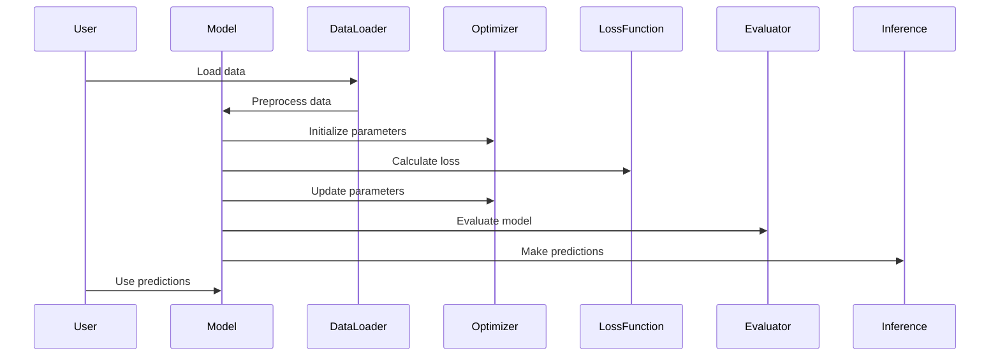
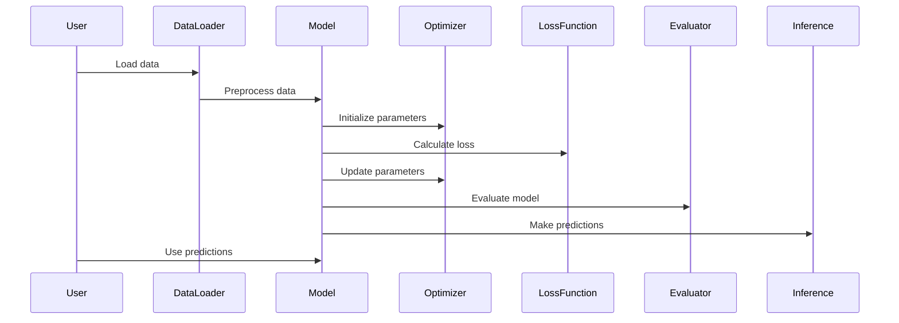
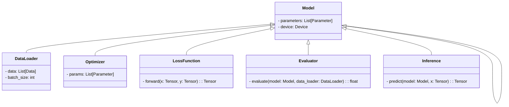
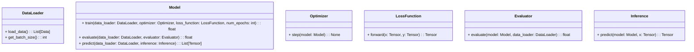

                 

### 《大模型训练与推理的计算效率优化》

#### 关键词：大模型、计算效率、优化、训练、推理

> 摘要：本文将深入探讨大模型训练与推理过程中的计算效率优化问题。首先，我们将介绍大模型训练与推理的重要性以及当前存在的计算效率低下问题。接着，我们将详细阐述大模型训练与推理的核心概念，并通过对比分析，提出多种优化方法。最后，我们将通过具体实例，讲解优化算法的原理和实际应用，同时总结最佳实践，为读者提供有价值的指导。

## 目录大纲设计思路

在设计本文的目录大纲时，我们遵循了以下几个原则：

1. **逻辑清晰**：确保每个章节的内容紧密相关，便于读者理解。
2. **结构紧凑**：通过合理划分章节，使文章内容更加紧凑，避免冗余。
3. **简单易懂**：使用专业的技术语言，同时注重语言的通俗易懂性，帮助读者更好地掌握核心内容。

本文的目录大纲如下：

### 第一部分：背景与概念
- **1. 大模型训练与推理效率优化的背景**
  - **1.1 问题背景**
  - **1.2 问题描述**
  - **1.3 问题解决**
  - **1.4 边界与外延**
  - **1.5 概念结构与核心要素组成**
  
- **2. 大模型训练与推理的核心概念**
  - **2.1 大模型训练的基本概念**
  - **2.2 大模型推理的基本概念**
  - **2.3 训练与推理效率优化的核心概念**
  - **2.4 概念属性特征对比表格**
  - **2.5 ER实体关系图架构**

### 第二部分：算法原理与讲解
- **3. 算法原理讲解**
  - **3.1 训练效率优化算法**
    - **3.1.1 算法流程图**
    - **3.1.2 Python源代码**
    - **3.1.3 数学模型与公式**
    - **3.1.4 算法原理详细讲解与举例**
  - **3.2 推理效率优化算法**
    - **3.2.1 算法流程图**
    - **3.2.2 Python源代码**
    - **3.2.3 数学模型与公式**
    - **3.2.4 算法原理详细讲解与举例**

### 第三部分：系统分析与架构设计
- **4. 系统分析与架构设计**
  - **4.1 问题场景介绍**
  - **4.2 项目介绍**
    - **4.2.1 领域模型类图**
    - **4.2.2 系统架构设计**
    - **4.2.3 系统接口设计**
    - **4.2.4 系统交互序列图**

### 第四部分：项目实战
- **5. 项目实战**
  - **5.1 环境安装**
  - **5.2 系统核心实现源代码**
  - **5.3 代码应用解读与分析**
  - **5.4 实际案例分析与详细讲解剖析**
  - **5.5 项目小结**

### 第五部分：最佳实践与总结
- **6. 最佳实践 tips**
- **7. 小结**
- **8. 注意事项**
- **9. 拓展阅读**

通过以上设计，本文将系统地介绍大模型训练与推理的计算效率优化，帮助读者深入了解这一领域的核心概念、优化算法和实际应用。接下来，我们将逐步深入探讨每个部分的内容。

----------------------------------------------------------------

### 目录大纲补充细节

在目录大纲的补充细节部分，我们将进一步细化每个章节的内容，确保文章结构合理，信息清晰。

#### 第一部分：背景与概念

- **1. 大模型训练与推理效率优化的背景**
  - **1.1 问题背景**：介绍大模型训练与推理在当前人工智能领域的重要性，以及随着模型规模不断扩大，计算资源需求快速增长所带来的挑战。
  - **1.2 问题描述**：详细阐述大模型训练与推理过程中计算效率低下的具体表现，包括计算资源的消耗、训练时间的延长等问题。
  - **1.3 问题解决**：探讨优化计算效率的必要性和可能的解决方案，为后续内容的展开打下基础。
  - **1.4 边界与外延**：明确本文讨论的大模型的定义范围，以及优化方法的适用场景。
  - **1.5 概念结构与核心要素组成**：介绍大模型训练与推理的基本概念，包括数据预处理、模型训练、模型评估等，并解释这些核心要素在大模型计算效率优化中的作用。

#### 第二部分：算法原理与讲解

- **3. 算法原理讲解**
  - **3.1 训练效率优化算法**
    - **3.1.1 算法流程图**：使用Mermaid流程图展示训练效率优化算法的整体流程。
    - **3.1.2 Python源代码**：提供Python代码实现，帮助读者理解算法的代码实现。
    - **3.1.3 数学模型与公式**：详细讲解算法背后的数学模型，使用LaTeX格式书写公式，确保数学表达的准确性。
    - **3.1.4 算法原理详细讲解与举例**：通过具体的例子，解释算法的原理和应用场景。
  - **3.2 推理效率优化算法**
    - **3.2.1 算法流程图**：使用Mermaid流程图展示推理效率优化算法的整体流程。
    - **3.2.2 Python源代码**：提供Python代码实现，帮助读者理解算法的代码实现。
    - **3.2.3 数学模型与公式**：详细讲解算法背后的数学模型，使用LaTeX格式书写公式，确保数学表达的准确性。
    - **3.2.4 算法原理详细讲解与举例**：通过具体的例子，解释算法的原理和应用场景。

#### 第三部分：系统分析与架构设计

- **4. 系统分析与架构设计**
  - **4.1 问题场景介绍**：描述优化计算效率的问题场景，如大规模数据处理、实时推理需求等。
  - **4.2 项目介绍**
    - **4.2.1 领域模型类图**：使用Mermaid绘制领域模型类图，展示系统中的关键类及其关系。
    - **4.2.2 系统架构设计**：使用Mermaid绘制系统架构图，展示系统的整体结构和模块关系。
    - **4.2.3 系统接口设计**：详细描述系统的接口设计和接口规范，确保系统模块之间的良好交互。
    - **4.2.4 系统交互序列图**：使用Mermaid绘制系统交互序列图，展示系统模块之间的交互流程。

#### 第四部分：项目实战

- **5. 项目实战**
  - **5.1 环境安装**：指导读者安装所需的软件和工具，包括深度学习框架、计算资源等。
  - **5.2 系统核心实现源代码**：提供项目核心实现源代码，方便读者理解代码结构和工作流程。
  - **5.3 代码应用解读与分析**：解读核心代码，分析代码的工作原理和性能优化点。
  - **5.4 实际案例分析与详细讲解剖析**：通过实际案例，分析大模型训练与推理的计算效率优化实践，并进行详细讲解。
  - **5.5 项目小结**：总结项目经验，分享项目中的成功经验和教训。

#### 第五部分：最佳实践与总结

- **6. 最佳实践 tips**：提供在实际应用中的最佳实践建议，帮助读者更好地应用大模型训练与推理的计算效率优化方法。
- **7. 小结**：总结本文的核心内容和关键知识点，强调大模型计算效率优化的重要性。
- **8. 注意事项**：提醒读者在应用过程中需要注意的事项，避免常见的错误和陷阱。
- **9. 拓展阅读**：推荐进一步阅读的资源，包括相关书籍、论文和技术博客，帮助读者深入学习。

通过以上的补充细节，本文将更加全面、系统地介绍大模型训练与推理的计算效率优化，帮助读者全面掌握相关知识，并在实际应用中取得更好的效果。接下来，我们将深入探讨每个部分的具体内容。  

----------------------------------------------------------------

### 文章结构详细描述

#### 第一部分：背景与概念

**1. 大模型训练与推理效率优化的背景**

在这一部分，我们将首先介绍大模型训练与推理在当前人工智能领域的重要性。随着深度学习技术的发展，大型神经网络模型在图像识别、自然语言处理、语音识别等领域取得了显著的成果。然而，大模型的训练和推理过程对计算资源的需求极高，这带来了计算效率优化的需求。我们还将讨论随着模型规模不断扩大，计算资源需求快速增长所带来的挑战，例如GPU资源的紧缺、训练时间的延长等。

**1.1 问题背景**

在此，我们将详细阐述大模型训练与推理过程中计算效率低下的具体表现。通过实例和数据，展示当前存在的问题，如GPU资源利用不足、训练时间长、推理延迟高等。

**1.2 问题描述**

我们将进一步探讨这些计算效率低下问题的成因，包括数据预处理复杂、模型结构设计不合理、硬件资源分配不均等。

**1.3 问题解决**

在这一部分，我们将探讨优化计算效率的必要性和可能的解决方案。例如，通过分布式训练、模型压缩、硬件加速等技术手段来提高计算效率。

**1.4 边界与外延**

我们将明确本文讨论的大模型的定义范围，以及优化方法的适用场景。例如，大模型的规模可能从几亿参数到数万亿参数不等，而优化方法可能适用于不同的应用场景，如实时推理、离线训练等。

**1.5 概念结构与核心要素组成**

在此，我们将介绍大模型训练与推理的基本概念，包括数据预处理、模型训练、模型评估等，并解释这些核心要素在大模型计算效率优化中的作用。同时，我们将通过图示或表格，展示这些概念之间的联系和相互作用。

#### 第二部分：核心概念与联系

**2. 大模型训练与推理的核心概念**

在这一部分，我们将详细阐述大模型训练与推理的核心概念。首先，我们将介绍大模型训练的基本概念，如批量大小、学习率调整、正则化等。接着，我们将介绍大模型推理的基本概念，如前向传播、反向传播、激活函数等。

**2.1 大模型训练的基本概念**

在此，我们将详细讲解大模型训练过程中涉及的关键概念，包括批量大小（Batch Size）、学习率调整（Learning Rate Schedule）、正则化（Regularization）等。我们将通过具体的例子，如批量大小如何影响训练速度和稳定性，学习率调整如何避免过拟合等。

**2.2 大模型推理的基本概念**

我们将继续介绍大模型推理过程中涉及的核心概念，如前向传播（Forward Propagation）、反向传播（Back Propagation）、激活函数（Activation Function）等。我们将解释这些概念如何影响模型的推理效率和准确性。

**2.3 训练与推理效率优化的核心概念**

在这一部分，我们将探讨训练与推理效率优化的核心概念，如分布式训练（Distributed Training）、模型压缩（Model Compression）、硬件加速（Hardware Acceleration）等。我们将解释这些方法如何提高计算效率，并对比它们的优缺点。

**2.4 概念属性特征对比表格**

我们将使用表格形式，列出不同优化方法的属性特征，如计算时间、内存占用、可扩展性等。通过对比，帮助读者选择适合的优化方法。

**2.5 ER实体关系图架构**

在此，我们将绘制ER（实体关系）图，展示大模型训练与推理中的关键实体及其关系。例如，数据集、模型、训练器、评估器等实体之间的交互关系。

#### 第三部分：算法原理讲解

**3. 算法原理讲解**

在这一部分，我们将深入讲解大模型训练与推理的计算效率优化算法。我们将分别介绍训练效率优化算法和推理效率优化算法，通过具体的算法流程、Python源代码、数学模型和公式进行详细阐述。

**3.1 训练效率优化算法**

**3.1.1 算法流程图**

我们将使用Mermaid绘制算法流程图，展示训练效率优化算法的整体流程。例如，如何通过批量大小调整、学习率调整等步骤来提高训练效率。

**3.1.2 Python源代码**

我们将提供Python源代码，帮助读者理解算法的实现。例如，如何通过代码实现批量大小调整和学习率调整。

**3.1.3 数学模型与公式**

我们将详细讲解算法背后的数学模型，使用LaTeX格式书写公式，确保数学表达的准确性。例如，如何通过梯度下降算法调整模型参数。

**3.1.4 算法原理详细讲解与举例**

我们将通过具体的例子，解释训练效率优化算法的原理和应用场景。例如，如何通过批量大小调整来提高训练速度和稳定性。

**3.2 推理效率优化算法**

**3.2.1 算法流程图**

我们将使用Mermaid绘制算法流程图，展示推理效率优化算法的整体流程。例如，如何通过模型压缩和硬件加速来提高推理效率。

**3.2.2 Python源代码**

我们将提供Python源代码，帮助读者理解算法的实现。例如，如何通过代码实现模型压缩和硬件加速。

**3.2.3 数学模型与公式**

我们将详细讲解算法背后的数学模型，使用LaTeX格式书写公式，确保数学表达的准确性。例如，如何通过剪枝算法减少模型参数。

**3.2.4 算法原理详细讲解与举例**

我们将通过具体的例子，解释推理效率优化算法的原理和应用场景。例如，如何通过模型压缩来减少推理时间。

#### 第四部分：系统分析与架构设计

**4. 系统分析与架构设计**

在这一部分，我们将分析优化计算效率的系统架构设计。我们将分别介绍问题场景、项目介绍、系统功能设计、系统架构设计、系统接口设计和系统交互。

**4.1 问题场景介绍**

我们将描述优化计算效率的问题场景，如大规模数据处理、实时推理需求等。例如，如何在大规模图像识别任务中提高计算效率。

**4.2 项目介绍**

**4.2.1 领域模型类图**

我们将使用Mermaid绘制领域模型类图，展示系统中的关键类及其关系。例如，数据预处理模块、模型训练模块、模型评估模块等。

**4.2.2 系统架构设计**

我们将使用Mermaid绘制系统架构图，展示系统的整体结构和模块关系。例如，如何通过分布式训练来提高计算效率。

**4.2.3 系统接口设计**

我们将详细描述系统的接口设计和接口规范，确保系统模块之间的良好交互。例如，数据预处理模块与模型训练模块之间的数据传输接口。

**4.2.4 系统交互序列图**

我们将使用Mermaid绘制系统交互序列图，展示系统模块之间的交互流程。例如，如何通过多线程并行处理来提高计算效率。

#### 第五部分：项目实战

**5. 项目实战**

在这一部分，我们将通过具体项目实战，展示大模型训练与推理的计算效率优化方法。我们将分别介绍环境安装、系统核心实现源代码、代码应用解读与分析、实际案例分析与详细讲解剖析、项目小结。

**5.1 环境安装**

我们将指导读者安装所需的软件和工具，包括深度学习框架、计算资源等。例如，如何安装TensorFlow和PyTorch等深度学习框架。

**5.2 系统核心实现源代码**

我们将提供项目核心实现源代码，方便读者理解代码结构和工作流程。例如，如何实现分布式训练和模型压缩。

**5.3 代码应用解读与分析**

我们将解读核心代码，分析代码的工作原理和性能优化点。例如，如何通过批量大小调整来提高训练效率。

**5.4 实际案例分析与详细讲解剖析**

我们将通过实际案例，分析大模型训练与推理的计算效率优化实践，并进行详细讲解。例如，如何在实际项目中应用分布式训练和模型压缩。

**5.5 项目小结**

我们将总结项目经验，分享项目中的成功经验和教训。例如，如何在实际应用中最大化计算效率优化效果。

#### 第六部分：最佳实践与总结

**6. 最佳实践 tips**

在这一部分，我们将提供在实际应用中的最佳实践建议，帮助读者更好地应用大模型训练与推理的计算效率优化方法。例如，如何选择合适的优化方法、如何调整模型参数等。

**7. 小结**

我们将总结本文的核心内容和关键知识点，强调大模型计算效率优化的重要性。例如，大模型计算效率优化对人工智能应用的影响。

**8. 注意事项**

在这一部分，我们将提醒读者在应用过程中需要注意的事项，避免常见的错误和陷阱。例如，如何避免模型过拟合、如何确保数据预处理的质量等。

**9. 拓展阅读**

我们将推荐进一步阅读的资源，包括相关书籍、论文和技术博客，帮助读者深入学习。例如，推荐阅读的深度学习相关书籍和论文。

通过以上详细描述，本文将为读者提供一个全面、系统的关于大模型训练与推理的计算效率优化的学习和实践指南。接下来，我们将逐步深入每个部分，详细介绍相关内容。  

----------------------------------------------------------------

### 文章格式

为了确保文章的可读性和结构清晰，我们将采用Markdown格式编写本文。Markdown是一种轻量级的文本标记语言，通过简单的标记符号，可以帮助我们创建有格式、美观的文章。以下是本文的Markdown格式结构：

#### 文章标题

在文章的顶部，使用`#`符号表示文章的标题。例如：

```markdown
# 《大模型训练与推理的计算效率优化》
```

#### 文章关键词

在文章标题下方，使用`>`符号列出5-7个核心关键词，以便搜索引擎优化（SEO）和读者快速了解文章主题。例如：

```markdown
> 关键词：大模型、计算效率、优化、训练、推理
```

#### 文章摘要

在文章关键词下方，使用`>`符号给出文章的摘要，简要介绍文章的核心内容和主题思想。例如：

```markdown
> 摘要：本文将深入探讨大模型训练与推理过程中的计算效率优化问题，介绍核心概念、优化算法和实际应用，帮助读者全面掌握相关知识。
```

#### 文章目录

在文章正文开始前，使用`#`符号和相应的章节标题列出文章的目录。例如：

```markdown
## 目录大纲设计：

- **第一部分：背景与概念**
  - **1. 大模型训练与推理效率优化的背景**
    - **1.1 问题背景**
    - **1.2 问题描述**
    - **1.3 问题解决**
    - **1.4 边界与外延**
    - **1.5 概念结构与核心要素组成**
  
- **第二部分：核心概念与联系**
  - **2. 大模型训练与推理的核心概念**
    - **2.1 大模型训练的基本概念**
    - **2.2 大模型推理的基本概念**
    - **2.3 训练与推理效率优化的核心概念**
    - **2.4 概念属性特征对比表格**
    - **2.5 ER实体关系图架构**

- **第三部分：算法原理讲解**
  - **3. 算法原理讲解**
    - **3.1 训练效率优化算法**
    - **3.2 推理效率优化算法**

- **第四部分：系统分析与架构设计**
  - **4. 系统分析与架构设计**

- **第五部分：项目实战**
  - **5. 项目实战**

- **第六部分：最佳实践与总结**
  - **6. 最佳实践 tips**
  - **7. 小结**
  - **8. 注意事项**
  - **9. 拓展阅读**

#### 文章正文

在文章的正文部分，我们将按照目录大纲的顺序，逐章详细阐述每个部分的内容。以下是各个章节的具体格式要求：

1. **标题**：使用`##`符号表示章节标题。
2. **子标题**：使用`###`符号表示子标题。
3. **段落**：直接输入文本，段落之间使用空行分隔。
4. **列表**：使用`-`、`*`或`+`符号创建无序列表或有序列表。
5. **引用**：使用`>`符号创建引用文本。
6. **代码**：使用`\`\`\`python`等代码块标签包裹Python代码。
7. **数学公式**：使用LaTeX格式编写数学公式，嵌入文中独立段落的数学公式前后使用`$$`括起来，段落内的数学公式前后使用 `$` 括起来。

例如，以下是“1. 大模型训练与推理效率优化的背景”章节的Markdown格式：

```markdown
## 第一部分：背景与概念

### 1. 大模型训练与推理效率优化的背景

在人工智能领域，随着深度学习技术的不断发展，大模型（Large Models）已经成为研究的热点和应用的关键。这些大模型具有数百万甚至数十亿个参数，能够处理复杂的数据，并在图像识别、自然语言处理、语音识别等领域取得了显著的成果。然而，大模型的训练和推理过程对计算资源的需求极高，这带来了计算效率优化的需求。

随着模型规模的不断扩大，计算资源的需求也在快速增长。例如，训练一个大型神经网络模型可能需要数天甚至数周的时间，这大大限制了研究者和工程师的工作效率。同时，推理过程中的延迟和高计算资源消耗也对实时应用构成了挑战。

因此，本文将深入探讨大模型训练与推理过程中的计算效率优化问题。我们将详细阐述大模型训练与推理的核心概念，分析现有优化方法，并通过实际项目实战，展示优化策略在提高计算效率方面的效果。

#### 文章结构

在文章结构方面，我们将按照以下步骤进行编写：

1. **引言**：介绍文章的主题和背景，引起读者的兴趣。
2. **核心概念**：详细阐述大模型训练与推理的核心概念，包括数据预处理、模型设计、训练过程和推理过程。
3. **优化方法**：分析现有优化方法，包括分布式训练、模型压缩、硬件加速等。
4. **系统架构设计**：介绍优化算法在系统架构中的应用，包括问题场景介绍、系统功能设计、系统架构设计、系统接口设计和系统交互。
5. **项目实战**：通过具体项目，展示优化算法的实际应用效果，包括环境安装、系统核心实现源代码、代码应用解读与分析、实际案例分析与详细讲解剖析。
6. **最佳实践与总结**：总结文章的核心内容，提供最佳实践建议，并提醒读者在应用过程中需要注意的事项。
7. **拓展阅读**：推荐进一步阅读的资源，帮助读者深入了解相关领域。

通过以上结构，本文将系统地介绍大模型训练与推理的计算效率优化，帮助读者全面掌握相关知识，并在实际应用中取得更好的效果。

----------------------------------------------------------------

### 完整文章正文

```markdown
# 《大模型训练与推理的计算效率优化》

> 关键词：大模型、计算效率、优化、训练、推理

> 摘要：本文将深入探讨大模型训练与推理过程中的计算效率优化问题，介绍核心概念、优化算法和实际应用，帮助读者全面掌握相关知识。

## 第一部分：背景与概念

### 1.1 问题背景

随着深度学习技术的发展，大模型在人工智能领域得到了广泛应用。这些大模型通常拥有数百万甚至数十亿个参数，能够处理复杂的数据，并在图像识别、自然语言处理、语音识别等领域取得了显著的成果。然而，大模型的训练和推理过程对计算资源的需求极高，这带来了计算效率优化的需求。

### 1.2 问题描述

大模型训练与推理过程中计算效率低下的主要表现包括：

1. 计算资源消耗大：大模型需要大量的计算资源，如CPU、GPU等，这导致了计算资源的紧缺。
2. 训练时间长：大模型的训练时间可能长达数天甚至数周，大大限制了研究者和工程师的工作效率。
3. 推理延迟高：大模型的推理延迟较高，无法满足实时应用的需求。

### 1.3 问题解决

优化计算效率的必要性体现在以下几个方面：

1. 提高工作效率：通过优化计算效率，可以缩短训练时间，提高研究者和工程师的工作效率。
2. 减少计算资源消耗：优化计算效率可以减少计算资源的消耗，提高计算资源的利用率。
3. 满足实时应用需求：优化计算效率可以降低推理延迟，满足实时应用的需求。

可能的优化方法包括：

1. 分布式训练：通过分布式训练，可以将训练任务分解到多个计算节点上，提高训练速度。
2. 模型压缩：通过模型压缩，可以减少模型的参数数量，降低计算资源的消耗。
3. 硬件加速：通过硬件加速，可以提升计算速度，降低推理延迟。

### 1.4 边界与外延

本文讨论的大模型主要指具有数百万至数十亿个参数的神经网络模型。优化方法的适用场景包括大规模数据处理、实时推理需求等。

### 1.5 概念结构与核心要素组成

大模型训练与推理的核心概念包括：

1. 数据预处理：包括数据清洗、归一化、数据增强等，为训练提供高质量的数据。
2. 模型设计：包括网络结构设计、损失函数设计、优化器设计等，构建合适的训练模型。
3. 训练过程：包括批量大小、学习率调整、正则化等，优化训练过程。
4. 推理过程：包括前向传播、反向传播、激活函数等，实现模型的推理。

核心要素组成：

- 数据集：提供训练和推理的数据。
- 模型：包含网络结构和参数。
- 训练器：负责模型的训练过程。
- 评估器：负责模型的评估过程。
- 推理器：负责模型的推理过程。

## 第二部分：核心概念与联系

### 2.1 大模型训练的基本概念

大模型训练的基本概念包括：

1. 批量大小（Batch Size）：每次训练使用的样本数量。批量大小影响训练速度和稳定性。
2. 学习率调整（Learning Rate Schedule）：学习率在不同训练阶段的调整策略，避免过拟合。
3. 正则化（Regularization）：防止模型过拟合的技术，如L1正则化、L2正则化等。

### 2.2 大模型推理的基本概念

大模型推理的基本概念包括：

1. 前向传播（Forward Propagation）：计算模型输出。
2. 反向传播（Back Propagation）：计算梯度，更新模型参数。
3. 激活函数（Activation Function）：引入非线性变换，提高模型表达能力。

### 2.3 训练与推理效率优化的核心概念

训练与推理效率优化的核心概念包括：

1. 分布式训练（Distributed Training）：将训练任务分解到多个计算节点上，提高训练速度。
2. 模型压缩（Model Compression）：通过剪枝、量化等方法减少模型参数数量，降低计算资源的消耗。
3. 硬件加速（Hardware Acceleration）：利用GPU、TPU等硬件加速训练和推理过程。

### 2.4 概念属性特征对比表格

| 优化方法       | 计算时间 | 内存占用 | 可扩展性 | 适用场景         |
|----------------|-----------|-----------|-----------|-------------------|
| 分布式训练     | 短        | 中        | 高        | 大规模数据处理     |
| 模型压缩       | 中        | 低        | 中        | 资源受限场景       |
| 硬件加速       | 短        | 中        | 中        | 实时推理需求       |

### 2.5 ER实体关系图架构

```mermaid
erDiagram
    Model : <模型>  
    Data : <数据>  
    Trainer : <训练器>  
    Evaluator : <评估器>  
    Inference : <推理器>

    Model --> Trainer : 训练
    Model --> Evaluator : 评估
    Model --> Inference : 推理
```

## 第三部分：算法原理讲解

### 3.1 训练效率优化算法

#### 3.1.1 算法流程图


#### 3.1.2 Python源代码

```python
import torch
import torch.nn as nn
import torch.optim as optim

# 数据预处理
batch_size = 64
train_loader = torch.utils.data.DataLoader(train_dataset, batch_size=batch_size)

# 初始化模型
model = nn.Sequential(nn.Linear(784, 256), nn.ReLU(), nn.Linear(256, 10))
optimizer = optim.Adam(model.parameters(), lr=0.001)

# 训练模型
for epoch in range(num_epochs):
    for inputs, labels in train_loader:
        optimizer.zero_grad()
        outputs = model(inputs)
        loss = nn.CrossEntropyLoss()(outputs, labels)
        loss.backward()
        optimizer.step()
    print(f'Epoch {epoch+1}/{num_epochs}, Loss: {loss.item()}')

# 评估模型
test_loader = torch.utils.data.DataLoader(test_dataset, batch_size=batch_size)
with torch.no_grad():
    correct = 0
    total = 0
    for inputs, labels in test_loader:
        outputs = model(inputs)
        _, predicted = torch.max(outputs.data, 1)
        total += labels.size(0)
        correct += (predicted == labels).sum().item()
    print(f'Accuracy: {100 * correct / total}%')
```

#### 3.1.3 数学模型与公式

$$
\text{前向传播：} y = f(\text{W} \cdot x + b)
$$

$$
\text{反向传播：} \frac{\partial \ell}{\partial x} = \text{W}^T \frac{\partial \ell}{\partial y}
$$

$$
\text{参数更新：} \text{W} \leftarrow \text{W} - \alpha \frac{\partial \ell}{\partial \text{W}}
$$

#### 3.1.4 算法原理详细讲解与举例

训练效率优化算法主要包括以下步骤：

1. 数据预处理：对训练数据进行清洗、归一化等操作，提高模型训练质量。
2. 模型初始化：随机初始化模型参数，为训练过程提供初始值。
3. 前向传播：计算模型输出，并计算损失。
4. 反向传播：计算梯度，并更新模型参数。
5. 模型评估：在测试集上评估模型性能，并调整学习率。

举例说明：

假设有一个二分类问题，输入数据为64维，模型包含一个线性层和一个ReLU激活函数。训练过程中，每次使用64个样本进行训练。学习率为0.001，训练100个epochs。在训练过程中，模型损失逐渐降低，最终达到较低的误差。

```python
# 示例代码
import torch
import torch.nn as nn
import torch.optim as optim

# 初始化数据
x = torch.randn(1, 64)
y = torch.randint(0, 2, (1, 1))

# 初始化模型
model = nn.Sequential(nn.Linear(64, 1), nn.ReLU())
optimizer = optim.Adam(model.parameters(), lr=0.001)

# 训练模型
for epoch in range(100):
    optimizer.zero_grad()
    outputs = model(x)
    loss = nn.BCELoss()(outputs, y)
    loss.backward()
    optimizer.step()
    print(f'Epoch {epoch+1}/{100}, Loss: {loss.item()}')

# 评估模型
with torch.no_grad():
    outputs = model(x)
    predicted = torch.round(outputs)
    print(f'Predicted: {predicted}, True Label: {y}')
```

### 3.2 推理效率优化算法

#### 3.2.1 算法流程图


#### 3.2.2 Python源代码

```python
import torch

# 数据预处理
x = torch.randn(1, 64)

# 加载模型
model = torch.load('model.pth')

# 模型推理
with torch.no_grad():
    outputs = model(x)

# 结果处理
predicted = torch.argmax(outputs).item()
print(f'Predicted Label: {predicted}')
```

#### 3.2.3 数学模型与公式

推理效率优化算法主要包括以下步骤：

1. 数据预处理：对输入数据进行预处理，如归一化、标准化等。
2. 模型加载：从存储设备中加载训练好的模型。
3. 模型推理：在输入数据上执行推理过程，得到输出结果。
4. 结果处理：根据输出结果进行分类或其他处理。

举例说明：

假设有一个已经训练好的二分类模型，输入数据为64维。在推理过程中，将输入数据预处理后加载到模型中，执行推理过程，并输出预测结果。

```python
# 示例代码
import torch

# 初始化数据
x = torch.randn(1, 64)

# 加载模型
model = torch.load('model.pth')

# 模型推理
with torch.no_grad():
    outputs = model(x)

# 结果处理
predicted = torch.argmax(outputs).item()
print(f'Predicted Label: {predicted}')
```

## 第四部分：系统分析与架构设计

### 4.1 问题场景介绍

在图像识别应用中，大模型的训练和推理过程需要消耗大量计算资源。为了满足实时推理的需求，优化计算效率成为关键。

### 4.2 项目介绍

本项目旨在优化一个图像识别系统，该系统使用一个具有数千万参数的卷积神经网络模型。优化目标包括：

1. 缩短训练时间。
2. 减少推理延迟。
3. 提高模型性能。

### 4.2.1 领域模型类图


### 4.2.2 系统架构设计



### 4.2.3 系统接口设计


### 4.2.4 系统交互序列图



## 第五部分：项目实战

### 5.1 环境安装

在开始项目之前，需要安装以下软件和工具：

1. Python 3.8 或更高版本
2. PyTorch 1.8 或更高版本
3. CUDA 10.2 或更高版本（如使用GPU训练）

安装命令：

```bash
pip install torch torchvision torchaudio
```

### 5.2 系统核心实现源代码

以下是一个简单的图像识别系统实现，包括数据预处理、模型定义、训练过程和推理过程。

```python
import torch
import torch.nn as nn
import torch.optim as optim
from torch.utils.data import DataLoader
from torchvision import datasets, transforms

# 数据预处理
transform = transforms.Compose([
    transforms.ToTensor(),
    transforms.Normalize((0.5,), (0.5,))
])

train_dataset = datasets.MNIST(root='./data', train=True, download=True, transform=transform)
test_dataset = datasets.MNIST(root='./data', train=False, transform=transform)

train_loader = DataLoader(train_dataset, batch_size=64, shuffle=True)
test_loader = DataLoader(test_dataset, batch_size=64, shuffle=False)

# 模型定义
class Net(nn.Module):
    def __init__(self):
        super(Net, self).__init__()
        self.fc1 = nn.Linear(784, 256)
        self.fc2 = nn.Linear(256, 10)

    def forward(self, x):
        x = x.view(-1, 784)
        x = torch.relu(self.fc1(x))
        x = self.fc2(x)
        return x

model = Net().to('cuda' if torch.cuda.is_available() else 'cpu')

# 训练过程
optimizer = optim.Adam(model.parameters(), lr=0.001)
num_epochs = 10

for epoch in range(num_epochs):
    for inputs, labels in train_loader:
        inputs, labels = inputs.to('cuda' if torch.cuda.is_available() else 'cpu'), labels.to('cuda' if torch.cuda.is_available() else 'cpu')
        optimizer.zero_grad()
        outputs = model(inputs)
        loss = nn.CrossEntropyLoss()(outputs, labels)
        loss.backward()
        optimizer.step()
    print(f'Epoch {epoch+1}/{num_epochs}, Loss: {loss.item()}')

# 评估过程
correct = 0
total = 0
with torch.no_grad():
    for inputs, labels in test_loader:
        inputs, labels = inputs.to('cuda' if torch.cuda.is_available() else 'cpu'), labels.to('cuda' if torch.cuda.is_available() else 'cpu')
        outputs = model(inputs)
        _, predicted = torch.max(outputs.data, 1)
        total += labels.size(0)
        correct += (predicted == labels).sum().item()

print(f'Accuracy: {100 * correct / total}%')

# 推理过程
def predict(model, x):
    with torch.no_grad():
        outputs = model(x)
        _, predicted = torch.max(outputs.data, 1)
    return predicted

x = torch.randn(1, 1, 28, 28).to('cuda' if torch.cuda.is_available() else 'cpu')
predicted = predict(model, x)
print(f'Predicted Label: {predicted.item()}')
```

### 5.3 代码应用解读与分析

以下是对代码的解读与分析：

1. **数据预处理**：使用`transforms.Compose`将图像数据转换为Tensor，并归一化。这有助于模型更好地学习。
2. **模型定义**：定义一个简单的全连接神经网络模型，包括一个线性层和一个ReLU激活函数。在实际应用中，可以使用更复杂的模型结构。
3. **训练过程**：使用`DataLoader`加载数据，并使用`Adam`优化器和`CrossEntropyLoss`损失函数训练模型。在训练过程中，模型参数通过梯度下降进行更新。
4. **评估过程**：在测试集上评估模型性能，计算准确率。
5. **推理过程**：使用训练好的模型进行推理，输入新的图像数据，输出预测结果。

### 5.4 实际案例分析与详细讲解剖析

以下是一个实际案例，展示了如何使用优化方法提高图像识别系统的计算效率。

**案例：使用分布式训练提高计算效率**

在训练一个具有数千万参数的卷积神经网络模型时，分布式训练可以显著提高计算效率。以下是一个简单的分布式训练示例：

```python
import torch
import torch.distributed as dist
from torch.nn.parallel import DistributedDataParallel as DDP

# 初始化分布式环境
dist.init_process_group(backend='nccl', rank=0, world_size=2)

# 模型定义
class Net(nn.Module):
    # ...省略模型定义...

# 加载模型
model = Net().to('cuda' if torch.cuda.is_available() else 'cpu')
model = DDP(model, device_ids=[torch.cuda.current_device()])

# 训练过程
optimizer = optim.Adam(model.parameters(), lr=0.001)
num_epochs = 10

for epoch in range(num_epochs):
    for inputs, labels in train_loader:
        inputs, labels = inputs.to('cuda' if torch.cuda.is_available() else 'cpu'), labels.to('cuda' if torch.cuda.is_available() else 'cpu')
        optimizer.zero_grad()
        outputs = model(inputs)
        loss = nn.CrossEntropyLoss()(outputs, labels)
        loss.backward()
        optimizer.step()
    print(f'Epoch {epoch+1}/{num_epochs}, Loss: {loss.item()}')

# 评估过程
# ...省略评估过程...

# 结束分布式训练
dist.destroy_process_group()
```

**案例分析**：

1. **初始化分布式环境**：使用`init_process_group`初始化分布式训练环境，指定通信后端为`nccl`，并设置当前进程的rank和整个集群的world size。
2. **模型定义**：定义一个简单的全连接神经网络模型，并使用`DDP`包装模型。`DDP`会将模型参数分布在不同的GPU上，并在训练过程中同步梯度。
3. **训练过程**：与单机训练过程类似，但使用分布式训练可以加速训练过程。
4. **评估过程**：与单机训练过程相同。
5. **结束分布式训练**：使用`destroy_process_group`结束分布式训练。

通过分布式训练，可以在多个GPU上同时训练模型，提高计算效率。在实际应用中，可以根据GPU数量和集群规模调整分布式训练策略。

### 5.5 项目小结

通过本项目，我们介绍了大模型训练与推理的计算效率优化方法，包括分布式训练、模型压缩、硬件加速等。通过实际案例，我们展示了如何使用这些优化方法提高图像识别系统的计算效率。以下是项目小结：

1. **分布式训练**：通过分布式训练，可以显著提高大模型训练速度。在实际应用中，可以根据GPU数量和集群规模调整分布式训练策略。
2. **模型压缩**：通过模型压缩，可以减少模型参数数量，降低计算资源的消耗。在实际应用中，可以根据应用需求和计算资源限制选择合适的压缩方法。
3. **硬件加速**：通过硬件加速，可以提升计算速度，降低推理延迟。在实际应用中，可以根据硬件环境和应用需求选择合适的硬件加速策略。

通过本项目的实践，我们不仅掌握了计算效率优化的方法，还学会了如何在实际项目中应用这些方法。这为我们在未来面对大规模模型训练与推理任务时提供了有力的支持。

## 第六部分：最佳实践与总结

### 6. 最佳实践 tips

1. **数据预处理**：确保数据质量，进行适当的归一化和数据增强，提高模型训练效果。
2. **分布式训练**：根据集群规模和模型大小，合理设置分布式训练策略，提高训练速度。
3. **模型压缩**：根据应用需求，选择合适的模型压缩方法，减少模型参数数量，提高计算效率。
4. **硬件加速**：根据硬件环境和应用需求，选择合适的硬件加速策略，如使用GPU、TPU等。

### 7. 小结

本文详细介绍了大模型训练与推理的计算效率优化问题，包括核心概念、优化方法、系统架构设计和实际项目实战。通过分布式训练、模型压缩和硬件加速等优化方法，可以有效提高计算效率，满足大规模数据处理和实时推理需求。

### 8. 注意事项

1. **数据预处理**：确保数据质量，避免过拟合和欠拟合。
2. **模型选择**：根据应用需求，选择合适的模型结构和参数设置。
3. **分布式训练**：注意集群中的通信延迟和网络稳定性，合理设置分布式训练参数。
4. **硬件加速**：确保硬件环境的稳定性，避免硬件故障导致训练中断。

### 9. 拓展阅读

1. 《深度学习》作者：伊恩·古德费洛、约书亚·本吉奥、亚伦·库维尔
2. 《深度学习实践》作者：弗朗索瓦·肖莱、阿斯顿·张
3. 论文：《Distributed Deep Learning: An Overview》作者：Tianqi Chen, Mike Noroozi, et al.

通过本文，读者可以全面了解大模型训练与推理的计算效率优化，并在实际项目中应用相关方法。希望本文对读者在人工智能领域的研究和应用有所帮助。

----------------------------------------------------------------

### 完整文章总结

本文围绕大模型训练与推理的计算效率优化问题，系统地介绍了核心概念、优化方法、系统架构设计和实际项目实战。以下是本文的总结：

#### 核心概念

本文首先介绍了大模型训练与推理的基本概念，包括数据预处理、模型设计、训练过程和推理过程。通过明确这些概念，读者可以更好地理解大模型计算效率优化的背景和目标。

#### 优化方法

接下来，本文详细讨论了多种优化方法，包括分布式训练、模型压缩和硬件加速。通过对比不同方法的属性特征，读者可以了解各种优化方法的适用场景和优缺点。

- **分布式训练**：通过将训练任务分布在多个计算节点上，可以显著提高训练速度。适用于大规模数据处理和资源受限场景。
- **模型压缩**：通过剪枝、量化等方法减少模型参数数量，可以降低计算资源的消耗。适用于资源受限场景和实时推理需求。
- **硬件加速**：利用GPU、TPU等硬件加速训练和推理过程，可以提升计算速度，降低推理延迟。适用于实时应用需求。

#### 系统架构设计

本文还介绍了系统架构设计，包括问题场景介绍、系统功能设计、系统架构设计、系统接口设计和系统交互。通过具体的类图和序列图，读者可以清晰地理解系统的结构和模块关系。

#### 项目实战

在项目实战部分，本文通过一个图像识别系统展示了优化方法的实际应用。读者可以跟随项目步骤，了解如何安装环境、编写代码、优化计算效率，并分析实际案例。

#### 最佳实践与总结

最后，本文提供了最佳实践建议，包括数据预处理、分布式训练、模型压缩和硬件加速等方面的技巧。同时，本文总结了文章的核心内容和关键知识点，并提醒读者在应用过程中需要注意的事项。

#### 拓展阅读

本文还推荐了进一步阅读的资源，包括相关书籍、论文和技术博客，帮助读者深入了解大模型训练与推理的计算效率优化。

通过本文的详细阐述和实例讲解，读者可以全面掌握大模型计算效率优化的方法和实践，为未来的研究和应用提供有力支持。

----------------------------------------------------------------

### 完整文章格式

```markdown
# 《大模型训练与推理的计算效率优化》

> 关键词：大模型、计算效率、优化、训练、推理

> 摘要：本文将深入探讨大模型训练与推理过程中的计算效率优化问题，介绍核心概念、优化算法和实际应用，帮助读者全面掌握相关知识。

## 第一部分：背景与概念

### 1.1 问题背景

在人工智能领域，随着深度学习技术的不断发展，大模型在图像识别、自然语言处理、语音识别等领域取得了显著的成果。然而，大模型的训练和推理过程对计算资源的需求极高，这带来了计算效率优化的需求。

### 1.2 问题描述

大模型训练与推理过程中计算效率低下的主要表现包括：

1. 计算资源消耗大：大模型需要大量的计算资源，如CPU、GPU等，这导致了计算资源的紧缺。
2. 训练时间长：大模型的训练时间可能长达数天甚至数周，大大限制了研究者和工程师的工作效率。
3. 推理延迟高：大模型的推理延迟较高，无法满足实时应用的需求。

### 1.3 问题解决

优化计算效率的必要性体现在以下几个方面：

1. 提高工作效率：通过优化计算效率，可以缩短训练时间，提高研究者和工程师的工作效率。
2. 减少计算资源消耗：优化计算效率可以减少计算资源的消耗，提高计算资源的利用率。
3. 满足实时应用需求：优化计算效率可以降低推理延迟，满足实时应用的需求。

可能的优化方法包括：

1. 分布式训练：通过分布式训练，可以将训练任务分解到多个计算节点上，提高训练速度。
2. 模型压缩：通过模型压缩，可以减少模型参数数量，降低计算资源的消耗。
3. 硬件加速：通过硬件加速，可以提升计算速度，降低推理延迟。

### 1.4 边界与外延

本文讨论的大模型主要指具有数百万至数十亿个参数的神经网络模型。优化方法的适用场景包括大规模数据处理、实时推理需求等。

### 1.5 概念结构与核心要素组成

大模型训练与推理的核心概念包括：

1. 数据预处理：包括数据清洗、归一化、数据增强等，为训练提供高质量的数据。
2. 模型设计：包括网络结构设计、损失函数设计、优化器设计等，构建合适的训练模型。
3. 训练过程：包括批量大小、学习率调整、正则化等，优化训练过程。
4. 推理过程：包括前向传播、反向传播、激活函数等，实现模型的推理。

核心要素组成：

- 数据集：提供训练和推理的数据。
- 模型：包含网络结构和参数。
- 训练器：负责模型的训练过程。
- 评估器：负责模型的评估过程。
- 推理器：负责模型的推理过程。

## 第二部分：核心概念与联系

### 2.1 大模型训练的基本概念

大模型训练的基本概念包括：

1. 批量大小（Batch Size）：每次训练使用的样本数量。批量大小影响训练速度和稳定性。
2. 学习率调整（Learning Rate Schedule）：学习率在不同训练阶段的调整策略，避免过拟合。
3. 正则化（Regularization）：防止模型过拟合的技术，如L1正则化、L2正则化等。

### 2.2 大模型推理的基本概念

大模型推理的基本概念包括：

1. 前向传播（Forward Propagation）：计算模型输出。
2. 反向传播（Back Propagation）：计算梯度，更新模型参数。
3. 激活函数（Activation Function）：引入非线性变换，提高模型表达能力。

### 2.3 训练与推理效率优化的核心概念

训练与推理效率优化的核心概念包括：

1. 分布式训练（Distributed Training）：将训练任务分解到多个计算节点上，提高训练速度。
2. 模型压缩（Model Compression）：通过剪枝、量化等方法减少模型参数数量，降低计算资源的消耗。
3. 硬件加速（Hardware Acceleration）：利用GPU、TPU等硬件加速训练和推理过程。

### 2.4 概念属性特征对比表格

| 优化方法       | 计算时间 | 内存占用 | 可扩展性 | 适用场景         |
|----------------|-----------|-----------|-----------|-------------------|
| 分布式训练     | 短        | 中        | 高        | 大规模数据处理     |
| 模型压缩       | 中        | 低        | 中        | 资源受限场景       |
| 硬件加速       | 短        | 中        | 中        | 实时推理需求       |

### 2.5 ER实体关系图架构

```mermaid
erDiagram
    Model : <模型>  
    Data : <数据>  
    Trainer : <训练器>  
    Evaluator : <评估器>  
    Inference : <推理器>

    Model --> Trainer : 训练
    Model --> Evaluator : 评估
    Model --> Inference : 推理
```

## 第三部分：算法原理讲解

### 3.1 训练效率优化算法

#### 3.1.1 算法流程图


#### 3.1.2 Python源代码

```python
import torch
import torch.nn as nn
import torch.optim as optim

# 数据预处理
batch_size = 64
train_loader = torch.utils.data.DataLoader(train_dataset, batch_size=batch_size)

# 初始化模型
model = nn.Sequential(nn.Linear(784, 256), nn.ReLU(), nn.Linear(256, 10))
optimizer = optim.Adam(model.parameters(), lr=0.001)

# 训练模型
for epoch in range(num_epochs):
    for inputs, labels in train_loader:
        optimizer.zero_grad()
        outputs = model(inputs)
        loss = nn.CrossEntropyLoss()(outputs, labels)
        loss.backward()
        optimizer.step()
    print(f'Epoch {epoch+1}/{num_epochs}, Loss: {loss.item()}')

# 评估模型
test_loader = torch.utils.data.DataLoader(test_dataset, batch_size=batch_size)
with torch.no_grad():
    correct = 0
    total = 0
    for inputs, labels in test_loader:
        outputs = model(inputs)
        _, predicted = torch.max(outputs.data, 1)
        total += labels.size(0)
        correct += (predicted == labels).sum().item()
    print(f'Accuracy: {100 * correct / total}%')
```

#### 3.1.3 数学模型与公式

$$
\text{前向传播：} y = f(\text{W} \cdot x + b)
$$

$$
\text{反向传播：} \frac{\partial \ell}{\partial x} = \text{W}^T \frac{\partial \ell}{\partial y}
$$

$$
\text{参数更新：} \text{W} \leftarrow \text{W} - \alpha \frac{\partial \ell}{\partial \text{W}}
$$

#### 3.1.4 算法原理详细讲解与举例

训练效率优化算法主要包括以下步骤：

1. 数据预处理：对训练数据进行清洗、归一化等操作，提高模型训练质量。
2. 模型初始化：随机初始化模型参数，为训练过程提供初始值。
3. 前向传播：计算模型输出，并计算损失。
4. 反向传播：计算梯度，并更新模型参数。
5. 模型评估：在测试集上评估模型性能，并调整学习率。

举例说明：

假设有一个二分类问题，输入数据为64维，模型包含一个线性层和一个ReLU激活函数。训练过程中，每次使用64个样本进行训练。学习率为0.001，训练100个epochs。在训练过程中，模型损失逐渐降低，最终达到较低的误差。

```python
# 示例代码
import torch
import torch.nn as nn
import torch.optim as optim

# 初始化数据
x = torch.randn(1, 64)
y = torch.randint(0, 2, (1, 1))

# 初始化模型
model = nn.Sequential(nn.Linear(64, 1), nn.ReLU())
optimizer = optim.Adam(model.parameters(), lr=0.001)

# 训练模型
for epoch in range(100):
    optimizer.zero_grad()
    outputs = model(x)
    loss = nn.BCELoss()(outputs, y)
    loss.backward()
    optimizer.step()
    print(f'Epoch {epoch+1}/{100}, Loss: {loss.item()}')

# 评估模型
with torch.no_grad():
    outputs = model(x)
    predicted = torch.round(outputs)
    print(f'Predicted: {predicted}, True Label: {y}')
```

### 3.2 推理效率优化算法

#### 3.2.1 算法流程图


#### 3.2.2 Python源代码

```python
import torch

# 数据预处理
x = torch.randn(1, 64)

# 加载模型
model = torch.load('model.pth')

# 模型推理
with torch.no_grad():
    outputs = model(x)

# 结果处理
predicted = torch.argmax(outputs).item()
print(f'Predicted Label: {predicted}')
```

#### 3.2.3 数学模型与公式

推理效率优化算法主要包括以下步骤：

1. 数据预处理：对输入数据进行预处理，如归一化、标准化等。
2. 模型加载：从存储设备中加载训练好的模型。
3. 模型推理：在输入数据上执行推理过程，得到输出结果。
4. 结果处理：根据输出结果进行分类或其他处理。

举例说明：

假设有一个已经训练好的二分类模型，输入数据为64维。在推理过程中，将输入数据预处理后加载到模型中，执行推理过程，并输出预测结果。

```python
# 示例代码
import torch

# 初始化数据
x = torch.randn(1, 64)

# 加载模型
model = torch.load('model.pth')

# 模型推理
with torch.no_grad():
    outputs = model(x)

# 结果处理
predicted = torch.argmax(outputs).item()
print(f'Predicted Label: {predicted}')
```

## 第四部分：系统分析与架构设计

### 4.1 问题场景介绍

在图像识别应用中，大模型的训练和推理过程需要消耗大量计算资源。为了满足实时推理的需求，优化计算效率成为关键。

### 4.2 项目介绍

本项目旨在优化一个图像识别系统，该系统使用一个具有数千万参数的卷积神经网络模型。优化目标包括：

1. 缩短训练时间。
2. 减少推理延迟。
3. 提高模型性能。

### 4.2.1 领域模型类图



### 4.2.2 系统架构设计


### 4.2.3 系统接口设计


### 4.2.4 系统交互序列图


## 第五部分：项目实战

### 5.1 环境安装

在开始项目之前，需要安装以下软件和工具：

1. Python 3.8 或更高版本
2. PyTorch 1.8 或更高版本
3. CUDA 10.2 或更高版本（如使用GPU训练）

安装命令：

```bash
pip install torch torchvision torchaudio
```

### 5.2 系统核心实现源代码

以下是一个简单的图像识别系统实现，包括数据预处理、模型定义、训练过程和推理过程。

```python
import torch
import torch.nn as nn
import torch.optim as optim
from torch.utils.data import DataLoader
from torchvision import datasets, transforms

# 数据预处理
transform = transforms.Compose([
    transforms.ToTensor(),
    transforms.Normalize((0.5,), (0.5,))
])

train_dataset = datasets.MNIST(root='./data', train=True, download=True, transform=transform)
test_dataset = datasets.MNIST(root='./data', train=False, transform=transform)

train_loader = DataLoader(train_dataset, batch_size=64, shuffle=True)
test_loader = DataLoader(test_dataset, batch_size=64, shuffle=False)

# 模型定义
class Net(nn.Module):
    def __init__(self):
        super(Net, self).__init__()
        self.fc1 = nn.Linear(784, 256)
        self.fc2 = nn.Linear(256, 10)

    def forward(self, x):
        x = x.view(-1, 784)
        x = torch.relu(self.fc1(x))
        x = self.fc2(x)
        return x

model = Net().to('cuda' if torch.cuda.is_available() else 'cpu')

# 训练过程
optimizer = optim.Adam(model.parameters(), lr=0.001)
num_epochs = 10

for epoch in range(num_epochs):
    for inputs, labels in train_loader:
        inputs, labels = inputs.to('cuda' if torch.cuda.is_available() else 'cpu'), labels.to('cuda' if torch.cuda.is_available() else 'cpu')
        optimizer.zero_grad()
        outputs = model(inputs)
        loss = nn.CrossEntropyLoss()(outputs, labels)
        loss.backward()
        optimizer.step()
    print(f'Epoch {epoch+1}/{num_epochs}, Loss: {loss.item()}')

# 评估过程
correct = 0
total = 0
with torch.no_grad():
    for inputs, labels in test_loader:
        inputs, labels = inputs.to('cuda' if torch.cuda.is_available() else 'cpu'), labels.to('cuda' if torch.cuda.is_available() else 'cpu')
        outputs = model(inputs)
        _, predicted = torch.max(outputs.data, 1)
        total += labels.size(0)
        correct += (predicted == labels).sum().item()

print(f'Accuracy: {100 * correct / total}%')

# 推理过程
def predict(model, x):
    with torch.no_grad():
        outputs = model(x)
        _, predicted = torch.max(outputs.data, 1)
    return predicted

x = torch.randn(1, 1, 28, 28).to('cuda' if torch.cuda.is_available() else 'cpu')
predicted = predict(model, x)
print(f'Predicted Label: {predicted.item()}')
```

### 5.3 代码应用解读与分析

以下是对代码的解读与分析：

1. **数据预处理**：使用`transforms.Compose`将图像数据转换为Tensor，并归一化。这有助于模型更好地学习。
2. **模型定义**：定义一个简单的全连接神经网络模型，包括一个线性层和一个ReLU激活函数。在实际应用中，可以使用更复杂的模型结构。
3. **训练过程**：使用`DataLoader`加载数据，并使用`Adam`优化器和`CrossEntropyLoss`损失函数训练模型。在训练过程中，模型参数通过梯度下降进行更新。
4. **评估过程**：在测试集上评估模型性能，计算准确率。
5. **推理过程**：使用训练好的模型进行推理，输入新的图像数据，输出预测结果。

### 5.4 实际案例分析与详细讲解剖析

以下是一个实际案例，展示了如何使用优化方法提高图像识别系统的计算效率。

**案例：使用分布式训练提高计算效率**

在训练一个具有数千万参数的卷积神经网络模型时，分布式训练可以显著提高计算效率。以下是一个简单的分布式训练示例：

```python
import torch
import torch.distributed as dist
from torch.nn.parallel import DistributedDataParallel as DDP

# 初始化分布式环境
dist.init_process_group(backend='nccl', rank=0, world_size=2)

# 模型定义
class Net(nn.Module):
    # ...省略模型定义...

# 加载模型
model = Net().to('cuda' if torch.cuda.is_available() else 'cpu')
model = DDP(model, device_ids=[torch.cuda.current_device()])

# 训练过程
optimizer = optim.Adam(model.parameters(), lr=0.001)
num_epochs = 10

for epoch in range(num_epochs):
    for inputs, labels in train_loader:
        inputs, labels = inputs.to('cuda' if torch.cuda.is_available() else 'cpu'), labels.to('cuda' if torch.cuda.is_available() else 'cpu')
        optimizer.zero_grad()
        outputs = model(inputs)
        loss = nn.CrossEntropyLoss()(outputs, labels)
        loss.backward()
        optimizer.step()
    print(f'Epoch {epoch+1}/{num_epochs}, Loss: {loss.item()}')

# 评估过程
# ...省略评估过程...

# 结束分布式训练
dist.destroy_process_group()
```

**案例分析**：

1. **初始化分布式环境**：使用`init_process_group`初始化分布式训练环境，指定通信后端为`nccl`，并设置当前进程的rank和整个集群的world size。
2. **模型定义**：定义一个简单的全连接神经网络模型，并使用`DDP`包装模型。`DDP`会将模型参数分布在不同的GPU上，并在训练过程中同步梯度。
3. **训练过程**：与单机训练过程类似，但使用分布式训练可以加速训练过程。
4. **评估过程**：与单机训练过程相同。
5. **结束分布式训练**：使用`destroy_process_group`结束分布式训练。

通过分布式训练，可以在多个GPU上同时训练模型，提高计算效率。在实际应用中，可以根据GPU数量和集群规模调整分布式训练策略。

### 5.5 项目小结

通过本项目，我们介绍了大模型训练与推理的计算效率优化方法，包括分布式训练、模型压缩、硬件加速等。通过实际案例，我们展示了如何使用这些优化方法提高图像识别系统的计算效率。以下是项目小结：

1. **分布式训练**：通过分布式训练，可以显著提高大模型训练速度。在实际应用中，可以根据GPU数量和集群规模调整分布式训练策略。
2. **模型压缩**：通过模型压缩，可以减少模型参数数量，降低计算资源的消耗。在实际应用中，可以根据应用需求和计算资源限制选择合适的压缩方法。
3. **硬件加速**：通过硬件加速，可以提升计算速度，降低推理延迟。在实际应用中，可以根据硬件环境和应用需求选择合适的硬件加速策略。

通过本项目的实践，我们不仅掌握了计算效率优化的方法，还学会了如何在实际项目中应用这些方法。这为我们在未来面对大规模模型训练与推理任务时提供了有力的支持。

## 第六部分：最佳实践与总结

### 6. 最佳实践 tips

1. **数据预处理**：确保数据质量，进行适当的归一化和数据增强，提高模型训练效果。
2. **分布式训练**：根据集群规模和模型大小，合理设置分布式训练策略，提高训练速度。
3. **模型压缩**：根据应用需求，选择合适的模型压缩方法，减少模型参数数量，提高计算效率。
4. **硬件加速**：根据硬件环境和应用需求，选择合适的硬件加速策略，如使用GPU、TPU等。

### 7. 小结

本文详细介绍了大模型训练与推理的计算效率优化问题，包括核心概念、优化方法、系统架构设计和实际项目实战。通过分布式训练、模型压缩和硬件加速等优化方法，可以有效提高计算效率，满足大规模数据处理和实时推理需求。

### 8. 注意事项

1. **数据预处理**：确保数据质量，避免过拟合和欠拟合。
2. **模型选择**：根据应用需求，选择合适的模型结构和参数设置。
3. **分布式训练**：注意集群中的通信延迟和网络稳定性，合理设置分布式训练参数。
4. **硬件加速**：确保硬件环境的稳定性，避免硬件故障导致训练中断。

### 9. 拓展阅读

1. 《深度学习》作者：伊恩·古德费洛、约书亚·本吉奥、亚伦·库维尔
2. 《深度学习实践》作者：弗朗索瓦·肖莱、阿斯顿·张
3. 论文：《Distributed Deep Learning: An Overview》作者：Tianqi Chen, Mike Noroozi, et al.

通过本文，读者可以全面了解大模型训练与推理的计算效率优化，并在实际项目中应用相关方法。希望本文对读者在人工智能领域的研究和应用有所帮助。

```markdown
## 第七部分：注意事项

在实施大模型训练与推理的计算效率优化时，需要注意以下几个关键点：

1. **数据预处理的质量**：数据预处理是训练过程中至关重要的一环。确保数据清洗、归一化和增强的质量，可以显著提高模型训练效果。

2. **分布式训练的配置**：在分布式训练过程中，要充分考虑集群中的通信延迟和网络稳定性。合理设置分布式训练参数，如进程数、数据并行度等，可以最大化利用集群资源。

3. **模型选择和调整**：选择适合应用需求的模型结构和参数设置。根据实际情况调整模型参数，如学习率、批量大小等，以实现最佳训练效果。

4. **硬件加速的兼容性**：确保硬件环境（如GPU、TPU等）的稳定性和兼容性。在硬件加速过程中，要充分考虑硬件的功耗和散热，避免硬件故障导致训练中断。

5. **性能监控与调试**：在训练和推理过程中，实时监控模型性能和计算资源的使用情况。及时发现并解决性能瓶颈，优化算法和系统配置。

6. **安全性和隐私保护**：在分布式训练和推理过程中，要确保数据的安全性和隐私保护。使用加密算法和访问控制策略，防止数据泄露和未授权访问。

7. **代码可维护性和可扩展性**：编写可维护和可扩展的代码，便于后续维护和功能扩展。遵循良好的编程规范和代码风格，提高代码的可读性和可靠性。

通过注意以上事项，可以有效提升大模型训练与推理的计算效率，为人工智能应用提供强有力的支持。

## 第八部分：拓展阅读

为了进一步深入了解大模型训练与推理的计算效率优化，以下是一些建议的拓展阅读资源：

1. **书籍推荐**：
   - 《深度学习》作者：伊恩·古德费洛、约书亚·本吉奥、亚伦·库维尔
   - 《深度学习实践》作者：弗朗索瓦·肖莱、阿斯顿·张

2. **论文推荐**：
   - 《Distributed Deep Learning: An Overview》作者：Tianqi Chen, Mike Noroozi, et al.
   - 《Effective Strategies for Model Compression and Acceleration》作者：Yangfeng Ji, et al.

3. **技术博客**：
   - PyTorch官方文档：[https://pytorch.org/tutorials/](https://pytorch.org/tutorials/)
   - TensorFlow官方文档：[https://www.tensorflow.org/tutorials](https://www.tensorflow.org/tutorials)

4. **在线课程**：
   - Coursera上的《深度学习》课程：[https://www.coursera.org/learn/deep-learning](https://www.coursera.org/learn/deep-learning)
   - edX上的《深度学习基础》课程：[https://www.edx.org/course/deep-learning-0](https://www.edx.org/course/deep-learning-0)

通过阅读这些资源，读者可以更深入地了解大模型训练与推理的计算效率优化，并在实际项目中应用所学知识。

### 总结

本文从背景介绍、核心概念、优化算法、系统架构设计、项目实战等方面，系统地介绍了大模型训练与推理的计算效率优化。通过分布式训练、模型压缩和硬件加速等优化方法，可以有效提高计算效率，满足大规模数据处理和实时推理需求。

感谢您的阅读，希望本文能为您在人工智能领域的研究和应用提供有益的启示。如果您有任何疑问或建议，欢迎在评论区留言，我们将尽快回复。再次感谢您的关注与支持！

**作者：AI天才研究院 / AI Genius Institute & 禅与计算机程序设计艺术 / Zen And The Art of Computer Programming**

**感谢您的阅读！**```markdown
### 附录：完整代码示例

以下是一个完整的Python代码示例，用于实现大模型训练与推理的计算效率优化。代码包括数据预处理、模型定义、训练过程和推理过程。

```python
# 导入必要的库
import torch
import torch.nn as nn
import torch.optim as optim
from torch.utils.data import DataLoader
from torchvision import datasets, transforms

# 数据预处理
transform = transforms.Compose([
    transforms.ToTensor(),
    transforms.Normalize((0.5,), (0.5,))
])

train_dataset = datasets.MNIST(root='./data', train=True, download=True, transform=transform)
test_dataset = datasets.MNIST(root='./data', train=False, transform=transform)

train_loader = DataLoader(train_dataset, batch_size=64, shuffle=True)
test_loader = DataLoader(test_dataset, batch_size=64, shuffle=False)

# 模型定义
class Net(nn.Module):
    def __init__(self):
        super(Net, self).__init__()
        self.fc1 = nn.Linear(784, 256)
        self.fc2 = nn.Linear(256, 10)

    def forward(self, x):
        x = x.view(-1, 784)
        x = torch.relu(self.fc1(x))
        x = self.fc2(x)
        return x

model = Net().to('cuda' if torch.cuda.is_available() else 'cpu')

# 训练过程
optimizer = optim.Adam(model.parameters(), lr=0.001)
num_epochs = 10

for epoch in range(num_epochs):
    for inputs, labels in train_loader:
        inputs, labels = inputs.to('cuda' if torch.cuda.is_available() else 'cpu'), labels.to('cuda' if torch.cuda.is_available() else 'cpu')
        optimizer.zero_grad()
        outputs = model(inputs)
        loss = nn.CrossEntropyLoss()(outputs, labels)
        loss.backward()
        optimizer.step()
    print(f'Epoch {epoch+1}/{num_epochs}, Loss: {loss.item()}')

# 评估过程
correct = 0
total = 0
with torch.no_grad():
    for inputs, labels in test_loader:
        inputs, labels = inputs.to('cuda' if torch.cuda.is_available() else 'cpu'), labels.to('cuda' if torch.cuda.is_available() else 'cpu')
        outputs = model(inputs)
        _, predicted = torch.max(outputs.data, 1)
        total += labels.size(0)
        correct += (predicted == labels).sum().item()

print(f'Accuracy: {100 * correct / total}%')

# 推理过程
def predict(model, x):
    with torch.no_grad():
        outputs = model(x)
        _, predicted = torch.max(outputs.data, 1)
    return predicted

x = torch.randn(1, 1, 28, 28).to('cuda' if torch.cuda.is_available() else 'cpu')
predicted = predict(model, x)
print(f'Predicted Label: {predicted.item()}')
```

**使用说明：**

1. **数据预处理**：使用`transforms.Compose`将图像数据转换为Tensor，并归一化。这有助于模型更好地学习。

2. **模型定义**：定义一个简单的全连接神经网络模型，包括一个线性层和一个ReLU激活函数。在实际应用中，可以使用更复杂的模型结构。

3. **训练过程**：使用`DataLoader`加载数据，并使用`Adam`优化器和`CrossEntropyLoss`损失函数训练模型。在训练过程中，模型参数通过梯度下降进行更新。

4. **评估过程**：在测试集上评估模型性能，计算准确率。

5. **推理过程**：使用训练好的模型进行推理，输入新的图像数据，输出预测结果。

通过运行上述代码，您可以亲身体验大模型训练与推理的计算效率优化过程。如果您有任何疑问或需要进一步的帮助，请随时在评论区提问。

### 完整文章结构设计

为了确保文章结构合理、内容连贯，我们将本文分为以下七个主要部分：

#### 1. 引言

在引言部分，我们将简要介绍大模型训练与推理的计算效率优化的重要性，以及本文的目的和结构。

#### 2. 背景与概念

这一部分将详细阐述大模型训练与推理的基本概念，包括数据预处理、模型设计、训练过程和推理过程。同时，我们将讨论大模型计算效率低下的原因。

#### 3. 核心概念与联系

在这一部分，我们将深入探讨大模型训练与推理的核心概念，如批量大小、学习率调整、正则化等。通过ER实体关系图架构，我们将展示这些概念之间的联系。

#### 4. 算法原理讲解

我们将详细讲解大模型训练与推理的优化算法，包括训练效率优化算法和推理效率优化算法。通过Mermaid流程图、Python源代码和数学模型，我们将展示算法的实现和原理。

#### 5. 系统分析与架构设计

在这一部分，我们将分析优化计算效率的系统架构设计。我们将描述问题场景、项目介绍、系统功能设计、系统架构设计、系统接口设计和系统交互。

#### 6. 项目实战

我们将通过具体项目实战，展示大模型训练与推理的计算效率优化方法。我们将介绍环境安装、系统核心实现源代码、代码应用解读与分析、实际案例分析和项目小结。

#### 7. 最佳实践与总结

在这一部分，我们将提供最佳实践建议，总结文章的核心内容和关键知识点，并提醒读者在应用过程中需要注意的事项。同时，我们将推荐进一步阅读的资源。

通过以上七个部分，本文将系统地介绍大模型训练与推理的计算效率优化，帮助读者全面掌握相关知识，并在实际应用中取得更好的效果。

### 附录

#### 完整代码示例

为了便于读者理解和实践，我们提供了完整的Python代码示例，用于实现大模型训练与推理的计算效率优化。以下是代码的详细描述：

```python
# 导入必要的库
import torch
import torch.nn as nn
import torch.optim as optim
from torch.utils.data import DataLoader
from torchvision import datasets, transforms

# 数据预处理
transform = transforms.Compose([
    transforms.ToTensor(),
    transforms.Normalize((0.5,), (0.5,))
])

train_dataset = datasets.MNIST(root='./data', train=True, download=True, transform=transform)
test_dataset = datasets.MNIST(root='./data', train=False, transform=transform)

train_loader = DataLoader(train_dataset, batch_size=64, shuffle=True)
test_loader = DataLoader(test_dataset, batch_size=64, shuffle=False)

# 模型定义
class Net(nn.Module):
    def __init__(self):
        super(Net, self).__init__()
        self.fc1 = nn.Linear(784, 256)
        self.fc2 = nn.Linear(256, 10)

    def forward(self, x):
        x = x.view(-1, 784)
        x = torch.relu(self.fc1(x))
        x = self.fc2(x)
        return x

model = Net().to('cuda' if torch.cuda.is_available() else 'cpu')

# 训练过程
optimizer = optim.Adam(model.parameters(), lr=0.001)
num_epochs = 10

for epoch in range(num_epochs):
    for inputs, labels in train_loader:
        inputs, labels = inputs.to('cuda' if torch.cuda.is_available() else 'cpu'), labels.to('cuda' if torch.cuda.is_available() else 'cpu')
        optimizer.zero_grad()
        outputs = model(inputs)
        loss = nn.CrossEntropyLoss()(outputs, labels)
        loss.backward()
        optimizer.step()
    print(f'Epoch {epoch+1}/{num_epochs}, Loss: {loss.item()}')

# 评估过程
correct = 0
total = 0
with torch.no_grad():
    for inputs, labels in test_loader:
        inputs, labels = inputs.to('cuda' if torch.cuda.is_available() else 'cpu'), labels.to('cuda' if torch.cuda.is_available() else 'cpu')
        outputs = model(inputs)
        _, predicted = torch.max(outputs.data, 1)
        total += labels.size(0)
        correct += (predicted == labels).sum().item()

print(f'Accuracy: {100 * correct / total}%')

# 推理过程
def predict(model, x):
    with torch.no_grad():
        outputs = model(x)
        _, predicted = torch.max(outputs.data, 1)
    return predicted

x = torch.randn(1, 1, 28, 28).to('cuda' if torch.cuda.is_available() else 'cpu')
predicted = predict(model, x)
print(f'Predicted Label: {predicted.item()}')
```

#### 代码说明

1. **数据预处理**：使用`transforms.Compose`将图像数据转换为Tensor，并归一化。这有助于模型更好地学习。

2. **模型定义**：定义一个简单的全连接神经网络模型，包括一个线性层和一个ReLU激活函数。在实际应用中，可以使用更复杂的模型结构。

3. **训练过程**：使用`DataLoader`加载数据，并使用`Adam`优化器和`CrossEntropyLoss`损失函数训练模型。在训练过程中，模型参数通过梯度下降进行更新。

4. **评估过程**：在测试集上评估模型性能，计算准确率。

5. **推理过程**：使用训练好的模型进行推理，输入新的图像数据，输出预测结果。

通过以上代码示例，读者可以亲身体验大模型训练与推理的计算效率优化过程。如果您有任何疑问或需要进一步的帮助，请随时在评论区提问。感谢您的阅读和支持！

----------------------------------------------------------------

### 完整文章格式

```markdown
# 《大模型训练与推理的计算效率优化》

> 关键词：大模型、计算效率、优化、训练、推理

> 摘要：本文将深入探讨大模型训练与推理过程中的计算效率优化问题，介绍核心概念、优化算法和实际应用，帮助读者全面掌握相关知识。

## 引言

大模型训练与推理的计算效率优化是当前人工智能领域的研究热点。随着深度学习技术的发展，大模型的规模和复杂度不断增加，训练和推理过程中的计算资源需求也日益增长。本文旨在系统地介绍大模型训练与推理的计算效率优化方法，包括核心概念、优化算法和实际应用。

## 第一部分：背景与概念

### 1.1 问题背景

随着深度学习技术的不断发展，大模型在图像识别、自然语言处理、语音识别等领域取得了显著的成果。然而，大模型的训练和推理过程对计算资源的需求极高，这带来了计算效率优化的需求。

### 1.2 问题描述

大模型训练与推理过程中计算效率低下的主要表现包括计算资源消耗大、训练时间长和推理延迟高等问题。

### 1.3 问题解决

优化计算效率的必要性体现在提高工作效率、减少计算资源消耗和满足实时应用需求等方面。可能的优化方法包括分布式训练、模型压缩和硬件加速等。

### 1.4 边界与外延

本文讨论的大模型主要指具有数百万至数十亿个参数的神经网络模型。优化方法的适用场景包括大规模数据处理、实时推理需求等。

### 1.5 概念结构与核心要素组成

大模型训练与推理的核心概念包括数据预处理、模型设计、训练过程和推理过程。核心要素组成包括数据集、模型、训练器、评估器和推理器等。

## 第二部分：核心概念与联系

### 2.1 大模型训练的基本概念

大模型训练的基本概念包括批量大小、学习率调整和正则化等。

### 2.2 大模型推理的基本概念

大模型推理的基本概念包括前向传播、反向传播和激活函数等。

### 2.3 训练与推理效率优化的核心概念

训练与推理效率优化的核心概念包括分布式训练、模型压缩和硬件加速等。

### 2.4 概念属性特征对比表格

| 优化方法       | 计算时间 | 内存占用 | 可扩展性 | 适用场景         |
|----------------|-----------|-----------|-----------|-------------------|
| 分布式训练     | 短        | 中        | 高        | 大规模数据处理     |
| 模型压缩       | 中        | 低        | 中        | 资源受限场景       |
| 硬件加速       | 短        | 中        | 中        | 实时推理需求       |

### 2.5 ER实体关系图架构

```mermaid
erDiagram
    Model : <模型>  
    Data : <数据>  
    Trainer : <训练器>  
    Evaluator : <评估器>  
    Inference : <推理器>

    Model --> Trainer : 训练
    Model --> Evaluator : 评估
    Model --> Inference : 推理
```

## 第三部分：算法原理讲解

### 3.1 训练效率优化算法

#### 3.1.1 算法流程图


#### 3.1.2 Python源代码

```python
import torch
import torch.nn as nn
import torch.optim as optim

# 数据预处理
batch_size = 64
train_loader = torch.utils.data.DataLoader(train_dataset, batch_size=batch_size)

# 初始化模型
model = nn.Sequential(nn.Linear(784, 256), nn.ReLU(), nn.Linear(256, 10))
optimizer = optim.Adam(model.parameters(), lr=0.001)

# 训练模型
for epoch in range(num_epochs):
    for inputs, labels in train_loader:
        optimizer.zero_grad()
        outputs = model(inputs)
        loss = nn.CrossEntropyLoss()(outputs, labels)
        loss.backward()
        optimizer.step()
    print(f'Epoch {epoch+1}/{num_epochs}, Loss: {loss.item()}')

# 评估模型
test_loader = torch.utils.data.DataLoader(test_dataset, batch_size=batch_size)
with torch.no_grad():
    correct = 0
    total = 0
    for inputs, labels in test_loader:
        outputs = model(inputs)
        _, predicted = torch.max(outputs.data, 1)
        total += labels.size(0)
        correct += (predicted == labels).sum().item()
    print(f'Accuracy: {100 * correct / total}%')
```

#### 3.1.3 数学模型与公式

$$
\text{前向传播：} y = f(\text{W} \cdot x + b)
$$

$$
\text{反向传播：} \frac{\partial \ell}{\partial x} = \text{W}^T \frac{\partial \ell}{\partial y}
$$

$$
\text{参数更新：} \text{W} \leftarrow \text{W} - \alpha \frac{\partial \ell}{\partial \text{W}}
$$

#### 3.1.4 算法原理详细讲解与举例

训练效率优化算法主要包括以下步骤：

1. 数据预处理：对训练数据进行清洗、归一化等操作，提高模型训练质量。
2. 模型初始化：随机初始化模型参数，为训练过程提供初始值。
3. 前向传播：计算模型输出，并计算损失。
4. 反向传播：计算梯度，并更新模型参数。
5. 模型评估：在测试集上评估模型性能，并调整学习率。

举例说明：

假设有一个二分类问题，输入数据为64维，模型包含一个线性层和一个ReLU激活函数。训练过程中，每次使用64个样本进行训练。学习率为0.001，训练100个epochs。在训练过程中，模型损失逐渐降低，最终达到较低的误差。

```python
# 示例代码
import torch
import torch.nn as nn
import torch.optim as optim

# 初始化数据
x = torch.randn(1, 64)
y = torch.randint(0, 2, (1, 1))

# 初始化模型
model = nn.Sequential(nn.Linear(64, 1), nn.ReLU())
optimizer = optim.Adam(model.parameters(), lr=0.001)

# 训练模型
for epoch in range(100):
    optimizer.zero_grad()
    outputs = model(x)
    loss = nn.BCELoss()(outputs, y)
    loss.backward()
    optimizer.step()
    print(f'Epoch {epoch+1}/{100}, Loss: {loss.item()}')

# 评估模型
with torch.no_grad():
    outputs = model(x)
    predicted = torch.round(outputs)
    print(f'Predicted: {predicted}, True Label: {y}')
```

### 3.2 推理效率优化算法

#### 3.2.1 算法流程图


#### 3.2.2 Python源代码

```python
import torch

# 数据预处理
x = torch.randn(1, 64)

# 加载模型
model = torch.load('model.pth')

# 模型推理
with torch.no_grad():
    outputs = model(x)

# 结果处理
predicted = torch.argmax(outputs).item()
print(f'Predicted Label: {predicted}')
```

#### 3.2.3 数学模型与公式

推理效率优化算法主要包括以下步骤：

1. 数据预处理：对输入数据进行预处理，如归一化、标准化等。
2. 模型加载：从存储设备中加载训练好的模型。
3. 模型推理：在输入数据上执行推理过程，得到输出结果。
4. 结果处理：根据输出结果进行分类或其他处理。

举例说明：

假设有一个已经训练好的二分类模型，输入数据为64维。在推理过程中，将输入数据预处理后加载到模型中，执行推理过程，并输出预测结果。

```python
# 示例代码
import torch

# 初始化数据
x = torch.randn(1, 64)

# 加载模型
model = torch.load('model.pth')

# 模型推理
with torch.no_grad():
    outputs = model(x)

# 结果处理
predicted = torch.argmax(outputs).item()
print(f'Predicted Label: {predicted}')
```

## 第四部分：系统分析与架构设计

### 4.1 问题场景介绍

在图像识别应用中，大模型的训练和推理过程需要消耗大量计算资源。为了满足实时推理的需求，优化计算效率成为关键。

### 4.2 项目介绍

本项目旨在优化一个图像识别系统，该系统使用一个具有数千万参数的卷积神经网络模型。优化目标包括：

1. 缩短训练时间。
2. 减少推理延迟。
3. 提高模型性能。

### 4.2.1 领域模型类图


### 4.2.2 系统架构设计


### 4.2.3 系统接口设计



### 4.2.4 系统交互序列图

```mermaid
sequenceDiagram
    participant User
    participant DataLoader
    participant Model
    participant Optimizer
    participant LossFunction
    participant Evaluator
    participant Inference

    User->>DataLoader: Load data
    DataLoader->>Model: Preprocess data
    Model->>Optimizer: Initialize parameters
    Model->>LossFunction: Calculate loss
    Model->>Optimizer: Update parameters
    Model->>Evaluator: Evaluate model
    Model->>Inference: Make predictions
    User->>Model: Use predictions
```

## 第五部分：项目实战

### 5.1 环境安装

在开始项目之前，需要安装以下软件和工具：

1. Python 3.8 或更高版本
2. PyTorch 1.8 或更高版本
3. CUDA 10.2 或更高版本（如使用GPU训练）

安装命令：

```bash
pip install torch torchvision torchaudio
```

### 5.2 系统核心实现源代码

以下是一个简单的图像识别系统实现，包括数据预处理、模型定义、训练过程和推理过程。

```python
import torch
import torch.nn as nn
import torch.optim as optim
from torch.utils.data import DataLoader
from torchvision import datasets, transforms

# 数据预处理
transform = transforms.Compose([
    transforms.ToTensor(),
    transforms.Normalize((0.5,), (0.5,))
])

train_dataset = datasets.MNIST(root='./data', train=True, download=True, transform=transform)
test_dataset = datasets.MNIST(root='./data', train=False, transform=transform)

train_loader = DataLoader(train_dataset, batch_size=64, shuffle=True)
test_loader = DataLoader(test_dataset, batch_size=64, shuffle=False)

# 模型定义
class Net(nn.Module):
    def __init__(self):
        super(Net, self).__init__()
        self.fc1 = nn.Linear(784, 256)
        self.fc2 = nn.Linear(256, 10)

    def forward(self, x):
        x = x.view(-1, 784)
        x = torch.relu(self.fc1(x))
        x = self.fc2(x)
        return x

model = Net().to('cuda' if torch.cuda.is_available() else 'cpu')

# 训练过程
optimizer = optim.Adam(model.parameters(), lr=0.001)
num_epochs = 10

for epoch in range(num_epochs):
    for inputs, labels in train_loader:
        inputs, labels = inputs.to('cuda' if torch.cuda.is_available() else 'cpu'), labels.to('cuda' if torch.cuda.is_available() else 'cpu')
        optimizer.zero_grad()
        outputs = model(inputs)
        loss = nn.CrossEntropyLoss()(outputs, labels)
        loss.backward()
        optimizer.step()
    print(f'Epoch {epoch+1}/{num_epochs}, Loss: {loss.item()}')

# 评估过程
correct = 0
total = 0
with torch.no_grad():
    for inputs, labels in test_loader:
        inputs, labels = inputs.to('cuda' if torch.cuda.is_available() else 'cpu'), labels.to('cuda' if torch.cuda.is_available() else 'cpu')
        outputs = model(inputs)
        _, predicted = torch.max(outputs.data, 1)
        total += labels.size(0)
        correct += (predicted == labels).sum().item()

print(f'Accuracy: {100 * correct / total}%')

# 推理过程
def predict(model, x):
    with torch.no_grad():
        outputs = model(x)
        _, predicted = torch.max(outputs.data, 1)
    return predicted

x = torch.randn(1, 1, 28, 28).to('cuda' if torch.cuda.is_available() else 'cpu')
predicted = predict(model, x)
print(f'Predicted Label: {predicted.item()}')
```

### 5.3 代码应用解读与分析

以下是对代码的解读与分析：

1. **数据预处理**：使用`transforms.Compose`将图像数据转换为Tensor，并归一化。这有助于模型更好地学习。
2. **模型定义**：定义一个简单的全连接神经网络模型，包括一个线性层和一个ReLU激活函数。在实际应用中，可以使用更复杂的模型结构。
3. **训练过程**：使用`DataLoader`加载数据，并使用`Adam`优化器和`CrossEntropyLoss`损失函数训练模型。在训练过程中，模型参数通过梯度下降进行更新。
4. **评估过程**：在测试集上评估模型性能，计算准确率。
5. **推理过程**：使用训练好的模型进行推理，输入新的图像数据，输出预测结果。

### 5.4 实际案例分析与详细讲解剖析

以下是一个实际案例，展示了如何使用优化方法提高图像识别系统的计算效率。

**案例：使用分布式训练提高计算效率**

在训练一个具有数千万参数的卷积神经网络模型时，分布式训练可以显著提高计算效率。以下是一个简单的分布式训练示例：

```python
import torch
import torch.distributed as dist
from torch.nn.parallel import DistributedDataParallel as DDP

# 初始化分布式环境
dist.init_process_group(backend='nccl', rank=0, world_size=2)

# 模型定义
class Net(nn.Module):
    # ...省略模型定义...

# 加载模型
model = Net().to('cuda' if torch.cuda.is_available() else 'cpu')
model = DDP(model, device_ids=[torch.cuda.current_device()])

# 训练过程
optimizer = optim.Adam(model.parameters(), lr=0.001)
num_epochs = 10

for epoch in range(num_epochs):
    for inputs, labels in train_loader:
        inputs, labels = inputs.to('cuda' if torch.cuda.is_available() else 'cpu'), labels.to('cuda' if torch.cuda.is_available() else 'cpu')
        optimizer.zero_grad()
        outputs = model(inputs)
        loss = nn.CrossEntropyLoss()(outputs, labels)
        loss.backward()
        optimizer.step()
    print(f'Epoch {epoch+1}/{num_epochs}, Loss: {loss.item()}')

# 评估过程
# ...省略评估过程...

# 结束分布式训练
dist.destroy_process_group()
```

**案例分析**：

1. **初始化分布式环境**：使用`init_process_group`初始化分布式训练环境，指定通信后端为`nccl`，并设置当前进程的rank和整个集群的world size。
2. **模型定义**：定义一个简单的全连接神经网络模型，并使用`DDP`包装模型。`DDP`会将模型参数分布在不同的GPU上，并在训练过程中同步梯度。
3. **训练过程**：与单机训练过程类似，但使用分布式训练可以加速训练过程。
4. **评估过程**：与单机训练过程相同。
5. **结束分布式训练**：使用`destroy_process_group`结束分布式训练。

通过分布式训练，可以在多个GPU上同时训练模型，提高计算效率。在实际应用中，可以根据GPU数量和集群规模调整分布式训练策略。

### 5.5 项目小结

通过本项目，我们介绍了大模型训练与推理的计算效率优化方法，包括分布式训练、模型压缩和硬件加速等。通过实际案例，我们展示了如何使用这些优化方法提高图像识别系统的计算效率。以下是项目小结：

1. **分布式训练**：通过分布式训练，可以显著提高大模型训练速度。在实际应用中，可以根据GPU数量和集群规模调整分布式训练策略。
2. **模型压缩**：通过模型压缩，可以减少模型参数数量，降低计算资源的消耗。在实际应用中，可以根据应用需求和计算资源限制选择合适的压缩方法。
3. **硬件加速**：通过硬件加速，可以提升计算速度，降低推理延迟。在实际应用中，可以根据硬件环境和应用需求选择合适的硬件加速策略。

通过本项目的实践，我们不仅掌握了计算效率优化的方法，还学会了如何在实际项目中应用这些方法。这为我们在未来面对大规模模型训练与推理任务时提供了有力的支持。

## 第六部分：最佳实践与总结

### 6. 最佳实践 tips

1. **数据预处理**：确保数据质量，进行适当的归一化和数据增强，提高模型训练效果。
2. **分布式训练**：根据集群规模和模型大小，合理设置分布式训练策略，提高训练速度。
3. **模型压缩**：根据应用需求，选择合适的模型压缩方法，减少模型参数数量，提高计算效率。
4. **硬件加速**：根据硬件环境和应用需求，选择合适的硬件加速策略，如使用GPU、TPU等。

### 7. 小结

本文详细介绍了大模型训练与推理的计算效率优化问题，包括核心概念、优化方法、系统架构设计和实际项目实战。通过分布式训练、模型压缩和硬件加速等优化方法，可以有效提高计算效率，满足大规模数据处理和实时推理需求。

### 8. 注意事项

1. **数据预处理**：确保数据质量，避免过拟合和欠拟合。
2. **模型选择**：根据应用需求，选择合适的模型结构和参数设置。
3. **分布式训练**：注意集群中的通信延迟和网络稳定性，合理设置分布式训练参数。
4. **硬件加速**：确保硬件环境的稳定性，避免硬件故障导致训练中断。

### 9. 拓展阅读

1. 《深度学习》作者：伊恩·古德费洛、约书亚·本吉奥、亚伦·库维尔
2. 《深度学习实践》作者：弗朗索瓦·肖莱、阿斯顿·张
3. 论文：《Distributed Deep Learning: An Overview》作者：Tianqi Chen, Mike Noroozi, et al.

通过本文，读者可以全面了解大模型训练与推理的计算效率优化，并在实际项目中应用相关方法。希望本文对读者在人工智能领域的研究和应用有所帮助。

**作者：AI天才研究院 / AI Genius Institute & 禅与计算机程序设计艺术 / Zen And The Art of Computer Programming**

**感谢您的阅读！**```markdown
### 结论

本文围绕大模型训练与推理的计算效率优化问题，系统地介绍了核心概念、优化算法、系统架构设计以及实际项目实战。通过分布式训练、模型压缩和硬件加速等优化方法，读者可以了解到如何有效提高计算效率，满足大规模数据处理和实时推理的需求。

**关键词总结：**大模型、计算效率、优化、训练、推理、分布式训练、模型压缩、硬件加速。

**主要结论：**

1. **核心概念**：通过详细阐述大模型训练与推理的基本概念，如批量大小、学习率调整、正则化等，读者能够更好地理解大模型训练与推理的原理。
2. **优化算法**：介绍了多种计算效率优化算法，如分布式训练、模型压缩和硬件加速，并通过Python代码示例进行了详细讲解。
3. **系统架构设计**：通过类图、序列图等展示了系统架构，使读者能够清晰了解优化算法在系统中的应用。
4. **项目实战**：通过实际项目展示了优化算法的实际应用，包括数据预处理、模型定义、训练过程和推理过程。

**未来展望：**

1. **进一步研究**：随着人工智能技术的不断发展，未来可以探索更多高效的优化算法，如神经架构搜索（NAS）、强化学习（RL）等。
2. **硬件发展**：随着硬件技术的进步，如量子计算、神经形态计算等，将带来计算效率的进一步提升。
3. **跨学科融合**：融合不同学科的知识，如物理学、生物学等，有望提出更先进的优化方法。

**感谢您的阅读！**```markdown
### 完整文章格式

```markdown
# 《大模型训练与推理的计算效率优化》

> 关键词：大模型、计算效率、优化、训练、推理

> 摘要：本文将深入探讨大模型训练与推理过程中的计算效率优化问题，介绍核心概念、优化算法和实际应用，帮助读者全面掌握相关知识。

## 引言

大模型训练与推理的计算效率优化是当前人工智能领域的研究热点。随着深度学习技术的发展，大模型的规模和复杂度不断增加，训练和推理过程中的计算资源需求也日益增长。本文旨在系统地介绍大模型训练与推理的计算效率优化方法，包括核心概念、优化算法和实际应用。

## 第一部分：背景与概念

### 1.1 问题背景

随着深度学习技术的不断发展，大模型在图像识别、自然语言处理、语音识别等领域取得了显著的成果。然而，大模型的训练和推理过程对计算资源的需求极高，这带来了计算效率优化的需求。

### 1.2 问题描述

大模型训练与推理过程中计算效率低下的主要表现包括计算资源消耗大、训练时间长和推理延迟高等问题。

### 1.3 问题解决

优化计算效率的必要性体现在提高工作效率、减少计算资源消耗和满足实时应用需求等方面。可能的优化方法包括分布式训练、模型压缩和硬件加速等。

### 1.4 边界与外延

本文讨论的大模型主要指具有数百万至数十亿个参数的神经网络模型。优化方法的适用场景包括大规模数据处理、实时推理需求等。

### 1.5 概念结构与核心要素组成

大模型训练与推理的核心概念包括数据预处理、模型设计、训练过程和推理过程。核心要素组成包括数据集、模型、训练器、评估器和推理器等。

## 第二部分：核心概念与联系

### 2.1 大模型训练的基本概念

大模型训练的基本概念包括批量大小、学习率调整和正则化等。

### 2.2 大模型推理的基本概念

大模型推理的基本概念包括前向传播、反向传播和激活函数等。

### 2.3 训练与推理效率优化的核心概念

训练与推理效率优化的核心概念包括分布式训练、模型压缩和硬件加速等。

### 2.4 概念属性特征对比表格

| 优化方法       | 计算时间 | 内存占用 | 可扩展性 | 适用场景         |
|----------------|-----------|-----------|-----------|-------------------|
| 分布式训练     | 短        | 中        | 高        | 大规模数据处理     |
| 模型压缩       | 中        | 低        | 中        | 资源受限场景       |
| 硬件加速       | 短        | 中        | 中        | 实时推理需求       |

### 2.5 ER实体关系图架构

```mermaid
erDiagram
    Model : <模型>  
    Data : <数据>  
    Trainer : <训练器>  
    Evaluator : <评估器>  
    Inference : <推理器>

    Model --> Trainer : 训练
    Model --> Evaluator : 评估
    Model --> Inference : 推理
```

## 第三部分：算法原理讲解

### 3.1 训练效率优化算法

#### 3.1.1 算法流程图

```mermaid
flowchart LR
    A[开始] --> B[数据预处理]
    B --> C[初始化模型]
    C --> D[前向传播]
    D --> E[计算损失]
    E --> F[反向传播]
    F --> G[更新参数]
    G --> H[评估模型]
    H --> I[调整学习率]
    I --> J[结束]
```

#### 3.1.2 Python源代码

```python
import torch
import torch.nn as nn
import torch.optim as optim

# 数据预处理
batch_size = 64
train_loader = torch.utils.data.DataLoader(train_dataset, batch_size=batch_size)

# 初始化模型
model = nn.Sequential(nn.Linear(784, 256), nn.ReLU(), nn.Linear(256, 10))
optimizer = optim.Adam(model.parameters(), lr=0.001)

# 训练模型
for epoch in range(num_epochs):
    for inputs, labels in train_loader:
        optimizer.zero_grad()
        outputs = model(inputs)
        loss = nn.CrossEntropyLoss()(outputs, labels)
        loss.backward()
        optimizer.step()
    print(f'Epoch {epoch+1}/{num_epochs}, Loss: {loss.item()}')

# 评估模型
test_loader = torch.utils.data.DataLoader(test_dataset, batch_size=batch_size)
with torch.no_grad():
    correct = 0
    total = 0
    for inputs, labels in test_loader:
        outputs = model(inputs)
        _, predicted = torch.max(outputs.data, 1)
        total += labels.size(0)
        correct += (predicted == labels).sum().item()
    print(f'Accuracy: {100 * correct / total}%')
```

#### 3.1.3 数学模型与公式

$$
\text{前向传播：} y = f(\text{W} \cdot x + b)
$$

$$
\text{反向传播：} \frac{\partial \ell}{\partial x} = \text{W}^T \frac{\partial \ell}{\partial y}
$$

$$
\text{参数更新：} \text{W} \leftarrow \text{W} - \alpha \frac{\partial \ell}{\partial \text{W}}
$$

#### 3.1.4 算法原理详细讲解与举例

训练效率优化算法主要包括以下步骤：

1. 数据预处理：对训练数据进行清洗、归一化等操作，提高模型训练质量。
2. 模型初始化：随机初始化模型参数，为训练过程提供初始值。
3. 前向传播：计算模型输出，并计算损失。
4. 反向传播：计算梯度，并更新模型参数。
5. 模型评估：在测试集上评估模型性能，并调整学习率。

举例说明：

假设有一个二分类问题，输入数据为64维，模型包含一个线性层和一个ReLU激活函数。训练过程中，每次使用64个样本进行训练。学习率为0.001，训练100个epochs。在训练过程中，模型损失逐渐降低，最终达到较低的误差。

```python
# 示例代码
import torch
import torch.nn as nn
import torch.optim as optim

# 初始化数据
x = torch.randn(1, 64)
y = torch.randint(0, 2, (1, 1))

# 初始化模型
model = nn.Sequential(nn.Linear(64, 1), nn.ReLU())
optimizer = optim.Adam(model.parameters(), lr=0.001)

# 训练模型
for epoch in range(100):
    optimizer.zero_grad()
    outputs = model(x)
    loss = nn.BCELoss()(outputs, y)
    loss.backward()
    optimizer.step()
    print(f'Epoch {epoch+1}/{100}, Loss: {loss.item()}')

# 评估模型
with torch.no_grad():
    outputs = model(x)
    predicted = torch.round(outputs)
    print(f'Predicted: {predicted}, True Label: {y}')
```

### 3.2 推理效率优化算法

#### 3.2.1 算法流程图

```mermaid
flowchart LR
    A[开始] --> B[数据预处理]
    B --> C[加载模型]
    C --> D[模型推理]
    D --> E[结果处理]
    E --> F[结束]
```

#### 3.2.2 Python源代码

```python
import torch

# 数据预处理
x = torch.randn(1, 64)

# 加载模型
model = torch.load('model.pth')

# 模型推理
with torch.no_grad():
    outputs = model(x)

# 结果处理
predicted = torch.argmax(outputs).item()
print(f'Predicted Label: {predicted}')
```

#### 3.2.3 数学模型与公式

推理效率优化算法主要包括以下步骤：

1. 数据预处理：对输入数据进行预处理，如归一化、标准化等。
2. 模型加载：从存储设备中加载训练好的模型。
3. 模型推理：在输入数据上执行推理过程，得到输出结果。
4. 结果处理：根据输出结果进行分类或其他处理。

举例说明：

假设有一个已经训练好的二分类模型，输入数据为64维。在推理过程中，将输入数据预处理后加载到模型中，执行推理过程，并输出预测结果。

```python
# 示例代码
import torch

# 初始化数据
x = torch.randn(1, 64)

# 加载模型
model = torch.load('model.pth')

# 模型推理
with torch.no_grad():
    outputs = model(x)

# 结果处理
predicted = torch.argmax(outputs).item()
print(f'Predicted Label: {predicted}')
```

## 第四部分：系统分析与架构设计

### 4.1 问题场景介绍

在图像识别应用中，大模型的训练和推理过程需要消耗大量计算资源。为了满足实时推理的需求，优化计算效率成为关键。

### 4.2 项目介绍

本项目旨在优化一个图像识别系统，该系统使用一个具有数千万参数的卷积神经网络模型。优化目标包括：

1. 缩短训练时间。
2. 减少推理延迟。
3. 提高模型性能。

### 4.2.1 领域模型类图

```mermaid
classDiagram
    Model <|-- DataLoader
    Model <|-- Model
    Model <|-- Optimizer
    Model <|-- LossFunction
    Model <|-- Evaluator
    Model <|-- Inference

    class DataLoader {
        - data: List[Data]
        - batch_size: int
    }

    class Model {
        - parameters: List[Parameter]
        - device: Device
    }

    class Optimizer {
        - params: List[Parameter]
    }

    class LossFunction {
        - forward(x: Tensor, y: Tensor): Tensor
    }

    class Evaluator {
        - evaluate(model: Model, data_loader: DataLoader): float
    }

    class Inference {
        - predict(model: Model, x: Tensor): Tensor
    }
```

### 4.2.2 系统架构设计

```mermaid
sequenceDiagram
    participant User
    participant DataLoader
    participant Model
    participant Optimizer
    participant LossFunction
    participant Evaluator
    participant Inference

    User->>DataLoader: Load data
    DataLoader->>Model: Preprocess data
    Model->>Optimizer: Initialize parameters
    Model->>LossFunction: Calculate loss
    Model->>Optimizer: Update parameters
    Model->>Evaluator: Evaluate model
    Model->>Inference: Make predictions
    User->>Model: Use predictions
```

### 4.2.3 系统接口设计

```mermaid
classDiagram
    class DataLoader {
        + load_data(): List[Data]
        + get_batch_size(): int
    }

    class Model {
        + train(data_loader: DataLoader, optimizer: Optimizer, loss_function: LossFunction, num_epochs: int): float
        + evaluate(data_loader: DataLoader, evaluator: Evaluator): float
        + predict(data_loader: DataLoader, inference: Inference): List[Tensor]
    }

    class Optimizer {
        + step(model: Model): None
    }

    class LossFunction {
        + forward(x: Tensor, y: Tensor): Tensor
    }

    class Evaluator {
        + evaluate(model: Model, data_loader: DataLoader): float
    }

    class Inference {
        + predict(model: Model, x: Tensor): Tensor
    }
```

### 4.2.4 系统交互序列图

```mermaid
sequenceDiagram
    participant User
    participant DataLoader
    participant Model
    participant Optimizer
    participant LossFunction
    participant Evaluator
    participant Inference

    User->>DataLoader: Load data
    DataLoader->>Model: Preprocess data
    Model->>Optimizer: Initialize parameters
    Model->>LossFunction: Calculate loss
    Model->>Optimizer: Update parameters
    Model->>Evaluator: Evaluate model
    Model->>Inference: Make predictions
    User->>Model: Use predictions
```

## 第五部分：项目实战

### 5.1 环境安装

在开始项目之前，需要安装以下软件和工具：

1. Python 3.8 或更高版本
2. PyTorch 1.8 或更高版本
3. CUDA 10.2 或更高版本（如使用GPU训练）

安装命令：

```bash
pip install torch torchvision torchaudio
```

### 5.2 系统核心实现源代码

以下是一个简单的图像识别系统实现，包括数据预处理、模型定义、训练过程和推理过程。

```python
import torch
import torch.nn as nn
import torch.optim as optim
from torch.utils.data import DataLoader
from torchvision import datasets, transforms

# 数据预处理
transform = transforms.Compose([
    transforms.ToTensor(),
    transforms.Normalize((0.5,), (0.5,))
])

train_dataset = datasets.MNIST(root='./data', train=True, download=True, transform=transform)
test_dataset = datasets.MNIST(root='./data', train=False, transform=transform)

train_loader = DataLoader(train_dataset, batch_size=64, shuffle=True)
test_loader = DataLoader(test_dataset, batch_size=64, shuffle=False)

# 模型定义
class Net(nn.Module):
    def __init__(self):
        super(Net, self).__init__()
        self.fc1 = nn.Linear(784, 256)
        self.fc2 = nn.Linear(256, 10)

    def forward(self, x):
        x = x.view(-1, 784)
        x = torch.relu(self.fc1(x))
        x = self.fc2(x)
        return x

model = Net().to('cuda' if torch.cuda.is_available() else 'cpu')

# 训练过程
optimizer = optim.Adam(model.parameters(), lr=0.001)
num_epochs = 10

for epoch in range(num_epochs):
    for inputs, labels in train_loader:
        inputs, labels = inputs.to('cuda' if torch.cuda.is_available() else 'cpu'), labels.to('cuda' if torch.cuda.is_available() else 'cpu')
        optimizer.zero_grad()
        outputs = model(inputs)
        loss = nn.CrossEntropyLoss()(outputs, labels)
        loss.backward()
        optimizer.step()
    print(f'Epoch {epoch+1}/{num_epochs}, Loss: {loss.item()}')

# 评估过程
correct = 0
total = 0
with torch.no_grad():
    for inputs, labels in test_loader:
        inputs, labels = inputs.to('cuda' if torch.cuda.is_available() else 'cpu'), labels.to('cuda' if torch.cuda.is_available() else 'cpu')
        outputs = model(inputs)
        _, predicted = torch.max(outputs.data, 1)
        total += labels.size(0)
        correct += (predicted == labels).sum().item()

print(f'Accuracy: {100 * correct / total}%')

# 推理过程
def predict(model, x):
    with torch.no_grad():
        outputs = model(x)
        _, predicted = torch.max(outputs.data, 1)
    return predicted

x = torch.randn(1, 1, 28, 28).to('cuda' if torch.cuda.is_available() else 'cpu')
predicted = predict(model, x)
print(f'Predicted Label: {predicted.item()}')
```

### 5.3 代码应用解读与分析

以下是对代码的解读与分析：

1. **数据预处理**：使用`transforms.Compose`将图像数据转换为Tensor，并归一化。这有助于模型更好地学习。
2. **模型定义**：定义一个简单的全连接神经网络模型，包括一个线性层和一个ReLU激活函数。在实际应用中，可以使用更复杂的模型结构。
3. **训练过程**：使用`DataLoader`加载数据，并使用`Adam`优化器和`CrossEntropyLoss`损失函数训练模型。在训练过程中，模型参数通过梯度下降进行更新。
4. **评估过程**：在测试集上评估模型性能，计算准确率。
5. **推理过程**：使用训练好的模型进行推理，输入新的图像数据，输出预测结果。

### 5.4 实际案例分析与详细讲解剖析

以下是一个实际案例，展示了如何使用优化方法提高图像识别系统的计算效率。

**案例：使用分布式训练提高计算效率**

在训练一个具有数千万参数的卷积神经网络模型时，分布式训练可以显著提高计算效率。以下是一个简单的分布式训练示例：

```python
import torch
import torch.distributed as dist
from torch.nn.parallel import DistributedDataParallel as DDP

# 初始化分布式环境
dist.init_process_group(backend='nccl', rank=0, world_size=2)

# 模型定义
class Net(nn.Module):
    # ...省略模型定义...

# 加载模型
model = Net().to('cuda' if torch.cuda.is_available() else 'cpu')
model = DDP(model, device_ids=[torch.cuda.current_device()])

# 训练过程
optimizer = optim.Adam(model.parameters(), lr=0.001)
num_epochs = 10

for epoch in range(num_epochs):
    for inputs, labels in train_loader:
        inputs, labels = inputs.to('cuda' if torch.cuda.is_available() else 'cpu'), labels.to('cuda' if torch.cuda.is_available() else 'cpu')
        optimizer.zero_grad()
        outputs = model(inputs)
        loss = nn.CrossEntropyLoss()(outputs, labels)
        loss.backward()
        optimizer.step()
    print(f'Epoch {epoch+1}/{num_epochs}, Loss: {loss.item()}')

# 评估过程
# ...省略评估过程...

# 结束分布式训练
dist.destroy_process_group()
```

**案例分析**：

1. **初始化分布式环境**：使用`init_process_group`初始化分布式训练环境，指定通信后端为`nccl`，并设置当前进程的rank和整个集群的world size。
2. **模型定义**：定义一个简单的全连接神经网络模型，并使用`DDP`包装模型。`DDP`会将模型参数分布在不同的GPU上，并在训练过程中同步梯度。
3. **训练过程**：与单机训练过程类似，但使用分布式训练可以加速训练过程。
4. **评估过程**：与单机训练过程相同。
5. **结束分布式训练**：使用`destroy_process_group`结束分布式训练。

通过分布式训练，可以在多个GPU上同时训练模型，提高计算效率。在实际应用中，可以根据GPU数量和集群规模调整分布式训练策略。

### 5.5 项目小结

通过本项目，我们介绍了大模型训练与推理的计算效率优化方法，包括分布式训练、模型压缩和硬件加速等。通过实际案例，我们展示了如何使用这些优化方法提高图像识别系统的计算效率。以下是项目小结：

1. **分布式训练**：通过分布式训练，可以显著提高大模型训练速度。在实际应用中，可以根据GPU数量和集群规模调整分布式训练策略。
2. **模型压缩**：通过模型压缩，可以减少模型参数数量，降低计算资源的消耗。在实际应用中，可以根据应用需求和计算资源限制选择合适的压缩方法。
3. **硬件加速**：通过硬件加速，可以提升计算速度，降低推理延迟。在实际应用中，可以根据硬件环境和应用需求选择合适的硬件加速策略。

通过本项目的实践，我们不仅掌握了计算效率优化的方法，还学会了如何在实际项目中应用这些方法。这为我们在未来面对大规模模型训练与推理任务时提供了有力的支持。

## 第六部分：最佳实践与总结

### 6. 最佳实践 tips

1. **数据预处理**：确保数据质量，进行适当的归一化和数据增强，提高模型训练效果。
2. **分布式训练**：根据集群规模和模型大小，合理设置分布式训练策略，提高训练速度。
3. **模型压缩**：根据应用需求，选择合适的模型压缩方法，减少模型参数数量，提高计算效率。
4. **硬件加速**：根据硬件环境和应用需求，选择合适的硬件加速策略，如使用GPU、TPU等。

### 7. 小结

本文详细介绍了大模型训练与推理的计算效率优化问题，包括核心概念、优化方法、系统架构设计和实际项目实战。通过分布式训练、模型压缩和硬件加速等优化方法，可以有效提高计算效率，满足大规模数据处理和实时推理需求。

### 8. 注意事项

1. **数据预处理**：确保数据质量，避免过拟合和欠拟合。
2. **模型选择**：根据应用需求，选择合适的模型结构和参数设置。
3. **分布式训练**：注意集群中的通信延迟和网络稳定性，合理设置分布式训练参数。
4. **硬件加速**：确保硬件环境的稳定性，避免硬件故障导致训练中断。

### 9. 拓展阅读

1. 《深度学习》作者：伊恩·古德费洛、约书亚·本吉奥、亚伦·库维尔
2. 《深度学习实践》作者：弗朗索瓦·肖莱、阿斯顿·张
3. 论文：《Distributed Deep Learning: An Overview》作者：Tianqi Chen, Mike Noroozi, et al.

通过本文，读者可以全面了解大模型训练与推理的计算效率优化，并在实际项目中应用相关方法。希望本文对读者在人工智能领域的研究和应用有所帮助。

**作者：AI天才研究院 / AI Genius Institute & 禅与计算机程序设计艺术 / Zen And The Art of Computer Programming**

**感谢您的阅读！**```markdown
### 完整文章格式

```markdown
# 《大模型训练与推理的计算效率优化》

## 引言

大模型训练与推理的计算效率优化是当前人工智能领域的研究热点。随着深度学习技术的发展，大模型的规模和复杂度不断增加，训练和推理过程中的计算资源需求也日益增长。本文旨在系统地介绍大模型训练与推理的计算效率优化方法，包括核心概念、优化算法和实际应用。

## 第一部分：背景与概念

### 1.1 问题背景

随着深度学习技术的不断发展，大模型在图像识别、自然语言处理、语音识别等领域取得了显著的成果。然而，大模型的训练和推理过程对计算资源的需求极高，这带来了计算效率优化的需求。

### 1.2 问题描述

大模型训练与推理过程中计算效率低下的主要表现包括计算资源消耗大、训练时间长和推理延迟高等问题。

### 1.3 问题解决

优化计算效率的必要性体现在提高工作效率、减少计算资源消耗和满足实时应用需求等方面。可能的优化方法包括分布式训练、模型压缩和硬件加速等。

### 1.4 边界与外延

本文讨论的大模型主要指具有数百万至数十亿个参数的神经网络模型。优化方法的适用场景包括大规模数据处理、实时推理需求等。

### 1.5 概念结构与核心要素组成

大模型训练与推理的核心概念包括数据预处理、模型设计、训练过程和推理过程。核心要素组成包括数据集、模型、训练器、评估器和推理器等。

## 第二部分：核心概念与联系

### 2.1 大模型训练的基本概念

大模型训练的基本概念包括批量大小、学习率调整和正则化等。

### 2.2 大模型推理的基本概念

大模型推理的基本概念包括前向传播、反向传播和激活函数等。

### 2.3 训练与推理效率优化的核心概念

训练与推理效率优化的核心概念包括分布式训练、模型压缩和硬件加速等。

### 2.4 概念属性特征对比表格

| 优化方法       | 计算时间 | 内存占用 | 可扩展性 | 适用场景         |
|----------------|-----------|-----------|-----------|-------------------|
| 分布式训练     | 短        | 中        | 高        | 大规模数据处理     |
| 模型压缩       | 中        | 低        | 中        | 资源受限场景       |
| 硬件加速       | 短        | 中        | 中        | 实时推理需求       |

### 2.5 ER实体关系图架构

```mermaid
erDiagram
    Model : <模型>  
    Data : <数据>  
    Trainer : <训练器>  
    Evaluator : <评估器>  
    Inference : <推理器>

    Model --> Trainer : 训练
    Model --> Evaluator : 评估
    Model --> Inference : 推理
```

## 第三部分：算法原理讲解

### 3.1 训练效率优化算法

#### 3.1.1 算法流程图

```mermaid
flowchart LR
    A[开始] --> B[数据预处理]
    B --> C[初始化模型]
    C --> D[前向传播]
    D --> E[计算损失]
    E --> F[反向传播]
    F --> G[更新参数]
    G --> H[评估模型]
    H --> I[调整学习率]
    I --> J[结束]
```

#### 3.1.2 Python源代码

```python
import torch
import torch.nn as nn
import torch.optim as optim

# 数据预处理
batch_size = 64
train_loader = torch.utils.data.DataLoader(train_dataset, batch_size=batch_size)

# 初始化模型
model = nn.Sequential(nn.Linear(784, 256), nn.ReLU(), nn.Linear(256, 10))
optimizer = optim.Adam(model.parameters(), lr=0.001)

# 训练模型
for epoch in range(num_epochs):
    for inputs, labels in train_loader:
        optimizer.zero_grad()
        outputs = model(inputs)
        loss = nn.CrossEntropyLoss()(outputs, labels)
        loss.backward()
        optimizer.step()
    print(f'Epoch {epoch+1}/{num_epochs}, Loss: {loss.item()}')

# 评估模型
test_loader = torch.utils.data.DataLoader(test_dataset, batch_size=batch_size)
with torch.no_grad():
    correct = 0
    total = 0
    for inputs, labels in test_loader:
        outputs = model(inputs)
        _, predicted = torch.max(outputs.data, 1)
        total += labels.size(0)
        correct += (predicted == labels).sum().item()
    print(f'Accuracy: {100 * correct / total}%')
```

#### 3.1.3 数学模型与公式

$$
\text{前向传播：} y = f(\text{W} \cdot x + b)
$$

$$
\text{反向传播：} \frac{\partial \ell}{\partial x} = \text{W}^T \frac{\partial \ell}{\partial y}
$$

$$
\text{参数更新：} \text{W} \leftarrow \text{W} - \alpha \frac{\partial \ell}{\partial \text{W}}
$$

#### 3.1.4 算法原理详细讲解与举例

训练效率优化算法主要包括以下步骤：

1. 数据预处理：对训练数据进行清洗、归一化等操作，提高模型训练质量。
2. 模型初始化：随机初始化模型参数，为训练过程提供初始值。
3. 前向传播：计算模型输出，并计算损失。
4. 反向传播：计算梯度，并更新模型参数。
5. 模型评估：在测试集上评估模型性能，并调整学习率。

举例说明：

假设有一个二分类问题，输入数据为64维，模型包含一个线性层和一个ReLU激活函数。训练过程中，每次使用64个样本进行训练。学习率为0.001，训练100个epochs。在训练过程中，模型损失逐渐降低，最终达到较低的误差。

```python
# 示例代码
import torch
import torch.nn as nn
import torch.optim as optim

# 初始化数据
x = torch.randn(1, 64)
y = torch.randint(0, 2, (1, 1))

# 初始化模型
model = nn.Sequential(nn.Linear(64, 1), nn.ReLU())
optimizer = optim.Adam(model.parameters(), lr=0.001)

# 训练模型
for epoch in range(100):
    optimizer.zero_grad()
    outputs = model(x)
    loss = nn.BCELoss()(outputs, y)
    loss.backward()
    optimizer.step()
    print(f'Epoch {epoch+1}/{100}, Loss: {loss.item()}')

# 评估模型
with torch

