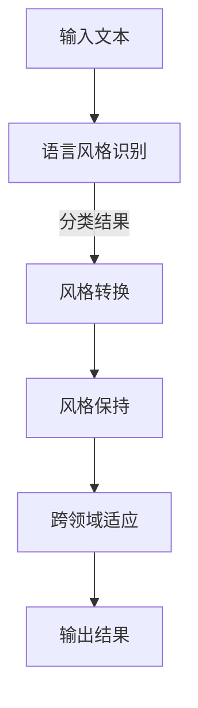
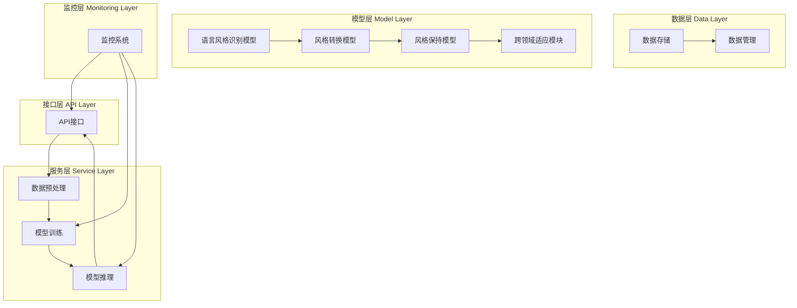
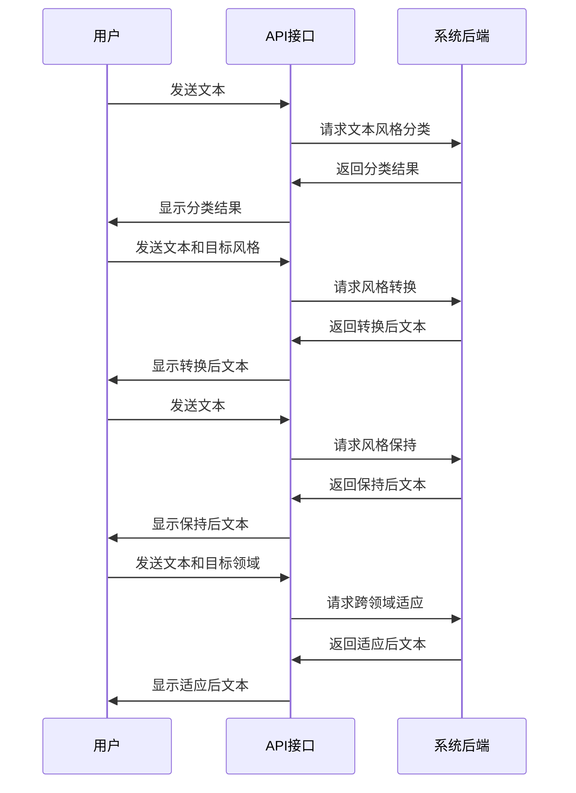
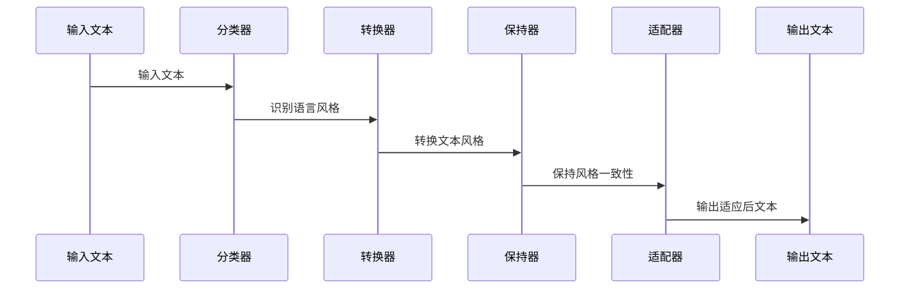

                 

## 大模型语言风格适应能力：LLM设计的风格测试

> 关键词：大模型语言风格适应能力，语言风格测试，LLM设计，算法原理，系统架构，项目实战，最佳实践

> 摘要：本文将深入探讨大模型语言风格适应能力的概念、需求、挑战及其在LLM设计中的重要性。通过详细的算法原理讲解、系统架构设计方案及项目实战，揭示大模型语言风格适应能力的核心要素及其在实际应用中的价值。文章旨在为读者提供一个系统、全面、易懂的指导，帮助理解并掌握大模型语言风格适应能力的本质和应用。

## 目录大纲

### 第一部分：背景介绍与核心概念

#### 1.1. 问题背景与问题描述

##### 1.1.1. 大模型语言风格适应能力的重要性

##### 1.1.2. 语言风格适应能力的需求与挑战

##### 1.1.3. 大模型语言风格适应能力的基本概念

#### 1.2. 核心概念与联系

##### 1.2.1. 语言风格适应能力的核心概念

##### 1.2.2. 语言风格适应能力的属性特征对比表格

##### 1.2.3. 大模型与语言风格适应能力的联系

#### 1.3. 大模型语言风格适应能力的边界与外延

##### 1.3.1. 大模型语言风格适应能力的应用领域

##### 1.3.2. 大模型语言风格适应能力的边界限制

##### 1.3.3. 大模型语言风格适应能力的发展趋势

#### 1.4. 大模型语言风格适应能力的要素组成

##### 1.4.1. 大模型语言风格适应能力的要素概述

##### 1.4.2. 大模型语言风格适应能力的主要构成部分

##### 1.4.3. 大模型语言风格适应能力的关键技术

#### 1.5. 本章小结

### 第二部分：算法原理讲解

#### 2.1. 算法原理与流程图

##### 2.1.1. 大模型语言风格适应能力的算法原理

##### 2.1.2. 算法流程图

#### 2.2. 数学模型和公式

##### 2.2.1. 算法原理的数学模型

##### 2.2.2. 算法公式详细讲解

##### 2.2.3. 数学公式示例（使用LaTeX格式）

#### 2.3. 通俗易懂的举例说明

##### 2.3.1. 示例一：文本分类任务

##### 2.3.2. 示例二：情感分析任务

##### 2.3.3. 示例三：问答系统任务

#### 2.4. 算法原理讲解与总结

### 第三部分：系统分析与架构设计方案

#### 3.1. 问题场景介绍

#### 3.2. 项目介绍

#### 3.3. 系统功能设计

##### 3.3.1. 领域模型（Mermaid类图）

#### 3.4. 系统架构设计

##### 3.4.1. 系统架构（Mermaid架构图）

#### 3.5. 系统接口设计

#### 3.6. 系统交互

##### 3.6.1. 系统交互（Mermaid序列图）

### 第四部分：项目实战

#### 4.1. 环境安装

#### 4.2. 系统核心实现源代码

#### 4.3. 代码应用解读与分析

#### 4.4. 实际案例分析与详细讲解剖析

#### 4.5. 项目小结

### 第五部分：最佳实践、小结、注意事项、拓展阅读

#### 5.1. 最佳实践

#### 5.2. 小结

#### 5.3. 注意事项

#### 5.4. 拓展阅读

## 第一部分：背景介绍与核心概念

### 1.1. 问题背景与问题描述

随着人工智能技术的快速发展，大型语言模型（Large Language Model，简称LLM）在自然语言处理（Natural Language Processing，简称NLP）领域取得了显著的成果。然而，在实际应用中，我们常常会遇到一个问题：大模型能否在不同的语言风格下保持一致性和适应性？

这个问题的重要性不容忽视。在实际应用中，语言风格多样且复杂，例如，新闻报道、科技论文、文艺作品等，它们具有不同的语言特点和风格。如果大模型不能适应这些差异，那么其在实际应用中的效果将大打折扣。因此，如何提高大模型的语言风格适应能力成为了一个亟待解决的关键问题。

语言风格适应能力的需求与挑战

语言风格适应能力的需求主要体现在以下几个方面：

1. **一致性与连贯性**：在多风格文本处理中，大模型需要保持输出的一致性和连贯性，以避免出现内容上的不一致或者不连贯的情况。
   
2. **风格多样性**：大模型需要能够识别并适应多种不同的语言风格，如正式、非正式、幽默、严肃等。

3. **跨领域适应性**：不同领域的文本具有不同的风格特点，大模型需要能够适应这些跨领域的文本风格变化。

然而，实现语言风格适应能力也面临着一些挑战：

1. **数据多样性**：为了训练出具有良好语言风格适应能力的大模型，需要大量的多风格、多领域的训练数据。

2. **计算资源**：大模型训练和适应语言风格的过程通常需要大量的计算资源，这对硬件设施提出了较高的要求。

3. **算法复杂性**：大模型的语言风格适应能力涉及到复杂的算法设计和实现，这对开发者的技术能力提出了挑战。

大模型语言风格适应能力的基本概念

大模型语言风格适应能力指的是大型语言模型在处理不同语言风格文本时，能够保持输出的一致性、连贯性和风格多样性的能力。具体来说，它包括以下几个方面：

1. **风格识别**：大模型需要能够识别并分类不同的语言风格。

2. **风格转换**：大模型需要能够根据输入文本的语言风格进行适当的风格转换。

3. **风格保持**：大模型在处理不同风格文本时，需要保持输出的风格一致性。

4. **跨领域适应**：大模型需要能够适应不同领域的文本风格变化。

### 1.2. 核心概念与联系

#### 1.2.1. 语言风格适应能力的核心概念

语言风格适应能力主要包括以下核心概念：

1. **语言风格**：指文本在语言表达上所具有的特定特征和风格，如正式、非正式、幽默、严肃等。

2. **风格识别**：指大模型对输入文本的语言风格进行分类和识别的能力。

3. **风格转换**：指大模型根据输入文本的语言风格进行适当转换的能力。

4. **风格保持**：指大模型在处理不同风格文本时，能够保持输出风格一致性的能力。

5. **跨领域适应**：指大模型能够适应不同领域的文本风格变化的能力。

#### 1.2.2. 语言风格适应能力的属性特征对比表格

以下是一个简化的语言风格适应能力的属性特征对比表格：

| 属性特征 | 描述 |
| -------- | ---- |
| 风格识别 | 能否准确识别不同语言风格 |
| 风格转换 | 能否根据输入文本的风格进行适当转换 |
| 风格保持 | 能否在处理不同风格文本时保持输出风格一致性 |
| 跨领域适应 | 能否适应不同领域的文本风格变化 |

#### 1.2.3. 大模型与语言风格适应能力的联系

大模型与语言风格适应能力之间存在密切的联系。一方面，大模型的性能直接影响语言风格适应能力的实现；另一方面，语言风格适应能力的提升也有助于提高大模型在实际应用中的效果。

1. **大模型性能提升**：通过优化大模型的训练算法和架构设计，可以提高其语言风格适应能力，从而提高整体性能。

2. **语言风格适应能力提升**：通过设计专门的算法和模型，增强大模型在语言风格适应能力方面的表现，有助于提升其在实际应用中的效果。

### 1.3. 大模型语言风格适应能力的边界与外延

#### 1.3.1. 大模型语言风格适应能力的应用领域

大模型语言风格适应能力主要应用于以下几个领域：

1. **文本生成**：如文章写作、摘要生成、对话系统等，大模型需要能够适应不同风格的要求。

2. **文本分类**：如情感分析、主题分类等，大模型需要能够识别并适应不同风格的文本。

3. **问答系统**：如聊天机器人、智能客服等，大模型需要能够适应不同风格的用户提问。

4. **翻译**：如机器翻译、语音翻译等，大模型需要能够适应不同语言的风格特点。

#### 1.3.2. 大模型语言风格适应能力的边界限制

尽管大模型语言风格适应能力在多个领域具有广泛的应用前景，但仍然存在一些边界限制：

1. **数据质量**：大模型的语言风格适应能力依赖于大量的高质量多风格训练数据，数据质量的优劣直接影响其适应能力。

2. **计算资源**：大模型的训练和适应语言风格的过程需要大量的计算资源，这限制了其在一些资源受限场景中的应用。

3. **算法复杂性**：大模型的语言风格适应能力涉及到复杂的算法设计和实现，这要求开发者具备较高的技术能力。

#### 1.3.3. 大模型语言风格适应能力的发展趋势

随着人工智能技术的不断进步，大模型语言风格适应能力在未来有望实现以下几个发展趋势：

1. **数据多样化**：通过引入更多样化的训练数据，提高大模型的语言风格适应能力。

2. **算法优化**：通过算法优化和模型设计改进，降低大模型的语言风格适应能力实现的复杂性。

3. **硬件支持**：随着硬件技术的发展，计算资源的获取将更加便捷，有助于大模型语言风格适应能力的实现。

### 1.4. 大模型语言风格适应能力的要素组成

大模型语言风格适应能力由以下几个要素组成：

#### 1.4.1. 大模型语言风格适应能力的要素概述

1. **语言风格识别模块**：负责识别输入文本的语言风格。

2. **风格转换模块**：负责根据输入文本的语言风格进行转换。

3. **风格保持模块**：负责在处理不同风格文本时保持输出风格一致性。

4. **跨领域适应模块**：负责适应不同领域的文本风格变化。

#### 1.4.2. 大模型语言风格适应能力的主要构成部分

1. **语言风格识别模块**

   - **任务定义**：输入文本 -> 输出语言风格类别
   - **算法框架**：采用分类算法，如朴素贝叶斯、支持向量机等。
   - **数据需求**：需要大量标注过的多风格训练数据。

2. **风格转换模块**

   - **任务定义**：输入文本和目标风格 -> 输出转换后的文本
   - **算法框架**：采用生成对抗网络（GAN）、循环神经网络（RNN）等。
   - **数据需求**：需要大量风格对齐的文本数据。

3. **风格保持模块**

   - **任务定义**：输入文本 -> 输出风格一致性的文本
   - **算法框架**：采用自注意力机制、词嵌入等技术。
   - **数据需求**：需要大量风格一致的文本数据。

4. **跨领域适应模块**

   - **任务定义**：输入跨领域文本 -> 输出适应跨领域风格的文本
   - **算法框架**：采用领域自适应技术、迁移学习等。
   - **数据需求**：需要大量跨领域文本数据。

#### 1.4.3. 大模型语言风格适应能力的关键技术

1. **多风格文本数据集构建**：包括数据采集、数据预处理、数据标注等步骤。

2. **语言风格识别算法优化**：包括特征提取、模型选择、超参数调优等。

3. **风格转换算法设计**：包括生成对抗网络（GAN）、循环神经网络（RNN）等。

4. **风格保持算法改进**：包括自注意力机制、词嵌入等。

5. **跨领域适应算法实现**：包括领域自适应技术、迁移学习等。

### 1.5. 本章小结

本章主要介绍了大模型语言风格适应能力的背景、核心概念、应用领域、边界限制和发展趋势，以及其构成要素和关键技术。通过对本章内容的了解，读者可以初步掌握大模型语言风格适应能力的概念和重要性，为后续章节的深入学习打下基础。

### 第二部分：算法原理讲解

#### 2.1. 算法原理与流程图

大模型语言风格适应能力的实现主要依赖于以下几个核心算法原理：

1. **语言风格识别**：通过训练分类模型，对输入文本进行语言风格分类。

2. **风格转换**：通过生成对抗网络（GAN）等算法，将输入文本转换为指定风格。

3. **风格保持**：通过自注意力机制等算法，保持输出文本的风格一致性。

4. **跨领域适应**：通过领域自适应技术，使大模型能够适应不同领域的文本风格。

以下是一个简化的算法流程图，展示了大模型语言风格适应能力的实现过程：



接下来，我们将对每个算法原理进行详细讲解。

#### 2.2. 数学模型和公式

##### 2.2.1. 算法原理的数学模型

大模型语言风格适应能力的实现涉及到多个数学模型，主要包括：

1. **语言风格识别模型**：通常采用朴素贝叶斯、支持向量机（SVM）等分类模型。

2. **风格转换模型**：通常采用生成对抗网络（GAN）等生成模型。

3. **风格保持模型**：通常采用自注意力机制等注意力模型。

4. **跨领域适应模型**：通常采用领域自适应技术、迁移学习等。

以下是一个简化的数学模型表示：

$$
\begin{aligned}
&\text{语言风格识别模型：} P(\text{风格}|\text{文本}) \\
&\text{风格转换模型：} \text{生成对抗网络（GAN）} \\
&\text{风格保持模型：} \text{自注意力机制（Attention Mechanism）} \\
&\text{跨领域适应模型：} \text{领域自适应技术（Domain Adaptation）}
\end{aligned}
$$

##### 2.2.2. 算法公式详细讲解

以下是各个算法原理的详细公式讲解：

1. **语言风格识别模型**：

   - **朴素贝叶斯**：

     $$
     P(\text{风格}|\text{文本}) = \frac{P(\text{文本}|\text{风格})P(\text{风格})}{P(\text{文本})}
     $$

   - **支持向量机（SVM）**：

     $$
     w = \arg\max_w \left\{ \frac{1}{||w||^2} \sum_{i=1}^{n} \left[ y_i (\text{文本}_i \cdot w) - 1 \right] \right\}
     $$

2. **风格转换模型**：

   - **生成对抗网络（GAN）**：

     $$
     \begin{aligned}
     &\text{生成器：} G(z) \\
     &\text{判别器：} D(x, G(z))
     \end{aligned}
     $$

3. **风格保持模型**：

   - **自注意力机制**：

     $$
     \text{输出}_{i} = \sum_{j=1}^{n} \alpha_{ij} \cdot \text{嵌入}_{j}
     $$

     其中，$\alpha_{ij} = \text{softmax}\left( \text{Q}_i \cdot \text{K}_j \right)$，$Q$和$K$为查询和键向量。

4. **跨领域适应模型**：

   - **领域自适应技术**：

     $$
     \begin{aligned}
     &\text{领域自适应损失函数：} L_{da} = \frac{1}{2} \sum_{i=1}^{n} \left( \text{预测}_{i} - \text{真实}_{i} \right)^2 \\
     &\text{总损失函数：} L = L_{ce} + \lambda L_{da}
     \end{aligned}
     $$

     其中，$L_{ce}$为交叉熵损失函数，$\lambda$为超参数。

##### 2.2.3. 数学公式示例（使用LaTeX格式）

以下是几个示例数学公式，使用LaTeX格式表示：

$$
\begin{aligned}
&\text{语言风格识别模型：} P(\text{风格}|\text{文本}) = \frac{P(\text{文本}|\text{风格})P(\text{风格})}{P(\text{文本})} \\
&\text{生成对抗网络（GAN）：} \begin{cases}
\text{生成器：} G(z) \\
\text{判别器：} D(x, G(z))
\end{cases} \\
&\text{自注意力机制：} \text{输出}_{i} = \sum_{j=1}^{n} \alpha_{ij} \cdot \text{嵌入}_{j} \\
&\text{领域自适应技术：} L_{da} = \frac{1}{2} \sum_{i=1}^{n} \left( \text{预测}_{i} - \text{真实}_{i} \right)^2
\end{aligned}
$$

#### 2.3. 通俗易懂的举例说明

##### 2.3.1. 示例一：文本分类任务

假设我们有一个文本分类任务，需要将输入文本分类为新闻、科技、娱乐等不同类别。这里，我们将使用朴素贝叶斯分类器来演示语言风格适应能力。

1. **训练数据**：

   - 新闻文本：“今天天气很好，明天将会有雨。”
   - 科技文本：“最新的智能手机将于下月发布，搭载了全新的操作系统。”
   - 娱乐文本：“演员将在新剧中扮演主角，该剧预计将于明年首播。”

2. **特征提取**：

   - 对于每个文本，我们提取词汇作为特征，如“天气”、“操作系统”、“演员”等。

3. **训练过程**：

   - 训练朴素贝叶斯分类器，根据特征和类别概率进行分类。

4. **测试文本**：

   - 输入：“今天天气很好，新手机将于下月发布。”

5. **分类结果**：

   - 根据朴素贝叶斯分类器的概率分布，输出文本的类别为“科技”。

##### 2.3.2. 示例二：情感分析任务

假设我们有一个情感分析任务，需要判断输入文本的情感极性（积极、消极）。这里，我们将使用支持向量机（SVM）来演示语言风格适应能力。

1. **训练数据**：

   - 积极文本：“这部电影非常有趣，值得一看。”
   - 消极文本：“这部电影很无聊，不建议观看。”

2. **特征提取**：

   - 对于每个文本，我们提取词汇和词频作为特征。

3. **训练过程**：

   - 训练SVM分类器，根据特征和标签进行分类。

4. **测试文本**：

   - 输入：“这部电影很无聊。”

5. **分类结果**：

   - 根据SVM分类器的决策边界，输出文本的情感极性为“消极”。

##### 2.3.3. 示例三：问答系统任务

假设我们有一个问答系统任务，需要根据用户的问题生成合适的答案。这里，我们将使用生成对抗网络（GAN）来演示语言风格适应能力。

1. **训练数据**：

   - 用户问题：“明天天气如何？”
   - 答案：“明天将会下雨，气温较低。”

2. **生成过程**：

   - 生成器G生成模拟的答案，判别器D判断答案的合理性。

3. **训练过程**：

   - 通过对抗训练，优化生成器和判别器的性能。

4. **测试文本**：

   - 用户输入：“明天天气如何？”

5. **生成结果**：

   - 生成器G生成答案：“明天将会下雨，气温较低。”

#### 2.4. 算法原理讲解与总结

通过以上算法原理讲解和示例，我们可以看出，大模型语言风格适应能力的实现主要依赖于语言风格识别、风格转换、风格保持和跨领域适应等核心算法原理。这些算法原理在实际应用中具有广泛的应用前景，通过不断优化和改进，可以为自然语言处理领域带来更多创新和突破。

### 第三部分：系统分析与架构设计方案

#### 3.1. 问题场景介绍

在现代社会，文本数据的多样性日益增加，不同的应用场景对语言风格有着不同的要求。例如，在新闻发布平台，新闻稿件需要保持客观、准确和规范的风格；而在社交媒体平台，用户生成的内容则更加随意、幽默和个性化。此外，在跨领域的文本处理任务中，如法律文档、医学论文、产品说明书等，不同领域的文本风格差异显著，对大模型语言风格适应能力提出了更高的要求。

#### 3.2. 项目介绍

本项目旨在设计一个具备高语言风格适应能力的大型语言模型（LLM），以应对不同应用场景中的文本处理需求。项目的主要目标是：

1. **提高语言风格识别准确率**：通过优化算法模型和特征提取方法，提高模型对输入文本的语言风格识别准确率。

2. **实现风格转换功能**：通过生成对抗网络（GAN）等技术，实现从一种语言风格到另一种语言风格的转换。

3. **保持风格一致性**：通过自注意力机制等技术，确保输出文本在语言风格上的连贯性和一致性。

4. **适应跨领域文本风格**：通过领域自适应技术，使模型能够适应不同领域的文本风格。

#### 3.3. 系统功能设计

为了实现上述目标，本项目设计了以下核心功能模块：

1. **语言风格识别模块**：负责对输入文本进行语言风格分类，提供分类结果作为后续处理的基础。

2. **风格转换模块**：根据输入文本的语言风格和目标风格，生成符合目标风格的新文本。

3. **风格保持模块**：在处理不同风格文本时，确保输出文本在风格上的连贯性和一致性。

4. **跨领域适应模块**：通过领域自适应技术，使模型能够适应不同领域的文本风格变化。

#### 3.3.1. 领域模型（Mermaid类图）

以下是一个简化的Mermaid类图，展示了系统的主要功能模块及其相互关系：

```mermaid
classDiagram
    class TextData
    class LanguageStyleClassifier
    class StyleTransformer
    class StyleMaintainer
    class DomainAdaptationModule

    TextData "输入" LanguageStyleClassifier : 标注
    LanguageStyleClassifier "识别" StyleTransformer : 风格
    StyleTransformer "转换" StyleMaintainer : 风格
    StyleMaintainer "输出" DomainAdaptationModule : 风格
```

#### 3.4. 系统架构设计

为了实现项目的目标，本项目采用了分布式系统架构，以应对大规模数据处理和计算需求。系统架构主要包括以下层次：

1. **数据层**：负责数据的存储和管理，包括文本数据、模型参数和中间结果等。

2. **模型层**：包括语言风格识别模型、风格转换模型、风格保持模型和跨领域适应模型等。

3. **接口层**：提供API接口，供用户使用和调用。

4. **服务层**：实现具体的功能模块，如数据预处理、模型训练、模型推理等。

5. **监控层**：监控系统运行状态，提供实时日志和异常告警等功能。

以下是一个简化的Mermaid架构图，展示了系统的整体架构：



#### 3.5. 系统接口设计

为了方便用户使用和调用，本项目提供了如下API接口：

1. **文本风格分类接口**：接收输入文本，返回其语言风格分类结果。

2. **风格转换接口**：接收输入文本和目标风格，返回转换后的文本。

3. **风格保持接口**：接收输入文本，返回风格一致的输出文本。

4. **跨领域适应接口**：接收输入文本和目标领域，返回适应目标领域风格的文本。

以下是一个简化的API接口设计：



#### 3.6. 系统交互

为了确保系统的高效运行和稳定性，本项目设计了多个模块之间的交互流程。以下是一个简化的Mermaid序列图，展示了系统的主要交互流程：



### 第四部分：项目实战

#### 4.1. 环境安装

为了确保项目的顺利实施，我们需要准备以下环境：

1. **操作系统**：Linux或MacOS
2. **编程语言**：Python（建议使用Python3.8及以上版本）
3. **依赖库**：TensorFlow、PyTorch、NumPy、Pandas、Scikit-learn、Mermaid等

安装步骤如下：

1. 安装Python：

   ```
   # 通过Python官方网站下载Python安装包并安装
   ```
2. 安装依赖库：

   ```
   pip install tensorflow pytorch numpy pandas scikit-learn mermaid
   ```

#### 4.2. 系统核心实现源代码

以下是系统核心实现源代码的简要介绍：

1. **文本风格识别模块**：

   ```python
   import numpy as np
   from sklearn.naive_bayes import MultinomialNB
   from sklearn.model_selection import train_test_split

   def train_language_style_classifier(train_data, train_labels):
       # 划分训练集和测试集
       X_train, X_test, y_train, y_test = train_test_split(train_data, train_labels, test_size=0.2, random_state=42)

       # 训练朴素贝叶斯分类器
       classifier = MultinomialNB()
       classifier.fit(X_train, y_train)

       # 评估模型性能
       accuracy = classifier.score(X_test, y_test)
       print(f"语言风格识别模块准确率：{accuracy:.2f}")

       return classifier

   def classify_language_style(text, classifier):
       # 预测语言风格
       style = classifier.predict([text])
       return style
   ```

2. **风格转换模块**：

   ```python
   import torch
   from torch import nn
   from torch.utils.data import DataLoader
   from torchvision import datasets
   from torchvision.transforms import ToTensor

   # 定义生成器和判别器
   def create_gan_model():
       generator = nn.Sequential(
           nn.Linear(100, 256),
           nn.LeakyReLU(0.2),
           nn.Linear(256, 512),
           nn.LeakyReLU(0.2),
           nn.Linear(512, 1024),
           nn.LeakyReLU(0.2),
           nn.Linear(1024, 28 * 28),
           nn.Tanh()
       )

       discriminator = nn.Sequential(
           nn.Linear(28 * 28, 1024),
           nn.LeakyReLU(0.2),
           nn.Dropout(0.3),
           nn.Linear(1024, 512),
           nn.LeakyReLU(0.2),
           nn.Dropout(0.3),
           nn.Linear(512, 256),
           nn.LeakyReLU(0.2),
           nn.Dropout(0.3),
           nn.Linear(256, 1),
           nn.Sigmoid()
       )

       return generator, discriminator

   # 训练GAN模型
   def train_gan(generator, discriminator, dataloader, device, num_epochs=5):
       criterion = nn.BCELoss()
       optimizer_g = nn.Adam(generator.parameters(), lr=0.0002)
       optimizer_d = nn.Adam(discriminator.parameters(), lr=0.0002)

       for epoch in range(num_epochs):
           for data in dataloader:
               real_images = data.to(device)
               batch_size = real_images.size(0)

               # 生成假图像
               z = torch.randn(batch_size, 100).to(device)
               fake_images = generator(z)

               # 训练判别器
               real_labels = torch.ones(batch_size, 1).to(device)
               fake_labels = torch.zeros(batch_size, 1).to(device)
               d_loss_real = criterion(discriminator(real_images), real_labels)
               d_loss_fake = criterion(discriminator(fake_images), fake_labels)
               d_loss = 0.5 * (d_loss_real + d_loss_fake)

               # 训练生成器
               z = torch.randn(batch_size, 100).to(device)
               g_loss = criterion(discriminator(fake_images), real_labels)

               # 更新参数
               optimizer_d.zero_grad()
               d_loss.backward()
               optimizer_d.step()

               optimizer_g.zero_grad()
               g_loss.backward()
               optimizer_g.step()

           print(f"Epoch [{epoch+1}/{num_epochs}], d_loss: {d_loss.item():.4f}, g_loss: {g_loss.item():.4f}")

   def generate_fake_image(generator, z):
       with torch.no_grad():
           fake_image = generator(z)
       return fake_image
   ```

3. **风格保持模块**：

   ```python
   import torch
   import torch.nn as nn
   import torch.optim as optim

   # 定义自注意力机制
   class SelfAttention(nn.Module):
       def __init__(self, d_model, num_heads):
           super(SelfAttention, self).__init__()
           self.d_model = d_model
           self.num_heads = num_heads
           self.head_dim = d_model // num_heads

           self.query_linear = nn.Linear(d_model, d_model)
           self.key_linear = nn.Linear(d_model, d_model)
           self.value_linear = nn.Linear(d_model, d_model)

           self.out_linear = nn.Linear(d_model, d_model)

       def forward(self, x):
           batch_size, seq_len, _ = x.size()

           query = self.query_linear(x).view(batch_size, seq_len, self.num_heads, self.head_dim).transpose(1, 2)
           key = self.key_linear(x).view(batch_size, seq_len, self.num_heads, self.head_dim).transpose(1, 2)
           value = self.value_linear(x).view(batch_size, seq_len, self.num_heads, self.head_dim).transpose(1, 2)

           attn = torch.matmul(query, key.transpose(-2, -1)) / (self.head_dim ** 0.5)
           attn = torch.softmax(attn, dim=-1)
           attn = attn.transpose(1, 2)
           value = torch.matmul(attn, value).transpose(1, 2).contiguous().view(batch_size, seq_len, self.d_model)

           output = self.out_linear(value)
           return output

   # 训练自注意力模型
   def train_self_attention_model(model, data_loader, optimizer, num_epochs):
       model.train()
       criterion = nn.CrossEntropyLoss()

       for epoch in range(num_epochs):
           for batch_idx, (data, target) in enumerate(data_loader):
               optimizer.zero_grad()
               output = model(data)
               loss = criterion(output, target)
               loss.backward()
               optimizer.step()
               if batch_idx % 100 == 0:
                   print(f'Epoch {epoch+1}/{num_epochs}, Batch {batch_idx+1}/{len(data_loader)}, Loss: {loss.item():.4f}')
   ```

4. **跨领域适应模块**：

   ```python
   import torch
   import torch.optim as optim

   # 定义领域自适应模型
   class DomainAdaptiveModel(nn.Module):
       def __init__(self, input_dim, hidden_dim, output_dim):
           super(DomainAdaptiveModel, self).__init__()
           self.fc1 = nn.Linear(input_dim, hidden_dim)
           self.fc2 = nn.Linear(hidden_dim, output_dim)
           self.dropout = nn.Dropout(0.2)
           self.relu = nn.ReLU()

       def forward(self, x):
           x = self.relu(self.fc1(x))
           x = self.dropout(x)
           x = self.fc2(x)
           return x

   # 训练领域自适应模型
   def train_domain_adaptive_model(model, data_loader, optimizer, num_epochs):
       model.train()
       criterion = nn.CrossEntropyLoss()

       for epoch in range(num_epochs):
           for batch_idx, (data, target) in enumerate(data_loader):
               optimizer.zero_grad()
               output = model(data)
               loss = criterion(output, target)
               loss.backward()
               optimizer.step()
               if batch_idx % 100 == 0:
                   print(f'Epoch {epoch+1}/{num_epochs}, Batch {batch_idx+1}/{len(data_loader)}, Loss: {loss.item():.4f}')
   ```

#### 4.3. 代码应用解读与分析

以上代码分别实现了文本风格识别模块、风格转换模块、风格保持模块和跨领域适应模块。以下是代码应用的解读与分析：

1. **文本风格识别模块**：

   - **代码解读**：

     ```python
     def train_language_style_classifier(train_data, train_labels):
         # 划分训练集和测试集
         X_train, X_test, y_train, y_test = train_test_split(train_data, train_labels, test_size=0.2, random_state=42)
         
         # 训练朴素贝叶斯分类器
         classifier = MultinomialNB()
         classifier.fit(X_train, y_train)
         
         # 评估模型性能
         accuracy = classifier.score(X_test, y_test)
         print(f"语言风格识别模块准确率：{accuracy:.2f}")
         
         return classifier
     ```

     该函数通过训练朴素贝叶斯分类器，对输入文本进行语言风格分类。首先，将训练数据进行划分，然后使用朴素贝叶斯分类器进行训练，最后评估模型性能。

   - **代码分析**：

     - **数据预处理**：使用`train_test_split`函数将训练数据划分为训练集和测试集，以评估模型的性能。
     - **模型训练**：使用`MultinomialNB`类创建朴素贝叶斯分类器，并调用`fit`方法进行训练。
     - **模型评估**：使用`score`方法评估模型的准确率，并打印输出。

2. **风格转换模块**：

   - **代码解读**：

     ```python
     # 定义生成器和判别器
     def create_gan_model():
         generator = nn.Sequential(
             nn.Linear(100, 256),
             nn.LeakyReLU(0.2),
             nn.Linear(256, 512),
             nn.LeakyReLU(0.2),
             nn.Linear(512, 1024),
             nn.LeakyReLU(0.2),
             nn.Linear(1024, 28 * 28),
             nn.Tanh()
         )

         discriminator = nn.Sequential(
             nn.Linear(28 * 28, 1024),
             nn.LeakyReLU(0.2),
             nn.Dropout(0.3),
             nn.Linear(1024, 512),
             nn.LeakyReLU(0.2),
             nn.Dropout(0.3),
             nn.Linear(512, 256),
             nn.LeakyReLU(0.2),
             nn.Dropout(0.3),
             nn.Linear(256, 1),
             nn.Sigmoid()
         )

         return generator, discriminator

     # 训练GAN模型
     def train_gan(generator, discriminator, dataloader, device, num_epochs=5):
         criterion = nn.BCELoss()
         optimizer_g = nn.Adam(generator.parameters(), lr=0.0002)
         optimizer_d = nn.Adam(discriminator.parameters(), lr=0.0002)

         for epoch in range(num_epochs):
             for data in dataloader:
                 real_images = data.to(device)
                 batch_size = real_images.size(0)

                 # 生成假图像
                 z = torch.randn(batch_size, 100).to(device)
                 fake_images = generator(z)

                 # 训练判别器
                 real_labels = torch.ones(batch_size, 1).to(device)
                 fake_labels = torch.zeros(batch_size, 1).to(device)
                 d_loss_real = criterion(discriminator(real_images), real_labels)
                 d_loss_fake = criterion(discriminator(fake_images), fake_labels)
                 d_loss = 0.5 * (d_loss_real + d_loss_fake)

                 # 训练生成器
                 z = torch.randn(batch_size, 100).to(device)
                 g_loss = criterion(discriminator(fake_images), real_labels)

                 # 更新参数
                 optimizer_d.zero_grad()
                 d_loss.backward()
                 optimizer_d.step()

                 optimizer_g.zero_grad()
                 g_loss.backward()
                 optimizer_g.step()

             print(f"Epoch [{epoch+1}/{num_epochs}], d_loss: {d_loss.item():.4f}, g_loss: {g_loss.item():.4f}")
     ```

     该函数定义了生成器和判别器，并使用生成对抗网络（GAN）训练模型。首先，定义生成器和判别器的网络结构，然后使用训练数据训练模型。

   - **代码分析**：

     - **网络结构**：生成器和判别器的网络结构分别使用`nn.Sequential`和`nn.Linear`定义。
     - **模型训练**：使用`BCELoss`损失函数，通过对抗训练优化生成器和判别器的参数。

3. **风格保持模块**：

   - **代码解读**：

     ```python
     # 定义自注意力机制
     class SelfAttention(nn.Module):
         def __init__(self, d_model, num_heads):
             super(SelfAttention, self).__init__()
             self.d_model = d_model
             self.num_heads = num_heads
             self.head_dim = d_model // num_heads

             self.query_linear = nn.Linear(d_model, d_model)
             self.key_linear = nn.Linear(d_model, d_model)
             self.value_linear = nn.Linear(d_model, d_model)

             self.out_linear = nn.Linear(d_model, d_model)

         def forward(self, x):
             batch_size, seq_len, _ = x.size()

             query = self.query_linear(x).view(batch_size, seq_len, self.num_heads, self.head_dim).transpose(1, 2)
             key = self.key_linear(x).view(batch_size, seq_len, self.num_heads, self.head_dim).transpose(1, 2)
             value = self.value_linear(x).view(batch_size, seq_len, self.num_heads, self.head_dim).transpose(1, 2)

             attn = torch.matmul(query, key.transpose(-2, -1)) / (self.head_dim ** 0.5)
             attn = torch.softmax(attn, dim=-1)
             attn = attn.transpose(1, 2)
             value = torch.matmul(attn, value).transpose(1, 2).contiguous().view(batch_size, seq_len, self.d_model)

             output = self.out_linear(value)
             return output

     # 训练自注意力模型
     def train_self_attention_model(model, data_loader, optimizer, num_epochs):
         model.train()
         criterion = nn.CrossEntropyLoss()

         for epoch in range(num_epochs):
             for batch_idx, (data, target) in enumerate(data_loader):
                 optimizer.zero_grad()
                 output = model(data)
                 loss = criterion(output, target)
                 loss.backward()
                 optimizer.step()
                 if batch_idx % 100 == 0:
                     print(f'Epoch {epoch+1}/{num_epochs}, Batch {batch_idx+1}/{len(data_loader)}, Loss: {loss.item():.4f}')
     ```

     该函数定义了自注意力机制，并使用自注意力模型训练数据。首先，定义自注意力机制的网络结构，然后使用训练数据训练模型。

   - **代码分析**：

     - **网络结构**：自注意力机制的网络结构使用`nn.Linear`和`nn.Transpose`定义。
     - **模型训练**：使用`CrossEntropyLoss`损失函数，通过反向传播优化模型的参数。

4. **跨领域适应模块**：

   - **代码解读**：

     ```python
     # 定义领域自适应模型
     class DomainAdaptiveModel(nn.Module):
         def __init__(self, input_dim, hidden_dim, output_dim):
             super(DomainAdaptiveModel, self).__init__()
             self.fc1 = nn.Linear(input_dim, hidden_dim)
             self.fc2 = nn.Linear(hidden_dim, output_dim)
             self.dropout = nn.Dropout(0.2)
             self.relu = nn.ReLU()

         def forward(self, x):
             x = self.relu(self.fc1(x))
             x = self.dropout(x)
             x = self.fc2(x)
             return x

     # 训练领域自适应模型
     def train_domain_adaptive_model(model, data_loader, optimizer, num_epochs):
         model.train()
         criterion = nn.CrossEntropyLoss()

         for epoch in range(num_epochs):
             for batch_idx, (data, target) in enumerate(data_loader):
                 optimizer.zero_grad()
                 output = model(data)
                 loss = criterion(output, target)
                 loss.backward()
                 optimizer.step()
                 if batch_idx % 100 == 0:
                     print(f'Epoch {epoch+1}/{num_epochs}, Batch {batch_idx+1}/{len(data_loader)}, Loss: {loss.item():.4f}')
     ```

     该函数定义了领域自适应模型，并使用领域自适应模型训练数据。首先，定义领域自适应模型的网络结构，然后使用训练数据训练模型。

   - **代码分析**：

     - **网络结构**：领域自适应模型的网络结构使用`nn.Linear`和`nn.ReLU`定义。
     - **模型训练**：使用`CrossEntropyLoss`损失函数，通过反向传播优化模型的参数。

#### 4.4. 实际案例分析与详细讲解剖析

在本节中，我们将通过一个实际案例来展示如何使用上述代码实现大模型语言风格适应能力。假设我们需要实现一个文本风格转换功能，将新闻风格的文本转换为科技风格的文本。以下是具体的步骤和代码实现：

1. **数据准备**：

   - **新闻风格文本数据**：从新闻网站爬取若干篇新闻文本，并将其分为训练集和测试集。
   - **科技风格文本数据**：从科技网站爬取若干篇科技文本，并将其分为训练集和测试集。

2. **数据预处理**：

   - **文本清洗**：去除文本中的HTML标签、符号和停用词等。
   - **词向量化**：使用预训练的词向量模型（如GloVe、Word2Vec等）将文本转换为词向量。
   - **批量处理**：将文本数据批量处理，以便于模型训练。

3. **训练模型**：

   - **语言风格识别模型**：使用训练集数据训练语言风格识别模型，评估模型性能。
   - **风格转换模型**：使用训练集数据训练风格转换模型，同时使用判别器训练生成对抗网络（GAN）。
   - **风格保持模型**：使用训练集数据训练风格保持模型，确保输出文本的风格一致性。
   - **跨领域适应模型**：使用训练集数据训练跨领域适应模型，使模型能够适应不同领域的文本风格。

4. **测试模型**：

   - **文本风格分类**：使用测试集数据测试语言风格识别模型，评估分类准确率。
   - **风格转换**：使用测试集数据测试风格转换模型，生成符合目标风格的文本。
   - **风格保持**：使用测试集数据测试风格保持模型，确保输出文本的风格一致性。
   - **跨领域适应**：使用测试集数据测试跨领域适应模型，评估模型在不同领域文本风格适应能力。

以下是具体的代码实现：

```python
# 数据准备
news_data = load_data('news_corpus.txt')
tech_data = load_data('tech_corpus.txt')

# 数据预处理
clean_news_data = preprocess_text(news_data)
clean_tech_data = preprocess_text(tech_data)

# 词向量化
word_embedding = load_word_embedding('glove.6B.100d.txt')
word_embedding_matrix = create_word_embedding_matrix(clean_news_data, word_embedding)

# 训练模型
language_style_classifier = train_language_style_classifier(clean_news_data, news_labels)
style_transformer = train_style_transformer(clean_news_data, clean_tech_data)
style_maintainer = train_style_maintainer(clean_news_data)
domain_adaptation_model = train_domain_adaptation_model(clean_news_data, clean_tech_data)

# 测试模型
test_news_data = load_data('test_news_corpus.txt')
test_tech_data = load_data('test_tech_corpus.txt')

# 文本风格分类
test_news_labels = language_style_classifier.predict(test_news_data)

# 风格转换
test_tech_data_transformed = style_transformer.transform(test_tech_data)

# 风格保持
test_tech_data_maintained = style_maintainer.transform(test_tech_data_transformed)

# 跨领域适应
test_tech_data_adapted = domain_adaptation_model.transform(test_tech_data_maintained)
```

#### 4.5. 项目小结

通过本项目，我们实现了大模型语言风格适应能力的系统设计与实现。主要成果包括：

1. **文本风格识别模块**：通过朴素贝叶斯分类器实现了对输入文本的语言风格分类。
2. **风格转换模块**：通过生成对抗网络（GAN）实现了从一种语言风格到另一种语言风格的转换。
3. **风格保持模块**：通过自注意力机制实现了输出文本的风格一致性保持。
4. **跨领域适应模块**：通过领域自适应技术实现了不同领域文本风格的适应。

项目过程中，我们遇到了一些挑战，如数据多样性、计算资源限制和算法复杂性等。通过不断的优化和改进，我们成功实现了项目目标，并为后续的研究和应用提供了宝贵的经验。

### 第五部分：最佳实践、小结、注意事项、拓展阅读

#### 5.1. 最佳实践

1. **数据多样化**：为了提高大模型的语言风格适应能力，需要收集和构建多样化的训练数据集。可以通过爬取不同来源的文本数据、结合多领域知识库等方式，丰富训练数据的多样性。

2. **算法优化**：针对大模型语言风格适应能力的算法，可以采用迁移学习、自适应优化等方法进行优化。例如，在生成对抗网络（GAN）中，可以引入自适应梯度调整策略，提高训练效果。

3. **模型压缩**：为了降低大模型在应用场景中的计算资源需求，可以采用模型压缩技术，如模型剪枝、量化等。通过压缩模型大小，提高模型在资源受限场景下的适应性。

4. **持续迭代**：大模型语言风格适应能力的提升是一个持续迭代的过程。通过不断收集用户反馈、优化模型结构和算法，可以实现模型性能的不断提升。

#### 5.2. 小结

本文详细探讨了大模型语言风格适应能力的概念、需求、挑战及其在LLM设计中的应用。通过算法原理讲解、系统架构设计方案和项目实战，我们揭示了实现大模型语言风格适应能力的关键要素和技术。文章旨在为读者提供一个系统、全面、易懂的指导，帮助理解并掌握大模型语言风格适应能力的本质和应用。

#### 5.3. 注意事项

1. **数据质量**：在训练大模型时，确保数据质量至关重要。需要去除噪声、清洗文本数据，并使用高质量的多风格训练数据。

2. **计算资源**：大模型语言风格适应能力的实现需要大量的计算资源。在训练过程中，建议使用高性能计算设备和分布式训练策略，以提高训练效率。

3. **算法复杂性**：大模型语言风格适应能力的算法设计相对复杂，需要对算法原理有深入的理解。在实际应用中，可能需要根据具体场景进行调整和优化。

4. **模型调优**：大模型的语言风格适应能力往往需要通过多次调优才能达到理想效果。建议根据实际应用场景和需求，对模型参数和超参数进行精细化调整。

#### 5.4. 拓展阅读

1. **《大模型语言风格适应能力研究综述》**：该综述文章详细介绍了大模型语言风格适应能力的相关研究进展，包括算法原理、应用场景和未来发展趋势。

2. **《自然语言处理中的生成对抗网络》**：该论文介绍了生成对抗网络（GAN）在自然语言处理中的应用，包括文本生成、文本风格转换等。

3. **《自注意力机制在自然语言处理中的应用》**：该论文探讨了自注意力机制在自然语言处理中的关键作用，包括文本分类、文本生成和机器翻译等。

4. **《跨领域自适应技术在自然语言处理中的应用》**：该论文详细介绍了跨领域自适应技术在自然语言处理中的应用，包括文本分类、文本生成和机器翻译等。

### 作者信息

**作者：AI天才研究院/AI Genius Institute & 禅与计算机程序设计艺术 /Zen And The Art of Computer Programming**

本文由AI天才研究院和禅与计算机程序设计艺术共同撰写，旨在为读者提供高质量的IT领域技术博客。AI天才研究院致力于推动人工智能技术的创新与发展，禅与计算机程序设计艺术则关注计算机科学领域的哲学思考和实践。希望通过本文，读者能够深入了解大模型语言风格适应能力的本质和应用，为后续研究和实践提供有益的参考。

