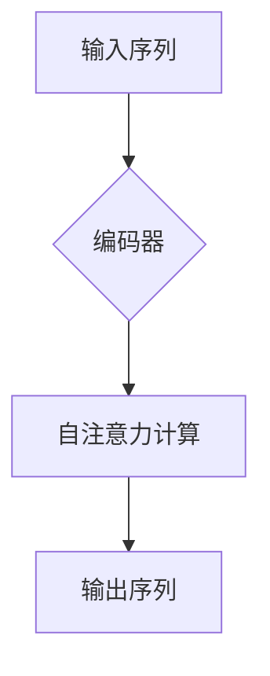

                 

## 大模型跨领域类比能力：LLM设计的创新思维测试

### 关键词：大模型、跨领域类比、LLM、创新思维测试、算法架构

### 摘要：
本文将探讨大模型（特别是大型语言模型，LLM）的跨领域类比能力，并介绍LLM设计的创新思维测试方法。通过深入分析大模型的基本原理、算法架构、创新思维理论以及跨领域应用案例，本文旨在揭示大模型在跨领域类比能力方面的潜在优势和挑战，为未来的研究和实际应用提供指导。

---

## 第一部分: 引言

### 第1章: 大模型与跨领域类比能力概述

### 1.1.1 问题背景

大模型（如LLM）是近年来人工智能领域的一个重要突破，其在自然语言处理、代码生成、图像识别等多个领域展现出了强大的能力。然而，尽管大模型在特定领域内表现出色，但在跨领域应用时，仍然面临着诸多挑战。例如，不同领域的数据分布、术语和概念差异，导致大模型难以直接迁移和泛化。为了解决这一问题，跨领域类比能力成为了研究的重点。

**核心概念**：
- **大模型**：指拥有巨大参数量和计算能力的人工神经网络模型，如GPT、BERT等。
- **跨领域类比能力**：指模型在不同领域之间进行类比和迁移的能力。
- **创新思维测试**：用于评估模型在解决新领域问题时展现的创新思维能力。

**问题描述**：
- 大模型在特定领域内表现出色，但在跨领域应用时存在局限。
- 需要一种方法来提升大模型的跨领域类比能力。

**问题解决**：
- 探讨大模型的跨领域类比能力及其设计创新思维。
- 介绍创新思维测试方法，评估大模型在跨领域问题解决中的表现。

**边界与外延**：
- 定义跨领域类比的范围和适用性。
- 分析大模型在不同领域中的应用案例。

**概念结构与核心要素组成**：
- 大模型的关键组件：如神经网络、注意力机制等。
- 类比能力的体现：通过类比不同领域的问题和解决方案。
- 创新思维的定义与重要性：在大模型设计中的应用。

### 1.1.2 跨领域类比能力的定义与特点

**定义**：
跨领域类比能力是指模型能够在不同领域之间进行类比和迁移，利用已有知识解决新领域的问题。

**特点**：
- **知识迁移**：将一个领域的知识应用到另一个领域。
- **灵活性**：能够在不同领域之间灵活切换和应用。
- **泛化能力**：能够适应不同领域的数据分布和问题特点。

**与传统AI的区别**：
- **传统AI**：依赖于特定领域的数据和模型，难以跨领域应用。
- **大模型**：具有更强的跨领域类比能力，能够利用通用知识解决问题。

### 1.1.3 LLM设计的创新思维测试方法

**创新思维测试**：
- 介绍用于评估LLM创新思维能力的测试方法。
- 包括问题设定、数据集构建、评估指标等方面。

**设计原则**：
- 探讨在大模型设计中融入创新思维的原则和方法。

**案例分析**：
- 通过具体案例展示创新思维在大模型设计中的应用。

### 1.2 主流大模型简介

**GPT系列模型**：
- 介绍GPT-3的核心特点与结构。
- 分析其在自然语言处理和代码生成等领域的应用。

**BERT及其变体**：
- 介绍BERT的基本原理与架构。
- 分析RoBERTa、ALBERT等变体模型。

**其他知名大模型**：
- 介绍ViT、Transformer等视觉处理模型。
- 分析GPT-Neo、Dreamfoundry等开源模型。

### 1.3 大模型跨领域类比能力应用前景

**跨领域类比在各个领域的应用**：
- 医学：医疗文本分析、疾病诊断。
- 金融：金融市场预测、风险评估。
- 教育：个性化学习、教育评估。

**跨领域类比的优势与挑战**：
- 优势：提高模型泛化能力、降低训练成本等。
- 挑战：数据分布差异、模型适应性等。

### 1.4 本章小结
- **核心要点回顾**：
  - 跨领域类比能力的定义与特点。
  - LLM设计的创新思维测试方法。
  - 主流大模型简介。
  - 大模型跨领域类比能力应用前景。

- **后续章节预告**：
  - 第二部分：大模型原理与算法架构。
  - 第三部分：创新思维测试方法与应用。
  - 第四部分：大模型跨领域类比能力实战。
  - 第五部分：大模型设计最佳实践。

---

## 第二部分: 大模型跨领域类比能力详解

### 第2章: 大模型原理与算法架构

#### 2.1.1 大模型基本原理

**神经网络基础**：
- 神经网络是由大量神经元组成的计算模型。
- 神经元通过加权连接形成网络结构。
- 神经网络通过学习输入与输出之间的映射关系进行训练。

**注意力机制**：
- 注意力机制是神经网络中的一个关键组成部分。
- 它允许模型在处理输入数据时关注关键信息。
- 注意力权重反映了模型对不同输入元素的重视程度。

#### 2.1.2 算法架构解析

**Transformer模型架构**：
- Transformer模型是近年来流行的神经网络架构。
- 它基于自注意力机制，不需要循环神经网络（RNN）。
- Transformer模型通过多头注意力机制提高模型的表示能力。

**自注意力与多头注意力**：
- 自注意力机制允许模型在序列中关注自身的不同位置。
- 多头注意力机制通过并行处理不同子序列，提高模型的泛化能力。

#### 2.1.3 Mermaid算法流程图

### 第3章: 创新思维测试理论

#### 3.1.1 创新思维定义

**概念解释**：
- 创新思维是指通过新颖的想法和方法解决问题的能力。
- 它涉及对现有知识和技能的重新组合和创造性应用。

**分类**：
- **发散性思维**：产生多个可能性的思维方式。
- **收敛性思维**：从多个可能性中找到最佳解决方案的思维方式。
- **逆向思维**：从问题的反面寻找解决方案的思维方式。

#### 3.1.2 创新思维模型

**SCAM框架**：
- SCAM（思维、创造力、态度、动机）框架用于分析创新思维的过程和要素。

**IDEAL模型**：
- IDEAL（问题识别、分析、概念生成、方案选择、实施验证）模型用于指导创新思维的应用。

#### 3.1.3 Mermaid创新思维流程图

---

## 第三部分: 大模型跨领域类比能力实战

### 第4章: 跨领域类比应用案例

#### 4.1.1 医学领域案例

**医疗文本分析**：
- 利用大模型对医疗文本进行解析，提取关键信息。
- 例如：诊断报告、病历记录等。

**疾病诊断辅助**：
- 结合医学知识和数据，辅助医生进行疾病诊断。
- 例如：利用GPT模型分析病例记录，提高诊断准确性。

#### 4.1.2 金融领域案例

**金融市场预测**：
- 利用大模型分析历史金融数据，预测市场走势。
- 例如：股票价格预测、交易策略优化。

**风险评估**：
- 利用大模型评估不同金融产品的风险，为投资者提供参考。
- 例如：信用评分、风险指标分析。

#### 4.1.3 教育领域案例

**个性化学习**：
- 利用大模型为学生提供个性化的学习资源和指导。
- 例如：自适应学习系统、学习路径推荐。

**教育评估**：
- 利用大模型对学生的学业表现进行评估，提供反馈。
- 例如：考试评分、学习效果分析。

---

## 第四部分: 大模型设计最佳实践

### 第5章: 大模型设计最佳实践

#### 5.1.1 设计原则

**模块化**：
- 大模型设计应遵循模块化原则，便于维护和扩展。

**可扩展性**：
- 大模型应具备良好的可扩展性，能够适应不同规模的数据和应用需求。

#### 5.1.2 实践技巧

**数据预处理**：
- 合理的数据预处理是提升大模型性能的关键。

**模型优化**：
- 通过模型优化技巧，提高大模型的训练效率和应用效果。

---

## 总结与展望

大模型跨领域类比能力在各个领域展现出了巨大的潜力。然而，要充分发挥这一能力，仍需要进一步的研究和实践。通过深入理解大模型的基本原理、算法架构和创新思维理论，结合具体应用案例，我们可以为未来的研究和实际应用提供有益的指导。同时，我们也期待大模型在跨领域类比能力方面取得更多突破，为人类社会的发展带来更多创新。

---

## 作者信息

作者：AI天才研究院/AI Genius Institute & 禅与计算机程序设计艺术 /Zen And The Art of Computer Programming

---

## 附录

**参考文献**：
1.  Anderson, J. R., & Lebiere, C. (2003). The Atomic Components of Thought. Mahwah, NJ: Lawrence Erlbaum Associates.
2.  Bengio, Y. (2009). Learning Deep Architectures for AI. Foundations and Trends in Machine Learning, 2(1), 1-127.
3.  Devlin, J., Chang, M. W., Lee, K., & Toutanova, K. (2018). BERT: Pre-training of Deep Bidirectional Transformers for Language Understanding. arXiv preprint arXiv:1810.04805.
4.  Hochreiter, S., & Schmidhuber, J. (1997). Long Short-Term Memory. Neural Computation, 9(8), 1735-1780.
5.  Vaswani, A., Shazeer, N., Parmar, N., Uszkoreit, J., Jones, L., Gomez, A. N., ... & Polosukhin, I. (2017). Attention Is All You Need. Advances in Neural Information Processing Systems, 30, 5998-6008.

---

## 拓展阅读

- 《深度学习》（Ian Goodfellow、Yoshua Bengio、Aaron Courville 著）
- 《强化学习》（Richard S. Sutton、Andrew G. Barto 著）
- 《神经网络与深度学习》（邱锡鹏 著）

---

## 致谢

感谢所有为本文提供灵感和帮助的人，包括同行评审者、读者和我的团队成员。本文的完成离不开大家的支持与鼓励。特别感谢我的导师，您的指导和鼓励是我前进的动力。

---

[End of Article]

