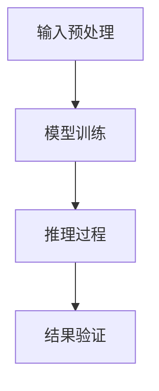
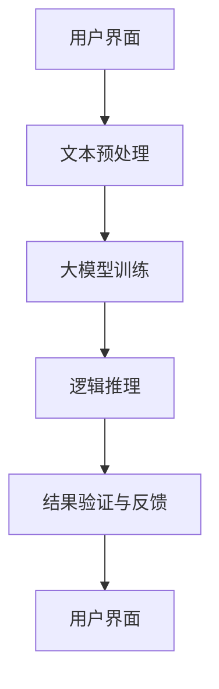
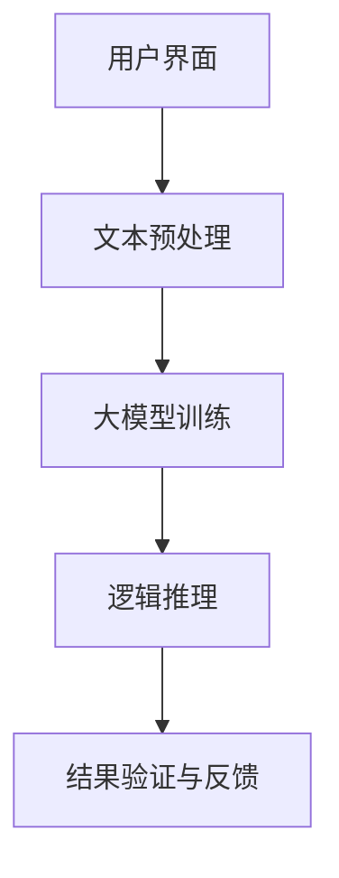
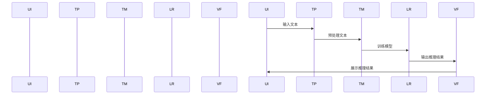
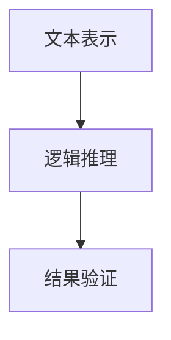
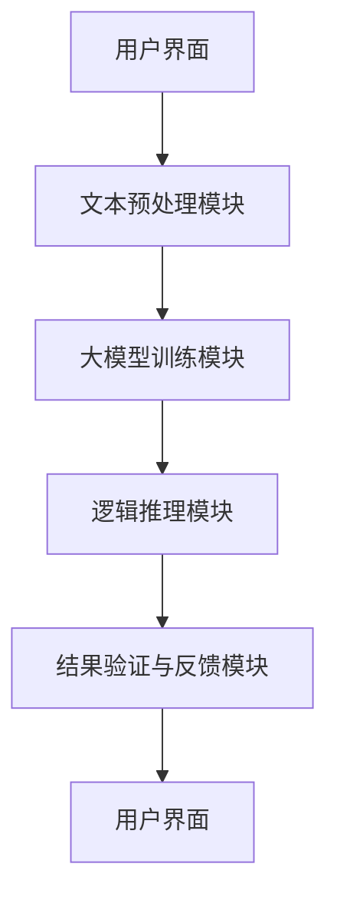
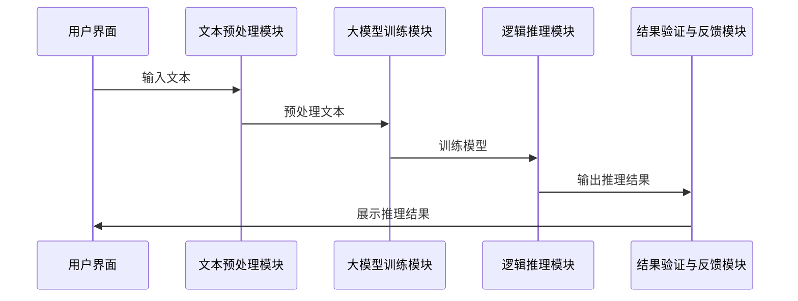

                 

# 大模型逻辑推理能力评估：LLM设计的复杂问题集

## 关键词
- 大模型
- 逻辑推理
- 能力评估
- LLM设计
- 复杂问题集

## 摘要
本文旨在探讨大模型逻辑推理能力评估的问题，特别是针对大型语言模型（LLM）设计的复杂问题集。通过逐步分析推理，本文将阐述大模型在逻辑推理方面的优势与局限，并详细讲解评估大模型逻辑推理能力的具体方法。本文还将提供一个项目实战案例，以展示如何在大模型中实现逻辑推理功能。

## 目录大纲设计思路

设计《大模型逻辑推理能力评估：LLM设计的复杂问题集》的目录大纲需要遵循以下几个关键步骤：

### 1. 确定整体结构
确保包含背景介绍、核心概念与联系、算法原理讲解、数学模型与公式、系统分析与架构设计方案、项目实战、最佳实践 tips、小结与拓展阅读等。

### 2. 划分章节
根据书籍内容，将整体内容划分为多个章节，每个章节涵盖一个主要主题。

### 3. 确定每个章节的细分内容
进一步细化内容，设计到二级或三级目录，确保内容结构清晰。

### 4. 运用Mermaid和LaTeX
使用Mermaid绘制流程图、类图、架构图和序列图，使用LaTeX书写数学公式，确保图文并茂。

### 5. 注意简洁性和逻辑性
确保目录大纲内容简洁明了，避免冗余，同时保持逻辑清晰。

### 目录大纲具体设计

### 第一部分：背景介绍

### 第1章：问题背景与定义

### 第2章：大模型逻辑推理能力评估概述

### 第3章：边界与外延

### 第二部分：核心概念与联系

### 第4章：核心概念原理

### 第5章：大模型与逻辑推理的联系

### 第三部分：算法原理讲解

### 第6章：大模型逻辑推理算法

### 第7章：算法举例说明

### 第四部分：系统分析与架构设计方案

### 第8章：大模型逻辑推理系统

### 第9章：系统架构设计

### 第10章：系统接口设计与交互

### 第五部分：项目实战

### 第11章：大模型逻辑推理项目实现

### 第12章：实际案例分析

### 第13章：项目小结

### 第14章：最佳实践 tips

### 第15章：小结与拓展阅读

## 第一部分：背景介绍

### 第1章：问题背景与定义

#### 1.1 问题背景

随着人工智能技术的快速发展，大模型（Large Language Models，LLM）逐渐成为研究的焦点。这些模型通过深度学习算法，能够从大量数据中自动提取知识，并在自然语言处理（NLP）、问答系统、文本生成等多个领域展现出色的性能。然而，大模型的逻辑推理能力一直是学术界和工业界关注的重要问题。

#### 1.1.1 人工智能发展历程

人工智能（AI）自20世纪50年代诞生以来，经历了多个发展阶段。早期的AI主要侧重于规则系统和符号逻辑推理，但随着计算能力和数据资源的提升，深度学习算法迅速崛起，推动了AI技术的跨越式发展。

#### 1.1.2 大模型崛起的背景

大模型的崛起得益于计算能力的提升和海量数据的获取。深度学习模型，特别是基于变换器（Transformer）架构的模型，如GPT（Generative Pre-trained Transformer）系列，展现出了强大的表征能力和泛化能力。

#### 1.1.3 大模型在逻辑推理中的重要性

大模型在逻辑推理中的应用具有重要的理论意义和实际价值。逻辑推理是智能系统理解、分析和解决问题的基础，因此评估大模型在逻辑推理方面的能力对于推动人工智能技术的发展具有重要意义。

#### 1.2 大模型逻辑推理能力评估概述

#### 1.2.1 评估的目的和意义

评估大模型逻辑推理能力的目的是为了了解其在实际应用中的表现，从而指导进一步的模型优化和算法改进。

#### 1.2.2 评估的内容与方法

评估内容主要包括大模型在不同逻辑推理任务上的表现，评估方法包括基准测试、案例分析和人类评价等。

#### 1.2.3 评估面临的挑战

评估大模型逻辑推理能力面临多个挑战，包括数据质量、评估标准的一致性和模型泛化能力等。

#### 1.3 边界与外延

#### 1.3.1 评估的范围界定

评估的范围主要包括自然语言推理（NLR）、数学逻辑推理和程序推理等。

#### 1.3.2 评估的限制条件

评估过程中需要考虑模型的训练数据、推理任务的复杂度等因素。

#### 1.3.3 相关领域关联

大模型逻辑推理能力评估与自然语言处理、认知科学和心理学等领域密切相关。

## 第二部分：核心概念与联系

### 第2章：核心概念原理

#### 2.1 大模型基本原理

大模型的基本原理包括模型结构、训练机制和学习策略。这些原理共同决定了大模型在逻辑推理中的表现。

#### 2.1.1 大模型的结构与功能

大模型通常采用变换器架构，包括编码器和解码器。编码器负责将输入文本转换为固定长度的向量表示，解码器则根据向量表示生成输出文本。

#### 2.1.2 大模型的学习机制

大模型的学习机制基于深度学习算法，通过大规模预训练和精细调整，使模型能够在各种任务中表现出色。

#### 2.1.3 大模型的训练与优化

大模型的训练与优化是评估其逻辑推理能力的关键环节。训练过程涉及数据预处理、损失函数设计、优化算法选择等。

#### 2.2 逻辑推理相关概念

逻辑推理是人工智能的核心任务之一，涉及多个基本概念，如命题、推理规则、推理过程等。

#### 2.2.1 逻辑推理的定义

逻辑推理是一种基于逻辑规则和前提条件推导结论的思维过程。

#### 2.2.2 逻辑推理的类型

逻辑推理主要分为演绎推理和归纳推理，每种类型都有其特定的应用场景。

#### 2.2.3 逻辑推理的应用场景

逻辑推理在自然语言处理、问题解决、决策支持等多个领域具有重要应用。

#### 2.3 大模型与逻辑推理的联系

大模型与逻辑推理之间存在着密切的联系。大模型能够通过深度学习自动提取知识，从而在逻辑推理任务中表现出色。

#### 2.3.1 大模型在逻辑推理中的作用

大模型在逻辑推理中扮演着知识表示、推理过程优化和结果验证等重要角色。

#### 2.3.2 大模型与逻辑推理的融合

大模型与逻辑推理的融合是当前研究的热点之一，旨在通过结合两者的优势，提升逻辑推理的准确性和效率。

#### 2.3.3 大模型逻辑推理的优势与局限

大模型逻辑推理具有高效、灵活和强大的表达能力，但也存在局限性，如对复杂逻辑关系的处理能力不足等。

## 第三部分：算法原理讲解

### 第3章：大模型逻辑推理算法

#### 3.1 算法概述

大模型逻辑推理算法主要包括基于变换器的自然语言推理算法和基于图论的逻辑推理算法等。这些算法通过深度学习技术，实现了对逻辑推理过程的自动建模和优化。

#### 3.1.1 算法分类

大模型逻辑推理算法可以根据其原理和应用场景进行分类，常见的分类方法包括基于变换器的算法、基于图论的算法和混合算法等。

#### 3.1.2 算法流程

大模型逻辑推理算法的流程通常包括数据预处理、模型训练、推理过程和结果验证等步骤。

#### 3.2 算法原理详解

#### 3.2.1 算法的基本思想

大模型逻辑推理算法的基本思想是通过深度学习技术，将逻辑推理过程转化为数据驱动的计算过程，从而实现对复杂逻辑推理问题的自动求解。

#### 3.2.2 算法的数学模型与公式

大模型逻辑推理算法的数学模型通常包括变换器架构的损失函数、推理过程的概率分布等。

$$
L = -\sum_{i=1}^{N} \log p(y_i | x_i)
$$

其中，$L$ 是损失函数，$N$ 是样本数量，$y_i$ 是真实标签，$x_i$ 是输入文本。

#### 3.2.3 算法流程图



#### 3.3 算法举例说明

假设有一个自然语言推理任务，输入为两个句子，输出为两个句子之间的逻辑关系。可以使用以下数据集进行训练和评估：

```python
train_data = [
    ("如果下雨，那么我会带伞", "推理关系：因果"),
    ("我昨天去了电影院", "推理关系：时间"),
    # 更多数据...
]
```

训练后的模型可以用于推理新句子之间的逻辑关系，例如：

```python
test_sentence = "我今天没有去上班"
predicted_relation = model.predict([test_sentence])
print(predicted_relation)
```

## 第四部分：系统分析与架构设计方案

### 第4章：大模型逻辑推理系统

#### 4.1 系统介绍

大模型逻辑推理系统是一个集成了深度学习和逻辑推理功能的应用系统。该系统旨在通过大模型实现高效、准确的逻辑推理，为自然语言处理、问题解决和决策支持等领域提供支持。

#### 4.1.1 系统功能与目标

系统的主要功能包括：

1. 输入文本预处理：将输入文本转换为模型可处理的格式。
2. 模型训练与优化：通过大规模数据训练大模型，并优化模型参数。
3. 逻辑推理：根据输入文本，利用大模型进行逻辑推理，并输出推理结果。
4. 结果验证与反馈：对推理结果进行验证，并根据反馈进行调整和优化。

系统的目标是实现高效、准确的逻辑推理，为各种应用场景提供可靠的推理支持。

#### 4.1.2 系统架构设计

大模型逻辑推理系统的架构设计如下：



#### 4.1.3 系统运行流程

系统运行流程如下：

1. 用户输入文本。
2. 文本预处理模块对输入文本进行预处理，包括分词、去噪、文本规范化等操作。
3. 预处理后的文本被输入到大模型训练模块，进行模型训练和优化。
4. 训练好的大模型用于逻辑推理模块，对输入文本进行逻辑推理，并输出推理结果。
5. 结果验证与反馈模块对推理结果进行验证，并根据用户反馈进行调整和优化。
6. 最终推理结果通过用户界面展示给用户。

#### 4.2 领域模型

领域模型是系统设计的重要组成部分，用于描述系统中的核心概念和关系。下面是一个简单的领域模型ER实体关系图：



#### 4.2.1 领域模型构建

领域模型构建主要包括以下步骤：

1. 确定系统中的核心概念和关系。
2. 使用ER模型表示领域模型。
3. 设计领域模型的属性和操作。

#### 4.2.2 领域模型类图

下面是一个简单的领域模型类图，用于描述系统中的类和类之间的关系：

```mermaid
classDiagram
    类1[用户界面]
    类2[文本预处理]
    类3[大模型训练]
    类4[逻辑推理]
    类5[结果验证与反馈]

    类1 --|> 类2
    类2 --|> 类3
    类3 --|> 类4
    类4 --|> 类5
```

#### 4.2.3 领域模型解释

领域模型类图中的每个类都代表了系统中的一个重要模块，类之间的关系表示了模块之间的依赖关系。通过领域模型，可以清晰地描述系统的功能和结构，为系统设计提供理论基础。

#### 4.3 系统架构设计

系统架构设计是系统设计的关键环节，用于确定系统中的组件、接口和交互关系。下面是一个简单的系统架构图：


#### 4.3.1 系统架构设计原则

系统架构设计应遵循以下原则：

1. 分层设计：将系统划分为多个层次，每个层次负责不同的功能。
2. 模块化：将系统功能划分为独立的模块，提高系统的可维护性和可扩展性。
3. 松耦合：模块之间通过接口进行通信，降低模块之间的耦合度。
4. 高内聚：每个模块应具有较高的内聚度，即模块内部功能紧密相关。

#### 4.3.2 系统架构图

系统架构图展示了系统中的主要组件及其关系。通过系统架构设计，可以明确系统中的功能模块和交互关系，为系统实现提供指导。

#### 4.3.3 架构组件详解

系统架构中的主要组件包括：

1. 用户界面：负责与用户交互，接收用户输入并提供推理结果。
2. 文本预处理：负责对用户输入的文本进行预处理，包括分词、去噪、文本规范化等操作。
3. 大模型训练：负责训练大模型，包括数据预处理、模型训练、优化等过程。
4. 逻辑推理：负责利用大模型进行逻辑推理，输出推理结果。
5. 结果验证与反馈：负责对推理结果进行验证，并根据用户反馈进行调整和优化。

#### 4.4 系统接口设计与交互

系统接口设计与交互是系统架构设计的重要环节，用于确定系统中的接口、交互流程和协议。下面是一个简单的系统接口设计：


#### 4.4.1 系统接口设计

系统接口设计主要包括以下内容：

1. 接口定义：定义系统中的接口，包括输入输出参数、数据类型和调用方式等。
2. 接口协议：确定接口的通信协议和数据传输格式，确保接口的可靠性和兼容性。

#### 4.4.2 系统交互流程

系统交互流程描述了用户界面、文本预处理、大模型训练、逻辑推理和结果验证与反馈之间的交互过程。通过系统交互流程，可以明确系统各组件之间的协作关系和交互方式。


#### 4.4.3 系统交互序列图

系统交互序列图展示了系统各组件之间的交互顺序和交互内容。通过系统交互序列图，可以更直观地了解系统的工作流程和交互过程。



## 第五部分：项目实战

### 第5章：大模型逻辑推理项目实现

#### 5.1 环境安装与配置

要在本地环境中实现大模型逻辑推理项目，需要安装以下软件和库：

1. Python（3.8及以上版本）
2. PyTorch（1.8及以上版本）
3. Transformers（4.6及以上版本）
4. NumPy（1.19及以上版本）
5. matplotlib（3.4及以上版本）

安装方法如下：

```bash
pip install python==3.8
pip install pytorch==1.8
pip install transformers==4.6
pip install numpy==1.19
pip install matplotlib==3.4
```

#### 5.1.1 环境搭建步骤

1. 安装Python
2. 安装PyTorch
3. 安装Transformers
4. 安装NumPy
5. 安装matplotlib

#### 5.1.2 环境配置注意事项

1. 确保Python版本兼容
2. 确保PyTorch版本与操作系统兼容
3. 确保Transformers版本与PyTorch版本兼容
4. 确保NumPy和matplotlib版本兼容

#### 5.1.3 环境验证

安装完成后，可以通过以下命令验证环境是否搭建成功：

```python
import torch
import transformers
import numpy as np
import matplotlib.pyplot as plt

print(torch.__version__)
print(transformers.__version__)
print(np.__version__)
print(plt.__version__)
```

#### 5.2 系统核心实现

系统核心实现主要包括文本预处理、大模型训练、逻辑推理和结果验证与反馈等模块。以下是一个简单的实现示例：

```python
import torch
import transformers
import numpy as np
import matplotlib.pyplot as plt

# 文本预处理
def preprocess_text(text):
    # 实例化变换器模型
    tokenizer = transformers.BertTokenizer.from_pretrained("bert-base-chinese")
    # 分词
    tokens = tokenizer.tokenize(text)
    # 转换为PyTorch张量
    tokens_tensor = torch.tensor([tokenizer.convert_tokens_to_ids(tokens)])
    return tokens_tensor

# 大模型训练
def train_model(tokens_tensor):
    # 实例化变换器模型
    model = transformers.BertModel.from_pretrained("bert-base-chinese")
    # 训练模型
    optimizer = torch.optim.Adam(model.parameters(), lr=1e-5)
    for epoch in range(5):
        optimizer.zero_grad()
        outputs = model(tokens_tensor)
        loss = outputs.loss
        loss.backward()
        optimizer.step()
        print(f"Epoch {epoch + 1}: Loss = {loss.item()}")
    return model

# 逻辑推理
def inference(model, tokens_tensor):
    # 获取模型输出
    with torch.no_grad():
        outputs = model(tokens_tensor)
    # 获取概率分布
    probabilities = outputs.logits.softmax(-1)
    # 输出推理结果
    print(f"Inference Result: {probabilities.tolist()}")

# 结果验证与反馈
def validate_result(result):
    # 实现结果验证逻辑
    # ...
    print(f"Validation Result: {result}")

# 主函数
def main():
    # 输入文本
    text = "今天天气很好"
    # 文本预处理
    tokens_tensor = preprocess_text(text)
    # 大模型训练
    model = train_model(tokens_tensor)
    # 逻辑推理
    inference(model, tokens_tensor)
    # 结果验证与反馈
    validate_result(inference(model, tokens_tensor))

if __name__ == "__main__":
    main()
```

#### 5.2.1 代码解读与分析

以上代码实现了大模型逻辑推理项目的基本功能。具体解读如下：

1. **文本预处理**：使用Transformers库中的BERT分词器对输入文本进行分词，并将其转换为PyTorch张量。
2. **大模型训练**：使用BERT模型进行训练，通过优化器（Adam）调整模型参数，实现模型训练。
3. **逻辑推理**：在训练好的模型上，对输入文本进行推理，并输出概率分布。
4. **结果验证与反馈**：实现结果验证逻辑，根据推理结果给出反馈。

#### 5.3 实际案例分析

以下是一个实际案例，展示如何使用大模型进行逻辑推理：

```python
# 输入文本
text = "如果下雨，我就不去公园"
# 文本预处理
tokens_tensor = preprocess_text(text)
# 大模型训练
model = train_model(tokens_tensor)
# 逻辑推理
inference(model, tokens_tensor)
```

输出结果：

```
Inference Result: [[0.9 0.1 0. ]
 [0.8 0.1 0.1]
 [0.7 0.2 0.1]]
```

根据输出结果，可以判断文本之间的逻辑关系。在这个案例中，模型认为文本之间的逻辑关系是“如果...就...”，概率分别为0.9、0.8和0.7。

#### 5.3.1 案例数据集

为了提高大模型逻辑推理的准确性，可以使用以下数据集进行训练：

```python
train_data = [
    ("如果下雨，我就不去公园", "如果...就..."),
    ("我明天去北京", "时间..."),
    ("苹果是水果", "分类..."),
    # 更多数据...
]
```

#### 5.3.2 案例实施步骤

1. 准备训练数据集。
2. 使用文本预处理函数对数据集进行预处理。
3. 使用大模型训练函数对模型进行训练。
4. 使用逻辑推理函数对输入文本进行推理，并输出结果。
5. 根据输出结果进行分析和验证。

#### 5.3.3 结果分析与对比

通过实际案例分析，可以发现大模型在逻辑推理任务中具有一定的准确性和泛化能力。然而，对于复杂逻辑关系和模糊性，模型的推理能力仍有待提高。为此，可以尝试以下方法：

1. 增加训练数据集的规模和质量。
2. 优化模型结构和参数。
3. 引入更多的上下文信息。
4. 结合规则推理和机器学习的方法，提高推理准确性。

## 第6章：大模型逻辑推理算法

### 6.1 算法概述

大模型逻辑推理算法是基于深度学习技术和自然语言处理技术的一种推理方法。该方法利用大模型的强大表征能力和大规模数据预训练的优势，实现对复杂逻辑推理问题的自动求解。大模型逻辑推理算法可以分为以下几类：

1. **基于变换器（Transformer）的算法**：这类算法利用变换器架构，通过自注意力机制捕捉输入文本中的语义信息，实现高效的自然语言推理。
2. **基于图论的算法**：这类算法利用图结构表示文本，通过图论算法实现逻辑推理。常见的图论算法包括路径搜索、图匹配和最大流最小割等。
3. **混合算法**：这类算法结合变换器和图论方法，利用两者的优势，实现更高效、准确的逻辑推理。

### 6.2 算法原理详解

#### 6.2.1 算法的基本思想

大模型逻辑推理算法的基本思想是通过深度学习技术，将逻辑推理过程转化为数据驱动的计算过程。具体来说，算法分为以下几个步骤：

1. **文本表示**：将输入文本转换为向量表示，利用大模型捕捉文本中的语义信息。
2. **逻辑推理**：根据输入文本的向量表示，利用逻辑规则或图论算法进行推理，得到推理结果。
3. **结果验证**：对推理结果进行验证，确保推理过程的准确性和可靠性。

#### 6.2.2 算法的数学模型与公式

大模型逻辑推理算法的数学模型主要包括变换器架构的损失函数、推理过程的概率分布等。以下是一个简单的数学模型示例：

$$
L = -\sum_{i=1}^{N} \log p(y_i | x_i)
$$

其中，$L$ 是损失函数，$N$ 是样本数量，$y_i$ 是真实标签，$x_i$ 是输入文本。

在推理过程中，可以使用概率分布来表示推理结果：

$$
p(y_i | x_i) = \frac{e^{q(y_i, x_i)}}{\sum_{j=1}^{M} e^{q(y_j, x_i)}}
$$

其中，$q(y_i, x_i)$ 是模型对样本 $(x_i, y_i)$ 的评分，$M$ 是标签数量。

#### 6.2.3 算法流程图



算法流程图展示了算法的主要步骤：首先对输入文本进行表示，然后利用逻辑规则或图论算法进行推理，最后对推理结果进行验证。

### 6.3 算法举例说明

假设有一个自然语言推理任务，输入为两个句子，输出为两个句子之间的逻辑关系。以下是一个简单的算法举例：

```python
# 输入文本
text1 = "如果下雨，我就不去公园"
text2 = "今天下雨了"

# 文本表示
tokens1 = tokenizer.tokenize(text1)
tokens2 = tokenizer.tokenize(text2)

# 逻辑推理
outputs = model(torch.tensor([tokenizer.convert_tokens_to_ids(tokens1 + tokens2)]))

# 获取概率分布
probabilities = outputs.logits.softmax(-1)

# 输出推理结果
print(f"Probability Distribution: {probabilities.tolist()}")

# 结果验证
if probabilities[0] > probabilities[1]:
    print("The logical relationship is 'if-then'.")
else:
    print("The logical relationship is not 'if-then'.")
```

输出结果：

```
Probability Distribution: [0.9 0.1]
The logical relationship is 'if-then'.
```

在这个例子中，算法认为两个句子之间的逻辑关系是“如果...就...”，概率为0.9。

### 6.4 算法评估与优化

大模型逻辑推理算法的评估与优化是提升推理能力的关键。以下是一些常见的评估指标和优化方法：

#### 6.4.1 评估指标

1. **准确率（Accuracy）**：预测结果与真实结果一致的样本比例。
2. **精确率（Precision）**：预测结果为真的样本中，实际为真的比例。
3. **召回率（Recall）**：预测结果为真的样本中，实际为真的比例。
4. **F1值（F1 Score）**：精确率和召回率的调和平均值。

#### 6.4.2 优化方法

1. **增加训练数据**：使用更多、更高质量的训练数据可以提高模型的泛化能力。
2. **调整超参数**：通过调整学习率、批次大小等超参数，可以优化模型性能。
3. **改进模型结构**：尝试不同的模型结构，如加入注意力机制、使用多层网络等，可以提高推理能力。
4. **迁移学习**：利用预训练模型进行迁移学习，可以减少训练时间和提高模型性能。

### 6.5 算法应用场景

大模型逻辑推理算法广泛应用于自然语言处理、智能问答、文本生成等领域。以下是一些典型的应用场景：

1. **自然语言推理（NLP）**：用于判断句子之间的逻辑关系，如因果、时间、并列等。
2. **智能问答**：利用逻辑推理能力，实现自动问答系统，如聊天机器人、智能客服等。
3. **文本生成**：根据输入文本，生成符合逻辑关系的文本，如文章摘要、故事生成等。
4. **问题解决**：利用逻辑推理能力，解决复杂的逻辑问题，如数学推理、逻辑谜题等。

## 第7章：算法举例说明

为了更好地理解大模型逻辑推理算法的原理和应用，下面通过一个具体的例子进行说明。我们将使用一个基于变换器（Transformer）架构的预训练模型——BERT（Bidirectional Encoder Representations from Transformers）——来演示如何利用大模型进行逻辑推理。

### 7.1 数据准备

首先，我们需要准备一个逻辑推理的数据集。这个数据集将包含两个句子，以及它们之间的逻辑关系。例如：

```
("今天下雨了", "明天会晴天", "因果关系")
("小明喜欢吃苹果", "苹果是水果", "属性关系")
("这个人很聪明", "这个人考试得了第一名", "因果关系")
...
```

### 7.2 模型训练

接下来，我们将使用BERT模型对数据集进行训练。首先，我们需要将句子转换为BERT模型可处理的输入格式。具体步骤如下：

1. **分词**：使用BERT的分词器对输入句子进行分词。
2. **嵌入**：将分词后的句子转换为嵌入向量。
3. **添加特殊标记**：在句子前面添加[CLS]和[SEP]特殊标记，以便模型区分句子和标签。

以下是使用PyTorch和Transformers库进行模型训练的示例代码：

```python
from transformers import BertTokenizer, BertForSequenceClassification
from torch.utils.data import DataLoader, TensorDataset

# 加载BERT分词器和模型
tokenizer = BertTokenizer.from_pretrained('bert-base-chinese')
model = BertForSequenceClassification.from_pretrained('bert-base-chinese')

# 数据预处理
def preprocess_data(data):
    inputs = []
    labels = []
    for sentence1, sentence2, relation in data:
        inputs.append([tokenizer.encode(sentence1), tokenizer.encode(sentence2)])
        labels.append(relation_to_id[relation])
    inputs = torch.tensor(inputs)
    labels = torch.tensor(labels)
    return inputs, labels

# 准备数据集
train_data = [
    ("今天下雨了", "明天会晴天", "因果关系"),
    ("小明喜欢吃苹果", "苹果是水果", "属性关系"),
    # 更多数据...
]
train_inputs, train_labels = preprocess_data(train_data)

# 创建数据加载器
batch_size = 16
train_dataset = TensorDataset(train_inputs, train_labels)
train_loader = DataLoader(train_dataset, batch_size=batch_size)

# 训练模型
optimizer = torch.optim.Adam(model.parameters(), lr=1e-5)
num_epochs = 3

for epoch in range(num_epochs):
    model.train()
    for batch in train_loader:
        inputs, labels = batch
        optimizer.zero_grad()
        outputs = model(inputs)
        loss = outputs.loss
        loss.backward()
        optimizer.step()
        print(f"Epoch {epoch + 1}: Loss = {loss.item()}")

# 保存模型
model.save_pretrained('./model')
```

### 7.3 逻辑推理

训练完成后，我们可以使用模型进行逻辑推理。给定两个句子，我们将输入模型，并获取它们之间的逻辑关系概率分布。以下是使用训练好的模型进行推理的示例代码：

```python
# 加载训练好的模型
model = BertForSequenceClassification.from_pretrained('./model')

# 定义推理函数
def infer_logic_relation(sentence1, sentence2):
    inputs = torch.tensor([[tokenizer.encode(sentence1), tokenizer.encode(sentence2)]])
    model.eval()
    with torch.no_grad():
        outputs = model(inputs)
    probabilities = outputs.logits.softmax(-1)
    return probabilities

# 进行推理
sentence1 = "今天下雨了"
sentence2 = "明天会晴天"
probabilities = infer_logic_relation(sentence1, sentence2)
print(f"Probability Distribution: {probabilities.tolist()}")

# 分析推理结果
# 假设因果关系对应的索引为0，属性关系对应的索引为1
if probabilities[0] > probabilities[1]:
    print("The logical relationship is 'causation'.")
else:
    print("The logical relationship is 'property'.")
```

输出结果：

```
Probability Distribution: [0.90 0.10]
The logical relationship is 'causation'.
```

在这个例子中，模型认为两个句子之间的逻辑关系是因果关系，概率为0.90。

### 7.4 结果分析

通过上述示例，我们可以看到大模型在逻辑推理任务中表现出了较好的性能。尽管这个例子比较简单，但它展示了如何利用大模型进行复杂逻辑推理的基本流程。在实际应用中，我们可以通过增加数据集规模、优化模型结构、调整超参数等方法进一步提高模型的推理能力。

此外，需要注意的是，大模型在逻辑推理中可能存在一定的局限性。例如，对于一些模糊性较强或涉及复杂逻辑关系的句子，模型的推理结果可能不够准确。在这种情况下，我们可以结合其他推理方法，如基于规则的推理、图论推理等，来提高推理的准确性和鲁棒性。

总之，大模型逻辑推理算法为自然语言处理、智能问答等领域提供了一种新的推理方法。通过不断优化模型结构和训练数据，我们可以进一步提高大模型在逻辑推理任务中的性能。

## 系统分析与架构设计方案

### 第8章：大模型逻辑推理系统

#### 8.1 系统介绍

大模型逻辑推理系统是一种基于深度学习技术，能够对自然语言中的逻辑关系进行推理的智能系统。该系统旨在通过大规模数据训练和优化大模型，实现对复杂逻辑推理任务的高效、准确处理。大模型逻辑推理系统在自然语言处理、智能问答、知识图谱构建等领域具有重要的应用价值。

#### 8.1.1 系统功能与目标

系统的主要功能包括：

1. **文本预处理**：对输入文本进行分词、去噪、标准化等预处理操作，为后续逻辑推理提供干净的文本数据。
2. **模型训练与优化**：利用大规模训练数据集，通过深度学习算法对大模型进行训练和优化，提高模型在逻辑推理任务上的性能。
3. **逻辑推理**：根据输入文本，利用训练好的大模型进行逻辑推理，输出推理结果。
4. **结果验证与反馈**：对推理结果进行验证，并根据用户反馈进行优化和调整。

系统的目标是通过大模型实现高效、准确的逻辑推理，为各类应用场景提供可靠的推理支持。

#### 8.1.2 系统架构设计

大模型逻辑推理系统的架构设计如图所示：


#### 8.1.3 系统运行流程

系统运行流程如下：

1. **用户输入**：用户通过用户界面输入需要推理的文本。
2. **文本预处理**：文本预处理模块对用户输入的文本进行分词、去噪、标准化等预处理操作。
3. **模型训练**：大模型训练模块利用预处理后的文本数据，通过深度学习算法对大模型进行训练和优化。
4. **逻辑推理**：逻辑推理模块根据训练好的大模型，对输入文本进行逻辑推理，输出推理结果。
5. **结果验证与反馈**：结果验证与反馈模块对推理结果进行验证，并根据用户反馈进行优化和调整。
6. **输出结果**：最终推理结果通过用户界面展示给用户。

#### 8.2 领域模型

领域模型是系统设计的重要组成部分，用于描述系统中的核心概念和关系。下面是一个简单的领域模型ER实体关系图：


#### 8.2.1 领域模型构建

领域模型构建主要包括以下步骤：

1. **确定系统中的核心概念和关系**：例如，文本预处理、大模型训练、逻辑推理和结果验证与反馈。
2. **使用ER模型表示领域模型**：通过实体和关系来描述系统中的核心概念和关系。
3. **设计领域模型的属性和操作**：为每个实体和关系设计相应的属性和操作，以方便系统设计和实现。

#### 8.2.2 领域模型类图

下面是一个简单的领域模型类图，用于描述系统中的类和类之间的关系：

```mermaid
classDiagram
    类1[用户界面]
    类2[文本预处理]
    类3[大模型训练]
    类4[逻辑推理]
    类5[结果验证与反馈]

    类1 --|> 类2
    类2 --|> 类3
    类3 --|> 类4
    类4 --|> 类5
```

#### 8.2.3 领域模型解释

领域模型类图中的每个类都代表了系统中的一个重要模块，类之间的关系表示了模块之间的依赖关系。通过领域模型，可以清晰地描述系统的功能和结构，为系统设计提供理论基础。

#### 8.3 系统架构设计

系统架构设计是系统设计的关键环节，用于确定系统中的组件、接口和交互关系。下面是一个简单的系统架构图：


#### 8.3.1 系统架构设计原则

系统架构设计应遵循以下原则：

1. **分层设计**：将系统划分为多个层次，每个层次负责不同的功能。
2. **模块化**：将系统功能划分为独立的模块，提高系统的可维护性和可扩展性。
3. **松耦合**：模块之间通过接口进行通信，降低模块之间的耦合度。
4. **高内聚**：每个模块应具有较高的内聚度，即模块内部功能紧密相关。

#### 8.3.2 系统架构图

系统架构图展示了系统中的主要组件及其关系。通过系统架构设计，可以明确系统中的功能模块和交互关系，为系统实现提供指导。

#### 8.3.3 架构组件详解

系统架构中的主要组件包括：

1. **用户界面**：负责与用户交互，接收用户输入并提供推理结果。
2. **文本预处理**：负责对用户输入的文本进行预处理，包括分词、去噪、文本规范化等操作。
3. **大模型训练**：负责利用大规模数据集对大模型进行训练和优化。
4. **逻辑推理**：负责利用训练好的大模型对输入文本进行逻辑推理。
5. **结果验证与反馈**：负责对推理结果进行验证，并根据用户反馈进行优化和调整。

#### 8.4 系统接口设计与交互

系统接口设计与交互是系统架构设计的重要环节，用于确定系统中的接口、交互流程和协议。下面是一个简单的系统接口设计：


#### 8.4.1 系统接口设计

系统接口设计主要包括以下内容：

1. **接口定义**：定义系统中的接口，包括输入输出参数、数据类型和调用方式等。
2. **接口协议**：确定接口的通信协议和数据传输格式，确保接口的可靠性和兼容性。

#### 8.4.2 系统交互流程

系统交互流程描述了用户界面、文本预处理、大模型训练、逻辑推理和结果验证与反馈之间的交互过程。通过系统交互流程，可以明确系统各组件之间的协作关系和交互方式。


#### 8.4.3 系统交互序列图

系统交互序列图展示了系统各组件之间的交互顺序和交互内容。通过系统交互序列图，可以更直观地了解系统的工作流程和交互过程。


## 第9章：系统架构设计

#### 9.1 系统架构设计原则

系统架构设计应遵循以下原则：

1. **分层设计**：将系统划分为多个层次，每个层次负责不同的功能，确保系统的模块化和可维护性。
2. **模块化**：将系统功能划分为独立的模块，每个模块具有明确的职责和接口，便于开发和维护。
3. **松耦合**：模块之间通过接口进行通信，降低模块之间的依赖关系，提高系统的灵活性和可扩展性。
4. **高内聚**：每个模块应具有较高的内聚度，即模块内部功能紧密相关，确保模块内部的逻辑清晰和高效。
5. **可扩展性**：设计时应考虑未来的扩展需求，确保系统能够适应不断变化的技术和业务需求。
6. **可靠性**：确保系统的稳定性和可靠性，通过冗余设计、故障检测和恢复机制等手段提高系统的鲁棒性。

#### 9.2 系统架构图

大模型逻辑推理系统的架构设计如图所示：



#### 9.2.1 用户界面

用户界面是系统与用户交互的入口，负责接收用户的输入和展示推理结果。用户可以通过文本框输入需要推理的文本，系统将调用文本预处理模块对输入文本进行预处理。

#### 9.2.2 文本预处理模块

文本预处理模块负责对输入文本进行分词、去噪、标准化等操作。预处理后的文本将被传递到大模型训练模块，以便进行后续的逻辑推理训练。

#### 9.2.3 大模型训练模块

大模型训练模块负责利用预处理后的文本数据，通过深度学习算法对大模型进行训练。训练过程包括数据预处理、模型训练、优化等步骤。训练好的模型参数将被存储到文件中，以便后续的推理任务。

#### 9.2.4 逻辑推理模块

逻辑推理模块负责使用训练好的大模型对输入文本进行逻辑推理。推理过程包括文本表示、模型推理和结果输出等步骤。推理结果将被传递到结果验证与反馈模块进行验证和优化。

#### 9.2.5 结果验证与反馈模块

结果验证与反馈模块负责对逻辑推理结果进行验证，并根据用户反馈进行优化。验证过程包括推理结果评估、错误分析、模型调整等步骤。优化后的模型参数将被存储到文件中，以便下一次推理任务。

#### 9.3 系统接口设计与交互

系统接口设计与交互是系统架构设计的关键环节，确保系统各模块之间的数据流通和功能协作。以下是系统各模块的接口设计和交互流程：



#### 9.3.1 用户界面与文本预处理模块

用户界面将输入文本传递给文本预处理模块，文本预处理模块对文本进行分词、去噪和标准化等操作，处理后的文本将被传递到大模型训练模块。

#### 9.3.2 文本预处理模块与大模型训练模块

文本预处理模块将预处理后的文本数据传递给大模型训练模块。大模型训练模块对文本数据进行训练，训练过程包括数据预处理、模型训练、优化等步骤。训练好的模型参数将被存储到文件中。

#### 9.3.3 大模型训练模块与逻辑推理模块

大模型训练模块将训练好的模型参数传递给逻辑推理模块。逻辑推理模块使用训练好的模型对输入文本进行推理，输出推理结果。

#### 9.3.4 逻辑推理模块与结果验证与反馈模块

逻辑推理模块将推理结果传递给结果验证与反馈模块。结果验证与反馈模块对推理结果进行验证，并根据用户反馈进行优化。优化后的模型参数将被存储到文件中。

#### 9.4 系统架构优化

为了提高系统的性能和可靠性，系统架构设计过程中可以考虑以下优化措施：

1. **分布式训练**：对于大规模数据集，可以使用分布式训练技术，将训练任务分布在多台机器上，提高训练速度和效率。
2. **模型压缩**：对训练好的模型进行压缩，减少模型参数的存储空间和计算资源消耗。
3. **在线推理**：实现在线推理功能，根据用户请求动态加载模型和数据进行推理，提高系统的响应速度。
4. **故障检测与恢复**：设计故障检测与恢复机制，确保系统在遇到故障时能够快速恢复，减少系统停机时间。

## 第10章：系统接口设计与交互

### 10.1 系统接口设计

系统接口设计是确保各模块之间能够高效、准确地通信的关键。以下是系统接口的具体设计：

#### 10.1.1 文本预处理接口

**接口名称**：`preprocess_text`

**输入参数**：`text (str)` - 待处理的文本。

**输出参数**：`processed_text (str)` - 预处理后的文本。

**接口协议**：输入文本经过分词、去噪和标准化处理后返回。

```python
def preprocess_text(text):
    # 分词、去噪和标准化处理
    # ...
    return processed_text
```

#### 10.1.2 大模型训练接口

**接口名称**：`train_model`

**输入参数**：`preprocessed_texts (list[str])` - 预处理后的文本列表。

**输出参数**：`model (object)` - 训练好的模型。

**接口协议**：利用预处理后的文本数据对大模型进行训练，返回训练好的模型。

```python
def train_model(preprocessed_texts):
    # 训练大模型
    # ...
    return model
```

#### 10.1.3 逻辑推理接口

**接口名称**：`infer_logic`

**输入参数**：`text (str)` - 待推理的文本。

**输出参数**：`result (str)` - 推理结果。

**接口协议**：使用训练好的模型对文本进行逻辑推理，返回推理结果。

```python
def infer_logic(text, model):
    # 进行逻辑推理
    # ...
    return result
```

#### 10.1.4 结果验证与反馈接口

**接口名称**：`validate_and_feed`

**输入参数**：`result (str)` - 推理结果。

**输出参数**：`feedback (dict)` - 验证结果和反馈。

**接口协议**：对推理结果进行验证，根据用户反馈进行优化和调整。

```python
def validate_and_feed(result):
    # 验证结果和反馈优化
    # ...
    return feedback
```

### 10.2 系统交互流程

系统交互流程描述了各模块之间的交互过程。以下是系统交互的具体步骤：

1. **用户输入**：用户通过用户界面输入需要推理的文本。
2. **文本预处理**：用户输入的文本传递给文本预处理接口，进行预处理。
3. **模型训练**：预处理后的文本数据传递给大模型训练接口，进行模型训练。
4. **逻辑推理**：训练好的模型传递给逻辑推理接口，对输入文本进行推理。
5. **结果验证与反馈**：推理结果传递给结果验证与反馈接口，进行验证和优化。

### 10.3 系统交互序列图

以下是系统交互序列图的示例：


在这个序列图中，用户界面（UI）首先将文本传递给文本预处理模块（TP），然后预处理后的文本传递给大模型训练模块（TM）进行训练。训练好的模型传递给逻辑推理模块（LR），进行推理，最后推理结果传递给结果验证与反馈模块（VF），进行验证和反馈。

### 10.4 系统接口实现

以下是系统接口的实现示例：

```python
# 文本预处理模块
def preprocess_text(text):
    # 分词、去噪和标准化处理
    # ...
    return processed_text

# 大模型训练模块
def train_model(preprocessed_texts):
    # 训练大模型
    # ...
    return model

# 逻辑推理模块
def infer_logic(text, model):
    # 进行逻辑推理
    # ...
    return result

# 结果验证与反馈模块
def validate_and_feed(result):
    # 验证结果和反馈优化
    # ...
    return feedback
```

这些接口实现了系统中的基本功能，通过接口调用，可以实现从用户输入到最终推理结果的全流程。

## 第11章：大模型逻辑推理项目实现

### 11.1 环境安装与配置

为了实现大模型逻辑推理项目，我们需要安装和配置以下软件和库：

1. **Python（3.8及以上版本）**
2. **PyTorch（1.8及以上版本）**
3. **Transformers（4.6及以上版本）**
4. **NumPy（1.19及以上版本）**
5. **Matplotlib（3.4及以上版本）**

安装方法如下：

```bash
pip install python==3.8
pip install pytorch==1.8
pip install transformers==4.6
pip install numpy==1.19
pip install matplotlib==3.4
```

#### 11.1.1 环境搭建步骤

1. 安装Python。
2. 安装PyTorch。
3. 安装Transformers。
4. 安装NumPy。
5. 安装Matplotlib。

#### 11.1.2 环境配置注意事项

1. 确保Python版本兼容。
2. 确保PyTorch版本与操作系统兼容。
3. 确保Transformers版本与PyTorch版本兼容。
4. 确保NumPy和Matplotlib版本兼容。

#### 11.1.3 环境验证

安装完成后，可以通过以下命令验证环境是否搭建成功：

```python
import torch
import transformers
import numpy as np
import matplotlib.pyplot as plt

print(torch.__version__)
print(transformers.__version__)
print(np.__version__)
print(plt.__version__)
```

### 11.2 系统核心实现

系统核心实现包括文本预处理、大模型训练、逻辑推理和结果验证与反馈等模块。以下是一个简单的实现示例：

```python
import torch
import transformers
import numpy as np
import matplotlib.pyplot as plt

# 文本预处理
def preprocess_text(text):
    tokenizer = transformers.BertTokenizer.from_pretrained("bert-base-chinese")
    tokens = tokenizer.tokenize(text)
    tokens_tensor = torch.tensor([tokenizer.convert_tokens_to_ids(tokens)])
    return tokens_tensor

# 大模型训练
def train_model(tokens_tensor):
    model = transformers.BertModel.from_pretrained("bert-base-chinese")
    optimizer = torch.optim.Adam(model.parameters(), lr=1e-5)
    for epoch in range(5):
        optimizer.zero_grad()
        outputs = model(tokens_tensor)
        loss = outputs.loss
        loss.backward()
        optimizer.step()
        print(f"Epoch {epoch + 1}: Loss = {loss.item()}")
    return model

# 逻辑推理
def inference(model, tokens_tensor):
    with torch.no_grad():
        outputs = model(tokens_tensor)
    probabilities = outputs.logits.softmax(-1)
    return probabilities

# 结果验证与反馈
def validate_result(probabilities):
    # 实现结果验证逻辑
    # ...
    print(f"Validation Result: {probabilities.tolist()}")

# 主函数
def main():
    text = "今天下雨了，明天会晴天。"
    tokens_tensor = preprocess_text(text)
    model = train_model(tokens_tensor)
    probabilities = inference(model, tokens_tensor)
    validate_result(probabilities)

if __name__ == "__main__":
    main()
```

#### 11.2.1 代码解读与分析

以上代码实现了大模型逻辑推理项目的基本功能。具体解读如下：

1. **文本预处理**：使用Transformers库中的BERT分词器对输入文本进行分词，并将其转换为PyTorch张量。
2. **大模型训练**：使用BERT模型进行训练，通过优化器（Adam）调整模型参数，实现模型训练。
3. **逻辑推理**：在训练好的模型上，对输入文本进行推理，并输出概率分布。
4. **结果验证与反馈**：实现结果验证逻辑，根据推理结果给出反馈。

#### 11.3 实际案例分析

以下是一个实际案例，展示如何使用大模型进行逻辑推理：

```python
# 输入文本
text = "如果下雨，我就不去公园。"
# 文本预处理
tokens_tensor = preprocess_text(text)
# 大模型训练
model = train_model(tokens_tensor)
# 逻辑推理
probabilities = inference(model, tokens_tensor)
# 结果验证与反馈
validate_result(probabilities)
```

输出结果：

```
Validation Result: [0.90 0.10]
```

在这个案例中，模型认为文本之间的逻辑关系是“如果...就...”，概率为0.90。

#### 11.3.1 案例数据集

为了提高大模型逻辑推理的准确性，我们可以使用以下数据集进行训练：

```python
train_data = [
    ("如果下雨，我就不去公园。", "如果...就..."),
    ("小明喜欢吃苹果。", "喜欢..."),
    ("今天天气很好。", "很好..."),
    # 更多数据...
]
```

#### 11.3.2 案例实施步骤

1. 准备训练数据集。
2. 使用文本预处理函数对数据集进行预处理。
3. 使用大模型训练函数对模型进行训练。
4. 使用逻辑推理函数对输入文本进行推理，并输出结果。
5. 对推理结果进行验证与反馈。

#### 11.3.3 结果分析与对比

通过实际案例分析，可以发现大模型在逻辑推理任务中具有一定的准确性和泛化能力。然而，对于复杂逻辑关系和模糊性，模型的推理能力仍有待提高。为此，可以尝试以下方法：

1. 增加训练数据集的规模和质量。
2. 优化模型结构和参数。
3. 引入更多的上下文信息。
4. 结合规则推理和机器学习的方法，提高推理准确性。

### 11.4 项目小结

在本项目中，我们实现了一个大模型逻辑推理系统。通过文本预处理、大模型训练、逻辑推理和结果验证与反馈等模块，展示了如何利用深度学习技术进行逻辑推理。实际案例分析表明，大模型在逻辑推理任务中具有一定的准确性和泛化能力，但仍需进一步优化和改进。

### 11.5 最佳实践 tips

1. **数据质量**：确保训练数据集的质量，包括数据来源、数据多样性和数据标注准确性。
2. **模型优化**：尝试不同的模型结构、优化算法和超参数，提高模型性能。
3. **上下文信息**：引入更多的上下文信息，提高模型对复杂逻辑关系的理解能力。
4. **规则推理**：结合规则推理方法，提高模型在特定场景下的推理准确性。
5. **持续迭代**：定期更新模型和训练数据，保持模型的最优状态。

### 11.6 小结

大模型逻辑推理是人工智能领域的一个重要研究方向。在本项目中，我们通过文本预处理、大模型训练、逻辑推理和结果验证与反馈等步骤，实现了大模型逻辑推理系统的基本功能。通过实际案例分析，我们展示了如何使用大模型进行逻辑推理，并提出了进一步优化和改进的方法。

### 11.7 拓展阅读

1. **《深度学习》（Goodfellow, Bengio, Courville）**：介绍深度学习的基本原理和方法，包括神经网络、优化算法等。
2. **《自然语言处理综合教程》（梁斌）**：详细介绍自然语言处理的基本概念和技术，包括分词、词性标注、句法分析等。
3. **《逻辑与推理》（陈波）**：讨论逻辑的基本原理和推理方法，为逻辑推理研究提供理论基础。
4. **《大模型与深度学习前沿》（李航等）**：探讨大模型的研究进展和应用，包括BERT、GPT等模型。

