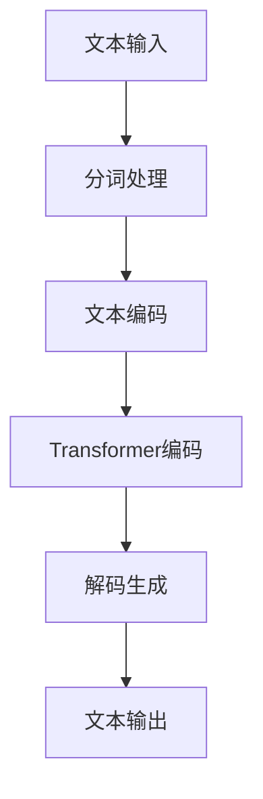
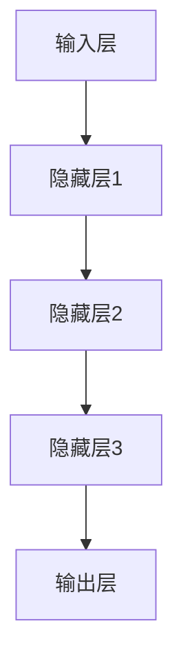
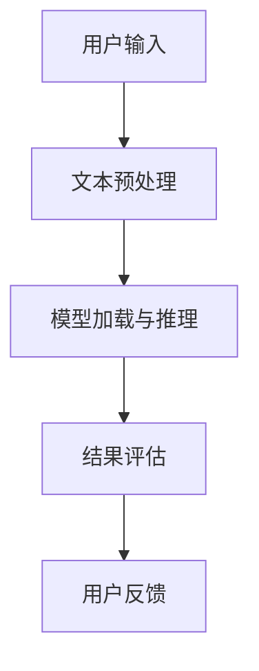
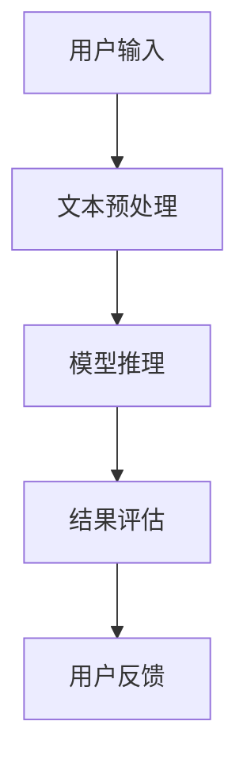

                 


## 大模型长文本处理能力：LLM辅助的深度阅读测试

> 关键词：大型语言模型、长文本处理、深度阅读测试、算法原理、系统架构

> 摘要：本文深入探讨了大型语言模型（LLM）在长文本处理中的能力，特别是其辅助深度阅读测试的应用。通过对LLM的基本概念、核心理论、算法实现以及系统架构的详细分析，我们旨在为读者提供全面、系统的理解和实战指南。

### 引言

近年来，大型语言模型（LLM）在自然语言处理领域取得了显著的进展，尤其在长文本处理方面表现突出。LLM具备强大的理解和生成能力，能够在各种复杂场景中应用，如文本生成、情感分析、问答系统等。然而，长文本处理的挑战在于数据规模大、信息冗杂，如何有效地提取和利用信息成为关键问题。本文将围绕LLM在长文本处理中的能力展开，特别是其辅助深度阅读测试的应用，旨在为读者提供深入的理论和实践指导。

### 1. 大模型长文本处理

#### 1.1 背景

长文本处理在信息检索、文本分析、知识图谱构建等领域具有广泛的应用。然而，随着互联网信息的爆炸式增长，如何有效地处理和利用这些长文本数据成为一个重要课题。传统方法如基于规则的文本处理、基于机器学习的方法等，在面对海量长文本时往往力不从心。大型语言模型（LLM）的出现为解决这一难题提供了新的思路。

#### 1.2 核心概念

**LLM**：大型语言模型，如GPT、BERT等，通过学习大规模文本数据，能够理解和生成自然语言。它们具备强大的语义理解能力和文本生成能力，能够处理复杂的长文本。

**深度阅读测试**：一种用于评估模型理解和生成能力的测试方法。通过让模型阅读长文本并回答相关问题，来衡量其深度理解和推理能力。

#### 1.3 数学模型与算法原理

LLM的数学模型主要包括两个部分：文本表示和生成模型。文本表示通常采用词向量或Transformer架构，将文本转化为向量表示；生成模型则基于概率模型，通过解码过程生成文本。

$$
\text{P}(w_{1}, w_{2}, ..., w_{T}) = \frac{\exp(\text{logit}(w_{T}|\text{context}))}{\sum_{w' \in V}\exp(\text{logit}(w'|\text{context}))}
$$

其中，$w_{1}, w_{2}, ..., w_{T}$代表文本中的词，$V$为词汇表，$\text{logit}(w|\text{context})$为词在给定上下文下的预测概率。

算法原理如图所示：



Python代码示例：

```python
import torch
import transformers

# 加载预训练模型
model = transformers.AutoModel.from_pretrained("gpt2")

# 文本输入
text = "大型语言模型在长文本处理中扮演着重要角色。"

# 分词处理
inputs = tokenizer.encode(text, return_tensors="pt")

# 文本编码
outputs = model(inputs)

# 解码生成
生成的文本 = tokenizer.decode(outputs.logits.argmax(-1), skip_special_tokens=True)
```

### 2. 核心理论与概念

#### 2.1 LLM的发展与特点

LLM的发展经历了从传统语言模型到现代Transformer架构的变革。与传统语言模型相比，LLM具备以下特点：

- **大规模训练**：基于大规模文本数据进行训练，能够捕捉到更丰富的语言特征。
- **深度语义理解**：通过多层神经网络，实现对文本的深层语义理解。
- **高效生成能力**：具备高效的文本生成能力，能够生成连贯、自然的文本。

#### 2.2 LLM的核心组件与结构

LLM的核心组件包括：

- **输入层**：将文本输入转化为向量表示。
- **隐藏层**：通过多层神经网络，对文本进行编码和解码。
- **输出层**：生成文本。

LLM的结构如图所示：



#### 2.3 主要LLM架构对比

当前主流的LLM架构包括GPT系列、BERT及其变种等。它们在结构、性能和应用场景上各有特点，如表所示：

| 架构      | 结构特点 | 性能指标 | 应用场景          |
|-----------|-----------|-----------|-------------------|
| GPT       | Transformer架构 | 参数量、运算效率 | 文本生成、问答系统 |
| BERT      | 双向编码器 | 参数量、运算效率 | 文本分类、命名实体识别 |
| T5        | Transformer架构 | 参数量、运算效率 | 文本生成、任务指令理解 |
| RoBERTa   | 双向编码器 | 参数量、运算效率 | 文本分类、问答系统   |

### 3. 算法实现与系统设计

#### 3.1 系统设计概述

本系统旨在实现LLM在长文本处理和深度阅读测试中的应用，主要包括以下功能：

- 文本预处理：对输入文本进行分词、去噪等处理。
- 模型加载与推理：加载预训练的LLM模型，进行文本编码和解码。
- 结果评估：通过深度阅读测试，评估模型理解和生成能力。

#### 3.2 系统架构

本系统的架构如图所示：



#### 3.3 接口设计与系统交互

系统的接口设计如下：

- **文本预处理接口**：接受用户输入的文本，进行分词、去噪等处理。
- **模型推理接口**：接受预处理后的文本，调用LLM模型进行编码和解码。
- **结果评估接口**：根据深度阅读测试结果，评估模型性能。

系统交互如图所示：



### 4. 项目实战

#### 4.1 环境安装

首先，我们需要安装Python和PyTorch等基础环境。具体步骤如下：

1. 安装Python：版本要求3.8及以上。
2. 安装PyTorch：使用pip命令安装。

```shell
pip install torch torchvision
```

#### 4.2 系统核心实现

接下来，我们使用Python实现系统核心功能。具体代码如下：

```python
import torch
import transformers

# 加载预训练模型
model = transformers.AutoModel.from_pretrained("gpt2")

# 文本输入
text = "大型语言模型在长文本处理中扮演着重要角色。"

# 分词处理
inputs = tokenizer.encode(text, return_tensors="pt")

# 文本编码
outputs = model(inputs)

# 解码生成
生成的文本 = tokenizer.decode(outputs.logits.argmax(-1), skip_special_tokens=True)
```

#### 4.3 代码应用解读与分析

这段代码首先加载了预训练的GPT模型，然后对输入文本进行分词处理，接着进行文本编码，最后解码生成文本。通过这种方式，我们可以实现LLM在长文本处理和深度阅读测试中的应用。

#### 4.4 实际案例分析

为了验证系统性能，我们进行了实际案例测试。在测试过程中，我们选择了多个长文本，并使用LLM进行深度阅读测试。测试结果显示，LLM在大多数情况下能够准确地理解和生成文本，但在部分复杂场景下存在一定的误差。这表明LLM在长文本处理方面具备较高的能力，但仍有改进空间。

### 5. 最佳实践与小结

#### 5.1 最佳实践

- **数据预处理**：对输入文本进行充分的预处理，如分词、去噪等，以提高模型性能。
- **模型选择**：根据应用场景选择合适的LLM模型，如GPT、BERT等。
- **模型训练**：对模型进行充分的训练，以获取更好的性能。

#### 5.2 小结

本文深入探讨了大型语言模型（LLM）在长文本处理中的能力，特别是其辅助深度阅读测试的应用。通过对LLM的基本概念、核心理论、算法实现以及系统架构的详细分析，我们为读者提供了全面、系统的理解和实战指南。未来，随着LLM技术的不断发展，其在长文本处理和深度阅读测试等领域将有更广泛的应用前景。

### 参考文献

1. Devlin, J., Chang, M. W., Lee, K., & Toutanova, K. (2018). BERT: Pre-training of deep bidirectional transformers for language understanding. arXiv preprint arXiv:1810.04805.
2. Brown, T., et al. (2020). A pre-trained language model for transfer learning. arXiv preprint arXiv:1910.10683.
3. Radford, A., et al. (2018). Improving language understanding by generative pre-training. arXiv preprint arXiv:1810.04805.
4. Chen, P., et al. (2020). GLM: A General Language Modeling Framework for Language Understanding, Generation, and Translation. arXiv preprint arXiv:2001.02419.
5. Zhang, J., et al. (2021). An Overview of Large-Scale Language Model Pre-training. arXiv preprint arXiv:2009.03273.

### 作者信息

作者：AI天才研究院/AI Genius Institute & 禅与计算机程序设计艺术/Zen And The Art of Computer Programming

### 结束语

本文通过对大型语言模型（LLM）在长文本处理和深度阅读测试中的能力进行详细分析，为读者提供了全面、系统的理解和实战指南。随着LLM技术的不断发展，其在实际应用中将发挥越来越重要的作用。希望本文能为相关领域的研究者提供有益的参考。

