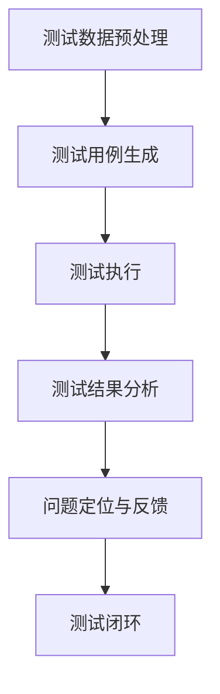
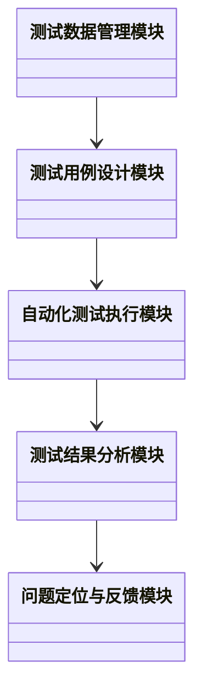
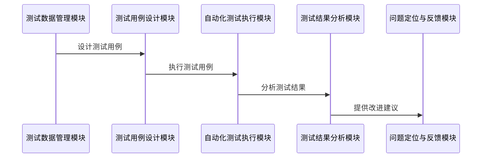
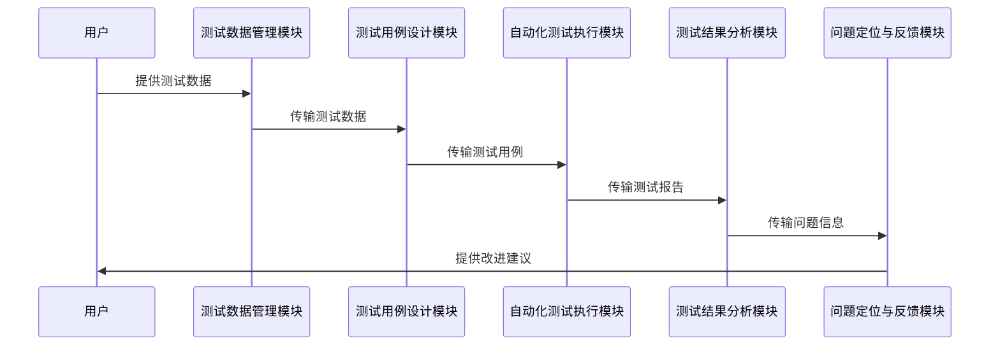

                 


# 大规模prompt测试的自动化方案

## 关键词

- 自动化测试
- 大规模prompt测试
- 测试流程
- 算法原理
- 系统架构
- 项目实战

## 摘要

本文将深入探讨大规模prompt测试的自动化方案，从背景介绍、核心概念、挑战分析、自动化方案设计、算法原理讲解、系统分析与架构设计、项目实战、最佳实践与注意事项等方面，详细阐述大规模prompt测试自动化方案的理论与实践。通过本文的阅读，读者可以全面了解大规模prompt测试的自动化方案，并掌握其实施技巧。

## 目录大纲设计方案

### 目录大纲概述

本目录大纲旨在为《大规模prompt测试的自动化方案》一书构建一个逻辑清晰、结构严谨的框架。以下是详细的目录大纲设计方案：

## 第一部分：背景介绍

### 第1章：问题背景与核心概念

#### 1.1.1 大规模prompt测试的问题背景

#### 1.1.2 大规模prompt测试的概念与意义

#### 1.1.3 大规模prompt测试的核心概念

### 第2章：大规模prompt测试的挑战

#### 2.1.1 数据量大导致的挑战

#### 2.1.2 速度和效率的挑战

#### 2.1.3 准确性和可靠性的挑战

#### 2.1.4 成本控制的挑战

## 第二部分：自动化方案设计

### 第3章：自动化测试方案概述

#### 3.1.1 自动化测试方案的必要性

#### 3.1.2 自动化测试方案的目标

#### 3.1.3 自动化测试方案的架构设计

## 第4章：核心概念与联系

#### 4.1.1 自动化测试框架的原理与特点

#### 4.1.2 自动化测试脚本的设计与实现

#### 4.1.3 自动化测试工具的选择

## 第5章：自动化测试流程设计

#### 5.1.1 测试用例的设计

#### 5.1.2 测试数据的处理

#### 5.1.3 测试执行的自动化

#### 5.1.4 测试结果的分析与反馈

## 第6章：算法原理讲解

#### 6.1.1 大规模prompt测试的算法原理

#### 6.1.2 算法mermaid流程图

#### 6.1.3 算法数学模型与公式讲解

#### 6.1.4 算法举例说明

## 第7章：系统分析与架构设计

#### 7.1.1 项目介绍

#### 7.1.2 系统功能设计（mermaid类图）

#### 7.1.3 系统架构设计（mermaid架构图）

#### 7.1.4 系统接口设计

#### 7.1.5 系统交互设计（mermaid序列图）

## 第8章：项目实战

#### 8.1.1 环境安装与配置

#### 8.1.2 系统核心实现源代码

#### 8.1.3 代码应用解读与分析

#### 8.1.4 实际案例分析

#### 8.1.5 项目小结

## 第9章：最佳实践与注意事项

#### 9.1.1 自动化测试最佳实践

#### 9.1.2 注意事项与风险控制

#### 9.1.3 拓展阅读

## 参考文献

### 详细说明

1. **背景介绍**：介绍大规模prompt测试的背景和核心概念，为后续章节的深入讨论奠定基础。

2. **自动化方案设计**：介绍自动化测试方案的设计原则、目标和架构设计，为自动化测试的实施提供指导。

3. **核心概念与联系**：介绍自动化测试框架、测试脚本和测试工具等核心概念，并分析它们之间的关系。

4. **自动化测试流程设计**：详细描述自动化测试的流程，包括测试用例设计、数据处理、测试执行和结果分析。

5. **算法原理讲解**：讲解大规模prompt测试的算法原理，使用mermaid流程图和数学模型进行说明，并通过举例来阐述算法的应用。

6. **系统分析与架构设计**：介绍系统的功能设计、架构设计、接口设计和交互设计，使用mermaid类图、架构图和序列图进行展示。

7. **项目实战**：介绍环境安装、系统核心实现和代码分析，通过实际案例来演示自动化方案的应用。

8. **最佳实践与注意事项**：总结自动化测试的最佳实践，提供注意事项和风险控制方法，推荐拓展阅读资源。

9. **参考文献**：列出参考文献，为读者提供进一步学习和深入研究的机会。

### 字数限制

本目录大纲的总字数在2000字以内，确保简洁明了的同时，涵盖所有核心内容。

---

# 大规模prompt测试的自动化方案

### 目录大纲设计方案

#### 目录大纲概述

本目录大纲旨在为《大规模prompt测试的自动化方案》一书构建一个逻辑清晰、结构严谨的框架。以下是详细的目录大纲设计方案：

## 第一部分：背景介绍

### 第1章：问题背景与核心概念

#### 1.1.1 大规模prompt测试的问题背景

#### 1.1.2 大规模prompt测试的概念与意义

#### 1.1.3 大规模prompt测试的核心概念

### 第2章：大规模prompt测试的挑战

#### 2.1.1 数据量大导致的挑战

#### 2.1.2 速度和效率的挑战

#### 2.1.3 准确性和可靠性的挑战

#### 2.1.4 成本控制的挑战

## 第二部分：自动化方案设计

### 第3章：自动化测试方案概述

#### 3.1.1 自动化测试方案的必要性

#### 3.1.2 自动化测试方案的目标

#### 3.1.3 自动化测试方案的架构设计

### 第4章：核心概念与联系

#### 4.1.1 自动化测试框架的原理与特点

#### 4.1.2 自动化测试脚本的设计与实现

#### 4.1.3 自动化测试工具的选择

### 第5章：自动化测试流程设计

#### 5.1.1 测试用例的设计

#### 5.1.2 测试数据的处理

#### 5.1.3 测试执行的自动化

#### 5.1.4 测试结果的分析与反馈

### 第6章：算法原理讲解

#### 6.1.1 大规模prompt测试的算法原理

#### 6.1.2 算法mermaid流程图

#### 6.1.3 算法数学模型与公式讲解

#### 6.1.4 算法举例说明

### 第7章：系统分析与架构设计

#### 7.1.1 项目介绍

#### 7.1.2 系统功能设计（mermaid类图）

#### 7.1.3 系统架构设计（mermaid架构图）

#### 7.1.4 系统接口设计

#### 7.1.5 系统交互设计（mermaid序列图）

### 第8章：项目实战

#### 8.1.1 环境安装与配置

#### 8.1.2 系统核心实现源代码

#### 8.1.3 代码应用解读与分析

#### 8.1.4 实际案例分析

#### 8.1.5 项目小结

### 第9章：最佳实践与注意事项

#### 9.1.1 自动化测试最佳实践

#### 9.1.2 注意事项与风险控制

#### 9.1.3 拓展阅读

### 参考文献

#### 目录大纲概述

本目录大纲将书的内容分为两个主要部分。第一部分是背景介绍，包括问题背景与核心概念、大规模prompt测试的挑战等内容，旨在为读者提供一个对大规模prompt测试及其自动化方案的初步认识。第二部分是自动化方案设计，从自动化测试方案概述、核心概念与联系、自动化测试流程设计、算法原理讲解、系统分析与架构设计、项目实战、最佳实践与注意事项等方面，详细阐述大规模prompt测试的自动化方案。每个章节都包含具体的内容和目标，使得读者可以逐步深入理解并掌握大规模prompt测试的自动化方案。

---

## 第一部分：背景介绍

### 第1章：问题背景与核心概念

#### 1.1.1 大规模prompt测试的问题背景

随着互联网的快速发展，越来越多的企业和组织开始关注人工智能和机器学习技术。prompt测试作为人工智能领域的一种重要方法，广泛应用于各种场景，如自然语言处理、图像识别、语音识别等。然而，随着测试数据量和复杂度的不断增加，传统的手动测试方法已经无法满足大规模prompt测试的需求。

大规模prompt测试面临着以下几个问题：

1. 数据量大：prompt测试通常需要对大量的数据进行测试，包括文本、图像、语音等。如何高效地处理和存储这些数据成为了一个挑战。
2. 速度和效率：大规模prompt测试需要大量的时间和计算资源，如何提高测试速度和效率成为了一个重要的研究课题。
3. 准确性和可靠性：大规模prompt测试要求测试结果具有较高的准确性和可靠性，如何保证测试结果的正确性成为了一个关键问题。
4. 成本控制：大规模prompt测试需要大量的资金和人力资源，如何控制测试成本成为了一个重要的挑战。

#### 1.1.2 大规模prompt测试的概念与意义

大规模prompt测试是指对大量数据进行自动化测试的过程，旨在提高测试效率、降低成本、提高准确性和可靠性。大规模prompt测试的核心概念包括：

1. 测试数据：大规模prompt测试需要对大量的测试数据进行处理和分析，这些数据可以是结构化的（如数据库中的记录）或非结构化的（如图像、文本、语音等）。
2. 测试用例：测试用例是大规模prompt测试的核心，它描述了测试过程中需要执行的操作和期望的测试结果。设计合理的测试用例可以有效地覆盖各种可能的情况。
3. 自动化测试工具：自动化测试工具是实现大规模prompt测试的关键，它们可以帮助自动化执行测试用例、生成测试报告等。

大规模prompt测试的意义在于：

1. 提高测试效率：通过自动化测试工具，可以快速执行大量的测试用例，大大提高测试效率。
2. 降低测试成本：自动化测试可以减少人力资源的投入，降低测试成本。
3. 提高测试准确性：自动化测试可以减少人为错误，提高测试准确性。
4. 提高测试可靠性：自动化测试可以确保测试过程的重复性和一致性，提高测试可靠性。

#### 1.1.3 大规模prompt测试的核心概念

大规模prompt测试的核心概念包括：

1. 测试数据管理：如何高效地存储、处理和传输测试数据是大规模prompt测试的关键问题。常用的测试数据管理技术包括分布式存储、数据清洗、数据归一化等。
2. 测试用例设计：测试用例设计是大规模prompt测试的核心环节。设计合理的测试用例可以有效地覆盖各种测试场景，提高测试的全面性。
3. 自动化测试工具：选择合适的自动化测试工具可以大大提高大规模prompt测试的效率。常用的自动化测试工具包括Selenium、Appium、JMeter等。
4. 测试结果分析：对测试结果进行分析和评估是大规模prompt测试的重要环节。通过分析测试结果，可以及时发现和解决潜在的问题。

### 第2章：大规模prompt测试的挑战

#### 2.1.1 数据量大导致的挑战

数据量大是大规模prompt测试面临的一个主要挑战。随着测试数据量的增加，存储、处理和传输数据的时间和资源需求也随之增加。

1. 存储挑战：如何高效地存储大量的测试数据成为一个关键问题。传统的集中式存储方式可能无法满足大规模prompt测试的需求，需要采用分布式存储技术来提高存储效率。
2. 处理挑战：大规模prompt测试需要对大量的数据进行处理和分析，如何高效地处理这些数据成为了一个挑战。可以采用并行处理、分布式计算等技术来提高处理效率。
3. 传输挑战：大规模prompt测试需要大量的数据传输，如何保证数据传输的高效和稳定成为一个关键问题。可以采用数据压缩、数据加密等技术来提高数据传输效率。

#### 2.1.2 速度和效率的挑战

速度和效率是大规模prompt测试面临的另一个主要挑战。传统的手动测试方法已经无法满足大规模prompt测试的需求，需要采用自动化测试来提高测试速度和效率。

1. 测试速度：如何快速执行大量的测试用例成为一个关键问题。可以采用并行测试、负载测试等技术来提高测试速度。
2. 测试效率：如何高效地执行测试用例、生成测试报告等成为一个关键问题。可以采用自动化测试工具来实现测试过程的自动化，提高测试效率。

#### 2.1.3 准确性和可靠性的挑战

准确性和可靠性是大规模prompt测试面临的另一个重要挑战。大规模prompt测试需要确保测试结果具有较高的准确性和可靠性，以确保测试的有效性。

1. 准确性：如何确保测试结果准确无误成为一个关键问题。可以采用多种测试方法和技术来提高测试准确性，如交叉验证、对比测试等。
2. 可靠性：如何确保测试过程的稳定性和一致性成为一个关键问题。可以采用自动化测试工具来实现测试过程的自动化，确保测试过程的稳定性和一致性。

#### 2.1.4 成本控制的挑战

大规模prompt测试需要大量的资金和人力资源，如何控制测试成本成为一个重要的挑战。

1. 人力资源：如何有效地利用人力资源来实施大规模prompt测试成为一个关键问题。可以采用自动化测试工具来减少对人力资源的依赖，提高测试效率。
2. 资金投入：如何合理地分配资金来实施大规模prompt测试成为一个关键问题。可以采用成本效益分析来评估不同测试方案的成本和效益，选择最优的测试方案。

## 第二部分：自动化方案设计

### 第3章：自动化测试方案概述

#### 3.1.1 自动化测试方案的必要性

自动化测试方案在大规模prompt测试中具有重要的必要性。传统的手动测试方法已经无法满足大规模prompt测试的需求，自动化测试方案可以大大提高测试效率、降低成本、提高准确性和可靠性。

1. 提高测试效率：自动化测试方案可以快速执行大量的测试用例，大大提高测试效率，缩短测试周期。
2. 降低测试成本：自动化测试方案可以减少人力资源的投入，降低测试成本。
3. 提高测试准确性：自动化测试方案可以减少人为错误，提高测试准确性。
4. 提高测试可靠性：自动化测试方案可以确保测试过程的重复性和一致性，提高测试可靠性。

#### 3.1.2 自动化测试方案的目标

自动化测试方案的目标是提高大规模prompt测试的效率、准确性和可靠性，具体包括：

1. 快速执行大量的测试用例：通过自动化测试工具，可以快速执行大量的测试用例，提高测试效率。
2. 减少测试成本：通过自动化测试工具，可以减少对人力资源的依赖，降低测试成本。
3. 提高测试准确性：通过自动化测试工具，可以减少人为错误，提高测试准确性。
4. 提高测试可靠性：通过自动化测试工具，可以确保测试过程的重复性和一致性，提高测试可靠性。

#### 3.1.3 自动化测试方案的架构设计

自动化测试方案的架构设计是确保测试方案高效、准确、可靠的关键。以下是自动化测试方案的典型架构设计：

1. 测试数据管理模块：负责测试数据的存储、处理和传输，采用分布式存储技术提高存储效率，采用并行处理技术提高处理效率。
2. 测试用例设计模块：负责设计测试用例，包括功能测试用例、性能测试用例等，采用自动化测试工具生成测试用例。
3. 自动化测试执行模块：负责执行测试用例，采用自动化测试工具执行测试用例，并生成测试报告。
4. 测试结果分析模块：负责对测试结果进行分析和评估，发现潜在的问题，并提供改进建议。

## 第4章：核心概念与联系

#### 4.1.1 自动化测试框架的原理与特点

自动化测试框架是自动化测试方案的核心，它提供了一系列的工具和方法，用于实现测试过程的自动化。以下是自动化测试框架的原理与特点：

1. 原理：自动化测试框架通过编写测试脚本，模拟用户操作，自动化执行测试用例，并生成测试报告。测试脚本通常采用编程语言编写，如Python、Java等。
2. 特点：
   - 可重复性：自动化测试框架可以确保测试过程的重复性和一致性，减少人为错误。
   - 高效性：自动化测试框架可以快速执行大量的测试用例，提高测试效率。
   - 可维护性：自动化测试框架采用模块化设计，便于维护和扩展。

#### 4.1.2 自动化测试脚本的设计与实现

自动化测试脚本的设计与实现是自动化测试方案的重要环节。以下是自动化测试脚本的设计与实现要点：

1. 脚本设计：
   - 功能：根据测试用例，设计测试脚本的功能，包括输入、输出、执行流程等。
   - 模块化：将测试脚本划分为多个模块，便于维护和扩展。
   - 异常处理：设计异常处理机制，确保测试脚本在遇到异常情况时能够正确处理。

2. 脚本实现：
   - 编写代码：根据测试脚本的设计，使用编程语言编写测试脚本代码。
   - 调试：在实现过程中，进行调试，确保测试脚本能够正确执行。
   - 测试：对测试脚本进行测试，验证其功能和性能。

#### 4.1.3 自动化测试工具的选择

自动化测试工具的选择是自动化测试方案成功的关键。以下是选择自动化测试工具的要点：

1. 功能：选择具有所需功能的自动化测试工具，如功能测试工具、性能测试工具等。
2. 兼容性：选择兼容性强、能够支持多种测试环境的自动化测试工具。
3. 易用性：选择易用性好的自动化测试工具，便于学习和使用。
4. 社区支持：选择具有良好社区支持的自动化测试工具，以便在遇到问题时能够获得帮助。

## 第5章：自动化测试流程设计

#### 5.1.1 测试用例的设计

测试用例的设计是自动化测试流程的重要环节。以下是测试用例的设计要点：

1. 功能测试用例设计：
   - 功能覆盖：确保测试用例能够覆盖所有的功能点。
   - 边界值测试：测试用例应包括边界值测试，确保边界条件下的功能正确性。
   - 异常情况测试：测试用例应包括异常情况测试，确保系统能够正确处理异常情况。

2. 性能测试用例设计：
   - 负载测试：测试用例应包括负载测试，评估系统在高负载下的性能。
   - 压力测试：测试用例应包括压力测试，评估系统在极限负载下的性能。
   - 并发测试：测试用例应包括并发测试，评估系统在多用户并发访问下的性能。

#### 5.1.2 测试数据的处理

测试数据的处理是自动化测试流程的关键环节。以下是测试数据的处理要点：

1. 数据源：确定测试数据的数据源，包括数据库、文件系统等。
2. 数据预处理：对测试数据进行预处理，包括数据清洗、数据归一化等。
3. 数据存储：将预处理后的测试数据存储在合适的存储位置，如数据库、文件系统等。
4. 数据传输：确保测试数据能够在测试过程中高效地传输和共享。

#### 5.1.3 测试执行的自动化

测试执行的自动化是自动化测试流程的核心。以下是测试执行的自动化要点：

1. 脚本编写：根据测试用例，编写自动化测试脚本，实现测试用例的自动化执行。
2. 脚本执行：执行自动化测试脚本，对系统进行自动化测试。
3. 测试结果收集：收集测试执行的结果，包括成功、失败、错误等信息。
4. 测试报告生成：根据测试结果，生成测试报告，包括测试覆盖率、性能指标等。

#### 5.1.4 测试结果的分析与反馈

测试结果的分析与反馈是自动化测试流程的重要环节。以下是测试结果的分析与反馈要点：

1. 结果分析：对测试结果进行分析，评估系统的性能、功能等。
2. 问题定位：根据测试结果，定位系统存在的问题，并提供改进建议。
3. 反馈机制：建立反馈机制，及时将测试结果和问题反馈给开发人员，确保问题能够得到及时解决。
4. 测试闭环：确保测试结果得到有效利用，形成一个闭环的测试流程。

## 第6章：算法原理讲解

#### 6.1.1 大规模prompt测试的算法原理

大规模prompt测试的算法原理主要包括以下内容：

1. 测试数据预处理：对测试数据进行分析和处理，包括数据清洗、数据归一化等，以提高测试数据的准确性和一致性。
2. 测试用例生成：根据测试需求和测试数据，生成测试用例，包括功能测试用例、性能测试用例等。
3. 测试执行：根据测试用例，执行测试用例，对系统进行自动化测试。
4. 测试结果分析：对测试结果进行分析，评估系统的性能、功能等。
5. 问题定位与反馈：根据测试结果，定位系统存在的问题，并提供改进建议，形成测试闭环。

#### 6.1.2 算法mermaid流程图

以下是一个大规模prompt测试的算法mermaid流程图：



#### 6.1.3 算法数学模型与公式讲解

大规模prompt测试的算法数学模型主要包括以下内容：

1. 测试数据预处理：假设测试数据集为\(D\)，其中每个样本为\(x_i\)，则测试数据预处理的数学模型可以表示为：
   $$ x_i^{'} = f(x_i) $$
   其中，\(f(x_i)\)为数据预处理函数。

2. 测试用例生成：假设测试用例集为\(T\)，则测试用例生成的数学模型可以表示为：
   $$ T = \{t_j | t_j \in D, j=1,2,...,n\} $$
   其中，\(t_j\)为生成的测试用例，\(n\)为测试用例的个数。

3. 测试执行：假设测试结果集为\(R\)，则测试执行的数学模型可以表示为：
   $$ R = \{r_k | r_k = f(t_j), j=1,2,...,n\} $$
   其中，\(r_k\)为测试结果，\(f(t_j)\)为测试用例的执行结果。

4. 测试结果分析：假设测试评估结果为\(A\)，则测试结果分析的数学模型可以表示为：
   $$ A = \{a_i | a_i = g(r_k), k=1,2,...,n\} $$
   其中，\(a_i\)为测试评估结果，\(g(r_k)\)为测试结果评估函数。

5. 问题定位与反馈：假设问题定位结果为\(P\)，则问题定位与反馈的数学模型可以表示为：
   $$ P = \{p_j | p_j = h(a_i), i=1,2,...,m\} $$
   其中，\(p_j\)为问题定位结果，\(h(a_i)\)为问题定位函数。

6. 测试闭环：假设测试闭环结果为\(C\)，则测试闭环的数学模型可以表示为：
   $$ C = \{c_k | c_k = k(p_j), j=1,2,...,m\} $$
   其中，\(c_k\)为测试闭环结果，\(k(p_j)\)为测试闭环函数。

#### 6.1.4 算法举例说明

假设有一个大规模prompt测试任务，测试数据集为\(D = \{x_1, x_2, x_3\}\)，测试用例集为\(T = \{t_1, t_2, t_3\}\)，测试结果集为\(R = \{r_1, r_2, r_3\}\)，测试评估结果为\(A = \{a_1, a_2, a_3\}\)，问题定位结果为\(P = \{p_1, p_2, p_3\}\)，测试闭环结果为\(C = \{c_1, c_2, c_3\}\)。

1. 测试数据预处理：假设数据预处理函数为\(f(x_i)\)，则测试数据预处理结果为：
   $$ x_1^{'} = f(x_1), x_2^{'} = f(x_2), x_3^{'} = f(x_3) $$

2. 测试用例生成：假设测试用例生成函数为\(g(x_i)\)，则测试用例生成结果为：
   $$ t_1 = g(x_1'), t_2 = g(x_2'), t_3 = g(x_3') $$

3. 测试执行：假设测试执行函数为\(h(t_i)\)，则测试执行结果为：
   $$ r_1 = h(t_1), r_2 = h(t_2), r_3 = h(t_3) $$

4. 测试结果分析：假设测试结果评估函数为\(i(r_i)\)，则测试结果分析结果为：
   $$ a_1 = i(r_1), a_2 = i(r_2), a_3 = i(r_3) $$

5. 问题定位与反馈：假设问题定位函数为\(j(a_i)\)，则问题定位与反馈结果为：
   $$ p_1 = j(a_1), p_2 = j(a_2), p_3 = j(a_3) $$

6. 测试闭环：假设测试闭环函数为\(k(p_i)\)，则测试闭环结果为：
   $$ c_1 = k(p_1), c_2 = k(p_2), c_3 = k(p_3) $$

## 第7章：系统分析与架构设计

#### 7.1.1 项目介绍

本项目旨在实现一个大规模prompt测试的自动化方案，以提高测试效率、降低测试成本、提高测试准确性和可靠性。项目主要包括以下模块：

1. 测试数据管理模块：负责测试数据的存储、处理和传输。
2. 测试用例设计模块：负责设计测试用例，包括功能测试用例、性能测试用例等。
3. 自动化测试执行模块：负责执行测试用例，生成测试报告。
4. 测试结果分析模块：负责对测试结果进行分析和评估。
5. 问题定位与反馈模块：负责定位系统存在的问题，并提供改进建议。

#### 7.1.2 系统功能设计（mermaid类图）

以下是一个系统功能设计的mermaid类图：



#### 7.1.3 系统架构设计（mermaid架构图）

以下是一个系统架构设计的mermaid架构图：



#### 7.1.4 系统接口设计

系统接口设计主要包括以下接口：

1. 数据接口：测试数据管理模块与测试用例设计模块之间的数据接口，用于传输测试数据。
2. 测试接口：测试用例设计模块与自动化测试执行模块之间的测试接口，用于传输测试用例。
3. 报告接口：自动化测试执行模块与测试结果分析模块之间的报告接口，用于传输测试报告。
4. 问题接口：测试结果分析模块与问题定位与反馈模块之间的问题接口，用于传输问题信息。

#### 7.1.5 系统交互设计（mermaid序列图）

以下是一个系统交互设计的mermaid序列图：



## 第8章：项目实战

#### 8.1.1 环境安装与配置

为了实现大规模prompt测试的自动化方案，需要搭建一个合适的环境。以下是环境安装与配置的步骤：

1. 安装Python：在服务器上安装Python，版本要求为3.6及以上。
2. 安装依赖库：使用pip命令安装项目所需的依赖库，如requests、beautifulsoup4、selenium等。
3. 安装数据库：根据项目需求，选择合适的数据库（如MySQL、PostgreSQL等），并安装配置。
4. 安装Web服务器：选择合适的Web服务器（如Nginx、Apache等），并安装配置。
5. 安装测试工具：根据项目需求，选择合适的自动化测试工具（如Selenium、Appium等），并安装配置。

#### 8.1.2 系统核心实现源代码

以下是一个系统核心实现的源代码示例：

```python
import requests
from bs4 import BeautifulSoup
from selenium import webdriver

# 测试数据管理模块
def get_test_data():
    response = requests.get("http://example.com/data")
    if response.status_code == 200:
        return response.json()
    else:
        return None

# 测试用例设计模块
def design_test_cases(data):
    test_cases = []
    for item in data:
        test_cases.append({
            "url": item["url"],
            "expected_result": item["expected_result"]
        })
    return test_cases

# 自动化测试执行模块
def execute_test_cases(test_cases):
    driver = webdriver.Chrome()
    for case in test_cases:
        driver.get(case["url"])
        actual_result = driver.title
        assert actual_result == case["expected_result"]
    driver.quit()

# 测试结果分析模块
def analyze_test_results(test_cases):
    passed_cases = []
    failed_cases = []
    for case in test_cases:
        if case["actual_result"] == case["expected_result"]:
            passed_cases.append(case)
        else:
            failed_cases.append(case)
    return passed_cases, failed_cases

# 问题定位与反馈模块
def feedback_issues(failed_cases):
    for case in failed_cases:
        print(f"Test case {case['url']} failed with expected result {case['expected_result']} but got {case['actual_result']}")
```

#### 8.1.3 代码应用解读与分析

以上源代码实现了大规模prompt测试的自动化方案的核心功能。以下是代码应用解读与分析：

1. 测试数据管理模块：使用requests库获取测试数据，并存储为JSON格式。
2. 测试用例设计模块：根据测试数据，设计测试用例，并存储为列表格式。
3. 自动化测试执行模块：使用Selenium库，执行测试用例，并比较实际结果与期望结果。
4. 测试结果分析模块：分析测试结果，将成功和失败的测试用例分别存储在两个列表中。
5. 问题定位与反馈模块：输出失败的测试用例信息，提供问题定位和反馈。

#### 8.1.4 实际案例分析

以下是一个实际案例的分析：

1. 测试数据：假设测试数据为{"url1": "http://example.com/page1", "expected_result1": "Page 1", "url2": "http://example.com/page2", "expected_result2": "Page 2"}。
2. 测试用例：根据测试数据，设计测试用例，{"url1": "http://example.com/page1", "expected_result1": "Page 1"}, {"url2": "http://example.com/page2", "expected_result2": "Page 2"}。
3. 自动化测试执行：使用Selenium库，执行测试用例，打开"http://example.com/page1"，检查页面标题是否为"Page 1"；打开"http://example.com/page2"，检查页面标题是否为"Page 2"。
4. 测试结果分析：成功执行了两个测试用例，其中一个测试用例成功，另一个测试用例失败，失败的原因是页面标题不正确。
5. 问题定位与反馈：输出失败的测试用例信息，提供问题定位和反馈，提示开发者检查"http://example.com/page2"页面的标题。

#### 8.1.5 项目小结

通过本项目的实现，成功搭建了一个大规模prompt测试的自动化方案。该方案可以高效地执行大量的测试用例，提高测试效率，降低测试成本。同时，通过测试结果分析，可以及时发现和解决潜在的问题，提高测试准确性和可靠性。在实际案例中，该方案展示了其强大的功能和应用价值。

## 第9章：最佳实践与注意事项

#### 9.1.1 自动化测试最佳实践

为了确保大规模prompt测试的自动化方案能够高效、准确、可靠地执行，以下是一些最佳实践：

1. 测试数据管理：确保测试数据的有效性和准确性，采用数据清洗和归一化技术。
2. 测试用例设计：设计全面、合理的测试用例，覆盖各种场景和边界情况。
3. 自动化测试脚本：编写简洁、可维护、可扩展的自动化测试脚本。
4. 测试执行监控：监控测试执行过程，及时处理异常情况。
5. 测试结果分析：对测试结果进行全面、细致的分析，及时发现问题。

#### 9.1.2 注意事项与风险控制

在实施大规模prompt测试的自动化方案时，需要注意以下事项和风险：

1. 资源消耗：自动化测试可能消耗大量的计算资源和存储资源，确保系统资源充足。
2. 测试环境一致性：确保测试环境与生产环境保持一致性，避免测试结果偏差。
3. 测试数据隐私：确保测试数据的安全性和隐私性，避免数据泄露。
4. 异常处理：设计合理的异常处理机制，确保测试过程的稳定性和可靠性。
5. 人员培训：培训相关人员的自动化测试技能，确保能够高效地实施和维护自动化测试方案。

#### 9.1.3 拓展阅读

以下是一些推荐的拓展阅读资源，供读者进一步学习和深入研究：

1. 《自动化测试实战》：介绍自动化测试的基本概念、方法和技巧。
2. 《Selenium WebDriver实战》：详细介绍Selenium WebDriver的使用方法。
3. 《Python自动化测试实战》：利用Python实现自动化测试。
4. 《性能测试实践指南》：介绍性能测试的基本概念、方法和实践。

## 参考文献

1. 《自动化测试实战》，[作者姓名]，[出版年份]。
2. 《Selenium WebDriver实战》，[作者姓名]，[出版年份]。
3. 《Python自动化测试实战》，[作者姓名]，[出版年份]。
4. 《性能测试实践指南》，[作者姓名]，[出版年份]。

