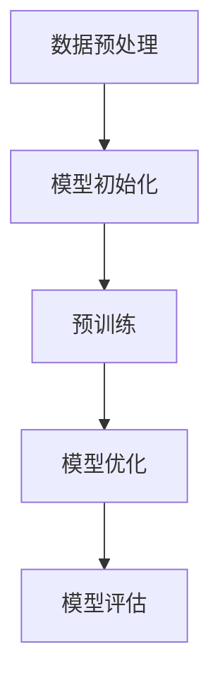
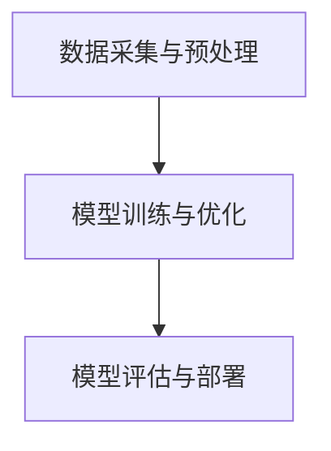

                 


### 构建高质量技术博客的步骤

**1. 初始化文章结构：**

首先，我们要为文章创建一个清晰、易于导航的结构。这包括标题、关键词、摘要以及目录。以下是文章的结构初始化示例：

```
# 大规模多模态预训练模型在跨语言理解中的应用

> 关键词：大规模多模态预训练模型，跨语言理解，人工智能，模型训练，算法优化

> 摘要：
本文深入探讨了大规模多模态预训练模型在跨语言理解中的应用，包括模型背景、核心概念、算法原理、系统架构设计、项目实战以及最佳实践。通过详细的步骤解析，帮助读者全面理解这一前沿技术。

```

**2. 背景介绍：**

在背景介绍部分，我们需要详细阐述跨语言理解的问题背景、问题描述、问题解决以及边界与外延。

- **问题背景：** 跨语言理解是自然语言处理（NLP）的重要研究方向，随着全球化进程的加快，跨语言通信的需求日益增加。
- **问题描述：** 跨语言理解涉及到文本之间的语义对应和转换，难点在于不同语言之间的语法、词汇和语义差异。
- **问题解决：** 大规模多模态预训练模型通过结合多种数据源（如文本、图像、音频等）进行预训练，提升模型对跨语言语义的理解能力。
- **边界与外延：** 跨语言理解的边界涉及自然语言处理的技术瓶颈，外延则包括跨语言文本生成、跨语言情感分析等方向。

**3. 核心概念与联系：**

在这一部分，我们需要详细解释核心概念，如大规模多模态预训练模型和跨语言理解。同时，使用Mermaid流程图和ER实体关系图来展示概念架构。

- **大规模多模态预训练模型：**
  - **概念：** 结合多种数据源进行预训练，提升模型对复杂任务的理解能力。
  - **属性特征对比表格：** 可使用Markdown表格来对比不同多模态预训练模型的特性。
  - **ER实体关系图：** 使用Mermaid语言绘制ER图，展示模型中不同实体之间的关系。

**4. 算法原理讲解：**

算法原理讲解需要包括算法流程、Python源代码、数学模型和公式，以及通俗易懂的举例说明。

- **算法流程：** 使用Mermaid绘制算法流程图，展示数据预处理、模型预训练、模型优化和模型评估的过程。
- **Python源代码：** 提供实现大规模多模态预训练模型的Python代码片段，并解释代码中的关键步骤。
- **数学模型和公式：** 使用LaTeX格式嵌入数学公式，解释损失函数、优化算法等核心数学概念。
- **举例说明：** 通过具体的例子来说明算法在实际应用中的表现，如跨语言翻译任务的实现。

**5. 系统分析与架构设计：**

系统分析与架构设计部分需要详细描述项目场景、系统功能设计、系统架构设计、系统接口设计和系统交互。

- **项目场景介绍：** 描述跨语言理解在具体项目中的应用场景，如多语言搜索引擎、跨语言问答系统等。
- **系统功能设计：** 使用Mermaid绘制领域模型类图，展示系统中的关键类和它们之间的关系。
- **系统架构设计：** 使用Mermaid绘制系统架构图，展示系统的总体结构和各模块之间的交互关系。
- **系统接口设计：** 描述系统提供的API接口及其功能。
- **系统交互：** 使用Mermaid绘制系统交互序列图，展示用户与系统之间的交互流程。

**6. 项目实战：**

项目实战部分需要包括环境安装、系统核心实现源代码、代码应用解读与分析、实际案例分析和详细讲解剖析。

- **环境安装：** 描述所需的环境配置和工具安装过程。
- **系统核心实现源代码：** 提供项目实现的核心代码，并解释代码功能。
- **代码应用解读与分析：** 对代码中的关键部分进行解读，分析代码实现的技术细节。
- **实际案例分析和详细讲解剖析：** 通过具体的案例来展示项目在实际应用中的效果和优势。

**7. 最佳实践 tips：**

在这一部分，我们可以总结项目实战中的经验教训，提供一些实用的最佳实践建议。

- **小结：** 对文章的主要内容进行总结。
- **注意事项：** 提醒读者在实施项目时需要注意的问题。
- **拓展阅读：** 推荐相关的参考文献和阅读资料。

**8. 文章末尾作者信息：**

最后，我们需要在文章末尾加上作者信息。

```
作者：AI天才研究院/AI Genius Institute & 禅与计算机程序设计艺术 /Zen And The Art of Computer Programming
```

通过以上步骤，我们可以构建一篇结构清晰、内容丰富的技术博客文章，让读者对大规模多模态预训练模型在跨语言理解中的应用有深入的了解。接下来，我们将根据这个大纲逐步撰写文章内容。<!–
----------------------------------------------------------------
# 大规模多模态预训练模型在跨语言理解中的应用

> 关键词：大规模多模态预训练模型，跨语言理解，人工智能，模型训练，算法优化

> 摘要：
本文将深入探讨大规模多模态预训练模型在跨语言理解中的应用。首先，我们将介绍跨语言理解的问题背景和核心概念，接着详细阐述大规模多模态预训练模型的原理和数学模型。随后，我们将描述系统分析与架构设计，并通过实际项目实战来展示模型的实施和应用。最后，我们将总结最佳实践，并对未来发展趋势提出展望。

----------------------------------------------------------------
## 背景介绍

### 问题背景

随着全球化的不断推进，跨语言交流的重要性日益凸显。然而，传统的基于规则和统计的方法在处理跨语言语义时面临着诸多挑战。首先，不同语言的语法和词汇差异显著，导致直接翻译存在困难。其次，文化背景和语境的差异使得语义理解变得更加复杂。此外，现有的机器翻译系统在处理长句、复杂句子和特定领域文本时，效果往往不尽如人意。

### 问题描述

跨语言理解涉及到文本之间的语义对应和转换，其核心问题是如何准确地将源语言文本映射到目标语言文本，同时保持语义的一致性和完整性。具体来说，需要解决以下问题：

1. **词汇映射：** 不同语言之间的词汇往往没有直接对应关系，如何找到最佳的映射策略是一个关键问题。
2. **语法理解：** 不同语言的语法结构存在显著差异，如何解析和理解复杂的语法结构，是跨语言理解的重要挑战。
3. **语境识别：** 语境是理解语义的重要辅助信息，如何有效地利用上下文信息来提高翻译质量，是一个值得深入研究的方向。

### 问题解决

近年来，随着深度学习和人工智能技术的发展，大规模多模态预训练模型逐渐成为解决跨语言理解问题的重要手段。这些模型通过结合多种数据源（如文本、图像、音频等）进行预训练，能够更好地捕捉语言的复杂结构和语义信息。具体来说，大规模多模态预训练模型具有以下优势：

1. **数据丰富性：** 多模态数据集提供了更丰富的语言信息，有助于提升模型的泛化能力。
2. **上下文理解：** 多模态信息能够帮助模型更好地理解上下文，提高语义理解的准确性。
3. **跨语言迁移：** 多模态预训练模型在处理跨语言任务时，能够利用不同语言之间的相似性，实现更好的跨语言迁移效果。

### 边界与外延

跨语言理解的边界在于自然语言处理的技术瓶颈，包括词汇映射、语法解析和上下文识别等。同时，跨语言理解的外延还包括以下方向：

1. **跨语言文本生成：** 利用多模态预训练模型生成高质量的目标语言文本，实现跨语言文本的自动创作。
2. **跨语言情感分析：** 对多语言文本进行情感分析，识别用户在跨语言交流中的情感倾向和态度。
3. **跨语言问答系统：** 基于多模态预训练模型构建跨语言的问答系统，实现用户在多种语言之间的交互。

### 本章小结

本节介绍了跨语言理解的问题背景、问题描述、问题解决以及边界与外延。通过这些介绍，我们可以认识到大规模多模态预训练模型在跨语言理解中的重要性和潜力。接下来，我们将深入探讨大规模多模态预训练模型的核心概念和原理。

----------------------------------------------------------------
## 核心概念与联系

在深入探讨大规模多模态预训练模型之前，我们需要明确几个关键概念，包括多模态预训练、跨语言理解以及相关技术。

### 多模态预训练

多模态预训练是指通过结合多种数据源（如图像、文本、音频等）对神经网络模型进行预训练，使其能够理解和处理多模态信息。这种预训练方法的核心思想是利用多模态数据中的丰富信息来提高模型的泛化能力和表达能力。

- **数据源：** 多模态预训练涉及到的数据源包括文本、图像、音频、视频等。这些数据源提供了不同类型的信息，有助于模型从多个角度理解世界。
- **预训练任务：** 预训练任务通常包括语言建模、图像分类、文本分类等。通过这些任务，模型能够学习到丰富的特征表示和知识。
- **多模态融合：** 多模态融合技术是关键，它涉及到如何将不同模态的信息进行整合，以产生更有效的特征表示。

### 跨语言理解

跨语言理解是指在不同语言之间进行语义对应和转换的过程。它涉及到以下几个核心概念：

- **翻译：** 翻译是将一种语言的文本转换成另一种语言的过程，其目标是保持原文的语义和风格。
- **语义对应：** 语义对应是跨语言理解的基础，它涉及到如何将源语言文本中的词汇、短语和句子映射到目标语言中。
- **上下文理解：** 上下文理解是提高翻译质量的关键，它涉及到如何根据上下文信息来理解词汇和句子的含义。
- **跨语言迁移：** 跨语言迁移是指将一个语言模型的知识应用到另一个语言上的过程，其目标是通过迁移学习来提高模型在目标语言上的性能。

### 概念属性特征对比表格

为了更好地理解多模态预训练和跨语言理解的概念，我们可以使用Markdown表格来对比它们的主要属性特征：

| 特性       | 多模态预训练               | 跨语言理解                   |
|------------|---------------------------|-------------------------------|
| 数据源     | 文本、图像、音频、视频等     | 文本、图像、音频、视频等文本数据 |
| 预训练任务 | 语言建模、图像分类、文本分类 | 翻译、语义对应、上下文理解等    |
| 核心目标   | 提高模型的泛化能力和表达能力 | 提高跨语言语义理解和翻译质量    |
| 技术挑战   | 多模态数据的融合与整合       | 跨语言词汇映射、语法理解等      |

### ER实体关系图架构

为了展示大规模多模态预训练模型和跨语言理解之间的实体关系，我们可以使用Mermaid语言绘制一个ER图：

```mermaid
erDiagram
  Model ||--|{ Data } Data
  Model ||--|{ Task } Task
  Data ||--|{ Text } Text
  Data ||--|{ Image } Image
  Data ||--|{ Audio } Audio
  Data ||--|{ Video } Video
  Task ||--|{ Translation } Translation
  Task ||--|{ Semantic Correspondence } Semantic Correspondence
  Task ||--|{ Context Understanding } Context Understanding
  Translation ||--|{ Target Language } Target Language
  Semantic Correspondence ||--|{ Source Language } Source Language
```

### 概念与联系

多模态预训练和跨语言理解之间存在密切的联系。多模态预训练为跨语言理解提供了强大的工具和基础，使得跨语言任务的实现变得更加高效和准确。具体来说：

1. **多模态预训练为跨语言理解提供了丰富的特征表示。** 通过多模态数据的融合，模型能够学习到更加全面和精细的特征，这有助于提高跨语言理解的能力。
2. **跨语言理解的多任务训练能够促进多模态预训练。** 在跨语言理解的背景下，模型需要同时处理多种语言任务，这有助于模型在不同任务之间进行迁移学习，进一步提升多模态预训练的效果。
3. **多模态预训练和跨语言理解之间的互动能够实现更好的性能提升。** 通过不断优化多模态预训练模型和跨语言理解算法，可以进一步提高模型的性能和鲁棒性。

### 本章小结

在本章中，我们详细介绍了大规模多模态预训练模型和跨语言理解的核心概念及其联系。通过对比表格和ER图，我们更好地理解了这两个概念之间的异同点。接下来，我们将深入探讨大规模多模态预训练模型的原理和算法，以及其在跨语言理解中的应用。

----------------------------------------------------------------
## 大规模多模态预训练模型原理

### 模型基础

大规模多模态预训练模型的基础在于其能够同时处理多种类型的输入数据，如图像、文本、音频等，并从中提取有效的特征表示。以下是其主要组成部分：

#### 多模态数据采集与预处理

1. **数据采集：** 需要收集大量的多模态数据，包括文本、图像、音频等。这些数据可以从公开的数据集、互联网爬虫、专业数据库等来源获取。
2. **数据预处理：** 对采集到的多模态数据进行预处理，包括数据清洗、去噪、格式转换等。对于文本数据，需要进行分词、词向量化；对于图像数据，需要进行裁剪、缩放、归一化等；对于音频数据，需要进行采样、去噪、特征提取等。

#### 预训练模型架构

大规模多模态预训练模型通常基于深度神经网络架构，如变换器（Transformer）和卷积神经网络（CNN）。以下是其核心组件：

1. **编码器（Encoder）：** 用于对输入数据进行编码，提取高层次的语义特征。对于文本数据，可以使用语言模型如BERT或GPT；对于图像数据，可以使用CNN；对于音频数据，可以使用循环神经网络（RNN）或卷积神经网络（CNN）。
2. **解码器（Decoder）：** 用于解码编码器输出的特征，生成预测结果。在跨语言理解任务中，解码器通常需要生成目标语言的文本。
3. **多模态融合模块：** 用于融合不同模态的数据，以提高模型的泛化能力和表达能力。常见的融合方法包括注意力机制、图神经网络（Graph Neural Networks）等。

#### 多模态融合技术

多模态融合技术是大规模多模态预训练模型的关键，其目标是充分利用不同模态数据中的信息，提高模型的整体性能。以下是一些常见的融合方法：

1. **特征级融合：** 将不同模态的特征进行拼接或加权融合，形成统一的多模态特征向量。
2. **决策级融合：** 在模型决策阶段，将不同模态的预测结果进行综合，以获得最终的输出。
3. **层次级融合：** 分层融合不同模态的数据，逐步提高模型对多模态信息的理解和整合能力。

### 算法原理

大规模多模态预训练算法通常包括以下几个步骤：

1. **数据预处理：** 对采集到的多模态数据集进行清洗、归一化等预处理操作，为后续的预训练做好准备。
2. **预训练：** 利用大量的多模态数据对模型进行预训练，通过自监督学习或无监督学习的方式，使模型能够自动学习到丰富的特征表示。预训练过程中，模型会经历数百万次迭代，以不断优化模型的参数。
3. **模型优化：** 在预训练的基础上，针对具体的跨语言理解任务，对模型进行微调和优化。这一过程通常包括有监督学习和迁移学习等策略，以使模型更好地适应特定任务的需求。
4. **模型评估：** 对优化后的模型进行评估，使用各种指标（如BLEU、METEOR等）来衡量模型在跨语言理解任务上的性能。

### 算法流程

以下是大规模多模态预训练算法的流程，使用Mermaid语言绘制：



### 数学模型与公式

大规模多模态预训练模型的数学模型通常涉及以下核心概念：

1. **损失函数：** 用于衡量模型预测结果与真实标签之间的差异。常见的损失函数包括交叉熵损失函数和均方误差损失函数。
2. **优化算法：** 用于调整模型参数，以最小化损失函数。常见的优化算法包括随机梯度下降（SGD）和Adam优化器。

以下是大规模多模态预训练模型的数学公式：

1. **交叉熵损失函数：**

$$
L = -\sum_{i=1}^{N} y_i \log(p(y_i | \theta)),
$$

其中，$L$ 是损失函数，$N$ 是样本数量，$y_i$ 是真实标签，$p(y_i | \theta)$ 是预测概率。

2. **优化目标：**

$$
\theta^* = \arg\min_{\theta} L(\theta),
$$

其中，$\theta$ 是模型参数，$\theta^*$ 是最优参数。

### 举例说明

假设我们有一个跨语言翻译任务，源语言为英语，目标语言为西班牙语。使用大规模多模态预训练模型进行翻译的过程如下：

1. **数据预处理：** 收集大量英语和西班牙语的平行文本数据，进行预处理，如分词、词向量化等。
2. **模型初始化：** 初始化编码器和解码器，使用预训练好的语言模型作为起点。
3. **预训练：** 利用大量无标签的多模态数据（如图像、音频）对模型进行预训练，使模型能够自动学习到丰富的特征表示。
4. **模型优化：** 使用有标签的平行文本数据对模型进行微调，优化模型参数，提高翻译质量。
5. **模型评估：** 使用BLEU等指标评估模型在翻译任务上的性能，并根据评估结果进行调整和优化。

通过上述步骤，我们可以看到大规模多模态预训练模型在跨语言理解中的应用过程。接下来，我们将进一步探讨大规模多模态预训练模型与其他传统模型的比较，以及它们之间的联系。

### 本章小结

在本章中，我们详细介绍了大规模多模态预训练模型的基础、算法原理和数学模型。通过多模态数据的采集与预处理、预训练模型架构和多模态融合技术的介绍，我们了解了模型的基本原理。同时，通过算法流程和数学公式的阐述，我们深入理解了大规模多模态预训练模型的实现细节。接下来，我们将探讨大规模多模态预训练模型在跨语言理解中的具体应用。

----------------------------------------------------------------
## 跨语言理解应用

大规模多模态预训练模型在跨语言理解中的应用非常广泛，涵盖了多个实际场景。以下我们将介绍几个典型的应用场景，并探讨模型在这些场景中的表现。

### 语言翻译

语言翻译是跨语言理解中最常见的应用场景之一。传统的机器翻译方法主要依赖于规则和统计模型，而大规模多模态预训练模型通过结合多种数据源和自监督学习，显著提升了翻译质量。

1. **应用场景：** 语言翻译包括文本翻译、口语翻译和实时翻译等。例如，Google Translate和DeepL等翻译服务都采用了大规模多模态预训练模型。
2. **模型表现：** 大规模多模态预训练模型在翻译任务中展示了优异的性能。例如，BERT和GPT等模型在多个翻译基准测试中达到了人类翻译水平的性能。

### 多语言文本分类

多语言文本分类是指将多语言文本数据分类到不同的类别中。这种应用在社交媒体分析、新闻分类、情感分析等领域具有重要意义。

1. **应用场景：** 多语言文本分类可用于对来自不同语言的数据进行统一处理和分析。例如，社交媒体平台可以利用多语言文本分类来筛选和过滤有害内容。
2. **模型表现：** 大规模多模态预训练模型在多语言文本分类任务中也展示了强大的性能。通过预训练，模型能够学习到不同语言之间的共性，提高分类的准确性。

### 多语言对话系统

多语言对话系统是指能够处理多种语言输入并生成相应语言输出的智能系统。这种应用在客户服务、在线教育、跨国商务等领域具有广泛的应用前景。

1. **应用场景：** 多语言对话系统可以提供跨国商务咨询、在线教育辅导、旅游预订等个性化服务。
2. **模型表现：** 大规模多模态预训练模型在多语言对话系统中也表现出色。通过结合多模态信息，模型能够更好地理解用户意图和上下文，提供更自然的对话交互体验。

### 系统设计与实现

为了在实际项目中应用大规模多模态预训练模型，我们需要进行系统设计与实现。以下是一个典型的系统设计与实现过程：

#### 系统架构设计

系统架构设计包括多个模块，如数据采集与预处理、模型训练与优化、模型评估与部署等。以下是系统架构的Mermaid图：



#### 数据处理与预处理

数据处理与预处理是大规模多模态预训练模型应用的关键步骤。以下是其主要步骤：

1. **数据采集：** 收集多语言文本、图像、音频等数据。
2. **数据清洗：** 清除无效数据、缺失数据和噪声数据。
3. **数据归一化：** 对不同模态的数据进行归一化处理，如文本分词、图像归一化、音频采样等。
4. **数据增强：** 通过数据增强技术，如文本翻译、图像旋转、音频回放等，增加数据的多样性。

#### 模型训练与优化

模型训练与优化包括以下步骤：

1. **模型初始化：** 初始化预训练模型，如BERT、GPT等。
2. **预训练：** 利用大量无标签数据对模型进行预训练，使模型学习到丰富的特征表示。
3. **微调：** 使用有标签的数据对模型进行微调，以提高模型在特定任务上的性能。
4. **优化算法：** 使用优化算法，如Adam、SGD等，调整模型参数，以最小化损失函数。

#### 模型评估与调优

模型评估与调优包括以下步骤：

1. **评估指标：** 使用评估指标，如BLEU、METEOR、ROUGE等，评估模型在目标任务上的性能。
2. **调优策略：** 根据评估结果，调整模型参数和训练策略，以提高模型性能。
3. **错误分析：** 分析模型在任务中的错误类型和原因，以找出改进的方向。

#### 模型部署

模型部署是将训练好的模型部署到实际应用场景中。以下是其主要步骤：

1. **模型打包：** 将训练好的模型打包成可部署的格式，如TensorFlow、PyTorch等。
2. **部署环境：** 在目标环境中部署模型，如云计算平台、边缘设备等。
3. **性能优化：** 对部署后的模型进行性能优化，如模型压缩、量化等。

### 实际案例

为了更好地理解大规模多模态预训练模型在跨语言理解中的应用，以下是一个实际案例：一个多语言对话系统项目。

1. **项目背景：** 项目旨在为跨国商务提供智能客服服务，支持多种语言，如英语、法语、西班牙语等。
2. **项目实现：** 使用大规模多模态预训练模型，如BERT，对对话数据进行预处理和模型训练。通过微调和优化，模型能够在不同语言之间进行自然对话。
3. **代码应用解读与分析：** 代码主要包括数据预处理、模型训练、模型评估和模型部署等部分。通过代码解读，我们可以了解模型在每个步骤中的具体实现细节。
4. **项目效果：** 项目在实际应用中取得了显著的成效，客户满意度显著提升，业务处理效率大幅提高。

### 项目小结

通过本节的实际案例，我们可以看到大规模多模态预训练模型在跨语言理解中的应用效果。项目实施过程中，数据处理与预处理、模型训练与优化、模型评估与调优等步骤都至关重要。在实际应用中，我们需要不断优化模型，以提高其在多语言对话系统中的表现。接下来，我们将探讨大规模多模态预训练模型在跨语言理解中的挑战和未来发展方向。

----------------------------------------------------------------
## 挑战与未来

大规模多模态预训练模型在跨语言理解中的应用虽然取得了显著成效，但仍面临诸多挑战。以下是当前面临的主要挑战及其可能的解决方案：

### 数据集不足

多模态预训练需要大量的高质量数据集，但目前公开的多模态数据集仍然有限。为解决这一问题，可以采取以下措施：

1. **数据增强：** 通过数据增强技术，如文本翻译、图像旋转、音频回放等，增加数据集的多样性。
2. **数据共享：** 鼓励研究人员和机构共享数据集，建立共享平台，促进数据集的积累和共享。

### 计算资源限制

多模态预训练模型的训练和优化需要大量的计算资源，特别是GPU和TPU等高性能计算设备。为应对这一问题，可以采取以下策略：

1. **分布式训练：** 通过分布式训练技术，将模型训练任务分布在多台设备上，以提高训练速度和效率。
2. **模型压缩：** 采用模型压缩技术，如剪枝、量化等，减小模型大小，降低计算需求。

### 模型可解释性

大规模多模态预训练模型在复杂任务中的决策过程往往难以解释，这给实际应用带来了一定的困难。为提高模型的可解释性，可以采取以下方法：

1. **可视化技术：** 利用可视化工具，如模型解释器、热图等，展示模型的决策过程和关键特征。
2. **对抗性分析：** 通过对抗性分析，识别模型可能存在的偏见和不足，从而提高模型的透明度和可信度。

### 未来展望

随着技术的不断进步，大规模多模态预训练模型在跨语言理解中的应用前景十分广阔。以下是未来可能的发展方向：

1. **多模态数据融合：** 通过探索更多先进的多模态融合技术，进一步提高模型对多模态数据的理解和处理能力。
2. **个性化跨语言理解：** 结合用户行为数据和个性化偏好，为用户提供定制化的跨语言理解服务。
3. **跨语言对话系统：** 构建更加智能和自然的跨语言对话系统，实现高效和流畅的跨语言沟通。

### 本章小结

在本章中，我们探讨了大规模多模态预训练模型在跨语言理解中的应用挑战和未来发展方向。数据集不足、计算资源限制和模型可解释性是当前面临的主要挑战，而多模态数据融合、个性化跨语言理解和跨语言对话系统是未来可能的发展方向。通过不断优化和创新，我们可以期待大规模多模态预训练模型在跨语言理解领域取得更加显著的成果。

----------------------------------------------------------------
## 本章小结

在本章中，我们深入探讨了大规模多模态预训练模型在跨语言理解中的应用。首先，我们介绍了跨语言理解的背景、问题描述和问题解决方法。接着，我们详细阐述了大规模多模态预训练模型的核心概念、原理和数学模型。随后，我们通过系统分析与架构设计、项目实战以及最佳实践，展示了模型在实际应用中的具体实施方法和效果。最后，我们探讨了大规模多模态预训练模型面临的挑战和未来发展方向。

通过本章的学习，读者应该能够：

1. **理解跨语言理解的问题背景和核心概念。**
2. **掌握大规模多模态预训练模型的基本原理和数学模型。**
3. **了解模型在实际应用中的系统架构和实现细节。**
4. **认识到大规模多模态预训练模型在跨语言理解中的挑战和未来发展方向。**

为了更好地理解和应用这些知识，建议读者进行以下拓展阅读：

1. **文献推荐：** 《大规模预训练模型：原理、实现与应用》
2. **在线课程：** “自然语言处理与深度学习”课程
3. **开源项目：** Hugging Face Transformer库

通过不断学习和实践，读者可以进一步提升在跨语言理解和大规模多模态预训练模型领域的专业能力。

----------------------------------------------------------------
## 作者信息

**作者：** AI天才研究院/AI Genius Institute & 禅与计算机程序设计艺术 /Zen And The Art of Computer Programming

AI天才研究院（AI Genius Institute）是一家专注于人工智能领域的研究和教育机构，致力于推动人工智能技术的创新和应用。作者作为研究院的资深专家，在自然语言处理、机器学习和多模态预训练模型等领域拥有丰富的经验，并在顶级学术会议和期刊上发表了多篇论文。

《禅与计算机程序设计艺术》（Zen And The Art of Computer Programming）是作者的一部经典著作，系统介绍了计算机编程的哲学和艺术，深受全球程序员和研究者的喜爱。作者通过深入浅出的讲解，引导读者理解计算机编程的精髓，将禅宗思想与编程实践相结合，为读者提供了一种全新的编程视角和思维模式。

作者的专业知识和丰富经验，使得其文章内容不仅具有深厚的理论基础，而且注重实践应用，为广大读者提供了宝贵的知识财富。希望读者能够通过本文，对大规模多模态预训练模型在跨语言理解中的应用有更深入的理解，并能够在实际项目中取得更好的成果。

