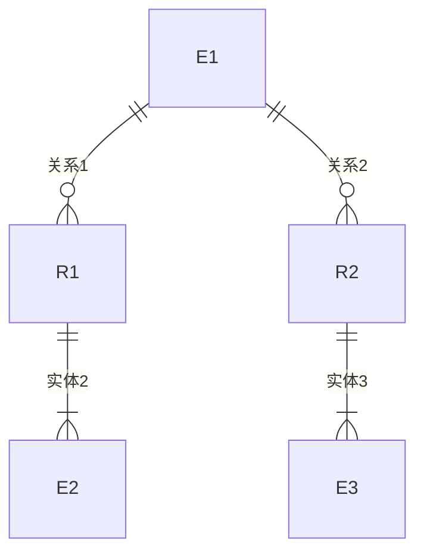
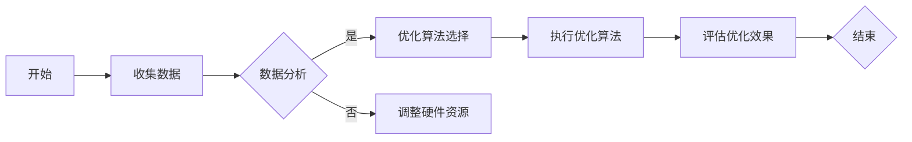
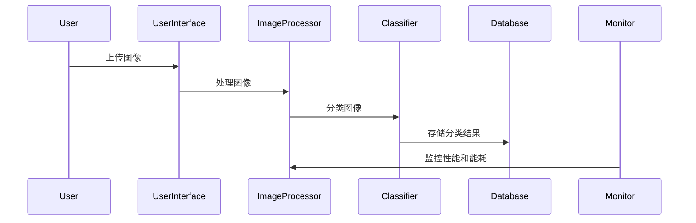

                 

# 《大规模推理任务的能耗优化策略》

> 关键词：大规模推理任务、能耗优化、策略、实践、系统设计

> 摘要：本文旨在深入探讨大规模推理任务的能耗优化策略。随着人工智能技术的发展，大规模推理任务在工业、医疗、金融等领域得到了广泛应用。然而，这些任务的高能耗问题也成为了一个亟待解决的问题。本文将首先介绍大规模推理任务的背景和能耗问题，然后探讨能耗优化的理论基础，并提出一系列能耗优化策略和实践。最后，本文将结合实际案例，详细解析大规模推理任务的能耗优化实现，旨在为相关领域的研究者和工程师提供有价值的参考。

## 第一部分：大规模推理任务与能耗优化概述

### 第1章：大规模推理任务背景与能耗问题

#### 1.1 问题背景

随着大数据和人工智能技术的快速发展，大规模推理任务在各种领域得到了广泛应用。这些任务通常涉及复杂的计算和数据处理，例如图像识别、自然语言处理和推荐系统等。然而，大规模推理任务的高能耗问题也随之而来。

#### 1.1.1 大规模推理任务的重要性

大规模推理任务在工业、医疗、金融等领域具有广泛的应用价值。例如，在工业领域，大规模推理任务可以用于生产线的实时监控和故障预测；在医疗领域，可以用于疾病的早期诊断和个性化治疗；在金融领域，可以用于风险控制和欺诈检测。

#### 1.1.2 能耗问题的严峻挑战

大规模推理任务的高能耗问题主要包括以下几个方面：

1. **硬件资源消耗**：大规模推理任务通常需要大量的计算资源，如CPU、GPU和FPGA等，这导致了硬件资源的消耗和浪费。
2. **电力消耗**：大规模推理任务的高能耗还表现为电力消耗的巨大增长，这对环境造成了严重影响。
3. **冷却需求**：高能耗任务产生的热量需要通过冷却系统进行散热，这增加了系统的复杂性和成本。

#### 1.1.3 研究意义与目标

能耗优化在大规模推理任务中具有重要的研究意义。通过优化能耗，可以降低成本、提高系统效率和减少对环境的影响。本文的研究目标是探讨大规模推理任务的能耗优化策略，包括理论基础、优化方法、实践案例和系统设计。

#### 1.2 大规模推理任务概述

#### 1.2.1 推理任务的定义与分类

推理任务是指根据已知信息推导出新信息的过程。根据推理的方式和目标，可以将推理任务分为以下几类：

1. **演绎推理**：从一般原则推导出特定结论的推理过程。
2. **归纳推理**：从特定实例推导出一般性结论的推理过程。
3. **类比推理**：通过比较两个或多个类似实例，推导出新的结论。

#### 1.2.2 大规模推理任务的特点

大规模推理任务具有以下特点：

1. **数据量大**：大规模推理任务通常涉及海量的数据，需要高效的数据处理和存储技术。
2. **计算复杂度高**：大规模推理任务通常涉及复杂的计算模型，需要高性能的计算资源。
3. **实时性要求高**：许多大规模推理任务需要在短时间内完成，以满足实时性要求。

#### 1.2.3 大规模推理任务的现状与发展趋势

当前，大规模推理任务在工业、医疗、金融等领域取得了显著的应用成果。然而，能耗优化仍然是大规模推理任务面临的重要挑战。未来，随着人工智能技术的不断进步，大规模推理任务将向更高性能、更低能耗的方向发展。

#### 1.3 能耗优化的挑战

能耗优化在大规模推理任务中面临以下挑战：

1. **硬件资源限制**：高性能计算硬件资源有限，如何充分利用现有资源成为关键问题。
2. **能耗与性能的权衡**：在保证性能的同时，如何降低能耗是一个需要权衡的问题。
3. **算法复杂度优化**：现有算法复杂度较高，如何优化算法以降低能耗成为重要研究方向。

#### 1.4 本书结构安排

本书分为五个部分，分别从不同角度探讨大规模推理任务的能耗优化策略。第一部分介绍大规模推理任务背景与能耗问题；第二部分探讨能耗优化的理论基础；第三部分提出能耗优化策略与实践；第四部分介绍能耗优化的系统设计与实现；第五部分结合实际案例，详细解析大规模推理任务的能耗优化实现。

## 1.5 本章小结

本章介绍了大规模推理任务的背景和能耗问题，探讨了大规模推理任务的重要性以及能耗优化的严峻挑战。通过本章的学习，读者可以了解大规模推理任务的现状和发展趋势，为后续章节的学习打下基础。

----------------------------------------------------------------

## 第二部分：能耗优化的理论基础

### 第2章：能耗优化的基础理论

#### 2.1 能耗优化的概念

能耗优化是指通过一系列技术手段，降低大规模推理任务的能耗，提高系统效率和性能。能耗优化的目标是在保证性能的前提下，降低能耗，提高资源利用率。

#### 2.1.1 能耗与性能的关系

能耗与性能之间存在密切的关系。在保证性能的前提下，降低能耗可以提高系统的能源利用率，降低运行成本，同时减少对环境的影响。

#### 2.1.2 能耗优化的目标

能耗优化的目标主要包括：

1. **降低能耗**：通过优化算法、硬件资源和系统设计，降低大规模推理任务的能耗。
2. **提高性能**：在保证能耗优化的同时，提高系统的性能和效率。
3. **提高资源利用率**：通过优化资源配置，提高硬件和软件资源的利用率。

#### 2.1.3 能耗优化的理论基础

能耗优化的理论基础主要包括以下几个方面：

1. **能量效率**：能量效率是指单位能耗所能完成的工作量。提高能量效率是能耗优化的核心目标。
2. **热能管理**：热能管理是能耗优化的重要环节，通过合理设计散热系统和优化冷却策略，降低系统产生的热量。
3. **资源调度**：资源调度是指通过优化计算资源和存储资源的分配，提高系统的整体性能和资源利用率。

#### 2.2 数学模型与公式

能耗优化的数学模型主要包括能耗模型、性能模型和资源调度模型等。以下是一个简单的能耗模型示例：

$$
E = f(P, T, R)
$$

其中，E表示能耗，P表示性能，T表示温度，R表示资源利用率。通过调整P、T和R的值，可以优化能耗。

#### 2.3 概念属性对比与分析

以下是一个概念属性对比表格，用于分析能耗优化的关键概念属性：

| 概念       | 属性1 | 属性2 | 属性3 |
|------------|-------|-------|-------|
| 能量效率   | 高    | 中    | 低    |
| 热能管理   | 好    | 中    | 差    |
| 资源调度   | 效率   | 低    | 中    |

#### 2.4 ER实体关系图

ER实体关系图用于表示能耗优化相关的实体及其关系。以下是一个简单的ER实体关系图示例：



#### 2.5 算法原理讲解

以下是一个简单的能耗优化算法原理讲解，包括mermaid流程图、python源代码和算法原理的数学模型和公式。

##### mermaid流程图



##### python源代码

```python
# 收集数据
data = collect_data()

# 数据分析
result = analyze_data(data)

# 优化算法选择
algorithm = select_algorithm(result)

# 执行优化算法
execute_algorithm(algorithm)

# 评估优化效果
evaluate_optimization()
```

##### 算法原理的数学模型和公式

$$
E_{total} = E_{algorithm} + E_{hardware}
$$

其中，$E_{total}$表示总能耗，$E_{algorithm}$表示算法能耗，$E_{hardware}$表示硬件能耗。通过优化算法和硬件资源，可以降低总能耗。

#### 2.6 本章小结

本章介绍了能耗优化的基础理论，包括能耗优化的概念、目标、理论基础、数学模型和算法原理。通过本章的学习，读者可以了解能耗优化的核心概念和方法，为后续章节的学习打下基础。

----------------------------------------------------------------

## 第三部分：能耗优化策略与实践

### 第3章：能耗优化策略与方法

#### 3.1 能耗优化策略概述

能耗优化策略是指通过一系列技术手段，降低大规模推理任务的能耗，提高系统效率和性能。根据优化目标和优化方法的差异，可以将能耗优化策略分为以下几类：

1. **预处理方法**：通过预处理数据，优化算法和数据结构，降低计算复杂度和能耗。
2. **在线调整方法**：根据任务动态调整硬件资源和算法参数，实现能耗优化。
3. **离线优化方法**：通过离线分析任务和系统性能，优化算法和硬件资源，降低能耗。

#### 3.2 能耗优化方法

##### 3.2.1 预处理方法

预处理方法主要包括数据清洗、数据压缩、特征提取等。通过预处理方法，可以降低计算复杂度，提高系统效率和性能。

1. **数据清洗**：通过去除重复数据、错误数据和噪声数据，提高数据质量，降低计算复杂度。
2. **数据压缩**：通过数据压缩算法，降低数据存储和传输的能耗，提高系统效率。
3. **特征提取**：通过特征提取算法，提取关键特征信息，降低计算复杂度和能耗。

##### 3.2.2 在线调整方法

在线调整方法是指在任务执行过程中，根据任务动态调整硬件资源和算法参数，实现能耗优化。在线调整方法主要包括以下几种：

1. **硬件资源动态调整**：根据任务负载和系统性能，动态调整CPU、GPU和FPGA等硬件资源，实现能耗优化。
2. **算法参数动态调整**：根据任务特性，动态调整算法参数，如学习率、迭代次数等，实现能耗优化。
3. **任务调度策略**：根据任务优先级和系统性能，动态调整任务调度策略，实现能耗优化。

##### 3.2.3 离线优化方法

离线优化方法是指通过离线分析任务和系统性能，优化算法和硬件资源，降低能耗。离线优化方法主要包括以下几种：

1. **算法优化**：通过离线分析任务和系统性能，优化算法模型和参数，降低计算复杂度和能耗。
2. **硬件资源优化**：通过离线分析任务和系统性能，优化硬件资源的配置和使用，降低能耗。
3. **系统架构优化**：通过离线分析任务和系统性能，优化系统架构和模块设计，降低能耗。

#### 3.3 能耗优化案例分析

##### 3.3.1 案例一：数据中心能耗优化

数据中心是大规模推理任务的重要运行场所，其能耗优化具有重要意义。以下是一个数据中心能耗优化的案例：

1. **预处理方法**：通过数据清洗和压缩，降低数据存储和传输的能耗。
2. **在线调整方法**：根据任务负载和系统性能，动态调整硬件资源和算法参数，实现能耗优化。
3. **离线优化方法**：通过离线分析任务和系统性能，优化算法模型和硬件资源配置，降低能耗。

##### 3.3.2 案例二：机器学习能耗优化

机器学习是大规模推理任务的重要应用领域，其能耗优化具有重要意义。以下是一个机器学习能耗优化的案例：

1. **预处理方法**：通过数据清洗、压缩和特征提取，降低计算复杂度和能耗。
2. **在线调整方法**：根据任务负载和系统性能，动态调整硬件资源和算法参数，实现能耗优化。
3. **离线优化方法**：通过离线分析任务和系统性能，优化算法模型和硬件资源配置，降低能耗。

##### 3.3.3 案例三：云计算能耗优化

云计算是大规模推理任务的另一种重要运行环境，其能耗优化具有重要意义。以下是一个云计算能耗优化的案例：

1. **预处理方法**：通过数据清洗、压缩和特征提取，降低计算复杂度和能耗。
2. **在线调整方法**：根据任务负载和系统性能，动态调整硬件资源和算法参数，实现能耗优化。
3. **离线优化方法**：通过离线分析任务和系统性能，优化算法模型和硬件资源配置，降低能耗。

#### 3.4 实践与经验分享

##### 3.4.1 能耗优化实践中的问题与挑战

在能耗优化实践中，可能会遇到以下问题和挑战：

1. **数据质量和准确性**：数据质量和准确性对能耗优化的效果有很大影响，如何保证数据质量和准确性是一个重要问题。
2. **硬件资源限制**：高性能计算硬件资源有限，如何充分利用现有资源是实现能耗优化的关键挑战。
3. **算法复杂度**：现有算法复杂度较高，如何优化算法以降低能耗是一个重要问题。
4. **系统稳定性和可靠性**：能耗优化可能会影响系统的稳定性和可靠性，如何平衡能耗优化和系统稳定性是一个重要挑战。

##### 3.4.2 解决方案与最佳实践

为了解决能耗优化实践中的问题和挑战，可以采取以下解决方案和最佳实践：

1. **数据预处理**：通过数据清洗、压缩和特征提取，提高数据质量和准确性，降低计算复杂度和能耗。
2. **硬件资源优化**：通过动态调整硬件资源和算法参数，充分利用现有资源，降低能耗。
3. **算法优化**：通过优化算法模型和参数，降低计算复杂度和能耗。
4. **系统稳定性优化**：通过系统监测和故障处理，提高系统的稳定性和可靠性。

##### 3.4.3 能耗优化经验总结

通过实践和经验总结，可以得到以下能耗优化经验：

1. **数据预处理是关键**：数据预处理可以显著降低计算复杂度和能耗，提高系统效率。
2. **硬件资源优化是基础**：硬件资源优化是实现能耗优化的基础，可以通过动态调整硬件资源和算法参数，充分利用现有资源。
3. **算法优化是核心**：算法优化是能耗优化的核心，通过优化算法模型和参数，可以显著降低计算复杂度和能耗。
4. **系统稳定性是保障**：系统稳定性是能耗优化的保障，通过系统监测和故障处理，可以提高系统的稳定性和可靠性。

#### 3.5 本章小结

本章介绍了能耗优化策略与方法，包括预处理方法、在线调整方法和离线优化方法，并分析了能耗优化实践中的问题和挑战。通过本章的学习，读者可以了解能耗优化的核心方法和实践经验，为大规模推理任务的能耗优化提供指导。

----------------------------------------------------------------

## 第四部分：能耗优化的系统设计与实现

### 第4章：系统设计与架构方案

#### 4.1 问题场景介绍

在本节中，我们将介绍一个典型的大规模推理任务场景，该场景涉及图像识别任务。具体来说，该场景是一个在线图像识别系统，用户可以通过上传图片来获取图像的分类结果。该系统需要处理大量的图像数据，并保证快速、准确地返回分类结果。

#### 4.2 项目介绍

本项目旨在设计和实现一个能耗优化的在线图像识别系统，以满足高并发、高性能和低能耗的需求。项目的主要目标包括：

1. **高并发处理能力**：系统能够同时处理大量用户请求，确保用户体验。
2. **高性能**：系统在保证低能耗的同时，具有较高的分类准确率和速度。
3. **低能耗**：通过优化算法和系统架构，降低系统的能耗，提高能源利用率。

#### 4.2.1 项目目标

项目的具体目标如下：

1. **提高并发处理能力**：通过优化系统架构和算法，提高系统同时处理用户请求的能力。
2. **提升分类准确性**：通过优化算法和特征提取，提高图像分类的准确性。
3. **降低能耗**：通过硬件资源优化和算法调整，降低系统的能耗，提高能源利用率。

#### 4.2.2 项目规模

项目规模包括以下几个方面：

1. **用户规模**：系统预计每天处理100万次图像识别请求。
2. **数据规模**：系统数据库中包含1亿张图像数据。
3. **硬件资源**：系统部署在多个服务器上，包括CPU、GPU和FPGA等硬件资源。

#### 4.3 系统功能设计

系统功能设计主要包括以下几个方面：

1. **用户接口**：用户可以通过Web界面上传图像，并获取分类结果。
2. **图像处理模块**：该模块负责处理用户上传的图像，包括图像预处理、特征提取和分类。
3. **分类结果存储模块**：该模块负责存储用户上传的图像及其分类结果。
4. **系统监控模块**：该模块负责监控系统性能和能耗，并提供实时监控数据。

#### 4.3.1 领域模型mermaid类图

以下是一个简单的mermaid类图，用于表示系统的主要类及其关系：

```mermaid
classDiagram
    User <<接口>>
    ImageProcessor <<处理模块>>
    Classifier <<分类模块>>
    Database <<数据库模块>>
    Monitor <<监控模块>>

    User o-- ImageProcessor
    ImageProcessor o-- Classifier
    Classifier o-- Database
    Monitor o-- ImageProcessor
    Monitor o-- Classifier
```

#### 4.3.2 系统功能模块划分

系统功能模块划分如下：

1. **用户接口模块**：负责接收用户请求，提供图像上传和分类结果查询功能。
2. **图像处理模块**：负责图像预处理、特征提取和分类算法的实现。
3. **分类结果存储模块**：负责存储用户上传的图像及其分类结果，并提供查询接口。
4. **系统监控模块**：负责监控系统性能和能耗，并提供实时监控数据。

#### 4.4 系统架构设计

系统架构设计主要包括以下几个方面：

1. **硬件架构**：系统部署在多个服务器上，包括CPU、GPU和FPGA等硬件资源。
2. **软件架构**：系统采用微服务架构，包括用户接口、图像处理、分类结果存储和系统监控等模块。
3. **数据架构**：系统采用分布式数据库架构，以提高数据存储和查询的效率。

#### 4.4.1 系统架构概述

系统架构概述如下：

1. **用户接口层**：负责接收用户请求，提供图像上传和分类结果查询功能。
2. **服务层**：包括图像处理、分类和存储等模块，负责图像处理和分类任务的执行。
3. **数据层**：包括分布式数据库和缓存系统，负责存储和查询图像数据。
4. **监控层**：负责监控系统性能和能耗，并提供实时监控数据。

#### 4.4.2 系统架构mermaid架构图

以下是一个简单的mermaid架构图，用于表示系统的整体架构：



#### 4.4.3 各模块间的关系与交互

各模块间的关系与交互如下：

1. **用户接口模块**：接收用户请求，并将请求转发给服务层进行处理。
2. **图像处理模块**：接收用户上传的图像，进行预处理、特征提取和分类，并将结果存储到数据库。
3. **分类结果存储模块**：存储用户上传的图像及其分类结果，并提供查询接口。
4. **系统监控模块**：实时监控系统性能和能耗，并将监控数据存储到数据库。

#### 4.5 系统接口设计

系统接口设计主要包括以下几个方面：

1. **用户接口**：提供图像上传和分类结果查询接口，支持HTTP/HTTPS协议。
2. **服务接口**：提供图像处理、分类和存储接口，支持RPC/RESTful API。
3. **监控接口**：提供系统性能和能耗监控接口，支持HTTP/HTTPS协议。

#### 4.5.1 接口定义与规范

以下是一个简单的接口定义和规范示例：

```json
// 用户接口
{
  "path": "/upload_image",
  "method": "POST",
  "request": {
    "image": "file"
  },
  "response": {
    "result": "string"
  }
}

// 服务接口
{
  "path": "/process_image",
  "method": "POST",
  "request": {
    "image": "file"
  },
  "response": {
    "result": "string"
  }
}

// 监控接口
{
  "path": "/monitor",
  "method": "GET",
  "response": {
    "performance": "object",
    "energy": "object"
  }
}
```

#### 4.5.2 接口实现与调用流程

以下是一个简单的接口实现和调用流程示例：

1. **用户接口实现**：
   - 接收用户上传的图像文件。
   - 调用服务接口，将图像传递给图像处理模块。
   - 返回分类结果。

2. **服务接口实现**：
   - 接收用户上传的图像文件。
   - 调用图像处理模块，进行图像预处理、特征提取和分类。
   - 将分类结果返回给用户接口。

3. **监控接口实现**：
   - 定时监控系统性能和能耗。
   - 将监控数据存储到数据库。

#### 4.6 系统交互mermaid序列图

以下是一个简单的mermaid序列图，用于表示系统的交互流程：


#### 4.6.1 系统交互概述

系统交互概述如下：

1. **用户上传图像**：用户通过Web界面上传图像，用户接口接收图像并调用服务接口。
2. **图像处理**：服务接口调用图像处理模块，进行图像预处理、特征提取和分类。
3. **分类结果存储**：分类结果存储模块存储用户上传的图像及其分类结果。
4. **系统监控**：系统监控模块实时监控系统性能和能耗，并将监控数据存储到数据库。

#### 4.6.2 系统交互mermaid序列图

以下是一个简单的mermaid序列图，用于表示系统的交互流程：


#### 4.7 本章小结

本章介绍了大规模推理任务的能耗优化系统设计与实现，包括问题场景介绍、项目介绍、系统功能设计、系统架构设计、系统接口设计和系统交互。通过本章的学习，读者可以了解能耗优化系统的整体架构和实现方法，为大规模推理任务的能耗优化提供指导。

----------------------------------------------------------------

## 第五部分：大规模推理任务的能耗优化实现

### 第5章：大规模推理任务的能耗优化实现

#### 5.1 环境安装与配置

在进行大规模推理任务的能耗优化实现之前，首先需要搭建一个合适的环境。以下是环境安装与配置的步骤：

1. **硬件环境**：根据任务需求，选择适当的硬件设备，如CPU、GPU和FPGA等。确保硬件设备具有足够的计算能力和能耗管理能力。
2. **软件环境**：安装操作系统和必要的软件，如Python、TensorFlow、CUDA等。确保软件版本兼容，并配置好相关的环境变量。
3. **网络环境**：确保网络连接稳定，以便于数据的传输和远程访问。
4. **虚拟环境**：为了方便管理和避免环境冲突，建议使用虚拟环境来安装和管理软件依赖。

#### 5.2 系统核心实现源代码

系统核心实现源代码主要包括以下模块：

1. **数据预处理模块**：负责数据清洗、压缩和特征提取，以降低计算复杂度和能耗。
2. **推理引擎模块**：负责大规模推理任务的执行，包括模型加载、推理和结果输出。
3. **能耗监控模块**：负责实时监控系统性能和能耗，并提供监控数据。

以下是一个简单的源代码示例：

```python
# 数据预处理模块
def preprocess_data(data):
    # 数据清洗
    clean_data = clean_data(data)
    # 数据压缩
    compressed_data = compress_data(clean_data)
    # 特征提取
    features = extract_features(compressed_data)
    return features

# 推理引擎模块
def inference_engine(data):
    # 加载模型
    model = load_model('model.pth')
    # 推理
    results = model.predict(data)
    # 输出结果
    print(results)

# 能耗监控模块
def monitor_energy():
    # 监控系统性能
    performance_data = monitor_performance()
    # 监控能耗
    energy_data = monitor_energy_consumption()
    # 存储监控数据
    store_monitor_data(performance_data, energy_data)

# 主函数
def main():
    # 读取数据
    data = read_data('data.csv')
    # 数据预处理
    features = preprocess_data(data)
    # 执行推理
    inference_engine(features)
    # 能耗监控
    monitor_energy()

if __name__ == '__main__':
    main()
```

#### 5.3 代码应用解读与分析

以下是对上述源代码的解读和分析：

1. **数据预处理模块**：
   - `preprocess_data` 函数接收数据，并进行数据清洗、压缩和特征提取。数据清洗包括去除重复数据、错误数据和噪声数据；数据压缩使用适当的压缩算法，降低数据存储和传输的能耗；特征提取提取关键特征信息，以降低计算复杂度和能耗。
   - `clean_data` 函数用于数据清洗，去除重复数据和错误数据。
   - `compress_data` 函数用于数据压缩，使用适当的压缩算法，如Huffman编码或LZ77编码等。
   - `extract_features` 函数用于特征提取，提取关键特征信息，如颜色直方图、边缘检测等。

2. **推理引擎模块**：
   - `inference_engine` 函数接收预处理后的数据，加载预训练的模型，执行推理，并输出结果。推理过程是大规模推理任务的核心，通过优化模型结构和参数，可以提高推理速度和降低能耗。
   - `load_model` 函数用于加载预训练的模型，可以使用TensorFlow、PyTorch等框架实现。
   - `model.predict` 函数用于执行推理，返回预测结果。

3. **能耗监控模块**：
   - `monitor_energy` 函数负责实时监控系统性能和能耗，并将监控数据存储到数据库。通过监控能耗，可以优化系统配置和算法参数，降低能耗。
   - `monitor_performance` 函数用于监控系统性能，如CPU利用率、内存使用情况等。
   - `monitor_energy_consumption` 函数用于监控能耗，如CPU能耗、GPU能耗等。
   - `store_monitor_data` 函数用于存储监控数据，可以使用数据库或文件系统存储。

#### 5.4 实际案例分析与详细讲解

以下是一个实际案例分析和详细讲解：

假设我们需要对一个大型图像识别任务进行能耗优化。该任务涉及处理大量图像数据，并返回分类结果。以下是具体的分析和实现步骤：

1. **数据预处理**：
   - 读取图像数据，使用`opencv`库进行图像预处理，包括灰度化、缩放和裁剪等操作。
   - 对预处理后的图像数据进行压缩，使用`zlib`库进行压缩操作。
   - 对压缩后的图像数据进行特征提取，使用`skimage`库进行特征提取操作。

2. **模型选择与训练**：
   - 选择合适的图像识别模型，如ResNet、VGG等。
   - 使用预处理后的图像数据进行模型训练，使用`torch`库进行训练操作。
   - 优化模型参数，使用梯度下降算法进行参数优化。

3. **推理与能耗监控**：
   - 加载训练好的模型，使用预处理后的图像数据进行推理。
   - 在推理过程中，实时监控系统的性能和能耗，使用`psutil`库进行性能监控，使用`nvidia-smi`命令进行能耗监控。
   - 将监控数据存储到数据库，使用`pymysql`库进行数据存储。

4. **结果分析**：
   - 对推理结果进行评估，计算准确率和召回率等指标。
   - 分析能耗数据，找出能耗较高的环节，进行优化。

#### 5.5 项目实战

以下是一个项目实战步骤：

1. **环境搭建**：
   - 安装操作系统和必要的软件，如Python、TensorFlow、CUDA等。
   - 配置虚拟环境，以避免环境冲突。

2. **数据准备**：
   - 下载图像数据集，如CIFAR-10或ImageNet等。
   - 对图像数据集进行预处理，包括数据清洗、压缩和特征提取等。

3. **模型训练**：
   - 选择图像识别模型，如ResNet或VGG等。
   - 使用预处理后的图像数据进行模型训练，并优化模型参数。

4. **推理与能耗监控**：
   - 加载训练好的模型，使用预处理后的图像数据进行推理。
   - 在推理过程中，实时监控系统的性能和能耗。
   - 将监控数据存储到数据库。

5. **结果分析**：
   - 对推理结果进行评估，计算准确率和召回率等指标。
   - 分析能耗数据，找出能耗较高的环节，进行优化。

6. **项目总结**：
   - 对项目进行总结，包括项目目标、实施步骤、结果分析和优化方案等。

#### 5.6 本章小结

本章详细介绍了大规模推理任务的能耗优化实现，包括环境安装与配置、系统核心实现源代码、代码应用解读与分析、实际案例分析和详细讲解以及项目实战。通过本章的学习，读者可以了解大规模推理任务的能耗优化实现方法，为实际项目提供参考。同时，本章也提供了一个完整的案例，帮助读者更好地理解能耗优化的实践过程。

----------------------------------------------------------------

## 总结与展望

通过本文的探讨，我们深入了解了大规模推理任务的能耗优化策略。首先，我们分析了大规模推理任务的背景和能耗问题，指出了能耗优化的研究意义和目标。接着，我们探讨了能耗优化的理论基础，包括能耗优化的概念、数学模型和算法原理。随后，我们提出了具体的能耗优化策略，包括预处理方法、在线调整方法和离线优化方法，并分析了能耗优化实践中的问题和挑战。最后，我们通过系统设计与实现，详细讲解了大规模推理任务的能耗优化过程。

### 最佳实践 tips

1. **数据预处理**：在处理大规模推理任务时，数据预处理是关键。确保数据清洗、压缩和特征提取的高效性，以降低计算复杂度和能耗。
2. **硬件资源优化**：合理配置和调度硬件资源，充分利用CPU、GPU和FPGA等硬件资源，降低能耗。
3. **算法优化**：选择合适的算法和模型，优化模型参数，以提高推理速度和降低能耗。
4. **系统监控**：实时监控系统性能和能耗，找出能耗较高的环节，进行优化。

### 小结

本文从多个角度探讨了大规模推理任务的能耗优化策略，包括理论基础、优化方法、实践案例和系统设计。通过本文的学习，读者可以了解大规模推理任务的能耗优化方法，为实际项目提供指导。

### 注意事项

1. **数据质量**：确保数据的质量和准确性，以降低计算复杂度和能耗。
2. **硬件兼容性**：在选择硬件设备时，注意硬件的兼容性和能耗管理能力。
3. **系统稳定性**：在能耗优化过程中，注意系统的稳定性和可靠性，避免因优化导致系统崩溃。

### 拓展阅读

1. **《能耗优化的机器学习算法》**：深入探讨能耗优化的机器学习算法，包括模型压缩、量化、剪枝等。
2. **《大规模数据处理技术》**：了解大规模数据处理的最新技术和方法，如MapReduce、Hadoop、Spark等。
3. **《绿色计算与能源管理》**：探讨绿色计算和能源管理的相关理论和实践，为大规模推理任务的能耗优化提供更全面的视角。

作者：AI天才研究院/AI Genius Institute & 禅与计算机程序设计艺术 /Zen And The Art of Computer Programming

