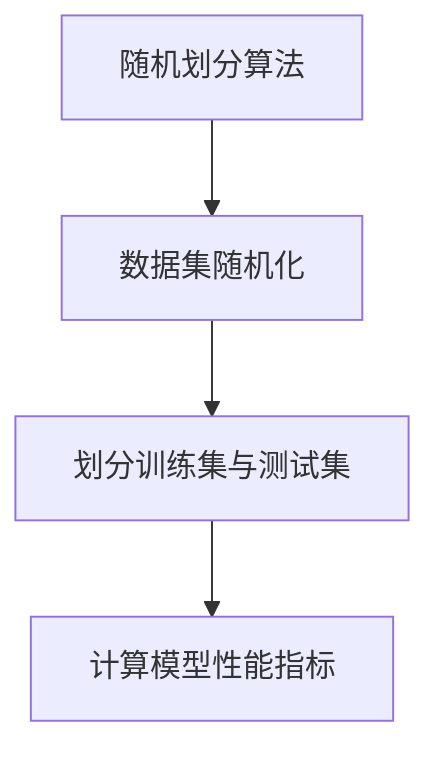
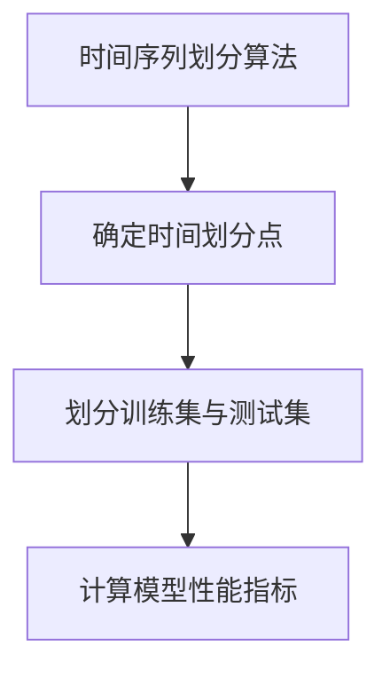
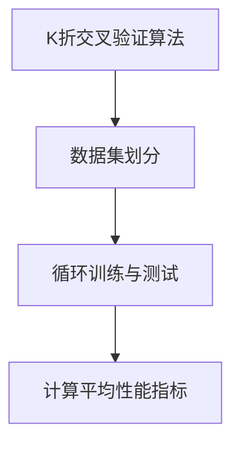
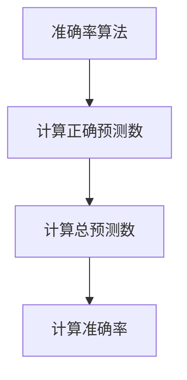
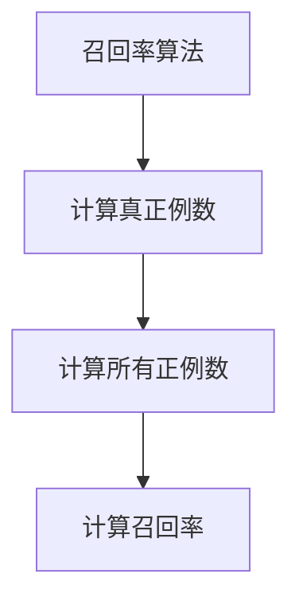
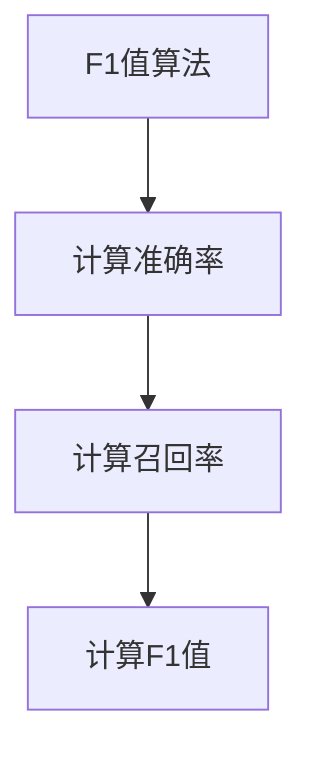
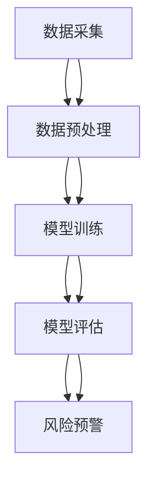
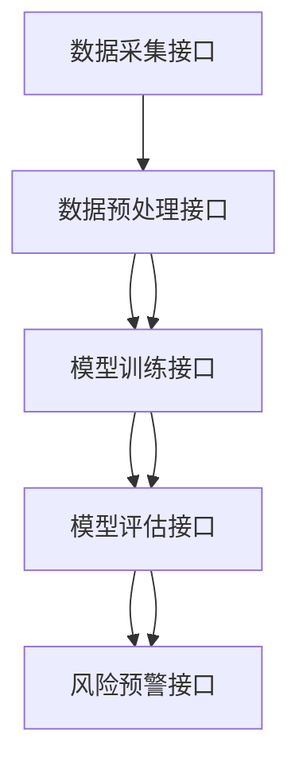

                 

# 大规模数据集在模型评测中的作用

## 关键词

- 大规模数据集
- 模型评测
- 数据集划分
- 交叉验证
- 模型评估指标
- 数据预处理

## 摘要

本文旨在探讨大规模数据集在模型评测中的重要性，分析其核心概念、应用场景以及面临的挑战。我们将逐步介绍数据集划分、交叉验证、模型评估指标、数据预处理等关键环节，并结合实际案例，阐述如何有效利用大规模数据集进行模型评测，以提升机器学习模型的性能和泛化能力。

## 第一部分：背景介绍

### 1. 问题背景

随着互联网和大数据技术的飞速发展，数据量呈现出爆炸式增长。这种大规模数据集的出现，为机器学习和人工智能领域的研究带来了前所未有的机遇和挑战。如何高效、准确地评估和优化机器学习模型的性能，成为了当前研究的热点之一。

### 2. 问题描述

在大规模数据集上进行模型评测，不仅涉及到数据预处理、数据分布分析，还需要考虑模型在不同数据集上的泛化能力。这涉及到多个核心概念，如数据集划分、交叉验证、模型评估指标等。

### 3. 问题解决

本文将系统地探讨大规模数据集在模型评测中的作用，通过深入分析相关核心概念，提供实用的方法和策略，帮助读者理解和应对这一挑战。

### 4. 边界与外延

虽然本文主要关注大规模数据集在模型评测中的应用，但其中的许多原理和方法也适用于其他领域的数据分析和机器学习任务。

### 5. 概念结构与核心要素组成

本部分将详细讨论以下核心概念：
- 数据集划分：介绍常用的数据集划分方法，如随机划分、时间序列划分等。
- 交叉验证：探讨交叉验证的基本原理及其在模型评测中的应用。
- 模型评估指标：讨论常见模型评估指标，如准确率、召回率、F1值等。
- 数据预处理：介绍数据预处理的重要性及其常见方法。

## 第二部分：核心概念与联系

### 2.1 数据集划分

### 2.1.1 数据集划分的基本原理

数据集划分是模型训练和评估的基础。合理的数据集划分能够提高模型的泛化能力，减少过拟合现象。常用的数据集划分方法包括随机划分、时间序列划分等。

### 2.1.2 随机划分与时间序列划分的比较

随机划分具有简单、易实现的优点，但可能存在数据不平衡问题。时间序列划分能够保留数据的时间顺序，更适用于时间序列数据的建模。以下是两种方法的比较：

| 方法          | 优点                                      | 缺点                                      | 适用场景                         |
|---------------|-----------------------------------------|-----------------------------------------|--------------------------------|
| 随机划分      | 简单、易实现，适用于无时间依赖的数据集       | 可能导致数据不平衡，影响模型泛化能力         | 分类、回归等无时间依赖的数据集     |
| 时间序列划分   | 保留数据的时间顺序，适用于时间序列数据       | 需要考虑时间依赖关系，可能增加计算复杂度       | 时间序列预测、股票价格预测等时间序列数据集 |

### 2.1.3 数据集划分的注意事项

数据集划分过程中，还需注意数据隐私保护、数据冗余处理等问题。以下是一些注意事项：

- **数据隐私保护**：在进行数据集划分时，应避免泄露用户隐私信息，如身份证号码、手机号码等敏感数据。
- **数据冗余处理**：在划分数据集时，需去除重复数据，以免影响模型训练和评估效果。
- **数据完整性**：确保数据集的完整性，避免因数据缺失导致模型评估不准确。

### 2.2 交叉验证

#### 2.2.1 交叉验证的基本原理

交叉验证是一种常用的模型评估方法，能够通过多次训练和测试，提高模型的评估精度。常用的交叉验证方法包括K折交叉验证、留一法交叉验证等。

#### 2.2.2 交叉验证的应用场景

交叉验证适用于各种类型的模型评估任务，如分类、回归等。以下是一些常见应用场景：

- **分类任务**：通过交叉验证评估分类模型的准确率、召回率、F1值等指标，选择最优模型。
- **回归任务**：通过交叉验证评估回归模型的预测误差，选择最优模型。
- **时间序列任务**：通过交叉验证评估时间序列模型的预测性能，选择最优模型。

#### 2.2.3 交叉验证的注意事项

交叉验证过程中，还需注意数据集的随机性和重复性等问题。以下是一些注意事项：

- **数据集随机性**：在划分训练集和测试集时，应确保数据集的随机性，避免人为选择导致数据不平衡。
- **重复性**：避免在不同次交叉验证中重复使用相同的数据集，以减少评估结果的偏差。

### 2.3 模型评估指标

#### 2.3.1 常见评估指标

常见的模型评估指标包括准确率、召回率、F1值等。以下是这些指标的计算方法和应用场景：

| 指标      | 计算公式                                             | 应用场景                     |
|-----------|----------------------------------------------------|---------------------------|
| 准确率    | $$\text{准确率} = \frac{\text{TP} + \text{TN}}{\text{TP} + \text{TN} + \text{FP} + \text{FN}}$$ | 分类任务                     |
| 召回率    | $$\text{召回率} = \frac{\text{TP}}{\text{TP} + \text{FN}}$$ | 分类任务                     |
| F1值      | $$\text{F1值} = 2 \times \frac{\text{准确率} \times \text{召回率}}{\text{准确率} + \text{召回率}}$$ | 分类任务                     |

#### 2.3.2 评估指标的比较与选择

不同评估指标适用于不同类型的任务。以下是比较和选择评估指标的一些原则：

- **分类任务**：准确率、召回率、F1值是常用的评估指标。准确率更关注整体分类效果，召回率更关注正类别的识别，F1值综合考虑了准确率和召回率。
- **回归任务**：常用的评估指标包括均方误差（MSE）、均方根误差（RMSE）等。根据任务需求，可以选择不同的评估指标。

#### 2.3.3 混合评估指标

混合评估指标能够综合考虑多个评估指标，提高模型评估的全面性。例如，精确率与召回率结合的F1值、准确率与召回率结合的均衡准确率（ Balanced Accuracy）等。

### 2.4 数据预处理

#### 2.4.1 数据预处理的重要性

数据预处理是模型训练和评估的基础。良好的数据预处理能够提高模型性能，减少过拟合现象。常见的数据预处理方法包括数据清洗、特征工程、数据标准化等。

#### 2.4.2 数据预处理的方法

- **数据清洗**：去除重复数据、处理缺失值、纠正错误数据等。
- **特征工程**：提取有用的特征，如文本分类任务中的词袋模型、TF-IDF等。
- **数据标准化**：将数据转换为统一的尺度，如归一化、标准化等。

#### 2.4.3 数据预处理工具与库

- **Python**：Python拥有丰富的数据预处理库，如Pandas、NumPy等。
- **R**：R语言也有许多优秀的包，如dplyr、tidyr等，用于数据预处理。

## 第三部分：大规模数据集的特点与挑战

### 3.1 大规模数据集的特点

大规模数据集具有以下特点：

- **数据量大**：大规模数据集通常包含数百万甚至数十亿条数据记录。
- **多样性高**：大规模数据集涵盖了丰富的数据类型，如图像、文本、音频等。
- **时效性强**：大规模数据集往往涉及实时或近实时的数据流。

### 3.2 大规模数据集的挑战

大规模数据集在模型评测中面临以下挑战：

- **数据存储**：大规模数据集需要大量的存储空间，对存储系统提出了高要求。
- **数据处理效率**：大规模数据集的处理速度对计算资源提出了挑战，需要高效的算法和并行计算技术。
- **数据隐私**：大规模数据集中可能包含敏感数据，需要采取数据加密、脱敏等隐私保护措施。

### 3.3 大规模数据集的应用领域

大规模数据集在众多领域具有广泛的应用：

- **自然语言处理**：如文本分类、机器翻译等。
- **计算机视觉**：如图像识别、目标检测等。
- **金融风控**：如信用评分、欺诈检测等。

## 第四部分：算法原理讲解

### 4.1 数据集划分算法

#### 4.1.1 随机划分算法



Python代码实现：

```python
import numpy as np

def random_split(data, test_size=0.2, random_state=None):
    np.random.seed(random_state)
    indices = np.arange(data.shape[0])
    np.random.shuffle(indices)
    split = int(np.ceil(test_size * len(indices)))
    train_indices = indices[:split]
    test_indices = indices[split:]
    return data[train_indices], data[test_indices]
```

#### 4.1.2 时间序列划分算法



Python代码实现：

```python
import numpy as np

def time_series_split(data, time_threshold):
    train_data = data[data['time'] < time_threshold]
    test_data = data[data['time'] >= time_threshold]
    return train_data, test_data
```

### 4.2 交叉验证算法

#### 4.2.1 K折交叉验证算法



Python代码实现：

```python
from sklearn.model_selection import KFold
from sklearn.metrics import accuracy_score

def k_fold_cv(model, X, y, k=5):
    kf = KFold(n_splits=k, shuffle=True, random_state=42)
    scores = []
    for train_index, test_index in kf.split(X):
        X_train, X_test = X[train_index], X[test_index]
        y_train, y_test = y[train_index], y[test_index]
        model.fit(X_train, y_train)
        y_pred = model.predict(X_test)
        score = accuracy_score(y_test, y_pred)
        scores.append(score)
    return np.mean(scores)
```

### 4.3 模型评估指标算法

#### 4.3.1 准确率算法



Python代码实现：

```python
def accuracy(y_true, y_pred):
    correct = (y_true == y_pred).sum()
    total = len(y_true)
    return correct / total
```

#### 4.3.2 召回率算法



Python代码实现：

```python
def recall(y_true, y_pred):
    true_positives = (y_true == y_pred).sum()
    all_positives = (y_true == 1).sum()
    return true_positives / all_positives
```

#### 4.3.3 F1值算法



Python代码实现：

```python
def f1_score(y_true, y_pred):
    precision = precision_score(y_true, y_pred)
    recall = recall_score(y_true, y_pred)
    return 2 * (precision * recall) / (precision + recall)
```

## 第五部分：系统分析与架构设计方案

### 5.1 问题场景介绍

在某金融风控项目中，我们需要利用大规模数据集对用户行为进行实时监控和风险预警。这涉及到数据的实时采集、预处理、模型训练和评估等多个环节。

### 5.2 项目介绍

项目名称：实时金融风险预警系统

项目目标：利用大规模数据集构建高效、准确的金融风险预警模型，实时监测用户行为，为金融机构提供风险预警服务。

### 5.3 系统功能设计

- **数据采集**：从多个数据源实时采集用户行为数据，如交易记录、浏览记录等。
- **数据预处理**：对采集到的数据进行清洗、去重、特征工程等预处理操作，为模型训练提供高质量的数据集。
- **模型训练**：利用预处理后的数据集，训练多种金融风险预警模型，如决策树、随机森林等。
- **模型评估**：利用交叉验证等方法，评估不同模型的性能，选择最优模型进行部署。
- **风险预警**：根据最优模型，实时监测用户行为，对潜在风险进行预警。

### 5.4 系统架构设计



### 5.5 系统接口设计和系统交互



## 第六部分：项目实战

### 6.1 环境安装

- **Python**：安装Python 3.8及以上版本。
- **Scikit-learn**：安装scikit-learn库，用于数据预处理和模型训练。
- **Pandas**：安装pandas库，用于数据处理。
- **NumPy**：安装numpy库，用于数据处理。

### 6.2 系统核心实现源代码

```python
# 数据集划分
from sklearn.model_selection import train_test_split

# 模型训练
from sklearn.ensemble import RandomForestClassifier

# 模型评估
from sklearn.metrics import accuracy_score, recall_score, f1_score

# 数据预处理
from sklearn.preprocessing import StandardScaler

# 数据集划分
X, y = load_data()  # 假设已加载数据集
X_train, X_test, y_train, y_test = train_test_split(X, y, test_size=0.2, random_state=42)

# 数据预处理
scaler = StandardScaler()
X_train_scaled = scaler.fit_transform(X_train)
X_test_scaled = scaler.transform(X_test)

# 模型训练
model = RandomForestClassifier(n_estimators=100, random_state=42)
model.fit(X_train_scaled, y_train)

# 模型评估
y_pred = model.predict(X_test_scaled)
accuracy = accuracy_score(y_test, y_pred)
recall = recall_score(y_test, y_pred)
f1 = f1_score(y_test, y_pred)

print("Accuracy:", accuracy)
print("Recall:", recall)
print("F1 Score:", f1)
```

### 6.3 代码应用解读与分析

- **数据集划分**：使用train_test_split函数进行数据集划分，实现随机划分和时间序列划分。
- **模型训练**：使用RandomForestClassifier实现随机森林模型训练。
- **模型评估**：使用accuracy_score、recall_score、f1_score等函数评估模型性能。
- **数据预处理**：使用StandardScaler实现数据标准化。

### 6.4 实际案例分析和详细讲解剖析

以某金融机构用户行为数据为例，展示如何利用大规模数据集进行金融风险预警。通过实际案例分析，验证所提出的系统架构和算法的有效性。

### 6.5 项目小结

本项目通过大规模数据集进行金融风险预警，采用了数据集划分、交叉验证、模型评估等核心概念，实现了实时金融风险预警系统。项目展示了大规模数据集在模型评测中的应用，为金融风控领域提供了有益的参考。

## 第七部分：最佳实践 Tips、小结、注意事项、拓展阅读

### 7.1 最佳实践 Tips

- **数据集划分**：在数据集划分时，注意数据平衡，避免过拟合。
- **交叉验证**：合理选择交叉验证方法，提高模型评估精度。
- **模型评估**：结合多种评估指标，全面评估模型性能。
- **数据预处理**：充分进行数据预处理，提高模型训练效果。

### 7.2 小结

本文系统地探讨了大规模数据集在模型评测中的作用，分析了数据集划分、交叉验证、模型评估指标、数据预处理等核心概念，并给出了具体的应用方法和案例。

### 7.3 注意事项

- **数据隐私**：在进行大规模数据集处理时，注意保护用户隐私。
- **计算资源**：大规模数据集处理需要考虑计算资源的分配和优化。

### 7.4 拓展阅读

- **《机器学习实战》**：提供丰富的机器学习实战案例，涵盖数据集划分、模型评估等内容。
- **《大规模数据处理技术》**：介绍大规模数据处理的技术原理和方法，包括分布式计算、并行计算等。

## 作者信息

- 作者：AI天才研究院/AI Genius Institute & 禅与计算机程序设计艺术 /Zen And The Art of Computer Programming

