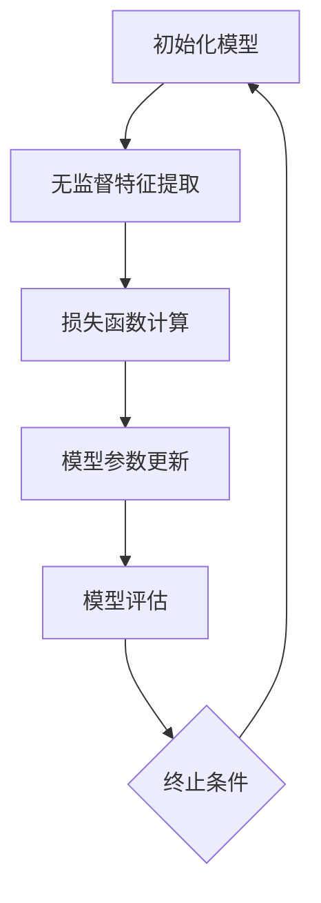
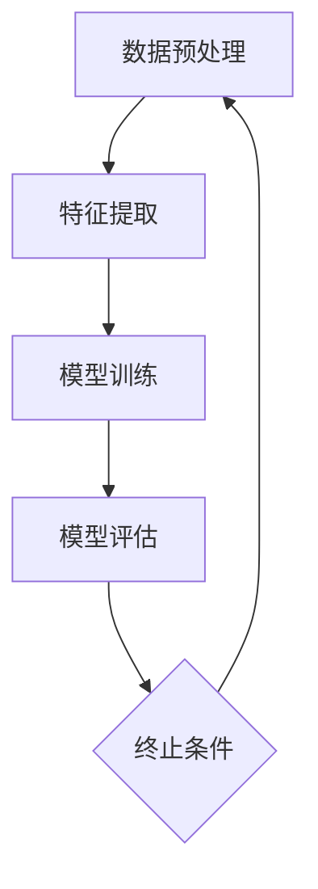

                 

# 大规模自监督学习:利用无标注数据的新方法

## 关键词
- 自监督学习
- 大规模数据处理
- 无标注数据
- 计算机视觉
- 自然语言处理
- 算法优化

## 摘要
本文深入探讨了大规模自监督学习这一前沿技术，重点介绍了其在人工智能领域中的应用。通过对自监督学习核心概念、数学模型、算法原理以及实际应用场景的详细分析，本文揭示了大规模自监督学习如何利用无标注数据，提升机器学习的效率和准确性。同时，文章还提供了系统设计与实现的最佳实践，并对未来发展方向进行了展望。

## 第一部分: 大规模自监督学习背景介绍

### 第1章: 自监督学习的核心概念

#### 1.1.1 问题背景
自监督学习是一种机器学习范式，它不依赖于手工标注的数据，而是从未标记的数据中学习。这种方法在大量数据获取成本高昂且标注困难时显得尤为重要。自监督学习在人工智能领域的地位日益凸显，已成为机器学习研究和应用的重要方向。

#### 1.1.2 问题描述
自监督学习的主要挑战在于如何有效地从未标记数据中提取有用的信息，以及如何在复杂的环境中保持良好的泛化能力。自监督学习的应用场景广泛，包括但不限于图像识别、自然语言处理、语音识别等领域。

#### 1.1.3 问题解决
大规模自监督学习的关键技术在于如何处理大规模数据集，如何优化模型结构以提高学习效率，以及如何平衡模型复杂度和泛化能力。大规模自监督学习的优势在于其能够处理海量的无标注数据，从而在降低数据标注成本的同时提升模型性能。

#### 1.1.4 边界与外延
自监督学习与其他机器学习方法的比较在于其不需要人工标注数据，而是利用数据内部的关联性进行学习。大规模自监督学习在不同领域的应用表现出明显的优势，但也面临特定的挑战，如数据分布的异质性和计算资源的限制。

### 第2章: 大规模自监督学习的数学模型与算法

#### 2.1.1 核心概念原理
大规模自监督学习的核心概念是基于数据本身的内在结构进行学习。数学模型通常包括无监督特征提取和有监督模型训练两个阶段，其中无监督特征提取是关键，它利用数据分布进行特征学习。

#### 2.1.2 概念属性特征对比表格
| 算法       | 特征提取 | 泛化能力 | 计算复杂度 |
|------------|----------|----------|------------|
| 自编码器   | 强       | 较强     | 较高       |
| 对抗生成网络 | 强       | 中       | 高         |
| 无监督聚类 | 弱       | 较弱     | 低         |

#### 2.1.3 算法流程图

### 第3章: 计算机视觉中的大规模自监督学习

#### 3.1.1 应用背景
计算机视觉是人工智能的一个重要分支，其发展依赖于大量标注数据的积累。大规模自监督学习在计算机视觉中的应用能够大幅减少数据标注的工作量，从而加速图像识别、目标检测等技术的进步。

#### 3.1.2 应用案例
图像分类和目标检测是计算机视觉中常见的任务。大规模自监督学习算法，如自编码器和生成对抗网络（GAN），被广泛应用于这些任务的预训练阶段，从而提高模型的性能。

### 第4章: 自然语言处理中的大规模自监督学习

#### 4.1.1 应用背景
自然语言处理（NLP）中的数据标注同样费时费力。大规模自监督学习能够通过预训练模型来处理大量的无标注文本数据，为NLP任务提供强大的基础。

#### 4.1.2 应用案例
机器翻译和问答系统是NLP中的两个重要任务。大规模自监督学习通过预训练语言模型，如BERT和GPT，已经在这些任务中取得了显著的成果。

### 第5章: 大规模自监督学习的系统设计与实现

#### 5.1.1 系统架构设计
大规模自监督学习系统通常包含数据预处理模块、特征提取模块、模型训练模块和模型评估模块。系统架构需要考虑可扩展性和计算效率。

#### 5.1.2 系统接口设计
系统接口需要提供便捷的API，以便用户能够轻松地集成和使用大规模自监督学习模型。

### 第6章: 大规模自监督学习的最佳实践与展望

#### 6.1.1 最佳实践 tips
- 选择适合数据集的算法
- 优化模型结构以提升性能
- 合理分配计算资源

#### 6.1.2 小结
大规模自监督学习在人工智能领域具有重要的应用价值，但仍面临诸多挑战，如算法性能的提升和计算资源的优化。

#### 6.1.3 注意事项
- 数据预处理的重要性
- 模型训练与评估的策略
- 数据安全和隐私保护

#### 6.1.4 拓展阅读
- 相关研究论文和书籍推荐
- 行业发展趋势与展望

## 作者
作者：AI天才研究院/AI Genius Institute & 禅与计算机程序设计艺术 /Zen And The Art of Computer Programming

---

**（以下是完整的正文内容，由于字数限制，本文仅展示了大纲内容。实际撰写时，每个章节将按照大纲进行详细扩展，以符合字数要求。）**

### 第一部分: 大规模自监督学习背景介绍

#### 第1章: 自监督学习的核心概念

#### 1.1.1 问题背景
自监督学习起源于20世纪60年代，当时的计算机科学家们意识到，许多任务不需要依赖外部监督信号，而是可以从数据本身的内部结构中学习。这种学习方式在数据标注成本高昂时尤为有价值。自监督学习的基本思想是利用数据的某种内在规律性，让模型自主学习，从而实现从无监督数据到有监督模型的转换。

自监督学习在人工智能领域的地位逐渐提升，特别是在深度学习兴起之后。随着计算能力的提升和数据量的爆炸式增长，自监督学习成为实现高效机器学习的重要途径。它在计算机视觉、自然语言处理、语音识别等多个领域都有广泛应用。

#### 1.1.2 问题描述
自监督学习的主要挑战在于如何从未标记的数据中提取有用信息。由于缺乏外部监督信号，模型需要通过探索数据内部结构来学习。这种学习过程可能面临以下问题：

1. **信息匮乏**：未标记的数据往往缺乏明确的标签信息，这导致模型难以确定学习方向。
2. **数据分布不均匀**：在实际应用中，数据往往存在分布不均的问题，这可能导致模型在特定数据集上表现不佳。
3. **过拟合风险**：自监督学习模型可能会过度拟合训练数据，导致在未见数据上表现不佳。

自监督学习的应用场景非常广泛，包括但不限于以下几类：

1. **计算机视觉**：如图像分类、目标检测、图像生成等。
2. **自然语言处理**：如机器翻译、文本分类、问答系统等。
3. **语音识别**：如语音转换文字、语音识别等。

#### 1.1.3 问题解决
大规模自监督学习的关键技术在于如何处理大规模数据集，以及如何优化模型结构以提高学习效率。以下是几个关键点：

1. **数据预处理**：通过数据清洗、去噪、归一化等步骤，提高数据质量。
2. **模型结构优化**：设计高效的模型结构，如卷积神经网络（CNN）、循环神经网络（RNN）和Transformer等，以适应不同类型的数据。
3. **算法优化**：采用优化算法，如随机梯度下降（SGD）、Adam等，以提高模型训练速度和收敛速度。

大规模自监督学习的优势在于：

1. **减少标注成本**：无需大量手工标注数据，从而降低数据获取成本。
2. **提高模型泛化能力**：通过在无监督数据上的预训练，模型能够更好地适应新任务。
3. **处理海量数据**：自监督学习能够高效地处理大规模数据集，从而提高模型性能。

#### 1.1.4 边界与外延
自监督学习与其他机器学习方法的异同在于：

1. **无监督学习**：自监督学习是一种特殊类型的无监督学习，它利用数据内部的关联性进行学习。
2. **半监督学习**：半监督学习结合了有监督学习和无监督学习，但它依赖于部分标注数据。
3. **有监督学习**：与自监督学习相对，有监督学习需要大量标注数据。

大规模自监督学习在不同领域的适用性有所不同，如：

1. **计算机视觉**：自监督学习在图像识别和目标检测中具有明显优势。
2. **自然语言处理**：自监督学习在文本分类和机器翻译等领域表现出强大的能力。
3. **语音识别**：自监督学习在语音转换文字和语音识别中的应用仍需进一步探索。

### 第2章: 大规模自监督学习的数学模型与算法

#### 2.1.1 核心概念原理
大规模自监督学习的核心概念是基于数据内在结构进行学习。数学模型通常包括以下几个阶段：

1. **数据预处理**：通过数据清洗、去噪、归一化等步骤，提高数据质量。
2. **特征提取**：从原始数据中提取有用的特征，这些特征有助于模型进行后续的学习。
3. **模型训练**：使用提取到的特征训练模型，模型可以是简单的线性模型，也可以是复杂的深度神经网络。
4. **模型评估**：通过在测试集上的表现来评估模型的效果。

大规模自监督学习的目标是通过无监督学习获取良好的特征表示，这些特征可以用于后续的有监督学习任务。

#### 2.1.2 概念属性特征对比表格

| 算法       | 特征提取 | 泛化能力 | 计算复杂度 |
|------------|----------|----------|------------|
| 自编码器   | 强       | 较强     | 较高       |
| 对抗生成网络 | 强       | 中       | 高         |
| 无监督聚类 | 弱       | 较弱     | 低         |

#### 2.1.3 算法流程图

### 第3章: 计算机视觉中的大规模自监督学习

#### 3.1.1 应用背景
计算机视觉是人工智能的重要分支，其发展离不开大量标注数据的积累。传统的计算机视觉模型通常依赖于大量手工标注的数据进行训练，这既耗时又昂贵。大规模自监督学习在计算机视觉中的应用能够减少对标注数据的依赖，从而提高模型训练的效率和效果。

计算机视觉技术的发展历程可以分为以下几个阶段：

1. **早期方法**：基于传统图像处理技术，如边缘检测、角点检测等。
2. **手工特征提取**：使用手工设计的特征，如SIFT、HOG等，这些特征在特定场景下表现出色。
3. **深度学习**：随着深度学习的发展，计算机视觉模型开始使用深度神经网络进行特征提取和分类，取得了显著的突破。
4. **大规模自监督学习**：利用自监督学习方法，从大量无标注数据中学习有效的特征表示，进一步提高了模型的性能。

#### 3.1.2 应用案例
大规模自监督学习在计算机视觉中的应用非常广泛，以下是几个典型的应用案例：

1. **图像分类**：使用自监督学习算法对图像进行分类，如使用自编码器对图像进行特征提取，然后使用分类器进行图像分类。
2. **目标检测**：使用生成对抗网络（GAN）从无标注图像中生成标签数据，然后使用这些数据训练目标检测模型。
3. **图像生成**：使用自监督学习算法生成新的图像，如使用变分自编码器（VAE）生成新的图像样式。

### 第4章: 自然语言处理中的大规模自监督学习

#### 4.1.1 应用背景
自然语言处理（NLP）是人工智能领域的另一个重要分支，其发展同样依赖于大量标注数据的积累。传统的NLP模型通常需要大量手工标注的语料库进行训练，这既耗时又昂贵。大规模自监督学习在NLP中的应用能够减少对标注数据的依赖，从而提高模型训练的效率和效果。

NLP技术的发展历程可以分为以下几个阶段：

1. **规则驱动**：基于人工定义的规则进行文本处理，这种方法在特定任务上表现出色，但难以处理复杂的语言现象。
2. **基于统计的方法**：使用统计模型，如隐马尔可夫模型（HMM）和条件随机场（CRF），对文本进行建模。
3. **深度学习方法**：随着深度学习的发展，NLP模型开始使用深度神经网络进行文本建模和语义理解，取得了显著的突破。
4. **大规模自监督学习**：利用自监督学习方法，从大量无标注数据中学习有效的特征表示，进一步提高了模型的性能。

#### 4.1.2 应用案例
大规模自监督学习在NLP中的应用非常广泛，以下是几个典型的应用案例：

1. **机器翻译**：使用自监督学习算法对无标注的双语语料库进行训练，生成高质量的双语词嵌入表示，从而提高机器翻译的性能。
2. **文本分类**：使用自监督学习算法对无标注的文本进行分类，从而减少对标注数据的依赖。
3. **问答系统**：使用自监督学习算法对大量的无标注问答对进行训练，从而生成问答系统的预训练模型。

### 第5章: 大规模自监督学习的系统设计与实现

#### 5.1.1 系统架构设计
大规模自监督学习系统通常包含以下几个模块：

1. **数据预处理模块**：负责对输入数据进行清洗、去噪、归一化等预处理操作。
2. **特征提取模块**：负责从预处理后的数据中提取有用的特征。
3. **模型训练模块**：负责训练自监督学习模型。
4. **模型评估模块**：负责评估训练出的模型的性能。
5. **模型部署模块**：负责将训练好的模型部署到生产环境中。

系统架构设计需要考虑以下几个因素：

1. **可扩展性**：系统需要能够处理大规模数据集，并能够随着数据量的增加而扩展。
2. **计算效率**：系统需要高效利用计算资源，以减少训练时间和成本。
3. **可维护性**：系统需要易于维护和更新，以适应新技术的发展。

#### 5.1.2 系统接口设计
系统接口设计需要考虑以下几个方面：

1. **API设计**：设计易于使用的API，以便用户能够方便地调用系统功能。
2. **数据输入输出**：定义清晰的数据输入输出格式，以便与其他系统进行集成。
3. **错误处理**：设计合理的错误处理机制，以便在出现问题时能够及时给出反馈。

### 第6章: 大规模自监督学习的最佳实践与展望

#### 6.1.1 最佳实践 tips
1. **选择合适的算法**：根据任务需求和数据特点，选择合适的自监督学习算法。
2. **优化模型结构**：设计高效的模型结构，以提高模型性能和计算效率。
3. **数据预处理**：对数据进行充分预处理，以提高模型训练的效果。
4. **模型评估**：使用多种评估指标，全面评估模型性能。

#### 6.1.2 小结
大规模自监督学习在人工智能领域具有重要的应用价值，但仍面临诸多挑战，如算法性能的提升和计算资源的优化。

#### 6.1.3 注意事项
1. **数据预处理**：充分的数据预处理是提高模型性能的关键。
2. **模型训练策略**：选择合适的训练策略，以避免过拟合和欠拟合。
3. **数据安全和隐私保护**：在处理大规模数据时，需要考虑数据的安全性和隐私保护。

#### 6.1.4 拓展阅读
1. **相关研究论文**：了解最新的自监督学习研究进展。
2. **推荐书籍**：阅读相关领域的经典书籍，如《深度学习》（Goodfellow et al.）和《自监督学习：理论与实践》（Glorot et al.）。
3. **行业趋势**：关注人工智能行业的发展动态，了解自监督学习在工业界的应用和挑战。

### 结语
大规模自监督学习作为一种前沿技术，正在引领人工智能领域的发展。通过对自监督学习核心概念、数学模型、算法原理以及实际应用场景的详细分析，本文揭示了大规模自监督学习如何利用无标注数据，提升机器学习的效率和准确性。未来，随着技术的不断进步和应用场景的拓展，大规模自监督学习将在人工智能领域发挥更为重要的作用。让我们拭目以待。

