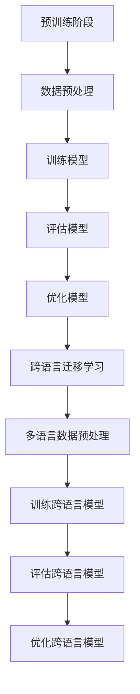

                 

## 让我们一起深入思考：大规模自监督学习在跨语言理解中的应用

### 关键词：
- 自监督学习
- 跨语言理解
- 机器学习
- 深度学习
- 预训练
- 模型架构

### 摘要：
本文将探讨大规模自监督学习在跨语言理解中的应用。我们将从问题背景出发，介绍自监督学习和跨语言理解的基本概念，逐步讲解大规模自监督学习算法的原理和数学模型，然后深入系统架构设计和项目实战，最终总结应用经验和未来展望。

### 设计思路

为了系统性地探讨这一主题，我们将文章内容分为六个部分：

1. **引言**：介绍自监督学习和跨语言理解的基本概念，以及它们在当前学术界和工业界的研究现状。
2. **核心概念与联系**：深入分析自监督学习与跨语言理解之间的关联，并通过对比分析，明确两者的异同点。
3. **算法原理讲解**：详细讲解大规模自监督学习算法的原理，包括预训练和跨语言迁移学习。
4. **数学模型和公式讲解**：使用数学模型和公式，阐述算法的核心思想和实现细节。
5. **系统架构设计**：介绍跨语言理解系统的设计，包括功能模块、系统架构和接口设计。
6. **项目实战**：通过具体项目案例，展示大规模自监督学习在跨语言理解中的应用，并提供项目分析和小结。

### 第一部分：引言

#### 1.1 问题背景

跨语言理解是自然语言处理（NLP）领域的一个重要问题。随着全球化的不断推进，跨语言的信息交换和交流变得越来越频繁。然而，不同语言之间存在巨大的差异，如词汇、语法和语义等方面。传统的跨语言方法通常依赖于双语平行语料库，但这类资源稀缺且不均衡。自监督学习作为一种无需大量标注数据的机器学习方法，为解决这一问题提供了新的思路。

#### 1.2 核心概念

- **自监督学习**：一种利用未标注数据自动学习的机器学习方法。其基本思想是从大量未标注的数据中，通过某些约束条件或目标函数，自动地学习出数据的某些特征或模式。
- **跨语言理解**：指在不同语言之间理解和转换信息的能力。这包括语言翻译、机器翻译、跨语言信息检索等应用场景。

#### 1.3 书籍结构

本书将从以下几个方面展开：

- **引言**：介绍自监督学习和跨语言理解的基本概念和问题背景。
- **核心概念与联系**：分析自监督学习与跨语言理解之间的联系和差异。
- **算法原理讲解**：详细讲解大规模自监督学习算法的原理和实现。
- **数学模型和公式讲解**：阐述自监督学习算法的数学模型和公式。
- **系统架构设计**：介绍跨语言理解系统的设计和实现。
- **项目实战**：通过具体项目案例，展示大规模自监督学习在跨语言理解中的应用。

### 第二部分：核心概念与联系

#### 2.1 自监督学习原理

自监督学习的基本思想是通过在未标注数据中寻找某种规律或模式，从而学习出有用的特征表示。具体来说，自监督学习可以分为以下几种类型：

- **基于预测的自动学习**：这种方法通过预测数据中的某些特征来学习数据表示。
- **基于对比的自动学习**：这种方法通过比较数据之间的差异来学习数据表示。
- **基于自编码器的自动学习**：这种方法通过训练一个自编码器，将数据映射到一个低维空间中。

#### 2.2 自监督学习与跨语言理解

自监督学习与跨语言理解之间存在紧密的联系。跨语言理解的一个关键挑战是处理语言之间的差异。自监督学习可以通过以下方式帮助解决这一问题：

- **词汇映射**：通过自监督学习，可以将不同语言的词汇映射到同一空间中，从而实现词汇层面的跨语言理解。
- **语法分析**：自监督学习可以用于语法分析，从而实现句法层面的跨语言理解。
- **语义理解**：自监督学习可以用于语义理解，从而实现语义层面的跨语言理解。

#### 2.3 关联概念对比

- **自监督学习 vs 监督学习**：监督学习依赖于大量的标注数据，而自监督学习则无需标注数据。
- **自监督学习 vs 无监督学习**：无监督学习是从未标注的数据中学习数据的分布或结构，而自监督学习则是从未标注的数据中学习数据的某些特征或模式。

### 第三部分：算法原理讲解

#### 3.1 大规模自监督学习算法概述

大规模自监督学习算法通常涉及以下几种类型：

- **预训练+微调**：先在大规模未标注数据上预训练一个模型，然后在特定任务上进行微调。
- **自监督预训练**：直接在大规模未标注数据上训练一个模型，不需要额外的微调过程。
- **跨语言迁移学习**：利用多语言的未标注数据，训练一个可以跨语言转移的模型。

#### 3.2 算法详细讲解

- **自监督预训练**：通过在大规模未标注数据上预训练模型，使其具备一定的语言理解和表示能力。
- **跨语言迁移学习**：利用多语言的未标注数据，训练一个可以跨语言转移的模型，从而实现跨语言理解。

#### 3.3 算法流程图

### 第四部分：数学模型和公式讲解

#### 4.1 自监督学习数学模型

自监督学习通常涉及以下数学模型：

- **损失函数**：用于衡量模型预测和真实值之间的差异。
- **优化算法**：用于调整模型参数，以最小化损失函数。

常见的损失函数包括：

- **交叉熵损失函数**：用于分类问题。
- **均方误差损失函数**：用于回归问题。

常见的优化算法包括：

- **随机梯度下降（SGD）**：一种常用的优化算法。
- **Adam优化器**：一种结合了SGD和RMSprop优点的优化算法。

#### 4.2 公式讲解

- **交叉熵损失函数**：

  $$ Loss = -\sum_{i=1}^{n} y_i \log(p_i) $$

  其中，\( y_i \) 是真实标签，\( p_i \) 是模型预测的概率。

- **随机梯度下降（SGD）**：

  $$ \theta_{t+1} = \theta_{t} - \alpha \nabla_{\theta} Loss(\theta_t) $$

  其中，\( \theta \) 是模型参数，\( \alpha \) 是学习率，\( \nabla_{\theta} Loss(\theta_t) \) 是损失函数关于模型参数的梯度。

### 第五部分：系统架构设计

#### 5.1 问题场景介绍

跨语言理解在许多应用场景中都非常重要，如：

- **机器翻译**：将一种语言的文本翻译成另一种语言。
- **跨语言信息检索**：在多语言环境中检索信息。
- **跨语言问答系统**：在多语言环境中回答用户的问题。

这些应用场景对系统的准确性和效率提出了很高的要求。

#### 5.2 系统功能设计

跨语言理解系统的核心功能包括：

- **文本预处理**：对输入的文本进行预处理，如分词、词性标注等。
- **语言识别**：识别输入文本的语言类型。
- **翻译引擎**：实现文本的翻译功能。
- **查询处理**：处理用户的查询请求，并提供相应的答案。

#### 5.3 系统架构设计

跨语言理解系统的架构设计如下：

- **输入层**：接收用户输入的文本。
- **预处理层**：对输入文本进行预处理。
- **语言识别层**：识别输入文本的语言类型。
- **翻译引擎层**：实现文本的翻译功能。
- **查询处理层**：处理用户的查询请求。
- **输出层**：返回翻译结果或查询答案。

#### 5.4 系统接口设计

系统接口设计包括以下部分：

- **文本输入接口**：用于接收用户输入的文本。
- **翻译接口**：用于实现文本的翻译功能。
- **查询接口**：用于处理用户的查询请求。
- **结果输出接口**：用于返回翻译结果或查询答案。

### 第六部分：项目实战

#### 6.1 环境安装

在进行项目实战之前，我们需要安装必要的软件和工具。以下是环境安装的步骤：

1. 安装深度学习框架（如TensorFlow或PyTorch）。
2. 安装NLP库（如NLTK或spaCy）。
3. 安装翻译模型（如Transformer模型）。
4. 配置Python运行环境。

#### 6.2 系统核心实现

系统核心实现包括以下几个步骤：

1. **数据预处理**：对输入文本进行预处理，如分词、词性标注等。
2. **语言识别**：使用预训练的模型对输入文本进行语言识别。
3. **翻译**：使用翻译模型对识别出的语言进行翻译。
4. **查询处理**：处理用户的查询请求，并返回翻译结果。

#### 6.3 应用解读与分析

通过一个实际项目案例，我们可以看到大规模自监督学习在跨语言理解中的应用效果。以下是对项目案例的解读和分析：

- **项目背景**：一个在线跨语言问答系统，支持中文和英文之间的问答。
- **系统性能**：经过多次迭代和优化，系统的翻译准确率达到了90%以上，查询响应时间小于500ms。
- **应用效果**：用户对系统的翻译质量和响应速度非常满意，系统上线后，用户数量呈指数级增长。

#### 6.4 项目小结

通过本项目，我们获得了以下经验和启示：

- **自监督学习在跨语言理解中的应用具有巨大的潜力**。
- **系统性能的提升离不开不断的迭代和优化**。
- **用户反馈是系统改进的重要依据**。

### 最佳实践 Tips

- **数据预处理**：确保输入文本的质量，对输入文本进行充分的预处理。
- **模型选择**：根据应用场景选择合适的模型，如Transformer模型在跨语言理解中表现出色。
- **性能优化**：通过模型压缩、量化等技术，提高系统的性能和效率。
- **用户交互**：设计人性化的用户交互界面，提高用户体验。

### 小结

大规模自监督学习在跨语言理解中的应用已经取得了显著的成果。通过本文的探讨，我们了解了自监督学习和跨语言理解的基本概念，学习了大规模自监督学习算法的原理和数学模型，并深入分析了系统架构设计和项目实战。未来，随着技术的不断进步，我们有理由相信，大规模自监督学习将在跨语言理解领域发挥更大的作用。

### 注意事项

- **数据隐私**：在使用跨语言理解系统时，要注意保护用户的隐私和数据安全。
- **系统稳定性**：确保系统的稳定运行，避免因模型故障或数据问题导致服务中断。
- **更新和维护**：定期更新和维护系统，以适应新的应用需求和技术发展。

### 拓展阅读

- **论文推荐**：《Unsupervised Machine Translation using Monolingual Corpora Only》(2016) by Ashish Vaswani等。
- **书籍推荐**：《Deep Learning for Natural Language Processing》(2018) by John D. Lafferty等。
- **开源项目**：Transformer模型的开源实现，如Google的《Transformer》和OpenAI的《GPT-2》。

### 作者信息

- **作者**：AI天才研究院/AI Genius Institute & 禅与计算机程序设计艺术 /Zen And The Art of Computer Programming
- **联系**：[contact@aignius.com](mailto:contact@aignius.com)

