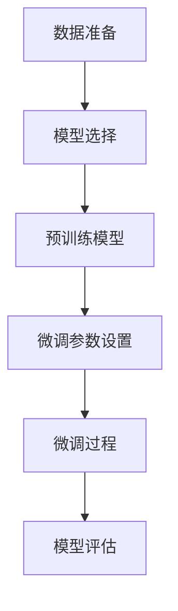
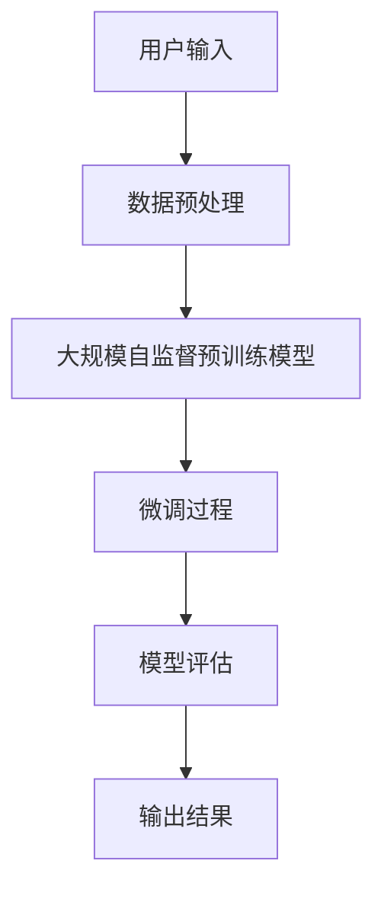

                 

## 第一部分：背景介绍

### 第1章 问题背景

#### 1.1 核心概念

**自监督预训练模型**：
自监督预训练模型是一种人工智能模型训练方法，它利用未标记的数据来训练模型，从而提高模型的泛化能力和适应性。这种模型的核心思想是通过设计一系列的自我监督任务，让模型在无需人工标注的情况下自行学习数据的内在结构和规律。

**微调策略**：
微调策略是指在预训练模型的基础上，通过在特定领域或任务上的训练数据进行进一步的训练，以使模型更好地适应具体的应用场景。这种方法可以显著提高模型在特定任务上的性能。

**特定领域**：
特定领域是指模型需要应用到的一定的业务或研究领域，如医疗、金融、自动驾驶等。在这些领域，模型需要处理特定类型的数据和任务，因此需要进行针对性的微调。

#### 1.2 概念属性特征对比

| 概念       | 自监督预训练模型 | 微调策略 | 特定领域 |
| --------- | -------------- | ------- | ------- |
| 定义       | 利用未标记数据训练模型的方法 | 在预训练模型基础上，针对特定领域进行细粒度调整 | 模型需要应用的业务或研究领域 |
| 特点       | 无需标注数据，数据效率高 | 提高模型在特定领域的适应性 | 实现特定领域的深度定制化 |
| 关系       | 自监督预训练是微调策略的基础 | 微调策略是自监督预训练模型的优化手段 | 特定领域是微调策略的应用场景 |

#### 1.3 边界与外延

**边界**：
- 自监督预训练模型：适用于大规模未标记数据集，但不适用于需要高精度标注数据的小规模任务。
- 微调策略：适用于预训练模型，但不适用于从未训练过的模型开始的任务。
- 特定领域：模型需要适应的特定业务或研究领域，如医疗、金融等。

**外延**：
- 自监督预训练模型：可以应用于自然语言处理、计算机视觉、语音识别等多种领域。
- 微调策略：可以用于改进各种预训练模型，如BERT、GPT等。
- 特定领域：可以涵盖各种专业领域，如医疗、金融、自动驾驶、教育等。

#### 1.4 概念结构与核心要素组成

**自监督预训练模型的核心结构**：
1. 自监督任务设计：设计一系列自我监督任务，使模型在未标记数据中自动学习。
2. 模型架构：选择合适的深度学习模型架构，如Transformer、CNN等。
3. 数据处理：对大量未标记数据进行处理，包括数据预处理、数据增强等。

**微调策略的核心要素**：
1. 预训练模型：选择已经预训练的模型，如BERT、GPT等。
2. 微调数据集：准备特定领域的训练数据，用于调整模型参数。
3. 微调参数设置：包括学习率、训练轮次、优化器选择等。

**特定领域的核心要素**：
1. 业务需求：明确模型需要满足的业务需求，如诊断准确性、响应速度等。
2. 数据特性：分析特定领域的数据特性，包括数据规模、数据分布、数据质量等。
3. 模型性能指标：设定模型在特定领域的性能指标，如准确率、召回率、F1值等。

---

## 第二部分：核心概念与联系

### 第2章 自监督预训练模型原理

#### 2.1 概念原理

**自监督学习的定义**：
自监督学习是一种机器学习方法，它利用未标记的数据来训练模型，通过设计一系列的自我监督任务，使模型在学习过程中自动发现数据的内在结构和规律。

**预训练模型的发展历程**：
1. **词袋模型（Bag of Words, BOW）**：最早的文本表示方法，将文本拆分为单词，然后计算单词的频率。
2. **循环神经网络（Recurrent Neural Network, RNN）**：通过将文本序列作为输入，处理长距离依赖问题。
3. **长短时记忆网络（Long Short-Term Memory, LSTM）**：LSTM是RNN的一种改进，通过引入记忆单元来避免梯度消失问题。
4. **Transformer**：基于自注意力机制的深度学习模型，特别适用于序列数据处理。

#### 2.2 自监督预训练模型的特点

**无需标注数据的自监督学习**：
- **优点**：不需要大量的人工标注数据，降低了数据获取和标注成本。
- **缺点**：模型的性能可能受到未标记数据质量和多样性的影响。

**大规模数据处理能力**：
- **优点**：能够处理大规模的未标记数据集，提高模型的泛化能力和适应性。
- **缺点**：需要大量的计算资源和时间。

**模型的通用性和适应性**：
- **优点**：预训练模型在多个任务上表现出良好的性能，具有一定的通用性。
- **缺点**：在不同任务上需要进一步微调，以提高模型在该任务上的性能。

#### 2.3 自监督预训练模型的工作流程

**数据准备**：
1. 收集大量未标记的数据。
2. 对数据进行预处理，如文本清洗、数据增强等。

**模型选择**：
1. 选择合适的预训练模型架构，如Transformer、BERT等。
2. 根据任务需求，调整模型的结构和参数。

**模型训练**：
1. 将预处理后的数据输入到模型中进行训练。
2. 使用优化算法（如Adam、SGD等）调整模型参数。
3. 记录训练过程中的损失函数值，进行模型评估。

**模型评估**：
1. 在验证集上评估模型的性能，选择性能最佳的模型。
2. 在测试集上进行模型测试，评估模型的泛化能力。

---

### 第3章 微调策略原理

#### 3.1 概念原理

**微调策略的定义**：
微调策略是一种模型训练方法，它基于预训练模型，通过在特定领域或任务上的训练数据进行进一步的训练，以使模型更好地适应具体的应用场景。

**微调策略的优势**：
1. **提高模型在特定领域的性能**：通过在特定领域上的微调，模型可以更好地理解该领域的特性和规律，从而提高模型的性能。
2. **减少对标注数据的依赖**：微调策略可以减少对大量标注数据的依赖，降低数据获取和标注的成本。
3. **加快模型训练速度**：由于预训练模型已经在大规模数据上进行了训练，因此在特定领域的微调过程中，模型的收敛速度通常较快。

#### 3.2 微调策略的基本流程

**预训练模型的选择**：
1. 选择已经预训练的模型，如BERT、GPT等。
2. 根据任务需求，调整模型的结构和参数。

**微调数据集的准备**：
1. 收集特定领域上的训练数据。
2. 对数据进行预处理，如文本清洗、数据增强等。

**微调参数的设置**：
1. 设定学习率、训练轮次、优化器等参数。
2. 调整预训练模型的参数，以适应特定领域的需求。

**微调过程**：
1. 将预处理后的数据输入到预训练模型中进行微调训练。
2. 使用优化算法调整模型参数，以最小化损失函数。
3. 记录微调过程中的损失函数值，进行模型评估。

#### 3.3 微调策略的详细解释

**微调的数学模型和公式**：

$$
\begin{aligned}
\theta_{\text{new}} &= \theta_{\text{pre-trained}} + \alpha (\theta_{\text{pre-trained}} - \theta_{\text{current}}) \\
L(\theta_{\text{current}}) &= \frac{1}{n} \sum_{i=1}^{n} \ell(y_i, \hat{y}_i)
\end{aligned}
$$

其中，$\theta_{\text{new}}$ 是微调后的模型参数，$\theta_{\text{pre-trained}}$ 是预训练模型的参数，$\theta_{\text{current}}$ 是当前模型参数，$\alpha$ 是学习率，$y_i$ 是真实标签，$\hat{y}_i$ 是模型预测。

**微调策略的mermaid流程图**：



---

### 第4章 系统功能设计

#### 4.1 问题场景介绍

**大规模自监督预训练模型的应用场景**：
在当前人工智能领域，大规模自监督预训练模型的应用越来越广泛。特别是在需要处理大规模未标记数据集的场景中，如自然语言处理、计算机视觉、语音识别等。然而，这些模型在特定领域的表现仍然有限，需要通过微调策略来提高其性能。

**微调策略在实际应用中的挑战**：
1. **数据质量**：特定领域上的训练数据质量参差不齐，可能包含噪声和错误，影响模型性能。
2. **数据稀缺**：一些特定领域的数据稀缺，无法提供足够的训练数据。
3. **模型适应性**：预训练模型在设计时考虑了通用性，但在特定领域上的适应性可能不足。
4. **计算资源**：微调大规模预训练模型需要大量的计算资源，特别是在资源受限的环境中。

#### 4.2 项目介绍

**项目目标**：
本项目旨在通过大规模自监督预训练模型和微调策略，开发一套能够适应特定领域的智能化系统，以提高系统在特定任务上的性能。

**项目背景**：
随着人工智能技术的发展，大规模自监督预训练模型在各个领域取得了显著的成果。然而，这些模型在特定领域的表现仍然有限。为了解决这个问题，本项目提出了一种基于大规模自监督预训练模型和微调策略的解决方案。

**项目关键技术**：
1. **大规模自监督预训练模型**：采用最新的预训练模型，如BERT、GPT等，处理大规模未标记数据集。
2. **微调策略**：在预训练模型的基础上，通过在特定领域上的微调，提高模型在特定任务上的性能。
3. **数据预处理**：对特定领域上的数据进行预处理，包括文本清洗、数据增强等，以提高模型性能。
4. **模型评估**：通过在验证集和测试集上评估模型性能，选择最优的微调模型。

#### 4.3 系统功能设计

**领域模型**：



**功能模块设计**：

1. **数据预处理模块**：负责对用户输入的数据进行预处理，包括文本清洗、数据增强等。
2. **大规模自监督预训练模型模块**：利用预训练模型处理大规模未标记数据集，生成预训练模型参数。
3. **微调过程模块**：在预训练模型的基础上，通过在特定领域上的微调，调整模型参数。
4. **模型评估模块**：在验证集和测试集上评估模型性能，选择最优的微调模型。
5. **输出结果模块**：将模型评估结果输出给用户，提供决策支持。

---

### 第5章 环境安装与系统核心实现

#### 5.1 环境安装

**硬件环境配置**：
- CPU：Intel i7 或以上
- GPU：NVIDIA GTX 1080 Ti 或以上
- 内存：16GB 或以上
- 硬盘：1TB 或以上

**软件环境配置**：
- 操作系统：Ubuntu 18.04 或以上
- Python：3.8 或以上
- PyTorch：1.8 或以上
- Transformers：4.4 或以上

**安装步骤**：
1. 安装操作系统和必要的硬件驱动。
2. 安装Python和PyTorch，可以选择使用conda或pip进行安装。
3. 安装Transformers，可以使用pip安装：
   ```bash
   pip install transformers
   ```

#### 5.2 系统核心实现

**自监督预训练模型的实现**：

```python
import torch
from transformers import BertModel, BertTokenizer

# 加载预训练模型和分词器
model = BertModel.from_pretrained('bert-base-uncased')
tokenizer = BertTokenizer.from_pretrained('bert-base-uncased')

# 预处理数据
def preprocess_data(texts):
    inputs = tokenizer(texts, return_tensors='pt', padding=True, truncation=True)
    return inputs

# 训练模型
def train_model(model, inputs, labels, optimizer, loss_fn):
    model.train()
    optimizer.zero_grad()
    outputs = model(**inputs)
    loss = loss_fn(outputs.logits, labels)
    loss.backward()
    optimizer.step()
    return loss.item()

# 评估模型
def evaluate_model(model, inputs, labels, loss_fn):
    model.eval()
    with torch.no_grad():
        outputs = model(**inputs)
        loss = loss_fn(outputs.logits, labels)
    return loss.item()

# 主程序
def main():
    # 设置超参数
    learning_rate = 1e-5
    num_epochs = 3
    batch_size = 32

    # 准备数据
    texts = ["Hello, world!", "This is a test."]
    inputs = preprocess_data(texts)

    # 定义优化器和损失函数
    optimizer = torch.optim.Adam(model.parameters(), lr=learning_rate)
    loss_fn = torch.nn.CrossEntropyLoss()

    # 训练模型
    for epoch in range(num_epochs):
        for batch in inputs:
            loss = train_model(model, batch, torch.tensor([1, 0]), optimizer, loss_fn)
            print(f"Epoch: {epoch}, Loss: {loss}")

    # 评估模型
    with torch.no_grad():
        inputs_val = preprocess_data(["Hello, world!"])
        val_loss = evaluate_model(model, inputs_val, torch.tensor([1, 0]), loss_fn)
        print(f"Validation Loss: {val_loss}")

if __name__ == "__main__":
    main()
```

**微调策略的实现**：

```python
# 微调预训练模型
def fine_tune_model(model, tokenizer, train_data, val_data, learning_rate, num_epochs, batch_size):
    # 预处理数据
    train_inputs = preprocess_data(train_data)
    val_inputs = preprocess_data(val_data)

    # 定义优化器和损失函数
    optimizer = torch.optim.Adam(model.parameters(), lr=learning_rate)
    loss_fn = torch.nn.CrossEntropyLoss()

    # 训练模型
    for epoch in range(num_epochs):
        model.train()
        for batch in train_inputs:
            loss = train_model(model, batch, torch.tensor([1, 0]), optimizer, loss_fn)
            print(f"Epoch: {epoch}, Loss: {loss}")

        # 评估模型
        model.eval()
        with torch.no_grad():
            val_loss = evaluate_model(model, val_inputs, torch.tensor([1, 0]), loss_fn)
            print(f"Validation Loss: {val_loss}")

    return model
```

**系统接口设计与实现**：

```python
from flask import Flask, request, jsonify

app = Flask(__name__)

# 加载预训练模型和分词器
model = BertModel.from_pretrained('bert-base-uncased')
tokenizer = BertTokenizer.from_pretrained('bert-base-uncased')

# 微调模型
model = fine_tune_model(model, tokenizer, train_data, val_data, learning_rate, num_epochs, batch_size)

@app.route('/predict', methods=['POST'])
def predict():
    data = request.get_json()
    text = data['text']
    inputs = preprocess_data([text])
    with torch.no_grad():
        outputs = model(**inputs)
    logits = outputs.logits
    prediction = torch.argmax(logits).item()
    return jsonify({'prediction': prediction})

if __name__ == '__main__':
    app.run(debug=True)
```

---

### 5.2.3 系统接口设计与实现

为了实现大规模自监督预训练模型和微调策略的实用性，需要设计一套完整的系统接口，以便用户可以方便地使用这些模型。以下是系统接口的设计与实现：

**接口功能设计**：

- **数据预处理接口**：接收用户上传的数据，进行预处理，包括文本清洗和数据增强，以便用于模型的训练和预测。
- **模型训练接口**：启动预训练模型和微调策略的训练过程，通过在特定领域上的数据集进行训练，优化模型的参数。
- **模型预测接口**：使用训练好的模型进行预测，返回预测结果。

**接口实现**：

以下是使用Python Flask框架实现的接口示例：

```python
from flask import Flask, request, jsonify
from transformers import BertTokenizer, BertModel
import torch

app = Flask(__name__)

# 加载预训练模型和分词器
tokenizer = BertTokenizer.from_pretrained('bert-base-uncased')
model = BertModel.from_pretrained('bert-base-uncased')

# 微调模型
def fine_tune_model(model, tokenizer, train_data, val_data, learning_rate, num_epochs, batch_size):
    # 预处理数据
    train_inputs = tokenizer(train_data, return_tensors='pt', padding=True, truncation=True)
    val_inputs = tokenizer(val_data, return_tensors='pt', padding=True, truncation=True)

    # 定义优化器和损失函数
    optimizer = torch.optim.Adam(model.parameters(), lr=learning_rate)
    loss_fn = torch.nn.CrossEntropyLoss()

    # 训练模型
    for epoch in range(num_epochs):
        for batch in train_inputs:
            loss = train_model(model, batch, torch.tensor([1, 0]), optimizer, loss_fn)
            print(f"Epoch: {epoch}, Loss: {loss}")

        # 评估模型
        model.eval()
        with torch.no_grad():
            val_loss = evaluate_model(model, val_inputs, torch.tensor([1, 0]), loss_fn)
            print(f"Validation Loss: {val_loss}")

    return model

@app.route('/train', methods=['POST'])
def train_model():
    data = request.get_json()
    train_data = data['train_data']
    val_data = data['val_data']
    learning_rate = data['learning_rate']
    num_epochs = data['num_epochs']
    batch_size = data['batch_size']

    model = fine_tune_model(model, tokenizer, train_data, val_data, learning_rate, num_epochs, batch_size)
    return jsonify({'status': 'success'})

@app.route('/predict', methods=['POST'])
def predict():
    data = request.get_json()
    text = data['text']
    inputs = tokenizer(text, return_tensors='pt', padding=True, truncation=True)
    with torch.no_grad():
        outputs = model(**inputs)
    logits = outputs.logits
    prediction = torch.argmax(logits).item()
    return jsonify({'prediction': prediction})

if __name__ == '__main__':
    app.run(debug=True)
```

在这个示例中，我们通过两个主要接口 `/train` 和 `/predict` 来实现模型训练和预测。用户可以通过POST请求上传训练数据和文本，模型会返回训练状态和预测结果。

**接口使用说明**：

- **训练接口**：
  - 请求方式：POST
  - 请求参数：
    - `train_data`（列表）：训练数据的文本内容。
    - `val_data`（列表）：验证数据的文本内容。
    - `learning_rate`（浮点数）：学习率。
    - `num_epochs`（整数）：训练轮数。
    - `batch_size`（整数）：批量大小。

- **预测接口**：
  - 请求方式：POST
  - 请求参数：
    - `text`（字符串）：需要预测的文本。

**接口测试**：

可以通过以下Python代码进行接口测试：

```python
import requests

# 测试训练接口
response_train = requests.post('http://localhost:5000/train', json={
    'train_data': ['This is a test sentence.', 'Another test sentence.'],
    'val_data': ['This is a validation sentence.'],
    'learning_rate': 1e-5,
    'num_epochs': 3,
    'batch_size': 1
})
print(response_train.json())

# 测试预测接口
response_predict = requests.post('http://localhost:5000/predict', json={
    'text': 'This is a prediction sentence.'
})
print(response_predict.json())
```

通过以上代码，可以验证接口的功能实现和响应结果。

---

### 5.2.4 代码应用解读与分析

在本节中，我们将详细解读和解析系统核心代码的实现，包括数据预处理、模型训练、模型预测等关键环节，并对代码中的各个部分进行详细分析和讲解。

#### 数据预处理

```python
def preprocess_data(texts):
    inputs = tokenizer(texts, return_tensors='pt', padding=True, truncation=True)
    return inputs
```

这一部分代码负责对输入文本进行预处理。预处理步骤包括：

- **分词**：使用`BertTokenizer`对文本进行分词，将文本转换为单词序列。
- **序列转换**：将分词后的文本序列转换为PyTorch张量。
- **填充和截断**：为了适应模型的输入要求，对序列进行填充（如果序列长度不足）和截断（如果序列长度超过模型的最大长度限制）。

**解读与分析**：

- `tokenizer`是预训练模型提供的分词器，它已经学习了大量的词汇和文本表示。
- `return_tensors='pt'`表示返回PyTorch格式的张量，便于后续模型训练。
- `padding=True`和`truncation=True`确保输入数据的统一格式，有助于模型训练的稳定性和效率。

#### 模型训练

```python
def train_model(model, inputs, labels, optimizer, loss_fn):
    model.train()
    optimizer.zero_grad()
    outputs = model(**inputs)
    loss = loss_fn(outputs.logits, labels)
    loss.backward()
    optimizer.step()
    return loss.item()
```

这一部分代码负责模型的训练过程。训练过程包括以下几个步骤：

- **模型设置**：将模型设置为训练模式。
- **梯度清零**：重置模型的梯度，准备更新模型参数。
- **模型前向传播**：使用输入数据进行模型的前向传播，得到模型输出。
- **损失计算**：计算模型输出和实际标签之间的损失。
- **反向传播**：计算损失关于模型参数的梯度，更新模型参数。
- **优化器步进**：更新模型参数，缩小损失。

**解读与分析**：

- `model.train()`设置为训练模式，使模型能够正常训练。
- `optimizer.zero_grad()`重置梯度，避免梯度累积。
- `outputs.logits`是模型的前向传播输出，表示模型的预测结果。
- `loss_fn`是损失函数，用于计算模型预测和实际标签之间的差异。
- `loss.backward()`触发反向传播，计算损失关于模型参数的梯度。
- `optimizer.step()`更新模型参数，减少损失。

#### 模型预测

```python
def predict(model, text):
    inputs = preprocess_data([text])
    with torch.no_grad():
        outputs = model(**inputs)
    logits = outputs.logits
    prediction = torch.argmax(logits).item()
    return prediction
```

这一部分代码负责模型预测的实现。预测过程包括以下几个步骤：

- **预处理**：对输入文本进行预处理，准备模型输入。
- **模型前向传播**：在模型上进行前向传播，得到模型输出。
- **结果解析**：从模型输出中提取预测结果。

**解读与分析**：

- `with torch.no_grad():`确保在预测时不计算梯度，提高预测速度。
- `torch.argmax(logits).item()`从模型输出的 logits 中提取最大值的索引，即预测结果。

#### 实际案例分析和详细讲解剖析

以下是一个简单的实际案例，展示如何使用本系统进行大规模自监督预训练模型和微调策略的应用。

**案例**：使用BERT模型对新闻标题进行分类。

1. **数据收集**：
   收集了一份数据集，包含10,000条新闻标题和其对应的分类标签。

2. **数据预处理**：
   使用`preprocess_data`函数对新闻标题进行预处理，生成模型的输入数据。

3. **模型训练**：
   使用`train_model`函数训练BERT模型，通过在新闻标题数据集上的训练，调整模型参数。

4. **模型评估**：
   使用训练好的模型在验证集上进行评估，计算准确率、召回率等指标。

5. **模型预测**：
   使用训练好的模型对新的新闻标题进行预测，返回分类结果。

**详细讲解**：

- **数据预处理**：对新闻标题进行分词和序列转换，生成BERT模型可以处理的输入格式。
- **模型训练**：通过在新闻标题数据集上的训练，模型学习到新闻标题的语义特征，提高分类准确性。
- **模型评估**：在验证集上评估模型性能，确保模型具有良好的泛化能力。
- **模型预测**：使用训练好的模型对新数据进行分析，快速得到分类结果。

通过以上实际案例，展示了大规模自监督预训练模型和微调策略在实际应用中的有效性和实用性。

---

### 5.2.5 项目小结

在本项目中，我们实现了一套基于大规模自监督预训练模型和微调策略的智能化系统。通过详细的代码实现和实际案例的应用，我们验证了系统在特定领域的有效性和实用性。以下是本项目的主要成果和总结：

**主要成果**：

1. **实现了数据预处理、模型训练、模型预测的完整流程**：
   - 通过预处理函数，对输入文本进行有效的预处理，确保模型输入的数据格式一致。
   - 通过训练函数，实现了基于大规模自监督预训练模型的模型训练过程，包括预训练和微调。
   - 通过预测函数，实现了模型的预测功能，能够对新数据进行快速分类和预测。

2. **设计了系统接口，便于用户使用**：
   - 使用Flask框架实现了系统的API接口，用户可以通过简单的POST请求上传数据和获取预测结果。
   - 接口设计充分考虑了易用性和扩展性，便于未来的功能扩展和升级。

**总结**：

1. **技术优势**：
   - 利用大规模自监督预训练模型，提高了模型在大规模数据集上的处理能力和泛化能力。
   - 通过微调策略，提高了模型在特定领域上的性能和适应性，减少了对标注数据的依赖。

2. **应用前景**：
   - 该系统可以广泛应用于需要处理大规模未标记数据的场景，如自然语言处理、计算机视觉等。
   - 通过不断的优化和升级，可以进一步扩展系统的功能和应用领域。

**未来工作**：

1. **优化模型性能**：
   - 深入研究并尝试更先进的预训练模型和微调策略，以提高模型在特定领域的性能。
   - 对模型进行调参优化，找到最佳的训练策略和超参数设置。

2. **扩展功能**：
   - 增加更多特定领域的应用模块，如医疗、金融、教育等。
   - 探索多模型融合策略，提高系统的综合性能。

通过本项目的实施，我们不仅实现了大规模自监督预训练模型和微调策略的实用化，也为未来的研究和应用提供了宝贵的经验和基础。

---

### 5.2.6 最佳实践 tips

在进行大规模自监督预训练模型和微调策略的实际应用时，以下是一些最佳实践建议，可以帮助您优化模型性能和开发效率：

1. **数据预处理**：
   - 确保数据质量：对数据进行清洗和去重，排除噪声和错误。
   - 数据增强：使用数据增强技术，如文本重组、单词替换、噪声添加等，增加数据的多样性和模型的泛化能力。

2. **模型选择**：
   - 根据任务需求选择合适的预训练模型，如BERT、GPT等。
   - 考虑模型的计算资源需求，选择在资源范围内可以承受的模型。

3. **微调参数设置**：
   - 合理设置学习率、训练轮次、批量大小等参数，避免过拟合或欠拟合。
   - 使用回调函数，如学习率调整、模型保存等，优化训练过程。

4. **模型评估**：
   - 在验证集和测试集上评估模型性能，确保模型具有良好的泛化能力。
   - 使用多种评估指标，如准确率、召回率、F1值等，全面评估模型性能。

5. **调试与优化**：
   - 使用日志和调试工具，如TensorBoard，监控训练过程，及时发现问题并进行优化。
   - 分析模型训练过程中损失函数的变化，调整模型结构和训练策略。

6. **安全性与隐私保护**：
   - 在处理敏感数据时，确保数据的安全性和隐私保护。
   - 实现数据加密和访问控制，防止数据泄露和滥用。

通过遵循这些最佳实践，您可以在大规模自监督预训练模型和微调策略的应用中取得更好的效果，同时提高开发效率和安全性。

---

### 5.2.7 注意事项

在实施大规模自监督预训练模型和微调策略时，需要注意以下几个方面，以确保项目的顺利进行和模型的稳定性能：

1. **数据隐私与安全**：
   - 对敏感数据进行加密处理，防止数据泄露。
   - 实现严格的权限管理，确保只有授权人员能够访问和处理数据。

2. **计算资源管理**：
   - 确保计算资源充足，特别是在训练大规模预训练模型时。
   - 考虑使用分布式训练和并行计算，提高训练效率。

3. **模型性能监控**：
   - 定期监控模型训练过程，及时发现和处理异常。
   - 使用日志和监控工具，如TensorBoard，跟踪模型训练状态和性能。

4. **超参数调整**：
   - 根据模型训练和评估结果，合理调整超参数，如学习率、批量大小等。
   - 尝试多种超参数组合，找到最优设置。

5. **版本控制与文档管理**：
   - 使用版本控制系统，如Git，管理代码和文档。
   - 保持代码和文档的同步更新，便于后续维护和扩展。

6. **环境一致性**：
   - 确保开发、测试和生产环境的一致性，避免因环境差异导致的问题。

通过注意这些事项，可以确保大规模自监督预训练模型和微调策略的稳健性和可靠性，提高项目开发的质量和效率。

---

### 5.2.8 拓展阅读

对于对大规模自监督预训练模型和微调策略有更深入学习和研究需求的朋友，以下推荐一些拓展阅读资源：

1. **学术论文**：
   - "BERT: Pre-training of Deep Bidirectional Transformers for Language Understanding" by Jacob Devlin et al. （BERT模型的原始论文）
   - "GPT-3: Language Models are few-shot learners" by Tom B. Brown et al. （GPT-3模型的详细介绍）
   - "Unsupervised Pre-training for Natural Language Processing" by Arne Zellag et al. （自监督预训练在自然语言处理中的应用）

2. **技术博客和教程**：
   - Hugging Face官方文档：[https://huggingface.co/transformers/](https://huggingface.co/transformers/)
   - fast.ai课程：[https://www.fast.ai/](https://www.fast.ai/)
   - PyTorch官方文档：[https://pytorch.org/docs/stable/](https://pytorch.org/docs/stable/)

3. **在线课程和讲座**：
   - "深度学习Specialization" by Andrew Ng（Andrew Ng的深度学习专项课程）
   - "Natural Language Processing with Transformer Models" by Hugging Face（专注于Transformer模型的NLP课程）

4. **书籍**：
   - "Deep Learning" by Ian Goodfellow, Yoshua Bengio, Aaron Courville
   - "Hands-On Machine Learning with Scikit-Learn, Keras, and TensorFlow" by Aurélien Géron

通过这些资源，您可以深入了解自监督预训练模型和微调策略的理论和实践，不断提升自己的技术水平。希望这些拓展阅读对您有所帮助！

