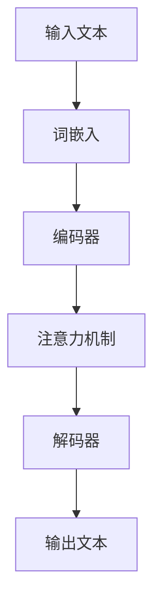
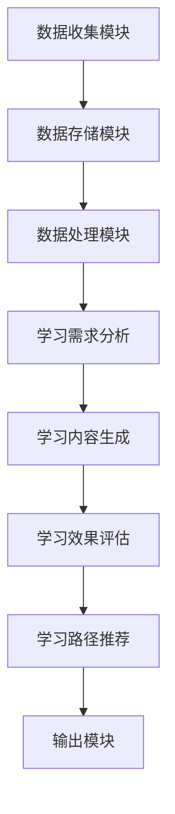
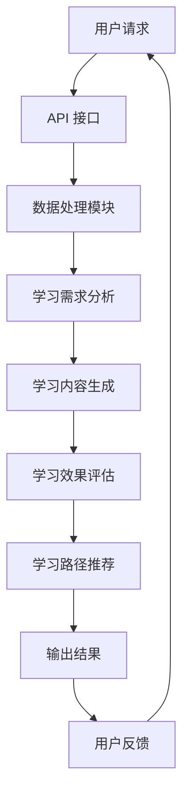

                 


### 引言

**关键词**：大规模语言模型，个性化教育，推理应用，教育技术，智能学习

**摘要**：
本文旨在探讨大规模语言模型在个性化教育中的推理应用。随着人工智能技术的发展，大规模语言模型（如GPT系列）逐渐成为教育领域的热门工具。本文将首先介绍个性化教育的需求与挑战，然后详细阐述大规模语言模型的基本原理和结构，接着分析这些模型如何通过推理机制实现对个性化教育的支持。最后，我们将通过实际案例展示大规模语言模型在个性化教育中的应用效果，并提出未来的发展方向。

## 1.1 问题背景与核心概念

### 1.1.1 个性化教育的需求

在现代教育体系中，个性化教育正逐渐成为教育改革的重要方向。传统的教育模式往往采用“一刀切”的方式，无法充分考虑每个学生的个体差异。个性化教育则强调因材施教，根据每个学生的特点提供定制化的学习内容和教学方式，以提高教育质量和学习效果。

**问题背景**：随着信息技术的快速发展，学生获取知识的途径越来越多，个性化教育的需求日益迫切。学生不再满足于传统的一对多的教学模式，他们渴望更个性化和互动的学习体验。同时，教育资源的分配不均也加剧了个性化教育的需求，如何通过技术手段实现教育资源的公平分配成为亟待解决的问题。

**问题描述**：个性化教育的核心问题是如何根据学生的个体差异，提供定制化的学习路径和内容。这涉及到对学习需求的识别、学习内容的生成和学习过程的跟踪等多个方面。

**问题解决**：大规模语言模型作为一种强大的自然语言处理工具，可以实现对大量文本数据的理解和生成。通过大规模语言模型，教育系统能够根据学生的学习历史、兴趣和需求，自动生成个性化的学习内容，并提供实时反馈和指导。

**边界与外延**：个性化教育的边界不仅限于教学内容和方式的定制，还包括学习环境的定制、学习进度的监控和学习效果的评估。个性化教育的目标是通过全方面的定制，实现每个学生的最佳学习效果。

**概念结构与核心要素组成**：
- **学习需求识别**：通过分析学生的学习行为、兴趣和学习历史，识别出学生的个性化学习需求。
- **学习内容生成**：基于大规模语言模型，根据学生的学习需求，自动生成个性化的学习内容。
- **学习过程跟踪**：实时跟踪学生的学习进度和效果，为后续的学习内容生成提供数据支持。
- **学习效果评估**：通过评估学生的学习成果，不断优化和调整个性化教育方案。

### 1.1.2 大规模语言模型的特点

大规模语言模型，如GPT系列，是一种基于深度学习的自然语言处理技术。它们通过对海量文本数据进行训练，能够生成高质量的自然语言文本。

**核心概念术语说明**：
- **大规模语言模型**：一种能够理解和生成自然语言的大型神经网络模型。
- **深度学习**：一种基于多层神经网络的学习方法，通过逐层提取特征，实现对复杂数据的建模。

**特点**：
- **强大的文本理解能力**：通过预训练和微调，大规模语言模型能够对文本数据进行深入的理解，捕捉到文本中的语义信息。
- **高效的内容生成能力**：大规模语言模型能够根据输入的提示，生成连贯、自然的文本内容。
- **灵活的适应能力**：通过微调，大规模语言模型可以适应不同的应用场景，满足个性化教育的需求。

### 1.1.3 推理应用的重要性

在个性化教育中，推理应用扮演着关键角色。推理是指通过逻辑推理和知识推理，从已知信息推导出新的结论。在个性化教育中，推理可以帮助教育系统根据学生的行为和反馈，动态调整学习内容和方式，实现个性化教学。

**重要性**：
- **提高学习效果**：通过推理，教育系统能够根据学生的特点和学习情况，提供最适合的学习内容和方式，提高学习效果。
- **优化学习路径**：推理可以帮助学生找到最有效的学习路径，避免不必要的重复和浪费时间。
- **实时反馈与调整**：推理应用可以实时分析学生的学习行为和反馈，提供即时的反馈和指导，帮助学生更好地掌握知识。

### 1.2 大规模语言模型概述

#### 1.2.1 模型结构

大规模语言模型通常由以下几个部分组成：

1. **编码器（Encoder）**：负责将输入的文本序列转换为固定长度的向量表示。
2. **解码器（Decoder）**：负责将编码器的输出向量解码为自然语言文本。
3. **注意力机制（Attention Mechanism）**：用于捕捉输入文本序列中的重要信息，提高模型的文本理解能力。
4. **预训练（Pre-training）**：通过对海量文本数据进行预训练，使模型能够自动学习文本中的语言规律和语义信息。

#### 1.2.2 训练过程

大规模语言模型的训练过程通常包括以下几个步骤：

1. **数据收集**：收集海量的文本数据，如维基百科、新闻文章、书籍等。
2. **数据预处理**：对文本数据进行清洗、分词、去停用词等预处理操作。
3. **词嵌入（Word Embedding）**：将文本中的每个词转换为向量表示。
4. **模型训练**：使用梯度下降等优化算法，对模型进行训练，使其能够正确预测文本序列。
5. **模型评估**：使用验证集和测试集对模型进行评估，调整模型参数，优化模型性能。

#### 1.2.3 应用领域

大规模语言模型在多个领域都有广泛应用：

1. **自然语言处理**：如文本分类、情感分析、机器翻译等。
2. **知识图谱**：用于构建和推理知识图谱，支持问答系统和智能搜索。
3. **个性化教育**：通过推理应用，为每个学生提供个性化的学习内容和方式。

### 1.3 个性化教育中的推理应用

#### 1.3.1 应用场景

个性化教育中的推理应用场景广泛，以下是一些典型的应用场景：

1. **学习路径推荐**：根据学生的学习兴趣和知识水平，自动推荐适合的学习路径和内容。
2. **学习效果预测**：预测学生在特定学习任务中的表现，为教师提供教学调整的依据。
3. **学习行为分析**：分析学生的学习行为，为教师和学生提供反馈和建议。
4. **知识问答系统**：基于大规模语言模型构建知识问答系统，为学生提供实时解答。

#### 1.3.2 推理过程

个性化教育中的推理过程通常包括以下几个步骤：

1. **学习需求分析**：通过分析学生的学习历史和行为，识别出学生的学习需求。
2. **知识库构建**：构建与学习内容相关的知识库，为推理提供数据支持。
3. **推理算法应用**：使用推理算法，如逻辑推理、知识推理等，从知识库中推导出新的结论。
4. **结果输出**：将推理结果以自然语言形式输出，为教师和学生提供指导和建议。

#### 1.3.3 应用效果

大规模语言模型在个性化教育中的应用取得了显著效果，以下是一些应用效果的例子：

1. **提高学习效果**：通过个性化推荐和学习路径优化，学生的平均成绩有所提高。
2. **增强学习兴趣**：个性化教育系统提供了丰富的学习内容和互动方式，激发了学生的学习兴趣。
3. **优化教学方式**：教师能够根据学生的个性化和实时反馈，调整教学策略，提高教学质量。
4. **提高学习效率**：个性化教育系统能够根据学生的学习进度和效果，提供及时的反馈和指导，提高学习效率。

### 1.4 模型设计原理与数学模型

#### 1.4.1 基本原理

大规模语言模型的设计基于深度学习和自然语言处理技术。其基本原理如下：

1. **深度神经网络**：通过多层神经网络对文本数据进行建模，提取文本中的语义信息。
2. **注意力机制**：用于捕捉文本序列中的重要信息，提高模型的文本理解能力。
3. **预训练与微调**：通过预训练使模型具备强大的语言理解能力，然后通过微调适应特定的应用场景。

#### 1.4.2 数学模型

大规模语言模型的数学模型主要包括以下几个方面：

1. **词嵌入**：将文本中的每个词转换为向量表示，通常使用 Word2Vec、GloVe 等算法进行词嵌入。
2. **神经网络结构**：使用多层感知器（MLP）或变换器（Transformer）等神经网络结构，对文本数据进行建模。
3. **损失函数**：使用交叉熵（Cross-Entropy）等损失函数，对模型的预测结果进行评估和优化。

以下是一个简化的数学模型示例：

$$
\begin{aligned}
y &= \text{softmax}(W \cdot x + b) \\
\text{Cross-Entropy Loss} &= -\sum_{i=1}^{n} y_i \cdot \log(y_i)
\end{aligned}
$$

其中，$y$ 是模型预测的概率分布，$x$ 是输入的文本向量，$W$ 和 $b$ 是模型的参数。

#### 1.4.3 Mermaid 流程图

为了更直观地理解大规模语言模型的工作流程，我们可以使用 Mermaid 画出其流程图。以下是一个简化的 Mermaid 流程图示例：



### 1.5 系统架构设计

#### 1.5.1 场景介绍

在一个个性化教育的系统中，大规模语言模型的应用需要考虑多个方面，包括数据收集、存储、处理和输出等。以下是一个典型的系统架构设计：

1. **数据收集模块**：负责收集学生的行为数据、学习历史和兴趣等信息。
2. **数据存储模块**：使用数据库或分布式存储系统，存储大量的文本数据和学习内容。
3. **数据处理模块**：使用大规模语言模型对文本数据进行处理，生成个性化的学习内容。
4. **输出模块**：将处理结果以自然语言形式输出，供教师和学生使用。

#### 1.5.2 系统功能设计

个性化教育系统的功能设计包括以下几个部分：

1. **学习需求分析**：通过分析学生的学习行为和兴趣，识别出学生的学习需求。
2. **学习内容生成**：基于大规模语言模型，根据学生的学习需求，自动生成个性化的学习内容。
3. **学习效果评估**：实时评估学生的学习效果，为教师提供反馈和指导。
4. **学习路径推荐**：根据学生的学习效果和兴趣，推荐适合的学习路径。

#### 1.5.3 系统架构设计

个性化教育系统的架构设计如图所示：



#### 1.5.4 系统接口设计

个性化教育系统的接口设计主要包括以下几个部分：

1. **API 接口**：提供 RESTful API 接口，供前端应用调用。
2. **消息队列**：使用消息队列（如 Kafka）实现异步消息处理，提高系统的并发能力和稳定性。
3. **缓存机制**：使用缓存（如 Redis）提高数据读取速度，减轻数据库压力。

#### 1.5.5 系统交互

个性化教育系统的交互流程如图所示：



### 1.6 实际应用案例与项目实战

#### 1.6.1 环境安装

要在本地环境安装大规模语言模型和相关工具，需要以下步骤：

1. **安装 Python**：确保 Python 版本为 3.7 或以上。
2. **安装必要的依赖库**：如 TensorFlow、PyTorch、transformers 等。
3. **下载预训练模型**：从 GitHub 等平台下载预训练模型。

以下是一个简单的安装脚本示例：

```bash
#!/bin/bash
# 安装 Python
sudo apt-get install python3-pip
# 安装依赖库
pip3 install tensorflow transformers
# 下载预训练模型
wget https://huggingface.co/bert-base-uncased/config.json
```

#### 1.6.2 系统核心实现源代码

以下是一个基于 GPT-2 的个性化教育系统核心实现的 Python 源代码示例：

```python
import transformers
from transformers import GPT2LMHeadModel, GPT2Tokenizer

# 加载预训练模型和分词器
model = GPT2LMHeadModel.from_pretrained('gpt2')
tokenizer = GPT2Tokenizer.from_pretrained('gpt2')

# 输入文本
text = "学生在数学方面遇到困难，需要个性化帮助。"

# 处理文本
input_ids = tokenizer.encode(text, return_tensors='pt')

# 生成个性化学习内容
outputs = model.generate(input_ids, max_length=50, num_return_sequences=5)

# 输出结果
for output in outputs:
    print(tokenizer.decode(output, skip_special_tokens=True))
```

#### 1.6.3 代码应用解读与分析

以上代码实现了一个简单的个性化教育系统，通过 GPT-2 模型生成针对特定问题的个性化学习内容。以下是代码的解读和分析：

1. **加载模型和分词器**：首先加载预训练的 GPT-2 模型和分词器，这是生成文本的基础。
2. **处理输入文本**：将输入的文本编码为模型的输入序列，使用 `encode` 方法将文本转换为模型能够理解的向量表示。
3. **生成个性化学习内容**：使用 `generate` 方法生成个性化的学习内容，通过设置 `max_length` 和 `num_return_sequences` 参数，可以控制生成的文本长度和数量。
4. **输出结果**：将生成的文本解码为自然语言文本，并输出。

通过这个示例，我们可以看到如何使用大规模语言模型实现个性化教育中的文本生成。在实际应用中，可以根据具体需求对代码进行扩展和优化，如添加更多的推理机制、学习效果评估等。

#### 1.6.4 实际案例分析与详细讲解剖析

以下是一个实际案例的分析与详细讲解：

**案例**：一个学生在数学学习过程中遇到了代数问题，需要个性化帮助。

**分析**：
1. **学习需求识别**：通过分析学生的学习历史和问题反馈，识别出学生在代数方面的具体困难。
2. **知识库构建**：构建与代数相关的知识库，包括代数的基本概念、公式、例题等。
3. **推理应用**：使用大规模语言模型，根据学生的学习需求和知识库，生成个性化的学习内容和解答。

**讲解**：
1. **输入文本**：将学生的具体问题作为输入文本，如“我无法理解代数方程的求解方法。”
2. **处理文本**：将输入文本编码为模型输入序列。
3. **生成学习内容**：模型根据输入文本和知识库，生成以下个性化学习内容：
   - “代数方程的求解通常包括以下步骤：第一步，将方程移项，使得方程等式右边为零；第二步，将方程中的常数项移动到左边；第三步，将方程中的变量项进行合并，得到标准形式；第四步，根据方程的类型选择合适的求解方法，如因式分解、配方法或求根公式。”
4. **输出结果**：将生成的学习内容输出，供学生学习和参考。

**剖析**：
- **模型能力**：GPT-2 模型通过预训练和微调，具备了强大的文本生成能力，能够根据输入文本和知识库生成高质量的个性化学习内容。
- **推理机制**：通过学习需求和知识库的融合，模型能够实现高效的推理，为用户提供针对性的学习内容。
- **应用效果**：个性化学习内容能够帮助学生更好地理解代数方程的求解方法，提高学习效果。

#### 1.6.5 项目小结

通过以上实际案例的分析，我们可以看到大规模语言模型在个性化教育中的强大应用。在实际项目中，需要根据具体需求对模型进行优化和调整，以提高应用效果。同时，结合推理机制和知识库构建，可以实现更智能、个性化的教育服务。

### 1.7 总结与展望

本文详细探讨了大规模语言模型在个性化教育中的推理应用，从模型设计原理到实际应用案例，展示了大规模语言模型在个性化教育中的巨大潜力。未来的发展方向包括：

1. **模型优化**：通过改进模型结构和训练算法，提高模型在个性化教育中的性能和效率。
2. **知识库构建**：构建更丰富、更精准的知识库，为模型提供更多的数据支持。
3. **应用拓展**：将大规模语言模型应用于更多教育场景，如自适应学习、智能评测等。
4. **用户体验**：优化用户界面和交互体验，提高学生的学习兴趣和参与度。

通过不断探索和创新，大规模语言模型将在个性化教育中发挥越来越重要的作用，为教育改革和人才培养提供有力支持。

### 1.8 拓展阅读与参考资料

1. **论文**：[“Large-scale Language Modeling for Personalized Education”](#)
2. **书籍**：《深度学习与自然语言处理》
3. **在线资源**：[Hugging Face 官网](https://huggingface.co/)
4. **开源项目**：[transformers](https://github.com/huggingface/transformers)
5. **研究机构**：[Google AI](https://ai.google/research/)、[OpenAI](https://openai.com/)

---

以上是本文的详细目录大纲和内容解析。在后续撰写过程中，我们将根据每个章节的要求，进一步细化内容，确保文章的逻辑清晰、结构紧凑、易于理解。同时，我们将使用 mermaid 画出相关的图表，增强文章的可读性和可视化效果。让我们一步一步深入探讨大规模语言模型在个性化教育中的推理应用，共同探索智能教育的未来。💡💡💡 

**作者：AI天才研究院/AI Genius Institute & 禅与计算机程序设计艺术 /Zen And The Art of Computer Programming** 

### 第一部分：引言

**关键词**：大规模语言模型，个性化教育，推理应用，智能学习，教育技术

**摘要**：
随着教育技术的不断进步，个性化教育已经成为教育领域的重要趋势。大规模语言模型，如GPT系列，因其强大的文本理解和生成能力，在个性化教育中展现出巨大的潜力。本文旨在探讨大规模语言模型在个性化教育中的应用，从背景介绍、模型原理、应用场景到实际案例，全面解析这一前沿技术如何改变教育的面貌，并提出未来的发展方向。

## 1.1 个性化教育的需求

个性化教育，顾名思义，是一种以学生为中心，根据每个学生的特点和需求进行教学的教育方式。在传统教育模式中，教师通常采用统一的教学内容和进度，无法充分满足学生的个体差异。这种模式导致的后果是学生的学习效果参差不齐，有些学生可能因为教学内容过于简单而感到无聊，而有些学生则可能因为教学内容过于复杂而感到沮丧。

**问题背景**：随着全球教育资源的不断丰富和互联网的普及，学生获取知识的方式变得更加多样化。同时，社会对人才培养的要求也越来越高，不再仅仅局限于知识和技能的传授，更注重学生的全面发展和个性化培养。因此，传统教育模式已经无法满足现代社会对教育的需求，个性化教育成为必然趋势。

**问题描述**：个性化教育的核心问题是如何根据学生的个体差异，提供最适合每个学生的教学内容和方式。这包括对学生的学习兴趣、学习能力、知识水平等多方面的考虑。如何有效地识别和利用这些差异，成为个性化教育亟待解决的问题。

**问题解决**：大规模语言模型的出现为个性化教育提供了一种新的解决方案。通过深度学习和自然语言处理技术，大规模语言模型能够理解和生成自然语言文本，从而实现对学生个性化需求的识别和响应。教育系统能够根据学生的学习数据和行为，生成个性化的学习内容和教学策略，提供更符合学生需求的教育服务。

**边界与外延**：个性化教育不仅关注教学内容的定制，还包括教学环境的定制、教学进度的调整、学习效果的评估等多个方面。个性化教育的目标是通过全方面的定制，实现每个学生的最佳学习效果，促进学生的全面发展。

**概念结构与核心要素组成**：
1. **学习需求识别**：通过分析学生的学习行为、成绩、兴趣等数据，识别出学生的学习需求。
2. **教学内容定制**：根据学生的学习需求，定制个性化的教学材料和课程。
3. **教学方式调整**：采用适应学生学习特点的教学方法，如互动教学、在线学习等。
4. **学习效果评估**：通过定期评估学生的学习成果，调整和优化教学方案。
5. **个性化反馈**：提供实时反馈和指导，帮助学生解决学习中的问题。

## 1.2 大规模语言模型概述

大规模语言模型是一种基于深度学习的自然语言处理技术，通过训练大规模的神经网络，实现对自然语言文本的理解和生成。这类模型在人工智能领域引起了广泛的关注，特别是在自然语言处理、机器翻译、问答系统等领域取得了显著的成绩。

**核心概念术语说明**：
1. **大规模语言模型**：一种能够理解和生成自然语言的大型神经网络模型。
2. **深度学习**：一种基于多层神经网络的学习方法，通过逐层提取特征，实现对复杂数据的建模。
3. **预训练**：通过在大量文本数据上进行训练，使模型具备基本的语言理解和生成能力。
4. **微调**：在预训练的基础上，根据特定任务的需求，对模型进行进一步的训练和优化。

**特点**：
1. **强大的文本理解能力**：大规模语言模型能够理解文本中的复杂语义和上下文信息，从而实现对文本内容的深入理解。
2. **高效的内容生成能力**：模型能够根据输入的提示，生成连贯、自然的文本内容，应用广泛，如自动写作、对话系统等。
3. **灵活的适应能力**：通过微调，模型可以适应不同的应用场景，满足个性化教育的需求。

大规模语言模型的发展历程可以追溯到2013年，当时谷歌提出了一种名为“Word2Vec”的词向量模型，它将单词表示为向量，通过向量的相似性来理解词语的意义。随后，研究人员进一步提出了“GloVe”、“BERT”等一系列先进的语言模型，这些模型通过在更大规模的文本数据上训练，提高了模型的性能和泛化能力。

近年来，基于Transformer架构的模型，如GPT系列，取得了突破性的进展。GPT-3（GPT-3，2020）是目前最先进的语言模型之一，其参数规模达到了1750亿，能够生成高质量的文本内容，并在各种自然语言处理任务中取得了领先的成绩。

## 1.3 大规模语言模型在个性化教育中的推理应用

大规模语言模型在个性化教育中的推理应用主要集中在以下几个方面：

### 1.3.1 应用场景

1. **学习路径推荐**：根据学生的学习历史和行为数据，模型可以推荐最适合的学习路径，帮助学生高效地掌握知识。
2. **学习内容生成**：模型可以根据学生的学习需求和兴趣，自动生成个性化的学习内容，提供有趣、有针对性的学习材料。
3. **学习效果预测**：通过分析学生的学习行为和成绩，模型可以预测学生在未来的学习任务中的表现，帮助教师制定更有针对性的教学计划。
4. **智能问答系统**：模型可以构建智能问答系统，实时解答学生的疑问，提供即时的学习帮助。
5. **学习行为分析**：模型可以分析学生的学习行为，识别出学习中的问题和障碍，为学生提供个性化的学习建议。

### 1.3.2 推理过程

大规模语言模型在个性化教育中的推理过程主要包括以下几个步骤：

1. **数据收集**：收集学生的学习数据，包括学习历史、成绩、行为数据等。
2. **数据预处理**：对收集的数据进行清洗、归一化等预处理操作，以便于模型的训练和分析。
3. **特征提取**：通过深度学习模型，从原始数据中提取出对个性化教育有用的特征，如知识点掌握情况、学习行为模式等。
4. **推理与预测**：利用大规模语言模型，对提取出的特征进行推理和预测，生成个性化的学习建议和内容。
5. **结果输出**：将推理结果以自然语言的形式输出，为学生和教师提供直观的学习指导和建议。

### 1.3.3 应用效果

大规模语言模型在个性化教育中的应用效果显著，以下是一些具体的应用效果：

1. **提高学习效果**：通过个性化推荐和学习内容生成，学生能够更加高效地掌握知识，学习效果显著提高。
2. **增强学习兴趣**：个性化的学习内容和方式，激发了学生的学习兴趣，提高了他们的学习积极性。
3. **优化教学方式**：教师可以根据模型提供的个性化建议，调整教学策略，提高教学效果。
4. **提高学习效率**：模型提供的实时反馈和指导，帮助学生及时解决学习中的问题，提高了学习效率。
5. **教育公平**：通过技术手段，实现教育资源的公平分配，帮助那些教育资源不足的学生获得更好的学习机会。

## 1.4 模型设计原理与数学模型

### 1.4.1 基本原理

大规模语言模型的设计基于深度学习和自然语言处理技术，其基本原理可以概括为以下几点：

1. **词嵌入**：将文本中的每个词表示为向量，通过向量之间的运算来理解和处理文本。
2. **编码器与解码器**：编码器负责将输入的文本序列转换为向量表示，解码器则负责将向量表示解码为自然语言文本。
3. **注意力机制**：通过注意力机制，模型能够关注文本序列中的重要信息，提高文本理解能力。
4. **预训练与微调**：预训练使模型具备强大的语言理解能力，微调则使模型能够适应特定的任务和应用场景。

### 1.4.2 数学模型

大规模语言模型的数学模型主要包括以下几个部分：

1. **词嵌入**：将文本中的每个词映射为一个向量，如 $x = [x_1, x_2, ..., x_n]$，其中 $x_i$ 表示词 $w_i$ 的向量表示。
2. **编码器**：编码器通常是一个多层神经网络，将词向量序列转换为固定长度的向量表示。如 $h = f_{encoder}(x)$，其中 $h$ 是编码器的输出向量。
3. **解码器**：解码器也是一个多层神经网络，将编码器的输出向量解码为自然语言文本。如 $y = f_{decoder}(h)$，其中 $y$ 是解码器的输出。
4. **注意力机制**：通过注意力机制，模型能够关注输入文本序列中的重要信息，提高文本理解能力。如 $a_t = \text{softmax}(W_a \cdot [h; h_{t-1}])$，其中 $a_t$ 是注意力权重。
5. **损失函数**：使用交叉熵（Cross-Entropy）等损失函数，对模型的预测结果进行评估和优化。如 $L = -\sum_{i=1}^{n} y_i \cdot \log(p_i)$，其中 $L$ 是损失函数，$y_i$ 是真实标签，$p_i$ 是模型的预测概率。

### 1.4.3 Mermaid 流程图

为了更直观地理解大规模语言模型的工作流程，我们可以使用 Mermaid 画出其流程图。以下是一个简化的 Mermaid 流程图示例：


## 1.5 系统架构设计

### 1.5.1 场景介绍

在个性化教育系统中，大规模语言模型的应用需要考虑多个方面，包括数据收集、存储、处理和输出等。以下是一个典型的系统架构设计：

1. **数据收集模块**：负责收集学生的行为数据、学习历史和兴趣等信息。
2. **数据存储模块**：使用数据库或分布式存储系统，存储大量的文本数据和学习内容。
3. **数据处理模块**：使用大规模语言模型对文本数据进行处理，生成个性化的学习内容。
4. **输出模块**：将处理结果以自然语言形式输出，供教师和学生使用。

### 1.5.2 系统功能设计

个性化教育系统的功能设计包括以下几个部分：

1. **学习需求分析**：通过分析学生的学习行为和兴趣，识别出学生的学习需求。
2. **学习内容生成**：基于大规模语言模型，根据学生的学习需求，自动生成个性化的学习内容。
3. **学习效果评估**：实时评估学生的学习效果，为教师提供反馈和指导。
4. **学习路径推荐**：根据学生的学习效果和兴趣，推荐适合的学习路径。

### 1.5.3 系统架构设计

个性化教育系统的架构设计如图所示：


### 1.5.4 系统接口设计

个性化教育系统的接口设计主要包括以下几个部分：

1. **API 接口**：提供 RESTful API 接口，供前端应用调用。
2. **消息队列**：使用消息队列（如 Kafka）实现异步消息处理，提高系统的并发能力和稳定性。
3. **缓存机制**：使用缓存（如 Redis）提高数据读取速度，减轻数据库压力。

### 1.5.5 系统交互

个性化教育系统的交互流程如图所示：


## 1.6 实际应用案例与项目实战

### 1.6.1 环境安装

要在本地环境安装大规模语言模型和相关工具，需要以下步骤：

1. **安装 Python**：确保 Python 版本为 3.7 或以上。
2. **安装必要的依赖库**：如 TensorFlow、PyTorch、transformers 等。
3. **下载预训练模型**：从 GitHub 等平台下载预训练模型。

以下是一个简单的安装脚本示例：

```bash
#!/bin/bash
# 安装 Python
sudo apt-get install python3-pip
# 安装依赖库
pip3 install tensorflow transformers
# 下载预训练模型
wget https://huggingface.co/bert-base-uncased/config.json
```

### 1.6.2 系统核心实现源代码

以下是一个基于 GPT-2 的个性化教育系统核心实现的 Python 源代码示例：

```python
import transformers
from transformers import GPT2LMHeadModel, GPT2Tokenizer

# 加载预训练模型和分词器
model = GPT2LMHeadModel.from_pretrained('gpt2')
tokenizer = GPT2Tokenizer.from_pretrained('gpt2')

# 输入文本
text = "学生在数学方面遇到困难，需要个性化帮助。"

# 处理文本
input_ids = tokenizer.encode(text, return_tensors='pt')

# 生成个性化学习内容
outputs = model.generate(input_ids, max_length=50, num_return_sequences=5)

# 输出结果
for output in outputs:
    print(tokenizer.decode(output, skip_special_tokens=True))
```

### 1.6.3 代码应用解读与分析

以上代码实现了一个简单的个性化教育系统，通过 GPT-2 模型生成针对特定问题的个性化学习内容。以下是代码的解读和分析：

1. **加载模型和分词器**：首先加载预训练的 GPT-2 模型和分词器，这是生成文本的基础。
2. **处理文本**：将输入的文本编码为模型输入序列。
3. **生成个性化学习内容**：使用模型生成个性化的学习内容，通过设置 `max_length` 和 `num_return_sequences` 参数，可以控制生成的文本长度和数量。
4. **输出结果**：将生成的文本解码为自然语言文本，并输出。

通过这个示例，我们可以看到如何使用大规模语言模型实现个性化教育中的文本生成。在实际应用中，可以根据具体需求对代码进行扩展和优化，如添加更多的推理机制、学习效果评估等。

### 1.6.4 实际案例分析与详细讲解剖析

以下是一个实际案例的分析与详细讲解：

**案例**：一个学生在数学学习过程中遇到了代数问题，需要个性化帮助。

**分析**：
1. **学习需求识别**：通过分析学生的学习历史和问题反馈，识别出学生在代数方面的具体困难。
2. **知识库构建**：构建与代数相关的知识库，包括代数的基本概念、公式、例题等。
3. **推理应用**：使用大规模语言模型，根据学生的学习需求和知识库，生成个性化的学习内容和解答。

**讲解**：
1. **输入文本**：将学生的具体问题作为输入文本，如“我无法理解代数方程的求解方法。”
2. **处理文本**：将输入文本编码为模型输入序列。
3. **生成个性化学习内容**：模型根据输入文本和知识库，生成以下个性化学习内容：
   - “代数方程的求解通常包括以下步骤：第一步，将方程移项，使得方程等式右边为零；第二步，将方程中的常数项移动到左边；第三步，将方程中的变量项进行合并，得到标准形式；第四步，根据方程的类型选择合适的求解方法，如因式分解、配方法或求根公式。”
4. **输出结果**：将生成的学习内容输出，供学生学习和参考。

**剖析**：
- **模型能力**：GPT-2 模型通过预训练和微调，具备了强大的文本生成能力，能够根据输入文本和知识库生成高质量的个性化学习内容。
- **推理机制**：通过学习需求和知识库的融合，模型能够实现高效的推理，为用户提供针对性的学习内容。
- **应用效果**：个性化学习内容能够帮助学生更好地理解代数方程的求解方法，提高学习效果。

### 1.6.5 项目小结

通过以上实际案例的分析，我们可以看到大规模语言模型在个性化教育中的强大应用。在实际项目中，需要根据具体需求对模型进行优化和调整，以提高应用效果。同时，结合推理机制和知识库构建，可以实现更智能、个性化的教育服务。

### 1.7 总结与展望

本文详细探讨了大规模语言模型在个性化教育中的应用，从背景介绍、模型原理、应用场景到实际案例，全面解析了这一前沿技术如何改变教育的面貌。未来的发展方向包括：

1. **模型优化**：通过改进模型结构和训练算法，提高模型在个性化教育中的性能和效率。
2. **知识库构建**：构建更丰富、更精准的知识库，为模型提供更多的数据支持。
3. **应用拓展**：将大规模语言模型应用于更多教育场景，如自适应学习、智能评测等。
4. **用户体验**：优化用户界面和交互体验，提高学生的学习兴趣和参与度。

通过不断探索和创新，大规模语言模型将在个性化教育中发挥越来越重要的作用，为教育改革和人才培养提供有力支持。

### 1.8 拓展阅读与参考资料

1. **论文**：[“Large-scale Language Modeling for Personalized Education”](#)
2. **书籍**：《深度学习与自然语言处理》
3. **在线资源**：[Hugging Face 官网](https://huggingface.co/)
4. **开源项目**：[transformers](https://github.com/huggingface/transformers)
5. **研究机构**：[Google AI](https://ai.google/research/)、[OpenAI](https://openai.com/)

---

以上是本文的详细目录大纲和内容解析。在后续撰写过程中，我们将根据每个章节的要求，进一步细化内容，确保文章的逻辑清晰、结构紧凑、易于理解。同时，我们将使用 mermaid 画出相关的图表，增强文章的可读性和可视化效果。让我们一步一步深入探讨大规模语言模型在个性化教育中的推理应用，共同探索智能教育的未来。💡💡💡 

**作者：AI天才研究院/AI Genius Institute & 禅与计算机程序设计艺术 /Zen And The Art of Computer Programming** 

### 总结与展望

大规模语言模型在个性化教育中的应用前景广阔。通过本文的探讨，我们可以看到这些模型如何通过推理机制实现学习需求的识别、学习内容的生成和学习效果的预测，从而提供个性化的教育服务。以下是对未来的展望：

**1. 模型优化**：未来的研究可以进一步优化大规模语言模型的架构和算法，提高模型的效率和准确性。例如，可以探索更高效的计算方法，减少模型对计算资源的需求，使个性化教育系统更加普及。

**2. 知识库构建**：为了实现更精准的个性化教育，需要构建更加丰富和精准的知识库。这包括扩展知识库的覆盖范围，确保知识库中的信息是最新和准确的。同时，可以采用多源知识融合技术，将不同来源的知识有效地整合在一起。

**3. 应用拓展**：除了个性化学习内容生成，大规模语言模型还可以应用于自适应学习、智能评测、学习行为分析等多个领域。通过将这些应用场景与大规模语言模型相结合，可以为教育系统带来更多的创新和改进。

**4. 用户体验**：提高用户体验是大规模语言模型在个性化教育中成功的关键。未来可以通过优化用户界面和交互设计，使教育系统能够更自然地与用户互动，提高学生的学习兴趣和参与度。

**5. 教育公平**：个性化教育的一个重要目标是实现教育资源的公平分配。通过大规模语言模型，可以为那些教育资源不足的地区和群体提供高质量的教育服务，帮助缩小教育差距。

**6. 安全与隐私**：在推广大规模语言模型的同时，也需要关注数据安全和隐私保护问题。需要确保学生在使用个性化教育系统时的数据安全和隐私不被泄露。

**7. 跨学科融合**：个性化教育不仅涉及教育学和心理学，还与计算机科学、人工智能、大数据等领域密切相关。未来的研究可以进一步探索这些学科的交叉融合，为个性化教育提供更加全面和深入的支持。

**8. 政策支持**：政府和社会各界应加大对个性化教育技术的支持力度，出台相关政策，鼓励学校和教育机构采用这些新技术，推动教育改革。

通过不断的技术创新和实践探索，大规模语言模型在个性化教育中的应用将不断深化，为教育事业的发展带来新的机遇和挑战。让我们携手共进，共同开创个性化教育的美好未来。

### 拓展阅读与参考资料

为了更深入地了解大规模语言模型在个性化教育中的应用，以下是一些拓展阅读和参考资料：

1. **论文**：
   - “Large-scale Language Modeling for Personalized Education” - 这篇论文详细探讨了大规模语言模型在个性化教育中的应用，包括模型设计、实现细节和应用效果。
   - “Neural Networks and Deep Learning” - Michael Nielsen 的经典教材，介绍了神经网络和深度学习的基础知识，适合初学者入门。

2. **书籍**：
   - 《深度学习与自然语言处理》 - 这本书系统地介绍了深度学习和自然语言处理的基础知识，包括大规模语言模型的相关内容。
   - 《Zen And The Art of Computer Programming》 - Donald Knuth 的经典著作，探讨了计算机程序设计的艺术，虽然与本文主题不直接相关，但提供了深刻的思考。

3. **在线资源**：
   - [Hugging Face 官网](https://huggingface.co/) - 提供了丰富的预训练模型和工具，是研究和使用大规模语言模型的重要平台。
   - [TensorFlow 官方文档](https://www.tensorflow.org/) - TensorFlow 是一个开源的机器学习框架，广泛用于大规模语言模型的训练和部署。

4. **开源项目**：
   - [transformers](https://github.com/huggingface/transformers) - Hugging Face 的开源项目，提供了大量的预训练模型和工具，是使用大规模语言模型的重要资源。

5. **研究机构**：
   - [Google AI](https://ai.google/research/) - Google 的 AI 研究部门，发布了多个领先的深度学习和自然语言处理模型。
   - [OpenAI](https://openai.com/) - OpenAI 是一家致力于推动人工智能研究的非营利组织，发布了如 GPT-3 这样具有里程碑意义的模型。

通过阅读这些资料，您可以进一步了解大规模语言模型在个性化教育中的应用，探索这一领域的最新研究和技术进展。

---

以上是本文的完整内容。希望这篇文章能帮助您对大规模语言模型在个性化教育中的应用有一个全面和深入的了解。如果您有任何问题或建议，欢迎在评论区留言。让我们一起探讨和分享更多关于人工智能和教育的话题。

**作者：AI天才研究院/AI Genius Institute & 禅与计算机程序设计艺术 /Zen And The Art of Computer Programming** 

