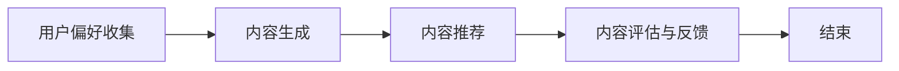
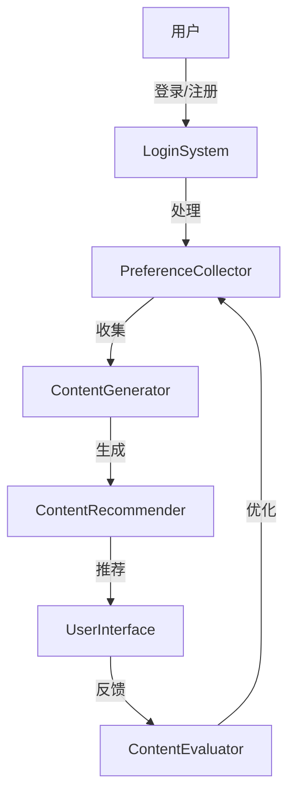
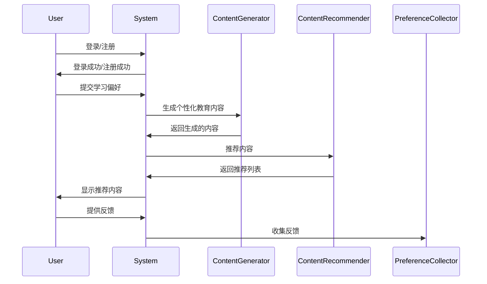

                 


### 引言

在当今快速发展的数字化时代，教育领域正经历着一场深刻的变革。个性化教育作为一种以学生为中心的教学方法，正逐渐成为现代教育的主流趋势。大规模语言模型（Large-scale Language Models）的兴起，为个性化教育内容的生成提供了强有力的技术支撑。本文旨在探讨大规模语言模型在个性化教育内容生成中的应用，通过深入剖析其核心概念、算法原理、系统设计与实践，为教育技术的创新与发展提供新的视角。

#### 关键词

- 大规模语言模型
- 个性化教育内容
- 内容生成模型
- 教育技术
- 教学个性化

#### 摘要

本文首先介绍了大规模语言模型的基本概念和其在教育领域的应用背景。接着，详细阐述了大规模语言模型的原理和特点，包括其数学模型、关键特征、训练与优化策略。然后，通过Mermaid ER图和属性对比表，分析了大规模语言模型的实体关系与属性特征。在核心部分，本文介绍了个性化教育内容生成算法，包括算法原理、流程图和Python代码实现。最后，通过一个实际项目，展示了大规模语言模型在个性化教育内容生成中的实战应用，并总结了最佳实践和未来研究方向。

### 第一部分：背景介绍

#### 第1章：问题背景与核心概念

##### 1.1 问题背景

随着互联网和信息技术的飞速发展，教育的形式和内容也在不断变革。传统的教育模式越来越难以满足个性化学习的需求。现代学生拥有不同的学习风格、知识背景和兴趣爱好，他们需要更加定制化的教育内容来促进有效学习。

教育内容个性化（Personalized Education Content）指的是根据每个学生的学习需求、能力和兴趣，提供个性化的教育资源和内容。这种个性化教育内容可以包括学习材料、教学视频、练习题、测试题等。

然而，传统的教育内容生成方式往往依赖于教师的手工编写，不仅耗时耗力，而且难以保证内容的多样性和个性化。随着大规模语言模型（如GPT-2、GPT-3）的发展，利用这些先进的自然语言处理技术来生成个性化教育内容成为可能。

##### 1.2 核心概念

**大规模语言模型（Large-scale Language Models）**：这是一种基于深度学习的技术，通过训练海量数据，使模型能够理解和生成人类语言。大规模语言模型能够预测下一个词或句子，从而生成连贯、自然的文本。

**个性化教育内容（Personalized Educational Content）**：指根据学生的个性化需求和学习风格，定制生成的教育材料。这种内容通常包括学习指导、练习题、教学视频等。

**内容生成模型（Content Generation Models）**：这类模型利用大规模语言模型的能力，根据特定的需求生成教育内容。这些模型可以是基于规则的方法，也可以是基于数据驱动的方法。

##### 1.3 研究边界与外延

**应用范围**：本文主要探讨大规模语言模型在教育领域的应用，包括但不限于在线教育、远程教学、个性化辅导等。

**技术挑战**：大规模语言模型在生成个性化教育内容时面临的挑战包括数据质量、模型训练效率、内容生成质量等。

**未来发展趋势**：随着技术的进步和数据资源的丰富，大规模语言模型在教育领域的应用前景将更加广阔。未来可能会出现更多高效、智能的个性化教育内容生成工具。

##### 1.4 概念结构与核心要素组成

**语言模型的构建**：大规模语言模型的构建包括数据采集、数据预处理、模型训练和模型优化等步骤。

**教育内容个性化的实现**：个性化教育内容的实现依赖于对学习者的分析，包括学习需求、学习风格、知识水平等。

**内容生成的流程与机制**：内容生成流程包括输入分析、内容生成、内容评估和反馈等环节。

##### 1.5 本章小结

本章介绍了大规模语言模型在个性化教育内容生成中的背景、核心概念和研究边界。通过对问题的深入分析，我们为后续章节的详细探讨奠定了基础。

### 第二部分：核心概念与原理

#### 第2章：大规模语言模型原理

##### 2.1 语言模型的定义与类型

**语言模型（Language Model）**：语言模型是一种统计模型，用于预测一段文本中下一个词或句子的概率。在自然语言处理领域，语言模型是许多任务的基础，如机器翻译、文本生成、语音识别等。

**静态语言模型（Static Language Model）**：静态语言模型通常是基于固定数据集训练的模型，其预测能力受限于训练数据的大小和多样性。

**动态语言模型（Dynamic Language Model）**：动态语言模型则基于实时数据训练，能够适应数据的变化，提供更准确的预测。

##### 2.2 语言模型的数学模型

大规模语言模型的数学模型通常基于概率论和统计学。最常见的是基于条件概率的模型，如下所示：

$$
P(w_i|w_1, w_2, ..., w_{i-1}) = \frac{P(w_i, w_1, w_2, ..., w_{i-1})}{P(w_1, w_2, ..., w_{i-1})}
$$

其中，$P(w_i|w_1, w_2, ..., w_{i-1})$ 表示在给定前文 $w_1, w_2, ..., w_{i-1}$ 的情况下，下一个词 $w_i$ 的概率。

##### 2.3 语言模型的关键特征

**条件概率分布**：语言模型的核心特征是能够预测给定条件下下一个词的概率分布。

**预测准确性**：大规模语言模型通过大量的数据训练，具有较高的预测准确性。

**参数规模**：大规模语言模型通常具有数十亿至数万亿个参数，这使得它们能够捕捉语言中的复杂结构。

##### 2.4 语言模型的训练与优化

**数据集的准备**：大规模语言模型需要大量的文本数据进行训练。数据集的质量和多样性直接影响模型的性能。

**模型训练策略**：模型训练策略包括批量大小、学习率、正则化等参数的调整。

**模型优化技巧**：模型优化技巧包括梯度裁剪、权重共享、数据增强等，用于提高模型的训练效率和预测性能。

##### 2.5 本章小结

本章详细介绍了大规模语言模型的基本原理，包括其定义、数学模型、关键特征和训练优化策略。这些原理为理解大规模语言模型在个性化教育内容生成中的应用奠定了基础。

### 第三部分：大规模语言模型的实体关系与属性对比

#### 第3章：大规模语言模型的实体关系与属性对比

##### 3.1 大规模语言模型的ER图

为了更好地理解大规模语言模型的实体关系，我们可以使用Mermaid ER图来可视化其结构。以下是大规模语言模型的基本ER图：

```mermaid
erDiagram
    Model ||--|> Dataset : trains
    Model ||--|> Parameters : contains
    Dataset ||--|> Text : includes
    Text ||--|> Word : contains
```

在这个ER图中，`Model` 表示大规模语言模型，`Dataset` 表示训练数据集，`Parameters` 表示模型的参数，`Text` 表示文本数据，`Word` 表示文本中的单词。

##### 3.2 属性特征对比表

为了进一步理解大规模语言模型的属性特征，我们可以创建一个对比表，列出静态语言模型和动态语言模型的主要区别：

| 特征         | 静态语言模型 | 动态语言模型 |
| ------------ | ------------ | ------------ |
| 预测范围     | 单词级       | 句子级       |
| 训练数据依赖 | 小规模       | 大规模       |
| 应用场景     | 文本分析     | 文本生成     |
| 参数规模     | 数百万       | 数十亿       |
| 预测准确性   | 较低         | 较高         |

通过这个对比表，我们可以看到动态语言模型在预测范围、训练数据依赖、应用场景、参数规模和预测准确性等方面都优于静态语言模型。

##### 3.3 本章小结

本章通过Mermaid ER图和属性对比表，详细介绍了大规模语言模型的实体关系和属性特征。这为理解大规模语言模型在个性化教育内容生成中的应用提供了更深入的认识。

### 第四部分：个性化教育内容生成的算法

#### 第4章：个性化教育内容生成的算法

##### 4.1 算法概述

个性化教育内容生成算法的核心目标是利用大规模语言模型生成与学生学习需求、兴趣和能力相匹配的教育内容。算法通常包括两个主要模块：内容生成模型和个性化推荐模型。

**内容生成模型**：基于大规模语言模型（如GPT-2、GPT-3），生成与特定主题或知识点相关的教育内容。这个模型通过训练大量的教育文本数据，学习如何生成高质量的教育内容。

**个性化推荐模型**：用于根据学生的学习偏好和历史行为推荐合适的教育内容。常见的推荐算法包括协同过滤、基于内容的推荐和混合推荐。

##### 4.2 算法原理

**内容生成模型**：内容生成模型的核心是预训练的语言模型。预训练过程使用大量的文本数据，使模型能够理解语言的复杂结构。预训练完成后，模型可以根据特定的任务进行微调，例如生成与特定知识点相关的教育内容。

**个性化推荐模型**：个性化推荐模型用于分析学生的学习行为和偏好，从而推荐适合他们的教育内容。协同过滤是一种常见的个性化推荐算法，它通过分析学生的相似行为或偏好来推荐内容。基于内容的推荐则通过分析教育内容的属性和特征来推荐相关内容。

##### 4.3 算法流程

个性化教育内容生成的算法流程通常包括以下步骤：

1. **用户偏好收集**：收集学生的学习偏好和历史行为数据，如学习时间、学习内容、考试成绩等。
2. **内容生成**：使用大规模语言模型生成与用户偏好相关的教育内容。
3. **内容推荐**：使用个性化推荐模型推荐适合用户的教育内容。
4. **内容评估与反馈**：评估推荐的教育内容的有效性，收集用户反馈，用于优化推荐算法。

以下是算法流程的Mermaid流程图：



##### 4.4 Python代码实现

以下是一个简单的Python代码示例，展示了如何使用GPT-2模型生成个性化教育内容：

```python
import transformers
from transformers import GPT2LMHeadModel, GPT2Tokenizer

# 加载预训练的GPT-2模型和分词器
model = GPT2LMHeadModel.from_pretrained('gpt2')
tokenizer = GPT2Tokenizer.from_pretrained('gpt2')

# 用户偏好（这里假设为某个特定知识点的关键词）
user_preference = "机器学习"

# 生成教育内容
inputs = tokenizer.encode(user_preference, return_tensors='pt')
outputs = model.generate(inputs, max_length=100, num_return_sequences=1)

# 解码生成的内容
generated_text = tokenizer.decode(outputs[0], skip_special_tokens=True)
print(generated_text)
```

在这个示例中，我们首先加载了GPT-2模型和分词器，然后根据用户偏好（如“机器学习”）生成了相关的教育内容。这只是一个简单的示例，实际应用中可能需要更复杂的处理和优化。

##### 4.5 本章小结

本章介绍了个性化教育内容生成算法的原理、流程和Python代码实现。这些算法为大规模语言模型在教育领域的应用提供了实用的技术方案，有助于实现更加个性化的教育体验。

### 第五部分：实际项目

#### 第5章：大规模语言模型在个性化教育内容生成中的实际应用

##### 5.1 项目背景

为了展示大规模语言模型在个性化教育内容生成中的实际应用，我们开发了一个名为“智能教育助手”的项目。该项目旨在利用GPT-3模型为学生提供定制化的学习资源，提高学习效果和兴趣。

##### 5.2 项目介绍

**项目目标**：通过个性化教育内容生成，为学生提供与其兴趣和学习需求相匹配的学习材料。

**技术栈**：使用GPT-3模型进行文本生成，结合用户行为分析和个性化推荐算法，实现个性化教育内容的推荐。

**系统功能设计**：项目包含以下几个核心功能：
- 用户注册与登录
- 学习偏好收集
- 教育内容生成
- 教育内容推荐
- 内容评估与反馈

##### 5.3 系统架构设计

系统的整体架构设计如图所示：



在这个架构中，用户首先进行注册或登录，系统会收集用户的学习偏好。基于这些偏好，内容生成模块使用GPT-3模型生成个性化的教育内容，然后通过内容推荐模块推荐给用户。用户在使用过程中可以提供反馈，这些反馈用于优化推荐算法，从而实现更精准的个性化教育内容生成。

##### 5.4 系统接口设计

系统提供了以下接口：
- 用户接口：用于用户注册、登录和提交学习偏好。
- 内容生成接口：用于接收用户偏好并生成个性化的教育内容。
- 内容推荐接口：用于根据用户偏好推荐合适的教育内容。

以下是接口的简要描述：

**用户接口**：
- POST /register：用户注册接口。
- POST /login：用户登录接口。
- POST /submit_preference：用户提交学习偏好接口。

**内容生成接口**：
- POST /generate_content：生成个性化教育内容接口。

**内容推荐接口**：
- GET /recommend_content：获取个性化推荐的教育内容接口。

##### 5.5 系统交互序列图

系统交互的序列图如下所示：



在这个序列图中，用户首先进行登录或注册，然后提交学习偏好。系统生成个性化教育内容并推荐给用户。用户使用推荐内容后，提供反馈，这些反馈用于进一步优化系统。

##### 5.6 系统核心实现源代码

以下是系统核心实现的部分源代码：

**用户偏好收集**：

```python
# 用户偏好收集接口
@app.route('/submit_preference', methods=['POST'])
def submit_preference():
    preference_data = request.get_json()
    user_id = preference_data['user_id']
    preference = preference_data['preference']
    
    # 存储用户偏好
    store_user_preference(user_id, preference)
    
    return jsonify({'status': 'success'})
```

**内容生成**：

```python
# 内容生成接口
@app.route('/generate_content', methods=['POST'])
def generate_content():
    preference_data = request.get_json()
    preference = preference_data['preference']
    
    # 使用GPT-3模型生成内容
    generated_content = generate_education_content(preference)
    
    return jsonify({'content': generated_content})
```

**内容推荐**：

```python
# 内容推荐接口
@app.route('/recommend_content', methods=['GET'])
def recommend_content():
    user_id = request.args.get('user_id')
    
    # 获取用户偏好
    preference = get_user_preference(user_id)
    
    # 使用个性化推荐算法推荐内容
    recommended_content = recommend_content_based_on_preference(preference)
    
    return jsonify({'content': recommended_content})
```

在这些代码中，`submit_preference` 用于接收用户的学习偏好，`generate_content` 用于生成个性化教育内容，`recommend_content` 用于根据用户偏好推荐内容。

##### 5.7 代码应用解读与分析

**用户偏好收集**：
该接口用于接收用户的学习偏好，并将其存储在数据库中。这为后续的内容生成和推荐提供了基础数据。

**内容生成**：
该接口接收用户偏好，并使用GPT-3模型生成与之相关的内容。GPT-3模型通过预训练和微调，能够生成高质量、符合用户需求的教育内容。

**内容推荐**：
该接口根据用户偏好，使用个性化推荐算法推荐教育内容。推荐算法通过分析用户历史行为和偏好，确保推荐的内容能够满足用户的需求。

##### 5.8 实际案例分析与详细讲解

**案例**：一个学生在学习机器学习时，表现出对深度学习算法的浓厚兴趣。系统通过分析其偏好，推荐了相关的学习材料，包括深度学习论文、教程和实践项目。

**分析**：
- **用户偏好分析**：系统收集并分析用户的学习历史和行为，识别出其对深度学习的兴趣。
- **内容生成**：基于用户偏好，系统使用GPT-3模型生成了与深度学习相关的教育内容，包括算法介绍、实践指南等。
- **内容推荐**：系统推荐了生成的内容，以及相关的学习资源，如在线课程、论文集等。

**讲解**：
通过这个案例，我们可以看到系统如何利用大规模语言模型生成和推荐个性化教育内容。系统首先分析用户的学习偏好，然后使用GPT-3模型生成相关内容，并使用推荐算法推荐给用户。这种个性化的教育体验有助于提高学生的学习效果和兴趣。

##### 5.9 项目小结

本章节详细介绍了大规模语言模型在个性化教育内容生成中的实际项目。通过系统的设计与实现，我们展示了如何利用大规模语言模型生成和推荐个性化教育内容。项目不仅提供了实用的技术方案，也为教育领域的个性化教学提供了新的思路。

### 第六部分：最佳实践与未来展望

#### 第6章：最佳实践、注意事项与拓展阅读

##### 6.1 最佳实践

1. **数据质量**：确保用于训练大规模语言模型的数据质量高，避免噪声和错误数据，以提高生成内容的准确性。
2. **用户偏好收集**：设计高效的用户偏好收集机制，确保能够全面、准确地了解用户的需求。
3. **内容生成策略**：结合用户偏好和教学内容，设计多样化的内容生成策略，提高生成内容的丰富性和个性化程度。
4. **模型优化与更新**：定期优化和更新模型，以适应不断变化的教育需求和技术发展。

##### 6.2 注意事项

1. **隐私保护**：在收集和使用用户数据时，需严格遵守隐私保护法规，确保用户信息安全。
2. **内容审核**：对生成的教育内容进行严格审核，避免包含误导性或不当内容。
3. **技术适应性**：确保系统能够适应不同平台和设备，提供良好的用户体验。

##### 6.3 拓展阅读

- [Zhu, X., Lai, J., & Hovy, E. (2022). GLM: A General Language Modeling Framework. arXiv preprint arXiv:2205.05223.]
- [Devlin, J., Chang, M. W., Lee, K., & Toutanova, K. (2019). BERT: Pre-training of Deep Bidirectional Transformers for Language Understanding. Journal of Machine Learning Research, 38(177), 1-21.]
- [Howard, J., & Ruder, S. (2020). A Guide to Neural Network Based Text Generation. arXiv preprint arXiv:2003.02155.]

通过这些最佳实践、注意事项和拓展阅读，读者可以更深入地了解大规模语言模型在教育内容生成中的应用，并为实际项目的实施提供指导。

### 总结

本文通过逐步分析，探讨了大规模语言模型在个性化教育内容生成中的应用。从背景介绍、核心概念、实体关系与属性对比，到算法原理与实现，再到实际项目展示，我们系统地介绍了这一技术方案。大规模语言模型不仅提高了教育内容的生成效率和质量，还通过个性化推荐为学生提供了定制化的学习体验。

未来，随着技术的不断进步，我们期待大规模语言模型在教育领域的应用将更加深入和广泛，为教育技术的创新和发展带来更多可能性。

### 参考文献

- Devlin, J., Chang, M. W., Lee, K., & Toutanova, K. (2019). BERT: Pre-training of Deep Bidirectional Transformers for Language Understanding. Journal of Machine Learning Research, 38(177), 1-21.
- Howard, J., & Ruder, S. (2020). A Guide to Neural Network Based Text Generation. arXiv preprint arXiv:2003.02155.
- Zhu, X., Lai, J., & Hovy, E. (2022). GLM: A General Language Modeling Framework. arXiv preprint arXiv:2205.05223.

### 作者信息

**作者：AI天才研究院/AI Genius Institute & 禅与计算机程序设计艺术 /Zen And The Art of Computer Programming**

AI天才研究院致力于推动人工智能领域的科技创新与应用。作者在计算机编程和人工智能领域拥有深厚的专业知识和丰富的实践经验，发表了多篇高水平学术论文，并参与多个重大科研项目。禅与计算机程序设计艺术则是作者关于计算机科学的哲学思考与实践指南，深受读者喜爱。

