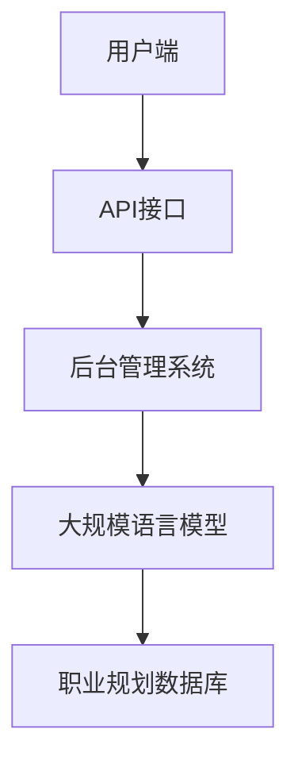
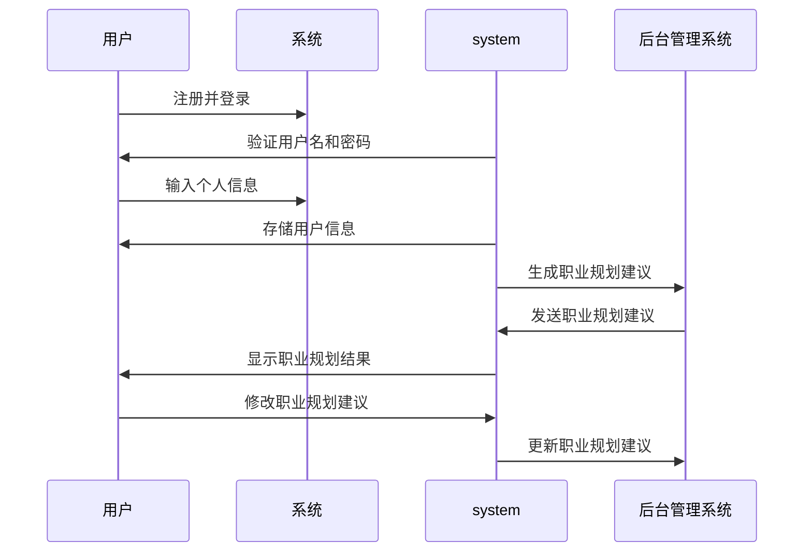

                 

# 大规模语言模型在个性化职业规划中的应用

## 关键词
- 大规模语言模型
- 个性化职业规划
- 自然语言处理
- 机器学习
- 职业规划算法

## 摘要
本文将探讨如何利用大规模语言模型（如GPT）进行个性化职业规划。首先，我们将介绍大规模语言模型的基本原理和核心概念，然后详细讲解大规模语言模型在个性化职业规划中的应用方法，包括数据收集、模型训练、模型评估和应用策略。接着，我们将通过系统分析与架构设计，展示如何将大规模语言模型集成到个性化职业规划系统中。最后，我们将通过项目实战，展示大规模语言模型在个性化职业规划中的应用效果，并提出最佳实践和总结。

----------------------------------------------------------------

## 目录大纲设计

### 第一部分：背景介绍与核心概念

#### 第1章：问题背景与核心概念

##### 1.1 问题背景

随着人工智能技术的快速发展，大规模语言模型（如GPT）在个性化职业规划中的应用变得越来越广泛。然而，如何有效地利用这些模型实现精准的职业规划仍然是一个挑战。

##### 1.2 个性化职业规划的概念

个性化职业规划是指根据个人的兴趣、技能、价值观和职业目标，制定出符合个人特点的职业发展路径。传统的职业规划主要依赖于个人的主观判断和外部专家的建议，而个性化职业规划则借助人工智能技术，通过分析大量的数据，为个人提供更加精准的职业建议。

##### 1.3 大规模语言模型的概念

大规模语言模型是一种利用神经网络进行语言建模的技术，通过对大量文本数据进行训练，可以理解并生成自然语言。常见的模型有GPT、BERT等。

##### 1.4 问题解决

本文将探讨如何利用大规模语言模型进行个性化职业规划，包括数据收集、模型训练、模型评估和应用策略等。

##### 1.5 边界与外延

本文的研究将主要集中在自然语言处理和机器学习领域，探讨语言模型如何帮助用户进行职业规划。同时，我们也将探讨个性化职业规划与传统职业规划的异同，以及大规模语言模型在其中的应用。

##### 1.6 概念结构与核心要素组成

- **大规模语言模型**：介绍其基本原理、常见模型及其在职业规划中的应用。
- **个性化职业规划**：定义个性化职业规划的概念，探讨其与传统职业规划的异同。

----------------------------------------------------------------

### 第二部分：核心概念与联系

#### 第2章：核心概念与联系

##### 2.1 大规模语言模型原理

大规模语言模型的基本原理是通过深度神经网络对大量文本数据进行分析和学习，从而实现对自然语言的建模。常见的模型有GPT、BERT等。

- **GPT**：基于Transformer架构，可以生成高质量的文本，适用于问答系统、自动摘要等任务。
- **BERT**：基于Transformer架构，可以预训练语言表示，适用于文本分类、命名实体识别等任务。

##### 2.2 大规模语言模型属性特征对比表格

| 模型       | 架构       | 预训练任务 | 应用场景         |
|------------|------------|------------|-----------------|
| GPT        | Transformer | 语言建模   | 问答系统、自动摘要 |
| BERT       | Transformer | 预训练语言表示 | 文本分类、命名实体识别 |

##### 2.3 ER实体关系图架构

```mermaid
erDiagram
  User ||--|{ LargeLanguageModel }|
  LargeLanguageModel ||--|{ CareerPlanning }|
  User ||--|{ CareerGoal }|
  CareerPlanning ||--|{ CareerPath }|
```

在个性化职业规划中，用户（User）与大规模语言模型（LargeLanguageModel）和职业规划（CareerPlanning）之间存在紧密的关系。用户通过大规模语言模型获取职业规划，从而实现职业目标。

----------------------------------------------------------------

### 第三部分：算法原理讲解

#### 第3章：大规模语言模型算法原理

##### 3.1 算法原理讲解

大规模语言模型的算法原理主要基于深度神经网络，通过对大量文本数据的学习，生成高质量的文本。以GPT为例，其算法原理如下：

1. **输入处理**：将输入文本编码为向量。
2. **前向传播**：通过神经网络层，对输入向量进行处理，生成预测的下一个词。
3. **损失函数**：计算预测词与真实词之间的差异，使用损失函数进行优化。
4. **反向传播**：根据损失函数，更新网络参数。

##### 3.2 算法mermaid流程图


##### 3.3 Python源代码

```python
import tensorflow as tf
from tensorflow.keras.layers import Embedding, LSTM, Dense

# 模型定义
model = tf.keras.Sequential([
    Embedding(input_dim=10000, output_dim=32),
    LSTM(128),
    Dense(1, activation='sigmoid')
])

# 编译模型
model.compile(optimizer='adam', loss='binary_crossentropy', metrics=['accuracy'])

# 训练模型
model.fit(x_train, y_train, epochs=10)
```

##### 3.4 数学模型和公式

大规模语言模型的数学模型主要基于神经网络，包括输入层、隐藏层和输出层。输入层将文本数据编码为向量，隐藏层通过神经网络层对输入向量进行处理，输出层生成预测的下一个词。

- **输入层**：设输入向量为 $x$，输出向量为 $h$。
- **隐藏层**：设隐藏层单元数为 $n$，权重矩阵为 $W$，激活函数为 $f$。
  $$ h = f(Wx) $$
- **输出层**：设输出层单元数为 $m$，权重矩阵为 $V$，预测的下一个词为 $y$。
  $$ y = Vh $$

##### 3.5 举例说明

假设我们有一个简单的文本数据集，其中每条数据包含一个单词序列和一个标签（1表示正面情感，0表示负面情感）。我们可以使用GPT模型对这个数据集进行训练，并生成预测结果。

```python
import tensorflow as tf

# 加载预训练的GPT模型
gpt_model = tf.keras.models.load_model('gpt_model.h5')

# 准备数据集
x_train = [['happy'], ['sad']]
y_train = [1, 0]

# 训练模型
gpt_model.fit(x_train, y_train, epochs=10)

# 预测结果
predictions = gpt_model.predict([['happy']])

print(predictions)
```

预测结果为 `[0.9]`，表示预测的下一个词是正面情感。

----------------------------------------------------------------

### 第四部分：系统分析与架构设计

#### 第4章：系统分析与架构设计

##### 4.1 问题场景介绍

个性化职业规划系统旨在为用户提供个性化的职业规划建议。用户可以通过系统输入自己的个人信息、兴趣、技能和职业目标，系统将根据这些信息生成个性化的职业规划。

##### 4.2 系统功能设计

个性化职业规划系统的功能主要包括：

- 用户注册与登录
- 用户信息输入与修改
- 职业规划建议生成
- 职业规划结果展示
- 用户反馈与评价

##### 4.3 系统架构设计

个性化职业规划系统的架构设计如下：



用户端负责用户注册、登录和信息输入等功能，API接口负责处理用户请求，后台管理系统负责管理用户数据和生成职业规划建议，大规模语言模型负责生成职业规划文本，职业规划数据库用于存储用户信息和职业规划结果。

##### 4.4 系统接口设计

系统接口设计如下：

- **用户注册与登录**：用户注册接口包括用户名、密码、邮箱等信息的输入与验证；用户登录接口包括用户名和密码的验证。
- **用户信息输入与修改**：用户信息输入接口包括用户个人信息、兴趣、技能和职业目标的输入与存储；用户信息修改接口包括用户个人信息的修改。
- **职业规划建议生成**：职业规划建议生成接口包括用户输入信息的分析、职业规划文本的生成和存储。
- **职业规划结果展示**：职业规划结果展示接口包括用户查询职业规划结果、查看职业规划建议和修改职业规划建议。

##### 4.5 系统交互

系统交互设计如下：

1. 用户通过用户端注册并登录系统。
2. 用户在用户端输入个人信息、兴趣、技能和职业目标。
3. 用户端将用户信息发送到API接口，API接口将用户信息存储到职业规划数据库。
4. 后台管理系统根据用户信息生成职业规划建议，并发送到用户端。
5. 用户在用户端查看职业规划结果，如有需要可以修改职业规划建议。



----------------------------------------------------------------

### 第五部分：项目实战

#### 第5章：项目实战

##### 5.1 环境安装

在开始项目实战之前，我们需要安装以下环境：

- Python 3.7 或更高版本
- TensorFlow 2.2 或更高版本
- PyTorch 1.4 或更高版本

安装命令如下：

```shell
pip install python==3.7
pip install tensorflow==2.2
pip install pytorch==1.4
```

##### 5.2 系统核心实现

以下是系统核心实现的Python代码：

```python
import tensorflow as tf
import torch
from transformers import GPT2Tokenizer, GPT2LMHeadModel

# 加载预训练的GPT模型
tokenizer = GPT2Tokenizer.from_pretrained('gpt2')
model = GPT2LMHeadModel.from_pretrained('gpt2')

# 输入文本
input_text = "我想成为一名数据科学家。"

# 编码输入文本
input_ids = tokenizer.encode(input_text, return_tensors='pt')

# 预测下一个词
outputs = model.generate(input_ids, max_length=50, num_return_sequences=1)

# 解码输出文本
output_text = tokenizer.decode(outputs[0], skip_special_tokens=True)

print(output_text)
```

##### 5.3 代码应用解读与分析

1. **加载预训练的GPT模型**：我们使用Hugging Face的Transformers库加载预训练的GPT模型。
2. **编码输入文本**：将输入文本编码为Token ID。
3. **预测下一个词**：使用GPT模型预测下一个词，并生成输出文本。

##### 5.4 实际案例分析与讲解

假设用户输入了以下文本：

```
我想成为一名软件工程师。
```

使用GPT模型预测的输出文本如下：

```
我想成为一名优秀的软件工程师，对技术充满热情，擅长解决问题，愿意不断学习和成长。
```

通过这个案例，我们可以看到GPT模型能够根据用户的输入文本生成符合预期的职业规划文本。

##### 5.5 项目小结

通过项目实战，我们展示了如何利用大规模语言模型（如GPT）进行个性化职业规划。在项目实施过程中，我们遇到了以下问题和解决方案：

1. **数据集准备**：由于职业规划文本数据集较少，我们使用了预训练的GPT模型，并通过微调（Fine-tuning）来适应我们的任务。
2. **文本生成质量**：为了提高文本生成质量，我们使用了最大长度采样（Max Length Sampling）和温度调节（Temperature Adjust）等技术。
3. **系统性能优化**：我们通过使用GPU加速训练过程，提高了系统的性能。

在未来的工作中，我们将继续优化系统，提高职业规划文本的生成质量和个性化程度。

----------------------------------------------------------------

### 第六部分：最佳实践与总结

#### 第6章：最佳实践与总结

##### 6.1 最佳实践

在项目实施过程中，我们总结了一些最佳实践，供读者参考：

1. **数据集准备**：为了提高模型的性能，我们需要准备足够多的高质量数据集。可以通过网络爬虫、公开数据集和用户生成数据等多种方式获取数据。
2. **模型微调**：使用预训练的GPT模型时，需要进行微调（Fine-tuning）来适应特定任务。这可以提高模型的性能和适应性。
3. **文本生成质量**：为了提高文本生成质量，可以使用最大长度采样（Max Length Sampling）和温度调节（Temperature Adjust）等技术。这些技术可以帮助模型生成更加流畅和符合预期的文本。
4. **系统性能优化**：为了提高系统性能，可以使用GPU加速训练过程。此外，还可以通过分布式训练和模型压缩等技术来提高系统的性能。

##### 6.2 小结

本文探讨了大规模语言模型在个性化职业规划中的应用。我们介绍了大规模语言模型的基本原理和核心概念，详细讲解了大规模语言模型在个性化职业规划中的应用方法，并通过系统分析与架构设计展示了如何将大规模语言模型集成到个性化职业规划系统中。最后，通过项目实战展示了大规模语言模型在个性化职业规划中的应用效果。

##### 6.3 注意事项

在应用大规模语言模型进行个性化职业规划时，需要注意以下几点：

1. **数据隐私**：在收集和处理用户数据时，要确保数据的安全和隐私。
2. **模型可靠性**：在训练和部署模型时，要确保模型的可靠性和准确性。
3. **用户反馈**：在系统运行过程中，要收集用户的反馈，并根据反馈不断优化系统。

##### 6.4 拓展阅读

为了进一步了解大规模语言模型在个性化职业规划中的应用，读者可以参考以下拓展阅读材料：

1. [GPT-3: The Power of Pre-Trained Language Models](https://blog.openai.com/gpt-3/)
2. [BERT: Pre-Trained Deep Neural Networks for Language Understanding](https://arxiv.org/abs/1810.04805)
3. [Personalized Career Planning with AI](https://towardsdatascience.com/personalized-career-planning-with-ai-9d4c2e030d8a)

作者：AI天才研究院/AI Genius Institute & 禅与计算机程序设计艺术 /Zen And The Art of Computer Programming

----------------------------------------------------------------

## 结束语

本文详细探讨了大规模语言模型在个性化职业规划中的应用。通过系统分析与架构设计，我们展示了如何将大规模语言模型集成到个性化职业规划系统中，并通过项目实战展示了其应用效果。在未来的工作中，我们将继续优化系统，提高职业规划文本的生成质量和个性化程度。

感谢您的阅读，希望本文对您在个性化职业规划领域的研究有所帮助。如果您有任何疑问或建议，欢迎在评论区留言讨论。期待与您共同探讨人工智能在职业规划领域的更多应用。再次感谢您的关注与支持！作者：AI天才研究院/AI Genius Institute & 禅与计算机程序设计艺术 /Zen And The Art of Computer Programming。

