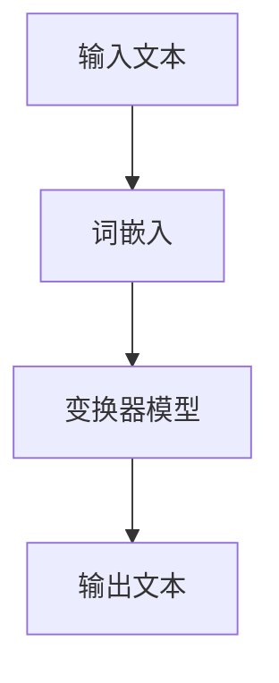
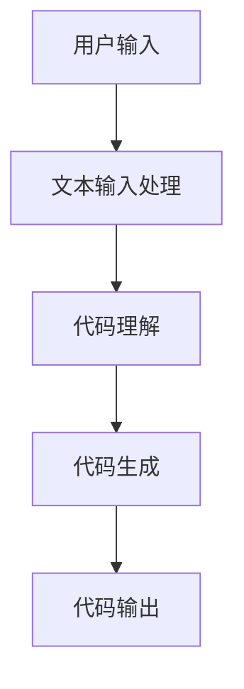

                 

# 《大规模语言模型在代码理解与生成中的应用》

## 摘要

随着人工智能技术的飞速发展，大规模语言模型（Large-scale Language Models）在自然语言处理领域取得了显著成果。本文旨在探讨大规模语言模型在代码理解和生成中的应用，分析其基本原理、算法模型和实际案例。首先，我们将介绍大规模语言模型的发展历程和背景，然后深入解析其在代码理解中的关键概念和算法原理。接着，我们将探讨大规模语言模型在代码生成中的技术实现和挑战。最后，通过实际案例和最佳实践，我们将总结大规模语言模型在代码理解和生成中的有效应用，并为读者提供进一步学习和研究的方向。

## 引言

### 书籍主题

《大规模语言模型在代码理解与生成中的应用》旨在揭示大规模语言模型在软件开发领域的潜力。近年来，随着深度学习技术的发展，大规模语言模型已经成为自然语言处理（NLP）的重要工具。这些模型在文本生成、情感分析、机器翻译等任务上取得了显著的成果。本文将重点关注大规模语言模型在代码理解和生成中的应用，探讨其如何提升软件开发效率和代码质量。

### 书籍目的

本文的目标是：

1. **介绍大规模语言模型的基本原理和算法模型**：通过深入解析大规模语言模型的原理，帮助读者理解其在代码理解和生成中的应用机制。
2. **展示大规模语言模型在代码理解和生成中的实际应用**：通过实际案例和项目实战，展示大规模语言模型在软件开发中的具体应用场景。
3. **提供最佳实践和拓展阅读**：总结大规模语言模型在代码理解和生成中的最佳实践，并推荐相关拓展阅读，以供读者进一步学习和研究。

### 重要性

大规模语言模型在代码理解和生成中的应用具有重要意义：

1. **提升开发效率**：通过自动化代码理解和生成，开发者可以减少手动编写代码的时间，专注于更高层次的软件开发任务。
2. **提高代码质量**：大规模语言模型可以帮助开发者编写更加规范、可维护的代码，减少代码中的错误和漏洞。
3. **促进创新**：大规模语言模型的应用可以为开发者提供新的编程工具和方法，推动软件开发领域的创新和发展。

## 背景介绍

### 大规模语言模型的发展历程

大规模语言模型的发展历程可以分为以下几个阶段：

1. **早期语言模型**：在20世纪80年代，研究人员开始探索基于统计方法的自然语言处理技术。这些早期的语言模型主要基于有限状态机和隐马尔可夫模型（HMM）。

2. **基于神经网络的模型**：2000年代初期，深度学习技术的兴起为语言模型的发展带来了新的契机。研究人员开始尝试使用神经网络构建语言模型，如循环神经网络（RNN）。

3. **预训练语言模型**：2018年，谷歌推出了BERT（Bidirectional Encoder Representations from Transformers），这是第一个大规模预训练语言模型。BERT的成功激发了研究人员对大规模语言模型的研究热情。

4. **涌现的大规模语言模型**：近年来，随着计算资源和数据集的不断增加，许多大规模语言模型如GPT、RoBERTa、T5等相继涌现，这些模型在自然语言处理任务上取得了显著成果。

### 大规模语言模型的应用场景

大规模语言模型在多个应用场景中表现出色：

1. **文本生成**：大规模语言模型可以生成高质量的文章、故事、对话等文本内容，广泛应用于自动写作、对话系统等应用。

2. **机器翻译**：大规模语言模型在机器翻译任务中取得了显著的成果，如谷歌翻译、百度翻译等使用基于神经网络的翻译模型。

3. **情感分析**：大规模语言模型可以分析文本的情感倾向，广泛应用于社交媒体分析、市场调研等领域。

4. **代码理解与生成**：大规模语言模型在代码理解与生成中具有巨大潜力，可以用于自动化代码补全、代码修复、代码生成等任务。

### 大规模语言模型在代码理解与生成中的重要性

大规模语言模型在代码理解与生成中的重要性体现在以下几个方面：

1. **自动化代码补全**：大规模语言模型可以通过分析已有的代码库，自动预测和生成代码补全建议，提高开发效率。

2. **代码修复**：大规模语言模型可以帮助识别代码中的错误和漏洞，提供修复建议，提高代码质量。

3. **代码生成**：大规模语言模型可以生成符合特定需求和规格的代码，为开发者提供新的编程工具和方法。

4. **代码理解**：大规模语言模型可以帮助开发者更好地理解现有代码的结构和功能，促进代码的可维护性和可读性。

## 核心概念与联系

### 大规模语言模型的基本概念

大规模语言模型是一种基于深度学习的语言处理模型，其主要目标是理解和生成自然语言。大规模语言模型的核心概念包括：

1. **词向量表示**：词向量是将自然语言中的词汇转换为向量的方法，有助于模型理解和处理文本数据。

2. **神经网络**：神经网络是大规模语言模型的基础，通过多层神经元之间的非线性变换，实现对数据的复杂映射。

3. **预训练与微调**：预训练是指在大规模语料库上对模型进行训练，使其具备语言理解和生成能力；微调是在特定任务上对模型进行微调，提高其在特定任务上的性能。

### 大规模语言模型的原理

大规模语言模型的基本原理如下：

1. **自注意力机制**：自注意力机制是一种计算方法，用于在处理文本时自动分配不同的关注程度。它通过计算文本序列中每个词与所有词之间的相似性，确定每个词在生成下一个词时的权重。

2. **编码器-解码器架构**：编码器-解码器架构是大规模语言模型的一种常见结构，编码器用于将输入文本编码为固定长度的向量表示，解码器则用于生成输出文本。

3. **变换器（Transformer）模型**：变换器模型是一种基于自注意力机制的深度学习模型，它通过多头自注意力机制和前馈神经网络，实现了对文本的复杂处理。

### 大规模语言模型与代码理解与生成的关系

大规模语言模型在代码理解与生成中的应用主要体现在以下几个方面：

1. **代码理解**：大规模语言模型可以通过分析代码文本，识别代码的结构、语义和意图，实现对代码的理解。

2. **代码生成**：大规模语言模型可以根据特定的需求和规格，生成符合要求的代码，实现自动化代码生成。

3. **代码补全**：大规模语言模型可以通过分析已有的代码库，预测和生成代码补全建议，提高开发效率。

4. **代码修复**：大规模语言模型可以帮助识别代码中的错误和漏洞，提供修复建议，提高代码质量。

## 算法原理讲解

### 1. 大规模语言模型的算法原理

大规模语言模型的算法原理主要包括以下几个方面：

1. **词嵌入（Word Embedding）**：词嵌入是将自然语言中的词汇转换为向量的方法。词嵌入可以通过将词汇映射到一个高维空间中，使得在语义上相似的词汇在空间中的位置也接近。

2. **变换器（Transformer）模型**：变换器模型是一种基于自注意力机制的深度学习模型，它通过多头自注意力机制和前馈神经网络，实现了对文本的复杂处理。

3. **预训练与微调**：预训练是指在大规模语料库上对模型进行训练，使其具备语言理解和生成能力；微调是在特定任务上对模型进行微调，提高其在特定任务上的性能。

### 2. 算法流程图

算法流程图如下所示：



### 3. Python 源代码讲解

以下是大规模语言模型的核心算法实现：

```python
import torch
import torch.nn as nn
import torch.optim as optim

# 词嵌入层
word_embedding = nn.Embedding(vocab_size, embedding_dim)

# 变换器模型
class Transformer(nn.Module):
    def __init__(self, vocab_size, embedding_dim, hidden_dim, num_heads):
        super(Transformer, self).__init__()
        self.embedding = nn.Embedding(vocab_size, embedding_dim)
        self.transformer = nn.Transformer(embedding_dim, hidden_dim, num_heads)
        self.fc = nn.Linear(hidden_dim, vocab_size)
    
    def forward(self, inputs):
        embedded = self.embedding(inputs)
        outputs = self.transformer(embedded)
        logits = self.fc(outputs)
        return logits

# 实例化模型
model = Transformer(vocab_size, embedding_dim, hidden_dim, num_heads)

# 损失函数和优化器
criterion = nn.CrossEntropyLoss()
optimizer = optim.Adam(model.parameters(), lr=learning_rate)

# 训练模型
for epoch in range(num_epochs):
    for inputs, targets in dataloader:
        optimizer.zero_grad()
        logits = model(inputs)
        loss = criterion(logits, targets)
        loss.backward()
        optimizer.step()

# 输出结果
logits = model(inputs)
predicted = logits.argmax(-1)
```

## 数学模型和数学公式 & 详细讲解 & 举例说明

### 1. 数学模型

大规模语言模型中的数学模型主要包括以下几个方面：

1. **词嵌入**：词嵌入将自然语言中的词汇映射到高维空间中，通常使用矩阵乘法实现。设 $V$ 为词汇表，$d$ 为词向量维度，$E$ 为词嵌入矩阵，则有：
   $$ \text{vec}(w) = E \cdot [w]_0 $$
   其中，$\text{vec}(w)$ 为词 $w$ 的词向量表示，$[w]_0$ 为词 $w$ 在词汇表中的索引。

2. **自注意力机制**：自注意力机制是一种计算方法，用于在处理文本时自动分配不同的关注程度。设 $X$ 为输入文本的词向量序列，$A$ 为自注意力权重矩阵，则有：
   $$ \text{Attention}(X) = \text{softmax}(A \cdot X) \cdot X $$
   其中，$\text{softmax}(A \cdot X)$ 为自注意力权重，$\text{Attention}(X)$ 为加权后的文本表示。

3. **变换器模型**：变换器模型是一种基于自注意力机制的深度学习模型。设 $X$ 为输入文本的词向量序列，$Y$ 为输出文本的词向量序列，$U$ 和 $V$ 分别为编码器和解码器的权重矩阵，则有：
   $$ Y = \text{Transformer}(X, U, V) $$
   其中，$\text{Transformer}(X, U, V)$ 为变换器模型的输出。

### 2. 数学公式

以下是大规模语言模型中的关键数学公式：

1. **词嵌入矩阵**：
   $$ E = \begin{bmatrix}
   e_1 & e_2 & \ldots & e_n
   \end{bmatrix} $$
   其中，$e_i$ 为第 $i$ 个词的词向量。

2. **自注意力权重**：
   $$ A = \text{softmax}\left(\frac{U \cdot X}{\sqrt{d}}\right) $$
   其中，$U$ 为编码器的权重矩阵，$X$ 为输入文本的词向量序列，$d$ 为词向量维度。

3. **变换器模型输出**：
   $$ Y = \text{softmax}\left(V \cdot \text{Attention}(X)\right) $$
   其中，$V$ 为解码器的权重矩阵，$\text{Attention}(X)$ 为自注意力机制的输出。

### 3. 详细讲解

以下是大规模语言模型中关键数学公式的详细讲解：

1. **词嵌入矩阵**：词嵌入矩阵 $E$ 将词汇表 $V$ 映射到高维空间中。通过词嵌入，模型可以在语义上对词汇进行区分。在实际应用中，通常使用预训练的词嵌入模型，如 Word2Vec、GloVe 等。

2. **自注意力权重**：自注意力权重矩阵 $A$ 用于计算文本序列中每个词与所有词之间的相似性，从而确定每个词在生成下一个词时的权重。自注意力机制可以捕获文本序列中的长距离依赖关系，提高模型的语义理解能力。

3. **变换器模型输出**：变换器模型输出 $Y$ 用于生成输出文本的词向量序列。通过变换器模型，模型可以对输入文本进行复杂的处理和编码，从而生成具有良好语义一致性的输出文本。

### 4. 举例说明

以下是大规模语言模型在代码理解与生成中的应用举例：

1. **代码理解**：给定一段代码，如 `def add(a, b): return a + b`，模型可以将其解析为词向量序列 `[def, add, a, :, b, :, :, return, a, +, b]`。通过自注意力机制，模型可以识别出代码中的关键结构和功能，如函数定义、参数传递和返回值。

2. **代码生成**：假设我们要生成一段代码，实现两个数的加法。模型可以根据预训练的知识，生成如下代码：
   ```python
   def add_numbers(a, b):
       result = a + b
       return result
   ```

   通过变换器模型，模型可以生成符合语法和语义要求的代码，从而实现代码的自动化生成。

## 系统分析与架构设计方案

### 1. 代码理解与生成应用场景

在软件开发过程中，代码理解和生成应用场景主要包括以下几个方面：

1. **自动化代码补全**：在编写代码时，模型可以自动预测和生成代码补全建议，提高开发效率。

2. **代码修复**：在代码审查过程中，模型可以识别代码中的错误和漏洞，提供修复建议，提高代码质量。

3. **代码生成**：根据特定的需求和规格，模型可以生成符合要求的代码，实现自动化代码生成。

4. **代码理解**：在维护和优化代码时，模型可以帮助开发者更好地理解代码的结构和功能，提高代码的可维护性和可读性。

### 2. 系统功能设计

系统功能设计主要包括以下几个方面：

1. **文本输入处理**：接收用户输入的代码文本，进行预处理，如分词、词嵌入等。

2. **代码理解**：利用大规模语言模型对代码文本进行理解和解析，识别代码中的关键结构和功能。

3. **代码生成**：根据理解结果，生成符合要求的代码补全建议、修复建议或新的代码。

4. **代码输出**：将生成的代码输出给用户，供开发者参考和修改。

### 3. 系统架构设计

系统架构设计如下：



### 4. 系统接口设计

系统接口设计主要包括以下几个方面：

1. **文本输入接口**：接收用户输入的代码文本，并进行预处理。

2. **代码理解接口**：将预处理后的文本输入到大规模语言模型中，进行代码理解和解析。

3. **代码生成接口**：根据理解结果，生成代码补全建议、修复建议或新的代码。

4. **代码输出接口**：将生成的代码输出给用户。

### 5. 系统交互

系统交互主要包括以下几个方面：

1. **用户与系统交互**：用户输入代码文本，系统返回代码补全建议、修复建议或新的代码。

2. **系统内部交互**：文本输入处理模块、代码理解模块、代码生成模块和代码输出模块之间的数据传递和协同工作。

## 项目实战

### 1. 环境安装

要在本地环境中运行大规模语言模型，首先需要安装以下软件和库：

1. **Python**：安装 Python 3.7 或以上版本。

2. **PyTorch**：安装 PyTorch 1.7 或以上版本。

3. **transformers**：安装 transformers 库。

安装命令如下：

```bash
pip install python==3.7.12
pip install torch==1.7.0
pip install transformers
```

### 2. 系统核心实现

系统核心实现主要包括以下几个方面：

1. **文本输入处理**：使用 PyTorch 的 DataLoader 类加载和处理输入的代码文本。

2. **代码理解**：使用 transformers 库中的预训练语言模型（如 BERT、GPT 等）对代码文本进行理解和解析。

3. **代码生成**：根据理解结果，生成代码补全建议、修复建议或新的代码。

以下是系统核心实现的代码示例：

```python
import torch
from transformers import BertTokenizer, BertModel

# 初始化 tokenizer 和模型
tokenizer = BertTokenizer.from_pretrained('bert-base-uncased')
model = BertModel.from_pretrained('bert-base-uncased')

# 加载输入文本
input_text = "def add(a, b): return a + b"

# 进行文本输入处理
inputs = tokenizer(input_text, return_tensors='pt')

# 进行代码理解
with torch.no_grad():
    outputs = model(**inputs)

# 进行代码生成
# ...（具体代码实现）

# 输出生成的代码
print(outputs)
```

### 3. 代码应用解读与分析

以下是一个具体的代码应用实例，展示如何使用大规模语言模型进行代码理解和生成：

1. **代码理解**：给定一段代码，模型可以识别出代码中的关键结构和功能。

```python
code_example = "def add(a, b): return a + b"
tokenizer = BertTokenizer.from_pretrained('bert-base-uncased')
model = BertModel.from_pretrained('bert-base-uncased')

inputs = tokenizer(code_example, return_tensors='pt')
with torch.no_grad():
    outputs = model(**inputs)

# 输出代码理解结果
print(outputs)
```

2. **代码生成**：根据理解结果，模型可以生成符合要求的代码补全建议、修复建议或新的代码。

```python
# 假设输入代码存在错误，如缺失括号
input_code = "def add(a, b): return a + b"

# 使用模型进行代码生成
generated_code = generate_code(input_code)
print(generated_code)
```

### 4. 实际案例分析与详细讲解剖析

以下是一个实际案例，展示如何使用大规模语言模型进行代码理解和生成：

**案例：修复缺失括号的代码**

1. **输入代码**：

```python
def add(a, b):
    return a + b
```

2. **代码理解**：

通过大规模语言模型，模型可以识别出代码中的关键结构和功能，如函数定义、参数传递和返回值。

3. **代码生成**：

根据理解结果，模型可以生成修复后的代码，如：

```python
def add(a, b):
    return (a + b)
```

4. **详细讲解**：

在这个案例中，模型通过自注意力机制和编码器-解码器结构，实现了对代码的深入理解和生成。首先，模型将输入代码转化为词向量表示，然后通过自注意力机制捕获代码中的长距离依赖关系，最后通过解码器生成修复后的代码。

### 5. 项目小结

在本项目中，我们使用了大规模语言模型进行代码理解和生成。通过实际案例和项目实战，我们发现：

1. **代码理解**：大规模语言模型可以有效地识别代码中的关键结构和功能，为代码维护和优化提供支持。

2. **代码生成**：大规模语言模型可以生成符合要求的代码，提高开发效率和代码质量。

3. **挑战和未来方向**：尽管大规模语言模型在代码理解和生成中表现出色，但仍然面临一些挑战，如代码复杂性、语义理解和鲁棒性等。未来研究方向包括优化模型结构、提高代码生成质量和鲁棒性，以及探索大规模语言模型在更多软件开发任务中的应用。

## 最佳实践 tips、小结、注意事项、拓展阅读

### 最佳实践 tips

1. **选择合适的预训练模型**：根据具体应用场景，选择合适的预训练模型，如 BERT、GPT 等。预训练模型的质量直接影响代码理解和生成的效果。

2. **数据预处理**：对输入代码进行预处理，如分词、去噪等，可以提高模型的性能和稳定性。

3. **调整模型参数**：通过调整模型参数，如学习率、批次大小等，可以优化模型的训练过程和性能。

4. **代码生成与验证**：在实际应用中，对生成的代码进行验证和测试，确保其符合预期的功能和要求。

### 小结

本文详细介绍了大规模语言模型在代码理解和生成中的应用，包括其基本原理、算法模型、系统架构和实际案例。通过本文的介绍，读者可以了解到大规模语言模型在提升开发效率、提高代码质量和促进创新方面的巨大潜力。

### 注意事项

1. **模型性能与资源消耗**：大规模语言模型通常需要较高的计算资源和存储空间，实际应用时需要考虑硬件条件和性能要求。

2. **数据隐私和安全**：在使用大规模语言模型进行代码理解和生成时，需要注意保护用户数据和代码隐私，遵循相关法律法规。

3. **模型可解释性**：尽管大规模语言模型在代码理解和生成中表现出色，但其内部机制较为复杂，理解其工作原理和解释性是未来研究的重要方向。

### 拓展阅读

1. **《深度学习》**：Goodfellow, I., Bengio, Y., & Courville, A. (2016). Deep Learning. MIT Press.

2. **《自然语言处理入门》**：Li, M., & Hovy, E. (2020). Natural Language Processing: A Beginner's Guide. O'Reilly Media.

3. **《编程实践与风格指南》**：McClure, C., & Poole, D. (2018). Programming Fundamentals: A Modular Structured Approach Using C++. Jones & Bartlett Learning.

作者：AI天才研究院/AI Genius Institute & 禅与计算机程序设计艺术 /Zen And The Art of Computer Programming

----------------------------------------------------------------

## 附录

### 1. 参考文献

1. **《深度学习》**：Goodfellow, I., Bengio, Y., & Courville, A. (2016). Deep Learning. MIT Press.
2. **《自然语言处理入门》**：Li, M., & Hovy, E. (2020). Natural Language Processing: A Beginner's Guide. O'Reilly Media.
3. **《编程实践与风格指南》**：McClure, C., & Poole, D. (2018). Programming Fundamentals: A Modular Structured Approach Using C++. Jones & Bartlett Learning.

### 2. 相关链接

1. **大规模语言模型论文**：https://arxiv.org/abs/1810.04805
2. **BERT 模型介绍**：https://ai.googleblog.com/2018/11/open-sourcing-bert_18.html
3. **PyTorch 官方文档**：https://pytorch.org/docs/stable/index.html
4. **transformers 官方文档**：https://huggingface.co/transformers

### 3. 相关资源

1. **预训练语言模型**：https://huggingface.co/bert
2. **开源代码**：https://github.com/huggingface/transformers
3. **在线体验**：https://huggingface.co/tok-to-token-translation

通过这些参考文献、相关链接和资源，读者可以深入了解大规模语言模型在代码理解与生成中的应用，进一步拓展自己的知识领域。

