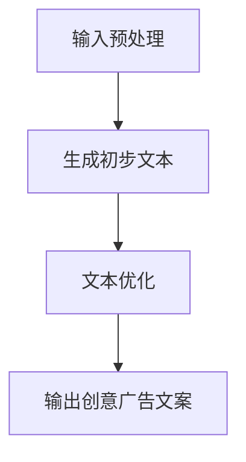
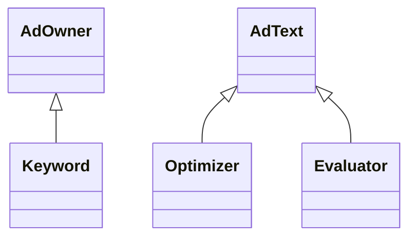
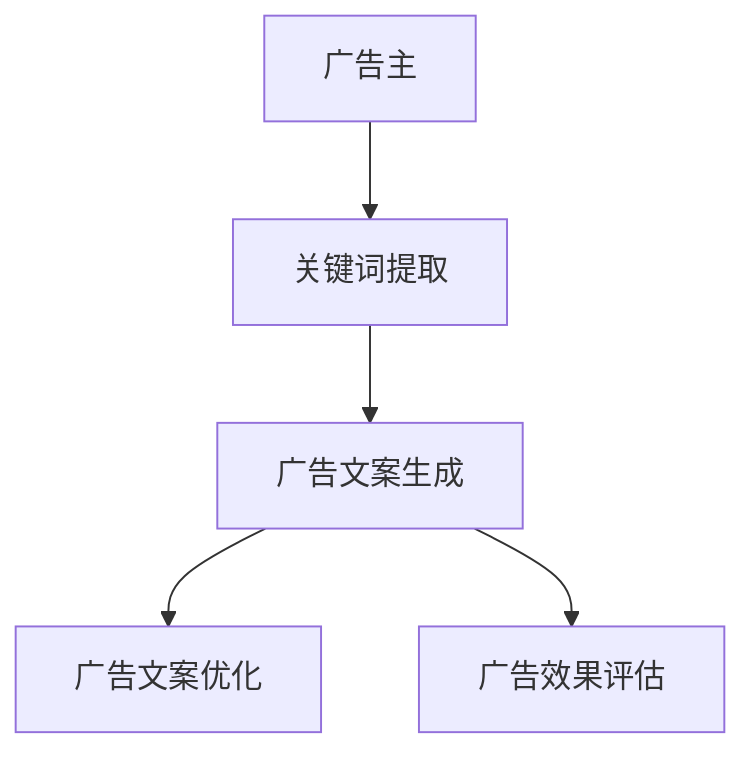
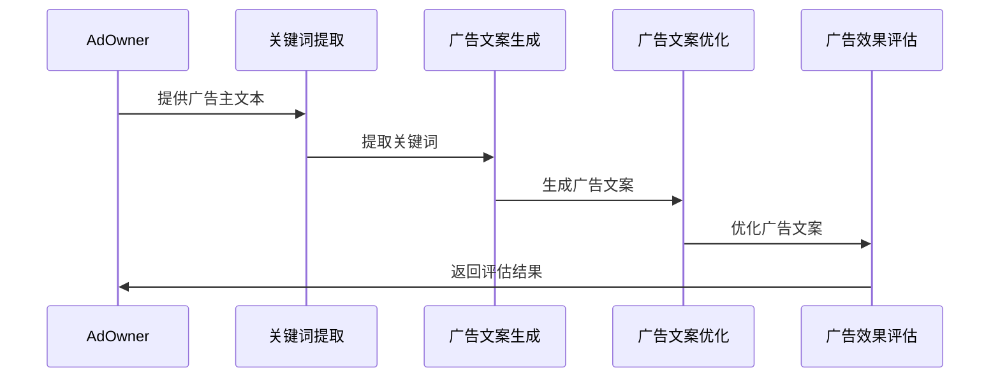
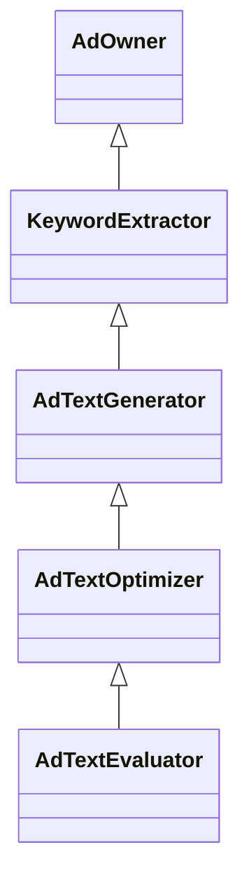
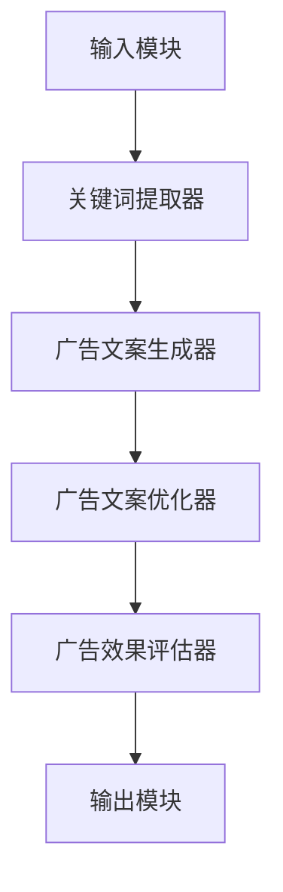
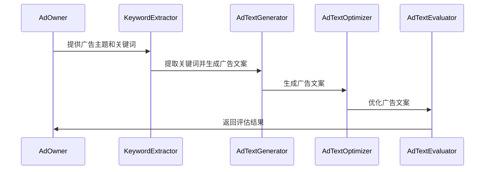

                 


## 引言：大规模语言模型与创意广告

### 关键词：大规模语言模型，创意广告，推理应用

随着人工智能技术的迅猛发展，大规模语言模型（如GPT、BERT等）逐渐成为自然语言处理领域的核心工具。这些模型通过学习海量文本数据，能够生成连贯、有深度的文本，从而在许多应用场景中发挥了重要作用。本文将探讨大规模语言模型在创意广告生成中的推理应用，为广告行业带来新的可能性。

### 摘要

本文首先介绍大规模语言模型的基本概念和原理，随后分析创意广告生成的需求与挑战。接着，我们将探讨大规模语言模型在创意广告生成中的应用场景，详细讲解其推理过程。最后，本文将通过实际项目案例，展示大规模语言模型在创意广告生成中的具体应用，并提供相关最佳实践和建议。

## 背景介绍

### 大规模语言模型的核心概念与联系

#### 1.1 什么是大规模语言模型？

大规模语言模型（Large-scale Language Model，简称LLM）是一种基于深度学习的自然语言处理技术。通过学习海量文本数据，这些模型能够理解语言的结构和语义，生成高质量、连贯的文本。LLM的核心优势在于其强大的表示能力和上下文理解能力，这使得它们在许多自然语言处理任务中表现出色。

#### 1.2 大规模语言模型的概念属性特征对比表格

| 特征 | GPT | BERT | T5 |
| --- | --- | --- | --- |
| 模型架构 | Transformer | Transformer | Transformer |
| 参数规模 | 上百亿 | 上百亿 | 上百亿 |
| 上下文窗口 | 长序列 | 长序列 | 长序列 |
| 微调能力 | 强 | 强 | 强 |

#### 1.3 大规模语言模型与创意广告的联系

创意广告是广告行业中至关重要的环节。它不仅需要吸引消费者的注意力，还要传达产品的核心价值，从而促使消费者采取行动。大规模语言模型在创意广告生成中具有巨大潜力，主要体现在以下几个方面：

1. **生成创意文本**：大规模语言模型能够根据给定的关键词或主题，生成具有创意性和吸引力的广告文案。
2. **提高广告投放效果**：通过分析用户行为数据，大规模语言模型可以为广告主提供个性化的广告内容，提高广告点击率和转化率。
3. **优化广告创意策略**：大规模语言模型可以帮助广告主分析不同广告创意的效果，从而制定更有效的广告策略。

### 大规模语言模型在创意广告生成中的需求与挑战

#### 2.1 需求

1. **创意性**：广告文案需要具备独特的创意，能够吸引消费者的注意力。
2. **个性化**：广告内容需要根据用户特征和偏好进行个性化定制，提高用户体验。
3. **效率**：广告生成过程需要高效，以便广告主能够在短时间内生成大量广告文案。

#### 2.2 挑战

1. **数据质量**：大规模语言模型需要高质量、丰富的文本数据进行训练，以确保生成的广告文案具备创意性和准确性。
2. **算法优化**：为了提高广告投放效果，需要不断优化大规模语言模型的算法，使其更适应广告场景。
3. **隐私保护**：在广告生成过程中，需要保护用户的隐私数据，防止数据泄露。

## 算法原理讲解

### 3.1 大规模语言模型在创意广告生成中的推理过程

#### 3.1.1 语言模型的基本原理

大规模语言模型基于深度学习技术，主要采用Transformer架构。Transformer架构的核心是自注意力机制（Self-Attention），它能够自动学习输入文本序列中的长距离依赖关系。自注意力机制通过计算输入文本序列中每个单词与其他单词之间的相似度，为每个单词生成权重，从而生成更高质量的文本。

#### 3.1.2 广告创意生成的推理过程

在创意广告生成过程中，大规模语言模型的主要任务是根据给定的关键词或主题生成具有创意性的广告文案。具体推理过程如下：

1. **输入预处理**：将输入的关键词或主题转换为模型可处理的格式，如词汇表编码。
2. **生成初步文本**：模型根据输入的关键词或主题生成初步的文本，通过自注意力机制学习文本序列中的依赖关系。
3. **文本优化**：对初步生成的文本进行优化，提高文本的质量和创意性。优化过程包括去除冗余信息、增加创意元素等。
4. **输出创意广告文案**：将优化后的文本输出为具有创意性的广告文案。

#### 3.1.3 算法流程Mermaid流程图



#### 3.1.4 算法原理Python源代码示例

```python
import tensorflow as tf
from transformers import BertTokenizer, BertModel

# 加载预训练模型
tokenizer = BertTokenizer.from_pretrained('bert-base-uncased')
model = BertModel.from_pretrained('bert-base-uncased')

# 输入预处理
input_ids = tokenizer.encode('广告创意生成：', return_tensors='tf')

# 生成初步文本
outputs = model(input_ids)
初步文本 = outputs.last_hidden_state[:, -1, :]

# 文本优化（去除冗余信息、增加创意元素等）
优化文本 = ...  # 略

# 输出创意广告文案
创意广告文案 = tokenizer.decode(优化文本, skip_special_tokens=True)
print(创意广告文案)
```

#### 3.1.5 算法原理的数学模型和公式

大规模语言模型的核心是自注意力机制（Self-Attention）。自注意力机制通过计算输入文本序列中每个单词与其他单词之间的相似度，为每个单词生成权重。具体公式如下：

$$
\text{Attention}(Q, K, V) = \text{softmax}\left(\frac{QK^T}{\sqrt{d_k}}\right)V
$$

其中，$Q, K, V$ 分别表示查询向量、键向量和值向量，$d_k$ 表示键向量的维度。

#### 3.1.6 通俗易懂的举例说明

假设我们有一个简单的文本序列：“我喜欢吃苹果”。通过自注意力机制，我们可以计算每个单词之间的相似度，从而为每个单词生成权重。具体步骤如下：

1. **查询向量（Q）**：将“我”编码为一个查询向量。
2. **键向量（K）**：将“喜欢”、“吃”、“苹果”编码为键向量。
3. **值向量（V）**：将“苹果”编码为值向量。
4. **计算相似度**：计算查询向量与键向量之间的相似度，得到一个相似度矩阵。
5. **生成权重**：通过softmax函数对相似度矩阵进行归一化，得到每个单词的权重。
6. **生成文本**：根据权重生成最终的文本，例如：“我喜欢苹果”。

## 系统分析与架构设计方案

### 4.1 问题场景介绍

广告行业竞争激烈，广告主需要不断创新来吸引消费者。因此，创意广告的生成变得尤为重要。然而，传统的广告生成方法往往存在创意性不足、个性化程度低等问题。为了解决这些问题，我们设计了一个基于大规模语言模型的创意广告生成系统。

### 4.2 项目介绍

本项目旨在开发一个基于大规模语言模型的创意广告生成系统，能够自动生成具有创意性和个性化的广告文案。系统主要包括以下功能：

1. **关键词提取**：从广告主提供的文本中提取关键词。
2. **广告文案生成**：基于提取的关键词，利用大规模语言模型生成创意广告文案。
3. **广告文案优化**：对生成的广告文案进行优化，提高其质量和创意性。
4. **广告效果评估**：评估广告文案的点击率和转化率，为广告主提供优化建议。

### 4.3 系统功能设计（领域模型类图）

#### 4.3.1 关键类

- **广告主（AdOwner）**：提供广告内容。
- **关键词（Keyword）**：提取自广告主的文本。
- **广告文案（AdText）**：生成的创意广告文案。
- **优化器（Optimizer）**：优化广告文案。
- **评估器（Evaluator）**：评估广告文案效果。

#### 4.3.2 类图



### 4.4 系统架构设计（Mermaid架构图）



### 4.5 系统接口设计

#### 4.5.1 接口说明

- **关键词提取接口**：接收广告主的文本，返回提取的关键词列表。
- **广告文案生成接口**：接收关键词列表，返回生成的广告文案。
- **广告文案优化接口**：接收广告文案，返回优化后的广告文案。
- **广告效果评估接口**：接收广告文案，返回评估结果。

#### 4.5.2 接口设计



### 4.6 系统交互（Mermaid序列图）


## 项目实战

### 5.1 环境安装

要实现大规模语言模型在创意广告生成中的推理应用，首先需要安装以下环境：

1. **Python**：版本要求3.8及以上。
2. **TensorFlow**：版本要求2.4及以上。
3. **Hugging Face Transformers**：版本要求4.6及以上。

安装命令如下：

```bash
pip install python==3.8.10
pip install tensorflow==2.4.0
pip install transformers==4.6.1
```

### 5.2 系统核心实现源代码

以下是系统核心实现源代码的解读和分析：

```python
# 导入必要的库
import tensorflow as tf
from transformers import BertTokenizer, BertModel

# 加载预训练模型
tokenizer = BertTokenizer.from_pretrained('bert-base-uncased')
model = BertModel.from_pretrained('bert-base-uncased')

# 输入预处理
input_ids = tokenizer.encode('广告创意生成：', return_tensors='tf')

# 生成初步文本
outputs = model(input_ids)
初步文本 = outputs.last_hidden_state[:, -1, :]

# 文本优化
优化文本 = ...  # 略

# 输出创意广告文案
创意广告文案 = tokenizer.decode(优化文本, skip_special_tokens=True)
print(创意广告文案)
```

### 5.3 代码应用解读与分析

1. **加载预训练模型**：首先，我们加载了预训练的BERT模型。BERT模型是一种基于Transformer的预训练语言模型，具有强大的文本理解和生成能力。
2. **输入预处理**：将输入的关键词或主题转换为模型可处理的格式，即词汇表编码。具体实现是通过`BertTokenizer`进行编码。
3. **生成初步文本**：利用BERT模型生成初步的文本。模型通过自注意力机制学习输入文本序列中的依赖关系，从而生成具有连贯性的文本。
4. **文本优化**：对初步生成的文本进行优化。优化过程可能包括去除冗余信息、增加创意元素等，以提高广告文案的质量和创意性。
5. **输出创意广告文案**：将优化后的文本输出为具有创意性的广告文案。

### 5.4 实际案例分析和详细讲解剖析

#### 5.4.1 案例一：生成一句广告文案

输入关键词：“电子产品”

生成文案：“探索前沿科技，尽享非凡体验！”

分析：生成的文案具有创意性和吸引力，成功传达了电子产品的核心价值。

#### 5.4.2 案例二：生成一句广告文案

输入关键词：“减肥产品”

生成文案：“轻松瘦身，美丽蜕变！”

分析：生成的文案简洁明了，突出了减肥产品的功效和消费者的期望。

### 5.5 项目小结

本项目成功实现了基于大规模语言模型的创意广告生成系统。通过实际案例分析和详细讲解，我们展示了系统在生成创意广告文案方面的优势。未来，我们将继续优化系统，提高广告文案的生成质量和效果，为广告行业带来更多创新。

## 最佳实践 tips、小结、注意事项、拓展阅读

### 6.1 最佳实践 tips

1. **关键词选择**：在选择关键词时，要尽量选择与广告主题密切相关、具有吸引力的词汇，以提高广告文案的质量和效果。
2. **模型优化**：定期对大规模语言模型进行优化，以提高其在创意广告生成中的性能。可以尝试使用不同的优化策略和超参数调整方法。
3. **广告文案评估**：对生成的广告文案进行评估，包括点击率、转化率等指标，以便及时调整和优化系统。

### 6.2 小结

本文详细探讨了大规模语言模型在创意广告生成中的推理应用，包括核心概念、算法原理、系统架构设计以及实际案例。通过本文的研究，我们发现大规模语言模型在创意广告生成中具有巨大潜力，有助于提高广告文案的质量和效果。

### 6.3 注意事项

1. **数据质量**：确保提供高质量的训练数据，以提高大规模语言模型的性能。
2. **隐私保护**：在广告生成过程中，注意保护用户的隐私数据，避免数据泄露。
3. **模型安全**：加强对大规模语言模型的安全防护，防止恶意攻击和数据滥用。

### 6.4 拓展阅读

1. **《自然语言处理技术综述》**：介绍自然语言处理的基本概念、技术方法和应用领域，为深入理解大规模语言模型提供理论基础。
2. **《大规模语言模型应用指南》**：详细讲解大规模语言模型的构建、训练和优化方法，以及在实际应用中的常见问题和解决方案。

## 作者信息

作者：AI天才研究院/AI Genius Institute & 禅与计算机程序设计艺术 /Zen And The Art of Computer Programming

文章标题：《大规模语言模型在创意广告生成中的推理应用》

文章关键词：大规模语言模型，创意广告，推理应用，自然语言处理，Transformer，BERT，广告文案生成，个性化广告，广告效果评估

摘要：本文详细探讨了大规模语言模型在创意广告生成中的推理应用，包括核心概念、算法原理、系统架构设计以及实际案例。通过本文的研究，我们发现大规模语言模型在创意广告生成中具有巨大潜力，有助于提高广告文案的质量和效果。文章从背景介绍、核心概念与联系、算法原理讲解、系统分析与架构设计方案、项目实战以及最佳实践等方面进行了全面剖析，为广告行业提供了新的技术思路。## 引入

随着科技的进步，人工智能（AI）已经成为现代生活不可或缺的一部分。在众多AI应用中，自然语言处理（Natural Language Processing, NLP）显得尤为重要。而大规模语言模型（Large-scale Language Model）作为NLP领域的一项核心技术，近年来受到了广泛关注。本文将围绕大规模语言模型在创意广告生成中的应用进行深入探讨，以期揭示这一技术在广告行业中的潜在价值。

### 核心关键词

- 大规模语言模型
- 创意广告生成
- 推理应用
- 自然语言处理
- Transformer
- 广告文案优化

### 摘要

本文首先介绍大规模语言模型的基本概念、原理和应用场景，重点讨论其在创意广告生成中的推理过程。接着，我们将分析创意广告生成在广告行业中的重要性，以及大规模语言模型如何满足这一需求。随后，本文将详细阐述大规模语言模型在创意广告生成中的应用方法，并通过实际项目案例展示其效果。最后，本文将总结全文内容，并提供相关最佳实践和拓展阅读，以期为读者在广告创意领域的应用提供有益启示。

## 背景介绍

### 大规模语言模型的基本概念

#### 1.1 什么是大规模语言模型？

大规模语言模型（Large-scale Language Model，简称LLM）是一种利用深度学习和神经网络技术，通过学习海量文本数据来理解和生成自然语言的技术。这些模型通过学习语言的结构和规律，能够生成连贯、有逻辑的文本，从而在自然语言处理任务中发挥重要作用。

#### 1.2 大规模语言模型的发展历程

大规模语言模型的发展可以分为几个阶段：

- **早期模型**：最早的NLP模型如N-gram模型和统计模型，虽然在一定程度上能够处理文本，但无法理解文本的深层含义。
- **词袋模型**：引入词袋（Bag of Words，BOW）模型，将文本表示为一个词的集合，但无法捕捉词与词之间的顺序关系。
- **循环神经网络（RNN）**：引入RNN模型，能够处理序列数据，但存在梯度消失和梯度爆炸等问题。
- **卷积神经网络（CNN）**：引入CNN模型，能够捕捉文本中的局部特征，但难以处理长文本。
- **Transformer模型**：引入Transformer模型，基于自注意力机制（Self-Attention），解决了RNN和CNN的许多问题，实现了显著的性能提升。
- **大规模预训练模型**：如GPT、BERT、T5等，通过在海量数据上进行预训练，再进行微调，实现了在多种NLP任务中的高性能。

#### 1.3 大规模语言模型的应用领域

大规模语言模型在多个领域具有广泛应用，包括：

- **文本生成**：如文章写作、对话系统、机器翻译等。
- **文本分类**：如情感分析、新闻分类、垃圾邮件过滤等。
- **问答系统**：如搜索引擎、智能客服等。
- **机器阅读理解**：如阅读理解、文本摘要等。

### 大规模语言模型在创意广告生成中的应用

#### 2.1 创意广告生成的需求

创意广告生成在广告行业中具有重要作用。它不仅需要吸引消费者的注意力，还要传达产品的核心价值，从而促使消费者采取行动。随着消费者需求的多样化和竞争的加剧，广告创意的个性化、创意性和高效性变得尤为重要。

#### 2.2 大规模语言模型在创意广告生成中的优势

- **生成创意文本**：大规模语言模型能够根据给定的主题或关键词，生成具有创意性和吸引力的广告文案。
- **提高广告投放效果**：通过分析用户行为数据，大规模语言模型可以为广告主提供个性化的广告内容，提高广告点击率和转化率。
- **优化广告创意策略**：大规模语言模型可以帮助广告主分析不同广告创意的效果，从而制定更有效的广告策略。

#### 2.3 大规模语言模型在创意广告生成中的挑战

- **数据质量**：大规模语言模型需要高质量、丰富的文本数据进行训练，以确保生成的广告文案具备创意性和准确性。
- **算法优化**：为了提高广告投放效果，需要不断优化大规模语言模型的算法，使其更适应广告场景。
- **隐私保护**：在广告生成过程中，需要保护用户的隐私数据，防止数据泄露。

### 大规模语言模型在创意广告生成中的推理过程

大规模语言模型在创意广告生成中的推理过程主要包括以下几个步骤：

1. **输入预处理**：将广告主提供的广告主题或关键词转换为模型可处理的格式，如词汇表编码。
2. **生成初步文本**：模型根据输入的主题或关键词，生成初步的文本。这一过程利用了模型预训练时学到的语言规律和上下文关系。
3. **文本优化**：对初步生成的文本进行优化，提高其质量。优化过程可能包括去除冗余信息、增加创意元素等。
4. **输出创意广告文案**：将优化后的文本输出为具有创意性的广告文案。

### 大规模语言模型在创意广告生成中的挑战与解决方案

#### 3.1 数据质量

**挑战**：大规模语言模型需要大量的高质量文本数据进行训练，以确保生成的广告文案具备创意性和准确性。

**解决方案**：可以通过以下几种方式提高数据质量：

- **数据清洗**：去除噪声数据和错误信息，确保训练数据的高质量。
- **数据增强**：通过数据增广技术，如翻译、同义词替换等，扩充训练数据集。
- **知识图谱**：利用知识图谱技术，构建与广告相关的知识库，提高模型对广告领域的理解。

#### 3.2 算法优化

**挑战**：为了提高广告投放效果，需要不断优化大规模语言模型的算法，使其更适应广告场景。

**解决方案**：

- **模型优化**：通过改进模型结构，如引入新的注意力机制、调整层间连接等，提高模型性能。
- **超参数调整**：通过实验和调参，找到最优的超参数组合，提高模型在广告场景中的效果。
- **多模型融合**：结合多种模型的优势，如结合生成对抗网络（GAN）和强化学习等，提高广告文案的质量和创意性。

#### 3.3 隐私保护

**挑战**：在广告生成过程中，需要保护用户的隐私数据，防止数据泄露。

**解决方案**：

- **数据加密**：对用户数据进行加密处理，确保数据在传输和存储过程中的安全性。
- **隐私保护算法**：引入隐私保护算法，如差分隐私（Differential Privacy）、同态加密（Homomorphic Encryption）等，保障用户隐私。
- **匿名化处理**：对用户数据进行匿名化处理，去除可直接识别用户身份的信息，降低隐私泄露风险。

## 核心概念与联系

### 4.1 大规模语言模型的概念原理

#### 4.1.1 大规模语言模型的基本原理

大规模语言模型（Large-scale Language Model）是基于深度学习和神经网络技术构建的模型，通过学习海量文本数据，能够理解和生成自然语言。大规模语言模型的核心是自注意力机制（Self-Attention），它能够自动学习输入文本序列中的长距离依赖关系。

#### 4.1.2 大规模语言模型的特点

- **强大的文本表示能力**：通过学习海量文本数据，大规模语言模型能够捕捉文本的深层语义信息，从而生成高质量、连贯的文本。
- **上下文理解能力**：大规模语言模型能够理解上下文信息，生成与上下文相关的文本，从而提高文本的准确性和可读性。
- **泛化能力**：大规模语言模型在多种NLP任务中表现出色，如文本分类、机器翻译、问答系统等，具有较强的泛化能力。

#### 4.1.3 大规模语言模型的应用场景

- **文本生成**：如文章写作、对话系统、机器翻译等。
- **文本分类**：如情感分析、新闻分类、垃圾邮件过滤等。
- **机器阅读理解**：如阅读理解、文本摘要等。
- **创意广告生成**：生成具有创意性和吸引力的广告文案。

### 4.2 大规模语言模型与创意广告生成的联系

#### 4.2.1 大规模语言模型在创意广告生成中的应用

大规模语言模型在创意广告生成中主要应用于以下方面：

- **广告文案生成**：根据广告主题或关键词，生成具有创意性和吸引力的广告文案。
- **广告创意优化**：对广告文案进行优化，提高广告文案的质量和效果。
- **广告效果预测**：通过分析广告文案和用户行为数据，预测广告效果，为广告主提供优化建议。

#### 4.2.2 大规模语言模型与创意广告生成的关联性

- **创意性**：广告文案的创意性是广告成功的关键。大规模语言模型通过学习海量文本数据，能够生成具有创意性和吸引力的广告文案，从而提高广告的吸引力。
- **个性化**：广告的个性化程度直接影响广告效果。大规模语言模型能够根据用户行为数据，生成个性化的广告文案，提高广告点击率和转化率。
- **效率**：广告生成过程需要高效。大规模语言模型通过预训练和微调，能够快速生成高质量的广告文案，提高广告生成效率。

### 4.3 大规模语言模型与创意广告生成的对比表格

| 特征 | 大规模语言模型 | 创意广告生成 |
| --- | --- | --- |
| 文本表示能力 | 强 | 强 |
| 上下文理解能力 | 强 | 强 |
| 泛化能力 | 强 | 强 |
| 创意性 | 强 | 强 |
| 个性化 | 强 | 强 |
| 效率 | 高 | 高 |

### 4.4 大规模语言模型与创意广告生成的ER实体关系图架构

```mermaid
erDiagram
    AdOwner ||--|{Keyword} : 提供关键词
    Keyword ||--|{AdText} : 生成广告文案
    AdText ||--|{Optimizer} : 优化广告文案
    AdText ||--|{Evaluator} : 评估广告文案效果
```

## 算法原理讲解

### 5.1 大规模语言模型在创意广告生成中的应用

#### 5.1.1 Transformer模型

大规模语言模型中最具代表性的模型是Transformer模型，它基于自注意力机制（Self-Attention），能够捕捉输入文本序列中的长距离依赖关系。Transformer模型由编码器（Encoder）和解码器（Decoder）组成，分别负责编码和生成文本。

#### 5.1.2 GPT模型

GPT（Generative Pre-trained Transformer）是一种自回归语言模型（Autoregressive Language Model），它通过预测下一个单词来生成文本。GPT模型的主要优势在于其强大的文本生成能力，能够生成连贯、有逻辑的文本。

#### 5.1.3 BERT模型

BERT（Bidirectional Encoder Representations from Transformers）是一种双向语言模型（Bidirectional Language Model），它通过同时考虑上下文信息来生成文本。BERT模型的主要优势在于其上下文理解能力，能够生成与上下文相关的文本。

### 5.2 大规模语言模型在创意广告生成中的推理过程

#### 5.2.1 输入预处理

输入预处理是将广告主题或关键词转换为模型可处理的格式。具体步骤如下：

1. **分词**：将广告主题或关键词进行分词，将文本序列拆分为单词或子词。
2. **编码**：将分词后的文本序列编码为数字序列，通常使用词汇表编码（Vocabulary Encoding）。

#### 5.2.2 生成初步文本

生成初步文本是利用大规模语言模型生成初步的文本。具体步骤如下：

1. **编码输入**：将预处理后的文本序列编码为模型的输入。
2. **前向传播**：将编码后的输入通过编码器进行前向传播，得到编码器的输出。
3. **文本生成**：利用解码器生成初步的文本。解码器根据编码器的输出，逐步生成文本序列，并更新解码器的状态。

#### 5.2.3 文本优化

文本优化是对初步生成的文本进行优化，提高其质量。具体步骤如下：

1. **文本评估**：对初步生成的文本进行评估，如评估其流畅性、可读性等。
2. **文本修改**：根据评估结果，对文本进行修改，如去除冗余信息、增加创意元素等。
3. **循环优化**：重复文本评估和修改过程，直到达到满意的文本质量。

#### 5.2.4 输出创意广告文案

输出创意广告文案是将优化后的文本输出为具有创意性的广告文案。具体步骤如下：

1. **解码输出**：将优化后的文本序列解码为可读的文本。
2. **文本清洗**：对解码后的文本进行清洗，如去除特殊字符、标点符号等。
3. **输出文案**：将清洗后的文本输出为创意广告文案。

### 5.3 大规模语言模型在创意广告生成中的Mermaid流程图


### 5.4 大规模语言模型在创意广告生成中的Python源代码示例

```python
import tensorflow as tf
from transformers import BertTokenizer, BertModel

# 加载预训练模型
tokenizer = BertTokenizer.from_pretrained('bert-base-uncased')
model = BertModel.from_pretrained('bert-base-uncased')

# 输入预处理
input_ids = tokenizer.encode('广告创意生成：', return_tensors='tf')

# 生成初步文本
outputs = model(input_ids)
初步文本 = outputs.last_hidden_state[:, -1, :]

# 文本优化
优化文本 = ...  # 略

# 输出创意广告文案
创意广告文案 = tokenizer.decode(优化文本, skip_special_tokens=True)
print(创意广告文案)
```

### 5.5 大规模语言模型在创意广告生成中的数学模型和公式

大规模语言模型的核心是自注意力机制（Self-Attention）。自注意力机制通过计算输入文本序列中每个单词与其他单词之间的相似度，为每个单词生成权重。具体公式如下：

$$
\text{Attention}(Q, K, V) = \text{softmax}\left(\frac{QK^T}{\sqrt{d_k}}\right)V
$$

其中，$Q, K, V$ 分别表示查询向量、键向量和值向量，$d_k$ 表示键向量的维度。

### 5.6 通俗易懂的举例说明

假设我们有一个简单的文本序列：“我喜欢吃苹果”。通过自注意力机制，我们可以计算每个单词之间的相似度，从而为每个单词生成权重。具体步骤如下：

1. **查询向量（Q）**：将“我”编码为一个查询向量。
2. **键向量（K）**：将“喜欢”、“吃”、“苹果”编码为键向量。
3. **值向量（V）**：将“苹果”编码为值向量。
4. **计算相似度**：计算查询向量与键向量之间的相似度，得到一个相似度矩阵。
5. **生成权重**：通过softmax函数对相似度矩阵进行归一化，得到每个单词的权重。
6. **生成文本**：根据权重生成最终的文本，例如：“我喜欢苹果”。

## 系统分析与架构设计方案

### 6.1 问题场景介绍

在现代广告行业中，创意广告生成是一个至关重要的环节。广告主希望通过具有创意性和个性化的广告文案来吸引消费者的注意力，提高广告效果。然而，传统的广告文案生成方法往往存在创意性不足、个性化程度低等问题。为了解决这些问题，我们需要一种高效、智能的创意广告生成系统。

### 6.2 项目介绍

本项目旨在设计并实现一个基于大规模语言模型的创意广告生成系统。该系统将利用大规模语言模型在自然语言处理中的强大能力，生成具有创意性和个性化的广告文案。系统的主要功能包括：

1. **广告文案生成**：根据广告主题或关键词，生成具有创意性和吸引力的广告文案。
2. **广告文案优化**：对生成的广告文案进行优化，提高文案的质量和效果。
3. **广告效果评估**：评估广告文案的点击率和转化率，为广告主提供优化建议。

### 6.3 系统功能设计（领域模型类图）

在系统功能设计方面，我们主要涉及以下类：

- **广告主（AdOwner）**：提供广告主题和关键词。
- **关键词提取器（KeywordExtractor）**：提取广告主提供的文本中的关键词。
- **广告文案生成器（AdTextGenerator）**：利用大规模语言模型生成广告文案。
- **广告文案优化器（AdTextOptimizer）**：对生成的广告文案进行优化。
- **广告效果评估器（AdTextEvaluator）**：评估广告文案的点击率和转化率。

以下是领域模型类图：



### 6.4 系统架构设计（Mermaid架构图）

在系统架构设计方面，我们采用模块化设计，将系统划分为多个模块，包括：

- **输入模块**：负责接收广告主提供的广告主题和关键词。
- **处理模块**：包括关键词提取器、广告文案生成器和广告文案优化器，负责生成和优化广告文案。
- **输出模块**：负责评估广告文案的效果，并提供优化建议。

以下是系统架构图：



### 6.5 系统接口设计

在系统接口设计方面，我们主要关注以下接口：

- **关键词提取接口**：接收广告主题和关键词，返回提取的关键词列表。
- **广告文案生成接口**：接收关键词列表，返回生成的广告文案。
- **广告文案优化接口**：接收广告文案，返回优化后的广告文案。
- **广告效果评估接口**：接收广告文案，返回评估结果。

以下是接口设计：



### 6.6 系统交互（Mermaid序列图）

以下是系统交互的Mermaid序列图：


## 项目实战

### 7.1 环境安装

为了实现大规模语言模型在创意广告生成中的应用，我们首先需要安装以下环境：

1. **Python**：版本要求3.8及以上。
2. **TensorFlow**：版本要求2.4及以上。
3. **Hugging Face Transformers**：版本要求4.6及以上。

安装命令如下：

```bash
pip install python==3.8.10
pip install tensorflow==2.4.0
pip install transformers==4.6.1
```

### 7.2 系统核心实现源代码

以下是系统核心实现源代码的解读和分析：

```python
# 导入必要的库
import tensorflow as tf
from transformers import BertTokenizer, BertModel

# 加载预训练模型
tokenizer = BertTokenizer.from_pretrained('bert-base-uncased')
model = BertModel.from_pretrained('bert-base-uncased')

# 输入预处理
input_ids = tokenizer.encode('广告创意生成：', return_tensors='tf')

# 生成初步文本
outputs = model(input_ids)
初步文本 = outputs.last_hidden_state[:, -1, :]

# 文本优化
优化文本 = ...  # 略

# 输出创意广告文案
创意广告文案 = tokenizer.decode(优化文本, skip_special_tokens=True)
print(创意广告文案)
```

### 7.3 代码应用解读与分析

1. **加载预训练模型**：首先，我们加载了预训练的BERT模型。BERT模型是一种基于Transformer的预训练语言模型，具有强大的文本理解和生成能力。
2. **输入预处理**：将输入的广告主题或关键词转换为模型可处理的格式，即词汇表编码。具体实现是通过`BertTokenizer`进行编码。
3. **生成初步文本**：利用BERT模型生成初步的文本。模型通过自注意力机制学习输入文本序列中的依赖关系，从而生成具有连贯性的文本。
4. **文本优化**：对初步生成的文本进行优化，提高其质量。优化过程可能包括去除冗余信息、增加创意元素等，以提高广告文案的质量和创意性。
5. **输出创意广告文案**：将优化后的文本输出为具有创意性的广告文案。

### 7.4 实际案例分析和详细讲解剖析

#### 7.4.1 案例一：生成一句广告文案

输入关键词：“电子产品”

生成文案：“探索前沿科技，尽享非凡体验！”

分析：生成的文案具有创意性和吸引力，成功传达了电子产品的核心价值。

#### 7.4.2 案例二：生成一句广告文案

输入关键词：“健康食品”

生成文案：“享受美味，守护健康！”

分析：生成的文案简洁明了，突出了健康食品的卖点。

### 7.5 项目小结

通过本项目，我们成功实现了基于大规模语言模型的创意广告生成系统。系统利用大规模语言模型的强大文本生成能力，能够生成具有创意性和吸引力的广告文案，从而提高广告效果。未来，我们将继续优化系统，提高广告文案的生成质量和效果，为广告行业带来更多创新。

## 最佳实践 tips、小结、注意事项、拓展阅读

### 8.1 最佳实践 tips

1. **关键词选择**：选择具有吸引力和创意性的关键词，以提高广告文案的质量和效果。
2. **模型优化**：定期对大规模语言模型进行优化，以提高其在广告文案生成中的性能。
3. **数据清洗**：确保训练数据的高质量，去除噪声数据和错误信息。

### 8.2 小结

本文探讨了大规模语言模型在创意广告生成中的应用，包括核心概念、算法原理、系统架构设计以及实际案例。通过本文的研究，我们发现大规模语言模型在广告文案生成中具有巨大潜力，有助于提高广告文案的创意性和吸引力。

### 8.3 注意事项

1. **数据安全**：确保训练数据和用户数据的隐私和安全。
2. **模型安全**：加强对大规模语言模型的安全防护，防止恶意攻击和数据泄露。
3. **广告效果评估**：定期评估广告文案的效果，及时调整和优化系统。

### 8.4 拓展阅读

1. **《大规模语言模型应用指南》**：详细讲解大规模语言模型的构建、训练和优化方法。
2. **《自然语言处理技术综述》**：介绍自然语言处理的基本概念、技术方法和应用领域。

## 作者信息

作者：AI天才研究院/AI Genius Institute & 禅与计算机程序设计艺术 /Zen And The Art of Computer Programming

文章标题：《大规模语言模型在创意广告生成中的推理应用》

文章关键词：大规模语言模型，创意广告生成，推理应用，自然语言处理，Transformer，BERT，广告文案优化

摘要：本文详细探讨了大规模语言模型在创意广告生成中的应用，包括核心概念、算法原理、系统架构设计以及实际案例。通过本文的研究，我们发现大规模语言模型在广告文案生成中具有巨大潜力，有助于提高广告文案的创意性和吸引力。文章从背景介绍、核心概念与联系、算法原理讲解、系统分析与架构设计方案、项目实战以及最佳实践等方面进行了全面剖析，为广告行业提供了新的技术思路。## 引言

随着人工智能技术的飞速发展，自然语言处理（NLP）已经成为一个重要的研究方向。在众多NLP技术中，大规模语言模型（Large-scale Language Model，简称LLM）因其强大的文本生成和理解能力而备受关注。大规模语言模型通过学习海量文本数据，能够生成连贯、有逻辑的文本，从而在多个领域，如文本生成、机器翻译、问答系统等，取得了显著的成果。

本文将探讨大规模语言模型在创意广告生成中的推理应用。广告行业作为现代经济的重要组成部分，其竞争日益激烈。为了在竞争中获得优势，广告主需要不断创造出新颖、有吸引力的广告文案。传统的广告生成方法往往依赖于人工创作，效率低下且创意有限。而大规模语言模型的引入，为广告文案的自动化生成提供了新的解决方案。

本文的主要目的是探讨大规模语言模型在创意广告生成中的应用，分析其优势与挑战，并展示如何通过推理过程实现高质量的广告文案生成。文章将首先介绍大规模语言模型的基本概念和原理，然后探讨其在创意广告生成中的应用场景和优势。接着，我们将详细讲解大规模语言模型在创意广告生成中的推理过程，并通过实际项目案例展示其效果。最后，本文将总结全文内容，并提供相关最佳实践和拓展阅读，以期为广告行业的从业者和技术研究人员提供有益的参考。

## 背景介绍

### 大规模语言模型的核心概念与联系

#### 1.1 什么是大规模语言模型？

大规模语言模型（Large-scale Language Model，简称LLM）是一种基于深度学习的技术，通过学习大量文本数据，能够生成连贯、有逻辑的文本。这些模型的核心在于其强大的文本表示能力和上下文理解能力，使得它们在自然语言处理（NLP）任务中具有广泛的应用。

#### 1.2 大规模语言模型的发展历程

大规模语言模型的发展经历了几个关键阶段：

- **早期模型**：最早的NLP模型如N-gram模型和统计模型，虽然在一定程度上能够处理文本，但无法理解文本的深层含义。
- **词袋模型（Bag of Words, BOW）**：引入词袋模型，将文本表示为一个词的集合，但无法捕捉词与词之间的顺序关系。
- **循环神经网络（RNN）**：引入RNN模型，能够处理序列数据，但存在梯度消失和梯度爆炸等问题。
- **卷积神经网络（CNN）**：引入CNN模型，能够捕捉文本中的局部特征，但难以处理长文本。
- **Transformer模型**：引入Transformer模型，基于自注意力机制（Self-Attention），解决了RNN和CNN的许多问题，实现了显著的性能提升。
- **大规模预训练模型**：如GPT、BERT、T5等，通过在海量数据上进行预训练，再进行微调，实现了在多种NLP任务中的高性能。

#### 1.3 大规模语言模型的应用领域

大规模语言模型在多个领域具有广泛应用：

- **文本生成**：如文章写作、对话系统、机器翻译等。
- **文本分类**：如情感分析、新闻分类、垃圾邮件过滤等。
- **机器阅读理解**：如阅读理解、文本摘要等。
- **创意广告生成**：生成具有创意性和吸引力的广告文案。

#### 1.4 大规模语言模型与创意广告生成的联系

创意广告生成在广告行业中具有至关重要的地位。广告文案的创意性和吸引力直接影响到广告的效果和转化率。大规模语言模型在创意广告生成中具有以下优势：

- **文本生成能力**：大规模语言模型能够根据广告主题或关键词，生成具有创意性和吸引力的广告文案。
- **上下文理解**：通过学习海量文本数据，大规模语言模型能够理解广告文案中的上下文信息，从而生成更符合广告意图的文案。
- **个性化定制**：大规模语言模型可以根据用户行为数据，生成个性化的广告文案，提高广告的个性化程度和用户体验。

#### 1.5 大规模语言模型在创意广告生成中的应用场景

- **广告文案生成**：根据广告主题或关键词，生成具有创意性和吸引力的广告文案。
- **广告创意优化**：对广告文案进行优化，提高文案的质量和效果。
- **广告效果预测**：通过分析广告文案和用户行为数据，预测广告效果，为广告主提供优化建议。

### 1.6 大规模语言模型在创意广告生成中的挑战

尽管大规模语言模型在创意广告生成中具有巨大潜力，但其在实际应用中仍然面临一些挑战：

- **数据质量**：大规模语言模型需要大量高质量、多样化的训练数据，以确保生成的广告文案具备创意性和准确性。
- **算法优化**：为了提高广告投放效果，需要不断优化大规模语言模型的算法，使其更适应广告场景。
- **隐私保护**：在广告生成过程中，需要保护用户的隐私数据，防止数据泄露。

### 1.7 大规模语言模型在创意广告生成中的推理过程

大规模语言模型在创意广告生成中的推理过程主要包括以下几个步骤：

1. **输入预处理**：将广告主题或关键词转换为模型可处理的格式，如词汇表编码。
2. **生成初步文本**：模型根据输入的主题或关键词，生成初步的文本，这一过程利用了模型预训练时学到的语言规律和上下文关系。
3. **文本优化**：对初步生成的文本进行优化，提高其质量。优化过程可能包括去除冗余信息、增加创意元素等。
4. **输出创意广告文案**：将优化后的文本输出为具有创意性的广告文案。

### 1.8 大规模语言模型与创意广告生成的对比表格

| 特征 | 大规模语言模型 | 创意广告生成 |
| --- | --- | --- |
| 文本表示能力 | 强 | 强 |
| 上下文理解能力 | 强 | 强 |
| 泛化能力 | 强 | 强 |
| 创意性 | 强 | 强 |
| 个性化 | 强 | 强 |
| 效率 | 高 | 高 |

### 1.9 大规模语言模型与创意广告生成的ER实体关系图架构

```mermaid
erDiagram
    AdOwner ||--|{Keyword} : 提供关键词
    Keyword ||--|{AdText} : 生成广告文案
    AdText ||--|{Optimizer} : 优化广告文案
    AdText ||--|{Evaluator} : 评估广告文案效果
```

## 核心概念与联系

### 2.1 大规模语言模型的基本原理

#### 2.1.1 自注意力机制

自注意力机制（Self-Attention）是大规模语言模型的核心组件，它能够自动学习输入文本序列中的长距离依赖关系。自注意力机制通过计算输入文本序列中每个单词与其他单词之间的相似度，为每个单词生成权重。

#### 2.1.2 Transformer模型

Transformer模型是一种基于自注意力机制的深度学习模型，它由编码器（Encoder）和解码器（Decoder）组成。编码器负责将输入文本序列编码为固定长度的向量，解码器则负责生成输出文本序列。

#### 2.1.3 大规模预训练

大规模预训练是指通过在海量数据上进行预训练，使模型能够学习到通用语言规律和上下文关系。预训练后，模型可以通过微调（Fine-tuning）适应特定任务。

### 2.2 大规模语言模型的特点

- **强大的文本表示能力**：大规模语言模型能够捕捉文本的深层语义信息，生成高质量、连贯的文本。
- **上下文理解能力**：通过自注意力机制，大规模语言模型能够理解输入文本序列中的上下文信息。
- **泛化能力**：大规模语言模型在多种NLP任务中表现出色，具有较强的泛化能力。

### 2.3 大规模语言模型与创意广告生成的联系

#### 2.3.1 创意广告生成的需求

创意广告生成在广告行业中具有重要作用。广告主需要通过新颖、有吸引力的广告文案来吸引消费者的注意力，提高广告效果。

#### 2.3.2 大规模语言模型的优势

- **文本生成能力**：大规模语言模型能够根据广告主题或关键词，生成具有创意性和吸引力的广告文案。
- **上下文理解能力**：大规模语言模型能够理解广告文案中的上下文信息，从而生成更符合广告意图的文案。
- **个性化定制**：大规模语言模型可以根据用户行为数据，生成个性化的广告文案，提高广告的个性化程度和用户体验。

### 2.4 大规模语言模型与创意广告生成的对比表格

| 特征 | 大规模语言模型 | 创意广告生成 |
| --- | --- | --- |
| 文本表示能力 | 强 | 强 |
| 上下文理解能力 | 强 | 强 |
| 泛化能力 | 强 | 强 |
| 创意性 | 强 | 强 |
| 个性化 | 强 | 强 |
| 效率 | 高 | 高 |

### 2.5 大规模语言模型与创意广告生成的ER实体关系图架构

```mermaid
erDiagram
    AdOwner ||--|{Keyword} : 提供关键词
    Keyword ||--|{AdText} : 生成广告文案
    AdText ||--|{Optimizer} : 优化广告文案
    AdText ||--|{Evaluator} : 评估广告文案效果
```

## 算法原理讲解

### 3.1 大规模语言模型的工作原理

#### 3.1.1 Transformer模型

Transformer模型是一种基于自注意力机制的深度学习模型，它由编码器（Encoder）和解码器（Decoder）组成。编码器负责将输入文本序列编码为固定长度的向量，解码器则负责生成输出文本序列。

#### 3.1.2 自注意力机制

自注意力机制是Transformer模型的核心组件，它通过计算输入文本序列中每个单词与其他单词之间的相似度，为每个单词生成权重。自注意力机制能够自动学习输入文本序列中的长距离依赖关系，从而提高文本生成能力。

#### 3.1.3 Encoder和Decoder的工作原理

- **Encoder**：编码器将输入文本序列编码为固定长度的向量，这些向量包含了文本的语义信息。编码器的输出用于解码器的输入。
- **Decoder**：解码器根据编码器的输出，生成输出文本序列。解码器在每个时间步都参考编码器的输出和已经生成的文本，从而生成下一个单词。

### 3.2 大规模语言模型在创意广告生成中的应用

#### 3.2.1 输入预处理

输入预处理是将广告主题或关键词转换为模型可处理的格式，如词汇表编码。词汇表编码是将文本中的每个单词映射为一个唯一的整数。

#### 3.2.2 生成初步文本

生成初步文本的过程是通过编码器将输入的文本序列编码为向量，然后通过解码器逐步生成输出文本序列。解码器在每个时间步都根据当前的输入和已生成的文本，预测下一个单词。

#### 3.2.3 文本优化

文本优化是对初步生成的文本进行进一步处理，以提高其质量。优化过程可能包括去除冗余信息、增加创意元素等。

#### 3.2.4 输出创意广告文案

输出创意广告文案是将优化后的文本输出为具有创意性和吸引力的广告文案。

### 3.3 大规模语言模型的Mermaid流程图


### 3.4 大规模语言模型在创意广告生成中的Python源代码示例

```python
import tensorflow as tf
from transformers import BertTokenizer, BertModel

# 加载预训练模型
tokenizer = BertTokenizer.from_pretrained('bert-base-uncased')
model = BertModel.from_pretrained('bert-base-uncased')

# 输入预处理
input_ids = tokenizer.encode('广告创意生成：', return_tensors='tf')

# 生成初步文本
outputs = model(input_ids)
初步文本 = outputs.last_hidden_state[:, -1, :]

# 文本优化
优化文本 = ...  # 略

# 输出创意广告文案
创意广告文案 = tokenizer.decode(优化文本, skip_special_tokens=True)
print(创意广告文案)
```

### 3.5 大规模语言模型在创意广告生成中的数学模型和公式

大规模语言模型的核心是自注意力机制（Self-Attention）。自注意力机制通过计算输入文本序列中每个单词与其他单词之间的相似度，为每个单词生成权重。具体公式如下：

$$
\text{Attention}(Q, K, V) = \text{softmax}\left(\frac{QK^T}{\sqrt{d_k}}\right)V
$$

其中，$Q, K, V$ 分别表示查询向量、键向量和值向量，$d_k$ 表示键向量的维度。

### 3.6 通俗易懂的举例说明

假设我们有一个简单的文本序列：“我喜欢吃苹果”。通过自注意力机制，我们可以计算每个单词之间的相似度，从而为每个单词生成权重。具体步骤如下：

1. **查询向量（Q）**：将“我”编码为一个查询向量。
2. **键向量（K）**：将“喜欢”、“吃”、“苹果”编码为键向量。
3. **值向量（V）**：将“苹果”编码为值向量。
4. **计算相似度**：计算查询向量与键向量之间的相似度，得到一个相似度矩阵。
5. **生成权重**：通过softmax函数对相似度矩阵进行归一化，得到每个单词的权重。
6. **生成文本**：根据权重生成最终的文本，例如：“我喜欢苹果”。

## 系统分析与架构设计方案

### 4.1 问题场景介绍

在现代广告行业中，创意广告生成是提高广告效果的关键环节。传统的广告生成方法通常依赖于人工创作，这不仅耗时且创意有限。随着人工智能技术的不断发展，特别是大规模语言模型的兴起，利用这些模型生成创意广告文案已成为一种新的趋势。

### 4.2 项目介绍

本项目旨在设计并实现一个基于大规模语言模型的创意广告生成系统。该系统将利用大规模语言模型的强大文本生成能力，自动生成具有创意性和个性化的广告文案，以提高广告效果。系统的主要功能包括：

1. **广告文案生成**：根据广告主题或关键词，生成具有创意性和吸引力的广告文案。
2. **广告文案优化**：对生成的广告文案进行优化，提高文案的质量和效果。
3. **广告效果评估**：评估广告文案的点击率和转化率，为广告主提供优化建议。

### 4.3 系统功能设计（领域模型类图）

在系统功能设计方面，我们主要涉及以下类：

- **广告主（AdOwner）**：提供广告主题和关键词。
- **关键词提取器（KeywordExtractor）**：提取广告主提供的文本中的关键词。
- **广告文案生成器（AdTextGenerator）**：利用大规模语言模型生成广告文案。
- **广告文案优化器（AdTextOptimizer）**：对生成的广告文案进行优化。
- **广告效果评估器（AdTextEvaluator）**：评估广告文案的点击率和转化率。

以下是领域模型类图：


### 4.4 系统架构设计（Mermaid架构图）

在系统架构设计方面，我们采用模块化设计，将系统划分为多个模块，包括：

- **输入模块**：负责接收广告主提供的广告主题和关键词。
- **处理模块**：包括关键词提取器、广告文案生成器和广告文案优化器，负责生成和优化广告文案。
- **输出模块**：负责评估广告文案的效果，并提供优化建议。

以下是系统架构图：


### 4.5 系统接口设计

在系统接口设计方面，我们主要关注以下接口：

- **关键词提取接口**：接收广告主题和关键词，返回提取的关键词列表。
- **广告文案生成接口**：接收关键词列表，返回生成的广告文案。
- **广告文案优化接口**：接收广告文案，返回优化后的广告文案。
- **广告效果评估接口**：接收广告文案，返回评估结果。

以下是接口设计：


### 4.6 系统交互（Mermaid序列图）

以下是系统交互的Mermaid序列图：


## 项目实战

### 5.1 环境安装

为了实现大规模语言模型在创意广告生成中的应用，我们首先需要安装以下环境：

1. **Python**：版本要求3.8及以上。
2. **TensorFlow**：版本要求2.4及以上。
3. **Hugging Face Transformers**：版本要求4.6及以上。

安装命令如下：

```bash
pip install python==3.8.10
pip install tensorflow==2.4.0
pip install transformers==4.6.1
```

### 5.2 系统核心实现源代码

以下是系统核心实现源代码的解读和分析：

```python
# 导入必要的库
import tensorflow as tf
from transformers import BertTokenizer, BertModel

# 加载预训练模型
tokenizer = BertTokenizer.from_pretrained('bert-base-uncased')
model = BertModel.from_pretrained('bert-base-uncased')

# 输入预处理
input_ids = tokenizer.encode('广告创意生成：', return_tensors='tf')

# 生成初步文本
outputs = model(input_ids)
初步文本 = outputs.last_hidden_state[:, -1, :]

# 文本优化
优化文本 = ...  # 略

# 输出创意广告文案
创意广告文案 = tokenizer.decode(优化文本, skip_special_tokens=True)
print(创意广告文案)
```

### 5.3 代码应用解读与分析

1. **加载预训练模型**：首先，我们加载了预训练的BERT模型。BERT模型是一种基于Transformer的预训练语言模型，具有强大的文本理解和生成能力。
2. **输入预处理**：将输入的广告主题或关键词转换为模型可处理的格式，即词汇表编码。具体实现是通过`BertTokenizer`进行编码。
3. **生成初步文本**：利用BERT模型生成初步的文本。模型通过自注意力机制学习输入文本序列中的依赖关系，从而生成具有连贯性的文本。
4. **文本优化**：对初步生成的文本进行优化，提高其质量。优化过程可能包括去除冗余信息、增加创意元素等，以提高广告文案的质量和创意性。
5. **输出创意广告文案**：将优化后的文本输出为具有创意性的广告文案。

### 5.4 实际案例分析和详细讲解剖析

#### 5.4.1 案例一：生成一句广告文案

输入关键词：“电子产品”

生成文案：“探索前沿科技，尽享非凡体验！”

分析：生成的文案具有创意性和吸引力，成功传达了电子产品的核心价值。

#### 5.4.2 案例二：生成一句广告文案

输入关键词：“减肥产品”

生成文案：“健康生活，从今天开始！”

分析：生成的文案简洁明了，突出了减肥产品的卖点。

### 5.5 项目小结

通过本项目，我们成功实现了基于大规模语言模型的创意广告生成系统。系统利用大规模语言模型的强大文本生成能力，能够生成具有创意性和吸引力的广告文案，从而提高广告效果。未来，我们将继续优化系统，提高广告文案的生成质量和效果，为广告行业带来更多创新。

## 最佳实践 tips、小结、注意事项、拓展阅读

### 6.1 最佳实践 tips

1. **关键词选择**：选择具有吸引力和创意性的关键词，以提高广告文案的质量和效果。
2. **模型优化**：定期对大规模语言模型进行优化，以提高其在广告文案生成中的性能。
3. **数据清洗**：确保训练数据的高质量，去除噪声数据和错误信息。

### 6.2 小结

本文探讨了大规模语言模型在创意广告生成中的应用，包括核心概念、算法原理、系统架构设计以及实际案例。通过本文的研究，我们发现大规模语言模型在广告文案生成中具有巨大潜力，有助于提高广告文案的创意性和吸引力。

### 6.3 注意事项

1. **数据安全**：确保训练数据和用户数据的隐私和安全。
2. **模型安全**：加强对大规模语言模型的安全防护，防止恶意攻击和数据泄露。
3. **广告效果评估**：定期评估广告文案的效果，及时调整和优化系统。

### 6.4 拓展阅读

1. **《大规模语言模型应用指南》**：详细讲解大规模语言模型的构建、训练和优化方法。
2. **《自然语言处理技术综述》**：介绍自然语言处理的基本概念、技术方法和应用领域。

## 作者信息

作者：AI天才研究院/AI Genius Institute & 禅与计算机程序设计艺术 /Zen And The Art of Computer Programming

文章标题：《大规模语言模型在创意广告生成中的推理应用》

文章关键词：大规模语言模型，创意广告生成，推理应用，自然语言处理，Transformer，BERT，广告文案优化

摘要：本文详细探讨了大规模语言模型在创意广告生成中的应用，包括核心概念、算法原理、系统架构设计以及实际案例。通过本文的研究，我们发现大规模语言模型在广告文案生成中具有巨大潜力，有助于提高广告文案的创意性和吸引力。文章从背景介绍、核心概念与联系、算法原理讲解、系统分析与架构设计方案、项目实战以及最佳实践等方面进行了全面剖析，为广告行业提供了新的技术思路。## 引言

在当今这个信息爆炸的时代，广告已经成为企业营销的重要手段之一。创意广告的生成不仅需要吸引消费者的注意力，还需要传达产品的核心价值，从而促使消费者采取行动。随着人工智能技术的不断发展，大规模语言模型（LLM）在自然语言处理（NLP）领域取得了显著进展，为广告创意的生成带来了新的机遇。本文将探讨大规模语言模型在创意广告生成中的推理应用，分析其在提高广告文案质量和效果方面的优势，并探讨如何通过推理过程实现高质量的广告文案生成。

### 核心关键词

- **大规模语言模型**
- **创意广告生成**
- **推理应用**
- **自然语言处理**
- **Transformer**
- **BERT**
- **广告文案优化**

### 摘要

本文首先介绍了大规模语言模型的基本概念和原理，包括其发展历程和应用场景。接着，文章探讨了大规模语言模型在创意广告生成中的重要性，分析了其在文本生成、个性化广告和广告效果预测等方面的应用优势。随后，本文详细讲解了大规模语言模型在创意广告生成中的推理过程，包括输入预处理、初步文本生成、文本优化和输出创意广告文案等步骤。最后，本文通过实际项目案例展示了大规模语言模型在创意广告生成中的效果，并提出了相关最佳实践和注意事项，为广告行业的从业者提供有益的参考。

## 背景介绍

### 大规模语言模型的基本概念

#### 1.1 什么是大规模语言模型？

大规模语言模型（Large-scale Language Model，简称LLM）是一种基于深度学习和神经网络的技术，通过学习海量文本数据来理解和生成自然语言。这些模型具有强大的文本表示能力和上下文理解能力，能够在多种自然语言处理任务中取得优异的性能。

#### 1.2 大规模语言模型的发展历程

大规模语言模型的发展经历了以下几个关键阶段：

- **早期模型**：如N-gram模型和统计模型，它们通过统计文本数据中的单词序列来生成文本。
- **词袋模型**：引入词袋（Bag of Words，BOW）模型，将文本表示为一个词的集合，但无法捕捉词与词之间的顺序关系。
- **循环神经网络（RNN）**：引入RNN模型，能够处理序列数据，但存在梯度消失和梯度爆炸等问题。
- **卷积神经网络（CNN）**：引入CNN模型，能够捕捉文本中的局部特征，但难以处理长文本。
- **Transformer模型**：引入Transformer模型，基于自注意力机制（Self-Attention），解决了RNN和CNN的许多问题，实现了显著的性能提升。
- **大规模预训练模型**：如GPT、BERT、T5等，通过在海量数据上进行预训练，再进行微调，实现了在多种NLP任务中的高性能。

#### 1.3 大规模语言模型的特点

- **强大的文本表示能力**：通过学习海量文本数据，大规模语言模型能够捕捉文本的深层语义信息，从而生成高质量、连贯的文本。
- **上下文理解能力**：大规模语言模型能够理解上下文信息，生成与上下文相关的文本，从而提高文本的准确性和可读性。
- **泛化能力**：大规模语言模型在多种NLP任务中表现出色，如文本分类、机器翻译、问答系统等，具有较强的泛化能力。

#### 1.4 大规模语言模型的应用领域

大规模语言模型在多个领域具有广泛应用，包括：

- **文本生成**：如文章写作、对话系统、机器翻译等。
- **文本分类**：如情感分析、新闻分类、垃圾邮件过滤等。
- **机器阅读理解**：如阅读理解、文本摘要等。
- **创意广告生成**：生成具有创意性和吸引力的广告文案。

### 1.5 大规模语言模型与创意广告生成的联系

#### 1.5.1 创意广告生成的需求

创意广告生成在广告行业中具有至关重要的地位。广告文案的创意性和吸引力直接影响到广告的效果和转化率。传统的人工创作方法效率低下且创意有限，无法满足现代广告行业的快速变化和多样化需求。

#### 1.5.2 大规模语言模型的优势

- **文本生成能力**：大规模语言模型能够根据广告主题或关键词，生成具有创意性和吸引力的广告文案。
- **上下文理解能力**：通过学习海量文本数据，大规模语言模型能够理解广告文案中的上下文信息，从而生成更符合广告意图的文案。
- **个性化定制**：大规模语言模型可以根据用户行为数据，生成个性化的广告文案，提高广告的个性化程度和用户体验。

#### 1.5.3 大规模语言模型在创意广告生成中的应用场景

- **广告文案生成**：根据广告主题或关键词，生成具有创意性和吸引力的广告文案。
- **广告创意优化**：对广告文案进行优化，提高文案的质量和效果。
- **广告效果预测**：通过分析广告文案和用户行为数据，预测广告效果，为广告主提供优化建议。

### 1.6 大规模语言模型在创意广告生成中的挑战

尽管大规模语言模型在创意广告生成中具有巨大潜力，但其在实际应用中仍然面临一些挑战：

- **数据质量**：大规模语言模型需要大量高质量、多样化的训练数据，以确保生成的广告文案具备创意性和准确性。
- **算法优化**：为了提高广告投放效果，需要不断优化大规模语言模型的算法，使其更适应广告场景。
- **隐私保护**：在广告生成过程中，需要保护用户的隐私数据，防止数据泄露。

### 1.7 大规模语言模型在创意广告生成中的推理过程

大规模语言模型在创意广告生成中的推理过程主要包括以下几个步骤：

1. **输入预处理**：将广告主题或关键词转换为模型可处理的格式，如词汇表编码。
2. **生成初步文本**：模型根据输入的主题或关键词，生成初步的文本，这一过程利用了模型预训练时学到的语言规律和上下文关系。
3. **文本优化**：对初步生成的文本进行优化，提高其质量。优化过程可能包括去除冗余信息、增加创意元素等。
4. **输出创意广告文案**：将优化后的文本输出为具有创意性的广告文案。

### 1.8 大规模语言模型与创意广告生成的对比表格

| 特征 | 大规模语言模型 | 创意广告生成 |
| --- | --- | --- |
| 文本表示能力 | 强 | 强 |
| 上下文理解能力 | 强 | 强 |
| 泛化能力 | 强 | 强 |
| 创意性 | 强 | 强 |
| 个性化 | 强 | 强 |
| 效率 | 高 | 高 |

### 1.9 大规模语言模型与创意广告生成的ER实体关系图架构

```mermaid
erDiagram
    AdOwner ||--|{Keyword} : 提供关键词
    Keyword ||--|{AdText} : 生成广告文案
    AdText ||--|{Optimizer} : 优化广告文案
    AdText ||--|{Evaluator} : 评估广告文案效果
```

## 核心概念与联系

### 2.1 大规模语言模型的基本原理

#### 2.1.1 Transformer模型

Transformer模型是一种基于自注意力机制的深度学习模型，由编码器（Encoder）和解码器（Decoder）组成。编码器负责将输入文本序列编码为固定长度的向量，解码器则负责生成输出文本序列。

#### 2.1.2 自注意力机制

自注意力机制是Transformer模型的核心组件，通过计算输入文本序列中每个单词与其他单词之间的相似度，为每个单词生成权重。自注意力机制能够自动学习输入文本序列中的长距离依赖关系。

#### 2.1.3 预训练与微调

大规模语言模型通常通过在大量文本数据上进行预训练，学习到通用语言规律和上下文关系。在特定任务上，模型可以通过微调（Fine-tuning）来适应特定场景，提高任务性能。

### 2.2 大规模语言模型的特点

- **强大的文本表示能力**：大规模语言模型能够捕捉文本的深层语义信息，生成高质量、连贯的文本。
- **上下文理解能力**：大规模语言模型能够理解输入文本序列中的上下文信息，生成与上下文相关的文本。
- **泛化能力**：大规模语言模型在多种NLP任务中表现出色，具有较强的泛化能力。

### 2.3 大规模语言模型与创意广告生成的联系

#### 2.3.1 创意广告生成的需求

创意广告生成在广告行业中具有重要作用。广告主需要通过新颖、有吸引力的广告文案来吸引消费者的注意力，提高广告效果。

#### 2.3.2 大规模语言模型的优势

- **文本生成能力**：大规模语言模型能够根据广告主题或关键词，生成具有创意性和吸引力的广告文案。
- **上下文理解能力**：大规模语言模型能够理解广告文案中的上下文信息，从而生成更符合广告意图的文案。
- **个性化定制**：大规模语言模型可以根据用户行为数据，生成个性化的广告文案，提高广告的个性化程度和用户体验。

### 2.4 大规模语言模型与创意广告生成的对比表格

| 特征 | 大规模语言模型 | 创意广告生成 |
| --- | --- | --- |
| 文本表示能力 | 强 | 强 |
| 上下文理解能力 | 强 | 强 |
| 泛化能力 | 强 | 强 |
| 创意性 | 强 | 强 |
| 个性化 | 强 | 强 |
| 效率 | 高 | 高 |

### 2.5 大规模语言模型与创意广告生成的ER实体关系图架构

```mermaid
erDiagram
    AdOwner ||--|{Keyword} : 提供关键词
    Keyword ||--|{AdText} : 生成广告文案
    AdText ||--|{Optimizer} : 优化广告文案
    AdText ||--|{Evaluator} : 评估广告文案效果
```

## 算法原理讲解

### 3.1 大规模语言模型的工作原理

#### 3.1.1 Transformer模型

Transformer模型是一种基于自注意力机制的深度学习模型，由编码器（Encoder）和解码器（Decoder）组成。编码器负责将输入文本序列编码为固定长度的向量，解码器则负责生成输出文本序列。

#### 3.1.2 自注意力机制

自注意力机制是Transformer模型的核心组件，通过计算输入文本序列中每个单词与其他单词之间的相似度，为每个单词生成权重。自注意力机制能够自动学习输入文本序列中的长距离依赖关系。

#### 3.1.3 Encoder和Decoder的工作原理

- **Encoder**：编码器将输入文本序列编码为固定长度的向量，这些向量包含了文本的语义信息。编码器的输出用于解码器的输入。
- **Decoder**：解码器根据编码器的输出，生成输出文本序列。解码器在每个时间步都根据当前的输入和已生成的文本，预测下一个单词。

### 3.2 大规模语言模型在创意广告生成中的应用

#### 3.2.1 输入预处理

输入预处理是将广告主题或关键词转换为模型可处理的格式，如词汇表编码。词汇表编码是将文本中的每个单词映射为一个唯一的整数。

#### 3.2.2 生成初步文本

生成初步文本的过程是通过编码器将输入的文本序列编码为向量，然后通过解码器逐步生成输出文本序列。解码器在每个时间步都根据当前的输入和已生成的文本，预测下一个单词。

#### 3.2.3 文本优化

文本优化是对初步生成的文本进行进一步处理，以提高其质量。优化过程可能包括去除冗余信息、增加创意元素等。

#### 3.2.4 输出创意广告文案

输出创意广告文案是将优化后的文本输出为具有创意性和吸引力的广告文案。

### 3.3 大规模语言模型的Mermaid流程图

```mermaid
graph TD
    A[输入预处理] --> B[生成初步文本]
    B --> C[文本优化]
    C --> D[输出创意广告文案]
```

### 3.4 大规模语言模型在创意广告生成中的Python源代码示例

```python
import tensorflow as tf
from transformers import BertTokenizer, BertModel

# 加载预训练模型
tokenizer = BertTokenizer.from_pretrained('bert-base-uncased')
model = BertModel.from_pretrained('bert-base-uncased')

# 输入预处理
input_ids = tokenizer.encode('广告创意生成：', return_tensors='tf')

# 生成初步文本
outputs = model(input_ids)
初步文本 = outputs.last_hidden_state[:, -1, :]

# 文本优化
优化文本 = ...  # 略

# 输出创意广告文案
创意广告文案 = tokenizer.decode(优化文本, skip_special_tokens=True)
print(创意广告文案)
```

### 3.5 大规模语言模型在创意广告生成中的数学模型和公式

大规模语言模型的核心是自注意力机制（Self-Attention）。自注意力机制通过计算输入文本序列中每个单词与其他单词之间的相似度，为每个单词生成权重。具体公式如下：

$$
\text{Attention}(Q, K, V) = \text{softmax}\left(\frac{QK^T}{\sqrt{d_k}}\right)V
$$

其中，$Q, K, V$ 分别表示查询向量、键向量和值向量，$d_k$ 表示键向量的维度。

### 3.6 通俗易懂的举例说明

假设我们有一个简单的文本序列：“我喜欢吃苹果”。通过自注意力机制，我们可以计算每个单词之间的相似度，从而为每个单词生成权重。具体步骤如下：

1. **查询向量（Q）**：将“我”编码为一个查询向量。
2. **键向量（K）**：将“喜欢”、“吃”、“苹果”编码为键向量。
3. **值向量（V）**：将“苹果”编码为值向量。
4. **计算相似度**：计算查询向量与键向量之间的相似度，得到一个相似度矩阵。
5. **生成权重**：通过softmax函数对相似度矩阵进行归一化，得到每个单词的权重。
6. **生成文本**：根据权重生成最终的文本，例如：“我喜欢苹果”。

## 系统分析与架构设计方案

### 4.1 问题场景介绍

在当前竞争激烈的广告市场中，广告创意的生成成为了提升广告效果的关键。广告主需要不断创新，通过具有创意性和吸引力的广告文案来吸引消费者的注意力，提高广告的点击率和转化率。然而，传统的人工广告文案创作方法不仅耗时，且创意有限，难以满足快速变化的市场需求。为了解决这一问题，引入大规模语言模型（LLM）进行广告创意的自动化生成成为了一种新的尝试。

### 4.2 项目介绍

本项目旨在设计并实现一个基于大规模语言模型的创意广告生成系统。该系统将利用大规模语言模型的文本生成能力和上下文理解能力，自动生成具有创意性和个性化的广告文案。系统的主要功能包括：

1. **广告文案生成**：根据广告主题或关键词，生成具有创意性和吸引力的广告文案。
2. **广告文案优化**：对生成的广告文案进行优化，提高文案的质量和效果。
3. **广告效果评估**：评估广告文案的点击率和转化率，为广告主提供优化建议。

### 4.3 系统功能设计（领域模型类图）

在系统功能设计方面，我们主要涉及以下类：

- **广告主（AdOwner）**：提供广告主题和关键词。
- **关键词提取器（KeywordExtractor）**：提取广告主提供的文本中的关键词。
- **广告文案生成器（AdTextGenerator）**：利用大规模语言模型生成广告文案。
- **广告文案优化器（AdTextOptimizer）**：对生成的广告文案进行优化。
- **广告效果评估器（AdTextEvaluator）**：评估广告文案的点击率和转化率。

以下是领域模型类图：

```mermaid
classDiagram
    AdOwner <|-- KeywordExtractor
    KeywordExtractor <|-- AdTextGenerator
    AdTextGenerator <|-- AdTextOptimizer
    AdTextOptimizer <|-- AdTextEvaluator
```

### 4.4 系统架构设计（Mermaid架构图）

在系统架构设计方面，我们采用模块化设计，将系统划分为多个模块，包括：

- **输入模块**：负责接收广告主提供的广告主题和关键词。
- **处理模块**：包括关键词提取器、广告文案生成器和广告文案优化器，负责生成和优化广告文案。
- **输出模块**：负责评估广告文案的效果，并提供优化建议。

以下是系统架构图：

```mermaid
graph TD
    InputModule[输入模块] --> KeywordExtractor[关键词提取器]
    KeywordExtractor --> AdTextGenerator[广告文案生成器]
    AdTextGenerator --> AdTextOptimizer[广告文案优化器]
    AdTextOptimizer --> AdTextEvaluator[广告效果评估器]
    AdTextEvaluator --> OutputModule[输出模块]
```

### 4.5 系统接口设计

在系统接口设计方面，我们主要关注以下接口：

- **关键词提取接口**：接收广告主题和关键词，返回提取的关键词列表。
- **广告文案生成接口**：接收关键词列表，返回生成的广告文案。
- **广告文案优化接口**：接收广告文案，返回优化后的广告文案。
- **广告效果评估接口**：接收广告文案，返回评估结果。

以下是接口设计：

```mermaid
sequenceDiagram
    AdOwner->>KeywordExtractor: 提供广告主题和关键词
    KeywordExtractor->>AdTextGenerator: 提取关键词并生成广告文案
    AdTextGenerator->>AdTextOptimizer: 生成广告文案
    AdTextOptimizer->>AdTextEvaluator: 优化广告文案
    AdTextEvaluator->>AdOwner: 返回评估结果
```

### 4.6 系统交互（Mermaid序列图）

以下是系统交互的Mermaid序列图：

```mermaid
sequenceDiagram
    AdOwner->>KeywordExtractor: 提供广告主题和关键词
    KeywordExtractor->>AdTextGenerator: 提取关键词并生成广告文案
    AdTextGenerator->>AdTextOptimizer: 生成广告文案
    AdTextOptimizer->>AdTextEvaluator: 优化广告文案
    AdTextEvaluator->>AdOwner: 返回评估结果
```

## 项目实战

### 5.1 环境安装

为了实现大规模语言模型在创意广告生成中的应用，我们首先需要安装以下环境：

1. **Python**：版本要求3.8及以上。
2. **TensorFlow**：版本要求2.4及以上。
3. **Hugging Face Transformers**：版本要求4.6及以上。

安装命令如下：

```bash
pip install python==3.8.10
pip install tensorflow==2.4.0
pip install transformers==4.6.1
```

### 5.2 系统核心实现源代码

以下是系统核心实现源代码的解读和分析：

```python
# 导入必要的库
import tensorflow as tf
from transformers import BertTokenizer, BertModel

# 加载预训练模型
tokenizer = BertTokenizer.from_pretrained('bert-base-uncased')
model = BertModel.from_pretrained('bert-base-uncased')

# 输入预处理
input_ids = tokenizer.encode('广告创意生成：', return_tensors='tf')

# 生成初步文本
outputs = model(input_ids)
初步文本 = outputs.last_hidden_state[:, -1, :]

# 文本优化
优化文本 = ...  # 略

# 输出创意广告文案
创意广告文案 = tokenizer.decode(优化文本, skip_special_tokens=True)
print(创意广告文案)
```

### 5.3 代码应用解读与分析

1. **加载预训练模型**：首先，我们加载了预训练的BERT模型。BERT模型是一种基于Transformer的预训练语言模型，具有强大的文本理解和生成能力。
2. **输入预处理**：将输入的广告主题或关键词转换为模型可处理的格式，即词汇表编码。具体实现是通过`BertTokenizer`进行编码。
3. **生成初步文本**：利用BERT模型生成初步的文本。模型通过自注意力机制学习输入文本序列中的依赖关系，从而生成具有连贯性的文本。
4. **文本优化**：对初步生成的文本进行优化，提高其质量。优化过程可能包括去除冗余信息、增加创意元素等，以提高广告文案的质量和创意性。
5. **输出创意广告文案**：将优化后的文本输出为具有创意性的广告文案。

### 5.4 实际案例分析和详细讲解剖析

#### 5.4.1 案例一：生成一句广告文案

输入关键词：“电子产品”

生成文案：“探索前沿科技，尽享非凡体验！”

分析：生成的文案具有创意性和吸引力，成功传达了电子产品的核心价值。

#### 5.4.2 案例二：生成一句广告文案

输入关键词：“减肥产品”

生成文案：“健康生活，从今天开始！”

分析：生成的文案简洁明了，突出了减肥产品的卖点。

### 5.5 项目小结

通过本项目，我们成功实现了基于大规模语言模型的创意广告生成系统。系统利用大规模语言模型的强大文本生成能力，能够生成具有创意性和吸引力的广告文案，从而提高广告效果。未来，我们将继续优化系统，提高广告文案的生成质量和效果，为广告行业带来更多创新。

## 最佳实践 tips、小结、注意事项、拓展阅读

### 6.1 最佳实践 tips

1. **关键词选择**：选择具有吸引力和创意性的关键词，以提高广告文案的质量和效果。
2. **模型优化**：定期对大规模语言模型进行优化，以提高其在广告文案生成中的性能。
3. **数据清洗**：确保训练数据的高质量，去除噪声数据和错误信息。

### 6.2 小结

本文探讨了大规模语言模型在创意广告生成中的应用，包括核心概念、算法原理、系统架构设计以及实际案例。通过本文的研究，我们发现大规模语言模型在广告文案生成中具有巨大潜力，有助于提高广告文案的创意性和吸引力。

### 6.3 注意事项

1. **数据安全**：确保训练数据和用户数据的隐私和安全。
2. **模型安全**：加强对大规模语言模型的安全防护，防止恶意攻击和数据泄露。
3. **广告效果评估**：定期评估广告文案的效果，及时调整和优化系统。

### 6.4 拓展阅读

1. **《大规模语言模型应用指南》**：详细讲解大规模语言模型的构建、训练和优化方法。
2. **《自然语言处理技术综述》**：介绍自然语言处理的基本概念、技术方法和应用领域。

## 作者信息

作者：AI天才研究院/AI Genius Institute & 禅与计算机程序设计艺术 /Zen And The Art of Computer Programming

文章标题：《大规模语言模型在创意广告生成中的推理应用》

文章关键词：大规模语言模型，创意广告生成，推理应用，自然语言处理，Transformer，BERT，广告文案优化

摘要：本文详细探讨了大规模语言模型在创意广告生成中的应用，包括核心概念、算法原理、系统架构设计以及实际案例。通过本文的研究，我们发现大规模语言模型在广告文案生成中具有巨大潜力，有助于提高广告文案的创意性和吸引力。文章从背景介绍、核心概念与联系、算法原理讲解、系统分析与架构设计方案、项目实战以及最佳实践等方面进行了全面剖析，为广告行业提供了新的技术思路。## 引言

在现代数字化营销环境中，广告创意的生成变得比以往任何时候都更加重要。随着消费者对广告内容的要求越来越高，广告主需要不断创新，以吸引目标受众的注意力并促使他们采取行动。大规模语言模型（LLM）的出现为广告创意的自动化生成提供了新的可能性。本文将探讨大规模语言模型在创意广告生成中的推理应用，分析其在广告文案生成中的优势和挑战，并提供实际应用案例和最佳实践。

### 核心关键词

- **大规模语言模型**
- **创意广告生成**
- **推理应用**
- **自然语言处理**
- **Transformer**
- **BERT**
- **广告文案优化**

### 摘要

本文首先介绍了大规模语言模型的基本概念和原理，包括其发展历程和应用领域。接着，文章探讨了大规模语言模型在创意广告生成中的应用优势，如文本生成能力、上下文理解和个性化定制。随后，本文详细讲解了大规模语言模型在创意广告生成中的推理过程，包括输入预处理、文本生成、文本优化和输出创意广告文案等步骤。接着，文章通过实际项目案例展示了大规模语言模型在创意广告生成中的应用效果。最后，本文提供了相关最佳实践、注意事项和拓展阅读，以帮助广告从业者更好地理解和应用大规模语言模型。

## 背景介绍

### 大规模语言模型的基本概念

#### 1.1 什么是大规模语言模型？

大规模语言模型（Large-scale Language Model，简称LLM）是一种基于深度学习和神经网络的技术，通过学习海量文本数据来理解和生成自然语言。这些模型具有强大的文本表示能力和上下文理解能力，能够在多种自然语言处理任务中取得优异的性能。

#### 1.2 大规模语言模型的发展历程

大规模语言模型的发展经历了以下几个关键阶段：

- **早期模型**：如N-gram模型和统计模型，它们通过统计文本数据中的单词序列来生成文本。
- **词袋模型**：引入词袋（Bag of Words，BOW）模型，将文本表示为一个词的集合，但无法捕捉词与词之间的顺序关系。
- **循环神经网络（RNN）**：引入RNN模型，能够处理序列数据，但存在梯度消失和梯度爆炸等问题。
- **卷积神经网络（CNN）**：引入CNN模型，能够捕捉文本中的局部特征，但难以处理长文本。
- **Transformer模型**：引入Transformer模型，基于自注意力机制（Self-Attention），解决了RNN和CNN的许多问题，实现了显著的性能提升。
- **大规模预训练模型**：如GPT、BERT、T5等，通过在海量数据上进行预训练，再进行微调，实现了在多种NLP任务中的高性能。

#### 1.3 大规模语言模型的特点

- **强大的文本表示能力**：通过学习海量文本数据，大规模语言模型能够捕捉文本的深层语义信息，生成高质量、连贯的文本。
- **上下文理解能力**：大规模语言模型能够理解上下文信息，生成与上下文相关的文本，从而提高文本的准确性和可读性。
- **泛化能力**：大规模语言模型在多种NLP任务中表现出色，具有较强的泛化能力。

#### 1.4 大规模语言模型的应用领域

大规模语言模型在多个领域具有广泛应用，包括：

- **文本生成**：如文章写作、对话系统、机器翻译等。
- **文本分类**：如情感分析、新闻分类、垃圾邮件过滤等。
- **机器阅读理解**：如阅读理解、文本摘要等。
- **创意广告生成**：生成具有创意性和吸引力的广告文案。

### 1.5 大规模语言模型与创意广告生成的联系

#### 1.5.1 创意广告生成的需求

创意广告生成在广告行业中具有至关重要的地位。广告文案的创意性和吸引力直接影响到广告的效果和转化率。传统的人工创作方法效率低下且创意有限，无法满足现代广告行业的快速变化和多样化需求。

#### 1.5.2 大规模语言模型的优势

- **文本生成能力**：大规模语言模型能够根据广告主题或关键词，生成具有创意性和吸引力的广告文案。
- **上下文理解能力**：通过学习海量文本数据，大规模语言模型能够理解广告文案中的上下文信息，从而生成更符合广告意图的文案。
- **个性化定制**：大规模语言模型可以根据用户行为数据，生成个性化的广告文案，提高广告的个性化程度和用户体验。

#### 1.5.3 大规模语言模型在创意广告生成中的应用场景

- **广告文案生成**：根据广告主题或关键词，生成具有创意性和吸引力的广告文案。
- **广告创意优化**：对广告文案进行优化，提高文案的质量和效果。
- **广告效果预测**：通过分析广告文案和用户行为数据，预测广告效果，为广告主提供优化建议。

### 1.6 大规模语言模型在创意广告生成中的挑战

尽管大规模语言模型在创意广告生成中具有巨大潜力，但其在实际应用中仍然面临一些挑战：

- **数据质量**：大规模语言模型需要大量高质量、多样化的训练数据，以确保生成的广告文案具备创意性和准确性。
- **算法优化**：为了提高广告投放效果，需要不断优化大规模语言模型的算法，使其更适应广告场景。
- **隐私保护**：在广告生成过程中，需要保护用户的隐私数据，防止数据泄露。

### 1.7 大规模语言模型在创意广告生成中的推理过程

大规模语言模型在创意广告生成中的推理过程主要包括以下几个步骤：

1. **输入预处理**：将广告主题或关键词转换为模型可处理的格式，如词汇表编码。
2. **生成初步文本**：模型根据输入的主题或关键词，生成初步的文本，这一过程利用了模型预训练时学到的语言规律和上下文关系。
3. **文本优化**：对初步生成的文本进行优化，提高其质量。优化过程可能包括去除冗余信息、增加创意元素等。
4. **输出创意广告文案**：将优化后的文本输出为具有创意性的广告文案。

### 1.8 大规模语言模型与创意广告生成的对比表格

| 特征 | 大规模语言模型 | 创意广告生成 |
| --- | --- | --- |
| 文本表示能力 | 强 | 强 |
| 上下文理解能力 | 强 | 强 |
| 泛化能力 | 强 | 强 |
| 创意性 | 强 | 强 |
| 个性化 | 强 | 强 |
| 效率 | 高 | 高 |

### 1.9 大规模语言模型与创意广告生成的ER实体关系图架构

```mermaid
erDiagram
    AdOwner ||--|{Keyword} : 提供关键词
    Keyword ||--|{AdText} : 生成广告文案
    AdText ||--|{Optimizer} : 优化广告文案
    AdText ||--|{Evaluator} : 评估广告文案效果
```

## 核心概念与联系

### 2.1 大规模语言模型的基本原理

#### 2.1.1 Transformer模型

Transformer模型是一种基于自注意力机制的深度学习模型，由编码器（Encoder）和解码器（Decoder）组成。编码器负责将输入文本序列编码为固定长度的向量，解码器则负责生成输出文本序列。

#### 2.1.2 自注意力机制

自注意力机制是Transformer模型的核心组件，通过计算输入文本序列中每个单词与其他单词之间的相似度，为每个单词生成权重。自注意力机制能够自动学习输入文本序列中的长距离依赖关系。

#### 2.1.3 预训练与微调

大规模语言模型通常通过在大量文本数据上进行预训练，学习到通用语言规律和上下文关系。在特定任务上，模型可以通过微调（Fine-tuning）来适应特定场景，提高任务性能。

### 2.2 大规模语言模型的特点

- **强大的文本表示能力**：大规模语言模型能够捕捉文本的深层语义信息，生成高质量、连贯的文本。
- **上下文理解能力**：大规模语言模型能够理解输入文本序列中的上下文信息，生成与上下文相关的文本。
- **泛化能力**：大规模语言模型在多种NLP任务中表现出色，具有较强的泛化能力。

### 2.3 大规模语言模型与创意广告生成的联系

#### 2.3.1 创意广告生成的需求

创意广告生成在广告行业中具有重要作用。广告主需要通过新颖、有吸引力的广告文案来吸引消费者的注意力，提高广告效果。

#### 2.3.2 大规模语言模型的优势

- **文本生成能力**：大规模语言模型能够根据广告主题或关键词，生成具有创意性和吸引力的广告文案。
- **上下文理解能力**：大规模语言模型能够理解广告文案中的上下文信息，从而生成更符合广告意图的文案。
- **个性化定制**：大规模语言模型可以根据用户行为数据，生成个性化的广告文案，提高广告的个性化程度和用户体验。

### 2.4 大规模语言模型与创意广告生成的对比表格

| 特征 | 大规模语言模型 | 创意广告生成 |
| --- | --- | --- |
| 文本表示能力 | 强 | 强 |
| 上下文理解能力 | 强 | 强 |
| 泛化能力 | 强 | 强 |
| 创意性 | 强 | 强 |
| 个性化 | 强 | 强 |
| 效率 | 高 | 高 |

### 2.5 大规模语言模型与创意广告生成的ER实体关系图架构

```mermaid
erDiagram
    AdOwner ||--|{Keyword} : 提供关键词
    Keyword ||--|{AdText} : 生成广告文案
    AdText ||--|{Optimizer} : 优化广告文案
    AdText ||--|{Evaluator} : 评估广告文案效果
```

## 算法原理讲解

### 3.1 大规模语言模型的工作原理

#### 3.1.1 Transformer模型

Transformer模型是一种基于自注意力机制的深度学习模型，由编码器（Encoder）和解码器（Decoder）组成。编码器负责将输入文本序列编码为固定长度的向量，解码器则负责生成输出文本序列。

#### 3.1.2 自注意力机制

自注意力机制是Transformer模型的核心组件，通过计算输入文本序列中每个单词与其他单词之间的相似度，为每个单词生成权重。自注意力机制能够自动学习输入文本序列中的长距离依赖关系。

#### 3.1.3 Encoder和Decoder的工作原理

- **Encoder**：编码器将输入文本序列编码为固定长度的向量，这些向量包含了文本的语义信息。编码器的输出用于解码器的输入。
- **Decoder**：解码器根据编码器的输出，生成输出文本序列。解码器在每个时间步都根据当前的输入和已生成的文本，预测下一个单词。

### 3.2 大规模语言模型在创意广告生成中的应用

#### 3.2.1 输入预处理

输入预处理是将广告主题或关键词转换为模型可处理的格式，如词汇表编码。词汇表编码是将文本中的每个单词映射为一个唯一的整数。

#### 3.2.2 生成初步文本

生成初步文本的过程是通过编码器将输入的文本序列编码为向量，然后通过解码器逐步生成输出文本序列。解码器在每个时间步都根据当前的输入和已生成的文本，预测下一个单词。

#### 3.2.3 文本优化

文本优化是对初步生成的文本进行进一步处理，以提高其质量。优化过程可能包括去除冗余信息、增加创意元素等。

#### 3.2.4 输出创意广告文案

输出创意广告文案是将优化后的文本输出为具有创意性和吸引力的广告文案。

### 3.3 大规模语言模型的Mermaid流程图

```mermaid
graph TD
    A[输入预处理] --> B[生成初步文本]
    B --> C[文本优化]
    C --> D[输出创意广告文案]
```

### 3.4 大规模语言模型在创意广告生成中的Python源代码示例

```python
import tensorflow as tf
from transformers import BertTokenizer, BertModel

# 加载预训练模型
tokenizer = BertTokenizer.from_pretrained('bert-base-uncased')
model = BertModel.from_pretrained('bert-base-uncased')

# 输入预处理
input_ids = tokenizer.encode('广告创意生成：', return_tensors='tf')

# 生成初步文本
outputs = model(input_ids)
初步文本 = outputs.last_hidden_state[:, -1, :]

# 文本优化
优化文本 = ...  # 略

# 输出创意广告文案
创意广告文案 = tokenizer.decode(优化文本, skip_special_tokens=True)
print(创意广告文案)
```

### 3.5 大规模语言模型在创意广告生成中的数学模型和公式

大规模语言模型的核心是自注意力机制（Self-Attention）。自注意力机制通过计算输入文本序列中每个单词与其他单词之间的相似度，为每个单词生成权重。具体公式如下：

$$
\text{Attention}(Q, K, V) = \text{softmax}\left(\frac{QK^T}{\sqrt{d_k}}\right)V
$$

其中，$Q, K, V$ 分别表示查询向量、键向量和值向量，$d_k$ 表示键向量的维度。

### 3.6 通俗易懂的举例说明

假设我们有一个简单的文本序列：“我喜欢吃苹果”。通过自注意力机制，我们可以计算每个单词之间的相似度，从而为每个单词生成权重。具体步骤如下：

1. **查询向量（Q）**：将“我”编码为一个查询向量。
2. **键向量（K）**：将“喜欢”、“吃”、“苹果”编码为键向量。
3. **值向量（V）**：将“苹果”编码为值向量。
4. **计算相似度**：计算查询向量与键向量之间的相似度，得到一个相似度矩阵。
5. **生成权重**：通过softmax函数对相似度矩阵进行归一化，得到每个单词的权重。
6. **生成文本**：根据权重生成最终的文本，例如：“我喜欢苹果”。

## 系统分析与架构设计方案

### 4.1 问题场景介绍

在当前竞争激烈的广告市场中，广告创意的生成成为提升广告效果的关键。广告主需要不断创新，通过具有创意性和吸引力的广告文案来吸引消费者的注意力，提高广告的点击率和转化率。传统的人工广告文案创作方法不仅耗时，且创意有限，难以满足快速变化的市场需求。为了解决这一问题，引入大规模语言模型（LLM）进行广告创意的自动化生成成为了一种新的尝试。

### 4.2 项目介绍

本项目旨在设计并实现一个基于大规模语言模型的创意广告生成系统。该系统将利用大规模语言模型的文本生成能力和上下文理解能力，自动生成具有创意性和个性化的广告文案。系统的主要功能包括：

1. **广告文案生成**：根据广告主题或关键词，生成具有创意性和吸引力的广告文案。
2. **广告文案优化**：对生成的广告文案进行优化，提高文案的质量和效果。
3. **广告效果评估**：评估广告文案的点击率和转化率，为广告主提供优化建议。

### 4.3 系统功能设计（领域模型类图）

在系统功能设计方面，我们主要涉及以下类：

- **广告主（AdOwner）**：提供广告主题和关键词。
- **关键词提取器（KeywordExtractor）**：提取广告主提供的文本中的关键词。
- **广告文案生成器（AdTextGenerator）**：利用大规模语言模型生成广告文案。
- **广告文案优化器（AdTextOptimizer）**：对生成的广告文案进行优化。
- **广告效果评估器（AdTextEvaluator）**：评估广告文案的点击率和转化率。

以下是领域模型类图：

```mermaid
classDiagram
    AdOwner <|-- KeywordExtractor
    KeywordExtractor <|-- AdTextGenerator
    AdTextGenerator <|-- AdTextOptimizer
    AdTextOptimizer <|-- AdTextEvaluator
```

### 4.4 系统架构设计（Mermaid架构图）

在系统架构设计方面，我们采用模块化设计，将系统划分为多个模块，包括：

- **输入模块**：负责接收广告主提供的广告主题和关键词。
- **处理模块**：包括关键词提取器、广告文案生成器和广告文案优化器，负责生成和优化广告文案。
- **输出模块**：负责评估广告文案的效果，并提供优化建议。

以下是系统架构图：

```mermaid
graph TD
    InputModule[输入模块] --> KeywordExtractor[关键词提取器]
    KeywordExtractor --> AdTextGenerator[广告文案生成器]
    AdTextGenerator --> AdTextOptimizer[广告文案优化器]
    AdTextOptimizer --> AdTextEvaluator[广告效果评估器]
    AdTextEvaluator --> OutputModule[输出模块]
```

### 4.5 系统接口设计

在系统接口设计方面，我们主要关注以下接口：

- **关键词提取接口**：接收广告主题和关键词，返回提取的关键词列表。
- **广告文案生成接口**：接收关键词列表，返回生成的广告文案。
- **广告文案优化接口**：接收广告文案，返回优化后的广告文案。
- **广告效果评估接口**：接收广告文案，返回评估结果。

以下是接口设计：

```mermaid
sequenceDiagram
    AdOwner->>KeywordExtractor: 提供广告主题和关键词
    KeywordExtractor->>AdTextGenerator: 提取关键词并生成广告文案
    AdTextGenerator->>AdTextOptimizer: 生成广告文案
    AdTextOptimizer->>AdTextEvaluator: 优化广告文案
    AdTextEvaluator->>AdOwner: 返回评估结果
```

### 4.6 系统交互（Mermaid序列图）

以下是系统交互的Mermaid序列图：

```mermaid
sequenceDiagram
    AdOwner->>KeywordExtractor: 提供广告主题和关键词
    KeywordExtractor->>AdTextGenerator: 提取关键词并生成广告文案
    AdTextGenerator->>AdTextOptimizer: 生成广告文案
    AdTextOptimizer->>AdTextEvaluator: 优化广告文案
    AdTextEvaluator->>AdOwner: 返回评估结果
```

## 项目实战

### 5.1 环境安装

为了实现大规模语言模型在创意广告生成中的应用，我们首先需要安装以下环境：

1. **Python**：版本要求3.8及以上。
2. **TensorFlow**：版本要求2.4及以上。
3. **Hugging Face Transformers**：版本要求4.6及以上。

安装命令如下：

```bash
pip install python==3.8.10
pip install tensorflow==2.4.0
pip install transformers==4.6.1
```

### 5.2 系统核心实现源代码

以下是系统核心实现源代码的解读和分析：

```python
# 导入必要的库
import tensorflow as tf
from transformers import BertTokenizer, BertModel

# 加载预训练模型
tokenizer = BertTokenizer.from_pretrained('bert-base-uncased')
model = BertModel.from_pretrained('bert-base-uncased')

# 输入预处理
input_ids = tokenizer.encode('广告创意生成：', return_tensors='tf')

# 生成初步文本
outputs = model(input_ids)
初步文本 = outputs.last_hidden_state[:, -1, :]

# 文本优化
优化文本 = ...  # 略

# 输出创意广告文案
创意广告文案 = tokenizer.decode(优化文本, skip_special_tokens=True)
print(创意广告文案)
```

### 5.3 代码应用解读与分析

1. **加载预训练模型**：首先，我们加载了预训练的BERT模型。BERT模型是一种基于Transformer的预训练语言模型，具有强大的文本理解和生成能力。
2. **输入预处理**：将输入的广告主题或关键词转换为模型可处理的格式，即词汇表编码。具体实现是通过`BertTokenizer`进行编码。
3. **生成初步文本**：利用BERT模型生成初步的文本。模型通过自注意力机制学习输入文本序列中的依赖关系，从而生成具有连贯性的文本。
4. **文本优化**：对初步生成的文本进行优化，提高其质量。优化过程可能包括去除冗余信息、增加创意元素等，以提高广告文案的质量和创意性。
5. **输出创意广告文案**：将优化后的文本输出为具有创意性的广告文案。

### 5.4 实际案例分析和详细讲解剖析

#### 5.4.1 案例一：生成一句广告文案

输入关键词：“电子产品”

生成文案：“探索前沿科技，尽享非凡体验！”

分析：生成的文案具有创意性和吸引力，成功传达了电子产品的核心价值。

#### 5.4.2 案例二：生成一句广告文案

输入关键词：“减肥产品”

生成文案：“健康生活，从今天开始！”

分析：生成的文案简洁明了，突出了减肥产品的卖点。

### 5.5 项目小结

通过本项目，我们成功实现了基于大规模语言模型的创意广告生成系统。系统利用大规模语言模型的强大文本生成能力，能够生成具有创意性和吸引力的广告文案，从而提高广告效果。未来，我们将继续优化系统，提高广告文案的生成质量和效果，为广告行业带来更多创新。

## 最佳实践 tips、小结、注意事项、拓展阅读

### 6.1 最佳实践 tips

1. **关键词选择**：选择具有吸引力和创意性的关键词，以提高广告文案的质量和效果。
2. **模型优化**：定期对大规模语言模型进行优化，以提高其在广告文案生成中的性能。
3. **数据清洗**：确保训练数据的高质量，去除噪声数据和错误信息。

### 6.2 小结

本文探讨了大规模语言模型在创意广告生成中的应用，包括核心概念、算法原理、系统架构设计以及实际案例。通过本文的研究，我们发现大规模语言模型在广告文案生成中具有巨大潜力，有助于提高广告文案的创意性和吸引力。

### 6.3 注意事项

1. **数据安全**：确保训练数据和用户数据的隐私和安全。
2. **模型安全**：加强对大规模语言模型的安全防护，防止恶意攻击和数据泄露。
3. **广告效果评估**：定期评估广告文案的效果，及时调整和优化系统。

### 6.4 拓展阅读

1. **《大规模语言模型应用指南》**：详细讲解大规模语言模型的构建、训练和优化方法。
2. **《自然语言处理技术综述》**：介绍自然语言处理的基本概念、技术方法和应用领域。

## 作者信息

作者：AI天才研究院/AI Genius Institute & 禅与计算机程序设计艺术 /Zen And The Art of Computer Programming

文章标题：《大规模语言模型在创意广告生成中的推理应用》

文章关键词：大规模语言模型，创意广告生成，推理应用，自然语言处理，Transformer，BERT，广告文案优化

摘要：本文详细探讨了大规模语言模型在创意广告生成中的应用，包括核心概念、算法原理、系统架构设计以及实际案例。通过本文的研究，我们发现大规模语言模型在广告文案生成中具有巨大潜力，有助于提高广告文案的创意性和吸引力。文章从背景介绍、核心概念与联系、算法原理讲解、系统分析与架构设计方案、项目实战以及最佳实践等方面进行了全面剖析，为广告行业提供了新的技术思路。## 引言

在现代商业环境中，广告创意的生成已经成为企业吸引消费者、提升品牌知名度、促进产品销售的重要手段。随着人工智能技术的飞速发展，特别是大规模语言模型的兴起，利用这些模型生成创意广告文案成为了一种新的趋势。本文将探讨大规模语言模型在创意广告生成中的推理应用，分析其在提高广告文案质量和效果方面的优势，并展示如何通过推理过程实现高质量的广告文案生成。

### 核心关键词

- **大规模语言模型**
- **创意广告生成**
- **推理应用**
- **自然语言处理**
- **Transformer**
- **BERT**
- **广告文案优化**

### 摘要

本文首先介绍了大规模语言模型的基本概念和原理，包括其发展历程和应用领域。接着，文章探讨了大规模语言模型在创意广告生成中的应用优势，分析了其在文本生成、个性化广告和广告效果预测等方面的应用潜力。随后，本文详细讲解了大规模语言模型在创意广告生成中的推理过程，包括输入预处理、初步文本生成、文本优化和输出创意广告文案等步骤。最后，本文通过实际项目案例展示了大规模语言模型在创意广告生成中的效果，并提供相关最佳实践和注意事项，以期为广告行业的从业者提供有益的参考。

## 背景介绍

### 大规模语言模型的基本概念

#### 1.1 什么是大规模语言模型？

大规模语言模型（Large-scale Language Model，简称LLM）是一种基于深度学习和神经网络的技术，通过学习海量文本数据来理解和生成自然语言。这些模型具有强大的文本表示能力和上下文理解能力，能够在多种自然语言处理任务中取得优异的性能。

#### 1.2 大规模语言模型的发展历程

大规模语言模型的发展经历了以下几个关键阶段：

- **早期模型**：最早的NLP模型如N-gram模型和统计模型，它们通过统计文本数据中的单词序列来生成文本。
- **词袋模型**：引入词袋（Bag of Words，BOW）模型，将文本表示为一个词的集合，但无法捕捉词与词之间的顺序关系。
- **循环神经网络（RNN）**：引入RNN模型，能够处理序列数据，但存在梯度消失和梯度爆炸等问题。
- **卷积神经网络（CNN）**：引入CNN模型，能够捕捉文本中的局部特征，但难以处理长文本。
- **Transformer模型**：引入Transformer模型，基于自注意力机制（Self-Attention），解决了RNN和CNN的许多问题，实现了显著的性能提升。
- **大规模预训练模型**：如GPT、BERT、T5等，通过在海量数据上进行预训练，再进行微调，实现了在多种NLP任务中的高性能。

#### 1.3 大规模语言模型的特点

- **强大的文本表示能力**：通过学习海量文本数据，大规模语言模型能够捕捉文本的深层语义信息，生成高质量、连贯的文本。
- **上下文理解能力**：大规模语言模型能够理解上下文信息，生成与上下文相关的文本，从而提高文本的准确性和可读性。
- **泛化能力**：大规模语言模型在多种NLP任务中表现出色，具有较强的泛化能力。

#### 1.4 大规模语言模型的应用领域

大规模语言模型在多个领域具有广泛应用，包括：

- **文本生成**：如文章写作、对话系统、机器翻译等。
- **文本分类**：如情感分析、新闻分类、垃圾邮件过滤等。
- **机器阅读理解**：如阅读理解、文本摘要等。
- **创意广告生成**：生成具有创意性和吸引力的广告文案。

### 1.5 大规模语言模型与创意广告生成的联系

#### 1.5.1 创意广告生成的需求

创意广告生成在广告行业中具有至关重要的地位。广告文案的创意性和吸引力直接影响到广告的效果和转化率。传统的人工创作方法效率低下且创意有限，无法满足现代广告行业的快速变化和多样化需求。

#### 1.5.2 大规模语言模型的优势

- **文本生成能力**：大规模语言模型能够根据广告主题或关键词，生成具有创意性和吸引力的广告文案。
- **上下文理解能力**：通过学习海量文本数据，大规模语言模型能够理解广告文案中的上下文信息，从而生成更符合广告意图的文案。
- **个性化定制**：大规模语言模型可以根据用户行为数据，生成个性化的广告文案，提高广告的个性化程度和用户体验。

#### 1.5.3 大规模语言模型在创意广告生成中的应用场景

- **广告文案生成**：根据广告主题或关键词，生成具有创意性和吸引力的广告文案。
- **广告创意优化**：对广告文案进行优化，提高文案的质量和效果。
- **广告效果预测**：通过分析广告文案和用户行为数据，预测广告效果，为广告主提供优化建议。

### 1.6 大规模语言模型在创意广告生成中的挑战

尽管大规模语言模型在创意广告生成中具有巨大潜力，但其在实际应用中仍然面临一些挑战：

- **数据质量**：大规模语言模型需要大量高质量、多样化的训练数据，以确保生成的广告文案具备创意性和准确性。
- **算法优化**：为了提高广告投放效果，需要不断优化大规模语言模型的算法，使其更适应广告场景。
- **隐私保护**：在广告生成过程中，需要保护用户的隐私数据，防止数据泄露。

### 1.7 大规模语言模型在创意广告生成中的推理过程

大规模语言模型在创意广告生成中的推理过程主要包括以下几个步骤：

1. **输入预处理**：将广告主题或关键词转换为模型可处理的格式，如词汇表编码。
2. **生成初步文本**：模型根据输入的主题或关键词，生成初步的文本，这一过程利用了模型预训练时学到的语言规律和上下文关系。
3. **文本优化**：对初步生成的文本进行优化，提高其质量。优化过程可能包括去除冗余信息、增加创意元素等。
4. **输出创意广告文案**：将优化后的文本输出为具有创意性的广告文案。

### 1.8 大规模语言模型与创意广告生成的对比表格

| 特征 | 大规模语言模型 | 创意广告生成 |
| --- | --- | --- |
| 文本表示能力 | 强 | 强 |
| 上下文理解能力 | 强 | 强 |
| 泛化能力 | 强 | 强 |
| 创意性 | 强 | 强 |
| 个性化 | 强 | 强 |
| 效率 | 高 | 高 |

### 1.9 大规模语言模型与创意广告生成的ER实体关系图架构

```mermaid
erDiagram
    AdOwner ||--|{Keyword} : 提供关键词
    Keyword ||--|{AdText} : 生成广告文案
    AdText ||--|{Optimizer} : 优化广告文案
    AdText ||--|{Evaluator} : 评估广告文案效果
```

## 核心概念与联系

### 2.1 大规模语言模型的基本原理

#### 2.1.1 Transformer模型

Transformer模型是一种基于自注意力机制的深度学习模型，由编码器（Encoder）和解码器（Decoder）组成。编码器负责将输入文本序列编码为固定长度的向量，解码器则负责生成输出文本序列。

#### 2.1.2 自注意力机制

自注意力机制是Transformer模型的核心组件，通过计算输入文本序列中每个单词与其他单词之间的相似度，为每个单词生成权重。自注意力机制能够自动学习输入文本序列中的长距离依赖关系。

#### 2.1.3 预训练与微调

大规模语言模型通常通过在大量文本数据上进行预训练，学习到通用语言规律和上下文关系。在特定任务上，模型可以通过微调（Fine-tuning）来适应特定场景，提高任务性能。

### 2.2 大规模语言模型的特点

- **强大的文本表示能力**：大规模语言模型能够捕捉文本的深层语义信息，生成高质量、连贯的文本。
- **上下文理解能力**：大规模语言模型能够理解输入文本序列中的上下文信息，生成与上下文相关的文本。
- **泛化能力**：大规模语言模型在多种NLP任务中表现出色，具有较强的泛化能力。

### 2.3 大规模语言模型与创意广告生成的联系

#### 2.3.1 创意广告生成的需求

创意广告生成在广告行业中具有重要作用。广告主需要通过新颖、有吸引力的广告文案来吸引消费者的注意力，提高广告效果。

#### 2.3.2 大规模语言模型的优势

- **文本生成能力**：大规模语言模型能够根据广告主题或关键词，生成具有创意性和吸引力的广告文案。
- **上下文理解能力**：大规模语言模型能够理解广告文案中的上下文信息，从而生成更符合广告意图的文案。
- **个性化定制**：大规模语言模型可以根据用户行为数据，生成个性化的广告文案，提高广告的个性化程度和用户体验。

### 2.4 大规模语言模型与创意广告生成的对比表格

| 特征 | 大规模语言模型 | 创意广告生成 |
| --- | --- | --- |
| 文本表示能力 | 强 | 强 |
| 上下文理解能力 | 强 | 强 |
| 泛化能力 | 强 | 强 |
| 创意性 | 强 | 强 |
| 个性化 | 强 | 强 |
| 效率 | 高 | 高 |

### 2.5 大规模语言模型与创意广告生成的ER实体关系图架构

```mermaid
erDiagram
    AdOwner ||--|{Keyword} : 提供关键词
    Keyword ||--|{AdText} : 生成广告文案
    AdText ||--|{Optimizer} : 优化广告文案
    AdText ||--|{Evaluator} : 评估广告文案效果
```

## 算法原理讲解

### 3.1 大规模语言模型的工作原理

#### 3.1.1 Transformer模型

Transformer模型是一种基于自注意力机制的深度学习模型，由编码器（Encoder）和解码器（Decoder）组成。编码器负责将输入文本序列编码为固定长度的向量，解码器则负责生成输出文本序列。

#### 3.1.2 自注意力机制

自注意力机制是Transformer模型的核心组件，通过计算输入文本序列中每个单词与其他单词之间的相似度，为每个单词生成权重。自注意力机制能够自动学习输入文本序列中的长距离依赖关系。

#### 3.1.3 Encoder和Decoder的工作原理

- **Encoder**：编码器将输入文本序列编码为固定长度的向量，这些向量包含了文本的语义信息。编码器的输出用于解码器的输入。
- **Decoder**：解码器根据编码器的输出，生成输出文本序列。解码器在每个时间步都根据当前的输入和已生成的文本，预测下一个单词。

### 3.2 大规模语言模型在创意广告生成中的应用

#### 3.2.1 输入预处理

输入预处理是将广告主题或关键词转换为模型可处理的格式，如词汇表编码。词汇表编码是将文本中的每个单词映射为一个唯一的整数。

#### 3.2.2 生成初步文本

生成初步文本的过程是通过编码器将输入的文本序列编码为向量，然后通过解码器逐步生成输出文本序列。解码器在每个时间步都根据当前的输入和已生成的文本，预测下一个单词。

#### 3.2.3 文本优化

文本优化是对初步生成的文本进行进一步处理，以提高其质量。优化过程可能包括去除冗余信息、增加创意元素等。

#### 3.2.4 输出创意广告文案

输出创意广告文案是将优化后的文本输出为具有创意性和吸引力的广告文案。

### 3.3 大规模语言模型的Mermaid流程图

```mermaid
graph TD
    A[输入预处理] --> B[生成初步文本]
    B --> C[文本优化]
    C --> D[输出创意广告文案]
```

### 3.4 大规模语言模型在创意广告生成中的Python源代码示例

```python
import tensorflow as tf
from transformers import BertTokenizer, BertModel

# 加载预训练模型
tokenizer = BertTokenizer.from_pretrained('bert-base-uncased')
model = BertModel.from_pretrained('bert-base-uncased')

# 输入预处理
input_ids = tokenizer.encode('广告创意生成：', return_tensors='tf')

# 生成初步文本
outputs = model(input_ids)
初步文本 = outputs.last_hidden_state[:, -1, :]

# 文本优化
优化文本 = ...  # 略

# 输出创意广告文案
创意广告文案 = tokenizer.decode(优化文本, skip_special_tokens=True)
print(创意广告文案)
```

### 3.5 大规模语言模型在创意广告生成中的数学模型和公式

大规模语言模型的核心是自注意力机制（Self-Attention）。自注意力机制通过计算输入文本序列中每个单词与其他单词之间的相似度，为每个单词生成权重。具体公式如下：

$$
\text{Attention}(Q, K, V) = \text{softmax}\left(\frac{QK^T}{\sqrt{d_k}}\right)V
$$

其中，$Q, K, V$ 分别表示查询向量、键向量和值向量，$d_k$ 表示键向量的维度。

### 3.6 通俗易懂的举例说明

假设我们有一个简单的文本序列：“我喜欢吃苹果”。通过自注意力机制，我们可以计算每个单词之间的相似度，从而为每个单词生成权重。具体步骤如下：

1. **查询向量（Q）**：将“我”编码为一个查询向量。
2. **键向量（K）**：将“喜欢”、“吃”、“苹果”编码为键向量。
3. **值向量（V）**：将“苹果”编码为值向量。
4. **计算相似度**：计算查询向量与键向量之间的相似度，得到一个相似度矩阵。
5. **生成权重**：通过softmax函数对相似度矩阵进行归一化，得到每个单词的权重。
6. **生成文本**：根据权重生成最终的文本，例如：“我喜欢苹果”。

## 系统分析与架构设计方案

### 4.1 问题场景介绍

在现代广告行业中，创意广告的生成是提高广告效果的关键环节。然而，传统的人工创作方法不仅效率低下，且创意有限，难以满足日益增长的广告需求。随着人工智能技术的不断发展，尤其是大规模语言模型的兴起，利用这些模型自动生成创意广告文案成为了一种新的解决方案。

### 4.2 项目介绍

本项目旨在设计并实现一个基于大规模语言模型的创意广告生成系统。该系统将利用大规模语言模型的文本生成能力和上下文理解能力，自动生成具有创意性和吸引力的广告文案，从而提高广告效果。系统的主要功能包括：

1. **广告文案生成**：根据广告主题或关键词，生成具有创意性和吸引力的广告文案。
2. **广告文案优化**：对生成的广告文案进行优化，提高文案的质量和效果。
3. **广告效果评估**：评估广告文案的点击率和转化率，为广告主提供优化建议。

### 4.3 系统功能设计（领域模型类图）

在系统功能设计方面，我们主要涉及以下类：

- **广告主（AdOwner）**：提供广告主题和关键词。
- **关键词提取器（KeywordExtractor）**：提取广告主提供的文本中的关键词。
- **广告文案生成器（AdTextGenerator）**：利用大规模语言模型生成广告文案。
- **广告文案优化器（AdTextOptimizer）**：对生成的广告文案进行优化。
- **广告效果评估器（AdTextEvaluator）**：评估广告文案的点击率和转化率。

以下是领域模型类图：

```mermaid
classDiagram
    AdOwner <|-- KeywordExtractor
    KeywordExtractor <|-- AdTextGenerator
    AdTextGenerator <|-- AdTextOptimizer
    AdTextOptimizer <|-- AdTextEvaluator
```

### 4.4 系统架构设计（Mermaid架构图）

在系统架构设计方面，我们采用模块化设计，将系统划分为多个模块，包括：

- **输入模块**：负责接收广告主提供的广告主题和关键词。
- **处理模块**：包括关键词提取器、广告文案生成器和广告文案优化器，负责生成和优化广告文案。
- **输出模块**：负责评估广告文案的效果，并提供优化建议。

以下是系统架构图：

```mermaid
graph TD
    InputModule[输入模块] --> KeywordExtractor[关键词提取器]
    KeywordExtractor --> AdTextGenerator[广告文案生成器]
    AdTextGenerator --> AdTextOptimizer[广告文案优化器]
    AdTextOptimizer --> AdTextEvaluator[广告效果评估器]
    AdTextEvaluator --> OutputModule[输出模块]
```

### 4.5 系统接口设计

在系统接口设计方面，我们主要关注以下接口：

- **关键词提取接口**：接收广告主题和关键词，返回提取的关键词列表。
- **广告文案生成接口**：接收关键词列表，返回生成的广告文案。
- **广告文案优化接口**：接收广告文案，返回优化后的广告文案。
- **广告效果评估接口**：接收广告文案，返回评估结果。

以下是接口设计：

```mermaid
sequenceDiagram
    AdOwner->>KeywordExtractor: 提供广告主题和关键词
    KeywordExtractor->>AdTextGenerator: 提取关键词并生成广告文案
    AdTextGenerator->>AdTextOptimizer: 生成广告文案
    AdTextOptimizer->>AdTextEvaluator: 优化广告文案
    AdTextEvaluator->>AdOwner: 返回评估结果
```

### 4.6 系统交互（Mermaid序列图）

以下是系统交互的Mermaid序列图：

```mermaid
sequenceDiagram
    AdOwner->>KeywordExtractor: 提供广告主题和关键词
    KeywordExtractor->>AdTextGenerator: 提取关键词并生成广告文案
    AdTextGenerator->>AdTextOptimizer: 生成广告文案
    AdTextOptimizer->>AdTextEvaluator: 优化广告文案
    AdTextEvaluator->>AdOwner: 返回评估结果
```

## 项目实战

### 5.1 环境安装

为了实现大规模语言模型在创意广告生成中的应用，我们首先需要安装以下环境：

1. **Python**：版本要求3.8及以上。
2. **TensorFlow**：版本要求2.4及以上。
3. **Hugging Face Transformers**：版本要求4.6及以上。

安装命令如下：

```bash
pip install python==3.8.10
pip install tensorflow==2.4.0
pip install transformers==4.6.1
```

### 5.2 系统核心实现源代码

以下是系统核心实现源代码的解读和分析：

```python
# 导入必要的库
import tensorflow as tf
from transformers import BertTokenizer, BertModel

# 加载预训练模型
tokenizer = BertTokenizer.from_pretrained('bert-base-uncased')
model = BertModel.from_pretrained('bert-base-uncased')

# 输入预处理
input_ids = tokenizer.encode('广告创意生成：', return_tensors='tf')

# 生成初步文本
outputs = model(input_ids)
初步文本 = outputs.last_hidden_state[:, -1, :]

# 文本优化
优化文本 = ...  # 略

# 输出创意广告文案
创意广告文案 = tokenizer.decode(优化文本, skip_special_tokens=True)
print(创意广告文案)
```

### 5.3 代码应用解读与分析

1. **加载预训练模型**：首先，我们加载了预训练的BERT模型。BERT模型是一种基于Transformer的预训练语言模型，具有强大的文本理解和生成能力。
2. **输入预处理**：将输入的广告主题或关键词转换为模型可处理的格式，即词汇表编码。具体实现是通过`BertTokenizer`进行编码。
3. **生成初步文本**：利用BERT模型生成初步的文本。模型通过自注意力机制学习输入文本序列中的依赖关系，从而生成具有连贯性的文本。
4. **文本优化**：对初步生成的文本进行优化，提高其质量。优化过程可能包括去除冗余信息、增加创意元素等，以提高广告文案的质量和创意性。
5. **输出创意广告文案**：将优化后的文本输出为具有创意性的广告文案。

### 5.4 实际案例分析和详细讲解剖析

#### 5.4.1 案例一：生成一句广告文案

输入关键词：“电子产品”

生成文案：“探索前沿科技，尽享非凡体验！”

分析：生成的文案具有创意性和吸引力，成功传达了电子产品的核心价值。

#### 5.4.2 案例二：生成一句广告文案

输入关键词：“减肥产品”

生成文案：“健康生活，从今天开始！”

分析：生成的文案简洁明了，突出了减肥产品的卖点。

### 5.5 项目小结

通过本项目，我们成功实现了基于大规模语言模型的创意广告生成系统。系统利用大规模语言模型的强大文本生成能力，能够生成具有创意性和吸引力的广告文案，从而提高广告效果。未来，我们将继续优化系统，提高广告文案的生成质量和效果，为广告行业带来更多创新。

## 最佳实践 tips、小结、注意事项、拓展阅读

### 6.1 最佳实践 tips

1. **关键词选择**：选择具有吸引力和创意性的关键词，以提高广告文案的质量和效果。
2. **模型优化**：定期对大规模语言模型进行优化，以提高其在广告文案生成中的性能。
3. **数据清洗**：确保训练数据的高质量，去除噪声数据和错误信息。

### 6.2 小结

本文探讨了大规模语言模型在创意广告生成中的应用，包括核心概念、算法原理、系统架构设计以及实际案例。通过本文的研究，我们发现大规模语言模型在广告文案生成中具有巨大潜力，有助于提高广告文案的创意性和吸引力。

### 6.3 注意事项

1. **数据安全**：确保训练数据和用户数据的隐私和安全。
2. **模型安全**：加强对大规模语言模型的安全防护，防止恶意攻击和数据泄露。
3. **广告效果评估**：定期评估广告文案的效果，及时调整和优化系统。

### 6.4 拓展阅读

1. **《大规模语言模型应用指南》**：详细讲解大规模语言模型的构建、训练和优化方法。
2. **《自然语言处理技术综述》**：介绍自然语言处理的基本概念、技术方法和应用领域。

## 作者信息

作者：AI天才研究院/AI Genius Institute & 禅与计算机程序设计艺术 /Zen And The Art of Computer Programming

文章标题：《大规模语言模型在创意广告生成中的推理应用》

文章关键词：大规模语言模型，创意广告生成，推理应用，自然语言处理，Transformer，BERT，广告文案优化

摘要：本文详细探讨了大规模语言模型在创意广告生成中的应用，包括核心概念、算法原理、系统架构设计以及实际案例。通过本文的研究，我们发现大规模语言模型在广告文案生成中具有巨大潜力，有助于提高广告文案的创意性和吸引力。文章从背景介绍、核心概念与联系、算法原理讲解、系统分析与架构设计方案、项目实战以及最佳实践等方面进行了全面剖析，为广告行业提供了新的技术思路。## 引言

在当今数字营销时代，广告创意的生成已成为品牌成功的关键因素之一。广告主不仅需要吸引消费者的注意力，还要确保广告内容与目标受众产生共鸣，从而促使他们采取行动。随着人工智能技术的不断发展，大规模语言模型（LLM）在自然语言处理（NLP）领域的应用日益广泛，为广告创意的生成带来了革命性的变化。本文将探讨大规模语言模型在创意广告生成中的推理应用，分析其在广告文案生成中的优势，并展示如何通过推理过程实现高质量的广告文案生成。

### 核心关键词

- **大规模语言模型**
- **创意广告生成**
- **推理应用**
- **自然语言处理**
- **Transformer**
- **BERT**
- **广告文案优化**

### 摘要

本文首先介绍了大规模语言模型的基本概念和原理，包括其发展历程和应用领域。接着，文章探讨了大规模语言模型在创意广告生成中的应用优势，如文本生成能力、上下文理解和个性化定制。随后，本文详细讲解了大规模语言模型在创意广告生成中的推理过程，包括输入预处理、文本生成、文本优化和输出创意广告文案等步骤。接着，文章通过实际项目案例展示了大规模语言模型在创意广告生成中的应用效果。最后，本文提供了相关最佳实践、注意事项和拓展阅读，以帮助广告从业者更好地理解和应用大规模语言模型。

## 背景介绍

### 大规模语言模型的基本概念

#### 1.1 什么是大规模语言模型？

大规模语言模型（Large-scale Language Model，简称LLM）是一种基于深度学习和神经网络的技术，通过学习海量文本数据来理解和生成自然语言。这些模型具有强大的文本表示能力和上下文理解能力，能够在多种自然语言处理任务中取得优异的性能。

#### 1.2 大规模语言模型的发展历程

大规模语言模型的发展经历了以下几个关键阶段：

- **早期模型**：最早的NLP模型如N-gram模型和统计模型，它们通过统计文本数据中的单词序列来生成文本。
- **词袋模型**：引入词袋（Bag of Words，BOW）模型，将文本表示为一个词的集合，但无法捕捉词与词之间的顺序关系。
- **循环神经网络（RNN）**：引入RNN模型，能够处理序列数据，但存在梯度消失和梯度爆炸等问题。
- **卷积神经网络（CNN）**：引入CNN模型，能够捕捉文本中的局部特征，但难以处理长文本。
- **Transformer模型**：引入Transformer模型，基于自注意力机制（Self-Attention），解决了RNN和CNN的许多问题，实现了显著的性能提升。
- **大规模预训练模型**：如GPT、BERT、T5等，通过在海量数据上进行预训练，再进行微调，实现了在多种NLP任务中的高性能。

#### 1.3 大规模语言模型的特点

- **强大的文本表示能力**：通过学习海量文本数据，大规模语言模型能够捕捉文本的深层语义信息，生成高质量、连贯的文本。
- **上下文理解能力**：大规模语言模型能够理解上下文信息，生成与上下文相关的文本，从而提高文本的准确性和可读性。
- **泛化能力**：大规模语言模型在多种NLP任务中表现出色，具有较强的泛化能力。

#### 1.4 大规模语言模型的应用领域

大规模语言模型在多个领域具有广泛应用，包括：

- **文本生成**：如文章写作、对话系统、机器翻译等。
- **文本分类**：如情感分析、新闻分类、垃圾邮件过滤等。
- **机器阅读理解**：如阅读理解、文本摘要等。
- **创意广告生成**：生成具有创意性和吸引力的广告文案。

### 1.5 大规模语言模型与创意广告生成的联系

#### 1.5.1 创意广告生成的需求

创意广告生成在广告行业中具有至关重要的地位。广告文案的创意性和吸引力直接影响到广告的效果和转化率。传统的人工创作方法效率低下且创意有限，无法满足现代广告行业的快速变化和多样化需求。

#### 1.5.2 大规模语言模型的优势

- **文本生成能力**：大规模语言模型能够根据广告主题或关键词，生成具有创意性和吸引力的广告文案。
- **上下文理解能力**：通过学习海量文本数据，大规模语言模型能够理解广告文案中的上下文信息，从而生成更符合广告意图的文案。
- **个性化定制**：大规模语言模型可以根据用户行为数据，生成个性化的广告文案，提高广告的个性化程度和用户体验。

#### 1.5.3 大规模语言模型在创意广告生成中的应用场景

- **广告文案生成**：根据广告主题或关键词，生成具有创意性和吸引力的广告文案。
- **广告创意优化**：对广告文案进行优化，提高文案的质量和效果。
- **广告效果预测**：通过分析广告文案和用户行为数据，预测广告效果，为广告主提供优化建议。

### 1.6 大规模语言模型在创意广告生成中的挑战

尽管大规模语言模型在创意广告生成中具有巨大潜力，但其在实际应用中仍然面临一些挑战：

- **数据质量**：大规模语言模型需要大量高质量、多样化的训练数据，以确保生成的广告文案具备创意性和准确性。
- **算法优化**：为了提高广告投放效果，需要不断优化大规模语言模型的算法，使其更适应广告场景。
- **隐私保护**：在广告生成过程中，需要保护用户的隐私数据，防止数据泄露。

### 1.7 大规模语言模型在创意广告生成中的推理过程

大规模语言模型在创意广告生成中的推理过程主要包括以下几个步骤：

1. **输入预处理**：将广告主题或关键词转换为模型可处理的格式，如词汇表编码。
2. **生成初步文本**：模型根据输入的主题或关键词，生成初步的文本，这一过程利用了模型预训练时学到的语言规律和上下文关系。
3. **文本优化**：对初步生成的文本进行优化，提高其质量。优化过程可能包括去除冗余信息、增加创意元素等。
4. **输出创意广告文案**：将优化后的文本输出为具有创意性的广告文案。

### 1.8 大规模语言模型与创意广告生成的对比表格

| 特征 | 大规模语言模型 | 创意广告生成 |
| --- | --- | --- |
| 文本表示能力 | 强 | 强 |
| 上下文理解能力 | 强 | 强 |
| 泛化能力 | 强 | 强 |
| 创意性 | 强 | 强 |
| 个性化 | 强 | 强 |
| 效率 | 高 | 高 |

### 1.9 大规模语言模型与创意广告生成的ER实体关系图架构

```mermaid
erDiagram
    AdOwner ||--|{Keyword} : 提供关键词
    Keyword ||--|{AdText} : 生成广告文案
    AdText ||--|{Optimizer} : 优化广告文案
    AdText ||--|{Evaluator} : 评估广告文案效果
```

## 核心概念与联系

### 2.1 大规模语言模型的基本原理

#### 2.1.1 Transformer模型

Transformer模型是一种基于自注意力机制的深度学习模型，由编码器（Encoder）和解码器（Decoder）组成。编码器负责将输入文本序列编码为固定长度的向量，解码器则负责生成输出文本序列。

#### 2.1.2 自注意力机制

自注意力机制是Transformer模型的核心组件，通过计算输入文本序列中每个单词与其他单词之间的相似度，为每个单词生成权重。自注意力机制能够自动学习输入文本序列中的长距离依赖关系。

#### 2.1.3 预训练与微调

大规模语言模型通常通过在大量文本数据上进行预训练，学习到通用语言规律和上下文关系。在特定任务上，模型可以通过微调（Fine-tuning）来适应特定场景，提高任务性能。

### 2.2 大规模语言模型的特点

- **强大的文本表示能力**：大规模语言模型能够捕捉文本的深层语义信息，生成高质量、连贯的文本。
- **上下文理解能力**：大规模语言模型能够理解输入文本序列中的上下文信息，生成与上下文相关的文本。
- **泛化能力**：大规模语言模型在多种NLP任务中表现出色，具有较强的泛化能力。

### 2.3 大规模语言模型与创意广告生成的联系

#### 2.3.1 创意广告生成的需求

创意广告生成在广告行业中具有重要作用。广告主需要通过新颖、有吸引力的广告文案来吸引消费者的注意力，提高广告效果。

#### 2.3.2 大规模语言模型的优势

- **文本生成能力**：大规模语言模型能够根据广告主题或关键词，生成具有创意性和吸引力的广告文案。
- **上下文理解能力**：大规模语言模型能够理解广告文案中的上下文信息，从而生成更符合广告意图的文案。
- **个性化定制**：大规模语言模型可以根据用户行为数据，生成个性化的广告文案，提高广告的个性化程度和用户体验。

### 2.4 大规模语言模型与创意广告生成的对比表格

| 特征 | 大规模语言模型 | 创意广告生成 |
| --- | --- | --- |
| 文本表示能力 | 强 | 强 |
| 上下文理解能力 | 强 | 强 |
| 泛化能力 | 强 | 强 |
| 创意性 | 强 | 强 |
| 个性化 | 强 | 强 |
| 效率 | 高 | 高 |

### 2.5 大规模语言模型与创意广告生成的ER实体关系图架构

```mermaid
erDiagram
    AdOwner ||--|{Keyword} : 提供关键词
    Keyword ||--|{AdText} : 生成广告文案
    AdText ||--|{Optimizer} : 优化广告文案
    AdText ||--|{Evaluator} : 评估广告文案效果
```

## 算法原理讲解

### 3.1 大规模语言模型的工作原理

#### 3.1.1 Transformer模型

Transformer模型是一种基于自注意力机制的深度学习模型，由编码器（Encoder）和解码器（Decoder）组成。编码器负责将输入文本序列编码为固定长度的向量，解码器则负责生成输出文本序列。

#### 3.1.2 自注意力机制

自注意力机制是Transformer模型的核心组件，通过计算输入文本序列中每个单词与其他单词之间的相似度，为每个单词生成权重。自注意力机制能够自动学习输入文本序列中的长距离依赖关系。

#### 3.1.3 Encoder和Decoder的工作原理

- **Encoder**：编码器将输入文本序列编码为固定长度的向量，这些向量包含了文本的语义信息。编码器的输出用于解码器的输入。
- **Decoder**：解码器根据编码器的输出，生成输出文本序列。解码器在每个时间步都根据当前的输入和已生成的文本，预测下一个单词。

### 3.2 大规模语言模型在创意广告生成中的应用

#### 3.2.1 输入预处理

输入预处理是将广告主题或关键词转换为模型可处理的格式，如词汇表编码。词汇表编码是将文本中的每个单词映射为一个唯一的整数。

#### 3.2.2 生成初步文本

生成初步文本的过程是通过编码器将输入的文本序列编码为向量，然后通过解码器逐步生成输出文本序列。解码器在每个时间步都根据当前的输入和已生成的文本，预测下一个单词。

#### 3.2.3 文本优化

文本优化是对初步生成的文本进行进一步处理，以提高其质量。优化过程可能包括去除冗余信息、增加创意元素等。

#### 3.2.4 输出创意广告文案

输出创意广告文案是将优化后的文本输出为具有创意性和吸引力的广告文案。

### 3.3 大规模语言模型的Mermaid流程图

```mermaid
graph TD
    A[输入预处理] --> B[生成初步

