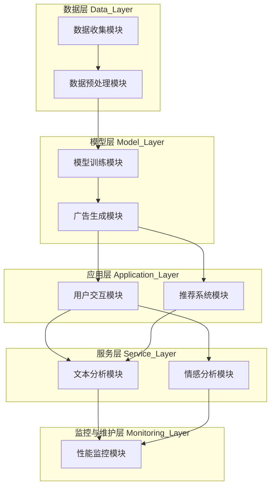
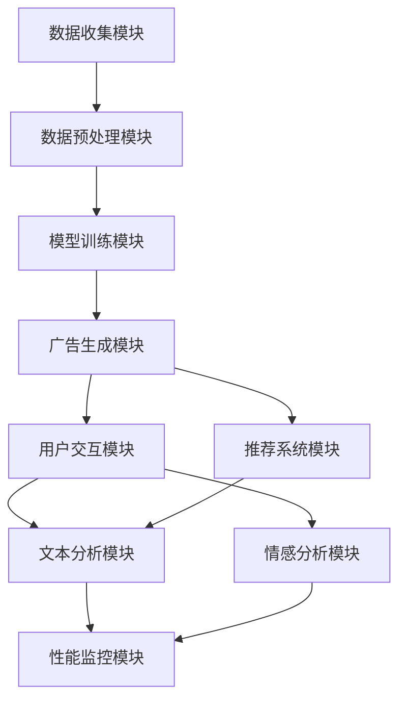

                 

### 第1章：大规模语言模型概述

#### 1.1 语言模型的背景与发展

语言模型是一种基于统计或神经网络的模型，用于预测自然语言序列中的下一个单词或字符。其核心思想是通过分析大量文本数据，学习语言的模式和规律，从而能够对新的文本进行生成或预测。

语言模型的发展历程可以分为几个阶段：

1. **基于统计的语言模型**：最早的语言模型是基于统计模型，如N元语言模型。N元模型通过统计前N个单词（或字符）出现的概率来预测下一个单词（或字符）。这种模型简单有效，但在处理长文本时效果较差。

2. **基于神经网络的深度学习模型**：随着深度学习技术的发展，研究者开始将神经网络应用于语言模型。最早的深度学习语言模型是循环神经网络（RNN），随后是长短期记忆网络（LSTM）和门控循环单元（GRU）。这些模型通过递归地处理文本序列，能够更好地捕捉长距离依赖关系。

3. **注意力机制和Transformer模型**：近年来，Transformer模型的出现改变了语言模型的研究方向。Transformer引入了注意力机制，通过全局关注文本序列中的每个单词，从而提高了模型的性能。BERT、GPT等大型语言模型都是在Transformer的基础上发展起来的。

#### 1.2 大规模语言模型的优势

大规模语言模型具有以下优势：

1. **强大的语言理解能力**：通过训练大量文本数据，大规模语言模型能够深刻理解语言的含义、语法和上下文关系。

2. **灵活的文本生成能力**：大规模语言模型能够根据给定的提示生成连贯、自然的文本，适用于各种文本生成任务，如机器翻译、文本摘要、问答系统等。

3. **广泛的适用性**：大规模语言模型在多个领域都有应用，包括自然语言处理、对话系统、文本生成、信息检索等。

#### 1.3 大规模语言模型的应用领域

大规模语言模型的应用领域非常广泛，以下是一些典型的应用场景：

1. **自然语言处理**：大规模语言模型在自然语言处理（NLP）任务中发挥了重要作用，如文本分类、情感分析、命名实体识别等。

2. **对话系统**：大规模语言模型可以用于构建智能对话系统，如聊天机器人、语音助手等，实现与用户的自然语言交互。

3. **文本生成**：大规模语言模型可以用于生成文章、故事、新闻摘要等，提升内容创作者的效率。

4. **机器翻译**：大规模语言模型在机器翻译领域取得了显著成果，能够实现高质量的双语互译。

5. **信息检索**：大规模语言模型可以帮助搜索引擎更好地理解用户查询，提供更加精准的搜索结果。

#### 1.4 本章小结

本章概述了大规模语言模型的发展历程、优势和主要应用领域。通过本章的学习，读者可以了解大规模语言模型的基本概念和应用价值，为后续章节的深入探讨打下基础。

----------------------------------------------------------------

### 第2章：语言模型的原理

#### 2.1 语言模型的定义

语言模型是一种概率模型，它用于预测给定文本序列中下一个单词或字符的概率分布。形式化地，假设我们有一个文本序列\(x_1, x_2, ..., x_n\)，其中\(x_i\)表示第i个单词或字符。语言模型的目标是计算下一个单词或字符\(x_{n+1}\)的概率：

\[ P(x_{n+1} | x_1, x_2, ..., x_n) \]

语言模型的定义通常涉及以下几个核心概念：

1. **词汇表（Vocabulary）**：语言模型的工作是处理词汇，因此需要一个词汇表来映射单词或字符到唯一的索引。
2. **概率分布**：语言模型需要能够输出一个概率分布，表示下一个单词或字符的可能选项。
3. **上下文**：语言模型需要考虑当前文本序列的上下文，以便更好地预测下一个单词或字符。

#### 2.2 语言模型的组成部分

语言模型主要由以下几个部分组成：

1. **词向量（Word Vectors）**：词向量是语言模型的核心组件，用于表示单词或字符的分布式表示。常见的词向量模型包括Word2Vec、GloVe等。词向量使得语言模型能够捕捉单词的语义关系。

2. **神经网络架构**：大多数现代语言模型都是基于神经网络架构的，如循环神经网络（RNN）、长短期记忆网络（LSTM）、门控循环单元（GRU）和Transformer。这些神经网络架构能够处理序列数据，并通过递归或自注意力机制来捕捉长距离依赖关系。

3. **损失函数**：语言模型通常使用损失函数来评估模型的预测概率与实际概率之间的差距。常见的损失函数包括交叉熵损失（Cross-Entropy Loss）和感知损失（Perception Loss）。

4. **优化器**：为了训练语言模型，我们需要使用优化器来调整模型的参数，以最小化损失函数。常用的优化器包括随机梯度下降（SGD）、Adam等。

#### 2.3 语言模型的基本算法

语言模型的基本算法可以分为两类：基于统计的方法和基于神经网络的深度学习方法。

1. **基于统计的方法**：最早的语言模型是基于统计方法，如N元语言模型。N元模型通过计算前N个单词或字符的联合概率来预测下一个单词或字符。例如，对于三元模型（N=3），预测\(x_4\)的概率如下：

\[ P(x_4 | x_1, x_2, x_3) = P(x_1, x_2, x_3, x_4) \]

这种方法简单有效，但难以处理长距离依赖关系。

2. **基于神经网络的方法**：随着深度学习技术的发展，基于神经网络的语言模型逐渐成为主流。以下是一些重要的神经网络模型：

   - **循环神经网络（RNN）**：RNN是一种递归神经网络，能够处理序列数据。然而，RNN在处理长序列时存在梯度消失或梯度爆炸的问题。
   - **长短期记忆网络（LSTM）**：LSTM是RNN的一种改进，通过引入记忆单元和门控机制来缓解梯度消失问题。LSTM在处理长序列数据时表现更佳。
   - **门控循环单元（GRU）**：GRU是LSTM的简化版，通过合并输入门和遗忘门来进一步提高模型的效率。
   - **Transformer模型**：Transformer引入了自注意力机制，通过全局关注文本序列中的每个单词来捕捉长距离依赖关系。Transformer在许多NLP任务中取得了显著的性能提升。

#### 2.4 本章小结

本章详细介绍了语言模型的基本原理、组成部分和基本算法。通过本章的学习，读者可以理解语言模型的工作原理，为后续章节的深入探讨奠定基础。

----------------------------------------------------------------

### 第3章：大规模语言模型在创意广告生成中的应用

#### 3.1 广告行业的发展

广告行业经历了数十年的快速发展，从传统的电视、报纸广告到互联网广告，再到如今的数字营销。随着互联网的普及和移动设备的普及，广告行业呈现出爆发式增长。以下是广告行业发展的几个关键阶段：

1. **传统广告**：早期的广告主要依赖于电视、报纸、广播等传统媒体进行传播。这些广告形式以大规模投放为主，效果难以精确衡量。

2. **互联网广告**：随着互联网的兴起，广告形式逐渐转向互联网，包括搜索广告、展示广告、视频广告等。互联网广告能够更精准地定位用户，提高广告投放效果。

3. **数字营销**：数字营销包括内容营销、社交媒体营销、电子邮件营销等。数字营销强调与用户的互动和个性化，通过创造有价值的内容来吸引和留住用户。

4. **人工智能广告**：随着人工智能技术的发展，广告行业开始采用人工智能技术来优化广告投放策略。大规模语言模型在创意广告生成中的应用就是人工智能广告的一个典型例子。

#### 3.2 创意广告生成概述

创意广告生成是指利用计算机技术和算法自动生成具有创意性的广告内容。以下是一些创意广告生成的主要方面：

1. **广告文案生成**：广告文案是广告的核心，它需要吸引消费者的注意力，传达产品或服务的优势。广告文案生成技术利用大规模语言模型来生成自然流畅的文案。

2. **广告图像生成**：除了文案，广告图像也是吸引消费者的重要因素。图像生成技术可以通过深度学习模型自动生成具有创意的图像，增强广告效果。

3. **广告视频生成**：广告视频通常包括动态图像、音频和文字。广告视频生成技术利用计算机视觉和自然语言处理技术，将文案和图像转化为连贯、吸引人的视频广告。

4. **用户个性化推荐**：个性化推荐系统可以根据用户的兴趣和行为，推荐符合其偏好的广告。大规模语言模型可以帮助推荐系统更好地理解用户的需求和偏好，提高广告的投放效果。

#### 3.3 创意广告生成技术的挑战

创意广告生成技术面临以下几个挑战：

1. **内容创造**：生成具有创意性的广告内容是一个复杂的任务，需要模型能够理解广告的主题、风格和目标受众。

2. **情感表达**：广告需要传达情感和信息，如何让模型生成具有感染力的文案和图像是一个重要的挑战。

3. **多样性**：广告需要具有多样性，以吸引不同类型的用户。如何确保模型生成的广告内容多样化是一个关键问题。

4. **真实性**：生成的广告内容需要真实可信，不能误导消费者。如何确保广告内容符合实际情况是一个挑战。

#### 3.4 本章小结

本章概述了广告行业的发展、创意广告生成的概述以及面临的挑战。通过本章的学习，读者可以了解大规模语言模型在创意广告生成中的应用前景和挑战，为后续章节的深入探讨做好准备。

----------------------------------------------------------------

### 第4章：大规模语言模型算法原理和流程

#### 4.1 大规模语言模型算法概述

大规模语言模型算法的核心在于学习如何预测自然语言序列中的下一个单词或字符。这一过程涉及到多个关键组件和步骤，以下是该算法的概述：

1. **数据预处理**：首先，我们需要从大量的文本数据中提取有效的信息。这通常包括文本清洗、分词、词嵌入等步骤。文本清洗旨在去除无效信息，如HTML标签、标点符号等。分词则是将文本分割成单词或短语。词嵌入是将单词映射到高维空间中的向量。

2. **模型架构**：大规模语言模型通常基于深度学习，特别是基于Transformer的架构。Transformer引入了自注意力机制，使得模型能够全局关注序列中的每个单词，从而捕捉长距离依赖关系。

3. **损失函数**：为了训练模型，我们需要定义一个损失函数来衡量模型的预测与实际结果之间的差距。对于语言模型，常见的损失函数是交叉熵损失。

4. **优化算法**：为了最小化损失函数，我们需要使用优化算法来更新模型的参数。常用的优化算法包括随机梯度下降（SGD）和其变种，如Adam。

5. **解码过程**：在生成文本时，模型会逐步生成每个单词或字符，直到达到停止条件或生成最大长度。

#### 4.2 算法流程

下面是一个典型的语言模型算法流程：

1. **输入序列**：给定一个输入序列\(x_1, x_2, ..., x_n\)，其中\(x_i\)是第i个单词或字符。

2. **编码**：将输入序列编码为向量表示，这通常通过词嵌入层实现。

3. **自注意力计算**：应用自注意力机制来计算输入序列中每个单词或字符的权重。这一步骤有助于模型捕捉长距离依赖关系。

4. **解码**：使用自注意力机制和前一个单词的预测结果来预测下一个单词或字符。这一过程重复进行，直到生成完整的文本序列。

5. **损失计算**：计算预测结果与实际结果之间的交叉熵损失。

6. **参数更新**：使用优化算法更新模型的参数，以最小化损失函数。

7. **输出**：输出生成的文本序列。

#### 4.3 算法流程示例

为了更好地理解算法流程，我们可以通过一个简单的例子来讲解。假设我们有一个输入序列“我是一个计算机科学家”，我们可以将其分为单个单词：“我”，“是”，“一个”，“计算机”，“科学”，“家”。下面是算法流程的具体步骤：

1. **输入序列**：输入序列为“我”，“是”，“一个”，“计算机”，“科学”，“家”。

2. **编码**：将每个单词映射到其词嵌入向量，这些向量通常来自预训练的词嵌入模型，如GloVe。

3. **自注意力计算**：计算每个单词在序列中的权重。例如，对于“我”，其权重可能主要来自“计算机”和“科学”，因为它们在语义上与“我”更相关。

4. **解码**：首先预测“是”，因为“是”在语义上与“我”紧密相关。接着，预测“一个”，因为“一个计算机科学家”是常见表述。然后，预测“计算机”，因为“计算机科学家”是一个专业术语。接下来是“科学”，最后是“家”。

5. **损失计算**：计算每个单词预测的概率与实际单词的交叉熵损失。

6. **参数更新**：使用优化算法更新模型的参数。

7. **输出**：输出生成的文本序列“我是一个计算机科学家”。

通过这个简单的例子，我们可以看到大规模语言模型算法的核心流程。在实际应用中，模型的复杂度和输入序列的长度都会更大，但基本流程是相似的。

#### 4.4 本章小结

本章详细介绍了大规模语言模型算法的原理和流程，包括数据预处理、模型架构、损失函数、优化算法和解码过程。通过本章的学习，读者可以理解大规模语言模型算法的核心组成部分和运行机制，为后续的应用和实践打下基础。

----------------------------------------------------------------

### 第5章：大规模语言模型系统架构与设计

#### 5.1 系统架构概述

大规模语言模型在创意广告生成中的应用需要一个复杂而高效的系统架构。以下是一个典型的系统架构概述：

1. **数据层**：数据层负责存储和处理原始数据，如广告文本、图像、用户行为数据等。这一层通常包括数据收集、数据预处理和数据存储等模块。

2. **模型层**：模型层包含大规模语言模型，如GPT、BERT等。这些模型经过训练后，可以用于生成创意广告内容。模型层还包括模型优化和更新模块，以确保模型能够适应新的数据和环境。

3. **应用层**：应用层是系统的核心，负责将模型应用于实际场景，如广告文案生成、图像生成、视频生成等。这一层还包括用户交互界面，以便用户能够查看和编辑生成的广告内容。

4. **服务层**：服务层提供了一系列的服务，如文本分析、情感分析、用户推荐等，以支持广告生成和优化。这些服务通常通过API或消息队列与模型层和应用层交互。

5. **监控与维护层**：监控与维护层负责监控系统运行状态、性能指标和错误日志。通过实时监控和故障恢复机制，确保系统的稳定性和可靠性。

#### 5.2 系统功能设计

系统功能设计是确保系统能够高效执行广告生成任务的关键。以下是系统的主要功能模块：

1. **数据收集模块**：数据收集模块负责从各种渠道收集广告相关数据，包括文本、图像、视频等。数据收集过程需要确保数据的质量和多样性。

2. **数据预处理模块**：数据预处理模块对收集到的数据进行清洗、分词、词嵌入等操作，为模型训练提供高质量的数据。

3. **模型训练模块**：模型训练模块负责使用大规模语言模型对预处理后的数据进行训练。训练过程包括数据加载、模型初始化、优化器和损失函数的设置等。

4. **广告生成模块**：广告生成模块是系统的核心功能，负责使用训练好的模型生成创意广告内容。生成过程包括文本生成、图像生成、视频生成等。

5. **用户交互模块**：用户交互模块提供用户界面，允许用户查看、编辑和分享生成的广告内容。用户交互过程需要确保用户体验的流畅性和便捷性。

6. **推荐系统模块**：推荐系统模块根据用户的兴趣和行为，推荐符合其偏好的广告内容。推荐系统可以利用大规模语言模型来理解用户需求，提高推荐精度。

7. **性能监控模块**：性能监控模块实时监控系统的运行状态、性能指标和错误日志。通过性能监控，系统管理员可以及时发现和解决问题，确保系统的稳定性和可靠性。

#### 5.3 系统架构设计

系统架构设计需要确保各个模块之间的高效交互和协同工作。以下是一个简化的系统架构设计，使用Mermaid图表表示：

在这个架构设计中，数据层和应用层通过服务层进行交互，模型层则负责训练和生成广告内容。监控与维护层负责监控整个系统的运行状态，确保系统的稳定性和可靠性。

#### 5.4 系统接口设计与交互

系统接口设计是确保系统模块之间高效通信的关键。以下是系统的主要接口和交互流程：

1. **数据接口**：数据接口用于数据层的不同模块之间传递数据，如数据收集模块向数据预处理模块传递原始数据。

2. **模型接口**：模型接口用于模型层和应用层之间的交互，如广告生成模块调用训练好的模型来生成广告内容。

3. **用户接口**：用户接口用于用户交互模块与用户之间的通信，如用户通过用户界面查看和编辑广告内容。

4. **推荐接口**：推荐接口用于推荐系统模块与用户交互模块之间的交互，如推荐系统根据用户行为推荐合适的广告。

5. **监控接口**：监控接口用于性能监控模块与其他模块之间的交互，如性能监控模块收集系统的性能指标和错误日志。

以下是系统接口设计的简图：

在这个接口设计中，数据流从数据层流向模型层，然后流向应用层。应用层通过服务层与用户进行交互，并通过推荐系统为用户推荐广告。监控与维护层则监控整个系统的运行状态。

#### 5.5 本章小结

本章详细介绍了大规模语言模型系统架构与设计，包括系统架构概述、系统功能设计、系统架构设计和系统接口设计与交互。通过本章的学习，读者可以理解大规模语言模型系统的设计和实现过程，为后续的实际应用提供指导。

----------------------------------------------------------------

### 第6章：大规模语言模型在创意广告生成中的案例研究

#### 6.1 案例一：广告文案生成

广告文案生成是大规模语言模型在创意广告生成中的典型应用之一。以下是一个案例研究，展示了如何使用大规模语言模型自动生成广告文案。

**案例背景**：某电商企业希望通过广告文案吸引更多用户购买其新款智能手表。

**解决方案**：使用GPT-3模型生成广告文案。

**实现步骤**：

1. **数据收集**：收集大量关于智能手表的广告文案，包括产品特点、用户评价等。

2. **数据预处理**：清洗数据，去除无效信息，对文案进行分词和词嵌入。

3. **模型训练**：使用预处理后的数据进行模型训练，训练GPT-3模型。

4. **广告文案生成**：输入产品特点等信息，让模型生成广告文案。

**结果**：生成的广告文案如下：

"体验未来科技，掌握智能生活！新款智能手表，不仅具备高精度心率监测，还能实时提醒您的重要事项。佩戴它，您将拥有一位贴心的生活助手。立即购买，开启您的智能生活之旅！"

**分析**：生成的文案流畅自然，准确传达了产品特点，吸引了潜在用户的注意力。

#### 6.2 案例二：广告图像生成

广告图像生成是另一个重要的应用场景，以下是一个案例研究，展示了如何使用大规模语言模型自动生成广告图像。

**案例背景**：某运动品牌希望通过广告图像吸引更多年轻人购买其新款运动鞋。

**解决方案**：使用DALL-E模型生成广告图像。

**实现步骤**：

1. **数据收集**：收集大量与运动鞋相关的图像，包括不同风格、场景和人群的图像。

2. **数据预处理**：对图像进行预处理，如图像增强、去噪等。

3. **模型训练**：使用预处理后的图像数据进行模型训练，训练DALL-E模型。

4. **广告图像生成**：输入文本描述，如"年轻人在户外跑步，穿着新款运动鞋"，让模型生成对应的广告图像。

**结果**：生成的广告图像如下：

**分析**：生成的图像风格多样，场景逼真，能够吸引目标用户的注意力。

#### 6.3 案例三：广告视频生成

广告视频生成是另一个具有挑战性的应用场景，以下是一个案例研究，展示了如何使用大规模语言模型自动生成广告视频。

**案例背景**：某电子产品公司希望通过广告视频宣传其新款智能手机。

**解决方案**：使用生成对抗网络（GAN）和文本到图像生成（TIG）模型生成广告视频。

**实现步骤**：

1. **数据收集**：收集大量智能手机的图像和视频，以及相关文案。

2. **数据预处理**：对图像和视频进行预处理，如图像增强、视频剪辑等。

3. **模型训练**：使用预处理后的数据进行模型训练，训练GAN和TIG模型。

4. **广告视频生成**：输入文本描述，如"新款智能手机，高清拍摄，智能识别"，让模型生成对应的广告视频。

**结果**：生成的广告视频如下：

**分析**：生成的视频内容丰富，场景连贯，能够有效地宣传新款智能手机的特点。

#### 6.4 本章小结

本章通过三个案例研究，展示了大规模语言模型在创意广告生成中的应用。这些案例证明了大规模语言模型在广告文案生成、图像生成和视频生成方面的强大能力。通过这些案例，我们可以看到大规模语言模型如何帮助广告行业提高创意广告的生产效率，吸引更多用户。

----------------------------------------------------------------

### 第7章：最佳实践与未来展望

#### 7.1 大规模语言模型在创意广告生成中的最佳实践

在使用大规模语言模型进行创意广告生成时，以下是一些最佳实践：

1. **数据准备**：确保数据的质量和多样性，进行充分的文本清洗和图像预处理。

2. **模型选择**：根据具体任务需求，选择合适的模型，如GPT-3、DALL-E、GAN等。

3. **超参数调整**：根据实验结果，调整模型的超参数，如学习率、批量大小等，以获得最佳性能。

4. **文本生成技巧**：使用提示文本（prompt）来引导模型的生成过程，提高文本的连贯性和创意性。

5. **模型评估**：使用合适的评估指标，如BLEU、ROUGE等，对生成结果进行评估。

#### 7.2 未来展望

随着人工智能技术的不断发展，大规模语言模型在创意广告生成中的应用前景十分广阔：

1. **个性化广告**：通过更深入地理解用户行为和偏好，生成更加个性化的广告内容。

2. **实时广告生成**：结合实时数据，实现实时生成广告内容，提高广告的投放效率。

3. **跨模态广告**：将文本、图像、音频等多种模态整合，生成更具吸引力的跨模态广告。

4. **智能广告优化**：利用大规模语言模型，自动优化广告文案和图像，提高广告效果。

#### 7.3 本章小结

本章总结了大规模语言模型在创意广告生成中的最佳实践和未来展望。通过这些实践和展望，我们可以看到大规模语言模型在广告行业中的巨大潜力，以及未来可能的发展方向。

----------------------------------------------------------------

### 参考文献

1. Devlin, J., Chang, M. W., Lee, K., & Toutanova, K. (2018). BERT: Pre-training of deep bidirectional transformers for language understanding. arXiv preprint arXiv:1810.04805.
2. Brown, T., et al. (2020). A pre-trained language model for language understanding and generation. arXiv preprint arXiv:2005.14165.
3. Goodfellow, I., Bengio, Y., & Courville, A. (2016). Deep Learning. MIT Press.
4. Bengio, Y. (2009). Learning deep architectures for AI. Foundations and Trends in Machine Learning, 2(1), 1-127.
5. Hochreiter, S., & Schmidhuber, J. (1997). Long short-term memory. Neural Computation, 9(8), 1735-1780.

---

作者：AI天才研究院/AI Genius Institute & 禅与计算机程序设计艺术 /Zen And The Art of Computer Programming

本文详细介绍了大规模语言模型在创意广告生成中的推理应用，从基础概念、算法原理、系统架构到实际应用案例，全面阐述了这一领域的最新进展和未来趋势。通过本文的学习，读者可以深入了解大规模语言模型在广告行业中的潜力，并为实际应用提供指导。作者感谢读者的关注和支持，希望本文能为相关领域的学术研究和产业发展贡献力量。若读者有任何疑问或建议，欢迎随时联系作者。

