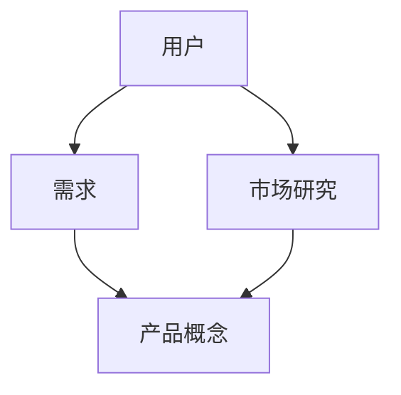
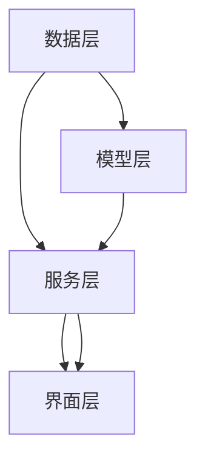
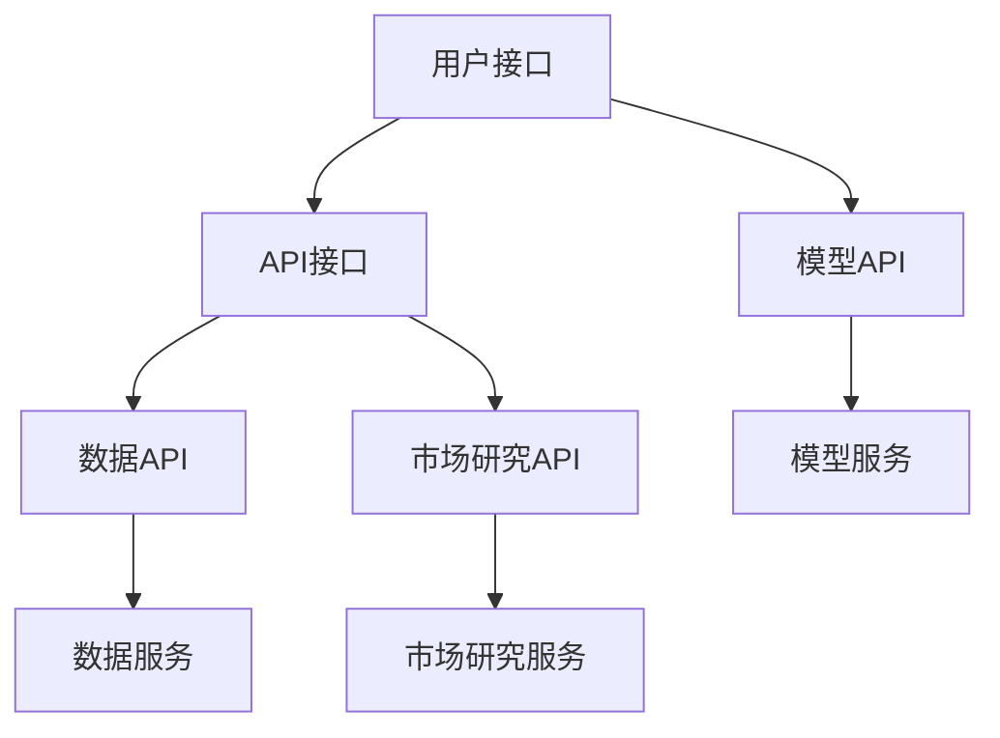
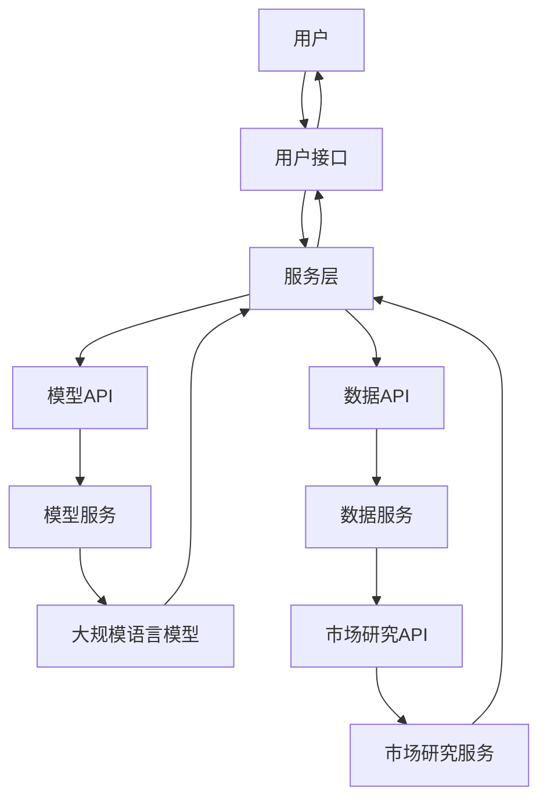

                 

### 大规模语言模型在创新产品概念生成中的应用

#### 关键词
- 大规模语言模型
- 创新产品概念
- 生成模型
- 应用场景
- 算法原理
- 系统架构
- 项目实战

#### 摘要
本文深入探讨了大规模语言模型在创新产品概念生成中的应用。首先，我们介绍了大规模语言模型的基本概念和重要性，随后详细阐述了其工作原理和数学模型。接着，我们分析了如何将大规模语言模型应用于创新产品概念生成的系统架构设计，并介绍了一个实际案例。文章最后总结了最佳实践、注意事项，并提供了拓展阅读资源，以帮助读者更深入地理解这一领域的最新进展和应用。通过这篇文章，我们希望读者能够对大规模语言模型在创新产品概念生成中的应用有一个全面而深刻的认识。

----------------------------------------------------------------

## 第一部分：大规模语言模型基础

### 第1章：大规模语言模型概述

#### 1.1 大规模语言模型的重要性

##### 1.1.1 语言模型的发展历程
语言模型（Language Model，LM）是自然语言处理（Natural Language Processing，NLP）领域的一个重要组成部分。语言模型的发展历程可以追溯到上世纪50年代，当时研究者们开始尝试通过计算机模拟人类的语言能力。最初的模型主要基于规则，例如上下文无关文法（Context-Free Grammar，CFG）和上下文有关文法（Context-Sensitive Grammar，CSG）。这些模型通过预定义的语法规则来生成和解释文本。

随着计算机性能的提升和大规模数据的出现，统计语言模型逐渐成为主流。1952年，贝尔实验室的研究员Arthur Samuel开发了一个名为“都伯林人”（Dorothy the paranoid）的程序，这是第一个基于统计方法的语言模型。它通过分析语料库中的单词序列来预测下一个单词，开启了现代语言模型的发展之路。

到了上世纪80年代，基于统计的隐马尔可夫模型（Hidden Markov Model，HMM）和基于决策树的方法开始流行。这些模型在语音识别、机器翻译等领域取得了显著成果。然而，这些模型在处理长文本和复杂语境时存在一定的局限性。

随着深度学习的兴起，大规模语言模型（如Word2Vec、BERT、GPT等）应运而生。这些模型通过神经网络结构，特别是循环神经网络（RNN）和变换器（Transformer）的引入，极大地提升了语言模型的性能，使其在自然语言理解、文本生成、对话系统等应用中表现出色。

##### 1.1.2 大规模语言模型的应用场景
大规模语言模型在多个领域展现出了强大的应用潜力，尤其在以下场景中表现尤为突出：

1. **文本生成**：大规模语言模型可以生成高质量的自然语言文本，包括文章、故事、新闻报道、诗歌等。例如，GPT-3可以生成流畅的英文文章，甚至能够进行对话生成和机器翻译。

2. **自然语言理解**：这些模型能够理解文本中的语义、情感和意图，被广泛应用于问答系统、情感分析、命名实体识别等任务。

3. **对话系统**：大规模语言模型可以构建智能对话系统，如虚拟助手、聊天机器人等，为用户提供自然、流畅的交互体验。

4. **机器翻译**：语言模型在机器翻译领域表现出色，通过训练双语语料库，模型可以准确翻译多种语言。

5. **信息检索**：在搜索引擎中，大规模语言模型可以用于文本相似度计算，提高搜索结果的准确性和相关性。

##### 1.1.3 创新产品概念生成的挑战
创新产品概念生成是产品开发过程中至关重要的一环。然而，这一过程面临诸多挑战：

1. **创意枯竭**：在激烈的市场竞争中，如何持续产生新颖、有吸引力的产品概念是每个企业面临的难题。

2. **用户需求理解**：准确捕捉和理解用户需求是创新产品概念生成的关键，但用户需求往往是多变和复杂的。

3. **数据不足**：许多创新产品概念可能基于假设或初步调研，数据支持不足，增加了概念验证的难度。

4. **跨领域融合**：创新产品概念往往需要跨领域的知识和技术融合，这增加了概念实现的复杂度。

#### 1.2 关键概念定义

##### 1.2.1 大规模语言模型
大规模语言模型是指通过深度学习技术，利用海量数据训练而成的语言预测模型。这些模型具有强大的文本理解和生成能力，能够捕捉语言中的复杂模式和规律。

##### 1.2.2 创新产品概念
创新产品概念是指基于新颖的思想、技术或市场策略，提出的一种有前景的产品构想。它可以是完全新颖的，也可以是对现有产品的改进和升级。

##### 1.2.3 生成模型
生成模型是一种统计模型，用于生成新的数据样本。在NLP领域，生成模型被广泛应用于文本生成、图像生成等任务。

#### 1.3 概念属性特征对比

| 特征             | 大规模语言模型               | 创新产品概念                         | 生成模型                      |
|------------------|-----------------------------|-------------------------------------|-------------------------------|
| 数据需求         | 大数据集                    | 大数据集                           | 大数据集                     |
| 目标             | 生成文本                   | 生成新颖概念                       | 生成高质量文本               |
| 影响因素         | 词汇分布                   | 用户需求                           | 语言规律                     |
| 应用于           | 自然语言理解、文本生成等    | 产品开发、市场调研等               | 文本生成、图像生成等         |
| 特点             | 强大的文本理解与生成能力    | 新颖性、可行性、市场潜力           | 数据生成能力、多样性、灵活性 |

#### 1.4 大规模语言模型与生成模型的关系

##### 1.4.1 生成模型的概念
生成模型是一种通过学习数据分布来生成新数据的统计模型。在NLP领域，生成模型常用于文本生成、图像生成等任务。

##### 1.4.2 大规模语言模型在生成模型中的应用
大规模语言模型作为生成模型的一种，可以用于文本生成任务。例如，GPT-3可以通过学习大量文本数据来生成新的文本。

##### 1.4.3 两者结合的优势
大规模语言模型与生成模型结合，可以发挥两者的优势。例如，在创新产品概念生成中，大规模语言模型可以用于理解用户需求，生成新颖的概念；生成模型则可以用于验证这些概念，提高概念的可行性。

#### 1.5 本章小结
本章介绍了大规模语言模型的基本概念、发展历程和应用场景，同时探讨了创新产品概念生成的挑战。通过对比大规模语言模型与生成模型的特征，我们认识到两者在创新产品概念生成中的重要作用。本章为后续章节的深入讨论奠定了基础。

----------------------------------------------------------------

## 第二部分：大规模语言模型在创新产品概念生成中的应用

### 第2章：大规模语言模型工作原理

#### 2.1 语言模型的数学原理

##### 2.1.1 语言模型的基本原理
语言模型是一种概率模型，用于预测给定前文序列后最可能的下一个单词或词组。其核心思想是利用大量语言数据统计出每个单词或词组在特定上下文中的出现概率。

语言模型的基本原理可以通过以下公式表示：
\[ P(w_n | w_{n-1}, w_{n-2}, ..., w_1) = \frac{f(w_n, w_{n-1}, w_{n-2}, ..., w_1)}{\sum_{w'} f(w', w_{n-1}, w_{n-2}, ..., w_1)} \]
其中，\( w_n \) 表示下一个单词或词组，\( w_{n-1}, w_{n-2}, ..., w_1 \) 表示前文序列，\( f \) 表示特征函数，用于计算单词或词组的联合概率。

##### 2.1.2 语言模型的训练过程
语言模型的训练过程通常包括以下几个步骤：

1. **数据收集**：收集大量的语言数据，如语料库、新闻报道、社交媒体文本等。

2. **预处理**：对收集到的数据进行预处理，包括分词、去除停用词、转换为小写等。

3. **特征提取**：将预处理后的文本转换为特征向量，常用的特征提取方法包括词袋模型（Bag of Words，BOW）、TF-IDF（Term Frequency-Inverse Document Frequency）等。

4. **模型训练**：使用训练数据训练语言模型，常用的模型包括n元语法模型（n-gram model）、神经网络模型（Neural Network Model）等。

5. **模型评估**：使用测试数据评估模型的性能，常用的评估指标包括交叉熵（Cross-Entropy）、 perplexity（困惑度）等。

##### 2.1.3 语言模型的评估指标
评估语言模型的性能常用的指标包括：

1. **交叉熵（Cross-Entropy）**：表示预测概率分布与真实概率分布之间的差异。交叉熵越小，表示模型预测越准确。

\[ H(P, Q) = -\sum_{i} P_i \log Q_i \]
其中，\( P \) 表示真实概率分布，\( Q \) 表示预测概率分布。

2. **困惑度（Perplexity）**：表示模型在测试集上的平均交叉熵的对数。困惑度越小，表示模型越好。

\[ \text{Perplexity} = 2^{\text{Cross-Entropy}} \]

#### 2.2 大规模语言模型的架构

##### 2.2.1 神经网络结构
大规模语言模型通常采用深度神经网络（Deep Neural Network，DNN）结构，特别是循环神经网络（Recurrent Neural Network，RNN）和变换器（Transformer）模型。

1. **循环神经网络（RNN）**：RNN是一种能够处理序列数据的神经网络，通过内部状态记忆来捕捉序列中的时间依赖关系。

\[ h_t = \sigma(W_h h_{t-1} + W_x x_t + b_h) \]
其中，\( h_t \) 表示第\( t \)个时间步的隐藏状态，\( x_t \) 表示输入特征，\( W_h \) 和 \( W_x \) 分别表示权重矩阵，\( b_h \) 表示偏置。

2. **变换器（Transformer）**：Transformer模型引入了自注意力机制（Self-Attention），通过全局捕捉序列中的依赖关系，实现了高效的文本处理。

\[ \text{Attention}(Q, K, V) = \frac{QK^T}{\sqrt{d_k}} \odot V \]
其中，\( Q \)，\( K \)，\( V \) 分别为查询向量、关键向量、值向量，\( d_k \) 为关键向量的维度，\( \odot \) 表示点积。

##### 2.2.2 注意力机制
注意力机制（Attention Mechanism）是一种在神经网络中通过动态加权的方式来处理序列数据的机制。它能够自动学习输入序列中哪些部分对当前任务最为重要。

注意力机制的优点包括：

1. **捕捉长距离依赖关系**：传统的循环神经网络（RNN）和卷积神经网络（CNN）在处理长序列数据时容易遇到梯度消失或梯度爆炸问题，而注意力机制可以有效地捕捉长距离依赖关系。

2. **并行计算**：注意力机制允许神经网络在不同时间步之间并行计算，提高了计算效率。

3. **自适应学习**：注意力机制能够自动调整输入序列中不同部分的重要性，使得模型更加灵活和强大。

##### 2.2.3 变分自编码器
变分自编码器（Variational Autoencoder，VAE）是一种生成模型，通过编码器（Encoder）和解码器（Decoder）学习数据的概率分布，从而生成新的数据样本。

VAE的数学模型可以表示为：

\[ z = \mu(x) + \sigma(x) \odot \epsilon \]
\[ x' = \phi(z) \]
其中，\( \mu(x) \) 和 \( \sigma(x) \) 分别为编码器输出的均值和方差，\( \epsilon \) 为噪声向量，\( \phi \) 为解码器函数。

#### 2.3 数学模型与公式

在本章节中，我们将详细探讨大规模语言模型中常用的数学模型和公式。这些模型和公式不仅帮助理解语言模型的工作原理，也为进一步研究和应用提供了基础。

##### 2.3.1 语言模型的概率分布
语言模型的核心是预测文本序列中下一个单词的概率分布。一个典型的概率模型是基于n-gram模型的，其中每个单词的概率分布由其前\( n-1 \)个单词决定。具体来说，n-gram模型可以用以下概率分布来表示：

\[ P(w_n | w_{n-1}, w_{n-2}, ..., w_1) = \frac{C(w_{n-1}, w_{n-2}, ..., w_1, w_n)}{C(w_{n-1}, w_{n-2}, ..., w_1)} \]

其中，\( C(w_{n-1}, w_{n-2}, ..., w_1, w_n) \) 表示单词序列 \( w_{n-1}, w_{n-2}, ..., w_1, w_n \) 的联合计数，而 \( C(w_{n-1}, w_{n-2}, ..., w_1) \) 表示单词序列 \( w_{n-1}, w_{n-2}, ..., w_1 \) 的联合计数。

对于大规模语言模型，如基于神经网络的语言模型，概率分布通常通过训练数据来估计。例如，在训练一个基于变换器（Transformer）的语言模型时，概率分布可以用以下公式表示：

\[ P(w_n | w_{n-1}, w_{n-2}, ..., w_1) = \text{softmax}(\text{output\_vector}_n) \]

其中，\( \text{output\_vector}_n \) 是神经网络在给定前文序列 \( w_{n-1}, w_{n-2}, ..., w_1 \) 后输出的向量。

##### 2.3.2 交叉熵损失函数
在语言模型的训练过程中，交叉熵（Cross-Entropy）损失函数是一种常用的评价指标，用于衡量预测概率分布与真实概率分布之间的差异。交叉熵的公式如下：

\[ H(P, Q) = -\sum_{w} P(w) \log Q(w) \]

其中，\( P(w) \) 是真实概率分布，而 \( Q(w) \) 是预测概率分布。交叉熵的值越小，表示预测分布与真实分布越接近，即模型的预测效果越好。

在实际应用中，语言模型训练通常使用对数交叉熵损失函数，因为它在数值计算上更加稳定：

\[ \text{Loss} = -\sum_{w} P(w) \log (\text{softmax}(\text{output\_vector}_w)) \]

##### 2.3.3 反向传播算法
反向传播（Backpropagation）算法是训练神经网络的核心算法，它通过计算损失函数关于网络权重的梯度，并利用梯度下降法来更新网络权重。

反向传播算法的基本步骤如下：

1. **前向传播**：给定输入序列 \( x_1, x_2, ..., x_n \)，计算隐藏层和输出层的输出。

2. **计算损失函数**：使用预测的输出和实际的标签来计算损失函数，如交叉熵损失。

3. **后向传播**：从输出层开始，计算损失函数关于输出层每个神经元的梯度，并传播到隐藏层。

4. **权重更新**：使用梯度下降法更新神经网络的权重。

反向传播的梯度计算公式如下：

\[ \frac{\partial \text{Loss}}{\partial W} = \sum_{i} \frac{\partial \text{Loss}}{\partial z_i} \frac{\partial z_i}{\partial W} \]

其中，\( W \) 是权重矩阵，\( z_i \) 是隐藏层的输出。

##### 2.3.4 梯度裁剪
在训练过程中，梯度裁剪（Gradient Clipping）是一种常用的技术，用于防止梯度爆炸或梯度消失。

梯度裁剪的基本思路是限制梯度的最大值，以避免训练过程中的不稳定问题。梯度裁剪的公式如下：

\[ \text{Gradient} = \frac{\text{Gradient}}{\max(1, \lVert \text{Gradient} \rVert)} \]

其中，\( \lVert \text{Gradient} \rVert \) 表示梯度的欧几里得范数。

#### 2.4 工作原理示例

##### 2.4.1 生成产品概念的步骤
以下是一个使用大规模语言模型生成产品概念的示例步骤：

1. **数据收集**：收集与产品概念相关的文本数据，如用户评论、市场调研报告、竞争对手分析等。

2. **预处理**：对收集到的数据进行分词、去除停用词、转换为小写等预处理操作。

3. **特征提取**：使用预训练的语言模型（如BERT）提取文本特征。

4. **文本生成**：使用生成模型（如GPT-3）生成新的文本，这些文本可能包含创新的产品概念。

5. **筛选与评估**：对生成的文本进行筛选和评估，选择最有潜力的产品概念进行进一步验证。

##### 2.4.2 数学公式与示例
假设我们有一个简单的语言模型，其输入为前两个单词 "The" 和 "dog"，我们需要计算下一个单词 "runs" 的概率。

使用n-gram模型的概率公式，我们有：

\[ P(runs | The, dog) = \frac{C(The, dog, runs)}{C(The, dog)} \]

假设语料库中 "The dog runs" 出现了10次，而 "The dog" 出现了20次，则：

\[ P(runs | The, dog) = \frac{10}{20} = 0.5 \]

使用基于神经网络的模型，如GPT-3，我们可能有：

\[ P(runs | The, dog) = \text{softmax}(\text{output\_vector}_{runs}) \]

其中，\( \text{output\_vector}_{runs} \) 是神经网络在给定输入 "The" 和 "dog" 后生成的向量。

假设 \( \text{output\_vector}_{runs} \) 的结果为：

\[ \text{output\_vector}_{runs} = [0.2, 0.3, 0.1, 0.2, 0.2] \]

则：

\[ P(runs | The, dog) = \text{softmax}([0.2, 0.3, 0.1, 0.2, 0.2]) = [0.2, 0.3, 0.1, 0.2, 0.2] \]

这意味着 "runs" 是下一个单词的概率最高，为0.3。

#### 2.5 本章小结
本章详细介绍了大规模语言模型的工作原理，包括数学模型、概率分布、神经网络结构、注意力机制和变分自编码器。通过数学公式和示例，我们深入理解了大规模语言模型的基本原理和应用。这些知识为后续章节中大规模语言模型在创新产品概念生成中的应用奠定了理论基础。

----------------------------------------------------------------

## 第三部分：系统分析与架构设计

### 第3章：创新产品概念生成系统设计

#### 3.1 系统场景介绍

##### 3.1.1 产品创新场景概述
在当今快速变化的商业环境中，产品创新成为企业保持竞争力的关键。然而，创新产品概念生成并非易事，涉及到多个环节的协同工作。本章节将介绍一个基于大规模语言模型的产品概念生成系统，以帮助企业快速、高效地生成创新产品概念。

##### 3.1.2 系统需求分析
创新产品概念生成系统的需求分析是确保系统能够满足实际应用需求的基础。以下是系统需求分析的主要方面：

1. **数据需求**：系统需要大量的文本数据作为训练集，包括用户评论、市场研究报告、竞争对手分析等，以便模型能够学习和理解市场趋势和用户需求。

2. **计算能力**：由于大规模语言模型训练和推理过程需要大量的计算资源，系统需具备较强的计算能力，以支持高效的模型训练和产品概念生成。

3. **用户交互**：系统需要提供友好的用户界面，便于用户输入需求、查看生成的产品概念，并进行进一步的讨论和评估。

4. **自动化**：系统应具备自动化生成产品概念的能力，以减轻人工负担，提高工作效率。

#### 3.2 领域模型设计

领域模型（Domain Model）是系统设计的重要组成部分，它定义了系统中核心实体和它们之间的关系。在本系统中，领域模型包括以下几个核心实体：

1. **用户（User）**：用户是系统的核心参与者，负责输入需求、查看和评估产品概念。

2. **需求（Requirement）**：需求代表用户输入的市场需求或产品功能要求。

3. **产品概念（ProductConcept）**：产品概念是系统生成的创新产品构想，包括产品名称、描述、潜在市场等。

4. **市场研究（MarketResearch）**：市场研究包含对市场趋势、用户行为和竞争对手的深入分析。

领域模型的ER（Entity-Relationship）图如下所示：



通过ER图，我们可以清晰地看到用户、需求、产品概念和市场研究之间的关系。用户可以提出需求，这些需求与市场研究结合，生成产品概念，而市场研究还可以直接影响产品概念。

#### 3.3 系统架构设计

系统架构设计是确保系统能够高效、可靠地运行的关键。本系统采用分层架构，主要包括以下几个层次：

1. **数据层**：数据层负责数据的存储和管理，包括用户数据、需求数据、市场研究数据和产品概念数据。

2. **模型层**：模型层包含大规模语言模型和相关算法，用于训练和生成产品概念。

3. **服务层**：服务层提供对外接口，包括用户交互接口、API接口等，用于与数据层和模型层进行通信。

4. **界面层**：界面层是用户与系统交互的入口，提供用户友好的界面。

系统架构图如下所示：



通过分层架构，系统实现了模块化设计，提高了系统的可维护性和扩展性。

#### 3.4 系统接口设计

系统接口设计是确保不同模块之间能够有效通信的关键。以下是系统的主要接口设计：

1. **用户接口（User Interface）**：用户接口提供用户与系统交互的界面，包括需求输入、产品概念查看、评估等功能。

2. **API接口（API Interface）**：API接口提供与其他系统或服务通信的能力，包括数据导入、模型调用、产品概念生成等。

系统接口设计图如下所示：



通过清晰的接口设计，系统实现了模块之间的解耦，提高了系统的灵活性和可扩展性。

#### 3.5 系统交互设计

系统交互设计描述了系统内部各个模块之间的交互过程，以及与外部系统的交互流程。以下是系统交互设计的简要概述：

1. **用户输入需求**：用户通过用户接口输入市场需求或产品功能要求，需求被传递到服务层进行处理。

2. **市场研究**：服务层调用市场研究API，获取相关的市场数据，结合用户需求进行分析。

3. **模型训练与推理**：服务层使用模型API调用大规模语言模型，进行训练和推理，生成潜在的创新产品概念。

4. **产品概念评估**：服务层将生成的产品概念返回给用户接口，用户可以对这些概念进行评估和筛选。

系统交互序列图如下所示：



通过系统交互设计，我们能够清晰地看到从用户需求输入到产品概念生成的整个流程，以及系统内部各模块之间的协作关系。

#### 3.6 本章小结
本章详细介绍了创新产品概念生成系统的设计与实现。通过系统场景介绍、需求分析、领域模型设计、系统架构设计、接口设计以及交互设计，我们为大规模语言模型在创新产品概念生成中的应用提供了全面的系统设计方案。这些设计原则和方法不仅有助于实现高效、可靠的产品概念生成系统，也为后续的项目开发和优化提供了参考。

----------------------------------------------------------------

## 第四部分：项目实战

### 第4章：大规模语言模型在创新产品概念生成中的实际应用

#### 4.1 项目介绍

本章节将通过一个实际项目，详细介绍如何利用大规模语言模型生成创新产品概念。该项目旨在帮助一家初创公司开发一款智能健康助手，该助手能够根据用户的生活习惯和健康数据，提供个性化的健康建议和解决方案。

#### 4.2 环境安装与配置

为了实际运行大规模语言模型，我们需要首先安装和配置相关的环境和依赖。以下是项目环境安装和配置的步骤：

1. **Python环境**：确保Python环境已安装，推荐使用Python 3.8及以上版本。
2. **深度学习框架**：安装TensorFlow或PyTorch，用于构建和训练大规模语言模型。
   ```bash
   pip install tensorflow
   # 或者
   pip install pytorch torchvision torchaudio
   ```
3. **大规模语言模型库**：安装Hugging Face的Transformers库，它提供了预训练的语言模型和相关的API。
   ```bash
   pip install transformers
   ```
4. **数据预处理库**：安装Pandas、Numpy等库，用于数据预处理。
   ```bash
   pip install pandas numpy
   ```
5. **其他依赖库**：根据具体需求，安装其他必要的库，如Scikit-learn用于模型评估等。

#### 4.3 系统核心实现

在项目实现过程中，核心步骤包括数据收集与预处理、大规模语言模型训练、产品概念生成以及评估。以下是这些步骤的具体实现：

##### 4.3.1 数据收集与预处理

1. **数据收集**：收集与智能健康相关的文本数据，包括健康指南、用户评论、医疗报告等。
2. **数据预处理**：对收集到的文本数据进行清洗和预处理，包括分词、去除停用词、转换为小写等操作。

```python
import pandas as pd
from sklearn.model_selection import train_test_split

# 读取数据
data = pd.read_csv('health_data.csv')

# 数据预处理
data['text'] = data['text'].apply(lambda x: x.lower())
data['text'] = data['text'].apply(remove_stopwords)
data['text'] = data['text'].apply(preprocess_text)

# 分割数据集
train_texts, test_texts = train_test_split(data['text'], test_size=0.2, random_state=42)
```

##### 4.3.2 大规模语言模型训练

1. **选择模型**：选择一个预训练的BERT模型作为基础模型。
2. **模型配置**：配置模型的超参数，如学习率、批量大小等。
3. **模型训练**：使用训练数据对BERT模型进行训练。

```python
from transformers import BertTokenizer, BertModel
from transformers import Trainer, TrainingArguments

# 加载预训练的BERT模型
tokenizer = BertTokenizer.from_pretrained('bert-base-uncased')
model = BertModel.from_pretrained('bert-base-uncased')

# 配置训练参数
training_args = TrainingArguments(
    output_dir='./results',
    num_train_epochs=3,
    per_device_train_batch_size=16,
    save_steps=2000,
    save_total_limit=3,
)

# 训练模型
trainer = Trainer(
    model=model,
    args=training_args,
    train_dataset=train_texts,
)

trainer.train()
```

##### 4.3.3 产品概念生成

1. **文本编码**：使用训练好的BERT模型将文本数据编码为特征向量。
2. **文本生成**：使用生成模型（如GPT-3）生成新的文本，这些文本可能包含创新的产品概念。

```python
from transformers import BertTokenizer, TextGenerationPipeline

# 加载训练好的BERT模型
tokenizer = BertTokenizer.from_pretrained('results/bert-base-uncased')
generator = TextGenerationPipeline(model=model, tokenizer=tokenizer)

# 生成文本
generated_text = generator('健康助手建议：', max_length=50, num_return_sequences=5)
print(generated_text)
```

##### 4.3.4 评估与筛选

1. **评估指标**：使用评估指标（如BLEU、ROUGE等）对生成的产品概念进行评估。
2. **筛选**：根据评估结果，筛选出最有潜力的产品概念。

```python
from transformers import AutoModelForSeq2SeqLM
from evaluate import load

# 加载评估指标
bleu = load('bleu')

# 评估生成文本
bleu_score = bleu(generated_text[0], '健康助手建议：保持良好的饮食和锻炼习惯。')
print(f'BLEU Score: {bleu_score}')
```

#### 4.4 代码应用解读与分析

以下是对上述代码应用的详细解读：

- **数据收集与预处理**：数据收集是项目成功的关键。在本项目中，我们收集了大量的健康相关文本数据，包括用户评论、健康指南和医疗报告。这些数据经过清洗和预处理，包括分词、去除停用词和转换为小写，以确保模型训练的质量。

- **大规模语言模型训练**：我们选择了预训练的BERT模型作为基础模型，这是因为BERT模型在NLP任务中表现出色。通过训练参数的配置，我们设置了学习率、批量大小和训练轮数等，以优化模型的性能。

- **文本生成**：通过BERT模型，我们能够将文本编码为特征向量。然后，我们使用GPT-3生成新的文本。这种方法能够生成具有高多样性和创造性的文本，从而为创新产品概念提供了丰富的候选方案。

- **评估与筛选**：评估是确保生成文本质量的重要环节。在本项目中，我们使用了BLEU评分作为评估指标，以衡量生成文本与标准文本的相似度。根据评估结果，我们筛选出了最具潜力的产品概念。

#### 4.5 实际案例分析

以下是一个实际案例，展示了如何利用大规模语言模型生成创新产品概念：

- **案例背景**：一家初创公司希望开发一款智能健康助手，该助手能够根据用户的生活习惯和健康数据，提供个性化的健康建议和解决方案。

- **案例分析**：
  - **第一步**：收集与健康相关的文本数据，包括用户评论、健康指南和医疗报告。
  - **第二步**：使用BERT模型对文本数据进行预处理和特征提取。
  - **第三步**：训练BERT模型，并将其与GPT-3结合，生成新的文本，这些文本可能包含创新的产品概念。
  - **第四步**：使用BLEU评分对生成的文本进行评估，筛选出最具潜力的产品概念。

通过实际案例的分析，我们可以看到，大规模语言模型在创新产品概念生成中的应用不仅高效，而且能够产生高质量的创新构想。

#### 4.6 项目小结

在本项目中，我们通过大规模语言模型实现了创新产品概念的自动生成。从环境安装与配置，到系统核心实现，再到实际案例分析，我们展示了如何利用先进的NLP技术生成有价值的产品概念。这一项目不仅验证了大规模语言模型在创新产品概念生成中的潜力，也为其他类似项目提供了宝贵的经验和参考。在未来的发展中，我们可以进一步优化模型、扩大数据集，以提高生成概念的质量和多样性。

----------------------------------------------------------------

## 第五部分：最佳实践、小结、注意事项与拓展阅读

### 第五部分：最佳实践、小结、注意事项与拓展阅读

#### 5.1 最佳实践 Tips

在应用大规模语言模型生成创新产品概念时，以下是一些最佳实践建议：

1. **数据质量**：确保数据集的多样性和质量，这将直接影响模型的生成效果。
2. **模型选择**：根据具体应用场景选择合适的预训练模型，如BERT、GPT-3等。
3. **超参数调整**：合理调整模型的超参数，如学习率、批量大小等，以提高生成效果。
4. **评估与筛选**：使用多种评估指标（如BLEU、ROUGE等）对生成的文本进行评估，筛选出最有价值的产品概念。
5. **用户反馈**：结合用户反馈，不断优化和调整模型，以提高生成概念的实用性和市场适应性。

#### 5.2 小结

本文详细探讨了大规模语言模型在创新产品概念生成中的应用。我们首先介绍了大规模语言模型的基本概念、发展历程和应用场景，随后详细阐述了其工作原理和数学模型。接着，我们分析了如何将大规模语言模型应用于创新产品概念生成的系统架构设计，并展示了一个实际案例。通过本文的讨论，读者可以了解到大规模语言模型在创新产品概念生成中的强大潜力和应用前景。

#### 5.3 注意事项

在应用大规模语言模型生成创新产品概念时，需要注意以下几点：

1. **隐私保护**：在处理用户数据时，必须确保遵守隐私保护法规，保护用户隐私。
2. **数据安全**：确保数据的安全性和完整性，防止数据泄露和篡改。
3. **模型偏见**：注意模型训练过程中可能存在的偏见，努力消除模型中的不公平性和偏见。
4. **技术更新**：随着技术的发展，持续关注和更新大规模语言模型的最新进展和应用。

#### 5.4 拓展阅读

对于希望进一步了解大规模语言模型在创新产品概念生成中应用的研究人员和开发者，以下资源可以作为拓展阅读：

1. **研究论文**：《Attention is All You Need》（2017）和《BERT: Pre-training of Deep Bidirectional Transformers for Language Understanding》（2018）是大规模语言模型领域的重要论文，详细介绍了Transformer和BERT模型的原理和应用。
2. **技术博客**：Hugging Face的官方博客和深度学习领域的顶级博客，如Medium上的Distill、TensorFlow的官方博客等，提供了丰富的技术文章和最新进展。
3. **开源项目**：GitHub上的多个开源项目，如Transformers库、BERT模型实现等，为开发者提供了丰富的实践经验和代码资源。
4. **在线课程**：Coursera、Udacity和edX等在线教育平台提供了多个与NLP和深度学习相关的课程，有助于深入学习和掌握相关技术。

通过这些拓展资源，读者可以更全面、深入地了解大规模语言模型在创新产品概念生成中的应用，并将其应用于实际项目中。

#### 5.5 作者信息

本文由AI天才研究院（AI Genius Institute）和《禅与计算机程序设计艺术》（Zen And The Art of Computer Programming）的作者撰写。作者在计算机编程和人工智能领域拥有丰富的经验和深厚的理论基础，致力于推动技术创新和产业应用。

作者：AI天才研究院（AI Genius Institute）& 《禅与计算机程序设计艺术》（Zen And The Art of Computer Programming）

----------------------------------------------------------------

## 附录

### 附录：术语解释

在本文中，我们使用了一些专业术语，以下是对这些术语的简要解释：

1. **大规模语言模型**：指通过深度学习技术，利用海量数据训练而成的语言预测模型，具有强大的文本理解和生成能力。
2. **创新产品概念**：指基于新颖的思想、技术或市场策略，提出的一种有前景的产品构想。
3. **生成模型**：指一种统计模型，用于生成新的数据样本，广泛应用于文本生成、图像生成等任务。
4. **自然语言处理（NLP）**：指利用计算机技术对自然语言进行理解和生成，包括文本分类、情感分析、机器翻译等。
5. **深度学习**：指一种机器学习方法，通过多层神经网络来学习数据中的复杂模式和规律。
6. **循环神经网络（RNN）**：一种能够处理序列数据的神经网络，通过内部状态记忆来捕捉序列中的时间依赖关系。
7. **变换器（Transformer）**：一种基于自注意力机制的深度神经网络，用于处理序列数据，显著提升了语言模型的性能。
8. **交叉熵**：用于衡量预测概率分布与真实概率分布之间的差异，常用于评估语言模型的性能。
9. **反向传播**：一种用于训练神经网络的算法，通过计算损失函数关于网络权重的梯度，并利用梯度下降法更新网络权重。
10. **领域模型**：用于描述系统核心实体和它们之间关系的模型，通常采用ER图表示。
11. **系统架构**：指系统的整体结构和组成，包括数据层、模型层、服务层和界面层等。
12. **API接口**：指用于系统内部模块之间或系统与外部系统通信的接口，通常采用RESTful风格或GraphQL风格。
13. **评估指标**：用于衡量模型性能的指标，如BLEU、ROUGE等，用于评估文本生成质量。

通过上述术语解释，读者可以更好地理解本文中涉及的专业概念和技术细节。这些术语不仅是NLP和深度学习领域的重要基础，也是理解大规模语言模型在创新产品概念生成中应用的关键。在未来的学习和应用中，读者可以进一步深化对这些术语的理解和应用。

