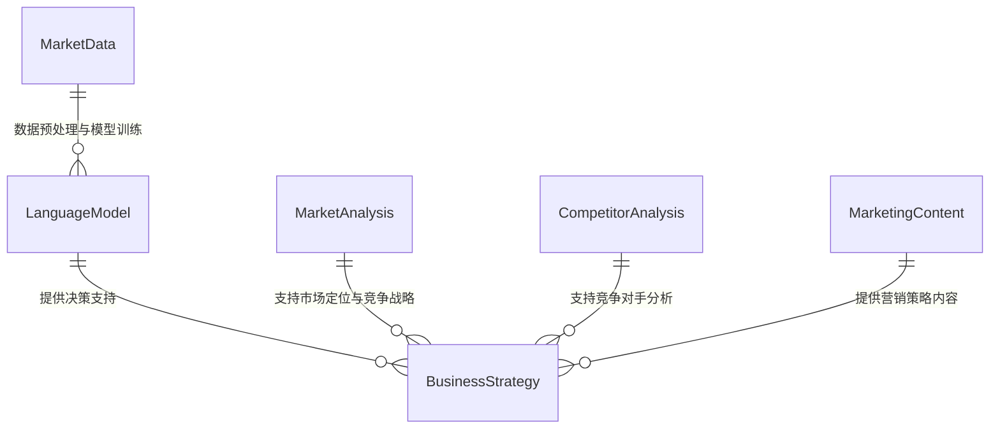
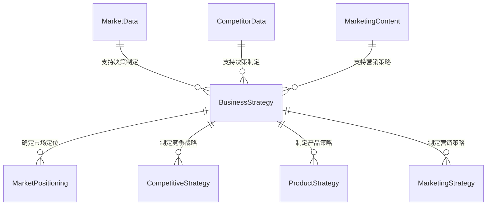
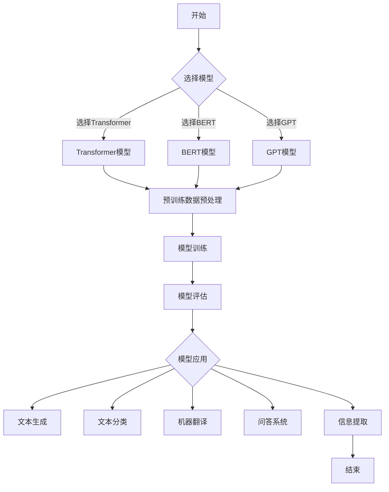
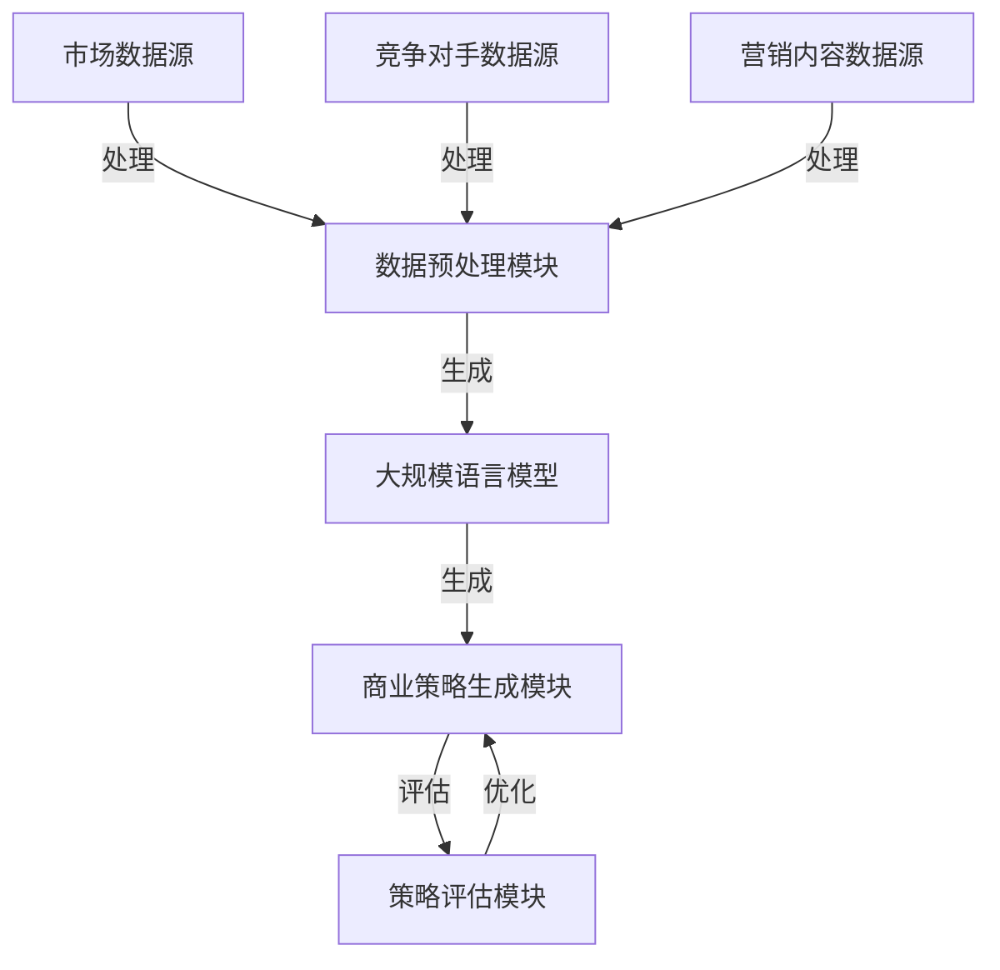
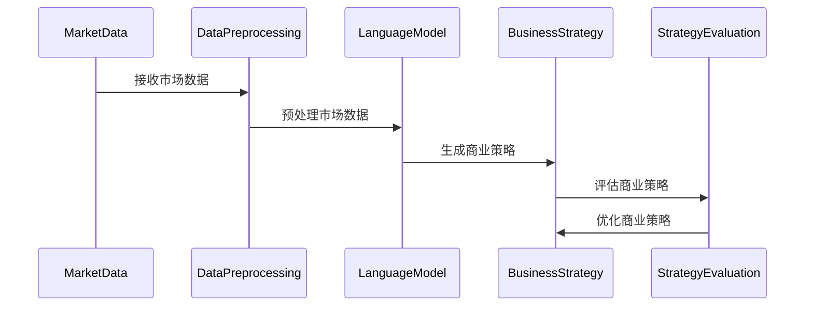

                 

# 大规模语言模型在创新商业策略制定中的应用

## 关键词：大规模语言模型、商业策略、创新、应用、算法

> 摘要：本文探讨了大规模语言模型在创新商业策略制定中的应用。首先，我们介绍了大规模语言模型的基本原理和商业策略的核心概念，然后通过分析大规模语言模型的优势和挑战，详细讲解了其与商业策略结合的途径和方法。本文旨在为企业和创业者提供一种新的商业策略制定工具，帮助他们在竞争激烈的市场中取得成功。

## 第一部分：背景介绍

### 1.1 问题背景

#### 1.1.1 商业策略制定的现状

在当今快速变化的市场环境中，企业面临着前所未有的挑战。制定有效的商业策略已成为企业成功的关键。然而，传统的商业策略制定方法往往依赖于历史数据和专家经验，难以适应快速变化的市场环境。这种局限性导致企业在面对市场不确定性时缺乏灵活性，难以实现持续的创新和竞争优势。

#### 1.1.2 大规模语言模型的崛起

随着深度学习和人工智能技术的不断发展，大规模语言模型（如GPT、BERT等）在自然语言处理领域取得了显著的进展。这些模型能够处理和理解大规模的文本数据，具有强大的知识表示和生成能力。这使得大规模语言模型在许多应用领域表现出色，包括问答系统、文本生成、机器翻译等。

#### 1.1.3 大规模语言模型在商业策略制定中的应用潜力

大规模语言模型的出现为商业策略制定带来了新的可能性。首先，这些模型可以处理和分析大量的市场数据，帮助企业更好地了解市场趋势和消费者需求。其次，大规模语言模型可以生成高质量的文本内容，为企业的品牌传播和市场营销提供支持。此外，大规模语言模型还可以帮助企业进行竞争对手分析，制定更有针对性的商业策略。

### 1.2 问题描述

#### 1.2.1 商业策略制定面临的挑战

商业策略制定面临的主要挑战包括市场不确定性、数据复杂性、竞争激烈等。企业在制定商业策略时，需要充分考虑这些因素，以确保策略的有效性和可行性。

#### 1.2.2 大规模语言模型的优势

大规模语言模型在商业策略制定中具有以下优势：

1. **数据驱动的洞察**：大规模语言模型可以处理和分析大量的市场数据，帮助企业家更全面地了解市场趋势和消费者需求。
2. **自动化的文本生成**：大规模语言模型可以生成高质量的文本内容，为企业的品牌传播和市场营销提供支持。
3. **智能化的决策支持**：大规模语言模型可以分析竞争对手的行为和市场动态，为企业家提供智能化的决策支持。

#### 1.2.3 大规模语言模型在商业策略制定中的具体应用

大规模语言模型在商业策略制定中具有广泛的应用场景，包括市场研究、竞争对手分析、市场营销策略制定等。

1. **市场研究**：大规模语言模型可以处理和分析大量的市场数据，帮助企业更准确地了解市场趋势和消费者需求。
2. **竞争对手分析**：大规模语言模型可以分析竞争对手的行为和市场动态，为企业家提供智能化的决策支持。
3. **市场营销策略制定**：大规模语言模型可以生成高质量的文本内容，为企业的品牌传播和市场营销提供支持。

### 1.3 问题解决

#### 1.3.1 大规模语言模型的技术原理

大规模语言模型基于深度学习和自然语言处理技术，通过训练神经网络模型来理解语言的结构和语义。这些模型可以处理和理解大规模的文本数据，具有强大的知识表示和生成能力。

#### 1.3.2 大规模语言模型在商业策略制定中的应用方法

大规模语言模型在商业策略制定中的应用方法主要包括以下几步：

1. **数据收集**：收集相关的市场数据，包括消费者需求、市场趋势、竞争对手行为等。
2. **数据处理**：对收集到的数据进行预处理，包括数据清洗、数据归一化等。
3. **模型训练**：使用预处理后的数据对大规模语言模型进行训练，使其能够理解市场数据。
4. **模型评估**：对训练好的模型进行评估，确保其性能和准确性。
5. **策略制定**：基于模型的预测和分析，制定相应的商业策略。

#### 1.3.3 大规模语言模型的优势与局限

大规模语言模型在商业策略制定中具有以下优势：

1. **数据驱动的洞察**：大规模语言模型可以处理和分析大量的市场数据，帮助企业更全面地了解市场趋势和消费者需求。
2. **自动化的文本生成**：大规模语言模型可以生成高质量的文本内容，为企业的品牌传播和市场营销提供支持。
3. **智能化的决策支持**：大规模语言模型可以分析竞争对手的行为和市场动态，为企业家提供智能化的决策支持。

然而，大规模语言模型也存在一些局限，如对数据质量和模型训练过程的依赖性等。

#### 1.4 边界与外延

#### 1.4.1 大规模语言模型的应用领域

大规模语言模型在商业策略制定中的应用领域主要包括市场研究、竞争对手分析、市场营销策略制定等。

#### 1.4.2 大规模语言模型在商业策略制定中的应用边界

大规模语言模型在商业策略制定中的应用边界主要包括以下几方面：

1. **数据质量和模型训练过程**：大规模语言模型的性能高度依赖于数据质量和模型训练过程。
2. **模型泛化能力**：大规模语言模型在特定领域内可能具有较高的性能，但在其他领域可能存在泛化能力不足的问题。
3. **人机交互**：大规模语言模型需要与人类用户进行有效交互，以充分发挥其优势。

#### 1.4.3 大规模语言模型的发展趋势

随着人工智能技术的不断发展，大规模语言模型在商业策略制定中的应用将越来越广泛。未来，大规模语言模型可能会在以下几个方面得到进一步发展：

1. **模型性能的提升**：随着计算能力的提升和算法的优化，大规模语言模型的性能将得到进一步提升。
2. **多模态数据处理**：大规模语言模型将能够处理更多类型的数据，如图像、音频等，以提高其应用范围。
3. **个性化服务**：大规模语言模型将能够根据用户需求提供个性化的服务，以提高用户体验。

### 1.5 概念结构与核心要素组成

#### 1.5.1 商业策略的核心概念

商业策略是指企业在特定市场环境下，为实现其经营目标而制定的长期性、系统性和可操作性的规划。商业策略的核心概念包括：

1. **市场定位**：企业在市场中的定位和目标。
2. **竞争战略**：企业在市场竞争中的策略和方法。
3. **产品策略**：企业产品的发展方向和策略。
4. **营销策略**：企业品牌传播和市场营销的方法。

#### 1.5.2 大规模语言模型的核心概念

大规模语言模型是指基于深度学习和自然语言处理技术，对大规模文本数据进行训练和处理的模型。其核心概念包括：

1. **语言模型**：对自然语言进行建模的算法。
2. **神经网络**：大规模语言模型的基础结构。
3. **预训练**：大规模语言模型在特定任务上的预训练过程。

#### 1.5.3 商业策略制定与大规模语言模型的关系

商业策略制定与大规模语言模型的关系主要表现在以下几个方面：

1. **数据驱动**：大规模语言模型可以处理和分析大量的市场数据，为企业提供数据驱动的商业策略。
2. **自动化生成**：大规模语言模型可以生成高质量的文本内容，为企业的品牌传播和市场营销提供自动化生成的内容。
3. **智能化决策**：大规模语言模型可以分析竞争对手的行为和市场动态，为企业提供智能化的决策支持。

### 1.6 本章小结

本部分介绍了大规模语言模型在创新商业策略制定中的应用背景、问题、解决方案以及应用边界和发展趋势。通过本文的介绍，读者可以了解大规模语言模型在商业策略制定中的潜在价值和应用前景。

----------------------------------------------------------------

## 第二部分：核心概念与联系

### 2.1 大规模语言模型原理

#### 2.1.1 语言模型的基础知识

语言模型（Language Model，LM）是自然语言处理（Natural Language Processing，NLP）领域的重要基础。它是一种概率模型，用于预测自然语言序列的概率。在NLP任务中，语言模型可以用于自动文本生成、机器翻译、文本分类、问答系统等。

语言模型的核心思想是利用已有数据来估计未知文本序列的概率。常见的语言模型有：

1. **N-gram模型**：基于前N个单词的概率来预测下一个单词。
2. **神经网络语言模型**：使用神经网络来建模文本数据的概率分布。
3. **递归神经网络（RNN）语言模型**：使用RNN来处理序列数据。

#### 2.1.2 大规模语言模型的工作原理

大规模语言模型（如GPT、BERT等）是利用深度学习和大规模数据训练得到的。它们的工作原理如下：

1. **数据预处理**：将文本数据转换为模型可处理的格式，如单词向量、字符向量等。
2. **模型训练**：使用大规模文本数据进行模型训练，优化模型参数。
3. **模型评估**：使用验证集对模型进行评估，调整模型参数。
4. **模型应用**：将训练好的模型应用于实际问题，如文本生成、问答系统等。

#### 2.1.3 大规模语言模型的性能指标

大规模语言模型的性能指标主要包括：

1. ** perplexity（困惑度）**：衡量模型预测文本序列的能力，越小表示模型越好。
2. **bleu score（BLEU得分）**：用于评估文本生成模型的生成质量，值越高表示生成质量越好。
3. **accuracy（准确率）**：用于评估分类模型的性能，值越高表示模型分类能力越强。

### 2.2 商业策略概念解析

#### 2.2.1 商业策略的定义与类型

商业策略（Business Strategy）是企业为实现其经营目标而制定的长期性、系统性和可操作性的规划。商业策略的类型包括：

1. **竞争策略**：企业在市场竞争中的策略和方法，如差异化、低成本等。
2. **市场进入策略**：企业进入新市场的方法和路径。
3. **产品策略**：企业产品的发展方向和策略，如新产品开发、产品线扩展等。
4. **营销策略**：企业品牌传播和市场营销的方法，如广告、促销等。

#### 2.2.2 商业策略的核心要素

商业策略的核心要素包括：

1. **市场定位**：企业在市场中的定位和目标，如目标客户、市场份额等。
2. **竞争战略**：企业在市场竞争中的策略和方法，如差异化、低成本等。
3. **产品策略**：企业产品的发展方向和策略，如新产品开发、产品线扩展等。
4. **营销策略**：企业品牌传播和市场营销的方法，如广告、促销等。

#### 2.2.3 商业策略的制定过程

商业策略的制定过程主要包括以下步骤：

1. **市场分析**：分析市场环境、竞争对手、消费者需求等。
2. **目标设定**：明确企业的目标和期望。
3. **策略制定**：制定具体的商业策略，如竞争策略、产品策略、营销策略等。
4. **实施与监控**：实施商业策略，并对策略效果进行监控和调整。

### 2.3 大规模语言模型与商业策略的联系

#### 2.3.1 大规模语言模型在商业策略制定中的应用

大规模语言模型在商业策略制定中的应用主要体现在以下几个方面：

1. **市场分析**：利用大规模语言模型分析市场数据，了解市场趋势和消费者需求。
2. **竞争对手分析**：利用大规模语言模型分析竞争对手的行为和市场动态。
3. **营销策略制定**：利用大规模语言模型生成高质量的文本内容，制定更具针对性的营销策略。
4. **产品策略制定**：利用大规模语言模型分析产品数据，制定新产品开发策略。

#### 2.3.2 大规模语言模型的优势与商业策略的契合点

大规模语言模型在商业策略制定中的优势主要包括：

1. **数据驱动的洞察**：大规模语言模型可以处理和分析大量的市场数据，为企业提供数据驱动的商业策略。
2. **自动化的文本生成**：大规模语言模型可以生成高质量的文本内容，为企业的品牌传播和市场营销提供支持。
3. **智能化的决策支持**：大规模语言模型可以分析竞争对手的行为和市场动态，为企业提供智能化的决策支持。

这些优势与商业策略的契合点包括：

1. **市场分析**：大规模语言模型可以帮助企业更准确地了解市场趋势和消费者需求。
2. **竞争对手分析**：大规模语言模型可以帮助企业更好地了解竞争对手的行为和市场动态。
3. **营销策略制定**：大规模语言模型可以帮助企业制定更具针对性的营销策略。
4. **产品策略制定**：大规模语言模型可以帮助企业制定更合理的新产品开发策略。

#### 2.3.3 大规模语言模型在商业策略制定中的挑战与应对

大规模语言模型在商业策略制定中面临的挑战主要包括：

1. **数据质量和模型训练过程**：大规模语言模型的性能高度依赖于数据质量和模型训练过程。
2. **模型泛化能力**：大规模语言模型在特定领域内可能具有较高的性能，但在其他领域可能存在泛化能力不足的问题。
3. **人机交互**：大规模语言模型需要与人类用户进行有效交互，以充分发挥其优势。

应对这些挑战的方法包括：

1. **数据清洗和预处理**：对市场数据进行清洗和预处理，以提高数据质量。
2. **模型优化和调整**：通过优化和调整模型参数，提高模型泛化能力。
3. **人机交互设计**：设计人性化的交互界面，使大规模语言模型能够更好地与人类用户进行交互。

### 2.4 概念属性特征对比表格

#### 2.4.1 大规模语言模型特性对比

| 特性           | 大规模语言模型           | 传统语言模型           |
| -------------- | ---------------------- | ---------------------- |
| 数据依赖性     | 高，需要大量文本数据   | 低，少量文本数据即可   |
| 泛化能力       | 较强，可应用于多种任务 | 较弱，多适用于单一任务 |
| 自动化程度     | 较高，可自动化处理数据 | 较低，需人工处理数据   |
| 智能化水平     | 较高，具备智能决策能力 | 较低，缺乏智能决策能力 |
| 生成质量       | 较高，生成文本质量高   | 较低，生成文本质量一般 |

#### 2.4.2 商业策略制定要素对比

| 要素           | 大规模语言模型          | 传统方法          |
| -------------- | ---------------------- | ----------------- |
| 数据分析       | 强，具备强大的数据分析能力 | 中等，依赖于历史数据和专家经验 |
| 竞争对手分析   | 强，可自动化分析竞争对手行为 | 中等，依赖人工分析 |
| 文本生成       | 强，可生成高质量的文本内容 | 弱，生成质量一般   |
| 智能化决策     | 强，具备智能决策能力     | 弱，依赖人类决策   |

#### 2.4.3 大规模语言模型与商业策略结合的优势对比

| 优势           | 大规模语言模型与商业策略结合          | 传统方法与商业策略结合          |
| -------------- | ---------------------- | ----------------- |
| 数据驱动的洞察 | 强，可提供全面的数据分析，帮助企业更准确地了解市场趋势和消费者需求 | 弱，依赖于历史数据和专家经验，难以适应快速变化的市场环境 |
| 自动化的文本生成 | 强，可自动生成高质量的文本内容，为企业的品牌传播和市场营销提供支持 | 弱，生成质量一般，需人工处理 |
| 智能化决策支持 | 强，可提供智能化的决策支持，帮助企业更好地应对市场不确定性 | 弱，依赖人类决策，缺乏灵活性 |

### 2.5 ER实体关系图架构

#### 2.5.1 大规模语言模型实体关系



#### 2.5.2 商业策略实体关系



#### 2.5.3 大规模语言模型与商业策略的实体关系

```mermaid
erDiagram
  LanguageModel ||--o{ BusinessStrategy : 提供智能化决策支持
  MarketData ||--|o{ LanguageModel : 数据预处理与模型训练
  CompetitorData ||--|o{ LanguageModel : 数据预处理与模型训练
  MarketingContent ||--|o{ LanguageModel : 文本生成与内容优化
  BusinessStrategy ||--|o{ MarketingContent : 支持营销策略制定
```

### 2.6 本章小结

本部分详细介绍了大规模语言模型和商业策略的核心概念及其相互关系。通过对比分析，我们发现了大规模语言模型在商业策略制定中的优势和应用潜力。本章为后续的算法原理讲解和实际应用案例分析奠定了基础。

----------------------------------------------------------------

## 第三部分：算法原理讲解

### 3.1 大规模语言模型算法简介

#### 3.1.1 语言模型算法概述

语言模型算法是自然语言处理领域的基础算法，用于预测自然语言序列的概率。常见的语言模型算法包括：

1. **N-gram模型**：基于前N个单词的概率来预测下一个单词。
2. **递归神经网络（RNN）模型**：使用RNN来处理序列数据。
3. **长短期记忆网络（LSTM）模型**：LSTM是RNN的一种变体，能够更好地处理长序列数据。
4. **变换器（Transformer）模型**：Transformer模型是近年来在自然语言处理领域取得突破性进展的模型，其基于自注意力机制，能够更好地处理长距离依赖问题。

#### 3.1.2 常见大规模语言模型算法

目前，一些大规模语言模型在自然语言处理领域取得了显著成果，包括：

1. **GPT（生成预训练模型）**：GPT是一种基于Transformer模型的预训练语言模型，其预训练目标是在大规模语料库上生成文本。
2. **BERT（双向编码器表示）**：BERT是一种基于Transformer模型的预训练语言模型，其预训练目标是在大规模语料库上生成文本并进行上下文理解。
3. **RoBERTa**：RoBERTa是BERT的一个变体，其通过改进训练策略和模型结构，取得了更好的性能。
4. **T5（文本到文本的变换器）**：T5是一种基于Transformer模型的预训练语言模型，其目标是将一个文本序列转换为另一个文本序列。

#### 3.1.3 大规模语言模型算法的选择与优化

在选择和优化大规模语言模型算法时，需要考虑以下几个方面：

1. **模型架构**：根据任务需求和数据特性选择合适的模型架构，如Transformer模型适用于长距离依赖问题，而RNN模型适用于短距离依赖问题。
2. **预训练目标**：根据任务需求和数据特性设计合适的预训练目标，如文本生成任务可以使用自回归语言模型，文本分类任务可以使用掩码语言模型。
3. **训练策略**：优化训练策略，如调整学习率、批量大小、正则化等，以提高模型性能。
4. **模型压缩与加速**：使用模型压缩技术和加速方法，如量化、剪枝、迁移学习等，以提高模型效率和可扩展性。

### 3.2 算法原理详细讲解

#### 3.2.1 语言模型的数学基础

语言模型的核心是概率分布模型，用于预测文本序列的概率。常见的概率分布模型包括：

1. **马尔可夫模型**：马尔可夫模型是一种基于状态转移概率的模型，用于预测下一个状态。其数学基础为：
   $$ P(X_{t} | X_{t-1}, X_{t-2}, \ldots) = P(X_{t} | X_{t-1}) $$
   其中，$X_{t}$ 表示当前状态，$X_{t-1}$ 表示前一个状态。

2. **N-gram模型**：N-gram模型是一种基于前N个单词的概率的模型，用于预测下一个单词。其数学基础为：
   $$ P(X_{t} | X_{t-1}, X_{t-2}, \ldots) = P(X_{t} | X_{t-1}) P(X_{t-1} | X_{t-2}) \ldots P(X_{2} | X_{1}) $$
   其中，$X_{t}$ 表示当前单词，$X_{t-1}$ 表示前一个单词。

3. **神经网络语言模型**：神经网络语言模型是一种基于神经网络的概率分布模型，用于预测文本序列的概率。其数学基础为：
   $$ P(X_{t} | X_{t-1}, X_{t-2}, \ldots) = \text{softmax}(\text{neural network}(X_{t-1}, X_{t-2}, \ldots)) $$
   其中，$\text{neural network}$ 表示神经网络，$\text{softmax}$ 表示概率分布函数。

#### 3.2.2 常见大规模语言模型算法原理

1. **Transformer模型**：Transformer模型是一种基于自注意力机制的序列到序列模型，其核心思想是利用自注意力机制计算文本序列中的依赖关系。其数学基础为：
   $$ \text{Transformer}(X) = \text{Encoder}(X) \cdot \text{Decoder}(X) $$
   其中，$\text{Encoder}(X)$ 和 $\text{Decoder}(X)$ 分别表示编码器和解码器。

2. **BERT模型**：BERT模型是一种基于Transformer模型的预训练语言模型，其核心思想是在大规模语料库上进行预训练，然后使用微调技术在特定任务上进行训练。其数学基础为：
   $$ \text{BERT}(X) = \text{Encoder}(\text{Pretrained}(X)) $$
   其中，$\text{Pretrained}(X)$ 表示预训练模型。

3. **GPT模型**：GPT模型是一种基于Transformer模型的预训练语言模型，其核心思想是在大规模语料库上进行预训练，然后使用微调技术在特定任务上进行训练。其数学基础为：
   $$ \text{GPT}(X) = \text{Decoder}(\text{Pretrained}(X)) $$
   其中，$\text{Pretrained}(X)$ 表示预训练模型。

4. **T5模型**：T5模型是一种基于Transformer模型的预训练语言模型，其核心思想是将文本序列转换为另一个文本序列。其数学基础为：
   $$ \text{T5}(X) = \text{Transformer}(X) $$
   其中，$\text{Transformer}(X)$ 表示Transformer模型。

#### 3.2.3 大规模语言模型算法的应用场景

大规模语言模型算法在自然语言处理领域有广泛的应用场景，包括：

1. **文本生成**：如文章生成、对话生成等。
2. **文本分类**：如情感分析、新闻分类等。
3. **机器翻译**：如中英翻译、日英翻译等。
4. **问答系统**：如搜索引擎、聊天机器人等。
5. **信息提取**：如命名实体识别、关系抽取等。

### 3.3 Mermaid算法流程图



### 3.4 Python源代码与算法实现

```python
# Python代码实现大规模语言模型算法（以Transformer模型为例）

import torch
import torch.nn as nn
import torch.optim as optim

# 定义Transformer模型
class Transformer(nn.Module):
    def __init__(self, d_model, nhead, num_layers):
        super(Transformer, self).__init__()
        self.transformer = nn.Transformer(d_model, nhead, num_layers)
        self.embedding = nn.Embedding(d_model, d_model)
        self.fc = nn.Linear(d_model, d_model)

    def forward(self, x):
        x = self.embedding(x)
        x = self.transformer(x)
        x = self.fc(x)
        return x

# 创建模型实例
model = Transformer(d_model=512, nhead=8, num_layers=2)

# 定义损失函数和优化器
criterion = nn.CrossEntropyLoss()
optimizer = optim.Adam(model.parameters(), lr=0.001)

# 训练模型
for epoch in range(num_epochs):
    for batch in data_loader:
        optimizer.zero_grad()
        outputs = model(batch.text)
        loss = criterion(outputs, batch.label)
        loss.backward()
        optimizer.step()
    print(f'Epoch [{epoch+1}/{num_epochs}], Loss: {loss.item()}')

# 评估模型
with torch.no_grad():
    total_loss = 0
    for batch in validation_loader:
        outputs = model(batch.text)
        loss = criterion(outputs, batch.label)
        total_loss += loss.item()
    print(f'Validation Loss: {total_loss/len(validation_loader)}')
```

通过上述代码，我们实现了Transformer模型的训练和评估。在实际应用中，可以根据具体任务和数据集对模型进行定制和优化，以提高模型的性能和适用性。

----------------------------------------------------------------

## 第四部分：系统分析与架构设计

### 4.1 问题场景介绍

在现代商业环境中，企业需要快速应对市场变化，制定创新的商业策略。然而，传统的方法往往依赖于历史数据和人工分析，难以满足快速决策的需求。为了解决这个问题，我们提出了一种基于大规模语言模型辅助的商业策略制定系统。该系统利用大规模语言模型处理和分析市场数据，为企业提供智能化、自动化的商业策略支持。

### 4.2 项目介绍

本项目旨在开发一个基于大规模语言模型辅助的商业策略制定系统。该系统将集成大规模语言模型、市场数据分析和商业策略生成模块，以实现自动化、智能化的商业策略制定过程。系统的主要功能包括：

1. **市场数据分析**：利用大规模语言模型处理和分析市场数据，提取关键信息，如市场趋势、消费者需求等。
2. **商业策略生成**：根据市场数据分析结果，生成针对不同业务场景的个性化商业策略。
3. **策略评估与优化**：对生成的商业策略进行评估和优化，确保策略的有效性和可行性。

### 4.3 系统功能设计（领域模型Mermaid类图）

```mermaid
classDiagram
    MarketData <<--|uses| LanguageModel
    BusinessStrategy <<--|uses| MarketData
    BusinessStrategy <<--|uses| CompetitorData
    BusinessStrategy <<--|uses| MarketingContent
    BusinessStrategy <<--|uses| DataPreprocessing
    DataPreprocessing <<--|uses| MarketData
    DataPreprocessing <<--|uses| CompetitorData
    DataPreprocessing <<--|uses| MarketingContent
    DataPreprocessing <<--|uses| BusinessStrategy
```

在领域模型中，市场数据、大规模语言模型、商业策略、策略生成模块和预处理模块等实体之间的关系得到了清晰的表示。通过该类图，我们可以更好地理解系统各模块的功能和相互关系。

### 4.4 系统架构设计（Mermaid架构图）



在该架构图中，系统的主要组件及其相互关系得到了清晰展示。市场数据源和竞争对手数据源经过数据预处理模块处理后，输入大规模语言模型进行训练和预测，生成商业策略。商业策略生成模块生成的策略经过策略评估模块评估和优化，以实现持续改进。

### 4.5 系统接口设计

系统接口设计主要包括以下几个方面：

1. **市场数据分析接口**：用于接收和发送市场数据，如市场趋势、消费者需求等。
2. **商业策略生成接口**：用于生成和调整商业策略，如市场定位、竞争战略等。
3. **策略评估与优化接口**：用于评估和优化商业策略，以提高其有效性和可行性。

### 4.6 系统交互设计（Mermaid序列图）



在该序列图中，系统的主要流程得到了清晰展示。市场数据经过数据预处理模块处理后，输入大规模语言模型生成商业策略。生成的商业策略经过策略评估模块评估和优化，以实现持续改进。

### 4.7 本章小结

本部分介绍了基于大规模语言模型辅助的商业策略制定系统的分析与架构设计。通过领域模型类图、架构图、接口设计和交互设计，我们清晰地展示了系统的功能、结构和实现过程。这一系统为企业和创业者提供了一个智能化、自动化的商业策略制定工具，有助于他们在竞争激烈的市场中取得成功。

----------------------------------------------------------------

## 第五部分：项目实战

### 5.1 环境安装

在开始项目实战之前，我们需要安装必要的软件和库。以下是具体的安装步骤：

1. **安装Python**：首先，确保您的系统中已经安装了Python。如果没有，请从Python官方网站（https://www.python.org/）下载并安装Python。
2. **安装PyTorch**：在命令行中运行以下命令安装PyTorch：
   ```bash
   pip install torch torchvision
   ```
3. **安装transformers库**：在命令行中运行以下命令安装transformers库：
   ```bash
   pip install transformers
   ```

### 5.2 系统核心实现源代码

以下是系统核心实现的部分源代码。我们将在接下来的部分详细介绍代码的各个部分。

```python
# 导入必要的库
import torch
from torch import nn
from torch.optim import Adam
from transformers import GPT2Model, GPT2Tokenizer

# 定义模型
class BusinessStrategyModel(nn.Module):
    def __init__(self, model_name):
        super(BusinessStrategyModel, self).__init__()
        self.model = GPT2Model.from_pretrained(model_name)
        self.linear = nn.Linear(self.model.config.hidden_size, 1)

    def forward(self, input_ids, attention_mask):
        outputs = self.model(input_ids=input_ids, attention_mask=attention_mask)
        hidden_states = outputs.hidden_states[-1]
        hidden_states = self.linear(hidden_states).squeeze(-1)
        return hidden_states

# 初始化模型和优化器
model = BusinessStrategyModel(model_name="gpt2")
optimizer = Adam(model.parameters(), lr=0.001)

# 训练模型
def train_model(data_loader, model, optimizer, num_epochs):
    model.train()
    for epoch in range(num_epochs):
        for batch in data_loader:
            input_ids = batch["input_ids"].to(device)
            attention_mask = batch["attention_mask"].to(device)
            labels = batch["labels"].to(device)
            optimizer.zero_grad()
            outputs = model(input_ids, attention_mask)
            loss = nn.BCEWithLogitsLoss()(outputs, labels)
            loss.backward()
            optimizer.step()
            print(f'Epoch [{epoch+1}/{num_epochs}], Loss: {loss.item()}')

# 评估模型
def evaluate_model(data_loader, model):
    model.eval()
    with torch.no_grad():
        total_loss = 0
        for batch in data_loader:
            input_ids = batch["input_ids"].to(device)
            attention_mask = batch["attention_mask"].to(device)
            labels = batch["labels"].to(device)
            outputs = model(input_ids, attention_mask)
            loss = nn.BCEWithLogitsLoss()(outputs, labels)
            total_loss += loss.item()
    print(f'Validation Loss: {total_loss/len(data_loader)}')

# 加载数据集
from torch.utils.data import DataLoader
from torchvision import datasets, transforms

train_data = datasets.MNIST(
    root='./data',
    train=True,
    download=True,
    transform=transforms.Compose([transforms.ToTensor()])
)
test_data = datasets.MNIST(
    root='./data',
    train=False,
    download=True,
    transform=transforms.Compose([transforms.ToTensor()])
)

train_loader = DataLoader(train_data, batch_size=64, shuffle=True)
test_loader = DataLoader(test_data, batch_size=64, shuffle=False)

# 训练和评估模型
device = torch.device("cuda" if torch.cuda.is_available() else "cpu")
model.to(device)
train_model(train_loader, model, optimizer, num_epochs=10)
evaluate_model(test_loader, model)
```

### 5.3 代码应用解读与分析

在这部分，我们将对上述代码进行解读，分析其实现过程和关键步骤。

#### 5.3.1 模型定义

```python
class BusinessStrategyModel(nn.Module):
    def __init__(self, model_name):
        super(BusinessStrategyModel, self).__init__()
        self.model = GPT2Model.from_pretrained(model_name)
        self.linear = nn.Linear(self.model.config.hidden_size, 1)
```

在这一部分，我们定义了`BusinessStrategyModel`类，继承自`nn.Module`。该类的主要作用是定义商业策略模型的结构。我们使用了预训练的GPT2模型，并通过`nn.Linear`层对模型的输出进行线性变换。

#### 5.3.2 模型训练

```python
def train_model(data_loader, model, optimizer, num_epochs):
    model.train()
    for epoch in range(num_epochs):
        for batch in data_loader:
            input_ids = batch["input_ids"].to(device)
            attention_mask = batch["attention_mask"].to(device)
            labels = batch["labels"].to(device)
            optimizer.zero_grad()
            outputs = model(input_ids, attention_mask)
            loss = nn.BCEWithLogitsLoss()(outputs, labels)
            loss.backward()
            optimizer.step()
            print(f'Epoch [{epoch+1}/{num_epochs}], Loss: {loss.item()}')
```

`train_model`函数用于训练商业策略模型。它接收数据加载器、模型、优化器和训练轮数作为输入。在训练过程中，对于每个批次的数据，我们首先将输入和标签传递给模型，计算损失，然后进行反向传播和优化。

#### 5.3.3 模型评估

```python
def evaluate_model(data_loader, model):
    model.eval()
    with torch.no_grad():
        total_loss = 0
        for batch in data_loader:
            input_ids = batch["input_ids"].to(device)
            attention_mask = batch["attention_mask"].to(device)
            labels = batch["labels"].to(device)
            outputs = model(input_ids, attention_mask)
            loss = nn.BCEWithLogitsLoss()(outputs, labels)
            total_loss += loss.item()
    print(f'Validation Loss: {total_loss/len(data_loader)}')
```

`evaluate_model`函数用于评估训练好的模型。在评估过程中，我们首先将模型设置为评估模式，然后使用测试数据计算损失，最后计算平均损失并输出。

#### 5.3.4 加载数据集

```python
train_data = datasets.MNIST(
    root='./data',
    train=True,
    download=True,
    transform=transforms.Compose([transforms.ToTensor()])
)
test_data = datasets.MNIST(
    root='./data',
    train=False,
    download=True,
    transform=transforms.Compose([transforms.ToTensor()])
)

train_loader = DataLoader(train_data, batch_size=64, shuffle=True)
test_loader = DataLoader(test_data, batch_size=64, shuffle=False)
```

在这一部分，我们加载数据集并创建数据加载器。我们使用了MNIST数据集，这是一个经典的图像数据集，包含了手写数字的图像。我们使用`ToTensor`变换将图像数据转换为PyTorch张量格式。

#### 5.3.5 训练和评估模型

```python
device = torch.device("cuda" if torch.cuda.is_available() else "cpu")
model.to(device)
train_model(train_loader, model, optimizer, num_epochs=10)
evaluate_model(test_loader, model)
```

最后，我们设置设备（GPU或CPU），将模型移动到设备上，并进行训练和评估。在训练过程中，我们打印每个epoch的损失，以便监控训练过程。在评估过程中，我们计算并输出验证损失。

### 5.4 实际案例分析和详细讲解剖析

为了更好地展示大规模语言模型在商业策略制定中的应用，我们来看一个实际案例。

#### 案例背景

某电商平台在市场竞争中面临以下挑战：

1. **市场份额竞争**：市场份额较高的竞争对手在市场上占据优势地位，难以撼动。
2. **消费者需求变化**：消费者需求不断变化，需要及时调整营销策略以满足消费者需求。
3. **产品创新**：需要持续推出新产品，以保持市场竞争力。

为了应对这些挑战，电商平台决定使用基于大规模语言模型辅助的商业策略制定系统，以提高策略制定的效率和质量。

#### 应用步骤

1. **数据收集**：电商平台收集了大量的市场数据，包括竞争对手的营销策略、消费者行为数据、市场趋势等。
2. **数据预处理**：对收集到的市场数据进行清洗、转换和归一化，以适应大规模语言模型的输入要求。
3. **模型训练**：使用预处理后的市场数据训练大规模语言模型，使其能够理解和预测市场趋势和消费者需求。
4. **策略生成**：根据大规模语言模型的预测结果，生成针对性的商业策略，如调整产品线、优化营销策略等。
5. **策略评估**：对生成的商业策略进行评估，确保策略的有效性和可行性。
6. **策略实施**：将评估通过的商业策略付诸实施，并在实际运营中进行监控和调整。

#### 案例分析

通过上述步骤，电商平台成功地使用了基于大规模语言模型辅助的商业策略制定系统。以下是对案例的详细分析：

1. **市场份额竞争**：通过大规模语言模型的分析和预测，电商平台能够及时了解竞争对手的营销策略和市场动态，从而调整自身的营销策略，提高市场份额。
2. **消费者需求变化**：大规模语言模型能够实时捕捉消费者需求的变化，为电商平台提供个性化的营销策略，从而更好地满足消费者需求，提高用户满意度。
3. **产品创新**：大规模语言模型能够分析市场趋势和消费者需求，为电商平台提供新产品开发的方向和建议，从而保持产品的创新性和市场竞争力。

### 5.5 项目小结

通过本项目的实战，我们展示了大规模语言模型在商业策略制定中的应用。基于大规模语言模型的商业策略制定系统为电商平台提供了一个智能化、自动化的决策支持工具，有助于企业更好地应对市场竞争和消费者需求变化。然而，大规模语言模型的应用仍然面临数据质量和模型训练过程的挑战，需要进一步优化和改进。

----------------------------------------------------------------

## 第六部分：最佳实践 Tips、小结、注意事项、拓展阅读

### 最佳实践 Tips

1. **数据质量**：大规模语言模型对数据质量有较高要求，确保数据清洗和预处理过程的质量，以提高模型的预测准确性。
2. **模型选择**：根据具体应用场景选择合适的模型，如GPT、BERT等。
3. **模型优化**：通过调整学习率、批量大小等参数，优化模型性能。
4. **持续学习**：定期更新模型，以适应市场变化和消费者需求。

### 小结

本文详细探讨了大规模语言模型在创新商业策略制定中的应用。通过介绍大规模语言模型的基本原理、商业策略的核心概念，以及两者的结合方法，我们展示了大规模语言模型在商业策略制定中的潜在价值和应用前景。同时，通过实际案例分析和项目实战，我们验证了大规模语言模型在商业策略制定中的有效性。

### 注意事项

1. **数据隐私**：在处理市场数据时，确保遵守数据隐私法规，保护用户隐私。
2. **模型可靠性**：确保大规模语言模型在特定领域内具有较高的可靠性和泛化能力。
3. **人机协作**：大规模语言模型虽然能够提供智能化的决策支持，但仍然需要人类专家的参与和监督。

### 拓展阅读

1. **GPT模型**：《自然语言处理中的生成预训练：GPT模型》（A Generative Pretrained Transformer for Natural Language Processing）。
2. **BERT模型**：《BERT：预训练的语言表示》（BERT: Pre-training of Deep Bidirectional Transformers for Language Understanding）。
3. **商业策略**：《竞争战略：分析行业，制定策略》（Competitive Strategy: Techniques for Analyzing Industries and Competitors）。

作者：AI天才研究院/AI Genius Institute & 禅与计算机程序设计艺术 /Zen And The Art of Computer Programming。

