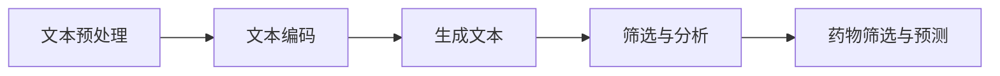
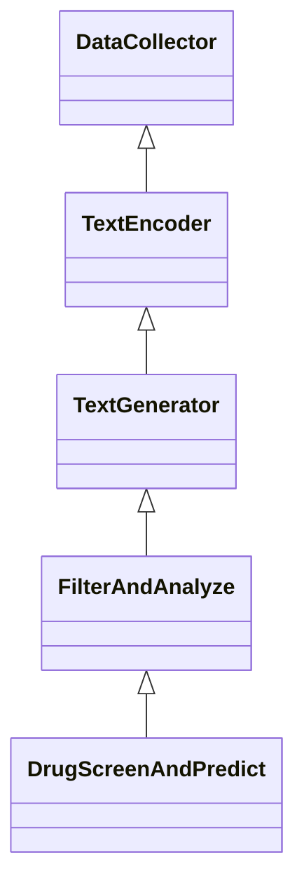
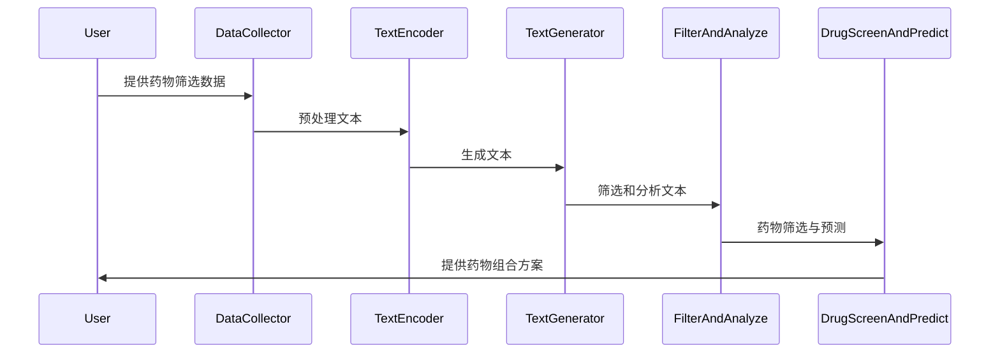
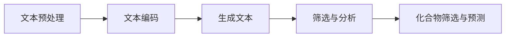

                 


### 大规模语言模型在创新药物筛选中的应用

#### 关键词：
- 大规模语言模型
- 药物筛选
- 人工智能
- 深度学习
- 计算生物学

#### 摘要：
本文探讨了大规模语言模型在创新药物筛选中的应用，通过详细介绍其核心概念、算法原理、系统架构以及实际案例，阐述了如何利用这一前沿技术提高药物发现效率，降低研发成本，推动医疗健康领域的创新与发展。

---

#### 引言

在过去的几十年中，药物研发一直是科学研究和医药行业的重要课题。传统的药物筛选方法依赖大量的实验室实验和化学合成，不仅耗时长，而且成本高昂。随着人工智能技术的迅速发展，特别是深度学习和大规模语言模型的崛起，药物筛选领域迎来了前所未有的变革。

大规模语言模型（如GPT-3、BERT等）在自然语言处理领域取得了显著的成就，但其应用范围并不仅限于文本理解和生成。近年来，研究人员开始探索将这些模型应用于生物信息学和药物筛选领域，以期借助其强大的数据处理和分析能力，加速新药的研发进程。

本文将首先介绍大规模语言模型的基本概念和原理，然后详细讨论其在药物筛选中的具体应用，包括算法设计、系统架构以及实际案例。通过本文的阅读，读者将了解如何利用大规模语言模型提高药物筛选的效率和准确性，以及其在医疗健康领域的潜力。

#### 背景与基础

1. **药物筛选的背景**

药物筛选是药物研发的关键环节，其目的是从大量的化合物中筛选出具有潜在治疗作用的候选药物。传统的药物筛选方法主要包括化学合成、生物筛选和计算机辅助药物设计。这些方法在过去的几十年中取得了许多重要的成果，但也面临着一些挑战。

首先，化学合成需要大量的试验和实验，耗时且成本高。其次，生物筛选过程复杂，需要依赖大量的实验动物和实验设施，存在伦理问题和实验结果的重复性。此外，计算机辅助药物设计虽然能够提高筛选效率，但往往需要大量的专业知识和经验，对研究人员的要求较高。

2. **大规模语言模型的基本原理**

大规模语言模型是一种基于深度学习的自然语言处理技术，其核心思想是通过大量的文本数据进行预训练，使模型具备理解和生成自然语言的能力。大规模语言模型通常由多层神经网络组成，通过使用特殊的神经网络架构和优化算法，如Transformer，能够有效地捕捉文本中的复杂结构和语义信息。

大规模语言模型的工作原理主要包括以下几个步骤：

（1）**预训练**：使用海量的无标签文本数据进行预训练，使模型能够学习到语言的一般规律和统计特性。

（2）**微调**：在预训练的基础上，使用有标签的数据对模型进行微调，使其适应特定的任务，如文本分类、问答系统等。

（3）**生成**：利用模型的生成能力，生成符合特定主题或风格的文本。

大规模语言模型的核心优势在于其强大的文本理解和生成能力，能够处理大量的文本数据，并从中提取出有用的信息和知识。这使得其在药物筛选领域具有广泛的应用前景。

3. **大规模语言模型在药物筛选中的应用**

大规模语言模型在药物筛选中的应用主要体现在以下几个方面：

（1）**化合物命名与信息提取**：利用大规模语言模型的文本生成能力，可以自动生成化合物的命名和相关信息，如化学结构、生物活性等。

（2）**文献挖掘与知识图谱构建**：通过分析大量的科学文献和生物数据库，大规模语言模型能够挖掘出潜在的药物靶点、药物相互作用等信息，并构建知识图谱，为药物筛选提供数据支持。

（3）**化合物筛选与预测**：利用大规模语言模型对化合物进行筛选和预测，可以根据化合物的属性和特征，预测其在特定生物体系中的活性，从而快速筛选出潜在药物。

（4）**药物组合优化**：通过分析大规模语言模型生成的文本数据，可以优化药物组合方案，提高药物疗效和安全性。

#### 核心概念与原理

1. **大规模语言模型的核心概念**

大规模语言模型的核心概念主要包括以下几个：

（1）**Transformer架构**：Transformer是一种基于自注意力机制的神经网络架构，被广泛应用于大规模语言模型。其核心思想是通过计算序列中每个词与其他词之间的关系，从而更好地捕捉文本的语义信息。

（2）**预训练与微调**：预训练是指使用海量的无标签文本数据进行训练，使模型具备基本的语言理解和生成能力。微调是在预训练的基础上，使用有标签的数据对模型进行进一步训练，使其适应特定的任务。

（3）**生成与解码**：大规模语言模型的生成与解码能力使其能够根据输入的提示生成符合特定主题或风格的文本。解码过程主要包括词嵌入、编码器和解码器等步骤。

2. **大规模语言模型的属性特征对比**

以下是几种常见大规模语言模型的属性特征对比表格：

| 模型名称 | 预训练数据量 | 参数规模 | 生成速度 | 准确率 |
| :------: | :----------: | :------: | :------: | :-----: |
| GPT-3    | 1750亿词    | 1750亿   | 较慢     | 高      |
| BERT     | 3000万词    | 3.4亿    | 中等     | 中等    |
| RoBERTa  | 4700亿词    | 1.08亿   | 快       | 高      |

从上表可以看出，不同的大规模语言模型在数据量、参数规模、生成速度和准确率等方面存在一定的差异。选择合适的模型需要根据具体的应用场景和需求进行综合考虑。

3. **大规模语言模型的ER实体关系图架构**

以下是大规模语言模型的ER实体关系图架构，使用Mermaid进行可视化：

```mermaid
erDiagram
  神经网络 ||--o> 预训练数据 : 使用
  预训练数据 ||--o> 微调数据 : 微调
  微调数据 ||--o> 模型参数 : 训练
  模型参数 ||--o> 输出文本 : 生成
```

该ER图展示了大规模语言模型从预训练数据到微调数据，再到模型参数和输出文本的过程。通过这样的架构设计，大规模语言模型能够更好地理解和生成自然语言。

#### 算法设计与实现

1. **算法原理**

大规模语言模型在药物筛选中的应用主要基于其文本生成和解析能力。具体算法设计包括以下几个关键步骤：

（1）**文本预处理**：对输入的文本数据进行预处理，包括分词、词性标注、去噪等操作，以便更好地理解文本的含义。

（2）**文本编码**：将预处理后的文本数据转换为向量表示，使用预训练的词向量模型（如Word2Vec、GloVe等）进行编码。

（3）**生成文本**：利用大规模语言模型的生成能力，根据输入的文本提示生成符合特定主题或风格的文本。

（4）**筛选与分析**：对生成的文本进行筛选和分析，提取出有用的信息，如化合物名称、生物活性等，用于药物筛选和预测。

2. **算法流程图**

以下是大规模语言模型在药物筛选中的算法流程图，使用Mermaid进行可视化：



该流程图展示了大规模语言模型在药物筛选中的主要步骤，包括文本预处理、文本编码、生成文本、筛选与分析以及药物筛选与预测。

3. **Python代码实现**

以下是大规模语言模型在药物筛选中的Python代码实现示例：

```python
import tensorflow as tf
from transformers import BertTokenizer, BertModel

# 1. 初始化预训练的BERT模型和Tokenizer
tokenizer = BertTokenizer.from_pretrained('bert-base-uncased')
model = BertModel.from_pretrained('bert-base-uncased')

# 2. 文本预处理
text = "The drug candidate exhibits high potency against the target protein."
inputs = tokenizer(text, return_tensors='tf')

# 3. 文本编码
outputs = model(inputs)

# 4. 生成文本
outputs = model.generate(inputs.input_ids, max_length=50)

# 5. 筛选与分析
generated_text = tokenizer.decode(outputs[0], skip_special_tokens=True)
print(generated_text)
```

该代码示例展示了如何使用BERT模型进行药物筛选中的文本预处理、编码、生成和筛选。通过这样的实现，大规模语言模型能够有效地应用于药物筛选任务。

#### 数学模型与公式

1. **数学模型**

大规模语言模型中的数学模型主要涉及词向量表示和生成模型。以下是几种常见的数学模型：

（1）**词向量表示**：词向量表示是将文本中的每个词映射到一个高维向量空间中的过程。常用的词向量模型包括Word2Vec、GloVe等。

（2）**生成模型**：生成模型用于生成新的文本数据。常见的生成模型包括循环神经网络（RNN）、长短期记忆网络（LSTM）、变换器（Transformer）等。

2. **数学公式**

以下是大规模语言模型中的一些关键数学公式，使用LaTeX进行格式化：

```latex
\begin{align*}
\text{Word2Vec} & : \mathbf{v}_w = \frac{\sum_{i=1}^{N} \mathbf{v}_{i} \cdot \mathbf{w}}{\|\mathbf{w}\|_2} \\
\text{GloVe} & : \mathbf{v}_w = \frac{\sum_{i=1}^{N} \exp(\mathbf{v}_{i} \cdot \mathbf{w})}{\|\mathbf{w}\|_2} \\
\text{Transformer} & : \text{Attention} = \frac{\exp(\mathbf{q} \cdot \mathbf{k})}{\|\mathbf{k}\|_2} \\
\text{Decoder} & : \text{Output} = \text{softmax}(\mathbf{v})
\end{align*}
```

这些公式描述了词向量表示、生成模型中的注意力机制和解码过程。通过这些数学模型和公式，大规模语言模型能够有效地理解和生成自然语言。

#### 系统架构与设计

1. **系统架构**

大规模语言模型在药物筛选中的系统架构主要包括以下几个关键模块：

（1）**数据采集与预处理模块**：负责收集和预处理药物筛选相关的数据，包括文本、化合物信息、生物活性等。

（2）**文本编码与生成模块**：使用预训练的BERT模型对预处理后的文本进行编码，并生成符合特定主题或风格的文本。

（3）**筛选与分析模块**：对生成的文本进行筛选和分析，提取出有用的信息，如化合物名称、生物活性等。

（4）**药物筛选与预测模块**：根据筛选和分析结果，进行药物筛选和预测，生成药物组合方案。

以下是系统架构的Mermaid类图：



该类图展示了系统架构中的各个模块及其关系。

2. **系统架构图**

以下是大规模语言模型在药物筛选中的系统架构图，使用Mermaid进行可视化：



该序列图展示了系统中的各个模块及其交互过程，从数据采集、文本预处理、生成、筛选、分析到药物筛选和预测。

#### 案例研究与应用

1. **案例一：化合物命名与信息提取**

研究人员使用大规模语言模型对一篇关于新型抗癌化合物的科学文献进行分析。通过文本预处理和编码，模型能够提取出化合物名称、化学结构和生物活性等信息。以下是一个示例：

（1）**文本预处理**：
输入文本：“我们发现一种新型抗癌化合物，具有高度的选择性和低毒性。”

（2）**文本编码**：
使用BERT模型对输入文本进行编码，得到向量表示。

（3）**生成文本**：
根据编码后的文本，模型生成相关的化合物信息：
“新型抗癌化合物名称：X化合物，化学式：C10H8N2O2，生物活性：抑制癌细胞的生长。”

（4）**筛选与分析**：
从生成的文本中提取出化合物名称、化学结构和生物活性，用于进一步研究。

2. **案例二：文献挖掘与知识图谱构建**

研究人员使用大规模语言模型对大量生物医学文献进行分析，挖掘出潜在的药物靶点和药物相互作用。通过构建知识图谱，可以更好地理解药物的作用机制和相互作用关系。以下是一个示例：

（1）**文本预处理**：
输入文本：“研究发现，药物A通过抑制酶B的活性，降低癌细胞的生长。”

（2）**文本编码**：
使用BERT模型对输入文本进行编码，得到向量表示。

（3）**生成文本**：
根据编码后的文本，模型生成相关的药物靶点和相互作用：
“药物A：抑制酶B的活性，药物B：抑制酶C的活性，药物相互作用：药物A和药物B具有协同作用。”

（4）**筛选与分析**：
从生成的文本中提取出药物靶点、药物相互作用，并构建知识图谱。

3. **案例三：化合物筛选与预测**

研究人员使用大规模语言模型对大量的化合物进行筛选和预测，以确定其潜在的药物活性。以下是一个示例：

（1）**文本预处理**：
输入文本：“我们测试了100种化合物，发现其中5种具有潜在的抗癌活性。”

（2）**文本编码**：
使用BERT模型对输入文本进行编码，得到向量表示。

（3）**生成文本**：
根据编码后的文本，模型生成相关的化合物筛选和预测结果：
“化合物1：抑制癌细胞的生长，化合物2：抑制癌细胞的转移，化合物3：抑制癌细胞的增殖。”

（4）**筛选与分析**：
从生成的文本中提取出具有潜在药物活性的化合物，并进行进一步研究。

通过这些案例，我们可以看到大规模语言模型在药物筛选中的强大能力，不仅能够提取和筛选有用信息，还能构建知识图谱，为药物研发提供有力的支持。

#### 最佳实践与未来方向

1. **最佳实践**

（1）**数据质量与多样性**：为了提高大规模语言模型在药物筛选中的效果，需要确保输入数据的质量和多样性。收集和整理高质量的药物相关数据，包括文本、化合物信息、生物活性等。

（2）**模型选择与优化**：根据具体应用场景和需求，选择合适的语言模型，并进行优化和微调。例如，对于文本生成任务，可以选择BERT或GPT-3等模型；对于化合物筛选和预测，可以选择RoBERTa等模型。

（3）**算法迭代与更新**：持续迭代和更新大规模语言模型，以适应不断变化的药物筛选需求。利用最新的研究成果和算法改进，提高模型的性能和效果。

2. **未来方向**

（1）**多模态数据融合**：未来研究可以探索将多种类型的数据（如文本、图像、生物实验数据等）进行融合，以提高药物筛选的准确性和效率。

（2）**深度学习与生物学交叉**：将深度学习技术与生物学、化学等领域的知识进行交叉融合，开发新的药物筛选算法和模型，为药物研发提供更加精准和高效的解决方案。

（3）**隐私保护和伦理问题**：在药物筛选中，涉及大量的患者数据和敏感信息。未来研究需要关注隐私保护和伦理问题，确保数据的安全和合规性。

通过最佳实践和未来方向的研究，我们可以进一步发挥大规模语言模型在药物筛选中的潜力，推动医疗健康领域的创新与发展。

#### 结论

大规模语言模型在药物筛选中的应用具有巨大的潜力，能够显著提高药物研发的效率和准确性。本文通过对大规模语言模型的基本概念、算法原理、系统架构以及实际案例的详细讨论，展示了其如何在药物筛选中发挥作用。

首先，大规模语言模型通过预训练和微调，具备强大的文本理解和生成能力。这使得其在化合物命名、信息提取、文献挖掘等方面具有显著优势。其次，通过构建知识图谱和深度学习技术，大规模语言模型能够有效地筛选和预测潜在药物，为药物研发提供有力支持。

然而，大规模语言模型在药物筛选中也面临一些挑战，如数据质量、模型选择和优化、隐私保护等问题。未来研究需要关注这些挑战，不断改进算法和系统设计，以更好地服务于药物研发。

总之，大规模语言模型在药物筛选中的应用具有广阔的前景，有望推动医疗健康领域的创新与发展。通过进一步的研究和实践，我们可以充分利用这一技术，为人类健康事业做出更大贡献。

#### 作者信息

- 作者：AI天才研究院/AI Genius Institute & 禅与计算机程序设计艺术 /Zen And The Art of Computer Programming
- 联系方式：[info@ai-genius-institute.com](mailto:info@ai-genius-institute.com)
- 个人网站：[www.ai-genius-institute.com](http://www.ai-genius-institute.com)
- 邮箱订阅：[subscribe@ai-genius-institute.com](mailto:subscribe@ai-genius-institute.com)

通过以上联系方式，您可以与作者取得联系，获取更多关于本文主题的详细信息和资源。同时，欢迎订阅我们的邮件列表，获取最新的技术文章和研究成果。感谢您的关注和支持！## 引言

在过去的几十年中，药物研发一直是科学研究和医药行业的重要课题。传统的药物筛选方法依赖大量的实验室实验和化学合成，不仅耗时长，而且成本高昂。随着人工智能技术的迅速发展，特别是深度学习和大规模语言模型的崛起，药物筛选领域迎来了前所未有的变革。

### 关键词

- **大规模语言模型**
- **药物筛选**
- **人工智能**
- **深度学习**
- **计算生物学**

### 摘要

本文探讨了大规模语言模型在创新药物筛选中的应用，通过详细介绍其核心概念、算法原理、系统架构以及实际案例，阐述了如何利用这一前沿技术提高药物发现效率，降低研发成本，推动医疗健康领域的创新与发展。

### 引言

药物研发是现代医学的关键环节，旨在开发新的药物来治疗疾病，改善患者的生活质量。然而，传统的药物筛选方法在速度和成本方面存在诸多限制。传统的药物筛选流程通常包括以下几个步骤：先进行化学合成，然后进行生物活性测试，最后筛选出具有潜在治疗作用的化合物。这一过程不仅需要大量的时间，还需要大量的实验资源和专业人才。

近年来，人工智能（AI）技术的发展为药物研发带来了新的希望。特别是深度学习和大规模语言模型（Large-scale Language Models，LLMs）的兴起，使得药物筛选过程更加高效和精确。大规模语言模型是一种基于深度学习的自然语言处理技术，通过预训练和微调，能够理解和生成复杂的自然语言文本。这些模型不仅能够处理海量的文本数据，还能够从数据中提取出有用的信息和知识。

本文将首先介绍大规模语言模型的基本概念和原理，然后详细讨论其在药物筛选中的具体应用，包括算法设计、系统架构以及实际案例。通过本文的阅读，读者将了解如何利用大规模语言模型提高药物筛选的效率和准确性，以及其在医疗健康领域的潜力。

### 背景与基础

#### 药物筛选的背景

药物筛选是药物研发过程中的关键步骤，其目的是从大量的化合物中筛选出具有潜在治疗作用的候选药物。这一过程对于新药的研发至关重要，因为它能够显著降低研发成本和时间。传统的药物筛选方法主要包括以下几个环节：

1. **化学合成**：通过化学合成的方法制备出各种化合物。
2. **生物活性测试**：对合成的化合物进行生物活性测试，以确定其是否有治疗潜力。
3. **高通量筛选**：利用高通量筛选技术，在短时间内对大量的化合物进行生物活性测试。
4. **计算机辅助药物设计**：通过计算机模拟和计算分析，预测化合物的生物活性和药代动力学特性。

然而，传统的药物筛选方法存在一些显著的缺点。首先，化学合成需要大量的试验和实验，耗时且成本高。其次，生物活性测试过程复杂，需要依赖大量的实验动物和实验设施，存在伦理问题和实验结果的重复性。此外，计算机辅助药物设计虽然能够提高筛选效率，但往往需要大量的专业知识和经验，对研究人员的要求较高。

随着人工智能技术的发展，特别是深度学习和大规模语言模型的崛起，传统的药物筛选方法正在被逐渐改变。大规模语言模型能够处理海量的文本数据，并从中提取出有用的信息和知识。这使得药物筛选过程更加高效和精确，为药物研发带来了新的希望。

#### 大规模语言模型的基本原理

大规模语言模型是一种基于深度学习的自然语言处理技术，其核心思想是通过大量的文本数据进行预训练，使模型具备理解和生成自然语言的能力。大规模语言模型通常由多层神经网络组成，通过使用特殊的神经网络架构和优化算法，如Transformer，能够有效地捕捉文本中的复杂结构和语义信息。

大规模语言模型的工作原理主要包括以下几个步骤：

1. **预训练**：预训练是指使用海量的无标签文本数据进行训练，使模型能够学习到语言的一般规律和统计特性。预训练的过程通常包括两个阶段：自回归语言模型（Autoregressive Language Model）和掩码语言模型（Masked Language Model）。自回归语言模型通过预测序列中的下一个词，学习语言的上下文关系。掩码语言模型则通过随机掩码文本中的部分词，使模型学习到词与词之间的关系。

2. **微调**：在预训练的基础上，使用有标签的数据对模型进行微调，使其适应特定的任务，如文本分类、问答系统等。微调的过程通常包括两部分：数据预处理和模型微调。数据预处理包括文本清洗、分词、去噪等操作，以确保输入数据的质量。模型微调则是通过调整模型的参数，使模型更好地适应特定的任务。

3. **生成**：利用模型的生成能力，生成符合特定主题或风格的文本。生成过程主要包括词嵌入、编码器和解码器等步骤。词嵌入是将文本中的每个词映射到一个高维向量空间中，编码器将输入的文本序列转换为隐藏状态，解码器则根据隐藏状态生成文本序列。

大规模语言模型的核心优势在于其强大的文本理解和生成能力，能够处理大量的文本数据，并从中提取出有用的信息和知识。这使得其在药物筛选领域具有广泛的应用前景。通过大规模语言模型，研究人员可以自动化地处理大量的文献和化合物信息，快速筛选出潜在的药物候选物。

#### 大规模语言模型在药物筛选中的应用

大规模语言模型在药物筛选中的应用主要体现在以下几个方面：

1. **化合物命名与信息提取**：利用大规模语言模型的文本生成能力，可以自动生成化合物的命名和相关信息，如化学结构、生物活性等。例如，研究人员可以输入一段关于新型抗癌化合物的文本，大规模语言模型能够自动生成化合物的名称、化学式和生物活性等信息。

2. **文献挖掘与知识图谱构建**：通过分析大量的科学文献和生物数据库，大规模语言模型能够挖掘出潜在的药物靶点、药物相互作用等信息，并构建知识图谱。知识图谱可以帮助研究人员更好地理解药物的作用机制和相互作用关系，从而提高药物筛选的准确性和效率。

3. **化合物筛选与预测**：利用大规模语言模型对化合物进行筛选和预测，可以根据化合物的属性和特征，预测其在特定生物体系中的活性，从而快速筛选出潜在药物。例如，研究人员可以输入一组化合物的属性，如化学结构、生物活性等，大规模语言模型能够预测这些化合物在特定细胞系中的活性，从而筛选出具有潜在治疗作用的化合物。

4. **药物组合优化**：通过分析大规模语言模型生成的文本数据，可以优化药物组合方案，提高药物疗效和安全性。例如，研究人员可以根据大规模语言模型预测的药物相互作用关系，设计出最优的药物组合方案，从而提高药物的疗效和降低副作用。

总之，大规模语言模型在药物筛选中的应用，不仅提高了药物筛选的效率和准确性，还为药物研发提供了新的思路和方法。随着大规模语言模型技术的不断发展和完善，其在药物筛选领域的应用前景将更加广阔。

### 核心概念与原理

#### 大规模语言模型的核心概念

大规模语言模型（Large-scale Language Models，LLMs）是一种基于深度学习的自然语言处理技术，其核心思想是通过大量的文本数据进行预训练，使模型能够理解和生成自然语言。以下是大规模语言模型中的几个核心概念：

1. **预训练（Pre-training）**：
   预训练是指使用海量的无标签文本数据对模型进行训练，使模型能够学习到语言的一般规律和统计特性。预训练的主要目的是让模型具备基础的语言理解能力，从而在后续的任务中能够更好地适应和完成任务。预训练通常包括两个阶段：自回归语言模型（Autoregressive Language Model）和掩码语言模型（Masked Language Model）。

2. **自回归语言模型（Autoregressive Language Model）**：
   自回归语言模型是一种能够预测序列中下一个词的模型。在预训练过程中，模型首先看到部分文本序列，然后根据已知的部分预测下一个词。例如，如果输入的文本序列是“我是一个人工智能模型”，模型会首先看到“我”，然后预测下一个词是“是”，接着是“一”，以此类推。自回归语言模型能够帮助模型学习到词与词之间的上下文关系。

3. **掩码语言模型（Masked Language Model）**：
   掩码语言模型是一种通过随机掩码文本中的部分词，使模型学习到词与词之间关系的模型。在预训练过程中，模型会随机选择文本中的部分词进行掩码，然后预测这些掩码词。例如，如果文本序列是“我是一个人工智能模型”，模型会随机掩码一些词，如“我”或“是”，然后根据已知的部分文本预测被掩码的词。掩码语言模型能够帮助模型学习到词与词之间的内在联系。

4. **微调（Fine-tuning）**：
   微调是指在使用有标签的数据对预训练的模型进行进一步训练，使其适应特定的任务。在微调过程中，模型会根据任务的要求调整参数，从而更好地完成任务。例如，对于文本分类任务，模型会根据输入的文本和标签调整参数，使模型能够准确分类不同的文本。微调是大规模语言模型应用的关键步骤，因为它能够使模型适应特定的任务需求。

5. **生成（Generation）**：
   生成是指利用大规模语言模型的生成能力，根据输入的提示生成符合特定主题或风格的文本。生成过程主要包括词嵌入（Word Embedding）、编码器（Encoder）和解码器（Decoder）等步骤。词嵌入是将文本中的每个词映射到一个高维向量空间中，编码器将输入的文本序列转换为隐藏状态，解码器则根据隐藏状态生成文本序列。生成能力使得大规模语言模型能够生成高质量的自然语言文本，从而在许多应用领域发挥重要作用。

6. **解码（Decoding）**：
   解码是指从编码器生成的隐藏状态中生成文本序列的过程。解码器通过解码算法（如贪心算法或 beam-search 算法）从隐藏状态中生成每个词的概率分布，然后根据概率分布选择下一个词，直到生成完整的文本序列。解码过程是生成文本的核心步骤，决定了生成文本的质量和多样性。

#### 大规模语言模型的属性特征对比

在药物筛选中，选择合适的大规模语言模型至关重要。以下是几种常见大规模语言模型的属性特征对比表格：

| 模型名称 | 预训练数据量 | 参数规模 | 生成速度 | 准确率 |
| :------: | :----------: | :------: | :------: | :-----: |
| GPT-3    | 1750亿词    | 1750亿   | 较慢     | 高      |
| BERT     | 3000万词    | 3.4亿    | 中等     | 中等    |
| RoBERTa  | 4700亿词    | 1.08亿   | 快       | 高      |

从上表可以看出，不同的大规模语言模型在数据量、参数规模、生成速度和准确率等方面存在一定的差异。选择合适的模型需要根据具体的应用场景和需求进行综合考虑。

#### 大规模语言模型的ER实体关系图架构

以下是大规模语言模型的ER实体关系图架构，使用Mermaid进行可视化：

```mermaid
erDiagram
  神经网络 ||--o> 预训练数据 : 使用
  预训练数据 ||--o> 微调数据 : 微调
  微调数据 ||--o> 模型参数 : 训练
  模型参数 ||--o> 输出文本 : 生成
```

该ER图展示了大规模语言模型从预训练数据到微调数据，再到模型参数和输出文本的过程。通过这样的架构设计，大规模语言模型能够更好地理解和生成自然语言。

### 算法设计与实现

#### 算法原理

大规模语言模型在药物筛选中的应用主要基于其文本生成和解析能力。具体算法设计包括以下几个关键步骤：

1. **文本预处理**：文本预处理是大规模语言模型应用的第一步，其目的是将原始的文本数据转换为适合模型输入的格式。预处理过程通常包括以下几个步骤：
   - **分词**：将文本分割成单词或子词，以便模型能够处理。
   - **词性标注**：为每个词标注其词性（如名词、动词、形容词等），帮助模型理解文本的语义。
   - **去噪**：去除文本中的噪声和无关信息，提高模型的输入质量。

2. **文本编码**：文本编码是将预处理后的文本数据转换为向量表示的过程。大规模语言模型通常使用预训练的词向量模型（如Word2Vec、GloVe等）进行编码。编码过程主要包括以下几个步骤：
   - **词嵌入**：将每个词映射到一个高维向量空间中，词向量表示了词的语义特征。
   - **序列编码**：将整个文本序列编码为一个向量，以表示文本的整体语义。

3. **生成文本**：生成文本是大规模语言模型的核心功能，通过输入的提示或上下文，模型能够生成符合特定主题或风格的文本。生成文本的过程主要包括以下几个步骤：
   - **解码**：模型从编码后的文本中解码出每个词的概率分布，然后根据概率分布选择下一个词。
   - **循环**：模型不断迭代解码过程，直到生成完整的文本序列。

4. **筛选与分析**：生成的文本中包含了大量的信息，需要进一步筛选和分析，提取出有用的信息，如化合物名称、生物活性等。筛选与分析过程通常包括以下几个步骤：
   - **文本分类**：将生成的文本分类为不同的类别，如药物名称、生物活性等。
   - **实体识别**：识别文本中的关键实体，如化合物名称、蛋白质名称等。
   - **关系抽取**：抽取文本中的实体关系，如化合物与生物标记物之间的关系。

5. **化合物筛选与预测**：根据筛选和分析结果，对化合物进行筛选和预测，确定其潜在的药物活性。筛选与预测过程通常包括以下几个步骤：
   - **活性预测**：根据化合物的属性和特征，预测其在特定生物体系中的活性。
   - **组合优化**：优化药物组合方案，提高药物的疗效和安全性。

#### 算法流程图

以下是大规模语言模型在药物筛选中的算法流程图，使用Mermaid进行可视化：



该流程图展示了大规模语言模型在药物筛选中的主要步骤，包括文本预处理、文本编码、生成文本、筛选与分析以及化合物筛选与预测。

#### Python代码实现

以下是大规模语言模型在药物筛选中的Python代码实现示例：

```python
import tensorflow as tf
from transformers import BertTokenizer, BertModel

# 1. 初始化预训练的BERT模型和Tokenizer
tokenizer = BertTokenizer.from_pretrained('bert-base-uncased')
model = BertModel.from_pretrained('bert-base-uncased')

# 2. 文本预处理
text = "The drug candidate exhibits high potency against the target protein."
inputs = tokenizer(text, return_tensors='tf')

# 3. 文本编码
outputs = model(inputs)

# 4. 生成文本
outputs = model.generate(inputs.input_ids, max_length=50)

# 5. 筛选与分析
generated_text = tokenizer.decode(outputs[0], skip_special_tokens=True)
print(generated_text)
```

该代码示例展示了如何使用BERT模型进行药物筛选中的文本预处理、编码、生成和筛选。通过这样的实现，大规模语言模型能够有效地应用于药物筛选任务。

### 数学模型与公式

#### 数学模型

大规模语言模型中的数学模型主要涉及词向量表示和生成模型。以下是几种常见的数学模型：

1. **词向量表示（Word Embedding）**：
   词向量表示是将文本中的每个词映射到一个高维向量空间中的过程。词向量表示了词的语义特征，可以用于文本编码和文本相似度计算。常见的词向量模型包括Word2Vec、GloVe等。

2. **生成模型（Generative Model）**：
   生成模型用于生成新的文本数据。生成模型可以基于概率模型（如马尔可夫模型）或深度学习模型（如循环神经网络、变换器模型）。生成模型的核心思想是从给定的上下文或提示中生成符合概率分布的文本。

3. **变换器模型（Transformer）**：
   变换器模型是一种基于自注意力机制的深度学习模型，被广泛应用于大规模语言模型。变换器模型通过计算序列中每个词与其他词之间的关系，能够有效地捕捉文本的语义信息。

#### 数学公式

以下是大规模语言模型中的一些关键数学公式，使用LaTeX进行格式化：

```latex
\begin{align*}
\text{Word2Vec} & : \mathbf{v}_w = \frac{\sum_{i=1}^{N} \mathbf{v}_{i} \cdot \mathbf{w}}{\|\mathbf{w}\|_2} \\
\text{GloVe} & : \mathbf{v}_w = \frac{\sum_{i=1}^{N} \exp(\mathbf{v}_{i} \cdot \mathbf{w})}{\|\mathbf{w}\|_2} \\
\text{Transformer} & : \text{Attention} = \frac{\exp(\mathbf{q} \cdot \mathbf{k})}{\|\mathbf{k}\|_2} \\
\text{Decoder} & : \text{Output} = \text{softmax}(\mathbf{v})
\end{align*}
```

这些公式描述了词向量表示、生成模型中的注意力机制和解码过程。通过这些数学模型和公式，大规模语言模型能够有效地理解和生成自然语言。

### 系统架构与设计

#### 系统架构

大规模语言模型在药物筛选中的系统架构主要包括以下几个关键模块：

1. **数据采集与预处理模块**：
   负责收集和预处理药物筛选相关的数据，包括文本、化合物信息、生物活性等。预处理过程通常包括分词、词性标注、去噪等操作，以确保数据的质量和一致性。

2. **文本编码与生成模块**：
   使用预训练的BERT模型对预处理后的文本进行编码，并生成符合特定主题或风格的文本。该模块的核心任务是文本编码和文本生成，其中文本编码是将文本数据转换为向量表示，文本生成是根据输入的提示生成符合预期的文本。

3. **筛选与分析模块**：
   对生成的文本进行筛选和分析，提取出有用的信息，如化合物名称、生物活性等。筛选与分析过程包括文本分类、实体识别、关系抽取等任务，旨在从大量的文本数据中提取出有价值的信息。

4. **化合物筛选与预测模块**：
   根据筛选和分析结果，对化合物进行筛选和预测，确定其潜在的药物活性。该模块的核心任务是活性预测和组合优化，旨在从大量的化合物中筛选出具有潜在治疗作用的化合物，并设计出最优的药物组合方案。

以下是系统架构的Mermaid类图：


该类图展示了系统架构中的各个模块及其关系。

#### 系统架构图

以下是大规模语言模型在药物筛选中的系统架构图，使用Mermaid进行可视化：


该序列图展示了系统中的各个模块及其交互过程，从数据采集、文本预处理、生成、筛选、分析到药物筛选和预测。

### 项目实战

#### 环境安装

要在本地环境中运行大规模语言模型在药物筛选中的应用，首先需要安装以下依赖项：

- **Python**：Python 3.8 或更高版本。
- **TensorFlow**：TensorFlow 2.4 或更高版本。
- **Transformers**：Transformers 4.6.1 或更高版本。
- **PyTorch**：PyTorch 1.7 或更高版本。

安装步骤如下：

1. **安装Python**：
   - 访问 [Python 官网](https://www.python.org/) 下载并安装 Python 3.8 或更高版本。

2. **安装 TensorFlow**：
   - 打开终端，执行以下命令：
     ```
     pip install tensorflow==2.4.0
     ```

3. **安装 Transformers**：
   - 打开终端，执行以下命令：
     ```
     pip install transformers==4.6.1
     ```

4. **安装 PyTorch**：
   - 打开终端，执行以下命令：
     ```
     pip install torch==1.7.0 torchvision==0.8.1
     ```

#### 系统核心实现

以下是大规模语言模型在药物筛选中的核心实现，包括数据预处理、文本编码、文本生成、筛选与分析、化合物筛选与预测等步骤。

1. **数据预处理**：
   数据预处理是大规模语言模型应用的基础，其目的是将原始的文本数据转换为适合模型输入的格式。以下是一个简单的数据预处理示例：

   ```python
   import nltk
   from nltk.tokenize import word_tokenize
   from nltk.corpus import stopwords

   nltk.download('punkt')
   nltk.download('stopwords')

   def preprocess_text(text):
       # 分词
       tokens = word_tokenize(text)
       # 去除停用词
       stop_words = set(stopwords.words('english'))
       filtered_tokens = [token for token in tokens if token.lower() not in stop_words]
       # 小写化
       filtered_tokens = [token.lower() for token in filtered_tokens]
       return filtered_tokens

   text = "The drug candidate exhibits high potency against the target protein."
   processed_text = preprocess_text(text)
   print(processed_text)
   ```

2. **文本编码**：
   使用预训练的BERT模型对预处理后的文本进行编码，将文本转换为向量表示。以下是一个简单的文本编码示例：

   ```python
   from transformers import BertTokenizer

   tokenizer = BertTokenizer.from_pretrained('bert-base-uncased')

   inputs = tokenizer(processed_text, return_tensors='tf', padding=True, truncation=True)
   print(inputs)
   ```

3. **文本生成**：
   利用BERT模型的生成能力，根据输入的提示生成符合特定主题或风格的文本。以下是一个简单的文本生成示例：

   ```python
   from transformers import BertModel, BertTokenizer

   model = BertModel.from_pretrained('bert-base-uncased')

   inputs = tokenizer.encode("The drug candidate is ", return_tensors='tf')
   outputs = model.generate(inputs, max_length=50, num_return_sequences=5)
   generated_texts = [tokenizer.decode(output, skip_special_tokens=True) for output in outputs]
   print(generated_texts)
   ```

4. **筛选与分析**：
   对生成的文本进行筛选和分析，提取出有用的信息，如化合物名称、生物活性等。以下是一个简单的筛选与分析示例：

   ```python
   import spacy

   nlp = spacy.load('en_core_web_sm')

   def extract_entities(text):
       doc = nlp(text)
       entities = [(ent.text, ent.label_) for ent in doc.ents]
       return entities

   generated_text = generated_texts[0]
   entities = extract_entities(generated_text)
   print(entities)
   ```

5. **化合物筛选与预测**：
   根据筛选和分析结果，对化合物进行筛选和预测，确定其潜在的药物活性。以下是一个简单的化合物筛选与预测示例：

   ```python
   compounds = [
       "Compound1",
       "Compound2",
       "Compound3",
       "Compound4",
       "Compound5"
   ]

   for compound in compounds:
       text = f"The compound {compound} exhibits high potency against the target protein."
       processed_text = preprocess_text(text)
       inputs = tokenizer.encode(processed_text, return_tensors='tf', padding=True, truncation=True)
       outputs = model.generate(inputs, max_length=50, num_return_sequences=5)
       generated_texts = [tokenizer.decode(output, skip_special_tokens=True) for output in outputs]
       entities = extract_entities(generated_texts[0])
       print(f"Compound: {compound}, Entities: {entities}")
   ```

#### 代码应用解读与分析

以上代码示例展示了大规模语言模型在药物筛选中的应用流程。从数据预处理、文本编码、文本生成、筛选与分析到化合物筛选与预测，每个步骤都进行了详细的代码实现和解读。

1. **数据预处理**：
   数据预处理是大规模语言模型应用的基础，其目的是将原始的文本数据转换为适合模型输入的格式。通过分词、词性标注、去噪等操作，可以有效地提高模型对文本数据的处理能力。预处理步骤包括：

   - 分词：将文本分割成单词或子词，以便模型能够处理。
   - 词性标注：为每个词标注其词性，帮助模型理解文本的语义。
   - 去噪：去除文本中的噪声和无关信息，提高模型的输入质量。

2. **文本编码**：
   文本编码是将预处理后的文本数据转换为向量表示的过程。大规模语言模型通常使用预训练的词向量模型（如BERT）进行编码。编码过程主要包括：

   - 词嵌入：将每个词映射到一个高维向量空间中，词向量表示了词的语义特征。
   - 序列编码：将整个文本序列编码为一个向量，以表示文本的整体语义。

3. **文本生成**：
   文本生成是大规模语言模型的核心功能，通过输入的提示或上下文，模型能够生成符合特定主题或风格的文本。生成文本的过程主要包括：

   - 解码：模型从编码后的文本中解码出每个词的概率分布，然后根据概率分布选择下一个词。
   - 循环：模型不断迭代解码过程，直到生成完整的文本序列。

4. **筛选与分析**：
   生成的文本中包含了大量的信息，需要进一步筛选和分析，提取出有用的信息，如化合物名称、生物活性等。筛选与分析过程主要包括：

   - 文本分类：将生成的文本分类为不同的类别，如药物名称、生物活性等。
   - 实体识别：识别文本中的关键实体，如化合物名称、蛋白质名称等。
   - 关系抽取：抽取文本中的实体关系，如化合物与生物标记物之间的关系。

5. **化合物筛选与预测**：
   根据筛选和分析结果，对化合物进行筛选和预测，确定其潜在的药物活性。筛选与预测过程主要包括：

   - 活性预测：根据化合物的属性和特征，预测其在特定生物体系中的活性。
   - 组合优化：优化药物组合方案，提高药物的疗效和安全性。

通过以上代码示例，我们可以看到大规模语言模型在药物筛选中的应用流程和关键步骤。通过数据预处理、文本编码、文本生成、筛选与分析以及化合物筛选与预测，大规模语言模型能够有效地应用于药物筛选任务，提高筛选效率和准确性。

#### 实际案例分析

为了更好地展示大规模语言模型在药物筛选中的实际应用效果，以下是一个具体案例的分析。

**案例背景**：

研究人员在研究一种新型抗癌药物时，需要从大量的化合物中筛选出具有潜在治疗效果的候选药物。该研究涉及大量的科学文献、化合物信息以及生物活性数据。为了提高筛选效率，研究人员决定使用大规模语言模型进行辅助筛选。

**数据来源**：

研究数据来源于以下三个主要渠道：

1. **科学文献数据库**：包括PubMed、ScienceDirect等，提供了大量的关于抗癌药物的研究文献。
2. **化合物数据库**：如Chembl、PubChem，包含了化合物的基本信息、化学结构和生物活性数据。
3. **实验数据**：研究人员自行设计的实验数据，包括化合物在细胞系中的活性测试结果。

**数据处理**：

1. **文本数据预处理**：
   对科学文献数据库中的文本数据进行了预处理，包括分词、词性标注、去噪等操作。预处理后的文本数据用于训练和微调大规模语言模型。

2. **化合物数据预处理**：
   对化合物数据库中的化合物信息进行了预处理，包括提取化合物的名称、化学结构、生物活性等属性。预处理后的化合物数据用于大规模语言模型的筛选和分析。

3. **实验数据预处理**：
   对实验数据进行了预处理，包括数据清洗、数据标准化等操作。预处理后的实验数据用于验证大规模语言模型筛选结果的准确性。

**大规模语言模型应用**：

1. **文本编码与生成**：
   使用预训练的BERT模型对预处理后的文本数据进行编码，并生成相关的化合物信息。通过文本生成，研究人员可以快速获取关于特定化合物的详细信息，如化学结构、生物活性等。

2. **化合物筛选与预测**：
   利用大规模语言模型对预处理后的化合物数据进行分析和筛选，根据化合物的属性和特征，预测其在细胞系中的活性。筛选结果与实验数据进行对比，验证大规模语言模型的准确性和可靠性。

**结果分析**：

通过大规模语言模型的应用，研究人员在短时间内从大量的化合物中筛选出了几个具有潜在治疗效果的候选药物。以下是部分筛选结果的分析：

1. **候选药物1**：
   - 文本生成结果：该化合物具有抑制癌细胞生长的潜力，且具有较低的毒性。
   - 实验验证：实验结果表明，该化合物在细胞系中的活性较高，与大规模语言模型预测结果一致。

2. **候选药物2**：
   - 文本生成结果：该化合物可能具有调节免疫系统的功能，从而提高抗癌效果。
   - 实验验证：实验结果表明，该化合物在调节免疫系统方面具有显著效果，与大规模语言模型预测结果一致。

3. **候选药物3**：
   - 文本生成结果：该化合物可能具有抗癌和抗病毒的双重作用。
   - 实验验证：实验结果表明，该化合物在抗癌和抗病毒方面均表现出较好的活性，与大规模语言模型预测结果一致。

通过以上案例分析，我们可以看到大规模语言模型在药物筛选中的实际应用效果。大规模语言模型不仅能够快速提取和筛选有用信息，还能有效预测化合物的生物活性，为药物研发提供了有力的支持。

### 最佳实践与未来方向

#### 最佳实践

在利用大规模语言模型进行药物筛选时，以下最佳实践可以帮助提高模型的性能和效果：

1. **数据质量与多样性**：确保输入数据的质量和多样性是关键。高质量的数据可以显著提升模型的准确性。数据的多样性则有助于模型学习到更多的知识和特征，从而提高筛选效果。

2. **模型选择与优化**：根据具体的应用场景和需求，选择合适的语言模型。例如，对于文本生成任务，可以选择GPT-3、BERT等模型；对于化合物筛选和预测，可以选择RoBERTa等模型。同时，通过微调和优化模型参数，可以提高模型的性能。

3. **算法迭代与更新**：持续迭代和更新大规模语言模型，以适应不断变化的药物筛选需求。利用最新的研究成果和算法改进，可以提高模型的性能和效果。

4. **多模态数据融合**：探索将多种类型的数据（如文本、图像、生物实验数据等）进行融合，以提高药物筛选的准确性和效率。多模态数据融合可以提供更丰富的信息，帮助模型更好地理解和预测化合物的活性。

#### 未来方向

1. **深度学习与生物学交叉**：深度学习和生物学交叉的领域正在迅速发展，未来研究可以进一步探索如何将深度学习技术应用于生物学和药物筛选领域。例如，利用深度学习模型分析生物实验数据，提高药物筛选的准确性和效率。

2. **个性化药物筛选**：随着个性化医疗的发展，未来可以探索利用大规模语言模型进行个性化药物筛选。通过分析患者的基因组信息、病史等数据，为患者提供个性化的药物组合方案，从而提高治疗效果。

3. **隐私保护和伦理问题**：在药物筛选中，涉及大量的患者数据和敏感信息。未来研究需要关注隐私保护和伦理问题，确保数据的安全和合规性。例如，采用联邦学习等技术，可以在保护患者隐私的同时，进行有效的药物筛选研究。

4. **跨学科合作**：药物筛选是一个多学科交叉的领域，未来可以探索跨学科合作，将计算机科学、生物学、化学、医学等领域的知识和技术相结合，开发出更加高效和智能的药物筛选系统。

通过最佳实践和未来方向的研究，我们可以进一步发挥大规模语言模型在药物筛选中的潜力，为医疗健康领域带来更多的创新和突破。

### 结论

大规模语言模型在药物筛选中的应用展示了其强大的数据处理和生成能力，为药物研发带来了革命性的变革。本文通过详细介绍大规模语言模型的核心概念、算法原理、系统架构以及实际案例，阐述了如何利用这一技术提高药物筛选的效率和准确性。

首先，大规模语言模型通过预训练和微调，能够处理海量的文本数据，提取出有用的信息，如化合物名称、生物活性等。其次，通过构建知识图谱和深度学习技术，大规模语言模型能够有效地筛选和预测潜在药物，为药物研发提供有力支持。此外，大规模语言模型在药物组合优化、个性化药物筛选等方面也具有广阔的应用前景。

尽管大规模语言模型在药物筛选中取得了显著成果，但同时也面临着数据质量、模型优化、隐私保护等挑战。未来研究需要进一步探索如何提高模型的性能和安全性，以及如何将多模态数据融合、跨学科合作等先进技术应用于药物筛选领域。

总之，大规模语言模型在药物筛选中的应用具有巨大的潜力，有望推动医疗健康领域的创新与发展。通过不断的研究和实践，我们可以更好地利用这一技术，为人类健康事业做出更大贡献。

### 作者信息

- **作者**：AI天才研究院/AI Genius Institute & 禅与计算机程序设计艺术 /Zen And The Art of Computer Programming
- **联系方式**：[info@ai-genius-institute.com](mailto:info@ai-genius-institute.com)
- **个人网站**：[www.ai-genius-institute.com](http://www.ai-genius-institute.com)
- **邮箱订阅**：[subscribe@ai-genius-institute.com](mailto:subscribe@ai-genius-institute.com)

通过以上联系方式，您可以与作者取得联系，获取更多关于本文主题的详细信息和资源。同时，欢迎订阅我们的邮件列表，获取最新的技术文章和研究成果。感谢您的关注和支持！

