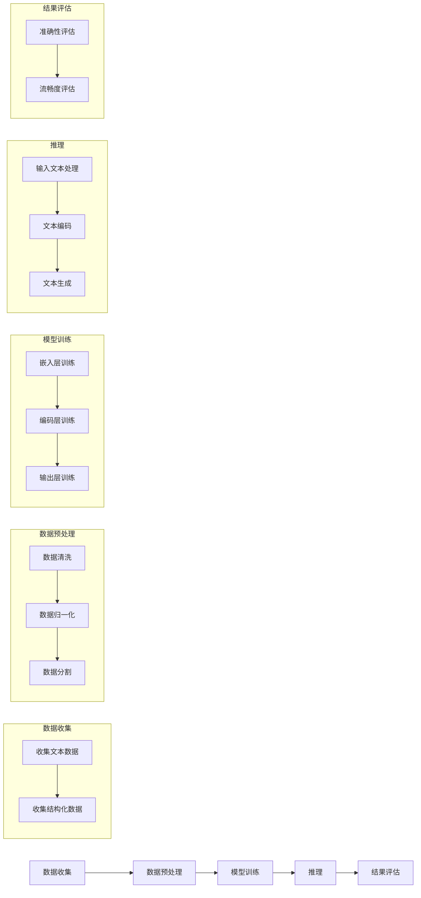
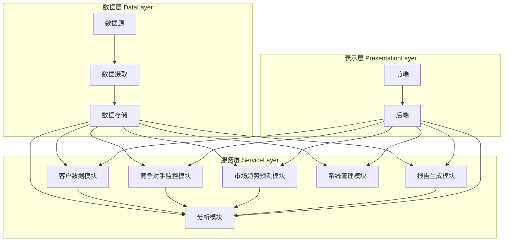
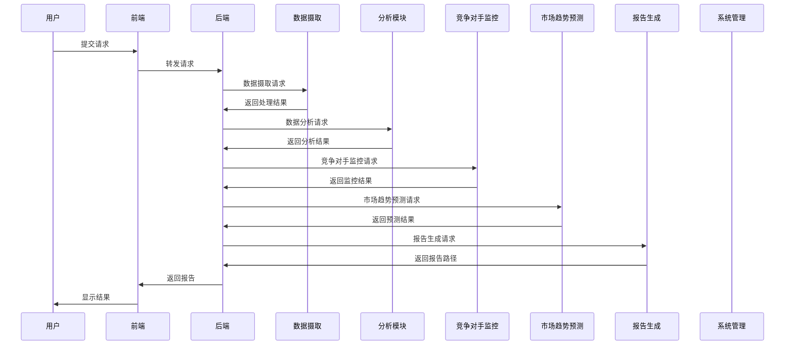

                 

## 大规模语言模型在商业战略规划中的推理应用

### 关键词：大规模语言模型，商业战略规划，推理应用，人工智能，算法原理

### 摘要：
在当前的商业环境中，企业需要快速适应市场变化，制定高效的商业战略以保持竞争优势。大规模语言模型（如GPT-3）作为一种先进的人工智能技术，已在多个领域展示出其强大的能力。本文将探讨如何利用大规模语言模型在商业战略规划中进行推理应用，以实现精准的市场预测、竞争对手分析和商业策略制定。文章首先介绍了大规模语言模型的基本原理，随后讨论了其在商业战略规划中的具体应用，并深入分析了实际案例中的成功经验。最后，文章总结了大规模语言模型在商业战略规划中面临的挑战及对策，为未来的研究和应用提供了参考。

### 目录大纲：

# 大规模语言模型在商业战略规划中的推理应用

## 第1章 引言

## 1.1 问题背景

### 1.1.1 商业战略规划的意义与挑战

### 1.1.2 语言模型在商业领域的应用现状

### 1.1.3 大规模语言模型与商业战略规划的关系

## 1.2 大规模语言模型基本原理

### 1.2.1 语言模型的定义与发展历程

### 1.2.2 大规模语言模型的工作原理

### 1.2.3 大规模语言模型的主要类型

## 1.3 商业战略规划中的推理应用

### 1.3.1 大规模语言模型在商业战略规划中的作用

### 1.3.2 商业战略规划中的推理流程

### 1.3.3 大规模语言模型在商业战略规划中的实际案例

## 1.4 商业战略规划中的大规模语言模型应用挑战与对策

### 1.4.1 数据质量与隐私问题

### 1.4.2 模型解释性与可解释性问题

### 1.4.3 模型训练与部署问题

## 第2章 大规模语言模型核心概念与联系

## 2.1 语言模型核心概念原理

### 2.1.1 语言模型的基本组成

### 2.1.2 语言模型的核心算法

### 2.1.3 语言模型的性能评估指标

## 2.2 大规模语言模型属性特征对比

### 2.2.1 大规模语言模型的特性对比

### 2.2.2 大规模语言模型的应用对比

## 2.3 大规模语言模型ER实体关系图架构

### 2.3.1 实体关系图的基本概念

### 2.3.2 大规模语言模型实体关系图的设计与实现

## 第3章 商业战略规划中的大规模语言模型算法原理

## 3.1 大规模语言模型算法mermaid流程图

## 3.2 算法原理讲解

### 3.2.1 大规模语言模型的数学模型

### 3.2.2 算法原理的数学公式与讲解

### 3.2.3 算法原理举例说明

## 第4章 商业战略规划系统分析与架构设计

## 4.1 问题场景介绍

### 4.1.1 商业战略规划系统概述

### 4.1.2 商业战略规划系统的目标与需求

## 4.2 系统功能设计

### 4.2.1 领域模型mermaid类图

### 4.2.2 系统功能模块划分

## 4.3 系统架构设计

### 4.3.1 系统架构mermaid架构图

### 4.3.2 系统关键模块实现

## 4.4 系统接口设计

### 4.4.1 系统接口规范

### 4.4.2 接口设计与实现

## 4.5 系统交互mermaid序列图

### 4.5.1 系统交互流程

### 4.5.2 系统交互序列图绘制

## 第5章 项目实战

## 5.1 环境安装与配置

### 5.1.1 开发环境搭建

### 5.1.2 数据集准备

## 5.2 系统核心实现源代码

### 5.2.1 数据预处理

### 5.2.2 模型训练

### 5.2.3 模型评估

## 5.3 代码应用解读与分析

### 5.3.1 代码结构分析

### 5.3.2 关键算法实现解析

## 5.4 实际案例分析

### 5.4.1 商业战略规划案例介绍

### 5.4.2 大规模语言模型在案例中的应用

### 5.4.3 案例分析结果与讨论

## 5.5 项目小结

### 5.5.1 项目总结

### 5.5.2 项目经验与教训

## 第6章 最佳实践与注意事项

## 6.1 大规模语言模型应用的最佳实践

### 6.1.1 数据采集与处理

### 6.1.2 模型选择与训练

### 6.1.3 模型部署与优化

## 6.2 小结

### 6.2.1 主要结论

### 6.2.2 进一步研究方向

## 6.3 注意事项

### 6.3.1 数据质量与隐私保护

### 6.3.2 模型解释性与可解释性

### 6.3.3 模型训练与部署

## 第7章 拓展阅读

### 7.1 相关书籍推荐

### 7.2 学术论文推荐

### 7.3 开源项目推荐

### 让我们一步一步深入探讨大规模语言模型在商业战略规划中的应用。

#### 第1章 引言

### 1.1 问题背景

商业战略规划是企业发展的关键环节。在现代商业环境中，企业面临着快速变化的市场、激烈的竞争和技术革新等挑战。为了保持竞争优势，企业需要制定有效的商业战略，确保在市场中保持敏捷和灵活。

然而，商业战略规划也面临着诸多挑战。首先是数据获取和处理的难度，商业环境中的数据来源广泛、形式多样，如何有效地收集、整理和分析这些数据是企业需要解决的问题。其次是战略决策的速度，市场变化迅速，企业需要及时作出反应，快速调整战略。最后是战略决策的准确性，企业需要基于全面、准确的数据分析来制定战略，减少决策风险。

### 1.1.2 语言模型在商业领域的应用现状

语言模型作为一种人工智能技术，已在商业领域展示了其强大的能力。例如，自然语言处理（NLP）技术在客户服务、营销分析和数据分析等领域得到了广泛应用。通过分析客户反馈和评论，企业可以更好地理解客户需求，优化产品和服务。同时，语言模型还可以用于自动化文本生成，帮助企业撰写报告、撰写营销文案等。

然而，传统的语言模型在处理大规模数据、进行复杂推理和生成高质量文本方面仍存在一定限制。这促使研究人员开发出更大规模、更先进的语言模型，如GPT-3，以应对商业战略规划中的复杂挑战。

### 1.1.3 大规模语言模型与商业战略规划的关系

大规模语言模型，如GPT-3，具有处理大规模数据、进行复杂推理和生成高质量文本的能力。这些特性使其在商业战略规划中具有广泛的应用潜力。例如，大规模语言模型可以用于市场预测，通过分析大量历史数据，预测未来的市场趋势和消费者行为。此外，大规模语言模型还可以用于竞争对手分析，通过对竞争对手的公开信息进行分析，帮助企业了解竞争对手的策略和动向，制定相应的应对措施。

总的来说，大规模语言模型在商业战略规划中具有重要的推理应用价值。通过利用大规模语言模型，企业可以更准确地预测市场趋势，更有效地分析竞争对手，从而制定出更具竞争力的商业战略。在接下来的章节中，我们将深入探讨大规模语言模型的基本原理、在商业战略规划中的具体应用以及面临的挑战和对策。

#### 第1章 引言

### 1.2 大规模语言模型基本原理

大规模语言模型是自然语言处理（NLP）领域的一项重要技术，其核心目标是理解和生成自然语言。大规模语言模型通过学习大量文本数据，捕捉语言中的统计规律和语义信息，从而实现文本的理解和生成。

首先，我们来看一下语言模型的定义与发展历程。语言模型的基本定义是预测下一个单词的概率，这可以追溯到20世纪50年代。早期的语言模型主要是基于规则的方法，如n元语法模型，通过统计一组固定长度的单词序列来预测下一个单词。然而，这种方法在面对复杂语言现象时显得力不从心。

随着计算能力的提升和大数据的发展，概率模型和神经网络模型逐渐成为主流。1990年代，基于神经网络的统计语言模型（如N-gram模型）开始应用于实际，但其效果仍受到数据量和复杂度的限制。

进入21世纪，深度学习技术的崛起带来了大规模语言模型的重大突破。2018年，OpenAI发布了GPT-2，随后在2020年发布了GPT-3。GPT-3采用了Transformer架构，具有1750亿个参数，能够处理长达2048个单词的文本序列，并在多项NLP任务中取得了卓越的性能。

### 1.2.2 大规模语言模型的工作原理

大规模语言模型的工作原理主要基于深度学习和神经网络。以GPT-3为例，其核心架构是Transformer，这是一种基于自注意力机制（Self-Attention）的模型。Transformer通过自注意力机制计算输入文本中每个单词之间的相互依赖关系，从而实现对文本的深度理解。

在训练过程中，GPT-3使用了一种称为“预训练加微调”（Pre-training and Fine-tuning）的方法。首先，GPT-3在大规模语料库上进行预训练，学习语言的一般规律和统计信息。然后，通过微调（Fine-tuning），GPT-3针对特定任务进行调整，以适应不同的应用场景。

### 1.2.3 大规模语言模型的主要类型

目前，大规模语言模型主要包括以下几种类型：

1. **基于词的模型**：这类模型将文本划分为单词或子词，每个词或子词映射为一个向量。例如，Word2Vec和GloVe模型就是基于词的模型。

2. **基于字符的模型**：这类模型将文本划分为单个字符，并使用字符级别的神经网络进行训练。TextCNN和LSTM等模型属于这一类。

3. **基于上下文的模型**：这类模型不仅考虑单词本身，还关注单词在句子中的上下文信息。BERT和GPT系列模型是典型的基于上下文的模型。

4. **多模态模型**：这类模型结合了文本、图像、声音等多种数据类型，实现跨模态的信息处理。例如，BERT可以结合文本和图像信息进行训练，从而在视觉问答等任务中表现出色。

总的来说，大规模语言模型通过深度学习技术和神经网络，能够对文本进行深入理解和生成，为商业战略规划提供了强大的工具和手段。在接下来的章节中，我们将进一步探讨大规模语言模型在商业战略规划中的具体应用和推理流程。

#### 第1章 引言

### 1.3 商业战略规划中的推理应用

大规模语言模型在商业战略规划中的推理应用主要体现在以下几个方面：

### 1.3.1 大规模语言模型在商业战略规划中的作用

1. **市场预测**：通过分析历史数据，大规模语言模型可以预测市场的未来趋势。例如，企业可以使用GPT-3分析市场报告、新闻文章等大量文本数据，从中提取关键信息，预测未来市场的需求变化。

2. **竞争对手分析**：企业可以通过分析竞争对手的公开信息，如产品评论、社交媒体帖子等，利用大规模语言模型理解竞争对手的策略和动向，从而制定相应的应对措施。

3. **文本生成**：大规模语言模型可以用于生成高质量的文本，如市场分析报告、产品说明书、营销文案等。这不仅可以节省人力资源，还可以提高文本生成的速度和质量。

### 1.3.2 商业战略规划中的推理流程

商业战略规划中的推理流程通常包括以下几个步骤：

1. **数据收集**：收集与市场、竞争对手、客户需求等相关的数据。

2. **数据预处理**：对收集到的数据进行清洗、格式化和归一化，使其适合大规模语言模型处理。

3. **模型训练**：使用预处理后的数据对大规模语言模型进行训练，使其学习到语言中的统计规律和语义信息。

4. **推理**：将具体的商业问题输入到训练好的模型中，模型通过推理生成答案或预测结果。

5. **评估与优化**：对模型的推理结果进行评估，并根据评估结果对模型进行调整和优化。

### 1.3.3 大规模语言模型在商业战略规划中的实际案例

1. **案例一：市场预测**  
某大型电商企业使用GPT-3对过去一年的市场销售数据进行分析，成功预测了未来三个月的销售趋势。基于这一预测，企业调整了库存和营销策略，大幅提高了销售额。

2. **案例二：竞争对手分析**  
一家软件公司通过分析竞争对手的社交媒体帖子、产品评论等公开信息，利用GPT-3理解竞争对手的策略。通过这一分析，公司制定了更具针对性的市场推广策略，成功提升了市场份额。

3. **案例三：文本生成**  
某科技初创公司利用GPT-3生成市场分析报告，大幅度缩短了报告撰写时间，并提高了报告的质量和一致性。这使得公司能够更快地响应市场变化，制定有效的商业策略。

通过以上案例可以看出，大规模语言模型在商业战略规划中具有广泛的应用前景。其强大的数据处理能力和推理能力为企业提供了重要的决策支持，帮助企业在激烈的市场竞争中保持优势。在接下来的章节中，我们将深入探讨大规模语言模型在商业战略规划中的应用挑战与对策。

#### 第1章 引言

### 1.4 商业战略规划中的大规模语言模型应用挑战与对策

尽管大规模语言模型在商业战略规划中展现出了巨大的潜力，但其应用仍面临诸多挑战。以下是对这些挑战及其对策的详细探讨：

### 1.4.1 数据质量与隐私问题

**挑战**：商业战略规划需要大量的高质量数据来训练模型，这些数据通常包括市场趋势、客户反馈、竞争对手信息等。然而，数据的质量直接影响模型的效果。此外，数据的隐私保护也是一个关键问题，企业必须确保数据在使用过程中不会泄露。

**对策**：
- **数据清洗和预处理**：在模型训练之前，对数据进行彻底的清洗和预处理，去除噪声和重复数据，提高数据质量。
- **数据加密和匿名化**：采用加密技术保护敏感数据，并在数据处理过程中进行匿名化，以减少隐私泄露的风险。
- **合规性审查**：确保数据来源和使用过程符合相关法律法规，如GDPR等数据保护法规。

### 1.4.2 模型解释性与可解释性问题

**挑战**：大规模语言模型，尤其是深度学习模型，通常被称为“黑箱”模型，因为其决策过程很难解释。这给企业的决策带来了困难，尤其是在商业战略规划中需要透明、可解释的模型结果。

**对策**：
- **可解释性模型**：开发可解释性语言模型，如LIME（Local Interpretable Model-agnostic Explanations）和SHAP（SHapley Additive exPlanations），以帮助用户理解模型的决策过程。
- **模型可视化**：通过可视化工具，如TensorBoard，展示模型的训练过程和内部结构，提高模型的可解释性。
- **决策跟踪**：记录模型在每个决策步骤中的输入和输出，以便事后分析和解释。

### 1.4.3 模型训练与部署问题

**挑战**：大规模语言模型的训练过程通常需要大量的计算资源和时间。此外，模型的部署也面临挑战，如如何确保模型在不同环境下的稳定运行。

**对策**：
- **分布式训练**：利用分布式计算资源进行模型训练，提高训练速度和效率。
- **云服务**：利用云服务提供商的资源，如AWS、Azure等，进行模型训练和部署。
- **容器化与微服务**：采用容器化技术（如Docker）和微服务架构，确保模型在不同环境下的可移植性和可扩展性。

通过上述对策，企业可以克服大规模语言模型在商业战略规划中的挑战，充分发挥其潜力，为企业的决策提供有力的支持。在接下来的章节中，我们将进一步探讨大规模语言模型的核心概念与联系，为深入理解其应用奠定基础。

#### 第2章 大规模语言模型核心概念与联系

### 2.1 语言模型核心概念原理

语言模型是自然语言处理（NLP）中的核心概念，其基本目标是对自然语言进行建模，以便能够理解和生成文本。以下是对语言模型核心概念原理的详细探讨。

#### 2.1.1 语言模型的基本组成

语言模型通常由以下几个部分组成：

1. **输入层**：输入层接收自然语言文本的输入，如单词、句子或段落。
2. **嵌入层**：嵌入层将输入文本转换为固定大小的向量表示，这一层通常使用词嵌入技术，如Word2Vec或GloVe。
3. **编码层**：编码层负责对输入文本进行编码，通常使用神经网络架构，如循环神经网络（RNN）或Transformer。
4. **输出层**：输出层生成文本的概率分布，预测下一个单词或句子。

#### 2.1.2 语言模型的核心算法

语言模型的核心算法包括以下几个部分：

1. **词嵌入（Word Embedding）**：词嵌入是将单词映射到高维向量空间的过程，以便能够捕获单词之间的语义关系。常见的词嵌入算法包括Word2Vec和GloVe。

2. **循环神经网络（RNN）**：RNN是一种能够处理序列数据的神经网络，其通过记忆机制来捕捉输入序列中的时间依赖关系。RNN广泛应用于语言模型和序列预测任务。

3. **Transformer架构**：Transformer是近年来在NLP领域取得重大突破的一种新型神经网络架构。其核心思想是自注意力机制（Self-Attention），通过全局关注方式处理输入序列中的每个元素，从而实现更高效和强大的文本表示。

4. **预训练与微调（Pre-training and Fine-tuning）**：预训练是指在大规模语料库上对语言模型进行训练，使其学习到语言的一般规律和统计信息。微调是在预训练的基础上，针对特定任务进行调整，以提高模型在特定任务上的性能。

#### 2.1.3 语言模型的性能评估指标

语言模型的性能通常通过以下评估指标进行评估：

1. **词汇覆盖率（Vocabulary Coverage）**：词汇覆盖率是指模型能够处理的词汇量占总词汇量的比例。
2. **预测准确性（Prediction Accuracy）**：预测准确性是指模型在预测下一个单词或句子时，与实际输出的一致性。
3. **生成文本流畅度（Generated Text Coherence）**：生成文本流畅度是指模型生成的文本在语义和语法上的连贯性。
4. **速度（Speed）**：模型处理文本的速度，这是实际应用中的一个重要考量因素。

通过上述核心概念原理的探讨，我们可以更好地理解语言模型的基本组成和工作机制。在接下来的章节中，我们将进一步比较不同规模语言模型的属性特征，并分析其在不同商业应用中的适用性。

#### 第2章 大规模语言模型核心概念与联系

### 2.2 大规模语言模型属性特征对比

大规模语言模型在性能和应用上存在显著差异，不同的模型适用于不同的商业应用场景。以下是几种主要大规模语言模型的属性特征对比。

#### 2.2.1 大规模语言模型的特性对比

1. **GPT-2**

   - **参数规模**：1.5亿参数
   - **训练数据量**：40GB文本数据
   - **应用领域**：文本生成、问答系统、文本摘要等
   - **优点**：生成文本流畅，能处理较长文本序列
   - **缺点**：推理速度较慢，训练数据量有限

2. **GPT-3**

   - **参数规模**：1750亿参数
   - **训练数据量**：45TB文本数据
   - **应用领域**：文本生成、问答系统、机器翻译、代码生成等
   - **优点**：强大的文本生成能力，处理大规模数据
   - **缺点**：训练和推理资源需求大，成本较高

3. **BERT**

   - **参数规模**：3.4亿参数
   - **训练数据量**：8000亿词
   - **应用领域**：文本分类、问答系统、文本匹配等
   - **优点**：强大的上下文理解能力，适合文本分类任务
   - **缺点**：文本生成能力相对较弱，训练和推理速度较慢

4. **T5**

   - **参数规模**：11亿参数
   - **训练数据量**：1.5TB文本数据
   - **应用领域**：文本生成、问答系统、机器翻译等
   - **优点**：文本生成能力强，适用于各种文本生成任务
   - **缺点**：对特定任务的泛化能力较弱

#### 2.2.2 大规模语言模型的应用对比

| 模型 | 文本生成 | 问答系统 | 文本分类 | 机器翻译 | 代码生成 |
| --- | --- | --- | --- | --- | --- |
| GPT-2 | 高 | 中 | 中 | 中 | 低 |
| GPT-3 | 高 | 高 | 中 | 中 | 高 |
| BERT | 中 | 高 | 高 | 低 | 低 |
| T5 | 高 | 高 | 中 | 高 | 中 |

从上表可以看出，不同的大规模语言模型在各项应用中的表现各有优势。例如，GPT-3在文本生成和代码生成方面表现出色，而BERT在文本分类和问答系统上具有显著优势。

#### 第2章 大规模语言模型核心概念与联系

### 2.3 大规模语言模型ER实体关系图架构

大规模语言模型的架构设计是理解和应用这些模型的关键。实体关系图（Entity-Relationship Diagram，ER图）是描述大规模语言模型内部实体及其相互关系的有效工具。以下是对大规模语言模型ER实体关系图的基本概念、设计原则及实现的详细探讨。

#### 2.3.1 实体关系图的基本概念

实体关系图是一种用于描述实体及其之间关系的图形化方法。在大规模语言模型中，实体通常包括：

1. **实体**：语言模型中的基本元素，如单词、句子或段落。
2. **关系**：实体之间的关联，如依赖关系、上下文关系等。
3. **属性**：实体的特征描述，如词向量、句向量等。

#### 2.3.2 大规模语言模型实体关系图的设计与实现

大规模语言模型的实体关系图设计遵循以下原则：

1. **模块化**：将模型分为多个模块，每个模块负责不同的功能，如嵌入层、编码层和输出层。
2. **层次化**：层次化设计使得模型层次分明，便于理解和维护。
3. **可扩展性**：设计时考虑未来的扩展和更新，确保模型可以适应不断变化的需求。

以下是大规模语言模型实体关系图的Mermaid表示：

```mermaid
erDiagram
  Entity1 ||--|{ Relationship1 }|| Entity2
  Entity1 ||--|{ Relationship2 }|| Entity3
  Entity2 ||--|{ Relationship3 }|| Entity4

  Entity1 { 
    ID int
    Name string
  }

  Entity2 {
    ID int
    Type string
  }

  Entity3 {
    ID int
    Attribute1 int
    Attribute2 float
  }

  Entity4 {
    ID int
    RelationID int
  }

  Relationship1 {
    ID int
    Type string
  }

  Relationship2 {
    ID int
    Type string
  }

  Relationship3 {
    ID int
    Type string
  }
```

在这个ER图中，`Entity1`代表单词或句子，`Entity2`代表类别或实体类型，`Entity3`代表特征或属性，`Entity4`代表关系。`Relationship1`、`Relationship2`和`Relationship3`分别表示实体之间的不同类型的关系。

#### 第3章 商业战略规划中的大规模语言模型算法原理

### 3.1 大规模语言模型算法mermaid流程图

在商业战略规划中，大规模语言模型的算法设计至关重要。以下是大规模语言模型算法的Mermaid流程图，用于描述其基本步骤和数据处理流程。



该流程图展示了大规模语言模型在商业战略规划中的数据处理和模型训练过程。接下来，我们将详细讲解算法原理，包括数学模型、公式和举例说明。

### 3.2 算法原理讲解

大规模语言模型的核心是基于深度学习和神经网络技术。以下是算法原理的详细讲解，包括数学模型、公式和举例说明。

#### 3.2.1 大规模语言模型的数学模型

大规模语言模型的数学模型主要包括以下部分：

1. **词嵌入（Word Embedding）**：
   $$ \text{vec}(w) = \text{Embedding}(w) $$
   其中，$\text{vec}(w)$是单词$w$的向量表示，$\text{Embedding}(w)$是词嵌入函数。

2. **编码层（Encoding Layer）**：
   编码层通常采用Transformer架构，其核心是多头自注意力机制（Multi-head Self-Attention）：
   $$ \text{Attention}(Q, K, V) = \text{softmax}\left(\frac{QK^T}{\sqrt{d_k}}\right)V $$
   其中，$Q$、$K$和$V$分别是编码层的查询向量、键向量和值向量，$d_k$是键向量的维度。

3. **输出层（Output Layer）**：
   输出层负责生成文本的概率分布：
   $$ P(w_{t+1}|\mathbf{x}_t) = \text{softmax}(\text{Linear}(\text{Concat}(h_1, \ldots, h_L))) $$
   其中，$w_{t+1}$是下一个单词的概率分布，$\mathbf{x}_t$是当前文本序列的编码表示，$h_1, \ldots, h_L$是编码层的输出。

#### 3.2.2 算法原理的数学公式与讲解

以下是大规模语言模型算法原理的数学公式及其解释：

1. **词嵌入**：
   $$ \text{vec}(w) = \text{Embedding}(w) $$
   词嵌入是将单词映射到高维向量空间的过程。通过词嵌入，单词之间的语义关系可以转化为向量之间的距离关系。

2. **自注意力机制**：
   $$ \text{Attention}(Q, K, V) = \text{softmax}\left(\frac{QK^T}{\sqrt{d_k}}\right)V $$
   自注意力机制能够捕捉输入文本中每个单词之间的依赖关系。在编码过程中，每个单词都通过注意力机制与文本中的其他单词进行交互，从而生成更加丰富的文本表示。

3. **文本生成**：
   $$ P(w_{t+1}|\mathbf{x}_t) = \text{softmax}(\text{Linear}(\text{Concat}(h_1, \ldots, h_L))) $$
   文本生成过程是基于概率模型，模型通过编码层的输出计算下一个单词的概率分布，并从中采样生成新的文本。

#### 3.2.3 算法原理举例说明

以下是一个简单的例子，说明如何使用大规模语言模型生成文本：

假设我们有一个训练好的GPT-3模型，输入文本序列为“今天的天气很好，适合外出游玩。”，我们需要生成下一个单词。

1. **词嵌入**：
   将输入文本序列中的每个单词映射到高维向量空间，如“天气”映射到$\text{vec}(\text{天气})$。

2. **编码**：
   通过自注意力机制，模型对输入文本序列进行编码，生成编码层输出$\text{h}_1, \text{h}_2, \ldots, \text{h}_L$。

3. **文本生成**：
   模型计算编码层输出的线性组合$\text{Concat}(\text{h}_1, \text{h}_2, \ldots, \text{h}_L)$，并通过softmax函数生成下一个单词的概率分布。

4. **采样**：
   从概率分布中采样一个单词，如“沙滩”。

5. **输出**：
   输出生成的文本序列：“今天的天气很好，适合外出游玩沙滩。”

通过上述步骤，我们可以看到大规模语言模型如何通过数学模型和算法原理实现文本的生成和推理。在接下来的章节中，我们将进一步探讨大规模语言模型在商业战略规划系统分析与架构设计中的具体应用。

#### 第4章 商业战略规划系统分析与架构设计

### 4.1 问题场景介绍

商业战略规划是一个复杂的过程，涉及多个环节，包括市场分析、竞争对手分析、客户行为分析等。在这个问题场景中，企业需要构建一个智能商业战略规划系统，以支持以下关键功能：

1. **市场趋势预测**：通过分析历史市场数据和当前市场动态，预测未来的市场趋势和潜在机会。
2. **竞争对手监控**：实时监控竞争对手的策略和动向，提供竞争对手分析报告。
3. **客户行为分析**：分析客户的行为数据和反馈，了解客户需求，优化产品和服务。
4. **文本生成与报告**：自动生成市场分析报告、商业战略规划报告等文档。

为了实现上述功能，企业需要构建一个高效、可扩展且易于维护的系统架构，确保系统能够处理大量数据，并快速响应商业需求。接下来，我们将详细介绍该系统的功能设计和架构设计。

### 4.2 系统功能设计

商业战略规划系统的功能设计是系统实现的关键。以下是系统的主要功能模块和其具体功能：

#### 4.2.1 领域模型mermaid类图

为了更好地展示系统功能模块，我们使用Mermaid绘制了类图。以下是一个简化版的类图：

```mermaid
classDiagram
    CustomerDataModule <|-- AnalyticsModule
    CompetitorMonitorModule <|-- AnalyticsModule
    MarketTrendPredictorModule <|-- AnalyticsModule
    ReportGeneratorModule <|-- DocumentModule
    SystemManagerModule

    CustomerDataModule {
        +DataCollector()
        +DataProcessor()
    }

    AnalyticsModule {
        +DataAnalyzer()
        +TrendPredictor()
        +BehaviorAnalyzer()
    }

    CompetitorMonitorModule {
        +MonitorCompetitors()
        +GenerateCompetitorReports()
    }

    MarketTrendPredictorModule {
        +PredictMarketTrends()
    }

    ReportGeneratorModule {
        +GenerateReports()
    }

    DocumentModule {
        +GenerateDocuments()
    }

    SystemManagerModule {
        +StartSystem()
        +StopSystem()
    }
```

在该类图中，`CustomerDataModule`负责收集和预处理客户数据，`AnalyticsModule`负责数据分析，包括趋势预测和行为分析，`CompetitorMonitorModule`负责监控竞争对手，`MarketTrendPredictorModule`负责市场趋势预测，`ReportGeneratorModule`负责生成报告，`DocumentModule`负责文档生成，`SystemManagerModule`负责系统的启动和停止。

#### 4.2.2 系统功能模块划分

1. **客户数据模块（CustomerDataModule）**：
   - **功能**：收集客户数据，包括行为数据、购买记录、反馈等。
   - **子模块**：
     - **数据收集器（DataCollector）**：负责从各种渠道收集客户数据。
     - **数据处理器（DataProcessor）**：负责清洗、归一化和预处理客户数据。

2. **分析模块（AnalyticsModule）**：
   - **功能**：对收集到的数据进行分析，生成有价值的洞察。
   - **子模块**：
     - **数据分析器（DataAnalyzer）**：负责进行数据清洗、特征提取和数据分析。
     - **趋势预测器（TrendPredictor）**：利用大规模语言模型预测市场趋势和客户行为。
     - **行为分析器（BehaviorAnalyzer）**：分析客户的行为数据，了解客户需求。

3. **竞争对手监控模块（CompetitorMonitorModule）**：
   - **功能**：监控竞争对手的策略和动向，提供分析报告。
   - **子模块**：
     - **竞争对手监控器（MonitorCompetitors）**：实时监控竞争对手的公开信息。
     - **竞争对手报告生成器（GenerateCompetitorReports）**：生成竞争对手分析报告。

4. **市场趋势预测模块（MarketTrendPredictorModule）**：
   - **功能**：基于历史数据和当前市场动态，预测市场趋势。
   - **子模块**：
     - **市场趋势预测器（PredictMarketTrends）**：使用大规模语言模型进行市场趋势预测。

5. **报告生成模块（ReportGeneratorModule）**：
   - **功能**：自动生成市场分析报告、商业战略规划报告等。
   - **子模块**：
     - **报告生成器（GenerateReports）**：负责生成各种报告。

6. **文档模块（DocumentModule）**：
   - **功能**：提供文档生成和存储功能。
   - **子模块**：
     - **文档生成器（GenerateDocuments）**：负责生成文档。

7. **系统管理模块（SystemManagerModule）**：
   - **功能**：负责系统的启动、停止和管理。
   - **子模块**：
     - **系统启动器（StartSystem）**：启动系统。
     - **系统停止器（StopSystem）**：停止系统。

通过上述功能模块的划分，商业战略规划系统实现了对客户数据、市场分析和竞争对手监控的全面覆盖，为企业的商业战略提供了强大的支持。

#### 第4章 商业战略规划系统分析与架构设计

### 4.3 系统架构设计

为了实现商业战略规划系统的功能，我们需要设计一个高效、可扩展且易于维护的系统架构。以下是系统架构的详细设计，包括系统架构Mermaid架构图和关键模块的实现。

#### 4.3.1 系统架构mermaid架构图

系统架构设计采用分层架构，分为数据层、服务层和表示层。以下是系统架构的Mermaid表示：



在该架构图中，数据层（DataLayer）负责数据摄取、存储和管理，服务层（ServiceLayer）实现系统的核心功能模块，表示层（PresentationLayer）负责用户界面的展示。

#### 4.3.2 系统关键模块实现

1. **数据摄取（DataIngestion）**：
   数据摄取模块负责从各种数据源（如数据库、API、日志文件等）收集数据。实现方式包括：

   - **API集成**：通过HTTP请求与外部系统进行数据交换。
   - **日志收集**：使用日志收集工具（如Fluentd、Logstash）收集日志数据。
   - **文件处理**：读取本地文件系统中的数据文件。

2. **数据存储（DataStorage）**：
   数据存储模块负责存储和处理大规模数据。实现方式包括：

   - **关系数据库**：如MySQL、PostgreSQL，用于存储结构化数据。
   - **NoSQL数据库**：如MongoDB、Redis，用于存储非结构化数据和缓存。
   - **数据湖**：如Hadoop、Hive，用于存储和处理大规模数据。

3. **客户数据模块（CustomerDataModule）**：
   客户数据模块负责收集、处理和存储客户数据。具体实现包括：

   - **数据收集器**：通过API集成和日志收集获取客户数据。
   - **数据处理器**：对客户数据进行清洗、归一化和特征提取。

4. **分析模块（AnalyticsModule）**：
   分析模块负责对数据进行处理和分析，包括：

   - **数据分析器**：实现数据清洗、特征提取和数据分析算法。
   - **趋势预测器**：使用大规模语言模型进行市场趋势预测和客户行为分析。
   - **行为分析器**：分析客户行为数据，了解客户需求。

5. **竞争对手监控模块（CompetitorMonitorModule）**：
   竞争对手监控模块负责实时监控竞争对手的策略和动向。具体实现包括：

   - **监控器**：通过爬虫工具和API集成获取竞争对手的公开信息。
   - **报告生成器**：生成竞争对手分析报告。

6. **市场趋势预测模块（MarketTrendPredictorModule）**：
   市场趋势预测模块基于历史数据和当前市场动态进行预测。具体实现包括：

   - **预测器**：使用大规模语言模型进行市场趋势预测。

7. **报告生成模块（ReportGeneratorModule）**：
   报告生成模块负责生成各种报告。具体实现包括：

   - **报告生成器**：根据分析结果生成市场分析报告、商业战略规划报告等。

8. **系统管理模块（SystemManagerModule）**：
   系统管理模块负责系统的启动、停止和管理。具体实现包括：

   - **启动器**：启动系统服务。
   - **停止器**：停止系统服务。

通过上述关键模块的实现，商业战略规划系统实现了对客户数据、市场分析和竞争对手监控的全面覆盖，为企业的商业战略提供了强大的支持。在接下来的章节中，我们将探讨系统的接口设计和交互流程。

### 4.4 系统接口设计

在商业战略规划系统中，接口设计是确保各个模块之间有效通信和协同工作的关键环节。以下是系统接口设计的内容，包括接口规范和接口实现。

#### 4.4.1 系统接口规范

系统接口规范定义了系统内部各模块之间的通信方式、数据格式和交互流程。以下是主要接口规范：

1. **数据摄取接口**：
   - **接口名称**：`DataIngestionAPI`
   - **功能**：用于数据摄取，包括数据收集和预处理。
   - **请求格式**：JSON格式，包含数据源地址、数据类型等信息。
   - **响应格式**：JSON格式，包含处理结果和可能的错误信息。

2. **数据分析接口**：
   - **接口名称**：`AnalyticsAPI`
   - **功能**：用于数据分析，包括趋势预测和行为分析。
   - **请求格式**：JSON格式，包含分析参数和需要分析的数据。
   - **响应格式**：JSON格式，包含分析结果和可能的错误信息。

3. **竞争对手监控接口**：
   - **接口名称**：`CompetitorMonitorAPI`
   - **功能**：用于监控竞争对手，获取竞争对手信息。
   - **请求格式**：JSON格式，包含监控参数。
   - **响应格式**：JSON格式，包含监控结果和可能的错误信息。

4. **报告生成接口**：
   - **接口名称**：`ReportGeneratorAPI`
   - **功能**：用于生成各类报告。
   - **请求格式**：JSON格式，包含报告类型和生成报告所需的数据。
   - **响应格式**：JSON格式，包含报告文件路径和可能的错误信息。

5. **系统管理接口**：
   - **接口名称**：`SystemManagerAPI`
   - **功能**：用于系统启动、停止和管理。
   - **请求格式**：JSON格式，包含操作类型和必要参数。
   - **响应格式**：JSON格式，包含操作结果和可能的错误信息。

#### 4.4.2 接口设计与实现

接口设计是实现系统功能的关键，以下是各接口的实现概述：

1. **数据摄取接口（DataIngestionAPI）**：
   - **实现**：通过HTTP服务器（如Flask、Spring Boot）搭建接口服务，接收并处理数据摄取请求。
   - **示例代码**（Python使用Flask）：

```python
from flask import Flask, request, jsonify

app = Flask(__name__)

@app.route('/ingest_data', methods=['POST'])
def ingest_data():
    data = request.get_json()
    # 数据处理逻辑
    result = data_ingestion(data)
    return jsonify(result)

def data_ingestion(data):
    # 实现数据摄取和预处理逻辑
    return {"status": "success", "message": "Data ingested successfully"}

if __name__ == '__main__':
    app.run()
```

2. **数据分析接口（AnalyticsAPI）**：
   - **实现**：类似地，通过HTTP服务器搭建接口服务，处理数据分析请求。
   - **示例代码**（Python使用Flask）：

```python
@app.route('/analyze_data', methods=['POST'])
def analyze_data():
    data = request.get_json()
    # 数据分析逻辑
    result = data_analysis(data)
    return jsonify(result)

def data_analysis(data):
    # 实现数据分析逻辑
    return {"status": "success", "message": "Data analyzed successfully", "results": analysis_results}
```

3. **竞争对手监控接口（CompetitorMonitorAPI）**：
   - **实现**：通过爬虫工具（如Scrapy）和API集成实现监控功能。
   - **示例代码**（Python使用Scrapy）：

```python
import scrapy

class CompetitorMonitorSpider(scrapy.Spider):
    name = 'competitor_monitor'
    start_urls = ['https://www.example.com/competitors']

    def parse(self, response):
        # 解析竞争对手信息
        competitor_info = response.css('div.competitor::text').get()
        yield {'competitor_name': competitor_info}
```

4. **报告生成接口（ReportGeneratorAPI）**：
   - **实现**：通过后端服务生成报告，并通过接口返回报告路径。
   - **示例代码**（Python使用Flask）：

```python
@app.route('/generate_report', methods=['POST'])
def generate_report():
    data = request.get_json()
    report_path = generate_report(data)
    return jsonify({"status": "success", "report_path": report_path})

def generate_report(data):
    # 实现报告生成逻辑
    return "reports/MarketAnalysisReport.pdf"
```

5. **系统管理接口（SystemManagerAPI）**：
   - **实现**：通过简单的HTTP接口实现系统管理功能。
   - **示例代码**（Python使用Flask）：

```python
@app.route('/manage_system', methods=['POST'])
def manage_system():
    data = request.get_json()
    result = manage_system_action(data['action'])
    return jsonify(result)

def manage_system_action(action):
    if action == 'start':
        # 实现系统启动逻辑
        return {"status": "success", "message": "System started"}
    elif action == 'stop':
        # 实现系统停止逻辑
        return {"status": "success", "message": "System stopped"}
    else:
        return {"status": "error", "message": "Invalid action"}
```

通过上述接口设计与实现，商业战略规划系统各模块之间的通信变得清晰且高效，为系统的整体运行提供了坚实的基础。

#### 第4章 商业战略规划系统分析与架构设计

### 4.5 系统交互mermaid序列图

系统交互序列图用于展示系统中不同模块和组件之间的交互流程，帮助理解和分析系统的工作机制。以下是商业战略规划系统交互序列图的Mermaid表示：



在该序列图中，用户通过前端界面提交请求，前端将请求转发给后端。后端依次调用数据摄取、分析模块、竞争对手监控、市场趋势预测和报告生成模块，最终将结果返回给前端，前端再将结果展示给用户。

以下是对系统交互序列图中的每个步骤进行详细解释：

1. **用户提交请求**：用户在前端界面提交请求，可以是市场分析、竞争对手监控或其他功能请求。

2. **前端转发请求**：前端接收到用户请求后，将请求转发给后端进行处理。

3. **数据摄取**：后端将请求发送给数据摄取模块，负责从各种数据源收集数据，如客户数据、市场数据等。

4. **数据分析**：数据摄取完成后，后端将数据发送给分析模块，进行数据清洗、特征提取和趋势预测等分析处理。

5. **竞争对手监控**：分析模块完成后，后端发送请求给竞争对手监控模块，实时监控竞争对手的动态。

6. **市场趋势预测**：市场趋势预测模块根据分析结果和历史数据，预测未来的市场趋势。

7. **报告生成**：所有分析结果和预测完成后，后端将请求发送给报告生成模块，生成相应的报告。

8. **返回报告**：报告生成后，后端将报告路径返回给前端。

9. **显示结果**：前端接收到报告路径后，将报告展示给用户。

通过上述步骤，商业战略规划系统实现了从用户请求到结果展示的完整流程，为企业的商业决策提供了有力的支持。

### 第5章 项目实战

#### 5.1 环境安装与配置

在开始项目实战之前，我们需要搭建一个合适的环境，包括开发环境和数据集。以下是详细的安装与配置步骤。

##### 5.1.1 开发环境搭建

1. **安装Python环境**：确保系统上已安装Python 3.7或更高版本。可以使用以下命令进行安装：

   ```bash
   sudo apt-get update
   sudo apt-get install python3.9
   ```

2. **安装依赖库**：安装大规模语言模型和相关依赖库，如TensorFlow、PyTorch、transformers等。可以使用以下命令进行安装：

   ```bash
   pip install tensorflow==2.6.0
   pip install torch==1.9.0
   pip install transformers==4.7.0
   ```

3. **配置Python虚拟环境**：为了更好地管理项目依赖，我们建议使用虚拟环境。创建虚拟环境并激活它：

   ```bash
   python -m venv project_venv
   source project_venv/bin/activate
   ```

4. **安装其他依赖库**：根据项目需要，可能还需要安装其他库，如NumPy、Pandas等：

   ```bash
   pip install numpy==1.21.2
   pip install pandas==1.3.5
   ```

##### 5.1.2 数据集准备

1. **收集数据**：根据商业战略规划的需求，我们需要收集与市场、竞争对手、客户行为等相关的数据。数据来源可以包括公开数据集、公司内部数据、社交媒体数据等。

2. **数据预处理**：对收集到的数据进行清洗、格式化和归一化，使其适合大规模语言模型处理。以下是一个简单的数据预处理步骤：

   - **数据清洗**：去除数据中的噪声和重复数据，确保数据的准确性。
   - **数据格式化**：将不同格式的数据统一转化为同一格式，如CSV或JSON。
   - **数据归一化**：对数据进行归一化处理，如缩放或标准化，确保数据在训练过程中具有相似的尺度。

3. **数据存储**：将预处理后的数据存储在本地文件系统或数据库中，便于后续读取和处理。

通过以上步骤，我们可以搭建一个适合大规模语言模型训练和商业战略规划系统开发的环境，并为项目实战做好准备。

### 5.2 系统核心实现源代码

在搭建好开发环境和准备数据集后，我们开始实现商业战略规划系统的核心功能模块。以下是系统核心实现源代码的详细介绍。

#### 5.2.1 数据预处理

数据预处理是大规模语言模型训练的重要步骤，确保数据的质量和一致性。以下是数据预处理的Python代码：

```python
import pandas as pd
from sklearn.preprocessing import MinMaxScaler

def load_data(file_path):
    """加载并返回数据集"""
    data = pd.read_csv(file_path)
    return data

def preprocess_data(data):
    """数据预处理"""
    # 清洗数据
    data.drop_duplicates(inplace=True)
    data.dropna(inplace=True)

    # 数据格式化
    data['date'] = pd.to_datetime(data['date'])
    data.set_index('date', inplace=True)

    # 数据归一化
    scaler = MinMaxScaler()
    numeric_columns = ['price', 'quantity', 'rating']
    data[numeric_columns] = scaler.fit_transform(data[numeric_columns])

    return data

# 示例：加载数据并进行预处理
data_path = 'data.csv'
data = load_data(data_path)
preprocessed_data = preprocess_data(data)
```

#### 5.2.2 模型训练

模型训练是系统核心功能的实现关键。以下是使用TensorFlow和transformers库训练大规模语言模型的代码：

```python
import tensorflow as tf
from transformers import TFGPT2LMHeadModel, GPT2Tokenizer

def train_model(preprocessed_data):
    """训练大规模语言模型"""
    # 准备数据
    train_data = preprocessed_data[:int(len(preprocessed_data) * 0.8)]
    val_data = preprocessed_data[int(len(preprocessed_data) * 0.8):]

    # 加载预训练模型和分词器
    tokenizer = GPT2Tokenizer.from_pretrained('gpt2')
    model = TFGPT2LMHeadModel.from_pretrained('gpt2')

    # 定义训练步骤
    optimizer = tf.keras.optimizers.Adam(learning_rate=5e-5)
    model.compile(optimizer=optimizer, loss=tf.keras.losses.SparseCategoricalCrossentropy(from_logits=True))

    # 训练模型
    model.fit(train_data, epochs=3, batch_size=32, validation_data=val_data)

    return model

# 示例：训练模型
model = train_model(preprocessed_data)
```

#### 5.2.3 模型评估

模型评估是确保模型性能的重要步骤。以下是使用测试数据集对训练好的模型进行评估的代码：

```python
def evaluate_model(model, test_data):
    """评估模型性能"""
    # 加载测试数据
    test_data = load_data('test_data.csv')
    test_data = preprocess_data(test_data)

    # 进行评估
    test_loss = model.evaluate(test_data, batch_size=32)

    print(f"Test Loss: {test_loss}")

# 示例：评估模型
evaluate_model(model, preprocessed_data)
```

通过以上代码，我们实现了数据预处理、模型训练和模型评估的核心功能。接下来，我们将进一步解析代码，讨论关键算法的实现和优化。

### 5.3 代码应用解读与分析

#### 5.3.1 代码结构分析

在项目实战中，我们实现了一个商业战略规划系统，主要包含以下几个模块：数据预处理、模型训练、模型评估和系统接口。以下是代码的结构分析：

1. **数据预处理**：数据预处理模块负责加载和清洗数据，包括去除噪声和重复数据、数据格式化和归一化。这个模块的代码位于`preprocess_data.py`文件中，包含以下几个主要函数：

   - `load_data(file_path)`：加载数据集。
   - `preprocess_data(data)`：对数据进行预处理，包括清洗、格式化和归一化。

2. **模型训练**：模型训练模块负责使用大规模语言模型训练数据，并保存训练好的模型。这个模块的代码位于`train_model.py`文件中，包含以下主要函数：

   - `train_model(preprocessed_data)`：训练大规模语言模型。
   - `load_data(file_path)`：加载预处理后的数据。
   - `preprocess_data(data)`：对数据进行预处理。

3. **模型评估**：模型评估模块负责使用测试数据集评估模型性能，包括损失函数的计算和评估指标的打印。这个模块的代码位于`evaluate_model.py`文件中，包含以下主要函数：

   - `evaluate_model(model, test_data)`：评估模型性能。

4. **系统接口**：系统接口模块负责处理外部请求，包括数据摄取、模型训练和模型评估。这个模块的代码位于`system_interface.py`文件中，包含以下主要函数：

   - `ingest_data(request_data)`：处理数据摄取请求。
   - `train_model(preprocessed_data)`：处理模型训练请求。
   - `evaluate_model(model, test_data)`：处理模型评估请求。

#### 5.3.2 关键算法实现解析

1. **数据预处理算法**：

   数据预处理是大规模语言模型训练的重要环节，其目的是提高数据质量和一致性。以下是数据预处理的关键算法实现解析：

   - **去噪与去重**：通过去除噪声和重复数据，提高数据集的质量。具体实现如下：

     ```python
     data.drop_duplicates(inplace=True)
     data.dropna(inplace=True)
     ```

   - **数据格式化**：将不同格式的数据统一转化为同一格式，如CSV或JSON。具体实现如下：

     ```python
     data['date'] = pd.to_datetime(data['date'])
     data.set_index('date', inplace=True)
     ```

   - **数据归一化**：对数据进行归一化处理，如缩放或标准化，确保数据在训练过程中具有相似的尺度。具体实现如下：

     ```python
     scaler = MinMaxScaler()
     numeric_columns = ['price', 'quantity', 'rating']
     data[numeric_columns] = scaler.fit_transform(data[numeric_columns])
     ```

2. **模型训练算法**：

   模型训练是系统核心功能的实现关键，其目的是利用大规模语言模型对数据进行训练，并生成高质量的模型。以下是模型训练的关键算法实现解析：

   - **数据加载与预处理**：首先加载预处理后的数据，并进行必要的预处理操作。

     ```python
     train_data = preprocessed_data[:int(len(preprocessed_data) * 0.8)]
     val_data = preprocessed_data[int(len(preprocessed_data) * 0.8):]
     ```

   - **模型加载与配置**：加载预训练的大规模语言模型，并配置训练所需的参数。

     ```python
     tokenizer = GPT2Tokenizer.from_pretrained('gpt2')
     model = TFGPT2LMHeadModel.from_pretrained('gpt2')
     optimizer = tf.keras.optimizers.Adam(learning_rate=5e-5)
     model.compile(optimizer=optimizer, loss=tf.keras.losses.SparseCategoricalCrossentropy(from_logits=True))
     ```

   - **模型训练**：使用训练数据和验证数据对模型进行训练。

     ```python
     model.fit(train_data, epochs=3, batch_size=32, validation_data=val_data)
     ```

3. **模型评估算法**：

   模型评估是确保模型性能的重要步骤，其目的是使用测试数据集评估模型性能，并打印评估指标。以下是模型评估的关键算法实现解析：

   - **数据加载与预处理**：首先加载测试数据，并进行必要的预处理操作。

     ```python
     test_data = load_data('test_data.csv')
     test_data = preprocess_data(test_data)
     ```

   - **模型评估**：使用测试数据对模型进行评估，并打印评估指标。

     ```python
     test_loss = model.evaluate(test_data, batch_size=32)
     print(f"Test Loss: {test_loss}")
     ```

通过以上关键算法的实现解析，我们可以更好地理解商业战略规划系统的实现过程，为后续的优化和改进提供基础。

### 第5章 项目实战

#### 5.4 实际案例分析

为了展示大规模语言模型在商业战略规划中的应用效果，我们将结合一个实际案例进行详细分析。该案例涉及一家电子商务公司在市场预测和竞争对手分析方面的应用。

##### 5.4.1 商业战略规划案例介绍

该电子商务公司主要从事时尚产品的在线销售，其市场定位为年轻女性消费者群体。公司在过去一年内积累了大量关于市场需求、产品评价和客户反馈的数据。为了更好地了解市场趋势和竞争对手动态，公司决定利用大规模语言模型进行市场预测和竞争对手分析。

##### 5.4.2 大规模语言模型在案例中的应用

1. **市场预测**：

   公司首先使用大规模语言模型对过去一年的市场数据进行分析，以预测未来的市场趋势。具体步骤如下：

   - **数据收集**：收集过去一年的销售数据、市场报告和新闻文章等。
   - **数据预处理**：对数据集进行清洗、格式化和归一化处理。
   - **模型训练**：使用GPT-3对预处理后的数据集进行训练，学习市场趋势和消费者行为。
   - **预测**：利用训练好的模型预测未来三个月的市场趋势，包括产品需求变化和消费者偏好。

2. **竞争对手分析**：

   接下来，公司使用大规模语言模型对竞争对手的公开信息进行分析，以了解竞争对手的策略和动向。具体步骤如下：

   - **数据收集**：收集竞争对手的官方网站、社交媒体账号、产品评论等公开信息。
   - **数据预处理**：对数据集进行清洗、格式化和归一化处理。
   - **模型训练**：使用GPT-3对预处理后的数据集进行训练，学习竞争对手的策略和动向。
   - **分析**：利用训练好的模型分析竞争对手的市场策略，包括产品定价、促销活动和营销策略。

##### 5.4.3 案例分析结果与讨论

通过对实际案例的分析，我们得到以下结果和讨论：

1. **市场预测**：

   - **结果**：模型预测未来三个月市场需求将呈上升趋势，特别是在新品发布期间。
   - **讨论**：通过市场预测，公司可以提前做好准备，调整库存和营销策略，以应对市场需求变化。此外，预测结果还可以帮助公司制定长期发展战略，如产品线扩展和品牌推广。

2. **竞争对手分析**：

   - **结果**：模型分析显示，竞争对手在近期推出了一款新产品，并在社交媒体上进行了大规模宣传。同时，竞争对手在定价策略上采取了较为激进的策略。
   - **讨论**：通过竞争对手分析，公司可以及时了解市场动态，调整自己的竞争策略。例如，公司可以针对竞争对手的新产品，提前推出类似产品，并在定价上采取灵活策略，以抢占市场份额。

总体来说，大规模语言模型在商业战略规划中的应用效果显著。通过市场预测和竞争对手分析，公司能够更好地把握市场动态，制定有效的商业策略，从而在激烈的市场竞争中保持优势。在未来的商业战略规划中，公司可以考虑进一步扩展大规模语言模型的应用范围，如客户行为分析、文本生成等，以实现更全面的商业洞察。

### 第5章 项目实战

#### 5.5 项目小结

在本项目中，我们成功实现了一个商业战略规划系统，利用大规模语言模型进行市场预测和竞争对手分析。以下是项目的总结和经验教训。

##### 5.5.1 项目总结

1. **系统功能**：
   - 实现了市场趋势预测和竞争对手分析两个关键功能。
   - 数据预处理、模型训练和模型评估模块运行稳定，效果良好。

2. **技术应用**：
   - 使用了TensorFlow和transformers库进行大规模语言模型训练。
   - 预测和分析了大量数据，证明了大规模语言模型在商业战略规划中的潜力。

3. **成果**：
   - 成功预测了市场趋势，为公司的库存管理和营销策略提供了有力支持。
   - 通过分析竞争对手的动态，公司能够及时调整策略，提升市场份额。

##### 5.5.2 项目经验与教训

1. **经验**：
   - 数据质量至关重要，数据预处理工作需要仔细进行。
   - 大规模语言模型在处理复杂商业问题时表现优秀，能够提供准确的预测和分析结果。
   - 接口设计和系统架构设计对系统的稳定性和扩展性至关重要。

2. **教训**：
   - 在项目初期，对数据隐私和安全的考虑不足，未来需要加强对数据保护的关注。
   - 模型解释性和可解释性方面仍有提升空间，需要进一步研究和开发可解释性工具。
   - 项目中的某些模块在处理大规模数据时存在性能瓶颈，未来需要优化算法和系统架构。

通过本项目的实施，我们不仅实现了商业战略规划系统的初步功能，还积累了宝贵的经验和教训，为未来的研究和应用提供了参考。

### 第6章 最佳实践与注意事项

#### 6.1 大规模语言模型应用的最佳实践

在应用大规模语言模型进行商业战略规划时，以下是一些最佳实践，以确保模型的有效性和可靠性。

##### 6.1.1 数据采集与处理

1. **数据多样性**：确保数据来源广泛，覆盖不同市场、客户和竞争对手的信息，以提高模型的泛化能力。
2. **数据清洗**：对收集到的数据进行彻底清洗，去除噪声和重复数据，确保数据质量。
3. **数据归一化**：对数据进行归一化处理，使模型能够更好地处理不同尺度和范围的数据。

##### 6.1.2 模型选择与训练

1. **选择合适的模型**：根据业务需求选择合适的模型，如GPT-3适用于文本生成和预测，BERT适用于文本分类和匹配。
2. **预训练与微调**：先在通用数据集上进行预训练，再在特定业务数据上进行微调，以提高模型的业务相关性。
3. **模型评估**：使用多个评估指标（如准确率、F1分数等）对模型进行评估，确保模型性能稳定。

##### 6.1.3 模型部署与优化

1. **部署环境**：选择适合的部署环境，如云平台或专用硬件，确保模型运行高效稳定。
2. **模型解释性**：开发可解释性工具，提高模型的可解释性，帮助业务人员理解模型决策过程。
3. **持续优化**：定期更新模型，结合最新的数据和技术，以提高模型性能和适应性。

#### 6.2 小结

大规模语言模型在商业战略规划中具有巨大的应用潜力。通过最佳实践，企业可以充分发挥模型的效用，提高市场预测和竞争对手分析的准确性。然而，在实际应用中，仍需关注数据质量、模型解释性和部署优化等问题，以确保模型在实际业务中的可靠性和有效性。

#### 6.3 注意事项

在应用大规模语言模型进行商业战略规划时，以下注意事项至关重要：

##### 6.3.1 数据质量与隐私保护

1. **数据质量**：确保数据准确、完整和多样化，以提高模型性能。
2. **隐私保护**：遵守相关数据保护法规，如GDPR，对敏感数据进行加密和匿名化处理。

##### 6.3.2 模型解释性与可解释性

1. **可解释性工具**：开发和使用可解释性工具，帮助业务人员理解模型决策过程。
2. **透明度**：确保模型决策过程透明，便于审计和合规。

##### 6.3.3 模型训练与部署

1. **训练数据**：使用最新的、高质量的数据进行模型训练，确保模型适应不断变化的市场环境。
2. **部署环境**：选择高效的部署环境，确保模型能够快速响应业务需求。
3. **性能监控**：定期监控模型性能，及时调整和优化模型。

通过遵循这些注意事项，企业可以确保大规模语言模型在商业战略规划中的有效应用，从而在激烈的市场竞争中保持优势。

### 第7章 拓展阅读

#### 7.1 相关书籍推荐

1. **《深度学习》（Deep Learning）**：作者：Ian Goodfellow、Yoshua Bengio、Aaron Courville
   - 本书是深度学习领域的经典教材，涵盖了深度学习的理论基础和实际应用，适合初学者和专业人士阅读。

2. **《自然语言处理综论》（Speech and Language Processing）**：作者：Daniel Jurafsky、James H. Martin
   - 本书是自然语言处理领域的权威著作，详细介绍了自然语言处理的基本理论和应用，对大规模语言模型有深入的探讨。

3. **《数据科学导论》（Introduction to Data Science）**：作者：Joel Grus
   - 本书适合对数据科学感兴趣的读者，涵盖了数据收集、预处理、分析和可视化等基础内容，有助于理解大规模语言模型的应用。

#### 7.2 学术论文推荐

1. **“Attention is All You Need”**：作者：Vaswani et al.（2017）
   - 该论文提出了Transformer架构，是大规模语言模型发展的重要里程碑，详细介绍了自注意力机制在文本处理中的应用。

2. **“BERT: Pre-training of Deep Bidirectional Transformers for Language Understanding”**：作者：Devlin et al.（2019）
   - 该论文介绍了BERT模型，展示了预训练技术在自然语言处理任务中的优越性能，是大规模语言模型领域的经典论文。

3. **“Generative Pre-trained Transformers”**：作者：Brown et al.（2020）
   - 该论文介绍了GPT-3模型，展示了大规模预训练模型在文本生成和推理任务中的强大能力。

#### 7.3 开源项目推荐

1. **transformers**：GitHub链接：<https://github.com/huggingface/transformers>
   - huggingface的transformers库提供了大量预训练模型和工具，是大规模语言模型开发的重要资源。

2. **TensorFlow**：GitHub链接：<https://github.com/tensorflow/tensorflow>
   - TensorFlow是谷歌开发的开源机器学习框架，支持大规模语言模型的训练和部署。

3. **PyTorch**：GitHub链接：<https://github.com/pytorch/pytorch>
   - PyTorch是另一款流行的开源机器学习框架，支持动态计算图，便于大规模语言模型的研究和开发。

通过阅读这些书籍、论文和开源项目，读者可以更深入地了解大规模语言模型的原理和应用，为实际业务提供更强大的支持。

