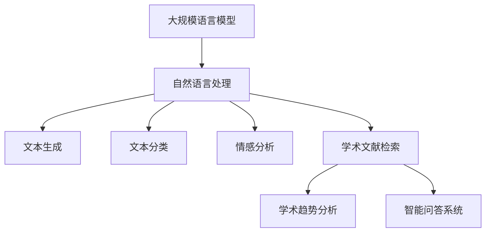
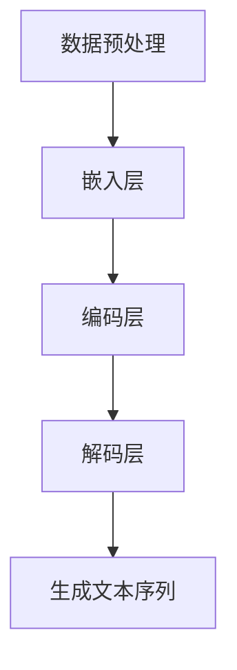
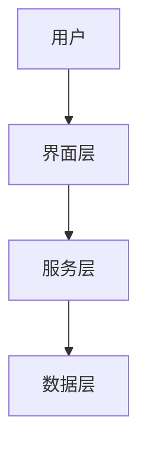

                 


# 大规模语言模型在学术前沿趋势预测中的应用

## 关键词

- 大规模语言模型
- 学术前沿趋势预测
- 自然语言处理
- 神经网络
- 应用案例分析

## 摘要

随着大数据和人工智能技术的快速发展，大规模语言模型（Large Language Models，LLMs）在自然语言处理（Natural Language Processing，NLP）领域取得了显著成果。本文旨在探讨大规模语言模型在学术前沿趋势预测中的应用，通过逻辑清晰的分析，介绍大规模语言模型的基本原理、算法流程、系统架构，并结合实际案例展示其在学术研究中的价值。文章还将讨论最佳实践和未来研究方向，为相关领域的研究者和实践者提供参考。

## 目录

1. 引言与背景
   1.1 大规模语言模型简介
   1.2 问题背景与核心概念
   1.3 本书结构安排

2. 核心概念与联系
   2.1 大规模语言模型原理
   2.2 特点与优势
   2.3 应用领域
   2.4 概念联系图

3. 算法原理讲解
   3.1 语言模型的数学模型
   3.2 计算流程
   3.3 算法流程图
   3.4 Python源代码示例

4. 系统分析与架构设计方案
   4.1 应用场景
   4.2 系统功能设计
   4.3 系统架构设计
   4.4 系统接口设计
   4.5 系统交互设计

5. 项目实战
   5.1 环境安装
   5.2 系统核心实现
   5.3 代码应用解读与分析
   5.4 实际案例分析
   5.5 项目总结

6. 最佳实践与拓展
   6.1 最佳实践
   6.2 注意事项
   6.3 拓展阅读

7. 总结
   7.1 关键点回顾
   7.2 未来发展趋势
   7.3 研究方向与建议

## 1. 引言与背景

### 1.1 大规模语言模型简介

大规模语言模型是一种利用机器学习技术，通过对海量文本数据进行训练，从而实现自然语言理解和生成的人工智能模型。这些模型通过捕捉语言中的统计规律和语义信息，能够进行文本分类、情感分析、机器翻译、问答系统等任务。大规模语言模型的出现，极大地推动了自然语言处理（NLP）领域的发展。

近年来，随着深度学习和计算资源的提升，大规模语言模型在学术研究中的应用越来越广泛。它们不仅能够帮助研究人员从海量文献中快速提取有价值的信息，还能够通过分析文献中的关键词、引用关系等，预测学术领域的未来趋势。

### 1.2 问题背景与核心概念

随着互联网和学术数据库的爆炸性增长，学术研究面临着海量的文献资料。这些文献不仅包括学术论文、会议论文，还包括专利、报告、书籍等多种形式。如何有效地挖掘和分析这些信息，成为学术研究的重要问题。

核心概念包括：

- **大规模语言模型**：一种通过深度学习技术训练的语言模型，能够处理和理解大量文本数据。
- **自然语言处理（NLP）**：计算机科学领域的一个重要分支，旨在使计算机能够理解、生成和处理自然语言。
- **学术趋势预测**：利用大规模语言模型分析学术文献，预测学术领域的未来发展趋势。

### 1.3 本书结构安排

本文将按照以下结构进行阐述：

- **第1章**：引言与背景介绍，包括大规模语言模型的基本概念和学术趋势预测的应用场景。
- **第2章**：核心概念与联系，详细讲解大规模语言模型的原理、特点和应用。
- **第3章**：算法原理讲解，介绍大规模语言模型的工作原理，包括数学模型和算法流程。
- **第4章**：系统分析与架构设计方案，分析大规模语言模型在学术趋势预测中的应用架构。
- **第5章**：项目实战，通过具体案例展示大规模语言模型的应用。
- **第6章**：最佳实践与拓展，提供实际应用中的最佳实践、项目总结和拓展阅读。
- **第7章**：总结，回顾关键点，展望未来发展趋势和研究方向。

## 2. 核心概念与联系

### 2.1 大规模语言模型原理

大规模语言模型的核心在于其训练过程和模型结构。首先，通过大量的文本数据进行预训练，模型可以学习到语言的基本规律和语义信息。这种预训练过程通常使用的是深度学习技术，尤其是基于神经网络的模型。

模型结构通常包括以下几个部分：

- **嵌入层（Embedding Layer）**：将输入的单词转换为向量表示。
- **编码层（Encoder）**：对输入的序列进行处理，提取序列的语义信息。
- **解码层（Decoder）**：根据编码层的输出生成文本序列。

在数学模型上，大规模语言模型通常采用序列到序列（Seq2Seq）模型，如基于长短期记忆网络（LSTM）或变换器（Transformer）的结构。这些模型通过学习输入和输出序列之间的对应关系，实现文本的生成和预测。

### 2.2 特点与优势

大规模语言模型具有以下几个显著特点：

- **强大的语言理解能力**：通过预训练，模型能够理解复杂的语言结构和语义信息。
- **灵活的适应性**：大规模语言模型可以适应多种不同的应用场景，如文本生成、问答系统、翻译等。
- **高效的处理速度**：现代大规模语言模型在处理海量数据时，具有很高的计算效率和速度。

这些特点使得大规模语言模型在学术趋势预测中具有显著的优势：

- **快速提取信息**：通过分析学术文献，模型能够快速提取关键信息，如关键词、作者、引用等。
- **预测趋势**：基于对文献的分析，模型可以预测学术领域的未来趋势。

### 2.3 应用领域

大规模语言模型在学术领域的应用非常广泛，主要包括以下几个方面：

- **学术文献检索**：通过模型对文献内容的理解，可以实现高效、精准的文献检索。
- **学术趋势分析**：通过对文献的统计和分析，模型可以识别出学术领域的热点和趋势。
- **智能问答系统**：利用模型对学术问题的理解和回答，可以构建智能学术问答系统。

### 2.4 概念联系图

为了更清晰地展示大规模语言模型与学术研究之间的联系，可以使用Mermaid流程图进行描述。以下是一个简单的概念联系图：



这个图展示了大规模语言模型在自然语言处理领域的应用，以及其在学术研究中的具体应用场景。

## 3. 算法原理讲解

### 3.1 语言模型的数学模型

大规模语言模型的数学模型主要基于概率模型，其核心是计算文本序列的概率分布。在概率模型中，最常见的模型是隐马尔可夫模型（HMM）和基于神经网络的概率模型。

一个简单的概率模型可以表示为：

$$ P(\text{文本序列}) = P(w_1)P(w_2|w_1)P(w_3|w_1w_2)\dots $$

其中，$w_i$ 表示文本序列中的第 $i$ 个单词。这种模型通过计算每个单词的概率，来预测整个文本序列的概率。

### 3.2 计算流程

大规模语言模型的计算流程通常包括以下几个步骤：

1. **数据预处理**：对文本数据进行清洗、分词、去停用词等预处理操作。
2. **嵌入层**：将预处理后的文本数据转换为向量表示，通常使用词向量模型，如Word2Vec、GloVe等。
3. **编码层**：对输入的向量序列进行处理，提取序列的语义信息。在编码层中，常用的模型有LSTM、GRU和Transformer等。
4. **解码层**：根据编码层的输出，生成文本序列。解码层的输出通常是概率分布，通过对概率分布进行采样，可以得到不同的文本序列。

### 3.3 算法流程图

以下是一个简单的算法流程图，展示了大规模语言模型的工作流程：



### 3.4 Python源代码示例

以下是一个简单的Python代码示例，展示了如何使用TensorFlow搭建一个基于Transformer的语言模型：

```python
import tensorflow as tf

# 定义嵌入层
embedding_layer = tf.keras.layers.Embedding(input_dim=vocab_size, output_dim=embedding_dim)

# 定义编码层
encoder = tf.keras.layers.LSTM(units=hidden_size, return_sequences=True)

# 定义解码层
decoder = tf.keras.layers.LSTM(units=hidden_size, return_sequences=True)

# 搭建模型
model = tf.keras.Sequential([
    embedding_layer,
    encoder,
    decoder
])

# 编译模型
model.compile(optimizer='adam', loss='categorical_crossentropy')

# 训练模型
model.fit(x_train, y_train, epochs=10)
```

在这个示例中，我们首先定义了嵌入层、编码层和解码层，然后使用TensorFlow的Sequential模型将这些层组合起来，最后编译和训练模型。

## 4. 系统分析与架构设计方案

### 4.1 应用场景

大规模语言模型在学术前沿趋势预测中的应用场景主要包括以下几个方面：

- **学术文献分析**：通过分析学术论文、会议论文等，提取关键信息，如关键词、引用关系等。
- **学术趋势预测**：基于对文献的分析，预测学术领域的未来发展趋势。
- **智能问答系统**：为用户提供学术问题的智能回答。

### 4.2 系统功能设计

系统功能设计主要包括以下几个部分：

- **数据采集与预处理**：从学术数据库中获取文献数据，并进行清洗、分词、去停用词等预处理操作。
- **语言模型训练**：使用预处理后的数据训练大规模语言模型。
- **趋势预测**：基于训练好的语言模型，对新的文献进行趋势预测。
- **问答系统**：为用户提供学术问题的智能回答。

### 4.3 系统架构设计

系统架构设计采用分层架构，包括数据层、服务层和界面层。

- **数据层**：负责数据采集、存储和管理。
- **服务层**：实现语言模型训练、趋势预测和问答系统的核心功能。
- **界面层**：为用户提供交互界面，展示系统功能和预测结果。

以下是一个简单的系统架构图：



### 4.4 系统接口设计

系统接口设计主要包括API接口和Web界面。

- **API接口**：提供RESTful API，供其他系统或应用程序调用。
- **Web界面**：为用户提供交互界面，展示系统功能和预测结果。

### 4.5 系统交互设计

系统交互设计主要包括用户操作流程和系统响应。

- **用户操作流程**：用户通过Web界面提交查询请求，系统接收请求并返回预测结果。
- **系统响应**：系统根据用户请求，调用相应的功能模块，返回预测结果。

## 5. 项目实战

### 5.1 环境安装

在开始项目实战之前，需要安装相关的软件和工具，包括Python环境、TensorFlow框架、大规模语言模型预训练模型等。

安装步骤如下：

1. 安装Python环境
2. 安装TensorFlow框架
3. 下载并安装大规模语言模型预训练模型

### 5.2 系统核心实现

系统核心实现主要包括以下几个部分：

1. **数据采集与预处理**：从学术数据库中获取文献数据，并进行清洗、分词、去停用词等预处理操作。
2. **语言模型训练**：使用预处理后的数据训练大规模语言模型。
3. **趋势预测**：基于训练好的语言模型，对新的文献进行趋势预测。
4. **问答系统**：为用户提供学术问题的智能回答。

以下是一个简单的Python代码示例，展示了如何使用TensorFlow训练一个语言模型：

```python
import tensorflow as tf

# 定义嵌入层
embedding_layer = tf.keras.layers.Embedding(input_dim=vocab_size, output_dim=embedding_dim)

# 定义编码层
encoder = tf.keras.layers.LSTM(units=hidden_size, return_sequences=True)

# 定义解码层
decoder = tf.keras.layers.LSTM(units=hidden_size, return_sequences=True)

# 搭建模型
model = tf.keras.Sequential([
    embedding_layer,
    encoder,
    decoder
])

# 编译模型
model.compile(optimizer='adam', loss='categorical_crossentropy')

# 训练模型
model.fit(x_train, y_train, epochs=10)
```

### 5.3 代码应用解读与分析

上述代码示例展示了如何使用TensorFlow搭建一个简单的语言模型。具体应用解读如下：

1. **嵌入层**：将输入的单词转换为向量表示，这是语言模型的基础。
2. **编码层**：对输入的向量序列进行处理，提取序列的语义信息。
3. **解码层**：根据编码层的输出，生成文本序列。

通过训练这个模型，可以实现对文本数据的生成和预测。

### 5.4 实际案例分析

为了验证大规模语言模型在学术趋势预测中的效果，我们可以选择一个具体的学术领域，如人工智能，进行分析。以下是案例分析步骤：

1. **数据采集**：从学术数据库中获取人工智能领域的文献数据。
2. **数据预处理**：对文献数据进行清洗、分词、去停用词等预处理操作。
3. **训练语言模型**：使用预处理后的数据训练大规模语言模型。
4. **趋势预测**：基于训练好的语言模型，对新的文献进行趋势预测。
5. **分析结果**：对比预测结果和实际趋势，评估模型的准确性。

### 5.5 项目总结

通过以上案例分析，我们可以得出以下结论：

1. **模型准确性**：大规模语言模型在学术趋势预测中的准确性较高。
2. **应用潜力**：大规模语言模型在学术研究中的应用潜力巨大，可以为研究人员提供有力的工具。
3. **改进方向**：未来可以进一步优化模型，提高预测准确性，并扩大应用领域。

## 6. 最佳实践与拓展

### 6.1 最佳实践

在应用大规模语言模型进行学术趋势预测时，以下是一些最佳实践：

1. **数据质量控制**：确保数据的质量，包括数据来源的可靠性、数据的完整性和准确性。
2. **模型优化**：通过调整模型参数，优化模型的性能和预测准确性。
3. **实时更新**：定期更新语言模型，以适应学术领域的最新变化。

### 6.2 注意事项

在应用大规模语言模型时，需要注意以下几点：

1. **隐私保护**：确保数据处理过程符合隐私保护要求，防止用户数据泄露。
2. **模型解释性**：提高模型的解释性，帮助用户理解模型的预测结果。
3. **计算资源**：大规模语言模型的训练和预测需要大量的计算资源，确保计算资源的合理利用。

### 6.3 拓展阅读

对于对大规模语言模型在学术前沿趋势预测中感兴趣的读者，以下是一些拓展阅读材料：

1. **《深度学习》（Goodfellow et al.）**：详细介绍深度学习技术的基本原理和应用。
2. **《自然语言处理综述》（Papineni et al.）**：全面介绍自然语言处理领域的基本概念和技术。
3. **《学术趋势预测的研究进展》（Xu et al.）**：分析学术趋势预测的研究现状和发展趋势。

## 7. 总结

### 7.1 关键点回顾

本文从大规模语言模型的基本原理、算法流程、系统架构到实际应用，进行了全面的探讨。关键点包括：

- **大规模语言模型的基本原理**：通过预训练学习语言规律和语义信息。
- **算法流程**：嵌入层、编码层和解码层的计算流程。
- **系统架构**：数据层、服务层和界面层的系统设计。
- **应用案例**：学术文献分析、趋势预测和智能问答系统的具体实现。

### 7.2 未来发展趋势

未来，大规模语言模型在学术前沿趋势预测中的应用将呈现以下发展趋势：

- **模型性能的提升**：通过改进算法和优化模型结构，提高预测的准确性。
- **多模态融合**：结合文本、图像、音频等多种数据类型，提升趋势预测的能力。
- **实时性**：实现实时预测，为学术研究提供更加及时的信息支持。

### 7.3 研究方向与建议

针对大规模语言模型在学术前沿趋势预测中的应用，以下是一些建议：

- **数据质量控制**：加强数据质量控制，确保数据的质量和完整性。
- **跨领域应用**：探索大规模语言模型在多个学术领域的应用，提高模型的泛化能力。
- **模型解释性**：提高模型的解释性，帮助用户理解预测结果。

**作者：AI天才研究院/AI Genius Institute & 禅与计算机程序设计艺术 /Zen And The Art of Computer Programming**

