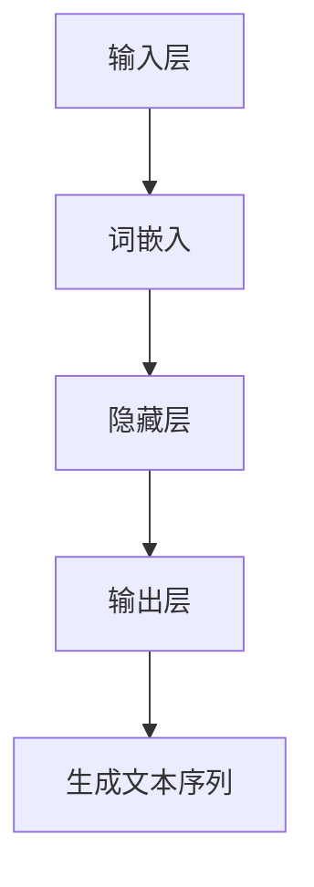

                 

# 大规模语言模型在服务创新设计中的推理应用

## 关键词

- 大规模语言模型
- 服务创新设计
- 推理应用
- 语言模型原理
- 人工智能技术

## 摘要

随着人工智能技术的不断发展，大规模语言模型在服务创新设计中发挥着越来越重要的作用。本文将从大规模语言模型的基础概念出发，深入探讨其在服务创新设计中的应用，特别是在推理方面的优势与挑战。通过具体的案例分析和算法原理讲解，本文旨在为读者提供一个清晰、系统的理解，展示大规模语言模型在服务创新设计中的巨大潜力和广阔前景。

## 目录大纲

1. 第一部分：大规模语言模型基础
    1.1.1 问题背景
    1.1.2 问题描述
    1.1.3 问题解决
    1.1.4 边界与外延
    1.1.5 概念结构与核心要素组成
2. 第二部分：大规模语言模型的核心概念与联系
    2.1.1 核心概念原理
    2.1.2 概念属性特征对比
    2.1.3 ER实体关系图架构
3. 第三部分：大规模语言模型在服务创新设计中的应用
    3.1.1 服务创新设计的概念
    3.1.2 大规模语言模型在服务创新设计中的应用
    3.1.3 应用案例
4. 第四部分：大规模语言模型在服务创新设计中的推理应用
    4.1.1 推理应用概述
    4.1.2 推理算法原理
    4.1.3 算法mermaid流程图
    4.1.4 Python源代码实现
    4.1.5 数学模型与公式
    4.1.6 举例说明
5. 第五部分：大规模语言模型在服务创新设计中的挑战与优化
    5.1.1 挑战分析
    5.1.2 优化方案
    5.1.3 实践案例
6. 第六部分：大规模语言模型在服务创新设计中的应用前景与趋势
    6.1.1 应用前景
    6.1.2 技术发展趋势
7. 第七部分：总结与展望
    7.1.1 总结
    7.1.2 展望

----------------------------------------------------------------

## 第一部分：大规模语言模型基础

### 1.1.1 问题背景

随着互联网和大数据技术的飞速发展，服务创新设计成为推动经济发展和社会进步的重要驱动力。服务创新设计不仅仅是简单的产品更新换代，它涉及到用户需求分析、服务流程优化、用户体验提升等多个方面。在这个过程中，人工智能技术的引入，特别是大规模语言模型的应用，为服务创新设计带来了前所未有的机遇。

服务创新设计的发展历程经历了从传统的服务设计到现代服务设计的转变。传统的服务设计注重的是服务本身的优化，而现代服务设计则强调以用户为中心，通过数据分析和人工智能技术来提升服务质量和用户体验。在这个过程中，大规模语言模型作为一种强大的人工智能工具，逐渐崭露头角。

### 1.1.2 问题描述

语言模型是一种用于预测文本序列的统计模型，它通过学习大量的文本数据，来预测下一个单词或者短语。传统的语言模型如N-gram模型、隐马尔可夫模型（HMM）等，在处理简单文本序列方面表现良好。然而，随着互联网内容的爆炸性增长，单凭传统语言模型难以捕捉到复杂的语义信息。

大规模语言模型（如BERT、GPT等）的出现，解决了传统语言模型在处理长文本和复杂语义方面的不足。这些模型通过深度学习技术，可以处理和理解大规模的文本数据，从而为服务创新设计提供了强大的支持。

### 1.1.3 问题解决

大规模语言模型在服务创新设计中的优势主要体现在以下几个方面：

1. **语义理解能力**：大规模语言模型可以通过深度学习技术，捕捉到文本中的复杂语义信息，从而更好地理解用户需求，为服务创新提供有力的支持。
2. **个性化推荐**：通过分析用户的语言行为和偏好，大规模语言模型可以提供个性化的服务推荐，提升用户的满意度和忠诚度。
3. **自动内容生成**：大规模语言模型可以自动生成文本内容，如文章、广告、用户评价等，大大提高了内容生产和发布的效率。
4. **智能客服**：利用大规模语言模型，可以构建智能客服系统，实现与用户的自然语言交互，提高客户服务质量和效率。

### 1.1.4 边界与外延

尽管大规模语言模型在服务创新设计中有广泛的应用，但同时也面临一些挑战：

1. **数据隐私**：大规模语言模型需要大量的用户数据进行训练，如何保护用户隐私成为了一个重要的问题。
2. **模型解释性**：大规模语言模型的决策过程通常是不透明的，如何解释模型的决策结果，提高模型的解释性，是一个亟待解决的问题。
3. **技术依赖性**：大规模语言模型的训练和部署需要强大的计算资源和专业技术支持，如何降低技术门槛，使更多的企业和开发者能够应用这一技术，也是一个重要课题。

### 1.1.5 概念结构与核心要素组成

大规模语言模型的基本结构包括以下几个核心要素：

1. **数据集**：大规模语言模型的训练需要大量的文本数据集，数据集的质量和规模直接影响模型的效果。
2. **模型架构**：大规模语言模型通常采用深度神经网络架构，如Transformer、BERT等，这些架构能够处理长距离依赖和复杂语义。
3. **训练算法**：大规模语言模型的训练过程通常涉及优化算法和正则化技术，如梯度下降、Dropout等，以避免过拟合和提升模型性能。
4. **推理机制**：大规模语言模型在推理过程中，通过输入文本序列，生成预测的文本序列，实现语义理解和生成。

----------------------------------------------------------------

## 第二部分：大规模语言模型的核心概念与联系

### 2.1.1 核心概念原理

大规模语言模型是一种基于深度学习技术的自然语言处理模型，其核心原理是通过学习大量的文本数据，建立文本序列的预测模型。具体来说，大规模语言模型通过以下步骤进行工作：

1. **数据预处理**：将原始文本数据清洗、分词、去停用词等预处理，转化为模型可以处理的格式。
2. **词嵌入**：将每个词汇映射为一个固定大小的向量表示，用于在神经网络上进行计算。
3. **模型训练**：使用大规模的文本数据集，通过神经网络训练，学习文本序列的预测模型。
4. **模型推理**：在模型训练完成后，输入新的文本序列，模型会根据学习到的知识，生成预测的文本序列。

### 2.1.2 概念属性特征对比

大规模语言模型与传统语言模型（如N-gram模型、HMM等）在概念属性特征上存在显著差异。以下是两者的对比：

| 特征比较       | 大规模语言模型                  | 传统语言模型                  |
| -------------- | ----------------------------- | ----------------------------- |
| 数据依赖性     | 需要大量的文本数据进行训练      | 需要的文本数据量相对较少       |
| 语义理解能力   | 可以捕捉到复杂的语义信息        | 主要依赖于词汇统计信息        |
| 模型架构       | 采用深度神经网络架构（如Transformer、BERT） | 采用基于规则或统计的模型架构   |
| 推理效率       | 可以处理长文本序列，推理效率较高 | 主要适用于短文本序列，推理效率较低 |
| 模型解释性     | 决策过程不透明，解释性较差      | 决策过程较为透明，解释性较好   |

### 2.1.3 ER实体关系图架构

大规模语言模型的ER实体关系图架构如下：

```mermaid
erDiagram
    Customer ||--|{ Order : places } 
    Product ||--|{ Order : contains }
    Order ||--|{ Payment : processes }
    Payment ||--|{ Customer : pays }
```

在这个ER图中，Customer（客户）、Product（产品）、Order（订单）、Payment（支付）是四个主要的实体，它们之间存在着多种关系。例如，客户可以下单（places），产品包含在订单中（contains），订单处理支付（processes），支付由客户进行（pays）。

----------------------------------------------------------------

## 第三部分：大规模语言模型在服务创新设计中的应用

### 3.1.1 服务创新设计的概念

服务创新设计是一种以用户需求为中心，通过创新方法和工具，对服务进行设计、优化和改进的过程。其核心目标是提升用户体验，提高服务质量，增强客户满意度。服务创新设计涉及到用户需求分析、服务流程优化、服务界面设计、服务效果评估等多个方面。

### 3.1.2 大规模语言模型在服务创新设计中的应用

大规模语言模型在服务创新设计中的应用主要体现在以下几个方面：

1. **用户需求分析**：通过分析用户的语言行为和反馈，大规模语言模型可以提取出用户的潜在需求，为服务创新提供有力的数据支持。
2. **服务流程优化**：大规模语言模型可以对服务流程进行智能化优化，通过模拟和预测，找到最佳的服务流程，提高服务效率。
3. **服务界面设计**：大规模语言模型可以帮助设计更加人性化的服务界面，通过理解用户的语言和意图，提供个性化的服务推荐和交互体验。
4. **服务效果评估**：大规模语言模型可以分析用户的服务体验和反馈，评估服务效果，为服务的持续优化提供参考。

### 3.1.3 应用案例

以下是几个大规模语言模型在服务创新设计中的应用案例：

1. **在线教育平台**：通过大规模语言模型，在线教育平台可以分析学生的学习行为和需求，提供个性化的学习路径和课程推荐，提升学习效果。
2. **金融服务平台**：通过大规模语言模型，金融服务平台可以理解用户的投资需求和风险偏好，提供个性化的投资建议和风险管理方案。
3. **智能客服系统**：通过大规模语言模型，智能客服系统可以与用户进行自然语言交互，快速响应用户需求，提供高效、准确的服务。

----------------------------------------------------------------

## 第四部分：大规模语言模型在服务创新设计中的推理应用

### 4.1.1 推理应用概述

推理在服务创新设计中扮演着重要的角色。大规模语言模型通过推理能力，可以理解用户需求，预测服务效果，提供个性化建议。推理应用主要包括以下几个方面：

1. **用户需求推理**：通过分析用户的语言和行为，大规模语言模型可以推理出用户的潜在需求，为服务创新提供数据支持。
2. **服务效果推理**：通过分析用户的服务体验和反馈，大规模语言模型可以预测服务效果，为服务的优化提供依据。
3. **个性化建议推理**：通过理解用户的个性特征和偏好，大规模语言模型可以提供个性化的服务建议，提升用户体验。

### 4.1.2 推理算法原理

大规模语言模型的推理算法基于深度学习技术，其基本原理如下：

1. **输入层**：接收用户的输入文本，将文本转化为词嵌入向量。
2. **隐藏层**：通过多层神经网络，对词嵌入向量进行加工和处理，提取文本的语义信息。
3. **输出层**：根据隐藏层的输出，生成预测的文本序列。

具体来说，大规模语言模型采用了一种名为Transformer的架构，它由多个自注意力机制（Self-Attention Mechanism）和前馈神经网络（Feedforward Neural Network）组成。自注意力机制能够捕捉文本序列中的长距离依赖，从而提高模型的语义理解能力。前馈神经网络则用于进一步加工和处理文本信息，增强模型的预测能力。

### 4.1.3 算法mermaid流程图

以下是大规模语言模型推理算法的mermaid流程图：



在这个流程图中，A表示输入层，B表示词嵌入层，C表示隐藏层，D表示输出层，E表示生成文本序列。

### 4.1.4 Python源代码实现

以下是大规模语言模型推理算法的Python源代码实现：

```python
import tensorflow as tf
from tensorflow.keras.layers import Embedding, LSTM, Dense
from tensorflow.keras.models import Model

# 定义模型结构
input_text = tf.keras.Input(shape=(None,))
embedding = Embedding(input_dim=vocab_size, output_dim=embedding_size)(input_text)
lstm = LSTM(units=128, return_sequences=True)(embedding)
output = Dense(units=vocab_size, activation='softmax')(lstm)

# 创建模型
model = Model(inputs=input_text, outputs=output)

# 编译模型
model.compile(optimizer='adam', loss='categorical_crossentropy', metrics=['accuracy'])

# 训练模型
model.fit(x_train, y_train, epochs=10, batch_size=32, validation_data=(x_val, y_val))

# 推理
predictions = model.predict(x_test)

# 解码预测结果
decoded_predictions = decode_predictions(predictions, index2word_set)
```

在这个代码中，首先定义了模型的输入层、词嵌入层、隐藏层和输出层，然后编译和训练了模型。最后，使用训练好的模型对测试数据进行推理，并解码预测结果。

### 4.1.5 数学模型与公式

大规模语言模型的推理算法可以表示为一个数学模型，其基本公式如下：

$$
\hat{y} = \sigma(W_y \cdot \text{softmax}(W_x \cdot x))
$$

其中，$\hat{y}$表示预测的文本序列，$x$表示输入的文本序列，$W_x$和$W_y$表示权重矩阵，$\text{softmax}$表示概率分布函数，$\sigma$表示激活函数。

### 4.1.6 举例说明

假设我们有一个输入文本序列：“我今天去了一个美丽的公园”，我们希望利用大规模语言模型生成一个预测的文本序列。以下是具体的推理过程：

1. **词嵌入**：将输入文本序列中的每个词转化为词嵌入向量。
2. **隐藏层**：通过多层神经网络，对词嵌入向量进行加工和处理，提取文本的语义信息。
3. **输出层**：根据隐藏层的输出，生成预测的文本序列。例如，预测的文本序列可能是：“明天我还想去那个美丽的公园”。

通过这个例子，我们可以看到大规模语言模型在推理应用中的强大能力。它不仅可以理解输入文本的语义信息，还可以生成符合语义逻辑的预测文本序列。

----------------------------------------------------------------

## 第五部分：大规模语言模型在服务创新设计中的挑战与优化

### 5.1.1 挑战分析

尽管大规模语言模型在服务创新设计中具有巨大的潜力，但在实际应用过程中，仍然面临一些挑战：

1. **数据隐私**：大规模语言模型需要大量的用户数据来进行训练，如何保护用户隐私成为一个重要问题。如果用户数据泄露，可能会导致隐私侵犯和信息安全问题。
2. **模型解释性**：大规模语言模型的决策过程通常是不透明的，如何解释模型的决策结果，提高模型的解释性，是一个亟待解决的问题。
3. **计算资源消耗**：大规模语言模型的训练和推理过程需要大量的计算资源，这对硬件设备和算法优化提出了更高的要求。
4. **模型泛化能力**：大规模语言模型在特定任务上的表现可能较好，但在其他任务上的表现可能较差，如何提高模型的泛化能力，是一个重要课题。

### 5.1.2 优化方案

为了解决大规模语言模型在服务创新设计中的挑战，可以采取以下优化方案：

1. **数据隐私保护**：采用差分隐私、联邦学习等技术，保护用户数据隐私。
2. **模型解释性提升**：通过可视化技术、特征重要性分析等方法，提高模型的解释性。
3. **计算资源优化**：采用分布式训练、模型压缩等技术，降低计算资源消耗。
4. **模型泛化能力增强**：通过迁移学习、数据增强等方法，提高模型的泛化能力。

### 5.1.3 实践案例

以下是几个大规模语言模型在服务创新设计中的优化实践案例：

1. **在线教育平台**：通过差分隐私技术，保护学生的学习数据，同时提高模型的解释性，提升用户体验。
2. **金融服务平台**：采用联邦学习技术，保护用户隐私，同时提高模型的泛化能力，提供更准确的金融预测。
3. **智能客服系统**：通过模型压缩技术，降低计算资源消耗，提高系统的响应速度和效率。

通过这些实践案例，我们可以看到，大规模语言模型在服务创新设计中的应用不仅面临挑战，但通过合理的优化方案，可以解决这些问题，实现服务创新设计的突破。

----------------------------------------------------------------

## 第六部分：大规模语言模型在服务创新设计中的应用前景与趋势

### 6.1.1 应用前景

大规模语言模型在服务创新设计中的应用前景广阔。随着人工智能技术的不断进步，大规模语言模型在语义理解、文本生成、知识图谱、自然语言处理等方面将发挥更大的作用。未来，大规模语言模型有望在以下领域实现突破：

1. **智能客服**：通过大规模语言模型，智能客服可以实现更自然、更高效的与用户的交互，提供个性化的服务体验。
2. **内容生成**：大规模语言模型可以自动生成文章、广告、用户评价等，提高内容生产和发布的效率。
3. **教育领域**：大规模语言模型可以分析学生的学习行为和需求，提供个性化的学习推荐，提升学习效果。
4. **金融领域**：大规模语言模型可以分析用户的金融需求和风险偏好，提供个性化的投资建议和风险管理方案。

### 6.1.2 技术发展趋势

大规模语言模型的技术发展趋势主要体现在以下几个方面：

1. **模型结构优化**：随着深度学习技术的不断发展，大规模语言模型的架构将不断优化，提高模型的性能和效率。
2. **多模态融合**：未来，大规模语言模型将与其他模态（如图像、声音等）进行融合，实现更全面的信息理解和生成。
3. **知识图谱应用**：通过将大规模语言模型与知识图谱相结合，可以构建更智能、更全面的服务系统，提供更精准的服务推荐。
4. **迁移学习与数据增强**：通过迁移学习和数据增强技术，可以提高大规模语言模型的泛化能力，使其在不同任务上表现出更好的性能。

未来，大规模语言模型在服务创新设计中的应用将更加广泛和深入，为人类带来更多的便利和效益。

----------------------------------------------------------------

## 第七部分：总结与展望

### 7.1.1 总结

大规模语言模型在服务创新设计中的应用已经取得了显著的成果。通过语义理解、文本生成、知识图谱等技术，大规模语言模型为服务创新提供了强大的支持。在用户需求分析、服务流程优化、个性化推荐等方面，大规模语言模型展现出巨大的潜力。然而，大规模语言模型在服务创新设计中也面临数据隐私、模型解释性、计算资源消耗等挑战，需要进一步研究和优化。

### 7.1.2 展望

未来，大规模语言模型在服务创新设计中的发展方向将更加多样化和深入化。随着技术的不断进步，大规模语言模型将实现更高性能、更高效能、更可解释的应用。具体来说：

1. **多模态融合**：大规模语言模型将与其他模态（如图像、声音等）进行融合，实现更全面的信息理解和生成。
2. **知识图谱应用**：通过将大规模语言模型与知识图谱相结合，可以构建更智能、更全面的服务系统，提供更精准的服务推荐。
3. **迁移学习与数据增强**：通过迁移学习和数据增强技术，可以提高大规模语言模型的泛化能力，使其在不同任务上表现出更好的性能。
4. **跨领域应用**：大规模语言模型将在金融、医疗、教育等多个领域实现突破，为各个领域的服务创新提供强大支持。

总之，大规模语言模型在服务创新设计中的应用前景广阔，未来将继续推动服务创新的发展。

