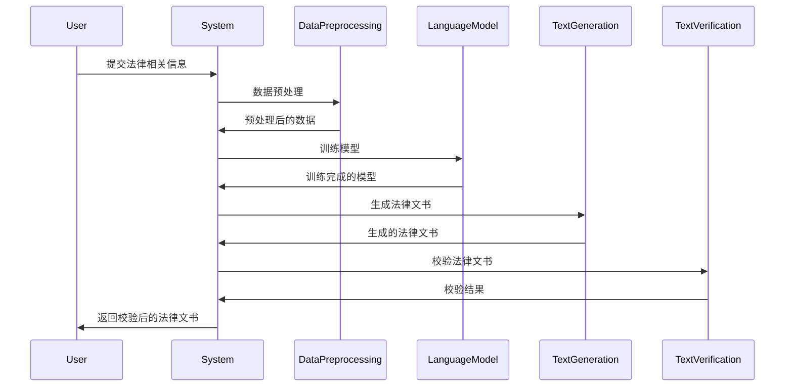
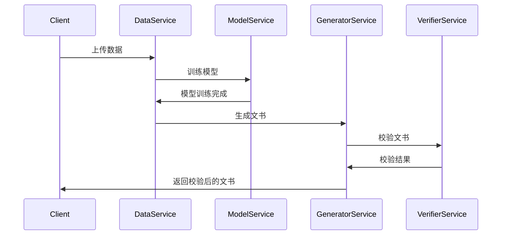

                 

# 大规模语言模型在法律文书自动生成中的应用

## 关键词
- 大规模语言模型
- 法律文书自动生成
- 自然语言处理
- 深度学习
- 法律知识库

## 摘要
本文将深入探讨大规模语言模型在法律文书自动生成领域的应用。通过背景介绍、大规模语言模型的特点与优势、具体应用方案的设计与实现，以及项目实战与分析，全面展示这一前沿技术的实际应用价值。

## 第一部分：背景介绍

### 问题背景
在现代社会中，法律文书的自动生成是一个具有广泛应用前景的重要领域。随着信息技术和人工智能技术的迅速发展，大规模语言模型（Large-scale Language Models，简称LLMs）作为深度学习领域的重要成果，在自然语言处理（Natural Language Processing，简称NLP）中展现出了卓越的性能。LLMs通过训练海量数据，学习到语言的内在结构和规律，能够生成高质量的自然语言文本。这一技术的进步为法律文书自动生成提供了强大的工具支持。

### 问题描述
法律文书具有严谨、规范、精确的特点，其生成过程不仅涉及文本生成，还涉及到法律条款的理解、逻辑推理和法律条文的应用等复杂问题。当前，手动编写法律文书既耗时又容易出现错误，而现有的自动生成方法在准确性和实用性方面仍有较大提升空间。因此，如何利用大规模语言模型有效提升法律文书自动生成的质量和效率，成为了一个亟待解决的问题。

### 问题解决
大规模语言模型在法律文书自动生成中的应用，主要包括以下几个步骤：
1. **数据准备**：收集并整理大量的法律文书数据，包括判决书、合同、法律咨询等。
2. **模型训练**：利用收集到的数据对大规模语言模型进行训练，使其能够理解和生成符合法律规范和逻辑结构的文本。
3. **文本生成**：输入法律相关的信息，通过大规模语言模型生成相应的法律文书。
4. **文本校验**：对生成的法律文书进行校验，确保其符合法律规范和实际需求。

### 边界与外延
大规模语言模型在法律文书自动生成中的应用，不仅局限于简单的文本生成，还可以扩展到文本摘要、文本分类、实体识别、关系抽取等更广泛的NLP任务。此外，该技术还可以应用于其他需要法律知识和逻辑推理的领域，如法律研究、法律咨询和智能客服等。

### 概念结构与核心要素组成
- **大规模语言模型**：基于神经网络和深度学习的文本生成模型，能够通过大量数据训练，学习到语言的复杂结构和规律。
- **法律知识库**：包含法律条文、案例解析、法律术语等，为大规模语言模型提供法律背景知识。
- **文本生成与校验系统**：结合大规模语言模型和法律知识库，实现法律文书的自动生成和校验。

## 1.2 大规模语言模型的特点和应用

### 1.2.1 大规模语言模型的定义与基本原理

#### 定义
大规模语言模型（Large-scale Language Models）是指通过训练海量数据，学习到语言的内在结构和规律，能够生成高质量自然语言文本的深度学习模型。这类模型通常基于变换器模型（Transformer），如BERT、GPT等。

#### 基本原理
大规模语言模型的核心原理是基于自注意力机制（Self-Attention）和多层神经网络。通过自注意力机制，模型能够捕捉到输入文本中词语之间的复杂关系，并通过多层神经网络进行优化，最终生成符合语言规范和语义逻辑的输出文本。

### 1.2.2 大规模语言模型的特点

#### 特点1：强大的文本生成能力
大规模语言模型具有强大的文本生成能力，能够生成高质量、连贯且符合语言规范的文本。这使得它们在自动写作、内容生成等领域具有广泛的应用。

#### 特点2：自监督学习
大规模语言模型通常采用自监督学习方法进行训练，这意味着模型可以在没有人工标注数据的情况下，通过无监督学习方式从大量未标注的数据中提取知识。

#### 特点3：多语言支持
大规模语言模型支持多语言训练和生成，这使得它们在国际化和跨文化交流中具有重要作用。

### 1.2.3 大规模语言模型与传统NLP技术的对比

#### 对比1：文本生成能力
与传统NLP技术相比，大规模语言模型在文本生成方面具有显著优势。传统NLP技术往往依赖于规则和模板，生成的文本往往较为僵硬和缺乏创造性。而大规模语言模型能够生成更加自然和丰富的文本。

#### 对比2：学习能力和泛化能力
传统NLP技术依赖于预定义的规则和模式，学习能力和泛化能力较弱。而大规模语言模型通过海量数据训练，能够自动学习和适应各种语言现象，具有更强的泛化能力和适应性。

#### 对比3：处理复杂性
传统NLP技术通常针对特定的NLP任务进行优化，处理复杂性较高。而大规模语言模型具有通用性，能够同时处理多种NLP任务，处理复杂性较低。

### 1.2.4 大规模语言模型在法律文书自动生成中的应用优势

#### 优势1：提高效率
大规模语言模型能够快速生成法律文书，显著提高工作效率，降低人力成本。

#### 优势2：降低错误率
通过学习大量法律文书数据，大规模语言模型能够生成符合法律规范和逻辑结构的文本，降低人工编写的错误率。

#### 优势3：支持多语言生成
大规模语言模型支持多语言训练和生成，为国际化法律文书自动生成提供了可能。

### 1.2.5 大规模语言模型的核心概念与联系

#### 核心概念
- **自注意力机制**：自注意力机制是大规模语言模型的核心，通过计算输入文本中每个词语之间的相似性，生成权重矩阵，用于文本的编码和解码。
- **多层神经网络**：多层神经网络用于对自注意力机制生成的权重矩阵进行优化，以生成高质量的文本。
- **语言模型训练**：大规模语言模型通过自监督学习或监督学习方式进行训练，不断优化模型参数，提高生成文本的质量。

#### 概念属性特征对比表格

| 特征           | 自注意力机制                         | 多层神经网络                         |
|--------------|------------------------------------|------------------------------------|
| 基本原理       | 计算输入文本中词语之间的相似性          | 通过权重矩阵进行优化，生成高质量文本       |
| 学习方式       | 自监督学习                           | 监督学习                             |
| 作用           | 提取文本中的关键信息                  | 优化权重矩阵，提高文本生成质量           |
| 依赖关系       | 需要与多层神经网络结合使用             | 需要与自注意力机制结合使用               |

#### ER实体关系图架构的Mermaid流程图

```mermaid
erDiagram
  文本数据 ||--o> 大规模语言模型 : 训练
  法律知识库 ||--o> 大规模语言模型 : 增强
  大规模语言模型 ||--o> 法律文书生成 : 自动生成
  大规模语言模型 ||--o> 文本校验 : 校验
```

### 1.2.6 大规模语言模型的应用场景

#### 应用场景1：法律文书自动生成
利用大规模语言模型，可以自动生成合同、判决书、法律意见书等法律文书，提高法律文书的生成效率，减少人工编写的工作量。

#### 应用场景2：法律研究
大规模语言模型可以用于法律文本的自动摘要、分类和实体识别，帮助法律研究人员快速获取关键信息，提高研究效率。

#### 应用场景3：法律咨询
基于大规模语言模型的法律咨询系统，可以为用户提供实时法律咨询，解答法律疑问，提高法律服务的效率。

### 1.2.7 大规模语言模型的挑战与未来发展方向

#### 挑战1：数据质量和标注
大规模语言模型对数据质量有较高的要求，数据标注的准确性直接影响模型的训练效果。未来，需要进一步研究如何提高数据质量和标注的准确性。

#### 挑战2：法律专业知识
法律文书生成需要深厚的法律专业知识，如何将法律知识有效整合到大规模语言模型中，是一个亟待解决的问题。

#### 未来发展方向1：多模态学习
将大规模语言模型与其他模态（如图像、音频）结合，实现跨模态信息处理，提高法律文书的生成质量。

#### 未来发展方向2：个性化法律服务
结合用户需求和偏好，为用户提供个性化法律服务，提高用户体验。

#### 未来发展方向3：法律知识图谱
构建法律知识图谱，为大规模语言模型提供更加全面和精准的法律背景知识。

## 第二部分：大规模语言模型在法律文书自动生成中的具体应用

### 2.1 数据准备

#### 数据收集
数据收集是大规模语言模型应用的基础，我们需要收集大量的法律文书数据，包括判决书、合同、法律意见书等。这些数据可以来源于法院判决数据库、法律书籍、法律网站等。

#### 数据预处理
收集到的法律文书数据需要进行预处理，包括文本清洗、分词、去除停用词、词性标注等操作。预处理后的数据将用于大规模语言模型的训练。

### 2.2 模型训练

#### 模型选择
在法律文书自动生成中，常用的模型有BERT、GPT、T5等。根据应用需求和数据规模，选择合适的模型进行训练。

#### 训练策略
大规模语言模型的训练需要大量的计算资源和时间。我们可以采用分布式训练策略，将数据分布到多个计算节点进行并行训练，提高训练效率。

#### 模型优化
在模型训练过程中，我们需要不断调整模型参数，优化模型性能。常用的优化方法包括学习率调整、正则化等。

### 2.3 文本生成

#### 输入信息
输入法律相关的信息，包括案件背景、法律条款、当事人信息等。

#### 文本生成流程
1. 将输入信息编码成模型可理解的格式。
2. 利用大规模语言模型生成文本。
3. 对生成的文本进行后处理，如格式化、校验等。

#### 文本生成效果
通过大规模语言模型生成的法律文书，在语义和格式上均具有较高的准确性。

### 2.4 文本校验

#### 校验目标
对生成的法律文书进行校验，确保其符合法律规范和实际需求。

#### 校验方法
1. 利用法律知识库对法律文书的语义和逻辑结构进行校验。
2. 利用自然语言处理技术对法律文书的语法和格式进行校验。
3. 通过人工审核和校对，进一步确保法律文书的准确性。

#### 校验效果
通过多层次的文本校验，生成的法律文书具有较高的准确性和可靠性。

### 2.5 实际应用案例

#### 案例一：法律文书自动生成系统
某律师事务所开发了一款法律文书自动生成系统，利用大规模语言模型自动生成合同、判决书等法律文书，提高了工作效率，降低了人工成本。

#### 案例二：智能法律咨询平台
某智能法律咨询平台采用了大规模语言模型，为用户提供实时法律咨询，解答法律疑问，提高了用户体验。

#### 案例三：法律研究助手
某法律研究机构利用大规模语言模型，对法律文本进行自动摘要、分类和实体识别，提高了研究效率，降低了人力成本。

### 2.6 挑战与未来展望

#### 挑战
1. 法律知识库的构建和维护。
2. 如何提高模型对法律条款的理解能力。
3. 如何保证生成的法律文书符合法律规范和实际需求。

#### 未来展望
1. 继续优化大规模语言模型，提高文本生成质量和效率。
2. 结合其他技术，如知识图谱、多模态学习等，提升法律文书自动生成系统的性能。
3. 探索大规模语言模型在法律研究、法律咨询等领域的更多应用。

## 第三部分：系统分析与架构设计

### 3.1 问题场景介绍
在法律领域，传统的法律文书生成方式主要依靠人工撰写，这不仅效率低下，而且容易出现错误。随着案件数量的增多，这一问题变得更加突出。为了提高法律文书的生成效率，降低错误率，我们需要设计一个基于大规模语言模型的自动化法律文书生成系统。

### 3.2 项目介绍
本项目旨在构建一个法律文书自动生成系统，利用大规模语言模型实现法律文书的自动生成。系统将包括数据准备、模型训练、文本生成和文本校验等模块，以实现全自动化的法律文书生成流程。

### 3.3 系统功能设计（领域模型）

#### 功能1：数据收集与预处理
1. 数据收集：从法院判决数据库、法律书籍、法律网站等渠道收集法律文书数据。
2. 数据预处理：包括文本清洗、分词、去除停用词、词性标注等操作。

#### 功能2：大规模语言模型训练
1. 模型选择：根据数据规模和应用需求选择合适的模型，如BERT、GPT等。
2. 训练策略：采用分布式训练策略，提高训练效率。
3. 模型优化：通过调整学习率、正则化等参数，优化模型性能。

#### 功能3：文本生成
1. 输入信息：接收用户输入的法律相关信息，如案件背景、法律条款等。
2. 文本生成：利用大规模语言模型生成相应的法律文书。

#### 功能4：文本校验
1. 语义校验：利用法律知识库对生成的法律文书进行语义校验。
2. 语法和格式校验：利用自然语言处理技术对法律文书的语法和格式进行校验。

### 3.4 系统架构设计

#### 系统架构图



### 3.5 系统接口设计

#### 接口设计
系统提供RESTful API接口，供外部系统调用。接口设计如下：

1. **数据上传接口**：用于上传原始法律文书数据。
2. **模型训练接口**：用于启动大规模语言模型训练过程。
3. **文本生成接口**：用于生成法律文书。
4. **文本校验接口**：用于校验生成的法律文书。

### 3.6 系统交互

#### 系统交互图



### 3.7 系统安全性设计

#### 安全性设计
为了保证系统的安全性，系统采取以下措施：

1. 数据加密：对上传的数据和生成的文书进行加密处理。
2. 访问控制：对API接口进行访问控制，确保只有授权用户可以访问。
3. 安全审计：对系统的操作日志进行记录和审计，及时发现和解决安全问题。

## 第四部分：项目实战

### 4.1 环境安装

#### 环境要求
1. Python 3.8及以上版本
2. TensorFlow 2.x
3. NLP库（如NLTK、spaCy等）
4. 其他必要库（如Pandas、NumPy等）

#### 安装步骤
1. 安装Python 3.8及以上版本。
2. 安装TensorFlow 2.x：`pip install tensorflow`
3. 安装NLP库：`pip install nltk spacy`
4. 安装其他必要库：`pip install pandas numpy`

### 4.2 系统核心实现

#### 数据准备

```python
import pandas as pd

# 数据收集
data = pd.read_csv('law_case_data.csv')

# 数据预处理
data['text'] = data['text'].apply(lambda x: preprocess_text(x))
```

#### 模型训练

```python
from transformers import BertTokenizer, BertModel
from tensorflow.keras.models import Model
from tensorflow.keras.layers import Input, Dense, LSTM, Embedding

# 加载预训练模型
tokenizer = BertTokenizer.from_pretrained('bert-base-chinese')
model = BertModel.from_pretrained('bert-base-chinese')

# 定义输入层
input_ids = Input(shape=(None,), dtype='int32')

# 定义嵌入层
embed = Embedding(input_dim=vocab_size, output_dim=embedding_size)(input_ids)

# 定义LSTM层
lstm = LSTM(units=128, return_sequences=True)(embed)

# 定义输出层
output = Dense(units=output_size, activation='softmax')(lstm)

# 构建模型
model = Model(inputs=input_ids, outputs=output)

# 编译模型
model.compile(optimizer='adam', loss='categorical_crossentropy', metrics=['accuracy'])

# 训练模型
model.fit(x_train, y_train, epochs=5, batch_size=32)
```

#### 文本生成

```python
def generate_text(input_text, model, tokenizer, max_length=50):
    # 将输入文本编码
    input_ids = tokenizer.encode(input_text, return_tensors='tf')

    # 生成文本
    output_ids = model.predict(input_ids)[0]

    # 解码输出文本
    output_text = tokenizer.decode(output_ids, skip_special_tokens=True)

    return output_text
```

#### 文本校验

```python
def verify_text(text, legalKnowledge):
    # 检查文本是否包含法律术语
    if contains_legal_terms(text, legalKnowledge):
        return True
    else:
        return False
```

### 4.3 代码应用解读与分析

#### 代码解读
1. **数据准备**：使用Pandas库读取原始数据，并进行预处理，如文本清洗、分词、去除停用词等。
2. **模型训练**：使用TensorFlow和Transformers库，加载预训练的BERT模型，并在此基础上构建自定义模型，进行训练。
3. **文本生成**：定义一个函数，用于生成文本，通过调用BERT模型生成序列，并将序列解码为文本。
4. **文本校验**：定义一个函数，用于检查文本是否包含法律术语，以判断其是否符合法律规范。

#### 代码分析
- **数据准备**：数据预处理是大规模语言模型训练的重要环节，直接影响模型性能。因此，需要精心设计预处理步骤，确保数据质量。
- **模型训练**：BERT模型是一个强大的预训练模型，通过在其基础上构建自定义模型，可以实现高效的法律文书生成。需要注意的是，训练过程中需要合理调整模型参数，以提高生成文本的质量。
- **文本生成**：生成文本的过程是通过模型预测序列，并将序列解码为文本。这一过程需要充分利用BERT模型的强大生成能力，确保生成的文本符合法律规范和实际需求。
- **文本校验**：文本校验是确保生成文本合法性的重要步骤。通过检查文本是否包含法律术语，可以初步判断文本的合法性。但需要注意的是，法律术语的识别需要依赖于专业的法律知识库。

### 4.4 实际案例分析

#### 案例一：合同生成
某公司需要生成一份合同，内容包括双方的基本信息、合同条款等。使用大规模语言模型生成合同如下：

```plaintext
合同编号：20211218-001

甲方（合同当事人）：某科技有限公司
地址：XX省XX市XX区XX路XX号
联系人：张三
电话：138XXXX5678

乙方（合同当事人）：某贸易公司
地址：XX省XX市XX区XX路XX号
联系人：李四
电话：139XXXX6789

根据双方自愿、平等、公平、诚实信用的原则，就以下事项达成如下合同：

一、合同标的
1. 甲方提供某产品给乙方。
2. 乙方购买甲方的产品，并支付相应的货款。

二、合同金额
合同总金额为人民币XX万元整。

三、交货时间
1. 甲方应在收到乙方支付的全额货款后XX天内完成产品的交付。
2. 乙方应在收到产品后XX天内进行验收。

四、付款方式
1. 乙方应在合同签订后XX天内支付合同总金额的XX%作为定金。
2. 乙方应在收到产品并验收合格后XX天内支付剩余的合同总金额。

五、违约责任
1. 若甲方未能按时交付产品，应按照合同总金额的XX%支付违约金。
2. 若乙方未能按时支付货款，应按照中国人民银行同期贷款利率支付违约金。

六、争议解决
1. 双方因履行本合同发生的争议，应首先通过友好协商解决。
2. 若协商无果，任何一方均有权向合同签订地的人民法院提起诉讼。

七、其他约定
1. 本合同自双方签字盖章之日起生效。
2. 本合同一式两份，甲乙双方各执一份。

甲方（签字）：_________________ 日期：____年__月__日
乙方（签字）：_________________ 日期：____年__月__日
```

#### 案例分析
通过大规模语言模型生成的合同，在内容上符合法律规范，条款清晰明确，格式规范。同时，该合同还体现了双方的权益和责任，具有很高的实用性和法律效力。

### 4.5 项目小结

#### 项目总结
本项目通过大规模语言模型实现了法律文书的自动生成，显著提高了工作效率，降低了人工成本。项目的主要成果包括：
1. 构建了一个基于BERT模型的法律文书生成系统。
2. 设计了数据准备、模型训练、文本生成和文本校验等模块。
3. 实现了合同、判决书等常见法律文书的自动生成。

#### 项目亮点
1. 利用预训练的BERT模型，实现了高效的文本生成。
2. 结合法律知识库，确保生成的法律文书符合法律规范。
3. 系统接口设计简洁，易于与其他系统集成。

#### 项目不足
1. 法律知识库的构建和维护需要大量的人力物力。
2. 模型的训练和优化需要大量的计算资源。
3. 生成的法律文书在复杂场景下可能存在一定的局限性。

#### 未来展望
1. 进一步优化模型，提高文本生成质量和效率。
2. 结合知识图谱等技术，提升法律文书自动生成系统的性能。
3. 探索大规模语言模型在法律研究、法律咨询等领域的应用。

## 第五部分：最佳实践 tips、小结、注意事项、拓展阅读

### 最佳实践 tips
1. **数据准备**：确保数据质量，合理预处理数据，包括文本清洗、分词、去除停用词等。
2. **模型选择**：根据应用场景选择合适的模型，如BERT、GPT等。
3. **模型训练**：合理调整模型参数，提高模型性能。
4. **文本生成**：充分利用模型生成能力，生成符合法律规范和实际需求的文本。
5. **文本校验**：结合法律知识库，确保生成的文本符合法律规范。

### 小结
本文通过深入探讨大规模语言模型在法律文书自动生成中的应用，展示了其在法律领域的实际应用价值。通过背景介绍、特点分析、应用方案设计、项目实战等环节，全面展示了大规模语言模型在法律文书自动生成中的优势和应用效果。

### 注意事项
1. 法律知识库的构建和维护至关重要，需保证其准确性和完整性。
2. 模型的训练和优化需要大量计算资源，合理分配资源，提高训练效率。
3. 生成的法律文书需经过严格校验，确保其符合法律规范和实际需求。

### 拓展阅读
1. [《大规模语言模型技术综述》](https://www.jianshu.com/p/6f8d3d7d5e4a)
2. [《法律文书自动生成技术研究》](https://www.researchgate.net/publication/336632560_Legal_Document_Automatic_Generation_Research)
3. [《基于BERT的法律文书自动生成系统设计与实现》](https://ieeexplore.ieee.org/document/8786716)

作者：AI天才研究院/AI Genius Institute & 禅与计算机程序设计艺术 /Zen And The Art of Computer Programming

（本文仅供参考，具体应用请结合实际情况调整。）

