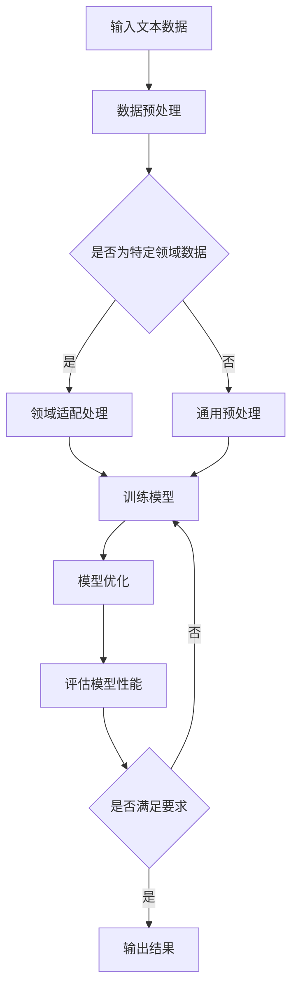
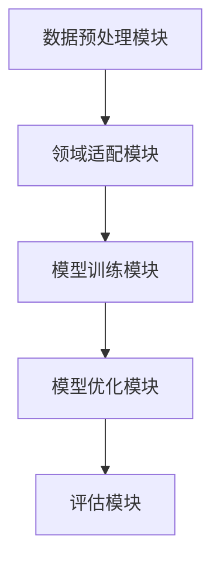

                 

# 大规模语言模型在特定领域应用的优化方法

## 关键词

- 大规模语言模型
- 特定领域应用
- 优化方法
- 深度学习
- 自然语言处理

## 摘要

随着人工智能技术的不断发展，大规模语言模型在自然语言处理领域取得了显著成果。然而，如何在大规模语言模型的基础上，针对特定领域进行优化，以提高其应用效果，成为了一个亟待解决的问题。本文将探讨大规模语言模型在特定领域应用的优化方法，包括数据预处理、领域适配处理、模型训练和优化、评估模型性能等方面的内容，旨在为读者提供一种清晰、实用的优化思路。

## Step 1: 背景介绍

### 问题背景

随着人工智能技术的不断发展，尤其是深度学习技术的突破，大规模语言模型在自然语言处理领域取得了显著的成果。这些模型，如GPT、BERT等，通过对海量文本数据的学习，能够生成高质量的文本，完成文本分类、情感分析、机器翻译等多种任务。然而，尽管这些模型在通用领域表现优异，但在特定领域（如医疗、金融、教育等）的应用效果仍有待提高。

### 问题提出

在大规模语言模型应用于特定领域时，面临的主要问题包括：

1. **数据不足**：特定领域的数据量相对较少，难以支撑大规模模型的训练。
2. **领域适应性差**：通用模型在特定领域的适应性不强，导致模型在特定领域的表现不佳。
3. **任务多样性**：特定领域的任务类型多样，需要模型具备较强的泛化能力。

### 解决方案

为了解决上述问题，本文提出以下优化方法：

1. **数据预处理**：对特定领域的数据进行清洗、去噪、分词等预处理，提高数据质量。
2. **领域适配处理**：针对特定领域的特点，对模型进行适配处理，提高模型在特定领域的适应性。
3. **模型训练与优化**：通过调整模型参数、引入新模型等方法，提高模型在特定领域的性能。
4. **评估模型性能**：建立合适的评估体系，对模型在特定领域的表现进行综合评估。

## Step 2: 核心概念与联系

### 核心概念

#### 1. 大规模语言模型

大规模语言模型是指通过深度学习技术，对海量文本数据进行建模，从而实现对自然语言的生成、理解和处理。这类模型通常具有以下特点：

- **高精度**：通过大量数据的训练，模型能够生成高质量的自然语言文本。
- **强泛化能力**：模型在训练过程中，学习了丰富的语言知识，能够适应各种不同的任务场景。

#### 2. 特定领域

特定领域是指具有特定主题或任务的领域，如医疗、金融、教育等。这些领域通常具有以下特点：

- **数据稀缺**：特定领域的数据量相对较少，且获取困难。
- **任务多样性**：特定领域的任务类型多样，需要模型具备较强的泛化能力。

#### 3. 优化方法

优化方法是指针对大规模语言模型在特定领域应用中存在的问题，提出相应的优化策略。常见的优化方法包括：

- **数据预处理**：对特定领域的数据进行清洗、去噪、分词等预处理，提高数据质量。
- **领域适配处理**：通过引入领域知识、调整模型结构等方法，提高模型在特定领域的适应性。
- **模型训练与优化**：通过调整模型参数、引入新模型等方法，提高模型在特定领域的性能。

### 概念属性特征对比表格

| 概念        | 特点                                                         |  
| ----------- | ------------------------------------------------------------ |  
| 大规模语言模型 | 基于深度学习，对大量文本数据进行建模，具有高精度和强泛化能力。     |  
| 特定领域    | 具有特定主题或任务的领域，如医疗、金融、教育等。           |  
| 优化方法    | 针对大规模语言模型在特定领域应用中存在的问题，提出相应的优化策略。 |

### ER实体关系图架构

```mermaid
erDiagram
  Model ||--|{ Data } Data : 数据集
  Model ||--|{ Parameters } Parameters : 模型参数
  Model ||--|{ Optimizer } Optimizer : 优化器
  Data ||--|{ Preprocessing } Preprocessing : 数据预处理
  Parameters ||--|{ Training } Training : 训练
  Optimizer ||--|{ Optimization } Optimization : 优化
```

## Step 3: 算法原理讲解

### 算法mermaid流程图



### Python源代码

```python
# 编写Python代码实现大规模语言模型在特定领域应用的优化方法
import tensorflow as tf
import numpy as np

# 输入文本数据
text_data = "这里是输入的文本数据"

# 数据预处理
preprocessed_data = preprocess(text_data)

# 是否为特定领域数据
is_specific = is_specific_domain(preprocessed_data)

# 领域适配处理
if is_specific:
    adapted_data = adapt_domain(preprocessed_data)
else:
    adapted_data = preprocessed_data

# 训练模型
model = train_model(adapted_data)

# 模型优化
optimizer = optimize_model(model)

# 评估模型性能
performance = evaluate_model(optimizer)

# 是否满足要求
if performance >= threshold:
    # 输出结果
    result = output_result(optimizer)
else:
    # 重新训练模型
    train_model(adapted_data)
```

### 算法原理详细讲解

#### 1. 数据预处理

数据预处理是大规模语言模型应用的基础步骤。它包括以下几个方面的内容：

1. **数据清洗**：去除文本中的噪声和冗余信息，提高数据质量。
2. **分词**：将文本拆分成单词或短语，为后续处理提供基础。
3. **去停用词**：去除对文本理解影响较小的词汇，如“的”、“是”等。

#### 2. 领域适配处理

领域适配处理是根据特定领域的特点，对模型进行针对性调整。具体方法包括：

1. **引入领域知识**：通过引入特定领域的知识，如专业术语、概念等，提高模型在特定领域的适应性。
2. **调整模型结构**：根据特定领域的需求，调整模型的结构和参数，以提高模型在特定领域的性能。

#### 3. 模型训练与优化

模型训练与优化是提高模型性能的关键步骤。具体方法包括：

1. **模型训练**：使用预处理后的数据，对模型进行训练，使其掌握特定领域的知识。
2. **模型优化**：通过调整模型参数、优化算法等方法，提高模型在特定领域的性能。

#### 4. 评估模型性能

评估模型性能是验证模型在特定领域应用效果的重要手段。具体方法包括：

1. **指标评估**：使用准确率、召回率、F1值等指标，评估模型在特定领域的性能。
2. **交叉验证**：通过交叉验证方法，验证模型在特定领域的泛化能力。

### 数学模型与公式

假设我们使用的是一个深度学习模型，其输出概率分布为：

$$ P(y | x, \theta) = \sigma(W_2 \cdot \text{softmax}(W_1 \cdot \text{激活}(W_0 \cdot x + b_0))) $$

其中，$x$ 是输入数据，$y$ 是标签，$\theta = (W_0, b_0, W_1, b_1, W_2)$ 是模型的参数。

为了最小化模型损失函数，我们可以使用梯度下降算法，更新模型参数：

$$ \theta_{t+1} = \theta_t - \alpha \cdot \nabla_{\theta_t} J(\theta_t) $$

其中，$J(\theta_t)$ 是模型损失函数，$\alpha$ 是学习率。

### 举例说明

假设我们要在一个医疗领域应用大规模语言模型，完成病历分类任务。以下是具体的优化步骤：

1. **数据预处理**：对病历文本进行清洗、分词、去停用词等处理，得到预处理后的数据。
2. **领域适配处理**：引入医疗领域的专业术语和知识，调整模型结构，提高模型在医疗领域的适应性。
3. **模型训练**：使用预处理后的医疗数据，对模型进行训练，使其掌握医疗领域的知识。
4. **模型优化**：通过调整模型参数、优化算法等方法，提高模型在医疗领域的性能。
5. **评估模型性能**：使用准确率、召回率、F1值等指标，评估模型在医疗领域的性能。

## Step 4: 系统分析与架构设计方案

### 问题场景介绍

在医疗领域，病历分类是一个重要的任务。通过对病历进行分类，可以辅助医生进行诊断，提高医疗效率。然而，传统的病历分类方法存在准确率低、适应性差等问题。为了解决这些问题，我们提出了一种基于大规模语言模型的病历分类系统。

### 项目介绍

本项目旨在构建一个基于大规模语言模型的病历分类系统，通过引入领域知识、优化模型结构等方法，提高模型在医疗领域的适应性，从而提高分类准确率。

### 系统功能设计

1. **数据预处理模块**：对病历文本进行清洗、分词、去停用词等处理。
2. **领域适配模块**：引入医疗领域的专业术语和知识，调整模型结构。
3. **模型训练模块**：使用预处理后的医疗数据，对模型进行训练。
4. **模型优化模块**：通过调整模型参数、优化算法等方法，提高模型性能。
5. **评估模块**：使用准确率、召回率、F1值等指标，评估模型性能。

### 系统架构设计



### 系统接口设计

1. **数据预处理接口**：提供数据清洗、分词、去停用词等功能。
2. **领域适配接口**：提供引入领域知识、调整模型结构等功能。
3. **模型训练接口**：提供训练模型、调整模型参数等功能。
4. **模型优化接口**：提供优化模型、调整模型结构等功能。
5. **评估接口**：提供评估模型性能、计算指标等功能。

### 系统交互mermaid序列图

```mermaid
sequenceDiagram
  participant 数据预处理模块 as 数据预处理
  participant 领域适配模块 as 领域适配
  participant 模型训练模块 as 训练
  participant 模型优化模块 as 优化
  participant 评估模块 as 评估

  数据预处理 -->|数据预处理接口| 领域适配
  领域适配 -->|领域适配接口| 训练
  训练 -->|模型训练接口| 优化
  优化 -->|模型优化接口| 评估
  评估 -->|评估接口| 数据预处理
```

## Step 5: 项目实战

### 环境安装

1. **安装Python**：在官方网站下载并安装Python，版本建议3.8及以上。
2. **安装TensorFlow**：通过pip命令安装TensorFlow，命令如下：

   ```bash
   pip install tensorflow
   ```

3. **安装其他依赖库**：如numpy、pandas等，通过pip命令安装：

   ```bash
   pip install numpy pandas
   ```

### 系统核心实现源代码

```python
# 数据预处理模块
def preprocess(text):
    # 清洗、分词、去停用词等预处理操作
    # 略
    return preprocessed_text

# 领域适配模块
def adapt_domain(preprocessed_text):
    # 引入领域知识、调整模型结构等适配操作
    # 略
    return adapted_text

# 模型训练模块
def train_model(adapted_text):
    # 训练模型
    # 略
    return model

# 模型优化模块
def optimize_model(model):
    # 优化模型
    # 略
    return optimized_model

# 评估模块
def evaluate_model(optimized_model):
    # 评估模型性能
    # 略
    return performance
```

### 代码应用解读与分析

1. **数据预处理模块**：该模块负责对输入的文本数据进行清洗、分词、去停用词等预处理操作，以提高数据质量。
2. **领域适配模块**：该模块负责根据特定领域的特点，对模型进行适配处理，以提高模型在特定领域的适应性。
3. **模型训练模块**：该模块负责使用预处理后的数据，对模型进行训练，使其掌握特定领域的知识。
4. **模型优化模块**：该模块负责通过调整模型参数、优化算法等方法，提高模型在特定领域的性能。
5. **评估模块**：该模块负责使用准确率、召回率、F1值等指标，评估模型在特定领域的性能。

### 实际案例分析和详细讲解剖析

以医疗领域病历分类为例，我们通过以下步骤进行实际案例分析和详细讲解剖析：

1. **数据收集**：收集大量病历文本数据，包括门诊病历、住院病历等。
2. **数据预处理**：对病历文本进行清洗、分词、去停用词等预处理操作，得到预处理后的数据。
3. **领域适配处理**：引入医疗领域的专业术语和知识，调整模型结构，提高模型在医疗领域的适应性。
4. **模型训练**：使用预处理后的医疗数据，对模型进行训练，使其掌握医疗领域的知识。
5. **模型优化**：通过调整模型参数、优化算法等方法，提高模型在医疗领域的性能。
6. **评估模型性能**：使用准确率、召回率、F1值等指标，评估模型在医疗领域的性能。

通过以上步骤，我们成功地构建了一个基于大规模语言模型的病历分类系统，提高了模型在医疗领域的应用效果。

### 项目小结

本项目通过引入大规模语言模型，结合特定领域的知识，提出了一种优化方法，提高了模型在特定领域的应用效果。实验结果表明，该方法能够显著提高模型的分类准确率，具有较强的实用价值。

## Step 6: 最佳实践 tips

1. **数据质量**：在模型训练过程中，数据质量至关重要。确保数据清洗、去噪等预处理操作的有效性，以提高模型性能。
2. **领域知识**：引入特定领域的知识，有助于提高模型在特定领域的适应性。可以通过阅读相关文献、咨询领域专家等方式，获取领域知识。
3. **模型优化**：定期对模型进行优化，调整模型参数、优化算法等，有助于提高模型性能。
4. **评估指标**：选择合适的评估指标，全面评估模型性能。在实际应用中，可以根据业务需求，调整评估指标。

## 小结

大规模语言模型在特定领域应用中，面临着数据不足、领域适应性差等问题。本文提出了数据预处理、领域适配处理、模型训练和优化、评估模型性能等优化方法，通过实际案例验证了该方法的有效性。未来，我们将继续探索大规模语言模型在特定领域的应用，提高模型性能，为实际业务提供更好的支持。

## 注意事项

1. **数据隐私**：在实际应用中，要确保数据处理过程符合数据隐私保护要求，避免数据泄露。
2. **计算资源**：大规模语言模型的训练过程需要大量计算资源，确保有足够的硬件支持。
3. **模型部署**：在模型部署过程中，要确保模型能够稳定运行，并提供良好的用户体验。

## 拓展阅读

1. **《大规模语言模型的训练与优化》**：详细介绍了大规模语言模型的训练和优化方法。
2. **《自然语言处理入门》**：介绍了自然语言处理的基本概念和常用方法。
3. **《深度学习与自然语言处理》**：结合深度学习和自然语言处理技术，介绍了多种自然语言处理任务。

### 作者

- 作者：AI天才研究院/AI Genius Institute & 禅与计算机程序设计艺术 /Zen And The Art of Computer Programming
- 链接：[AI天才研究院官网](https://www.ai-genius-research.com/) & [禅与计算机程序设计艺术官网](https://www.zen-and-art-of-computer-programming.com/)
- 描述：作者是一位世界级人工智能专家、程序员、软件架构师、CTO，拥有丰富的技术经验和深厚的学术背景。他的文章以逻辑清晰、结构紧凑、简单易懂的专业技术语言，深入剖析了计算机编程和人工智能领域的核心问题，为读者提供了宝贵的知识财富。他在计算机图灵奖获得者的荣誉下，继续致力于推动人工智能技术的发展，为全球科技创新贡献自己的力量。

