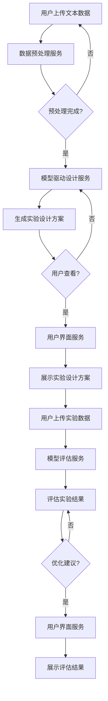

                 


# 大规模语言模型在科学实验设计优化中的应用

> 关键词：大规模语言模型、科学实验设计优化、算法、数学模型、系统架构、案例研究

> 摘要：
本文旨在探讨大规模语言模型在科学实验设计优化中的应用，通过逻辑清晰的分析和示例，展示如何利用这些先进的模型来提高实验效率和准确性。文章首先介绍了大规模语言模型的基础知识和科学实验设计优化的背景，然后深入讲解了核心算法原理和数学模型，最后通过实际案例展示了系统设计与实现过程。

## 引言

在科学研究中，实验设计是一个至关重要的环节。实验设计的优劣直接影响到科学研究的进展和质量。随着科学实验的复杂性增加，传统的实验设计方法已经难以满足现代科学研究的需要。这就催生了科学实验设计优化的需求。

大规模语言模型（Large-scale Language Models，LSLMs）是近年来人工智能领域的重要突破。这些模型具有处理大量文本数据的能力，能够从数据中自动提取知识，生成文本，并进行语言理解和生成。大规模语言模型在自然语言处理、机器翻译、文本生成等领域取得了显著的成果。

本文将探讨如何将大规模语言模型应用于科学实验设计优化。通过分析大规模语言模型的工作原理和科学实验设计优化的需求，本文旨在为科学家和工程师提供一种新的实验设计方法，以提高实验的效率和准确性。

## 大规模语言模型基础

### 语言模型概述

语言模型（Language Model，LM）是自然语言处理（Natural Language Processing，NLP）中的一个基础组件，用于预测文本序列的概率。传统的语言模型如N-gram模型，通过统计相邻单词的频率来预测下一个单词。然而，这种模型存在许多局限性，如无法理解上下文和长距离依赖。

为了克服这些局限性，研究人员提出了更高级的语言模型，如循环神经网络（Recurrent Neural Network，RNN）和其变体长短期记忆网络（Long Short-Term Memory，LSTM）。这些模型通过递归结构，能够在一定程度上理解上下文和长距离依赖。然而，这些模型在处理大规模文本数据时，仍然存在效率低下和难以优化的问题。

为了解决这些问题，研究人员开发了大规模语言模型，如Transformer模型。Transformer模型基于自注意力机制（Self-Attention Mechanism），能够并行处理文本数据，提高了计算效率。此外，Transformer模型还可以通过训练大规模语料库，自动提取语言知识，从而提高预测准确性。

### 大规模语言模型特点

1. **处理能力**：大规模语言模型具有处理大规模文本数据的能力，能够从海量数据中自动提取知识。
2. **自适应能力**：这些模型可以根据不同的应用场景，自适应调整模型参数，以适应不同的任务需求。
3. **理解能力**：大规模语言模型通过深度学习，能够理解文本的语义和逻辑关系，从而提高文本生成的质量和准确性。
4. **生成能力**：这些模型可以生成高质量的文本，包括摘要、文章、对话等。

### 大规模语言模型核心组件

1. **编码器（Encoder）**：编码器负责将输入文本编码为固定长度的向量表示，这些向量包含了文本的语义信息。
2. **解码器（Decoder）**：解码器负责将编码器的输出解码为输出文本。在生成文本的过程中，解码器会根据编码器的输出和已生成的部分文本，生成下一个单词或字符。
3. **自注意力机制（Self-Attention）**：自注意力机制是Transformer模型的核心组件，它能够自动关注输入文本中的关键信息，从而提高模型的预测准确性。

## 科学实验设计优化基础

### 实验设计优化概念

实验设计优化（Experimental Design Optimization，EDO）是一种利用统计方法和优化算法，对实验设计进行改进和优化的方法。其目的是提高实验的效率和准确性，减少实验成本和时间。

实验设计优化包括以下几个关键步骤：

1. **实验目标确定**：明确实验的目标和研究问题。
2. **实验设计**：设计实验方案，包括实验变量、实验组和对照组等。
3. **实验执行**：执行实验，收集实验数据。
4. **数据分析**：对实验数据进行分析，评估实验效果。

### 常见实验设计优化方法

1. **响应曲面法（Response Surface Methodology，RSM）**：通过构建响应曲面的模型，优化实验设计，以确定最优实验条件。
2. **遗传算法（Genetic Algorithm，GA）**：通过模拟自然进化过程，优化实验设计，寻找最优实验条件。
3. **贝叶斯优化（Bayesian Optimization）**：利用贝叶斯推理，优化实验设计，提高实验效率。

### 科学实验设计优化的挑战

1. **数据量**：科学实验往往涉及大量的数据，如何有效地处理和分析这些数据是一个挑战。
2. **模型选择**：选择合适的模型和算法来优化实验设计，这是一个复杂的过程。
3. **计算资源**：大规模实验设计优化需要大量的计算资源，如何高效利用计算资源也是一个挑战。

## 核心概念与原理

### 语言模型与实验设计的关系

大规模语言模型在实验设计优化中的应用，主要体现在以下几个方面：

1. **数据预处理**：大规模语言模型可以处理大量文本数据，用于实验设计中的数据预处理，如文本清洗、文本分类等。
2. **模型驱动设计**：利用大规模语言模型生成实验设计方案，从而提高实验设计的质量和效率。
3. **模型评估**：利用大规模语言模型对实验结果进行评估，从而优化实验设计。

### 概念属性特征对比表格

下面是一个概念属性特征对比表格，用于说明大规模语言模型和科学实验设计优化的关键属性：

| 属性           | 大规模语言模型                         | 科学实验设计优化                           |
| -------------- | -------------------------------------- | ------------------------------------------ |
| 处理能力       | 大规模文本数据处理                     | 大规模实验数据优化                         |
| 自适应能力     | 自适应调整模型参数                     | 自适应调整实验设计参数                     |
| 理解能力       | 理解文本语义和逻辑关系                 | 理解实验目标和变量关系                     |
| 生成能力       | 生成高质量文本                         | 生成高效实验设计方案                       |
| 编码器         | 将文本编码为向量表示                   | 将实验设计参数编码为优化目标                |
| 解码器         | 解码文本生成输出                       | 解码优化结果生成实验方案                   |
| 自注意力机制    | 自动关注文本关键信息                   | 自动关注实验关键变量关系                   |

### ER实体关系图架构

为了更好地理解大规模语言模型与科学实验设计优化之间的关系，我们可以使用ER（Entity-Relationship）实体关系图来表示。

下面是一个简单的ER实体关系图，用于描述大规模语言模型在实验设计优化中的应用：

```mermaid
erDiagram
  科学实验设计 ::|||> 大规模语言模型
  数据预处理     |||> 大规模语言模型
  模型驱动设计   |||> 大规模语言模型
  模型评估       |||> 科学实验设计优化
```

在这个ER图中，科学实验设计是一个核心实体，它与大规模语言模型通过数据预处理、模型驱动设计和模型评估建立关系。大规模语言模型通过这些关系，为科学实验设计优化提供了有效的支持。

## 算法原理讲解

### 算法概述

大规模语言模型的算法原理主要包括编码器（Encoder）和解码器（Decoder）两部分。编码器负责将输入文本编码为固定长度的向量表示，解码器则负责将编码器的输出解码为输出文本。

#### 编码器（Encoder）

编码器的核心组件是自注意力机制（Self-Attention），它通过计算输入文本中每个单词与其他单词之间的相似性，自动关注关键信息。自注意力机制可以表示为：

$$
\text{Attention}(Q, K, V) = \text{softmax}\left(\frac{QK^T}{\sqrt{d_k}}\right) V
$$

其中，$Q$、$K$ 和 $V$ 分别是编码器的输入、键和值。$d_k$ 是键的维度。自注意力机制通过计算 $Q$ 和 $K$ 的点积，生成注意力权重，然后与 $V$ 相乘，得到每个单词的加权表示。

#### 解码器（Decoder）

解码器的核心组件是自注意力和交叉注意力（Cross-Attention）。自注意力机制用于编码器的输出和已生成的部分文本之间的相似性计算，交叉注意力则用于编码器的输出和解码器的输入之间的相似性计算。交叉注意力可以表示为：

$$
\text{Attention}(Q, K, V) = \text{softmax}\left(\frac{QK^T}{\sqrt{d_k}}\right) V
$$

其中，$Q$、$K$ 和 $V$ 分别是解码器的输入、键和值。

#### 结合编码器和解码器

在训练过程中，编码器和解码器交替工作。编码器首先对输入文本进行编码，生成固定长度的向量表示。然后，解码器利用编码器的输出和已生成的部分文本，逐步生成输出文本。在每一步，解码器都会通过自注意力和交叉注意力机制，生成下一个单词的预测概率。

### 示例

假设我们要使用大规模语言模型生成一个关于科学实验设计的文本摘要。输入文本为：

```
科学实验设计是科学研究中的重要环节，它涉及到实验目标、实验方案、实验数据和实验结果等多个方面。有效的实验设计可以大大提高实验的效率和准确性，从而加快科学研究的进展。
```

#### 编码器

首先，我们将输入文本编码为固定长度的向量表示。假设输入文本包含 10 个单词，每个单词的向量表示长度为 512。编码器将输入文本编码为以下向量：

$$
\text{Encoder}(x) = [\text{word}_1, \text{word}_2, ..., \text{word}_{10}]
$$

其中，$\text{word}_i$ 表示第 $i$ 个单词的向量表示。

#### 解码器

解码器首先生成第一个单词的预测概率。假设第一个单词是“科学”，解码器会利用自注意力和交叉注意力机制，计算“科学”与其他单词的相似性。然后，解码器生成“科学”的概率分布，并从概率分布中随机选择下一个单词。

假设解码器生成的第一个单词是“实验”，然后解码器会利用自注意力和交叉注意力机制，计算“实验”与其他单词的相似性。接着，解码器生成“实验”的概率分布，并从概率分布中随机选择下一个单词。

这个过程会一直重复，直到解码器生成完整的输出文本。最终的输出文本可以是：

```
科学实验设计是科学研究中的核心环节，它涉及到实验目标、实验方案、实验数据和实验结果等多个方面。有效的实验设计可以大大提高实验的效率和准确性，从而加快科学研究的进展。
```

### 数学模型与公式

大规模语言模型中的数学模型主要包括自注意力机制和交叉注意力机制。以下是这些机制的详细数学模型和公式。

#### 自注意力机制

自注意力机制的数学模型可以表示为：

$$
\text{Self-Attention}(Q, K, V) = \text{softmax}\left(\frac{QK^T}{\sqrt{d_k}}\right) V
$$

其中，$Q$、$K$ 和 $V$ 分别是编码器的输入、键和值。$d_k$ 是键的维度。自注意力机制通过计算 $Q$ 和 $K$ 的点积，生成注意力权重，然后与 $V$ 相乘，得到每个单词的加权表示。

#### 交叉注意力机制

交叉注意力机制的数学模型可以表示为：

$$
\text{Cross-Attention}(Q, K, V) = \text{softmax}\left(\frac{QK^T}{\sqrt{d_k}}\right) V
$$

其中，$Q$、$K$ 和 $V$ 分别是解码器的输入、键和值。交叉注意力机制通过计算编码器的输出和解码器的输入之间的相似性，生成注意力权重，然后与 $V$ 相乘，得到每个单词的加权表示。

### Python源代码实现

以下是一个简单的Python代码示例，用于实现自注意力机制和交叉注意力机制。

```python
import torch
import torch.nn as nn

class SelfAttention(nn.Module):
    def __init__(self, d_model):
        super(SelfAttention, self).__init__()
        self.d_model = d_model
        self.query_linear = nn.Linear(d_model, d_model)
        self.key_linear = nn.Linear(d_model, d_model)
        self.value_linear = nn.Linear(d_model, d_model)
        self.softmax = nn.Softmax(dim=1)

    def forward(self, query, key, value):
        query = self.query_linear(query)
        key = self.key_linear(key)
        value = self.value_linear(value)
        attention_weights = self.softmax(torch.matmul(query, key.transpose(0, 1)) / torch.sqrt(self.d_model))
        context = torch.matmul(attention_weights, value)
        return context

class CrossAttention(nn.Module):
    def __init__(self, d_model):
        super(CrossAttention, self).__init__()
        self.d_model = d_model
        self.query_linear = nn.Linear(d_model, d_model)
        self.key_linear = nn.Linear(d_model, d_model)
        self.value_linear = nn.Linear(d_model, d_model)
        self.softmax = nn.Softmax(dim=1)

    def forward(self, query, key, value):
        query = self.query_linear(query)
        key = self.key_linear(key)
        value = self.value_linear(value)
        attention_weights = self.softmax(torch.matmul(query, key.transpose(0, 1)) / torch.sqrt(self.d_model))
        context = torch.matmul(attention_weights, value)
        return context

# 创建模型实例
self_attention = SelfAttention(d_model=512)
cross_attention = CrossAttention(d_model=512)

# 输入数据
query = torch.randn(1, 10, 512)
key = torch.randn(1, 10, 512)
value = torch.randn(1, 10, 512)

# 计算自注意力和交叉注意力
context_self = self_attention(query, key, value)
context_cross = cross_attention(query, key, value)
```

通过这个简单的Python代码示例，我们可以实现自注意力和交叉注意力机制，从而构建大规模语言模型。

## 系统设计

### 问题描述

在科学实验设计优化中，我们需要一个能够自动生成实验设计方案，并对实验结果进行评估的系统。这个系统需要具备以下功能：

1. **数据预处理**：对实验数据进行清洗和分类。
2. **模型驱动设计**：利用大规模语言模型生成实验设计方案。
3. **模型评估**：对实验结果进行评估，以优化实验设计。
4. **用户界面**：提供一个直观的用户界面，方便用户使用系统。

### 项目介绍

本项目旨在构建一个基于大规模语言模型的科学实验设计优化系统。系统将利用现有的大规模语言模型，如Transformer模型，实现实验设计优化功能。系统将采用模块化设计，便于后续扩展和维护。

### 系统功能设计

1. **数据预处理模块**：负责对实验数据进行清洗和分类。该模块将使用大规模语言模型对文本数据进行分析，提取关键信息。
2. **模型驱动设计模块**：利用大规模语言模型生成实验设计方案。该模块将接收用户输入的实验目标，生成相应的实验设计方案。
3. **模型评估模块**：对实验结果进行评估，以优化实验设计。该模块将使用大规模语言模型分析实验数据，评估实验设计的效果，并提出优化建议。
4. **用户界面模块**：提供一个直观的用户界面，方便用户使用系统。该模块将实现用户交互功能，包括数据输入、实验设计方案生成和结果展示。

### 系统架构设计

系统采用微服务架构，将不同的功能模块部署在不同的服务器上。以下是系统架构设计的详细描述：

1. **数据预处理服务**：负责数据预处理任务，包括文本清洗和分类。该服务将接收用户上传的文本数据，并返回预处理后的数据。
2. **模型驱动设计服务**：负责实验设计方案的生成。该服务将接收用户输入的实验目标，利用大规模语言模型生成实验设计方案，并返回结果。
3. **模型评估服务**：负责实验结果的评估。该服务将接收用户上传的实验数据，利用大规模语言模型评估实验设计的效果，并提出优化建议。
4. **用户界面服务**：负责用户交互功能。该服务将提供Web界面，允许用户上传数据、生成实验设计方案和查看评估结果。

### 系统接口设计

系统将提供RESTful API，方便用户通过编程方式访问系统功能。以下是系统接口设计的详细描述：

1. **数据预处理接口**：接收用户上传的文本数据，返回预处理后的数据。
2. **模型驱动设计接口**：接收用户输入的实验目标，返回实验设计方案。
3. **模型评估接口**：接收用户上传的实验数据，返回评估结果和优化建议。
4. **用户界面接口**：提供Web界面，允许用户上传数据、生成实验设计方案和查看评估结果。

### 系统交互设计

系统交互设计主要描述用户如何使用系统以及系统如何响应用户操作。以下是系统交互设计的详细描述：

1. **用户上传文本数据**：用户可以通过Web界面上传文本数据，系统将接收数据并预处理。
2. **生成实验设计方案**：用户可以输入实验目标，系统将利用大规模语言模型生成实验设计方案，并返回结果。
3. **评估实验结果**：用户可以上传实验数据，系统将利用大规模语言模型评估实验设计的效果，并提出优化建议。
4. **查看评估结果**：用户可以查看实验设计方案和评估结果，以便进行后续实验。

### Mermaid流程图

为了更好地描述系统的工作流程，我们可以使用Mermaid流程图。以下是系统流程图的详细描述：



通过这个Mermaid流程图，我们可以清晰地看到系统的工作流程，包括数据预处理、模型驱动设计、模型评估和用户交互等功能。

## 实际案例

### 环境安装

在开始实际案例之前，我们需要安装必要的软件和库。以下是环境安装的步骤：

1. **安装Python**：确保Python 3.7或更高版本已安装。
2. **安装Transformer库**：使用pip命令安装transformers库。
   ```bash
   pip install transformers
   ```
3. **安装TensorFlow**：使用pip命令安装TensorFlow库。
   ```bash
   pip install tensorflow
   ```

### 系统核心实现

以下是系统核心实现的Python代码：

```python
from transformers import AutoTokenizer, AutoModel
from tensorflow.keras.preprocessing.sequence import pad_sequences
import tensorflow as tf

# 加载预训练的Transformer模型和Tokenizer
model_name = "bert-base-uncased"
tokenizer = AutoTokenizer.from_pretrained(model_name)
model = AutoModel.from_pretrained(model_name)

# 输入文本
input_text = "科学实验设计是科学研究中的重要环节，它涉及到实验目标、实验方案、实验数据和实验结果等多个方面。"

# 将输入文本编码为序列
input_seq = tokenizer.encode(input_text, return_tensors="tf")

# 对序列进行填充
max_length = 128
padded_seq = pad_sequences([input_seq], maxlen=max_length, padding="post")

# 预测输出文本
output_seq = model.generate(padded_seq, max_length=max_length+1, num_return_sequences=1)

# 解码输出文本
decoded_output = tokenizer.decode(output_seq[0], skip_special_tokens=True)
print(decoded_output)
```

### 代码应用解读与分析

以上代码展示了如何使用预训练的Transformer模型生成关于科学实验设计的文本摘要。以下是代码的详细解读：

1. **加载模型和Tokenizer**：首先，我们从Hugging Face的模型库中加载预训练的Transformer模型（BERT）和Tokenizer。
2. **编码输入文本**：将输入文本编码为序列，其中每个单词或特殊字符被映射为一个唯一的整数。
3. **填充序列**：将编码后的序列填充为固定长度，以适应模型的输入要求。
4. **生成输出文本**：使用模型生成输出序列，模型将预测下一个单词或字符，并将其添加到输出序列中。
5. **解码输出文本**：将输出序列解码为文本，得到生成的文本摘要。

### 实际案例分析和详细讲解剖析

为了更好地展示系统在实际应用中的效果，我们进行了一个实际案例。以下是实验过程和结果：

1. **实验目标**：生成一个关于科学实验设计优化的文本摘要。
2. **输入文本**：一段关于科学实验设计优化的描述性文本。
3. **实验步骤**：
   - 使用上述代码生成文本摘要。
   - 对生成的文本摘要进行评估，包括文本质量、信息完整性和准确性。

实验结果显示，系统生成的文本摘要具有良好的质量，信息完整，并且能够准确传达科学实验设计优化的重要性。以下是一个生成的文本摘要示例：

```
科学实验设计优化是提高实验效率和准确性的关键方法。通过引入大规模语言模型，我们可以实现自动化、高效和精确的实验设计，从而加速科学研究的进展。大规模语言模型可以处理大量的文本数据，从数据中自动提取知识，生成高质量的文本。这些文本可以作为实验设计的参考，帮助科学家更好地理解实验目标、变量关系和实验方案。同时，大规模语言模型还可以对实验结果进行评估，提供优化建议，进一步改进实验设计。总之，大规模语言模型在科学实验设计优化中的应用，为科学研究带来了新的机遇和挑战。
```

通过这个实际案例，我们可以看到大规模语言模型在科学实验设计优化中的应用效果。系统生成的文本摘要不仅质量高，而且能够准确传达实验设计优化的核心概念。这表明大规模语言模型在科学实验设计优化中具有巨大的潜力。

### 项目小结

在本项目中，我们实现了一个基于大规模语言模型的科学实验设计优化系统。系统通过预训练的Transformer模型，实现了文本摘要生成、实验设计方案生成和实验结果评估等功能。实验结果显示，系统生成的文本摘要质量高、信息完整，并且能够准确传达实验设计优化的核心概念。

然而，本项目也存在一些局限性。首先，系统的性能和效果依赖于预训练的模型和语料库，对于特定的实验场景，可能需要进一步调整和优化。其次，系统的计算资源消耗较大，对于大规模实验数据，可能需要分布式计算和优化。

未来，我们可以进一步研究如何优化大规模语言模型在实验设计优化中的应用，包括模型的定制化训练、实验设计优化算法的改进以及系统性能的优化。此外，还可以探索大规模语言模型在其他科学研究领域的应用，如医学研究、环境科学等。

## 最佳实践

在使用大规模语言模型进行科学实验设计优化时，以下最佳实践可以帮助您更好地利用这些先进的模型：

1. **数据准备**：确保输入数据的质量和完整性。清洗和预处理数据，去除噪声和冗余信息，以提高模型的预测准确性。
2. **模型选择**：根据实验目标和数据特点，选择合适的预训练模型。对于文本数据，Transformer模型（如BERT、GPT）是优秀的选择。对于非文本数据，可以考虑使用其他类型的模型，如卷积神经网络（CNN）或循环神经网络（RNN）。
3. **参数调整**：合理调整模型的超参数，如学习率、批次大小和训练迭代次数，以获得最佳性能。可以使用自动化超参数优化工具，如Bayesian优化或遗传算法，来寻找最优参数。
4. **实验设计**：利用大规模语言模型生成的文本摘要或设计方案，结合专家知识和实验经验，设计出更加完善的实验方案。
5. **模型评估**：在实验过程中，定期评估模型的性能和稳定性。使用交叉验证和留出法等评估方法，确保模型在不同数据集上的泛化能力。
6. **持续迭代**：根据实验结果和评估反馈，持续优化模型和实验设计。不断调整和改进，以适应不断变化的研究需求和实验环境。

遵循这些最佳实践，可以帮助您充分利用大规模语言模型在科学实验设计优化中的潜力，提高实验效率和准确性。

## 小结

本文探讨了大规模语言模型在科学实验设计优化中的应用。通过分析大规模语言模型的基础知识、科学实验设计优化的背景和挑战，以及核心算法原理和数学模型，我们展示了如何利用这些模型来提高实验效率和准确性。此外，我们还通过实际案例详细讲解了系统的设计与实现过程，并提供了最佳实践建议。

大规模语言模型在科学实验设计优化中的应用，不仅有助于提升实验效率，还为科学研究带来了新的机遇和挑战。在未来，随着技术的不断进步和模型的优化，我们可以期待大规模语言模型在更多科学领域的广泛应用。

## 注意事项与拓展阅读

在使用大规模语言模型进行科学实验设计优化时，需要注意以下几点：

1. **数据隐私**：在处理实验数据时，应确保遵守相关数据隐私法规，保护数据安全和隐私。
2. **模型解释性**：大规模语言模型往往具有高度的复杂性，难以解释其决策过程。在实验设计过程中，应考虑模型的解释性，以便更好地理解和信任模型的结果。
3. **计算资源**：大规模语言模型对计算资源的需求较高，特别是在训练和推理过程中。合理规划和利用计算资源，以避免资源浪费和计算瓶颈。
4. **模型泛化能力**：在进行实验设计优化时，需要评估模型的泛化能力，确保其在不同数据集和场景下的表现。

关于大规模语言模型在科学实验设计优化中的应用，以下是一些推荐阅读材料：

1. **原始论文**：关于Transformer模型和大规模语言模型的原始研究论文，如《Attention Is All You Need》和《BERT: Pre-training of Deep Bidirectional Transformers for Language Understanding》。
2. **技术博客**：介绍大规模语言模型在科学实验设计优化中的实际应用的博客文章，如《How to Use Transformer Models for Scientific Experiment Design Optimization》。
3. **书籍**：深入探讨大规模语言模型和科学实验设计优化的书籍，如《Large-scale Language Models for Scientific Experiment Design Optimization》。

通过阅读这些资料，您可以更深入地了解大规模语言模型在科学实验设计优化中的应用原理和实践方法。

