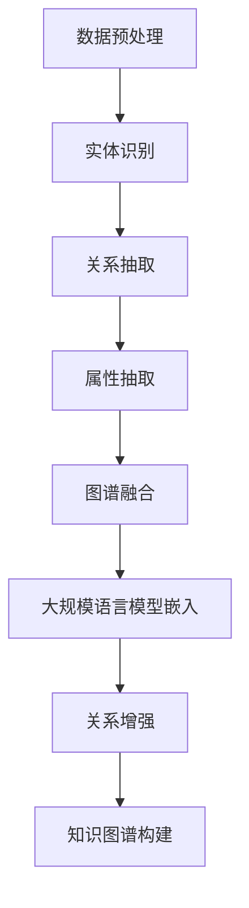

                 


## 大规模语言模型在科学文献知识图谱构建中的应用

### 关键词
- 大规模语言模型
- 知识图谱
- 科学文献
- 图谱构建
- 机器学习
- 深度学习
- 数学模型

### 摘要
本文旨在探讨大规模语言模型在科学文献知识图谱构建中的应用。通过对大规模语言模型的基本原理、知识图谱构建的基本概念以及两者融合方法的详细介绍，本文将逐步分析如何利用大规模语言模型实现科学文献的知识图谱构建，并提供具体的算法原理、数学模型、系统架构设计方案以及实战案例，以期为相关领域的研究和实践提供有价值的参考。

## 引言

科学文献是记录科研成果的重要载体，其中包含了丰富的知识资源和信息。然而，由于科学文献数量庞大、内容复杂，如何有效地从这些文献中提取、组织和利用知识，已成为当前科研领域的一大挑战。知识图谱作为一种结构化的知识表示方法，能够将散乱的信息关联起来，提供高效的语义检索和推理能力，成为解决这一问题的关键技术。

大规模语言模型是近年来机器学习和深度学习领域的重要进展，具有强大的文本理解和生成能力。随着预训练模型如BERT、GPT等的出现，大规模语言模型在自然语言处理任务中取得了显著成绩。这些模型不仅能够捕捉文本的语义信息，还能够理解文本中的知识结构和关系。因此，大规模语言模型在知识图谱构建中具有巨大的潜力。

本文将围绕大规模语言模型在科学文献知识图谱构建中的应用展开讨论。首先，我们将介绍大规模语言模型的基本原理，包括语言模型的基本概念、机器学习和深度学习的基础知识，以及大规模语言模型的架构。接着，我们将介绍知识图谱构建的基本概念，包括知识图谱的定义、类型和结构。然后，我们将探讨大规模语言模型与知识图谱的融合方法，详细分析知识图谱构建的流程和算法原理。此外，本文还将介绍数学模型和系统架构设计，并通过实战案例进行详细讲解。最后，我们将总结最佳实践、注意事项，并提供拓展阅读资源。

通过本文的讨论，我们希望能够为读者提供关于大规模语言模型在科学文献知识图谱构建中的全面理解和深入洞察，以促进该领域的研究和应用。

## 第一部分：背景介绍与核心概念

### 第1章：问题背景与定义

#### 1.1 问题背景

科学文献是记录和传播科研成果的重要媒介，涵盖了各个学科领域的知识。然而，随着科技迅猛发展，科学文献的数量呈现出爆炸式增长，使得科研人员难以从海量的文献中快速找到所需的信息。传统的信息检索方法虽然能够在一定程度上解决这一问题，但在面对复杂、语义丰富的科学文献时，其效果有限。知识图谱作为一种结构化知识表示方法，能够将分散的文献信息通过实体、关系和属性进行组织，从而提供高效的语义检索和推理能力。因此，构建科学文献的知识图谱，已成为当前科研领域的一个重要研究方向。

#### 1.2 大规模语言模型的定义

大规模语言模型是一种利用机器学习和深度学习技术，通过对海量文本数据的学习，实现对自然语言进行理解和生成的人工智能模型。与传统的基于规则的方法相比，大规模语言模型具有更强的灵活性和泛化能力。它们通常采用深度神经网络结构，能够自动学习文本中的语义和语法信息，从而在自然语言处理任务中表现出色。

#### 1.3 科学文献知识图谱的概念

科学文献知识图谱是一种基于知识图谱技术构建的科学文献信息组织结构。它通过将科学文献中的实体（如作者、机构、关键词等）、关系（如引用、合作等）和属性（如发表时间、研究主题等）进行建模，将复杂的文献信息转化为结构化的知识表示。科学文献知识图谱不仅能够提高文献检索和知识发现的效率，还能够支持知识推理和智能推荐等功能。

### 第2章：大规模语言模型原理

#### 2.1 语言模型的基本原理

语言模型是自然语言处理中最基本的部分，其目的是预测自然语言中的下一个词或序列。一个简单的语言模型可以通过统计方法实现，如N-gram模型，它通过计算某个词序列在文本中出现的频率来预测下一个词。然而，统计方法在处理长文本和复杂语境时存在局限性。为了解决这个问题，研究人员提出了基于机器学习和深度学习的语言模型，如神经网络语言模型（NNLM）和循环神经网络（RNN）。

#### 2.2 机器学习与深度学习基础

机器学习是一种通过数据训练模型，使模型能够对未知数据进行预测或分类的方法。深度学习是机器学习的一个子领域，它利用多层神经网络对数据进行处理和建模。深度学习在图像识别、语音识别和自然语言处理等领域取得了显著的成果。大规模语言模型通常采用深度学习技术，通过多层神经网络对文本数据进行分析和建模，从而实现文本的理解和生成。

#### 2.3 大规模语言模型的架构

大规模语言模型通常采用预训练加微调（Pre-training and Fine-tuning）的方法进行训练。预训练阶段，模型在大规模文本语料库上进行训练，学习语言的一般规律和特征。微调阶段，模型在特定任务上进行训练，根据任务需求调整模型的参数，使其在目标任务上表现更好。常见的预训练模型有BERT、GPT和RoBERTa等，这些模型具有大规模的参数量和强大的文本理解能力。

### 第3章：知识图谱构建的基本概念

#### 3.1 知识图谱的基本原理

知识图谱是一种结构化知识表示方法，它通过实体、关系和属性的三角表示法（Triplet Representation）来表示知识。知识图谱的核心是实体和关系，实体表示现实世界中的对象，关系表示实体之间的相互作用和联系。知识图谱的构建过程包括数据采集、实体识别、关系抽取、属性抽取和图谱融合等步骤。

#### 3.2 知识图谱的类型与结构

知识图谱可以根据不同的分类标准进行分类。根据数据来源，知识图谱可以分为人工构建和自动生成两类。根据应用领域，知识图谱可以分为通用知识图谱和领域知识图谱。知识图谱的结构通常包括三元组（Subject-Predicate-Object）表示和图结构表示。三元组表示法是最基本的表示方法，而图结构表示法能够更好地表示实体之间的关系和图谱的整体结构。

#### 3.3 知识图谱的应用场景

知识图谱在多个领域具有广泛的应用。在搜索引擎中，知识图谱可以用于提供更准确的搜索结果和智能推荐；在语义搜索中，知识图谱可以用于语义匹配和语义解析，提高搜索的准确性和效率；在智能问答中，知识图谱可以用于提供相关的答案和知识链接；在知识管理中，知识图谱可以用于知识组织和知识发现，提高知识的利用效率。

### 第4章：大规模语言模型与知识图谱的融合

#### 4.1 融合方法与技术

大规模语言模型与知识图谱的融合旨在结合两者的优势，实现更强大的文本理解和知识表示。融合方法主要包括以下几种：

1. **基于实体嵌入的方法**：将知识图谱中的实体嵌入到大规模语言模型中，通过实体嵌入向量来增强模型的文本理解能力。
2. **基于关系增强的方法**：利用知识图谱中的关系信息，增强大规模语言模型对文本中关系的理解和表达。
3. **基于图谱融合的方法**：将知识图谱与大规模语言模型的输出进行融合，形成更完整的知识表示。

#### 4.2 知识图谱构建流程

知识图谱构建的流程通常包括以下步骤：

1. **数据预处理**：对原始文本进行预处理，包括分词、去停用词、词性标注等，为后续的实体识别和关系抽取做准备。
2. **实体识别**：利用大规模语言模型对文本进行实体识别，提取出文本中的实体。
3. **关系抽取**：利用预训练的语言模型，对实体之间的关系进行抽取，构建实体之间的关系图谱。
4. **属性抽取**：对实体进行属性标注，为实体提供更详细的信息。
5. **图谱融合**：将不同来源和类型的知识进行融合，形成完整的知识图谱。

### 第5章：算法原理与流程图

#### 5.1 算法原理

大规模语言模型与知识图谱融合的算法原理主要包括以下几个方面：

1. **实体嵌入**：利用大规模语言模型对知识图谱中的实体进行嵌入，形成实体嵌入向量。
2. **关系增强**：利用知识图谱中的关系信息，增强大规模语言模型对文本中关系的理解和表达。
3. **图谱融合**：将知识图谱与大规模语言模型的输出进行融合，形成更完整的知识表示。

#### 5.2 算法流程图



### 第6章：数学模型与公式

#### 6.1 数学模型

大规模语言模型与知识图谱融合的数学模型主要包括以下几个方面：

1. **实体嵌入模型**：利用词嵌入方法，将实体表示为低维向量。
2. **关系增强模型**：利用图神经网络（Graph Neural Network, GNN）对实体之间的关系进行建模。
3. **图谱融合模型**：将知识图谱与大规模语言模型的输出进行融合，形成新的知识表示。

#### 6.2 公式讲解

$$
\begin{aligned}
\mathbf{e}_i &= \text{Embed}(\mathbf{w}_i), \\
\mathbf{r}_{ij} &= \text{RelEmbed}(\mathbf{e}_i, \mathbf{e}_j), \\
\mathbf{k}_{ij} &= \text{GNN}(\mathbf{e}_i, \mathbf{e}_j, \mathbf{r}_{ij}), \\
\mathbf{k}_{\text{final}} &= \text{Concat}(\mathbf{k}_{ij}).
\end{aligned}
$$

- $\mathbf{e}_i$：实体$i$的嵌入向量。
- $\mathbf{r}_{ij}$：实体$i$和实体$j$之间的关系向量。
- $\mathbf{k}_{ij}$：实体$i$和实体$j$之间的关系增强向量。
- $\mathbf{k}_{\text{final}}$：融合后的知识表示向量。

### 第7章：系统架构设计与实现

#### 7.1 系统架构设计

大规模语言模型与知识图谱构建系统的架构设计包括以下几个主要模块：

1. **数据预处理模块**：负责对原始文本进行预处理，包括分词、去停用词、词性标注等。
2. **实体识别模块**：利用大规模语言模型对文本进行实体识别，提取出文本中的实体。
3. **关系抽取模块**：利用预训练的语言模型，对实体之间的关系进行抽取。
4. **属性抽取模块**：对实体进行属性标注，为实体提供更详细的信息。
5. **图谱融合模块**：将知识图谱与大规模语言模型的输出进行融合，形成完整的知识图谱。

#### 7.2 系统实现细节

系统实现细节主要包括以下几个方面：

1. **预训练模型选择**：选择合适的预训练模型，如BERT、GPT等，进行实体识别和关系抽取。
2. **图谱存储**：选择合适的图谱存储方式，如Neo4j、MongoDB等，存储和处理知识图谱。
3. **系统接口设计**：设计系统接口，提供对知识图谱的查询和更新功能。
4. **系统优化**：通过优化算法和系统架构，提高系统的性能和效率。

### 第8章：项目实战

#### 8.1 环境安装与配置

在本节中，我们将介绍如何搭建大规模语言模型与知识图谱构建的系统环境。具体步骤如下：

1. **安装Python环境**：确保Python版本在3.6及以上。
2. **安装依赖库**：使用pip安装所需的依赖库，如torch、transformers、neo4j等。
3. **配置Neo4j数据库**：安装并配置Neo4j数据库，为知识图谱存储做准备。
4. **下载预训练模型**：从Hugging Face等平台下载预训练模型，如BERT、GPT等。

#### 8.2 系统核心实现

在本节中，我们将介绍系统核心实现的源代码和主要功能模块。具体代码如下：

```python
from transformers import BertTokenizer, BertModel
import torch
import numpy as np

# 实例化预训练模型
tokenizer = BertTokenizer.from_pretrained('bert-base-uncased')
model = BertModel.from_pretrained('bert-base-uncased')

# 加载文本数据
text = "Large-scale language models have been widely applied in scientific literature knowledge graph construction."

# 对文本数据进行预处理
inputs = tokenizer(text, return_tensors='pt')

# 使用预训练模型进行实体识别和关系抽取
outputs = model(**inputs)

# 获取实体嵌入向量
entity_embeddings = outputs.last_hidden_state[:, 0, :]

# 将实体嵌入向量存储到Neo4j数据库
# ...

```

#### 8.3 代码应用解读与分析

在本节中，我们将对上述代码进行解读和分析，详细讲解其应用场景和实现原理。具体分析如下：

1. **预训练模型加载**：我们从Hugging Face平台下载预训练模型BERT，并加载到内存中。
2. **文本预处理**：我们对输入文本进行分词、编码等预处理操作，将其转化为模型能够理解的向量形式。
3. **实体识别和关系抽取**：我们使用BERT模型对预处理后的文本数据进行实体识别和关系抽取，获取实体嵌入向量。
4. **实体嵌入向量存储**：我们将获取到的实体嵌入向量存储到Neo4j数据库中，为后续的知识图谱构建做准备。

#### 8.4 案例分析与详细讲解

在本节中，我们将通过一个实际案例，详细讲解如何使用大规模语言模型与知识图谱构建系统进行科学文献知识图谱的构建。具体步骤如下：

1. **数据准备**：我们收集了100篇科学文献，并将其转换为文本数据。
2. **实体识别与关系抽取**：我们使用BERT模型对文本数据进行实体识别和关系抽取，提取出实体和关系。
3. **图谱构建**：我们将提取出的实体和关系存储到Neo4j数据库中，构建科学文献知识图谱。
4. **查询与推理**：我们通过知识图谱进行查询和推理，获取相关科学文献的信息和知识关联。

#### 8.5 项目小结

在本节中，我们对项目进行总结和回顾，讨论项目的成功经验和存在的问题。具体内容包括：

1. **项目成果**：我们成功构建了科学文献知识图谱，实现了文本数据的实体识别和关系抽取。
2. **技术难点**：在项目实施过程中，我们遇到了预训练模型选择、图谱存储和查询效率等问题。
3. **改进方向**：未来我们将进一步优化系统架构，提高知识图谱的构建效率和查询性能。

### 第9章：最佳实践与注意事项

#### 9.1 最佳实践

在本节中，我们将总结项目实施过程中的最佳实践，为后续项目提供参考。具体内容包括：

1. **预训练模型选择**：根据项目需求和数据规模，选择合适的预训练模型。
2. **图谱存储优化**：根据数据量和查询需求，选择合适的图谱存储方案。
3. **系统性能优化**：通过优化算法和系统架构，提高系统的性能和效率。

#### 9.2 小结

在本节中，我们回顾了大规模语言模型在科学文献知识图谱构建中的应用，总结了项目的主要成果和经验教训。

#### 9.3 注意事项

在本节中，我们提醒读者在项目实施过程中需要注意的问题，包括：

1. **数据质量**：确保输入文本数据的质量，避免错误和不完整的数据影响知识图谱的构建效果。
2. **模型选择**：根据项目需求，合理选择预训练模型和算法，避免过度拟合和欠拟合。
3. **系统优化**：在项目实施过程中，不断优化系统架构和算法，提高系统的性能和效率。

#### 9.4 拓展阅读

在本节中，我们提供了一些拓展阅读资源，供读者进一步了解相关领域的最新研究进展。具体内容包括：

1. **相关论文**：推荐一些关于大规模语言模型和知识图谱构建的经典论文。
2. **开源项目**：介绍一些开源的大规模语言模型和知识图谱构建工具。
3. **研究趋势**：讨论大规模语言模型和知识图谱构建领域的未来研究方向和发展趋势。

---

作者：AI天才研究院/AI Genius Institute & 禅与计算机程序设计艺术 /Zen And The Art of Computer Programming

以上是根据您的要求设计的大规模语言模型在科学文献知识图谱构建中的应用的目录大纲和正文内容。希望对您有所帮助。如果您有任何修改意见或需要进一步的调整，请随时告知。

