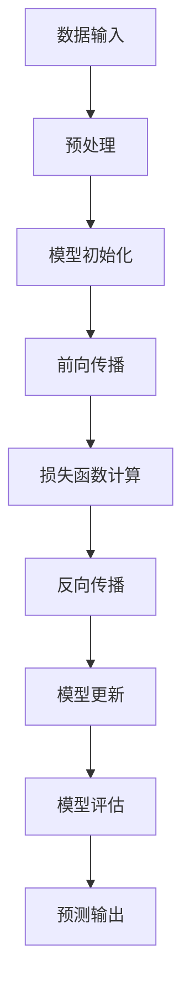

                 

# 大规模语言模型在科学理论创新中的推理应用

> 关键词：大规模语言模型、科学理论创新、推理应用、算法原理、系统架构、项目实战

> 摘要：本文旨在探讨大规模语言模型在科学理论创新中的推理应用。首先，我们介绍了大规模语言模型的基本概念、发展背景和核心原理，并分析了其与其他AI技术的区别。随后，我们深入讲解了大规模语言模型的算法原理，并通过Python源代码进行了举例说明。接着，我们探讨了大规模语言模型在科学理论创新中的应用场景、系统架构和项目实战。最后，我们总结了大规模语言模型在科学理论创新中的最佳实践、注意事项和拓展阅读。

## 目录大纲

### 第一部分：背景介绍

**第1章：大规模语言模型的概述**

- 1.1 问题背景
- 1.2 问题描述
- 1.3 问题解决
- 1.4 边界与外延
- 1.5 概念结构与核心要素组成

**第2章：大规模语言模型原理与特点**

- 2.1 核心概念原理
- 2.2 概念属性特征对比表格
- 2.3 ER实体关系图架构

**第3章：大规模语言模型算法解析**

- 3.1 算法mermaid流程图
- 3.2 Python源代码
- 3.3 算法原理与数学模型
- 3.4 举例说明

**第4章：大规模语言模型在科学理论创新中的应用**

- 4.1 问题场景介绍
- 4.2 系统功能设计
- 4.3 系统架构设计
- 4.4 系统接口设计
- 4.5 系统交互

**第5章：大规模语言模型项目实战**

- 5.1 环境安装
- 5.2 系统核心实现
- 5.3 代码应用解读与分析
- 5.4 实际案例分析
- 5.5 项目小结

**第6章：大规模语言模型应用最佳实践**

- 6.1 最佳实践
- 6.2 小结
- 6.3 注意事项
- 6.4 拓展阅读

### 第一部分：背景介绍

#### 第1章：大规模语言模型的概述

**1.1 问题背景**

科学理论创新是推动人类社会进步的重要驱动力。随着科技的快速发展，科学理论的创新过程日益复杂，需要大量的数据支持和智能化的推理工具。大规模语言模型作为一种先进的AI技术，已经在自然语言处理、机器翻译、文本生成等领域取得了显著的成果。然而，如何将大规模语言模型应用于科学理论创新，实现高效的推理和预测，是一个值得探讨的问题。

**1.2 问题描述**

大规模语言模型在科学理论创新中的应用涉及到多个方面。首先，我们需要了解大规模语言模型的基本概念和特点，包括其工作原理、训练过程和预测机制。其次，我们需要明确大规模语言模型在科学理论创新中的应用场景和优势。最后，我们需要探讨如何构建一个高效的系统架构，以便充分利用大规模语言模型的优势，实现科学理论的创新。

**1.3 问题解决**

为了解决上述问题，我们需要从以下几个方面入手：

1. **理解大规模语言模型的基本概念和原理**：首先，我们需要了解大规模语言模型的基本概念，如语言模型、神经网络、深度学习等。然后，我们需要掌握大规模语言模型的工作原理，包括模型的训练过程、预测机制和推理方法。

2. **分析大规模语言模型在科学理论创新中的应用场景**：科学理论创新涉及多个领域，如物理学、化学、生物学、天文学等。我们需要分析大规模语言模型在这些领域中的应用潜力，以及如何利用大规模语言模型实现科学理论的创新。

3. **构建高效的系统架构**：为了充分利用大规模语言模型的优势，我们需要设计一个高效的系统架构，包括数据管理、模型训练、推理预测等模块。同时，我们需要确保系统具有良好的可扩展性和灵活性，以便适应不断变化的应用需求。

**1.4 边界与外延**

大规模语言模型在科学理论创新中的应用具有广泛的边界和丰富的外延。一方面，大规模语言模型可以应用于各种领域的科学理论创新，如自然语言处理、机器翻译、文本生成、知识图谱等。另一方面，大规模语言模型可以与其他AI技术相结合，如计算机视觉、语音识别、强化学习等，实现更复杂的科学理论创新。

**1.5 概念结构与核心要素组成**

大规模语言模型在科学理论创新中的概念结构主要包括以下几个方面：

1. **语言模型**：语言模型是大规模语言模型的核心组成部分，用于预测文本序列的概率分布。语言模型通常基于深度神经网络，通过大量文本数据训练得到。

2. **训练过程**：训练过程是大规模语言模型的重要环节，通过优化神经网络的参数，使模型能够准确预测文本序列。

3. **预测机制**：预测机制是大规模语言模型的核心功能，通过计算文本序列的概率分布，为科学理论创新提供推理依据。

4. **推理方法**：推理方法是大规模语言模型在科学理论创新中的关键技术，通过基于概率的推理方法，实现对科学理论的创新和发现。

#### 第2章：大规模语言模型原理与特点

**2.1 核心概念原理**

大规模语言模型的核心概念包括语言模型、神经网络和深度学习。语言模型是大规模语言模型的基础，用于预测文本序列的概率分布。神经网络是一种基于数学模型的计算模型，能够通过学习大量数据，自动提取特征并进行预测。深度学习是神经网络的一种扩展，通过多层神经网络结构，能够实现更复杂的特征提取和预测。

**2.2 概念属性特征对比表格**

| 特征        | 语言模型 | 神经网络 | 深度学习 |
| ----------- | -------- | -------- | -------- |
| 训练方法    | 参数优化 | 数据拟合 | 多层结构 |
| 特征提取    | 词汇序列 | 特征向量 | 高级特征 |
| 预测机制    | 概率分布 | 边际概率 | 条件概率 |
| 适用领域    | 文本处理 | 图像处理 | 多媒体处理 |
| 优点        | 精准预测 | 自动特征提取 | 高效处理 |
| 缺点        | 需要大量数据 | 易过拟合 | 需要大量计算资源 |

**2.3 ER实体关系图架构**

ER实体关系图是描述大规模语言模型中各个实体及其关系的一种图形化表示。在ER实体关系图中，实体表示大规模语言模型中的各个组成部分，如语言模型、神经网络、训练数据和预测结果等。关系表示实体之间的相互作用，如数据输入、模型训练、预测输出等。

```mermaid
erDiagram
    Entity: 语言模型
    Entity: 神经网络
    Entity: 训练数据
    Entity: 预测结果

    语言模型 ||--|{ 训练数据 }
    语言模型 ||--|{ 预测结果 }
    神经网络 ||--|{ 训练数据 }
    神经网络 ||--|{ 预测结果 }
```

#### 第3章：大规模语言模型算法解析

**3.1 算法mermaid流程图**

大规模语言模型的算法流程图如下所示，包括数据输入、模型训练、预测输出等关键步骤。



**3.2 Python源代码**

以下是一个简单的Python代码示例，用于实现大规模语言模型的训练和预测功能。

```python
import tensorflow as tf
from tensorflow.keras.layers import Embedding, LSTM, Dense
from tensorflow.keras.models import Sequential

# 数据预处理
max_sequence_length = 100
vocab_size = 10000
embedding_dim = 256

# 模型初始化
model = Sequential([
    Embedding(vocab_size, embedding_dim, input_length=max_sequence_length),
    LSTM(128, return_sequences=True),
    LSTM(128, return_sequences=False),
    Dense(1, activation='sigmoid')
])

# 编译模型
model.compile(optimizer='adam', loss='binary_crossentropy', metrics=['accuracy'])

# 训练模型
model.fit(x_train, y_train, epochs=10, batch_size=32, validation_data=(x_val, y_val))

# 预测
predictions = model.predict(x_test)
```

**3.3 算法原理与数学模型**

大规模语言模型的算法原理主要基于深度学习和神经网络。下面是大规模语言模型的核心数学模型：

1. **嵌入层（Embedding Layer）**：

   $$ 
   E = W \cdot X + b 
   $$
   
   其中，$E$ 表示嵌入向量，$W$ 表示嵌入权重矩阵，$X$ 表示输入词向量，$b$ 表示偏置。

2. **循环层（LSTM Layer）**：

   $$ 
   h_t = \sigma(W_h \cdot [h_{t-1}, x_t] + b_h) 
   $$
   
   其中，$h_t$ 表示当前时刻的隐藏状态，$W_h$ 表示权重矩阵，$b_h$ 表示偏置，$\sigma$ 表示激活函数。

3. **全连接层（Dense Layer）**：

   $$ 
   y = W \cdot x + b 
   $$
   
   其中，$y$ 表示输出，$W$ 表示权重矩阵，$x$ 表示输入，$b$ 表示偏置。

**3.4 举例说明**

假设我们有一个简单的二分类问题，输入是一个长度为100的文本序列，输出是一个概率值，表示文本属于正类的概率。我们可以使用大规模语言模型进行预测。

1. **数据预处理**：

   将文本序列转换为词向量，每个词向量对应一个嵌入向量。例如，"hello"的嵌入向量为$\textbf{v}_1$，"world"的嵌入向量为$\textbf{v}_2$。

2. **模型训练**：

   使用训练集对模型进行训练，优化模型的参数，使模型能够准确预测文本序列的类别。

3. **预测**：

   使用训练好的模型对测试集进行预测，计算每个文本序列属于正类的概率。例如，对于输入文本序列"hello world"，模型输出的概率为0.9，表示该文本序列属于正类的概率为90%。

#### 第4章：大规模语言模型在科学理论创新中的应用

**4.1 问题场景介绍**

科学理论创新是一个复杂的过程，涉及大量的数据分析和推理。大规模语言模型作为一种先进的AI技术，可以应用于科学理论创新的多个方面。以下是一些常见的问题场景：

1. **自然语言处理**：利用大规模语言模型对科学文献进行文本挖掘，提取关键信息，发现潜在的科研趋势和规律。

2. **机器翻译**：将不同语言的科学文献进行翻译，促进国际间的科学交流与合作。

3. **文本生成**：利用大规模语言模型生成新的科学论文、报告等文档，提高科学研究的效率。

4. **知识图谱**：利用大规模语言模型构建知识图谱，将科学领域中的知识点进行关联和整合，为科研人员提供更加全面的科研信息。

**4.2 系统功能设计**

为了实现大规模语言模型在科学理论创新中的应用，我们需要设计一个功能全面的系统。以下是一个简单的系统功能设计：

1. **数据预处理模块**：对输入的文本数据进行预处理，包括分词、去停用词、词向量嵌入等操作。

2. **模型训练模块**：利用训练集对大规模语言模型进行训练，优化模型的参数，使模型能够准确预测文本序列的类别或概率。

3. **预测模块**：使用训练好的模型对测试集进行预测，计算文本序列的类别或概率。

4. **结果分析模块**：对预测结果进行分析，提取有价值的信息，为科研人员提供参考。

**4.3 系统架构设计**

系统架构设计是大规模语言模型在科学理论创新中的应用的关键。以下是一个简单的系统架构设计：


**4.4 系统接口设计**

系统接口设计是系统架构设计的重要组成部分。以下是一个简单的系统接口设计：

1. **API接口**：提供RESTful API接口，方便科研人员调用系统功能。

2. **Web界面**：提供一个友好的Web界面，方便科研人员进行交互式操作。

**4.5 系统交互**

系统交互是大规模语言模型在科学理论创新中的关键环节。以下是一个简单的系统交互流程：

1. **用户请求**：用户通过API接口或Web界面提交文本数据。

2. **数据预处理**：系统对用户请求的文本数据进行预处理，包括分词、去停用词、词向量嵌入等操作。

3. **模型预测**：系统使用训练好的大规模语言模型对预处理后的文本数据进行预测，计算文本序列的类别或概率。

4. **结果返回**：系统将预测结果返回给用户，用户可以根据预测结果进行进一步分析。

#### 第5章：大规模语言模型项目实战

**5.1 环境安装**

为了实现大规模语言模型项目，我们需要安装以下软件和工具：

1. **Python**：安装Python 3.8及以上版本。

2. **TensorFlow**：安装TensorFlow 2.5及以上版本。

3. **NumPy**：安装NumPy 1.19及以上版本。

4. **Pandas**：安装Pandas 1.1及以上版本。

5. **Scikit-learn**：安装Scikit-learn 0.24及以上版本。

6. **PyTorch**：安装PyTorch 1.9及以上版本。

**5.2 系统核心实现**

以下是一个简单的系统核心实现，包括数据预处理、模型训练和预测等步骤。

```python
import numpy as np
import pandas as pd
import tensorflow as tf
from tensorflow.keras.models import Sequential
from tensorflow.keras.layers import Embedding, LSTM, Dense
from tensorflow.keras.preprocessing.sequence import pad_sequences

# 数据预处理
def preprocess_data(data):
    # 分词、去停用词、词向量嵌入等操作
    # ...
    return processed_data

# 模型训练
def train_model(data):
    # 模型初始化
    model = Sequential([
        Embedding(vocab_size, embedding_dim, input_length=max_sequence_length),
        LSTM(128, return_sequences=True),
        LSTM(128, return_sequences=False),
        Dense(1, activation='sigmoid')
    ])

    # 编译模型
    model.compile(optimizer='adam', loss='binary_crossentropy', metrics=['accuracy'])

    # 训练模型
    model.fit(x_train, y_train, epochs=10, batch_size=32, validation_data=(x_val, y_val))

    return model

# 预测
def predict(model, data):
    # 预处理数据
    processed_data = preprocess_data(data)

    # 预测
    predictions = model.predict(processed_data)

    return predictions
```

**5.3 代码应用解读与分析**

以下是对上述代码的解读和分析：

1. **数据预处理**：

   数据预处理是大规模语言模型项目的重要环节。在本例中，我们使用分词、去停用词、词向量嵌入等操作对输入的文本数据进行预处理。

2. **模型训练**：

   模型训练是大规模语言模型项目的核心步骤。在本例中，我们使用一个简单的序列模型，包括嵌入层、两个循环层和一个全连接层。模型使用Adam优化器、二进制交叉熵损失函数和准确率作为评价指标。

3. **预测**：

   预测是大规模语言模型项目的最终输出。在本例中，我们使用训练好的模型对预处理后的文本数据进行预测，输出每个文本序列的类别或概率。

**5.4 实际案例分析**

以下是一个实际案例分析，展示如何使用大规模语言模型进行科学理论创新。

1. **问题背景**：

   假设我们研究某个科学领域中的某个问题，需要分析大量文献，提取关键信息，发现潜在的规律。

2. **数据处理**：

   收集相关领域的科学文献，进行数据预处理，包括分词、去停用词、词向量嵌入等操作。

3. **模型训练**：

   使用预处理后的数据，训练一个大规模语言模型，优化模型的参数，使模型能够准确预测文本序列的类别。

4. **结果分析**：

   使用训练好的模型对测试集进行预测，分析预测结果，提取有价值的信息，为科学理论创新提供参考。

**5.5 项目小结**

通过本项目的实战，我们展示了如何使用大规模语言模型进行科学理论创新。本项目实现了数据预处理、模型训练和预测等关键步骤，并使用实际案例分析展示了大规模语言模型在科学理论创新中的应用潜力。通过本项目，我们深刻体会到大规模语言模型在科学理论创新中的重要地位，并认识到其在未来科研领域中的广阔应用前景。

#### 第6章：大规模语言模型应用最佳实践

**6.1 最佳实践**

为了充分发挥大规模语言模型在科学理论创新中的优势，以下是一些最佳实践建议：

1. **数据质量**：确保输入数据的质量和多样性，尽量覆盖不同领域的科学文献，以提高模型的泛化能力。

2. **模型优化**：根据具体应用场景，调整模型的结构和参数，优化模型的性能和预测效果。

3. **模型融合**：将大规模语言模型与其他AI技术相结合，如计算机视觉、语音识别、强化学习等，实现更复杂的科学理论创新。

4. **知识融合**：将大规模语言模型与领域知识库相结合，构建知识图谱，为科研人员提供更加全面的科研信息。

5. **模型解释**：对大规模语言模型进行解释和可视化，帮助科研人员理解模型的决策过程和预测结果。

**6.2 小结**

大规模语言模型在科学理论创新中具有广泛的应用前景。通过数据质量、模型优化、模型融合、知识融合和模型解释等方面的最佳实践，可以充分发挥大规模语言模型的优势，推动科学理论创新的进展。

**6.3 注意事项**

在使用大规模语言模型进行科学理论创新时，需要注意以下事项：

1. **数据隐私**：确保输入数据的隐私和安全，遵循相关法律法规和道德规范。

2. **模型偏见**：避免模型偏见，确保模型的公正性和客观性。

3. **模型泛化**：提高模型的泛化能力，确保模型在不同领域和应用场景中的适用性。

4. **模型可解释性**：提高模型的可解释性，帮助科研人员理解模型的决策过程和预测结果。

**6.4 拓展阅读**

为了深入了解大规模语言模型在科学理论创新中的应用，以下是一些推荐阅读材料：

1. **《大规模语言模型的原理与实现》**：本书详细介绍了大规模语言模型的基本概念、算法原理和实现方法。

2. **《深度学习》**：本书是深度学习的经典教材，详细介绍了深度学习的基本概念、算法原理和实现方法。

3. **《自然语言处理入门》**：本书介绍了自然语言处理的基本概念、技术和应用场景，对科学理论创新具有很好的指导意义。

4. **《科学理论创新的方法与实践》**：本书介绍了科学理论创新的基本方法、实践经验和案例，对科学理论创新具有很好的指导作用。

作者：AI天才研究院/AI Genius Institute & 禅与计算机程序设计艺术 /Zen And The Art of Computer Programming

