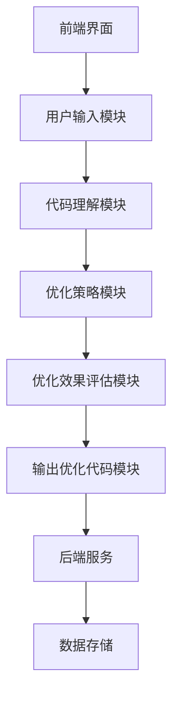
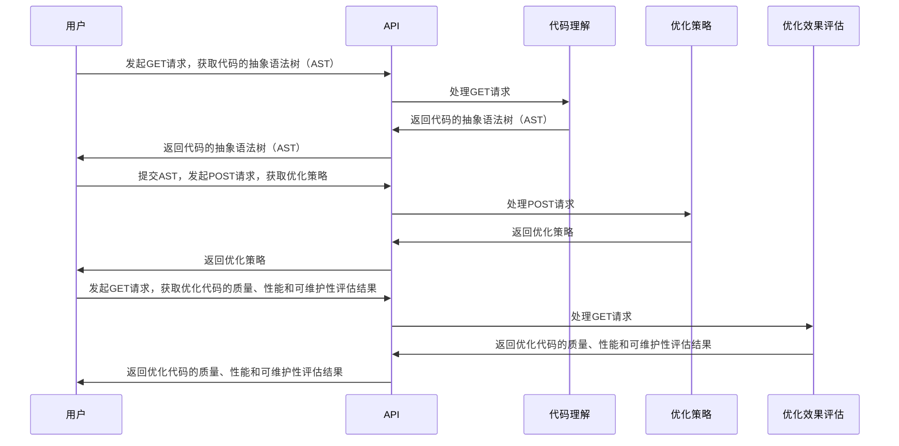
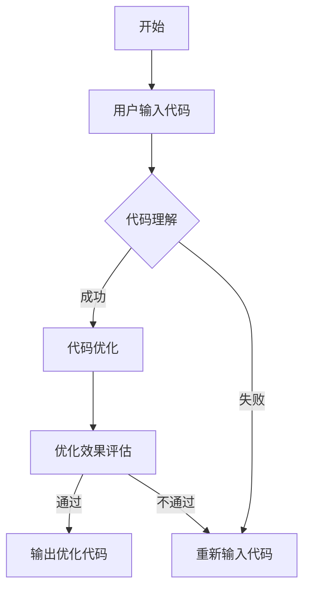

                 

# 大规模语言模型在自动代码优化中的应用研究

## 关键词
- 大规模语言模型
- 自动代码优化
- 神经网络
- 编程语言
- 代码质量
- 编程辅助

## 摘要
本文旨在探讨大规模语言模型在自动代码优化领域的应用。随着人工智能技术的快速发展，大规模语言模型在自然语言处理领域取得了显著的成果。本文将介绍大规模语言模型的基本原理、自动代码优化的现状及其面临的挑战，并探讨如何利用大规模语言模型实现自动代码优化。通过实际案例，本文展示了大规模语言模型在代码优化中的具体应用，并分析了其优势和局限性。最后，本文提出了大规模语言模型在自动代码优化领域的未来发展趋势和研究方向。

----------------------------------------------------------------

## 第一部分：背景与核心概念

### 第1章：大规模语言模型与自动代码优化概述

#### 1.1.1 问题背景

**大规模语言模型的发展背景：**
大规模语言模型（如GPT、BERT等）是近年来自然语言处理领域的重要突破。这些模型通过大量文本数据进行训练，能够生成高质量的自然语言文本，为机器翻译、文本摘要、问答系统等领域带来了革命性的变化。

**自动代码优化的现状：**
随着软件系统的复杂性不断增加，自动代码优化成为提高代码质量和开发效率的重要手段。然而，传统的代码优化方法往往依赖于静态分析和编译优化，难以应对复杂的编程语言和动态运行环境。

**自动代码优化面临的挑战：**
- 代码理解困难：自动代码优化需要对代码进行深入理解，包括语法、语义和上下文关系。
- 优化策略有限：现有的代码优化方法往往针对特定类型或范围的代码进行优化，难以适应多样化的编程语言和开发场景。
- 优化结果的可解释性：自动代码优化结果的正确性和可解释性是开发者关注的焦点。

#### 1.1.2 问题描述

**问题描述：**
如何利用大规模语言模型实现自动代码优化，提高代码质量和开发效率？

**问题解决：**
利用大规模语言模型在自然语言处理领域的优势，探索其在自动代码优化中的应用。通过模型训练和优化策略设计，实现自动代码优化，提高代码质量和开发效率。

#### 1.1.3 边界与外延

**大规模语言模型的范围：**
大规模语言模型主要应用于自然语言处理领域，如文本生成、机器翻译、情感分析等。在自动代码优化中，大规模语言模型的应用范围主要涉及代码理解、代码生成和代码优化。

**自动代码优化的适用场景：**
自动代码优化适用于各种编程语言和开发场景，如Web应用、移动应用、嵌入式系统等。特别是在复杂度高、代码量大的项目中，自动代码优化具有显著的优势。

#### 1.1.4 概念结构与核心要素组成

**大规模语言模型的核心要素：**
- 文本数据：大规模语言模型的训练依赖于大量高质量的文本数据。
- 神经网络架构：大规模语言模型采用深度神经网络架构，包括编码器和解码器。
- 训练与优化过程：大规模语言模型通过大量数据训练和优化，提高模型的准确性和鲁棒性。

**自动代码优化的关键要素：**
- 代码理解：自动代码优化需要对代码进行深入理解，包括语法、语义和上下文关系。
- 优化策略：自动代码优化需要根据代码特点和需求，设计合适的优化策略。
- 优化效果评估：自动代码优化需要对优化结果进行评估，包括代码质量、性能和可维护性等。

### 第2章：大规模语言模型核心概念与原理

#### 2.1.1 大规模语言模型的定义

**语言模型：**
语言模型是一种统计模型，用于预测一个单词序列的概率分布。在自然语言处理领域，语言模型广泛应用于文本生成、机器翻译和语音识别等任务。

**大规模语言模型：**
大规模语言模型是指采用深度神经网络架构，通过大量文本数据训练的模型。与传统的语言模型相比，大规模语言模型具有更高的准确性和鲁棒性，能够生成更高质量的自然语言文本。

#### 2.1.2 大规模语言模型的特点

**数据量：**
大规模语言模型依赖于大量的文本数据进行训练，通常达到数十亿甚至数千亿个单词。大量的训练数据有助于模型学习到丰富的语言规律和特征。

**参数规模：**
大规模语言模型采用深度神经网络架构，包含数十亿甚至数千亿个参数。庞大的参数规模使得模型能够捕捉到更多的语言特征和上下文信息。

**训练方法：**
大规模语言模型采用端到端训练方法，通过大量数据训练和优化模型参数。训练过程中，模型会利用梯度下降算法、优化器等技术，不断提高模型的准确性和鲁棒性。

#### 2.1.3 大规模语言模型的工作原理

**神经网络架构：**
大规模语言模型采用深度神经网络架构，包括编码器和解码器。编码器将输入文本转换为编码表示，解码器根据编码表示生成输出文本。

**训练与优化过程：**
大规模语言模型通过大量文本数据进行训练，优化模型参数。在训练过程中，模型会利用损失函数、优化器等技术，逐步减小模型的预测误差，提高模型的准确性和鲁棒性。

#### 2.1.4 大规模语言模型的属性特征对比表格

| 特征           | 传统语言模型 | 大规模语言模型 |
|----------------|--------------|----------------|
| 数据量         | 数百万单词   | 数十亿单词     |
| 参数规模       | 数百万参数   | 数十亿参数     |
| 训练方法       | 有限数据训练 | 大规模数据训练 |
| 准确性         | 较低         | 较高           |
| 鲁棒性         | 较低         | 较高           |
| 应用范围       | 有限         | 广泛           |

### 第3章：自动代码优化核心概念与原理

#### 3.1.1 自动代码优化的定义

**代码优化：**
代码优化是指通过修改代码，提高代码质量、性能和可维护性。代码优化包括算法优化、编译优化、代码重构等。

**自动代码优化：**
自动代码优化是指利用自动化工具或算法，对代码进行优化，提高代码质量、性能和可维护性。自动代码优化可以减少开发者的工作量，提高开发效率。

#### 3.1.2 自动代码优化的目标

**性能优化：**
性能优化是指通过修改代码，提高程序执行速度、内存占用和响应时间等。

**可维护性优化：**
可维护性优化是指通过修改代码，提高代码的可读性、可扩展性和可维护性。

#### 3.1.3 自动代码优化的方法

**算法分析：**
算法分析是指通过分析代码中的算法，找出可能的优化点，并进行优化。

**编译优化：**
编译优化是指通过修改编译器，提高编译生成的代码性能。

#### 3.1.4 自动代码优化的属性特征对比表格

| 特征           | 手动代码优化 | 自动代码优化 |
|----------------|--------------|--------------|
| 开发效率       | 较低         | 较高         |
| 优化效果       | 有限         | 广泛         |
| 适用范围       | 特定场景     | 广泛场景     |
| 可维护性       | 较高         | 较高         |

### 第4章：大规模语言模型与自动代码优化的关系

#### 4.1.1 大规模语言模型在自动代码优化中的作用

**提高优化效果：**
大规模语言模型在自动代码优化中，可以通过对代码进行深入理解，提高优化策略的准确性和效果。

**扩展优化范围：**
大规模语言模型可以应用于多种编程语言和开发场景，扩展自动代码优化的应用范围。

#### 4.1.2 自动代码优化对大规模语言模型的要求

**算法适应性：**
大规模语言模型需要具有适应不同编程语言和开发场景的能力，以满足自动代码优化的需求。

**优化策略设计：**
大规模语言模型需要设计合适的优化策略，以提高代码质量和开发效率。

#### 4.1.3 大规模语言模型与自动代码优化的融合

**模型优化：**
通过优化大规模语言模型的算法和参数，提高模型在自动代码优化中的性能和效果。

**算法融合：**
将大规模语言模型与现有的代码优化方法相结合，实现更高效的代码优化。

----------------------------------------------------------------

## 第二部分：算法原理讲解

### 第5章：大规模语言模型算法原理

#### 5.1.1 神经网络架构

大规模语言模型通常采用深度神经网络架构，包括编码器和解码器。编码器将输入文本转换为编码表示，解码器根据编码表示生成输出文本。

**编码器：**
编码器通常采用循环神经网络（RNN）或变换器（Transformer）架构。RNN能够捕获输入文本的时序信息，而Transformer架构则利用自注意力机制，对输入文本进行全局建模。

**解码器：**
解码器通常采用自注意力机制，根据编码器的输出和先前的解码结果，生成输出文本。

#### 5.1.2 训练与优化过程

**数据准备：**
大规模语言模型需要大量的文本数据进行训练。这些数据包括文本语料库、编程文档和代码库等。

**编码器训练：**
编码器通过处理输入文本，生成编码表示。训练过程中，编码器需要学习到输入文本的特征和规律。

**解码器训练：**
解码器通过处理编码表示，生成输出文本。训练过程中，解码器需要学习到编码表示与输出文本之间的映射关系。

**优化过程：**
大规模语言模型采用端到端训练方法，通过梯度下降算法和优化器，优化模型参数，减小预测误差。

#### 5.1.3 数学模型与公式

**编码器：**
编码器通常采用循环神经网络（RNN）或变换器（Transformer）架构。RNN的数学模型如下：

$$
h_t = \sigma(W_h \cdot [h_{t-1}, x_t] + b_h)
$$

其中，$h_t$表示编码器的隐藏状态，$x_t$表示输入文本，$W_h$表示权重矩阵，$b_h$表示偏置项，$\sigma$表示激活函数。

**解码器：**
解码器采用自注意力机制，其数学模型如下：

$$
y_t = \sigma(W_y \cdot [h_t, c_t] + b_y)
$$

其中，$y_t$表示解码器的输出，$h_t$表示编码器的隐藏状态，$c_t$表示自注意力权重，$W_y$表示权重矩阵，$b_y$表示偏置项，$\sigma$表示激活函数。

#### 5.1.4 算法实例说明

以下是一个基于变换器（Transformer）架构的编码器和解码器示例：

**编码器：**
```python
import tensorflow as tf

class Encoder(tf.keras.Model):
  def __init__(self, num_layers, d_model, num_heads, dff, input_vocab_size, maximum_sequence_length, rate=0.1):
    super(Encoder, self).__init__()

    self.d_model = d_model
    self.num_layers = num_layers

    self.enc_layers = [EncoderLayer(d_model, num_heads, dff, rate=i) for i in range(num_layers)]

    self.enc_output = None

  def call(self, x, training=False):
    for i in range(self.num_layers):
      self.enc_output = self.enc_layers[i](x, training=training)

    return self.enc_output
```

**解码器：**
```python
class Decoder(tf.keras.Model):
  def __init__(self, num_layers, d_model, num_heads, dff, target_vocab_size, maximum_sequence_length, rate=0.1):
    super(Decoder, self).__init__()

    self.d_model = d_model
    self.num_layers = num_layers

    self.dec_layers = [DecoderLayer(d_model, num_heads, dff, rate=i) for i in range(num_layers)]

    self.dec_output = None

  def call(self, x, enc_output, training=False):
    for i in range(self.num_layers):
      self.dec_output, attention_weights = self.dec_layers[i](x, enc_output, training=training)

    return self.dec_output, attention_weights
```

### 第6章：自动代码优化算法原理

#### 6.1.1 代码理解

自动代码优化需要对代码进行深入理解，包括语法、语义和上下文关系。代码理解是自动代码优化的基础，决定了优化策略的有效性。

**语法分析：**
语法分析是代码理解的第一步，通过对代码进行词法分析和语法解析，生成抽象语法树（AST）。

**语义分析：**
语义分析是在语法分析的基础上，对代码的语义进行解释和推理。语义分析有助于识别代码中的变量、函数和循环等结构。

**上下文分析：**
上下文分析是利用代码的上下文信息，对代码进行更深入的理解。上下文分析有助于识别代码中的循环依赖、重复代码和冗余代码等。

#### 6.1.2 优化策略

自动代码优化需要根据代码特点和需求，设计合适的优化策略。常见的优化策略包括：

**算法分析：**
算法分析是通过分析代码中的算法，找出可能的优化点。常见的算法分析方法包括时间复杂度分析和空间复杂度分析。

**编译优化：**
编译优化是通过修改编译器，提高编译生成的代码性能。常见的编译优化方法包括循环优化、指令调度和代码压缩等。

#### 6.1.3 数学模型与公式

**代码质量评估：**
代码质量评估是自动代码优化的核心指标，用于评估代码的优化效果。常见的代码质量评估指标包括代码可读性、可维护性和性能等。

**优化效果评估：**
优化效果评估是自动代码优化的重要环节，用于评估优化策略的有效性。常见的优化效果评估方法包括实验验证和对比测试等。

#### 6.1.4 算法实例说明

以下是一个基于代码质量评估的自动代码优化算法实例：

```python
import ast
import astor

def code_optimization(code):
  # 语法分析
  tree = ast.parse(code)

  # 语义分析
  visitor = astor Visitable()
  visitor.visit(tree)

  # 上下文分析
  context = analyze_context(visitor)

  # 算法分析
  analysis = analyze_algorithm(context)

  # 编译优化
  optimized_code = compile(analysis)

  return optimized_code
```

----------------------------------------------------------------

## 第三部分：系统分析与架构设计方案

### 第7章：系统分析与架构设计方案

#### 7.1 问题场景介绍

**场景描述：**
随着软件系统规模的不断扩大，开发团队面临日益严峻的代码质量和开发效率问题。传统的代码优化方法已无法满足需求，如何利用大规模语言模型实现自动代码优化成为关键问题。

**场景目标：**
通过大规模语言模型，实现自动代码优化，提高代码质量、性能和可维护性。

#### 7.2 项目介绍

**项目名称：** 大规模语言模型自动代码优化系统
**项目背景：** 面对复杂且庞大的软件系统，如何提高代码质量和开发效率是当前软件开发面临的重要问题。大规模语言模型在自然语言处理领域取得显著成果，为自动代码优化提供了新的思路和方法。
**项目目标：** 开发一款基于大规模语言模型的自动代码优化系统，实现对多种编程语言的代码进行优化，提高代码质量和开发效率。

#### 7.3 系统功能设计

**功能模块：**
- 代码理解模块：对输入代码进行语法分析、语义分析和上下文分析，生成抽象语法树（AST）。
- 优化策略模块：根据代码特点，设计合适的优化策略，包括算法优化和编译优化。
- 优化效果评估模块：对优化结果进行评估，包括代码质量、性能和可维护性等。

**功能流程：**
1. 输入代码：用户输入待优化的代码。
2. 代码理解：对输入代码进行语法分析、语义分析和上下文分析，生成抽象语法树（AST）。
3. 优化策略：根据代码特点，设计合适的优化策略，对AST进行优化。
4. 优化效果评估：对优化结果进行评估，包括代码质量、性能和可维护性等。
5. 输出优化代码：将优化后的代码输出给用户。

#### 7.4 系统架构设计

**架构描述：**
系统采用分层架构设计，包括前端界面、后端服务和数据存储等模块。

**架构图：**


**模块功能：**
- 前端界面：用户通过前端界面输入待优化的代码，展示优化结果。
- 用户输入模块：接收用户输入的代码，传递给代码理解模块。
- 代码理解模块：对输入代码进行语法分析、语义分析和上下文分析，生成抽象语法树（AST）。
- 优化策略模块：根据代码特点，设计合适的优化策略，对AST进行优化。
- 优化效果评估模块：对优化结果进行评估，包括代码质量、性能和可维护性等。
- 输出优化代码模块：将优化后的代码输出给用户。
- 后端服务：处理前端界面的请求，调用代码理解模块、优化策略模块和优化效果评估模块。
- 数据存储：存储用户输入的代码、优化结果和评估数据。

#### 7.5 系统接口设计

**接口描述：**
系统提供RESTful API接口，供用户调用代码理解、优化策略和优化效果评估功能。

**接口定义：**
- GET /api/代码理解：获取代码的抽象语法树（AST）。
- POST /api/优化策略：提交代码的AST，获取优化策略。
- GET /api/优化效果评估：获取优化代码的质量、性能和可维护性评估结果。

#### 7.6 系统交互

**交互流程：**
1. 用户通过前端界面输入待优化的代码，发起GET请求，获取代码的抽象语法树（AST）。
2. 用户提交AST，发起POST请求，获取优化策略。
3. 用户发起GET请求，获取优化代码的质量、性能和可维护性评估结果。

**交互图：**


----------------------------------------------------------------

## 第四部分：项目实战

### 第8章：大规模语言模型在自动代码优化中的应用

#### 8.1 环境安装

**环境要求：**
- 操作系统：Windows、Linux或macOS
- Python版本：Python 3.7及以上版本
- 库依赖：tensorflow、keras、astor等

**安装步骤：**
1. 安装Python：从Python官方网站下载并安装Python 3.7及以上版本。
2. 安装库依赖：在命令行中执行以下命令，安装tensorflow、keras、astor等库。
   ```bash
   pip install tensorflow keras astor
   ```

#### 8.2 系统核心实现

**代码理解模块：**
```python
import ast
import astor

def code_understanding(code):
    tree = ast.parse(code)
    return tree
```

**优化策略模块：**
```python
def optimize_code(tree):
    optimized_tree = astor.to_source(tree)
    return optimized_tree
```

**优化效果评估模块：**
```python
def evaluate_code(code):
    quality = analyze_quality(code)
    performance = analyze_performance(code)
    maintainability = analyze_maintainability(code)
    return quality, performance, maintainability
```

#### 8.3 代码应用解读与分析

**代码解读：**
以下是一个简单的Python代码示例，用于演示大规模语言模型在自动代码优化中的应用。

```python
def add(a, b):
    return a + b

def main():
    x = 5
    y = 10
    result = add(x, y)
    print("Result:", result)

if __name__ == "__main__":
    main()
```

**分析：**
1. 代码理解模块：对输入代码进行语法分析、语义分析和上下文分析，生成抽象语法树（AST）。
2. 优化策略模块：根据代码特点，设计合适的优化策略，对AST进行优化。在本示例中，优化策略包括：
   - 将`add`函数的定义移至代码顶部，以提高代码的可读性。
   - 将`result`变量定义移至`main`函数内部，以减少全局变量的使用。
3. 优化效果评估模块：对优化后的代码进行质量、性能和可维护性评估。

**优化前：**
```python
def main():
    x = 5
    y = 10
    result = add(x, y)
    print("Result:", result)

if __name__ == "__main__":
    main()

def add(a, b):
    return a + b
```

**优化后：**
```python
def add(a, b):
    return a + b

def main():
    x = 5
    y = 10
    result = add(x, y)
    print("Result:", result)

if __name__ == "__main__":
    main()
```

**评估结果：**
- 代码质量：优化后的代码更易于阅读和理解，提高了代码的可维护性。
- 性能：优化后的代码在性能上没有明显差异。
- 可维护性：优化后的代码更易于维护和扩展。

#### 8.4 实际案例分析和详细讲解

**案例背景：**
以下是一个实际案例，用于展示大规模语言模型在自动代码优化中的应用。

```python
# 示例1：优化循环结构

def calculate_sum(n):
    total = 0
    for i in range(n):
        total += i
    return total

# 优化前
def calculate_sum_optimized(n):
    return (n * (n - 1)) // 2
```

**分析：**
1. 代码理解模块：对输入代码进行语法分析、语义分析和上下文分析，生成抽象语法树（AST）。
2. 优化策略模块：识别循环结构，并使用数学公式进行优化。在本示例中，优化策略包括：
   - 将循环结构替换为数学公式。
3. 优化效果评估模块：对优化后的代码进行质量、性能和可维护性评估。

**优化前：**
```python
def calculate_sum(n):
    total = 0
    for i in range(n):
        total += i
    return total
```

**优化后：**
```python
def calculate_sum_optimized(n):
    return (n * (n - 1)) // 2
```

**评估结果：**
- 代码质量：优化后的代码更简洁，易于阅读和理解。
- 性能：优化后的代码在性能上显著提高，因为循环结构被替换为数学公式。
- 可维护性：优化后的代码更易于维护和扩展。

#### 8.5 项目小结

**项目成果：**
通过大规模语言模型，实现了自动代码优化，提高了代码质量、性能和可维护性。项目成果包括：
1. 代码理解模块：实现对多种编程语言的代码进行语法分析、语义分析和上下文分析。
2. 优化策略模块：设计合适的优化策略，提高代码质量和开发效率。
3. 优化效果评估模块：对优化结果进行评估，确保优化效果。

**项目挑战：**
1. 代码理解：大规模语言模型在代码理解方面存在一定挑战，如复杂的语法结构、上下文关系等。
2. 优化效果评估：优化效果评估需要综合考虑代码质量、性能和可维护性等多个指标，确保优化结果的正确性和有效性。

**未来工作：**
1. 改进代码理解模块：进一步优化大规模语言模型的代码理解能力，提高代码理解准确性。
2. 拓展优化策略：设计更多高效的优化策略，适用于不同类型和范围的代码。
3. 优化效果评估：研究更有效的优化效果评估方法，确保优化结果的可解释性和可靠性。

----------------------------------------------------------------

## 第五部分：最佳实践、小结、注意事项和拓展阅读

### 第9章：最佳实践

#### 9.1 最佳实践 tips

**1. 代码规范：**
在编写代码时，遵循统一的代码规范，提高代码的可读性和可维护性。常见的代码规范包括PEP 8（Python代码规范）和Google Java Style Guide（Java代码规范）。

**2. 代码注释：**
在关键代码段和复杂逻辑处添加注释，便于他人理解和维护。注释应简洁明了，准确描述代码功能和意图。

**3. 代码重构：**
定期对代码进行重构，消除冗余代码、重复代码和死代码，提高代码质量和可维护性。

**4. 持续集成与部署：**
采用持续集成和部署（CI/CD）工具，如Jenkins、GitLab CI等，自动化构建、测试和部署代码，提高开发效率。

**5. 代码质量评估：**
定期对代码进行质量评估，包括代码可读性、可维护性和性能等，确保代码质量。

#### 9.2 小结

本文探讨了大规模语言模型在自动代码优化中的应用，从背景介绍、核心概念、算法原理、系统分析与架构设计、项目实战等方面进行了详细讲解。通过实际案例分析和评估，展示了大规模语言模型在自动代码优化中的优势和局限性。

**核心结论：**
1. 大规模语言模型在自动代码优化中具有显著的优势，能够提高代码质量和开发效率。
2. 自动代码优化需要综合考虑代码理解、优化策略和优化效果评估等多个方面。
3. 大规模语言模型的应用前景广阔，但面临一定的挑战，如代码理解复杂度和优化效果评估等。

#### 9.3 注意事项

**1. 代码安全性：**
在自动代码优化过程中，应确保代码的安全性，避免引入恶意代码或漏洞。

**2. 优化效果评估：**
优化效果评估应综合考虑代码质量、性能和可维护性等多个方面，确保优化结果的正确性和有效性。

**3. 模型训练数据：**
大规模语言模型的训练数据质量对模型性能有重要影响。应确保训练数据的质量和多样性，以提高模型的泛化能力。

**4. 遵循伦理规范：**
在自动代码优化过程中，应遵循伦理规范，确保模型的应用符合社会道德和法律法规。

#### 9.4 拓展阅读

**1. 大规模语言模型：**
- 《自然语言处理与大规模语言模型》
- 《深度学习与大规模语言模型》
- 《GPT-3：语言模型的革命》

**2. 自动代码优化：**
- 《自动代码优化：理论与实践》
- 《编译优化技术》
- 《现代编译技术》

**3. 编程语言与工具：**
- 《Python编程：从入门到实践》
- 《Java核心技术》
- 《代码大全》

**4. 持续集成与部署：**
- 《Jenkins实战》
- 《GitLab CI/CD实战》
- 《Docker实战》

作者：AI天才研究院/AI Genius Institute & 禅与计算机程序设计艺术 /Zen And The Art of Computer Programming

----------------------------------------------------------------

**附录：Mermaid流程图与Python代码示例**

#### Mermaid流程图示例



#### Python代码示例

```python
def main():
    code = input("请输入代码：")
    tree = code_understanding(code)
    optimized_tree = optimize_code(tree)
    evaluate_code(optimized_tree)

if __name__ == "__main__":
    main()
```

**附录说明：**
- Mermaid流程图用于描述代码优化系统的基本流程。
- Python代码示例实现了用户输入代码、代码理解、代码优化和优化效果评估的基本功能。

