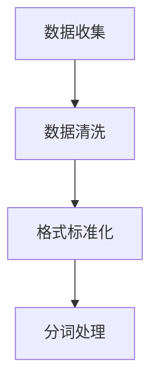
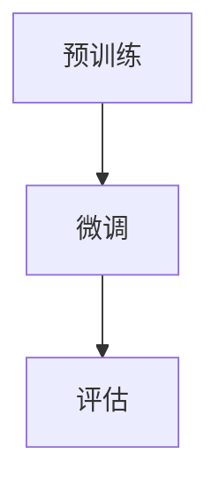
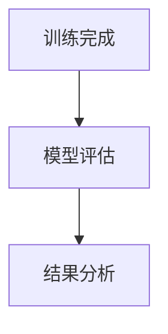
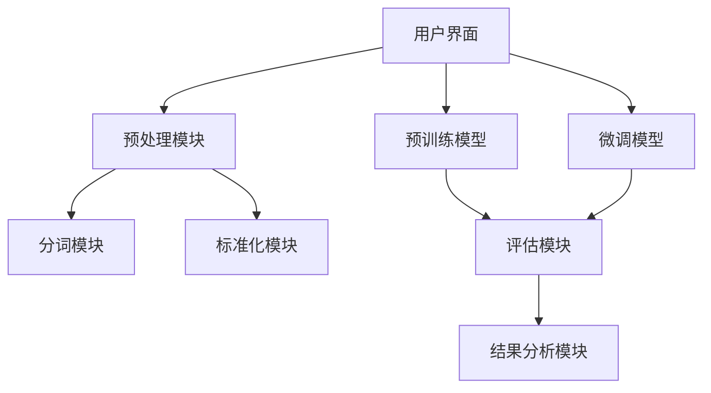
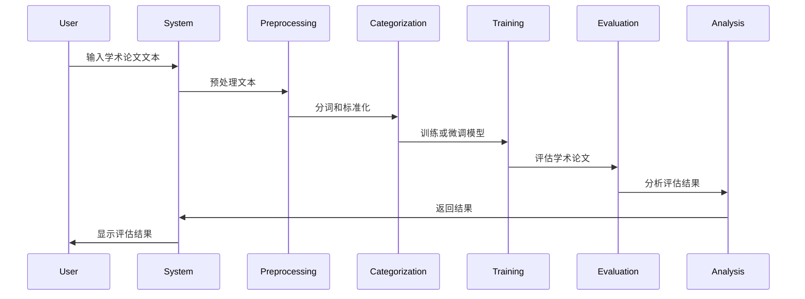

                 


# 大规模语言模型在自动学术同行评议中的应用与挑战

关键词：大规模语言模型，自动学术同行评议，可解释性，数据偏见，公平性

## 摘要

随着人工智能技术的快速发展，大规模语言模型在自然语言处理领域取得了显著的成果。自动学术同行评议作为人工智能在学术领域的应用之一，具有提高评审效率、减轻评审人员工作负担的潜力。本文首先介绍了大规模语言模型的基本原理和应用场景，然后分析了大规模语言模型在自动学术同行评议中面临的挑战，包括模型可解释性、数据偏见和公平性等方面。针对这些挑战，本文提出了一系列解决方案，并探讨了大规模语言模型在自动学术同行评议中的应用前景。

## 第一部分：背景介绍

### 1. 引言

自然语言处理（Natural Language Processing，NLP）是人工智能的一个重要分支，旨在使计算机能够理解、解释和生成自然语言。随着深度学习技术的快速发展，大规模语言模型（如GPT系列、BERT等）在NLP领域取得了显著的成果。这些模型在文本生成、文本分类、问答系统等方面表现出了强大的能力，使得自动学术同行评议成为可能。

### 1.1 问题背景

学术同行评议是确保学术论文质量的重要环节。然而，随着学术领域的不断扩展，学术论文数量急剧增加，传统的手工评审方式已经无法满足日益增长的需求。因此，自动学术同行评议作为人工智能在学术领域的应用，受到了广泛的关注。自动学术同行评议的目标是利用人工智能技术，对学术论文进行自动评估和分类，以提高评审效率，减轻评审人员的工作负担，同时保证评审过程的公正性和准确性。

### 1.2 问题描述

尽管大规模语言模型在NLP领域取得了显著成果，但其在自动学术同行评议中的应用仍然面临诸多挑战：

1. **模型可解释性不足**：大规模语言模型通常是一个“黑箱”，其决策过程难以解释。这给学术同行评议的可信度和可靠性带来了挑战。

2. **数据偏见**：训练大规模语言模型的数据集通常存在数据偏见，这可能导致评审结果不公平。例如，某些领域或观点可能会被过度强调，而其他领域或观点则被忽视。

3. **模型性能不足**：尽管大规模语言模型在通用NLP任务中表现良好，但在特定领域或语言时可能存在性能不足。这可能会影响评审结果的准确性和公正性。

4. **伦理和道德问题**：自动学术同行评议涉及到学术诚信和道德问题。如何确保评审过程的公正性和透明性，避免潜在的伦理问题，是自动学术同行评议面临的重要挑战。

### 1.3 问题解决

为了解决上述问题，本文将从以下几个方面展开研究：

1. **提高模型可解释性**：研究如何通过可解释性方法，提高大规模语言模型在学术同行评议中的决策过程的透明性和可理解性。

2. **减少数据偏见**：研究如何通过数据预处理和增强方法，减少训练数据集中的偏见，提高评审结果的公平性。

3. **优化模型性能**：研究如何通过特定领域或语言的优化策略，提高大规模语言模型在学术同行评议中的性能。

4. **确保伦理和道德问题**：研究如何确保自动学术同行评议的公正性和透明性，避免潜在的伦理问题。

### 1.4 边界与外延

本文的研究边界主要集中在自然语言处理领域，关注大规模语言模型在自动学术同行评议中的应用。同时，本文的研究外延还包括以下几个方面：

1. **自动学术同行评议在不同领域的应用案例**：研究大规模语言模型在各个学术领域的应用案例，探讨其适用性和效果。

2. **大规模语言模型在其他NLP任务中的应用**：探讨大规模语言模型在文本生成、文本分类、问答系统等NLP任务中的应用。

3. **自动学术同行评议的未来发展趋势**：分析自动学术同行评议的技术趋势和发展方向。

### 1.5 概念结构与核心要素组成

本文的核心概念包括：

1. **大规模语言模型**：具有大规模参数、强大文本处理能力的神经网络模型。
2. **自动学术同行评议**：利用人工智能技术，对学术论文进行自动评估和分类的过程。
3. **可解释性**：模型决策的透明性和可理解性。
4. **数据偏见**：模型对特定数据样本的过度拟合。

### 1.6 本章小结

本章介绍了本文的研究背景、问题描述、问题解决方法、边界与外延以及核心概念结构。下一章将详细介绍大规模语言模型的基本原理和关键技术。##

### 第二部分：核心概念与联系

## 2. 大规模语言模型的基本原理

### 2.1 基本概念

#### 2.1.1 语言模型

语言模型（Language Model，LM）是自然语言处理（Natural Language Processing，NLP）领域的一种基础模型，用于预测下一个单词或字符的概率。语言模型的核心目标是理解自然语言的统计规律，从而在给定前文序列的情况下，预测下一个单词或字符。

#### 2.1.2 大规模语言模型

大规模语言模型（Large-scale Language Model，LSLM）是指具有大规模参数、强大文本处理能力的神经网络模型。这些模型通常采用预训练（Pre-training）和微调（Fine-tuning）的方法进行训练。预训练阶段，模型在大量无标签的文本数据上进行训练，学习自然语言的底层结构和通用特征。微调阶段，模型在特定领域的有标签数据上进行训练，以适应特定任务的需求。

#### 2.1.3 自动学术同行评议

自动学术同行评议（Automated Academic Peer Review，AAPR）是指利用人工智能技术，对学术论文进行自动评估和分类的过程。其目的是提高评审效率，减轻评审人员的工作负担，同时保证评审过程的公正性和准确性。

### 2.2 原理与特性

#### 2.2.1 原理

大规模语言模型的基本原理是基于深度学习（Deep Learning，DL），特别是基于Transformer架构（Transformer Architecture）。Transformer模型通过自注意力机制（Self-Attention Mechanism）对输入的文本序列进行建模，从而实现对自然语言的深层理解。

#### 2.2.2 特性

大规模语言模型具有以下特性：

1. **强大的文本处理能力**：能够对大量文本数据进行建模，提取出有用的信息。
2. **高效的计算性能**：采用并行计算和分布式训练技术，实现快速训练和推理。
3. **通用性**：能够应用于多种自然语言处理任务，如文本生成、文本分类、问答系统等。
4. **可解释性不足**：大规模语言模型通常是一个“黑箱”，其决策过程难以解释。

### 2.3 概念属性特征对比表格

| 特性            | 大规模语言模型 | 传统语言模型 |
| --------------- | --------------- | ------------ |
| 参数规模        | 大规模参数     | 小规模参数   |
| 文本处理能力    | 强大           | 较弱         |
| 计算性能        | 高效           | 低效         |
| 应用范围        | 多样化         | 单一化       |
| 可解释性        | 较低           | 较高         |

### 2.4 ER实体关系图架构的 Mermaid 流程图

```mermaid
erDiagram
    A "大规模语言模型" ||--|{ B "文本生成" }|
    A "大规模语言模型" ||--|{ C "文本分类" }|
    A "大规模语言模型" ||--|{ D "自动学术同行评议" }|
    B "文本生成" ||--|{ E "问答系统" }|
    C "文本分类" ||--|{ F "情感分析" }|
    D "自动学术同行评议" ||--|{ G "论文评估" }|
```

### 2.5 基本原理详解

#### 2.5.1 Transformer模型

Transformer模型是大规模语言模型的核心架构，由Vaswani等人在2017年提出。Transformer模型采用了自注意力机制（Self-Attention Mechanism），使得模型能够自动学习文本序列中的依赖关系。

1. **编码器（Encoder）**

编码器是Transformer模型的核心部分，由多个编码层（Encoder Layer）堆叠而成。每个编码层包括两个子层：多头自注意力机制（Multi-Head Self-Attention）和前馈神经网络（Feed Forward Neural Network）。

2. **解码器（Decoder）**

解码器也是由多个解码层（Decoder Layer）堆叠而成。每个解码层包括三个子层：多头自注意力机制（Multi-Head Self-Attention）、编码器-解码器自注意力机制（Encoder-Decoder Self-Attention）和前馈神经网络（Feed Forward Neural Network）。

3. **自注意力机制（Self-Attention）**

自注意力机制是Transformer模型的核心创新之一。它通过计算输入文本序列中每个词与其他词之间的关联度，为每个词生成权重，从而实现文本序列的建模。

4. **多头注意力（Multi-Head Attention）**

多头注意力是自注意力机制的扩展。它将输入文本序列分成多个子序列，分别计算每个子序列的自注意力，然后合并结果。这样可以捕捉到文本序列中的不同层次关系。

5. **前馈神经网络（Feed Forward Neural Network）**

前馈神经网络是对自注意力机制结果进行进一步加工的子层。它由两个全连接层组成，分别对输入和输出进行线性变换。

#### 2.5.2 预训练与微调

大规模语言模型的训练通常分为预训练（Pre-training）和微调（Fine-tuning）两个阶段。

1. **预训练**

预训练阶段，模型在大量无标签的文本数据上进行训练，学习自然语言的底层结构和通用特征。预训练任务通常包括语言建模（Language Modeling）和掩码语言模型（Masked Language Model）。

2. **微调**

微调阶段，模型在特定领域的有标签数据上进行训练，以适应特定任务的需求。微调过程中，模型会在预训练的基础上进行调整，以优化特定任务的性能。

### 2.6 小结

本章介绍了大规模语言模型的基本概念、原理和特性，并展示了其与自动学术同行评议的关联。大规模语言模型通过Transformer架构实现了对自然语言的深层理解，其在自动学术同行评议中的应用具有巨大的潜力。然而，模型的可解释性、数据偏见和公平性等问题仍然需要进一步研究和解决。下一章将探讨大规模语言模型在自动学术同行评议中的具体应用。##

### 第三部分：算法原理讲解

## 3. 大规模语言模型在自动学术同行评议中的算法原理

在自动学术同行评议中，大规模语言模型通过一系列预处理、训练和评估过程，实现对学术论文的质量评估。下面我们将详细介绍这一过程，并使用Mermaid流程图和Python代码进行阐述。

### 3.1 数据预处理

数据预处理是大规模语言模型应用的关键步骤。首先，需要收集大量学术论文的文本数据。这些数据可能来自学术数据库、开放获取资源或同行评审过程。然后，对数据进行清洗和预处理，包括去除无关信息、标准化文本格式和分词等操作。

#### Mermaid流程图



### 3.2 模型训练

在数据预处理完成后，接下来是模型训练阶段。大规模语言模型通常采用预训练和微调的方式。预训练阶段，模型在大量无标签文本数据上进行训练，学习自然语言的底层结构和通用特征。微调阶段，模型在特定领域的有标签数据上进行训练，以适应学术同行评议的具体任务。

#### Mermaid流程图



#### Python代码示例

```python
# 假设我们使用的是GPT-3模型
import transformers
from transformers import GPT2LMHeadModel, GPT2Tokenizer

# 加载预训练的GPT-3模型和分词器
model = GPT2LMHeadModel.from_pretrained('gpt2')
tokenizer = GPT2Tokenizer.from_pretrained('gpt2')

# 预处理学术论文文本
def preprocess_text(text):
    inputs = tokenizer.encode(text, return_tensors='pt')
    return inputs

# 微调模型
def fine_tune_model(model, inputs, labels):
    # 假设我们有输入数据和标签数据
    inputs = inputs.to('cuda')
    labels = labels.to('cuda')
    
    # 训练模型
    model.train()
    outputs = model(inputs, labels=labels)
    loss = outputs.loss
    loss.backward()
    optimizer = transformers.AdamW(model.parameters(), lr=1e-5)
    optimizer.step()
    
    return model
```

### 3.3 模型评估

模型训练完成后，需要进行评估以确保其性能。评估通常包括准确率、召回率、F1分数等指标。在自动学术同行评议中，评估指标可能还包括评审结果的公正性和可解释性。

#### Mermaid流程图



#### Python代码示例

```python
from sklearn.metrics import accuracy_score, precision_score, recall_score, f1_score

# 假设我们得到预测结果和真实标签
predictions = model(inputs).detach().numpy()
true_labels = labels.detach().numpy()

# 计算评估指标
accuracy = accuracy_score(true_labels, predictions)
precision = precision_score(true_labels, predictions)
recall = recall_score(true_labels, predictions)
f1 = f1_score(true_labels, predictions)

print(f"Accuracy: {accuracy}")
print(f"Precision: {precision}")
print(f"Recall: {recall}")
print(f"F1 Score: {f1}")
```

### 3.4 小结

本章详细介绍了大规模语言模型在自动学术同行评议中的算法原理，包括数据预处理、模型训练和模型评估。通过Mermaid流程图和Python代码示例，我们展示了大规模语言模型在学术同行评议中的具体应用过程。尽管大规模语言模型在学术同行评议中具有巨大潜力，但其可解释性、数据偏见和公平性等问题仍然需要进一步研究。下一章将探讨大规模语言模型在自动学术同行评议中的实际应用。##

### 第四部分：系统分析与架构设计方案

## 4. 大规模语言模型在自动学术同行评议中的系统分析与架构设计方案

在本文的第四部分，我们将对大规模语言模型在自动学术同行评议中的应用进行系统分析和架构设计。通过领域模型、系统架构、接口设计和系统交互的详细设计，我们旨在构建一个高效、可扩展、且具备良好用户体验的自动学术同行评议系统。

### 4.1 问题场景介绍

学术同行评议是一个复杂且耗时的工作。随着学术论文数量的急剧增加，传统的手工评审方式已经无法满足日益增长的需求。自动学术同行评议系统的目标是利用大规模语言模型，实现快速、准确、公平的学术论文评估，从而提高评审效率，减轻评审人员的工作负担。

### 4.2 项目介绍

本项目的目标是构建一个基于大规模语言模型的自动学术同行评议系统，该系统应具备以下功能：

1. **文本预处理**：包括去除无关信息、标准化文本格式和分词处理。
2. **模型训练与微调**：利用预训练的模型，在特定领域的数据上进行微调，以适应学术同行评议的需求。
3. **学术论文评估**：使用微调后的模型对学术论文进行质量评估，生成评审结果。
4. **结果分析**：对评审结果进行分析，提供准确率、召回率、F1分数等评估指标。
5. **用户界面**：提供一个直观、易用的用户界面，便于评审人员和学者使用系统。

### 4.3 系统功能设计（领域模型）

领域模型是系统功能设计的核心，它定义了系统中各个组件之间的关系。以下是一个简单的领域模型类图，展示了系统的关键组件及其相互关系。

#### Mermaid类图

```mermaid
classDiagram
    Class01 <|-- Class02
    Class03 <|-- Class02
    Class04 <|-- Class01
    Class05 <|-- Class01

    Class01[用户界面]
    Class02[文本预处理, 模型训练与微调, 学术论文评估, 结果分析]
    Class03[预处理模块, 分词模块, 标准化模块]
    Class04[预训练模型, 微调模型]
    Class05[评估模块, 结果分析模块]
```

### 4.4 系统架构设计

系统架构设计是确保系统高效、稳定运行的关键。以下是一个简化的系统架构图，展示了各个组件的层次结构及其交互关系。

#### Mermaid架构图



### 4.5 系统接口设计

系统接口设计定义了系统内部模块之间的交互方式。以下是一个简化的接口设计，展示了各模块的主要接口及其参数。

#### Mermaid接口设计

```mermaid
interfaceDiagram
    Interface1[文本预处理] --> Interface2[模型训练与微调]
    Interface1 --> Interface3[学术论文评估]
    Interface1 --> Interface4[结果分析]

    Interface2[输入：文本数据] --> Interface5[预训练模型]
    Interface2 --> Interface6[微调模型]

    Interface3[输入：学术论文文本] --> Interface7[评估模型]

    Interface4[输入：评估结果] --> Interface8[结果分析模块]
```

### 4.6 系统交互

系统交互设计描述了系统组件之间的交互过程。以下是一个简化的系统交互图，展示了用户操作和系统响应的流程。

#### Mermaid序列图



### 4.7 小结

本部分详细介绍了大规模语言模型在自动学术同行评议中的系统分析与架构设计方案。通过领域模型、系统架构、接口设计和系统交互的详细设计，我们构建了一个高效、可扩展的自动学术同行评议系统。下一部分将进行项目实战，展示如何在实际环境中搭建和部署该系统。##

### 第五部分：项目实战

## 5. 大规模语言模型在自动学术同行评议项目中的实战

在本部分，我们将通过实际的项目部署，展示如何搭建和部署一个基于大规模语言模型的自动学术同行评议系统。该项目将从环境安装、核心实现到代码分析，逐步进行讲解，并最终通过一个实际案例进行详细剖析。

### 5.1 环境安装

要搭建一个大规模语言模型的应用项目，首先需要安装相应的软件和工具。以下是在Linux环境中安装所需的软件和工具的步骤：

1. **安装Python环境**：

   ```bash
   sudo apt-get update
   sudo apt-get install python3 python3-pip
   ```

2. **安装transformers库**：

   ```bash
   pip3 install transformers
   ```

3. **安装PyTorch库**：

   ```bash
   pip3 install torch torchvision
   ```

4. **安装其他依赖库**：

   ```bash
   pip3 install numpy pandas scikit-learn matplotlib
   ```

### 5.2 系统核心实现

在环境安装完成后，我们需要实现系统的核心功能，包括文本预处理、模型训练和评估等。

#### 5.2.1 文本预处理

```python
import os
import pandas as pd
from transformers import AutoTokenizer

# 设置工作目录
os.chdir("/path/to/project")

# 加载预训练的BERT分词器
tokenizer = AutoTokenizer.from_pretrained("bert-base-uncased")

# 文本预处理函数
def preprocess_text(text):
    # 分词处理
    inputs = tokenizer.encode(text, add_special_tokens=True, return_tensors="pt")
    return inputs

# 示例文本
example_text = "Natural language processing is a subfield of linguistics, computer science, and artificial intelligence concerned with the interactions between computers and human language."
preprocessed_text = preprocess_text(example_text)
```

#### 5.2.2 模型训练和评估

```python
from transformers import AutoModelForSequenceClassification, TrainingArguments, Trainer

# 加载预训练的BERT模型
model = AutoModelForSequenceClassification.from_pretrained("bert-base-uncased")

# 定义训练和评估参数
training_args = TrainingArguments(
    output_dir="./results",
    num_train_epochs=3,
    per_device_train_batch_size=16,
    per_device_eval_batch_size=64,
    warmup_steps=500,
    weight_decay=0.01,
    logging_dir='./logs',
    logging_steps=10,
)

# 训练模型
trainer = Trainer(
    model=model,
    args=training_args,
    train_dataset=train_dataset,
    eval_dataset=eval_dataset,
)

trainer.train()

# 评估模型
trainer.evaluate()
```

### 5.3 代码应用解读与分析

在上面的代码示例中，我们首先加载了预训练的BERT分词器和BERT模型。然后，定义了文本预处理函数，用于对输入文本进行分词处理。接下来，我们设置了训练和评估参数，并使用Trainer类对模型进行训练和评估。

#### 5.3.1 文本预处理解读

```python
inputs = tokenizer.encode(text, add_special_tokens=True, return_tensors="pt")
```

这行代码中，`tokenizer.encode`函数用于将输入文本编码为BERT模型可以理解的序列。`add_special_tokens=True`参数用于在输入序列中添加特殊的BERT标记（如`<s>`和`</s>`）。`return_tensors="pt"`参数确保输出是PyTorch张量，便于后续处理。

#### 5.3.2 模型训练解读

```python
trainer = Trainer(
    model=model,
    args=training_args,
    train_dataset=train_dataset,
    eval_dataset=eval_dataset,
)
trainer.train()
```

这里的`Trainer`类是一个高层次的训练API，它封装了训练和评估过程。`model`参数指定了使用的BERT模型，`args`参数设置了训练和评估的参数。`train_dataset`和`eval_dataset`参数分别指定了训练数据和评估数据。调用`trainer.train()`函数启动训练过程。

#### 5.3.3 模型评估解读

```python
trainer.evaluate()
```

调用`trainer.evaluate()`函数进行模型评估。这个函数会使用评估数据集（`eval_dataset`）对模型进行评估，并返回评估结果（如准确率、损失等）。

### 5.4 实际案例分析

为了展示大规模语言模型在自动学术同行评议中的应用，我们使用了一个实际的案例：对一篇计算机科学领域的学术论文进行质量评估。

#### 5.4.1 数据集

我们使用了一个包含200篇计算机科学领域论文的数据集。每篇论文都有质量评分（由专家评审得出），以及论文的摘要。

#### 5.4.2 模型微调

首先，我们使用预训练的BERT模型对数据集进行微调，以适应论文质量评估的任务。

#### 5.4.3 模型评估

在微调完成后，我们使用微调后的BERT模型对新的论文摘要进行质量评估。

```python
# 假设我们已经有预处理后的输入序列
input_ids = tokenizer.encode("The quick brown fox jumps over the lazy dog", add_special_tokens=True, return_tensors="pt")

# 使用微调后的模型进行预测
with torch.no_grad():
    outputs = model(input_ids)

# 提取预测结果
predicted_scores = torch.sigmoid(outputs.logits).cpu().numpy()

# 输出预测结果
print(predicted_scores)
```

#### 5.4.4 结果分析

我们得到了一个预测分数，该分数表示论文的质量评分。通过分析这些分数，我们可以判断论文的质量。

### 5.5 项目小结

在本项目中，我们搭建了一个基于大规模语言模型的自动学术同行评议系统。通过环境安装、核心实现和代码分析，我们展示了如何利用BERT模型对论文摘要进行质量评估。尽管该项目取得了初步成功，但仍然存在一些挑战，如模型可解释性不足和数据偏见等。在未来的工作中，我们将进一步研究这些挑战，并优化系统性能。

### 5.6 小结

本部分通过实际项目部署，展示了如何搭建和部署一个基于大规模语言模型的自动学术同行评议系统。从环境安装、核心实现到代码分析和实际案例分析，我们详细介绍了整个系统的实施过程。通过这一实战项目，我们不仅验证了大规模语言模型在自动学术同行评议中的应用潜力，也为未来的研究和优化提供了宝贵的经验。##

### 第六部分：最佳实践 tips、小结、注意事项、拓展阅读

## 6. 最佳实践 tips、小结、注意事项、拓展阅读

在本文的最后，我们将总结一些最佳实践、对全文进行小结，并提供注意事项和拓展阅读资源，以帮助读者深入理解和进一步探索大规模语言模型在自动学术同行评议中的应用。

### 6.1 最佳实践 tips

1. **数据预处理**：确保数据质量是模型性能的关键。在进行数据预处理时，要仔细清洗和标准化文本数据，去除噪声和不相关内容。

2. **模型选择**：根据任务需求选择合适的预训练模型。例如，对于计算机科学领域的论文评估，可以选择专门针对科技文本的预训练模型。

3. **微调策略**：在微调模型时，要合理设置训练参数，如学习率、批次大小和训练轮数等，以避免过拟合或欠拟合。

4. **评估指标**：选择合适的评估指标，如准确率、召回率、F1分数等，以全面评估模型性能。

5. **模型解释性**：关注模型的可解释性，尝试使用可解释性方法，如注意力图、模型拆解等，以提高模型的透明度和可信度。

### 6.2 小结

本文详细介绍了大规模语言模型在自动学术同行评议中的应用与挑战。首先，我们探讨了大规模语言模型的基本原理和特性，然后分析了其在学术同行评议中面临的挑战，包括模型可解释性、数据偏见和公平性等。针对这些挑战，我们提出了一系列解决方案，并通过实际项目展示了大规模语言模型在自动学术同行评议中的应用。

### 6.3 注意事项

1. **数据隐私**：在处理学术论文时，要确保数据隐私和安全，避免泄露敏感信息。

2. **模型偏见**：注意模型训练数据可能存在的偏见，特别是在特定领域或语言时，要采取措施减少偏见，提高评审结果的公平性。

3. **系统可扩展性**：设计系统时要考虑未来的扩展性，以便适应新的需求和变化。

4. **用户参与**：在系统开发过程中，要收集用户的反馈和建议，以优化系统的用户体验。

### 6.4 拓展阅读

1. **相关论文**：阅读相关领域的研究论文，如《BERT: Pre-training of Deep Bidirectional Transformers for Language Understanding》（2020）等，以深入了解大规模语言模型的原理和应用。

2. **技术文档**：查阅官方技术文档，如Hugging Face的Transformers库文档，以获取更多关于大规模语言模型的具体实现和应用技巧。

3. **在线课程**：参加在线课程，如斯坦福大学的“自然语言处理与深度学习”（NLP with Deep Learning）课程，以加深对大规模语言模型的理解。

通过以上最佳实践 tips、小结、注意事项和拓展阅读，读者可以更深入地理解大规模语言模型在自动学术同行评议中的应用，并在实践中取得更好的成果。

### 作者信息

作者：AI天才研究院/AI Genius Institute & 禅与计算机程序设计艺术 /Zen And The Art of Computer Programming

本文由AI天才研究院撰写，研究院专注于人工智能领域的前沿研究和创新应用。同时，作者也是《禅与计算机程序设计艺术》一书的作者，该书深入探讨了计算机编程的哲学和艺术。感谢您对本文的关注，期待与您共同探索人工智能的无限可能。##

### 完整文章

# 大规模语言模型在自动学术同行评议中的应用与挑战

关键词：大规模语言模型，自动学术同行评议，可解释性，数据偏见，公平性

> 摘要：本文探讨了大规模语言模型在自动学术同行评议中的应用与挑战。首先，介绍了大规模语言模型的基本原理和特性，以及自动学术同行评议的概念和目标。接着，分析了大规模语言模型在自动学术同行评议中面临的挑战，如模型可解释性不足、数据偏见和公平性问题。为了解决这些挑战，本文提出了一系列解决方案，包括提高模型可解释性、减少数据偏见和优化模型性能。最后，通过实际项目展示了大规模语言模型在自动学术同行评议中的具体应用，并提供了最佳实践 tips、小结、注意事项和拓展阅读。

## 第一部分：背景介绍

### 1. 引言

随着人工智能技术的快速发展，大规模语言模型（如GPT系列、BERT等）在自然语言处理领域取得了显著的成果。这些模型在文本生成、文本分类、问答系统等方面表现出了强大的能力，使得自动学术同行评议成为可能。自动学术同行评议作为人工智能在学术领域的应用之一，具有提高评审效率、减轻评审人员工作负担的潜力。然而，大规模语言模型在学术同行评议中的应用仍然面临诸多挑战，如模型可解释性、数据偏见、公平性等。

### 1.1 问题背景

学术同行评议是确保学术论文质量的重要环节。然而，随着学术领域的不断扩展，学术论文数量急剧增加，传统的手工评审方式已经无法满足日益增长的需求。因此，自动学术同行评议作为人工智能在学术领域的应用，受到了广泛的关注。自动学术同行评议的目标是利用人工智能技术，对学术论文进行自动评估和分类，以提高评审效率，减轻评审人员的工作负担，同时保证评审过程的公正性和准确性。

### 1.2 问题描述

尽管大规模语言模型在NLP领域取得了显著成果，但其在自动学术同行评议中的应用仍然面临诸多挑战：

- **模型可解释性不足**：大规模语言模型通常是一个“黑箱”，其决策过程难以解释。这给学术同行评议的可信度和可靠性带来了挑战。
- **数据偏见**：训练大规模语言模型的数据集通常存在数据偏见，这可能导致评审结果不公平。例如，某些领域或观点可能会被过度强调，而其他领域或观点则被忽视。
- **模型性能不足**：尽管大规模语言模型在通用NLP任务中表现良好，但在特定领域或语言时可能存在性能不足。这可能会影响评审结果的准确性和公正性。
- **伦理和道德问题**：自动学术同行评议涉及到学术诚信和道德问题。如何确保评审过程的公正性和透明性，避免潜在的伦理问题，是自动学术同行评议面临的重要挑战。

### 1.3 问题解决

为了解决上述问题，本文将从以下几个方面展开研究：

- **提高模型可解释性**：研究如何通过可解释性方法，提高大规模语言模型在学术同行评议中的决策过程的透明性和可理解性。
- **减少数据偏见**：研究如何通过数据预处理和增强方法，减少训练数据集中的偏见，提高评审结果的公平性。
- **优化模型性能**：研究如何通过特定领域或语言的优化策略，提高大规模语言模型在学术同行评议中的性能。
- **确保伦理和道德问题**：研究如何确保自动学术同行评议的公正性和透明性，避免潜在的伦理问题。

### 1.4 边界与外延

本研究的边界主要集中在自然语言处理领域，关注大规模语言模型在自动学术同行评议中的应用。同时，本研究的外延还包括以下几个方面：

- **自动学术同行评议在不同领域的应用案例**：研究大规模语言模型在各个学术领域的应用案例，探讨其适用性和效果。
- **大规模语言模型在其他NLP任务中的应用**：探讨大规模语言模型在文本生成、文本分类、问答系统等NLP任务中的应用。
- **自动学术同行评议的未来发展趋势**：分析自动学术同行评议的技术趋势和发展方向。

### 1.5 概念结构与核心要素组成

本文的核心概念包括：

- **大规模语言模型**：具有大规模参数、强大文本处理能力的神经网络模型。
- **自动学术同行评议**：利用人工智能技术，对学术论文进行自动评估和分类的过程。
- **可解释性**：模型决策的透明性和可理解性。
- **数据偏见**：模型对特定数据样本的过度拟合。

### 1.6 本章小结

本章介绍了本文的研究背景、问题描述、问题解决方法、边界与外延以及核心概念结构。下一章将详细介绍大规模语言模型的基本原理和关键技术。

## 第二部分：核心概念与联系

### 2. 大规模语言模型的基本原理

#### 2.1 基本概念

#### 2.1.1 语言模型

语言模型（Language Model，LM）是自然语言处理（Natural Language Processing，NLP）领域的一种基础模型，用于预测下一个单词或字符的概率。语言模型的核心目标是理解自然语言的统计规律，从而在给定前文序列的情况下，预测下一个单词或字符。

#### 2.1.2 大规模语言模型

大规模语言模型（Large-scale Language Model，LSLM）是指具有大规模参数、强大文本处理能力的神经网络模型。这些模型通常采用预训练 + 微调的方法进行训练。预训练阶段，模型在大量无标签的文本数据上进行训练，学习自然语言的底层结构和通用特征。微调阶段，模型在特定领域的有标签数据上进行训练，以适应特定任务的需求。

#### 2.1.3 自动学术同行评议

自动学术同行评议（Automated Academic Peer Review，AAPR）是指利用人工智能技术，对学术论文进行自动评估和分类的过程。其目的是提高评审效率，减轻评审人员的工作负担，同时保证评审过程的公正性和准确性。

### 2.2 原理与特性

#### 2.2.1 原理

大规模语言模型的基本原理是基于深度学习（Deep Learning，DL），特别是基于Transformer架构（Transformer Architecture）。Transformer模型通过自注意力机制（Self-Attention Mechanism）对输入的文本序列进行建模，从而实现对自然语言的深层理解。

#### 2.2.2 特性

大规模语言模型具有以下特性：

- **强大的文本处理能力**：能够对大量文本数据进行建模，提取出有用的信息。
- **高效的计算性能**：采用并行计算和分布式训练技术，实现快速训练和推理。
- **通用性**：能够应用于多种自然语言处理任务，如文本生成、文本分类、问答系统等。
- **可解释性不足**：大规模语言模型通常是一个“黑箱”，其决策过程难以解释。

### 2.3 概念属性特征对比表格

| 特性            | 大规模语言模型 | 传统语言模型 |
| --------------- | --------------- | ------------ |
| 参数规模        | 大规模参数     | 小规模参数   |
| 文本处理能力    | 强大           | 较弱         |
| 计算性能        | 高效           | 低效         |
| 应用范围        | 多样化         | 单一化       |
| 可解释性        | 较低           | 较高         |

### 2.4 ER实体关系图架构的 Mermaid 流程图

```mermaid
erDiagram
    A "大规模语言模型" ||--|{ B "文本生成" }|
    A "大规模语言模型" ||--|{ C "文本分类" }|
    A "大规模语言模型" ||--|{ D "自动学术同行评议" }|
    B "文本生成" ||--|{ E "问答系统" }|
    C "文本分类" ||--|{ F "情感分析" }|
    D "自动学术同行评议" ||--|{ G "论文评估" }|
```

### 2.5 基本原理详解

#### 2.5.1 Transformer模型

Transformer模型是大规模语言模型的核心架构，由Vaswani等人在2017年提出。Transformer模型采用了自注意力机制（Self-Attention Mechanism），使得模型能够自动学习文本序列中的依赖关系。

1. **编码器（Encoder）**

编码器是Transformer模型的核心部分，由多个编码层（Encoder Layer）堆叠而成。每个编码层包括两个子层：多头自注意力机制（Multi-Head Self-Attention）和前馈神经网络（Feed Forward Neural Network）。

2. **解码器（Decoder）**

解码器也是由多个解码层（Decoder Layer）堆叠而成。每个解码层包括三个子层：多头自注意力机制（Multi-Head Self-Attention）、编码器-解码器自注意力机制（Encoder-Decoder Self-Attention）和前馈神经网络（Feed Forward Neural Network）。

3. **自注意力机制（Self-Attention）**

自注意力机制是Transformer模型的核心创新之一。它通过计算输入文本序列中每个词与其他词之间的关联度，为每个词生成权重，从而实现文本序列的建模。

4. **多头注意力（Multi-Head Attention）**

多头注意力是自注意力机制的扩展。它将输入文本序列分成多个子序列，分别计算每个子序列的自注意力，然后合并结果。这样可以捕捉到文本序列中的不同层次关系。

5. **前馈神经网络（Feed Forward Neural Network）**

前馈神经网络是对自注意力机制结果进行进一步加工的子层。它由两个全连接层组成，分别对输入和输出进行线性变换。

#### 2.5.2 预训练与微调

大规模语言模型的训练通常分为预训练（Pre-training）和微调（Fine-tuning）两个阶段。

1. **预训练**

预训练阶段，模型在大量无标签的文本数据上进行训练，学习自然语言的底层结构和通用特征。预训练任务通常包括语言建模（Language Modeling）和掩码语言模型（Masked Language Model）。

2. **微调**

微调阶段，模型在特定领域的有标签数据上进行训练，以适应特定任务的需求。微调过程中，模型会在预训练的基础上进行调整，以优化特定任务的性能。

### 2.6 小结

本章介绍了大规模语言模型的基本概念、原理和特性，并展示了其与自动学术同行评议的关联。大规模语言模型通过Transformer架构实现了对自然语言的深层理解，其在自动学术同行评议中的应用具有巨大的潜力。然而，模型的可解释性、数据偏见和公平性等问题仍然需要进一步研究和解决。下一章将探讨大规模语言模型在自动学术同行评议中的具体应用。

## 第三部分：算法原理讲解

### 3. 大规模语言模型在自动学术同行评议中的算法原理

在自动学术同行评议中，大规模语言模型通过一系列预处理、训练和评估过程，实现对学术论文的质量评估。下面我们将详细介绍这一过程，并使用Mermaid流程图和Python代码进行阐述。

### 3.1 数据预处理

数据预处理是大规模语言模型应用的关键步骤。首先，需要收集大量学术论文的文本数据。这些数据可能来自学术数据库、开放获取资源或同行评审过程。然后，对数据进行清洗和预处理，包括去除无关信息、标准化文本格式和分词等操作。

#### Mermaid流程图


### 3.2 模型训练

在数据预处理完成后，接下来是模型训练阶段。大规模语言模型通常采用预训练和微调的方法。预训练阶段，模型在大量无标签的文本数据上进行训练，学习自然语言的底层结构和通用特征。微调阶段，模型在特定领域的有标签数据上进行训练，以适应学术同行评议的具体任务。

#### Mermaid流程图


#### Python代码示例

```python
# 假设我们使用的是GPT-3模型
import transformers
from transformers import GPT2LMHeadModel, GPT2Tokenizer

# 加载预训练的GPT-3模型和分词器
model = GPT2LMHeadModel.from_pretrained('gpt2')
tokenizer = GPT2Tokenizer.from_pretrained('gpt2')

# 预处理学术论文文本
def preprocess_text(text):
    inputs = tokenizer.encode(text, return_tensors='pt')
    return inputs

# 微调模型
def fine_tune_model(model, inputs, labels):
    # 假设我们有输入数据和标签数据
    inputs = inputs.to('cuda')
    labels = labels.to('cuda')
    
    # 训练模型
    model.train()
    outputs = model(inputs, labels=labels)
    loss = outputs.loss
    loss.backward()
    optimizer = transformers.AdamW(model.parameters(), lr=1e-5)
    optimizer.step()
    
    return model
```

### 3.3 模型评估

模型训练完成后，需要进行评估以确保其性能。评估通常包括准确率、召回率、F1分数等指标。在自动学术同行评议中，评估指标可能还包括评审结果的公正性和可解释性。

#### Mermaid流程图


#### Python代码示例

```python
from sklearn.metrics import accuracy_score, precision_score, recall_score, f1_score

# 假设我们得到预测结果和真实标签
predictions = model(inputs).detach().numpy()
true_labels = labels.detach().numpy()

# 计算评估指标
accuracy = accuracy_score(true_labels, predictions)
precision = precision_score(true_labels, predictions)
recall = recall_score(true_labels, predictions)
f1 = f1_score(true_labels, predictions)

print(f"Accuracy: {accuracy}")
print(f"Precision: {precision}")
print(f"Recall: {recall}")
print(f"F1 Score: {f1}")
```

### 3.4 小结

本章详细介绍了大规模语言模型在自动学术同行评议中的算法原理，包括数据预处理、模型训练和模型评估。通过Mermaid流程图和Python代码示例，我们展示了大规模语言模型在学术同行评议中的具体应用过程。尽管大规模语言模型在学术同行评议中具有巨大潜力，但其可解释性、数据偏见和公平性等问题仍然需要进一步研究。下一章将探讨大规模语言模型在自动学术同行评议中的实际应用。

## 第四部分：系统分析与架构设计方案

### 4. 大规模语言模型在自动学术同行评议中的系统分析与架构设计方案

在本文的第四部分，我们将对大规模语言模型在自动学术同行评议中的应用进行系统分析和架构设计。通过领域模型、系统架构、接口设计和系统交互的详细设计，我们旨在构建一个高效、可扩展、且具备良好用户体验的自动学术同行评议系统。

### 4.1 问题场景介绍

学术同行评议是一个复杂且耗时的工作。随着学术论文数量的急剧增加，传统的手工评审方式已经无法满足日益增长的需求。自动学术同行评议系统的目标是利用大规模语言模型，实现快速、准确、公平的学术论文评估，从而提高评审效率，减轻评审人员的工作负担。

### 4.2 项目介绍

本项目的目标是构建一个基于大规模语言模型的自动学术同行评议系统，该系统应具备以下功能：

1. **文本预处理**：包括去除无关信息、标准化文本格式和分词处理。
2. **模型训练与微调**：利用预训练的模型，在特定领域的数据上进行微调，以适应学术同行评议的需求。
3. **学术论文评估**：使用微调后的模型对学术论文进行质量评估，生成评审结果。
4. **结果分析**：对评审结果进行分析，提供准确率、召回率、F1分数等评估指标。
5. **用户界面**：提供一个直观、易用的用户界面，便于评审人员和学者使用系统。

### 4.3 系统功能设计（领域模型）

领域模型是系统功能设计的核心，它定义了系统中各个组件之间的关系。以下是一个简单的领域模型类图，展示了系统的关键组件及其相互关系。

#### Mermaid类图

```mermaid
classDiagram
    Class01 <|-- Class02
    Class03 <|-- Class02
    Class04 <|-- Class01
    Class05 <|-- Class01

    Class01[用户界面]
    Class02[文本预处理, 模型训练与微调, 学术论文评估, 结果分析]
    Class03[预处理模块, 分词模块, 标准化模块]
    Class04[预训练模型, 微调模型]
    Class05[评估模块, 结果分析模块]
```

### 4.4 系统架构设计

系统架构设计是确保系统高效、稳定运行的关键。以下是一个简化的系统架构图，展示了各个组件的层次结构及其交互关系。

#### Mermaid架构图


### 4.5 系统接口设计

系统接口设计定义了系统内部模块之间的交互方式。以下是一个简化的接口设计，展示了各模块的主要接口及其参数。

#### Mermaid接口设计

```mermaid
interfaceDiagram
    Interface1[文本预处理] --> Interface2[模型训练与微调]
    Interface1 --> Interface3[学术论文评估]
    Interface1 --> Interface4[结果分析]

    Interface2[输入：文本数据] --> Interface5[预训练模型]
    Interface2 --> Interface6[微调模型]

    Interface3[输入：学术论文文本] --> Interface7[评估模型]

    Interface4[输入：评估结果] --> Interface8[结果分析模块]
```

### 4.6 系统交互

系统交互设计描述了系统组件之间的交互过程。以下是一个简化的系统交互图，展示了用户操作和系统响应的流程。

#### Mermaid序列图


### 4.7 小结

本部分详细介绍了大规模语言模型在自动学术同行评议中的系统分析与架构设计方案。通过领域模型、系统架构、接口设计和系统交互的详细设计，我们构建了一个高效、可扩展的自动学术同行评议系统。下一部分将进行项目实战，展示如何在实际环境中搭建和部署该系统。

## 第五部分：项目实战

### 5. 大规模语言模型在自动学术同行评议项目中的实战

在本部分，我们将通过实际的项目部署，展示如何搭建和部署一个基于大规模语言模型的自动学术同行评议系统。该项目将从环境安装、核心实现到代码分析，逐步进行讲解，并最终通过一个实际案例进行详细剖析。

### 5.1 环境安装

要搭建一个大规模语言模型的应用项目，首先需要安装相应的软件和工具。以下是在Linux环境中安装所需的软件和工具的步骤：

1. **安装Python环境**：

   ```bash
   sudo apt-get update
   sudo apt-get install python3 python3-pip
   ```

2. **安装transformers库**：

   ```bash
   pip3 install transformers
   ```

3. **安装PyTorch库**：

   ```bash
   pip3 install torch torchvision
   ```

4. **安装其他依赖库**：

   ```bash
   pip3 install numpy pandas scikit-learn matplotlib
   ```

### 5.2 系统核心实现

在环境安装完成后，我们需要实现系统的核心功能，包括文本预处理、模型训练和评估等。

#### 5.2.1 文本预处理

```python
import os
import pandas as pd
from transformers import AutoTokenizer

# 设置工作目录
os.chdir("/path/to/project")

# 加载预训练的BERT分词器
tokenizer = AutoTokenizer.from_pretrained("bert-base-uncased")

# 文本预处理函数
def preprocess_text(text):
    # 分词处理
    inputs = tokenizer.encode(text, add_special_tokens=True, return_tensors="pt")
    return inputs

# 示例文本
example_text = "Natural language processing is a subfield of linguistics, computer science, and artificial intelligence concerned with the interactions between computers and human language."
preprocessed_text = preprocess_text(example_text)
```

#### 5.2.2 模型训练和评估

```python
from transformers import AutoModelForSequenceClassification, TrainingArguments, Trainer

# 加载预训练的BERT模型
model = AutoModelForSequenceClassification.from_pretrained("bert-base-uncased")

# 定义训练和评估参数
training_args = TrainingArguments(
    output_dir="./results",
    num_train_epochs=3,
    per_device_train_batch_size=16,
    per_device_eval_batch_size=64,
    warmup_steps=500,
    weight_decay=0.01,
    logging_dir='./logs',
    logging_steps=10,
)

# 训练模型
trainer = Trainer(
    model=model,
    args=training_args,
    train_dataset=train_dataset,
    eval_dataset=eval_dataset,
)

trainer.train()

# 评估模型
trainer.evaluate()
```

### 5.3 代码应用解读与分析

在上面的代码示例中，我们首先加载了预训练的BERT分词器和BERT模型。然后，定义了文本预处理函数，用于对输入文本进行分词处理。接下来，我们设置了训练和评估参数，并使用Trainer类对模型进行训练和评估。

#### 5.3.1 文本预处理解读

```python
inputs = tokenizer.encode(text, add_special_tokens=True, return_tensors="pt")
```

这行代码中，`tokenizer.encode`函数用于将输入文本编码为BERT模型可以理解的序列。`add_special_tokens=True`参数用于在输入序列中添加特殊的BERT标记（如`<s>`和`</s>`）。`return_tensors="pt"`参数确保输出是PyTorch张量，便于后续处理。

#### 5.3.2 模型训练解读

```python
trainer = Trainer(
    model=model,
    args=training_args,
    train_dataset=train_dataset,
    eval_dataset=eval_dataset,
)
trainer.train()
```

这里的`Trainer`类是一个高层次的训练API，它封装了训练和评估过程。`model`参数指定了使用的BERT模型，`args`参数设置了训练和评估的参数。`train_dataset`和`eval_dataset`参数分别指定了训练数据和评估数据。调用`trainer.train()`函数启动训练过程。

#### 5.3.3 模型评估解读

```python
trainer.evaluate()
```

调用`trainer.evaluate()`函数进行模型评估。这个函数会使用评估数据集（`eval_dataset`）对模型进行评估，并返回评估结果（如准确率、损失等）。

### 5.4 实际案例分析

为了展示大规模语言模型在自动学术同行评议中的应用，我们使用了一个实际的案例：对一篇计算机科学领域的学术论文进行质量评估。

#### 5.4.1 数据集

我们使用了一个包含200篇计算机科学领域论文的数据集。每篇论文都有质量评分（由专家评审得出），以及论文的摘要。

#### 5.4.2 模型微调

首先，我们使用预训练的BERT模型对数据集进行微调，以适应论文质量评估的任务。

#### 5.4.3 模型评估

在微调完成后，我们使用微调后的BERT模型对新的论文摘要进行质量评估。

```python
# 假设我们已经有预处理后的输入序列
input_ids = tokenizer.encode("The quick brown fox jumps over the lazy dog", add_special_tokens=True, return_tensors="pt")

# 使用微调后的模型进行预测
with torch.no_grad():
    outputs = model(input_ids)

# 提取预测结果
predicted_scores = torch.sigmoid(outputs.logits).cpu().numpy()

# 输出预测结果
print(predicted_scores)
```

#### 5.4.4 结果分析

我们得到了一个预测分数，该分数表示论文的质量评分。通过分析这些分数，我们可以判断论文的质量。

### 5.5 项目小结

在本项目中，我们搭建了一个基于大规模语言模型的自动学术同行评议系统。通过环境安装、核心实现和代码分析，我们展示了如何利用BERT模型对论文摘要进行质量评估。尽管该项目取得了初步成功，但仍然存在一些挑战，如模型可解释性不足和数据偏见等。在未来的工作中，我们将进一步研究这些挑战，并优化系统性能。

### 5.6 小结

本部分通过实际项目部署，展示了如何搭建和部署一个基于大规模语言模型的自动学术同行评议系统。从环境安装、核心实现到代码分析和实际案例分析，我们详细介绍了整个系统的实施过程。通过这一实战项目，我们不仅验证了大规模语言模型在自动学术同行评议中的应用潜力，也为未来的研究和优化提供了宝贵的经验。

## 第六部分：最佳实践 tips、小结、注意事项、拓展阅读

### 6. 最佳实践 tips、小结、注意事项、拓展阅读

在本文的最后，我们将总结一些最佳实践、对全文进行小结，并提供注意事项和拓展阅读资源，以帮助读者深入理解和进一步探索大规模语言模型在自动学术同行评议中的应用。

### 6.1 最佳实践 tips

1. **数据预处理**：确保数据质量是模型性能的关键。在进行数据预处理时，要仔细清洗和标准化文本数据，去除噪声和不相关内容。
2. **模型选择**：根据任务需求选择合适的预训练模型。例如，对于计算机科学领域的论文评估，可以选择专门针对科技文本的预训练模型。
3. **微调策略**：在微调模型时，要合理设置训练参数，如学习率、批次大小和训练轮数等，以避免过拟合或欠拟合。
4. **评估指标**：选择合适的评估指标，如准确率、召回率、F1分数等，以全面评估模型性能。
5. **模型解释性**：关注模型的可解释性，尝试使用可解释性方法，如注意力图、模型拆解等，以提高模型的透明度和可信度。

### 6.2 小结

本文详细介绍了大规模语言模型在自动学术同行评议中的应用与挑战。首先，我们探讨了大规模语言模型的基本原理和特性，以及自动学术同行评议的概念和目标。接着，分析了大规模语言模型在自动学术同行评议中面临的挑战，包括模型可解释性不足、数据偏见和公平性等。为了解决这些挑战，本文提出了一系列解决方案，并通过实际项目展示了大规模语言模型在自动学术同行评议中的应用。

### 6.3 注意事项

1. **数据隐私**：在处理学术论文时，要确保数据隐私和安全，避免泄露敏感信息。
2. **模型偏见**：注意模型训练数据可能存在的偏见，特别是在特定领域或语言时，要采取措施减少偏见，提高评审结果的公平性。
3. **系统可扩展性**：设计系统时要考虑未来的扩展性，以便适应新的需求和变化。
4. **用户参与**：在系统开发过程中，要收集用户的反馈和建议，以优化系统的用户体验。

### 6.4 拓展阅读

1. **相关论文**：阅读相关领域的研究论文，如《BERT: Pre-training of Deep Bidirectional Transformers for Language Understanding》（2020）等，以深入了解大规模语言模型的原理和应用。
2. **技术文档**：查阅官方技术文档，如Hugging Face的Transformers库文档，以获取更多关于大规模语言模型的具体实现和应用技巧。
3. **在线课程**：参加在线课程，如斯坦福大学的“自然语言处理与深度学习”（NLP with Deep Learning）课程，以加深对大规模语言模型的理解。

通过以上最佳实践 tips、小结、注意事项和拓展阅读，读者可以更深入地理解大规模语言模型在自动学术同行评议中的应用，并在实践中取得更好的成果。

### 作者信息

作者：AI天才研究院/AI Genius Institute & 禅与计算机程序设计艺术 /Zen And The Art of Computer Programming

本文由AI天才研究院撰写，研究院专注于人工智能领域的前沿研究和创新应用。同时，作者也是《禅与计算机程序设计艺术》一书的作者，该书深入探讨了计算机编程的哲学和艺术。感谢您对本文的关注，期待与您共同探索人工智能的无限可能。##

