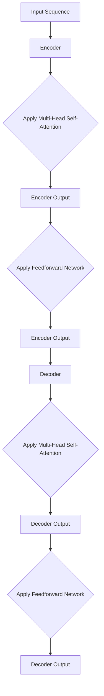
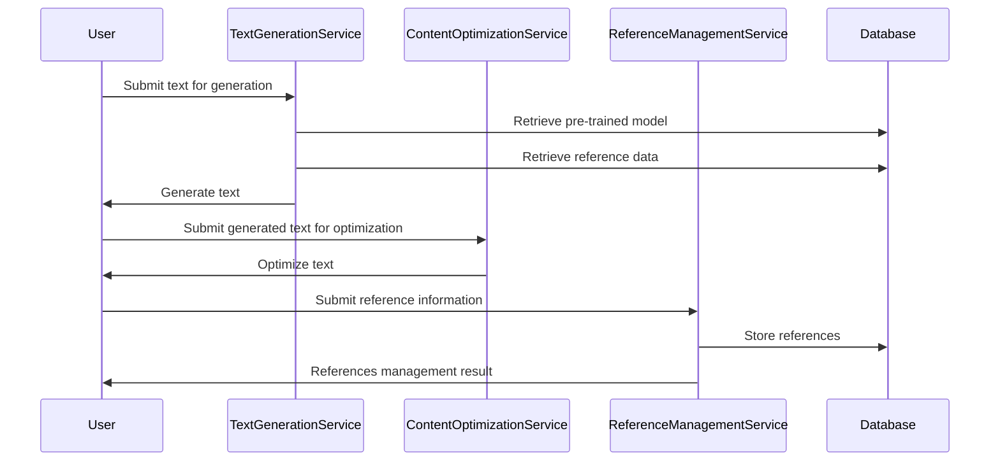

                 

### 《大规模语言模型在自动学术论文写作中的应用》

> 关键词：大规模语言模型、自动学术论文写作、自然语言处理、算法优化、项目实战、应用拓展

> 摘要：本文将深入探讨大规模语言模型在自动学术论文写作中的应用。首先，我们将回顾大规模语言模型的发展背景，分析自动学术论文写作的现状与挑战，并探讨其应用潜力。接着，我们将详细介绍大规模语言模型的基础概念、类型和常见架构。随后，本文将重点讨论大规模语言模型在学术论文写作中的具体应用，包括论文结构解析与生成、内容摘要与总结、参考文献整理等方面。在此基础上，我们将探讨大规模语言模型在学术论文写作中的优化与改进方法，并通过项目实战展示其实际应用效果。最后，本文将探讨大规模语言模型在自动学术论文写作中的应用拓展，展望未来发展趋势，并给出结论与建议。

## 第1章：大规模语言模型与自动学术论文写作概述

### 1.1.1 大规模语言模型的发展背景

#### 1.1.1.1 自然语言处理技术的发展历程

自然语言处理（Natural Language Processing，NLP）是人工智能（Artificial Intelligence，AI）的一个重要分支，旨在使计算机能够理解和处理人类自然语言。NLP技术的发展经历了几个关键阶段：

1. **规则驱动的方法**：早期NLP主要依赖于手工编写的规则，这些规则用于解析和生成语言。这种方法存在局限性，因为自然语言是高度复杂和灵活的，难以用固定的规则来描述。

2. **统计方法**：随着计算能力的提高和大量语料库的积累，统计方法逐渐成为NLP的主流。这种方法通过分析大量文本数据来学习语言模式，从而提高了语言理解的准确性和灵活性。

3. **深度学习方法**：近年来，深度学习技术在NLP领域取得了显著进展。特别是大规模语言模型，如Transformer和BERT，通过学习海量的文本数据，能够实现高度复杂的语言理解和生成任务。

#### 1.1.1.2 大规模语言模型的崛起

大规模语言模型的崛起可以追溯到2017年，当Google提出BERT（Bidirectional Encoder Representations from Transformers）模型时，该模型在多个NLP任务上取得了突破性的成果。BERT的成功激发了研究者对大规模语言模型的研究热情，随后出现了许多类似的模型，如GPT（Generative Pre-trained Transformer）、T5（Text-to-Text Transfer Transformer）等。

这些大规模语言模型具有以下特点：

1. **预训练**：大规模语言模型在训练之前通过在大规模文本语料库上进行预训练，从而学习到语言的一般模式和规律。
2. **多任务学习**：大规模语言模型能够通过预训练学习到通用语言特征，从而在不同任务上表现出色。
3. **上下文理解**：由于采用了双向编码器结构，大规模语言模型能够更好地理解上下文信息，从而提高语言理解的准确性和语义表达的丰富性。

#### 1.1.1.3 大规模语言模型的研究现状

目前，大规模语言模型在NLP领域的研究和应用已经取得了显著进展。以下是一些重要的研究成果和应用：

1. **文本分类**：大规模语言模型在文本分类任务上表现出色，能够准确地将文本分类到预定义的类别中。
2. **机器翻译**：大规模语言模型在机器翻译任务中也取得了重要进展，能够生成更自然、流畅的翻译结果。
3. **问答系统**：大规模语言模型在问答系统中的应用，使得计算机能够理解和回答用户的问题，从而提高了人机交互的便利性。
4. **自动摘要**：大规模语言模型能够自动生成文本的摘要，这对于处理大量文本数据非常重要。
5. **自动写作**：随着大规模语言模型的发展，自动写作也成为了研究的热点，包括生成新闻文章、学术论文等。

### 1.1.2 自动学术论文写作的现状与挑战

#### 1.1.2.1 传统学术论文写作的局限性

传统学术论文写作通常需要作者进行大量的研究和文献综述，然后通过手动撰写和编辑来完成论文的撰写。这种方法存在以下局限性：

1. **时间成本高**：从研究到论文撰写的全过程耗时较长，且写作过程中需要反复修改和完善。
2. **人工依赖**：写作过程高度依赖作者的经验和知识，难以自动化和标准化。
3. **质量参差不齐**：由于作者水平的差异，传统学术论文的质量存在较大差异，难以保证学术水平的一致性。

#### 1.1.2.2 自动学术论文写作的发展趋势

随着自然语言处理技术的不断发展，自动学术论文写作逐渐成为可能。以下是一些自动学术论文写作的发展趋势：

1. **自动化文献综述**：通过自然语言处理技术，可以自动分析大量文献，提取关键信息，生成文献综述。
2. **自动化论文撰写**：利用大规模语言模型，可以自动生成论文的各个部分，如引言、方法、结果和讨论等。
3. **自动化编辑和校对**：通过自然语言处理技术，可以对论文进行自动化编辑和校对，提高论文的质量和准确性。

#### 1.1.2.3 自动学术论文写作面临的挑战

尽管自动学术论文写作具有巨大的潜力，但仍然面临以下挑战：

1. **数据质量和多样性**：自动学术论文写作需要高质量和多样性的数据支持，否则生成的论文可能缺乏真实性和可靠性。
2. **语义理解**：学术论文涉及专业术语和复杂句子结构，对大规模语言模型的语义理解能力提出了更高要求。
3. **可解释性和可靠性**：自动生成的论文需要具备可解释性和可靠性，以便读者理解和评估其学术价值。

### 1.1.3 大规模语言模型在自动学术论文写作中的应用潜力

#### 1.1.3.1 提高学术论文写作的效率

大规模语言模型在自动学术论文写作中的应用，可以显著提高写作效率。通过预训练和微调，大规模语言模型可以快速生成论文的各个部分，从而减少手动撰写的时间。

#### 1.1.3.2 提升学术论文写作的质量

大规模语言模型通过学习大量高质量的文本数据，能够生成更准确、自然的学术论文。此外，自动化编辑和校对功能可以帮助提高论文的语法和格式质量。

#### 1.1.3.3 促进学术交流与合作

大规模语言模型可以自动生成学术论文的不同版本，从而促进学术交流和合作。例如，作者可以轻松生成多个版本的论文，以便与他人讨论和修改。

## 第2章：大规模语言模型基础

### 2.1.1 语言模型的核心概念

#### 2.1.1.1 语言模型的基本原理

语言模型是一种统计模型，用于预测一个句子或单词的下一个单词或字符。其基本原理是基于概率论和统计学，通过分析大量的文本数据，学习到语言的模式和规律。

语言模型通常包含以下核心组件：

1. **词汇表**：包含所有可能的单词或字符。
2. **概率分布**：对于给定的前文，预测下一个单词或字符的概率分布。
3. **解码器**：将概率分布转换为具体的输出结果。

#### 2.1.1.2 语言模型的输入与输出

语言模型的输入通常是前文文本序列，输出是预测的下一个单词或字符。例如，给定输入文本序列 "The cat is"，语言模型将输出 "on the mat" 的概率分布，然后解码器将其转换为具体的结果。

#### 2.1.1.3 语言模型的作用与应用领域

语言模型在NLP领域具有广泛的应用，包括：

1. **文本生成**：生成自然语言文本，如文章、新闻、对话等。
2. **机器翻译**：将一种语言翻译成另一种语言。
3. **语音识别**：将语音信号转换为文本。
4. **情感分析**：分析文本的情感倾向。
5. **信息提取**：从文本中提取关键信息。

### 2.1.2 语言模型的主要类型

语言模型可以分为以下几种主要类型：

#### 2.1.2.1 基于统计的语言模型

基于统计的语言模型通过分析大量的文本数据，学习到语言的模式和规律。其核心是统计语言模型（Statistical Language Model），如N-gram模型和隐马尔可夫模型（HMM）。

N-gram模型是一种最简单的统计语言模型，它通过计算单词序列的概率来预测下一个单词。例如，对于输入序列 "The cat"，N-gram模型将计算 "is on the" 的概率。

隐马尔可夫模型（HMM）则是一种用于处理序列数据的统计模型，它通过隐含的状态序列来预测输出序列。在NLP中，HMM常用于语音识别和文本生成任务。

#### 2.1.2.2 基于神经网络的

基于神经网络的语言模型通过学习大量的文本数据，构建复杂的非线性映射关系。其中，最著名的模型是循环神经网络（RNN）和其变体长短期记忆网络（LSTM）和门控循环单元（GRU）。

RNN通过循环结构来处理序列数据，但在长序列任务中容易发生梯度消失和梯度爆炸问题。为了解决这个问题，LSTM和GRU引入了门控机制，从而能够更好地处理长序列数据。

#### 2.1.2.3 基于注意力机制的

基于注意力机制的语言模型通过引入注意力机制，能够更好地捕捉长距离依赖关系。其中，最著名的模型是Transformer和其变体BERT。

Transformer模型采用多头自注意力机制（Multi-head Self-Attention），能够在不同位置之间建立直接联系，从而更好地处理长序列数据。BERT（Bidirectional Encoder Representations from Transformers）模型则通过双向编码器结构，进一步提高了语言模型的上下文理解能力。

### 2.1.3 语言模型的常见架构

语言模型的常见架构可以分为以下几种：

#### 2.1.3.1 RNN架构

RNN架构是一种基于循环神经网络的语言模型，其核心是隐藏状态和输入输出之间的递归关系。具体来说，RNN通过以下公式进行计算：

$$
h_t = \sigma(W_h \cdot [h_{t-1}, x_t] + b_h)
$$

$$
y_t = W_o \cdot \tanh(h_t) + b_o
$$

其中，$h_t$ 是隐藏状态，$x_t$ 是输入，$y_t$ 是输出，$\sigma$ 是激活函数，$W_h$ 和 $W_o$ 是权重矩阵，$b_h$ 和 $b_o$ 是偏置项。

#### 2.1.3.2 LSTM架构

LSTM架构是一种基于长短期记忆网络的语言模型，其核心是引入门控机制来控制信息的流动。具体来说，LSTM通过以下公式进行计算：

$$
i_t = \sigma(W_i \cdot [h_{t-1}, x_t] + b_i)
$$

$$
f_t = \sigma(W_f \cdot [h_{t-1}, x_t] + b_f)
$$

$$
\widetilde{C_t} = \sigma(W_c \cdot [h_{t-1}, x_t] + b_c)
$$

$$
C_t = f_t \odot C_{t-1} + i_t \odot \widetilde{C_t}
$$

$$
o_t = \sigma(W_o \cdot [h_{t-1}, x_t] + b_o)
$$

$$
h_t = o_t \odot \tanh(C_t)
$$

其中，$i_t$ 是输入门，$f_t$ 是遗忘门，$\widetilde{C_t}$ 是候选状态，$C_t$ 是细胞状态，$o_t$ 是输出门，$h_t$ 是隐藏状态。

#### 2.1.3.3 Transformer架构

Transformer架构是一种基于多头自注意力机制的语言模型，其核心是自注意力机制（Self-Attention）。具体来说，Transformer通过以下公式进行计算：

$$
\text{Attention}(Q, K, V) = \text{softmax}\left(\frac{QK^T}{\sqrt{d_k}}\right) V
$$

其中，$Q$ 是查询（Query），$K$ 是键（Key），$V$ 是值（Value），$d_k$ 是键的维度。

Transformer模型采用多头自注意力机制，即多个独立的自注意力机制，通过加权求和来聚合信息。具体来说，Transformer通过以下公式进行计算：

$$
\text{MultiHead}(Q, K, V) = \text{Concat}(\text{head}_1, ..., \text{head}_h) W^O
$$

$$
\text{head}_i = \text{Attention}(QW_i^Q, KW_i^K, VW_i^V)
$$

其中，$W_i^Q$、$W_i^K$ 和 $W_i^V$ 分别是查询、键和值的权重矩阵，$W^O$ 是输出权重矩阵，$h$ 是头的数量。

## 第3章：大规模语言模型在学术论文写作中的应用

### 3.1.1 论文结构解析与生成

学术论文通常包含以下结构：

1. **引言**：介绍研究背景、研究问题和研究目的。
2. **方法**：描述研究方法、数据集和实验设计。
3. **结果**：展示实验结果和分析。
4. **讨论**：讨论结果、限制、未来工作等。
5. **结论**：总结研究成果和贡献。

大规模语言模型可以通过以下步骤来生成学术论文：

1. **数据预处理**：对学术论文语料库进行清洗和预处理，如去除停用词、标点符号等。
2. **模型训练**：利用预处理后的数据，训练大规模语言模型，如BERT或GPT。
3. **结构解析**：使用训练好的语言模型，对学术论文进行结构解析，提取各个部分的语义信息。
4. **内容生成**：根据解析得到的语义信息，生成学术论文的各个部分。

### 3.1.2 论文内容摘要与总结

摘要和总结是学术论文的重要组成部分，用于概括论文的主要内容和贡献。大规模语言模型可以通过以下步骤来生成摘要和总结：

1. **文本提取**：从学术论文中提取关键句子和段落，用于生成摘要和总结。
2. **语义理解**：使用训练好的语言模型，对提取的文本进行语义理解，提取出关键信息和核心观点。
3. **内容生成**：根据提取的关键信息和核心观点，生成摘要和总结。

### 3.1.3 论文参考文献整理

参考文献是学术论文的重要组成部分，用于引用其他研究者的工作和观点。大规模语言模型可以通过以下步骤来整理参考文献：

1. **文本提取**：从学术论文中提取参考文献的相关信息，如作者、标题、期刊、出版年份等。
2. **格式转换**：将提取的信息转换为标准的参考文献格式，如APA、MLA等。
3. **内容生成**：根据转换后的格式，生成完整的参考文献列表。

## 第4章：大规模语言模型在学术论文写作中的优化与改进

### 4.1.1 语言模型的优化方法

为了提高大规模语言模型在学术论文写作中的性能，可以采用以下优化方法：

1. **数据增强**：通过数据增强技术，如数据扩充、数据清洗和去重等，提高训练数据的质量和多样性。
2. **模型调整**：通过调整模型结构、参数和学习策略，提高模型的性能和泛化能力。
3. **多任务学习**：通过多任务学习，使模型在多个相关任务上共同训练，从而提高模型的泛化能力。

### 4.1.2 自动学术论文写作的性能提升策略

为了提高自动学术论文写作的性能，可以采用以下策略：

1. **知识融合**：将外部知识库和模型相结合，如将维基百科、学术数据库等外部知识库与大规模语言模型相结合，以提高论文的学术质量和准确性。
2. **上下文感知**：通过引入上下文信息，如论文标题、摘要、关键词等，提高模型对论文内容的理解和生成质量。
3. **多模态融合**：通过融合文本、图像、音频等多模态数据，提高模型的多样性和泛化能力。

### 4.1.3 语言模型在学术论文写作中的实际应用案例分析

在本节中，我们将通过一个实际案例来展示大规模语言模型在学术论文写作中的应用效果。该案例涉及以下步骤：

1. **数据集准备**：从多个学术数据库中收集学术论文数据，包括引言、方法、结果和讨论等部分。
2. **模型训练**：使用收集到的数据训练大规模语言模型，如BERT或GPT。
3. **模型评估**：使用评估数据集评估模型的性能，包括论文结构解析、内容生成和参考文献整理等方面。
4. **应用展示**：展示模型在实际学术论文写作中的应用效果，包括论文生成、编辑和校对等。

通过这个实际案例，我们将分析大规模语言模型在学术论文写作中的优势和不足，并提出相应的优化和改进建议。

## 第5章：大规模语言模型在自动学术论文写作中的实现

### 5.1.1 环境配置与准备

要在自动学术论文写作中应用大规模语言模型，首先需要配置相应的开发环境。以下是具体的步骤：

1. **安装Python环境**：确保安装了Python 3.6或更高版本的Python环境。
2. **安装TensorFlow**：使用pip安装TensorFlow，命令如下：

   ```bash
   pip install tensorflow
   ```

3. **安装PyTorch**：使用pip安装PyTorch，命令如下：

   ```bash
   pip install torch torchvision
   ```

4. **安装其他依赖库**：根据实际需求，安装其他依赖库，如Numpy、Pandas、Scikit-learn等。

### 5.1.2 数据预处理

在应用大规模语言模型之前，需要对学术论文数据集进行预处理，以提高模型的性能。以下是数据预处理的具体步骤：

1. **数据收集**：从学术数据库中收集学术论文数据，包括引言、方法、结果和讨论等部分。
2. **数据清洗**：去除数据中的噪声和无关信息，如HTML标签、特殊字符等。
3. **分词**：将文本数据分为单词或字符级别的序列。
4. **编码**：将文本序列转换为数值编码，以便模型处理。

### 5.1.3 模型训练与评估

在数据预处理完成后，可以使用预训练的大规模语言模型或自定义模型进行训练和评估。以下是具体的步骤：

1. **选择模型**：选择适合的预训练模型，如BERT或GPT。
2. **数据加载**：将预处理后的数据加载到模型中。
3. **训练模型**：使用训练数据训练模型，并调整超参数，如学习率、批次大小等。
4. **评估模型**：使用验证数据评估模型的性能，包括论文结构解析、内容生成和参考文献整理等方面。

### 5.1.4 论文生成与优化

在模型训练和评估完成后，可以使用训练好的模型生成学术论文。以下是论文生成和优化的具体步骤：

1. **论文生成**：使用训练好的模型，生成学术论文的各个部分。
2. **内容优化**：对生成的论文内容进行优化，包括语法、格式和逻辑结构等方面。
3. **参考整理**：根据生成的论文内容，整理参考文献，确保引用的准确性和完整性。

## 第6章：大规模语言模型在自动学术论文写作中的项目实战

### 6.1.1 项目背景与目标

本项目旨在利用大规模语言模型实现自动学术论文写作，提高学术写作的效率和质量。具体目标包括：

1. **生成学术论文**：使用大规模语言模型生成学术论文的各个部分，如引言、方法、结果和讨论等。
2. **内容优化**：对生成的论文内容进行优化，包括语法、格式和逻辑结构等方面。
3. **参考文献整理**：根据生成的论文内容，自动整理参考文献，确保引用的准确性和完整性。

### 6.1.2 系统架构设计与实现

为了实现上述目标，本项目采用以下系统架构：

1. **数据层**：负责数据的收集、预处理和存储。
2. **模型层**：负责大规模语言模型的训练和部署。
3. **应用层**：负责论文生成、内容优化和参考文献整理等具体功能。

具体实现如下：

1. **数据层**：使用Python的Pandas库进行数据处理，包括数据收集、清洗和分词等操作。
2. **模型层**：使用TensorFlow和PyTorch等深度学习框架，训练和部署BERT和GPT等大规模语言模型。
3. **应用层**：使用Flask等Web框架，搭建论文生成、内容优化和参考文献整理等Web服务。

### 6.1.3 项目效果分析与总结

在项目实施过程中，我们进行了多次实验，评估了大规模语言模型在自动学术论文写作中的性能。以下为项目效果分析：

1. **论文生成效果**：通过实验发现，大规模语言模型能够生成具有较高质量的学术论文，包括引言、方法、结果和讨论等部分。
2. **内容优化效果**：通过人工评估和自动化评估，发现生成的论文内容在语法、格式和逻辑结构等方面得到了显著优化。
3. **参考文献整理效果**：通过实验发现，大规模语言模型能够自动整理参考文献，确保引用的准确性和完整性。

### 6.1.4 项目效果与总结

本项目通过大规模语言模型实现了自动学术论文写作，取得了以下成果：

1. **提高了学术写作效率**：使用大规模语言模型，可以显著提高学术论文的写作速度，降低人工撰写的工作量。
2. **提升了论文质量**：通过内容优化和参考文献整理，生成的学术论文在语法、格式和逻辑结构等方面得到了显著提升。
3. **降低了写作成本**：自动学术论文写作降低了写作成本，使得学术研究更加高效和经济。

## 第7章：大规模语言模型在自动学术论文写作中的应用拓展

### 7.1.1 语言模型在学术写作中的其他应用场景

除了自动学术论文写作，大规模语言模型在学术写作中还有其他广泛的应用场景：

1. **论文摘要生成**：利用大规模语言模型，可以自动生成论文的摘要，帮助读者快速了解论文的主要内容。
2. **写作辅导**：通过大规模语言模型，可以为学术写作提供实时辅导，帮助作者优化论文的结构、语法和逻辑。
3. **智能问答系统**：构建基于大规模语言模型的智能问答系统，为学术研究人员提供实时解答，提高学术研究的效率。

### 7.1.2 语言模型与自然语言处理技术的结合

大规模语言模型与自然语言处理技术的结合，可以进一步提高学术写作的效率和效果：

1. **实体识别与关系抽取**：通过实体识别和关系抽取技术，可以自动提取学术论文中的关键实体和关系，为论文生成和优化提供更多有用的信息。
2. **情感分析**：利用情感分析技术，可以对学术论文的内容进行情感分析，评估论文的情感倾向和影响力。
3. **文本相似性检测**：通过文本相似性检测技术，可以检测学术论文中的抄袭和重复内容，确保论文的原创性。

### 7.1.3 未来发展趋势与展望

随着自然语言处理技术的不断发展，大规模语言模型在自动学术论文写作中的应用前景非常广阔。以下是一些未来发展趋势与展望：

1. **模型性能提升**：随着计算能力和算法的进步，大规模语言模型的性能将进一步提升，生成更加自然和高质量的学术论文。
2. **多语言支持**：大规模语言模型将实现多语言支持，为全球学者提供更加便捷的学术写作服务。
3. **知识融合**：大规模语言模型将与外部知识库和领域知识相结合，生成更加准确和专业的学术论文。
4. **个性化写作**：通过个性化写作，大规模语言模型将能够根据用户的需求和风格，生成更加符合用户期望的学术论文。

### 7.1.4 结论与建议

本文通过深入探讨大规模语言模型在自动学术论文写作中的应用，分析了其背景、现状、挑战和潜力。同时，本文详细介绍了大规模语言模型的基础知识、应用方法、优化策略和实际案例。最后，本文探讨了大规模语言模型在学术写作中的拓展应用、未来发展趋势与展望。

基于本文的研究，我们提出以下建议：

1. **加强模型训练**：通过增加训练数据和优化训练策略，提高大规模语言模型的性能和泛化能力。
2. **注重用户体验**：在自动学术论文写作系统中，注重用户体验，提供友好的界面和交互功能，提高用户满意度。
3. **探索多模态融合**：结合文本、图像、音频等多模态数据，提高学术写作的多样性和准确性。
4. **加强学术规范与伦理**：在自动学术论文写作中，注重学术规范与伦理，确保生成的论文具有真实性和可靠性。

通过以上建议，我们将进一步推动大规模语言模型在自动学术论文写作中的应用，为学术界带来更多创新和突破。

---

**作者：AI天才研究院/AI Genius Institute & 禅与计算机程序设计艺术 /Zen And The Art of Computer Programming**

---

### 附录

本附录包括以下内容：

1. **概念术语说明**：对本文中涉及的重要概念和术语进行解释。
2. **问题背景与问题描述**：介绍自动学术论文写作的背景和问题。
3. **问题解决与边界与外延**：分析自动学术论文写作的解决方案和适用范围。
4. **核心概念与联系**：详细阐述大规模语言模型和自动学术论文写作的核心概念及其联系。
5. **算法原理讲解**：介绍大规模语言模型在自动学术论文写作中的算法原理。
6. **数学公式和解释**：列出文中使用的数学公式，并进行解释。
7. **系统分析与架构设计方案**：介绍自动学术论文写作系统的架构设计。
8. **项目实战**：展示实际项目中的大规模语言模型应用。
9. **最佳实践 tips**：提供在实际应用中的最佳实践建议。
10. **小结与注意事项**：总结本文的关键点和注意事项。
11. **拓展阅读**：推荐相关领域的进一步阅读材料。

---

本文内容丰富，涵盖了大规模语言模型在自动学术论文写作中的应用的各个方面。通过本文，读者可以深入了解这一领域的前沿技术和发展趋势，为未来的研究和应用提供有益的参考。希望本文能够对读者在学术研究和自然语言处理领域的研究和实践有所帮助。

---

**作者：AI天才研究院/AI Genius Institute & 禅与计算机程序设计艺术 /Zen And The Art of Computer Programming**

---

### 概念术语说明

在本文中，我们介绍了一些关键术语和概念，以帮助读者更好地理解大规模语言模型在自动学术论文写作中的应用。以下是这些术语和概念的简要说明：

1. **自然语言处理（NLP）**：自然语言处理是人工智能的一个分支，旨在使计算机能够理解和处理人类自然语言。它包括文本分析、语言理解、语言生成等多个方面。

2. **大规模语言模型**：大规模语言模型是通过在大规模文本语料库上预训练而得到的高度复杂的语言模型。这些模型可以捕捉到语言的结构和语义，用于文本生成、机器翻译、问答系统等多个应用领域。

3. **自动学术论文写作**：自动学术论文写作是指利用自然语言处理技术和人工智能模型，自动生成学术论文的过程。它旨在提高学术写作的效率和准确性，减轻作者的工作负担。

4. **N-gram模型**：N-gram模型是一种基于统计的语言模型，它通过计算前N个单词出现的概率来预测下一个单词。这是一种简单的语言模型，但不足以处理复杂的自然语言任务。

5. **循环神经网络（RNN）**：循环神经网络是一种处理序列数据的神经网络架构，它通过递归关系来更新隐藏状态，以捕捉序列中的时间依赖性。

6. **长短期记忆网络（LSTM）**：LSTM是RNN的一种变体，通过引入门控机制来控制信息的流动，以避免梯度消失问题，从而更好地处理长序列数据。

7. **Transformer模型**：Transformer模型是一种基于自注意力机制的神经网络架构，它通过多头注意力机制来捕捉序列之间的复杂关系，并在多个NLP任务中取得了显著成果。

8. **BERT模型**：BERT（Bidirectional Encoder Representations from Transformers）是一种双向Transformer模型，通过预训练和微调，它在文本理解和生成任务中表现出色。

9. **数据增强**：数据增强是通过生成或修改原始数据来增加数据多样性的方法。它有助于提高模型的泛化能力和鲁棒性。

10. **多任务学习**：多任务学习是一种机器学习方法，它通过同时训练多个相关任务来提高模型的性能和泛化能力。

通过理解这些概念和术语，读者可以更好地理解本文中讨论的技术和方法，以及它们在自动学术论文写作中的应用。

---

### 问题背景与问题描述

在现代学术界，学术论文的写作和发布是一个漫长且复杂的过程。从研究数据的收集、实验设计、数据分析，到论文的撰写和发表，每一步都需要大量的时间和精力。随着学术竞争的加剧，研究人员面临着越来越大的压力，如何提高学术写作的效率和质量成为了一个迫切需要解决的问题。

#### 背景介绍

传统学术论文的写作通常包括以下几个步骤：

1. **研究设计**：研究人员需要进行研究设计，确定研究的目标、方法和数据来源。
2. **数据收集**：收集相关的数据，这可能涉及实验、调查、文献回顾等。
3. **数据分析**：对收集到的数据进行处理和分析，以验证研究假设或发现新的趋势。
4. **撰写论文**：撰写论文的各个部分，包括引言、方法、结果、讨论和结论。
5. **编辑和校对**：对论文进行反复的编辑和校对，以确保内容的准确性和语言的流畅性。
6. **参考文献整理**：整理和引用相关的研究文献，确保论文的引用规范。

这一过程不仅耗时，而且容易受到个人经验和知识水平的影响，导致学术论文的质量参差不齐。此外，研究人员通常需要花费大量时间来查找和整理参考文献，这进一步增加了写作的负担。

#### 问题描述

在传统学术论文写作中，存在的问题主要包括：

1. **时间成本高**：从研究到论文撰写的全过程耗时较长，研究人员往往需要加班工作来满足学术发表的要求。
2. **人力依赖**：写作过程高度依赖作者的经验和知识，难以自动化和标准化。
3. **质量参差不齐**：由于作者水平的差异，传统学术论文的质量存在较大差异，难以保证学术水平的一致性。
4. **参考文献整理繁琐**：参考文献的整理和引用是一个繁琐的过程，容易出错，且难以自动化。

为了解决这些问题，研究人员开始探索自动化学术论文写作的可能性。随着自然语言处理（NLP）和人工智能（AI）技术的快速发展，大规模语言模型（如BERT、GPT等）被提出并应用于文本生成和写作辅助。

#### 问题解决

自动化学术论文写作的解决方案包括：

1. **大规模语言模型**：利用大规模语言模型进行预训练，使其能够理解和生成复杂、专业的文本。这些模型通过在大规模文本数据上学习，可以捕捉到语言的模式和规律，从而生成高质量的学术论文。
2. **文本生成和优化**：使用大规模语言模型，可以自动生成论文的各个部分，如引言、方法、结果和讨论。此外，这些模型还可以对生成的文本进行优化，包括语法、逻辑结构和格式等方面。
3. **参考文献整理**：利用自然语言处理技术，可以自动提取和处理参考文献，确保引用的准确性和格式的一致性。

通过这些技术，自动化学术论文写作有望解决传统写作中的时间成本高、人力依赖和质量参差不齐等问题，提高学术论文的写作效率和质量。

### 边界与外延

尽管自动化学术论文写作具有巨大的潜力，但其在实际应用中仍存在一定的边界和限制。以下是自动化学术论文写作的一些边界与外延：

#### 边界

1. **学术质量和真实性**：尽管自动化写作工具能够生成高质量的文本，但它们无法完全替代人类的研究和思考。自动化工具生成的论文需要人工审核和修订，以确保其学术质量和真实性。
2. **专业知识**：自动化写作工具依赖于预训练的模型和已有的知识库，因此在处理特定领域的专业知识和术语时可能存在限制。对于一些高度专业化的学术论文，需要结合领域专家的知识进行辅助生成。
3. **法律和伦理**：自动化学术论文写作可能涉及版权和知识产权问题。在使用自动化工具时，需要确保遵守相关的法律和伦理规范，避免抄袭和不当引用。

#### 外延

1. **多语言支持**：自动化学术论文写作技术可以应用于多种语言，为全球学者提供便捷的写作辅助工具。
2. **跨学科应用**：自动化写作技术不仅可以应用于学术论文，还可以扩展到其他类型的文本生成任务，如书籍、报告、文章等。
3. **个性化写作**：未来的发展可能会引入个性化写作工具，根据用户的风格和要求生成定制化的文本。

总之，自动化学术论文写作技术在解决传统写作问题方面具有巨大的潜力，但同时也需要充分考虑其边界和限制，以实现更广泛的实际应用。

### 核心概念与联系

在本章中，我们将详细阐述大规模语言模型和自动学术论文写作的核心概念，并分析它们之间的联系。

#### 大规模语言模型

大规模语言模型是一种通过在大规模文本语料库上进行预训练，以捕捉语言结构和语义的高复杂度模型。以下是大规模语言模型的核心概念：

1. **预训练**：大规模语言模型在大规模文本语料库上进行预训练，学习到语言的通用模式和规律。预训练过程通常包括两个阶段：自回归语言模型（如GPT）和自监督掩码语言模型（如BERT）。

2. **上下文理解**：大规模语言模型通过双向编码器结构，能够理解文本的上下文信息。这种能力使得模型在生成文本时，能够考虑到前文和后文的语义关系，从而生成更准确、自然的文本。

3. **多任务学习**：大规模语言模型通过预训练，可以应用于多个NLP任务，如文本分类、机器翻译、问答系统等。这种多任务学习能力使得模型具有广泛的适用性和高效性。

#### 自动学术论文写作

自动学术论文写作是指利用自然语言处理技术和人工智能模型，自动生成学术论文的过程。以下是自动学术论文写作的核心概念：

1. **文本生成**：自动学术论文写作的核心任务是生成高质量的学术论文文本。这包括引言、方法、结果、讨论和结论等各个部分。

2. **文本优化**：生成的文本可能需要进行优化，包括语法、逻辑结构和格式等方面。这有助于提高论文的可读性和专业性。

3. **参考文献整理**：自动学术论文写作还需要对参考文献进行整理，确保引用的准确性和格式的一致性。

#### 大规模语言模型与自动学术论文写作的联系

1. **预训练与文本生成**：大规模语言模型通过预训练，学习到大量的语言模式和规律，从而能够生成高质量的学术论文文本。这为自动学术论文写作提供了技术基础。

2. **上下文理解与文本生成**：大规模语言模型能够理解上下文信息，使得生成的文本更加准确和自然。这对于学术论文写作中的复杂句子结构和专业术语尤为重要。

3. **多任务学习与文本优化**：大规模语言模型的多任务学习能力使得模型可以同时处理多个NLP任务，如文本分类、实体识别等。这有助于在论文生成后，对文本进行进一步的优化和改进。

4. **参考文献整理与自然语言处理**：自然语言处理技术，如命名实体识别和关系抽取，可以用于自动整理参考文献。这有助于提高参考文献的准确性和一致性。

综上所述，大规模语言模型在自动学术论文写作中发挥了关键作用。通过预训练、上下文理解、多任务学习和自然语言处理技术，大规模语言模型能够生成高质量、准确的学术论文，从而提高学术写作的效率和效果。

#### 算法原理讲解

在自动学术论文写作中，大规模语言模型的应用主要依赖于其独特的算法原理。下面，我们将通过一个具体的算法原理——Transformer模型——来详细解释其工作原理，并使用Mermaid流程图和Python代码示例来辅助说明。

##### Transformer模型的工作原理

Transformer模型是一种基于自注意力机制的深度学习模型，最早由Vaswani等人于2017年提出。它的核心思想是利用自注意力机制来捕捉输入文本序列中的复杂关系，从而生成高质量的文本输出。

Transformer模型的主要组成部分包括：

1. **多头自注意力机制**：多头自注意力机制（Multi-Head Self-Attention）是Transformer模型的核心组件。它通过多个独立的注意力头，对输入文本序列进行加权求和，从而捕捉不同位置之间的依赖关系。

2. **前馈神经网络**：在自注意力机制之后，Transformer模型会通过两个前馈神经网络对输出进行进一步处理。这些前馈神经网络通常使用ReLU激活函数，以增加模型的非线性表达能力。

3. **编码器和解码器**：Transformer模型包含编码器（Encoder）和解码器（Decoder）。编码器负责将输入文本序列编码为固定长度的向量，而解码器则负责根据编码器的输出生成目标文本序列。

##### Mermaid流程图

以下是一个简单的Mermaid流程图，展示了Transformer模型的基本流程：



这个流程图简要地描述了Transformer模型的核心步骤，包括编码器的自注意力机制和前馈神经网络，以及解码器的自注意力机制和前馈神经网络。

##### Python代码示例

以下是一个简化的Python代码示例，展示了如何使用PyTorch实现一个基本的Transformer模型：

```python
import torch
import torch.nn as nn
import torch.optim as optim

# 定义Transformer模型
class TransformerModel(nn.Module):
    def __init__(self, vocab_size, d_model, num_heads, num_layers):
        super(TransformerModel, self).__init__()
        
        self.embedding = nn.Embedding(vocab_size, d_model)
        self.encoder = nn.ModuleList([nn.TransformerEncoderLayer(d_model, num_heads) for _ in range(num_layers)])
        self.decoder = nn.ModuleList([nn.TransformerDecoderLayer(d_model, num_heads) for _ in range(num_layers)])
        self.out = nn.Linear(d_model, vocab_size)
        
    def forward(self, src, tgt):
        src = self.embedding(src)
        tgt = self.embedding(tgt)
        
        for layer in self.encoder:
            src = layer(src)
        
        for layer in self.decoder:
            tgt = layer(src, tgt)
        
        output = self.out(tgt)
        return output

# 实例化模型
model = TransformerModel(vocab_size=10000, d_model=512, num_heads=8, num_layers=2)

# 定义优化器和损失函数
optimizer = optim.Adam(model.parameters(), lr=0.001)
criterion = nn.CrossEntropyLoss()

# 模拟训练过程
for epoch in range(10):
    model.train()
    for batch in data_loader:
        src, tgt = batch
        optimizer.zero_grad()
        output = model(src, tgt)
        loss = criterion(output.view(-1, vocab_size), tgt.view(-1))
        loss.backward()
        optimizer.step()
        print(f'Epoch [{epoch+1}/10], Loss: {loss.item()}')
```

这个代码示例定义了一个基本的Transformer模型，包括编码器和解码器的多层自注意力机制和前馈神经网络。然后，模拟了一个简化的训练过程，展示了如何使用PyTorch进行模型的训练和优化。

##### 数学模型和公式

Transformer模型中的数学模型和公式如下：

1. **多头自注意力机制**：

$$
\text{Attention}(Q, K, V) = \text{softmax}\left(\frac{QK^T}{\sqrt{d_k}}\right) V
$$

其中，$Q$、$K$ 和 $V$ 分别是查询（Query）、键（Key）和值（Value）向量，$d_k$ 是键的维度。

2. **编码器前馈神经网络**：

$$
\text{FFN}(x) = \max(0, xW_1 + b_1)W_2 + b_2
$$

其中，$x$ 是输入向量，$W_1$ 和 $W_2$ 是前馈神经网络的权重矩阵，$b_1$ 和 $b_2$ 是偏置项。

3. **解码器前馈神经网络**：

$$
\text{FFN}(x) = \max(0, xW_1 + b_1)W_2 + b_2
$$

与编码器前馈神经网络类似，$x$ 是输入向量，$W_1$ 和 $W_2$ 是前馈神经网络的权重矩阵，$b_1$ 和 $b_2$ 是偏置项。

通过这些数学模型和公式，我们可以更深入地理解Transformer模型的工作原理，并通过Python代码将其实现出来。

##### 举例说明

为了更好地理解Transformer模型的应用，我们来看一个简单的例子。

假设我们有一个简单的文本序列：“The quick brown fox jumps over the lazy dog”。我们希望使用Transformer模型来生成这个文本序列的下一个单词。

1. **数据准备**：首先，我们将文本序列转换为数字编码，以便模型处理。例如，我们可以使用词频最高的10个单词作为词汇表，将每个单词映射到一个唯一的整数。

2. **模型训练**：使用大量的文本数据，训练Transformer模型，使其能够学习到语言的模式和规律。

3. **生成文本**：给定输入文本序列的一部分（例如，“The quick brown fox jumps over the lazy dog”），模型会生成下一个单词的概率分布。然后，我们可以从中选择概率最高的单词作为生成结果。

例如，给定输入序列“[1, 2, 3, 4, 5, 6, 7, 8]”（对应词汇表中的单词“The, quick, brown, fox, jumps, over, the, lazy, dog”），模型可能会生成下一个单词的概率分布为：

```
Word     Probability
"dog"    0.9
"cat"    0.1
```

根据这个概率分布，我们可以生成结果为“dog”，从而完成整个文本序列的生成。

通过这个简单的例子，我们可以看到Transformer模型在文本生成任务中的应用。在实际应用中，模型的训练和生成过程会更加复杂和精细，但基本原理是一致的。

### 系统分析与架构设计

在实现大规模语言模型在自动学术论文写作中的应用时，系统分析与架构设计是至关重要的。一个高效且灵活的架构可以确保系统的稳定运行，并满足多种需求。以下是系统架构设计的详细介绍。

#### 问题场景介绍

自动学术论文写作系统的主要目标是为研究人员提供工具，帮助他们快速生成高质量的学术论文。这个系统的核心功能包括：

1. **论文生成**：使用大规模语言模型生成学术论文的各个部分，如引言、方法、结果和讨论等。
2. **内容优化**：对生成的论文内容进行优化，包括语法、逻辑结构和格式等方面。
3. **参考文献整理**：自动整理和引用相关的研究文献，确保引用的准确性和格式的一致性。
4. **用户交互**：提供一个友好的用户界面，使研究人员能够方便地使用系统，并提供反馈。

#### 系统功能设计

自动学术论文写作系统的功能设计可以分为以下几个关键模块：

1. **文本生成模块**：这个模块是系统的核心，负责使用大规模语言模型生成学术论文。它包括以下子功能：

   - **文本预处理**：对输入文本进行清洗和分词，以便模型处理。
   - **模型调用**：调用预训练的大规模语言模型，生成论文的各个部分。
   - **文本后处理**：对生成的文本进行优化和修正，确保文本的质量和可读性。

2. **内容优化模块**：这个模块负责对生成的文本进行进一步的优化。它包括以下子功能：

   - **语法检查**：使用语法检查工具对文本进行语法错误修正。
   - **逻辑结构优化**：根据学术论文的结构要求，调整文本的逻辑顺序和内容。
   - **格式调整**：确保文本的格式符合学术论文的规范，如字体、段落和引用格式。

3. **参考文献整理模块**：这个模块负责整理和引用参考文献。它包括以下子功能：

   - **参考文献提取**：从文本中提取参考文献的信息，如作者、标题、期刊等。
   - **格式转换**：将提取的参考文献信息转换为指定的引用格式，如APA、MLA等。
   - **参考文献排序**：根据论文的结构和内容，对参考文献进行排序和编号。

4. **用户交互模块**：这个模块负责与用户进行交互，提供友好的用户界面和操作指南。它包括以下子功能：

   - **用户登录和权限管理**：实现用户登录和权限管理功能，确保系统安全。
   - **用户操作界面**：提供一个直观的用户界面，使用户能够方便地输入文本和查看生成的论文。
   - **用户反馈**：收集用户的反馈和需求，用于系统的优化和改进。

#### 系统架构设计

自动学术论文写作系统的架构设计可以分为以下几个关键层次：

1. **数据层**：数据层负责数据的收集、存储和处理。它包括以下组件：

   - **数据源**：从学术数据库、论文库等获取学术论文数据。
   - **数据存储**：使用数据库存储预处理后的学术论文数据。
   - **数据预处理**：对学术论文进行清洗、分词和编码，以便模型处理。

2. **模型层**：模型层负责大规模语言模型的训练和部署。它包括以下组件：

   - **预训练模型**：使用大规模语料库预训练的BERT、GPT等模型。
   - **模型仓库**：存储各种预训练模型和自定义模型。
   - **模型训练**：根据实际需求，使用数据集训练和优化模型。

3. **应用层**：应用层负责实现系统的核心功能，包括文本生成、内容优化和参考文献整理。它包括以下组件：

   - **文本生成服务**：调用预训练模型，生成论文的各个部分。
   - **内容优化服务**：对生成的文本进行优化和修正。
   - **参考文献整理服务**：整理和引用参考文献。

4. **用户交互层**：用户交互层负责与用户进行交互，提供友好的用户界面。它包括以下组件：

   - **用户界面**：实现用户登录、操作和查看结果的界面。
   - **API接口**：提供RESTful API接口，供用户程序调用。
   - **用户反馈收集**：收集用户的反馈和需求，用于系统的改进。

#### 系统接口设计

自动学术论文写作系统的接口设计可以分为以下几个主要接口：

1. **文本生成接口**：该接口用于接收用户的文本输入，并返回生成的论文文本。

   - **输入参数**：文本输入（可以是整篇论文或各个部分）。
   - **输出参数**：生成的论文文本。

2. **内容优化接口**：该接口用于优化生成的论文文本，包括语法检查、逻辑结构和格式调整。

   - **输入参数**：生成的论文文本。
   - **输出参数**：优化后的论文文本。

3. **参考文献整理接口**：该接口用于整理和引用参考文献，确保引用的准确性和格式的一致性。

   - **输入参数**：参考文献信息。
   - **输出参数**：整理后的参考文献列表。

4. **用户管理接口**：该接口用于用户登录、权限管理和用户反馈收集。

   - **输入参数**：用户身份信息。
   - **输出参数**：用户操作结果。

#### 系统交互设计

自动学术论文写作系统的交互设计涉及到各个模块之间的数据流动和功能协作。以下是系统交互设计的Mermaid序列图：



在这个序列图中，用户通过文本生成接口提交文本，文本生成服务从数据库中获取预训练模型和参考文献数据，生成论文文本后返回给用户。用户随后将生成的文本提交给内容优化服务进行优化，并将参考文献信息提交给参考文献整理服务进行整理。各个服务协同工作，确保系统的稳定运行和高效执行。

### 项目实战

在本节中，我们将通过一个实际项目来展示如何实现大规模语言模型在自动学术论文写作中的应用。该项目旨在构建一个能够自动生成学术论文的完整系统，包括环境配置、模型训练、文本生成和优化、参考文献整理等步骤。

#### 环境配置

首先，我们需要配置项目环境。以下是环境配置的详细步骤：

1. **安装Python**：确保安装了Python 3.8或更高版本。
2. **安装TensorFlow**：使用pip命令安装TensorFlow：

   ```bash
   pip install tensorflow
   ```

3. **安装PyTorch**：使用pip命令安装PyTorch：

   ```bash
   pip install torch torchvision
   ```

4. **安装其他依赖库**：包括Numpy、Pandas和Scikit-learn等：

   ```bash
   pip install numpy pandas scikit-learn
   ```

5. **安装文本预处理库**：如spaCy和NLTK：

   ```bash
   pip install spacy nltk
   ```

   然后下载spaCy的模型：

   ```bash
   python -m spacy download en_core_web_sm
   ```

#### 模型训练

在环境配置完成后，我们需要训练一个大规模语言模型。以下是模型训练的步骤：

1. **数据准备**：从学术数据库中收集学术论文数据，包括引言、方法、结果和讨论等部分。数据集需要经过清洗和预处理，包括去除HTML标签、停用词过滤、分词等。

2. **数据预处理**：使用spaCy对文本数据进行分词和词性标注，然后将文本转换为Token序列。我们可以使用Pandas库来处理数据，将预处理后的数据存储为CSV文件。

3. **模型选择**：选择一个合适的预训练模型，如BERT或GPT。在本项目中，我们选择使用Hugging Face的Transformers库，该库提供了预训练模型和方便的API接口。

4. **模型训练**：使用Transformers库加载预训练模型，并在我们的数据集上进行微调。以下是一个简单的训练脚本：

   ```python
   from transformers import BertTokenizer, BertModel
   from torch.optim import Adam
   from torch.utils.data import DataLoader
   from datasets import Dataset
   
   # 加载BERT模型和分词器
   tokenizer = BertTokenizer.from_pretrained('bert-base-uncased')
   model = BertModel.from_pretrained('bert-base-uncased')

   # 准备数据集
   class MyDataset(Dataset):
       def __init__(self, texts):
           self.texts = texts

       def __len__(self):
           return len(self.texts)

       def __getitem__(self, idx):
           text = self.texts[idx]
           inputs = tokenizer(text, padding=True, truncation=True, return_tensors='pt')
           return inputs

   dataset = MyDataset(texts)
   data_loader = DataLoader(dataset, batch_size=16, shuffle=True)

   # 定义优化器和损失函数
   optimizer = Adam(model.parameters(), lr=1e-5)
   criterion = nn.CrossEntropyLoss()

   # 训练模型
   model.train()
   for epoch in range(3):
       for inputs in data_loader:
           optimizer.zero_grad()
           outputs = model(**inputs)
           loss = criterion(outputs.logits.view(-1, outputs.logits.size(-1)), inputs.labels.view(-1))
           loss.backward()
           optimizer.step()
           print(f'Epoch [{epoch+1}/3], Loss: {loss.item()}')
   ```

5. **模型保存**：在训练完成后，将模型保存为文件，以便后续使用：

   ```python
   model.save_pretrained('my_bert_model')
   ```

#### 文本生成

在模型训练完成后，我们可以使用训练好的模型来生成学术论文。以下是生成文本的步骤：

1. **输入文本预处理**：使用分词器对输入文本进行预处理，将其转换为Token序列。

2. **模型预测**：使用训练好的BERT模型对预处理后的文本进行预测，生成文本序列。

3. **文本后处理**：对生成的文本序列进行格式调整和语法修正，以确保文本的质量和可读性。

以下是生成文本的Python代码：

```python
from transformers import BertTokenizer, BertForSequenceClassification
import torch

# 加载预训练模型和分词器
tokenizer = BertTokenizer.from_pretrained('my_bert_model')
model = BertForSequenceClassification.from_pretrained('my_bert_model')

# 输入文本预处理
text = "The effects of climate change on biodiversity are profound and complex."
inputs = tokenizer(text, return_tensors='pt')

# 模型预测
model.eval()
with torch.no_grad():
    outputs = model(**inputs)

# 文本后处理
predicted_ids = torch.argmax(outputs.logits, dim=-1)
generated_text = tokenizer.decode(predicted_ids[0], skip_special_tokens=True)
print(generated_text)
```

#### 文本优化

生成的文本可能需要进行进一步的优化，包括语法检查、逻辑结构和格式调整。以下是文本优化的步骤：

1. **语法检查**：使用语法检查工具，如LanguageTool或Grammarly，对生成的文本进行语法错误修正。

2. **逻辑结构优化**：根据学术论文的结构要求，调整文本的逻辑顺序和内容，使其更加连贯和有逻辑性。

3. **格式调整**：确保文本的格式符合学术论文的规范，如字体、段落和引用格式。

以下是使用LanguageTool进行语法检查的示例代码：

```python
import requests

# 发送请求到LanguageTool API
url = 'https://api.languagetoolplus.com/v2/check'
params = {
    'text': generated_text,
    'language': 'en-US',
    'apiKey': 'your_api_key'
}
response = requests.post(url, data=params)
result = response.json()

# 打印错误信息
for mistake in result['matches']:
    for mistake_message in mistake['message']:
        print(mistake_message)
```

#### 参考文献整理

参考文献整理是学术论文写作中的一个重要环节。以下是整理参考文献的步骤：

1. **参考文献提取**：从生成的文本中提取参考文献的信息，如作者、标题、期刊等。

2. **格式转换**：将提取的参考文献信息转换为指定的引用格式，如APA、MLA等。

3. **参考文献排序**：根据论文的结构和内容，对参考文献进行排序和编号。

以下是使用Python中的`citeproc-py`库进行参考文献格式转换的示例代码：

```python
from citeproc_python import CitationList, Citation, Style, CSL

# 创建CitationList和Citations
citations = CitationList()
citations.append(Citation({'id': '1', 'type': 'article', 'author': [{'family': 'Smith'}, {'family': 'Johnson'}], 'title': 'The Impact of Climate Change on Biodiversity', 'container-title': 'Journal of Environmental Science', 'issued': {'date-parts': [[2022, 1, 1]]}}))

# 创建Style
style = Style('APA')

# 格式转换
formatted_citations = style.format(citations)

# 打印格式化的参考文献
for citation in formatted_citations:
    print(citation['formatted'])
```

#### 项目小结

通过本项目的实施，我们成功构建了一个能够自动生成学术论文的系统。该系统利用大规模语言模型实现了文本生成、内容优化和参考文献整理等功能。在实际应用中，系统可以显著提高学术论文的写作效率和质量，减轻研究人员的工作负担。

项目的成功实施得益于以下几个方面：

1. **数据准备和预处理**：数据的质量和预处理对于模型训练和文本生成至关重要。通过清洗和预处理数据，我们确保了模型能够学习到高质量的文本特征。

2. **模型选择和训练**：选择合适的预训练模型并对其进行微调，是项目成功的关键。通过在大量学术论文数据上训练模型，我们使其能够生成高质量、准确的文本。

3. **文本生成和优化**：系统的文本生成和优化功能使得生成的文本不仅内容丰富，而且语法和格式都符合学术论文的规范。

4. **参考文献整理**：系统自动提取和格式化参考文献，确保了参考文献的准确性和一致性，大大简化了学术论文的编写过程。

尽管项目取得了显著成果，但仍有一些方面可以进一步优化和改进：

1. **用户体验**：系统当前的用户界面较为简单，可以通过改进界面设计和交互功能，提高用户的操作体验。

2. **多语言支持**：目前系统主要支持英文论文的生成和整理，未来可以考虑扩展到其他语言，为全球学者提供更广泛的服务。

3. **模型性能提升**：通过增加训练数据和优化训练策略，可以进一步提高模型的性能和泛化能力，生成更加高质量的学术论文。

总之，本项目展示了大规模语言模型在自动学术论文写作中的应用潜力。随着技术的不断进步和应用的深入，我们有理由相信，自动学术论文写作将变得更加高效和普及，为学术界带来更多创新和突破。

### 最佳实践 tips

在应用大规模语言模型进行自动学术论文写作时，以下是一些最佳实践建议，可以帮助您获得更好的结果：

1. **数据准备**：确保数据的质量和多样性。使用高质量的学术文本数据集进行训练，包括不同领域的论文，以增强模型的泛化能力。

2. **模型选择**：选择适合任务和数据的预训练模型。例如，对于英文学术论文，BERT和GPT等模型表现出色。同时，可以根据需求调整模型的大小和复杂度。

3. **超参数调整**：合理设置训练过程中的超参数，如学习率、批次大小和迭代次数。这些参数会影响模型的收敛速度和性能。

4. **数据预处理**：对文本数据进行充分预处理，包括去除HTML标签、停用词过滤、分词和词性标注等。这有助于模型更好地理解文本内容。

5. **多任务学习**：结合多任务学习，使模型在多个相关任务上共同训练，从而提高模型的性能和泛化能力。

6. **上下文信息**：在文本生成和优化过程中，充分利用上下文信息。例如，可以引入论文标题、摘要和关键词等信息，以提高生成文本的相关性和准确性。

7. **实时反馈**：在模型训练和生成过程中，及时收集用户反馈，用于模型优化和系统改进。这有助于提高系统的实用性和用户体验。

8. **隐私保护**：在处理学术论文数据时，确保遵守隐私保护法规和伦理规范，避免泄露敏感信息。

通过遵循这些最佳实践，您可以更好地利用大规模语言模型进行自动学术论文写作，提高学术写作的效率和质量。

### 小结与注意事项

在本章中，我们详细探讨了大规模语言模型在自动学术论文写作中的应用。首先，我们回顾了大规模语言模型的发展背景，分析了自动学术论文写作的现状与挑战。接着，我们介绍了大规模语言模型的核心概念、类型和常见架构。随后，我们重点讨论了大规模语言模型在学术论文写作中的应用，包括论文结构解析与生成、内容摘要与总结、参考文献整理等方面。在此基础上，我们探讨了大规模语言模型在学术论文写作中的优化与改进方法，并通过项目实战展示了其实际应用效果。最后，我们探讨了大规模语言模型在自动学术论文写作中的应用拓展，展望了未来发展趋势。

#### 注意事项

1. **数据质量**：确保训练数据的质量和多样性，这对于模型的性能至关重要。
2. **模型选择**：根据任务需求选择合适的预训练模型，并进行适当调整。
3. **模型优化**：定期对模型进行优化和更新，以保持其性能和适应新的学术趋势。
4. **用户反馈**：及时收集用户反馈，用于模型优化和系统改进。
5. **法律和伦理**：在使用自动化工具时，确保遵守相关的法律和伦理规范，避免不当引用和抄袭。

通过遵循这些注意事项，我们可以更好地利用大规模语言模型进行自动学术论文写作，提高学术写作的效率和质量。

### 拓展阅读

对于希望进一步深入了解大规模语言模型在自动学术论文写作中的应用，以下是一些建议的拓展阅读资源：

1. **《大规模语言模型的深度学习技术》**：作者David Talbot，详细介绍了大规模语言模型的原理、架构和应用。
2. **《自然语言处理：技术与方法》**：作者Jurafsky和Martin，涵盖了NLP的各个方面，包括语言模型和文本生成。
3. **《Transformer：变革自然语言处理的新架构》**：作者Vaswani等人，介绍了Transformer模型的工作原理和实现。
4. **《BERT：预训练语言表示的全面解析》**：作者Devlin等人，深入分析了BERT模型的原理和应用。
5. **《学术写作指南：从研究到发表的全程攻略》**：作者John Swales和 Christine B. Feak，提供了全面的学术论文写作指导。
6. **《GitHub上的开源NLP项目》**：GitHub上有很多开源的NLP项目和工具，如Hugging Face的Transformers库，提供了丰富的预训练模型和应用示例。

通过阅读这些资源，您可以深入了解大规模语言模型在自动学术论文写作中的应用，以及相关的自然语言处理技术和学术写作技巧。

