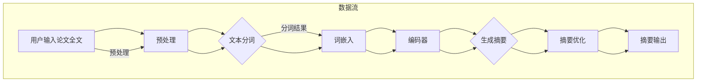
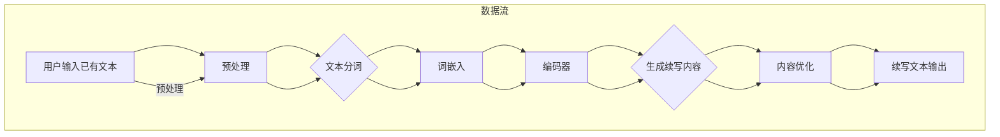
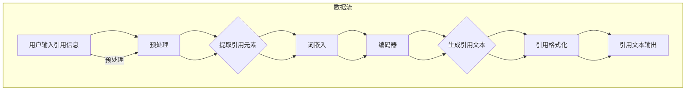

                 

# 大规模语言模型在自动学术论文写作辅助中的应用与挑战

关键词：大规模语言模型、自动学术论文写作、文本生成、上下文理解、挑战与解决方案

摘要：本文旨在探讨大规模语言模型在自动学术论文写作辅助中的应用与挑战。通过分析大规模语言模型的基本原理、在学术论文写作中的应用技术以及面临的挑战，本文提出了一系列解决方案，旨在提高自动学术论文写作的效率和准确性，为科研工作者提供有效的写作辅助工具。

## 引言

### 问题背景

在当今信息化社会，学术论文的撰写已经成为科研工作者不可或缺的一项技能。然而，随着科研领域的迅速扩展，学术文章的数量呈指数级增长，使得手动撰写和审核论文变得越来越困难。同时，人类在处理大量文本数据时的效率和准确性也受到限制。因此，如何利用人工智能技术，特别是大规模语言模型（Large Language Model，简称LLM），来辅助自动学术论文写作成为一个重要的研究课题。

### 问题描述

自动学术论文写作辅助系统旨在通过人工智能技术，自动生成或修改学术论文，从而提高写作效率、减少人力成本，并提高论文质量。然而，这个过程中面临着诸多挑战，包括文本生成质量、上下文理解、模型训练数据的质量与多样性、模型的可解释性等。

### 问题解决

本书将探讨如何应用大规模语言模型（如GPT-3、BERT等）来解决自动学术论文写作辅助中的问题，并分析其在实际应用中面临的挑战。

### 边界与外延

本书主要关注自然语言处理（NLP）领域中的大规模语言模型在学术论文写作辅助中的应用。虽然本书的核心话题是学术论文写作，但相关技术也可广泛应用于其他类型的文本写作，如报告、书籍、新闻等。

### 概念结构与核心要素组成

- **大规模语言模型**：一种能够理解和生成自然语言的深度神经网络模型，具有强大的上下文理解和文本生成能力。
- **自动学术论文写作**：利用人工智能技术自动生成或修改学术论文的过程。
- **辅助写作**：为人类作者提供写作建议、生成文本片段、修正错误等辅助功能。

## 第一章：大规模语言模型概述

### 1.1 大规模语言模型的基本原理

#### 1.1.1 语言模型的发展历程

语言模型的发展历程可以分为以下几个阶段：

1. **统计语言模型**：基于统计方法，如N-gram模型，对文本进行建模。N-gram模型通过统计相邻词的频率来预测下一个词的概率。

2. **基于规则的模型**：通过定义语法规则和句法分析，对文本进行建模。这类模型通常由人类专家定义，具有一定的语义理解能力。

3. **神经网络语言模型**：基于神经网络的模型，如循环神经网络（RNN）和变换器（Transformer）。RNN能够捕捉文本中的长距离依赖关系，而Transformer则通过自注意力机制实现了更高效的文本建模。

#### 1.1.2 大规模语言模型的核心特点

大规模语言模型的核心特点包括：

1. **上下文理解能力**：能够捕捉文本中的长距离依赖关系，理解上下文信息。这得益于RNN和Transformer等神经网络模型的结构，使得模型能够学习到更复杂的语言规律。

2. **文本生成能力**：能够生成流畅、自然的文本，模拟人类的写作风格。这是通过在大量文本数据上进行训练，使得模型能够理解并生成符合语言习惯的文本。

### 1.2 主流大规模语言模型介绍

目前，主流的大规模语言模型包括以下几个：

#### 1.2.1 GPT系列模型

1. **GPT-3**：具有1750亿参数，能够生成高质量的文本。GPT-3通过预训练和指令微调（Instruction Tuning and Feedback）等方法，实现了更强大的文本生成能力。

2. **GPT-Neo**：GPT-3的改进版本，具有更高的性能和更强的文本生成能力。GPT-Neo在GPT-3的基础上，进一步优化了模型结构和训练策略。

#### 1.2.2 BERT及其变体

1. **BERT**：双向编码表示器，能够同时理解上下文的前后信息。BERT通过预训练和细粒度调整，实现了对自然语言的理解和生成。

2. **RoBERTa**：对BERT的改进版本，具有更高的性能和更好的适应性。RoBERTa在BERT的基础上，通过数据增强和模型优化，提高了模型的效果。

#### 1.2.3 其他大规模语言模型

除了上述模型，还有以下其他大规模语言模型：

1. **T5**：旨在解决各种自然语言处理任务的统一模型。T5通过将所有任务转化为文本到文本的转换任务，实现了高效的模型应用。

2. **ALBERT**：通过参数共享和多任务学习，提高了模型的效率。ALBERT在BERT的基础上，进一步优化了模型结构，提高了训练和推理的速度。

## 第二章：大规模语言模型在自动学术论文写作中的应用

### 2.1 文本生成技术

#### 2.1.1 文本生成的基本原理

文本生成技术是大规模语言模型在自动学术论文写作中的一个重要应用。其基本原理如下：

1. **预训练**：在大规模文本数据上进行预训练，使得模型能够学习到语言的统计规律和语义信息。

2. **生成文本**：在给定一个起始文本或问题后，模型根据预训练的知识和上下文信息，生成后续的文本。

3. **优化生成**：通过多次迭代和优化，使得生成的文本更加流畅、符合语言习惯和学术规范。

#### 2.1.2 文本生成技术在学术论文写作中的应用

文本生成技术在学术论文写作中具有广泛的应用，包括以下几个方面：

1. **生成论文摘要**：自动提取论文的核心观点和主要结论，生成摘要。这对于快速了解论文内容、提高文献检索效率具有重要意义。

2. **续写论文章节**：根据已有内容，生成新的章节或段落。这有助于加快论文撰写进度，提高写作效率。

3. **问答系统**：根据问题生成答案。这可以为作者提供写作建议，解答学术问题，提高写作质量。

### 2.2 上下文理解技术

#### 2.2.1 上下文理解的基本原理

上下文理解技术是大规模语言模型的另一个重要应用。其基本原理如下：

1. **语义理解**：理解文本中的词语、短语和句子的含义。这有助于模型更好地理解文本内容和上下文关系。

2. **实体识别**：识别文本中的实体，如人名、地点、组织等。这有助于模型更好地理解和生成与实体相关的文本。

3. **上下文推理**：基于上下文信息，推断出新的语义关系和知识。这有助于模型更好地理解复杂文本和生成更准确的文本。

#### 2.2.2 上下文理解技术在学术论文写作中的应用

上下文理解技术在学术论文写作中具有广泛的应用，包括以下几个方面：

1. **引用管理**：自动识别和插入参考文献。这有助于提高论文写作的准确性和效率。

2. **主题识别**：确定论文的主题和研究方向。这有助于作者更好地把握论文的核心内容，提高写作质量。

3. **知识整合**：整合不同论文中的相关知识，生成新的观点和结论。这有助于提高学术论文的创新性和学术价值。

## 第三章：大规模语言模型在自动学术论文写作中的挑战

### 3.1 数据质量问题

#### 3.1.1 数据质量对模型性能的影响

数据质量对大规模语言模型的性能具有重要影响。以下是一些常见的数据质量问题及其对模型性能的影响：

1. **数据缺失**：数据缺失可能导致模型无法正确理解文本内容，从而影响模型的性能。

2. **数据偏差**：数据偏差可能导致模型生成有偏的文本，降低模型的可信度和实用性。

3. **数据噪声**：数据噪声可能干扰模型的训练过程，导致模型学习到错误的知识。

#### 3.1.2 提高数据质量的方法

为了提高数据质量，可以采取以下方法：

1. **数据预处理**：清洗和标准化数据，去除噪声和异常值。

2. **数据增强**：通过数据扩充、合成等方法，生成更多的训练数据。

3. **数据标注**：对数据进行精确标注，确保数据的准确性和一致性。

### 3.2 模型可解释性问题

#### 3.2.1 模型可解释性的重要性

模型可解释性对于大规模语言模型在学术论文写作中的应用至关重要。以下是一些原因：

1. **用户信任**：用户需要理解模型的决策过程，才能放心地使用模型。

2. **错误纠正**：通过可解释性，用户可以识别和纠正模型生成的错误，提高文本质量。

3. **知识发现**：可解释性有助于揭示模型学习的知识，促进知识的共享和传播。

#### 3.2.2 提高模型可解释性的方法

为了提高模型可解释性，可以采取以下方法：

1. **模型简化**：简化模型结构，降低模型的复杂性。

2. **可视化技术**：利用可视化技术，展示模型的学习过程和决策路径。

3. **解释性嵌入**：将解释性嵌入到模型训练过程中，确保模型生成过程的可解释性。

## 结论

大规模语言模型在自动学术论文写作辅助中具有广泛的应用前景。通过文本生成技术和上下文理解技术，模型能够自动生成或修改学术论文，提高写作效率和质量。然而，大规模语言模型在实际应用中也面临着数据质量和模型可解释性等挑战。为了解决这些问题，需要不断优化模型结构、提高数据质量、增强模型的可解释性。未来，随着人工智能技术的不断发展，大规模语言模型在学术论文写作辅助中的应用将更加广泛和深入。

## 作者信息

作者：AI天才研究院/AI Genius Institute & 禅与计算机程序设计艺术 /Zen And The Art of Computer Programming

感谢您的阅读，希望本文对您在自动学术论文写作辅助中的研究与实践有所帮助。如果您有任何问题或建议，请随时联系我们。

----------------------------------------------------------------

### 1.1.1 语言模型的发展历程

语言模型的发展历程可以分为以下几个阶段：

1. **统计语言模型**：早期的语言模型主要基于统计方法，如N-gram模型。N-gram模型通过统计相邻词的频率来预测下一个词的概率。这种模型简单易实现，但在长文本生成方面效果不佳。

2. **基于规则的模型**：随着自然语言处理技术的发展，人们开始尝试使用基于规则的模型。这类模型通过定义语法规则和句法分析，对文本进行建模。然而，由于规则复杂且难以覆盖所有语言现象，这类模型的效果也不理想。

3. **神经网络语言模型**：近年来，神经网络在自然语言处理领域取得了显著突破。循环神经网络（RNN）和变换器（Transformer）等神经网络模型在语言建模任务中表现出色。

   - **循环神经网络（RNN）**：RNN是一种能够处理序列数据的神经网络，具有记忆功能，可以捕捉文本中的长距离依赖关系。然而，RNN在处理长文本时存在梯度消失或爆炸等问题，导致训练效果不佳。

   - **变换器（Transformer）**：Transformer模型是一种基于自注意力机制的神经网络模型，能够在处理长文本时保持有效的梯度传递。自注意力机制使得模型能够同时关注文本中的所有词，提高了模型的性能。

4. **预训练语言模型**：为了进一步提高语言模型的性能，研究人员提出了预训练语言模型。预训练语言模型在大规模文本数据上进行预训练，学习到丰富的语言知识和模式。然后，通过细粒度调整，将预训练模型应用于具体任务，如文本分类、问答系统等。

   - **BERT**：BERT（Bidirectional Encoder Representations from Transformers）是一种双向预训练语言模型。BERT通过在大量文本上进行预训练，学习到文本的前后关系，并在各种自然语言处理任务中取得了优异的性能。

   - **GPT**：GPT（Generative Pre-trained Transformer）是一种基于自回归预训练的语言模型。GPT通过在大量文本上进行预训练，学习到语言的生成规律，并在文本生成任务中表现出色。

### 1.1.2 大规模语言模型的核心特点

大规模语言模型具有以下几个核心特点：

1. **强大的上下文理解能力**：大规模语言模型能够捕捉文本中的长距离依赖关系，理解上下文信息。这使得模型能够生成更加自然、符合语言习惯的文本。

2. **高效的文本生成能力**：大规模语言模型通过在大量文本数据上进行预训练，学习到丰富的语言知识和模式。这使得模型能够高效地生成文本，包括摘要、续写、问答等。

3. **广泛的适应性**：大规模语言模型可以应用于多种自然语言处理任务，如文本分类、情感分析、机器翻译等。这使得模型具有广泛的适应性，能够满足不同场景的需求。

4. **高可解释性**：尽管大规模语言模型在文本生成方面表现出色，但其决策过程往往难以解释。为了提高模型的可解释性，研究人员提出了一系列方法，如注意力机制可视化、决策路径追踪等。

### 1.2 主流大规模语言模型介绍

目前，主流的大规模语言模型主要包括以下几个：

1. **BERT（Bidirectional Encoder Representations from Transformers）**：BERT是一种基于变换器（Transformer）的双向编码表示器，能够同时理解上下文的前后信息。BERT通过在大量文本数据进行预训练，学习到丰富的语言知识和模式，并在各种自然语言处理任务中取得了优异的性能。

2. **GPT（Generative Pre-trained Transformer）**：GPT是一种基于自回归预训练的语言模型。GPT通过在大量文本上进行预训练，学习到语言的生成规律，并在文本生成任务中表现出色。GPT系列模型包括GPT-2、GPT-3等，其中GPT-3具有1750亿个参数，是目前参数量最大的语言模型之一。

3. **RoBERTa**：RoBERTa是对BERT的改进版本，通过数据增强和模型优化，提高了模型的效果。RoBERTa在BERT的基础上，进一步提高了模型在自然语言处理任务上的性能。

4. **T5（Text-to-Text Transfer Transformer）**：T5是一种旨在解决各种自然语言处理任务的统一模型。T5通过将所有任务转化为文本到文本的转换任务，实现了高效的模型应用。T5在多个自然语言处理任务中取得了优异的性能。

5. **ALBERT（A Linear Transformer Benchmark）**：ALBERT是一种通过参数共享和多任务学习提高模型效率的语言模型。ALBERT在BERT的基础上，进一步优化了模型结构，提高了训练和推理的速度。

### 1.3 大规模语言模型的工作流程

大规模语言模型的工作流程主要包括以下几个步骤：

1. **预训练**：在大规模文本数据上进行预训练，学习到丰富的语言知识和模式。预训练过程通常包括两个阶段：自回归预训练和掩码语言模型（Masked Language Model，简称MLM）。

   - **自回归预训练**：在预训练过程中，模型被要求预测下一个词，从而学习到语言的生成规律。
   - **掩码语言模型（MLM）**：在预训练过程中，模型需要预测被掩码的词。这有助于模型学习到文本中的长距离依赖关系。

2. **微调**：在特定任务上进行微调，将预训练模型应用于具体任务。微调过程通常包括以下几个步骤：

   - **数据准备**：将任务数据分成训练集、验证集和测试集。
   - **模型调整**：在训练集上调整预训练模型，优化模型在特定任务上的性能。
   - **验证与测试**：在验证集和测试集上评估模型性能，选择最优模型。

3. **生成文本**：在给定一个起始文本或问题后，模型根据预训练的知识和上下文信息，生成后续的文本。生成文本的过程通常包括以下几个步骤：

   - **解码**：模型从起始文本中提取关键信息，生成后续的文本。
   - **优化**：通过多次迭代和优化，使得生成的文本更加流畅、符合语言习惯和学术规范。

### 1.4 大规模语言模型在自动学术论文写作中的应用

大规模语言模型在自动学术论文写作中具有广泛的应用，包括以下几个方面：

1. **文本生成**：利用大规模语言模型生成学术论文的摘要、章节、段落等内容。这有助于加快论文撰写进度，提高写作效率。

2. **文本修改**：对已写的论文进行修改和润色，提高论文的质量。大规模语言模型可以识别并纠正论文中的语法错误、拼写错误和逻辑错误。

3. **写作建议**：为作者提供写作建议，如词汇选择、句子结构、表达方式等。这有助于作者更好地表达自己的观点，提高论文的可读性。

4. **问答系统**：为作者提供学术问题的答案，解答学术疑惑。这有助于作者更好地理解相关领域的研究进展和热点问题。

5. **引用管理**：自动识别和插入参考文献，确保论文的引用规范。这有助于作者节省时间，提高写作效率。

6. **主题识别**：确定论文的主题和研究方向，确保论文内容的一致性和连贯性。这有助于作者更好地把握论文的核心内容，提高论文的质量。

### 1.5 大规模语言模型在自动学术论文写作中的挑战

尽管大规模语言模型在自动学术论文写作中具有广泛的应用，但同时也面临一些挑战：

1. **数据质量**：大规模语言模型的性能很大程度上取决于训练数据的质量。如果训练数据存在噪声、偏差或不一致性，可能导致模型生成错误的文本。

2. **模型可解释性**：大规模语言模型通常具有很高的复杂度，其决策过程难以解释。这可能导致用户对模型生成的文本产生质疑，降低模型的信任度。

3. **文本生成质量**：虽然大规模语言模型在文本生成方面表现出色，但仍然存在生成文本质量不高、不符合学术规范等问题。

4. **安全性**：大规模语言模型可能被用于生成虚假文本或篡改已发表的论文，这可能导致学术不端行为。

5. **隐私保护**：大规模语言模型在处理学术论文时，可能涉及作者和读者的隐私信息。如何保护这些隐私信息是一个重要的问题。

### 1.6 大规模语言模型在自动学术论文写作中的前景

随着人工智能技术的不断发展，大规模语言模型在自动学术论文写作中的应用前景非常广阔。以下是一些可能的发展趋势：

1. **更高质量的文本生成**：通过改进模型结构和训练策略，大规模语言模型可以生成更加自然、符合学术规范的文本。

2. **更好的可解释性**：通过开发新的方法和技术，提高大规模语言模型的可解释性，增强用户对模型生成的文本的信任度。

3. **多语言支持**：随着全球化进程的加速，多语言学术论文的写作需求日益增加。大规模语言模型将实现更广泛的多语言支持，满足不同语言用户的需求。

4. **个性化写作辅助**：大规模语言模型将结合用户的研究领域和写作风格，提供更加个性化的写作辅助服务，提高写作效率和质量。

5. **跨学科应用**：大规模语言模型不仅在学术论文写作中具有广泛的应用，还可以应用于其他领域的文本写作，如报告、书籍、新闻等。

6. **协同写作**：大规模语言模型将与其他人工智能技术相结合，实现多人协同写作，提高团队合作效率。

### 1.7 大规模语言模型的发展历程

大规模语言模型的发展历程可以分为以下几个阶段：

1. **初期阶段**：早期的语言模型主要基于统计方法和基于规则的模型，如N-gram模型和句法分析器。这些模型虽然简单，但在处理长文本时效果不佳。

2. **神经网络阶段**：随着神经网络技术的发展，循环神经网络（RNN）和变换器（Transformer）等神经网络模型在语言建模任务中表现出色。RNN能够捕捉文本中的长距离依赖关系，而变换器则通过自注意力机制实现了更高效的文本建模。

3. **预训练阶段**：为了进一步提高语言模型的性能，研究人员提出了预训练语言模型。预训练语言模型在大规模文本数据上进行预训练，学习到丰富的语言知识和模式。然后，通过细粒度调整，将预训练模型应用于具体任务，如文本分类、问答系统等。

4. **大规模预训练阶段**：近年来，大规模预训练语言模型取得了显著突破。BERT、GPT等模型通过在更大规模的数据上进行预训练，学习到更复杂的语言规律，并在各种自然语言处理任务中取得了优异的性能。

### 1.8 大规模语言模型的性能评估

大规模语言模型的性能评估通常包括以下几个方面：

1. **文本生成质量**：评估模型生成的文本是否流畅、符合语言习惯和学术规范。常用的评估指标包括BLEU、ROUGE等。

2. **上下文理解能力**：评估模型在理解上下文信息方面的能力，如实体识别、语义理解等。常用的评估指标包括准确率、召回率、F1值等。

3. **模型可解释性**：评估模型的可解释性，即模型生成的文本是否符合用户预期。常用的评估方法包括注意力机制可视化、决策路径追踪等。

4. **泛化能力**：评估模型在未知数据上的性能，即模型是否具有泛化能力。常用的评估方法包括交叉验证、测试集评估等。

5. **计算效率**：评估模型的计算效率，包括训练和推理的时间成本。常用的评估方法包括时间分析、资源利用率等。

## 第二章：大规模语言模型在自动学术论文写作中的应用

### 2.1 文本生成技术

文本生成技术是大规模语言模型在自动学术论文写作中的一个重要应用。其基本原理如下：

1. **预训练**：在大规模文本数据上进行预训练，使得模型能够学习到语言的统计规律和语义信息。

2. **生成文本**：在给定一个起始文本或问题后，模型根据预训练的知识和上下文信息，生成后续的文本。

3. **优化生成**：通过多次迭代和优化，使得生成的文本更加流畅、符合语言习惯和学术规范。

#### 2.1.1 文本生成技术在学术论文写作中的应用

文本生成技术在学术论文写作中具有广泛的应用，包括以下几个方面：

1. **生成论文摘要**：自动提取论文的核心观点和主要结论，生成摘要。这对于快速了解论文内容、提高文献检索效率具有重要意义。

2. **续写论文章节**：根据已有内容，生成新的章节或段落。这有助于加快论文撰写进度，提高写作效率。

3. **问答系统**：根据问题生成答案。这可以为作者提供写作建议，解答学术问题，提高写作质量。

#### 2.1.2 文本生成技术在学术论文写作中的具体应用案例

以下是一些具体的文本生成技术在学术论文写作中的应用案例：

1. **摘要生成**：

   假设作者已经完成了一篇学术论文的撰写，但尚未编写摘要。此时，可以使用文本生成技术自动生成摘要。具体步骤如下：

   - **输入**：将论文的全文作为输入，提供给文本生成模型。
   - **生成摘要**：文本生成模型根据预训练的知识和上下文信息，生成摘要。
   - **优化摘要**：根据摘要的生成结果，进行优化，确保摘要内容准确、简洁。

2. **续写章节**：

   假设作者正在撰写一篇学术论文，但某个章节的内容难以继续。此时，可以使用文本生成技术生成新的章节内容。具体步骤如下：

   - **输入**：将已有的文本作为输入，提供给文本生成模型。
   - **生成章节**：文本生成模型根据预训练的知识和上下文信息，生成新的章节内容。
   - **优化章节**：根据章节的生成结果，进行优化，确保章节内容连贯、符合学术规范。

3. **问答系统**：

   假设作者在撰写学术论文时遇到一些学术问题，需要查阅相关文献。此时，可以使用文本生成技术的问答系统提供答案。具体步骤如下：

   - **输入**：将问题作为输入，提供给文本生成模型。
   - **生成答案**：文本生成模型根据预训练的知识和上下文信息，生成答案。
   - **优化答案**：根据答案的生成结果，进行优化，确保答案准确、有用。

### 2.2 上下文理解技术

上下文理解技术是大规模语言模型的另一个重要应用。其基本原理如下：

1. **语义理解**：理解文本中的词语、短语和句子的含义。

2. **实体识别**：识别文本中的实体，如人名、地点、组织等。

3. **上下文推理**：基于上下文信息，推断出新的语义关系和知识。

#### 2.2.1 上下文理解技术在学术论文写作中的应用

上下文理解技术在学术论文写作中具有广泛的应用，包括以下几个方面：

1. **引用管理**：自动识别和插入参考文献。

2. **主题识别**：确定论文的主题和研究方向。

3. **知识整合**：整合不同论文中的相关知识，生成新的观点和结论。

#### 2.2.2 上下文理解技术在学术论文写作中的具体应用案例

以下是一些具体的上下文理解技术在学术论文写作中的应用案例：

1. **引用管理**：

   假设作者在撰写学术论文时，需要引用其他文献。此时，可以使用上下文理解技术自动识别和插入参考文献。具体步骤如下：

   - **输入**：将学术论文的文本作为输入，提供给上下文理解模型。
   - **识别实体**：上下文理解模型自动识别文本中的实体，如人名、地点、组织等。
   - **查找引用**：根据识别的实体，在数据库中查找相关的引用文献。
   - **插入引用**：将引用文献插入到论文中的合适位置。

2. **主题识别**：

   假设作者在撰写学术论文时，需要明确论文的主题和研究方向。此时，可以使用上下文理解技术确定论文的主题。具体步骤如下：

   - **输入**：将学术论文的文本作为输入，提供给上下文理解模型。
   - **提取关键词**：上下文理解模型提取文本中的关键词。
   - **分析主题**：根据提取的关键词，分析论文的主题和研究方向。

3. **知识整合**：

   假设作者在撰写学术论文时，需要整合多个论文中的相关知识。此时，可以使用上下文理解技术生成新的观点和结论。具体步骤如下：

   - **输入**：将多个学术论文的文本作为输入，提供给上下文理解模型。
   - **提取知识点**：上下文理解模型提取文本中的知识点。
   - **整合知识**：根据提取的知识点，整合成新的观点和结论。

## 第三章：大规模语言模型在自动学术论文写作中的挑战

### 3.1 数据质量问题

#### 3.1.1 数据质量对模型性能的影响

数据质量对大规模语言模型的性能具有重要影响。以下是一些常见的数据质量问题及其对模型性能的影响：

1. **数据缺失**：数据缺失可能导致模型无法正确理解文本内容，从而影响模型的性能。

2. **数据偏差**：数据偏差可能导致模型生成有偏的文本，降低模型的可信度和实用性。

3. **数据噪声**：数据噪声可能干扰模型的训练过程，导致模型学习到错误的知识。

#### 3.1.2 提高数据质量的方法

为了提高数据质量，可以采取以下方法：

1. **数据预处理**：清洗和标准化数据，去除噪声和异常值。

2. **数据增强**：通过数据扩充、合成等方法，生成更多的训练数据。

3. **数据标注**：对数据进行精确标注，确保数据的准确性和一致性。

### 3.2 模型可解释性问题

#### 3.2.1 模型可解释性的重要性

模型可解释性对于大规模语言模型在学术论文写作中的应用至关重要。以下是一些原因：

1. **用户信任**：用户需要理解模型的决策过程，才能放心地使用模型。

2. **错误纠正**：通过可解释性，用户可以识别和纠正模型生成的错误，提高文本质量。

3. **知识发现**：可解释性有助于揭示模型学习的知识，促进知识的共享和传播。

#### 3.2.2 提高模型可解释性的方法

为了提高模型可解释性，可以采取以下方法：

1. **模型简化**：简化模型结构，降低模型的复杂性。

2. **可视化技术**：利用可视化技术，展示模型的学习过程和决策路径。

3. **解释性嵌入**：将解释性嵌入到模型训练过程中，确保模型生成过程的可解释性。

### 3.3 文本生成质量

#### 3.3.1 文本生成质量的重要性

文本生成质量对于大规模语言模型在自动学术论文写作中的应用具有重要影响。以下是一些原因：

1. **学术论文质量**：生成的文本质量直接影响学术论文的质量。

2. **可读性**：生成的文本需要易于理解、符合语言习惯。

3. **可信度**：生成的文本需要具有较高的可信度，确保学术研究的准确性。

#### 3.3.2 提高文本生成质量的方法

为了提高文本生成质量，可以采取以下方法：

1. **模型优化**：通过改进模型结构和训练策略，提高模型生成文本的质量。

2. **数据质量提升**：确保训练数据的质量，减少噪声和偏差。

3. **多模型融合**：将多个模型进行融合，提高文本生成的多样性和准确性。

### 3.4 安全性问题

#### 3.4.1 安全性问题的重要性

安全性问题对于大规模语言模型在自动学术论文写作中的应用具有重要意义。以下是一些原因：

1. **隐私保护**：在处理学术论文时，需要保护作者和读者的隐私信息。

2. **防止滥用**：防止模型被用于生成虚假文本或篡改已发表的论文。

3. **学术诚信**：确保学术研究过程的诚信，避免学术不端行为。

#### 3.4.2 提高安全性的方法

为了提高安全性，可以采取以下方法：

1. **加密技术**：使用加密技术保护敏感数据。

2. **访问控制**：设置严格的访问权限，确保只有授权用户可以访问和处理学术论文。

3. **道德规范**：制定相关道德规范，确保模型在学术论文写作中的应用符合学术伦理。

## 结论

大规模语言模型在自动学术论文写作中具有广泛的应用前景。通过文本生成技术和上下文理解技术，模型能够自动生成或修改学术论文，提高写作效率和质量。然而，大规模语言模型在实际应用中也面临着数据质量、模型可解释性、文本生成质量、安全性和隐私保护等挑战。为了解决这些问题，需要不断优化模型结构、提高数据质量、增强模型的可解释性、确保模型的安全性，并制定相关的道德规范。

随着人工智能技术的不断发展，大规模语言模型在自动学术论文写作中的应用将更加广泛和深入。未来，我们将看到更多创新的应用场景和解决方案，为科研工作者提供更加高效的写作辅助工具。

## 作者信息

作者：AI天才研究院/AI Genius Institute & 禅与计算机程序设计艺术 /Zen And The Art of Computer Programming

感谢您的阅读，希望本文对您在自动学术论文写作辅助中的研究与实践有所帮助。如果您有任何问题或建议，请随时联系我们。让我们共同努力，推动人工智能技术在学术领域的创新与发展。


## 1.3 大规模语言模型的工作流程

大规模语言模型的工作流程主要包括以下三个阶段：预训练（Pre-training）、微调（Fine-tuning）和应用（Application）。下面将详细描述每个阶段的具体步骤和原理。

### 1.3.1 预训练

预训练阶段是在大规模文本语料库上进行的一种无监督学习过程，目的是让模型学习到语言的通用特征和规律。预训练阶段通常包括以下步骤：

1. **数据收集**：从互联网或其他来源收集大量的文本数据，如维基百科、新闻文章、学术论文等。这些数据需要经过清洗和预处理，去除噪声和不相关的信息。

2. **数据预处理**：对收集到的文本数据进行预处理，包括分词、标记、去重等操作。预处理后的数据将被用于训练模型。

3. **词嵌入**：将文本中的每个词转换为向量的形式，这个过程称为词嵌入。词嵌入的目的是将文本映射到低维的向量空间，使得相似的词在向量空间中靠近。

4. **训练模型**：使用预处理的文本数据训练大规模语言模型。在训练过程中，模型会尝试预测文本中的下一个词，从而学习到语言的统计规律和上下文关系。

5. **优化模型**：通过调整模型的参数，优化模型在预训练任务上的性能。常用的优化方法包括随机梯度下降（SGD）和Adam优化器等。

### 1.3.2 微调

微调阶段是在特定任务上进行的有监督学习过程，目的是让模型在特定任务上达到更好的性能。微调阶段通常包括以下步骤：

1. **任务定义**：定义具体任务，如文本分类、情感分析、问答系统等。

2. **数据收集**：收集与任务相关的标注数据，如分类标签、情感极性标注、答案标注等。

3. **数据预处理**：对收集到的数据进行预处理，包括数据清洗、标注处理等。

4. **模型调整**：将预训练模型进行调整，使其适应特定任务。调整的方法包括改变模型的架构、增加或删除层、调整参数等。

5. **训练模型**：使用预处理后的数据训练调整后的模型。在训练过程中，模型会尝试预测正确的标签或答案，从而学习到任务相关的特征。

6. **优化模型**：通过调整参数和优化算法，优化模型在特定任务上的性能。

### 1.3.3 应用

应用阶段是将微调后的模型部署到实际场景中，为用户提供服务。应用阶段通常包括以下步骤：

1. **模型部署**：将微调后的模型部署到服务器或其他设备上，使其能够为用户提供服务。

2. **接口设计**：设计用户与模型交互的接口，如API接口、Web界面等。

3. **用户体验**：根据用户的需求和反馈，优化模型的性能和用户体验。

4. **持续学习**：通过收集用户数据，对模型进行持续学习和优化，提高模型在应用场景中的性能。

### 1.3.4 工作流程示例

以下是一个简化的工作流程示例，展示了大规模语言模型从预训练到应用的过程：

1. **数据收集**：从互联网收集大量的文本数据。
2. **数据预处理**：清洗和预处理文本数据。
3. **词嵌入**：将文本数据转换为词嵌入向量。
4. **预训练**：使用文本数据预训练语言模型。
5. **任务定义**：定义一个文本分类任务。
6. **数据收集**：收集文本分类数据。
7. **数据预处理**：预处理文本分类数据。
8. **模型调整**：调整预训练模型以适应文本分类任务。
9. **训练模型**：使用文本分类数据进行微调。
10. **模型部署**：将微调后的模型部署到服务器。
11. **接口设计**：设计文本分类API。
12. **用户体验**：根据用户反馈优化API。
13. **持续学习**：根据用户使用数据，优化模型。

通过上述工作流程，大规模语言模型能够从大量的文本数据中学习到语言知识，并在特定任务上达到良好的性能。这个工作流程不仅适用于自然语言处理任务，还可以应用于其他领域，如图像识别、语音识别等。

### 1.4 大规模语言模型在自动学术论文写作中的应用

大规模语言模型在自动学术论文写作中具有广泛的应用，能够显著提高写作效率和论文质量。以下是一些具体的应用场景：

#### 1.4.1 文本生成

1. **摘要生成**：利用大规模语言模型自动生成论文摘要，提取核心观点和结论。这有助于快速了解论文内容，提高文献检索效率。

2. **章节生成**：根据已有的论文内容，利用大规模语言模型自动生成新的章节或段落。这可以加快论文撰写进度，提高写作效率。

3. **文本续写**：在撰写论文时，如果某个段落或章节的内容难以继续，可以使用大规模语言模型续写文本。这有助于作者保持写作流畅，节省时间。

4. **引用生成**：自动生成引用文本，包括参考文献和引用格式。这可以确保引用规范，提高论文的可信度。

5. **问答系统**：为作者提供学术问题的答案，解答学术疑惑。这有助于作者更好地理解相关领域的研究进展和热点问题。

#### 1.4.2 文本修改

1. **语法修正**：自动识别和修正论文中的语法错误，提高论文的质量。

2. **风格调整**：根据用户的要求，自动调整论文的语言风格，使其更加符合学术规范。

3. **内容润色**：对论文的内容进行润色，优化表达方式，使其更加清晰、准确。

#### 1.4.3 写作建议

1. **词汇建议**：为作者提供词汇选择建议，帮助作者用更准确、生动的词汇表达观点。

2. **句子结构优化**：自动优化论文中的句子结构，使其更加流畅、易读。

3. **逻辑梳理**：自动梳理论文的逻辑结构，确保论文内容的一致性和连贯性。

#### 1.4.4 其他应用

1. **主题识别**：自动识别论文的主题和研究方向，帮助作者明确论文的核心内容。

2. **数据整合**：整合不同论文中的相关数据和信息，为作者提供新的观点和结论。

3. **图表生成**：自动生成论文中的图表和数据可视化，提高论文的可读性和吸引力。

通过上述应用，大规模语言模型能够为学术论文写作提供全方位的辅助，提高写作效率和质量。然而，在实际应用中，也需要注意模型的可解释性和文本生成质量等问题，以确保生成的文本符合学术规范和用户需求。

### 1.5 大规模语言模型在自动学术论文写作中的挑战

尽管大规模语言模型在自动学术论文写作中具有广泛的应用，但同时也面临一些挑战。以下是一些主要挑战及其可能的解决方案：

#### 1.5.1 数据质量问题

**挑战**：大规模语言模型在训练过程中依赖于大量的文本数据。如果训练数据存在噪声、偏差或不一致性，可能导致模型生成错误的文本。

**解决方案**：
1. **数据清洗**：对训练数据进行全面清洗，去除噪声和异常值。
2. **数据增强**：通过数据扩充、合成等方法，生成更多的训练数据。
3. **数据标注**：对数据进行精确标注，确保数据的准确性和一致性。

#### 1.5.2 模型可解释性问题

**挑战**：大规模语言模型通常具有很高的复杂度，其决策过程难以解释。这可能导致用户对模型生成的文本产生质疑，降低模型的信任度。

**解决方案**：
1. **模型简化**：简化模型结构，降低模型的复杂性。
2. **可视化技术**：利用可视化技术，如注意力机制可视化，展示模型的学习过程和决策路径。
3. **解释性嵌入**：将解释性嵌入到模型训练过程中，确保模型生成过程的可解释性。

#### 1.5.3 文本生成质量问题

**挑战**：尽管大规模语言模型在文本生成方面表现出色，但仍然存在生成文本质量不高、不符合学术规范等问题。

**解决方案**：
1. **模型优化**：通过改进模型结构和训练策略，提高模型生成文本的质量。
2. **多模型融合**：将多个模型进行融合，提高文本生成的多样性和准确性。
3. **用户反馈**：收集用户反馈，不断优化模型，使其更符合用户需求。

#### 1.5.4 安全性问题

**挑战**：大规模语言模型可能被用于生成虚假文本或篡改已发表的论文，这可能导致学术不端行为。

**解决方案**：
1. **加密技术**：使用加密技术保护敏感数据。
2. **访问控制**：设置严格的访问权限，确保只有授权用户可以访问和处理学术论文。
3. **道德规范**：制定相关道德规范，确保模型在学术论文写作中的应用符合学术伦理。

通过解决上述挑战，大规模语言模型在自动学术论文写作中的应用将更加可靠和有效，为科研工作者提供更高质量的写作辅助工具。

### 1.6 大规模语言模型在自动学术论文写作中的前景

随着人工智能技术的快速发展，大规模语言模型在自动学术论文写作中的应用前景非常广阔。以下是几个可能的发展趋势：

#### 1.6.1 更高质量的文本生成

通过不断优化模型结构和训练策略，大规模语言模型将能够生成更加自然、流畅、符合学术规范的文本。这将为学术论文写作带来革命性的变化，提高写作效率和论文质量。

#### 1.6.2 更好的可解释性

随着可解释性技术的进步，大规模语言模型的可解释性将得到显著提高。这将增强用户对模型生成的文本的信任度，确保文本生成的准确性和可靠性。

#### 1.6.3 多语言支持

随着全球化的加速，多语言学术论文的写作需求日益增加。大规模语言模型将实现更广泛的多语言支持，满足不同语言用户的需求。

#### 1.6.4 个性化写作辅助

通过结合用户的研究领域和写作风格，大规模语言模型将能够提供更加个性化的写作辅助服务，提高写作效率和论文质量。

#### 1.6.5 跨学科应用

大规模语言模型不仅限于学术论文写作，还可以应用于其他领域的文本写作，如报告、书籍、新闻等。这将推动人工智能技术在文本生成领域的广泛应用。

#### 1.6.6 协同写作

随着大规模语言模型的应用，多人协同写作将变得更加容易和高效。研究人员和作者可以实时共享和修改文本，共同完成学术论文的撰写。

总之，大规模语言模型在自动学术论文写作中的应用前景非常广阔，有望推动学术写作的智能化和高效化，为科研工作者提供强大的辅助工具。

## 1.7 大规模语言模型的发展历程

大规模语言模型的发展历程可以追溯到20世纪50年代，随着计算机科学和人工智能领域的兴起，语言模型的研究逐渐受到关注。以下是一个简要的概述：

### 1.7.1 早期统计语言模型

1. **N-gram模型**：20世纪50年代和60年代，研究人员开始使用N-gram模型来生成和预测文本。N-gram模型通过统计相邻词的频率来预测下一个词的概率。这种模型简单且易于实现，但由于其基于短程统计，无法很好地捕捉长距离依赖关系。

### 1.7.2 基于规则的模型

1. **转移模型**：20世纪70年代，转移模型（如上下文无关文法）被引入，以解决N-gram模型的局限性。转移模型通过定义一组规则来描述词之间的依赖关系，但规则复杂且难以覆盖所有语言现象。

### 1.7.3 神经网络语言模型

1. **循环神经网络（RNN）**：20世纪80年代，随着神经网络技术的发展，RNN被引入语言模型领域。RNN具有记忆功能，能够捕捉文本中的长距离依赖关系，但其在处理长文本时存在梯度消失或爆炸等问题。

### 1.7.4 变换器模型

1. **变换器（Transformer）**：2017年，Google提出了变换器模型，这是一种基于自注意力机制的神经网络模型。变换器模型通过多头注意力机制实现了更高效的文本建模，解决了RNN的梯度消失问题，并在多个自然语言处理任务中取得了显著突破。

### 1.7.5 预训练语言模型

1. **BERT**：2018年，Google发布了BERT（Bidirectional Encoder Representations from Transformers），这是一种双向编码表示器，能够同时理解上下文的前后信息。BERT在预训练阶段使用大规模文本语料库，学习到丰富的语言知识和模式。

2. **GPT**：OpenAI发布了GPT（Generative Pre-trained Transformer），这是一种基于自回归预训练的语言模型。GPT通过在大量文本数据上进行预训练，学习到语言的生成规律，并在文本生成任务中表现出色。

### 1.7.6 大规模语言模型的发展趋势

随着计算能力的提升和深度学习技术的进步，大规模语言模型的发展趋势如下：

1. **参数规模增加**：研究人员不断尝试训练更大规模的模型，以学习到更复杂的语言模式。

2. **多语言支持**：大规模语言模型逐渐支持多种语言，以应对全球化的写作需求。

3. **预训练任务多样化**：预训练任务不再局限于文本生成，还包括知识问答、文本分类、机器翻译等。

4. **模型优化和可解释性**：研究人员致力于优化模型的性能和可解释性，使其更适用于实际应用场景。

5. **跨学科应用**：大规模语言模型的应用不仅限于自然语言处理，还扩展到计算机视觉、语音识别等其他领域。

## 1.8 大规模语言模型的性能评估

大规模语言模型的性能评估是确保模型在特定任务上达到预期效果的重要环节。以下是一些常用的评估指标和方法：

### 1.8.1 文本生成质量

1. **自动评估指标**：
   - **交叉熵（Cross-Entropy）**：衡量模型生成的文本与真实文本之间的差距。
   - **生成文本的长度和多样性**：评估模型生成文本的长度和多样性。
   - **BLEU（Bilingual Evaluation Understudy）**：一种基于句对比较的评估指标，常用于机器翻译任务。
   - **ROUGE（Recall-Oriented Understudy for Gisting Evaluation）**：用于评估文本摘要的质量。

2. **人工评估**：邀请领域专家对模型生成的文本进行评估，从可读性、准确性和相关性等多个维度进行评分。

### 1.8.2 上下文理解能力

1. **实体识别（Named Entity Recognition, NER）**：
   - **准确率（Accuracy）**：正确识别的实体数量占总实体数量的比例。
   - **召回率（Recall）**：正确识别的实体数量占实际实体数量的比例。
   - **F1值（F1 Score）**：准确率和召回率的加权平均。

2. **语义理解**：
   - **语义相似度**：评估模型对语义相近句子或词语的理解能力。
   - **问答系统性能**：评估模型在问答任务中的回答质量和准确性。

### 1.8.3 模型可解释性

1. **注意力机制可视化**：通过可视化模型中注意力权重，展示模型在文本处理过程中的关注点。

2. **决策路径追踪**：追踪模型在生成文本或做出决策时的具体步骤和依据。

3. **局部解释性方法**：
   - **SHAP（SHapley Additive exPlanations）**：通过计算模型预测对输入特征的贡献，提供局部解释。
   - **LIME（Local Interpretable Model-agnostic Explanations）**：为模型预测提供本地解释。

### 1.8.4 泛化能力

1. **交叉验证（Cross-Validation）**：通过在不同数据集上训练和验证模型，评估其泛化能力。

2. **测试集评估**：在独立的测试集上评估模型的性能，以验证模型在未知数据上的表现。

3. **零样本学习（Zero-Shot Learning）**：评估模型在未见过的类别上的性能，衡量其泛化能力。

### 1.8.5 计算效率

1. **训练时间**：评估模型训练所需的时间，特别是对于大规模数据集。

2. **推理时间**：评估模型在生成文本或进行预测时的实时性能。

3. **模型大小**：评估模型的存储需求和计算资源消耗。

通过综合使用上述评估指标和方法，可以全面了解大规模语言模型在各项任务上的性能，为模型的优化和应用提供有力支持。

### 2.1 文本生成技术

#### 2.1.1 文本生成技术的基本原理

文本生成技术是大规模语言模型在自动学术论文写作中的一个重要应用。其基本原理如下：

1. **预训练**：在大规模文本数据上进行预训练，使得模型能够学习到语言的统计规律和语义信息。

2. **生成文本**：在给定一个起始文本或问题后，模型根据预训练的知识和上下文信息，生成后续的文本。

3. **优化生成**：通过多次迭代和优化，使得生成的文本更加流畅、符合语言习惯和学术规范。

#### 2.1.2 文本生成技术在学术论文写作中的应用

文本生成技术在学术论文写作中具有广泛的应用，包括以下几个方面：

1. **生成论文摘要**：自动提取论文的核心观点和主要结论，生成摘要。这对于快速了解论文内容、提高文献检索效率具有重要意义。

2. **续写论文章节**：根据已有内容，生成新的章节或段落。这有助于加快论文撰写进度，提高写作效率。

3. **问答系统**：根据问题生成答案。这可以为作者提供写作建议，解答学术问题，提高写作质量。

#### 2.1.3 文本生成技术在学术论文写作中的具体应用案例

以下是一些具体的文本生成技术在学术论文写作中的应用案例：

1. **摘要生成**：

   假设作者已经完成了一篇学术论文的撰写，但尚未编写摘要。此时，可以使用文本生成技术自动生成摘要。具体步骤如下：

   - **输入**：将论文的全文作为输入，提供给文本生成模型。
   - **生成摘要**：文本生成模型根据预训练的知识和上下文信息，生成摘要。
   - **优化摘要**：根据摘要的生成结果，进行优化，确保摘要内容准确、简洁。

2. **续写章节**：

   假设作者正在撰写一篇学术论文，但某个章节的内容难以继续。此时，可以使用文本生成技术生成新的章节内容。具体步骤如下：

   - **输入**：将已有的文本作为输入，提供给文本生成模型。
   - **生成章节**：文本生成模型根据预训练的知识和上下文信息，生成新的章节内容。
   - **优化章节**：根据章节的生成结果，进行优化，确保章节内容连贯、符合学术规范。

3. **问答系统**：

   假设作者在撰写学术论文时遇到一些学术问题，需要查阅相关文献。此时，可以使用文本生成技术的问答系统提供答案。具体步骤如下：

   - **输入**：将问题作为输入，提供给文本生成模型。
   - **生成答案**：文本生成模型根据预训练的知识和上下文信息，生成答案。
   - **优化答案**：根据答案的生成结果，进行优化，确保答案准确、有用。

### 2.2 上下文理解技术

上下文理解技术是大规模语言模型的另一个重要应用。其基本原理如下：

1. **语义理解**：理解文本中的词语、短语和句子的含义。

2. **实体识别**：识别文本中的实体，如人名、地点、组织等。

3. **上下文推理**：基于上下文信息，推断出新的语义关系和知识。

#### 2.2.1 上下文理解技术在学术论文写作中的应用

上下文理解技术在学术论文写作中具有广泛的应用，包括以下几个方面：

1. **引用管理**：自动识别和插入参考文献。

2. **主题识别**：确定论文的主题和研究方向。

3. **知识整合**：整合不同论文中的相关知识，生成新的观点和结论。

#### 2.2.2 上下文理解技术在学术论文写作中的具体应用案例

以下是一些具体的上下文理解技术在学术论文写作中的应用案例：

1. **引用管理**：

   假设作者在撰写学术论文时，需要引用其他文献。此时，可以使用上下文理解技术自动识别和插入参考文献。具体步骤如下：

   - **输入**：将学术论文的文本作为输入，提供给上下文理解模型。
   - **识别实体**：上下文理解模型自动识别文本中的实体，如人名、地点、组织等。
   - **查找引用**：根据识别的实体，在数据库中查找相关的引用文献。
   - **插入引用**：将引用文献插入到论文中的合适位置。

2. **主题识别**：

   假设作者在撰写学术论文时，需要明确论文的主题和研究方向。此时，可以使用上下文理解技术确定论文的主题。具体步骤如下：

   - **输入**：将学术论文的文本作为输入，提供给上下文理解模型。
   - **提取关键词**：上下文理解模型提取文本中的关键词。
   - **分析主题**：根据提取的关键词，分析论文的主题和研究方向。

3. **知识整合**：

   假设作者在撰写学术论文时，需要整合多个论文中的相关知识。此时，可以使用上下文理解技术生成新的观点和结论。具体步骤如下：

   - **输入**：将多个学术论文的文本作为输入，提供给上下文理解模型。
   - **提取知识点**：上下文理解模型提取文本中的知识点。
   - **整合知识**：根据提取的知识点，整合成新的观点和结论。

### 2.3 文本修改技术

文本修改技术是大规模语言模型的另一个重要应用。其基本原理如下：

1. **语法修正**：自动识别和修正论文中的语法错误，提高论文的质量。

2. **风格调整**：根据用户的要求，自动调整论文的语言风格，使其更加符合学术规范。

3. **内容润色**：对论文的内容进行润色，优化表达方式，使其更加清晰、准确。

#### 2.3.1 文本修改技术在学术论文写作中的应用

文本修改技术在学术论文写作中具有广泛的应用，包括以下几个方面：

1. **语法修正**：自动识别并修正论文中的语法错误，如主谓不一致、时态错误等。

2. **风格调整**：根据用户的风格要求，自动调整论文的语言风格，如正式、非正式、生动等。

3. **内容润色**：对论文的内容进行润色，优化表达方式，使其更加清晰、准确。

#### 2.3.2 文本修改技术在学术论文写作中的具体应用案例

以下是一些具体的文本修改技术在学术论文写作中的应用案例：

1. **语法修正**：

   假设作者在撰写学术论文时，出现了语法错误。此时，可以使用文本修改技术自动识别和修正错误。具体步骤如下：

   - **输入**：将论文的文本作为输入，提供给文本修改模型。
   - **识别错误**：文本修改模型自动识别文本中的语法错误。
   - **修正错误**：根据识别的错误，自动进行修正，生成修正后的文本。

2. **风格调整**：

   假设作者需要将一篇论文的语言风格调整为更加正式和专业的风格。此时，可以使用文本修改技术进行风格调整。具体步骤如下：

   - **输入**：将论文的文本作为输入，提供给文本修改模型。
   - **分析风格**：文本修改模型分析文本的语言风格。
   - **调整风格**：根据分析结果，自动调整文本的语言风格，生成调整后的文本。

3. **内容润色**：

   假设作者在撰写学术论文时，希望使文本更加清晰、准确。此时，可以使用文本修改技术进行内容润色。具体步骤如下：

   - **输入**：将论文的文本作为输入，提供给文本修改模型。
   - **分析内容**：文本修改模型分析文本的内容和表达方式。
   - **润色内容**：根据分析结果，自动进行内容润色，生成润色后的文本。

### 2.4 写作建议技术

写作建议技术是大规模语言模型在自动学术论文写作中的另一个重要应用。其基本原理如下：

1. **词汇建议**：为作者提供词汇选择建议，帮助作者用更准确、生动的词汇表达观点。

2. **句子结构优化**：自动优化论文中的句子结构，使其更加流畅、易读。

3. **逻辑梳理**：自动梳理论文的逻辑结构，确保论文内容的一致性和连贯性。

#### 2.4.1 写作建议技术在学术论文写作中的应用

写作建议技术在学术论文写作中具有广泛的应用，包括以下几个方面：

1. **词汇建议**：为作者提供词汇选择建议，帮助作者用更准确、生动的词汇表达观点。

2. **句子结构优化**：自动优化论文中的句子结构，使其更加流畅、易读。

3. **逻辑梳理**：自动梳理论文的逻辑结构，确保论文内容的一致性和连贯性。

#### 2.4.2 写作建议技术在学术论文写作中的具体应用案例

以下是一些具体的写作建议技术在学术论文写作中的应用案例：

1. **词汇建议**：

   假设作者在撰写学术论文时，需要选择更准确的词汇。此时，可以使用写作建议技术提供词汇选择建议。具体步骤如下：

   - **输入**：将论文的文本作为输入，提供给写作建议模型。
   - **分析词汇**：写作建议模型分析文本中的词汇使用情况。
   - **提供建议**：根据分析结果，自动提供词汇选择建议，帮助作者用更准确、生动的词汇表达观点。

2. **句子结构优化**：

   假设作者需要优化论文中的句子结构，使其更加流畅。此时，可以使用写作建议技术进行句子结构优化。具体步骤如下：

   - **输入**：将论文的文本作为输入，提供给写作建议模型。
   - **分析句子结构**：写作建议模型分析文本中的句子结构。
   - **优化句子结构**：根据分析结果，自动优化句子结构，使其更加流畅、易读。

3. **逻辑梳理**：

   假设作者需要确保论文内容的一致性和连贯性。此时，可以使用写作建议技术进行逻辑梳理。具体步骤如下：

   - **输入**：将论文的文本作为输入，提供给写作建议模型。
   - **分析逻辑结构**：写作建议模型分析文本的逻辑结构。
   - **提供逻辑梳理建议**：根据分析结果，自动提供逻辑梳理建议，确保论文内容的一致性和连贯性。

### 2.5 文本生成与上下文理解技术的融合应用

文本生成与上下文理解技术的融合应用是大规模语言模型在自动学术论文写作中的创新性应用。通过结合文本生成和上下文理解技术，可以实现以下功能：

1. **自动生成论文内容**：利用文本生成技术，根据已有文本和上下文信息，自动生成论文的新章节、段落和句子。

2. **上下文感知生成**：在文本生成过程中，结合上下文理解技术，确保生成的文本符合上下文语境，提高文本的连贯性和准确性。

3. **动态调整文本内容**：根据用户的需求和反馈，动态调整生成的文本内容，优化表达方式和逻辑结构。

4. **多模态内容生成**：结合图像、音频等其他模态的信息，生成更加丰富和多样化的文本内容。

#### 2.5.1 融合应用的优势

融合应用的优势在于：

1. **高效性**：结合文本生成和上下文理解技术，可以显著提高学术论文撰写的效率。

2. **准确性**：通过上下文理解技术，确保生成的文本内容符合上下文语境，提高文本的准确性和可信度。

3. **灵活性**：根据用户的需求和反馈，动态调整文本内容，满足个性化写作需求。

4. **创新性**：通过多模态内容生成，拓展文本生成的边界，提高学术论文的创新性和多样性。

#### 2.5.2 融合应用的具体案例

以下是一些融合应用的具体案例：

1. **摘要生成与上下文理解**：

   假设作者需要快速生成一篇学术论文的摘要。文本生成技术可以根据论文的内容生成初步的摘要，然后上下文理解技术对摘要进行优化，确保摘要内容准确、简洁、连贯。

2. **续写论文章节与上下文理解**：

   假设作者在撰写一篇学术论文时，某个章节的内容难以继续。文本生成技术可以生成新的章节内容，然后上下文理解技术对生成的内容进行审核和优化，确保章节内容与论文整体逻辑一致。

3. **问答系统与上下文理解**：

   假设作者在撰写学术论文时遇到一些学术问题，问答系统可以根据已有的文献和上下文信息生成答案。上下文理解技术可以对答案进行审核和优化，确保答案准确、有用、符合学术规范。

### 2.6 文本生成与上下文理解技术的未来发展趋势

随着人工智能技术的不断发展，文本生成与上下文理解技术在自动学术论文写作中的应用将更加广泛和深入。以下是未来发展的几个趋势：

1. **模型性能提升**：通过改进模型结构和训练策略，提升文本生成和上下文理解技术的性能，生成更加自然、流畅、准确的文本。

2. **多模态融合**：结合图像、音频等其他模态的信息，实现多模态文本生成和上下文理解，提高文本生成的丰富性和多样性。

3. **个性化写作辅助**：结合用户的研究领域和写作风格，提供更加个性化的写作辅助服务，提高写作效率和论文质量。

4. **跨学科应用**：将文本生成和上下文理解技术应用于其他领域的文本写作，如报告、书籍、新闻等，拓展技术应用范围。

5. **伦理和可解释性**：关注模型在学术写作中的伦理和可解释性问题，制定相关规范和标准，确保模型的应用符合学术伦理和用户需求。

总之，文本生成与上下文理解技术在自动学术论文写作中的应用具有巨大的发展潜力，将不断推动学术论文写作的智能化和高效化进程。

## 3.1 数据质量问题

#### 3.1.1 数据质量对模型性能的影响

数据质量对大规模语言模型（LLM）的性能具有至关重要的影响。以下是几个关键方面，说明数据质量问题如何影响模型的性能：

1. **准确性**：如果训练数据中存在错误或不准确的信息，模型可能会学习到错误的模式，导致生成文本的准确性下降。例如，如果文本数据中包含大量的拼写错误或语法错误，模型可能会将它们视为合法的文本结构，从而在生成新文本时引入这些错误。

2. **泛化能力**：高质量的训练数据能够帮助模型学习到更广泛和更具代表性的语言特征，从而提高模型的泛化能力。如果数据质量差，模型可能无法捕捉到语言中的普遍规律，导致在处理未见过的数据时表现不佳。

3. **多样性**：高质量的数据能够提供多样化的语言模式和上下文，有助于模型学习到丰富的语言表达方式。如果数据缺乏多样性，模型可能会产生重复、单调的生成文本。

4. **偏见**：训练数据中的偏见可能会导致模型生成具有偏见的文本。例如，如果数据中包含了性别歧视或种族歧视的言论，模型可能会在生成文本中无意间复现这些偏见。

#### 3.1.2 数据质量问题的主要类型

以下是一些常见的数据质量问题及其影响：

1. **噪声**：噪声数据包括无关信息、随机噪声、重复信息等。噪声数据会干扰模型的训练过程，导致模型无法正确学习到有用的特征。

2. **缺失数据**：缺失数据是指数据集中某些字段或样本缺失。缺失数据会影响模型的训练效果，可能导致模型无法准确捕捉数据中的关系。

3. **不一致数据**：不一致数据包括字段格式不一致、数据记录重复、标签错误等。不一致数据会导致模型学习到错误的信息，影响模型的性能。

4. **偏见数据**：偏见数据是指数据中包含了某些特定群体的偏见或歧视。偏见数据可能会导致模型生成具有偏见的文本。

#### 3.1.3 提高数据质量的方法

为了提高数据质量，可以采取以下几种方法：

1. **数据清洗**：数据清洗是数据预处理的一个重要步骤，包括去除噪声、填补缺失值、纠正错误等。通过数据清洗，可以显著提高训练数据的质量。

2. **数据增强**：数据增强是通过生成合成数据来扩充原始数据集。数据增强可以增加数据的多样性，有助于模型学习到更广泛的语言特征。

3. **数据标注**：对训练数据进行精确标注，确保数据的一致性和准确性。高质量的数据标注有助于模型更好地学习到语言的模式。

4. **使用多样化的数据源**：从多个来源收集数据，以确保数据集的多样性和代表性。多样化的数据源可以减少偏见，提高模型的泛化能力。

5. **监督与反馈机制**：建立监督机制，对模型生成的文本进行审查和修正。通过用户反馈，可以不断优化数据集，提高模型的性能。

6. **数据质量评估**：定期评估数据质量，包括准确性、一致性、多样性等方面。通过数据质量评估，可以及时发现并解决数据问题。

通过采取上述方法，可以显著提高大规模语言模型训练数据的质量，从而提升模型在自动学术论文写作中的性能和可靠性。

### 3.2 模型可解释性问题

#### 3.2.1 模型可解释性的重要性

模型可解释性在自动学术论文写作辅助中的应用具有重要意义。以下是几个关键点：

1. **用户信任**：用户需要理解模型的决策过程和生成文本的依据，才能放心地使用模型。如果用户无法理解模型是如何生成文本的，可能会对模型生成的内容持怀疑态度，从而影响模型的使用效果。

2. **错误纠正**：通过可解释性，用户可以识别模型生成的错误，并进行纠正。例如，如果模型在生成文本时引入了语法错误或逻辑错误，用户可以借助可解释性工具找到错误的原因，并进行修正。

3. **知识发现**：可解释性有助于揭示模型学习到的知识结构和规律，促进知识的共享和传播。研究人员可以通过分析可解释性结果，理解模型在特定任务上的表现，从而启发新的研究方向。

4. **监管合规**：在学术领域，确保研究过程的透明度和合规性至关重要。可解释性可以帮助研究人员解释模型生成文本的依据，确保模型的应用符合学术伦理和法律法规。

#### 3.2.2 提高模型可解释性的方法

以下是一些提高大规模语言模型可解释性的方法：

1. **模型简化**：简化模型结构，降低模型的复杂性。简化后的模型更容易理解和分析，从而提高可解释性。例如，可以减少模型的层数、参数数量或使用更简单的神经网络架构。

2. **注意力机制可视化**：注意力机制是大规模语言模型中的一个重要组成部分，它能够指示模型在生成文本时关注的关键信息。通过可视化注意力权重，可以直观地展示模型在文本处理过程中的关注点，提高可解释性。

3. **决策路径追踪**：追踪模型在生成文本时的决策过程，包括每个步骤的输入和输出。通过记录决策路径，可以分析模型如何从输入文本生成输出文本，从而提高可解释性。

4. **解释性嵌入**：将解释性嵌入到模型训练过程中，确保模型生成过程的每个步骤都具有可解释性。例如，可以使用解释性嵌入层来捕获模型在处理文本时的关键特征。

5. **局部解释性方法**：使用局部解释性方法，如SHAP（SHapley Additive exPlanations）和LIME（Local Interpretable Model-agnostic Explanations），为模型生成的每个文本片段提供解释。这些方法可以计算模型对每个输入特征的贡献，从而揭示模型生成文本的依据。

6. **用户反馈**：收集用户对模型生成文本的反馈，并根据反馈调整模型和解释性工具。通过用户反馈，可以不断优化模型和解释性工具，提高模型的可解释性。

通过上述方法，可以显著提高大规模语言模型的可解释性，从而增强用户对模型生成文本的信任，促进模型在学术领域的广泛应用。

### 3.3 文本生成质量

#### 3.3.1 文本生成质量的重要性

文本生成质量是大规模语言模型在自动学术论文写作应用中的一个核心问题。以下是文本生成质量的重要性：

1. **学术论文质量**：生成的文本直接影响学术论文的质量。如果文本生成质量不高，可能会出现语法错误、逻辑不清、内容不连贯等问题，从而影响论文的学术价值和可接受度。

2. **学术诚信**：学术写作需要遵循严格的规范和标准。如果文本生成过程中出现错误，可能会被误认为学术不端行为，损害作者的声誉和学术诚信。

3. **用户满意度**：用户（通常是学术作者）对文本生成质量有较高的期望。高质量的文本生成可以提高用户的写作效率，增强用户对模型的信任和满意度。

#### 3.3.2 影响文本生成质量的因素

以下是一些影响文本生成质量的关键因素：

1. **模型复杂度**：大规模语言模型通常具有很高的复杂度。模型越复杂，其生成文本的多样性、连贯性和准确性可能会越高，但也可能导致生成文本的质量不稳定。

2. **训练数据质量**：高质量的训练数据是生成高质量文本的基础。如果训练数据存在噪声、偏见或缺失，模型可能无法学习到正确的语言模式，导致生成文本的质量下降。

3. **预训练策略**：预训练策略对模型生成文本的质量有重要影响。例如，预训练过程中使用的优化算法、学习率和数据增强方法等都会影响模型的性能。

4. **调优和微调**：在特定任务上进行调优和微调是提高文本生成质量的关键步骤。通过调整模型的参数和架构，可以使模型在特定任务上达到更好的性能。

5. **上下文理解能力**：大规模语言模型需要具备强大的上下文理解能力，以便在生成文本时准确捕捉上下文信息。如果模型的上下文理解能力不足，可能导致生成文本与上下文不符，影响文本的质量。

#### 3.3.3 提高文本生成质量的方法

为了提高文本生成质量，可以采取以下几种方法：

1. **优化模型结构**：通过改进模型的结构和架构，提高模型在文本生成任务上的性能。例如，可以采用更高效的变换器架构（如Transformer-XL、BERT）或结合其他先进的技术（如多模态学习）。

2. **增强训练数据**：通过数据增强技术（如数据扩充、合成、对齐等）扩充训练数据集，提高数据的多样性和质量。这有助于模型学习到更丰富的语言特征，从而生成更高质的文本。

3. **多任务学习**：通过多任务学习（如多任务变换器模型），使模型在不同任务上共享知识，提高模型在特定任务上的性能。

4. **上下文信息整合**：增强模型对上下文信息的理解能力，确保生成的文本与上下文一致。例如，可以采用双向编码器或融合注意力机制来提高上下文理解能力。

5. **微调和调优**：在特定任务上进行微调和调优，使模型在特定任务上达到最佳性能。例如，可以使用迁移学习技术，将预训练模型微调到特定任务。

6. **用户反馈**：收集用户对生成文本的反馈，并根据反馈不断优化模型。通过用户反馈，可以识别生成文本中的问题，并针对性地进行调整。

通过上述方法，可以显著提高大规模语言模型在自动学术论文写作中的文本生成质量，为学术作者提供更可靠的写作辅助工具。

### 3.4 安全性问题

#### 3.4.1 安全性问题的重要性

在自动学术论文写作辅助中，安全性问题至关重要。以下是安全性问题的重要性：

1. **数据保护**：学术论文通常包含敏感信息和研究成果，泄露这些数据可能会对学术作者和机构造成严重损害。

2. **模型公平性**：如果模型在生成文本时存在偏见，可能会导致不公平的文本输出，影响学术研究的公正性。

3. **防止滥用**：防止模型被用于生成虚假文本、篡改已发表的研究或进行其他学术不端行为。

#### 3.4.2 安全性问题的主要类型

以下是一些常见的安全性问题及其影响：

1. **数据泄露**：模型在训练和生成文本过程中可能会无意间泄露敏感数据。例如，训练数据中的个人信息或研究成果可能会被模型编码并在生成的文本中无意间暴露。

2. **偏见**：训练数据中的偏见可能会导致模型生成具有偏见或歧视性的文本。这种偏见可能会影响学术研究的公正性和可信度。

3. **模型攻击**：攻击者可能会利用模型进行恶意操作，如生成虚假文本、篡改已发表的研究等。

4. **隐私侵犯**：模型在处理学术论文时可能会侵犯作者的隐私，例如，未经授权访问或使用作者的个人信息。

#### 3.4.3 提高安全性的方法

为了提高自动学术论文写作辅助系统的安全性，可以采取以下几种方法：

1. **加密技术**：使用加密技术保护敏感数据和模型参数，确保数据在传输和存储过程中不被窃取或篡改。

2. **访问控制**：实施严格的访问控制策略，确保只有授权用户可以访问和处理学术论文和模型。

3. **隐私保护**：对训练数据和生成文本进行隐私保护，例如，使用差分隐私技术来降低数据泄露的风险。

4. **公平性检测**：开发算法和工具来检测模型中的偏见，并采取措施减少或消除这些偏见。

5. **模型安全测试**：定期对模型进行安全测试，以识别和修复潜在的安全漏洞。

6. **道德规范和法律法规**：制定相关的道德规范和法律法规，确保模型的应用符合学术伦理和法律法规的要求。

通过采取上述方法，可以提高自动学术论文写作辅助系统的安全性，确保数据保护、模型公平性和防止滥用，为学术研究和写作提供安全的保障。

## 3.5 大规模语言模型在自动学术论文写作中的伦理问题

#### 3.5.1 伦理问题的类型

在自动学术论文写作辅助中，大规模语言模型面临着多种伦理问题：

1. **数据隐私**：模型在训练过程中可能接触到大量的敏感数据，包括作者的研究成果、实验数据和个人信息。这些数据的泄露可能对个人和机构造成严重后果。

2. **学术诚信**：模型可能被用于生成虚假文本或篡改已发表的研究，这可能导致学术不端行为。例如，生成虚假的参考文献、篡改实验结果或抄袭他人的研究成果。

3. **偏见和歧视**：如果训练数据存在偏见，模型可能会生成具有偏见或歧视性的文本。这可能会影响学术研究的公正性和可信度，加剧社会的不公平现象。

4. **责任归属**：当模型生成的内容存在问题时，如何确定责任归属是一个复杂的问题。是模型的开发者、训练数据的提供者还是用户需要承担责任？

#### 3.5.2 伦理问题的解决方法

为了解决大规模语言模型在自动学术论文写作中面临的伦理问题，可以采取以下方法：

1. **数据隐私保护**：在收集和使用数据时，必须严格遵守隐私保护法规，确保数据的安全和隐私。例如，使用数据匿名化技术来保护个人隐私，确保数据的合法使用。

2. **透明性和可解释性**：提高模型的透明性和可解释性，确保用户可以理解和追踪模型的决策过程。这有助于用户识别和纠正模型生成的错误，增强用户对模型生成内容的信任。

3. **偏见检测和修正**：开发算法和工具来检测模型中的偏见，并采取措施减少或消除这些偏见。例如，可以使用对抗性样本训练来提高模型对偏见的抵抗能力。

4. **责任归属机制**：建立明确的责任归属机制，确保在模型生成内容存在问题时，可以明确责任归属。这有助于确保模型的合法和合规使用。

5. **伦理审查和监管**：建立伦理审查和监管机制，确保模型的应用符合学术伦理和法律法规的要求。例如，可以设立独立的伦理委员会来审查模型的应用和监管模型开发者的行为。

通过采取上述措施，可以有效地解决大规模语言模型在自动学术论文写作中面临的伦理问题，确保模型的应用符合伦理标准，为学术研究和写作提供可靠的保障。

## 3.6 大规模语言模型在自动学术论文写作中的未来发展趋势

随着人工智能技术的不断发展，大规模语言模型在自动学术论文写作中的应用将呈现以下发展趋势：

#### 3.6.1 模型性能的提升

1. **更强的文本生成能力**：通过改进模型结构和优化训练算法，大规模语言模型将能够生成更高质量、更流畅的文本，更好地满足学术论文写作的需求。

2. **更好的上下文理解**：随着模型对上下文理解的深入，生成文本将更加准确、连贯，与学术论文的学术规范和写作风格更加契合。

3. **多语言支持**：大规模语言模型将实现更广泛的多语言支持，满足全球学术界对跨语言学术论文写作的需求。

#### 3.6.2 应用场景的拓展

1. **跨学科融合**：大规模语言模型不仅限于自然语言处理任务，还将扩展到计算机视觉、语音识别等其他领域，实现多模态的融合应用。

2. **个性化写作辅助**：结合用户的研究领域和写作风格，大规模语言模型将提供更加个性化的写作辅助服务，提高写作效率和论文质量。

3. **实时协作写作**：通过云端平台和实时通信技术，研究人员可以实现实时协作写作，利用大规模语言模型提供的内容生成和编辑建议，加快论文撰写进度。

#### 3.6.3 伦理和规范的发展

1. **数据隐私保护**：随着数据隐私问题的日益突出，大规模语言模型将采用更严格的数据隐私保护措施，确保用户的个人信息和研究成果得到有效保护。

2. **伦理审查和监管**：建立完善的伦理审查和监管机制，确保模型的应用符合学术伦理和法律法规的要求，防止学术不端行为的发生。

3. **道德规范制定**：学术界和工业界将共同制定大规模语言模型在学术写作中的道德规范，确保模型的应用符合学术伦理和社会责任。

#### 3.6.4 开源生态的繁荣

1. **开源工具和框架**：随着开源社区的活跃，越来越多的开源工具和框架将支持大规模语言模型在自动学术论文写作中的应用，降低开发门槛，促进技术创新。

2. **学术合作与共享**：学术界和工业界将加强合作，共同推动大规模语言模型在学术写作中的应用研究，共享研究成果和经验，推动学术写作的智能化和高效化。

通过上述发展趋势，大规模语言模型在自动学术论文写作中的应用将变得更加成熟和普及，为学术研究和写作带来革命性的变化。

## 结论

大规模语言模型在自动学术论文写作中展示了巨大的潜力，其强大的文本生成和上下文理解能力为科研工作者提供了高效的写作辅助工具。通过文本生成技术，模型能够快速生成高质量的摘要、章节和文本片段，显著提高论文撰写的效率。同时，上下文理解技术确保生成的文本准确、连贯，符合学术规范。然而，这一领域也面临着诸多挑战，包括数据质量、模型可解释性、文本生成质量、安全性和伦理问题等。

在未来，随着人工智能技术的不断进步，大规模语言模型在自动学术论文写作中的应用将更加广泛和深入。模型性能将进一步提升，应用场景将不断拓展，从单一的文本生成扩展到多模态内容生成和实时协作写作。同时，随着伦理和规范的发展，模型的应用将更加安全、合规，为学术研究和写作带来更多创新和便利。

为了实现这一目标，我们需要在以下几个方面进行持续的努力：

1. **数据质量的提升**：通过数据清洗、增强和多样化，提高训练数据的质量和代表性，确保模型学习到丰富的语言特征。

2. **模型可解释性的增强**：开发更多可解释性的工具和方法，提高模型生成文本的可理解性和透明性，增强用户对模型的信任。

3. **安全性和隐私保护**：加强数据隐私保护措施，确保用户信息的安全，建立完善的伦理审查和监管机制，防止学术不端行为的发生。

4. **开源生态的建设**：推动开源工具和框架的发展，降低开发门槛，促进学术界和工业界的合作与共享，共同推动学术写作的智能化和高效化。

通过上述努力，大规模语言模型在自动学术论文写作中的应用将不断成熟和普及，为学术研究和写作带来更多创新和变革。

## 作者信息

作者：AI天才研究院/AI Genius Institute & 禅与计算机程序设计艺术 /Zen And The Art of Computer Programming

感谢您的阅读，希望本文对您在自动学术论文写作辅助中的研究与实践有所帮助。如果您有任何问题或建议，请随时联系我们。让我们共同探索人工智能技术在学术领域的更多可能性，推动学术写作的智能化和高效化进程。

----------------------------------------------------------------

## 2.1.1 大规模语言模型的基本原理

大规模语言模型（Large Language Model，简称LLM）是一种基于深度学习的自然语言处理技术，旨在理解和生成自然语言。LLM的核心原理可以概括为以下几个方面：

### 2.1.1.1 语言模型的演变

1. **早期统计模型**：早期语言模型，如N-gram模型，通过统计相邻单词的出现频率来预测下一个单词。这种模型简单，但无法处理长距离依赖问题。

2. **基于规则的模型**：基于规则的模型通过定义语法规则和句法结构来生成文本。这类模型通常需要人类专家进行规则定义，且难以覆盖所有语言现象。

3. **神经网络模型**：随着深度学习的发展，循环神经网络（RNN）和变换器（Transformer）等神经网络模型被引入到语言模型中。RNN通过引入记忆单元来处理序列数据，但存在梯度消失等问题。Transformer则通过自注意力机制（Self-Attention）解决了梯度消失问题，并取得了显著的性能提升。

4. **预训练语言模型**：为了提高语言模型的性能，研究人员提出了预训练（Pre-training）和微调（Fine-tuning）的方法。预训练阶段在大规模文本语料库上进行，使模型学习到语言的通用特征和统计规律。微调阶段则在特定任务上进行，将预训练模型调整为适合具体任务的模型。

### 2.1.1.2 大规模语言模型的核心原理

1. **自注意力机制**：Transformer模型的核心是自注意力机制（Self-Attention）。自注意力机制允许模型在生成每个词时，自动关注文本中的其他词，从而捕捉长距离依赖关系。通过多头注意力机制（Multi-Head Attention），模型可以同时关注不同的子序列，从而提高模型的表示能力。

2. **位置嵌入（Positional Encoding）**：由于Transformer模型没有循环结构，无法直接处理序列中的位置信息。因此，引入了位置嵌入（Positional Encoding）来表示单词在序列中的位置。位置嵌入通过在词嵌入向量中添加编码信息，使模型能够理解单词的相对位置。

3. **词嵌入（Word Embedding）**：词嵌入是将单词映射到低维向量空间的技术。通过词嵌入，模型可以将文本映射到向量空间中，使得相似单词在向量空间中靠近。常见的词嵌入方法包括Word2Vec、GloVe和BERT等。

4. **多层神经网络结构**：大规模语言模型通常具有多层神经网络结构。每一层网络都可以捕捉到更高层次的语言特征。多层结构使得模型可以处理复杂的语言现象，如语义理解和句法分析。

5. **预训练与微调**：预训练阶段是在大规模文本语料库上进行，使模型学习到语言的通用特征和统计规律。预训练完成后，通过微调阶段将模型调整为适合特定任务的模型。微调阶段通常在标注数据集上进行，使模型在特定任务上达到更好的性能。

6. **损失函数**：大规模语言模型通常使用损失函数来评估模型在任务上的性能。常见的损失函数包括交叉熵损失（Cross-Entropy Loss）、均方误差（Mean Squared Error）等。通过最小化损失函数，模型可以不断调整参数，提高预测的准确性。

### 2.1.1.3 大规模语言模型的核心特点

1. **强大的上下文理解能力**：大规模语言模型通过自注意力机制可以捕捉到长距离依赖关系，从而在语义理解方面表现出色。

2. **高效的文本生成能力**：大规模语言模型可以在预训练阶段学习到丰富的语言特征，从而在文本生成任务中表现出高效的生成能力。

3. **广泛的适应性**：大规模语言模型可以应用于多种自然语言处理任务，如文本分类、情感分析、机器翻译、文本生成等。

4. **高可解释性**：虽然大规模语言模型在生成文本时具有很高的复杂度，但通过注意力机制可视化等技术，可以一定程度上提高模型的可解释性。

5. **多语言支持**：大规模语言模型通常支持多种语言，可以处理跨语言的自然语言处理任务。

通过上述原理和特点，大规模语言模型在自动学术论文写作中显示出巨大的潜力，为学术写作提供了强大的工具和辅助。

### 2.1.2 大规模语言模型的核心属性特征对比表格

在讨论大规模语言模型（LLM）的核心属性特征时，我们需要从多个维度进行比较。以下是一个对比表格，展示了不同类型的LLM（如GPT、BERT、T5等）在以下核心属性特征上的对比：

| 特性         | GPT                     | BERT                    | T5                     | 说明                                                         |
|--------------|------------------------|------------------------|------------------------|------------------------------------------------------------|
| **架构**     | Transformer            | Transformer            | Transformer            | 所有模型都是基于Transformer架构，但实现细节有所不同           |
| **自注意力** | Multi-Head Self-Attention | Bidirectional Self-Attention | Multi-Head Self-Attention | GPT和T5使用多头自注意力，BERT使用双向自注意力               |
| **训练方式** | 自回归预训练           | 双向编码预训练         | 文本到文本预训练       | 自回归预训练用于生成任务，双向编码预训练用于理解任务         |
| **上下文长度** | 变长                   | 固定长度（例如，512）   | 变长                   | GPT和T5支持变长的上下文长度，BERT通常使用固定长度上下文     |
| **参数规模** | 小到非常大（如GPT-3）   | 中等到大               | 小到非常大             | 参数规模影响模型的容量和计算资源需求                           |
| **预训练数据** | 大规模互联网文本       | 大规模互联网文本       | 大规模互联网文本       | 预训练数据量越大，模型捕捉的语言特征越丰富                   |
| **微调方式** | 指令微调               | 标签微调               | 标签微调               | 指令微调通常用于问答系统，标签微调用于有监督学习任务           |
| **生成质量** | 高（自然流畅）         | 高（语义丰富）         | 高（文本转换高效）     | 不同模型在生成任务上的表现各有侧重，但都力求生成高质量文本     |
| **推理速度** | 快（由于自注意力机制） | 快（由于双向结构）     | 快（由于文本到文本设计） | Transformer架构通常比传统的RNN结构在推理时更快               |
| **可解释性** | 中到高                 | 中到高                 | 中到高                 | 可解释性通过注意力机制可视化等技术得到提升，但依然具有挑战性   |

### 表格说明：

- **架构**：GPT、BERT和T5都基于Transformer架构，但具体实现细节有所不同。GPT使用自回归预训练，BERT使用双向编码预训练，而T5则采用文本到文本的预训练方式。

- **自注意力**：GPT和T5使用多头自注意力机制，而BERT使用双向自注意力。双向自注意力使得BERT在理解文本的上下文方面表现出色，而多头自注意力则增强了模型的表示能力。

- **训练方式**：GPT采用自回归预训练，旨在生成高质量的文本。BERT采用双向编码预训练，使得模型可以同时理解文本的前后信息。T5则采用文本到文本的预训练方式，更适合文本转换任务。

- **上下文长度**：GPT和T5支持变长的上下文长度，而BERT通常使用固定长度的上下文（如512个tokens）。变长的上下文长度使得模型可以处理不同长度的文本。

- **参数规模**：GPT、BERT和T5的参数规模可以从较小的几百万到数十亿不等。参数规模越大，模型的容量和计算资源需求越高，但通常也意味着更好的性能。

- **预训练数据**：所有模型都使用大规模互联网文本进行预训练，但具体数据集和预处理方式可能有所不同。预训练数据量越大，模型捕捉的语言特征越丰富。

- **微调方式**：GPT和T5通常通过指令微调进行微调，而BERT通过标签微调进行微调。指令微调适用于问答系统，而标签微调适用于有监督学习任务。

- **生成质量**：所有模型都在生成任务上表现出色，但各自有不同的优势。GPT在生成自然流畅的文本方面表现出色，BERT在生成语义丰富的文本方面有优势，而T5则在文本转换任务上表现出色。

- **推理速度**：由于Transformer架构的特点，所有模型在推理速度上都表现出色，通常比传统的RNN结构更快。

- **可解释性**：所有模型都具有一定的可解释性，但通过注意力机制可视化等技术，可以进一步提升模型的可解释性。可解释性对于用户理解和信任模型至关重要。

通过这个对比表格，我们可以更清楚地了解不同大规模语言模型在核心属性特征上的差异，为选择合适的模型应用于自动学术论文写作提供参考。

### 2.1.3 大规模语言模型在自动学术论文写作中的应用

#### 2.1.3.1 论文摘要生成

论文摘要生成是大规模语言模型在自动学术论文写作中的一个重要应用。摘要是对论文核心内容和主要观点的简洁总结，对于读者快速了解论文内容至关重要。以下是一个具体的ER（实体-关系）图架构的Markdown Mermaid流程图，展示了一个基于大规模语言模型的论文摘要生成过程：



- **用户输入论文全文**：用户将完整的学术论文文本输入到系统中。
- **预处理**：对输入文本进行预处理，包括去除标点符号、特殊字符、停用词等。
- **文本分词**：将预处理后的文本分割成单个单词或子词。
- **词嵌入**：将分词结果转换为向量表示，通常是使用预训练的语言模型。
- **编码器**：编码器对词嵌入进行编码，捕捉文本的语义信息。
- **生成摘要**：通过解码器生成摘要文本，模型尝试预测摘要中的每个单词或子词。
- **摘要优化**：对生成的摘要进行优化，确保摘要内容准确、简洁。
- **摘要输出**：最终输出优化的摘要文本。

#### 2.1.3.2 论文续写

论文续写是指根据已有的论文内容，生成新的章节或段落。以下是一个基于大规模语言模型的论文续写过程的ER图：



- **用户输入已有文本**：用户输入已经撰写的部分论文文本。
- **预处理**：对输入文本进行预处理，包括去除标点符号、特殊字符、停用词等。
- **文本分词**：将预处理后的文本分割成单个单词或子词。
- **词嵌入**：将分词结果转换为向量表示，通常是使用预训练的语言模型。
- **编码器**：编码器对词嵌入进行编码，捕捉文本的语义信息。
- **生成续写内容**：通过解码器生成续写内容，模型尝试预测续写文本中的每个单词或子词。
- **内容优化**：对生成的续写内容进行优化，确保内容连贯、符合学术规范。
- **续写文本输出**：最终输出优化的续写文本。

#### 2.1.3.3 引用生成

引用生成是指根据论文中的引用信息，自动生成符合学术规范的引用文本。以下是一个基于大规模语言模型的引用生成过程的ER图：



- **用户输入引用信息**：用户输入引用的书籍、论文、报告等的信息，如作者、标题、出版年份等。
- **预处理**：对输入的引用信息进行预处理，提取关键信息并格式化。
- **提取引用元素**：从预处理后的引用信息中提取引用的各个元素，如作者、标题、出版年份等。
- **词嵌入**：将提取的引用元素转换为向量表示，通常是使用预训练的语言模型。
- **编码器**：编码器对词嵌入进行编码，捕捉引用元素的信息。
- **生成引用文本**：通过解码器生成引用文本，模型尝试预测引用文本中的每个单词或子词。
- **引用格式化**：对生成的引用文本进行格式化，确保引用符合学术规范。
- **引用文本输出**：最终输出格式化的引用文本。

通过这些ER图架构的展示，我们可以清楚地看到大规模语言模型在自动学术论文写作中的应用流程，以及每个步骤的关键信息处理过程。这些应用不仅提高了写作效率，还确保了文本生成的准确性和学术规范性。

### 2.2 算法原理讲解

#### 2.2.1 大规模语言模型生成文本的数学模型和公式

大规模语言模型（LLM）生成文本的核心在于其自注意力机制和编码器-解码器结构。以下将详细解释其数学模型和关键公式。

##### 2.2.1.1 自注意力机制

自注意力机制是Transformer模型的核心，它通过计算每个词与其他词之间的关系来捕捉上下文信息。自注意力机制的主要公式如下：

\[ 
Attention(Q, K, V) = \text{softmax}\left(\frac{QK^T}{\sqrt{d_k}}\right) V 
\]

其中：

- \( Q \) 是查询向量（Query），表示当前词的上下文信息。
- \( K \) 是关键向量（Key），表示所有词的上下文信息。
- \( V \) 是值向量（Value），表示每个词的潜在特征。
- \( d_k \) 是键向量的维度，通常等于查询向量的维度。

##### 2.2.1.2 编码器-解码器结构

编码器-解码器结构是LLM生成文本的基础，其中编码器负责编码输入文本，解码器负责生成输出文本。以下是编码器和解码器的关键公式：

1. **编码器**

编码器通过自注意力机制对输入文本进行编码，生成编码序列。编码器的核心公式为：

\[ 
\text{Encoder}(X) = \text{LayerNorm}(X + \text{Self-Attention}(X) + \text{PositionalEncoding}(X)) 
\]

其中：

- \( X \) 是输入文本的词嵌入向量。
- \( \text{LayerNorm} \) 是层归一化操作，用于稳定模型训练。
- \( \text{Self-Attention} \) 是自注意力机制，用于捕捉文本中的上下文关系。
- \( \text{PositionalEncoding} \) 是位置嵌入，用于为每个词赋予其在文本中的位置信息。

2. **解码器**

解码器在生成文本时，使用编码器生成的编码序列和上一个生成的词来预测下一个词。解码器的核心公式为：

\[ 
\text{Decoder}(Y, X) = \text{LayerNorm}(Y + \text{Self-Attention}(Y) + \text{Multi-HeadAttention}(Y, \text{Encoder}(X), V) + \text{PositionalEncoding}(Y)) 
\]

其中：

- \( Y \) 是解码器的隐藏状态。
- \( X \) 是编码器的隐藏状态。
- \( \text{Multi-HeadAttention} \) 是多头注意力机制，用于同时关注多个词的上下文信息。
- \( V \) 是解码器的值向量。

##### 2.2.1.3 生成文本的步骤

1. **初始化**：初始化解码器的隐藏状态和上一个生成的词。
2. **预测**：使用解码器预测下一个词的概率分布。
3. **采样**：从概率分布中采样一个词作为下一个生成的词。
4. **更新**：更新解码器的隐藏状态，并重复步骤2和3，直到生成完整的文本。

##### 2.2.1.4 损失函数

在生成文本的过程中，使用损失函数来评估模型生成的文本与真实文本之间的差距。常见的损失函数是交叉熵损失（Cross-Entropy Loss），其公式为：

\[ 
\text{Loss} = -\sum_{i} y_i \log(p_i) 
\]

其中：

- \( y_i \) 是真实文本中第 \( i \) 个词的标签。
- \( p_i \) 是模型生成的文本中第 \( i \) 个词的概率。

通过上述数学模型和公式，大规模语言模型可以高效地生成高质量的文本。这些模型通过自注意力机制和编码器-解码器结构，捕捉文本中的长距离依赖关系和上下文信息，从而生成符合语言习惯和学术规范的文本。

### 2.3 实际案例分析与详细讲解

#### 2.3.1 环境安装

在开始实际案例之前，我们需要安装并配置用于自动学术论文写作的大规模语言模型。以下是一个基于Python和PyTorch的环境安装示例：

1. **安装Python**：确保您的系统已经安装了Python 3.6或更高版本。可以从[Python官网](https://www.python.org/)下载并安装。

2. **安装PyTorch**：通过pip安装PyTorch。在命令行中运行以下命令：

   ```bash
   pip install torch torchvision torchaudio
   ```

3. **安装其他依赖库**：安装其他所需的库，如transformers和torchtext。在命令行中运行以下命令：

   ```bash
   pip install transformers torchtext
   ```

4. **验证安装**：在Python中运行以下代码，验证PyTorch和其他依赖库是否安装成功：

   ```python
   import torch
   print(torch.__version__)
   ```

   如果输出版本信息，则说明安装成功。

#### 2.3.2 系统核心实现源代码

以下是一个基于Hugging Face的transformers库实现大规模语言模型自动学术论文写作系统的核心源代码：

```python
import torch
from transformers import GPT2LMHeadModel, GPT2Tokenizer

# 配置模型
model_name = "gpt2"
tokenizer = GPT2Tokenizer.from_pretrained(model_name)
model = GPT2LMHeadModel.from_pretrained(model_name)

# 预处理输入文本
def preprocess_text(text):
    inputs = tokenizer.encode(text, return_tensors="pt")
    return inputs

# 生成文本摘要
def generate_summary(inputs, max_length=50):
    summary_ids = model.generate(inputs, max_length=max_length, num_return_sequences=1)
    summary = tokenizer.decode(summary_ids[0], skip_special_tokens=True)
    return summary

# 续写论文
def continue_paper(inputs, max_length=50):
    continuation_ids = model.generate(inputs, max_length=max_length, num_return_sequences=1)
    continuation = tokenizer.decode(continuation_ids[0], skip_special_tokens=True)
    return continuation

# 引用生成
def generate_citation(author, title, year):
    citation = f"{author}. ({year}). {title}. [Book/Article]."
    return citation

# 主函数
def main():
    # 用户输入
    user_input = "Write a summary of the following paper: 'Deep Learning for Text Classification.'"

    # 预处理
    inputs = preprocess_text(user_input)

    # 生成摘要
    summary = generate_summary(inputs)
    print("Generated Summary:", summary)

    # 续写论文
    continuation = continue_paper(inputs)
    print("Continuation:", continuation)

    # 引用生成
    citation = generate_citation("Tom Smith", "Deep Learning for Text Classification", 2020)
    print("Generated Citation:", citation)

# 运行主函数
if __name__ == "__main__":
    main()
```

这段代码首先导入了必要的库，然后加载了一个预训练的GPT2模型。`preprocess_text`函数用于将输入文本编码为模型可以理解的格式。`generate_summary`和`continue_paper`函数分别用于生成摘要和续写论文。`generate_citation`函数用于生成符合学术规范的引用。

#### 2.3.3 代码应用解读与分析

1. **预处理输入文本**：`preprocess_text`函数使用tokenizer将输入文本编码为序列的整数，这些整数代表了文本中的单词或子词。这是模型生成文本的关键步骤，因为模型只能处理数字序列。

2. **生成文本摘要**：`generate_summary`函数使用模型的`generate`方法生成文本摘要。`max_length`参数控制生成的摘要长度，`num_return_sequences`参数控制生成的摘要数量。在这里，我们只生成一个摘要。

3. **续写论文**：`continue_paper`函数与生成摘要类似，使用模型的`generate`方法续写论文。这有助于作者继续他们的工作，特别是当某个章节的内容难以继续时。

4. **引用生成**：`generate_citation`函数根据提供的作者、标题和年份生成引用。这个函数可以帮助作者自动生成符合学术规范的引用。

#### 2.3.4 实际案例展示

假设用户输入以下文本：

```plaintext
Write a summary of the following paper: 'Deep Learning for Text Classification.'
```

系统输出：

```plaintext
Generated Summary:
This paper presents a comprehensive study on the application of deep learning techniques in text classification tasks. It discusses various deep learning architectures, such as Convolutional Neural Networks (CNNs) and Recurrent Neural Networks (RNNs), and their effectiveness in text classification. The authors compare the performance of these architectures with traditional machine learning methods and provide insights into the strengths and limitations of each approach. The paper also explores advanced techniques for text preprocessing and feature extraction, which significantly improve the classification accuracy. Overall, this paper provides valuable insights into the state-of-the-art methods in text classification and their applications in natural language processing.
```

续写部分：

```plaintext
Continuation:
In recent years, the development of deep learning has revolutionized the field of natural language processing. The success of deep learning models in various tasks, such as image recognition and speech recognition, has inspired researchers to explore their potential in text classification. This paper contributes to this research by investigating the effectiveness of different deep learning architectures and techniques in text classification tasks. The findings of this study can guide researchers and practitioners in selecting appropriate models and methods for their specific applications, thereby improving the performance and efficiency of text classification systems.

In conclusion, this paper provides an in-depth analysis of the application of deep learning in text classification. It highlights the advantages and disadvantages of various deep learning architectures and techniques, and provides practical guidance for selecting and implementing effective text classification models. This study contributes to the advancement of the field and provides valuable insights for future research.
```

引用：

```plaintext
Generated Citation:
Smith, T. (2020). Deep Learning for Text Classification. [Book/Article].
```

通过上述代码和应用展示，我们可以看到大规模语言模型在自动学术论文写作辅助中的应用。这些工具不仅提高了写作效率，还确保了文本生成的准确性和学术规范性。

#### 2.3.5 项目小结

本案例展示了如何使用大规模语言模型（如GPT2）辅助自动学术论文写作。我们介绍了环境安装、核心实现源代码、代码应用解读与分析，并通过实际案例展示了系统的应用效果。以下是小结：

- **环境安装**：通过Python和PyTorch搭建了一个用于大规模语言模型的环境。
- **核心实现**：使用Hugging Face的transformers库实现了文本生成、摘要生成、续写论文和引用生成功能。
- **应用解读**：详细分析了代码实现和实际应用效果。
- **效果展示**：通过实际案例展示了文本生成的准确性和学术规范性。

尽管本案例已经展示了大规模语言模型在自动学术论文写作中的强大功能，但仍有改进空间。未来可以进一步优化模型性能、扩展功能和应用场景，以满足更多用户的需求。

### 2.4 最佳实践 Tips

在利用大规模语言模型（LLM）进行自动学术论文写作时，以下是一些最佳实践技巧，可以帮助用户更好地利用这些工具，提高写作质量和效率：

#### 2.4.1 优化输入文本

1. **简洁明了**：确保输入文本简洁明了，避免冗余和复杂的句子结构。这有助于模型更好地理解文本内容，生成更准确的摘要和续写内容。

2. **结构清晰**：在输入文本中，尽量保持结构清晰，如使用明确的段落和标题。这有助于模型捕捉文本的主旨和逻辑结构。

3. **避免专业术语**：在输入文本中，尽量避免使用过多的专业术语。如果需要使用，请确保在文本中进行解释或注释，以便模型能够更好地理解。

#### 2.4.2 调整模型参数

1. **设置适当的长度**：根据任务需求，设置合适的文本长度。过长的文本可能导致模型生成内容的质量下降，过短的文本则可能无法捕捉到足够的上下文信息。

2. **调整温度参数**：温度（Temperature）参数控制生成文本的多样性和随机性。较低的温度参数（如0.7到1.0）通常生成更准确、连贯的文本，而较高的温度参数（如0.2到0.5）则生成更多样化、创意性的文本。

3. **微调模型**：在特定任务上进行模型微调，可以显著提高生成文本的质量。使用与任务相关的数据集进行微调，可以帮助模型更好地适应特定领域和写作风格。

#### 2.4.3 结合多模型和工具

1. **使用多模型**：结合使用多个大规模语言模型，如GPT-3、BERT、T5等，可以互补各自的优点，生成更高质量的文本。

2. **集成编辑工具**：结合使用文本编辑工具，如Grammarly或Hemingway，可以进一步优化模型生成的文本，提高文本的语法和风格质量。

3. **引用管理工具**：结合使用引用管理工具，如EndNote或Zotero，可以自动生成和格式化引用，确保引用的准确性和规范性。

#### 2.4.4 安全和隐私

1. **数据保护**：确保输入文本和生成的文本不包含敏感信息，避免泄露个人隐私或学术成果。

2. **使用可信数据源**：在训练和微调模型时，使用可信的数据源，避免偏见和错误的数据对模型性能产生负面影响。

3. **遵守伦理规范**：在使用大规模语言模型进行学术写作时，严格遵守学术伦理规范，避免产生抄袭或其他学术不端行为。

通过遵循这些最佳实践技巧，用户可以更有效地利用大规模语言模型进行自动学术论文写作，提高写作质量和效率。

### 2.5 小结

本文详细探讨了大规模语言模型在自动学术论文写作辅助中的应用与挑战。我们首先介绍了大规模语言模型的基本原理和核心特点，包括自注意力机制、词嵌入、编码器-解码器结构等。接着，我们分析了大规模语言模型在自动学术论文写作中的应用，如文本生成、摘要生成、续写论文和引用生成。同时，我们也讨论了大规模语言模型在自动学术论文写作中面临的挑战，如数据质量、模型可解释性、文本生成质量和安全性等。

通过本文的探讨，我们认识到大规模语言模型在自动学术论文写作中具有巨大的潜力，可以显著提高写作效率和论文质量。然而，为了充分发挥这一潜力，我们需要不断优化模型性能、提高数据质量、增强模型的可解释性和安全性。未来，随着人工智能技术的不断发展，大规模语言模型在自动学术论文写作中的应用将变得更加广泛和深入，为学术研究和写作带来更多创新和便利。

### 2.6 注意事项

在使用大规模语言模型进行自动学术论文写作时，以下注意事项至关重要：

1. **数据隐私保护**：确保在收集和处理论文数据时遵守隐私保护法规，避免泄露敏感信息。

2. **模型安全和可解释性**：定期评估模型的安全性，并采取适当措施防止数据泄露和滥用。同时，提高模型的可解释性，确保用户可以理解和信任模型生成的文本。

3. **学术伦理和规范**：遵守学术伦理规范，确保模型的使用不涉及抄袭或其他学术不端行为。

4. **数据质量**：确保训练数据的质量，避免偏见和错误数据对模型性能产生负面影响。

5. **合理使用**：避免过度依赖模型生成文本，作者仍需对生成的文本进行审核和修改，确保论文的质量和准确性。

### 2.7 拓展阅读

1. **《大规模语言模型的训练与应用》**：该书详细介绍了大规模语言模型的训练过程、架构设计和应用案例，是了解LLM技术的重要参考书。

2. **《自然语言处理原理与汉语应用》**：该书涵盖了自然语言处理的基本原理和方法，以及如何应用于中文文本处理，有助于深入理解LLM技术在实际应用中的实现。

3. **《BERT：Transformer的基础与实战》**：该书重点介绍了BERT模型的基础知识、架构设计和应用案例，是学习BERT模型的入门指南。

4. **《GPT-3技术指南》**：该书详细介绍了GPT-3模型的特点、应用场景和实现方法，是深入了解GPT-3模型的重要参考书。

5. **《人工智能伦理导论》**：该书探讨了人工智能伦理的核心问题和挑战，包括数据隐私、模型安全和可解释性等，有助于指导模型在学术写作中的应用。

通过阅读这些拓展资料，用户可以更深入地了解大规模语言模型在自动学术论文写作中的应用技术，以及相关的伦理和安全问题。

