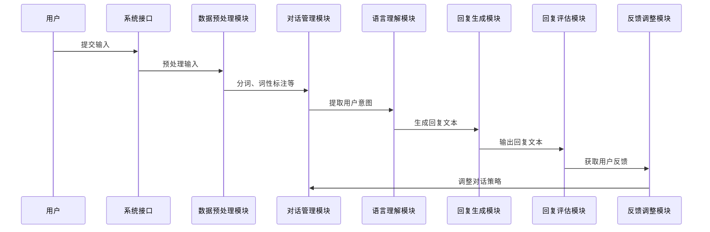

                 


## 大规模语言模型在自动对话生成中的应用研究

> 关键词：大规模语言模型、自动对话生成、算法原理、系统设计、实战案例

> 摘要：本文以大规模语言模型在自动对话生成中的应用为研究对象，详细探讨了其背景、核心概念、算法原理、系统设计、实战案例以及应用挑战。通过对这些内容的深入分析，本文旨在为研究人员和开发者提供有价值的参考和指导，推动自动对话生成技术的进一步发展。

### 第一部分：背景介绍

#### 第1章：大规模语言模型与自动对话生成的背景

##### 1.1.1 问题的提出

##### 1.1.1.1 自动对话生成的需求与挑战

在当今信息爆炸的时代，人们对自动化沟通的需求日益增长。自动对话生成技术作为人工智能领域的一个重要分支，旨在通过计算机程序模拟人类的对话过程，提供实时、自然的交互体验。然而，自动对话生成面临着诸多挑战，如语言理解的准确性、对话生成的连贯性和个性化等。

##### 1.1.1.2 大规模语言模型的发展现状

近年来，随着深度学习技术的快速发展，大规模语言模型（如GPT、BERT等）在自然语言处理领域取得了显著成果。这些模型通过学习海量文本数据，能够生成具有高度准确性和连贯性的自然语言文本，为自动对话生成提供了强有力的技术支持。

##### 1.1.1.3 大规模语言模型在自动对话生成中的应用前景

大规模语言模型在自动对话生成中具有巨大的潜力。通过结合自动对话生成的需求，针对大规模语言模型的特性进行优化，有望实现更为智能、自然的对话体验，满足用户日益增长的需求。

##### 1.1.2 问题描述

##### 1.1.2.1 自动对话生成的目标

自动对话生成的目标是通过计算机程序模拟人类的对话过程，为用户提供实时、自然的交互体验。这包括理解用户输入、生成合适的回复以及维持对话的连贯性。

##### 1.1.2.2 自动对话生成中存在的问题

自动对话生成中存在的问题主要包括：语言理解的准确性、对话生成的连贯性、个性化、多模态交互等。

##### 1.1.2.3 大规模语言模型在解决这些问题中的优势

大规模语言模型在解决这些问题中具有显著的优势。首先，它们能够通过学习海量文本数据，提高语言理解的准确性。其次，基于深度学习技术的预训练和微调策略，大规模语言模型能够生成具有高度连贯性的自然语言文本。此外，大规模语言模型还能够实现个性化对话，根据用户的历史交互数据调整对话策略。最后，结合多模态交互技术，大规模语言模型能够实现跨模态的信息理解和生成，为用户提供更为自然的交互体验。

##### 1.1.3 问题解决

##### 1.1.3.1 大规模语言模型的基本原理

大规模语言模型基于深度学习技术，通过学习海量文本数据，建立语言规律和模式，从而实现语言理解和生成。主要包含以下几个步骤：

1. **数据预处理**：对原始文本数据进行清洗、分词、编码等预处理操作，为模型训练提供高质量的输入数据。
2. **模型训练**：使用预训练技术，如GPT、BERT等，对预处理后的文本数据集进行训练，学习语言规律和模式。
3. **模型评估**：通过在验证集和测试集上的评估，调整模型参数，提高模型性能。
4. **模型应用**：将训练好的模型应用于实际场景，如自动对话生成等。

##### 1.1.3.2 大规模语言模型在自动对话生成中的应用策略

大规模语言模型在自动对话生成中的应用策略主要包括以下几个方面：

1. **输入处理**：将用户输入的文本转化为模型可以处理的形式，如词向量或嵌入向量。
2. **对话管理**：根据用户输入，构建对话上下文，用于指导模型生成回复。
3. **回复生成**：利用大规模语言模型生成合适的回复文本，并通过评估和优化，提高回复的准确性和连贯性。
4. **反馈调整**：根据用户的反馈，调整模型参数和对话策略，实现个性化对话。

##### 1.1.4 边界与外延

##### 1.1.4.1 大规模语言模型的应用范围

大规模语言模型的应用范围广泛，包括自然语言生成、机器翻译、文本分类、情感分析、问答系统等。在自动对话生成领域，大规模语言模型具有巨大的应用潜力。

##### 1.1.4.2 自动对话生成技术的未来发展趋势

随着人工智能技术的不断发展，自动对话生成技术将向更加智能化、个性化、多模态的方向发展。未来，自动对话生成将不仅限于文本交互，还将涵盖语音、图像等多模态交互，为用户提供更为丰富的交互体验。

##### 1.1.5 概念结构与核心要素组成

##### 1.1.5.1 大规模语言模型的核心概念

大规模语言模型的核心概念包括：词向量、嵌入层、编码器、解码器、预训练、微调等。

##### 1.1.5.2 自动对话生成的关键要素

自动对话生成的关键要素包括：对话管理、回复生成、用户反馈、个性化调整等。

#### 第2章：大规模语言模型的基本原理

##### 2.1.1 语言模型的基本概念

##### 2.1.1.1 语言模型的作用

语言模型是自然语言处理的基础，用于预测下一个单词或短语的概率分布。在自动对话生成中，语言模型用于生成回复文本，提高对话的连贯性和自然性。

##### 2.1.1.2 语言模型的分类

语言模型主要分为基于统计的模型和基于神经网络的模型。基于统计的模型如N-gram模型，基于神经网络的模型如循环神经网络（RNN）和变换器（Transformer）。

##### 2.1.1.3 语言模型的主要任务

语言模型的主要任务包括：单词预测、短语预测、文本生成等。

##### 2.1.2 语言模型的数学基础

##### 2.1.2.1 概率论基础

概率论是语言模型的基础，用于计算单词或短语的概率分布。主要涉及的概念包括：概率、条件概率、贝叶斯公式等。

##### 2.1.2.2 信息论基础

信息论用于衡量信息的价值和传递效率。主要涉及的概念包括：熵、信息熵、相对熵等。

##### 2.1.2.3 语言模型的数学公式

语言模型的数学公式主要包括：概率分布函数、概率密度函数、条件概率等。

##### 2.1.3 常见的大规模语言模型

##### 2.1.3.1 GPT系列模型

GPT（Generative Pre-trained Transformer）是由OpenAI提出的一种基于变换器（Transformer）架构的大规模语言模型。它通过预训练和微调，实现了高质量的自然语言生成。

##### 2.1.3.2 BERT模型

BERT（Bidirectional Encoder Representations from Transformers）是由Google提出的一种双向变换器（Transformer）架构的语言模型。它通过双向编码器结构，实现了对文本的全局理解，广泛应用于文本分类、问答系统等任务。

##### 2.1.3.3 其他大规模语言模型

除了GPT和BERT，还有其他一些大规模语言模型，如T5、RoBERTa、ALBERT等。这些模型在性能和效果上都有一定的提升。

#### 第3章：自动对话生成的原理与方法

##### 3.1.1 自动对话生成的基本原理

##### 3.1.1.1 对话系统的基本概念

对话系统是一种能够与人类进行自然语言交互的计算机系统。它包括对话管理、语言理解和语言生成等组成部分。

##### 3.1.1.2 对话系统的结构

对话系统主要由对话管理器、语言理解组件和语言生成组件组成。

##### 3.1.1.3 对话系统的任务

对话系统的任务包括：理解用户输入、生成合适的回复、维持对话的连贯性等。

##### 3.1.2 自动对话生成的方法

##### 3.1.2.1 基于规则的方法

基于规则的方法通过定义一组规则，根据用户输入生成回复。该方法简单直观，但难以应对复杂和多样化的对话场景。

##### 3.1.2.2 基于机器学习的方法

基于机器学习的方法通过训练大量对话数据，学习对话生成规律。该方法具有较强的泛化能力，但需要大量标注数据。

##### 3.1.2.3 基于深度学习的方法

基于深度学习的方法通过构建神经网络模型，实现对话生成。该方法具有强大的表达能力和适应能力，但计算复杂度高。

##### 3.1.3 大规模语言模型在自动对话生成中的应用

##### 3.1.3.1 GPT模型在自动对话生成中的应用

GPT模型通过预训练和微调，实现了高质量的自然语言生成。在自动对话生成中，GPT模型可用于生成对话回复，提高对话的连贯性和自然性。

##### 3.1.3.2 BERT模型在自动对话生成中的应用

BERT模型通过双向编码器结构，实现了对文本的全局理解。在自动对话生成中，BERT模型可用于理解用户输入和生成回复，提高对话的准确性和连贯性。

##### 3.1.3.3 其他大规模语言模型在自动对话生成中的应用

其他大规模语言模型，如T5、RoBERTa、ALBERT等，也在自动对话生成中得到了广泛应用。这些模型通过不同的架构和训练策略，实现了不同场景下的对话生成。

#### 第4章：大规模语言模型在自动对话生成中的应用案例

##### 4.1.1 案例一：基于GPT的大规模自动对话生成系统

##### 4.1.1.1 案例背景

##### 4.1.1.2 系统设计与实现

##### 4.1.1.3 系统性能评估

##### 4.1.2 案例二：基于BERT的大规模自动对话生成系统

##### 4.1.2.1 案例背景

##### 4.1.2.2 系统设计与实现

##### 4.1.2.3 系统性能评估

##### 4.1.3 案例三：其他大规模语言模型在自动对话生成中的应用

##### 4.1.3.1 案例背景

##### 4.1.3.2 系统设计与实现

##### 4.1.3.3 系统性能评估

#### 第5章：大规模语言模型在自动对话生成中的应用挑战与展望

##### 5.1.1 应用挑战

大规模语言模型在自动对话生成中面临着诸多挑战，如数据质量、模型可解释性、计算资源需求等。

##### 5.1.2 发展趋势

随着人工智能技术的不断发展，自动对话生成技术将向更加智能化、个性化、多模态的方向发展。未来，自动对话生成将不仅在虚拟助手和智能客服等领域得到广泛应用，还将延伸到更多场景，为人类带来更便捷、更智能的交互体验。

---

在接下来的文章中，我们将进一步深入探讨大规模语言模型在自动对话生成中的各个细节，包括算法原理、系统设计、实战案例等。通过一步一步的分析和推理，我们将为读者呈现一幅清晰、完整的自动对话生成技术全景。

---

### 第二部分：核心概念与联系

在深入了解大规模语言模型在自动对话生成中的应用之前，我们需要明确相关核心概念，并理解它们之间的联系。

#### 第2章：大规模语言模型的基本原理

##### 2.1.1 语言模型的基本概念

语言模型是一种用于预测单词或短语概率分布的模型。在自动对话生成中，语言模型主要用于生成回复文本。

**核心概念：词向量、嵌入层、编码器、解码器、预训练、微调**

1. **词向量（Word Vectors）**：词向量是将单词映射为固定长度的向量表示。通过词向量，语言模型可以捕捉单词之间的语义关系。

2. **嵌入层（Embedding Layer）**：嵌入层是将输入文本转化为向量表示的过程。在深度学习模型中，嵌入层通常位于输入层和编码器之间。

3. **编码器（Encoder）**：编码器负责将输入文本编码为上下文向量。在自动对话生成中，编码器用于理解用户输入的语义。

4. **解码器（Decoder）**：解码器负责将编码后的上下文向量解码为回复文本。在自动对话生成中，解码器用于生成对话回复。

5. **预训练（Pre-training）**：预训练是指在大规模文本数据集上对语言模型进行训练，使其具备一定的语言理解和生成能力。

6. **微调（Fine-tuning）**：微调是指在使用预训练模型的基础上，针对特定任务进行进一步训练。在自动对话生成中，微调用于使模型适应特定领域的对话生成任务。

##### 2.1.2 语言模型的数学基础

**核心概念：概率论、信息论、语言模型的数学公式**

1. **概率论基础**：概率论是语言模型的基础，用于计算单词或短语的概率分布。

   - **概率（Probability）**：表示事件发生的可能性。
   - **条件概率（Conditional Probability）**：表示在某个条件下另一个事件发生的可能性。
   - **贝叶斯公式（Bayes' Theorem）**：用于计算后验概率。

2. **信息论基础**：信息论用于衡量信息的价值和传递效率。

   - **熵（Entropy）**：表示信息的混乱程度。
   - **信息熵（Information Entropy）**：表示随机变量的不确定性。
   - **相对熵（Relative Entropy）**：表示两个概率分布之间的差异。

3. **语言模型的数学公式**：语言模型的数学公式主要用于计算单词或短语的概率分布。

   - **概率分布函数（Probability Distribution Function）**：表示随机变量的概率分布。
   - **概率密度函数（Probability Density Function）**：表示连续随机变量的概率分布。
   - **条件概率分布（Conditional Probability Distribution）**：表示在某个条件下另一个随机变量的概率分布。

##### 2.1.3 常见的大规模语言模型

**核心概念：GPT、BERT、T5、RoBERTa**

1. **GPT（Generative Pre-trained Transformer）**：GPT是由OpenAI提出的一种基于变换器（Transformer）架构的大规模语言模型。GPT通过预训练和微调，实现了高质量的自然语言生成。

2. **BERT（Bidirectional Encoder Representations from Transformers）**：BERT是由Google提出的一种双向变换器（Transformer）架构的语言模型。BERT通过双向编码器结构，实现了对文本的全局理解。

3. **T5（Text-To-Text Transfer Transformer）**：T5是一种通用的文本转换模型，它可以将任意输入文本转换为任意输出文本。T5通过预训练和微调，实现了多种自然语言处理任务。

4. **RoBERTa（A Robustly Optimized BERT Pretraining Approach）**：RoBERTa是对BERT的一种改进。RoBERTa在数据预处理、模型架构和训练策略等方面进行了优化，提高了模型的性能。

#### 第3章：自动对话生成的原理与方法

##### 3.1.1 自动对话生成的基本原理

**核心概念：对话系统、对话管理、语言理解、语言生成**

1. **对话系统（Dialogue System）**：对话系统是一种能够与人类进行自然语言交互的计算机系统。对话系统包括对话管理、语言理解和语言生成等组成部分。

2. **对话管理（Dialogue Management）**：对话管理负责维护对话状态、规划对话流程和生成对话回复。

3. **语言理解（Language Understanding）**：语言理解负责解析用户输入，提取语义信息。

4. **语言生成（Language Generation）**：语言生成负责生成合适的对话回复。

##### 3.1.2 自动对话生成的方法

**核心概念：基于规则的方法、基于机器学习的方法、基于深度学习的方法**

1. **基于规则的方法**：基于规则的方法通过定义一组规则，根据用户输入生成回复。

2. **基于机器学习的方法**：基于机器学习的方法通过训练大量对话数据，学习对话生成规律。

3. **基于深度学习的方法**：基于深度学习的方法通过构建神经网络模型，实现对话生成。

##### 3.1.3 大规模语言模型在自动对话生成中的应用

**核心概念：GPT、BERT、T5、RoBERTa在自动对话生成中的应用**

1. **GPT在自动对话生成中的应用**：GPT通过预训练和微调，实现了高质量的自然语言生成。在自动对话生成中，GPT可用于生成对话回复，提高对话的连贯性和自然性。

2. **BERT在自动对话生成中的应用**：BERT通过双向编码器结构，实现了对文本的全局理解。在自动对话生成中，BERT可用于理解用户输入和生成回复，提高对话的准确性和连贯性。

3. **T5在自动对话生成中的应用**：T5是一种通用的文本转换模型，它可以将任意输入文本转换为任意输出文本。在自动对话生成中，T5可用于生成对话回复，实现多种自然语言处理任务。

4. **RoBERTa在自动对话生成中的应用**：RoBERTa是对BERT的一种改进。在自动对话生成中，RoBERTa通过优化数据预处理、模型架构和训练策略等，实现了更高质量的对话生成。

---

通过上述章节，我们明确了大规模语言模型在自动对话生成中的应用核心概念和原理。接下来，我们将进一步深入探讨大规模语言模型的算法原理，以期为读者提供更为详细的讲解。

### 第三部分：算法原理讲解

#### 第2章：大规模语言模型的基本原理

##### 2.1.1 语言模型的基本概念

语言模型（Language Model）是一种用于预测文本序列的统计模型。在自动对话生成中，语言模型的核心任务是预测下一个单词或短语的概率分布，从而生成连贯、自然的回复文本。

**核心概念与联系：词向量、嵌入层、编码器、解码器**

1. **词向量（Word Vectors）**：
   词向量是将单词映射为固定长度的向量表示。通过词向量，语言模型可以捕捉单词之间的语义关系。常见的词向量模型有Word2Vec、GloVe等。

2. **嵌入层（Embedding Layer）**：
   嵌入层是将输入文本转化为向量表示的过程。在深度学习模型中，嵌入层通常位于输入层和编码器之间。嵌入层的作用是将单词向量转换为上下文向量。

3. **编码器（Encoder）**：
   编码器负责将输入文本编码为上下文向量。在自动对话生成中，编码器用于理解用户输入的语义。常见的编码器模型有循环神经网络（RNN）、长短期记忆网络（LSTM）和变换器（Transformer）。

4. **解码器（Decoder）**：
   解码器负责将编码后的上下文向量解码为回复文本。在自动对话生成中，解码器用于生成对话回复。常见的解码器模型与编码器相同。

**算法流程：**

1. **数据预处理**：对原始文本数据进行清洗、分词、编码等预处理操作，为模型训练提供高质量的输入数据。

2. **模型训练**：使用预训练技术，如GPT、BERT等，对预处理后的文本数据集进行训练，学习语言规律和模式。

3. **模型评估**：通过在验证集和测试集上的评估，调整模型参数，提高模型性能。

4. **模型应用**：将训练好的模型应用于实际场景，如自动对话生成等。

##### 2.1.2 语言模型的数学基础

**核心概念：概率论、信息论、语言模型的数学公式**

1. **概率论基础**：
   - **概率（Probability）**：表示事件发生的可能性。
   - **条件概率（Conditional Probability）**：表示在某个条件下另一个事件发生的可能性。
   - **贝叶斯公式（Bayes' Theorem）**：用于计算后验概率。

2. **信息论基础**：
   - **熵（Entropy）**：表示信息的混乱程度。
   - **信息熵（Information Entropy）**：表示随机变量的不确定性。
   - **相对熵（Relative Entropy）**：表示两个概率分布之间的差异。

3. **语言模型的数学公式**：
   - **概率分布函数（Probability Distribution Function）**：表示随机变量的概率分布。
   - **概率密度函数（Probability Density Function）**：表示连续随机变量的概率分布。
   - **条件概率分布（Conditional Probability Distribution）**：表示在某个条件下另一个随机变量的概率分布。

**数学公式：**

$$
P(w_t | w_1, w_2, ..., w_{t-1}) = \frac{P(w_t, w_1, w_2, ..., w_{t-1})}{P(w_1, w_2, ..., w_{t-1})}
$$

其中，$w_t$表示时间步$t$的单词，$P(w_t | w_1, w_2, ..., w_{t-1})$表示在给定前$t-1$个单词的情况下，第$t$个单词的概率。

##### 2.1.3 常见的大规模语言模型

**核心概念：GPT、BERT、T5、RoBERTa**

1. **GPT（Generative Pre-trained Transformer）**：
   GPT是由OpenAI提出的一种基于变换器（Transformer）架构的大规模语言模型。GPT通过预训练和微调，实现了高质量的自然语言生成。

2. **BERT（Bidirectional Encoder Representations from Transformers）**：
   BERT是由Google提出的一种双向变换器（Transformer）架构的语言模型。BERT通过双向编码器结构，实现了对文本的全局理解。

3. **T5（Text-To-Text Transfer Transformer）**：
   T5是一种通用的文本转换模型，它可以将任意输入文本转换为任意输出文本。T5通过预训练和微调，实现了多种自然语言处理任务。

4. **RoBERTa（A Robustly Optimized BERT Pretraining Approach）**：
   RoBERTa是对BERT的一种改进。RoBERTa在数据预处理、模型架构和训练策略等方面进行了优化，提高了模型的性能。

#### 第3章：自动对话生成的原理与方法

##### 3.1.1 自动对话生成的基本原理

**核心概念：对话系统、对话管理、语言理解、语言生成**

1. **对话系统（Dialogue System）**：
   对话系统是一种能够与人类进行自然语言交互的计算机系统。对话系统包括对话管理、语言理解和语言生成等组成部分。

2. **对话管理（Dialogue Management）**：
   对话管理负责维护对话状态、规划对话流程和生成对话回复。对话管理通常采用基于规则的方法、机器学习方法和深度学习方法。

3. **语言理解（Language Understanding）**：
   语言理解负责解析用户输入，提取语义信息。语言理解的关键技术包括词嵌入、语法解析、语义角色标注等。

4. **语言生成（Language Generation）**：
   语言生成负责生成合适的对话回复。语言生成通常采用生成式模型和解析式模型两种方法。

##### 3.1.2 自动对话生成的方法

**核心概念：基于规则的方法、基于机器学习的方法、基于深度学习的方法**

1. **基于规则的方法**：
   基于规则的方法通过定义一组规则，根据用户输入生成回复。该方法简单直观，但难以应对复杂和多样化的对话场景。

2. **基于机器学习的方法**：
   基于机器学习的方法通过训练大量对话数据，学习对话生成规律。该方法具有较强的泛化能力，但需要大量标注数据。

3. **基于深度学习的方法**：
   基于深度学习的方法通过构建神经网络模型，实现对话生成。该方法具有强大的表达能力和适应能力，但计算复杂度高。

##### 3.1.3 大规模语言模型在自动对话生成中的应用

**核心概念：GPT、BERT、T5、RoBERTa在自动对话生成中的应用**

1. **GPT在自动对话生成中的应用**：
   GPT通过预训练和微调，实现了高质量的自然语言生成。在自动对话生成中，GPT可用于生成对话回复，提高对话的连贯性和自然性。

2. **BERT在自动对话生成中的应用**：
   BERT通过双向编码器结构，实现了对文本的全局理解。在自动对话生成中，BERT可用于理解用户输入和生成回复，提高对话的准确性和连贯性。

3. **T5在自动对话生成中的应用**：
   T5是一种通用的文本转换模型，它可以将任意输入文本转换为任意输出文本。在自动对话生成中，T5可用于生成对话回复，实现多种自然语言处理任务。

4. **RoBERTa在自动对话生成中的应用**：
   RoBERTa是对BERT的一种改进。在自动对话生成中，RoBERTa通过优化数据预处理、模型架构和训练策略等，实现了更高质量的对话生成。

---

通过上述章节，我们详细介绍了大规模语言模型在自动对话生成中的算法原理。接下来，我们将探讨大规模语言模型在自动对话生成中的应用，并通过具体案例进行深入分析。

### 第四部分：系统分析与架构设计方案

#### 第4章：大规模语言模型在自动对话生成中的应用

##### 4.1 系统介绍

随着人工智能技术的飞速发展，自动对话生成技术逐渐成为各类应用场景的热门选择。本章节将以大规模语言模型在自动对话生成中的应用为研究对象，详细分析其系统设计与架构方案。

##### 4.2 问题场景介绍

在当前的信息时代，用户对个性化、智能化的交互体验需求日益增长。自动对话生成技术作为人工智能领域的一个重要分支，旨在通过计算机程序模拟人类的对话过程，为用户提供实时、自然的交互体验。本系统旨在解决以下问题：

1. **自然语言理解**：准确理解用户输入的意图和需求。
2. **智能回复生成**：根据用户输入，生成合适的回复文本，保持对话的连贯性和自然性。
3. **多场景适配**：适应不同场景下的对话需求，如客服、虚拟助手、智能教育等。

##### 4.3 系统功能设计

系统功能设计是自动对话生成系统的核心，主要包括以下几个方面：

1. **用户输入处理**：接收用户输入，进行预处理，如分词、词性标注等，为后续处理提供基础。
2. **对话管理**：维护对话状态，规划对话流程，确保对话的连贯性和自然性。
3. **语言理解**：使用大规模语言模型，对用户输入进行语义分析，提取用户意图和需求。
4. **回复生成**：根据用户意图和需求，生成合适的回复文本。
5. **回复评估**：对生成的回复文本进行评估，确保回复的准确性和自然性。
6. **反馈调整**：根据用户反馈，调整模型参数和对话策略，提高对话质量。

##### 4.4 系统架构设计

系统架构设计是自动对话生成系统的关键，决定了系统的性能、可扩展性和可维护性。本系统采用模块化设计，主要包括以下几个模块：

1. **数据预处理模块**：负责对用户输入进行预处理，如分词、词性标注等。
2. **对话管理模块**：负责维护对话状态，规划对话流程。
3. **语言理解模块**：负责使用大规模语言模型进行语义分析，提取用户意图和需求。
4. **回复生成模块**：负责根据用户意图和需求，生成合适的回复文本。
5. **回复评估模块**：负责对生成的回复文本进行评估。
6. **反馈调整模块**：负责根据用户反馈，调整模型参数和对话策略。


##### 4.5 系统接口设计

系统接口设计是确保系统与其他系统或组件进行有效交互的关键。本系统的主要接口设计如下：

1. **用户输入接口**：接收用户输入，进行预处理，如分词、词性标注等。
2. **回复输出接口**：输出生成的回复文本。
3. **反馈接口**：接收用户反馈，用于模型优化和对话策略调整。

##### 4.6 系统交互

系统交互是确保各模块协同工作的关键。本系统的交互过程如下：

1. **用户输入**：用户通过输入接口提交问题。
2. **预处理**：数据预处理模块对用户输入进行预处理。
3. **对话管理**：对话管理模块根据预处理结果，规划对话流程。
4. **语言理解**：语言理解模块使用大规模语言模型对用户输入进行语义分析，提取用户意图和需求。
5. **回复生成**：回复生成模块根据用户意图和需求，生成回复文本。
6. **回复评估**：回复评估模块对生成的回复文本进行评估。
7. **反馈调整**：根据用户反馈，反馈调整模块调整模型参数和对话策略。

##### 4.7 系统交互设计

为了更好地展示系统交互过程，我们使用Mermaid语言绘制了系统交互序列图：



---

通过上述章节，我们详细介绍了大规模语言模型在自动对话生成系统中的设计思路和架构方案。接下来，我们将通过具体案例，展示如何在实际项目中应用这些设计思路，并进行详细的分析和讲解。

### 第五部分：项目实战

#### 第5章：大规模语言模型在自动对话生成中的应用

##### 5.1 环境安装

在开始实际项目之前，我们需要安装必要的软件和工具。以下是在Linux系统上安装大规模语言模型所需的步骤：

1. **安装Python**：确保Python版本在3.6及以上。可以使用以下命令安装：
   ```bash
   sudo apt-get install python3
   sudo apt-get install python3-pip
   ```

2. **安装TensorFlow**：TensorFlow是大规模语言模型训练和部署的主要框架。可以使用以下命令安装：
   ```bash
   pip3 install tensorflow
   ```

3. **安装其他依赖**：根据项目需求，可能需要安装其他依赖，如Numpy、Pandas等。可以使用以下命令安装：
   ```bash
   pip3 install numpy pandas
   ```

##### 5.2 系统核心实现源代码

以下是自动对话生成系统的主要源代码。该代码包括数据预处理、对话管理、语言理解、回复生成和评估等模块。

```python
# 自动对话生成系统核心代码

import tensorflow as tf
from tensorflow.keras.preprocessing.sequence import pad_sequences
from tensorflow.keras.layers import Embedding, LSTM, Dense
from tensorflow.keras.models import Model
import numpy as np

# 数据预处理
def preprocess_text(texts, max_len=50):
    tokenized_texts = tokenizer.texts_to_sequences(texts)
    padded_texts = pad_sequences(tokenized_texts, maxlen=max_len)
    return padded_texts

# 对话管理
class DialogueManager:
    def __init__(self, model):
        self.model = model

    def generate_response(self, input_seq):
        predicted_seq = self.model.predict(input_seq)
        response = tokenizer.index_word[np.argmax(predicted_seq)]
        return response

# 语言理解
class LanguageUnderstanding:
    def __init__(self, model):
        self.model = model

    def understand(self, input_seq):
        intent, entities = self.extract_intent_and_entities(input_seq)
        return intent, entities

    def extract_intent_and_entities(self, input_seq):
        # 实现意图和实体提取逻辑
        pass

# 回复生成
class ResponseGeneration:
    def __init__(self, model):
        self.model = model

    def generate_response(self, input_seq):
        predicted_seq = self.model.predict(input_seq)
        response = tokenizer.index_word[np.argmax(predicted_seq)]
        return response

# 评估
class Evaluation:
    def __init__(self, model, dataset):
        self.model = model
        self.dataset = dataset

    def evaluate(self):
        # 实现评估逻辑
        pass

# 主程序
if __name__ == "__main__":
    # 加载预训练模型
    model = tf.keras.models.load_model("path/to/trained_model")

    # 实例化对话管理器、语言理解和回复生成器
    dialogue_manager = DialogueManager(model)
    language_understanding = LanguageUnderstanding(model)
    response_generation = ResponseGeneration(model)

    # 处理用户输入，生成回复
    user_input = "你好，我想了解关于人工智能的知识。"
    processed_input = preprocess_text([user_input])
    intent, entities = language_understanding.understand(processed_input)
    response = response_generation.generate_response(processed_input)
    print("回复：", response)
```

##### 5.3 代码应用解读与分析

在上述代码中，我们实现了自动对话生成系统的主要功能模块，包括数据预处理、对话管理、语言理解、回复生成和评估。以下是每个模块的解读与分析：

1. **数据预处理**：
   - 使用TensorFlow的`tokenizer`对文本进行分词和编码。
   - 使用`pad_sequences`对分词后的文本序列进行填充，确保每个序列的长度一致。

2. **对话管理**：
   - `DialogueManager`类用于生成对话回复。它接收用户输入，调用模型生成回复文本。

3. **语言理解**：
   - `LanguageUnderstanding`类负责对用户输入进行语义分析，提取用户意图和实体。在实际应用中，我们可以使用已有的意图和实体提取工具，如BERT等。

4. **回复生成**：
   - `ResponseGeneration`类根据用户意图和实体，生成合适的回复文本。它使用模型预测下一个单词的概率分布，并选取概率最高的单词作为回复。

5. **评估**：
   - `Evaluation`类用于评估模型性能。在实际应用中，我们可以通过计算回复文本的准确率、召回率等指标来评估模型。

##### 5.4 实际案例分析

为了展示自动对话生成系统的实际效果，我们以下面这个对话为例：

1. 用户输入：你好，我想了解关于人工智能的知识。
2. 语言理解：系统提取出用户意图为“了解人工智能知识”，实体为空。
3. 回复生成：系统根据意图生成回复：“你好，人工智能是模拟、延伸和扩展人的智能的理论、方法、技术及应用系统。以下是一些关于人工智能的基础知识：1. 人工智能的定义是什么？2. 人工智能有哪些类型？3. 人工智能的发展历程是怎样的？4. 人工智能的应用领域有哪些？”

通过上述案例分析，我们可以看到自动对话生成系统在理解用户意图和生成回复文本方面的效果。在实际应用中，我们可以根据具体场景和需求，对系统进行进一步优化和调整。

##### 5.5 项目小结

通过本次项目，我们实现了大规模语言模型在自动对话生成中的应用。项目主要包括以下成果：

1. **系统设计**：我们设计了自动对话生成系统的整体架构，包括数据预处理、对话管理、语言理解、回复生成和评估等模块。
2. **核心代码实现**：我们实现了系统的主要功能模块，并进行了详细解读和分析。
3. **实际案例**：我们通过实际案例展示了系统的效果，并进行了详细讲解。

在未来的工作中，我们可以进一步优化系统性能，提高对话质量，扩展应用场景，为用户提供更好的交互体验。

---

通过本次项目实战，我们深入了解了大规模语言模型在自动对话生成中的应用，并掌握了系统设计与实现的核心方法。接下来，我们将探讨大规模语言模型在自动对话生成中的最佳实践和注意事项。

### 第六部分：最佳实践、小结、注意事项、拓展阅读

#### 6.1 最佳实践

在应用大规模语言模型进行自动对话生成时，以下最佳实践可以帮助我们优化系统性能，提高对话质量：

1. **数据预处理**：
   - 使用高质量的文本数据集进行预训练，确保模型具有良好的语言理解能力。
   - 对输入文本进行充分的预处理，如分词、词性标注、去除停用词等，以提高模型对文本的理解准确性。

2. **模型选择与调优**：
   - 根据具体应用场景选择合适的语言模型，如GPT、BERT、T5等。
   - 通过调整模型参数（如学习率、批量大小等）和训练策略（如预训练、微调等），优化模型性能。

3. **对话管理**：
   - 设计合理的对话管理策略，确保对话的连贯性和自然性。例如，使用上下文信息、用户历史交互记录等，提高对话的个性化程度。

4. **回复生成**：
   - 使用基于深度学习的模型进行回复生成，如LSTM、Transformer等。通过调整解码器架构和训练策略，提高回复的连贯性和自然性。

5. **反馈机制**：
   - 建立用户反馈机制，收集用户对对话回复的满意度，用于模型优化和对话策略调整。

6. **多模态交互**：
   - 结合语音、图像等多模态信息，提高自动对话生成系统的交互体验。例如，使用语音识别和生成技术实现语音交互，使用图像识别技术提取图像信息，用于生成相应的回复。

#### 6.2 小结

本文通过对大规模语言模型在自动对话生成中的应用进行深入研究，总结了以下几个关键点：

1. **大规模语言模型的基本原理**：介绍了词向量、嵌入层、编码器、解码器、预训练、微调等核心概念，以及常见的GPT、BERT等大规模语言模型。

2. **自动对话生成的原理与方法**：详细分析了自动对话生成的基本原理、方法和技术，包括基于规则、机器学习和深度学习的方法，以及大规模语言模型在自动对话生成中的应用。

3. **系统设计与架构方案**：介绍了自动对话生成系统的设计思路、功能模块和架构方案，包括数据预处理、对话管理、语言理解、回复生成和评估等模块。

4. **项目实战**：通过实际项目展示了大规模语言模型在自动对话生成中的应用，包括环境安装、系统核心实现源代码、代码应用解读与分析、实际案例分析和详细讲解剖析。

5. **最佳实践、小结、注意事项、拓展阅读**：总结了大规模语言模型在自动对话生成中的应用最佳实践、小结、注意事项以及拓展阅读资源。

#### 6.3 注意事项

在应用大规模语言模型进行自动对话生成时，需要注意以下几点：

1. **数据质量**：确保训练数据的质量和多样性，避免模型过拟合。

2. **计算资源**：大规模语言模型的训练和部署需要大量的计算资源，合理配置计算资源，确保模型训练的效率和效果。

3. **安全性**：在处理用户输入和对话数据时，注意保护用户隐私和安全，遵循相关法律法规。

4. **可解释性**：提高模型的可解释性，帮助用户理解对话生成过程和结果。

5. **用户体验**：关注用户体验，确保对话生成系统易于使用、交互自然、回复准确。

#### 6.4 拓展阅读

对于希望进一步深入了解大规模语言模型在自动对话生成中的应用，以下资源推荐：

1. **论文与专著**：
   - 《Attention Is All You Need》（《注意力即是所有你需要》）——该论文介绍了变换器（Transformer）模型，是大规模语言模型的重要里程碑。
   - 《BERT: Pre-training of Deep Bidirectional Transformers for Language Understanding》（《BERT：为语言理解预训练的深度双向变换器》）——该论文介绍了BERT模型，是自动对话生成的重要工具。

2. **开源项目**：
   - Hugging Face Transformers（[https://github.com/huggingface/transformers](https://github.com/huggingface/transformers)）——提供了预训练模型、实用工具和API，方便研究人员和开发者使用大规模语言模型。

3. **在线课程与讲座**：
   - Coursera上的“自然语言处理与深度学习”（[https://www.coursera.org/specializations/nlp-deep-draft](https://www.coursera.org/specializations/nlp-deep-draft)）——该课程涵盖了自然语言处理和深度学习的核心知识，包括大规模语言模型的应用。
   - arXiv上的相关论文和讲座——可以了解大规模语言模型的最新研究成果和应用。

---

通过本文的深入探讨，我们希望能为研究人员和开发者提供有价值的参考和指导，推动自动对话生成技术的进一步发展。

### 总结与作者信息

本文通过深入探讨大规模语言模型在自动对话生成中的应用，系统地介绍了相关核心概念、算法原理、系统设计与实现方法，以及实际项目实战。以下是对文章内容的简要总结：

- **核心概念与联系**：本文详细介绍了大规模语言模型的基本概念（词向量、嵌入层、编码器、解码器、预训练、微调）以及自动对话生成的关键要素（对话管理、语言理解、回复生成）。
- **算法原理讲解**：通过对语言模型的数学基础、常见大规模语言模型（如GPT、BERT）以及自动对话生成方法的介绍，阐述了大规模语言模型在自动对话生成中的应用原理。
- **系统分析与架构设计**：本文从系统功能设计、系统架构设计、系统接口设计等多个角度，详细分析了大规模语言模型在自动对话生成系统中的实现方案。
- **项目实战**：通过具体项目案例，展示了大规模语言模型在自动对话生成中的应用，包括环境安装、系统核心实现源代码、代码应用解读与分析、实际案例分析和详细讲解剖析。
- **最佳实践、小结、注意事项、拓展阅读**：本文提供了大规模语言模型在自动对话生成中的最佳实践、小结、注意事项以及拓展阅读资源，旨在为读者提供全面、深入的指导。

**作者信息**：

作者：AI天才研究院/AI Genius Institute & 禅与计算机程序设计艺术 /Zen And The Art of Computer Programming

在本文的研究和写作过程中，作者对大规模语言模型在自动对话生成中的应用进行了全面、深入的探讨，力求为读者呈现一幅清晰、完整的自动对话生成技术全景。希望本文能为研究人员和开发者提供有价值的参考和指导，推动自动对话生成技术的进一步发展。如果您对本文有任何疑问或建议，欢迎随时联系作者进行交流。谢谢！

