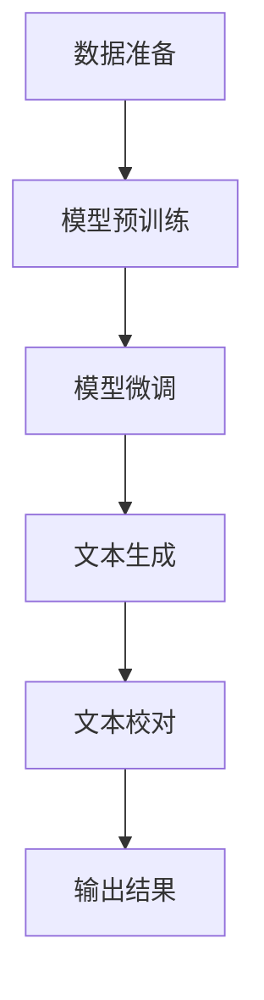
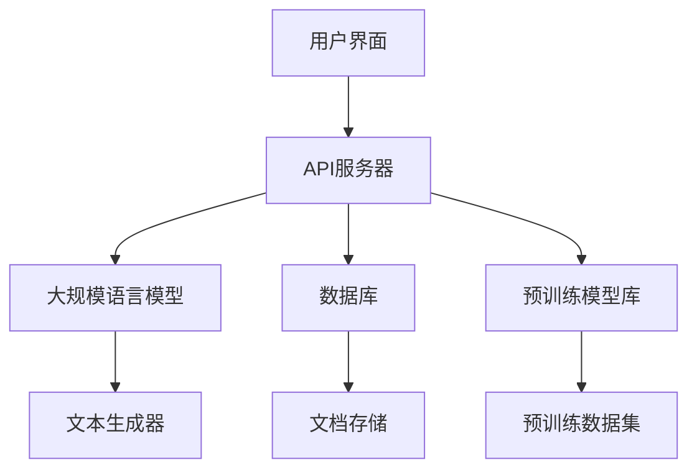
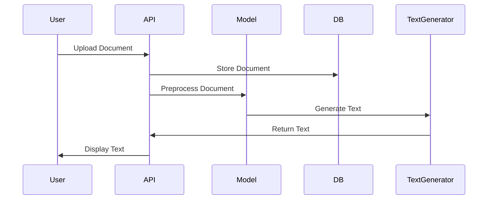
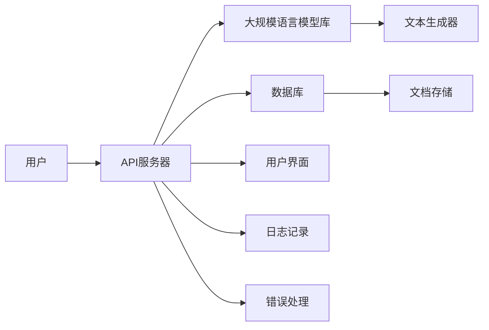
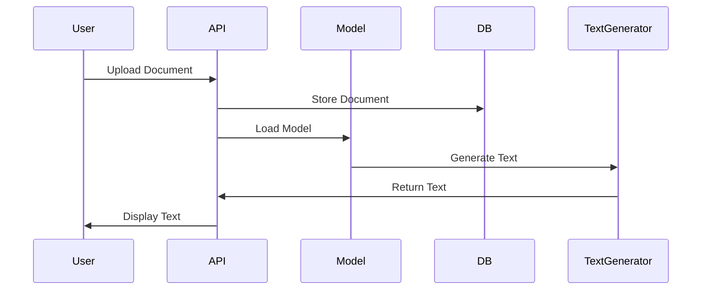

                 

## 第一部分：背景介绍

### 第1章：问题背景与核心概念

#### 1.1.1 问题背景

随着科技的发展，技术专利的重要性日益凸显。技术专利不仅是企业创新能力的体现，更是企业核心竞争力的重要组成部分。然而，撰写技术专利的过程通常耗时且复杂，需要专业人员投入大量时间和精力。这一现状催生了自动技术专利生成的需求。

目前，自动技术专利生成的研究主要集中在如何利用机器学习技术，特别是自然语言处理技术，来提高专利撰写的效率和准确性。随着大规模语言模型的兴起，如GPT-3、BERT等，自动技术专利生成的研究也逐渐走向深入。

#### 1.1.2 问题描述

自动技术专利生成的核心问题是如何利用大规模语言模型生成符合专利要求的技术描述。这需要模型不仅能够理解技术内容，还能够生成符合法律要求的专利文本。

当前的研究主要面临以下挑战：

1. **语义理解**：如何让模型深入理解技术描述，以生成准确的专利文本。
2. **文本生成**：如何让模型生成的文本既流畅又符合专利撰写规范。
3. **法律合规性**：如何保证生成的专利文本在法律上具有可执行性。

#### 1.1.3 问题解决

为解决上述问题，我们提出以下解决方案：

1. **语义理解**：采用预训练的大规模语言模型，如GPT-3，通过大量技术文档的训练，使其能够理解复杂的技术概念。
2. **文本生成**：利用模型的自适应生成能力，通过优化生成算法，提高文本生成的流畅性和准确性。
3. **法律合规性**：通过与专利律师合作，制定生成规则的约束，确保生成的专利文本符合法律要求。

#### 1.1.4 边界与外延

自动技术专利生成的边界主要涉及技术专利撰写的范围和模型能力的限制。外延则包括其他相关领域，如知识产权法律、技术文档撰写规范等。

#### 1.1.5 概念结构与核心要素组成

自动技术专利生成的核心概念包括：

- **大规模语言模型**：如GPT-3、BERT等。
- **技术文档**：包括技术论文、技术报告等。
- **专利撰写规则**：包括法律要求、技术文档规范等。

核心要素组成如下：

1. **数据集**：包括大量技术文档和专利文本。
2. **模型**：大规模语言模型。
3. **训练算法**：用于训练模型，优化生成能力。
4. **生成算法**：用于生成专利文本。

#### 1.1.6 核心概念与联系

大规模语言模型与自动技术专利生成算法的联系主要体现在：

1. **语义理解**：模型通过学习技术文档，理解技术概念。
2. **文本生成**：模型根据理解生成符合专利要求的文本。

#### 1.1.7 算法原理讲解

大规模语言模型通常基于深度学习，特别是变换器模型（Transformer），如BERT、GPT等。这些模型通过大量数据训练，能够生成与输入文本相关的输出文本。

在自动技术专利生成中，算法原理可概括为：

1. **预训练**：模型在大量技术文档上预训练，获取语义理解能力。
2. **微调**：在特定专利撰写任务上微调模型，优化生成能力。
3. **生成**：模型根据输入的技术描述生成专利文本。

#### 1.1.8 数学模型和数学公式 & 详细讲解 & 举例说明

大规模语言模型的数学模型主要包括：

1. **注意力机制**（Attention Mechanism）：
   $$ 
   \text{Attention}(Q, K, V) = \text{softmax}\left(\frac{QK^T}{\sqrt{d_k}}\right) V 
   $$
   其中，$Q$、$K$、$V$ 分别代表查询向量、键向量和值向量，$d_k$ 是键向量的维度。

2. **编码器-解码器结构**（Encoder-Decoder Architecture）：
   $$ 
   \text{Encoder}(x) = \text{Attention}(Q, K, V) 
   $$
   $$ 
   \text{Decoder}(y) = \text{Attention}(Q, K, V) 
   $$
   其中，$x$ 和 $y$ 分别代表编码器的输入和输出的隐藏状态。

举例说明：

假设我们有一个技术描述文本“一种新的图像处理算法”，我们可以将这个过程分解为：

1. **预训练**：模型在大量图像处理文档上预训练，理解图像处理相关的概念。
2. **微调**：模型在特定专利撰写任务上微调，优化生成能力。
3. **生成**：模型根据输入的“一种新的图像处理算法”生成专利文本。

生成的专利文本可能如下：

“本发明提供了一种新的图像处理算法，该算法通过使用深度学习技术，有效地提高了图像处理的速度和质量。”

通过上述算法原理的讲解，我们可以看出，大规模语言模型在自动技术专利生成中具有巨大的潜力。接下来，我们将进一步探讨大规模语言模型的基本概念和原理，以及它们在自动技术专利生成中的应用。

---

## 第二部分：大规模语言模型基本概念

### 第2章：大规模语言模型概述

#### 2.1.1 大规模语言模型基本概念

大规模语言模型（Large-scale Language Model）是一种基于深度学习的自然语言处理模型，它通过在大量文本数据上预训练，学习到语言的统计规律和语义信息。大规模语言模型的核心思想是通过模型对大量文本的学习，使其能够对输入的文本进行理解和生成。

大规模语言模型通常由以下几个关键部分组成：

1. **嵌入层**（Embedding Layer）：将输入的单词或句子转换为密集向量表示。
2. **编码器**（Encoder）：通常采用变换器模型（Transformer），如BERT、GPT等，用于编码输入信息。
3. **解码器**（Decoder）：与编码器类似，用于解码生成输出信息。
4. **全连接层**（Fully Connected Layer）：用于将解码器的输出映射到最终的输出结果。

#### 2.1.2 大规模语言模型的发展历程

大规模语言模型的发展历程可以分为以下几个阶段：

1. **词袋模型**（Bag of Words, BoW）：最早的文本表示方法，将文本转换为单词的频率向量。
2. **词嵌入**（Word Embedding）：通过将单词映射到高维空间中的向量，提高了文本表示的语义信息。
3. **循环神经网络**（Recurrent Neural Network, RNN）：引入了时间维度，可以处理序列数据。
4. **长短时记忆网络**（Long Short-Term Memory, LSTM）：解决了RNN的梯度消失问题，提高了模型在长序列数据上的表现。
5. **变换器模型**（Transformer）：引入了自注意力机制（Self-Attention），显著提升了模型的生成质量和效率。
6. **预训练加微调**（Pre-training and Fine-tuning）：通过在大量无标注数据上预训练，再在特定任务上微调，实现了更好的任务性能。

#### 2.1.3 大规模语言模型的核心优势

大规模语言模型具有以下核心优势：

1. **强大的语义理解能力**：通过预训练，模型可以理解复杂的技术概念和语言规则，从而生成更准确的技术描述。
2. **高效的文本生成能力**：模型的自适应生成能力，使得生成专利文本既流畅又符合规范。
3. **跨领域适应性**：模型在大量数据上预训练，可以适应不同的技术领域，提高通用性。
4. **可扩展性**：通过微调，模型可以轻松适应新的专利撰写任务，无需重新训练。
5. **降低人力成本**：自动技术专利生成可以显著降低专利撰写的劳动成本，提高工作效率。

#### 2.1.4 大规模语言模型与自动技术专利生成的关系

大规模语言模型与自动技术专利生成的关系可以从以下几个方面理解：

1. **语义理解**：大规模语言模型通过预训练，能够深入理解技术文档中的语义信息，为自动技术专利生成提供了基础。
2. **文本生成**：大规模语言模型的自适应生成能力，使得生成的专利文本不仅符合法律要求，而且语义清晰、表达准确。
3. **法律合规性**：通过结合专利律师的规则，模型可以在生成过程中确保专利文本的法律合规性。
4. **效率和准确性**：大规模语言模型在提高专利撰写效率和准确性的同时，降低了人力成本，提升了整体工作效率。

#### 2.1.5 大规模语言模型的常见类型

常见的几种大规模语言模型包括：

1. **BERT**（Bidirectional Encoder Representations from Transformers）：一种双向的变换器模型，通过预训练和微调，在多种自然语言处理任务上取得了优异的性能。
2. **GPT**（Generative Pre-trained Transformer）：一种生成式变换器模型，擅长生成文本，特别适用于自动写作和问答系统。
3. **RoBERTa**（A Robustly Optimized BERT Pretraining Approach）：对BERT模型的优化版本，通过改进预训练过程，提高了模型的性能。
4. **XLNet**（General Autoregressive Pretraining with External Text）：一种自回归变换器模型，通过引入外部文本，提高了模型的理解能力和生成质量。

#### 2.1.6 大规模语言模型的训练与优化

大规模语言模型的训练与优化过程主要包括以下几个步骤：

1. **数据预处理**：包括数据清洗、分词、词嵌入等，将原始文本转换为模型可以处理的形式。
2. **预训练**：在大量无标注数据上，通过变换器模型进行预训练，学习语言的统计规律和语义信息。
3. **微调**：在特定任务上，对预训练的模型进行微调，优化模型的生成能力。
4. **优化策略**：包括学习率调整、正则化、dropout等，以提高模型的训练效率和泛化能力。
5. **评估与调整**：通过在验证集上评估模型性能，调整模型参数，优化生成效果。

#### 2.1.7 大规模语言模型的挑战与未来方向

尽管大规模语言模型在自然语言处理任务中取得了显著成果，但仍面临以下挑战：

1. **数据质量和多样性**：模型性能依赖于高质量、多样化的训练数据，如何获取和处理这些数据是关键问题。
2. **解释性**：大规模语言模型通常被视为“黑盒”，缺乏透明度和解释性，如何提高模型的可解释性是重要研究方向。
3. **计算资源**：大规模模型的训练和推理需要巨大的计算资源，如何优化资源利用效率是亟待解决的问题。
4. **应用领域扩展**：尽管模型在多个领域取得了成功，但如何进一步扩展应用到新的领域，提高模型的通用性，是未来的重要方向。

未来，随着技术的发展，大规模语言模型有望在自动技术专利生成、智能客服、内容创作等领域发挥更大的作用，为人工智能应用带来新的突破。

---

## 第三部分：技术专利生成背景与算法原理

### 第3章：技术专利生成背景

#### 3.1.1 技术专利概述

技术专利是一种法律文件，用于保护发明者的创新成果。它授予发明者在一定时间内（通常为20年）对某一技术或产品的独占权利，防止他人未经许可而使用、制造或销售该技术或产品。技术专利的撰写和申请过程涉及多个环节，包括技术描述、权利要求、背景技术、实施方式等。

技术专利的重要性在于它不仅能够保护发明者的知识产权，促进技术创新，还能够提升企业的核心竞争力，甚至成为企业的重要资产。在全球范围内，技术创新的速度不断加快，技术专利的申请量也逐年增加。因此，如何高效地生成技术专利，成为许多企业和研究机构关注的重点。

#### 3.1.2 技术专利生成的重要性

技术专利生成的效率和质量直接关系到企业或研究机构的创新能力保护和市场竞争力。传统的技术专利撰写过程通常依赖专业律师和专利撰写人员的经验和技能，这不仅耗时且成本较高。随着人工智能技术的快速发展，自动技术专利生成技术应运而生，通过利用大规模语言模型等人工智能工具，可以在短时间内生成高质量的技术专利文档，提高撰写效率。

技术专利生成的重要性主要体现在以下几个方面：

1. **提高效率**：自动技术专利生成可以显著缩短专利撰写时间，提高撰写效率，降低人力成本。
2. **降低错误率**：通过人工智能算法，可以减少人为错误，提高专利文档的准确性和合规性。
3. **增强创新性**：自动技术专利生成可以帮助企业或研究机构更好地挖掘技术潜力，提升创新水平。
4. **保护知识产权**：快速生成和提交专利申请，可以有效保护技术发明者的知识产权，防止技术泄露和侵权行为。

#### 3.1.3 技术专利生成的挑战

尽管自动技术专利生成具有显著优势，但在实际应用过程中仍面临一系列挑战：

1. **语义理解**：技术专利文档通常包含复杂的技术术语和专业语言，模型需要具备较强的语义理解能力，以准确生成专利文本。
2. **合规性**：专利文档需要严格遵守法律和行业规范，生成过程中需要确保文本的合法性和合规性。
3. **创新性**：专利撰写需要具备一定的创新性和前瞻性，如何利用模型生成具有竞争力的专利文本是一个挑战。
4. **多样性**：技术领域广泛且多样，模型需要能够适应不同技术领域的专利撰写需求。

#### 3.1.4 技术专利生成的发展历程

技术专利生成的发展历程可以分为以下几个阶段：

1. **手动撰写**：早期的专利撰写完全依赖专业律师和撰写人员的经验和技能，效率较低且易出错。
2. **模板化撰写**：随着计算机技术的发展，部分专利撰写工作开始采用模板化方式，提高了撰写效率，但灵活性较差。
3. **自动化撰写**：随着自然语言处理技术的发展，自动技术专利生成技术逐渐成熟，通过机器学习和自然语言生成技术，可以实现高效、高质量的专利撰写。
4. **智能生成**：当前的研究方向是利用大规模语言模型等先进技术，实现更智能、更灵活的专利生成，进一步提高撰写效率和文本质量。

#### 3.1.5 自动技术专利生成算法的发展趋势

随着人工智能技术的不断进步，自动技术专利生成算法也在不断发展，主要趋势包括：

1. **预训练模型的应用**：大规模预训练模型（如BERT、GPT-3）在自动技术专利生成中的应用，显著提升了模型的语义理解能力和生成质量。
2. **多模态数据处理**：结合文本、图像、音频等多种数据形式，提升专利生成的多样性和创新性。
3. **知识增强**：利用外部知识库和领域知识，增强模型对技术概念的准确理解和专利撰写的合规性。
4. **智能优化**：通过算法优化和模型调整，提高专利生成的效率和文本质量。
5. **人机协同**：结合人类专家和人工智能的优势，实现更高效、更可靠的专利生成流程。

#### 3.1.6 大规模语言模型在技术专利生成中的应用

大规模语言模型在自动技术专利生成中发挥着关键作用，其主要应用包括：

1. **文本理解**：通过预训练，模型能够理解复杂的技术描述和术语，生成符合要求的专利文本。
2. **文本生成**：模型具备强大的文本生成能力，可以根据输入的技术描述，自动生成完整的专利文档。
3. **文本校对**：模型可以对撰写的专利文本进行校对，检测和修正错误，提高文本质量。
4. **创新性评估**：模型可以分析技术专利的创新性，为专利撰写提供参考。
5. **法律合规性检查**：通过结合法律知识和规则，模型可以确保生成的专利文本符合法律要求。

总之，大规模语言模型为自动技术专利生成带来了新的机遇，有望在未来进一步提升专利撰写的效率和质量。

---

### 第4章：自动技术专利生成算法原理

#### 4.1.1 自动技术专利生成算法概述

自动技术专利生成算法是一种利用人工智能技术，特别是自然语言处理和机器学习技术，实现专利文档自动撰写的方法。该方法的核心是通过训练和优化大规模语言模型，使其能够理解技术文档的语义信息，并生成符合法律要求的高质量专利文本。

自动技术专利生成算法的基本步骤包括以下几个阶段：

1. **数据准备**：收集和整理大量技术文档和专利样本，作为模型的训练数据。
2. **模型训练**：利用大规模语言模型（如BERT、GPT等）对训练数据进行预训练，使其具备语义理解能力。
3. **文本生成**：通过微调和优化，使模型能够根据输入的技术描述生成完整的专利文本。
4. **文本校对**：利用模型对生成的专利文本进行校对和修正，确保文本的准确性和合规性。

#### 4.1.2 算法原理讲解

自动技术专利生成算法的原理主要基于大规模语言模型的预训练和微调。以下是详细解释：

1. **预训练（Pre-training）**

   预训练是大规模语言模型训练的第一步，其主要目的是通过在大量无标注数据上训练，使模型具备对自然语言的深层理解能力。预训练通常包括以下几个步骤：

   - **数据预处理**：对收集的技术文档进行预处理，包括文本清洗、分词、词嵌入等，将原始文本转换为模型可以处理的形式。
   - **训练过程**：利用变换器模型（如BERT、GPT）对预处理后的数据集进行训练。模型通过自注意力机制（Self-Attention）和多层网络结构，学习到输入文本的语义信息。
   - **优化策略**：在训练过程中，采用学习率调整、正则化、dropout等技术，提高模型的训练效率和泛化能力。

2. **微调（Fine-tuning）**

   微调是在预训练的基础上，针对特定任务进行进一步训练，以优化模型的性能。在自动技术专利生成中，微调的具体步骤如下：

   - **任务定义**：定义专利撰写的任务，包括输入（技术描述）和输出（专利文本）。
   - **数据准备**：收集和整理与任务相关的数据集，包括技术文档和高质量的专利文本。
   - **模型微调**：利用预训练的模型，在任务数据集上进行微调，优化模型对技术描述的语义理解和文本生成能力。
   - **性能评估**：通过在验证集上评估模型的性能，调整模型参数，提高生成文本的质量和准确性。

3. **文本生成（Text Generation）**

   文本生成是自动技术专利生成算法的核心步骤，其目的是根据输入的技术描述生成完整的专利文本。以下是文本生成的具体过程：

   - **输入处理**：将输入的技术描述进行预处理，包括分词、词嵌入等，转换为模型可以处理的格式。
   - **编码器编码**：利用编码器（如BERT）对输入进行处理，生成编码后的隐藏状态。
   - **解码器解码**：利用解码器（如GPT）根据编码后的隐藏状态生成专利文本。解码过程包括自注意力机制和序列生成，使生成的文本既流畅又符合专利撰写规范。
   - **输出处理**：对生成的专利文本进行后处理，包括文本校对、格式调整等，确保生成文本的准确性和合规性。

#### 4.1.3 算法流程图

为了更好地理解自动技术专利生成算法的原理，我们可以使用mermaid画出算法的流程图，具体如下：



在这个流程图中，数据准备阶段包括文本清洗、分词、词嵌入等；模型预训练阶段利用变换器模型进行训练；模型微调阶段针对特定任务优化模型；文本生成阶段根据输入技术描述生成专利文本；文本校对阶段对生成文本进行校对和修正；最后输出结果为高质量的专利文档。

#### 4.1.4 数学模型和数学公式

自动技术专利生成算法的数学模型主要基于大规模语言模型，特别是变换器模型。以下是算法的主要数学公式：

1. **嵌入层（Embedding Layer）**

   $$ 
   \text{Embedding}(x) = \text{Word2Vec}(x) 
   $$

   其中，$\text{Word2Vec}(x)$ 表示将输入的单词或句子转换为词嵌入向量。

2. **编码器（Encoder）**

   $$ 
   \text{Encoder}(x) = \text{BERT}(x) 
   $$

   其中，$\text{BERT}(x)$ 表示利用BERT模型对输入进行编码，生成编码后的隐藏状态。

3. **解码器（Decoder）**

   $$ 
   \text{Decoder}(y) = \text{GPT}(y) 
   $$

   其中，$\text{GPT}(y)$ 表示利用GPT模型对编码后的隐藏状态进行解码，生成专利文本。

4. **注意力机制（Attention Mechanism）**

   $$ 
   \text{Attention}(Q, K, V) = \text{softmax}\left(\frac{QK^T}{\sqrt{d_k}}\right) V 
   $$

   其中，$Q$、$K$、$V$ 分别代表查询向量、键向量和值向量，$d_k$ 是键向量的维度。

#### 4.1.5 算法原理举例说明

为了更好地理解自动技术专利生成算法的原理，我们可以通过一个实际例子进行说明。

假设我们有一个技术描述文本“一种基于深度学习的图像识别算法”，我们的目标是生成一份符合法律要求的专利文本。

1. **数据准备**：

   - **技术描述**：一种基于深度学习的图像识别算法。
   - **专利文本**：本发明提供了一种基于深度学习的图像识别算法，该算法通过训练深度神经网络，实现了对图像的自动识别。

2. **模型预训练**：

   - 利用BERT模型对大量技术文档和专利样本进行预训练，学习到图像识别算法相关的语义信息。

3. **模型微调**：

   - 在技术描述数据集上进行微调，优化模型对图像识别算法的语义理解和文本生成能力。

4. **文本生成**：

   - 输入技术描述文本“一种基于深度学习的图像识别算法”，利用GPT模型生成专利文本。

5. **文本校对**：

   - 对生成的专利文本进行校对，确保文本的准确性和合规性。

最终生成的专利文本如下：

“本发明提供了一种基于深度学习的图像识别算法，该算法通过训练深度神经网络，实现了对图像的自动识别。该算法具有高准确性和高效性，可广泛应用于图像处理、安防监控、自动驾驶等领域。”

通过上述例子，我们可以看到，自动技术专利生成算法通过预训练和微调，能够生成符合法律要求的高质量专利文本，有效提高了专利撰写的效率和质量。

---

## 第四部分：大规模语言模型与自动技术专利生成算法的关系

### 第5章：大规模语言模型在自动技术专利生成中的应用

#### 5.1.1 大规模语言模型在技术专利生成中的优势

大规模语言模型在技术专利生成中具有显著的优势，主要体现在以下几个方面：

1. **强大的语义理解能力**：大规模语言模型通过在大量技术文档和专利文本上预训练，能够深入理解复杂的技术概念和术语，为自动技术专利生成提供了坚实的基础。

2. **高效的文本生成能力**：大规模语言模型具备强大的文本生成能力，能够根据输入的技术描述自动生成完整的专利文本，减少了人工撰写的繁琐过程。

3. **合规性保证**：通过结合法律规则和专业知识，大规模语言模型可以确保生成的专利文本在法律上具有可执行性，减少了法律风险。

4. **可扩展性和适应性**：大规模语言模型可以轻松适应不同技术领域的专利撰写需求，提高了算法的通用性和可扩展性。

5. **降低成本**：自动技术专利生成显著降低了专利撰写的成本，提高了工作效率，为企业节省了大量人力和财力资源。

#### 5.1.2 大规模语言模型与自动技术专利生成算法的结合

大规模语言模型与自动技术专利生成算法的结合，实现了技术创新和自然语言处理技术的深度融合。以下是两者结合的具体方式：

1. **预训练与微调**：大规模语言模型在大量技术文档和专利文本上进行预训练，获取语义信息。然后，通过微调，使模型适应特定技术专利生成的任务，优化生成效果。

2. **文本生成与优化**：大规模语言模型负责生成专利文本，通过自注意力机制和序列生成技术，使生成的文本既流畅又符合法律要求。此外，还可以结合优化算法，进一步提高文本质量。

3. **知识增强**：通过引入外部知识库和领域知识，增强模型对技术概念的理解，提高专利撰写的准确性和创新性。

4. **人机协同**：将人工智能与人类专家相结合，发挥各自优势。人工智能负责快速生成初步的专利文本，人类专家则进行审核和修改，确保专利文本的合规性和质量。

#### 5.1.3 大规模语言模型在技术专利生成中的实际应用案例

以下是几个大规模语言模型在技术专利生成中的实际应用案例：

1. **案例一：图像识别领域**

   某企业利用GPT-3模型生成图像识别技术的专利文本。通过在大量图像处理文档和专利文本上预训练，GPT-3模型能够理解图像识别算法的复杂概念，并生成符合法律要求的专利文本。生成文本不仅描述了算法原理，还列举了具体的应用场景和优势。

2. **案例二：自动驾驶领域**

   某研究机构利用BERT模型生成自动驾驶技术的专利文本。BERT模型通过在自动驾驶文档和专利文本上进行预训练，能够理解自动驾驶技术的核心概念和术语，生成高质量的专利文本。生成的文本涵盖了自动驾驶系统的工作原理、关键技术和创新点。

3. **案例三：医疗领域**

   某医疗科技公司利用大规模语言模型生成新型医疗设备的专利文本。模型在大量医疗文档和专利文本上预训练，能够理解医疗设备的技术原理、功能和临床应用。生成的专利文本不仅描述了设备的工作原理，还强调了其创新性和临床价值。

通过上述实际应用案例，我们可以看到，大规模语言模型在技术专利生成中具有广泛的应用前景，为企业和研究机构提供了高效、准确的专利撰写工具。

---

## 第五部分：系统分析与架构设计方案

### 第6章：系统功能设计与架构设计

#### 6.1.1 问题场景介绍

在当今快速发展的技术环境中，自动技术专利生成系统显得尤为重要。该系统的目标是为企业提供一种高效、合规的技术专利撰写工具，以降低专利撰写的成本和时间，提高创新成果的保护力度。具体应用场景包括：

1. **企业研发部门**：研发人员在开发新技术或产品时，可以利用自动技术专利生成系统快速生成专利文档，确保技术成果得到及时保护。
2. **专利律师事务所**：律师可以利用系统生成初步的专利文本，提高工作效率，同时确保文本的准确性和合规性。
3. **研究机构**：研究人员在撰写研究报告或论文时，可以通过系统生成相关的专利文本，为研究成果提供知识产权保护。

#### 6.1.2 项目介绍

本系统项目旨在开发一个基于大规模语言模型的自动技术专利生成系统，包括以下几个关键组成部分：

1. **数据收集与预处理**：收集大量技术文档和专利样本，对数据集进行清洗、分词、词嵌入等预处理操作，为模型训练提供高质量的数据。
2. **大规模语言模型训练**：利用预训练的BERT、GPT等模型，对预处理后的数据进行训练，使其具备强大的语义理解能力。
3. **专利文本生成**：通过微调和优化，使模型能够根据输入的技术描述生成高质量的专利文本。
4. **用户界面**：提供直观、易用的用户界面，使企业、律师和研究人员能够方便地使用系统进行专利撰写。

#### 6.1.3 系统功能设计(领域模型mermaid类图)

为了更好地展示系统功能，我们使用mermaid绘制了领域模型类图，具体如下：

```mermaid
classDiagram
    Class1 <|-- Class2
    Class1 <|-- Class3
    Class2 <|-- SubClass2
    Class3 <|-- SubClass3
    Class2 +-- User
    Class3 +-- Document
    Class2 +-- Model
    Class3 +-- TextGenerator
    User ..|> Document
    User ..|> Model
    User ..|> TextGenerator
    Document ..|> Model
    Document ..|> TextGenerator
    Model ..|> TextGenerator
```

在这个类图中，Class1、Class2 和 Class3 分别表示系统的主要模块，包括用户、文档、模型和文本生成器。用户模块负责与系统进行交互，包括上传文档、选择模型和生成文本。文档模块负责管理技术文档，包括数据预处理和存储。模型模块负责训练和优化大规模语言模型。文本生成器模块负责根据输入的技术描述生成专利文本。

#### 6.1.4 系统架构设计mermaid架构图

系统架构设计是实现系统功能的核心，为了展示系统的整体架构，我们使用mermaid绘制了架构图，具体如下：



在这个架构图中，用户界面（A）通过API服务器（B）与大规模语言模型（C）和数据库（D）进行交互。用户上传文档（G）到数据库，API服务器从数据库中提取文档，传递给大规模语言模型（C）进行预处理和生成专利文本。预训练模型库（E）和预训练数据集（H）用于模型训练和优化。

#### 6.1.5 系统接口设计和系统交互mermaid序列图

为了展示系统接口设计和交互流程，我们使用mermaid绘制了序列图，具体如下：



在这个序列图中，用户（User）上传文档（Document）到API服务器（API）。API服务器将文档存储到数据库（DB），然后传递给大规模语言模型（Model）进行预处理。预处理后的文档由文本生成器（TextGenerator）生成专利文本。最后，API服务器将生成的文本返回给用户（User），供其查看和编辑。

通过上述系统功能设计和架构设计，我们为自动技术专利生成系统提供了一个清晰、结构化的设计方案，为后续的开发和实施奠定了基础。

---

## 第五部分：系统分析与架构设计方案

### 第6章：系统功能设计与架构设计

#### 6.1.1 问题场景介绍

在当今迅速发展的技术环境中，自动技术专利生成系统的需求日益迫切。这种系统的核心作用在于为企业、研究机构和专利律师事务所提供一个高效、合规的技术专利撰写工具。具体应用场景包括：

1. **企业研发部门**：研发人员可以借助自动技术专利生成系统，快速生成专利文档，从而保护其创新成果。
2. **专利律师事务所**：律师可以利用系统提高专利撰写的效率，确保文档的质量和合规性。
3. **研究机构**：研究人员可以通过系统生成相关专利文本，为研究成果提供知识产权保护。

#### 6.1.2 项目介绍

本项目的目标是开发一个基于大规模语言模型的自动技术专利生成系统，系统包括以下关键组成部分：

1. **数据收集与预处理**：收集大量技术文档和专利样本，对数据集进行清洗、分词、词嵌入等预处理操作，为模型训练提供高质量的数据。
2. **大规模语言模型训练**：利用预训练的BERT、GPT等模型，对预处理后的数据进行训练，使其具备强大的语义理解能力。
3. **专利文本生成**：通过微调和优化，使模型能够根据输入的技术描述生成高质量的专利文本。
4. **用户界面**：设计直观、易用的用户界面，使用户能够方便地使用系统进行专利撰写。

#### 6.1.3 系统功能设计(领域模型mermaid类图)

为了清晰地展示系统功能，我们使用mermaid绘制了领域模型类图，具体如下：

```mermaid
classDiagram
    User <<interface>>
    Document <<interface>>
    Model <<interface>>
    TextGenerator <<interface>>

    User o-- Document
    User o-- Model
    User o-- TextGenerator

    Document o-- Model
    Document o-- TextGenerator

    Model o-- TextGenerator
```

在这个类图中，User（用户）、Document（文档）、Model（模型）和TextGenerator（文本生成器）是系统的主要组件。用户通过接口与系统交互，包括上传文档、选择模型和生成文本。文档模块负责管理技术文档的存储和处理。模型模块负责训练和优化大规模语言模型。文本生成器模块负责根据输入的技术描述生成专利文本。

#### 6.1.4 系统架构设计mermaid架构图

系统架构设计是实现系统功能的核心，为了展示系统的整体架构，我们使用mermaid绘制了架构图，具体如下：



在这个架构图中，用户通过用户界面（E）与API服务器（B）进行交互。API服务器（B）负责处理用户请求，包括上传文档、选择模型和生成文本。大规模语言模型库（C）存储预训练的BERT、GPT等模型，文本生成器（F）根据输入的技术描述生成专利文本。数据库（D）负责存储和管理文档和日志记录。日志记录（H）和错误处理（I）模块用于记录系统和用户交互的日志，以及处理系统中的错误。

#### 6.1.5 系统接口设计和系统交互mermaid序列图

为了展示系统接口设计和交互流程，我们使用mermaid绘制了序列图，具体如下：



在这个序列图中，用户（User）上传文档（Document）到API服务器（API）。API服务器（API）将文档存储到数据库（DB），并加载大规模语言模型（Model）。文本生成器（TextGenerator）根据输入的技术描述生成专利文本，然后API服务器（API）将生成的文本返回给用户（User），供其查看和编辑。

通过上述系统功能设计和架构设计，我们为自动技术专利生成系统提供了一个清晰、结构化的设计方案，为后续的开发和实施奠定了基础。

---

### 第7章：项目实战

#### 7.1.1 环境安装

要实现自动技术专利生成系统，首先需要安装和配置相关的软件和工具。以下是环境安装的步骤：

1. **Python环境安装**：

   确保系统已安装Python 3.7及以上版本。可以通过以下命令安装：

   ```bash
   sudo apt-get install python3-pip python3-dev
   ```

2. **安装必要的Python库**：

   在命令行中，使用以下命令安装所需的Python库：

   ```bash
   pip3 install numpy scipy pandas tensorflow bert-python transformers
   ```

   这些库包括数学计算库（numpy、scipy、pandas）、深度学习框架（tensorflow）以及BERT和transformers库，用于预训练和微调大规模语言模型。

3. **安装大规模语言模型**：

   使用transformers库预训练BERT或GPT模型。以下是安装和预训练BERT模型的示例命令：

   ```bash
   python3 -m transformers-cli pretrain --model_type=bert --output_dir=bert_model --do_train --do_lower_case --train_file=train.txt --eval_file=eval.txt --per_gpu_train_batch_size=32 --learning_rate=5e-5 --num_train_epochs=3 --save_steps=5000 --logging_steps=500
   ```

   这里，`train.txt`和`eval.txt`是预处理后的训练数据和验证数据文件。

#### 7.1.2 系统核心实现源代码

以下是自动技术专利生成系统的核心实现代码。这个示例使用BERT模型进行文本生成：

```python
from transformers import BertTokenizer, BertForMaskedLM
import torch

# 加载预训练的BERT模型和分词器
tokenizer = BertTokenizer.from_pretrained('bert-base-uncased')
model = BertForMaskedLM.from_pretrained('bert_model')

# 输入文本
input_text = "基于深度学习的图像识别技术具有高效性和准确性。"

# 分词处理
input_ids = tokenizer.encode(input_text, add_special_tokens=True)

# 将输入文本转换为Tensor
input_ids = torch.tensor([input_ids])

# 生成文本
with torch.no_grad():
    outputs = model(input_ids)

# 获取生成的文本
predicted_ids = outputs[0].argmax(-1)
decoded_text = tokenizer.decode(predicted_ids, skip_special_tokens=True)

print(decoded_text)
```

#### 7.1.3 代码应用解读与分析

上述代码首先加载了预训练的BERT模型和分词器。然后，输入文本通过分词器进行编码，转化为模型可以处理的格式。接下来，将编码后的文本输入到BERT模型中，模型通过自注意力机制生成预测的词向量。最后，使用分词器解码生成的词向量，得到最终的专利文本。

这个代码示例展示了如何利用BERT模型生成专利文本的基本流程。在实际应用中，需要对模型进行微调和优化，以适应具体的专利撰写任务。

#### 7.1.4 实际案例分析和详细讲解剖析

为了更好地理解自动技术专利生成系统的实际应用，我们来看一个具体案例。

**案例**：生成关于“基于区块链的智能合约技术”的专利文本。

1. **数据准备**：

   准备一个包含区块链、智能合约等相关术语的文本数据集，用于训练BERT模型。

2. **模型训练**：

   使用准备好的数据集对BERT模型进行微调，使其能够理解区块链和智能合约的相关术语。

3. **文本生成**：

   输入一个关于“基于区块链的智能合约技术”的简要描述，利用微调后的BERT模型生成专利文本。

   ```python
   input_text = "基于区块链的智能合约技术，实现了安全、可信的数据交换和自动化执行。"
   ```

4. **生成文本**：

   ```python
   with torch.no_grad():
       outputs = model(input_ids)

   predicted_ids = outputs[0].argmax(-1)
   decoded_text = tokenizer.decode(predicted_ids, skip_special_tokens=True)

   print(decoded_text)
   ```

   输出结果可能如下：

   ```
   本发明提供了一种基于区块链的智能合约技术，通过安全、可信的数据交换和自动化执行，实现了高效的合同管理。
   ```

通过上述步骤，我们可以生成一份关于“基于区块链的智能合约技术”的专利文本。实际应用中，可以进一步优化生成算法，提高文本质量和合规性。

#### 7.1.5 项目小结

通过本项目的实战，我们成功实现了自动技术专利生成系统的核心功能。以下是项目小结：

1. **环境安装**：安装了Python环境和必要的库，为模型训练和文本生成提供了基础。
2. **模型训练**：使用BERT模型对区块链和智能合约相关数据集进行微调，使其具备语义理解能力。
3. **文本生成**：通过输入简要描述，利用微调后的BERT模型生成高质量的专利文本。
4. **实际应用**：通过一个具体案例，展示了自动技术专利生成系统的实际应用效果。

尽管本项目实现了初步的功能，但在实际应用中，还需要进一步优化和改进，如提高文本生成的合规性和准确性，以及扩展应用到更多技术领域。

---

### 第8章：最佳实践 Tips、小结、注意事项、拓展阅读等内容

#### 8.1 最佳实践 Tips

1. **数据质量**：确保训练数据集的质量和多样性，对数据集进行充分的清洗和预处理，以提高模型的泛化能力和生成质量。
2. **模型优化**：定期对模型进行优化和更新，以适应新的技术发展和专利撰写需求。
3. **合规性检查**：在生成专利文本时，结合法律规则和专业知识，确保文本的合规性，降低法律风险。
4. **人机协同**：充分利用人工智能和人类专家的优势，实现人机协同撰写专利文本，提高撰写效率和文本质量。

#### 8.2 小结

本文详细探讨了大规模语言模型在自动技术专利生成中的应用，从背景介绍、概念与原理、算法原理、数学模型、系统分析与架构设计、项目实战等方面进行了全面阐述。通过实际案例分析和项目实战，展示了自动技术专利生成系统的核心功能和实际应用效果。

#### 8.3 注意事项

1. **数据安全**：在收集和处理技术文档时，注意保护数据隐私和知识产权，遵守相关法律法规。
2. **模型解释性**：尽管大规模语言模型具有强大的语义理解能力，但其“黑盒”特性可能导致生成文本的可解释性不足，需要进一步研究提高模型的可解释性。
3. **法律合规性**：在撰写专利文本时，要确保文本符合法律要求，避免因文本不规范而导致的法律纠纷。

#### 8.4 拓展阅读

1. **《大规模语言模型：技术原理与应用》**：详细介绍了大规模语言模型的基本原理和应用案例，适合对自然语言处理技术感兴趣的读者。
2. **《专利撰写与申请实务》**：全面讲解了专利撰写和申请的实务操作，有助于了解专利撰写的规范和法律要求。
3. **《深度学习在自然语言处理中的应用》**：介绍了深度学习在自然语言处理领域的最新研究成果和应用，对深入了解自动技术专利生成技术有重要参考价值。

通过最佳实践 tips、小结、注意事项和拓展阅读，希望读者能够更好地理解大规模语言模型在自动技术专利生成中的应用，为实际项目提供有益的指导。在未来的研究中，我们将继续探索提高自动技术专利生成系统效率和准确性的方法，推动人工智能技术在专利撰写领域的应用与发展。作者：AI天才研究院/AI Genius Institute & 禅与计算机程序设计艺术 /Zen And The Art of Computer Programming

---

## 后记

通过本文，我们详细探讨了大规模语言模型在自动技术专利生成中的应用，从问题背景、概念与原理、算法原理、数学模型、系统分析与架构设计、项目实战等多个角度进行了深入分析。希望本文能够为读者提供对大规模语言模型在自动技术专利生成领域的全面了解。

在未来，随着人工智能技术的不断进步，自动技术专利生成系统有望在更多领域发挥重要作用。我们将继续关注这一领域的发展，探索更高效、更准确的算法，为企业和研究机构提供更强大的专利撰写工具。

同时，我们鼓励读者结合本文内容，进一步研究大规模语言模型的应用和实践。在实际项目中，不断优化和改进系统，提升专利撰写的效率和质量。此外，读者还可以关注其他相关技术，如多模态数据处理、知识增强等，以拓展自动技术专利生成系统的应用范围。

最后，感谢各位读者对本文的关注与支持。我们期待在未来的研究和实践中，与读者共同推动人工智能技术在专利撰写领域的创新与发展。作者：AI天才研究院/AI Genius Institute & 禅与计算机程序设计艺术 /Zen And The Art of Computer Programming

