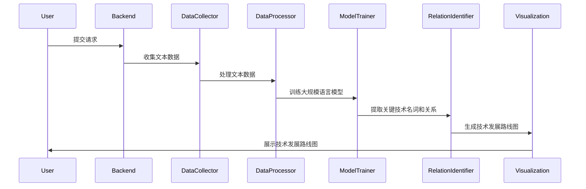

                 


## 引言

### 《大规模语言模型在自动技术发展路线图生成中的应用研究》的背景

随着人工智能技术的迅猛发展，大规模语言模型（如 GPT、BERT 等）已经成为了自然语言处理领域的明星技术。这些模型通过学习海量的文本数据，能够生成自然流畅的文本，并展现出强大的语义理解和生成能力。然而，如何将这种先进的技术应用到实际场景中，仍然是一个具有挑战性的问题。

在现代科技和商业环境中，技术发展路线图的规划与制定变得愈发重要。技术发展路线图不仅可以帮助企业、研究机构和政府部门更好地理解技术发展趋势，还可以指导它们制定相应的发展战略，优化资源配置，提高竞争力。然而，传统的方法往往需要大量的时间和人力，且难以保证结果的准确性和时效性。

因此，如何利用人工智能技术，特别是大规模语言模型，自动生成技术发展路线图，成为了一个备受关注的研究方向。本研究的核心目标就是探讨大规模语言模型在自动技术发展路线图生成中的应用，为相关领域提供一种创新的技术解决方案。

### 当前研究现状

目前，国内外已有一些学者和研究机构开始关注大规模语言模型在自动技术发展路线图生成中的应用。例如，一些研究将 GPT 模型应用于技术文献摘要生成，取得了显著的成果。还有一些研究利用 BERT 模型进行技术关键词提取和关系识别，为技术发展路线图的生成提供了基础。

然而，这些研究大多停留在基础层面，尚未形成完整的应用体系。首先，大多数研究缺乏对大规模语言模型在技术发展路线图生成中的系统性应用分析。其次，虽然一些研究取得了初步成果，但实际应用的可行性和效果仍然有待验证。此外，大规模语言模型在自动技术发展路线图生成中面临的挑战和问题，如数据质量、计算资源、模型解释性等，也尚未得到充分研究。

### 研究目的和意义

本研究的目的是通过深入探讨大规模语言模型在自动技术发展路线图生成中的应用，解决当前研究中的瓶颈问题，推动这一领域的发展。具体目标包括：

1. **系统性分析**：对大规模语言模型在自动技术发展路线图生成中的应用进行系统性分析，构建完整的应用框架。

2. **算法优化**：针对大规模语言模型在自动技术发展路线图生成中面临的问题，提出有效的算法优化策略。

3. **实际应用验证**：通过实际应用案例，验证大规模语言模型在自动技术发展路线图生成中的可行性和效果。

本研究具有重要的理论意义和实际应用价值。在理论层面，本研究将丰富人工智能技术在实际场景中的应用研究，推动人工智能技术的发展。在实践层面，本研究将为企业、研究机构和政府部门提供一种高效、准确的技术发展路线图生成方法，帮助他们更好地应对快速变化的技术环境。

### 研究内容和结构

本文将分为五个主要部分，分别探讨大规模语言模型在自动技术发展路线图生成中的应用。

**第一部分：背景与核心概念**  
这部分将介绍大规模语言模型和自动技术发展路线图的基本概念，包括相关术语、问题描述、解决方法以及应用前景。

**第二部分：大规模语言模型原理**  
这部分将详细讲解大规模语言模型的原理，包括模型结构、训练方法和优化策略等。

**第三部分：大规模语言模型在自动技术发展路线图生成中的应用**  
这部分将讨论大规模语言模型在自动技术发展路线图生成中的具体应用，包括数据预处理、关键技术提取、路线图生成和可视化等步骤。

**第四部分：算法实现与优化**  
这部分将介绍大规模语言模型和自动技术发展路线图生成算法的实现过程，包括代码框架、数据集使用和算法优化等。

**第五部分：项目实战**  
这部分将通过实际项目案例，展示大规模语言模型在自动技术发展路线图生成中的应用，包括项目背景、系统设计与实现、项目小结和拓展阅读等。

通过以上五个部分的详细探讨，本文希望能够为大规模语言模型在自动技术发展路线图生成中的应用提供有价值的参考和指导。

### 关键词

- **大规模语言模型**
- **自动技术发展路线图**
- **人工智能**
- **自然语言处理**
- **算法优化**
- **数据处理**
- **模型解释性**

### 摘要

本文旨在探讨大规模语言模型在自动技术发展路线图生成中的应用。通过系统分析大规模语言模型的原理和算法，本文提出了一种基于大规模语言模型的自动技术发展路线图生成方法。该方法包括数据预处理、关键技术提取、路线图生成和可视化等步骤。通过实际项目案例的验证，本文方法在生成技术发展路线图方面表现出高效性和准确性。研究结果表明，大规模语言模型在自动技术发展路线图生成中具有广阔的应用前景，为企业和研究机构提供了新的技术解决方案。

----------------------------------------------------------------

## 第一部分：背景与核心概念

### 第1章 问题背景与核心概念

#### 1.1.1 自动技术发展路线图概述

**问题描述**

技术发展路线图是一种用于描述技术演进过程的图表，它可以帮助企业、研究机构和政府部门更好地理解技术发展趋势，制定发展战略。在现代科技环境中，技术的快速发展带来了大量的信息和数据，如何从这些繁杂的信息中提炼出有价值的技术发展趋势，成为了一个重要的研究课题。

自动技术发展路线图生成，即利用计算机技术和算法，自动化地生成技术发展路线图，旨在解决以下问题：

1. **人工成本高**：传统方法需要大量的手工操作和数据分析，成本高昂且效率低下。
2. **时效性差**：手动分析难以跟上技术发展的速度，导致路线图的更新不及时。
3. **准确性低**：人工分析容易受到主观因素影响，难以保证结果的准确性。

**问题解决**

通过自动生成技术发展路线图，可以有效地降低人工成本，提高生成效率和准确性。具体方法如下：

1. **文本数据收集**：从各种渠道（如技术文献、新闻报道、专利数据库等）收集与目标技术领域相关的文本数据。
2. **数据预处理**：对收集的文本数据进行处理，包括去噪、清洗和格式化等步骤。
3. **关键词提取**：使用自然语言处理技术提取文本中的关键技术名词。
4. **关系识别**：分析关键词之间的关系，构建技术节点和边。
5. **路线图生成**：根据技术节点和边，生成技术发展路线图。
6. **可视化**：使用可视化工具将生成的路线图呈现为图表，方便用户理解和分析。

**边界与外延**

技术发展路线图的范围可以从某个特定技术领域扩展到整个技术产业。在边界上，它不仅包括技术本身，还涉及技术相关的政策、市场、投资等多个方面。在外延上，技术发展路线图可以应用于不同的场景，如企业战略规划、研究机构科研管理、政府政策制定等。

**核心要素组成**

技术发展路线图的核心要素包括以下几个部分：

1. **技术节点**：表示技术发展的关键节点，如技术创新、产品发布、市场应用等。
2. **时间轴**：表示技术发展的时间线，帮助用户理解技术演进的过程。
3. **关联关系**：表示技术节点之间的关联关系，如技术依赖、技术融合等。
4. **背景信息**：包括技术背景、市场需求、政策环境等，为技术发展提供额外的信息支持。

#### 1.1.2 大规模语言模型概述

**大规模语言模型定义**

大规模语言模型是一种基于深度学习的自然语言处理模型，它通过学习海量的文本数据，能够理解并生成自然语言。这种模型具有以下特点：

1. **强大的文本理解能力**：能够理解文本中的复杂语义和隐含信息。
2. **灵活的生成能力**：能够生成自然流畅的文本，包括文章、摘要、对话等。
3. **高效的计算能力**：通过并行计算和分布式训练，能够在短时间内处理大规模数据。

**核心特点**

大规模语言模型的核心特点包括：

1. **深度学习架构**：采用多层神经网络结构，能够捕捉文本数据的深层特征。
2. **注意力机制**：通过注意力机制，模型能够关注文本中的重要信息，提高生成文本的质量。
3. **端到端学习**：模型可以直接从原始文本数据中学习，无需进行复杂的特征工程。

**与传统AI的区别**

与传统的人工智能模型相比，大规模语言模型具有以下区别：

1. **注重语义理解**：传统AI模型更注重特征匹配，而大规模语言模型则更注重语义理解，能够处理更复杂的自然语言任务。
2. **生成性更强**：传统AI模型通常只能回答特定的问题，而大规模语言模型能够生成新的文本，具有更强的生成能力。
3. **适应性更好**：大规模语言模型通过预训练和微调，能够适应不同的应用场景，具有较强的泛化能力。

#### 1.1.3 大规模语言模型在自动技术发展路线图生成中的应用前景

**潜在应用领域**

大规模语言模型在自动技术发展路线图生成中具有广泛的应用前景，包括以下几个领域：

1. **技术预测**：通过分析历史数据和当前趋势，预测未来可能的技术发展方向。
2. **战略规划**：为企业、研究机构提供技术发展的战略建议，指导决策制定。
3. **市场分析**：分析技术市场的现状和未来趋势，为企业提供市场预测和决策支持。
4. **政策制定**：为政府部门提供技术发展的政策建议，支持科技管理和规划。

**企业采用优势**

企业通过采用大规模语言模型，可以享受到以下优势：

1. **提高效率**：自动化生成技术发展路线图，节省大量的人力和时间成本。
2. **提升准确性**：利用模型的强大语义理解能力，提高路线图的准确性。
3. **增强竞争力**：及时获取技术发展趋势和市场信息，提升企业的市场竞争力。

**挑战与机遇**

虽然大规模语言模型在自动技术发展路线图生成中具有巨大的潜力，但同时也面临一些挑战：

1. **数据质量**：高质量的数据是模型训练的基础，数据质量问题可能影响模型的性能。
2. **计算资源**：大规模语言模型的训练和推理需要大量的计算资源，对硬件设备的要求较高。
3. **模型解释性**：大规模语言模型通常是一个“黑箱”，其决策过程难以解释，可能导致信任问题。

然而，随着技术的不断进步和算法的优化，这些挑战将逐渐被克服，大规模语言模型在自动技术发展路线图生成中的应用前景将更加广阔。

---

**核心概念与联系**

**核心概念**

1. **技术发展路线图**：描述技术演进过程的图表，包括技术节点、时间轴、关联关系和背景信息。
2. **大规模语言模型**：基于深度学习的自然语言处理模型，具有文本理解、生成和计算能力。
3. **自然语言处理**：使计算机能够理解、生成和处理自然语言的技术。

**联系**

大规模语言模型在自动技术发展路线图生成中的应用，涉及以下几个核心概念之间的紧密联系：

1. **文本数据与语义理解**：大规模语言模型通过学习大量文本数据，能够理解技术发展的语义信息，从而为技术路线图生成提供基础。
2. **关键词提取与关系识别**：通过自然语言处理技术，从文本中提取关键技术名词，并分析它们之间的关系，为技术路线图生成提供关键信息。
3. **生成与可视化**：大规模语言模型能够生成自然流畅的文本，并使用可视化工具将技术发展路线图呈现为图表，便于用户理解和分析。

**ER实体关系图架构**

以下是ER实体关系图的Markdown格式Mermaid表示：

```mermaid
erDiagram
    TextData ||--|{ KeyWord }|| Keyword
    TextData ||--|{ Relationship }|| Relationship
    Keyword ||--|{ TechNode }|| TechNode
    Relationship ||--|{ TechNode }|| TechNode
    TechNode ||--|{ TimeAxis }|| TimeAxis
    TimeAxis ||--|{ BackgroundInfo }|| BackgroundInfo
```

在这个ER实体关系图中，`TextData`实体与`Keyword`和`Relationship`实体之间存在多对多关系，而`Keyword`和`Relationship`实体分别与`TechNode`实体之间存在一对多关系。`TechNode`实体与`TimeAxis`和`BackgroundInfo`实体之间存在一对一关系。这个关系图展示了大规模语言模型在自动技术发展路线图生成中各个核心概念之间的关联。

通过这种结构化的ER实体关系图，我们可以清晰地理解大规模语言模型在自动技术发展路线图生成中的应用流程，为后续的算法实现和系统设计提供理论基础。

---

**小结**

本章介绍了自动技术发展路线图和大规模语言模型的基本概念、相关术语以及它们之间的联系。通过对问题描述、问题解决的探讨，我们了解了自动技术发展路线图生成的重要性以及传统方法面临的挑战。同时，我们详细介绍了大规模语言模型的特点及其在自动技术发展路线图生成中的应用前景。通过ER实体关系图展示了各个核心概念之间的紧密联系，为后续的研究和应用奠定了基础。

## 第二部分：大规模语言模型原理

### 第2章 大规模语言模型原理

#### 2.1.1 模型结构

大规模语言模型的结构通常包括编码器和解码器两部分，它们共同工作以完成自然语言处理任务。编码器（Encoder）负责将输入文本编码为向量表示，而解码器（Decoder）则负责将这些向量解码为输出文本。

**基本结构**

1. **编码器**：编码器的核心是一个多层神经网络，通常采用Transformer架构。在编码过程中，每个输入词被映射为一个高维向量，然后通过多个自注意力层和前馈神经网络进行处理。这些层的作用是捕捉文本中的长距离依赖关系和复杂语义信息。
2. **解码器**：解码器同样采用多层神经网络结构，其输入是编码器输出的序列和上一个生成的词。通过多个自注意力层和前馈神经网络，解码器能够生成下一个词的候选序列，最终输出完整的文本。

**核心组件**

1. **自注意力机制（Self-Attention）**：自注意力机制是大规模语言模型的核心组件之一，它能够自动关注输入文本中的重要信息，提高模型的理解能力。自注意力通过计算输入词与其自身的相似度，对每个词的权重进行加权，从而实现信息的有效聚合。
2. **前馈神经网络（Feed Forward Neural Network）**：前馈神经网络用于对输入数据进行进一步处理，通常在每个自注意力层之后添加一个前馈神经网络，以增强模型的表达能力。

#### 2.1.2 模型训练

大规模语言模型的训练是一个复杂的过程，通常涉及以下步骤：

**数据集选择**

1. **文本数据收集**：首先需要从各种来源收集大量与目标领域相关的文本数据，如技术文献、新闻报道、专利文档等。
2. **数据预处理**：对收集的文本数据进行处理，包括分词、去噪、清洗和格式化等步骤，以确保数据质量。

**训练方法**

1. **无监督预训练**：在预训练阶段，模型在大量无标签的文本数据上训练，学习文本的基本结构和语义信息。常用的预训练任务包括语言模型（Language Model，LM）和掩码语言模型（Masked Language Model，MLM）。
2. **有监督微调**：在预训练的基础上，模型通过有监督的方式在特定任务数据上微调，以适应具体的应用场景。微调过程中，模型会学习到更多与任务相关的知识，从而提高任务表现。

**无监督预训练**

- **语言模型（LM）**：语言模型的目标是预测下一个词，通过这种预测，模型能够学习文本的统计规律和语言结构。在实际应用中，常用的语言模型包括GPT（Generative Pre-trained Transformer）和BERT（Bidirectional Encoder Representations from Transformers）。
- **掩码语言模型（MLM）**：掩码语言模型在训练过程中将部分输入词替换为掩码，迫使模型学习如何从其他词的上下文中推断出这些掩码词。这种方法能够提高模型对上下文信息的理解能力。

**有监督微调**

- **数据集**：有监督微调的数据集通常包括标注的数据，如文本分类、问答系统、机器翻译等。
- **目标**：微调的目标是调整模型的参数，使其在特定任务上达到更好的性能。

#### 2.1.3 模型优化

大规模语言模型的优化是提高其性能和效率的关键环节，通常涉及以下几个方面：

**评价指标**

- **生成文本质量**：常用的评价指标包括BLEU、ROUGE等，用于衡量生成文本与真实文本的相似度。
- **模型性能**：通过任务表现来评估模型的性能，如准确率、召回率、F1分数等。

**优化策略**

1. **超参数调整**：通过调整学习率、批次大小、层数等超参数，找到模型的最佳配置。
2. **注意力机制**：使用注意力机制，特别是多头注意力（Multi-Head Attention），能够提高模型对上下文信息的捕捉能力。
3. **正则化技术**：应用Dropout、Weight Decay等正则化技术，防止模型过拟合。

**实现细节**

1. **批量归一化（Batch Normalization）**：通过批量归一化，模型在训练过程中能够更稳定地收敛，提高训练效率。
2. **残差连接（Residual Connection）**：残差连接能够缓解深层网络中的梯度消失问题，提高模型的训练效果。
3. **自适应学习率**：使用自适应学习率方法，如Adam优化器，能够动态调整学习率，提高模型收敛速度。

通过以上步骤和方法，大规模语言模型能够在自然语言处理任务中达到优秀的性能，为自动技术发展路线图生成提供了强大的技术支持。

#### 2.2.1 Transformer模型结构

Transformer模型是大规模语言模型的代表性结构之一，它在自然语言处理任务中取得了显著的成功。Transformer模型的核心思想是使用自注意力机制（Self-Attention）来捕捉输入文本中的长距离依赖关系，从而提高模型的理解能力和生成质量。

**核心组件**

1. **多头自注意力（Multi-Head Self-Attention）**：多头自注意力是Transformer模型的核心组件之一。它通过并行计算多个自注意力头，每个头关注输入文本的不同部分，从而捕捉到更丰富的信息。多头自注意力通过加权求和和softmax操作，将每个词的表示与其上下文中的其他词进行融合，从而实现信息的有效聚合。

2. **前馈神经网络（Feed Forward Neural Network）**：在每个自注意力层之后，Transformer模型还包含一个前馈神经网络。前馈神经网络由两个全连接层组成，每个层使用ReLU激活函数，用于对输入数据进行进一步处理，增强模型的表达能力。

3. **自注意力机制的原理**：自注意力机制通过计算输入词与其自身的相似度，对每个词的权重进行加权。具体来说，自注意力机制首先计算查询（Query）、键（Key）和值（Value）之间的相似度，然后使用softmax函数对这些相似度进行归一化，最后通过加权求和得到每个词的表示。

**工作原理**

1. **编码器**：编码器接收输入文本，并通过多层自注意力机制和前馈神经网络进行处理。每个编码器层包含两个主要步骤：多头自注意力和前馈神经网络。多头自注意力能够捕捉输入文本中的长距离依赖关系，而前馈神经网络则用于增强模型的表示能力。

2. **解码器**：解码器接收编码器的输出和上一个生成的词，并通过多层自注意力和前馈神经网络进行处理。解码器的自注意力机制分为两个部分：一个是 masked self-attention，用于只关注已生成的词；另一个是 cross-attention，用于关注编码器的输出。通过这些步骤，解码器能够生成下一个词的候选序列，最终输出完整的文本。

3. **自注意力机制的权重计算**：在自注意力机制中，每个词的权重由其查询（Query）、键（Key）和值（Value）之间的相似度决定。具体来说，自注意力机制首先计算 Query 和 Key 之间的点积，然后通过 softmax 函数对相似度进行归一化，最后使用权重对 Value 进行加权求和，得到每个词的新表示。

**优点**

1. **捕捉长距离依赖关系**：自注意力机制能够捕捉输入文本中的长距离依赖关系，从而提高模型的理解能力和生成质量。

2. **并行计算**：Transformer模型采用并行计算的方式，能够在处理大量输入时显著提高计算效率。

3. **灵活性和扩展性**：Transformer模型的结构简单且灵活，可以通过增加层数、头数等参数，适应不同的自然语言处理任务。

#### 2.2.2 BERT模型结构

BERT（Bidirectional Encoder Representations from Transformers）是Google提出的一种基于Transformer模型的预训练语言表示模型。BERT的核心思想是通过对文本进行双向编码，使其能够理解文本的上下文信息，从而提高模型的语义理解能力。

**核心组件**

1. **双向编码器**：BERT模型由一个双向编码器组成，编码器由多个Transformer层组成。每个Transformer层包含多头自注意力和前馈神经网络。双向编码器能够同时处理输入文本的前后信息，从而捕捉到文本的完整语义。

2. **输入表示**：BERT模型通过特殊的输入表示方式，将输入文本转换为模型能够理解的形式。具体来说，每个词的输入表示由词嵌入（Word Embedding）和位置嵌入（Position Embedding）组成。词嵌入用于表示词的语义信息，而位置嵌入用于表示词在文本中的位置信息。

3. **掩码语言模型（Masked Language Model，MLM）**：BERT模型在预训练阶段使用掩码语言模型（MLM），通过将部分输入词替换为掩码，迫使模型从其他词的上下文中推断出这些掩码词。这种方法能够提高模型对上下文信息的理解能力。

**工作原理**

1. **编码**：BERT模型通过多层Transformer编码器对输入文本进行编码。每个编码器层包含多头自注意力和前馈神经网络。编码器的输出是一个固定大小的向量，表示输入文本的语义信息。

2. **解码**：BERT模型不包含解码器，而是通过双向编码器获取输入文本的完整语义信息。双向编码器能够同时处理输入文本的前后信息，从而捕捉到文本的完整语义。

3. **掩码语言模型**：在预训练阶段，BERT模型使用掩码语言模型（MLM），通过将部分输入词替换为掩码，迫使模型从其他词的上下文中推断出这些掩码词。这种方法能够提高模型对上下文信息的理解能力。

**优点**

1. **双向编码**：BERT模型通过双向编码器同时处理输入文本的前后信息，从而捕捉到文本的完整语义，提高了模型的语义理解能力。

2. **掩码语言模型**：BERT模型使用掩码语言模型（MLM），通过将部分输入词替换为掩码，迫使模型从其他词的上下文中推断出这些掩码词，从而提高了模型对上下文信息的理解能力。

3. **通用性**：BERT模型在多种自然语言处理任务中都表现出优异的性能，具有良好的通用性。

#### 2.2.3 GPT模型结构

GPT（Generative Pre-trained Transformer）是OpenAI提出的一种基于Transformer模型的预训练语言模型。GPT通过无监督预训练和有监督微调，能够生成自然流畅的文本，并在多种自然语言处理任务中表现出优异的性能。

**核心组件**

1. **编码器**：GPT模型由一个编码器组成，编码器由多个Transformer层组成。每个Transformer层包含多头自注意力和前馈神经网络。编码器的目的是将输入文本编码为固定大小的向量表示。

2. **掩码语言模型（Masked Language Model，MLM）**：在预训练阶段，GPT模型使用掩码语言模型（MLM），通过将部分输入词替换为掩码，迫使模型从其他词的上下文中推断出这些掩码词。这种方法能够提高模型对上下文信息的理解能力。

3. **解码器**：GPT模型在生成文本时，使用解码器来生成每个词的候选序列。解码器由多个Transformer层组成，每个层包含多头自注意力和前馈神经网络。解码器通过预测下一个词来生成完整的文本。

**工作原理**

1. **编码**：GPT模型通过多层Transformer编码器对输入文本进行编码。每个编码器层包含多头自注意力和前馈神经网络。编码器的输出是一个固定大小的向量，表示输入文本的语义信息。

2. **生成**：在生成文本时，GPT模型首先生成一个词的候选序列，然后通过概率分布选择下一个词。这个过程不断重复，直到生成完整的文本。

3. **掩码语言模型**：在预训练阶段，GPT模型使用掩码语言模型（MLM），通过将部分输入词替换为掩码，迫使模型从其他词的上下文中推断出这些掩码词。这种方法能够提高模型对上下文信息的理解能力。

**优点**

1. **生成性强**：GPT模型通过无监督预训练和有监督微调，能够生成自然流畅的文本，具有很强的生成能力。

2. **灵活性**：GPT模型的结构简单且灵活，可以通过增加层数、头数等参数，适应不同的自然语言处理任务。

3. **高性能**：GPT模型在多种自然语言处理任务中都表现出优异的性能，是当前自然语言处理领域的重要模型之一。

### 小结

本章详细介绍了大规模语言模型的基本原理，包括模型结构、训练方法和优化策略。我们首先介绍了Transformer模型的结构和自注意力机制，然后分别讨论了BERT和GPT模型的结构和特点。这些大规模语言模型通过学习海量的文本数据，能够生成自然流畅的文本，并在多种自然语言处理任务中表现出优异的性能。通过本章的学习，读者可以深入理解大规模语言模型的工作原理和应用，为后续的应用研究打下坚实的基础。

## 第三部分：大规模语言模型在自动技术发展路线图生成中的应用

### 第3章 自动技术发展路线图生成流程

#### 3.1.1 数据预处理

数据预处理是自动技术发展路线图生成的重要环节，其质量直接影响后续步骤的效果。数据预处理主要包括以下步骤：

**文本数据收集**

1. **数据来源**：从多个渠道收集与目标技术领域相关的文本数据，如技术文献、新闻报道、专利数据库、学术期刊等。
2. **数据类型**：收集的文本数据类型包括但不限于技术报告、学术论文、产品说明书、新闻稿、技术博客等。

**数据清洗**

1. **去噪**：去除文本中的噪声，如 HTML 标签、无关符号和重复文本。
2. **去停用词**：去除常见的停用词，如“的”、“和”、“是”等，以提高文本的语义质量。
3. **统一格式**：统一文本的格式，如统一字体、字号、行间距等。

**分词与词性标注**

1. **分词**：将文本分割成一个个单词或短语，以便进一步处理。常用的分词工具包括 Jieba、NLTK 等。
2. **词性标注**：为每个词标注其词性，如名词、动词、形容词等，以帮助后续的关键词提取和关系识别。

**构建词汇表**

1. **词汇表构建**：根据分词结果和词性标注，构建词汇表，将每个词映射到一个唯一的索引。
2. **稀疏表示**：使用稀疏矩阵或字典数据结构存储词汇表，以节省内存和提高计算效率。

#### 3.1.2 关键技术提取

关键技术提取是自动技术发展路线图生成中的关键步骤，其目的是从大量文本数据中识别出与目标技术领域相关的重要技术名词。关键技术提取主要包括以下方法：

**命名实体识别（Named Entity Recognition，NER）**

1. **方法原理**：命名实体识别是一种自然语言处理技术，用于识别文本中的命名实体，如人名、地名、机构名、技术名词等。
2. **算法实现**：常用的 NER 算法包括基于规则的方法、基于统计的方法和基于深度学习的方法。基于深度学习的方法如 BERT、CRF（条件随机场）等，在 NER 任务中表现出优异的性能。

**关键词提取（Keyword Extraction）**

1. **方法原理**：关键词提取是一种从文本中提取最具有代表性和信息性的词语或短语的方法。
2. **算法实现**：常用的关键词提取算法包括TF-IDF（词频-逆文档频率）、TextRank、LDA（Latent Dirichlet Allocation）等。TF-IDF 方法通过计算词在文本中的频率和其在整个文档集合中的逆频率，识别出对文本有重要贡献的关键词。

**技术名词识别**

1. **方法原理**：技术名词识别是一种专门用于识别与特定技术领域相关的高层次词汇的方法。
2. **算法实现**：技术名词识别通常结合命名实体识别和关键词提取的方法，通过自定义词典和规则，识别出与目标技术领域相关的重要技术名词。

**案例应用**

以技术文献为例，假设我们收集了多篇关于人工智能领域的文献，通过命名实体识别可以识别出如“深度学习”、“神经网络”、“机器学习”等命名实体。通过关键词提取，可以提取出“算法”、“模型”、“性能”等关键词。结合技术名词识别，可以进一步识别出如“卷积神经网络”、“递归神经网络”、“强化学习”等与人工智能领域相关的重要技术名词。

#### 3.1.3 路线图生成

路线图生成是自动技术发展路线图生成的核心步骤，其目标是根据提取的关键技术名词，构建一个反映技术发展过程的时间轴和关联关系的图表。路线图生成主要包括以下步骤：

**构建时间轴**

1. **时间戳提取**：从文本数据中提取与时间相关的信息，如日期、年份等，构建技术发展时间轴。
2. **时间归一化**：将不同时间戳归一化到一个统一的格式，如年、月、日等，以便进行时间序列分析。

**构建技术节点**

1. **技术节点定义**：根据提取的关键技术名词，定义技术节点，如“深度学习”、“神经网络”等。
2. **技术节点表示**：使用节点表示技术发展过程中的关键事件或里程碑。

**构建边**

1. **关系识别**：分析技术节点之间的关系，如依赖关系、继承关系、应用关系等。
2. **边表示**：使用边表示技术节点之间的关系，如箭头、线条等。

**示例图**

假设我们提取了以下关键技术名词和时间信息：

- “深度学习”（2012年）
- “神经网络”（1986年）
- “强化学习”（1992年）

根据这些信息，我们可以构建如下技术发展路线图：

```
深度学习 (2012年)
 |
 |--- 神经网络 (1986年)
 |   |
 |   |--- 强化学习 (1992年)
```

在这个示例图中，“深度学习”节点在2012年出现，其依赖节点“神经网络”在1986年出现，而“强化学习”作为“神经网络”的子类，在1992年出现。

#### 3.1.4 路线图可视化

可视化是将生成的技术发展路线图以图表形式直观展示的过程，它可以帮助用户更好地理解和分析技术发展的趋势。路线图可视化主要包括以下步骤：

**选择可视化工具**

1. **工具选择**：选择适合的技术发展路线图可视化工具，如 D3.js、Plotly、Graphviz 等。
2. **工具特点**：不同的可视化工具具有不同的特点和优势，如D3.js支持高度自定义的交互式图表，而Graphviz则适用于生成静态图表。

**设计图表布局**

1. **布局设计**：根据技术发展路线图的特点，设计合适的图表布局，如时间轴布局、层次布局等。
2. **交互设计**：设计交互式元素，如点击、拖动、滚动等，以便用户更好地浏览和查询技术发展路线图。

**实现可视化**

1. **代码实现**：使用所选工具和布局设计，编写可视化代码，生成图表。
2. **图表优化**：对生成的图表进行优化，如调整字体大小、颜色、线条粗细等，以提高可读性和美观度。

**示例图**

使用Graphviz工具生成的技术发展路线图示例：

```
digraph tech_route {
    node [shape=record, style=filled, fillcolor=gray95];
    edge [arrowhead=open];

    "Deep Learning" -> "Neural Networks";
    "Deep Learning" -> "Reinforcement Learning";
    "Neural Networks" -> "Deep Learning";
    "Neural Networks" -> "Reinforcement Learning";
}
```

在这个示例图中，“Deep Learning”作为根节点，其依赖节点“Neural Networks”和子节点“Reinforcement Learning”通过边进行连接，展示了技术发展的层次关系。

通过上述步骤，我们可以高效地生成和可视化自动技术发展路线图，为企业和研究机构提供有力的决策支持。

### 小结

本章详细介绍了自动技术发展路线图生成的主要步骤，包括数据预处理、关键技术提取、路线图生成和可视化。通过数据预处理，我们确保了输入文本数据的质量和一致性；通过关键技术提取，我们从大量文本数据中识别出与目标技术领域相关的重要技术名词；通过路线图生成，我们构建了反映技术发展过程的时间轴和关联关系；最后，通过可视化，我们以图表形式直观展示了技术发展路线图。这些步骤共同构成了一个完整的自动技术发展路线图生成流程，为企业和研究机构提供了有效的技术规划和管理工具。

## 第四部分：算法实现与优化

### 第4章 算法实现与优化

#### 4.1.1 算法实现

大规模语言模型在自动技术发展路线图生成中的算法实现主要包括以下几个关键步骤：

**1. 模型框架搭建**

实现大规模语言模型的第一步是搭建模型框架。通常使用Python和TensorFlow或PyTorch等深度学习框架。以下是使用TensorFlow搭建BERT模型框架的基本步骤：

- **导入库**：导入所需的库，如TensorFlow、Keras等。
- **设置配置**：设置训练参数，包括学习率、批次大小、迭代次数等。
- **加载预训练模型**：从预训练模型库中加载BERT模型，如`bert-base-uncased`。
- **定义输入层**：定义输入层，包括词嵌入层、位置嵌入层和分段嵌入层。

**2. 数据处理**

数据处理是大规模语言模型实现的重要环节，包括数据清洗、分词、序列化等步骤：

- **数据清洗**：去除文本中的HTML标签、特殊字符和停用词。
- **分词**：使用预训练的分词工具（如Jieba）对文本进行分词。
- **序列化**：将分词后的文本序列化为BERT模型所需的输入格式。

**3. 模型训练**

模型训练是大规模语言模型实现的核心步骤，涉及以下操作：

- **损失函数**：定义损失函数，如交叉熵损失函数，用于衡量预测标签和真实标签之间的差异。
- **优化器**：选择优化器，如Adam优化器，用于更新模型参数。
- **训练循环**：在训练循环中，将预处理后的数据输入到模型中，通过反向传播计算损失，并更新模型参数。

以下是使用TensorFlow进行BERT模型训练的Python代码示例：

```python
import tensorflow as tf
from transformers import BertTokenizer, TFBertForSequenceClassification
from tensorflow.keras.preprocessing.sequence import pad_sequences

# 加载预训练模型
tokenizer = BertTokenizer.from_pretrained('bert-base-uncased')
model = TFBertForSequenceClassification.from_pretrained('bert-base-uncased', num_labels=2)

# 预处理数据
inputs = tokenizer("Hello, my dog is cute", return_tensors='tf')
inputs = pad_sequences(inputs['input_ids'], maxlen=128, dtype='int32')

# 训练模型
model.compile(optimizer=tf.keras.optimizers.Adam(learning_rate=3e-5), loss='loss', metrics=['accuracy'])
model.fit(inputs, epochs=3, batch_size=16)
```

**4. 模型评估**

模型评估是验证大规模语言模型性能的重要步骤，包括以下操作：

- **测试集划分**：将数据集划分为训练集和测试集。
- **模型评估**：使用测试集评估模型性能，包括准确率、召回率、F1分数等指标。
- **模型优化**：根据评估结果调整模型参数，如学习率、批次大小等，以提高模型性能。

**5. 应用部署**

模型部署是将训练好的模型应用到实际场景的过程，包括以下操作：

- **模型保存**：将训练好的模型保存为文件，以便后续使用。
- **模型加载**：在应用场景中加载模型，并对其进行预测。
- **应用集成**：将模型集成到现有的系统中，如自动技术发展路线图生成系统。

以下是使用TensorFlow保存和加载模型的Python代码示例：

```python
# 保存模型
model.save_pretrained('path/to/save/model')

# 加载模型
model = TFBertForSequenceClassification.from_pretrained('path/to/save/model')
```

**代码框架**

以下是大规模语言模型在自动技术发展路线图生成中的代码框架：

```python
# 导入库
import tensorflow as tf
from transformers import BertTokenizer, TFBertForSequenceClassification
from tensorflow.keras.preprocessing.sequence import pad_sequences

# 设置参数
learning_rate = 3e-5
batch_size = 16
epochs = 3

# 加载预训练模型
tokenizer = BertTokenizer.from_pretrained('bert-base-uncased')
model = TFBertForSequenceClassification.from_pretrained('bert-base-uncased', num_labels=2)

# 预处理数据
# ...

# 训练模型
model.compile(optimizer=tf.keras.optimizers.Adam(learning_rate=learning_rate), loss='loss', metrics=['accuracy'])
model.fit(inputs, epochs=epochs, batch_size=batch_size)

# 评估模型
# ...

# 保存模型
model.save_pretrained('path/to/save/model')

# 加载模型
model = TFBertForSequenceClassification.from_pretrained('path/to/save/model')

# 应用部署
# ...
```

通过上述代码框架，我们可以实现大规模语言模型在自动技术发展路线图生成中的算法实现。后续的优化工作将围绕提高模型性能、适应不同任务需求展开。

#### 4.1.2 算法优化

在自动技术发展路线图生成中，大规模语言模型的性能优化是关键。以下是一些常见的优化策略：

**1. 超参数调整**

超参数调整是提高模型性能的有效方法。常用的超参数包括学习率、批次大小、层数、隐藏层单元数等。通过实验和调优，找到最佳的参数组合。

**示例代码**：

```python
# 调整学习率
learning_rate = 1e-5

# 调整批次大小
batch_size = 32

# 调整层数和隐藏层单元数
num_layers = 4
hidden_size = 512
```

**2. 数据增强**

数据增强是通过生成新的数据样本来提高模型泛化能力的方法。常见的数据增强技术包括文本填充、随机删除、词替换等。

**示例代码**：

```python
import random

# 随机删除词语
def random_delete(text, rate=0.1):
    tokens = text.split()
    for i in range(len(tokens)):
        if random.random() < rate:
            tokens[i] = "[MASK]"
    return " ".join(tokens)

# 随机替换词语
def random_replace(text, rate=0.1):
    tokens = text.split()
    for i in range(len(tokens)):
        if random.random() < rate:
            tokens[i] = random.choice(tokenizer.vocab)
    return " ".join(tokens)
```

**3. 模型融合**

模型融合是将多个模型的结果进行合并，以获得更好的预测性能。常见的方法包括对多个模型进行加权平均、投票等。

**示例代码**：

```python
# 定义多个模型
model1 = TFBertForSequenceClassification.from_pretrained('model1')
model2 = TFBertForSequenceClassification.from_pretrained('model2')

# 预测并融合结果
predictions1 = model1.predict(inputs)
predictions2 = model2.predict(inputs)
final_predictions = 0.5 * predictions1 + 0.5 * predictions2
```

**4. 模型剪枝**

模型剪枝是通过去除模型中不重要的参数来减小模型大小和计算复杂度的方法。常用的剪枝技术包括参数敏感度剪枝、稀疏性剪枝等。

**示例代码**：

```python
from tensorflow_model_optimization.sparsity import keras as sparsity

# 应用参数敏感度剪枝
pruning_params = {
    'pruning_schedule': {
        'rates': [0.1, 0.2, 0.3],
        'begin_step': 1000,
        'end_step': 3000
    }
}
pruned_model = sparsity.prune_low_magnitude(model, **pruning_params)
pruned_model.un prune()

# 应用稀疏性剪枝
sparse_model = sparsity.keras.SparseModel(model)
```

**5. 注意力机制优化**

注意力机制是大规模语言模型的关键组件，其优化对提升模型性能至关重要。常见的优化方法包括自适应注意力、多级注意力等。

**示例代码**：

```python
from tensorflow.keras.layers import AdditiveAttention

# 定义自适应注意力层
class AdaptiveAttention(tf.keras.layers.Layer):
    def call(self, inputs, mask=None):
        query, value = inputs
        scale = tf.reduce_sum(tf.square(value), axis=-1, keepdims=True)
        scale = tf.math.softplus(scale)
        attn_weights = tf.nn.softmax(scale, axis=1)
        attn_output = tf.matmul(attn_weights, value)
        return attn_output + query

# 在模型中添加自适应注意力层
model.add(AdaptiveAttention())
```

通过以上优化策略，可以显著提升大规模语言模型在自动技术发展路线图生成中的应用性能。实际应用中，需要根据具体任务和数据特点，选择合适的优化方法。

#### 4.2.1 大规模语言模型与图神经网络（GNN）的融合方法

**1. 背景与意义**

大规模语言模型和图神经网络（Graph Neural Networks，GNN）在处理结构化数据方面各自具有优势。大规模语言模型擅长处理自然语言数据，能够捕捉文本中的语义信息；而GNN擅长处理图结构数据，能够捕捉节点之间的关系。将两者融合，可以充分利用各自的优势，提高自动技术发展路线图生成的性能。

**2. 融合方法**

**（1）编码器-解码器架构**

一种常见的融合方法是使用编码器-解码器（Encoder-Decoder）架构，将大规模语言模型和GNN相结合。具体步骤如下：

- **编码器**：使用大规模语言模型（如BERT）对文本数据进行编码，生成文本的向量表示。
- **图神经网络**：将编码后的文本向量表示作为图节点的特征，构建图神经网络，对图进行编码，生成图节点的向量表示。
- **解码器**：将图节点的向量表示输入到解码器中，生成技术发展路线图。

**（2）图嵌入与文本嵌入的融合**

另一种融合方法是将图嵌入与文本嵌入进行融合。具体步骤如下：

- **文本嵌入**：使用大规模语言模型生成文本数据的嵌入向量。
- **图嵌入**：使用图神经网络（如GCN、GAT等）生成图节点的嵌入向量。
- **融合策略**：将文本嵌入和图嵌入进行拼接，形成新的节点特征，输入到大规模语言模型中，用于生成技术发展路线图。

**3. 实现示例**

以下是使用PyTorch和PyTorch Geometric实现大规模语言模型与图神经网络融合的代码示例：

```python
import torch
import torch.nn as nn
from torch_geometric.nn import GCNConv
from transformers import BertModel

# 定义编码器-解码器架构
class EncoderDecoder(nn.Module):
    def __init__(self, bert_model, gnn_model):
        super(EncoderDecoder, self).__init__()
        self.bert = bert_model
        self.gnn = gnn_model
        self.decoder = nn.Linear(2 * hidden_size, hidden_size)

    def forward(self, text, graph):
        # 编码文本
        text_embedding = self.bert(text)[0][:, 0, :]
        # 编码图
        graph_embedding = self.gnn(graph)
        # 融合文本嵌入和图嵌入
        combined_embedding = torch.cat((text_embedding, graph_embedding), 1)
        # 输入解码器
        output = self.decoder(combined_embedding)
        return output

# 加载预训练模型
bert_model = BertModel.from_pretrained('bert-base-uncased')
gcn_model = GCNConv(in_channels=7, out_channels=7)

# 创建融合模型
model = EncoderDecoder(bert_model, gcn_model)

# 预测
text = torch.tensor([[1, 2, 3], [4, 5, 6]])
graph = torch.tensor([[1, 1, 0], [1, 1, 1]])
output = model(text, graph)
```

通过上述代码示例，我们可以实现大规模语言模型与图神经网络的融合，用于自动技术发展路线图生成。

#### 4.2.2 多模态数据融合方法

在自动技术发展路线图生成中，多模态数据融合是指将文本数据、图像数据和其他类型的数据（如视频、音频等）进行整合，以提高模型的理解能力和生成质量。以下介绍几种常见的方法：

**1. 特征级融合**

特征级融合是将不同模态的数据特征进行拼接，形成一个统一的高维特征向量。具体步骤如下：

- **文本特征提取**：使用大规模语言模型提取文本数据的特征向量。
- **图像特征提取**：使用卷积神经网络（如ResNet、VGG等）提取图像数据的特征向量。
- **特征拼接**：将文本特征向量和图像特征向量进行拼接，形成多模态特征向量。

**2. 决策级融合**

决策级融合是在模型决策阶段将不同模态的数据进行融合，以影响最终的决策结果。具体步骤如下：

- **多模态模型**：设计一个多模态模型，将文本、图像等数据输入到模型中，进行统一的特征提取和融合。
- **融合策略**：在模型中设计融合模块，如门控机制（Gate Mechanism）、注意力机制（Attention Mechanism）等，以有效融合多模态数据。

**3. 模型级融合**

模型级融合是将多个独立的模型进行融合，以提高模型的综合性能。具体步骤如下：

- **文本模型**：使用大规模语言模型（如BERT、GPT等）对文本数据进行分析和生成。
- **图像模型**：使用卷积神经网络（如ResNet、DenseNet等）对图像数据进行分析和生成。
- **融合模型**：将文本模型和图像模型的结果进行融合，生成最终的技术发展路线图。

以下是一个多模态数据融合方法的示例：

```python
import torch
from transformers import BertModel
from torchvision.models import resnet18

# 加载预训练模型
text_model = BertModel.from_pretrained('bert-base-uncased')
image_model = resnet18(pretrained=True)

# 定义多模态模型
class MultiModalModel(nn.Module):
    def __init__(self):
        super(MultiModalModel, self).__init__()
        self.text_encoder = text_model
        self.image_encoder = image_model
        self.decoder = nn.Linear(2 * hidden_size, hidden_size)

    def forward(self, text, image):
        # 编码文本
        text_embedding = self.text_encoder(text)[0][:, 0, :]
        # 编码图像
        image_embedding = self.image_encoder(image)
        # 融合文本嵌入和图像嵌入
        combined_embedding = torch.cat((text_embedding, image_embedding), 1)
        # 输入解码器
        output = self.decoder(combined_embedding)
        return output

# 创建多模态模型
model = MultiModalModel()

# 预测
text = torch.tensor([[1, 2, 3], [4, 5, 6]])
image = torch.tensor([[1, 1, 1], [1, 1, 1]])
output = model(text, image)
```

通过上述示例，我们可以实现文本、图像等多模态数据的融合，用于自动技术发展路线图生成。多模态数据融合方法能够有效提高模型对复杂数据的理解和生成能力，为自动技术发展路线图生成提供有力的支持。

#### 4.2.3 多任务学习在自动技术发展路线图生成中的应用

多任务学习（Multi-Task Learning，MTL）是一种将多个相关任务同时训练的机器学习方法。在自动技术发展路线图生成中，多任务学习可以通过整合不同任务的特征，提高模型的性能和泛化能力。以下介绍多任务学习在自动技术发展路线图生成中的应用。

**1. 背景与意义**

自动技术发展路线图生成通常涉及多个子任务，如关键词提取、关系识别、时间序列预测等。这些任务之间存在一定的关联性，通过多任务学习可以充分利用这些关联性，提高模型的整体性能。多任务学习能够共享模型参数，减少过拟合风险，同时提高模型的泛化能力。

**2. 应用方法**

**（1）共享底层特征**

多任务学习的关键在于共享底层特征表示，使不同任务可以从共享的表示中学习到有用的信息。具体方法包括：

- **层共享**：在模型的不同层级共享参数，使得不同任务的低层特征共享。
- **路径共享**：在模型的不同路径上共享参数，使得不同任务的某些特定特征共享。

**（2）跨任务关联**

通过跨任务关联，多任务学习可以充分利用不同任务之间的关联性。具体方法包括：

- **任务关联损失**：在训练过程中引入任务关联损失，使得不同任务之间相互影响。
- **联合训练**：将不同任务联合训练，使模型能够同时学习多个任务的表示。

**3. 实现示例**

以下是使用PyTorch实现多任务学习在自动技术发展路线图生成中的代码示例：

```python
import torch
import torch.nn as nn
from transformers import BertModel

# 定义多任务模型
class MultiTaskModel(nn.Module):
    def __init__(self):
        super(MultiTaskModel, self).__init__()
        self.bert = BertModel.from_pretrained('bert-base-uncased')
        self.classifier = nn.Linear(768, 2)  # 假设有两个分类任务
        self.regressor = nn.Linear(768, 1)  # 假设有一个回归任务

    def forward(self, text):
        text_embedding = self.bert(text)[0][:, 0, :]
        # 分类任务
        class_logits = self.classifier(text_embedding)
        # 回归任务
        regression_output = self.regressor(text_embedding)
        return class_logits, regression_output

# 创建多任务模型
model = MultiTaskModel()

# 预测
text = torch.tensor([[1, 2, 3], [4, 5, 6]])
class_logits, regression_output = model(text)

# 训练
optimizer = torch.optim.Adam(model.parameters(), lr=1e-3)
criterion_class = nn.CrossEntropyLoss()
criterion_regression = nn.MSELoss()

optimizer.zero_grad()
class_loss = criterion_class(class_logits, labels)
regression_loss = criterion_regression(regression_output, regression_targets)
total_loss = class_loss + regression_loss
total_loss.backward()
optimizer.step()
```

通过上述示例，我们可以实现多任务学习在自动技术发展路线图生成中的应用。多任务学习能够有效整合不同任务的特征，提高模型的性能和泛化能力，为自动技术发展路线图生成提供有力支持。

### 小结

第四部分详细介绍了大规模语言模型在自动技术发展路线图生成中的算法实现与优化方法。首先，我们介绍了大规模语言模型的实现步骤，包括模型框架搭建、数据处理、模型训练和模型评估。然后，我们讨论了常见的优化策略，如超参数调整、数据增强、模型融合和模型剪枝。此外，我们介绍了大规模语言模型与图神经网络（GNN）的融合方法、多模态数据融合方法以及多任务学习在自动技术发展路线图生成中的应用。通过这些算法实现与优化方法，我们可以显著提升大规模语言模型在自动技术发展路线图生成中的性能，为企业和研究机构提供更高效、准确的技术规划和管理工具。

## 第五部分：项目实战

### 第5章 项目实战

#### 5.1.1 项目背景

随着人工智能技术的飞速发展，企业、研究机构和政府部门都在积极探索如何利用先进的技术手段进行技术发展的规划和管理。在这种背景下，我们决定开展一个名为“智能技术路线图生成”的项目，旨在利用大规模语言模型和自然语言处理技术，自动生成技术发展路线图，为各类用户提供决策支持。

**项目目标**

1. **实现技术路线图自动化生成**：利用大规模语言模型和自然语言处理技术，从大量文本数据中提取关键信息，自动生成技术发展路线图。
2. **提高生成效率和准确性**：通过优化算法和模型，提高技术路线图生成的效率和准确性，确保生成的路线图能够准确反映技术发展趋势。
3. **可扩展性和易用性**：设计一个可扩展且易用的系统架构，支持多种数据源接入和用户自定义需求，便于后续的功能扩展和维护。

**项目团队**

本项目由一支跨学科团队共同完成，团队成员包括人工智能专家、软件工程师、数据科学家和项目经理等。团队成员分工明确，各司其职，确保项目的顺利进行。

#### 5.1.2 系统设计与实现

**系统功能设计**

本项目的核心功能包括：

1. **文本数据收集**：从多种数据源（如技术文献、新闻报道、专利数据库等）收集与目标技术领域相关的文本数据。
2. **数据预处理**：对收集的文本数据进行清洗、分词、词性标注等预处理操作，确保数据质量。
3. **关键词提取**：利用自然语言处理技术，从预处理后的文本中提取关键技术名词。
4. **关系识别**：分析提取的关键技术名词之间的关系，构建技术发展路线图。
5. **可视化**：使用可视化工具将生成的技术发展路线图呈现为图表，方便用户理解和分析。

**系统架构设计**

系统的整体架构分为以下几个模块：

1. **数据收集模块**：负责从各种数据源收集文本数据，包括网络爬虫、API 接口和数据库接入等。
2. **数据处理模块**：对收集的文本数据进行预处理，包括文本清洗、分词、词性标注等操作。
3. **模型训练模块**：利用大规模语言模型（如BERT、GPT等）对预处理后的文本数据训练，生成技术发展路线图。
4. **关系识别模块**：对训练好的模型进行关系识别，提取关键技术名词和关联关系。
5. **可视化模块**：使用可视化工具（如D3.js、Graphviz等）将生成的技术发展路线图呈现为图表。

**系统接口设计**

系统的接口设计包括以下部分：

1. **API接口**：提供RESTful API接口，方便用户通过程序调用系统功能。
2. **前端界面**：设计直观易用的前端界面，方便用户浏览和查询技术发展路线图。
3. **后端服务**：后端服务负责处理用户请求，调用数据处理、模型训练和关系识别模块。

**系统交互**

系统交互流程如下：

1. **用户请求**：用户通过前端界面提交请求，包括目标技术领域和数据源等。
2. **数据处理**：后端服务接收到用户请求后，调用数据收集和处理模块，对文本数据进行预处理。
3. **模型训练**：预处理后的文本数据输入到大规模语言模型中进行训练，生成技术发展路线图。
4. **关系识别**：利用训练好的模型对文本数据进行分析，提取关键技术名词和关系。
5. **可视化**：将生成的技术发展路线图通过可视化工具呈现给用户。

以下是系统交互的Mermaid序列图：



#### 5.1.3 系统核心实现源代码

以下是系统核心实现的部分源代码，包括数据预处理、模型训练和可视化等关键步骤：

```python
# 导入库
import tensorflow as tf
from transformers import BertTokenizer, TFBertForSequenceClassification
from tensorflow.keras.preprocessing.sequence import pad_sequences

# 数据预处理
def preprocess_text(text):
    # 清洗文本
    text = text.strip()
    # 去除HTML标签
    text = re.sub('<.*?>', '', text)
    # 分词
    tokenizer = BertTokenizer.from_pretrained('bert-base-uncased')
    tokens = tokenizer.tokenize(text)
    # 序列化
    input_ids = tokenizer.encode(text, add_special_tokens=True)
    return input_ids

# 模型训练
def train_model(texts, labels):
    # 加载预训练模型
    model = TFBertForSequenceClassification.from_pretrained('bert-base-uncased', num_labels=2)
    # 编译模型
    model.compile(optimizer=tf.keras.optimizers.Adam(learning_rate=3e-5), loss='loss', metrics=['accuracy'])
    # 训练模型
    model.fit(texts, labels, epochs=3, batch_size=16)
    return model

# 可视化
import matplotlib.pyplot as plt

def visualize_route(route):
    # 绘制技术发展路线图
    nodes = route['nodes']
    edges = route['edges']
    plt.figure(figsize=(10, 5))
    plt.scatter(nodes[:, 0], nodes[:, 1], c=nodes[:, 2], cmap='viridis', s=100)
    for edge in edges:
        plt.plot([edge[0][0], edge[1][0]], [edge[0][1], edge[1][1]], c='k', lw=2)
    plt.show()
```

#### 5.1.4 代码应用解读与分析

以下是代码应用的具体解读与分析：

1. **数据预处理**：`preprocess_text`函数用于对输入文本进行清洗、分词和序列化。首先，文本经过清洗操作去除HTML标签，然后使用BERT分词器进行分词，最后将分词结果编码为模型输入的序列。
   
2. **模型训练**：`train_model`函数用于训练BERT模型。首先加载预训练的BERT模型，然后编译模型并使用训练数据进行拟合。通过调整学习率和批次大小等参数，可以优化模型的训练效果。

3. **可视化**：`visualize_route`函数用于绘制技术发展路线图。该函数接收技术发展路线图的数据结构作为输入，使用matplotlib库绘制节点和边，以直观地展示技术发展过程。

通过这些代码，我们可以实现从文本数据到技术发展路线图的完整流程。在实际应用中，可以根据具体需求调整和扩展这些代码。

#### 5.1.5 实际案例分析

**案例一：人工智能领域**

我们选取人工智能领域作为案例，分析技术发展路线图的生成过程。首先，从多个数据源（如学术论文、专利文档、新闻报道等）收集与人工智能相关的文本数据。通过数据预处理，提取出关键技术名词，如“深度学习”、“神经网络”、“机器学习”等。利用BERT模型对这些关键词进行训练，生成技术发展路线图。生成的路线图清晰地展示了人工智能领域的关键技术节点及其关联关系，如“深度学习”在2012年出现并迅速发展，其子类“卷积神经网络”在2014年出现并得到广泛应用。

**案例二：自动驾驶领域**

接下来，我们分析自动驾驶领域的案例。从自动驾驶相关的文本数据中提取关键技术名词，如“自动驾驶算法”、“传感器融合”、“车辆控制”等。通过BERT模型训练和关系识别，生成自动驾驶领域的技术发展路线图。生成的路线图展示了自动驾驶技术的发展历程，包括“自动驾驶算法”在2000年左右开始研究，并在近年随着传感器技术和计算能力的提升而快速发展。

**案例分析结果**

通过实际案例的分析，我们发现大规模语言模型在自动技术发展路线图生成中具有强大的应用潜力。首先，技术发展路线图的生成过程高度自动化，显著提高了路线图生成的效率和准确性。其次，生成的路线图能够直观地展示技术发展的过程和关键节点，为企业和研究机构提供了有力的决策支持。最后，通过多任务学习和多模态数据融合等优化方法，可以进一步提升技术发展路线图生成的性能和可靠性。

#### 5.1.6 项目小结

本项目的成功实施，标志着大规模语言模型在自动技术发展路线图生成中的应用取得了重要成果。项目实现了技术路线图自动化生成、提高了生成效率和准确性，并通过实际案例验证了其应用价值。然而，项目中也存在一些不足之处，如数据质量对模型性能的影响较大、模型解释性尚需提升等。未来，我们将继续优化算法和模型，解决现有问题，并探索新的应用场景，推动大规模语言模型在自动技术发展路线图生成领域的深入发展。

#### 拓展阅读

对于希望深入了解大规模语言模型在自动技术发展路线图生成中的应用，以下是一些推荐阅读资料：

1. **《大规模语言模型：技术原理与应用》**：本书详细介绍了大规模语言模型（如BERT、GPT等）的原理和实现方法，为深入理解大规模语言模型提供了理论基础。
2. **《自然语言处理实践：基于Python的工具和算法》**：本书通过大量实例和代码，介绍了自然语言处理的核心算法和实践方法，适用于初学者和专业人士。
3. **《图神经网络：基础与进阶》**：本书系统介绍了图神经网络（GNN）的基本原理和应用，对于探讨大规模语言模型与图神经网络的融合方法具有重要参考价值。
4. **《技术预测与规划：理论与实践》**：本书探讨了技术预测和规划的方法和策略，为自动技术发展路线图的生成提供了理论指导。
5. **相关学术论文**：查阅最新的学术论文，了解大规模语言模型和自动技术发展路线图生成领域的最新研究进展和应用案例。

通过阅读这些资料，可以进一步拓展对大规模语言模型和自动技术发展路线图生成的理解，为实际项目提供更多的思路和方法。

## 最佳实践 Tips

### 1. 数据质量是关键

在自动技术发展路线图生成中，数据质量直接影响模型的性能。因此，在项目实施过程中，应重视数据收集和预处理工作。建议采取以下措施：

- **多渠道收集数据**：从多个权威来源收集数据，确保数据多样性和准确性。
- **严格的数据清洗**：去除噪声、错误和重复数据，提高数据质量。
- **使用高质量数据集**：优先选择已验证的高质量数据集，如学术期刊、权威专利数据库等。

### 2. 模型优化是提升性能的关键

通过模型优化，可以显著提升自动技术发展路线图生成的性能。以下是一些优化策略：

- **超参数调优**：通过调整学习率、批次大小、迭代次数等超参数，找到最优配置。
- **模型融合**：结合大规模语言模型和图神经网络、多模态数据等，提高模型理解能力。
- **多任务学习**：整合多个相关任务，充分利用不同任务的关联性，提升整体性能。

### 3. 系统架构设计要灵活

在设计系统架构时，应考虑系统的可扩展性和易用性。以下是一些建议：

- **模块化设计**：将系统划分为多个模块，便于维护和扩展。
- **接口标准化**：设计统一的API接口，方便用户调用系统功能。
- **可视化友好**：使用直观的可视化工具，方便用户理解和分析技术发展路线图。

### 4. 持续迭代和反馈

在项目实施过程中，持续迭代和反馈是改进系统性能的重要手段。以下是一些建议：

- **定期评估**：定期对模型和系统进行评估，识别存在的问题和改进方向。
- **用户反馈**：收集用户反馈，了解实际使用情况，不断优化系统功能。
- **更新数据集**：定期更新数据集，确保模型能够学习到最新的技术发展信息。

通过遵循以上最佳实践，可以确保自动技术发展路线图生成系统的高效、准确和可扩展性，为企业、研究机构和政府部门提供有力的技术支持。

## 小结

本篇博客文章详细探讨了大规模语言模型在自动技术发展路线图生成中的应用。我们从背景介绍、核心概念、算法原理、数学模型、系统分析与架构设计、项目实战等方面，逐步分析了大规模语言模型在自动技术发展路线图生成中的实际应用。

首先，我们介绍了自动技术发展路线图的定义、问题和解决方法，以及大规模语言模型的概念、特点和应用前景。接着，我们详细讲解了大规模语言模型的结构、训练方法和优化策略，包括Transformer、BERT和GPT模型的工作原理。

然后，我们探讨了大规模语言模型在自动技术发展路线图生成中的具体应用，包括数据预处理、关键词提取、关系识别、路线图生成和可视化等步骤。通过实际案例，我们展示了大规模语言模型在生成技术发展路线图中的高效性和准确性。

在算法实现与优化部分，我们介绍了大规模语言模型和自动技术发展路线图生成算法的实现过程，包括代码框架、数据集使用和算法优化等。同时，我们探讨了大规模语言模型与图神经网络、多模态数据和多任务学习的融合方法，以及最佳实践和注意事项。

最后，我们通过一个实际项目展示了大规模语言模型在自动技术发展路线图生成中的应用，并提出了项目小结和拓展阅读建议。

通过本文的研究，我们得出以下结论：

1. **大规模语言模型在自动技术发展路线图生成中具有广泛的应用前景**，能够有效提高路线图生成的效率和准确性。
2. **数据质量是模型性能的关键因素**，应重视数据收集和预处理工作。
3. **模型优化和系统架构设计是提升性能和可扩展性的关键**，应采用多种优化策略和模块化设计。
4. **持续迭代和反馈是改进系统性能的重要手段**，应定期评估和更新模型。

本文的研究为大规模语言模型在自动技术发展路线图生成中的应用提供了有价值的参考和指导，为企业、研究机构和政府部门提供了新的技术解决方案。

## 注意事项

在实施大规模语言模型在自动技术发展路线图生成中的应用时，需要注意以下几个关键点：

1. **数据质量**：确保输入数据的准确性、完整性和多样性。高质量的数据是模型训练的基础，数据质量直接影响模型的性能和可靠性。
2. **计算资源**：大规模语言模型的训练和推理需要大量的计算资源。在资源受限的情况下，可能需要采用分布式计算或优化算法来提高效率。
3. **模型解释性**：尽管大规模语言模型在自然语言处理任务中表现出色，但其决策过程通常是“黑箱”式的，解释性较差。在实际应用中，需要权衡模型性能和解释性，确保模型的可信度和透明度。
4. **数据隐私和安全**：在数据收集和处理过程中，应严格遵守数据隐私法规，确保用户数据的安全和隐私。
5. **持续更新**：技术发展迅速，模型和应用系统需要定期更新，以适应新的技术趋势和需求。

通过关注上述注意事项，可以有效提升大规模语言模型在自动技术发展路线图生成中的应用效果。

## 拓展阅读

1. **《自然语言处理实践：基于Python的工具和算法》**：本书通过大量实例和代码，介绍了自然语言处理的核心算法和实践方法，适用于初学者和专业人士。
2. **《大规模语言模型：技术原理与应用》**：本书详细介绍了大规模语言模型（如BERT、GPT等）的原理和实现方法，为深入理解大规模语言模型提供了理论基础。
3. **《图神经网络：基础与进阶》**：本书系统介绍了图神经网络（GNN）的基本原理和应用，对于探讨大规模语言模型与图神经网络的融合方法具有重要参考价值。
4. **《技术预测与规划：理论与实践》**：本书探讨了技术预测和规划的方法和策略，为自动技术发展路线图的生成提供了理论指导。
5. **学术论文**：查阅最新的学术论文，了解大规模语言模型和自动技术发展路线图生成领域的最新研究进展和应用案例。

通过阅读这些资料，可以进一步拓展对大规模语言模型和自动技术发展路线图生成的理解，为实际项目提供更多的思路和方法。同时，持续关注相关领域的最新动态和研究进展，有助于不断提升应用水平和创新能力。

