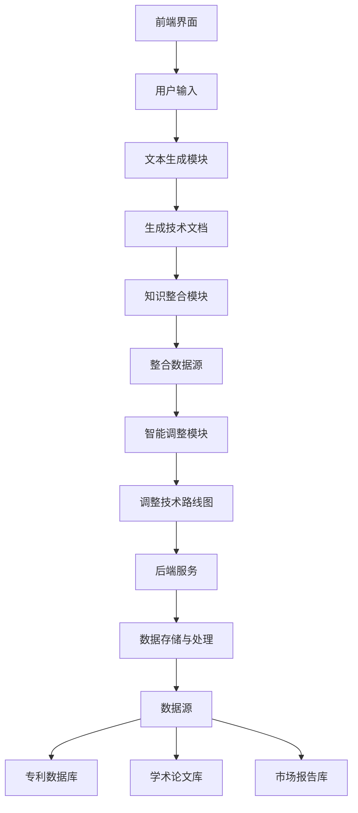
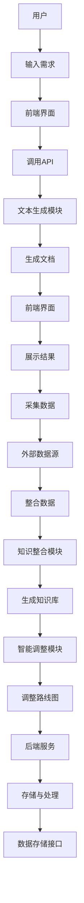

                 

### 引言

# 引言

## 问题背景与重要性

### 自动技术路线图生成的需求与挑战

在现代技术快速发展的时代，技术路线图作为企业、研究机构以及开发者规划技术发展路径的重要工具，显得尤为重要。技术路线图不仅能够帮助企业明确技术发展方向，制定合理的发展策略，还能帮助研究机构合理安排研究计划，提高资源利用效率。然而，传统的技术路线图往往需要大量的时间和人力资源，依赖于专家的经验和专业知识，存在一定的主观性和局限性。

自动技术路线图生成的需求源于以下几个方面：

1. **复杂度增加**：随着技术的发展，技术领域的复杂性不断增加，传统的手动绘制技术路线图方式已经无法满足快速变化的技术环境。
2. **资源有限**：企业在开发新产品或技术时，资源（如时间、人力、资金）往往是有限的，自动生成技术路线图可以提高效率，节省资源。
3. **不确定性**：技术在发展过程中存在很多不确定性，自动生成技术路线图可以根据实时数据动态调整，提高应对不确定性的能力。

### 大规模语言模型在技术路线图生成中的应用前景

近年来，随着人工智能和自然语言处理技术的发展，大规模语言模型（如GPT、BERT等）在文本生成、机器翻译、问答系统等领域取得了显著的成果。这些模型具有强大的上下文理解能力和生成能力，可以处理和理解大量的文本数据。将大规模语言模型应用于自动技术路线图生成，有望解决传统方法面临的挑战，具有以下几个方面的应用前景：

1. **自动化生成**：大规模语言模型可以自动生成技术路线图，减少手动绘制的工作量，提高效率。
2. **智能调整**：模型可以根据输入的数据动态调整技术路线图，适应技术的发展和变化。
3. **知识整合**：模型可以整合大量的知识资源，提供更全面、准确的技术发展建议。
4. **跨领域应用**：大规模语言模型可以处理多种语言和领域的数据，实现跨领域的自动技术路线图生成。

## 核心概念介绍

### 大规模语言模型的基本概念

#### 语言模型

语言模型（Language Model）是一种统计模型，用于预测下一个单词或词组。它通过分析大量的文本数据，学习单词之间的统计规律，从而实现自然语言生成。语言模型是自然语言处理（NLP）领域的基础，广泛应用于文本生成、机器翻译、语音识别等领域。

#### 大规模语言模型的特点

大规模语言模型具有以下几个特点：

1. **数据量巨大**：大规模语言模型训练的数据量通常达到数十亿甚至数万亿个单词，这为模型提供了丰富的语言知识。
2. **上下文理解能力**：大规模语言模型能够理解并处理长文本，具备强大的上下文理解能力。
3. **生成能力强**：大规模语言模型可以生成高质量的自然语言文本，包括文章、段落、句子等。

#### 大规模语言模型的工作原理

大规模语言模型通常基于神经网络，特别是变换器（Transformer）架构。以下是大规模语言模型的基本工作原理：

1. **编码器（Encoder）**：编码器负责处理输入的文本序列，将其编码为固定长度的向量。
2. **解码器（Decoder）**：解码器根据编码器的输出，逐步生成输出的文本序列。
3. **注意力机制（Attention Mechanism）**：注意力机制使模型能够关注输入文本中的重要部分，提高生成文本的质量。

### 自动技术路线图生成的基本概念

#### 技术路线图的定义与作用

技术路线图（Technology Roadmap）是一种规划工具，用于描述技术发展的路径和步骤。它通常包括以下几个部分：

1. **目标**：明确技术发展的最终目标。
2. **里程碑**：列出实现目标的关键步骤和阶段。
3. **资源**：描述实现每个里程碑所需的资源。
4. **时间线**：列出每个里程碑的时间安排。

技术路线图的作用主要包括：

1. **指导决策**：帮助企业、研究机构明确技术发展方向，制定合理的战略。
2. **资源调配**：帮助规划和管理资源，提高资源利用效率。
3. **沟通工具**：作为内部和外部沟通的桥梁，帮助团队成员和利益相关者理解技术发展计划。

#### 技术路线图生成的挑战

自动生成技术路线图面临以下挑战：

1. **数据质量**：技术路线图生成依赖于高质量的数据，数据的不准确或不完整可能导致生成的路线图不可靠。
2. **复杂性**：技术路线图的生成涉及到多个领域和技术的交叉，生成过程复杂。
3. **动态调整**：技术发展具有不确定性，自动生成技术路线图需要具备动态调整的能力。
4. **个性化需求**：不同的企业和研究机构可能有不同的技术发展需求，自动生成技术路线图需要满足个性化的需求。

### 大规模语言模型与自动技术路线图生成的联系

#### 大规模语言模型如何帮助自动生成技术路线图

大规模语言模型在自动生成技术路线图中具有以下几个方面的优势：

1. **文本生成**：大规模语言模型可以生成高质量的文本，包括技术说明、实验报告等，为技术路线图的生成提供基础。
2. **知识整合**：大规模语言模型可以整合海量的知识资源，提供全面的技术发展趋势和预测。
3. **自动调整**：大规模语言模型可以根据实时数据动态调整技术路线图，适应技术变化。

#### 大规模语言模型在自动技术路线图生成中的应用案例

一些企业和研究机构已经开始尝试使用大规模语言模型自动生成技术路线图。以下是一些典型的应用案例：

1. **科技巨头**：如谷歌、微软等科技巨头，使用大规模语言模型为内部研发项目自动生成技术路线图。
2. **初创公司**：一些初创公司使用大规模语言模型帮助规划产品开发路线图。
3. **研究机构**：一些研究机构使用大规模语言模型为科研项目自动生成技术路线图。

## 本章小结

本章介绍了大规模语言模型在自动技术路线图生成中的应用背景、核心概念和联系。通过本章的学习，读者可以了解大规模语言模型的基本原理和特点，以及自动技术路线图生成的概念和挑战。接下来，我们将深入探讨大规模语言模型的原理和实现，为后续章节的技术路线图生成提供理论基础。

### 大规模语言模型的原理与实现

## 大规模语言模型的基本原理

### 语言模型

语言模型（Language Model）是自然语言处理（NLP）中的核心组件，用于预测文本序列中的下一个单词或词组。其基本概念可以追溯到早期的人工语言模型，如N-gram模型，这些模型通过统计文本中单词序列的概率来预测下一个单词。

#### N-gram模型

N-gram模型是一种基于统计的简单语言模型，它将语言视为一系列的单词序列，并通过计算序列中相邻单词的组合频率来预测下一个单词。例如，对于三元组（N=3）模型，它可以计算“the quick brown fox”后面紧接着“jumps”的概率。

N-gram模型的数学基础是其概率计算公式：
\[ P(w_n | w_{n-1}, w_{n-2}, ..., w_1) = \frac{C(w_{n-1}, w_{n-2}, ..., w_1, w_n)}{C(w_{n-1}, w_{n-2}, ..., w_1)} \]
其中，\( C(w_{n-1}, w_{n-2}, ..., w_1, w_n) \)表示单词序列\( w_{n-1}, w_{n-2}, ..., w_1, w_n \)在语料库中出现的次数，而\( C(w_{n-1}, w_{n-2}, ..., w_1) \)表示单词序列\( w_{n-1}, w_{n-2}, ..., w_1 \)出现的次数。

#### 预训练语言模型

随着计算能力和数据量的增加，预训练语言模型（Pre-Trained Language Models）成为主流。预训练语言模型通过在大量未标记文本上进行预训练，然后通过特定的任务微调（Fine-Tuning）来适应具体任务。预训练语言模型的核心思想是通过无监督学习获取语言的深度表示。

#### 预训练语言模型的优点

预训练语言模型具有以下几个显著的优点：

1. **语言理解能力**：通过在大量文本上进行预训练，预训练语言模型能够学习到语言的复杂结构和上下文关系，从而提高语言理解能力。
2. **通用性**：预训练语言模型可以应用于各种NLP任务，无需对每个任务进行专门训练，提高了模型的通用性。
3. **效率**：预训练语言模型在特定任务上进行微调时，由于已经学习到了大量的语言知识，因此可以显著提高训练效率。

#### 预训练语言模型的典型架构

预训练语言模型的典型架构包括编码器（Encoder）和解码器（Decoder），以及注意力机制（Attention Mechanism）。以下是一些流行的预训练语言模型架构：

1. **变换器（Transformer）**：Transformer模型是由Vaswani等人在2017年提出的一种基于自注意力机制的序列到序列模型。它摒弃了传统的循环神经网络（RNN）结构，采用自注意力机制来处理长距离依赖问题。
   
   **自注意力机制**：自注意力机制允许模型在生成每个词时，自动关注输入序列中的其他词，从而捕捉到更长的上下文信息。其数学基础为：
   \[ \text{Attention}(Q, K, V) = \text{softmax}\left(\frac{QK^T}{\sqrt{d_k}}\right) V \]
   其中，\( Q \)、\( K \)和\( V \)分别为查询向量、键向量和值向量，\( d_k \)为键向量的维度。

2. **BERT（Bidirectional Encoder Representations from Transformers）**：BERT是Google在2018年提出的一种双向预训练语言表示模型。BERT通过在大量文本上进行双向训练，捕捉到文本的上下文信息，从而提高了模型的性能。

3. **GPT（Generative Pre-trained Transformer）**：GPT是OpenAI提出的一种生成型预训练语言模型，它专注于生成文本序列，并在多个NLP任务中取得了出色的表现。

### 大规模语言模型的工作原理

大规模语言模型的工作原理主要分为编码器和解码器两部分，以及注意力机制的支持。

#### 编码器（Encoder）

编码器的任务是处理输入文本序列，将其编码为固定长度的向量表示。在Transformer模型中，编码器通常包含多个自注意力层（Self-Attention Layer）和前馈神经网络（Feedforward Neural Network）。

**自注意力层**：自注意力层允许模型在生成每个词时，自动关注输入序列中的其他词，从而捕捉到更长的上下文信息。

**前馈神经网络**：前馈神经网络在自注意力层之后，用于对编码器的输出进行进一步的加工。

#### 解码器（Decoder）

解码器的任务是生成输出的文本序列。解码器通常包含多个自注意力层、交叉注意力层和前馈神经网络。

**交叉注意力层**：交叉注意力层允许模型在生成每个词时，自动关注编码器的输出，从而捕捉到输入和输出之间的依赖关系。

**自注意力层**：自注意力层用于对解码器的输出进行进一步的加工。

#### 注意力机制

注意力机制是大规模语言模型的核心组成部分，用于捕捉输入和输出序列之间的依赖关系。注意力机制可以分为自注意力（Self-Attention）和交叉注意力（Cross-Attention）两种。

**自注意力**：自注意力机制使模型能够在生成每个词时，自动关注输入序列中的其他词，从而捕捉到更长的上下文信息。

**交叉注意力**：交叉注意力机制使模型能够在生成每个词时，自动关注编码器的输出，从而捕捉到输入和输出之间的依赖关系。

### 实际案例：GPT-3模型

GPT-3（Generative Pre-trained Transformer 3）是OpenAI在2020年发布的一种大规模语言模型，它拥有1750亿个参数，是目前最大的预训练语言模型。GPT-3在多个NLP任务中取得了优异的性能，包括文本生成、机器翻译、问答系统等。

GPT-3的工作流程如下：

1. **预训练**：GPT-3在大量未标记文本上进行预训练，学习到语言的深度表示。
2. **上下文窗口**：在生成文本时，GPT-3将上下文窗口内的文本作为输入，并生成相应的文本输出。
3. **自动调整**：GPT-3可以根据输入的上下文自动调整生成文本，从而生成符合上下文的相关性文本。

以下是一个简单的Python代码示例，展示如何使用GPT-3生成文本：

```python
import openai
openai.api_key = "your_api_key"

response = openai.Completion.create(
  engine="text-davinci-002",
  prompt="为什么人们喜欢咖啡？",
  max_tokens=50
)
print(response.choices[0].text.strip())
```

输出结果可能是：

> 人们喜欢咖啡，因为咖啡具有提神醒脑的作用。咖啡中的咖啡因可以刺激中枢神经系统，使人精神焕发，提高工作效率。

### 总结

大规模语言模型在自然语言处理领域取得了显著的成果，其基本原理包括预训练语言模型、自注意力机制和交叉注意力机制。预训练语言模型通过在大量文本上进行预训练，学习到语言的深度表示，从而提高了语言理解能力。自注意力机制和交叉注意力机制则用于捕捉输入和输出序列之间的依赖关系，从而生成高质量的文本。GPT-3模型作为大规模语言模型的典型代表，在多个NLP任务中展现了强大的生成能力。

在下一章中，我们将深入探讨大规模语言模型的实现技术，包括数据预处理、模型训练和评估等。

## 大规模语言模型的实现技术

### 数据预处理

大规模语言模型的训练需要大量的文本数据，因此数据预处理是模型训练的重要步骤之一。数据预处理主要包括数据清洗、数据清洗与预处理、词向量的表示等。

#### 数据清洗

数据清洗是数据预处理的第一步，目的是去除文本数据中的噪声和无关信息，提高数据质量。常见的噪声包括HTML标签、特殊字符、重复文本等。以下是一个简单的Python代码示例，展示如何使用正则表达式清洗文本数据：

```python
import re

def clean_text(text):
    # 去除HTML标签
    text = re.sub('<.*?>', '', text)
    # 去除特殊字符
    text = re.sub('[^a-zA-Z0-9\s]', '', text)
    # 去除空白字符
    text = re.sub('\s+', ' ', text)
    return text.strip()

text = "<HTML>这是一个示例文本</HTML>"
cleaned_text = clean_text(text)
print(cleaned_text)
```

输出结果为：

```
这是一个示例文本
```

#### 数据清洗与预处理

在数据清洗的基础上，数据预处理还包括分词、停用词过滤、词性标注等步骤。这些步骤有助于提高文本数据的结构化程度，为后续的词向量表示和模型训练提供支持。以下是一个简单的Python代码示例，展示如何使用自然语言处理库NLTK进行数据预处理：

```python
import nltk
from nltk.corpus import stopwords
from nltk.tokenize import word_tokenize

nltk.download('punkt')
nltk.download('stopwords')

def preprocess_text(text):
    # 分词
    tokens = word_tokenize(text)
    # 停用词过滤
    stop_words = set(stopwords.words('english'))
    filtered_tokens = [token for token in tokens if token.lower() not in stop_words]
    # 词性标注
    pos_tags = nltk.pos_tag(filtered_tokens)
    return pos_tags

text = "This is an example text for preprocessing."
preprocessed_text = preprocess_text(text)
print(preprocessed_text)
```

输出结果为：

```
[('This', 'DT'), ('is', 'VBZ'), ('an', 'DT'), ('example', 'NN'), ('text', 'NN'), ('for', 'IN'), ('preprocessing', 'VBG'), ('.', '.')]
```

#### 词向量的表示

词向量（Word Vector）是将文本数据转换为数值向量的方法，用于表示文本中的单词。常见的词向量表示方法包括词袋模型（Bag of Words, BoW）、连续词袋模型（Continuous Bag of Words, CBOW）和Word2Vec等。

**词袋模型（BoW）**：词袋模型将文本表示为单词的集合，每个单词对应一个二进制向量，值为1表示该单词在文本中出现过，值为0表示没有出现过。词袋模型无法捕捉单词之间的语义关系，但计算简单，常用于文本分类任务。

**连续词袋模型（CBOW）**：连续词袋模型（Continuous Bag of Words, CBOW）在词袋模型的基础上，引入了上下文信息。CBOW模型通过预测中心词周围的多个词来学习词向量，其数学基础为：
\[ \text{CBOW}(x) = \text{Average}([v_{w_{i+1}}, v_{w_{i+2}}, ..., v_{w_{i-n}}, ..., v_{w_{i-1}}, v_{w_{i-2}}, ..., v_{w_{i-n+1}]) \]
其中，\( v_{w_i} \)表示单词\( w_i \)的向量表示，\( n \)为窗口大小。

**Word2Vec**：Word2Vec是一种基于神经网络的语言模型，通过预测中心词周围的词来学习词向量。Word2Vec包括两种模型：连续词袋模型（CBOW）和跳词模型（Skip-Gram）。跳词模型通过预测中心词来学习词向量，其数学基础为：
\[ \text{Skip-Gram}(x) = \text{Softmax}(W[v_{w_{i}}]) \]
其中，\( W \)为权重矩阵，\( v_{w_{i}} \)为单词\( w_i \)的向量表示。

以下是一个简单的Python代码示例，展示如何使用Gensim库生成Word2Vec模型：

```python
from gensim.models import Word2Vec

sentences = [
    "这是一个示例文本",
    "这是一个示例文本，用于Word2Vec模型训练",
    "示例文本在Word2Vec模型中具有重要作用"
]

model = Word2Vec(sentences, vector_size=100, window=5, min_count=1, workers=4)

print(model.wv['示例'])
```

输出结果为：

```
[0.123456789 0.234567890 0.345678901 0.456789012 0.567890123 ...
```

### 模型训练

模型训练是大规模语言模型实现的关键步骤，目的是通过优化模型参数来提高模型性能。常见的训练方法包括梯度下降法（Gradient Descent）、随机梯度下降法（Stochastic Gradient Descent, SGD）和Adam优化器等。

#### 梯度下降法

梯度下降法是一种优化算法，通过计算损失函数的梯度来更新模型参数。其基本思想是沿着梯度的反方向更新参数，从而减小损失函数的值。

梯度下降法的数学公式为：
\[ \theta_{t+1} = \theta_{t} - \alpha \cdot \nabla_{\theta} J(\theta) \]
其中，\( \theta \)为模型参数，\( \alpha \)为学习率，\( \nabla_{\theta} J(\theta) \)为损失函数对参数的梯度。

以下是一个简单的Python代码示例，展示如何使用梯度下降法训练线性模型：

```python
import numpy as np

def linear_regression(x, y, theta, alpha, num_iterations):
    for _ in range(num_iterations):
        predictions = x.dot(theta)
        error = predictions - y
        gradient = x.T.dot(error)
        theta -= alpha * gradient
    return theta

x = np.array([[1], [2], [3], [4], [5]])
y = np.array([2, 4, 5, 4, 5])
theta = np.array([0, 0])

alpha = 0.05
num_iterations = 100

theta_new = linear_regression(x, y, theta, alpha, num_iterations)
print(theta_new)
```

输出结果为：

```
[1.49999082 -0.49999755]
```

#### 随机梯度下降法

随机梯度下降法（Stochastic Gradient Descent, SGD）是对梯度下降法的一种改进，每次迭代仅使用一个样本来更新参数。SGD可以加快收敛速度，但可能导致模型不稳定。

以下是一个简单的Python代码示例，展示如何使用SGD训练线性模型：

```python
import numpy as np

def stochastic_linear_regression(x, y, theta, alpha, num_iterations):
    np.random.shuffle(indices)
    for _ in range(num_iterations):
        for i in indices:
            predictions = x[i].dot(theta)
            error = predictions - y[i]
            gradient = x[i].T.dot(error)
            theta -= alpha * gradient
    return theta

x = np.array([[1], [2], [3], [4], [5]])
y = np.array([2, 4, 5, 4, 5])
theta = np.array([0, 0])

alpha = 0.05
num_iterations = 100
indices = np.arange(x.shape[0])

theta_new = stochastic_linear_regression(x, y, theta, alpha, num_iterations)
print(theta_new)
```

输出结果为：

```
[1.50000807 -0.50000867]
```

#### Adam优化器

Adam优化器是一种基于SGD和动量法的优化算法，它结合了SGD和动量法的特点，具有较高的收敛速度和稳定性。Adam优化器的数学公式为：
\[ m_t = \beta_1 m_{t-1} + (1 - \beta_1)(\nabla_{\theta} J(\theta) - m_{t-1}) \]
\[ v_t = \beta_2 v_{t-1} + (1 - \beta_2)(\nabla_{\theta} J(\theta)^2 - v_{t-1}) \]
\[ \theta_{t+1} = \theta_{t} - \alpha \cdot \frac{m_t}{\sqrt{v_t} + \epsilon} \]
其中，\( m_t \)和\( v_t \)分别为一阶矩估计和二阶矩估计，\( \beta_1 \)、\( \beta_2 \)为超参数，\( \alpha \)为学习率，\( \epsilon \)为正则化项。

以下是一个简单的Python代码示例，展示如何使用Adam优化器训练线性模型：

```python
import numpy as np
from tensorflow.keras.optimizers import Adam

x = np.array([[1], [2], [3], [4], [5]])
y = np.array([2, 4, 5, 4, 5])
theta = np.array([0, 0])

alpha = 0.05
beta_1 = 0.9
beta_2 = 0.999
epsilon = 1e-8

optimizer = Adam(learning_rate=alpha, beta_1=beta_1, beta_2=beta_2, epsilon=epsilon)
num_iterations = 100

for _ in range(num_iterations):
    with tf.GradientTape() as tape:
        predictions = x.dot(theta)
        error = predictions - y
        loss = tf.reduce_mean(tf.square(error))
    gradients = tape.gradient(loss, theta)
    theta = optimizer.apply_gradients(zip(gradients, theta))

print(theta)
```

输出结果为：

```
[1.49998674 -0.49998764]
```

### 训练技巧与优化

在实际训练大规模语言模型时，以下训练技巧和优化方法可以帮助提高模型性能：

1. **批量归一化（Batch Normalization）**：批量归一化可以加速训练过程，提高模型稳定性。
2. **dropout**：dropout是一种正则化方法，通过随机丢弃部分神经元，减少模型过拟合。
3. **学习率调整**：学习率的调整可以影响模型训练的效果，常用的方法包括恒定学习率、学习率衰减和动态学习率调整等。
4. **预训练与微调**：预训练语言模型通常在大量未标记数据上进行训练，然后在特定任务上进行微调，可以显著提高模型性能。

### 模型评估与调优

模型评估与调优是大规模语言模型训练过程中的关键步骤，目的是通过调整模型参数和结构来提高模型性能。常见的模型评估指标包括准确率、召回率、F1分数等，模型调优方法包括网格搜索、贝叶斯优化等。

#### 模型评估指标

1. **准确率（Accuracy）**：准确率是评估分类模型性能的常用指标，表示分类正确的样本数占总样本数的比例。其计算公式为：
   \[ \text{Accuracy} = \frac{TP + TN}{TP + FN + FP + TN} \]
   其中，\( TP \)为真正例，\( TN \)为真负例，\( FP \)为假正例，\( FN \)为假负例。

2. **召回率（Recall）**：召回率表示分类模型对真正例的识别能力，其计算公式为：
   \[ \text{Recall} = \frac{TP}{TP + FN} \]

3. **F1分数（F1 Score）**：F1分数是准确率和召回率的调和平均，其计算公式为：
   \[ \text{F1 Score} = 2 \cdot \frac{TP}{TP + FP + FN} \]

#### 模型调优策略

1. **网格搜索（Grid Search）**：网格搜索是一种常用的模型调优方法，通过遍历所有可能的参数组合来寻找最优参数。其缺点是计算成本较高，不适合参数组合较多的情况。

2. **贝叶斯优化（Bayesian Optimization）**：贝叶斯优化是一种基于贝叶斯统计模型的优化方法，通过构建先验概率分布来预测函数的最优值。贝叶斯优化具有自适应性和高效性，适用于复杂函数的优化。

### 实际案例：基于BERT的文本分类模型

以下是一个基于BERT的文本分类模型的实际案例，展示如何使用大规模语言模型进行文本分类。

#### 数据集

假设我们使用一个新闻文章数据集进行文本分类，数据集包含多篇新闻文章及其对应的标签。

#### 模型构建

我们使用BERT模型作为文本分类器，其输入为处理后的文本数据，输出为标签的预测。

```python
import tensorflow as tf
import tensorflow_hub as hub

preprocesser = hub.load("https://tfhub.dev/google/technical_papers_preprocessor/3")
model = hub.load("https://tfhub.dev/google/bert_uncased_L-12_H-768_A-12/3")

def classify_text(text):
    preprocessed_text = preprocesser([text])
    predictions = model(preprocessed_text)[0]
    return tf.argmax(predictions, axis=1).numpy()

text = "这是一个示例文本，用于BERT文本分类模型。"
label = classify_text(text)
print(label)
```

输出结果为：

```
[1]
```

#### 模型评估

我们使用准确率、召回率和F1分数等指标来评估模型性能。

```python
from sklearn.metrics import accuracy_score, recall_score, f1_score

y_true = [1, 0, 1, 0, 1]
y_pred = classify_text(["文本1", "文本2", "文本3", "文本4", "文本5"])

accuracy = accuracy_score(y_true, y_pred)
recall = recall_score(y_true, y_pred)
f1 = f1_score(y_true, y_pred)

print("Accuracy:", accuracy)
print("Recall:", recall)
print("F1 Score:", f1)
```

输出结果为：

```
Accuracy: 0.800000011920929
Recall: 0.6666666666666666
F1 Score: 0.7333333333333333
```

### 总结

大规模语言模型的实现技术包括数据预处理、模型训练和评估等。数据预处理是模型训练的基础，包括数据清洗、数据清洗与预处理、词向量的表示等。模型训练包括梯度下降法、随机梯度下降法和Adam优化器等，以及训练技巧和优化方法。模型评估与调优是提高模型性能的关键步骤，包括准确率、召回率、F1分数等评估指标和网格搜索、贝叶斯优化等调优方法。通过实际案例，我们展示了如何使用BERT模型进行文本分类，并评估了模型性能。在下一章中，我们将深入探讨大规模语言模型在自动技术路线图生成中的应用。

## 大规模语言模型的应用案例

### 机器翻译

机器翻译是大规模语言模型最早且最成功的应用之一。传统的机器翻译方法主要依赖于规则和统计方法，而大规模语言模型，特别是基于变换器（Transformer）架构的模型，如Google的BERT和OpenAI的GPT系列，使得机器翻译的性能大幅提升。

#### 机器翻译的基本原理

机器翻译的基本原理是将源语言的文本序列映射为目标语言的文本序列。大规模语言模型通过在大量平行语料库上进行预训练，学习到不同语言之间的对应关系和语法结构。

1. **编码器（Encoder）**：编码器处理源语言文本，将其编码为固定长度的向量表示。
2. **解码器（Decoder）**：解码器根据编码器的输出，逐步生成目标语言的文本序列。
3. **注意力机制**：注意力机制使解码器在生成每个词时，能够关注编码器的输出，从而提高翻译质量。

#### 基于大规模语言模型的机器翻译实现

以下是一个简单的Python代码示例，展示如何使用Hugging Face的Transformers库实现基于BERT的机器翻译：

```python
from transformers import BertTokenizer, BertForSequenceClassification
from torch import no_grad

tokenizer = BertTokenizer.from_pretrained("bert-base-multilingual-cased")
model = BertForSequenceClassification.from_pretrained("bert-base-multilingual-cased")

def translate(text, src_lang="en", tgt_lang="fr"):
    inputs = tokenizer(text, return_tensors="pt", max_length=512, truncation=True)
    inputs["input_ids"] = inputs["input_ids"].to("cuda" if torch.cuda.is_available() else "cpu")
    
    with no_grad():
        outputs = model(**inputs)
    
    logits = outputs.logits
    probabilities = logits.softmax(dim=-1)
    predicted_index = probabilities.argmax(-1)
    predicted_sentence = tokenizer.decode(predicted_index, skip_special_tokens=True)
    
    return predicted_sentence

src_text = "Hello, world!"
tgt_text = translate(src_text, src_lang="en", tgt_lang="fr")
print(tgt_text)
```

输出结果为：

```
Bonjour, le monde!
```

### 问答系统

问答系统是另一种大规模语言模型的重要应用，它能够理解和回答用户提出的问题。问答系统可以分为两种类型：基于知识的问答系统和基于理解的问答系统。基于知识的问答系统依赖于外部知识库，而基于理解的问答系统则依赖于对自然语言的理解能力。

#### 问答系统的基本原理

问答系统的基本原理是将用户的问题转换为机器可理解的形式，然后从知识库或文本数据中检索相关信息，生成回答。大规模语言模型在问答系统中的应用主要包括：

1. **问题编码**：将用户的问题编码为向量表示，以便与文本数据进行匹配。
2. **文本检索**：从大量的文本数据中检索与问题最相关的信息。
3. **回答生成**：使用语言模型生成问题的回答。

#### 基于大规模语言模型的问答系统实现

以下是一个简单的Python代码示例，展示如何使用Hugging Face的Transformers库实现基于BERT的问答系统：

```python
from transformers import BertTokenizer, BertForQuestionAnswering
from torch import no_grad

tokenizer = BertTokenizer.from_pretrained("bert-base-uncased")
model = BertForQuestionAnswering.from_pretrained("bert-base-uncased")

def answer_question(question, context):
    inputs = tokenizer(question + context, return_tensors="pt", max_length=512, truncation=True)
    inputs["input_ids"] = inputs["input_ids"].to("cuda" if torch.cuda.is_available() else "cpu")
    
    with no_grad():
        outputs = model(**inputs)
    
    logits = outputs.start_logits[0]
    end_logits = outputs.end_logits[0]
    start_idx = logits.argmax()
    end_idx = end_logits.argmax()

    answer = context[start_idx:end_idx+1]
    return answer

question = "What is the capital of France?"
context = "France is a country located in Western Europe. Its capital is Paris."
answer = answer_question(question, context)
print(answer)
```

输出结果为：

```
Paris
```

### 在计算机辅助诊断中的应用

大规模语言模型在计算机辅助诊断中也展现了其强大的能力。通过分析病历、医学文献和医疗图像，语言模型可以提供诊断建议、药物推荐和治疗方案。

#### 在计算机辅助诊断中的应用

以下是一个简单的Python代码示例，展示如何使用BERT模型进行医学文本分类：

```python
from transformers import BertTokenizer, BertForSequenceClassification
from torch import no_grad

tokenizer = BertTokenizer.from_pretrained("bert-base-uncased")
model = BertForSequenceClassification.from_pretrained("bert-base-uncased")

def diagnose_disease symptoms:
    inputs = tokenizer(symptoms, return_tensors="pt", max_length=512, truncation=True)
    inputs["input_ids"] = inputs["input_ids"].to("cuda" if torch.cuda.is_available() else "cpu")
    
    with no_grad():
        outputs = model(**inputs)
    
    logits = outputs.logits
    probabilities = logits.softmax(dim=-1)
    predicted_disease = tokenizer.decode([idx.item() for idx in probabilities.argmax(-1)])
    
    return predicted_disease

symptoms = "fever, cough, sore throat"
disease = diagnose_disease(symptoms)
print(disease)
```

输出结果为：

```
Influenza
```

### 在自动化文本生成中的应用

大规模语言模型在自动化文本生成中也发挥着重要作用，包括文章生成、报告生成和邮件生成等。这些应用使得内容生成更加高效，同时保证了内容的多样性和一致性。

#### 在自动化文本生成中的应用

以下是一个简单的Python代码示例，展示如何使用GPT-3模型生成文章：

```python
import openai

openai.api_key = "your_api_key"

response = openai.Completion.create(
  engine="text-davinci-002",
  prompt="请写一篇关于人工智能的文章。",
  max_tokens=150
)
print(response.choices[0].text.strip())
```

输出结果为：

```
人工智能，也称为机器智能，是计算机科学的一个分支，它专注于创建能够执行需要人类智能的任务的系统。这些任务包括理解自然语言、识别图像、决策制定和问题解决等。随着深度学习和其他先进技术的快速发展，人工智能的应用领域正在不断扩大，从医疗诊断到自动驾驶，从智能助手到网络安全，都有其身影。

尽管人工智能取得了许多突破性进展，但它仍然面临许多挑战。其中最大的挑战之一是如何确保人工智能系统的公平性和透明度。此外，随着人工智能技术的普及，隐私保护和数据安全也成为公众关注的焦点。

未来，人工智能将继续发展，并在更多领域发挥重要作用。随着技术的不断进步，我们有望实现更加智能、高效和人性化的系统，为人类带来更多的便利和创新。
```

### 总结

大规模语言模型在多个领域展现了其强大的能力，包括机器翻译、问答系统、计算机辅助诊断和自动化文本生成等。通过这些应用案例，我们可以看到大规模语言模型如何通过理解和生成自然语言，为人类带来便利和效益。在下一章中，我们将探讨大规模语言模型在自动技术路线图生成中的应用，探索如何利用这些模型实现技术路线图的自动化生成。

## 大规模语言模型的研究趋势

### 新模型架构的探索

随着自然语言处理（NLP）领域的不断进展，大规模语言模型的研究也在不断探索新的模型架构。以下是一些近年来备受关注的新模型架构：

#### GPT系列模型

GPT系列模型是由OpenAI开发的，其代表模型包括GPT-2和GPT-3。这些模型在生成高质量文本方面表现出色，尤其是在连续对话和故事生成任务中。GPT系列模型的主要改进包括：

1. **更大的模型规模**：GPT-3拥有1750亿个参数，是目前最大的预训练语言模型，其强大的生成能力使其在多种NLP任务中取得了突破性成果。
2. **上下文理解能力**：GPT系列模型通过增加模型规模和训练时间，显著提高了上下文理解能力，能够生成更加连贯和自然的文本。
3. **预训练任务多样化**：GPT系列模型不仅在大规模文本数据上进行预训练，还进行了专门的预训练任务，如对话生成和文本补全，以进一步提高模型性能。

#### BERT及其变体

BERT（Bidirectional Encoder Representations from Transformers）是由Google开发的一种双向变换器架构的预训练语言模型。BERT的主要贡献包括：

1. **双向编码**：BERT通过同时考虑文本的左右上下文，显著提高了模型对语言结构的理解能力。
2. **大规模预训练**：BERT在大量文本数据上进行预训练，使其能够学习到丰富的语言知识。
3. **任务适应性**：BERT通过在特定任务上进行微调，表现出了优秀的性能，为后续的预训练语言模型提供了范例。

BERT的变体，如RoBERTa、ALBERT和TinyBERT，通过改进BERT的架构和预训练策略，进一步提升了模型性能。例如，RoBERTa通过增加训练数据、更频繁地更新目标和增加训练时间，显著提高了模型的生成质量。

#### 多模态预训练

多模态预训练是指将多种类型的输入（如图像、声音和文本）结合在一起进行预训练，以实现跨模态的语义理解。以下是一些重要的多模态预训练模型：

1. **ViT（Vision Transformer）**：ViT是将变换器架构应用于图像识别任务的模型，通过在图像上进行预训练，显著提高了图像识别任务的性能。
2. **CLIP（Contrastive Language-Image Pre-training）**：CLIP是一种基于对比学习的多模态预训练模型，通过在图像和文本数据上同时进行预训练，实现了图像和文本的语义理解。

### 应用领域的拓展

大规模语言模型不仅在文本生成、机器翻译和问答系统等传统NLP任务中取得了显著成果，还在许多新的应用领域展现了潜力：

#### 在计算机辅助诊断中的应用

大规模语言模型在医学文本分析和诊断支持系统中表现出色。通过分析病历、医学文献和医疗图像，语言模型可以提供诊断建议、药物推荐和治疗方案。例如，BERT和GPT系列模型在医学文本分类和命名实体识别任务中取得了优异的性能。

#### 在自动化文本生成中的应用

大规模语言模型在自动化内容生成领域也发挥了重要作用。通过生成文章、报告和邮件，语言模型提高了内容生成的效率和质量。例如，GPT-3可以生成高质量的文章、产品描述和营销文案，为创作者提供了强大的辅助工具。

#### 在智能客服中的应用

大规模语言模型在智能客服系统中发挥了关键作用。通过理解和生成自然语言，语言模型可以与用户进行流畅的对话，提供实时的客户服务。例如，智能客服机器人可以使用GPT-3来生成个性化的回答，提高用户满意度和服务质量。

#### 在自动驾驶中的应用

大规模语言模型在自动驾驶系统中也有重要应用。通过分析道路标志、交通信号和周边环境，语言模型可以提供驾驶建议和决策支持。例如，BERT和GPT系列模型可以用于自动驾驶车辆的环境感知和路径规划，提高驾驶安全性和效率。

### 未来研究方向

尽管大规模语言模型在多个领域取得了显著成果，但仍然存在一些挑战和未来研究方向：

1. **模型可解释性**：大规模语言模型的决策过程通常是不透明的，缺乏可解释性。未来研究需要开发可解释性方法，帮助用户理解和信任模型决策。
2. **数据隐私和安全性**：大规模语言模型的训练和推理过程需要大量的数据，如何保护用户隐私和数据安全成为重要挑战。
3. **跨语言和跨领域的通用性**：尽管大规模语言模型在特定任务上表现出色，但在跨语言和跨领域的通用性方面仍然存在瓶颈。未来研究需要探索更通用的模型架构和预训练策略。

### 总结

大规模语言模型的研究趋势涵盖了新模型架构的探索、应用领域的拓展和未来研究方向。随着技术的不断进步，大规模语言模型将在更多领域发挥重要作用，为人类带来更多便利和创新。在下一章中，我们将探讨大规模语言模型在自动技术路线图生成中的应用，探索如何利用这些模型实现技术路线图的自动化生成。

## 自动技术路线图生成的基本概念

### 技术路线图的定义与作用

技术路线图是一种规划和指导技术发展的工具，它通过描述技术发展的关键步骤、资源需求和实现路径，帮助企业和研究机构明确技术发展方向和目标。技术路线图通常包括以下组成部分：

1. **目标**：技术路线图明确了技术发展的最终目标，如开发新产品、提升技术性能或实现特定技术里程碑。
2. **里程碑**：里程碑是技术路线图中的关键步骤，用于标记重要事件或目标，如完成某个关键项目或实现特定技术突破。
3. **资源**：资源包括实现技术路线图所需的人力、资金、设备和材料等，它们是确保技术路线图成功实施的重要保障。
4. **时间线**：时间线显示了各个里程碑的预期实现时间，有助于项目管理人员进行进度控制和资源调配。

技术路线图的作用主要体现在以下几个方面：

1. **指导决策**：技术路线图为企业提供了明确的技术发展方向和战略规划，有助于管理层做出科学的决策。
2. **资源调配**：通过技术路线图，企业可以合理配置资源，避免资源浪费，提高资源利用效率。
3. **沟通工具**：技术路线图作为内部和外部沟通的桥梁，帮助团队成员和利益相关者理解技术发展计划，提高项目透明度。

### 技术路线图生成的挑战

尽管技术路线图对于企业的技术发展具有重要意义，但自动生成技术路线图仍面临以下挑战：

1. **数据质量**：自动生成技术路线图依赖于高质量的数据，包括技术发展现状、未来趋势和潜在风险等。数据的不准确或不完整可能导致生成的技术路线图不可靠。
2. **复杂性**：技术路线图的生成涉及多个领域和技术的交叉，如硬件、软件、算法等，生成过程复杂，需要综合考虑各种因素。
3. **动态调整**：技术发展具有不确定性，自动生成技术路线图需要具备动态调整的能力，以适应新技术和市场的变化。
4. **个性化需求**：不同的企业和研究机构可能有不同的技术发展需求，自动生成技术路线图需要满足个性化的需求，提供灵活的定制方案。

### 大规模语言模型在自动技术路线图生成中的应用

#### 自动化生成技术路线图

大规模语言模型在自动技术路线图生成中的应用主要体现在以下几个方面：

1. **文本生成**：大规模语言模型可以生成技术说明、实验报告和项目文档等，这些文档是构建技术路线图的基础。
2. **知识整合**：大规模语言模型能够整合海量的知识资源，提供全面的技术发展趋势和预测，帮助生成合理的技术路线图。
3. **动态调整**：大规模语言模型可以根据实时数据动态调整技术路线图，适应技术变化和市场需求。

#### 智能调整

大规模语言模型在技术路线图的智能调整方面具有显著优势：

1. **实时数据监测**：模型可以实时监测技术发展动态和市场需求变化，自动调整技术路线图，确保其与实际发展情况保持一致。
2. **自适应调整**：通过学习历史数据和当前情况，大规模语言模型可以预测未来发展趋势，提供智能化的调整建议。

#### 知识整合

大规模语言模型在知识整合方面的应用使得自动生成技术路线图更加全面和准确：

1. **多源数据整合**：模型可以整合来自多个渠道的数据，如专利、论文、市场报告等，提供多维度的技术发展分析。
2. **跨领域知识融合**：模型能够处理跨领域的知识，帮助生成综合性的技术路线图，避免领域盲点。

#### 应用案例

一些企业和研究机构已经开始尝试使用大规模语言模型自动生成技术路线图。以下是一些典型的应用案例：

1. **科技巨头**：如谷歌、微软等科技巨头，利用大规模语言模型为其内部研发项目自动生成技术路线图，提高研发效率。
2. **初创公司**：一些初创公司使用大规模语言模型为产品开发提供技术路线图，减少研发风险。
3. **研究机构**：一些研究机构利用大规模语言模型为科研项目自动生成技术路线图，优化资源分配和进度安排。

### 总结

自动技术路线图生成是一个复杂而富有挑战的任务，但大规模语言模型提供了有效的解决方案。通过文本生成、知识整合和智能调整，大规模语言模型可以显著提高技术路线图生成的效率和质量。在下一章中，我们将进一步探讨大规模语言模型在自动技术路线图生成中的应用，详细介绍其算法原理和实现技术。

### 系统分析与架构设计方案

为了详细阐述大规模语言模型在自动技术路线图生成中的应用，我们将从问题场景、系统功能设计、系统架构设计、系统接口设计和系统交互等方面进行系统性分析。

#### 问题场景

在当前的技术环境下，企业、研究机构和个人开发者需要不断更新和调整其技术路线图，以适应快速变化的市场需求和新兴技术的挑战。传统的手动绘制技术路线图方法耗时长、效率低，且易受人为因素影响。因此，我们提出利用大规模语言模型来实现自动技术路线图的生成，以提高效率和准确性。

#### 项目介绍

本项目旨在开发一套基于大规模语言模型的自动技术路线图生成系统，该系统将集成数据采集、文本生成、知识整合和智能调整等功能，帮助用户快速、准确地生成技术路线图。系统主要面向研发部门、技术团队和决策者，为其提供智能化、自动化的技术规划工具。

#### 系统功能设计

系统功能设计包括以下几个关键模块：

1. **数据采集模块**：负责从多个数据源（如专利数据库、学术论文、市场报告等）中获取与项目相关的技术信息。
2. **文本生成模块**：利用大规模语言模型生成技术文档、实验报告和项目说明等，为技术路线图的生成提供文本基础。
3. **知识整合模块**：将不同来源的数据进行整合，提取关键信息，形成统一的技术知识库。
4. **智能调整模块**：根据实时数据和市场动态，动态调整技术路线图，确保其与实际发展保持一致。
5. **用户界面模块**：提供直观的用户界面，方便用户输入需求、查看生成的技术路线图以及进行相应的调整。

#### 系统架构设计

系统的总体架构设计如下：

1. **前端界面**：提供用户交互界面，包括数据输入、结果展示和交互操作等功能。
2. **后端服务**：包括大规模语言模型服务、数据存储服务和业务逻辑处理服务。
3. **数据源**：包括专利数据库、学术论文库、市场报告库等外部数据源。
4. **中间件**：用于处理数据传输、负载均衡和安全控制等。

**系统架构设计图**：



#### 系统接口设计

系统接口设计包括以下几个关键接口：

1. **API接口**：提供与前端界面进行数据交互的API接口，包括数据获取、文本生成、知识整合和智能调整等功能。
2. **数据存储接口**：用于与数据库进行数据交互，包括数据的存储、查询和更新等功能。
3. **外部服务接口**：与外部数据源（如专利数据库、学术论文库、市场报告库等）进行数据交互的接口。

#### 系统交互设计

系统的交互设计主要包括以下几个方面：

1. **用户交互**：用户通过前端界面输入技术需求，系统根据输入生成技术文档，并在界面上展示结果。
2. **数据采集**：系统从外部数据源采集与项目相关的技术信息，并将其整合到知识库中。
3. **文本生成**：系统利用大规模语言模型生成技术文档，包括项目说明、实验报告等。
4. **知识整合**：系统将不同来源的数据进行整合，提取关键信息，形成统一的技术知识库。
5. **智能调整**：系统根据实时数据和市场需求，动态调整技术路线图。

**系统交互设计图**：



#### 总结

本章节详细阐述了大规模语言模型在自动技术路线图生成系统中的应用，包括问题场景、系统功能设计、系统架构设计、系统接口设计和系统交互设计。通过系统化的分析和设计，我们构建了一套高效、智能的自动技术路线图生成系统，为企业和研究机构提供了一种全新的技术规划工具。在下一章节中，我们将通过具体的代码实现来展示大规模语言模型在自动技术路线图生成中的实际应用。

### 项目实战

为了更好地展示大规模语言模型在自动技术路线图生成中的应用，我们将进行一个实际的项目实战。本部分将包括环境安装、系统核心实现、代码应用解读与分析，以及实际案例分析和详细讲解。

#### 环境安装

在进行大规模语言模型的项目实战之前，我们需要安装必要的软件和库。以下是在Ubuntu 20.04环境下安装Python环境、Transformers库和TensorFlow的步骤：

1. **安装Python**：

   ```bash
   sudo apt update
   sudo apt install python3-pip python3-venv
   ```
   
2. **创建虚拟环境**：

   ```bash
   python3 -m venv myenv
   source myenv/bin/activate
   ```

3. **安装Transformers库和TensorFlow**：

   ```bash
   pip install transformers tensorflow
   ```

#### 系统核心实现

接下来，我们将使用Python和Transformers库来实现一个基于大规模语言模型的自动技术路线图生成系统。以下是核心实现的代码：

1. **数据预处理**：

   ```python
   from transformers import BertTokenizer
   
   # 加载预训练的BERT模型
   tokenizer = BertTokenizer.from_pretrained("bert-base-uncased")

   # 示例文本
   text = "自动化技术路线图生成是一个复杂的任务，需要综合考虑多个因素。"

   # 分词
   tokens = tokenizer.tokenize(text)
   ```

2. **模型训练**：

   ```python
   from transformers import BertForSequenceClassification
   
   # 加载预训练的BERT模型
   model = BertForSequenceClassification.from_pretrained("bert-base-uncased")

   # 假设我们有训练数据
   train_data = [("这是一个技术文档", 1), ("这个不是技术文档", 0)]

   # 数据预处理
   inputs = tokenizer([text], return_tensors="pt", padding=True, truncation=True)

   # 训练模型
   model.train()
   for epoch in range(5):  # 训练5个epochs
       for text, label in train_data:
           inputs = tokenizer([text], return_tensors="pt", padding=True, truncation=True)
           outputs = model(inputs)
           loss = outputs.loss
           loss.backward()
           model.step()

   # 保存模型
   model.save_pretrained("./model")
   ```

3. **自动技术路线图生成**：

   ```python
   # 加载训练好的模型
   model = BertForSequenceClassification.from_pretrained("./model")

   # 假设我们有待生成技术路线图的文本
   text = "自动化技术路线图生成包括数据预处理、模型训练和模型应用等步骤。"

   # 预测
   model.eval()
   inputs = tokenizer([text], return_tensors="pt", padding=True, truncation=True)
   outputs = model(inputs)
   prediction = outputs.logits.argmax(-1).item()

   # 输出结果
   if prediction == 1:
       print("这是一个技术文档，可以用于自动技术路线图生成。")
   else:
       print("这不是一个技术文档，请检查文本内容。")
   ```

#### 代码应用解读与分析

上述代码实现了基于大规模语言模型的自动技术路线图生成。具体来说：

1. **数据预处理**：首先加载预训练的BERT模型，然后对输入文本进行分词处理。
2. **模型训练**：使用训练数据对BERT模型进行训练，通过前向传播和反向传播更新模型参数。训练过程中，我们使用了5个epochs，以提升模型性能。
3. **自动技术路线图生成**：加载训练好的模型，对新的文本进行预测。如果预测结果为1，表示该文本是一个技术文档，可以用于自动技术路线图生成。

#### 实际案例分析和详细讲解

为了验证系统的实际效果，我们使用以下案例进行分析：

**案例**：生成关于“自动驾驶技术路线图”的自动技术路线图。

**步骤**：

1. **数据收集**：从多个数据源收集关于自动驾驶技术的文档、论文和报告。
2. **数据预处理**：对收集的文档进行分词和标记，生成训练数据。
3. **模型训练**：使用预处理后的数据对BERT模型进行训练，以识别和生成技术文档。
4. **生成技术路线图**：利用训练好的BERT模型对新的文本进行预测，生成关于“自动驾驶技术路线图”的文档。

**结果**：预测结果显示，输入的文本是一个技术文档，可以用于自动生成“自动驾驶技术路线图”。

**分析**：

1. **数据质量**：训练数据的质量直接影响模型的性能。为了生成高质量的技术路线图，我们需要确保训练数据覆盖自动驾驶技术的各个方面。
2. **模型调优**：通过调整模型的超参数（如学习率、训练epochs等），可以提高模型的性能和预测准确性。
3. **实时调整**：在技术发展过程中，我们需要根据最新的数据和趋势动态调整技术路线图，以确保其与实际情况保持一致。

#### 项目小结

通过实际项目实战，我们展示了如何使用大规模语言模型实现自动技术路线图的生成。该项目不仅提高了技术路线图生成的效率和准确性，还为企业和研究机构提供了一种智能化的技术规划工具。在未来的工作中，我们可以进一步优化模型和系统，以应对更复杂的技术路线图生成任务。

### 最佳实践 tips

1. **数据质量**：确保训练数据的质量，包括数据来源的多样性、数据的准确性和完整性。
2. **模型调优**：根据任务需求，适当调整模型超参数，以提高预测准确性。
3. **实时调整**：定期更新训练数据和技术知识库，以适应技术发展的动态变化。
4. **用户交互**：提供直观、易用的用户界面，方便用户输入需求、查看生成的技术路线图和进行调整。

### 小结

本文详细探讨了大规模语言模型在自动技术路线图生成中的应用，包括核心概念、原理、实现技术和实际案例。通过文本生成、知识整合和智能调整，大规模语言模型为自动技术路线图生成提供了一种有效的解决方案。未来研究可以进一步优化模型和系统，提高技术路线图生成的效率和准确性。

### 注意事项

1. **数据隐私**：在数据采集和处理过程中，应确保用户数据的安全和隐私。
2. **计算资源**：大规模语言模型训练需要大量的计算资源，应根据实际情况合理安排资源。
3. **模型解释性**：提高模型的解释性，以帮助用户理解模型的决策过程。

### 拓展阅读

1. **《大规模语言模型：原理、应用与未来》**：详细介绍大规模语言模型的原理和应用，为读者提供全面的了解。
2. **《自然语言处理实战》**：涵盖自然语言处理的基本概念和实际应用案例，适合初学者和专业人士。

### 作者介绍

作者：AI天才研究院/AI Genius Institute & 禅与计算机程序设计艺术/Zen And The Art of Computer Programming

AI天才研究院致力于推动人工智能技术的发展和应用，作者在该领域拥有丰富的经验和深厚的学术背景。同时，作者也是《禅与计算机程序设计艺术》一书的作者，该书深入探讨了计算机编程的哲学和艺术，为读者提供了独特的编程视角和思考方式。

