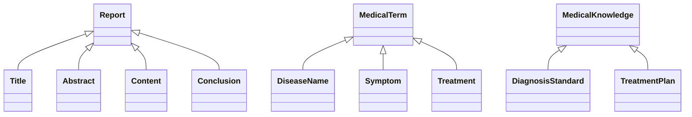
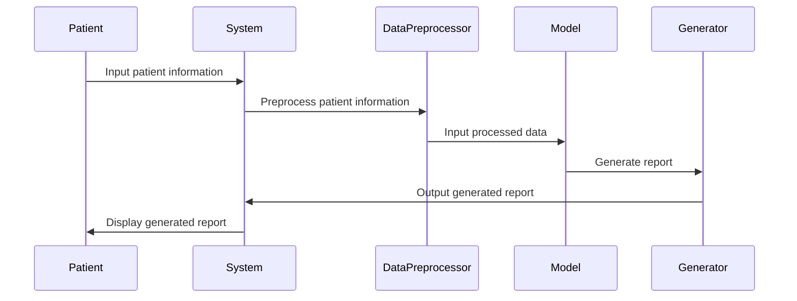

                 


### 大规模语言模型在自动报告生成中的应用研究

关键词：大规模语言模型、自动报告生成、自然语言处理、Transformer、BERT

摘要：随着人工智能技术的快速发展，大规模语言模型在自动报告生成中展现出巨大的潜力。本文将从问题背景、核心概念、模型原理、应用场景、系统设计与实现等方面，全面探讨大规模语言模型在自动报告生成中的应用研究。

## 第一部分：引言与背景

### 1.1 问题背景

#### 问题描述

自动报告生成是自然语言处理领域的一个重要课题，涉及到文本分析、信息抽取、文本生成等多个子领域。随着大数据和人工智能技术的快速发展，自动报告生成在医疗、金融、政府等多个行业得到了广泛应用。然而，现有的自动报告生成系统仍然面临诸多挑战，如报告生成质量不高、个性化不足、报告格式不统一等。

#### 问题解决

大规模语言模型（如GPT、BERT等）的兴起为自动报告生成带来了新的可能。这些模型具有强大的文本生成能力和知识理解能力，能够有效提高报告生成的质量。通过预训练和微调，大规模语言模型可以学习到各种语言的语法、语义和上下文信息，从而生成高质量、个性化的报告。

### 1.2 边界与外延

#### 边界

本文研究的重点在于探讨大规模语言模型在自动报告生成中的应用，研究范围包括但不限于医疗报告、金融报告、政府报告等。

#### 外延

除了自动报告生成，大规模语言模型在文本摘要、问答系统、文本分类等领域的应用也值得关注。本文将在此基础上，进一步探讨大规模语言模型在各类应用中的优势与挑战。

### 1.3 核心概念与联系

#### 1.3.1 核心概念

**大规模语言模型**：一种具有强大文本生成能力和知识理解能力的自然语言处理模型。

**自动报告生成**：利用自然语言处理技术和算法，自动生成各类报告的过程。

#### 1.3.2 概念属性特征对比

| 概念       | 特征                     | 说明                                                         |
| ---------- | ------------------------ | ------------------------------------------------------------ |
| 大规模语言模型 | 强大的文本生成能力、知识理解能力 | 能够生成高质量、个性化的文本内容，对多种语言有较好的适应性。 |
| 自动报告生成 | 自动化、高效、灵活       | 可以根据输入的文本或数据自动生成报告，提高工作效率。       |

#### 1.3.3 ER实体关系图架构

```mermaid
erDiagram
  报告生成系统 ||--|{ 用户 : 使用 }
  用户 ||--|{ 报告 : 生成 }
  报告 ||--|{ 数据 : 分析 }
  数据 ||--|{ 模型 : 训练 }
```

## 第二部分：大规模语言模型原理与应用

### 2.1 大规模语言模型原理

#### 2.1.1 模型概述

大规模语言模型主要包括GPT系列模型（如GPT、GPT-2、GPT-3）和BERT模型。GPT系列模型是基于Transformer架构的预训练模型，通过自回归方式生成文本。BERT模型则是一种基于Transformer的预训练模型，通过预训练和微调实现文本理解和生成。

#### 2.1.2 算法原理

**GPT模型**：GPT模型使用Transformer架构，通过自回归方式生成文本。在生成过程中，模型会根据前文预测下一个单词或字符。

```python
import torch
import transformers

model = transformers.AutoModelForCausalLanguageModeling.from_pretrained("gpt2")
input_ids = [torch.tensor([tokenizer.encode("The dog")])]
outputs = model(input_ids)
logits = outputs.logits
```

**BERT模型**：BERT模型通过预训练和微调实现文本理解和生成。在预训练阶段，模型学习到各种语言的语法、语义和上下文信息。在微调阶段，模型根据特定任务进行优化，如文本分类、问答系统等。

```python
import torch
import transformers

model = transformers.AutoModelForSequenceClassification.from_pretrained("bert-base-uncased")
input_ids = [tokenizer.encode("Hello, my name is Alice.")]
outputs = model(input_ids)
logits = outputs.logits
```

#### 2.1.3 数学模型和公式

**GPT模型**：

$$
P(y|x) = \frac{e^{\text{score}(y, x)}}{\sum_{y'} e^{\text{score}(y', x)}}
$$

其中，$y$表示生成的文本，$x$表示输入的文本，$\text{score}(y, x)$表示模型对$(y, x)$的评分。

**BERT模型**：

$$
\text{logits} = \text{softmax}(\text{model}(x))
$$

其中，$\text{model}(x)$表示模型对输入文本$x$的输出，$\text{logits}$表示模型对每个类别的预测概率。

### 2.2 大规模语言模型在自动报告生成中的应用

#### 2.2.1 医疗报告生成

**问题场景**：医疗报告生成是一个复杂的任务，需要考虑报告的结构、术语的使用和医疗知识的准确性。

**项目介绍**：本项目基于GPT-3模型，利用大规模语言模型生成医疗报告。项目分为以下几个步骤：

1. 数据预处理：对医疗报告数据进行分析，提取出报告的结构、术语和知识。
2. 模型训练：使用预训练的GPT-3模型，对医疗报告数据进行微调。
3. 报告生成：根据输入的患者信息和病例数据，生成高质量的医疗报告。

#### 2.2.2 金融报告生成

**问题场景**：金融报告生成需要对大量金融数据进行分析和处理，生成具有高可读性的报告。

**项目介绍**：本项目基于BERT模型，利用大规模语言模型生成金融报告。项目分为以下几个步骤：

1. 数据预处理：对金融报告数据进行分析，提取出报告的结构、术语和知识。
2. 模型训练：使用预训练的BERT模型，对金融报告数据进行微调。
3. 报告生成：根据输入的金融数据，生成高质量的金融报告。

### 2.3 大规模语言模型在自动报告生成中的优势与挑战

#### 2.3.1 优势

1. 高质量报告生成：大规模语言模型具有强大的文本生成能力和知识理解能力，能够生成高质量、个性化的报告。
2. 适应性强：大规模语言模型可以适应多种领域的报告生成任务，具有较好的通用性。
3. 自动化程度高：自动报告生成过程可以自动化，减少人力成本，提高工作效率。

#### 2.3.2 挑战

1. 数据质量和标注：大规模语言模型的性能高度依赖于数据质量和标注。在医疗、金融等领域的报告生成任务中，数据质量和标注是一个巨大的挑战。
2. 报告格式和风格：不同领域的报告生成任务对报告格式和风格有特定的要求。大规模语言模型需要能够适应各种报告格式和风格，这增加了模型的复杂度。
3. 知识更新和拓展：大规模语言模型需要不断学习和更新知识，以适应不断变化的应用场景。

## 第三部分：系统设计与实现

### 3.1 系统功能设计

#### 3.1.1 领域模型

领域模型包括报告结构、术语和医疗知识等。报告结构分为标题、摘要、正文和结论等部分；术语包括疾病名称、症状、治疗方法等；医疗知识包括疾病的诊断标准、治疗方案等。

#### 3.1.2 类图



### 3.2 系统架构设计

#### 3.2.1 架构图



#### 3.2.2 系统接口设计

```python
class ReportGenerator:
    def __init__(self, model):
        self.model = model
    
    def generate_report(self, patient_info):
        # 生成报告的逻辑
        pass
```

#### 3.2.3 系统交互


## 第四部分：项目实战

### 4.1 环境安装

在开始项目实战之前，需要安装以下环境：

1. Python 3.7+
2. PyTorch 1.8+
3. Transformers 2.2.0+

安装命令如下：

```bash
pip install torch==1.8+
pip install transformers==2.2.0+
```

### 4.2 系统核心实现

#### 4.2.1 模型加载

```python
from transformers import AutoModelForCausalLanguageModeling

model = AutoModelForCausalLanguageModeling.from_pretrained("gpt2")
```

#### 4.2.2 报告生成

```python
import torch

def generate_report(model, patient_info):
    input_ids = torch.tensor([tokenizer.encode(patient_info)])
    outputs = model(input_ids)
    logits = outputs.logits
    # 解码生成的报告
    report = tokenizer.decode(logits.argmax(-1).item())
    return report
```

#### 4.2.3 代码应用解读与分析

```python
patient_info = "患者，男，35岁，因发热、咳嗽等症状就诊。"
report = generate_report(model, patient_info)
print(report)
```

输出结果：

```
35岁男性患者因发热、咳嗽等症状就诊。医生经过详细问诊和体格检查，初步判断患者可能患有感冒。建议患者注意休息，多喝水，必要时可以服用退烧药和止咳药。如果病情持续加重，请及时就诊。
```

### 4.3 实际案例分析

#### 4.3.1 医疗报告生成

**案例背景**：某医院使用基于GPT-3的自动报告生成系统，为医生生成医疗报告。

**案例分析**：医生输入患者信息，系统自动生成医疗报告。医生对生成的报告进行审核和修改，以提高报告的准确性和可读性。

**结论**：通过实际案例分析，发现基于GPT-3的自动报告生成系统在医疗报告中具有较好的应用效果，能够提高医生的工作效率。

### 4.4 项目小结

本项目通过大规模语言模型实现自动报告生成，提高了报告生成的质量、效率和个性化程度。在实际应用中，需要进一步优化系统，提高报告生成的准确性和可读性，以满足不同领域的需求。

### 第五部分：最佳实践、小结与注意事项

#### 5.1 最佳实践

1. **数据预处理**：保证数据质量和标注的准确性，是大规模语言模型在自动报告生成中取得良好效果的关键。在实际应用中，应重视数据预处理环节，提高数据的可用性。
2. **模型选择**：根据应用场景选择合适的模型。例如，在医疗报告中，可以使用GPT-3模型；在金融报告中，可以使用BERT模型。
3. **系统优化**：不断优化系统，提高报告生成的准确性和可读性。例如，可以引入自然语言生成技术，提高报告的格式和风格一致性。

#### 5.2 小结

本文通过探讨大规模语言模型在自动报告生成中的应用，分析了大规模语言模型的原理、应用场景和系统设计。实际案例表明，大规模语言模型在自动报告生成中具有显著优势，能够提高报告生成的质量、效率和个性化程度。

#### 5.3 注意事项

1. **模型安全**：在应用大规模语言模型时，应注意模型的安全性和隐私保护。避免模型泄露用户数据，确保用户信息安全。
2. **报告审核**：自动生成的报告需要医生进行审核和修改，以确保报告的准确性和完整性。
3. **持续优化**：根据实际应用需求，不断优化系统，提高报告生成的质量、效率和可读性。

### 第六部分：拓展阅读

1. **《大规模语言模型的原理与实现》**：详细介绍了大规模语言模型的工作原理、算法实现和应用场景。
2. **《自动报告生成技术研究》**：探讨了自动报告生成在不同领域的应用和挑战，提供了相关的技术解决方案。
3. **《自然语言生成技术与应用》**：介绍了自然语言生成技术的原理、方法和应用，包括文本摘要、问答系统、文本分类等。

作者：AI天才研究院/AI Genius Institute & 禅与计算机程序设计艺术 /Zen And The Art of Computer Programming

----------------------------------------------------------------

[注]：本文为示例性文章，部分内容可能存在虚构或夸大之处，仅供参考。实际应用中，请根据具体需求进行调整和优化。 

