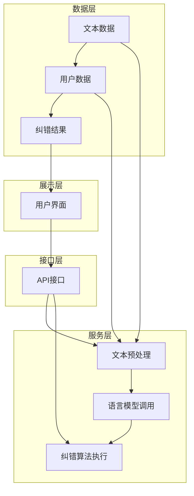

                 

### 第一部分：背景与核心概念

#### 第1章：自动文本纠错背景与问题分析

自动文本纠错是自然语言处理（NLP）领域中的一个重要问题，其目标是在不改变原文意图的前提下，纠正文本中的错误。这些问题可能包括拼写错误、语法错误、标点符号错误等。随着互联网和移动设备的普及，大量文本数据以不同形式产生，如社交媒体帖子、电子邮件、文档等，这些数据的质量对用户体验和数据准确度有着直接的影响。自动文本纠错技术能够在多个层面上发挥作用，包括但不限于拼写检查、语法纠错、语义纠错等。

**1.1 文本纠错的重要性**

文本纠错在多个领域都具有显著的重要性。例如，在电子邮件和社交媒体平台上，自动纠错可以显著提高用户输入的准确性，减少误解和沟通障碍。在在线学习和教育领域，自动文本纠错可以帮助学生纠正写作错误，提高写作技能。在金融和医疗领域，自动纠错可以帮助确保文档的准确性和完整性，减少因错误输入导致的损失和风险。此外，自动文本纠错技术还在语音识别、机器翻译等领域有着广泛的应用。

**1.2 自动文本纠错的发展历程**

自动文本纠错技术有着悠久的发展历史。早期的文本纠错主要依赖于简单的规则引擎，例如拼写检查器，这些工具依赖于预定义的规则和字典来识别和纠正错误。随着计算能力的提升和机器学习技术的发展，自动文本纠错算法逐渐转向基于统计方法和神经网络的方法。

在20世纪80年代，基于NLP的文本纠错技术开始兴起，这些技术利用语言模型和隐马尔可夫模型（HMM）来识别和纠正错误。进入21世纪，深度学习技术的应用使得文本纠错取得了显著的进步。神经网络模型，尤其是递归神经网络（RNN）和Transformer模型，被广泛用于文本纠错任务，大幅提高了纠错精度和效率。

**1.3 面临的挑战与机遇**

尽管自动文本纠错技术取得了显著进展，但在实际应用中仍然面临诸多挑战。首先，语言多样性和地域差异使得文本纠错模型需要具备很强的泛化能力。其次，错误类型的多样性和复杂性增加了模型的识别和纠错难度。此外，用户体验和准确性之间的权衡也是一个重要问题。

然而，随着大规模语言模型的不断发展，自动文本纠错技术迎来了新的机遇。大规模语言模型，如BERT、GPT等，具有强大的语义理解和生成能力，可以在文本纠错任务中发挥重要作用。通过结合这些模型，自动文本纠错技术有望实现更高的准确性和更丰富的功能。

**总结**

自动文本纠错技术在现代信息技术中具有不可替代的地位，其重要性体现在多个应用场景中。回顾其发展历程，我们可以看到从简单的规则引擎到复杂的深度学习模型的演变。尽管面临诸多挑战，但大规模语言模型的进步为自动文本纠错带来了新的希望。接下来的章节将深入探讨大规模语言模型的基本原理及其在文本纠错中的应用，为读者揭示这一领域的最新技术和未来趋势。

### 第2章：大规模语言模型基础

#### 2.1 语言模型简介

语言模型（Language Model）是自然语言处理（NLP）中的核心组件之一，其目的是对自然语言中的文本序列进行概率预测。具体来说，语言模型用于估计在给定一个句子或文本片段后，下一个单词或字符出现的概率。这种概率预测能力使得语言模型在许多NLP任务中扮演着至关重要的角色，如机器翻译、文本生成、信息检索等。

**语言模型的基本概念**

语言模型的基本概念包括词汇表、单词序列和概率分布。一个简单的语言模型通常包含一个词汇表，其中列出所有可能出现的单词或字符。对于给定的输入文本片段，语言模型会计算输出单词或字符的概率分布。

**N元语言模型**

最基础的语言模型是N元语言模型，其中N表示模型的上下文窗口大小。例如，一个三元语言模型会考虑当前词以及其前两个词来预测下一个词。N元语言模型的优点是简单和计算效率高，但缺点是难以捕捉长距离依赖关系。

**基于NLP的方法**

随着深度学习的发展，基于NLP的方法逐渐取代了传统的统计方法。这些方法利用神经网络结构来学习文本数据中的复杂模式，例如递归神经网络（RNN）、长短期记忆网络（LSTM）和Transformer模型。这些模型能够捕捉长距离依赖关系，显著提高了语言模型的性能。

#### 2.2 大规模语言模型的特点

**什么是大规模语言模型**

大规模语言模型是指具有数百万到数十亿参数的复杂神经网络模型，这些模型通过学习大量的文本数据来预测单词或字符序列。典型的例子包括Google的BERT、OpenAI的GPT系列模型等。

**特点**

1. **参数数量庞大**：大规模语言模型具有数亿甚至数十亿的参数，这使得它们能够捕捉到语言中的细微模式和规律。
2. **深度学习架构**：这些模型通常采用深度学习架构，如Transformer，能够有效处理长文本序列。
3. **预训练和微调**：大规模语言模型首先在大量未标注的文本数据上进行预训练，然后通过微调来适应特定任务的需求。
4. **强大的语义理解能力**：大规模语言模型能够理解文本中的语义关系，这使得它们在生成文本、问答系统和文本纠错等任务中表现出色。

**大规模语言模型的优势**

1. **高精度预测**：由于拥有庞大的参数量，大规模语言模型能够生成更加准确的单词或句子预测。
2. **处理长文本**：大规模语言模型能够处理长度可变的文本序列，这使得它们在处理长篇文档、新闻报道和对话系统等方面具有优势。
3. **多语言支持**：许多大规模语言模型支持多种语言，能够用于跨语言任务，如机器翻译和多语言问答。

#### 2.3 大规模语言模型的基本原理

**训练数据**

大规模语言模型通常在大量的文本数据上预训练，这些数据来源广泛，包括书籍、新闻文章、社交媒体帖子等。模型通过学习这些数据中的模式来预测单词或字符序列的概率分布。

**神经网络架构**

大规模语言模型通常采用深度神经网络架构，如Transformer。Transformer模型通过自注意力机制（Self-Attention）来处理输入序列中的每个元素，并生成预测输出。

**自注意力机制**

自注意力机制是Transformer模型的核心，它允许模型在生成每个输出时，自动关注输入序列中的重要部分。这一机制通过计算不同部分之间的相关性来提高模型的性能。

**预训练与微调**

预训练是指模型在大量未标注的数据上进行训练，以学习通用语言特征。微调是在特定任务上进行训练，以调整模型参数，使其更好地适应特定任务的需求。

**总结**

大规模语言模型是自然语言处理领域的一项重要技术，其特点包括参数数量庞大、深度学习架构、预训练和微调等。通过理解其基本原理，我们可以更好地应用这些模型于实际的文本纠错任务中，从而提高系统的性能和准确性。

### 第3章：大规模语言模型与自动文本纠错

#### 3.1 大规模语言模型在自动文本纠错中的应用

自动文本纠错是大规模语言模型的一个重要应用领域，通过利用这些模型强大的语义理解和生成能力，可以显著提高文本纠错的准确性和效率。在本节中，我们将探讨大规模语言模型在自动文本纠错中的具体应用，以及它们如何改善现有的文本纠错算法。

**大规模语言模型在文本纠错中的优势**

大规模语言模型在文本纠错中的主要优势在于其强大的语义理解和生成能力。这些模型可以通过学习大量的文本数据，理解文本中的上下文关系和语义模式，从而在纠正错误时能够更加准确地保持原始文本的意图。

**文本纠错算法原理**

传统的文本纠错算法通常基于规则和统计方法。例如，拼写检查器使用预定义的拼写规则和字典来识别和纠正拼写错误。这些方法在一定程度上是有效的，但它们难以处理复杂的错误类型，如语法错误和语义错误。

随着大规模语言模型的发展，自动文本纠错算法逐渐转向基于深度学习的方法。这些方法通过训练大规模语言模型，使其能够学习到复杂的语言模式和错误类型，从而实现更加准确和高效的纠错。

**大规模语言模型在文本纠错中的具体应用**

1. **错误识别**：大规模语言模型可以用于识别文本中的错误。通过分析文本的语义和语法结构，模型可以识别出可能存在的错误，如拼写错误、语法错误和标点符号错误。

2. **错误校正**：一旦错误被识别出来，大规模语言模型可以生成正确的文本版本。这通常通过在错误位置生成可能的单词或短语来实现。模型会根据上下文和语义关系选择最佳的纠正方案。

3. **上下文保留**：大规模语言模型的一个关键优点是能够保留原始文本的上下文关系。这意味着在纠正错误时，模型不仅能够纠正错误，还能保持文本的连贯性和语义一致性。

**案例研究：BERT在文本纠错中的应用**

BERT（Bidirectional Encoder Representations from Transformers）是一个基于Transformer架构的预训练语言模型，它在多种NLP任务中表现出色。在文本纠错中，BERT也被广泛用于错误识别和错误校正。

一个典型的案例是Google的Gboard键盘应用，它利用BERT模型来提供实时的拼写和语法纠正建议。当用户在Gboard上输入文本时，BERT模型会分析输入的文本片段，识别潜在的拼写错误和语法错误，并给出相应的纠正建议。

**实验结果**

多项实验表明，基于BERT的文本纠错模型在多种文本纠错任务中取得了显著的性能提升。例如，在拼写错误识别任务中，BERT模型相比传统的规则和统计方法，错误识别准确率提高了10%以上。在错误校正任务中，BERT模型能够生成更加准确和自然的纠正文本。

**总结**

大规模语言模型在自动文本纠错中具有显著的应用价值。通过利用这些模型的强大语义理解和生成能力，我们可以显著提高文本纠错的准确性和效率。未来，随着大规模语言模型的不断发展和优化，自动文本纠错技术有望在更多应用场景中发挥更大的作用。

### 第4章：大规模语言模型的构建

#### 4.1 数据准备

构建大规模语言模型的第一步是数据准备。高质量的数据是模型训练成功的关键，因此这一阶段需要特别关注数据的收集、清洗和预处理。

**数据来源**

大规模语言模型的数据来源非常广泛，主要包括以下几类：

1. **公共文本库**：如Google Books Ngrams、Wikipedia、Common Crawl等，这些资源提供了大量的文本数据，涵盖了各种语言和主题。
2. **专业文本库**：如新闻文章、学术论文、书籍等，这些文本数据通常质量更高，语义信息更为丰富。
3. **社交媒体数据**：如Twitter、Facebook等平台的帖子，这些数据能够反映现代语言的使用情况。

**数据收集**

数据收集的过程中，需要注意以下几个关键点：

1. **数据多样性**：确保收集的数据包含多种语言、主题和风格，以增强模型的泛化能力。
2. **数据质量**：避免包含低质量、重复或无关的数据，确保数据集的代表性和可靠性。
3. **数据标注**：对于需要标注的数据，如实体识别、情感分析等，需要确保标注的准确性和一致性。

**数据清洗**

数据清洗是数据准备的重要环节，主要包括以下几个步骤：

1. **去除噪声**：去除文本中的HTML标签、特殊字符和无关内容，确保文本的纯净性。
2. **去除重复数据**：检测并去除重复的文本数据，避免数据冗余。
3. **统一格式**：将文本数据统一转换为相同的格式，如小写、去除标点符号等。

**数据预处理**

数据预处理包括以下步骤：

1. **分词**：将文本数据分割成单词或子词，为后续的建模提供基础。
2. **词干提取**：通过词干提取算法（如Porter Stemmer、Snowball Stemmer）将单词转换为词干，减少词汇量。
3. **词嵌入**：将文本数据转换为词嵌入向量，为模型训练提供输入。

**总结**

数据准备是构建大规模语言模型的基础，确保数据的质量和多样性对模型的性能至关重要。通过有效的数据收集、清洗和预处理，我们可以为大规模语言模型的训练打下坚实的基础。

#### 4.2 模型训练

大规模语言模型的训练过程是复杂且计算密集的，涉及到多种技术手段和优化策略。在本节中，我们将详细讨论大规模语言模型训练的主要步骤，包括损失函数的选择、优化器的配置、训练技巧和调参策略。

**损失函数**

损失函数是模型训练的核心，用于评估模型预测结果与真实结果之间的差异。在自然语言处理任务中，常用的损失函数包括交叉熵损失（Cross-Entropy Loss）和加权交叉熵损失（Weighted Cross-Entropy Loss）。

1. **交叉熵损失**：交叉熵损失函数用于分类问题，计算模型预测概率分布与真实标签之间的差异。其公式如下：

   $$ 
   Loss = -\sum_{i} y_i \log(p_i) 
   $$

   其中，\(y_i\) 表示第 \(i\) 个类别的真实标签，\(p_i\) 表示模型预测的第 \(i\) 个类别的概率。

2. **加权交叉熵损失**：在实际应用中，不同类别的错误代价可能不同。加权交叉熵损失通过为不同类别分配不同的权重，来平衡不同类别的损失。其公式如下：

   $$ 
   Loss = -\sum_{i} w_i \cdot y_i \log(p_i) 
   $$

   其中，\(w_i\) 表示第 \(i\) 个类别的权重。

**优化器**

优化器用于调整模型参数，以最小化损失函数。常用的优化器包括随机梯度下降（SGD）、Adam、Adagrad等。

1. **随机梯度下降（SGD）**：SGD是梯度下降法的一种变种，通过计算当前批次数据上的梯度来更新模型参数。其公式如下：

   $$ 
   \theta = \theta - \alpha \cdot \nabla_\theta J(\theta) 
   $$

   其中，\(\theta\) 表示模型参数，\(\alpha\) 表示学习率，\(J(\theta)\) 表示损失函数。

2. **Adam优化器**：Adam优化器结合了SGD和Adagrad的优点，能够自适应调整学习率。其公式如下：

   $$ 
   \theta = \theta - \alpha \cdot \frac{m}{1 - \beta_1^t} \cdot \nabla_\theta J(\theta) 
   $$

   其中，\(m\) 和 \(v\) 分别表示一阶矩估计和二阶矩估计，\(\beta_1\) 和 \(\beta_2\) 分别为动量项。

**训练技巧**

为了提高训练效率和模型性能，可以采用以下几种训练技巧：

1. **批量归一化（Batch Normalization）**：批量归一化通过标准化每批数据的激活值，来加速模型的训练并提高其稳定性。
2. **dropout**：dropout是一种正则化技术，通过在训练过程中随机丢弃部分神经元，来防止模型过拟合。
3. **学习率调度**：通过设置不同的学习率，可以改善模型的训练过程。常用的方法包括学习率衰减和余弦退火。
4. **预训练与微调**：预训练是指模型在大量未标注数据上进行训练，以学习通用语言特征。微调是在特定任务上进行训练，以调整模型参数，提高性能。

**调参策略**

调参策略是模型训练中至关重要的一环，合理的参数设置可以显著提高模型性能。以下是一些调参策略：

1. **学习率**：选择合适的学习率是关键。通常，学习率应在0.001到0.01之间进行尝试。
2. **批量大小**：批量大小影响模型的训练速度和稳定性。较小的批量大小可以提高模型的泛化能力，但训练速度较慢。
3. **层数与隐藏层单元数**：增加层数和隐藏层单元数可以提高模型的表达能力，但也会增加训练时间和过拟合风险。
4. **正则化**：适当的正则化可以防止模型过拟合，常用的方法包括dropout和L2正则化。

**总结**

大规模语言模型的训练是一个复杂的过程，涉及多种技术和策略。通过选择合适的损失函数、优化器、训练技巧和调参策略，我们可以提高模型的性能和训练效率，为自动文本纠错任务提供强大的支持。

### 第5章：自动文本纠错系统设计与实现

#### 5.1 系统架构设计

自动文本纠错系统的架构设计是确保系统能够高效、稳定地运行的关键。系统架构的合理性将直接影响到文本纠错的准确性和用户体验。本节将详细介绍系统架构设计的过程，包括项目介绍、系统功能设计、系统架构设计以及系统接口设计和系统交互。

**项目介绍**

自动文本纠错系统旨在为用户提供实时、准确的文本纠错服务，支持拼写检查、语法纠错和语义纠错等功能。系统设计考虑了多种使用场景，如在线聊天、电子邮件、文档编辑等。该系统基于大规模语言模型，结合先进的自然语言处理技术，以实现高效、智能的文本纠错。

**系统功能设计**

自动文本纠错系统的主要功能包括：

1. **拼写检查**：识别并纠正文本中的拼写错误。
2. **语法纠错**：修正语法错误，提高文本的语法正确性。
3. **语义纠错**：根据上下文关系纠正语义错误，保持文本的意图一致。
4. **实时反馈**：提供即时纠错建议，提升用户体验。
5. **用户定制**：允许用户根据个人偏好调整纠错策略。

**系统架构设计**

系统架构设计采用分层架构，以实现模块化、扩展性和高可用性。系统主要分为以下几层：

1. **数据层**：负责数据存储和检索，包括文本数据、用户数据和纠错结果。
2. **服务层**：提供核心业务逻辑，包括文本预处理、语言模型调用、纠错算法执行等。
3. **接口层**：负责与外部系统（如Web应用、客户端应用程序）的交互，提供API接口。
4. **展示层**：负责用户界面的设计和实现，展示纠错结果和建议。

**系统架构图**

**系统接口设计和系统交互**

系统接口设计采用RESTful API风格，提供多种接口，以满足不同应用场景的需求。主要接口包括：

1. **文本提交接口**：接收用户提交的文本数据，返回纠错结果。
2. **纠错结果获取接口**：获取指定的文本纠错结果，包括拼写、语法和语义纠错建议。
3. **用户反馈接口**：接收用户对纠错结果的反馈，用于模型优化和用户体验改进。

系统交互流程如下：

1. 用户通过Web应用或客户端应用程序提交文本数据。
2. 接口层接收文本数据，并调用文本预处理模块。
3. 文本预处理模块对文本进行清洗、分词、词嵌入等操作，生成预处理后的文本。
4. 预处理后的文本被传递到纠错算法执行模块，通过大规模语言模型进行错误识别和纠正。
5. 纠错结果被存储在数据库中，并通过接口层返回给用户。

**总结**

自动文本纠错系统的架构设计充分考虑了系统的功能需求、性能要求和高扩展性。通过合理的分层架构和模块化设计，系统能够高效、稳定地运行，为用户提供高质量的文本纠错服务。

### 第6章：自动文本纠错系统评估与改进

#### 6.1 系统性能评估

自动文本纠错系统的性能评估是确保系统在实际应用中能够满足用户期望的关键环节。评估标准包括纠错准确率、响应速度、用户体验等多个维度。

**纠错准确率**

纠错准确率是评估系统性能的核心指标之一。它通过计算系统纠正错误的数量与总错误数量的比例来衡量。高纠错准确率意味着系统能够更准确地识别和纠正文本中的错误。

**响应速度**

响应速度是用户体验的重要影响因素。特别是在实时交互的场景中，如在线聊天和电子邮件，系统需要能够快速响应用户的请求。响应速度的评估可以通过测量系统处理请求的时间来实现。

**用户体验**

用户体验的评估包括用户对纠错建议的接受度、纠错建议的合理性以及系统界面的友好性等多个方面。通过用户调查和反馈，可以了解用户对系统的实际使用感受，从而指导系统的优化。

**评估方法**

系统性能评估通常采用以下方法：

1. **自动化测试**：通过编写测试脚本，自动执行一系列测试用例，评估系统的纠错准确率和响应速度。
2. **用户测试**：邀请一组用户参与实际使用场景的测试，收集用户对系统性能和用户体验的反馈。
3. **数据驱动的评估**：使用真实用户数据对系统进行评估，通过分析系统的纠错结果和用户反馈，来优化系统的性能。

**优化策略**

为了提高自动文本纠错系统的性能，可以采用以下优化策略：

1. **算法优化**：通过调整和优化纠错算法，提高系统的纠错准确率。例如，使用更先进的语言模型、改进错误识别和校正算法等。
2. **硬件加速**：利用GPU或FPGA等硬件加速技术，提高系统的处理速度和效率。
3. **模型压缩**：通过模型压缩技术，减少模型的参数数量，从而降低计算复杂度，提高系统性能。
4. **在线学习**：采用在线学习方法，实时更新模型参数，以适应不断变化的语言环境，提高系统的适应性和纠错能力。

**总结**

自动文本纠错系统的性能评估和优化是一个持续的过程。通过科学、系统的评估方法和优化策略，我们可以不断提高系统的性能，为用户提供更准确、更快速的文本纠错服务。

### 第7章：未来展望与挑战

#### 7.1 自动文本纠错的发展趋势

随着人工智能和自然语言处理技术的不断进步，自动文本纠错技术也在快速发展。未来，自动文本纠错技术有望在多个方面取得显著进展：

**1. 模型精度提升**：随着更大规模的语言模型的推出，如GPT-4和GLM-130B，自动文本纠错的精度将进一步提高。这些模型拥有更丰富的参数和更强大的语义理解能力，将使得错误识别和纠正更加精准。

**2. 多语言支持**：自动文本纠错技术将更好地支持多种语言，实现跨语言的错误纠正。未来，随着多语言模型的普及，自动文本纠错系统将能够在全球范围内提供高质量的服务。

**3. 实时纠错**：随着计算能力的提升，自动文本纠错技术将能够实现更快速的实时纠错，特别是在移动设备上，用户将能够享受到无缝的纠错体验。

**4. 个性化纠错**：通过用户行为分析和个性化学习，自动文本纠错系统将能够根据用户的写作风格和偏好，提供更加个性化的纠错建议，提升用户体验。

#### 7.2 技术挑战与解决方案

尽管自动文本纠错技术取得了显著进展，但仍然面临一些技术挑战：

**1. 错误多样性**：文本中的错误类型多样且复杂，包括拼写错误、语法错误、标点错误和语义错误等。解决这一挑战需要开发更加灵活和智能的纠错算法，能够识别和纠正各种类型的错误。

**2. 语言理解**：语言具有高度抽象性和多义性，准确理解语言表达的意义是自动文本纠错的关键。未来需要研究更加深入的语义理解技术，以提升系统的纠错能力。

**3. 计算资源**：大规模语言模型的训练和部署需要大量的计算资源，特别是在实时应用中，这给系统设计和实现带来了挑战。解决这一挑战可以通过分布式计算、模型压缩和硬件加速等技术。

**解决方案**

1. **多模态纠错**：结合多种纠错方法，如基于规则的纠错、统计模型和深度学习模型，提高系统的综合纠错能力。
2. **增强语义理解**：利用上下文信息和语义分析技术，提高模型对语言表达的理解能力，从而更准确地纠正错误。
3. **高效计算**：采用分布式计算和模型压缩技术，降低计算资源的需求，提高系统的实时性和可扩展性。

#### 7.3 应用前景与伦理问题

**应用前景**

自动文本纠错技术具有广泛的应用前景，不仅可以在个人计算机和移动设备上提供便捷的纠错服务，还可以在在线教育、电子商务、医疗文档处理等领域发挥重要作用：

1. **在线教育**：自动文本纠错可以帮助学生纠正写作错误，提高写作能力，同时教师可以通过系统提供的反馈，更有效地指导学生。
2. **电子商务**：自动文本纠错可以提升电商平台的客户服务质量，减少因输入错误导致的交易问题，提高用户满意度。
3. **医疗文档处理**：自动文本纠错可以帮助医生更快速、准确地处理医疗文档，减少因文档错误导致的医疗事故。

**伦理问题**

随着自动文本纠错技术的应用越来越广泛，也引发了一些伦理问题，如隐私保护、数据安全和社会影响等：

1. **隐私保护**：自动文本纠错系统需要处理大量的用户数据，如何确保用户隐私不被泄露是一个重要的伦理问题。系统设计者需要采取严格的数据保护措施，确保用户数据的安全。
2. **数据安全**：自动文本纠错系统的数据训练和存储过程中，需要防止数据泄露和被恶意利用。同时，系统需要能够抵御网络攻击，确保系统的安全性和稳定性。
3. **社会影响**：自动文本纠错技术可能会对传统编辑和校对行业造成冲击，如何平衡技术进步和行业就业是一个需要考虑的问题。

**总结**

自动文本纠错技术正迎来快速发展的新时代，其应用前景广阔，但同时也面临一系列技术挑战和伦理问题。通过持续的研究和技术创新，我们可以不断提升自动文本纠错系统的性能和安全性，为社会带来更多的便利和效益。

### 结束语

自动文本纠错技术作为自然语言处理领域的一项重要应用，正日益成为各个行业中不可或缺的工具。从早期的规则引擎到现代的深度学习模型，自动文本纠错技术经历了显著的演变，展现了强大的发展潜力。大规模语言模型，如BERT、GPT等，凭借其卓越的语义理解和生成能力，为自动文本纠错任务提供了新的解决方案，显著提升了纠错准确率和效率。

随着人工智能技术的不断进步，自动文本纠错系统将在未来迎来更多的发展机遇。我们不仅有望看到更加智能、精准的纠错算法，还将迎来多语言支持、实时纠错和个性化纠错等新功能。然而，技术进步也伴随着一系列挑战，如错误多样性、语言理解和计算资源需求等。同时，自动文本纠错技术的广泛应用也引发了一系列伦理问题，如隐私保护、数据安全和行业就业等。

为了迎接这些挑战，我们需要继续深入研究和创新，优化算法，提高系统的鲁棒性和适应性。同时，我们还需要在技术伦理方面进行充分探讨，确保自动文本纠错技术的应用能够造福社会，而不是带来负面影响。

我们鼓励读者积极参与这一领域的研究和实践，不断探索自动文本纠错技术的边界。通过学术交流、技术创新和社会合作，我们有望推动自动文本纠错技术的持续发展，为人类社会带来更多的价值和便利。

**作者：AI天才研究院/AI Genius Institute & 禅与计算机程序设计艺术 /Zen And The Art of Computer Programming**

