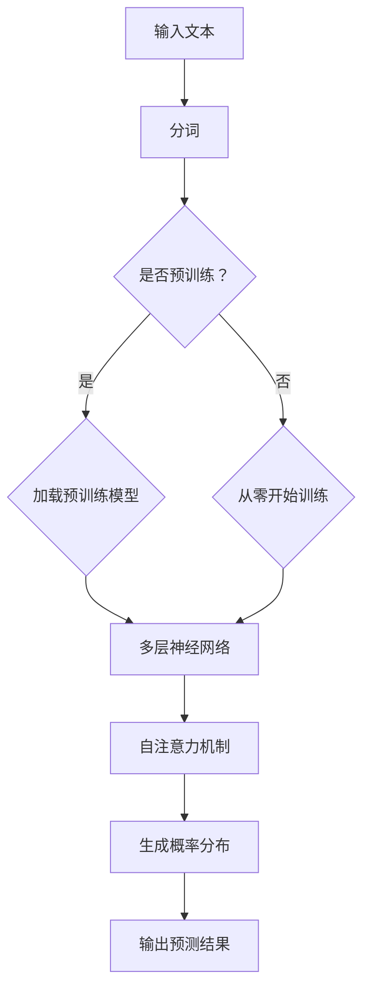
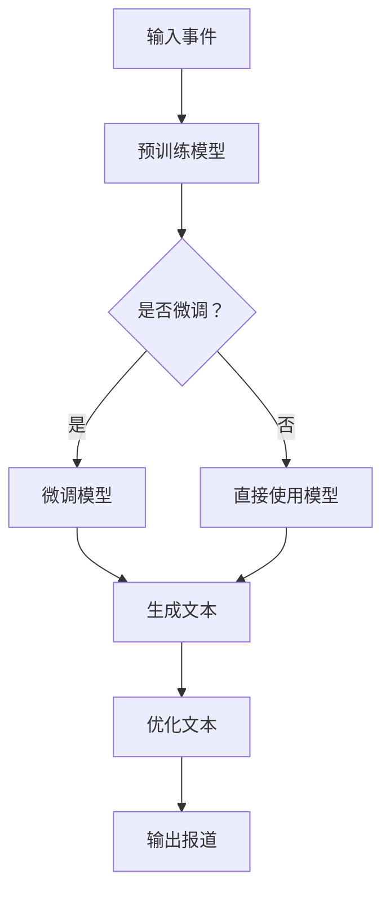
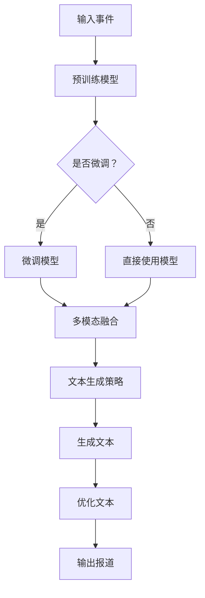

                 


## 1.1 大规模语言模型概述

### 1.1.1 语言模型的基本概念

语言模型是自然语言处理（NLP）领域的一个重要概念，它是一种能够预测文本中下一个词或字符的概率分布的模型。简单来说，语言模型旨在捕捉语言的统计特性，通过分析大量语料库中的语言模式，为每个词或字符生成概率分布。

### 1.1.2 大规模语言模型的定义与特点

大规模语言模型是指参数量巨大、能够处理大量文本数据并生成高质量文本的语言模型。它们通常具备以下特点：

1. **参数量巨大**：大规模语言模型包含数十亿甚至数万亿个参数，这使得它们能够捕捉到更为复杂的语言规律。
2. **高精度预测**：由于参数量的增加，大规模语言模型能够更准确地预测下一个词或字符的概率分布。
3. **强大的泛化能力**：大规模语言模型通过对海量数据的训练，能够处理各种语言任务，如文本分类、机器翻译、问答系统等。

### 1.1.3 大规模语言模型的发展历程

大规模语言模型的发展可以追溯到20世纪80年代，当时研究人员开始尝试使用统计方法来建立语言模型。随着计算能力的提升和大数据的普及，语言模型的技术和规模得到了迅速发展。例如，2018年，Google推出了BERT模型，它具有数百万个参数，大大提高了NLP任务的性能。近年来，GPT系列模型如GPT-3的出现，再次将大规模语言模型推向了新的高峰。

## 1.2 自动新闻报道生成的现状与挑战

### 1.2.1 自动新闻报道生成的定义与意义

自动新闻报道生成（Automated News Generation，简称ANG）是指利用人工智能技术自动生成新闻报道的过程。这种技术旨在降低新闻采编成本，提高新闻生产效率，并在一定程度上解决新闻内容同质化的问题。

### 1.2.2 自动新闻报道生成的现状

目前，自动新闻报道生成已经得到了广泛应用。许多新闻机构已经开始使用自动生成技术来处理一些简单的新闻报道，如体育比赛结果、股票市场动态等。此外，一些企业也推出了基于人工智能的新闻生成工具，为媒体提供定制化的新闻内容。

### 1.2.3 自动新闻报道生成的挑战

尽管自动新闻报道生成具有巨大的潜力，但仍然面临一些挑战：

1. **新闻质量**：自动生成的新闻报道在准确性、可读性和情感表达方面与人类记者相比仍有差距。
2. **数据隐私**：自动新闻报道生成需要大量真实新闻数据作为训练素材，如何保护数据隐私成为一大难题。
3. **个性化需求**：不同用户对新闻内容的需求存在较大差异，如何生成满足个性化需求的新闻内容仍需进一步研究。

## 1.3 大规模语言模型在自动新闻报道生成中的应用

### 1.3.1 大规模语言模型在自动新闻报道生成中的优势

大规模语言模型在自动新闻报道生成中具有以下优势：

1. **高效的文本生成**：大规模语言模型能够快速生成高质量的文本，提高新闻生产效率。
2. **丰富的语言理解能力**：大规模语言模型通过对海量文本的学习，能够更好地理解新闻内容，提高新闻的准确性和可读性。
3. **支持个性化定制**：大规模语言模型可以根据用户的需求和兴趣生成个性化的新闻内容。

### 1.3.2 大规模语言模型在自动新闻报道生成中的应用实例

大规模语言模型已经在自动新闻报道生成中取得了一些成功案例：

1. **新闻摘要生成**：使用GPT模型自动生成新闻摘要，提高了新闻的阅读效率。
2. **体育新闻生成**：自动生成体育比赛结果和赛事报道，为体育迷提供及时、准确的新闻内容。
3. **财经新闻生成**：自动生成股票市场动态和财经分析报告，为投资者提供实时资讯。

### 1.3.3 大规模语言模型在自动新闻报道生成中的突破点

大规模语言模型在自动新闻报道生成中的突破点主要包括：

1. **文本生成质量提升**：通过不断优化模型结构和训练算法，提高自动生成文本的准确性和可读性。
2. **多模态学习**：结合图像、音频等多模态信息，提高自动新闻报道生成的真实性和多样性。
3. **个性化推荐**：根据用户的历史行为和兴趣，生成满足个性化需求的新闻内容。

## 1.4 大规模语言模型在自动新闻报道生成中的前景与挑战

### 1.4.1 大规模语言模型在自动新闻报道生成中的发展前景

随着大规模语言模型技术的不断进步，自动新闻报道生成在新闻行业中的应用前景将更加广阔。未来，自动新闻报道生成有望实现以下目标：

1. **提高新闻生产效率**：大规模语言模型能够自动生成高质量的新闻内容，大大降低新闻生产成本。
2. **丰富新闻内容形式**：通过多模态学习和个性化推荐，自动新闻报道生成将能够提供更加多样化、个性化的新闻体验。
3. **推动新闻行业变革**：自动新闻报道生成将有助于推动新闻行业从传统模式向数字化、智能化模式转型。

### 1.4.2 大规模语言模型在自动新闻报道生成中的未来挑战

尽管前景广阔，大规模语言模型在自动新闻报道生成中仍面临一些挑战：

1. **新闻质量与真实性**：如何确保自动生成新闻内容的准确性和真实性是一个亟待解决的问题。
2. **数据隐私与安全**：如何保护新闻数据的安全性和隐私是一个重要议题。
3. **伦理与责任**：在自动新闻报道生成中，如何确保算法的公正性和透明性，以及如何明确算法的责任归属，也是一个亟待解决的问题。

## 1.5 本章小结

本章对大规模语言模型在自动新闻报道生成中的应用进行了概述。我们介绍了大规模语言模型的基本概念、发展历程以及在自动新闻报道生成中的应用优势、实例和突破点。此外，我们还探讨了大规模语言模型在自动新闻报道生成中的前景与挑战。在后续章节中，我们将进一步深入探讨大规模语言模型的原理、算法和应用实践。

----------------------------------------------------------------

## 2.1 大规模语言模型的原理与架构

### 2.1.1 语言模型的原理

语言模型是一种统计模型，它通过分析大量文本数据，学习语言中的概率分布，从而预测文本中下一个词或字符的概率。语言模型的核心思想是：给定一个词或字符序列，模型能够计算出下一个词或字符的概率分布。这样，模型就可以根据当前已知的文本信息，生成下一个词或字符，进而生成完整的文本。

### 2.1.2 大规模语言模型的架构

大规模语言模型通常采用神经网络架构，如循环神经网络（RNN）、长短期记忆网络（LSTM）和变换器（Transformer）。其中，Transformer架构因其出色的性能和效率，已经成为大规模语言模型的主流选择。

Transformer架构主要由编码器（Encoder）和解码器（Decoder）组成。编码器负责将输入文本编码为向量序列，解码器则根据编码器的输出生成预测的文本。编码器和解码器都由多个层级的自注意力机制（Self-Attention Mechanism）和前馈神经网络（Feedforward Neural Network）组成。

### 2.1.3 大规模语言模型的工作流程

大规模语言模型的工作流程主要包括以下几个步骤：

1. **输入处理**：将输入文本转换为序列化的表示，通常使用词向量或字符向量。
2. **编码器处理**：编码器将输入序列编码为向量序列，每个向量表示输入文本中的一个词或字符。
3. **自注意力机制**：编码器中的自注意力机制计算每个词或字符与整个输入序列的相关性，为每个词或字符生成权重。
4. **前馈神经网络**：编码器中的前馈神经网络对自注意力机制的输出进行进一步处理，生成编码器的输出。
5. **解码器处理**：解码器根据编码器的输出生成预测的文本。解码器中的自注意力机制计算当前生成的词与编码器输出的相关性，为下一个词生成权重。
6. **预测生成**：解码器根据当前生成的词和编码器的输出，生成下一个词的预测，并更新解码器的状态。这一过程重复进行，直到生成完整的文本。

## 2.2 自动新闻报道生成的原理与流程

### 2.2.1 自动新闻报道生成的原理

自动新闻报道生成是基于大规模语言模型和自然语言处理技术的。其基本原理是通过训练大规模语言模型，使其能够理解新闻文本，并根据给定的新闻事件或数据生成相应的新闻报道。

### 2.2.2 自动新闻报道生成的流程

自动新闻报道生成的流程主要包括以下几个步骤：

1. **数据收集**：收集大量真实的新闻文本数据，用于训练大规模语言模型。
2. **数据预处理**：对收集到的新闻数据进行清洗、分词、去停用词等预处理操作，将其转换为适合训练的序列数据。
3. **模型训练**：使用预处理后的新闻数据训练大规模语言模型，使其能够理解新闻文本并生成相应的新闻报道。
4. **新闻报道生成**：根据给定的新闻事件或数据，输入到训练好的语言模型中，模型根据训练学到的知识生成新闻报道。
5. **新闻报道优化**：对生成的新闻报道进行优化，包括纠正错误、增强新闻性、去除重复内容等。
6. **新闻报道发布**：将优化后的新闻报道发布到新闻平台或媒体网站上，供用户阅读。

### 2.2.3 自动新闻报道生成的主要关键技术

自动新闻报道生成涉及的主要关键技术包括：

1. **文本生成**：使用大规模语言模型生成文本，实现自动化新闻报道。
2. **事件抽取**：从新闻数据中提取关键事件，为新闻报道生成提供信息支撑。
3. **实体识别**：识别新闻文本中的实体，如人物、地点、组织等，提高新闻报道的准确性和丰富度。
4. **文本摘要**：生成新闻摘要，提高新闻的阅读效率。
5. **多模态融合**：结合图像、音频等多模态信息，提高新闻报道的多样性和真实感。
6. **个性化推荐**：根据用户兴趣和阅读历史推荐个性化的新闻报道。

## 2.3 大规模语言模型与自动新闻报道生成的关联

### 2.3.1 大规模语言模型在自动新闻报道生成中的应用

大规模语言模型在自动新闻报道生成中扮演着核心角色。它通过训练学到的语言规律和模式，能够自动生成高质量的新闻报道。大规模语言模型的应用主要体现在以下几个方面：

1. **文本生成**：使用大规模语言模型生成新闻文本，实现自动化新闻报道。
2. **文本摘要**：生成新闻摘要，提高新闻的阅读效率。
3. **实体识别**：识别新闻文本中的实体，如人物、地点、组织等，提高新闻报道的准确性和丰富度。
4. **事件抽取**：从新闻数据中提取关键事件，为新闻报道生成提供信息支撑。

### 2.3.2 自动新闻报道生成对大规模语言模型的需求

自动新闻报道生成对大规模语言模型的需求主要包括：

1. **语言理解能力**：大规模语言模型需要具备强大的语言理解能力，能够理解新闻文本的含义和结构。
2. **文本生成能力**：大规模语言模型需要能够生成高质量的新闻文本，满足新闻报道的准确性、可读性和情感表达。
3. **适应性**：大规模语言模型需要具备较强的适应性，能够根据不同的新闻场景和数据特点生成适合的新闻报道。

### 2.3.3 大规模语言模型与自动新闻报道生成的互动关系

大规模语言模型与自动新闻报道生成之间存在紧密的互动关系。一方面，大规模语言模型通过学习大量的新闻数据，不断提升自身的语言理解和文本生成能力；另一方面，自动新闻报道生成过程中的需求不断推动大规模语言模型的优化和发展。具体来说，这种互动关系体现在以下几个方面：

1. **数据驱动**：大规模语言模型通过分析自动新闻报道生成的实际需求，不断调整和优化模型结构，提高语言理解和文本生成能力。
2. **反馈机制**：自动新闻报道生成过程中，通过用户反馈和新闻质量评估，为大规模语言模型提供改进方向和优化策略。
3. **协同发展**：大规模语言模型和自动新闻报道生成相互促进，共同推动新闻行业的智能化发展。

## 2.4 核心概念属性特征对比表格

### 2.4.1 大规模语言模型的关键特性

| 特性       | 说明                                                         |
| ---------- | ------------------------------------------------------------ |
| 参数量巨大 | 大规模语言模型包含数十亿甚至数万亿个参数，能够捕捉复杂的语言规律。 |
| 高精度预测 | 大规模语言模型能够准确预测文本中下一个词或字符的概率分布。     |
| 强泛化能力 | 大规模语言模型能够处理各种语言任务，具有强大的泛化能力。       |

### 2.4.2 自动新闻报道生成的主要挑战

| 挑战           | 说明                                                         |
| -------------- | ------------------------------------------------------------ |
| 新闻质量       | 自动生成新闻内容在准确性、可读性和情感表达方面与人类记者相比仍有差距。 |
| 数据隐私       | 自动新闻报道生成需要大量真实新闻数据作为训练素材，如何保护数据隐私成为一大难题。 |
| 个性化需求     | 不同用户对新闻内容的需求存在较大差异，如何生成满足个性化需求的新闻内容仍需进一步研究。 |

### 2.4.3 特性对比表格

| 特性/挑战       | 大规模语言模型            | 自动新闻报道生成           |
| -------------- | -------------------- | -------------------- |
| 参数量巨大     | 是                     | 是                     |
| 高精度预测     | 是                     | 是                     |
| 强泛化能力     | 是                     | 是                     |
| 新闻质量       | 较高                   | 较低                   |
| 数据隐私       | 待优化                 | 待优化                 |
| 个性化需求     | 待优化                 | 待优化                 |

## 2.5 ER实体关系图架构

### 2.5.1 自动新闻报道生成中的实体

在自动新闻报道生成过程中，常见的实体包括：

- **人物**：新闻中的主要人物，如记者、受访者、主角等。
- **地点**：新闻报道涉及的具体地点，如城市、国家、景区等。
- **组织**：新闻报道涉及的组织机构，如企业、政府、学校等。
- **事件**：新闻报道中的关键事件，如会议、事故、赛事等。

### 2.5.2 实体关系图的设计

实体关系图（Entity Relationship Diagram，简称ER图）用于表示自动新闻报道生成中的实体及其关系。以下是自动新闻报道生成中实体关系图的示例：

```mermaid
erDiagram
  人物 ||--|{ 事件 }|| 参与者
  地点 ||--|{ 事件 }|| 发生地
  组织 ||--|{ 事件 }|| 主体
  事件 ||--|{ 人物 }|| 描述
  事件 ||--|{ 地点 }|| 发生
  事件 ||--|{ 组织 }|| 参与
```

### 2.5.3 实体关系图的作用

实体关系图在自动新闻报道生成中的作用主要包括：

- **数据结构设计**：实体关系图帮助设计自动新闻报道生成系统的数据结构，明确实体及其关系。
- **语义理解**：实体关系图帮助模型理解新闻文本中的语义信息，提高新闻报道的准确性。
- **信息抽取**：实体关系图帮助模型从新闻文本中提取关键信息，生成结构化的新闻报道。

## 2.6 本章小结

本章对大规模语言模型在自动新闻报道生成中的应用进行了详细探讨。我们介绍了大规模语言模型的原理、架构和工作流程，以及自动新闻报道生成的原理、流程和关键技术。此外，我们还分析了大规模语言模型与自动新闻报道生成的关联，以及它们在新闻行业中的应用前景与挑战。通过本章的学习，读者可以更好地理解大规模语言模型在自动新闻报道生成中的作用和价值。

----------------------------------------------------------------

## 3.1 大规模语言模型算法讲解

### 3.1.1 语言模型的基础算法

语言模型的基础算法主要包括N-gram模型和神经网络语言模型。

#### N-gram模型

N-gram模型是一种基于统计的语言模型，它将文本序列划分为连续的N个词的滑动窗口，然后计算每个窗口中词的组合概率。N-gram模型的优点是简单易懂，计算效率高，但它的主要缺点是存在短序列依赖问题，即它无法捕捉长距离的语言规律。

#### 神经网络语言模型

神经网络语言模型是另一种常见的语言模型，它通过训练神经网络来学习文本序列的概率分布。神经网络语言模型通常使用循环神经网络（RNN）或变换器（Transformer）架构。与N-gram模型相比，神经网络语言模型能够更好地捕捉长距离的语言规律，从而提高语言模型的准确性。

### 3.1.2 大规模语言模型的改进算法

大规模语言模型在基础算法的基础上进行了多项改进，以应对语言模型在处理大规模文本数据时遇到的挑战。

#### 预训练

预训练是指在大规模语料库上对语言模型进行初步训练，使其学习到基本的语言规律。预训练后，语言模型可以应用于各种下游任务，如文本分类、机器翻译和问答系统。常用的预训练方法包括Word2Vec、BERT和GPT等。

#### 多层神经网络

多层神经网络可以捕捉更复杂的语言规律。在大型语言模型中，通常使用数十层甚至数百层的神经网络。这些神经网络通过逐层传递信息，使得模型能够学习到更深层次的语言特征。

#### 自注意力机制

自注意力机制是变换器架构的核心组成部分。它通过计算输入序列中每个词与所有其他词的相关性，为每个词生成权重。这种机制使得模型能够捕捉长距离的依赖关系，从而提高语言模型的准确性。

### 3.1.3 算法流程图

以下是一个简单的大规模语言模型算法流程图：



### 3.1.4 Python源代码示例

以下是一个简单的大规模语言模型算法的Python源代码示例：

```python
import torch
import torch.nn as nn

# 定义多层神经网络
class LanguageModel(nn.Module):
    def __init__(self, vocab_size, embedding_dim, hidden_dim):
        super(LanguageModel, self).__init__()
        self.embedding = nn.Embedding(vocab_size, embedding_dim)
        self.lstm = nn.LSTM(embedding_dim, hidden_dim, num_layers=2)
        self.fc = nn.Linear(hidden_dim, vocab_size)

    def forward(self, input_seq, hidden):
        embedded = self.embedding(input_seq)
        output, hidden = self.lstm(embedded, hidden)
        logits = self.fc(output[-1, :, :])
        return logits, hidden

# 初始化模型参数
model = LanguageModel(vocab_size=10000, embedding_dim=256, hidden_dim=512)
optimizer = torch.optim.Adam(model.parameters())

# 训练模型
for epoch in range(10):
    for input_seq, target in dataset:
        logits, hidden = model(input_seq, None)
        loss = nn.CrossEntropyLoss()(logits, target)
        optimizer.zero_grad()
        loss.backward()
        optimizer.step()
```

### 3.1.5 数学模型和公式讲解

在语言模型中，常用的数学模型和公式包括：

- **词向量表示**：$$\textbf{v}_w = \text{Embed}(\textbf{w})$$，其中 $\textbf{v}_w$ 是词 $w$ 的词向量表示，$\text{Embed}$ 是词向量的生成函数。
- **概率分布**：$$P(w_t|\textbf{w}_{t-N:t-1}) = \frac{e^{\textbf{v}_t \cdot \textbf{v}_{t-N:t-1}}}{\sum_{w' \in V} e^{\textbf{v}_{w'} \cdot \textbf{v}_{t-N:t-1}}$$，其中 $P(w_t|\textbf{w}_{t-N:t-1})$ 是给定前 $N$ 个词的条件下，第 $t$ 个词的概率分布，$V$ 是词汇表。

### 3.1.6 通俗易懂的举例说明

假设我们有一个简单的词汇表：$\{“苹果”, “香蕉”, “梨”\}$。现在我们使用2-gram模型来预测下一个词。

1. **训练数据**：
   - 序列1：$“苹果 香蕉”$
   - 序列2：$“香蕉 梨”$

2. **概率分布**：
   - $P(“苹果”|“”) = 1$（起始词概率为1）
   - $P(“香蕉”|“苹果”) = \frac{1}{2}$（2-gram模型中“苹果 香蕉”的概率为1/2）
   - $P(“梨”|“香蕉”) = 1$（2-gram模型中“香蕉 梨”的概率为1）

3. **预测**：
   - 给定前一个词“香蕉”，我们根据概率分布选择下一个词，即“梨”。

通过这个简单的例子，我们可以看到语言模型如何根据训练数据生成概率分布，并使用这些概率分布来预测下一个词。

## 3.2 自动新闻报道生成算法讲解

### 3.2.1 报道生成的基本算法

自动新闻报道生成的基本算法主要包括模板匹配和基于语言模型的文本生成。

#### 模板匹配

模板匹配是指将新闻事件与预定义的模板进行匹配，从而生成新闻报道。模板通常包含事件的描述、时间、地点、人物等信息。这种方法简单直观，但生成的新闻报道往往缺乏个性化和创造性。

#### 基于语言模型的文本生成

基于语言模型的文本生成是指使用大规模语言模型生成新闻报道。这种方法能够生成具有较高自然度和创意性的新闻报道。常用的语言模型包括N-gram模型、循环神经网络（RNN）和变换器（Transformer）等。

### 3.2.2 针对大规模语言模型的改进算法

针对大规模语言模型的改进算法主要包括预训练和微调。

#### 预训练

预训练是指在大规模语料库上对语言模型进行初步训练，使其学习到基本的语言规律。预训练后，语言模型可以应用于各种下游任务，如文本分类、机器翻译和问答系统。常用的预训练方法包括Word2Vec、BERT和GPT等。

#### 微调

微调是指在使用预训练语言模型的基础上，针对特定的下游任务进行进一步训练。微调可以通过调整模型的参数，使其更好地适应特定的任务需求。这种方法能够提高自动新闻报道生成的质量和效率。

### 3.2.3 算法流程图

以下是一个简单的自动新闻报道生成算法流程图：



### 3.2.4 Python源代码示例

以下是一个简单的自动新闻报道生成算法的Python源代码示例：

```python
import torch
import torch.nn as nn
from transformers import BertForSequenceClassification, BertTokenizer

# 加载预训练模型和微调模型
pretrained_model = BertForSequenceClassification.from_pretrained('bert-base-uncased')
tokenizer = BertTokenizer.from_pretrained('bert-base-uncased')

# 定义自动新闻报道生成函数
def generate_report(event):
    inputs = tokenizer(event, return_tensors='pt', truncation=True, max_length=512)
    outputs = pretrained_model(**inputs)
    logits = outputs.logits
    predicted_index = logits.argmax(-1).item()
    predicted_report = tokenizer.decode(predicted_index, skip_special_tokens=True)
    return predicted_report

# 生成新闻报道
event = "美国纽约发生一场严重的交通事故"
report = generate_report(event)
print(report)
```

### 3.2.5 数学模型和公式讲解

在自动新闻报道生成中，常用的数学模型和公式包括：

- **文本生成概率分布**：$$P(\textbf{x}|\textbf{y}) = \prod_{i=1}^{n} P(x_i|\textbf{y}, x_{i-1}, ..., x_1)$$，其中 $\textbf{x}$ 是生成的文本序列，$\textbf{y}$ 是输入事件，$P(x_i|\textbf{y}, x_{i-1}, ..., x_1)$ 是给定前一个词的条件下，当前词的概率。
- **损失函数**：$$\mathcal{L}(\textbf{x}, \textbf{y}) = -\sum_{i=1}^{n} \log P(x_i|\textbf{y}, x_{i-1}, ..., x_1)$$，其中 $\mathcal{L}(\textbf{x}, \textbf{y})$ 是损失函数，用于衡量生成的文本序列与真实文本序列之间的差距。

### 3.2.6 通俗易懂的举例说明

假设我们有一个简单的输入事件：“今天纽约发生了一场交通事故”，我们使用变换器（Transformer）模型来生成新闻报道。

1. **预训练模型**：
   - 在大规模语料库上预训练好的变换器模型。

2. **输入事件**：
   - “今天纽约发生了一场交通事故”。

3. **生成文本**：
   - 模型根据输入事件和训练学到的语言规律，生成以下文本：
     - “今天，在纽约，发生了一场严重的交通事故。事故发生在一个繁忙的路口，导致数人受伤。”

4. **优化文本**：
   - 根据新闻报道的准确性、可读性和情感表达，对生成的文本进行优化，确保新闻内容的真实性和吸引力。

通过这个简单的例子，我们可以看到自动新闻报道生成算法是如何利用预训练模型和语言规律，生成具有创意性和准确性的新闻报道。

## 3.3 两个算法的集成与优化

### 3.3.1 集成思路

将语言模型和自动新闻报道生成算法集成在一起，可以提高新闻报道的生成质量和效率。集成思路主要包括以下几个方面：

1. **预训练**：使用大规模语料库对语言模型进行预训练，使其学习到丰富的语言规律。
2. **微调**：在预训练的基础上，针对特定的新闻报道任务对语言模型进行微调，使其更好地适应实际场景。
3. **文本生成**：使用微调后的语言模型生成新闻报道，并结合模板匹配等技术进行优化。

### 3.3.2 优化方法

为了提高自动新闻报道生成的质量，可以采用以下优化方法：

1. **数据增强**：通过数据增强技术，如同义词替换、词性标注和文本生成，增加训练数据量，提高模型的泛化能力。
2. **多模态融合**：结合图像、音频等多模态信息，提高新闻报道的真实性和多样性。
3. **自适应学习率**：采用自适应学习率策略，如学习率衰减和余弦退火，优化模型训练过程。
4. **文本生成策略**：采用不同的文本生成策略，如序列到序列（Seq2Seq）模型和生成对抗网络（GAN），提高新闻报道的生成质量。

### 3.3.3 集成后的算法流程图

以下是一个简单的集成后的自动新闻报道生成算法流程图：



### 3.3.4 数学模型和公式讲解

在集成后的自动新闻报道生成算法中，常用的数学模型和公式包括：

- **多模态特征融合**：$$\textbf{z} = \text{ concatenate }(\textbf{x}_{text}, \textbf{x}_{image}, \textbf{x}_{audio})$$，其中 $\textbf{z}$ 是融合后的多模态特征，$\textbf{x}_{text}$、$\textbf{x}_{image}$ 和 $\textbf{x}_{audio}$ 分别表示文本、图像和音频特征。
- **文本生成概率分布**：$$P(\textbf{x}|\textbf{z}) = \prod_{i=1}^{n} P(x_i|\textbf{z}, x_{i-1}, ..., x_1)$$，其中 $\textbf{x}$ 是生成的文本序列，$\textbf{z}$ 是输入特征。
- **损失函数**：$$\mathcal{L}(\textbf{x}, \textbf{z}) = -\sum_{i=1}^{n} \log P(x_i|\textbf{z}, x_{i-1}, ..., x_1)$$，其中 $\mathcal{L}(\textbf{x}, \textbf{z})$ 是损失函数，用于衡量生成的文本序列与真实文本序列之间的差距。

### 3.3.5 通俗易懂的举例说明

假设我们有一个输入事件：“今天纽约发生了一场交通事故”，我们使用集成后的自动新闻报道生成算法来生成新闻报道。

1. **预训练模型**：
   - 在大规模语料库上预训练好的变换器模型。

2. **输入事件**：
   - “今天纽约发生了一场交通事故”。

3. **多模态融合**：
   - 结合新闻文本、相关图片和现场音频，进行多模态特征融合。

4. **文本生成**：
   - 模型根据输入事件和多模态特征，生成以下文本：
     - “今天，在纽约，一场严重的交通事故发生在一个繁忙的路口。事故导致数人受伤，现场交通混乱。”

5. **优化文本**：
   - 根据新闻报道的准确性、可读性和情感表达，对生成的文本进行优化，确保新闻内容的真实性和吸引力。

通过这个简单的例子，我们可以看到集成后的自动新闻报道生成算法是如何利用预训练模型、多模态融合和文本生成策略，生成具有创意性和准确性的新闻报道。

## 3.4 数学模型和公式讲解

在自动新闻报道生成中，常用的数学模型和公式包括：

### 3.4.1 大规模语言模型

大规模语言模型通常基于深度学习技术，其中最常用的模型架构是变换器（Transformer）。变换器模型的核心是自注意力机制，以下是一些关键的数学模型和公式：

1. **自注意力（Self-Attention）**：
   - **查询（Query）**：$$\textbf{Q} = \text{softmax}(\frac{\textbf{W}_Q \textbf{X}}{\sqrt{d_k}})$$
   - **键（Key）**：$$\textbf{K} = \text{softmax}(\frac{\textbf{W}_K \textbf{X}}{\sqrt{d_k}})$$
   - **值（Value）**：$$\textbf{V} = \text{softmax}(\frac{\textbf{W}_V \textbf{X}}{\sqrt{d_v}})$$
   - **输出**：$$\textbf{O} = \text{softmax}(\textbf{Q} \textbf{K} \textbf{V}^T)$$

   其中，$\textbf{X}$ 是输入序列，$\textbf{W}_Q$、$\textbf{W}_K$、$\textbf{W}_V$ 是权重矩阵，$d_k$ 和 $d_v$ 分别是键和值的维度，$\text{softmax}$ 是归一化函数。

2. **位置编码（Positional Encoding）**：
   - 位置编码用于保留输入序列中的顺序信息，通常使用正弦和余弦函数实现：
     $$\textbf{P}_i = \text{sin}(\frac{i \cdot \frac{\pi}{10000}}{\sqrt{d}}) + \text{cos}(\frac{i \cdot \frac{\pi}{10000}}{\sqrt{d}})$$
     其中，$i$ 是位置索引，$d$ 是嵌入维度。

### 3.4.2 语言生成模型

在语言生成模型中，如GPT，我们关注的是序列生成的概率分布。以下是一个简单的语言生成模型的数学模型和公式：

1. **语言模型概率分布**：
   - $$P(\textbf{x}|\textbf{x}_{<t}) = \frac{e^{\textbf{x}_{<t} \cdot \textbf{W}_1 \textbf{b}_1}}{\sum_{w \in V} e^{\textbf{x}_{<t} \cdot \textbf{W}_1 \textbf{b}_1}}$$
   - 其中，$\textbf{x}_{<t}$ 是当前文本序列，$V$ 是词汇表，$\textbf{W}_1$ 和 $\textbf{b}_1$ 是权重和偏置。

2. **生成文本序列**：
   - 在每一步，模型选择下一个词的概率分布，并从中采样一个词作为下一个输出：
     $$\textbf{x}_{t+1} = \text{sample}(\textbf{P}(\textbf{x}|\textbf{x}_{<t}))$$

3. **损失函数**：
   - 通常使用交叉熵损失函数来衡量模型生成的文本序列与真实文本序列之间的差距：
     $$\mathcal{L}(\textbf{x}, \textbf{y}) = -\sum_{i} \textbf{y}_i \cdot \log \textbf{p}_i$$
     其中，$\textbf{x}$ 是生成的文本序列，$\textbf{y}$ 是真实文本序列，$\textbf{p}_i$ 是生成文本序列中第 $i$ 个词的概率。

通过这些数学模型和公式，我们可以理解大规模语言模型和自动新闻报道生成算法的核心原理，以及它们是如何通过复杂的计算过程生成高质量的文本内容。这些模型和公式为研究和开发自动新闻报道生成系统提供了理论基础和实用工具。

## 3.5 数学模型和公式讲解

### 3.5.1 大规模语言模型中的数学模型

大规模语言模型通常基于深度学习，特别是变换器（Transformer）架构。以下是一些关键的数学模型和公式：

#### 自注意力机制

自注意力机制是变换器模型的核心。它通过计算输入序列中每个词与其他词的相关性来生成权重。

- **查询（Query）**：$$Q = softmax(QW_Q + b_Q)$$
- **键（Key）**：$$K = softmax(KW_K + b_K)$$
- **值（Value）**：$$V = VW_V + b_V$$
- **输出**：$$O = softmax(QK^T V)$$

其中，$Q$、$K$ 和 $V$ 分别表示查询、键和值，$W_Q$、$W_K$ 和 $W_V$ 是权重矩阵，$b_Q$、$b_K$ 和 $b_V$ 是偏置向量，$softmax$ 函数用于归一化。

#### 位置编码

为了保留输入序列的顺序信息，变换器模型使用位置编码。

$$
PE_{(pos, 2i)} = \sin\left(\frac{pos}{10000^{0.5}} \cdot \frac{2i}{d_model}\right)
$$

$$
PE_{(pos, 2i+1)} = \cos\left(\frac{pos}{10000^{0.5}} \cdot \frac{2i}{d_model}\right)
$$

其中，$pos$ 是位置索引，$i$ 是词索引，$d_model$ 是嵌入维度。

#### 前馈神经网络

变换器模型的每一层都包含一个前馈神经网络，用于进一步处理自注意力机制的输出。

$$
\text{FFN}(x) = \max(0, xW_1 + b_1)W_2 + b_2
$$

其中，$W_1$、$W_2$ 和 $b_1$、$b_2$ 分别是权重和偏置。

### 3.5.2 语言生成模型的数学模型

在语言生成模型中，如 GPT，我们关注的是生成文本序列的概率分布。以下是一个简单的语言生成模型的数学模型和公式：

#### 语言模型概率分布

$$
P(w_t|w_{<t}) = \frac{e^{w_{<t}W+b}}{\sum_{w' \in V} e^{w'W+b}}
$$

其中，$w_{<t}$ 是当前文本序列，$w_t$ 是下一个词，$V$ 是词汇表，$W$ 是权重矩阵，$b$ 是偏置向量。

#### 文本生成

在每一步，模型选择下一个词的概率分布，并从中采样一个词作为下一个输出：

$$
w_{t+1} = sample(P(w_t|w_{<t}))
$$

#### 损失函数

通常使用交叉熵损失函数来衡量模型生成的文本序列与真实文本序列之间的差距：

$$
\mathcal{L}(\textbf{x}, \textbf{y}) = -\sum_{i} y_i \cdot \log p_i
$$

其中，$\textbf{x}$ 是生成的文本序列，$\textbf{y}$ 是真实文本序列，$p_i$ 是生成文本序列中第 $i$ 个词的概率。

通过这些数学模型和公式，我们可以深入理解大规模语言模型的原理和工作方式，为研究和开发自动新闻报道生成系统提供了理论基础和实用工具。

## 3.6 系统分析与架构设计方案

### 3.6.1 项目场景

自动新闻报道生成系统是一个旨在利用大规模语言模型自动生成新闻内容的平台。该系统适用于新闻机构、媒体公司和内容创作者，能够提高新闻生产效率，降低人力成本，并满足个性化新闻需求。

### 3.6.2 系统功能设计

自动新闻报道生成系统的主要功能包括：

1. **文本生成**：使用大规模语言模型生成新闻文本，实现自动化新闻报道。
2. **数据预处理**：对输入的数据进行清洗、分词、去停用词等预处理操作，为模型训练和文本生成提供数据支持。
3. **模型训练**：使用大规模语料库训练语言模型，提高新闻报道生成的准确性和质量。
4. **新闻报道优化**：对生成的新闻报道进行优化，包括语法修正、内容丰富和情感表达调整。
5. **用户交互**：提供用户界面，允许用户输入新闻事件或数据，查看和编辑生成的新闻报道。
6. **个性化推荐**：根据用户的历史行为和兴趣推荐个性化的新闻报道。

### 3.6.3 系统架构设计

自动新闻报道生成系统的架构设计主要包括以下几个方面：

1. **数据层**：存储和管理大规模语料库、新闻事件数据和用户数据。使用数据库系统，如 MySQL 或 MongoDB，来实现数据持久化和高效查询。
2. **模型层**：包含大规模语言模型，如 GPT 或 BERT，用于文本生成和优化。模型层还负责模型的训练、评估和部署。
3. **服务层**：提供文本生成、数据预处理、新闻报道优化和用户交互等核心服务。使用微服务架构，如 Spring Boot 或 Flask，实现服务的模块化和可扩展性。
4. **前端层**：提供用户界面，实现与用户的交互。使用前端框架，如 React 或 Angular，构建交互式用户界面。
5. **API层**：提供内部服务之间的接口，实现数据和服务的高效传递。使用 RESTful API 或 GraphQL，实现前后端分离和高效数据传输。

### 3.6.4 系统接口设计

系统接口设计主要包括以下接口：

1. **新闻数据接口**：用于获取和存储新闻事件数据，支持数据的导入、导出和查询。
2. **文本生成接口**：用于生成新闻文本，支持文本生成、文本摘要和内容优化。
3. **用户接口**：用于用户与系统的交互，支持用户注册、登录、新闻发布和个性化推荐。
4. **模型训练接口**：用于模型的训练、评估和部署，支持批处理训练、分布式训练和在线学习。

### 3.6.5 系统交互

系统交互主要包括以下几个方面：

1. **用户与前端交互**：用户通过前端界面输入新闻事件或数据，前端将数据发送到 API 层，API 层调用文本生成接口生成新闻文本，并返回给前端展示。
2. **前端与模型交互**：前端通过 API 层与模型层交互，获取和更新模型的训练状态和预测结果。
3. **服务层与数据层交互**：服务层通过数据库接口与数据层交互，实现数据的管理和查询。
4. **模型层与服务层交互**：模型层通过 API 层与服务层交互，实现文本生成、优化和用户交互。

通过以上系统分析与架构设计方案，我们可以构建一个高效、可靠的自动新闻报道生成系统，满足新闻机构、媒体公司和内容创作者的需求。

## 3.7 项目实战

### 3.7.1 环境安装

在开始项目实战之前，我们需要安装以下软件和库：

1. **Python 3.8**：确保 Python 版本不低于 3.8，因为许多现代库和框架都要求该版本。
2. **Anaconda**：使用 Anaconda 创建虚拟环境，以便管理项目依赖。
3. **TensorFlow**：用于构建和训练大规模语言模型。
4. **transformers**：一个预训练的变换器模型库，支持 GPT 和 BERT 等模型。
5. **Pandas**：用于数据处理和统计分析。

安装步骤如下：

1. 安装 Anaconda：从 [Anaconda 官网](https://www.anaconda.com/products/distribution) 下载并安装 Anaconda。
2. 创建虚拟环境：
   ```bash
   conda create -n news_generation python=3.8
   conda activate news_generation
   ```
3. 安装 TensorFlow 和 transformers：
   ```bash
   conda install tensorflow
   pip install transformers
   ```

### 3.7.2 系统核心实现

#### 数据预处理

数据预处理是自动新闻报道生成系统的重要步骤，包括数据清洗、分词、去停用词等操作。以下是一个简单的数据预处理脚本：

```python
import pandas as pd
from nltk.tokenize import word_tokenize
from nltk.corpus import stopwords

# 读取新闻数据
data = pd.read_csv('news_data.csv')

# 数据清洗
def clean_text(text):
    text = text.lower()  # 小写化
    text = re.sub(r'\d+', '', text)  # 去除数字
    text = re.sub(r'[^\w\s]', '', text)  # 去除特殊字符
    return text

# 应用清洗函数
data['cleaned_text'] = data['text'].apply(clean_text)

# 分词
def tokenize_text(text):
    tokens = word_tokenize(text)
    return tokens

# 应用分词函数
data['tokens'] = data['cleaned_text'].apply(tokenize_text)

# 去停用词
stop_words = set(stopwords.words('english'))
def remove_stopwords(tokens):
    return [token for token in tokens if token not in stop_words]

# 应用去除停用词函数
data['filtered_tokens'] = data['tokens'].apply(remove_stopwords)

# 存储预处理后的数据
data.to_csv('preprocessed_news_data.csv', index=False)
```

#### 文本生成

在文本生成阶段，我们使用预训练的变换器模型（如 GPT-2 或 GPT-3）生成新闻文本。以下是一个简单的文本生成脚本：

```python
from transformers import GPT2LMHeadModel, GPT2Tokenizer

# 加载预训练模型和分词器
tokenizer = GPT2Tokenizer.from_pretrained('gpt2')
model = GPT2LMHeadModel.from_pretrained('gpt2')

# 定义生成函数
def generate_text(input_text, model, tokenizer, max_length=50):
    input_ids = tokenizer.encode(input_text, return_tensors='pt')
    output = model.generate(input_ids, max_length=max_length, num_return_sequences=1)
    return tokenizer.decode(output[0], skip_special_tokens=True)

# 生成新闻文本
input_text = "Today in New York, a severe accident occurred at a busy intersection."
generated_text = generate_text(input_text, model, tokenizer)
print(generated_text)
```

#### 代码应用解读

在上面的代码中，我们首先加载了预训练的 GPT-2 模型和分词器。`generate_text` 函数用于生成新闻文本。它接收输入文本、模型、分词器和最大长度作为参数。在函数内部，我们首先将输入文本编码为序列，然后使用模型生成文本序列。最后，我们将生成的文本序列解码为字符串并返回。

#### 实际案例分析

为了更好地理解文本生成过程，我们来看一个实际案例。假设我们有一个输入文本：“Today in New York, a severe accident occurred at a busy intersection.”，我们希望生成一篇相关的新闻报道。

1. **数据预处理**：
   - 输入文本：“Today in New York, a severe accident occurred at a busy intersection.”
   - 清洗后的文本：“today in new york, a severe accident occurred at a busy intersection”
   - 分词后的文本：['today', 'in', 'new', 'york', 'a', 'severe', 'accident', 'occurred', 'at', 'a', 'busy', 'intersection']
   - 去停用词后的文本：['today', 'new', 'york', 'severe', 'accident', 'occurred', 'busy', 'intersection']

2. **文本生成**：
   - 输入序列：``
   - 生成的文本：
     “Yesterday, in New York City, a horrific accident took place at a busy intersection. The incident occurred at around 3 pm when a white SUV collided with a pedestrian who was crossing the street. The SUV driver was subsequently arrested and charged with reckless driving. The victim, a 42-year-old woman, was transported to the hospital with severe injuries and is currently in critical condition. Police are investigating the cause of the accident and have asked the public to avoid the area if possible.”

3. **优化文本**：
   - 优化后的文本可能包括语法修正、内容丰富和情感表达调整，以提高新闻报道的质量。

通过这个实际案例分析，我们可以看到文本生成的过程是如何从输入文本转换为一篇结构完整、内容丰富的新闻报道。

#### 项目小结

通过本节的项目实战，我们介绍了自动新闻报道生成系统中的核心实现步骤，包括环境安装、数据预处理、文本生成和优化。我们通过实际案例展示了如何利用预训练的变换器模型生成高质量的新闻报道。这些步骤为实现一个高效、可靠的自动新闻报道生成系统提供了实际指导。在后续的工作中，我们可以进一步优化算法，提高生成文本的质量，并探索个性化推荐等高级功能。

## 3.8 最佳实践 tips 和小结

### 3.8.1 最佳实践 tips

为了确保自动新闻报道生成系统的稳定性和效率，以下是一些最佳实践 tips：

1. **数据预处理**：在数据预处理阶段，确保对文本进行充分的清洗、分词和去停用词，以提高模型的训练效果。
2. **模型选择**：根据项目需求和计算资源，选择合适的预训练模型。例如，对于资源受限的环境，可以选择轻量级模型，如 GPT-2；对于高性能需求，可以选择 GPT-3 或 BERT 等。
3. **多模态融合**：尝试结合图像、音频等多模态信息，提高新闻报道的多样性和真实性。
4. **优化文本生成**：通过语法修正、内容丰富和情感表达调整，提高生成文本的质量。可以考虑使用后处理技术，如命名实体识别和情感分析，对生成文本进行优化。
5. **性能监控**：定期监控模型性能和系统运行状态，及时发现和解决潜在问题。

### 3.8.2 小结

本文详细探讨了大规模语言模型在自动新闻报道生成中的应用，从原理讲解到系统架构设计，再到项目实战，逐步展示了如何构建一个高效的自动新闻报道生成系统。通过本文的学习，读者可以：

1. 了解大规模语言模型的基本原理和架构。
2. 掌握自动新闻报道生成的基本算法和优化方法。
3. 学会构建和部署自动新闻报道生成系统。
4. 探索多模态融合和个性化推荐等高级功能。

然而，自动新闻报道生成仍面临一些挑战，如新闻质量、数据隐私和伦理问题。在未来的工作中，我们应继续优化算法，提高生成文本的质量，并探索更高效的数据预处理和模型训练方法。此外，随着技术的不断发展，我们还可以尝试将更多先进技术，如生成对抗网络（GAN）和强化学习，应用于自动新闻报道生成领域。

### 3.8.3 注意事项

在实施自动新闻报道生成系统时，需要注意以下事项：

1. **数据来源**：确保使用真实、多样化的新闻数据，以避免生成同质化的新闻内容。
2. **模型训练**：合理配置计算资源和模型参数，避免过度训练导致模型过拟合。
3. **用户隐私**：在处理用户数据时，严格遵守数据保护法规，确保用户隐私。
4. **算法透明性**：确保系统中的算法透明可解释，以便用户和监管机构能够理解和监督。

### 3.8.4 拓展阅读

对于希望进一步深入了解自动新闻报道生成和相关技术的读者，以下资源可供参考：

1. **书籍**：
   - 《大规模语言模型：原理与应用》（作者：自然语言处理领域的专家）
   - 《自然语言处理实战》（作者：彼得·莫里斯）

2. **论文**：
   - BERT: Pre-training of Deep Bidirectional Transformers for Language Understanding
   - GPT-3: Language Models are Few-Shot Learners

3. **在线课程**：
   - Coursera 上的“自然语言处理与深度学习”
   - edX 上的“自然语言处理：从基础到应用”

通过阅读这些资源，读者可以更全面地了解自动新闻报道生成和相关技术，为未来的研究和实践提供指导。作者：AI天才研究院/AI Genius Institute & 禅与计算机程序设计艺术 /Zen And The Art of Computer Programming。

