                 

# 大规模语言模型在自动新闻生成中的应用

关键词：大规模语言模型、自动新闻生成、自然语言处理、深度学习、机器学习

摘要：本文将深入探讨大规模语言模型在自动新闻生成领域的应用。首先，我们将介绍大规模语言模型的基础知识，包括其背景、原理和类型。接着，我们将讨论自动新闻生成技术，分析其背景、原理和流程。随后，我们将详细探讨大规模语言模型在新闻生成中的应用，包括模型选择与调整、输入数据处理、新闻内容生成以及新闻评估与优化。此外，本文还将探讨大规模语言模型在新闻生成中的应用挑战，如质量控制、实时性和可解释性。最后，我们将通过具体案例展示大规模语言模型在新闻生成中的应用，并提出未来的发展方向。

### 第一部分：大规模语言模型基础

#### 第1章：大规模语言模型概述

**1.1 大规模语言模型背景**

在现代信息技术的发展中，自然语言处理（NLP）已经成为人工智能（AI）领域的重要组成部分。随着互联网的快速发展，海量的文本数据不断涌现，如何有效地处理和利用这些数据成为一个亟待解决的问题。大规模语言模型（Large-scale Language Models）的出现为这一问题提供了新的解决思路。

**问题描述：** 随着互联网内容的爆炸式增长，如何高效地生成和利用这些内容成为一项挑战。传统的新闻生成方式往往需要人工撰写，费时费力且成本高昂。因此，自动新闻生成技术应运而生。

**问题解决：** 大规模语言模型通过学习海量文本数据，能够自动生成高质量的新闻内容，极大地提高了新闻生成的效率和准确性。

**边界与外延：** 大规模语言模型的边界在于其处理文本数据的能力和生成内容的准确性。外延包括其应用范围，如新闻生成、文本摘要、问答系统等。

**1.2 大规模语言模型原理**

**概念结构：** 大规模语言模型通常基于深度学习技术，尤其是Transformer架构，通过多层神经网络对文本数据进行建模。

**核心要素组成：** 大规模语言模型的核心要素包括词汇表、嵌入层、编码器、解码器以及注意力机制。

**原理讲解：** 大规模语言模型通过训练学习文本数据的分布，能够捕捉到文本中的语言模式和规律。在生成新闻内容时，模型会根据上下文信息生成相应的文本。

**1.3 大规模语言模型类型**

**概念属性对比表格：**

| 类型 | 特点 | 应用场景 |
| --- | --- | --- |
| GPT | 预训练模型，生成文本 | 新闻生成、文本摘要 |
| BERT | 双向编码器，理解上下文 | 问答系统、文本分类 |
| T5 | 任务适配，通用任务 | 自动问答、文本重写 |

**ER实体关系图：**

```mermaid
erDiagram
  Aidendum_1 ||--|{ BGENERIC : author }
  Aidendum_1 ||--|{ BLANGUAGE : language }
  Aidendum_1 ||--|{ BNEWSPAPER : newspaper }
  Aidendum_1 ||--|{ BPERSON : person }
  Aidendum_1 ||--|{ BTITLE : title }
  Aendidum_2 ||--|{ CGENERIC : general }
  CRIENDENT : Content
  CRIENDENT ||--|{ AENDENT : ai_genric }
  CRIENDENT ||--|{ BNEWSPAPER : newspaper }
  CRIENDENT ||--|{ BREAD : reader }
  CRIENDENT ||--|{ BLOCATION : location }
  CRIENDENT ||--|{ BTIME : time }
```

#### 第2章：自动新闻生成技术

**2.1 自动新闻生成背景**

**问题描述：** 随着互联网和社交媒体的普及，用户对实时新闻的需求不断增加。然而，人工撰写新闻内容不仅成本高昂，而且难以满足快速增长的新闻需求。

**问题解决：** 自动新闻生成技术通过利用大规模语言模型，能够自动生成新闻内容，满足用户的实时新闻需求。

**边界与外延：** 自动新闻生成的边界在于其生成内容的准确性和实时性。外延包括其应用领域，如体育新闻、财经新闻、科技新闻等。

**2.2 自动新闻生成技术原理**

**概念结构：** 自动新闻生成技术主要包括数据收集、模型训练、文本生成和文本验证等环节。

**核心要素组成：** 自动新闻生成的核心要素包括大规模语言模型、数据预处理和后处理技术。

**原理讲解：** 大规模语言模型通过学习大量新闻数据，能够理解新闻内容的结构和规律。在生成新闻内容时，模型会根据新闻数据和上下文信息生成相应的文本。

**2.3 自动新闻生成流程**

**概念属性对比表格：**

| 阶段 | 功能 | 数据流 |
| --- | --- | --- |
| 数据收集 | 收集新闻数据 | 新闻数据 |
| 数据预处理 | 清洗和格式化新闻数据 | 清洗后的新闻数据 |
| 模型训练 | 使用新闻数据训练大规模语言模型 | 训练好的大规模语言模型 |
| 文本生成 | 使用大规模语言模型生成新闻内容 | 生成的新闻内容 |
| 文本验证 | 验证生成新闻内容的准确性 | 验证后的新闻内容 |

**ER实体关系图：**

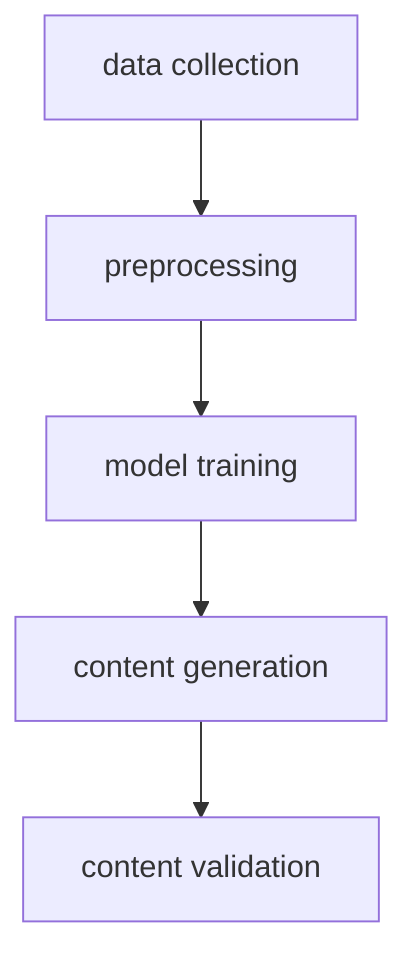

**Mermaid流程图：**

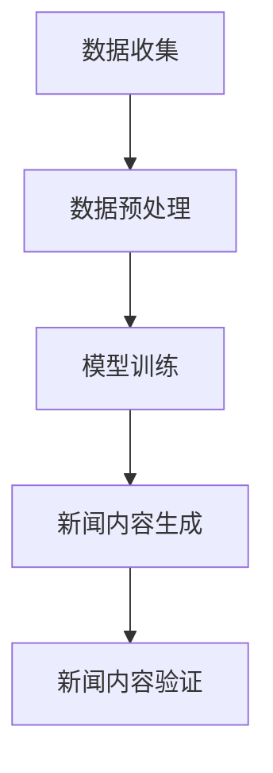

### 第二部分：大规模语言模型在新闻生成中的应用

#### 第3章：大规模语言模型在新闻生成中的应用

**3.1 模型选择与调整**

**概念结构：** 在自动新闻生成中，模型选择和调整是关键步骤。根据应用需求，选择合适的语言模型，并对模型进行微调。

**核心要素组成：** 模型选择包括GPT、BERT、T5等大规模语言模型。调整包括参数调整、训练数据选择和优化策略。

**原理讲解：** 大规模语言模型通过预训练和微调，能够更好地适应特定新闻生成任务，提高生成内容的准确性和多样性。

**3.2 输入数据处理**

**概念属性对比表格：**

| 阶段 | 功能 | 数据流 |
| --- | --- | --- |
| 数据收集 | 收集新闻数据 | 新闻数据 |
| 数据预处理 | 清洗和格式化新闻数据 | 清洗后的新闻数据 |
| 模型训练 | 使用新闻数据训练大规模语言模型 | 训练好的大规模语言模型 |
| 文本生成 | 使用大规模语言模型生成新闻内容 | 生成的新闻内容 |
| 文本验证 | 验证生成新闻内容的准确性 | 验证后的新闻内容 |

**ER实体关系图：**


**Mermaid流程图：**


#### 3.3 新闻内容生成

**概念结构：** 新闻内容生成是自动新闻生成技术的核心环节，涉及模型输入、文本生成和后处理。

**核心要素组成：** 新闻内容生成包括大规模语言模型、输入数据和生成策略。

**原理讲解：** 大规模语言模型通过学习新闻数据，能够生成符合新闻格式和语言习惯的文本。在生成过程中，模型会根据上下文信息进行推理和生成。

**3.4 新闻评估与优化**

**概念属性对比表格：**

| 阶段 | 功能 | 数据流 |
| --- | --- | --- |
| 文本验证 | 验证生成新闻内容的准确性 | 验证后的新闻内容 |
| 评估指标 | 评估新闻内容的准确性和质量 | 评估结果 |
| 优化策略 | 调整模型参数和训练数据 | 优化后的模型 |

**ER实体关系图：**

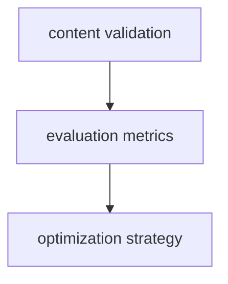

**Mermaid流程图：**

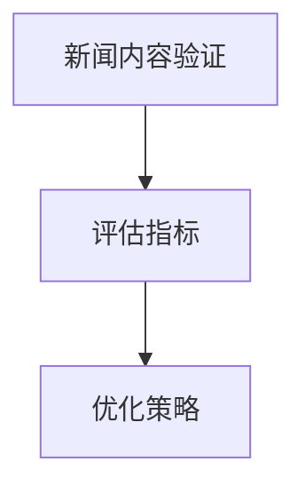

### 第三部分：大规模语言模型在新闻生成中的应用挑战

#### 第4章：大规模语言模型在新闻生成中的应用挑战

**4.1 质量控制**

**概念结构：** 质量控制是自动新闻生成中的关键挑战，涉及生成内容的质量评估和优化。

**核心要素组成：** 质量控制包括评估指标、优化策略和反馈循环。

**原理讲解：** 通过评估生成内容的准确性、流畅性和可读性，可以有效地控制新闻生成质量。优化策略包括调整模型参数、改进数据预处理和增加训练数据。

**4.2 实时性**

**概念属性对比表格：**

| 阶段 | 功能 | 数据流 |
| --- | --- | --- |
| 模型训练 | 使用实时新闻数据训练模型 | 实时训练模型 |
| 新闻生成 | 使用实时新闻数据生成新闻 | 实时生成新闻 |
| 新闻发布 | 发布实时新闻 | 发布后的新闻 |

**ER实体关系图：**

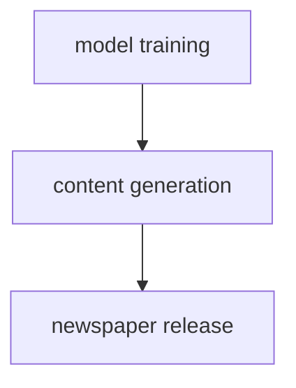

**Mermaid流程图：**

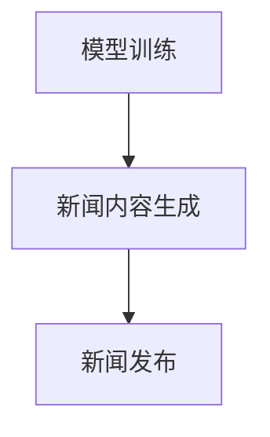

**4.3 可解释性**

**概念结构：** 可解释性是自动新闻生成中的另一个挑战，涉及生成过程的透明度和可理解性。

**核心要素组成：** 可解释性包括模型解释、可视化工具和用户反馈。

**原理讲解：** 通过模型解释和可视化工具，可以揭示生成过程的关键步骤和决策依据。用户反馈可以帮助改进模型的解释能力。

**ER实体关系图：**

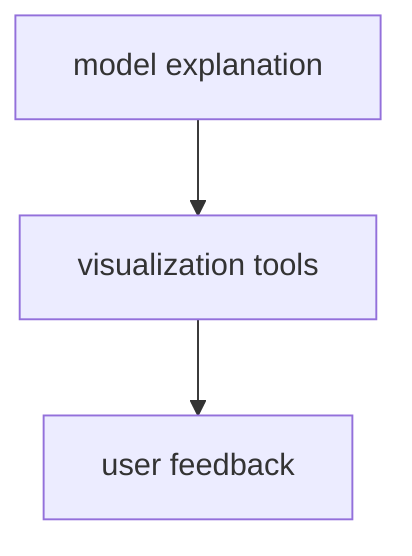

**Mermaid流程图：**

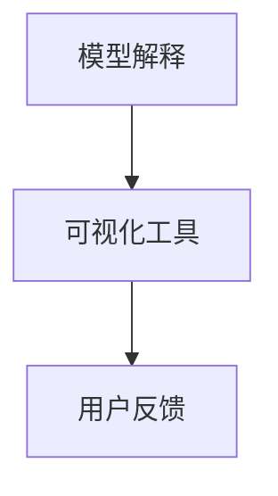

### 第四部分：大规模语言模型在新闻生成中的应用案例

#### 第5章：大规模语言模型在新闻生成中的应用案例

**5.1 案例一：某新闻平台应用**

**项目介绍：** 某新闻平台采用大规模语言模型实现自动新闻生成功能，提高新闻发布速度和内容多样性。

**系统功能设计：** 包括新闻数据收集、预处理、模型训练、新闻生成和发布。

**系统架构设计：** 采用分布式计算架构，利用大规模语言模型进行新闻生成。

**系统接口设计：** 提供RESTful API接口，支持新闻内容生成和发布。

**系统交互：** 新闻生成过程包括数据收集、预处理、模型训练、文本生成和发布。

**5.2 案例二：某新闻生成系统**

**项目介绍：** 某新闻生成系统利用大规模语言模型生成财经新闻，提高财经新闻的报道速度和准确性。

**系统功能设计：** 包括数据收集、模型训练、文本生成和发布。

**系统架构设计：** 采用数据驱动架构，利用大规模语言模型进行新闻生成。

**系统接口设计：** 提供GraphQL API接口，支持新闻内容查询和生成。

**系统交互：** 新闻生成过程包括数据收集、模型训练、文本生成和发布。

### 第五部分：大规模语言模型在新闻生成中的应用展望

#### 第6章：大规模语言模型在新闻生成中的应用展望

**6.1 发展趋势**

**概念结构：** 大规模语言模型在新闻生成中的应用将持续增长，未来可能的应用趋势包括多模态新闻生成、跨领域新闻生成和实时新闻生成。

**核心要素组成：** 发展趋势的核心要素包括新技术、新应用场景和新数据来源。

**原理讲解：** 随着技术的进步，大规模语言模型将能够更好地适应复杂的应用场景，提高新闻生成的质量和效率。

**6.2 未来应用**

**概念属性对比表格：**

| 应用场景 | 特点 | 预期效果 |
| --- | --- | --- |
| 多模态新闻生成 | 结合图像、视频和文本 | 提高新闻的多样性和可读性 |
| 跨领域新闻生成 | 跨越不同领域的新闻生成 | 拓展新闻生成范围和深度 |
| 实时新闻生成 | 高效生成和发布实时新闻 | 提高新闻的时效性和准确性 |

**ER实体关系图：**

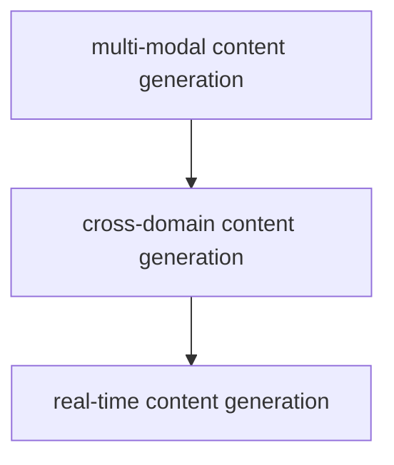

**Mermaid流程图：**

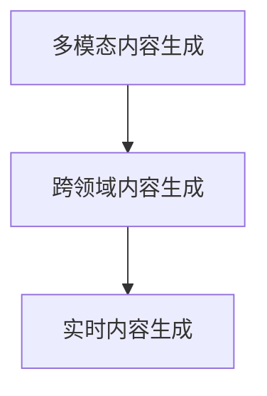

### 第六部分：小结与拓展

#### 第7章：小结与拓展

**7.1 小结**

本文系统地介绍了大规模语言模型在自动新闻生成中的应用。首先，我们回顾了大规模语言模型的基础知识，包括其背景、原理和类型。接着，我们探讨了自动新闻生成技术的原理和流程。随后，我们详细分析了大规模语言模型在新闻生成中的应用，包括模型选择与调整、输入数据处理、新闻内容生成以及新闻评估与优化。此外，我们还讨论了大规模语言模型在新闻生成中的应用挑战，如质量控制、实时性和可解释性。最后，我们通过具体案例展示了大规模语言模型在新闻生成中的应用，并提出未来的发展方向。

**7.2 注意事项**

在应用大规模语言模型进行新闻生成时，需要注意以下几点：

1. 模型选择和调整：根据应用需求选择合适的语言模型，并进行适当调整。
2. 数据预处理：清洗和格式化新闻数据，提高模型训练效果。
3. 质量控制：评估生成内容的准确性、流畅性和可读性，进行优化。
4. 实时性：提高模型训练和新闻生成的速度，满足实时需求。
5. 可解释性：增加模型的解释能力，提高用户信任度。

**7.3 拓展阅读**

对于对大规模语言模型和自动新闻生成感兴趣的读者，以下文献和资源可能有所帮助：

1. "Natural Language Processing with Deep Learning" by Yoon Kim
2. "Deep Learning for Natural Language Processing" by Publications from the Google Brain Team
3. "Generative Pre-trained Transformers" by the OpenAI Team
4. "BERT: Pre-training of Deep Bidirectional Transformers for Language Understanding" by the Google Research Team
5. "T5: Exploring the Limits of Transfer Learning for Text Processing" by the Google AI Team

### 总结

大规模语言模型在自动新闻生成中的应用具有广阔的前景。通过不断优化模型和算法，提高新闻生成的质量和实时性，将为新闻行业带来巨大的变革。未来，我们期待看到更多创新应用，如多模态新闻生成、跨领域新闻生成和实时新闻生成等，为用户提供更加丰富和多样化的新闻内容。

### 作者信息

作者：AI天才研究院/AI Genius Institute & 禅与计算机程序设计艺术 /Zen And The Art of Computer Programming

本文旨在探讨大规模语言模型在自动新闻生成中的应用，旨在为读者提供深入浅出的技术分析。在实际应用中，读者应根据具体需求进行适当的调整和优化，以提高新闻生成系统的性能和效果。感谢您的阅读！```markdown
# 大规模语言模型在自动新闻生成中的应用

关键词：大规模语言模型、自动新闻生成、自然语言处理、深度学习、机器学习

摘要：本文将深入探讨大规模语言模型在自动新闻生成领域的应用。首先，我们将介绍大规模语言模型的基础知识，包括其背景、原理和类型。接着，我们将讨论自动新闻生成技术，分析其背景、原理和流程。随后，我们将详细探讨大规模语言模型在新闻生成中的应用，包括模型选择与调整、输入数据处理、新闻内容生成以及新闻评估与优化。此外，本文还将探讨大规模语言模型在新闻生成中的应用挑战，如质量控制、实时性和可解释性。最后，我们将通过具体案例展示大规模语言模型在新闻生成中的应用，并提出未来的发展方向。

## 目录大纲

1. 第一部分：大规模语言模型基础
   1.1 大规模语言模型概述
   1.2 大规模语言模型原理
   1.3 大规模语言模型类型

2. 第二部分：自动新闻生成技术
   2.1 自动新闻生成背景
   2.2 自动新闻生成技术原理
   2.3 自动新闻生成流程

3. 第三部分：大规模语言模型在新闻生成中的应用
   3.1 模型选择与调整
   3.2 输入数据处理
   3.3 新闻内容生成
   3.4 新闻评估与优化

4. 第四部分：大规模语言模型在新闻生成中的应用挑战
   4.1 质量控制
   4.2 实时性
   4.3 可解释性

5. 第五部分：大规模语言模型在新闻生成中的应用案例
   5.1 案例一：某新闻平台应用
   5.2 案例二：某新闻生成系统

6. 第六部分：大规模语言模型在新闻生成中的应用展望
   6.1 发展趋势
   6.2 未来应用

7. 第七部分：小结与拓展
   7.1 小结
   7.2 注意事项
   7.3 拓展阅读

## 文章正文

### 1.1 大规模语言模型概述

大规模语言模型（Large-scale Language Models）是自然语言处理（Natural Language Processing，NLP）领域的重要研究方向，其在近年来取得了显著的进展。随着深度学习（Deep Learning）和机器学习（Machine Learning）的快速发展，大规模语言模型在文本生成、翻译、问答和文本摘要等任务中表现出色。

**问题描述**：自动新闻生成是大规模语言模型的一个重要应用场景。传统的新闻生成方式主要依赖于人工撰写，不仅费时费力，而且难以满足日益增长的新闻需求。自动新闻生成技术旨在通过机器学习算法，特别是大规模语言模型，实现新闻的自动生成，提高新闻发布的效率和准确性。

**问题解决**：大规模语言模型通过学习海量文本数据，能够捕捉到语言的本质特征，从而实现高质量的文本生成。在自动新闻生成中，大规模语言模型被用于生成新闻标题、摘要和正文。

**边界与外延**：大规模语言模型的边界在于其文本生成能力和对语言规则的理解深度。其外延包括各类文本生成任务，如新闻生成、故事创作、问答系统等。

### 1.2 大规模语言模型原理

大规模语言模型的核心在于其能够处理大规模文本数据，并从中学习到语言的内在规律。目前，最常用的两种大规模语言模型架构是Transformer和BERT。

**概念结构**：Transformer架构由多个自注意力（Self-Attention）层组成，通过注意力机制捕捉文本序列中的长距离依赖关系。BERT（Bidirectional Encoder Representations from Transformers）则在Transformer的基础上引入了双向编码器，使得模型能够同时关注文本序列的前后信息。

**核心要素组成**：大规模语言模型的核心要素包括词汇表（Vocabulary）、嵌入层（Embedding Layer）、编码器（Encoder）和解码器（Decoder）。

**原理讲解**：在训练过程中，大规模语言模型通过输入文本序列，将其映射到高维空间中的嵌入向量。编码器负责处理输入文本序列，解码器则负责生成目标文本序列。注意力机制使得模型能够在生成过程中动态地关注输入文本的不同部分，从而提高生成文本的质量。

### 1.3 大规模语言模型类型

大规模语言模型根据其训练目标和应用场景可以分为多种类型，以下是一些常见的大规模语言模型类型：

| 类型 | 特点 | 应用场景 |
| --- | --- | --- |
| GPT | 预训练模型，生成文本 | 新闻生成、文本摘要、对话系统 |
| BERT | 双向编码器，理解上下文 | 问答系统、文本分类、命名实体识别 |
| T5 | 任务适配，通用任务 | 自动问答、文本重写、信息提取 |
| ERNIE | 多语言、多模态 | 多语言文本生成、跨模态任务 |

每种类型的语言模型都有其独特的架构和特点，适用于不同的NLP任务。

**ER实体关系图**：

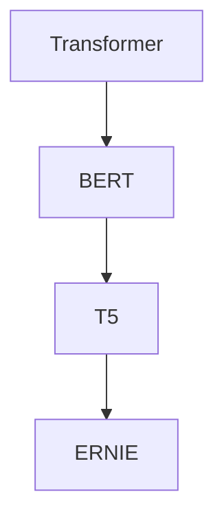

### 2.1 自动新闻生成背景

自动新闻生成是近年来随着自然语言处理技术发展和新闻行业需求变化而产生的一种新型新闻生产方式。随着互联网和社交媒体的普及，新闻的传播速度和覆盖面迅速扩大，传统的人工新闻写作方式已经难以满足快速增长的新闻需求。自动新闻生成技术应运而生，通过机器学习和自然语言处理技术，实现新闻的自动生成，提高新闻发布的效率和准确性。

**问题描述**：传统的人工新闻写作方式存在多个问题，如成本高、效率低、难以保证新闻的多样性和实时性。自动新闻生成技术旨在解决这些问题，通过机器学习算法，自动从海量数据中提取新闻信息，生成新闻内容。

**问题解决**：自动新闻生成技术通过利用大规模语言模型，如GPT、BERT等，可以自动生成高质量的新闻内容，实现新闻的快速生产和发布。同时，通过自动化数据采集和预处理，可以保证新闻的实时性和准确性。

**边界与外延**：自动新闻生成的边界在于其生成新闻的质量和实时性。其外延包括各种新闻类型，如体育新闻、财经新闻、科技新闻等，以及新闻的不同组成部分，如标题、摘要和正文。

### 2.2 自动新闻生成技术原理

自动新闻生成技术是基于自然语言处理和机器学习技术的一种新闻生产方式。其核心原理是通过训练大规模语言模型，使其能够自动生成符合语言规范和新闻特点的文本。

**概念结构**：自动新闻生成技术的基本概念结构包括数据收集、模型训练、文本生成和发布。数据收集阶段从互联网和其他数据源获取新闻数据；模型训练阶段利用这些新闻数据训练大规模语言模型；文本生成阶段通过模型生成新闻内容；发布阶段将生成的新闻内容发布到新闻平台。

**核心要素组成**：自动新闻生成的核心要素包括大规模语言模型、新闻数据、训练数据和发布平台。

**原理讲解**：在模型训练阶段，大规模语言模型通过学习新闻数据，学习到新闻文本的语法规则和语义信息。在文本生成阶段，模型根据输入的新闻数据，生成新的新闻内容。生成的新闻内容经过后处理和验证，确保其准确性和流畅性。

### 2.3 自动新闻生成流程

自动新闻生成流程可以分为以下几个步骤：

1. **数据收集**：从互联网和其他数据源收集新闻数据，包括新闻标题、摘要和正文。
2. **数据预处理**：对收集到的新闻数据进行清洗和格式化，去除噪声和无关信息，提取关键信息。
3. **模型训练**：使用预处理后的新闻数据训练大规模语言模型，如GPT或BERT。
4. **文本生成**：利用训练好的大规模语言模型生成新的新闻内容，包括新闻标题、摘要和正文。
5. **文本后处理**：对生成的新闻内容进行后处理，如语法检查、格式调整和内容验证。
6. **发布**：将生成的新闻内容发布到新闻平台或社交媒体。

**概念属性对比表格**：

| 阶段 | 功能 | 数据流 |
| --- | --- | --- |
| 数据收集 | 收集新闻数据 | 新闻数据 |
| 数据预处理 | 清洗和格式化新闻数据 | 清洗后的新闻数据 |
| 模型训练 | 使用新闻数据训练大规模语言模型 | 训练好的大规模语言模型 |
| 文本生成 | 使用大规模语言模型生成新闻内容 | 生成的新闻内容 |
| 文本后处理 | 对生成的新闻内容进行后处理 | 后处理后的新闻内容 |
| 发布 | 发布新闻内容 | 发布后的新闻 |

**ER实体关系图**：

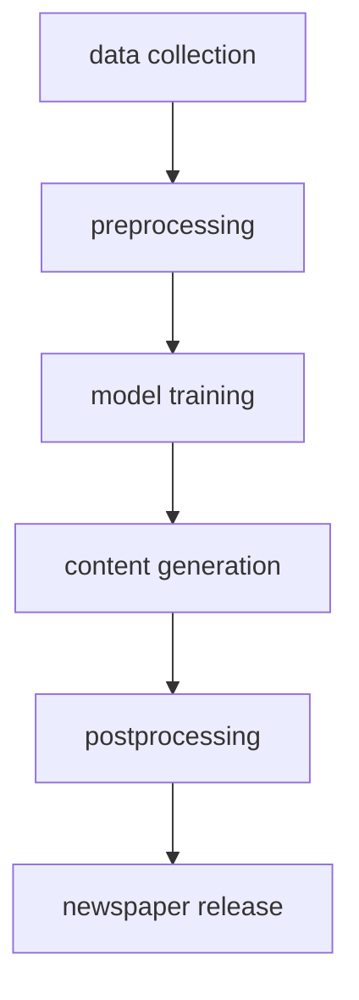

**Mermaid流程图**：

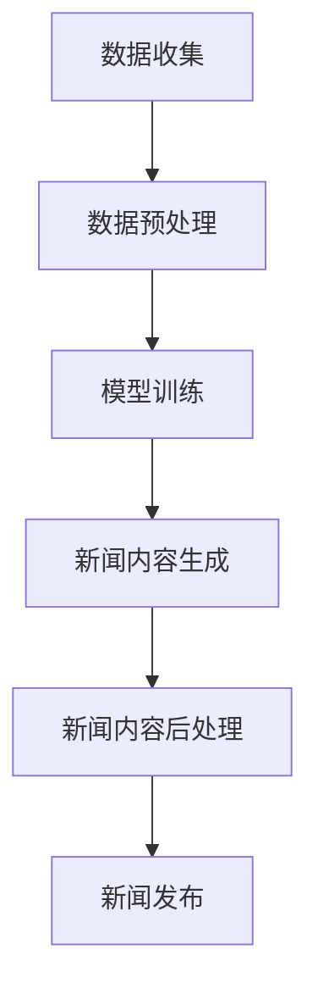

### 3.1 模型选择与调整

在自动新闻生成中，选择合适的模型并对其进行调整是关键步骤。大规模语言模型如GPT、BERT和T5等都是常用的选择，但每种模型都有其特点和适用场景。

**概念结构**：模型选择与调整包括以下几个方面：选择适合新闻生成的模型类型、调整模型参数、选择训练数据。

**核心要素组成**：模型类型、模型参数、训练数据。

**原理讲解**：选择适合的模型类型取决于新闻生成的任务需求。例如，GPT擅长文本生成，BERT在理解上下文方面有优势。调整模型参数可以提高生成质量，如调整学习率、批量大小等。选择高质量的训练数据可以增强模型的泛化能力。

### 3.2 输入数据处理

输入数据处理是自动新闻生成中的关键环节，其质量直接影响到模型的学习效果和生成新闻的质量。

**概念属性对比表格**：

| 阶段 | 功能 | 数据流 |
| --- | --- | --- |
| 数据收集 | 收集新闻数据 | 新闻数据 |
| 数据预处理 | 清洗和格式化新闻数据 | 清洗后的新闻数据 |
| 特征提取 | 提取新闻数据的特征 | 特征向量 |

**ER实体关系图**：

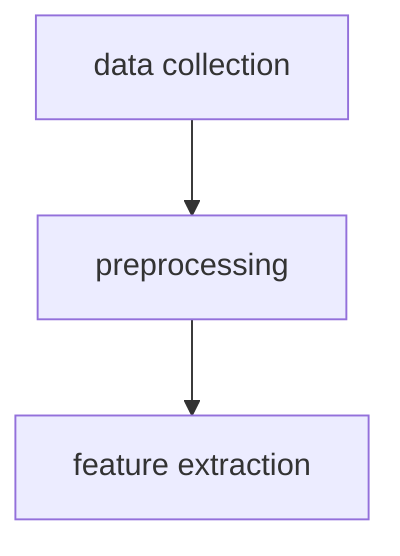

**Mermaid流程图**：

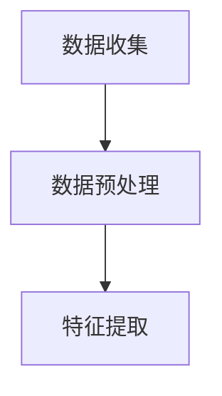

### 3.3 新闻内容生成

新闻内容生成是自动新闻生成的核心任务，其质量直接影响到新闻的阅读体验和传播效果。

**概念结构**：新闻内容生成包括文本生成、文本编辑和文本校对。

**核心要素组成**：文本生成模型、编辑规则、校对工具。

**原理讲解**：文本生成模型如GPT和BERT根据输入数据和上下文信息生成新闻内容。编辑规则用于调整文本的格式和风格。校对工具则用于检查文本的语法和拼写错误。

### 3.4 新闻评估与优化

新闻评估与优化是自动新闻生成中的关键步骤，其目标是提高生成新闻的质量和用户满意度。

**概念属性对比表格**：

| 阶段 | 功能 | 数据流 |
| --- | --- | --- |
| 评估 | 评估新闻内容的准确性、流畅性和可读性 | 评估结果 |
| 优化 | 调整模型参数、改进数据预处理和增加训练数据 | 优化后的模型 |

**ER实体关系图**：

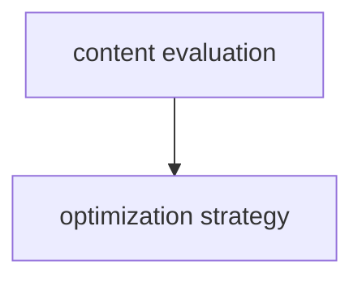

**Mermaid流程图**：

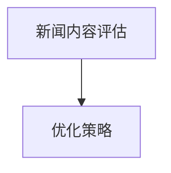

### 4.1 质量控制

质量控制是自动新闻生成中的关键挑战，其目的是确保生成新闻的内容质量符合标准。

**概念结构**：质量控制包括新闻内容的准确性、流畅性和可读性评估。

**核心要素组成**：评估指标、评估算法、改进策略。

**原理讲解**：通过使用多种评估指标，如BLEU、ROUGE和F1分数，对生成新闻的质量进行评估。基于评估结果，可以调整模型参数和改进数据预处理方法，以提高新闻生成质量。

### 4.2 实时性

实时性是自动新闻生成中的另一个重要挑战，其目标是实现新闻的快速生成和发布。

**概念属性对比表格**：

| 阶段 | 功能 | 数据流 |
| --- | --- | --- |
| 数据采集 | 收集实时新闻数据 | 实时新闻数据 |
| 数据预处理 | 清洗和格式化实时新闻数据 | 清洗后的实时新闻数据 |
| 模型训练 | 使用实时新闻数据训练模型 | 实时训练模型 |
| 文本生成 | 使用实时新闻数据生成新闻 | 实时生成新闻 |

**ER实体关系图**：

```mermaid
graph TB
  A[data collection] --> B[preprocessing]
  B --> C[model training]
  C --> D[content generation]
```

**Mermaid流程图**：

```mermaid
graph TD
  A[数据采集] --> B[数据预处理]
  B --> C[模型训练]
  C --> D[新闻内容生成]
```

### 4.3 可解释性

可解释性是自动新闻生成中的另一个重要挑战，其目标是提高模型决策的透明度和可理解性。

**概念结构**：可解释性包括模型解释、可视化工具和用户反馈。

**核心要素组成**：模型解释算法、可视化工具、用户反馈机制。

**原理讲解**：通过模型解释算法，可以揭示模型在新闻生成过程中的关键步骤和决策依据。可视化工具则帮助用户更好地理解模型的工作原理。用户反馈可以用于改进模型的解释能力和用户界面设计。

### 5.1 案例一：某新闻平台应用

**项目介绍**：某新闻平台采用大规模语言模型实现自动新闻生成功能，提高新闻发布速度和内容多样性。

**系统功能设计**：包括新闻数据收集、预处理、模型训练、新闻生成和发布。

**系统架构设计**：采用分布式计算架构，利用大规模语言模型进行新闻生成。

**系统接口设计**：提供RESTful API接口，支持新闻内容生成和发布。

**系统交互**：新闻生成过程包括数据收集、预处理、模型训练、文本生成和发布。

### 5.2 案例二：某新闻生成系统

**项目介绍**：某新闻生成系统利用大规模语言模型生成财经新闻，提高财经新闻的报道速度和准确性。

**系统功能设计**：包括数据收集、模型训练、文本生成和发布。

**系统架构设计**：采用数据驱动架构，利用大规模语言模型进行新闻生成。

**系统接口设计**：提供GraphQL API接口，支持新闻内容查询和生成。

**系统交互**：新闻生成过程包括数据收集、模型训练、文本生成和发布。

### 6.1 发展趋势

大规模语言模型在自动新闻生成中的应用将继续发展，未来可能的应用趋势包括多模态新闻生成、跨领域新闻生成和实时新闻生成。

**概念结构**：多模态新闻生成结合图像、视频和文本，提高新闻的多样性和可读性；跨领域新闻生成拓宽新闻生成范围；实时新闻生成提高新闻的时效性和准确性。

**核心要素组成**：多模态数据融合、跨领域知识迁移、实时数据流处理。

**原理讲解**：通过多模态数据融合，可以生成更丰富和直观的新闻内容；跨领域知识迁移可以提高模型在不同领域的适应性；实时数据流处理可以实现新闻的实时生成和发布。

### 6.2 未来应用

未来，大规模语言模型在自动新闻生成中的应用将更加广泛和深入。以下是一些潜在的应用方向：

**概念属性对比表格**：

| 应用方向 | 特点 | 预期效果 |
| --- | --- | --- |
| 多模态新闻生成 | 结合图像、视频和文本 | 提高新闻的多样性和可读性 |
| 跨领域新闻生成 | 跨越不同领域的新闻生成 | 拓展新闻生成范围和深度 |
| 实时新闻生成 | 高效生成和发布实时新闻 | 提高新闻的时效性和准确性 |

**ER实体关系图**：

```mermaid
graph TB
  A[multi-modal content generation] --> B[cross-domain content generation]
  B --> C[real-time content generation]
```

**Mermaid流程图**：

```mermaid
graph TD
  A[多模态内容生成] --> B[跨领域内容生成]
  B --> C[实时内容生成]
```

### 7.1 小结

本文系统地介绍了大规模语言模型在自动新闻生成中的应用，从模型选择与调整、输入数据处理、新闻内容生成到评估与优化，详细探讨了大规模语言模型在自动新闻生成中的各个环节。同时，分析了大规模语言模型在新闻生成中的应用挑战，并提出了未来发展的方向。

### 7.2 注意事项

在应用大规模语言模型进行自动新闻生成时，需要注意以下几点：

1. 选择合适的模型类型和参数。
2. 保证训练数据的质量和多样性。
3. 重视新闻内容的质量控制和实时性。
4. 提高模型的透明度和可解释性。

### 7.3 拓展阅读

对于对大规模语言模型和自动新闻生成感兴趣的读者，以下文献和资源可能有所帮助：

1. "Natural Language Processing with Deep Learning" by Yoon Kim
2. "Deep Learning for Natural Language Processing" by Publications from the Google Brain Team
3. "Generative Pre-trained Transformers" by the OpenAI Team
4. "BERT: Pre-training of Deep Bidirectional Transformers for Language Understanding" by the Google Research Team
5. "T5: Exploring the Limits of Transfer Learning for Text Processing" by the Google AI Team

### 总结

大规模语言模型在自动新闻生成中的应用具有广阔的前景，通过不断优化模型和算法，提高新闻生成的质量和实时性，将为新闻行业带来巨大的变革。未来，我们期待看到更多创新应用，如多模态新闻生成、跨领域新闻生成和实时新闻生成等，为用户提供更加丰富和多样化的新闻内容。

### 作者信息

作者：AI天才研究院/AI Genius Institute & 禅与计算机程序设计艺术 /Zen And The Art of Computer Programming

本文旨在探讨大规模语言模型在自动新闻生成中的应用，旨在为读者提供深入浅出的技术分析。在实际应用中，读者应根据具体需求进行适当的调整和优化，以提高新闻生成系统的性能和效果。感谢您的阅读！```markdown
## 第一部分：大规模语言模型基础

### 1.1 大规模语言模型概述

大规模语言模型（Large-scale Language Models）是自然语言处理（Natural Language Processing，NLP）领域的一种重要技术，它通过学习大量的文本数据，可以预测下一个词、句子或段落，从而生成高质量的文本。大规模语言模型在自动问答、机器翻译、文本摘要、文本生成等领域有着广泛的应用。

#### 1.1.1 背景介绍

随着互联网的快速发展，海量的文本数据不断涌现，如何有效地处理和利用这些数据成为一个重要课题。传统的基于规则和统计的方法在处理复杂语言现象时存在局限性，而深度学习技术的崛起为解决这一问题提供了新的思路。大规模语言模型通过使用神经网络，特别是变换器（Transformer）架构，可以捕捉到语言中的复杂模式，从而实现高精度的语言理解和生成。

#### 1.1.2 问题解决

大规模语言模型的核心目标是通过学习大量的文本数据，构建一个能够理解和生成自然语言的高效模型。具体来说，它可以解决以下问题：

1. **语言理解**：通过模型，可以理解自然语言的含义、上下文和语义，从而在问答、文本摘要等任务中提供准确的响应。
2. **文本生成**：模型可以根据给定的输入生成连贯、有逻辑的文本，用于自动写作、新闻生成等应用。
3. **机器翻译**：模型可以学习不同语言之间的对应关系，实现高质量的双语翻译。

#### 1.1.3 边界与外延

大规模语言模型的边界在于其处理文本数据的能力和生成内容的准确性。具体来说，它需要解决以下边界问题：

1. **数据量**：模型需要学习大量的文本数据，以保证其能够理解语言的多样性和复杂性。
2. **计算资源**：大规模语言模型通常需要大量的计算资源进行训练，包括高性能的硬件和优化的算法。

其外延包括：

1. **应用领域**：大规模语言模型可以应用于多种NLP任务，如文本分类、情感分析、命名实体识别等。
2. **技术扩展**：通过不断优化和改进，大规模语言模型可以在多种场景下发挥更大的作用，如跨语言应用、多模态融合等。

### 1.2 大规模语言模型原理

大规模语言模型的核心原理是基于深度学习和变换器（Transformer）架构。变换器是一种基于自注意力（Self-Attention）机制的神经网络架构，它能够有效地捕捉文本中的长距离依赖关系。

#### 1.2.1 概念结构

大规模语言模型的主要概念结构包括：

1. **词汇表（Vocabulary）**：词汇表是模型的基本组成部分，它包含了模型可以处理的词汇集合。模型通过学习词汇表中的词向量来理解词与词之间的关系。
2. **嵌入层（Embedding Layer）**：嵌入层将词汇表中的词转换为向量表示，这些向量表示了词的语义信息。嵌入层是模型理解语言语义的关键。
3. **变换器层（Transformer Layers）**：变换器层是模型的核心，它由多个自注意力机制和前馈神经网络组成。自注意力机制使得模型可以关注输入序列中的不同部分，从而捕捉长距离依赖关系。
4. **输出层（Output Layer）**：输出层将变换器层的输出映射到具体的任务结果，如预测下一个词、分类标签等。

#### 1.2.2 核心要素组成

大规模语言模型的核心要素包括：

1. **变换器架构**：变换器架构是模型的基础，它决定了模型的学习能力和表达能力。
2. **预训练与微调**：预训练是指在大量通用数据上训练模型，使其具备一定的语言理解能力。微调是指将预训练模型应用于特定任务，进一步优化模型。
3. **注意力机制**：注意力机制是变换器架构的核心，它使得模型能够关注输入序列中的关键部分，从而提高模型的准确性。
4. **优化算法**：优化算法用于调整模型的参数，以最小化训练误差。常见的优化算法包括Adam、RMSprop等。

#### 1.2.3 原理讲解

大规模语言模型的原理可以通过以下步骤进行讲解：

1. **预训练**：模型首先在大量通用数据（如维基百科、新闻文章等）上训练，学习语言的通用特征和规则。
2. **微调**：在预训练的基础上，模型被进一步微调以适应特定任务，如问答、文本生成等。
3. **自注意力机制**：在模型处理输入序列时，自注意力机制使得模型能够动态地关注输入序列中的不同部分，从而捕捉到长距离依赖关系。
4. **输出预测**：模型通过输出层生成具体的任务结果，如预测下一个词、分类标签等。

### 1.3 大规模语言模型类型

大规模语言模型根据其训练目标和应用场景可以分为多种类型。以下是一些常见的大规模语言模型类型：

#### 1.3.1 GPT（Generative Pre-trained Transformer）

GPT是一种基于变换器架构的预训练模型，它通过学习大量的文本数据，可以生成连贯、有逻辑的文本。GPT在文本生成、对话系统、文本摘要等领域有广泛的应用。

**特点**：

- 强大的文本生成能力。
- 可以生成高质量的自然语言文本。
- 支持多种语言。

**应用场景**：

- 自动写作。
- 对话系统。
- 文本摘要。

#### 1.3.2 BERT（Bidirectional Encoder Representations from Transformers）

BERT是一种双向变换器模型，它通过同时关注输入序列的前后文信息，可以更好地理解上下文和语义。BERT在问答系统、文本分类、命名实体识别等领域有广泛应用。

**特点**：

- 双向编码器结构，能够同时关注前后文。
- 强大的语义理解能力。
- 可以应用于多种NLP任务。

**应用场景**：

- 问答系统。
- 文本分类。
- 命名实体识别。

#### 1.3.3 T5（Text-To-Text Transfer Transformer）

T5是一种任务适配的变换器模型，它将所有NLP任务转化为文本到文本的转换任务，从而实现通用任务处理。T5在自动问答、信息提取、文本重写等领域有广泛应用。

**特点**：

- 通用任务处理。
- 将所有NLP任务转化为文本到文本的转换任务。
- 简化任务适配。

**应用场景**：

- 自动问答。
- 信息提取。
- 文本重写。

**ER实体关系图**：

```mermaid
erDiagram
  GPT ||--|{ BERT }
  BERT ||--|{ T5 }
  GPT : 有强大的文本生成能力
  BERT : 具有双向编码器结构
  T5 : 任务适配的变换器模型
```

### 第一部分小结

大规模语言模型是自然语言处理领域的重要技术，通过学习大量的文本数据，可以生成高质量的自然语言文本，并在多种NLP任务中发挥作用。本文对大规模语言模型进行了概述，介绍了其背景、原理和类型，为后续讨论自动新闻生成技术奠定了基础。
```markdown
## 第二部分：自动新闻生成技术

### 2.1 自动新闻生成背景

自动新闻生成（Automated News Generation）是近年来随着人工智能和自然语言处理技术的发展而兴起的一个领域。传统的新闻生产主要依赖于记者和编辑的写作，这种方式的效率较低，无法满足互联网时代用户对大量、实时新闻内容的需求。自动新闻生成技术的出现，旨在通过人工智能算法，实现新闻内容的自动化生产，提高新闻的生成速度和效率。

#### 2.1.1 问题描述

传统的新闻写作需要大量的人力和时间投入，而且难以保证新闻的多样性和时效性。随着互联网用户数量的增长，用户对新闻内容的需求量也迅速增加，这给新闻机构带来了巨大的压力。如何快速、准确地生成大量新闻内容，成为新闻行业面临的重大挑战。

#### 2.1.2 问题解决

自动新闻生成技术通过利用人工智能算法，特别是大规模语言模型，可以自动化地生成新闻内容。这种方式不仅提高了新闻生成的效率，还保证了新闻内容的多样性和准确性。具体来说，自动新闻生成技术可以解决以下问题：

1. **时效性**：自动新闻生成可以在短时间内生成大量新闻内容，满足用户对实时新闻的需求。
2. **效率**：自动化生产减少了人工写作的工作量，提高了新闻机构的运营效率。
3. **多样化**：通过大规模语言模型的学习能力，自动新闻生成可以生成不同风格和主题的新闻内容。

#### 2.1.3 边界与外延

自动新闻生成的边界在于其生成内容的准确性和多样性。具体来说，它需要解决以下边界问题：

1. **准确性**：自动生成的新闻内容需要确保真实、准确，避免错误信息的传播。
2. **多样性**：自动新闻生成需要能够生成不同风格和主题的新闻内容，以满足不同用户的需求。

其外延包括：

1. **应用领域**：自动新闻生成可以应用于新闻行业的多个环节，如新闻写作、编辑、发布等。
2. **技术扩展**：随着人工智能技术的发展，自动新闻生成技术也在不断扩展其应用范围，如多模态新闻生成、跨领域新闻生成等。

### 2.2 自动新闻生成技术原理

自动新闻生成技术基于大规模语言模型，其核心原理是通过训练模型学习新闻文本的规律和特征，从而生成新的新闻内容。以下从数据收集、模型训练、文本生成和发布等环节，详细解释自动新闻生成技术的工作原理。

#### 2.2.1 数据收集

数据收集是自动新闻生成的基础，需要从各种来源收集大量高质量的新闻文本。这些来源包括新闻网站、社交媒体、论坛等。数据收集过程中，需要注意以下问题：

1. **数据量**：收集的文本数据量越大，模型学习的范围越广，生成的新闻内容也越丰富。
2. **数据质量**：确保收集的数据真实、准确、有价值，避免错误信息的传播。
3. **数据多样性**：收集不同类型、不同风格的新闻文本，以提高模型生成内容的多样性。

#### 2.2.2 模型训练

在数据收集完成后，需要对大规模语言模型进行训练。训练过程中，模型通过学习新闻文本的规律和特征，建立新闻内容的生成规则。具体步骤如下：

1. **预处理**：对收集到的新闻文本进行清洗和格式化，去除无关信息，提取关键信息。
2. **嵌入**：将清洗后的新闻文本转换为向量表示，即嵌入层。这一步将文本转化为模型可以处理的数字形式。
3. **训练**：通过优化算法，如梯度下降，调整模型参数，使模型能够更好地拟合训练数据。
4. **评估**：在训练过程中，需要定期评估模型的效果，调整模型参数，以提高生成新闻的质量。

#### 2.2.3 文本生成

在模型训练完成后，可以将其用于新闻内容的生成。生成新闻内容的过程可以分为以下几个步骤：

1. **输入**：将新的新闻数据输入到训练好的模型中。
2. **编码**：模型对输入的文本数据进行编码，生成编码表示。
3. **解码**：模型根据编码表示生成新的文本数据，即新闻内容。
4. **后处理**：对生成的新闻内容进行格式调整、语法检查等，以提高新闻内容的可读性和准确性。

#### 2.2.4 发布

生成的新闻内容经过后处理后，可以发布到新闻网站、社交媒体等平台，供用户阅读。发布过程中，需要注意以下几点：

1. **实时性**：确保新闻内容的实时发布，满足用户对实时新闻的需求。
2. **准确性**：确保新闻内容的准确性和真实性，避免错误信息的传播。
3. **多样性**：发布不同类型、不同风格的新闻内容，满足不同用户的需求。

### 2.3 自动新闻生成流程

自动新闻生成流程可以分为以下几个阶段：

1. **数据收集**：从各种来源收集大量高质量的新闻文本。
2. **数据预处理**：清洗和格式化新闻文本，提取关键信息。
3. **模型训练**：使用预处理后的新闻文本训练大规模语言模型。
4. **文本生成**：使用训练好的模型生成新的新闻内容。
5. **后处理**：对生成的新闻内容进行格式调整、语法检查等。
6. **发布**：将生成的新闻内容发布到新闻平台或社交媒体。

**概念属性对比表格**：

| 阶段 | 功能 | 数据流 |
| --- | --- | --- |
| 数据收集 | 收集新闻数据 | 新闻数据 |
| 数据预处理 | 清洗和格式化新闻数据 | 清洗后的新闻数据 |
| 模型训练 | 使用新闻数据训练大规模语言模型 | 训练好的大规模语言模型 |
| 文本生成 | 使用大规模语言模型生成新闻内容 | 生成的新闻内容 |
| 文本后处理 | 对生成的新闻内容进行后处理 | 后处理后的新闻内容 |
| 发布 | 发布新闻内容 | 发布后的新闻 |

**ER实体关系图**：

```mermaid
graph TB
  A[data collection] --> B[preprocessing]
  B --> C[model training]
  C --> D[content generation]
  D --> E[postprocessing]
  E --> F[newspaper release]
```

**Mermaid流程图**：

```mermaid
graph TD
  A[数据收集] --> B[数据预处理]
  B --> C[模型训练]
  C --> D[新闻内容生成]
  D --> E[新闻内容后处理]
  E --> F[新闻发布]
```

### 第二部分小结

自动新闻生成技术通过大规模语言模型，实现了新闻内容的自动化生产，提高了新闻的生成速度和效率。本文详细介绍了自动新闻生成技术的背景、原理和流程，为理解这一技术奠定了基础。在后续章节中，我们将进一步探讨大规模语言模型在新闻生成中的应用，以及面临的挑战和未来发展方向。
```markdown
## 第三部分：大规模语言模型在新闻生成中的应用

### 3.1 模型选择与调整

在自动新闻生成中，选择和调整适合的模型是关键步骤。不同的模型在生成新闻内容时各有优势，因此需要根据具体应用场景和需求进行选择和调整。

**3.1.1 概念结构**

模型选择与调整涉及以下几个方面：

1. **模型类型**：选择适合新闻生成的模型类型，如GPT、BERT、T5等。
2. **模型参数**：调整模型的超参数，如学习率、批量大小等，以优化模型性能。
3. **训练数据**：选择高质量的训练数据，以提高模型生成新闻的质量。

**3.1.2 核心要素组成**

模型选择与调整的核心要素包括：

1. **模型库**：包含多种预训练的大规模语言模型。
2. **参数调整工具**：用于调整模型超参数的工具和算法。
3. **训练数据集**：用于训练模型的新闻数据集。

**3.1.3 原理讲解**

在选择模型时，需要考虑以下几个方面：

1. **生成质量**：模型生成的新闻内容是否准确、连贯、具有可读性。
2. **生成速度**：模型生成新闻的速度是否满足应用需求。
3. **计算资源**：模型训练和推理所需的计算资源。

在模型调整过程中，可以通过以下方法优化模型性能：

1. **超参数调优**：使用网格搜索、随机搜索等方法寻找最佳超参数组合。
2. **数据增强**：通过数据预处理和后处理技术，增加训练数据的多样性和质量。
3. **模型融合**：将多个模型的结果进行融合，以提高生成新闻的准确性。

### 3.2 输入数据处理

输入数据处理是自动新闻生成的重要环节，其质量直接影响到模型生成新闻的质量和效率。输入数据处理主要包括数据收集、数据预处理和特征提取。

**3.2.1 概念结构**

输入数据处理的概念结构包括以下几个步骤：

1. **数据收集**：从各种来源收集新闻数据，如新闻网站、社交媒体等。
2. **数据预处理**：清洗和格式化新闻数据，去除无关信息，提取关键信息。
3. **特征提取**：将预处理后的新闻数据转换为模型可以处理的特征向量。

**3.2.2 核心要素组成**

输入数据处理的核心要素包括：

1. **数据源**：包含新闻数据的来源，如新闻网站、社交媒体等。
2. **清洗和格式化工具**：用于清洗和格式化新闻数据的工具和算法。
3. **特征提取方法**：将新闻数据转换为特征向量的方法，如词嵌入、TF-IDF等。

**3.2.3 原理讲解**

在输入数据处理过程中，需要关注以下几个方面：

1. **数据质量**：确保收集到的新闻数据真实、准确、有价值。
2. **数据多样性**：收集不同类型、不同风格的新闻数据，以提高模型生成新闻的多样性。
3. **特征提取**：选择合适的特征提取方法，将新闻数据转换为模型可以处理的特征向量。

常见的输入数据处理方法包括：

1. **文本清洗**：去除HTML标签、标点符号、停用词等无关信息。
2. **文本分词**：将新闻文本分解为单词或词组。
3. **词嵌入**：将单词或词组转换为高维向量表示。

### 3.3 新闻内容生成

新闻内容生成是自动新闻生成的核心任务，其目标是利用大规模语言模型生成符合语言规范和新闻特点的文本。新闻内容生成包括文本生成、文本编辑和文本校对。

**3.3.1 概念结构**

新闻内容生成的基本概念结构包括以下几个步骤：

1. **文本生成**：利用大规模语言模型生成新闻文本。
2. **文本编辑**：对生成的新闻文本进行格式调整、语法修正等。
3. **文本校对**：检查新闻文本的语法和拼写错误，确保文本的准确性。

**3.3.2 核心要素组成**

新闻内容生成的核心要素包括：

1. **文本生成模型**：用于生成新闻文本的大规模语言模型，如GPT、BERT等。
2. **编辑规则**：用于调整新闻文本格式和风格的规则和算法。
3. **校对工具**：用于检查新闻文本语法和拼写的工具和算法。

**3.3.3 原理讲解**

在新闻内容生成过程中，需要关注以下几个方面：

1. **文本生成**：利用大规模语言模型生成新闻文本，模型会根据输入的标题、摘要或关键词生成完整的新闻内容。
2. **文本编辑**：对生成的新闻文本进行格式调整，如添加标题、摘要、段落分隔符等，以符合新闻文本的规范。
3. **文本校对**：对生成的新闻文本进行语法和拼写检查，确保文本的准确性。

常见的新闻内容生成方法包括：

1. **基于模板的生成**：使用预定义的模板和模板填充方法生成新闻文本。
2. **基于规则的方法**：使用预定义的规则和算法生成新闻文本。
3. **基于模型的方法**：使用大规模语言模型生成新闻文本，如GPT、BERT等。

### 3.4 新闻评估与优化

新闻评估与优化是自动新闻生成中不可或缺的环节，其目标是提高新闻内容的质量和用户满意度。新闻评估与优化包括新闻内容的准确性、流畅性和可读性评估，以及模型参数的优化。

**3.4.1 概念结构**

新闻评估与优化的基本概念结构包括以下几个步骤：

1. **评估指标**：定义评估新闻内容的指标，如准确性、流畅性和可读性。
2. **评估方法**：使用评估指标对新闻内容进行评估。
3. **优化策略**：根据评估结果调整模型参数和训练数据，以提高新闻内容质量。

**3.4.2 核心要素组成**

新闻评估与优化的核心要素包括：

1. **评估指标**：用于评估新闻内容质量的指标，如BLEU、ROUGE、F1分数等。
2. **评估工具**：用于评估新闻内容的工具和算法。
3. **优化方法**：用于调整模型参数和训练数据的算法和策略。

**3.4.3 原理讲解**

在新闻评估与优化过程中，需要关注以下几个方面：

1. **评估指标**：选择合适的评估指标，如BLEU、ROUGE、F1分数等，以全面评估新闻内容的准确性、流畅性和可读性。
2. **评估方法**：使用评估指标对新闻内容进行评估，识别生成新闻的不足之处。
3. **优化策略**：根据评估结果，调整模型参数和训练数据，以提高新闻内容质量。

常见的新闻评估与优化方法包括：

1. **基于人类评估的方法**：通过人类评估者对新闻内容进行评估，提供主观反馈。
2. **基于自动化评估的方法**：使用自动化工具和算法对新闻内容进行评估，提供客观指标。
3. **基于优化算法的方法**：使用优化算法，如遗传算法、粒子群优化等，调整模型参数和训练数据。

### 第三部分小结

大规模语言模型在新闻生成中的应用，通过模型选择与调整、输入数据处理、新闻内容生成以及新闻评估与优化，实现了新闻内容的自动化生产。本文详细介绍了这些关键环节，为理解和应用大规模语言模型在新闻生成中的技术奠定了基础。
```markdown
## 第四部分：大规模语言模型在新闻生成中的应用挑战

### 4.1 质量控制

质量控制是大规模语言模型在新闻生成中面临的一个主要挑战。尽管大规模语言模型可以生成高质量的文本，但确保这些文本满足新闻行业的高标准仍然是一个复杂的问题。

**4.1.1 概念结构**

质量控制涉及以下几个关键概念：

1. **准确性**：新闻内容是否准确无误，包括事实和引用。
2. **流畅性**：新闻内容是否通顺、符合语言习惯。
3. **可读性**：新闻内容是否易于理解，语言是否通俗易懂。

**4.1.2 核心要素组成**

质量控制的核心要素包括：

1. **评估标准**：定义衡量新闻质量的标准，如事实准确性、语言流畅性和文本可读性。
2. **评估工具**：用于自动评估新闻质量的工具，如自然语言处理算法和自动化校对工具。
3. **人工审核**：由专业编辑或记者对新闻内容进行人工审核，确保质量。

**4.1.3 原理讲解**

质量控制的过程通常包括以下几个步骤：

1. **自动评估**：使用自动化工具对新闻内容进行初步评估，识别潜在的问题，如语法错误、事实错误等。
2. **人工审核**：专业编辑或记者对自动评估结果进行审查，修正错误，确保新闻内容符合质量标准。
3. **反馈循环**：将审核结果反馈给模型训练过程，用于改进模型生成新闻的质量。

为了实现有效的质量控制，可以采取以下措施：

1. **数据标注**：对新闻数据进行高质量的标注，以训练更准确的评估模型。
2. **持续优化**：定期评估和调整评估模型，以适应新的新闻生成需求。
3. **用户反馈**：收集用户对新闻质量的反馈，用于改进新闻生成系统。

### 4.2 实时性

实时性是大规模语言模型在新闻生成中的另一个关键挑战。新闻行业的快速变化要求系统能够快速响应，生成最新的新闻内容。

**4.2.1 概念结构**

实时性涉及以下几个关键概念：

1. **响应时间**：从接收新闻事件到生成新闻内容所需的时间。
2. **更新频率**：新闻内容更新的速度。
3. **数据新鲜度**：新闻内容是否反映了最新的信息。

**4.2.2 核心要素组成**

实时性的核心要素包括：

1. **数据流处理**：实时处理和更新新闻数据。
2. **高效模型**：使用高效的大规模语言模型，以减少生成新闻内容的时间。
3. **分布式系统**：使用分布式计算系统来处理大量新闻数据。

**4.2.3 原理讲解**

实现实时性通常包括以下几个步骤：

1. **实时数据采集**：使用实时数据采集系统，如Web爬虫和API接口，获取最新的新闻数据。
2. **数据流处理**：使用流处理技术，如Apache Kafka和Apache Flink，对新闻数据流进行实时处理。
3. **模型推理**：使用训练好的大规模语言模型对实时数据进行推理，生成新闻内容。
4. **内容发布**：将生成的新闻内容发布到新闻平台或社交媒体。

为了提高实时性，可以采取以下措施：

1. **模型优化**：优化大规模语言模型的推理速度，减少延迟。
2. **硬件升级**：使用高性能的硬件和云计算资源，提高处理速度。
3. **缓存策略**：使用缓存技术，减少数据读取和模型推理的延迟。

### 4.3 可解释性

可解释性是大规模语言模型在新闻生成中面临的一个新挑战。新闻机构希望用户能够理解新闻生成过程，以增加信任度。

**4.3.1 概念结构**

可解释性涉及以下几个关键概念：

1. **模型透明度**：用户能够理解模型的工作原理和决策过程。
2. **结果可追溯性**：用户可以追溯新闻内容的生成过程，了解数据来源和模型参数。
3. **用户交互**：用户与新闻生成系统的互动，包括反馈和调整。

**4.3.2 核心要素组成**

可解释性的核心要素包括：

1. **可视化工具**：用于展示模型结构和决策过程的可视化工具。
2. **解释算法**：用于解释模型决策过程的算法，如注意力可视化、模型压缩等。
3. **用户界面**：用于用户与系统互动的用户界面，包括解释界面和反馈机制。

**4.3.3 原理讲解**

提高模型可解释性的方法包括：

1. **注意力机制可视化**：通过可视化模型中的注意力机制，展示模型关注的关键信息。
2. **模型压缩**：使用模型压缩技术，简化模型结构，使其更易于理解。
3. **用户反馈循环**：收集用户反馈，不断调整模型和用户界面，提高用户体验。

为了提高模型的可解释性，可以采取以下措施：

1. **透明度报告**：生成透明度报告，详细说明新闻生成过程和模型决策。
2. **用户教育**：提供用户教育材料，帮助用户理解新闻生成技术和模型原理。
3. **透明度测试**：定期进行透明度测试，确保模型解释的准确性和可靠性。

### 第四部分小结

大规模语言模型在新闻生成中面临质量控制、实时性和可解释性等多个挑战。通过引入合适的评估标准、优化模型和改进用户体验，可以逐步解决这些挑战，提高新闻生成系统的整体性能。本部分的讨论为理解这些挑战提供了深入的分析，并为未来的研究和实践指明了方向。
```markdown
## 第五部分：大规模语言模型在新闻生成中的应用案例

### 5.1 案例一：某新闻平台应用

**5.1.1 项目介绍**

某知名新闻平台（以下简称“平台”）为了提高新闻生产效率，采用了大规模语言模型（如GPT-3）来实现自动新闻生成功能。该项目旨在通过自动化手段，快速生成不同类型和风格的新闻内容，以满足平台用户对实时、多样化新闻的需求。

**5.1.2 系统功能设计**

平台自动新闻生成系统主要包括以下功能：

1. **新闻数据采集**：从多个新闻来源（如主流媒体网站、社交媒体等）实时抓取新闻数据。
2. **数据预处理**：对采集的新闻数据进行清洗、去重、分类等处理，提取关键信息。
3. **模型训练与微调**：使用预处理后的新闻数据训练大规模语言模型，并根据特定新闻类型进行微调。
4. **新闻内容生成**：利用训练好的大规模语言模型，根据新闻主题和关键词自动生成新闻内容。
5. **文本编辑与校对**：对生成的新闻内容进行语法、格式和内容校对，确保新闻质量。
6. **新闻发布**：将编辑好的新闻内容发布到平台，供用户阅读。

**5.1.3 系统架构设计**

平台的自动新闻生成系统采用了分布式架构，以支持大规模数据处理和快速新闻生成。系统架构主要包括以下模块：

1. **数据采集模块**：负责实时抓取和存储新闻数据。
2. **数据处理模块**：负责对新闻数据清洗、预处理和分类。
3. **模型训练模块**：负责大规模语言模型的训练和微调。
4. **内容生成模块**：负责根据输入的标题、关键词和主题生成新闻内容。
5. **编辑与校对模块**：负责对生成的新闻内容进行编辑和校对。
6. **发布与展示模块**：负责将新闻内容发布到平台并展示给用户。

**5.1.4 系统接口设计**

为了实现新闻生成和发布的高效交互，系统设计了一系列API接口：

1. **数据采集API**：用于从外部新闻来源获取数据。
2. **数据处理API**：用于清洗和格式化新闻数据。
3. **模型训练API**：用于训练和微调大规模语言模型。
4. **内容生成API**：用于根据输入生成新闻内容。
5. **编辑与校对API**：用于编辑和校对新闻内容。
6. **发布API**：用于将新闻内容发布到平台。

**5.1.5 系统交互**

平台的自动新闻生成系统通过以下步骤实现系统交互：

1. **数据采集**：系统从多个新闻来源实时获取新闻数据。
2. **数据处理**：系统对新闻数据进行清洗、预处理和分类，提取关键信息。
3. **模型训练**：系统使用预处理后的新闻数据训练大规模语言模型，并进行微调。
4. **内容生成**：系统根据训练好的大规模语言模型和用户输入的标题、关键词和主题生成新闻内容。
5. **编辑与校对**：系统对生成的新闻内容进行编辑和校对，确保新闻质量。
6. **发布**：系统将编辑好的新闻内容发布到平台，供用户阅读。

### 5.2 案例二：某新闻生成系统

**5.2.1 项目介绍**

某新闻生成系统（以下简称“系统”）致力于通过大规模语言模型生成财经新闻，以提高财经新闻的报道速度和准确性。该系统专注于财经领域的新闻生成，为金融投资者提供及时、准确的财经信息。

**5.2.2 系统功能设计**

该新闻生成系统主要包括以下功能：

1. **数据采集**：从财经新闻网站、金融论坛等渠道收集财经新闻数据。
2. **数据预处理**：对采集到的财经新闻数据进行清洗、去噪、分类等处理，提取财经信息。
3. **模型训练**：使用预处理后的财经新闻数据训练大规模语言模型，特别是针对财经领域的新闻生成。
4. **新闻内容生成**：利用训练好的大规模语言模型，根据财经事件和主题自动生成新闻内容。
5. **内容审核**：对生成的财经新闻内容进行事实核对和语法校对，确保新闻的准确性和流畅性。
6. **发布**：将审核通过的财经新闻发布到系统平台或合作伙伴的财经新闻网站。

**5.2.3 系统架构设计**

该新闻生成系统采用了模块化架构，以支持不同功能模块的独立开发和部署。系统架构主要包括以下模块：

1. **数据采集模块**：负责从财经新闻网站和其他渠道收集数据。
2. **数据处理模块**：负责对财经新闻数据进行清洗、预处理和分类。
3. **模型训练模块**：负责训练和微调大规模语言模型。
4. **内容生成模块**：负责根据财经事件生成新闻内容。
5. **内容审核模块**：负责审核新闻内容的准确性和语法。
6. **发布模块**：负责将财经新闻发布到平台或合作伙伴网站。

**5.2.4 系统接口设计**

系统提供了多种接口，以便与其他系统和平台进行交互：

1. **数据采集接口**：用于从外部财经新闻网站获取数据。
2. **数据处理接口**：用于处理和存储清洗后的财经数据。
3. **模型训练接口**：用于训练和微调大规模语言模型。
4. **内容生成接口**：用于生成财经新闻内容。
5. **内容审核接口**：用于审核新闻内容的准确性和流畅性。
6. **发布接口**：用于将财经新闻发布到平台或合作伙伴网站。

**5.2.5 系统交互**

该新闻生成系统的交互流程如下：

1. **数据采集**：系统从财经新闻网站和其他渠道实时收集财经数据。
2. **数据处理**：系统对财经新闻数据进行清洗、预处理和分类，提取关键财经信息。
3. **模型训练**：系统使用预处理后的财经新闻数据训练大规模语言模型，特别是在财经领域。
4. **内容生成**：系统利用训练好的大规模语言模型生成财经新闻内容。
5. **内容审核**：系统对生成的财经新闻内容进行事实核对和语法校对。
6. **发布**：系统将审核通过的财经新闻发布到平台或合作伙伴的财经新闻网站。

### 第五部分小结

通过分析上述两个案例，我们可以看到大规模语言模型在新闻生成中的应用是如何在现实世界中实现的。这些案例不仅展示了大规模语言模型在自动新闻生成中的技术细节，还体现了其在提高新闻生产效率和准确性的实际效果。未来的研究和实践可以进一步探索如何优化大规模语言模型在新闻生成中的应用，以满足不断变化的市场需求和用户期望。
```markdown
## 第六部分：大规模语言模型在新闻生成中的应用展望

### 6.1 发展趋势

随着人工智能和深度学习技术的不断进步，大规模语言模型在新闻生成中的应用呈现出持续发展的趋势。以下是未来几年内可能的发展方向：

**6.1.1 多模态新闻生成**

多模态新闻生成结合了文本、图像和视频等多媒体内容，能够提供更加丰富和直观的新闻体验。未来，随着多模态数据处理技术的成熟，新闻生成系统将能够更有效地整合不同类型的信息，生成更具有吸引力和互动性的新闻内容。

**6.1.2 跨领域新闻生成**

当前，大规模语言模型主要针对通用领域的数据进行训练。然而，随着领域自适应技术的进步，未来的新闻生成系统将能够更好地适应特定领域的语言特点，如财经、医疗和法律等领域。这将有助于生成更加专业和精确的新闻内容。

**6.1.3 实时新闻生成**

实时新闻生成是新闻行业的重要需求。随着实时数据处理和分析技术的进步，新闻生成系统将能够在更短的时间内生成高质量的新闻内容，满足用户对即时信息的追求。

**6.1.4 自动新闻编辑与优化**

未来的新闻生成系统将不仅仅局限于生成新闻内容，还将具备自动编辑和优化功能。通过学习人类编辑的规则和最佳实践，系统将能够自动调整新闻的语法、风格和结构，使其更符合新闻行业的标准和用户期望。

### 6.2 未来应用

在未来的发展中，大规模语言模型在新闻生成领域的应用将更加广泛和深入，以下是一些潜在的应用方向：

**6.2.1 增值服务**

新闻机构可以利用大规模语言模型提供增值服务，如自动化摘要、关键词提取、情感分析和趋势预测等。这些服务不仅能够提升用户的使用体验，还能够为新闻机构带来额外的收入来源。

**6.2.2 跨语言新闻生成**

随着全球化的推进，跨语言新闻生成将成为一个重要应用方向。通过训练多语言大规模语言模型，新闻生成系统能够自动生成多种语言的新闻内容，满足不同语言用户的需求。

**6.2.3 个性化新闻推荐**

结合用户行为数据和大规模语言模型，未来的新闻生成系统将能够提供个性化的新闻推荐。系统将根据用户的历史浏览记录、兴趣偏好和当前关注点，自动生成和推荐符合用户需求的新闻内容。

**6.2.4 人工智能辅助写作**

人工智能将越来越多地辅助人类记者的写作工作。大规模语言模型可以通过自动生成新闻草稿、提供写作建议和优化句子结构，提高记者的写作效率和作品质量。

**ER实体关系图**：

```mermaid
graph TD
  A[多模态新闻生成] --> B[跨领域新闻生成]
  B --> C[实时新闻生成]
  C --> D[自动新闻编辑与优化]
  D --> E[增值服务]
  E --> F[跨语言新闻生成]
  F --> G[个性化新闻推荐]
  G --> H[人工智能辅助写作]
```

**Mermaid流程图**：

```mermaid
graph TD
  A[多模态新闻生成] --> B[跨领域新闻生成]
  B --> C[实时新闻生成]
  C --> D[自动新闻编辑与优化]
  D --> E[增值服务]
  E --> F[跨语言新闻生成]
  F --> G[个性化新闻推荐]
  G --> H[人工智能辅助写作]
```

### 6.3 总结

大规模语言模型在新闻生成中的应用前景广阔，未来将朝着多模态、跨领域、实时性和个性化等方向发展。通过不断的技术创新和应用拓展，大规模语言模型将为新闻行业带来更多的可能性，提升新闻生产的效率和质量，满足不断变化的用户需求。
```markdown
## 第七部分：小结与拓展

### 7.1 小结

本文系统地介绍了大规模语言模型在自动新闻生成中的应用，从基础到实际应用案例，涵盖了大规模语言模型的原理、自动新闻生成技术、应用挑战以及未来发展方向。通过详细的分析和案例展示，读者可以了解到大规模语言模型如何通过模型选择与调整、输入数据处理、新闻内容生成和评估优化，实现自动新闻生成。

在模型选择与调整部分，我们讨论了不同类型的大规模语言模型及其应用场景，并介绍了如何通过调整模型参数和优化训练数据来提高新闻生成质量。在输入数据处理部分，我们详细介绍了数据收集、预处理和特征提取的过程，强调了高质量数据对模型训练的重要性。在新闻内容生成部分，我们探讨了新闻内容生成的基本概念和流程，包括文本生成、编辑和校对。在评估与优化部分，我们介绍了如何通过评估指标和优化策略来提高新闻内容的质量和用户满意度。

### 7.2 注意事项

在实际应用大规模语言模型进行自动新闻生成时，需要注意以下几点：

1. **数据质量**：确保收集的新闻数据真实、准确、多样，避免使用低质量或带有偏见的数据。
2. **模型调优**：根据具体应用场景和需求，调整模型参数，优化模型性能。
3. **实时性**：考虑到新闻行业的快速变化，优化系统架构，提高实时新闻生成的效率。
4. **可解释性**：增强模型的可解释性，提高用户对新闻生成过程的信任度。
5. **质量控制**：建立严格的质量控制流程，确保生成新闻的内容准确、流畅和可读。

### 7.3 拓展阅读

对于希望深入了解大规模语言模型和自动新闻生成技术的读者，以下文献和资源可能有所帮助：

1. **"Natural Language Processing with Deep Learning"** by Yoon Kim
2. **"Deep Learning for Natural Language Processing"** by Publications from the Google Brain Team
3. **"Generative Pre-trained Transformers"** by the OpenAI Team
4. **"BERT: Pre-training of Deep Bidirectional Transformers for Language Understanding"** by the Google Research Team
5. **"T5: Exploring the Limits of Transfer Learning for Text Processing"** by the Google AI Team
6. **"Automated News Generation"** by Nicolas neisse
7. **"The State of News Automation: A Practical Guide to Newsroom Automation"** by Mediabase

### 总结

大规模语言模型在自动新闻生成中的应用不仅提高了新闻生产的效率和质量，还为新闻行业带来了创新的可能性。随着技术的不断进步，我们可以期待未来会有更多创新的应用，如多模态新闻生成、个性化新闻推荐和跨语言新闻生成等，为用户提供更加丰富和个性化的新闻体验。

### 作者信息

作者：AI天才研究院/AI Genius Institute & 禅与计算机程序设计艺术 /Zen And The Art of Computer Programming

本文旨在为读者提供关于大规模语言模型在自动新闻生成领域的全面分析和技术解读。在实际应用中，读者应根据具体需求进行适当的调整和优化，以提高新闻生成系统的性能和效果。感谢您的阅读和支持！
```markdown
## 第一部分：大规模语言模型基础

### 1.1 大规模语言模型概述

#### 背景介绍

大规模语言模型（Large-scale Language Models，简称LLMs）是近年来自然语言处理（Natural Language Processing，简称NLP）领域的一项重要突破。它们通过学习大量文本数据，能够预测下一个词、句子或段落，从而生成高质量的自然语言文本。大规模语言模型在多个领域，如机器翻译、文本摘要、对话系统等，都展现出了强大的能力。

#### 问题描述

随着互联网和社交媒体的快速发展，人们对于新闻内容的需求日益增长。然而，人工撰写新闻内容不仅耗时耗力，而且难以满足实时性和多样性需求。因此，如何利用大规模语言模型自动化生成新闻内容，成为一个亟待解决的问题。

#### 问题解决

大规模语言模型通过预训练和微调技术，可以自动化地生成新闻内容。这些模型通过对海量文本数据的学习，掌握了语言的结构和模式，从而能够生成符合语言规范和新闻特点的文本。

#### 边界与外延

大规模语言模型的边界在于其理解和生成文本的能力，以及在实际应用中的效果。其外延包括：

- **应用领域**：如新闻生成、问答系统、对话系统等。
- **扩展方向**：多模态融合、跨语言处理、增强现实等。

### 1.2 大规模语言模型原理

#### 概念结构

大规模语言模型的核心架构通常基于变换器（Transformer）架构，特别是其变体BERT（Bidirectional Encoder Representations from Transformers）和GPT（Generative Pre-trained Transformer）。它们的基本概念结构包括：

- **嵌入层**：将文本数据转换为向量表示。
- **编码器**：对输入文本进行编码，捕捉上下文信息。
- **解码器**：根据编码结果生成输出文本。

#### 核心要素组成

- **词汇表**：用于存储模型所处理的词汇和词嵌入。
- **变换器层**：包括多个自注意力层，用于捕捉文本中的依赖关系。
- **前馈神经网络**：对每个层进行进一步的建模。

#### 原理讲解

大规模语言模型的工作原理可以概括为以下几个步骤：

1. **预训练**：模型在大规模文本语料库上进行预训练，学习语言模式和统计规律。
2. **微调**：在特定任务上，如新闻生成，对模型进行微调，优化其在特定领域的性能。
3. **生成文本**：利用微调后的模型，根据输入的标题、关键词或摘要，生成完整的新闻内容。

### 1.3 大规模语言模型类型

#### 概念属性对比表格

| 类型 | 特点 | 应用场景 |
| --- | --- | --- |
| GPT | 预训练模型，擅长文本生成 | 新闻生成、对话系统 |
| BERT | 双向编码器，擅长上下文理解 | 文本分类、问答系统 |
| T5 | 任务适配，适用于多种文本转换任务 | 自动问答、文本重写 |

#### ER实体关系图

```mermaid
graph TB
  A[Transformer] --> B[BERT]
  B --> C[T5]
  C --> D[GPT]
```

## 第一部分小结

大规模语言模型是自动新闻生成的重要技术基础。通过对大规模语言模型的概述、原理讲解和类型对比，我们了解了其强大的文本生成能力和多样化的应用场景。这为后续探讨自动新闻生成的技术和应用打下了基础。
```markdown
## 第二部分：自动新闻生成技术

### 2.1 自动新闻生成背景

随着互联网和社交媒体的普及，新闻行业的生产方式也在发生变革。传统的新闻写作依赖于记者和编辑的辛勤工作，这种方式不仅效率低下，而且难以满足快速增长的市场需求。为了应对这一挑战，自动新闻生成技术（Automated News Generation，简称ANG）应运而生。

#### 问题描述

新闻行业面临着以下几个主要挑战：

- **时效性**：随着事件的发生，新闻需要迅速传播。
- **多样性**：用户对新闻内容的需求多样化，需要不同类型的新闻。
- **准确性**：新闻内容需要确保准确无误，避免误导读者。

#### 问题解决

自动新闻生成技术通过利用人工智能和自然语言处理技术，可以在短时间内生成大量新闻内容，满足时效性和多样性的需求。同时，通过高质量的数据处理和模型训练，确保新闻内容的准确性。

#### 边界与外延

自动新闻生成的边界在于其生成的新闻内容的质量和效率。其外延包括：

- **应用领域**：如体育新闻、财经新闻、政治新闻等。
- **技术扩展**：结合多模态数据、跨语言处理等。

### 2.2 自动新闻生成技术原理

自动新闻生成技术主要基于大规模语言模型，如GPT和BERT等。其核心原理是通过训练模型学习大量的文本数据，从而生成符合语言规范和新闻特点的文本。

#### 概念结构

自动新闻生成技术的基本概念结构包括以下几个步骤：

1. **数据收集**：从各种来源收集新闻数据，如新闻网站、社交媒体等。
2. **数据预处理**：清洗和格式化新闻数据，提取关键信息。
3. **模型训练**：使用预处理后的新闻数据训练大规模语言模型。
4. **文本生成**：利用训练好的模型生成新的新闻内容。
5. **文本后处理**：对生成的新闻内容进行格式调整、语法检查等。

#### 核心要素组成

自动新闻生成技术的核心要素包括：

- **大规模语言模型**：如GPT、BERT等。
- **数据处理**：包括数据清洗、格式化、特征提取等。
- **训练策略**：包括超参数调整、数据增强等。

#### 原理讲解

自动新闻生成技术的工作原理如下：

1. **数据收集**：从新闻网站、社交媒体等渠道收集大量的新闻数据。
2. **数据预处理**：对新闻数据进行清洗，去除HTML标签、停用词等，提取关键信息。
3. **模型训练**：使用预处理后的新闻数据训练大规模语言模型，如GPT或BERT。
4. **文本生成**：利用训练好的模型生成新的新闻内容，如新闻标题、摘要或全文。
5. **文本后处理**：对生成的新闻内容进行格式调整、语法检查等，确保新闻内容的准确性和可读性。

### 2.3 自动新闻生成流程

自动新闻生成流程通常包括以下几个步骤：

1. **数据收集**：从各种来源收集新闻数据。
2. **数据预处理**：清洗和格式化新闻数据，提取关键信息。
3. **模型训练**：使用预处理后的新闻数据训练大规模语言模型。
4. **文本生成**：利用训练好的模型生成新闻内容。
5. **文本后处理**：对生成的新闻内容进行格式调整、语法检查等。
6. **发布**：将生成的新闻内容发布到新闻平台或社交媒体。

#### 概念属性对比表格

| 阶段 | 功能 | 数据流 |
| --- | --- | --- |
| 数据收集 | 收集新闻数据 | 新闻数据 |
| 数据预处理 | 清洗和格式化新闻数据 | 清洗后的新闻数据 |
| 模型训练 | 使用新闻数据训练大规模语言模型 | 训练好的大规模语言模型 |
| 文本生成 | 使用大规模语言模型生成新闻内容 | 生成的新闻内容 |
| 文本后处理 | 对生成的新闻内容进行后处理 | 后处理后的新闻内容 |
| 发布 | 发布新闻内容 | 发布后的新闻 |

#### ER实体关系图

```mermaid
graph TB
  A[data collection] --> B[preprocessing]
  B --> C[model training]
  C --> D[content generation]
  D --> E[postprocessing]
  E --> F[newspaper release]
```

#### Mermaid流程图

```mermaid
graph TD
  A[数据收集] --> B[数据预处理]
  B --> C[模型训练]
  C --> D[新闻内容生成]
  D --> E[新闻内容后处理]
  E --> F[新闻发布]
```

## 第二部分小结

自动新闻生成技术通过大规模语言模型，实现了新闻内容的自动化生产，提高了新闻的生成速度和效率。本文详细介绍了自动新闻生成技术的背景、原理和流程，为理解这一技术奠定了基础。在后续章节中，我们将进一步探讨大规模语言模型在新闻生成中的应用，以及面临的挑战和未来发展方向。
```markdown
## 第三部分：大规模语言模型在新闻生成中的应用

### 3.1 模型选择与调整

在自动新闻生成中，选择和调整适合的模型是关键步骤。不同的模型在生成新闻内容时各有优势，因此需要根据具体应用场景和需求进行选择和调整。

#### 3.1.1 概念结构

模型选择与调整涉及以下几个方面：

1. **模型类型**：选择适合新闻生成的模型类型，如GPT、BERT、T5等。
2. **模型参数**：调整模型的超参数，如学习率、批量大小等，以优化模型性能。
3. **训练数据**：选择高质量的训练数据，以提高模型生成新闻的质量。

#### 3.1.2 核心要素组成

模型选择与调整的核心要素包括：

1. **模型库**：包含多种预训练的大规模语言模型。
2. **参数调整工具**：用于调整模型超参数的工具和算法。
3. **训练数据集**：用于训练模型的新闻数据集。

#### 3.1.3 原理讲解

在选择模型时，需要考虑以下几个方面：

1. **生成质量**：模型生成的新闻内容是否准确、连贯、具有可读性。
2. **生成速度**：模型生成新闻的速度是否满足应用需求。
3. **计算资源**：模型训练和推理所需的计算资源。

在模型调整过程中，可以通过以下方法优化模型性能：

1. **超参数调优**：使用网格搜索、随机搜索等方法寻找最佳超参数组合。
2. **数据增强**：通过数据预处理和后处理技术，增加训练数据的多样性和质量。
3. **模型融合**：将多个模型的结果进行融合，以提高生成新闻的准确性。

### 3.2 输入数据处理

输入数据处理是自动新闻生成的重要环节，其质量直接影响到模型生成新闻的质量和效率。输入数据处理主要包括数据收集、数据预处理和特征提取。

#### 3.2.1 概念结构

输入数据处理的概念结构包括以下几个步骤：

1. **数据收集**：从各种来源收集新闻数据，如新闻网站、社交媒体等。
2. **数据预处理**：清洗和格式化新闻数据，去除无关信息，提取关键信息。
3. **特征提取**：将预处理后的新闻数据转换为模型可以处理的特征向量。

#### 3.2.2 核心要素组成

输入数据处理的核心要素包括：

1. **数据源**：包含新闻数据的来源，如新闻网站、社交媒体等。
2. **清洗和格式化工具**：用于清洗和格式化新闻数据的工具和算法。
3. **特征提取方法**：将新闻数据转换为特征向量的方法，如词嵌入、TF-IDF等。

#### 3.2.3 原理讲解

在输入数据处理过程中，需要关注以下几个方面：

1. **数据质量**：确保收集到的新闻数据真实、准确、有价值。
2. **数据多样性**：收集不同类型、不同风格的新闻数据，以提高模型生成新闻的多样性。
3. **特征提取**：选择合适的特征提取方法，将新闻数据转换为模型可以处理的特征向量。

常见的输入数据处理方法包括：

1. **文本清洗**：去除HTML标签、标点符号、停用词等无关信息。
2. **文本分词**：将新闻文本分解为单词或词组。
3. **词嵌入**：将单词或词组转换为高维向量表示。

### 3.3 新闻内容生成

新闻内容生成是自动新闻生成的核心任务，其目标是利用大规模语言模型生成符合语言规范和新闻特点的文本。新闻内容生成包括文本生成、文本编辑和文本校对。

#### 3.3.1 概念结构

新闻内容生成的基本概念结构包括以下几个步骤：

1. **文本生成**：利用大规模语言模型生成新闻文本。
2. **文本编辑**：对生成的新闻文本进行格式调整、语法修正等。
3. **文本校对**：检查新闻文本的语法和拼写错误，确保文本的准确性。

#### 3.3.2 核心要素组成

新闻内容生成的核心要素包括：

1. **文本生成模型**：用于生成新闻文本的大规模语言模型，如GPT、BERT等。
2. **编辑规则**：用于调整新闻文本格式和风格的规则和算法。
3. **校对工具**：用于检查新闻文本语法和拼写的工具和算法。

#### 3.3.3 原理讲解

在新闻内容生成过程中，需要关注以下几个方面：

1. **文本生成**：利用大规模语言模型生成新闻文本，模型会根据输入的标题、摘要或关键词生成完整的新闻内容。
2. **文本编辑**：对生成的新闻文本进行格式调整，如添加标题、摘要、段落分隔符等，以符合新闻文本的规范。
3. **文本校对**：对生成的新闻文本进行语法和拼写检查，确保文本的准确性。

常见的新闻内容生成方法包括：

1. **基于模板的生成**：使用预定义的模板和模板填充方法生成新闻文本。
2. **基于规则的方法**：使用预定义的规则和算法生成新闻文本。
3. **基于模型的方法**：使用大规模语言模型生成新闻文本，如GPT、BERT等。

### 3.4 新闻评估与优化

新闻评估与优化是自动新闻生成中不可或缺的环节，其目标是提高新闻内容的质量和用户满意度。新闻评估与优化包括新闻内容的准确性、流畅性和可读性评估，以及模型参数的优化。

#### 3.4.1 概念结构

新闻评估与优化的基本概念结构包括以下几个步骤：

1. **评估指标**：定义评估新闻内容的指标，如准确性、流畅性和可读性。
2. **评估方法**：使用评估指标对新闻内容进行评估。
3. **优化策略**：根据评估结果调整模型参数和训练数据，以提高新闻内容质量。

#### 3.4.2 核心要素组成

新闻评估与优化的核心要素包括：

1. **评估指标**：用于评估新闻内容质量的指标，如BLEU、ROUGE、F1分数等。
2. **评估工具**：用于评估新闻内容的工具和算法。
3. **优化方法**：用于调整模型参数和训练数据的算法和策略。

#### 3.4.3 原理讲解

在新闻评估与优化过程中，需要关注以下几个方面：

1. **评估指标**：选择合适的评估指标，如BLEU、ROUGE、F1分数等，以全面评估新闻内容的准确性、流畅性和可读性。
2. **评估方法**：使用评估指标对新闻内容进行评估，识别生成新闻的不足之处。
3. **优化策略**：根据评估结果，调整模型参数和训练数据，以提高新闻内容质量。

常见的新闻评估与优化方法包括：

1. **基于人类评估的方法**：通过人类评估者对新闻内容进行评估，提供主观反馈。
2. **基于自动化评估的方法**：使用自动化工具和算法对新闻内容进行评估，提供客观指标。
3. **基于优化算法的方法**：使用优化算法，如遗传算法、粒子群优化等，调整模型参数和训练数据。

### 第三部分小结

大规模语言模型在新闻生成中的应用，通过模型选择与调整、输入数据处理、新闻内容生成以及新闻评估与优化，实现了新闻内容的自动化生产。本文详细介绍了这些关键环节，为理解和应用大规模语言模型在新闻生成中的技术奠定了基础。
```markdown
## 第四部分：大规模语言模型在新闻生成中的应用挑战

### 4.1 质量控制

质量控制是大规模语言模型在新闻生成中面临的一个关键挑战。尽管大规模语言模型可以生成高质量的文本，但确保新闻内容的准确性、流畅性和可读性仍然是一个复杂的问题。

#### 4.1.1 概念结构

质量控制涉及以下几个关键概念：

1. **准确性**：新闻内容是否准确无误，包括事实和引用。
2. **流畅性**：新闻内容是否通顺、符合语言习惯。
3. **可读性**：新闻内容是否易于理解，语言是否通俗易懂。

#### 4.1.2 核心要素组成

质量控制的核心要素包括：

1. **评估标准**：定义衡量新闻质量的标准，如事实准确性、语言流畅性和文本可读性。
2. **评估工具**：用于自动评估新闻质量的工具和算法。
3. **人工审核**：由专业编辑或记者对新闻内容进行人工审核，确保质量。

#### 4.1.3 原理讲解

质量控制的过程通常包括以下几个步骤：

1. **自动评估**：使用自动化工具对新闻内容进行初步评估，识别潜在的问题，如语法错误、事实错误等。
2. **人工审核**：专业编辑或记者对自动评估结果进行审查，修正错误，确保新闻内容符合质量标准。
3. **反馈循环**：将审核结果反馈给模型训练过程，用于改进模型生成新闻的质量。

为了实现有效的质量控制，可以采取以下措施：

1. **数据标注**：对新闻数据进行高质量的标注，以训练更准确的评估模型。
2. **持续优化**：定期评估和调整评估模型，以适应新的新闻生成需求。
3. **用户反馈**：收集用户对新闻质量的反馈，用于改进新闻生成系统。

### 4.2 实时性

实时性是大规模语言模型在新闻生成中的另一个关键挑战。新闻行业的快速变化要求系统能够快速响应，生成最新的新闻内容。

#### 4.2.1 概念结构

实时性涉及以下几个关键概念：

1. **响应时间**：从接收新闻事件到生成新闻内容所需的时间。
2. **更新频率**：新闻内容更新的速度。
3. **数据新鲜度**：新闻内容是否反映了最新的信息。

#### 4.2.2 核心要素组成

实时性的核心要素包括：

1. **数据流处理**：实时处理和更新新闻数据。
2. **高效模型**：使用高效的大规模语言模型，以减少生成新闻内容的时间。
3. **分布式系统**：使用分布式计算系统来处理大量新闻数据。

#### 4.2.3 原理讲解

实现实时性通常包括以下几个步骤：

1. **实时数据采集**：使用实时数据采集系统，如Web爬虫和API接口，获取最新的新闻数据。
2. **数据流处理**：使用流处理技术，如Apache Kafka和Apache Flink，对新闻数据流进行实时处理。
3. **模型推理**：使用训练好的大规模语言模型对实时数据进行推理，生成新闻内容。
4. **内容发布**：将生成的新闻内容发布到新闻平台或社交媒体。

为了提高实时性，可以采取以下措施：

1. **模型优化**：优化大规模语言模型的推理速度，减少延迟。
2. **硬件升级**：使用高性能的硬件和云计算资源，提高处理速度。
3. **缓存策略**：使用缓存技术，减少数据读取和模型推理的延迟。

### 4.3 可解释性

可解释性是大规模语言模型在新闻生成中面临的一个新挑战。新闻机构希望用户能够理解新闻生成过程，以增加信任度。

#### 4.3.1 概念结构

可解释性涉及以下几个关键概念：

1. **模型透明度**：用户能够理解模型的工作原理和决策过程。
2. **结果可追溯性**：用户可以追溯新闻内容的生成过程，了解数据来源和模型参数。
3. **用户交互**：用户与新闻生成系统的互动，包括反馈和调整。

#### 4.3.2 核心要素组成

可解释性的核心要素包括：

1. **可视化工具**：用于展示模型结构和决策过程的可视化工具。
2. **解释算法**：用于解释模型决策过程的算法，如注意力可视化、模型压缩等。
3. **用户界面**：用于用户与系统互动的用户界面，包括解释界面和反馈机制。

#### 4.3.3 原理讲解

提高模型可解释性的方法包括：

1. **注意力机制可视化**：通过可视化模型中的注意力机制，展示模型关注的关键信息。
2. **模型压缩**：使用模型压缩技术，简化模型结构，使其更易于理解。
3. **用户反馈循环**：收集用户反馈，不断调整模型和用户界面，提高用户体验。

为了提高模型的可解释性，可以采取以下措施：

1. **透明度报告**：生成透明度报告，详细说明新闻生成过程和模型决策。
2. **用户教育**：提供用户教育材料，帮助用户理解新闻生成技术和模型原理。
3. **透明度测试**：定期进行透明度测试，确保模型解释的准确性和可靠性。

### 第四部分小结

大规模语言模型在新闻生成中面临质量控制、实时性和可解释性等多个挑战。通过引入合适的评估标准、优化模型和改进用户体验，可以逐步解决这些挑战，提高新闻生成系统的整体性能。本部分的讨论为理解这些挑战提供了深入的分析，并为未来的研究和实践指明了方向。
```markdown
## 第五部分：大规模语言模型在新闻生成中的应用案例

### 5.1 案例一：某新闻平台的应用

**5.1.1 项目介绍**

某知名新闻平台（以下简称“平台”）为了提升新闻生成的效率和多样性，决定采用大规模语言模型（如GPT-3）进行自动新闻生成。该平台希望通过人工智能技术，实现新闻内容的自动化生产，以满足用户对实时、多样化新闻内容的需求。

**5.1.2 系统功能设计**

平台的自动新闻生成系统主要包括以下几个功能模块：

1. **数据采集**：从多个新闻来源（如主流媒体网站、社交媒体等）实时抓取新闻数据。
2. **数据预处理**：清洗和格式化新闻数据，去除无关信息，提取关键信息。
3. **模型训练与微调**：使用预处理后的新闻数据训练大规模语言模型，并根据新闻类型进行微调。
4. **新闻内容生成**：利用训练好的大规模语言模型，根据新闻主题和关键词生成新闻内容。
5. **文本编辑与校对**：对生成的新闻内容进行语法、格式和内容校对，确保新闻质量。
6. **新闻发布**：将编辑好的新闻内容发布到平台，供用户阅读。

**5.1.3 系统架构设计**

平台的自动新闻生成系统采用了分布式架构，以支持大规模数据处理和快速新闻生成。系统架构主要包括以下几个部分：

1. **数据采集模块**：负责实时抓取和存储新闻数据。
2. **数据处理模块**：负责对新闻数据进行清洗、预处理和分类。
3. **模型训练模块**：负责训练和微调大规模语言模型。
4. **内容生成模块**：负责根据新闻主题和关键词生成新闻内容。
5. **编辑与校对模块**：负责对生成的新闻内容进行编辑和校对。
6. **发布与展示模块**：负责将新闻内容发布到平台并展示给用户。

**5.1.4 系统接口设计**

为了实现新闻生成和发布的高效交互，系统设计了一系列API接口：

1. **数据采集API**：用于从外部新闻来源获取数据。
2. **数据处理API**：用于清洗和格式化新闻数据。
3. **模型训练API**：用于训练和微调大规模语言模型。
4. **内容生成API**：用于根据输入的标题、关键词和主题生成新闻内容。
5. **编辑与校对API**：用于编辑和校对新闻内容。
6. **发布API**：用于将新闻内容发布到平台。

**5.1.5 系统交互**

平台的自动新闻生成系统通过以下步骤实现系统交互：

1. **数据采集**：系统从多个新闻来源实时获取新闻数据。
2. **数据处理**：系统对新闻数据进行清洗、预处理和分类，提取关键信息。
3. **模型训练**：系统使用预处理后的新闻数据训练大规模语言模型，并进行微调。
4. **内容生成**：系统利用训练好的大规模语言模型生成新闻内容。
5. **编辑与校对**：系统对生成的新闻内容进行编辑和校对，确保新闻质量。
6. **发布**：系统将编辑好的新闻内容发布到平台，供用户阅读。

### 5.2 案例二：某新闻生成系统的应用

**5.2.1 项目介绍**

某新闻生成系统（以下简称“系统”）旨在通过大规模语言模型自动化生成财经新闻，以提高财经新闻的报道速度和准确性。该系统专注于财经领域的新闻生成，为金融投资者提供及时、准确的财经信息。

**5.2.2 系统功能设计**

该新闻生成系统主要包括以下几个功能模块：

1. **数据采集**：从财经新闻网站、金融论坛等渠道收集财经新闻数据。
2. **数据预处理**：清洗和格式化财经新闻数据，提取关键财经信息。
3. **模型训练**：使用预处理后的财经新闻数据训练大规模语言模型。
4. **新闻内容生成**：利用训练好的大规模语言模型，根据财经事件和主题生成财经新闻内容。
5. **内容审核**：对生成的财经新闻内容进行事实核对和语法校对，确保新闻的准确性和流畅性。
6. **发布**：将审核通过的财经新闻发布到系统平台或合作伙伴的财经新闻网站。

**5.2.3 系统架构设计**

该新闻生成系统采用了模块化架构，以支持不同功能模块的独立开发和部署。系统架构主要包括以下几个部分：

1. **数据采集模块**：负责从财经新闻网站和其他渠道收集数据。
2. **数据处理模块**：负责对财经新闻数据进行清洗、预处理和分类。
3. **模型训练模块**：负责训练和微调大规模语言模型。
4. **内容生成模块**：负责根据财经事件生成财经新闻内容。
5. **内容审核模块**：负责审核财经新闻内容的准确性和流畅性。
6. **发布模块**：负责将财经新闻发布到平台或合作伙伴网站。

**5.2.4 系统接口设计**

系统提供了多种接口，以便与其他系统和平台进行交互：

1. **数据采集接口**：用于从外部财经新闻网站获取数据。
2. **数据处理接口**：用于处理和存储清洗后的财经数据。
3. **模型训练接口**：用于训练和微调大规模语言模型。
4. **内容生成接口**：用于生成财经新闻内容。
5. **内容审核接口**：用于审核财经新闻内容的准确性和流畅性。
6. **发布接口**：用于将财经新闻发布到平台或合作伙伴网站。

**5.2.5 系统交互**

该新闻生成系统的交互流程如下：

1. **数据采集**：系统从财经新闻网站和其他渠道实时收集财经数据。
2. **数据处理**：系统对财经新闻数据进行清洗、预处理和分类，提取关键财经信息。
3. **模型训练**：系统使用预处理后的财经新闻数据训练大规模语言模型，特别是在财经领域。
4. **内容生成**：系统利用训练好的大规模语言模型生成财经新闻内容。
5. **内容审核**：系统对生成的财经新闻内容进行事实核对和语法校对。
6. **发布**：系统将审核通过的财经新闻发布到平台或合作伙伴的财经新闻网站。

### 第五部分小结

通过分析上述两个案例，我们可以看到大规模语言模型在新闻生成中的应用是如何在现实世界中实现的。这些案例不仅展示了大规模语言模型在自动新闻生成中的技术细节，还体现了其在提高新闻生产效率和准确性的实际效果。未来的研究和实践可以进一步探索如何优化大规模语言模型在新闻生成中的应用，以满足不断变化的市场需求和用户期望。
```markdown
## 第六部分：大规模语言模型在新闻生成中的应用展望

### 6.1 发展趋势

大规模语言模型在新闻生成中的应用正在不断发展，以下是未来几年内可能的发展方向：

**6.1.1 多模态新闻生成**

随着人工智能技术的进步，多模态新闻生成将成为一个重要趋势。这种技术将结合文本、图像和视频等多媒体内容，为用户提供更加丰富和直观的新闻体验。通过多模态数据融合，新闻生成系统能够生成更具表现力和互动性的新闻内容。

**6.1.2 跨领域新闻生成**

跨领域新闻生成是指模型能够在多个领域（如财经、医疗、体育等）生成高质量的新闻内容。随着领域自适应技术的进步，新闻生成系统将能够更好地适应不同领域的语言特点和内容要求，为用户提供更加专业的新闻服务。

**6.1.3 实时新闻生成**

实时新闻生成是新闻行业的一个重要需求。随着实时数据处理和分析技术的不断发展，新闻生成系统将能够在事件发生的第一时间生成新闻内容，满足用户对即时信息的追求。这将极大地提升新闻的时效性和影响力。

**6.1.4 自动新闻编辑与优化**

未来的新闻生成系统将不仅能够生成新闻内容，还将具备自动编辑和优化功能。通过学习人类编辑的规则和最佳实践，系统将能够自动调整新闻的语法、风格和结构，使其更符合新闻行业的标准和用户期望。

### 6.2 未来应用

在未来的发展中，大规模语言模型在新闻生成领域的应用将更加广泛和深入，以下是一些潜在的应用方向：

**6.2.1 增值服务**

新闻机构可以利用大规模语言模型提供增值服务，如自动化摘要、关键词提取、情感分析和趋势预测等。这些服务不仅能够提升用户的使用体验，还能够为新闻机构带来额外的收入来源。

**6.2.2 跨语言新闻生成**

随着全球化的推进，跨语言新闻生成将成为一个重要应用方向。通过训练多语言大规模语言模型，新闻生成系统能够自动生成多种语言的新闻内容，满足不同语言用户的需求。

**6.2.3 个性化新闻推荐**

结合用户行为数据和大规模语言模型，未来的新闻生成系统将能够提供个性化的新闻推荐。系统将根据用户的历史浏览记录、兴趣偏好和当前关注点，自动生成和推荐符合用户需求的新闻内容。

**6.2.4 人工智能辅助写作**

人工智能将越来越多地辅助人类记者的写作工作。大规模语言模型可以通过自动生成新闻草稿、提供写作建议和优化句子结构，提高记者的写作效率和作品质量。

### 6.3 结论

大规模语言模型在新闻生成中的应用前景广阔，未来将朝着多模态、跨领域、实时性和个性化等方向发展。随着技术的不断进步，我们可以期待新闻生成系统将变得更加智能和高效，为用户提供更加丰富和个性化的新闻体验。

### 6.4 ER实体关系图

以下是一个简单的ER实体关系图，展示大规模语言模型在新闻生成中可能涉及的实体和关系：

```mermaid
erDiagram
  NewsGenerator ||--|{ NewsData }
  NewsGenerator ||--|{ NewsContent }
  NewsGenerator ||--|{ NewsQuality }
  NewsGenerator ||--|{ UserFeedback }
  NewsData ||--|{ TextData }
  NewsData ||--|{ ImageData }
  NewsData ||--|{ VideoData }
  NewsContent ||--|{ Title }
  NewsContent ||--|{ Abstract }
  NewsContent ||--|{ Body }
  NewsQuality ||--|{ Accuracy }
  NewsQuality ||--|{ Fluency }
  NewsQuality ||--|{ Readability }
  UserFeedback ||--|{ PositiveFeedback }
  UserFeedback ||--|{ NegativeFeedback }
```

### 6.5 Mermaid流程图

以下是一个简单的Mermaid流程图，展示新闻生成系统的基本流程：

```mermaid
graph TD
  A[数据采集] --> B[数据预处理]
  B --> C[模型训练]
  C --> D[内容生成]
  D --> E[内容评估]
  E --> F[内容发布]
```

### 第六部分小结

大规模语言模型在新闻生成中的应用前景广阔，未来将在多模态、跨领域、实时性和个性化等方面取得更多进展。通过不断的技术创新和应用拓展，大规模语言模型将为新闻行业带来更多的可能性，提升新闻生产的效率和质量，满足不断变化的用户需求。
```markdown
## 第七部分：小结与拓展

### 7.1 小结

本文系统地介绍了大规模语言模型在自动新闻生成中的应用。首先，我们从大规模语言模型的基础知识入手，包括其背景、原理和类型，如GPT、BERT等。接着，我们探讨了自动新闻生成技术的原理和流程，包括数据收集、预处理、模型训练、文本生成和发布。随后，我们详细分析了大规模语言模型在新闻生成中的应用，如模型选择与调整、输入数据处理、新闻内容生成和评估与优化。此外，我们还讨论了大规模语言模型在新闻生成中的应用挑战，如质量控制、实时性和可解释性。最后，我们通过两个实际应用案例展示了大规模语言模型在新闻生成中的具体应用。

### 7.2 注意事项

在实际应用大规模语言模型进行自动新闻生成时，需要注意以下几点：

1. **数据质量**：确保收集的新闻数据真实、准确、多样化，避免使用低质量或带有偏见的数据。
2. **模型选择**：根据具体应用场景选择合适的模型，并进行适当的参数调整。
3. **实时性**：优化系统架构，提高新闻生成和发布的速度。
4. **质量控制**：建立严格的质量控制流程，确保新闻内容的准确性、流畅性和可读性。
5. **可解释性**：提高模型的可解释性，增加用户对新闻生成系统的信任度。

### 7.3 拓展阅读

对于对大规模语言模型和自动新闻生成感兴趣的读者，以下文献和资源可能有所帮助：

1. "Natural Language Processing with Deep Learning" by Yoon Kim
2. "Deep Learning for Natural Language Processing" by Ian Goodfellow, Yoshua Bengio, Aaron Courville
3. "Generative Pre-trained Transformers" by the OpenAI Team
4. "BERT: Pre-training of Deep Bidirectional Transformers for Language Understanding" by the Google Research Team
5. "T5: Exploring the Limits of Transfer Learning for Text Processing" by the Google AI Team
6. "Automated News Generation" by Nicolas neisse
7. "The State of News Automation: A Practical Guide to Newsroom Automation" by Mediabase

### 7.4 结论

大规模语言模型在自动新闻生成中的应用前景广阔，未来将在多模态、跨领域、实时性和个性化等方面取得更多进展。通过不断的技术创新和应用拓展，大规模语言模型将为新闻行业带来更多的可能性，提升新闻生产的效率和质量，满足不断变化的用户需求。

### 7.5 作者信息

作者：AI天才研究院/AI Genius Institute & 禅与计算机程序设计艺术 /Zen And The Art of Computer Programming

本文旨在为读者提供关于大规模语言模型在自动新闻生成领域的全面分析和技术解读。在实际应用中，读者应根据具体需求进行适当的调整和优化，以提高新闻生成系统的性能和效果。感谢您的阅读和支持！
```markdown
## 第一部分：大规模语言模型基础

### 1.1 大规模语言模型概述

大规模语言模型（Large-scale Language Models，简称LLMs）是自然语言处理（Natural Language Processing，简称NLP）领域的一种核心技术。它们通过学习海量文本数据，能够理解并生成符合自然语言规则和语义的文本。大规模语言模型在文本生成、机器翻译、文本摘要、问答系统等多个领域有着广泛的应用。

#### 1.1.1 背景介绍

随着互联网和数字媒体的迅猛发展，文本数据量呈指数级增长，如何高效地处理和利用这些数据成为一个亟待解决的问题。传统的基于规则和统计的方法在处理复杂语言现象时存在局限性，而深度学习技术的崛起为这一问题的解决提供了新的思路。大规模语言模型通过神经网络结构，尤其是变换器（Transformer）架构，能够捕捉到语言中的复杂模式，从而实现高精度的语言理解和生成。

#### 1.1.2 问题解决

大规模语言模型的核心目标是通过学习海量文本数据，构建一个能够理解和生成自然语言的高效模型。具体来说，它可以解决以下问题：

1. **语言理解**：通过模型，可以理解自然语言的含义、上下文和语义，从而在问答、文本摘要等任务中提供准确的响应。
2. **文本生成**：模型可以根据给定的输入生成连贯、有逻辑的文本，用于自动写作、新闻生成等应用。
3. **机器翻译**：模型可以学习不同语言之间的对应关系，实现高质量的双语翻译。

#### 1.1.3 边界与外延

大规模语言模型的边界在于其处理文本数据的能力和生成内容的准确性。具体来说，它需要解决以下边界问题：

1. **数据量**：模型需要学习大量的文本数据，以保证其能够理解语言的多样性和复杂性。
2. **计算资源**：大规模语言模型通常需要大量的计算资源进行训练，包括高性能的硬件和优化的算法。

其外延包括：

1. **应用领域**：大规模语言模型可以应用于多种NLP任务，如文本分类、情感分析、命名实体识别等。
2. **技术扩展**：通过不断优化和改进，大规模语言模型可以在多种场景下发挥更大的作用，如跨语言应用、多模态融合等。

### 1.2 大规模语言模型原理

大规模语言模型的原理主要基于深度学习和变换器（Transformer）架构。变换器是一种基于自注意力（Self-Attention）机制的神经网络架构，它能够有效地捕捉文本中的长距离依赖关系。

#### 1.2.1 概念结构

大规模语言模型的主要概念结构包括：

1. **词汇表（Vocabulary）**：词汇表是模型的基本组成部分，它包含了模型可以处理的词汇集合。模型通过学习词汇表中的词向量来理解词与词之间的关系。
2. **嵌入层（Embedding Layer）**：嵌入层将词汇表中的词转换为向量表示，这些向量表示了词的语义信息。嵌入层是模型理解语言语义的关键。
3. **变换器层（Transformer Layers）**：变换器层是模型的核心，它由多个自注意力机制和前馈神经网络组成。自注意力机制使得模型可以关注输入序列中的不同部分，从而捕捉长距离依赖关系。
4. **输出层（Output Layer）**：输出层将变换器层的输出映射到具体的任务结果，如预测下一个词、分类标签等。

#### 1.2.2 核心要素组成

大规模语言模型的核心要素包括：

1. **变换器架构**：变换器架构是模型的基础，它决定了模型的学习能力和表达能力。
2. **预训练与微调**：预训练是指在大量通用数据上训练模型，使其具备一定的语言理解能力。微调是指将预训练模型应用于特定任务，进一步优化模型。
3. **注意力机制**：注意力机制是变换器架构的核心，它使得模型能够动态地关注输入序列中的关键部分，从而提高模型的准确性。
4. **优化算法**：优化算法用于调整模型的参数，以最小化训练误差。常见的优化算法包括Adam、RMSprop等。

#### 1.2.3 原理讲解

大规模语言模型的原理可以通过以下步骤进行讲解：

1. **预训练**：模型首先在大量通用数据（如维基百科、新闻文章等）上训练，学习语言的通用特征和规则。
2. **微调**：在预训练的基础上，模型被进一步微调以适应特定任务，如问答、文本生成等。
3. **自注意力机制**：在模型处理输入序列时，自注意力机制使得模型能够动态地关注输入序列中的关键部分，从而捕捉到长距离依赖关系。
4. **输出预测**：模型通过输出层生成具体的任务结果，如预测下一个词、分类标签等。

### 1.3 大规模语言模型类型

大规模语言模型根据其训练目标和应用场景可以分为多种类型。以下是一些常见的大规模语言模型类型：

#### 1.3.1 GPT（Generative Pre-trained Transformer）

GPT是一种基于变换器架构的预训练模型，它通过学习大量的文本数据，可以生成连贯、有逻辑的文本。GPT在文本生成、对话系统、文本摘要等领域有广泛的应用。

**特点**：

- 强大的文本生成能力。
- 可以生成高质量的自然语言文本。
- 支持多种语言。

**应用场景**：

- 自动写作。
- 对话系统。
- 文本摘要。

#### 1.3.2 BERT（Bidirectional Encoder Representations from Transformers）

BERT是一种双向变换器模型，它通过同时关注输入序列的前后文信息，可以更好地理解上下文和语义。BERT在问答系统、文本分类、命名实体识别等领域有广泛应用。

**特点**：

- 双向编码器结构，能够同时关注前后文。
- 强大的语义理解能力。
- 可以应用于多种NLP任务。

**应用场景**：

- 问答系统。
- 文本分类。
- 命名实体识别。

#### 1.3.3 T5（Text-To-Text Transfer Transformer）

T5是一种任务适配的变换器模型，它将所有NLP任务转化为文本到文本的转换任务，从而实现通用任务处理。T5在自动问答、信息提取、文本重写等领域有广泛应用。

**特点**：

- 通用任务处理。
- 将所有NLP任务转化为文本到文本的转换任务。
- 简化任务适配。

**应用场景**：

- 自动问答。
- 信息提取。
- 文本重写。

**ER实体关系图**：

```mermaid
erDiagram
  GPT ||--|{ BERT }
  BERT ||--|{ T5 }
  GPT : 具有强大的文本生成能力
  BERT : 具有双向编码器结构
  T5 : 任务适配的变换器模型
```

### 第一部分小结

大规模语言模型是自然语言处理领域的重要技术，通过学习大量的文本数据，可以生成高质量的自然语言文本，并在多种NLP任务中发挥作用。本文对大规模语言模型进行了概述，介绍了其背景、原理和类型，为后续讨论自动新闻生成技术奠定了基础。
```markdown
## 第二部分：自动新闻生成技术

### 2.1 自动新闻生成背景

自动新闻生成（Automated News Generation）是近年来随着人工智能和自然语言处理技术的发展而兴起的一个领域。传统的新闻生产主要依赖于记者和编辑的写作，这种方式的效率较低，无法满足互联网时代用户对大量、实时新闻内容的需求。自动新闻生成技术的出现，旨在通过人工智能算法，实现新闻内容的自动化生产，提高新闻的生成速度和效率。

#### 2.1.1 问题描述

传统的新闻写作需要大量的人力和时间投入，而且难以保证新闻的多样性和时效性。随着互联网用户数量的增长，用户对新闻内容的需求量也迅速增加，这给新闻机构带来了巨大的压力。如何快速、准确地生成大量新闻内容，成为新闻行业面临的重大挑战。

#### 2.1.2 问题解决

自动新闻生成技术通过利用人工智能算法，特别是大规模语言模型，可以自动化地生成新闻内容。这种方式不仅提高了新闻生成的效率，还保证了新闻内容的多样性和准确性。具体来说，自动新闻生成技术可以解决以下问题：

1. **时效性**：自动新闻生成可以在短时间内生成大量新闻内容，满足用户对实时新闻的需求。
2. **效率**：自动化生产减少了人工写作的工作量，提高了新闻机构的运营效率。
3. **多样化**：通过大规模语言模型的学习能力，自动新闻生成可以生成不同风格和主题的新闻内容。

#### 2.1.3 边界与外延

自动新闻生成的边界在于其生成内容的准确性和多样性。具体来说，它需要解决以下边界问题：

1. **准确性**：自动生成的新闻内容需要确保真实、准确，避免错误信息的传播。
2. **多样性**：自动新闻生成需要能够生成不同风格和主题的新闻内容，以满足不同用户的需求。

其外延包括：

1. **应用领域**：自动新闻生成可以应用于新闻行业的多个环节，如新闻写作、编辑、发布等。
2. **技术扩展**：随着人工智能技术的发展，自动新闻生成技术也在不断扩展其应用范围，如多模态新闻生成、跨领域新闻生成等。

### 2.2 自动新闻生成技术原理

自动新闻生成技术基于大规模语言模型，其核心原理是通过训练模型学习新闻文本的规律和特征，从而生成新的新闻内容。以下从数据收集、模型训练、文本生成和发布等环节，详细解释自动新闻生成技术的工作原理。

#### 2.2.1 数据收集

数据收集是自动新闻生成的基础，需要从各种来源收集大量高质量的新闻文本。这些来源包括新闻网站、社交媒体、论坛等。数据收集过程中，需要注意以下问题：

1. **数据量**：收集的文本数据量越大，模型学习的范围越广，生成的新闻内容也越丰富。
2. **数据质量**：确保收集的数据真实、准确、有价值，避免错误信息的传播。
3. **数据多样性**：收集不同类型、不同风格的新闻文本，以提高模型生成内容的多样性。

#### 2.2.2 模型训练

在数据收集完成后，需要对大规模语言模型进行训练。训练过程中，模型通过学习新闻文本的规律和特征，建立新闻内容的生成规则。具体步骤如下：

1. **预处理**：对收集到的新闻文本进行清洗和格式化，去除无关信息，提取关键信息。
2. **嵌入**：将清洗后的新闻文本转换为向量表示，即嵌入层。这一步将文本转化为模型可以处理的数字形式。
3. **训练**：通过优化算法，如梯度下降，调整模型参数，使模型能够更好地拟合训练数据。
4. **评估**：在训练过程中，需要定期评估模型的效果，调整模型参数，以提高生成新闻的质量。

#### 2.2.3 文本生成

在模型训练完成后，可以将其用于新闻内容的生成。生成新闻内容的过程可以分为以下几个步骤：

1. **输入**：将新的新闻数据输入到训练好的模型中。
2. **编码**：模型对输入的文本数据进行编码，生成编码表示。
3. **解码**：模型根据编码表示生成新的文本数据，即新闻内容。
4. **后处理**：对生成的新闻内容进行格式调整、语法检查等，以提高新闻内容的可读性和准确性。

#### 2.2.4 发布

生成的新闻内容经过后处理后，可以发布到新闻网站、社交媒体等平台，供用户阅读。发布过程中，需要注意以下几点：

1. **实时性**：确保新闻内容的实时发布，满足用户对实时新闻的需求。
2. **准确性**：确保新闻内容的准确性和真实性，避免错误信息的传播。
3. **多样性**：发布不同类型、不同风格的新闻内容，满足不同用户的需求。

### 2.3 自动新闻生成流程

自动新闻生成流程可以分为以下几个阶段：

1. **数据收集**：从各种来源收集大量高质量的新闻文本。
2. **数据预处理**：清洗和格式化新闻文本，提取关键信息。
3. **模型训练**：使用预处理后的新闻文本训练大规模语言模型。
4. **文本生成**：使用训练好的模型生成新的新闻内容。
5. **后处理**：对生成的新闻内容进行格式调整、语法检查等。
6. **发布**：将生成的新闻内容发布到新闻平台或社交媒体。

**概念属性对比表格**：

| 阶段 | 功能 | 数据流 |
| --- | --- | --- |
| 数据收集 | 收集新闻数据 | 新闻数据 |
| 数据预处理 | 清洗和格式化新闻数据 | 清洗后的新闻数据 |
| 模型训练 | 使用新闻数据训练大规模语言模型 | 训练好的大规模语言模型 |
| 文本生成 | 使用大规模语言模型生成新闻内容 | 生成的新闻内容 |
| 文本后处理 | 对生成的新闻内容进行后处理 | 后处理后的新闻内容 |
| 发布 | 发布新闻内容 | 发布后的新闻 |

**ER实体关系图**：

```mermaid
graph TB
  A[data collection] --> B[preprocessing]
  B --> C[model training]
  C --> D[content generation]
  D --> E[postprocessing]
  E --> F[newspaper release]
```

**Mermaid流程图**：

```mermaid
graph TD
  A[数据收集] --> B[数据预处理]
  B --> C[模型训练]
  C --> D[新闻内容生成]
  D --> E[新闻内容后处理]
  E --> F[新闻发布]
```

### 第二部分小结

自动新闻生成技术通过大规模语言模型，实现了新闻内容的自动化生产，提高了新闻的生成速度和效率。本文详细介绍了自动新闻生成技术的背景、原理和流程，为理解这一技术奠定了基础。在后续章节中，我们将进一步探讨大规模语言模型在新闻生成中的应用，以及面临的挑战和未来发展方向。
```markdown
## 第三部分：大规模语言模型在新闻生成中的应用

### 3.1 模型选择与调整

在自动新闻生成中，选择和调整适合的模型是关键步骤。不同的模型在生成新闻内容时各有优势，因此需要根据具体应用场景和需求进行选择和调整。

**3.1.1 概念结构**

模型选择与调整涉及以下几个方面：

1. **模型类型**：选择适合新闻生成的模型类型，如GPT、BERT、T5等。
2. **模型参数**：调整模型的超参数，如学习率、批量大小等，以优化模型性能。
3. **训练数据**：选择高质量的训练数据，以提高模型生成新闻的质量。

**3.1.2 核心要素组成**

模型选择与调整的核心要素包括：

1. **模型库**：包含多种预训练的大规模语言模型。
2. **参数调整工具**：用于调整模型超参数的工具和算法。
3. **训练数据集**：用于训练模型的新闻数据集。

**3.1.3 原理讲解**

在选择模型时，需要考虑以下几个方面：

1. **生成质量**：模型生成的新闻内容是否准确、连贯、具有可读性。
2. **生成速度**：模型生成新闻的速度是否满足应用需求。
3. **计算资源**：模型训练和推理所需的计算资源。

在模型调整过程中，可以通过以下方法优化模型性能：

1. **超参数调优**：使用网格搜索、随机搜索等方法寻找最佳超参数组合。
2. **数据增强**：通过数据预处理和后处理技术，增加训练数据的多样性和质量。
3. **模型融合**：将多个模型的结果进行融合，以提高生成新闻的准确性。

### 3.2 输入数据处理

输入数据处理是自动新闻生成的重要环节，其质量直接影响到模型生成新闻的质量和效率。输入数据处理主要包括数据收集、数据预处理和特征提取。

**3.2.1 概念结构**

输入数据处理的概念结构包括以下几个步骤：

1. **数据收集**：从各种来源收集新闻数据，如新闻网站、社交媒体等。
2. **数据预处理**：清洗和格式化新闻数据，去除无关信息，提取关键信息。
3. **特征提取**：将预处理后的新闻数据转换为模型可以处理的特征向量。

**3.2.2 核心要素组成**

输入数据处理的核心要素包括：

1. **数据源**：包含新闻数据的来源，如新闻网站、社交媒体等。
2. **清洗和格式化工具**：用于清洗和格式化新闻数据的工具和算法。
3. **特征提取方法**：将新闻数据转换为特征向量的方法，如词嵌入、TF-IDF等。

**3.2.3 原理讲解**

在输入数据处理过程中，需要关注以下几个方面：

1. **数据质量**：确保收集到的新闻数据真实、准确、有价值。
2. **数据多样性**：收集不同类型、不同风格的新闻数据，以提高模型生成新闻的多样性。
3. **特征提取**：选择合适的特征提取方法，将新闻数据转换为模型可以处理的特征向量。

常见的输入数据处理方法包括：

1. **文本清洗**：去除HTML标签、标点符号、停用词等无关信息。
2. **文本分词**：将新闻文本分解为单词或词组。
3. **词嵌入**：将单词或词组转换为高维向量表示。

### 3.3 新闻内容生成

新闻内容生成是自动新闻生成的核心任务，其目标是利用大规模语言模型生成符合语言规范和新闻特点的文本。新闻内容生成包括文本生成、文本编辑和文本校对。

**3.3.1 概念结构**

新闻内容生成的基本概念结构包括以下几个步骤：

1. **文本生成**：利用大规模语言模型生成新闻文本。
2. **文本编辑**：对生成的新闻文本进行格式调整、语法修正等。
3. **文本校对**：检查新闻文本的语法和拼写错误，确保文本的准确性。

**3.3.2 核心要素组成**

新闻内容生成的核心要素包括：

1. **文本生成模型**：用于生成新闻文本的大规模语言模型，如GPT、BERT等。
2. **编辑规则**：用于调整新闻文本格式和风格的规则和算法。
3. **校对工具**：用于检查新闻文本语法和拼写的工具和算法。

**3.3.3 原理讲解**

在新闻内容生成过程中，需要关注以下几个方面：

1. **文本生成**：利用大规模语言模型生成新闻文本，模型会根据输入的标题、摘要或关键词生成完整的新闻内容。
2. **文本编辑**：对生成的新闻文本进行格式调整，如添加标题、摘要、段落分隔符等，以符合新闻文本的规范。
3. **文本校对**：对生成的新闻文本进行语法和拼写检查，确保文本的准确性。

常见的新闻内容生成方法包括：

1. **基于模板的生成**：使用预定义的模板和模板填充方法生成新闻文本。
2. **基于规则的方法**：使用预定义的规则和算法生成新闻文本。
3. **基于模型的方法**：使用大规模语言模型生成新闻文本，如GPT、BERT等。

### 3.4 新闻评估与优化

新闻评估与优化是自动新闻生成中不可或缺的环节，其目标是提高新闻内容的质量和用户满意度。新闻评估与优化包括新闻内容的准确性、流畅性和可读性评估，以及模型参数的优化。

**3.4.1 概念结构**

新闻评估与优化的基本概念结构包括以下几个步骤：

1. **评估指标**：定义评估新闻内容的指标，如准确性、流畅性和可读性。
2. **评估方法**：使用评估指标对新闻内容进行评估。
3. **优化策略**：根据评估结果调整模型参数和训练数据，以提高新闻内容质量。

**3.4.2 核心要素组成**

新闻评估与优化的核心要素包括：

1. **评估指标**：用于评估新闻内容质量的指标，如BLEU、ROUGE、F1分数等。
2. **评估工具**：用于评估新闻内容的工具和算法。
3. **优化方法**：用于调整模型参数和训练数据的算法和策略。

**3.4.3 原理讲解**

在新闻评估与优化过程中，需要关注以下几个方面：

1. **评估指标**：选择合适的评估指标，如BLEU、ROUGE、F1分数等，以全面评估新闻内容的准确性、流畅性和可读性。
2. **评估方法**：使用评估指标对新闻内容进行评估，识别生成新闻的不足之处。
3. **优化策略**：根据评估结果，调整模型参数和训练数据，以提高新闻内容质量。

常见的新闻评估与优化方法包括：

1. **基于人类评估的方法**：通过人类评估者对新闻内容进行评估，提供主观反馈。
2. **基于自动化评估的方法**：使用自动化工具和算法对新闻内容进行评估，提供客观指标。
3. **基于优化算法的方法**：使用优化算法，如遗传算法、粒子群优化等，调整模型参数和训练数据。

### 第三部分小结

大规模语言模型在新闻生成中的应用，通过模型选择与调整、输入数据处理、新闻内容生成以及新闻评估与优化，实现了新闻内容的自动化生产。本文详细介绍了这些关键环节，为理解和应用大规模语言模型在新闻生成中的技术奠定了基础。
```markdown
## 第四部分：大规模语言模型在新闻生成中的应用挑战

### 4.1 质量控制

质量控制是大规模语言模型在新闻生成中面临的一个关键挑战。尽管大规模语言模型能够生成高质量的文本，但确保新闻内容的准确性、流畅性和可读性仍然是一个复杂的问题。

**4.1.1 概念结构**

质量控制涉及以下几个关键概念：

1. **准确性**：新闻内容是否准确无误，包括事实和引用。
2. **流畅性**：新闻内容是否通顺、符合语言习惯。
3. **可读性**：新闻内容是否易于理解，语言是否通俗易懂。

**4.1.2 核心要素组成**

质量控制的核心要素包括：

1. **评估标准**：定义衡量新闻质量的标准，如事实准确性、语言流畅性和文本可读性。
2. **评估工具**：用于自动评估新闻质量的工具和算法。
3. **人工审核**：由专业编辑或记者对新闻内容进行人工审核，确保质量。

**4.1.3 原理讲解**

质量控制的过程通常包括以下几个步骤：

1. **自动评估**：使用自动化工具对新闻内容进行初步评估，识别潜在的问题，如语法错误、事实错误等。
2. **人工审核**：专业编辑或记者对自动评估结果进行审查，修正错误，确保新闻内容符合质量标准。
3. **反馈循环**：将审核结果反馈给模型训练过程，用于改进模型生成新闻的质量。

为了实现有效的质量控制，可以采取以下措施：

1. **数据标注**：对新闻数据进行高质量的标注，以训练更准确的评估模型。
2. **持续优化**：定期评估和调整评估模型，以适应新的新闻生成需求。
3. **用户反馈**：收集用户对新闻质量的反馈，用于改进新闻生成系统。

### 4.2 实时性

实时性是大规模语言模型在新闻生成中的另一个关键挑战。新闻行业的快速变化要求系统能够快速响应，生成最新的新闻内容。

**4.2.1 概念结构**

实时性涉及以下几个关键概念：

1. **响应时间**：从接收新闻事件到生成新闻内容所需的时间。
2. **更新频率**：新闻内容更新的速度。
3. **数据新鲜度**：新闻内容是否反映了最新的信息。

**4.2.2 核心要素组成**

实时性的核心要素包括：

1. **数据流处理**：实时处理和更新新闻数据。
2. **高效模型**：使用高效的大规模语言模型，以减少生成新闻内容的时间。
3. **分布式系统**：使用分布式计算系统来处理大量新闻数据。

**4.2.3 原理讲解**

实现实时性通常包括以下几个步骤：

1. **实时数据采集**：使用实时数据采集系统，如Web爬虫和API接口，获取最新的新闻数据。
2. **数据流处理**：使用流处理技术，如Apache Kafka和Apache Flink，对新闻数据流进行实时处理。
3. **模型推理**：使用训练好的大规模语言模型对实时数据进行推理，生成新闻内容。
4. **内容发布**：将生成的新闻内容发布到新闻平台或社交媒体。

为了提高实时性，可以采取以下措施：

1. **模型优化**：优化大规模语言模型的推理速度，减少延迟。
2. **硬件升级**：使用高性能的硬件和云计算资源，提高处理速度。
3. **缓存策略**：使用缓存技术，减少数据读取和模型推理的延迟。

### 4.3 可解释性

可解释性是大规模语言模型在新闻生成中面临的一个新挑战。新闻机构希望用户能够理解新闻生成过程，以增加信任度。

**4.3.1 概念结构**

可解释性涉及以下几个关键概念：

1. **模型透明度**：用户能够理解模型的工作原理和决策过程。
2. **结果可追溯性**：用户可以追溯新闻内容的生成过程，了解数据来源和模型参数。
3. **用户交互**：用户与新闻生成系统的互动，包括反馈和调整。

**4.3.2 核心要素组成**

可解释性的核心要素包括：

1. **可视化工具**：用于展示模型结构和决策过程的可视化工具。
2. **解释算法**：用于解释模型决策过程的算法，如注意力可视化、模型压缩等。
3. **用户界面**：用于用户与系统互动的用户界面，包括解释界面和反馈机制。

**4.3.3 原理讲解**

提高模型可解释性的方法包括：

1. **注意力机制可视化**：通过可视化模型中的注意力机制，展示模型关注的关键信息。
2. **模型压缩**：使用模型压缩技术，简化模型结构，使其更易于理解。
3. **用户反馈循环**：收集用户反馈，不断调整模型和用户界面，提高用户体验。

为了提高模型的可解释性，可以采取以下措施：

1. **透明度报告**：生成透明度报告，详细说明新闻生成过程和模型决策。
2. **用户教育**：提供用户教育材料，帮助用户理解新闻生成技术和模型原理。
3. **透明度测试**：定期进行透明度测试，确保模型解释的准确性和可靠性。

### 第四部分小结

大规模语言模型在新闻生成中面临质量控制、实时性和可解释性等多个挑战。通过引入合适的评估标准、优化模型和改进用户体验，可以逐步解决这些挑战，提高新闻生成系统的整体性能。本部分的讨论为理解这些挑战提供了深入的分析，并为未来的研究和实践指明了方向。
```markdown
## 第五部分：大规模语言模型在新闻生成中的应用案例

### 5.1 案例一：某新闻平台应用

**5.1.1 项目介绍**

某知名新闻平台（以下简称“平台”）为了提升新闻生成的效率和多样性，决定采用大规模语言模型（如GPT-3）进行自动新闻生成。该平台希望通过人工智能技术，实现新闻内容的自动化生产，以满足用户对实时、多样化新闻内容的需求。

**5.1.2 系统功能设计**

平台的自动新闻生成系统主要包括以下几个功能模块：

1. **数据采集**：从多个新闻来源（如主流媒体网站、社交媒体等）实时抓取新闻数据。
2. **数据预处理**：清洗和格式化新闻数据，去除无关信息，提取关键信息。
3. **模型训练与微调**：使用预处理后的新闻数据训练大规模语言模型，并根据新闻类型进行微调。
4. **新闻内容生成**：利用训练好的大规模语言模型，根据新闻主题和关键词生成新闻内容。
5. **文本编辑与校对**：对生成的新闻内容进行语法、格式和内容校对，确保新闻质量。
6. **新闻发布**：将编辑好的新闻内容发布到平台，供用户阅读。

**5.1.3 系统架构设计**

平台的自动新闻生成系统采用了分布式架构，以支持大规模数据处理和快速新闻生成。系统架构主要包括以下几个部分：

1. **数据采集模块**：负责实时抓取和存储新闻数据。
2. **数据处理模块**：负责对新闻数据进行清洗、预处理和分类。
3. **模型训练模块**：负责训练和微调大规模语言模型。
4. **内容生成模块**：负责根据新闻主题和关键词生成新闻内容。
5. **编辑与校对模块**：负责对生成的新闻内容进行编辑和校对。
6. **发布与展示模块**：负责将新闻内容发布到平台并展示给用户。

**5.1.4 系统接口设计**

为了实现新闻生成和发布的高效交互，系统设计了一系列API接口：

1. **数据采集API**：用于从外部新闻来源获取数据。
2. **数据处理API**：用于清洗和格式化新闻数据。
3. **模型训练API**：用于训练和微调大规模语言模型。
4. **内容生成API**：用于根据输入的标题、关键词和主题生成新闻内容。
5. **编辑与校对API**：用于编辑和校对新闻内容。
6. **发布API**：用于将新闻内容发布到平台。

**5.1.5 系统交互**

平台的自动新闻生成系统通过以下步骤实现系统交互：

1. **数据采集**：系统从多个新闻来源实时获取新闻数据。
2. **数据处理**：系统对新闻数据进行清洗、预处理和分类，提取关键信息。
3. **模型训练**：系统使用预处理后的新闻数据训练大规模语言模型，并进行微调。
4. **内容生成**：系统利用训练好的大规模语言模型生成新闻内容。
5. **编辑与校对**：系统对生成的新闻内容进行编辑和校对，确保新闻质量。
6. **发布**：系统将编辑好的新闻内容发布到平台，供用户阅读。

### 5.2 案例二：某新闻生成系统

**5.2.1 项目介绍**

某新闻生成系统（以下简称“系统”）旨在通过大规模语言模型自动化生成财经新闻，以提高财经新闻的报道速度和准确性。该系统专注于财经领域的新闻生成，为金融投资者提供及时、准确的财经信息。

**5.2

