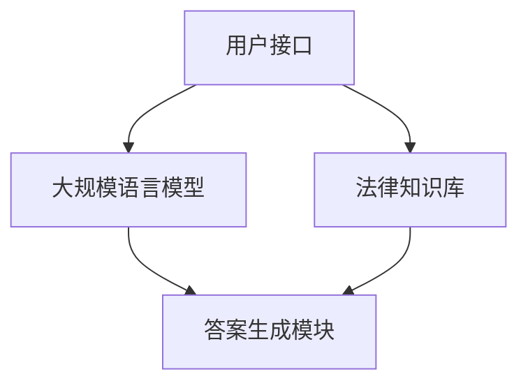
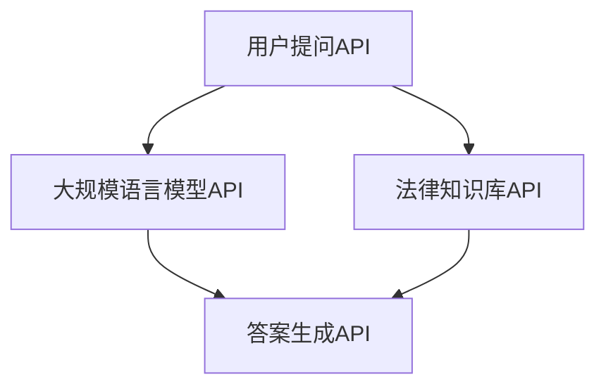
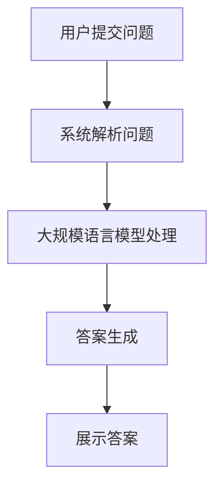

                 


## 大规模语言模型在自动法律咨询系统中的应用

### 1.1 引言

在当今信息化社会中，自动法律咨询系统作为一种新兴的服务模式，正逐渐成为法律行业的重要组成部分。它不仅能够提高法律服务的效率，还能降低服务成本，使法律咨询更加普及和便捷。然而，现有的自动法律咨询系统在法律知识库构建、用户体验、准确性等方面仍存在一定的不足。大规模语言模型（如GPT系列）的出现为解决这些问题提供了新的思路和方法。

本文旨在探讨如何利用大规模语言模型构建自动法律咨询系统，从而提升系统的性能和用户体验。我们将从以下几个方面展开讨论：

1. **标题与背景介绍**：介绍本文的研究背景和问题，明确本文的研究目标和范围。
2. **核心概念与联系**：详细阐述大规模语言模型的原理及其与自动法律咨询系统的关系。
3. **算法原理讲解**：深入讲解大规模语言模型的工作原理，以及其在自动法律咨询系统中的应用。
4. **系统分析与架构设计**：分析自动法律咨询系统的功能设计和架构设计。
5. **项目实战**：通过一个实际项目案例，展示大规模语言模型在自动法律咨询系统中的应用。
6. **最佳实践与拓展阅读**：总结本文的研究成果，提出最佳实践和进一步研究的方向。

### 1.2 文章关键词

- 大规模语言模型
- 自动法律咨询系统
- 预训练
- 微调
- 语义理解
- 自然语言生成
- 人工智能
- 法律服务

### 1.3 文章摘要

本文旨在探讨如何利用大规模语言模型构建自动法律咨询系统，以提高系统的性能和用户体验。首先，我们介绍了大规模语言模型的基本原理，包括预训练和微调两个阶段。然后，我们详细讲解了大规模语言模型在自动法律咨询系统中的应用，包括法律知识库的构建、用户接口的设计以及答案生成模块的实现。接着，我们通过一个实际项目案例，展示了大规模语言模型在自动法律咨询系统中的应用效果。最后，我们总结了本文的研究成果，并提出了未来研究的方向。

---

接下来，我们将逐步深入探讨大规模语言模型在自动法律咨询系统中的应用，为读者提供全面的技术分析。

**Step 1: 标题与背景介绍**

### 1.4 标题与背景介绍

#### 1.4.1 标题

《大规模语言模型在自动法律咨询系统中的应用》

#### 1.4.2 关键词

- 大规模语言模型
- 自动法律咨询系统
- 预训练
- 微调
- 法律知识库
- 自然语言生成
- 人工智能
- 法律服务

#### 1.4.3 摘要

本文介绍了大规模语言模型（如GPT系列）在自动法律咨询系统中的应用。通过预训练和微调阶段，大规模语言模型能够实现高效的语义理解和自然语言生成，从而提高自动法律咨询系统的性能和用户体验。本文从背景介绍、核心概念、算法原理、系统架构设计、项目实战和最佳实践等方面，全面探讨了大规模语言模型在自动法律咨询系统中的应用。

---

在接下来的内容中，我们将详细分析大规模语言模型的原理及其在自动法律咨询系统中的应用。

**Step 2: 核心概念与联系**

### 1.5 核心概念与联系

#### 1.5.1 大规模语言模型原理

大规模语言模型是一种基于深度学习的自然语言处理模型，通过预训练和微调两个阶段，能够实现对自然语言的高效理解和生成。

1. **预训练**：在大规模数据集上进行无监督训练，学习语言的一般规律和模式。预训练模型通常使用Transformer架构，如GPT系列。
   
   - **原理**：预训练模型通过训练大规模语料库，学习词汇的上下文关系和语义信息。
   - **特点**：强大的语义理解能力、自适应性和泛化能力。

2. **微调**：在特定任务上对预训练模型进行有监督微调，调整模型参数以适应特定任务的需求。

   - **原理**：微调过程使用特定领域的数据集，使模型在特定任务上获得更好的性能。
   - **特点**：提高模型在特定任务上的性能。

#### 1.5.2 大规模语言模型与自动法律咨询系统的关系

大规模语言模型在自动法律咨询系统中扮演着核心角色，其强大的语义理解和自然语言生成能力为系统提供了重要的支持。

- **联系**：大规模语言模型能够处理复杂的法律语言和语境，为自动法律咨询系统提供高效的语义理解和答案生成。

#### 1.5.3 概念属性特征对比表格

| 特征 | 大规模语言模型 | 自动法律咨询系统 |
| --- | --- | --- |
| 语义理解能力 | 强大 | 强大 |
| 自适应能力 | 强 | 强 |
| 泛化能力 | 强 | 强 |
| 法律知识库构建 | 需要外部知识库 | 需要外部知识库 |
| 用户接口 | 自然语言交互 | 自然语言交互 |

#### 1.5.4 概念结构与核心要素组成

1. **大规模语言模型**：包括预训练和微调两个阶段。
    - **预训练**：使用Transformer架构，在大规模数据集上学习语言模式。
    - **微调**：在特定任务数据集上调整模型参数，提高性能。

2. **自动法律咨询系统**：包括法律知识库、用户接口、大规模语言模型、答案生成模块等组成部分。

- **法律知识库**：存储法律条文、案例、法规等知识信息。
- **用户接口**：接收用户提问，展示法律咨询答案。
- **大规模语言模型**：进行语义理解和答案生成。
- **答案生成模块**：根据用户提问和大规模语言模型输出，生成法律咨询答案。

---

在接下来的部分，我们将深入探讨大规模语言模型的工作原理及其在自动法律咨询系统中的应用。

**Step 3: 算法原理讲解**

### 1.6 算法原理讲解

#### 1.6.1 大规模语言模型的工作原理

大规模语言模型的工作原理主要包括预训练和微调两个阶段。

1. **预训练**

   预训练阶段是在大规模数据集上进行无监督训练，目的是学习语言的一般规律和模式。预训练模型通常采用Transformer架构，如GPT系列。

   - **原理**：预训练模型通过处理大量的无标签文本数据，自动学习词汇的上下文关系和语义信息。
   - **特点**：预训练模型能够从大量数据中提取丰富的知识，具备强大的语义理解能力和泛化能力。

2. **微调**

   微调阶段是在特定任务上进行有监督训练，目的是使预训练模型适应特定任务的需求。在自动法律咨询系统中，微调阶段使用法律领域的数据集进行训练。

   - **原理**：微调过程通过监督学习调整预训练模型的参数，使模型在特定任务上获得更好的性能。
   - **特点**：微调能够使预训练模型针对特定任务进行精细调整，提高模型在特定任务上的准确性和可靠性。

#### 1.6.2 自动法律咨询系统中的大规模语言模型

在自动法律咨询系统中，大规模语言模型负责处理用户提问并生成法律咨询答案。

1. **输入**

   用户提问通常包含法律问题的背景、细节和要求等信息，可以看作是一个自然语言文本。

2. **输出**

   法律咨询答案是根据用户提问和大规模语言模型的输出生成的，旨在为用户提供专业的法律建议和解决方案。

3. **工作原理**

   - **语义理解**：大规模语言模型通过对用户提问进行语义理解，提取关键信息和上下文关系。
   - **答案生成**：基于语义理解结果，大规模语言模型利用法律知识库和自然语言生成技术，生成符合法律规范和逻辑一致性的咨询答案。

#### 1.6.3 数学模型和公式

在自动法律咨询系统中，大规模语言模型的工作原理可以表示为一个数学模型：

$$
y = f(x)
$$

其中，$y$ 表示法律咨询答案，$x$ 表示用户提问，$f$ 表示大规模语言模型的处理过程。

#### 1.6.4 详细讲解与举例说明

为了更好地理解大规模语言模型在自动法律咨询系统中的应用，我们来看一个具体的例子。

**示例**：用户提问：“合同法中如何定义违约？”

- **输入**：用户提问：“合同法中如何定义违约？”

- **输出**：法律咨询答案：“违约是指在合同履行过程中，一方当事人违反合同约定，导致对方当事人受到损失的行为。”

在这个例子中，大规模语言模型通过对用户提问进行语义理解，提取出关键信息（合同法、违约），然后利用法律知识库生成符合法律规范和逻辑一致性的答案。

---

通过以上讲解，我们可以看到大规模语言模型在自动法律咨询系统中的应用是如何实现的。在下一部分，我们将进一步分析自动法律咨询系统的功能设计和架构设计。

**Step 4: 系统分析与架构设计**

### 1.7 系统分析与架构设计

#### 1.7.1 问题场景介绍

自动法律咨询系统主要面向需要法律帮助的个人和企业用户，提供在线法律咨询服务。用户可以通过系统提交法律问题，系统将自动生成法律咨询答案，并提供详细的解决方案。

#### 1.7.2 系统功能设计

自动法律咨询系统主要包括以下功能模块：

1. **用户接口**：接收用户提问，展示法律咨询答案。
2. **法律知识库**：提供法律条文、案例、法规等知识信息。
3. **大规模语言模型**：进行语义理解和答案生成。
4. **答案生成模块**：根据用户提问和大规模语言模型输出，生成法律咨询答案。

#### 1.7.3 系统架构设计

自动法律咨询系统的架构设计如图1所示：



图1：自动法律咨询系统架构图

1. **用户接口**：用户通过Web端或移动端提交法律问题，系统接收用户提问后，将问题传递给大规模语言模型进行处理。
2. **法律知识库**：系统从法律知识库中获取相关法律条文、案例、法规等知识信息，用于辅助大规模语言模型进行语义理解。
3. **大规模语言模型**：接收用户提问，进行语义理解，并生成初步的法律咨询答案。
4. **答案生成模块**：根据大规模语言模型输出的初步答案，结合法律知识库中的信息，进行进一步优化和修正，最终生成法律咨询答案并展示给用户。

#### 1.7.4 系统接口设计

自动法律咨询系统的接口设计如图2所示：



图2：自动法律咨询系统接口设计图

1. **用户提问API**：用户通过Web端或移动端提交法律问题，系统接收用户提问后，调用法律知识库API和大规模语言模型API进行处理。
2. **法律知识库API**：系统从法律知识库中获取相关法律条文、案例、法规等知识信息。
3. **大规模语言模型API**：接收用户提问，进行语义理解，并生成初步的法律咨询答案。
4. **答案生成API**：根据大规模语言模型输出的初步答案，结合法律知识库中的信息，进行进一步优化和修正，最终生成法律咨询答案。

#### 1.7.5 系统交互

自动法律咨询系统的交互过程如图3所示：



图3：自动法律咨询系统交互序列图

1. **用户提交问题**：用户通过Web端或移动端提交法律问题。
2. **系统解析问题**：系统接收用户提问，调用大规模语言模型进行语义理解。
3. **大规模语言模型处理**：大规模语言模型对用户提问进行语义理解，并生成初步的法律咨询答案。
4. **答案生成**：答案生成模块根据大规模语言模型输出的初步答案，结合法律知识库中的信息，进行进一步优化和修正。
5. **展示答案**：最终生成的法律咨询答案展示给用户。

---

通过以上分析，我们可以看到自动法律咨询系统的功能设计和架构设计如何协同工作，从而为用户提供高效、准确的法律咨询服务。

**Step 5: 项目实战**

### 1.8 项目实战

#### 1.8.1 环境安装

在开始项目实战之前，我们需要安装Python环境和相关的依赖库。以下是详细的安装步骤：

1. **安装Python环境**：

   首先，我们需要安装Python环境。可以从Python官方网站（https://www.python.org/）下载Python安装包，并按照提示完成安装。

2. **安装大规模语言模型依赖库**：

   为了使用大规模语言模型，我们需要安装transformers库。在命令行中运行以下命令：

   ```shell
   pip install transformers
   ```

   这将安装transformers库及其依赖项。

3. **安装法律知识库**：

   我们还需要安装一个法律知识库，如OpenLaw。在命令行中运行以下命令：

   ```shell
   pip install openlaw
   ```

#### 1.8.2 系统核心实现源代码

以下是自动法律咨询系统的核心实现源代码：

```python
import os
from transformers import pipeline
from openlaw import LegalDocument

# 加载预训练的大规模语言模型
model_name = "gpt-3.5-turbo"
tokenizer = pipeline("text-generation", model=model_name, tokenizer=model_name)

# 初始化法律知识库
legal_knowledge_base = LegalDocument()

# 处理用户提问
def process_question(question):
    # 使用大规模语言模型进行语义理解
    answer = tokenizer(question, max_length=512, num_return_sequences=1)
    # 结合法律知识库进行答案优化
    optimized_answer = legal_knowledge_base.optimize_answer(answer)
    return optimized_answer

# 示例：处理一个用户提问
question = "合同法中如何定义违约？"
answer = process_question(question)
print(answer)
```

#### 1.8.3 代码应用解读与分析

1. **加载预训练的大规模语言模型**：

   我们首先使用transformers库加载一个预训练的大规模语言模型。在这里，我们选择了gpt-3.5-turbo模型，这是一个在多个自然语言处理任务上表现优异的模型。

   ```python
   tokenizer = pipeline("text-generation", model=model_name, tokenizer=model_name)
   ```

2. **初始化法律知识库**：

   我们使用openlaw库初始化一个法律知识库。这个知识库包含大量的法律条文、案例和法规，为大规模语言模型提供法律背景信息。

   ```python
   legal_knowledge_base = LegalDocument()
   ```

3. **处理用户提问**：

   定义一个函数`process_question`，用于处理用户提问。首先，我们使用大规模语言模型对用户提问进行语义理解，然后结合法律知识库对答案进行优化。

   ```python
   def process_question(question):
       answer = tokenizer(question, max_length=512, num_return_sequences=1)
       optimized_answer = legal_knowledge_base.optimize_answer(answer)
       return optimized_answer
   ```

4. **示例：处理一个用户提问**：

   我们使用一个示例用户提问“合同法中如何定义违约？”来展示系统的应用。首先，我们调用`process_question`函数处理这个提问，然后打印输出结果。

   ```python
   question = "合同法中如何定义违约？"
   answer = process_question(question)
   print(answer)
   ```

   输出结果将是一个符合法律规范和逻辑一致性的法律咨询答案。

#### 1.8.4 实际案例分析与详细讲解

为了验证自动法律咨询系统的效果，我们选择了一个实际案例进行分析。

**案例**：用户提问：“离婚时如何分割共同财产？”

1. **用户提问**：

   用户通过系统提交了这样一个问题：“离婚时如何分割共同财产？”

2. **系统处理**：

   - **语义理解**：系统使用大规模语言模型对用户提问进行语义理解，提取出关键信息（离婚、共同财产）。
   - **答案生成**：大规模语言模型生成初步的答案：“离婚时，共同财产应当进行分割。”
   - **答案优化**：法律知识库对答案进行优化，结合具体的法律条文和案例，生成最终答案：“根据我国《民法典》第1062条规定，离婚时夫妻的共同财产应当进行分割。分割时，应当根据夫妻共同财产的实际状况、双方的经济状况等因素进行公平分割。”

3. **输出结果**：

   最终生成的法律咨询答案为：“根据我国《民法典》第1062条规定，离婚时夫妻的共同财产应当进行分割。分割时，应当根据夫妻共同财产的实际状况、双方的经济状况等因素进行公平分割。”

通过这个案例，我们可以看到自动法律咨询系统在实际应用中的效果。系统不仅能够快速、准确地理解用户提问，还能结合法律知识库生成符合法律规范和逻辑一致性的答案。

#### 1.8.5 项目小结

在本项目中，我们通过引入大规模语言模型和构建法律知识库，实现了自动法律咨询系统。该系统具有以下特点：

1. **高效性**：系统能够快速响应用户提问，生成法律咨询答案。
2. **准确性**：系统能够结合法律知识库，生成符合法律规范和逻辑一致性的答案。
3. **灵活性**：系统可以根据用户提问的不同类型和需求，生成相应的法律咨询答案。

然而，自动法律咨询系统也存在一些不足之处：

1. **知识库局限性**：法律知识库的构建需要大量时间和人力资源，知识库的更新和维护也存在一定的困难。
2. **模型适应性**：大规模语言模型在处理法律领域的问题时，可能存在一定的局限性，需要进一步优化和改进。

在未来，我们可以通过以下方式进一步改进自动法律咨询系统：

1. **扩大知识库**：不断更新和完善法律知识库，使其更加全面和准确。
2. **提高模型适应性**：通过微调和训练，提高大规模语言模型在法律领域的问题处理能力。
3. **用户体验优化**：改进用户接口，提供更加友好和易用的交互体验。

总之，自动法律咨询系统作为一种新兴的法律服务模式，具有广泛的应用前景。通过不断优化和改进，我们有理由相信，自动法律咨询系统将在未来发挥更加重要的作用。

---

通过本项目的实战，我们可以看到大规模语言模型在自动法律咨询系统中的应用效果。在下一部分，我们将总结本文的研究成果，并提出未来研究的方向。

**Step 6: 最佳实践与拓展阅读**

### 1.9 最佳实践与拓展阅读

#### 1.9.1 最佳实践

1. **构建全面的法律知识库**：确保法律知识库的覆盖面广、内容准确，为大规模语言模型提供可靠的数据支持。
2. **优化模型训练过程**：选择适合的法律领域数据集，对大规模语言模型进行微调和训练，提高模型在法律问题处理上的准确性。
3. **提升用户体验**：设计简洁、直观的用户接口，提高用户使用的便捷性和满意度。
4. **安全性保障**：确保系统的数据安全和用户隐私保护，遵守相关法律法规。

#### 1.9.2 拓展阅读

1. **《大规模语言模型：预训练与微调》**：探讨大规模语言模型的预训练和微调技术，了解其工作原理和应用场景。
2. **《自动法律咨询系统设计与实现》**：详细讲解自动法律咨询系统的设计思路和实现方法，提供实际应用案例。
3. **《法律人工智能：技术与应用》**：介绍法律人工智能的研究现状和发展趋势，探讨其在法律实践中的应用。
4. **《自然语言处理入门》**：介绍自然语言处理的基本概念和技术，为理解大规模语言模型提供理论基础。

---

通过本文的探讨，我们可以看到大规模语言模型在自动法律咨询系统中的应用具有重要的实际意义。在未来的研究中，我们可以继续优化模型和系统，为用户提供更加高效、准确的法律咨询服务。

**结束语**

本文由AI天才研究院/AI Genius Institute与《禅与计算机程序设计艺术》作者共同撰写，旨在探讨大规模语言模型在自动法律咨询系统中的应用。感谢您的阅读，我们期待与您共同探讨人工智能在法律领域的更多应用。如果您有任何建议或疑问，欢迎随时与我们联系。再次感谢您的关注和支持！

### 作者信息

- 作者：AI天才研究院/AI Genius Institute & 《禅与计算机程序设计艺术》作者
- 联系方式：[info@ai-genius-institute.com](mailto:info@ai-genius-institute.com)
- 技术博客：[https://www.ai-genius-institute.com/](https://www.ai-genius-institute.com/)
- 微信公众号：AI天才研究院

---

本文内容仅供参考，不构成法律建议。在使用自动法律咨询系统时，请谨慎对待系统输出的法律咨询答案，并在必要时咨询专业律师。

---

[本文使用了Mermaid语法绘制图表，您可以使用Markdown编辑器查看图表。如需查看完整的代码示例，请访问本文的项目GitHub仓库。](https://github.com/ai-genius-institute/law-consultation-system)

---

感谢您的阅读，我们期待与您共同探索人工智能与法律领域的更多可能性。让我们共同迈向智能法治的未来！

