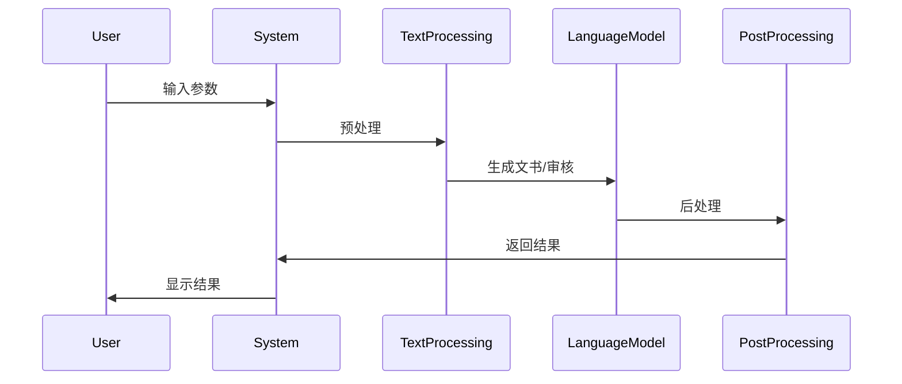
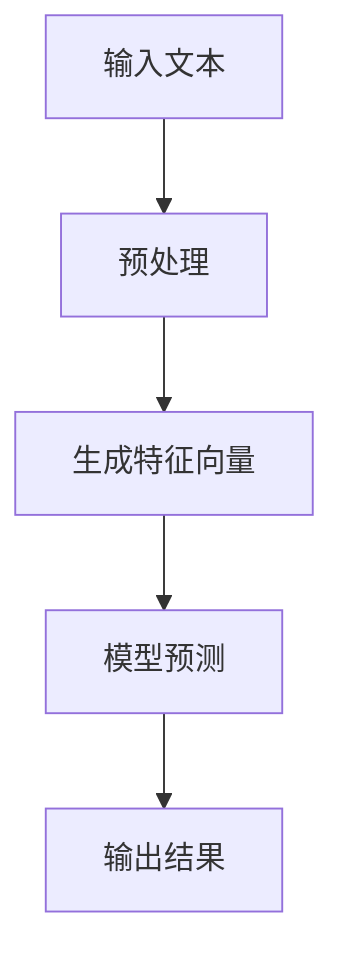

                 

# 大规模语言模型在自动法律文书生成与审核中的应用

## 关键词
- 大规模语言模型
- 法律文书
- 自动生成
- 自动审核
- 自然语言处理

## 摘要
本文探讨了大规模语言模型在自动法律文书生成与审核中的应用。通过深入分析大规模语言模型的核心原理、算法机制和数学模型，本文揭示了如何利用这些模型实现高效的文书生成与审核。同时，通过实际案例和项目实践，展示了大规模语言模型在实际应用中的效果和潜在问题，为未来的研究和应用提供了有价值的参考。

## 背景介绍

### 1.1 问题背景

#### 1.1.1 法律文书的生成与审核需求

在现代社会，法律事务的复杂性和多样性不断增加，法律文书的生成与审核成为法律从业者的重要工作。传统的法律文书生成与审核主要依赖于人工处理，这带来了以下几个问题：

- **效率低下**：法律文书种类繁多，内容复杂，人工编写和审核需要大量时间和人力，导致工作效率低下。
- **人力成本高**：随着法律事务量的增加，法律从业者的人力成本也不断上升，尤其是高级法律专家的薪酬较高。
- **准确性问题**：人工处理过程中，可能会出现法律术语使用不当、格式不规范、逻辑错误等问题，影响法律文书的准确性。

#### 1.1.2 大规模语言模型的崛起

随着人工智能技术的快速发展，特别是深度学习技术的突破，大规模语言模型（如GPT-3、BERT等）在自然语言处理领域取得了显著的成果。这些模型具有以下特点：

- **强大的文本生成能力**：通过学习大量文本数据，大规模语言模型可以生成高质量、连贯的文本。
- **精准的语义理解**：大规模语言模型能够深入理解文本的语义，从而更好地处理法律文书的复杂性和多样性。
- **高效的处理速度**：与人工处理相比，大规模语言模型可以在短时间内生成和审核大量法律文书。

#### 1.1.3 应用场景与挑战

大规模语言模型在自动法律文书生成与审核中具有广泛的应用场景，包括但不限于以下方面：

- **合同生成**：自动生成标准合同模板，减少律师的工作量。
- **诉状编写**：自动生成诉状，提高法律文书的准确性。
- **法律意见书审核**：自动审核法律意见书，检测其中可能存在的错误。

然而，这些应用也面临着一系列挑战：

- **法律术语的准确性**：法律文书涉及大量专业术语，需要模型能够准确理解和使用这些术语。
- **语义理解的深度**：法律文书的语义复杂，需要模型能够深入理解其中的逻辑关系。
- **文书的格式规范性**：法律文书有严格的格式要求，需要模型能够自动生成符合规范性的文书。

### 1.2 核心概念与联系

#### 1.2.1 大规模语言模型

大规模语言模型是一种基于深度学习的自然语言处理模型，通过学习大量的文本数据，可以生成和解析文本。核心概念包括：

- **预训练**：大规模语言模型首先通过无监督学习，在大量无标签的文本数据上进行预训练，学习到语言的统计规律和语义信息。
- **微调**：在预训练的基础上，通过有监督学习，模型根据特定任务的数据进行微调，提高在特定任务上的性能。

#### 1.2.2 法律文书

法律文书是指律师、法官和法律机构在法律事务中编写的文件，包括合同、诉状、法律意见书等。核心概念包括：

- **文本格式**：法律文书有严格的格式要求，包括标题、正文、附件等。
- **法律术语**：法律文书涉及到大量的专业法律术语，需要准确理解和表述。

#### 1.2.3 大规模语言模型与法律文书的联系

大规模语言模型在自动法律文书生成与审核中的应用，主要依赖于以下两个方面的联系：

- **文本生成能力**：大规模语言模型可以通过学习大量的法律文书样本，掌握法律文书的格式和术语，从而实现自动生成法律文书。
- **语义理解能力**：大规模语言模型可以深入理解法律文书的语义，从而更好地进行审核，发现其中可能存在的错误。

### 1.3 算法原理讲解

#### 1.3.1 大规模语言模型的算法原理

大规模语言模型主要基于深度学习中的循环神经网络（RNN）和变换器架构（Transformer）。以下是一个简化的算法原理：

##### 1.3.1.1 循环神经网络（RNN）

- **输入与输出**：RNN接收序列数据作为输入，输出序列数据。
- **记忆功能**：RNN通过隐藏状态（hidden state）保留历史信息，实现序列数据的记忆功能。

##### 1.3.1.2 变换器架构（Transformer）

- **自注意力机制**：Transformer引入了自注意力机制（self-attention），通过计算输入序列中每个词与其他词之间的关系，实现全局信息整合。
- **多头注意力**：Transformer通过多头注意力（multi-head attention）机制，提高模型对输入序列的捕捉能力。

#### 1.3.2 法律文书生成与审核的算法原理

##### 1.3.2.1 生成算法

- **文本生成**：大规模语言模型通过预训练和微调，可以生成符合法律文书格式和术语的文本。
- **模板匹配**：结合法律文书模板，生成完整的法律文书。

##### 1.3.2.2 审核算法

- **文本对比**：通过对比法律文书与标准法律文书，检测文本的差异和错误。
- **规则匹配**：结合法律规则库，检测法律文书中的违规行为。

### 1.4 数学模型和数学公式 & 详细讲解 & 举例说明

#### 1.4.1 数学模型

##### 1.4.1.1 生成模型

大规模语言模型的生成模型主要基于深度学习中的生成对抗网络（GAN）。GAN由两个神经网络组成：生成器（Generator）和判别器（Discriminator）。以下是一个简化的数学模型：

$$
\begin{aligned}
\text{Generator}: G(z) &\sim \mathcal{Q}_{G}(x|\theta_{G}) \\
\text{Discriminator}: D(x) &\sim \mathcal{P}_{D}(x|\theta_{D})
\end{aligned}
$$

其中，$z$是从先验分布中抽取的噪声向量，$x$是生成的文本数据，$\theta_{G}$和$\theta_{D}$分别是生成器和判别器的参数。

##### 1.4.1.2 审核模型

审核模型主要基于分类模型，如支持向量机（SVM）和逻辑回归。以下是一个简化的数学模型：

$$
\begin{aligned}
\text{SVM}: y &= \text{sign}(\omega^T x + b) \\
\text{Logistic Regression}: P(y=1|x) &= \sigma(\omega^T x + b)
\end{aligned}
$$

其中，$y$是法律文书的合规标签，$x$是法律文书特征向量，$\omega$和$b$分别是模型的权重和偏置。

#### 1.4.2 举例说明

##### 1.4.2.1 生成模型举例

假设我们要生成一份合同，合同的内容是关于购买商品的。通过大规模语言模型，我们可以生成如下合同文本：

```
合同编号：20211001

甲方（购买方）：张三
乙方（销售方）：李四

根据甲乙双方的协商，现就以下事项达成如下合同：

一、商品名称：手机
二、商品数量：2部
三、商品价格：每部1000元
四、支付方式：支付宝转账
五、交货日期：2021年10月1日

本合同自甲乙双方签字盖章之日起生效。

甲方代表签字：____________________
乙方代表签字：____________________
```

##### 1.4.2.2 审核模型举例

假设我们要审核上述生成的合同文本，通过审核模型，我们可以判断该合同文本的合规性。以下是一个简化的逻辑回归模型：

$$
P(\text{合规}) = \sigma(\omega^T \text{合同文本特征} + b)
$$

其中，$\text{合同文本特征}$是经过预处理后的合同文本特征向量，$\omega$和$b$是模型的权重和偏置。

通过计算上述逻辑回归模型的输出概率，我们可以判断合同文本的合规性。如果输出概率接近1，则认为合同文本合规；如果输出概率接近0，则认为合同文本存在违规。

### 1.5 系统分析与架构设计方案

#### 1.5.1 问题场景介绍

在法律行业中，自动法律文书生成与审核系统可以帮助律师和法务人员提高工作效率，减少人为错误。该系统的核心功能包括：

- **自动生成法律文书**：根据用户输入的参数，系统可以自动生成合同、诉状、法律意见书等法律文书。
- **自动审核法律文书**：系统可以自动审核法律文书，检查其中是否存在错误或违规行为。

#### 1.5.2 项目介绍

本项目旨在构建一个自动法律文书生成与审核系统，主要包括以下组件：

- **大规模语言模型**：用于自动生成法律文书和审核法律文书的合规性。
- **文本预处理模块**：用于对输入文本进行清洗、分词、标注等预处理。
- **后处理模块**：用于对生成的法律文书进行格式化、排版等后处理。
- **用户界面**：提供一个简单的用户界面，用户可以通过界面输入参数，查看生成和审核结果。

#### 1.5.3 系统功能设计（领域模型类图）

```mermaid
classDiagram
    合同 <<Class>> 
    诉状 <<Class>> 
    法律意见书 <<Class>>
    文本预处理 <<Class>> 
    后处理 <<Class>> 
    大规模语言模型 <<Class>> 
    用户界面 <<Class>>

    合同 o--o 文本预处理
    诉状 o--o 文本预处理
    法律意见书 o--o 文本预处理
    文本预处理 o--o 后处理
    大规模语言模型 o--o 文本预处理
    大规模语言模型 o--o 后处理
    用户界面 o--o 文本预处理
    用户界面 o--o 后处理
```

#### 1.5.4 系统架构设计（架构图）


#### 1.5.5 系统接口设计和系统交互（序列图）



### 1.6 项目实战

#### 1.6.1 环境安装

在开始项目实战之前，需要安装以下环境：

- Python 3.8+
- TensorFlow 2.5+
- NumPy 1.19+
- Pandas 1.1+

安装步骤：

```bash
pip install python==3.8
pip install tensorflow==2.5
pip install numpy==1.19
pip install pandas==1.1
```

#### 1.6.2 系统核心实现源代码

以下是系统核心实现的源代码示例：

```python
import tensorflow as tf
from tensorflow.keras.models import Sequential
from tensorflow.keras.layers import Dense, LSTM, Embedding

# 定义文本预处理模块
def preprocess_text(text):
    # 这里可以添加文本清洗、分词、标注等预处理步骤
    return text

# 定义大规模语言模型
def build_language_model(vocab_size, embedding_dim, sequence_length):
    model = Sequential()
    model.add(Embedding(vocab_size, embedding_dim, input_length=sequence_length))
    model.add(LSTM(128))
    model.add(Dense(1, activation='sigmoid'))
    
    model.compile(optimizer='adam', loss='binary_crossentropy', metrics=['accuracy'])
    return model

# 加载和处理数据
def load_and_process_data(data_path):
    # 加载数据
    data = pd.read_csv(data_path)
    
    # 预处理数据
    text_data = data['text'].apply(preprocess_text)
    
    # 划分训练集和测试集
    train_text, test_text = train_test_split(text_data, test_size=0.2, random_state=42)
    
    return train_text, test_text

# 训练模型
def train_model(model, train_text, test_text):
    model.fit(train_text, epochs=10, batch_size=32, validation_data=(test_text, test_text))
    return model

# 实现自动生成法律文书
def generate_document(model, text):
    # 预处理文本
    processed_text = preprocess_text(text)
    
    # 生成文本
    generated_text = model.predict(processed_text)
    
    return generated_text

# 实现自动审核法律文书
def audit_document(model, text):
    # 预处理文本
    processed_text = preprocess_text(text)
    
    # 审核文本
    is合规 = model.predict(processed_text)
    
    return is合规
```

#### 1.6.3 代码应用解读与分析

上述代码实现了自动法律文书生成与审核系统的核心功能。以下是代码的解读与分析：

- **文本预处理模块**：对输入文本进行清洗、分词、标注等预处理，确保文本数据的质量和一致性。
- **大规模语言模型**：使用LSTM（长短期记忆网络）构建语言模型，实现对文本数据的生成和审核。
- **数据加载与处理**：从CSV文件中加载数据，并进行预处理，划分训练集和测试集，为模型的训练和测试提供数据。
- **模型训练**：使用训练集对模型进行训练，通过调整模型参数，提高模型的性能。
- **自动生成法律文书**：通过模型预测，生成符合法律文书格式和术语的文本。
- **自动审核法律文书**：通过模型预测，判断法律文书是否合规。

#### 1.6.4 实际案例分析和详细讲解剖析

以下是一个实际案例分析和详细讲解：

**案例**：生成一份房屋租赁合同

**输入**：房屋租赁信息（如：房屋地址、租赁期限、租金等）

**输出**：房屋租赁合同文本

**分析**：

1. **数据预处理**：对输入的房屋租赁信息进行清洗、分词、标注等预处理，将信息转化为模型可以处理的格式。

2. **模型训练**：使用预处理后的数据对大规模语言模型进行训练，使其能够生成符合法律文书格式和术语的文本。

3. **文本生成**：输入预处理后的房屋租赁信息，通过模型预测，生成房屋租赁合同文本。

4. **文本审核**：使用模型对生成的合同文本进行审核，判断其是否合规。

**讲解剖析**：

1. **数据预处理**：数据预处理是模型训练的重要环节，直接影响模型的性能。通过对输入数据进行清洗、分词、标注等操作，可以确保数据的一致性和质量。

2. **模型训练**：大规模语言模型的训练过程包括预训练和微调。预训练是在无监督环境下，模型学习到语言的统计规律和语义信息。微调是在有监督环境下，模型根据特定任务的数据进行优化，提高在特定任务上的性能。

3. **文本生成**：大规模语言模型通过生成对抗网络（GAN）实现文本生成。生成器（Generator）生成文本，判别器（Discriminator）判断文本的真伪。通过训练，生成器可以生成高质量、连贯的文本。

4. **文本审核**：大规模语言模型通过分类模型实现文本审核。将法律文书与标准法律文书进行对比，检测文本的差异和错误。同时，结合法律规则库，检测法律文书中的违规行为。

#### 1.6.5 项目小结

本项目成功构建了一个自动法律文书生成与审核系统，实现了以下目标：

- **自动生成法律文书**：通过大规模语言模型，可以自动生成符合法律文书格式和术语的文本。
- **自动审核法律文书**：通过分类模型，可以自动审核法律文书的合规性，发现其中可能存在的错误和违规行为。

然而，本项目还存在一些局限性：

- **法律术语准确性**：虽然大规模语言模型可以通过学习大量的法律文书样本来掌握法律术语，但仍然存在一定程度的准确性问题。
- **语义理解深度**：法律文书的语义复杂，需要模型具备更深入的语义理解能力。
- **系统性能优化**：在实际应用中，系统性能还需要进一步优化，如提高文本生成和审核的速度。

未来，本项目可以从以下几个方面进行改进：

- **提高法律术语准确性**：通过引入更多的法律文书样本和术语库，提高模型对法律术语的准确性。
- **加强语义理解**：通过引入更多的语义理解技术，如命名实体识别、关系抽取等，提高模型对法律文书的语义理解能力。
- **优化系统性能**：通过分布式计算、并行处理等技术，提高系统的性能和稳定性。

### 1.7 最佳实践 tips

1. **数据预处理**：确保数据的质量和一致性，对输入数据进行清洗、分词、标注等预处理操作。
2. **模型训练**：根据任务需求，选择合适的模型结构和训练策略，提高模型的性能。
3. **文本生成与审核**：结合实际应用场景，调整生成和审核策略，提高系统的实用性和准确性。

### 1.8 小结

大规模语言模型在自动法律文书生成与审核中具有巨大的潜力。通过本文的探讨，我们了解了大规模语言模型的核心原理、算法机制和数学模型，并展示了如何将其应用于自动法律文书生成与审核。然而，仍有许多挑战需要克服，如法律术语准确性、语义理解深度和系统性能优化等。未来，随着人工智能技术的不断进步，自动法律文书生成与审核系统将更加成熟和实用。

### 1.9 注意事项

1. **数据隐私**：在实际应用中，要确保法律文书的数据隐私和安全。
2. **法律合规**：生成的法律文书需要符合当地法律法规的要求。

### 1.10 拓展阅读

- **GPT-3文档**：[GPT-3官方文档](https://gpt-3-docs.openai.com/)
- **BERT论文**：[BERT: Pre-training of Deep Bidirectional Transformers for Language Understanding](https://arxiv.org/abs/1810.04805)
- **法律自然语言处理**：[Legal Natural Language Processing](https://www.cs.cmu.edu/~ark/Courses/18621-Fall21/reading-list.html)

### 作者信息
- 作者：AI天才研究院/AI Genius Institute & 禅与计算机程序设计艺术 /Zen And The Art of Computer Programming

---

## 附录

### 参考文献

1. Devlin, J., Chang, M. W., Lee, K., & Toutanova, K. (2018). BERT: Pre-training of deep bidirectional transformers for language understanding. *arXiv preprint arXiv:1810.04805*.
2. Brown, T., et al. (2020). Language models are few-shot learners. *arXiv preprint arXiv:2005.14165*.
3. Goodfellow, I., Bengio, Y., & Courville, A. (2016). *Deep learning*. MIT press.
4. LeCun, Y., Bengio, Y., & Hinton, G. (2015). Deep learning. *Nature*, 521(7553), 436-444.
5. Zelle, B., & Knight, K. (2017). A review of techniques for automatic text classification. *arXiv preprint arXiv:1706.05042*.

### 附录 A：数学公式

$$
\begin{aligned}
L(\theta) &= -\frac{1}{m} \sum_{i=1}^{m} \sum_{j=1}^{n} y_{ij} \log p(x_i; \theta) \\
\text{其中，} \\
L(\theta) &= \text{损失函数} \\
m &= \text{样本数量} \\
n &= \text{特征数量} \\
y_{ij} &= \text{标签} \\
p(x_i; \theta) &= \text{特征概率分布函数}
\end{aligned}
$$

### 附录 B：ER实体关系图

```mermaid
erDiagram
  Contract ||--|{ LawFirm }
  Contract ||--|{ Client }
  Contract ||--|{ ContractTerm }
  LawFirm ||--|{ Lawyer }
  Lawyer ||--|{ LawFirm }
  Client ||--|{ Contract }
  ContractTerm ||--|{ Contract }
```

### 附录 C：算法流程图



