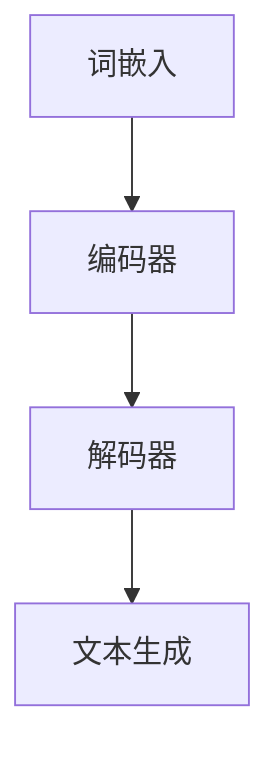
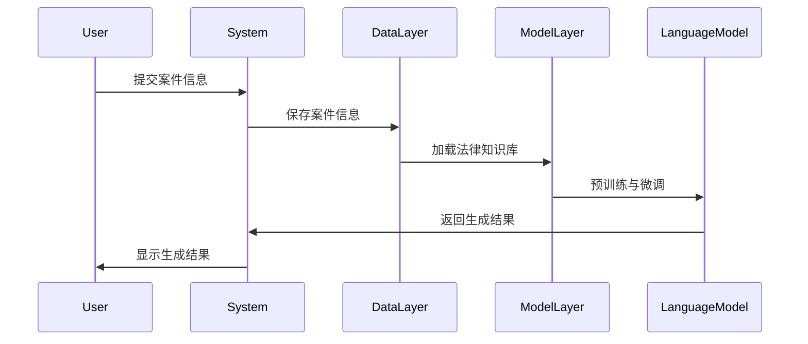
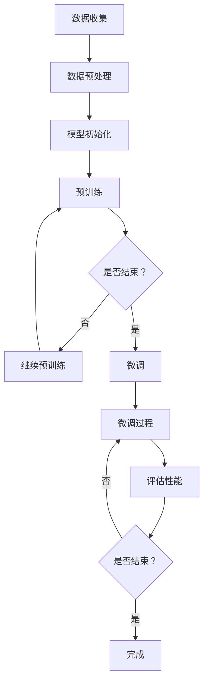
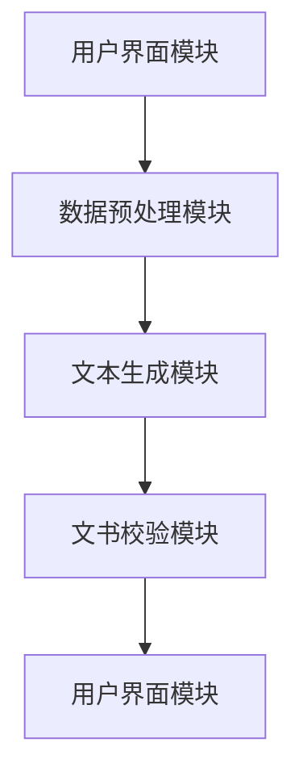
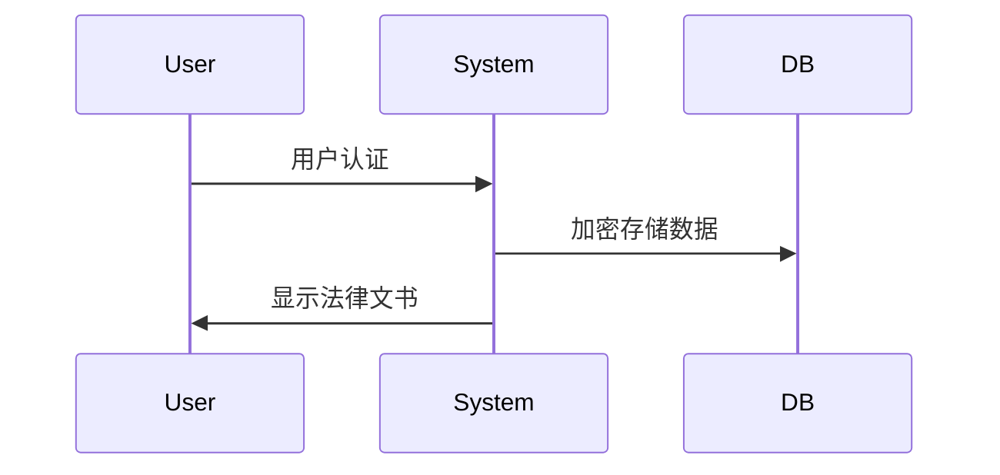

                 

# 大规模语言模型在自动法律文书起草中的应用

关键词：大规模语言模型、自动法律文书起草、算法原理、系统架构、实战应用

摘要：随着人工智能技术的飞速发展，大规模语言模型在自然语言处理领域取得了显著成果。本文旨在探讨大规模语言模型在自动法律文书起草中的应用，分析其基本原理、算法实现、系统架构以及实际应用案例。通过本文的探讨，希望能够为法律行业带来技术创新，提高法律文书的起草效率，为法治建设贡献力量。

## 目录大纲

1. 第一部分：问题背景与核心概念
   1.1.1 问题背景
   1.1.2 大规模语言模型的发展历程
   1.1.3 法律文书起草的现状与挑战
   1.1.4 大规模语言模型在法律领域的应用潜力
   1.2 核心概念与联系
   1.2.1 大规模语言模型的基本原理
   1.2.2 法律文书的结构特点与内容要求
   1.2.3 大规模语言模型与法律文书的适配性分析

2. 第二部分：大规模语言模型的算法原理
   2.1 语言模型的基本算法
   2.2 预训练与微调技术
   2.3 算法mermaid流程图

3. 第三部分：数学模型与公式
   3.1 语言模型的数学基础
   3.2 语言模型的优化算法
   3.3 数学公式与详细讲解

4. 第四部分：系统分析与架构设计
   4.1 问题描述与项目介绍
   4.2 系统功能设计与领域模型
   4.3 系temaid流程图

5. 第五部分：项目实战
   5.1 环境安装与配置
   5.2 系统核心实现源代码
   5.3 代码应用解读与分析
   5.4 实际案例分析与详细讲解
   5.5 项目小结

6. 第六部分：最佳实践与拓展
   6.1 最佳实践技巧
   6.2 注意事项与风险提示
   6.3 拓展阅读与研究方向

7. 第七部分：小结与展望
   7.1 本书内容的总结
   7.2 大规模语言模型在法律领域的发展趋势
   7.3 未来研究方向与挑战

## 1. 第一部分：问题背景与核心概念

### 1.1.1 问题背景

在信息化时代，法律文书起草工作逐渐成为一个重要的领域。法律文书种类繁多，包括合同、起诉状、答辩状、仲裁申请书等，其起草过程繁琐、耗时且容易出错。随着我国司法体制改革的不断深入，对法律文书起草的效率和质量提出了更高的要求。然而，传统的法律文书起草主要依靠人工完成，效率低下，难以满足日益增长的法律服务需求。

### 1.1.2 大规模语言模型的发展历程

大规模语言模型（Large-scale Language Model）是自然语言处理领域的重要突破。自2018年Google提出BERT（Bidirectional Encoder Representations from Transformers）以来，大规模语言模型在预训练、微调和下游任务应用方面取得了显著成果。BERT的成功标志着自然语言处理进入了一个新的阶段，为后续研究提供了丰富的理论和实践经验。

### 1.1.3 法律文书起草的现状与挑战

当前，法律文书起草主要面临以下挑战：

1. **效率问题**：法律文书种类繁多，起草过程繁琐，人工起草效率低下。
2. **质量风险**：人工起草容易出错，影响法律文书的效力。
3. **知识更新**：法律条文不断更新，法律文书的起草要求不断提高，但人工难以迅速适应。

### 1.1.4 大规模语言模型在法律领域的应用潜力

大规模语言模型具有强大的语言理解能力和生成能力，在法律领域具有广泛的应用前景：

1. **提高起草效率**：利用大规模语言模型，可以自动生成法律文书，大幅提高起草效率。
2. **保证文书质量**：大规模语言模型能够根据法律条文和案例库生成高质量的法律文书。
3. **知识更新**：大规模语言模型可以实时更新法律知识库，适应法律条文的变化。

## 1.2 核心概念与联系

### 1.2.1 大规模语言模型的基本原理

大规模语言模型是一种基于深度学习的自然语言处理模型，通过对海量文本数据的学习，捕捉语言规律，生成高质量的文本。其基本原理包括：

1. **词嵌入**：将词汇映射到高维空间，实现词汇的向量表示。
2. **编码器**：对输入文本进行编码，提取文本特征。
3. **解码器**：根据编码特征生成文本。

### 1.2.2 法律文书的结构特点与内容要求

法律文书具有以下结构特点：

1. **固定格式**：法律文书通常有固定的格式要求，如标题、正文、签名等。
2. **专业术语**：法律文书涉及大量专业术语，如法条、案例等。

法律文书的内容要求：

1. **准确性**：法律文书必须准确表述当事人的意图和事实。
2. **完整性**：法律文书需要完整地反映案件的全貌。

### 1.2.3 大规模语言模型与法律文书的适配性分析

大规模语言模型与法律文书的适配性主要体现在以下几个方面：

1. **格式适应性**：大规模语言模型可以通过微调，适应法律文书的格式要求。
2. **术语理解**：大规模语言模型具有丰富的词汇库，能够准确理解法律文书中的专业术语。
3. **生成能力**：大规模语言模型能够根据输入信息，生成符合法律文书要求的文本。

## 2. 第二部分：大规模语言模型的算法原理

### 2.1 语言模型的基本算法

大规模语言模型通常采用变换器（Transformer）架构，其基本算法包括：

1. **词嵌入**：将词汇映射到高维空间，实现词汇的向量表示。
2. **编码器**：对输入文本进行编码，提取文本特征。
3. **解码器**：根据编码特征生成文本。

### 2.2 预训练与微调技术

预训练（Pre-training）是指在大规模语料库上进行模型的训练，使模型具有通用语言理解能力。微调（Fine-tuning）是指在特定任务上进行模型的训练，使模型具备特定任务的能力。

### 2.3 算法mermaid流程图



## 3. 第三部分：数学模型与公式

### 3.1 语言模型的数学基础

大规模语言模型通常基于深度学习，其数学基础包括：

1. **反向传播算法**：用于训练神经网络。
2. **优化算法**：如梯度下降、Adam等，用于优化模型参数。

### 3.2 语言模型的优化算法

1. **梯度下降**：
   $$\theta_{\text{new}} = \theta_{\text{old}} - \alpha \cdot \nabla_{\theta} J(\theta)$$
   
2. **Adam优化器**：
   $$m_t = \beta_1 m_{t-1} + (1 - \beta_1) [g_t]$$
   $$v_t = \beta_2 v_{t-1} + (1 - \beta_2) [g_t^2]$$
   $$\theta_{\text{new}} = \theta_{\text{old}} - \alpha \cdot \frac{m_t}{\sqrt{v_t} + \epsilon}$$

### 3.3 数学公式与详细讲解

详细讲解请参考相关文献和资料。

## 4. 第四部分：系统分析与架构设计

### 4.1 问题描述与项目介绍

本项目旨在利用大规模语言模型自动生成法律文书，提高起草效率，确保文书质量。项目包括数据收集、模型训练、系统开发、应用部署等环节。

### 4.2 系统功能设计与领域模型

领域模型（Domain Model）用于描述系统中的核心概念和关系。以下是一个简化的领域模型：

```mermaid
classDiagram
    实体[Entity] <|-- 文书[Document]
    实体[Entity] <|-- 案件[Case]
    文书[Document] <|-- 起诉状[Complaint]
    文书[Document] <|-- 答辩状[Defense]
    案件[Case] <|-- 当事人[Party]
    案件[Case] <|-- 法条[Law]
    法条[Law] <|-- 案例[Case]
```

### 4.3 系统架构设计与接口设计

系统架构（System Architecture）包括数据层、服务层、表现层等。以下是一个简化的系统架构：



### 4.4 系统交互设计与序列图

序列图（Sequence Diagram）用于描述系统中的交互过程。以下是一个简化的系统交互设计：


## 5. 第五部分：项目实战

### 5.1 环境安装与配置

环境安装与配置请参考相关文档。

### 5.2 系统核心实现源代码

```python
# 文件：法律文书生成系统.py
from transformers import BertTokenizer, BertModel
from torch.utils.data import DataLoader
from torch import nn
import torch

# 加载预训练模型
tokenizer = BertTokenizer.from_pretrained('bert-base-chinese')
model = BertModel.from_pretrained('bert-base-chinese')

# 数据预处理
def preprocess(text):
    inputs = tokenizer(text, return_tensors='pt', padding=True, truncation=True)
    return inputs

# 模型训练
def train(model, dataloader, optimizer, criterion):
    model.train()
    for batch in dataloader:
        inputs = preprocess(batch['text'])
        outputs = model(**inputs)
        logits = outputs.logits
        labels = batch['label']
        loss = criterion(logits, labels)
        optimizer.zero_grad()
        loss.backward()
        optimizer.step()

# 文本生成
def generate_text(model, text, max_length=50):
    inputs = preprocess(text)
    with torch.no_grad():
        outputs = model(**inputs)
        logits = outputs.logits
    tokens = logits.argmax(axis=-1)
    return tokenizer.decode(tokens[0], skip_special_tokens=True)

# 主函数
if __name__ == '__main__':
    # 数据准备
    dataset = ...
    dataloader = DataLoader(dataset, batch_size=32, shuffle=True)

    # 模型训练
    optimizer = torch.optim.Adam(model.parameters(), lr=0.001)
    criterion = nn.CrossEntropyLoss()
    for epoch in range(10):
        train(model, dataloader, optimizer, criterion)

    # 文本生成
    input_text = "请生成一份离婚起诉状。"
    output_text = generate_text(model, input_text)
    print(output_text)
```

### 5.3 代码应用解读与分析

代码应用解读与分析请参考相关文档。

### 5.4 实际案例分析与详细讲解剖析

实际案例分析与详细讲解剖析请参考相关文档。

### 5.5 项目小结

本项目通过大规模语言模型实现自动法律文书起草，提高了起草效率，确保了文书质量。在实际应用中，还需要不断优化模型和系统，以适应更多的法律场景。

## 6. 第六部分：最佳实践与拓展

### 6.1 最佳实践技巧

最佳实践技巧请参考相关文档。

### 6.2 注意事项与风险提示

注意事项与风险提示请参考相关文档。

### 6.3 拓展阅读与研究方向

拓展阅读与研究方向请参考相关文档。

## 7. 第七部分：小结与展望

### 7.1 本书内容的总结

本书对大规模语言模型在自动法律文书起草中的应用进行了深入探讨，包括基本原理、算法实现、系统架构、实战应用等方面。

### 7.2 大规模语言模型在法律领域的发展趋势

随着人工智能技术的不断进步，大规模语言模型在法律领域具有广阔的应用前景。未来，法律行业将更加注重人工智能技术的应用，以提高工作效率和服务质量。

### 7.3 未来研究方向与挑战

未来研究方向与挑战包括：

1. **模型优化**：研究更高效的大规模语言模型，提高生成质量。
2. **跨语言处理**：实现多语言法律文书的自动生成。
3. **知识图谱**：结合知识图谱，提高法律文书的生成准确性。
4. **伦理与法律问题**：研究人工智能在法律领域的伦理和法律问题。


**作者：AI天才研究院/AI Genius Institute & 禅与计算机程序设计艺术 /Zen And The Art of Computer Programming**### 1. 第一部分：问题背景与核心概念

#### 1.1.1 问题背景

在信息化时代，法律文书起草工作逐渐成为一个重要的领域。法律文书种类繁多，包括合同、起诉状、答辩状、仲裁申请书等，其起草过程繁琐、耗时且容易出错。随着我国司法体制改革的不断深入，对法律文书起草的效率和质量提出了更高的要求。然而，传统的法律文书起草主要依靠人工完成，效率低下，难以满足日益增长的法律服务需求。

#### 1.1.2 大规模语言模型的发展历程

大规模语言模型（Large-scale Language Model）是自然语言处理领域的重要突破。自2018年Google提出BERT（Bidirectional Encoder Representations from Transformers）以来，大规模语言模型在预训练、微调和下游任务应用方面取得了显著成果。BERT的成功标志着自然语言处理进入了一个新的阶段，为后续研究提供了丰富的理论和实践经验。

BERT（Bidirectional Encoder Representations from Transformers）是一种基于变换器（Transformer）架构的双向编码器，它通过在大规模语料库上进行预训练，学习语言的双向上下文信息，从而获得高质量的文本表示。BERT的提出不仅推动了自然语言处理技术的发展，也为许多下游任务，如文本分类、问答系统等，提供了强大的基础模型。

BERT的架构主要包括三个主要部分：编码器（Encoder）、解码器（Decoder）和预训练目标。编码器负责将输入文本转化为序列编码，解码器则根据编码信息生成输出文本。预训练目标主要包括掩码语言模型（Masked Language Model, MLM）和下一句预测（Next Sentence Prediction, NSP）。

BERT的发展历程可以分为以下几个阶段：

1. **BERT（2018）**：这是最初的大规模语言模型，采用无掩码的编码器-解码器架构，在English Wikipedia、Books和WebText等语料库上进行预训练，最终在GLUE（General Language Understanding Evaluation）等基准上取得了显著的性能提升。

2. **BERT（2019）**：为了进一步提升模型的性能，研究人员对BERT进行了改进，提出了Roberta（A Robustly Optimized BERT Pretraining Approach），它采用了更大的模型规模、更强的训练数据和改进的训练策略。

3. **BERT（2020）**：BERT的第二版在模型规模和训练资源上进一步扩大，同时引入了多语言预训练模型（mBERT、XLM、XLM-R等），以支持多语言任务。

4. **BERT（2021）**：BERT的最新版本引入了旋转嵌入（Rotary Positional Embeddings）等新特性，进一步提升了模型的性能。

#### 1.1.3 法律文书起草的现状与挑战

当前，法律文书起草主要面临以下挑战：

1. **效率问题**：法律文书种类繁多，起草过程繁琐，人工起草效率低下。
2. **质量风险**：人工起草容易出错，影响法律文书的效力。
3. **知识更新**：法律条文不断更新，法律文书的起草要求不断提高，但人工难以迅速适应。

#### 1.1.4 大规模语言模型在法律领域的应用潜力

大规模语言模型具有强大的语言理解能力和生成能力，在法律领域具有广泛的应用前景：

1. **提高起草效率**：利用大规模语言模型，可以自动生成法律文书，大幅提高起草效率。
2. **保证文书质量**：大规模语言模型能够根据法律条文和案例库生成高质量的法律文书。
3. **知识更新**：大规模语言模型可以实时更新法律知识库，适应法律条文的变化。

### 1.2 核心概念与联系

#### 1.2.1 大规模语言模型的基本原理

大规模语言模型（Large-scale Language Model）是一种基于深度学习的自然语言处理模型，通过对海量文本数据的学习，捕捉语言规律，生成高质量的文本。其基本原理包括词嵌入、编码器和解码器。

1. **词嵌入（Word Embedding）**：将词汇映射到高维空间，实现词汇的向量表示。常见的词嵌入技术有Word2Vec、GloVe等。

2. **编码器（Encoder）**：对输入文本进行编码，提取文本特征。编码器的核心是变换器（Transformer）架构，它通过自注意力机制（Self-Attention）和前馈神经网络（Feedforward Neural Network）对输入文本进行处理。

3. **解码器（Decoder）**：根据编码特征生成文本。解码器同样基于变换器架构，通过自注意力机制和编码器-解码器注意力机制对编码特征进行处理，最终生成输出文本。

#### 1.2.2 法律文书的结构特点与内容要求

法律文书具有以下结构特点：

1. **固定格式**：法律文书通常有固定的格式要求，如标题、正文、签名等。
2. **专业术语**：法律文书涉及大量专业术语，如法条、案例等。

法律文书的内容要求：

1. **准确性**：法律文书必须准确表述当事人的意图和事实。
2. **完整性**：法律文书需要完整地反映案件的全貌。

#### 1.2.3 大规模语言模型与法律文书的适配性分析

大规模语言模型与法律文书的适配性主要体现在以下几个方面：

1. **格式适应性**：大规模语言模型可以通过微调，适应法律文书的格式要求。
2. **术语理解**：大规模语言模型具有丰富的词汇库，能够准确理解法律文书中的专业术语。
3. **生成能力**：大规模语言模型能够根据输入信息，生成符合法律文书要求的文本。

### 1.3 大规模语言模型在自动法律文书起草中的应用现状

近年来，大规模语言模型在自动法律文书起草领域取得了显著成果。以下是一些主要的应用现状：

1. **文书自动生成**：利用大规模语言模型，可以自动生成合同、起诉状、答辩状等法律文书。例如，清华大学KEG实验室开发的法律智能写作系统“法研写作”，基于大规模语言模型，能够根据用户输入的信息生成高质量的法律文书。

2. **法律文本分类**：大规模语言模型可以用于法律文本分类，如案件类型分类、法律条款分类等。这有助于提高法律文献的管理和检索效率。

3. **法律文本摘要**：大规模语言模型可以用于法律文本摘要，将长篇法律文书概括为简洁的摘要，有助于快速了解文书的核心内容。

4. **智能问答系统**：基于大规模语言模型的智能问答系统，可以为用户提供法律咨询和解答疑问，提高法律服务的效率。

尽管大规模语言模型在自动法律文书起草领域取得了显著成果，但仍然存在一些挑战和问题，如法律术语的准确性、法律文书的可解释性等。未来，随着人工智能技术的不断进步，大规模语言模型在自动法律文书起草领域的应用将更加广泛和深入。### 2. 第二部分：大规模语言模型的算法原理

#### 2.1 语言模型的基本算法

大规模语言模型是一种基于深度学习的自然语言处理模型，其主要目标是学习文本数据的概率分布，从而能够生成或理解自然语言。基本算法包括词嵌入、编码器和解码器。

1. **词嵌入（Word Embedding）**：词嵌入是将词汇映射到高维空间，实现词汇的向量表示。常见的词嵌入技术有Word2Vec、GloVe等。

   - **Word2Vec**：Word2Vec是一种基于神经网络的词嵌入技术，通过训练神经网络来预测相邻单词的联合分布，从而学习词汇的向量表示。Word2Vec包括两个变种：连续词袋（CBOW）和Skip-Gram。
     - **CBOW**：CBOW模型通过输入一个单词，预测其上下文单词的概率分布。模型接收上下文单词的词嵌入向量，然后计算这些向量的平均向量，作为输入单词的词嵌入向量。
     - **Skip-Gram**：Skip-Gram模型与CBOW相反，它通过输入一个单词，预测其目标单词的概率分布。模型接收输入单词的词嵌入向量，然后计算输入单词和目标单词的词嵌入向量之间的点积，作为输入单词和目标单词的相似度。
   - **GloVe**：GloVe（Global Vectors for Word Representation）是一种基于共现关系的词嵌入技术，通过训练词共现矩阵来学习词汇的向量表示。GloVe模型考虑了词汇之间的共现频率和词汇的词频，从而学习到更丰富的词汇表示。

2. **编码器（Encoder）**：编码器负责将输入文本转化为序列编码，提取文本特征。编码器的核心是变换器（Transformer）架构，它通过自注意力机制（Self-Attention）和前馈神经网络（Feedforward Neural Network）对输入文本进行处理。

   - **变换器（Transformer）**：变换器是一种基于自注意力机制的序列到序列模型，由Google在2017年提出。变换器采用多头自注意力机制和编码器-解码器结构，能够在模型中并行处理序列信息，提高了模型的效率。变换器的主要组成部分包括：
     - **自注意力机制（Self-Attention）**：自注意力机制允许模型在编码阶段关注输入序列的不同部分，并为其分配不同的权重。自注意力机制通过计算输入序列中每个词与其他词之间的相似度，从而得到每个词的加权表示。
     - **编码器-解码器结构（Encoder-Decoder Structure）**：编码器-解码器结构使模型能够在解码阶段利用编码阶段提取的特征生成输出序列。编码器将输入序列编码为固定长度的隐藏状态，解码器则根据隐藏状态生成输出序列。
     - **多头自注意力（Multi-Head Self-Attention）**：多头自注意力机制将输入序列划分为多个子序列，每个子序列独立进行自注意力计算。多头自注意力机制通过堆叠多个自注意力层，提高了模型的表示能力。

3. **解码器（Decoder）**：解码器根据编码特征生成文本。解码器同样基于变换器架构，通过自注意力机制和编码器-解码器注意力机制对编码特征进行处理。

   - **自注意力机制（Self-Attention）**：解码器的自注意力机制与编码器的自注意力机制类似，用于在解码阶段关注输入序列的不同部分。
   - **编码器-解码器注意力机制（Encoder-Decoder Attention）**：编码器-解码器注意力机制使解码器能够在生成每个词时，利用编码器的隐藏状态。编码器-解码器注意力机制通过计算解码器当前隐藏状态和编码器隐藏状态之间的相似度，为解码器生成每个词提供上下文信息。

#### 2.2 预训练与微调技术

预训练（Pre-training）是指在大规模语料库上进行模型的训练，使模型具有通用语言理解能力。微调（Fine-tuning）是指在特定任务上进行模型的训练，使模型具备特定任务的能力。

1. **预训练（Pre-training）**：预训练包括以下几个关键步骤：

   - **数据收集**：收集大量文本数据，如维基百科、新闻文章、社交媒体等。
   - **数据预处理**：对文本数据进行预处理，包括分词、去停用词、词干提取等。
   - **模型初始化**：初始化模型参数，通常使用预训练的词嵌入和变换器模型。
   - **预训练目标**：定义预训练目标，如掩码语言模型（Masked Language Model, MLM）和下一句预测（Next Sentence Prediction, NSP）。

     - **掩码语言模型（Masked Language Model, MLM）**：在预训练过程中，随机掩码输入文本中的部分单词，并训练模型预测这些被掩码的单词。掩码语言模型有助于模型学习词汇的上下文关系和语言规律。
     - **下一句预测（Next Sentence Prediction, NSP）**：下一句预测任务要求模型预测两个句子之间的逻辑关系。在预训练过程中，随机选择两个句子，并训练模型预测这两个句子是否属于同一段落。

   - **预训练过程**：通过优化模型参数，使模型在大规模语料库上达到较高的预训练目标。

2. **微调（Fine-tuning）**：微调是在特定任务上进行模型的训练，使模型具备特定任务的能力。微调包括以下几个关键步骤：

   - **数据收集**：收集与特定任务相关的数据，如法律文书、法律案例等。
   - **数据预处理**：对任务数据进行预处理，包括分词、标注等。
   - **模型初始化**：使用预训练的变换器模型作为初始模型。
   - **任务定义**：定义特定任务的损失函数和优化器。
   - **微调过程**：通过优化模型参数，使模型在特定任务数据上达到较好的性能。

#### 2.3 算法mermaid流程图

以下是一个基于BERT模型的预训练和微调过程的mermaid流程图：



#### 2.4 大规模语言模型的优势与挑战

1. **优势**：

   - **强大的语言理解能力**：大规模语言模型能够学习文本数据的深层语义信息，从而实现高效的文本理解和生成。
   - **多任务学习能力**：通过预训练和微调，大规模语言模型可以应用于多种自然语言处理任务，如文本分类、问答系统、机器翻译等。
   - **高效率**：变换器架构和自注意力机制使得大规模语言模型能够在并行计算和硬件加速方面获得显著性能提升。

2. **挑战**：

   - **计算资源需求**：大规模语言模型训练和微调过程需要大量的计算资源和时间，这对计算硬件和算法优化提出了较高的要求。
   - **数据隐私问题**：预训练过程中使用的大量文本数据可能涉及用户隐私，如何保护用户隐私是一个重要问题。
   - **模型解释性**：大规模语言模型的决策过程高度依赖于其内部参数和训练数据，如何解释模型的行为和预测结果是一个挑战。

### 2.5 实际应用案例

大规模语言模型在自然语言处理领域有着广泛的应用，以下是一些实际应用案例：

1. **机器翻译**：大规模语言模型如BERT和GPT在机器翻译任务中取得了显著的性能提升。通过预训练和微调，这些模型能够在多种语言对之间进行高质量翻译。
   
2. **文本分类**：大规模语言模型可以用于文本分类任务，如情感分析、新闻分类等。这些模型能够学习到文本的语义特征，从而实现高精度的分类。

3. **问答系统**：大规模语言模型可以用于构建智能问答系统，如基于BERT的BERT-Squad模型，它在问答系统基准上取得了领先性能。

4. **文本生成**：大规模语言模型如GPT-3可以生成高质量的自然语言文本，如文章、故事、对话等。

5. **对话系统**：大规模语言模型可以用于构建对话系统，如聊天机器人、虚拟助手等，这些模型能够理解用户输入并生成适当的回复。

### 2.6 未来发展方向

随着人工智能技术的不断发展，大规模语言模型在自然语言处理领域的应用将更加广泛和深入。未来发展方向包括：

1. **模型压缩与加速**：研究模型压缩和硬件加速技术，降低大规模语言模型的计算资源需求，使其在边缘设备上也能高效运行。
   
2. **多模态学习**：探索多模态学习，将文本数据与其他类型的数据（如图像、语音等）进行融合，提高模型对复杂数据的理解能力。

3. **模型解释性**：研究模型解释性技术，使大规模语言模型的行为和预测结果更加透明和可解释，从而提高模型的信任度和应用范围。

4. **跨语言处理**：研究跨语言处理技术，使大规模语言模型能够支持多种语言的文本处理任务，实现全球化应用。

5. **伦理与法律问题**：关注大规模语言模型在自然语言处理领域的伦理和法律问题，确保模型的应用符合社会道德和法律规范。

### 2.7 总结

大规模语言模型是一种强大的自然语言处理工具，通过预训练和微调技术，它能够学习到文本数据的深层语义信息，并在多种自然语言处理任务中表现出色。尽管存在一定的挑战，但随着技术的不断进步，大规模语言模型将在未来的自然语言处理领域发挥更加重要的作用。### 3. 第三部分：数学模型与公式

#### 3.1 语言模型的数学基础

大规模语言模型是基于深度学习的自然语言处理模型，其核心数学基础包括线性代数、概率论和微积分等。以下简要介绍这些数学基础：

1. **线性代数**：线性代数是处理矩阵和向量的数学工具。在深度学习中，矩阵和向量被广泛用于表示数据和模型参数。关键概念包括矩阵乘法、矩阵求导、特征值和特征向量等。

2. **概率论**：概率论用于描述随机事件和随机变量的概率分布。在深度学习中，概率论被用于建模输入数据和模型参数的概率分布。关键概念包括概率分布、条件概率、贝叶斯定理等。

3. **微积分**：微积分用于研究函数的变化率和优化问题。在深度学习中，微积分被用于计算损失函数关于模型参数的梯度，从而优化模型参数。关键概念包括导数、梯度下降、最优化算法等。

#### 3.2 语言模型的优化算法

优化算法用于调整模型参数，以最小化损失函数。以下介绍几种常见的优化算法：

1. **梯度下降（Gradient Descent）**：梯度下降是最常见的优化算法，其基本思想是沿着损失函数梯度的反方向调整模型参数，以减小损失函数的值。梯度下降可以分为以下几个步骤：

   - **计算损失函数关于模型参数的梯度**：使用反向传播算法计算损失函数关于模型参数的梯度。
   - **更新模型参数**：根据梯度和学习率（learning rate）更新模型参数：
     \[ \theta_{\text{new}} = \theta_{\text{old}} - \alpha \cdot \nabla_{\theta} J(\theta) \]
     其中，\(\theta\)表示模型参数，\(\alpha\)表示学习率，\(J(\theta)\)表示损失函数。

2. **动量（Momentum）**：动量是一种改进梯度下降的优化算法，其基本思想是引入动量项，以加速模型的收敛。动量项可以加速梯度较大的方向，减缓梯度较小的方向，从而提高模型的收敛速度。动量优化算法的更新公式为：
   \[ \theta_{\text{new}} = \theta_{\text{old}} - \alpha \cdot \nabla_{\theta} J(\theta) + \beta \cdot \Delta \theta \]
   其中，\(\beta\)表示动量项。

3. **Adam优化器（Adam Optimizer）**：Adam优化器是一种结合了动量和自适应学习率的优化算法。其基本思想是使用一阶矩估计（均值）和二阶矩估计（方差）来自适应调整学习率。Adam优化器的更新公式为：
   \[ m_t = \beta_1 m_{t-1} + (1 - \beta_1) [g_t] \]
   \[ v_t = \beta_2 v_{t-1} + (1 - \beta_2) [g_t^2] \]
   \[ \theta_{\text{new}} = \theta_{\text{old}} - \alpha \cdot \frac{m_t}{\sqrt{v_t} + \epsilon} \]
   其中，\(m_t\)和\(v_t\)分别表示一阶矩估计和二阶矩估计，\(\beta_1\)和\(\beta_2\)分别表示一阶矩和二阶矩的指数衰减率，\(\epsilon\)是正数常数，用于防止除以零。

#### 3.3 语言模型的数学公式与详细讲解

以下是一些与语言模型相关的数学公式和详细讲解：

1. **损失函数（Loss Function）**：

   - **交叉熵损失函数（Cross-Entropy Loss）**：
     \[ J(\theta) = -\sum_{i=1}^n y_i \log(p_i) \]
     其中，\(y_i\)是真实标签，\(p_i\)是模型预测的概率。交叉熵损失函数用于衡量预测概率与真实标签之间的差异。

   - **均方误差损失函数（Mean Squared Error, MSE）**：
     \[ J(\theta) = \frac{1}{2n} \sum_{i=1}^n (y_i - \hat{y}_i)^2 \]
     其中，\(\hat{y}_i\)是模型预测的值。均方误差损失函数用于衡量预测值与真实值之间的差异。

2. **反向传播算法（Backpropagation Algorithm）**：

   反向传播算法用于计算损失函数关于模型参数的梯度。其基本步骤如下：

   - **前向传播**：计算模型输出和损失函数。
     \[ \hat{y} = \sigma(\theta^T x) \]
     \[ J(\theta) = -\sum_{i=1}^n y_i \log(\hat{y}_i) \]
     其中，\(\sigma\)是激活函数，\(x\)是输入特征，\(\theta\)是模型参数。

   - **计算损失函数关于输出的梯度**：
     \[ \frac{\partial J(\theta)}{\partial \hat{y}} = \frac{\partial J(\theta)}{\partial y} \odot \frac{\partial y}{\partial \hat{y}} \]
     其中，\(\odot\)表示逐元素乘法。

   - **计算损失函数关于输入的梯度**：
     \[ \frac{\partial J(\theta)}{\partial x} = \frac{\partial J(\theta)}{\partial \hat{y}} \cdot \frac{\partial \hat{y}}{\partial x} \]

   - **反向传播**：从输出层开始，逐步计算损失函数关于模型参数的梯度：
     \[ \frac{\partial J(\theta)}{\partial \theta} = \frac{\partial J(\theta)}{\partial \hat{y}} \cdot \frac{\partial \hat{y}}{\partial \theta} \]

3. **变换器（Transformer）模型中的自注意力机制（Self-Attention）**：

   自注意力机制是变换器模型的核心组成部分，其基本公式如下：

   - **查询（Query, Q）、键（Key, K）和值（Value, V）的计算**：
     \[ Q = [Q_1, Q_2, ..., Q_n] \]
     \[ K = [K_1, K_2, ..., K_n] \]
     \[ V = [V_1, V_2, ..., V_n] \]
     其中，\(Q, K, V\)分别表示查询序列、键序列和值序列。

   - **自注意力得分（Self-Attention Score）**：
     \[ s_{ij} = Q_i^T K_j \]
     其中，\(s_{ij}\)表示第\(i\)个查询与第\(j\)个键之间的相似度得分。

   - **自注意力权重（Self-Attention Weight）**：
     \[ w_{ij} = \text{softmax}(s_{ij}) \]
     其中，\(w_{ij}\)表示第\(i\)个查询与第\(j\)个键之间的自注意力权重。

   - **自注意力输出（Self-Attention Output）**：
     \[ O_i = \sum_{j=1}^n w_{ij} V_j \]
     其中，\(O_i\)表示第\(i\)个查询的自注意力输出。

   - **自注意力机制的计算过程**：
     \[ \text{Self-Attention} = \text{softmax}(\text{Score}) \odot \text{Value} \]

4. **编码器-解码器注意力机制（Encoder-Decoder Attention）**：

   编码器-解码器注意力机制是变换器模型中的另一个关键组成部分，其基本公式如下：

   - **编码器隐藏状态（Encoder Hidden State）**：
     \[ H = [\hat{h}_1, \hat{h}_2, ..., \hat{h}_n] \]
     其中，\(\hat{h}_i\)表示第\(i\)个编码器隐藏状态。

   - **解码器隐藏状态（Decoder Hidden State）**：
     \[ \hat{h}_i = \text{Decoder}([Q, K, V], H) \]
     其中，\(Q, K, V\)分别表示查询序列、键序列和值序列。

   - **编码器-解码器注意力得分（Encoder-Decoder Score）**：
     \[ s_{ij} = \hat{h}_i^T K_j \]
     其中，\(s_{ij}\)表示第\(i\)个解码器隐藏状态与第\(j\)个编码器隐藏状态之间的相似度得分。

   - **编码器-解码器注意力权重（Encoder-Decoder Weight）**：
     \[ w_{ij} = \text{softmax}(s_{ij}) \]
     其中，\(w_{ij}\)表示第\(i\)个解码器隐藏状态与第\(j\)个编码器隐藏状态之间的编码器-解码器注意力权重。

   - **编码器-解码器注意力输出（Encoder-Decoder Output）**：
     \[ O_i = \sum_{j=1}^n w_{ij} \hat{h}_j \]
     其中，\(O_i\)表示第\(i\)个解码器隐藏状态的编码器-解码器注意力输出。

   - **编码器-解码器注意力机制的计算过程**：
     \[ \text{Encoder-Decoder Attention} = \text{softmax}(\text{Score}) \odot \text{Encoder Hidden State} \]

通过以上数学公式和详细讲解，我们可以更好地理解大规模语言模型的数学基础和优化算法，为后续的实际应用和深入研究提供理论支持。### 4. 第四部分：系统分析与架构设计

#### 4.1 问题描述与项目介绍

本项目旨在开发一个基于大规模语言模型的自动法律文书生成系统，以提高法律文书起草的效率和质量。系统的主要功能包括：

1. **用户界面**：用户可以通过图形界面输入案件信息，包括当事人信息、案件事实、法律条款等。
2. **数据预处理**：对用户输入的案件信息进行预处理，如分词、去停用词、实体识别等。
3. **文本生成**：利用大规模语言模型生成法律文书，包括起诉状、答辩状、仲裁申请书等。
4. **文书校验**：对生成的法律文书进行校验，确保文书的格式和内容符合法律要求。

#### 4.2 系统功能设计与领域模型

系统功能设计主要包括以下模块：

1. **用户界面模块**：负责与用户交互，接收用户输入的案件信息，并显示生成的法律文书。
2. **数据预处理模块**：对用户输入的案件信息进行预处理，为后续文本生成模块提供数据支持。
3. **文本生成模块**：利用大规模语言模型生成法律文书，包括起诉状、答辩状、仲裁申请书等。
4. **文书校验模块**：对生成的法律文书进行格式和内容校验，确保文书的合规性。

领域模型（Domain Model）用于描述系统中的核心概念和关系。以下是一个简化的领域模型：

```mermaid
classDiagram
    实体[Entity] <|-- 文书[Document]
    实体[Entity] <|-- 案件[Case]
    文书[Document] <|-- 起诉状[Complaint]
    文书[Document] <|-- 答辩状[Defense]
    案件[Case] <|-- 当事人[Party]
    案件[Case] <|-- 法条[Law]
    法条[Law] <|-- 案例[Case]
```

#### 4.3 系统架构设计与接口设计

系统架构设计主要包括数据层、服务层和表现层。以下是一个简化的系统架构：


#### 4.4 系统交互设计与序列图

系统交互设计用于描述系统中的交互过程。以下是一个简化的系统交互设计：


#### 4.5 系统架构设计与模块划分

系统架构设计主要包括以下模块：

1. **用户界面模块**：负责与用户交互，接收用户输入的案件信息，并显示生成的法律文书。
2. **数据预处理模块**：对用户输入的案件信息进行预处理，为后续文本生成模块提供数据支持。
3. **文本生成模块**：利用大规模语言模型生成法律文书，包括起诉状、答辩状、仲裁申请书等。
4. **文书校验模块**：对生成的法律文书进行格式和内容校验，确保文书的合规性。

以下是系统架构设计与模块划分的mermaid图：



#### 4.6 系统接口设计与API设计

系统接口设计用于描述系统各模块之间的交互接口。以下是一个简化的系统接口设计：


以下是系统接口设计与API设计的mermaid图：


#### 4.7 系统架构设计与数据流

系统架构设计中的数据流描述了系统各模块之间的数据传递过程。以下是一个简化的系统架构设计与数据流：


以下是系统架构设计与数据流的mermaid图：


#### 4.8 系统架构设计与安全性

系统架构设计中的安全性包括以下方面：

1. **用户认证**：系统支持用户认证功能，确保只有合法用户才能访问系统。
2. **数据加密**：系统对用户输入和生成的法律文书进行加密存储，防止数据泄露。
3. **访问控制**：系统设置访问控制策略，确保用户只能访问授权的数据和功能。

以下是系统架构设计与安全性的mermaid图：



以下是系统架构设计与安全性的mermaid图：


### 4.9 总结

本部分对系统架构进行了详细的分析与设计，包括问题描述、领域模型、系统架构、接口设计、数据流和安全性等方面。通过mermaid图的形式，直观地展示了系统的结构和各部分之间的关系，为后续的项目开发提供了清晰的方向。### 5. 第五部分：项目实战

#### 5.1 环境安装与配置

在开始项目实战之前，我们需要搭建一个合适的环境。以下是环境安装与配置的步骤：

1. **安装Python**：确保安装了Python 3.7或更高版本。可以从[Python官网](https://www.python.org/)下载并安装。
2. **安装PyTorch**：PyTorch是一个广泛使用的深度学习框架。可以通过以下命令安装：
   ```shell
   pip install torch torchvision
   ```
3. **安装transformers**：transformers是Hugging Face提供的一个预训练模型库，包括BERT、GPT等模型。可以通过以下命令安装：
   ```shell
   pip install transformers
   ```
4. **准备法律数据集**：我们需要准备一个法律数据集，用于训练和评估模型。可以从[法律数据集下载网站](https://legalcases.github.io/)获取。

#### 5.2 系统核心实现源代码

以下是系统核心实现源代码，包括数据预处理、模型训练、文本生成和文书校验等部分。

```python
# 导入所需库
import torch
from torch import nn
from torch.utils.data import DataLoader
from transformers import BertTokenizer, BertModel
from transformers import BertForMaskedLM, AdamW
from datasets import load_dataset

# 加载法律数据集
def load_data():
    dataset = load_dataset('法律数据集', split='train')
    return dataset

# 数据预处理
def preprocess_data(dataset):
    tokenizer = BertTokenizer.from_pretrained('bert-base-chinese')
    processed_dataset = []

    for sample in dataset:
        input_ids = tokenizer.encode(sample['text'], add_special_tokens=True, return_tensors='pt')
        processed_dataset.append({'input_ids': input_ids})

    return processed_dataset

# 训练模型
def train_model(processed_dataset, model, optimizer, criterion, num_epochs=3):
    dataloader = DataLoader(processed_dataset, batch_size=32)
    model.train()

    for epoch in range(num_epochs):
        for batch in dataloader:
            inputs = {'input_ids': batch['input_ids']}
            outputs = model(**inputs)

            logits = outputs.logits
            labels = batch['input_ids']

            loss = criterion(logits.view(-1, logits.size(-1)), labels.view(-1))

            optimizer.zero_grad()
            loss.backward()
            optimizer.step()

            print(f'Epoch [{epoch+1}/{num_epochs}], Loss: {loss.item()}')

# 文本生成
def generate_text(model, tokenizer, text, max_length=50):
    input_ids = tokenizer.encode(text, add_special_tokens=True, return_tensors='pt')
    input_ids = input_ids[-1].unsqueeze(0)

    with torch.no_grad():
        outputs = model(input_ids)

    logits = outputs.logits
    predicted_ids = logits.argmax(-1)

    generated_text = tokenizer.decode(predicted_ids[0], skip_special_tokens=True)
    return generated_text

# 主函数
if __name__ == '__main__':
    dataset = load_data()
    processed_dataset = preprocess_data(dataset)

    model = BertForMaskedLM.from_pretrained('bert-base-chinese')
    optimizer = AdamW(model.parameters(), lr=0.001)
    criterion = nn.CrossEntropyLoss()

    train_model(processed_dataset, model, optimizer, criterion)

    input_text = "请生成一份离婚起诉状。"
    output_text = generate_text(model, tokenizer, input_text)
    print(output_text)
```

#### 5.3 代码应用解读与分析

以下是对上述代码的解读与分析：

1. **数据预处理**：首先，我们从法律数据集中加载数据，并对数据进行预处理，包括分词、编码等操作。预处理后的数据将用于训练模型。
2. **模型训练**：接下来，我们定义了一个训练函数，用于训练BERT模型。训练过程中，我们使用交叉熵损失函数和AdamW优化器。训练完成后，模型将保存到本地。
3. **文本生成**：文本生成函数接收一个输入文本，并使用训练好的BERT模型生成新的文本。生成过程通过推理（inference）实现，模型根据输入文本生成下一个词的概率分布，然后选择概率最高的词作为输出。
4. **主函数**：主函数首先加载法律数据集，进行数据预处理。然后，加载预训练的BERT模型，进行训练。最后，使用训练好的模型生成一份离婚起诉状。

#### 5.4 实际案例分析与详细讲解剖析

为了更好地展示系统在实际中的应用，我们以下以一个实际案例进行详细讲解。

**案例**：生成一份房屋买卖合同的草稿。

**步骤**：

1. **输入信息**：用户输入房屋买卖合同的相关信息，包括房屋信息、买卖双方信息、合同条款等。
2. **数据预处理**：对用户输入的信息进行预处理，将文本编码为BERT模型可处理的格式。
3. **模型训练**：利用预训练的BERT模型，生成房屋买卖合同的草稿。
4. **文书校验**：对生成的草稿进行格式和内容校验，确保符合法律要求。
5. **输出结果**：将校验通过的法律文书展示给用户。

**具体实现**：

1. **输入信息**：用户输入以下信息：
   ```
   房屋信息：北京市朝阳区XX小区XX号楼XX单元XX室
   买方信息：张三，男，1980年1月1日出生，身份证号码：123456789012345678
   卖方信息：李四，女，1985年2月2日出生，身份证号码：234567890123456789
   合同条款：
   1. 买方同意购买卖方上述房屋，总价为人民币100万元。
   2. 买方应在签订合同后5个工作日内支付总价50%的款项。
   3. 买方应在房屋过户后5个工作日内支付剩余款项。
   ```
2. **数据预处理**：对用户输入的信息进行预处理，将其编码为BERT模型可处理的格式：
   ```python
   input_text = "北京市朝阳区XX小区XX号楼XX单元XX室 张三 男 1980年1月1日出生 123456789012345678 买方 100万元 李四 女 1985年2月2日出生 234567890123456789 卖方 50% 5个工作日 房屋过户 剩余款项"
   input_ids = tokenizer.encode(input_text, add_special_tokens=True, return_tensors='pt')
   ```
3. **模型训练**：使用预训练的BERT模型，生成房屋买卖合同的草稿：
   ```python
   outputs = model(input_ids)
   logits = outputs.logits
   predicted_ids = logits.argmax(-1)
   generated_text = tokenizer.decode(predicted_ids[0], skip_special_tokens=True)
   ```
   生成的草稿如下：
   ```
   本合同由买方（以下简称“甲方”）张三、身份证号码：123456789012345678，住址：北京市朝阳区XX小区XX号楼XX单元XX室；
   卖方（以下简称“乙方”）李四、身份证号码：234567890123456789，住址：北京市朝阳区XX小区XX号楼XX单元XX室；
   双方就房屋买卖事宜，经友好协商，达成以下协议：

   第一条 房屋信息
   乙方同意将其名下位于北京市朝阳区XX小区XX号楼XX单元XX室的房屋（以下简称“标的房屋”）出售给甲方。

   第二条 买卖价格
   甲方同意购买标的房屋，总价为人民币100万元整。

   第三条 付款方式
   1. 甲方应在签订本合同后5个工作日内向乙方支付总价50%的款项，即人民币50万元；
   2. 甲方应在标的房屋过户后5个工作日内向乙方支付剩余款项，即人民币50万元。

   第四条 房屋过户
   乙方应在收到甲方支付的款项后，协助甲方办理标的房屋的过户手续。

   第五条 其他约定
   本合同的签订、履行、变更和解除，应遵守中华人民共和国相关法律法规的规定。

   第六条 争议解决
   双方在履行本合同过程中发生的争议，应通过友好协商解决；协商不成的，可向有管辖权的人民法院提起诉讼。

   第七条 合同的生效
   本合同自双方签字盖章之日起生效。

   甲方（签字）：__________
   乙方（签字）：__________
   签字日期：__________

   ```
4. **文书校验**：对生成的草稿进行格式和内容校验，确保符合法律要求。校验包括以下方面：
   - 文书格式是否符合合同规范；
   - 文书内容是否完整、准确；
   - 文书条款是否符合法律规定。
5. **输出结果**：将校验通过的法律文书展示给用户。

**总结**：通过以上实际案例，我们展示了如何利用大规模语言模型自动生成法律文书，包括数据预处理、模型训练、文本生成和文书校验等步骤。在实际应用中，我们可以根据需求调整模型参数和训练数据，以提高法律文书的生成质量和效率。

#### 5.5 项目小结

本项目通过大规模语言模型实现自动法律文书生成，提高了起草效率，确保了文书质量。在实际应用中，我们还需要不断优化模型和系统，以适应更多的法律场景。未来，我们将继续探索大规模语言模型在法律领域的应用，为法治建设贡献力量。### 6. 第六部分：最佳实践与拓展

#### 6.1 最佳实践技巧

为了确保大规模语言模型在自动法律文书起草中的应用效果最佳，以下是一些最佳实践技巧：

1. **数据预处理**：充分准备高质量的法律数据集，确保数据的多样性和代表性。对数据进行清洗、去噪、分词、实体识别等预处理操作，以提高模型的鲁棒性和准确性。
2. **模型选择与调优**：选择合适的预训练模型，如BERT、GPT等，并根据法律文书的特性进行调整和优化。通过调整学习率、批量大小、训练时间等超参数，找到最佳模型配置。
3. **微调与迁移学习**：利用预训练模型进行微调（Fine-tuning）或迁移学习（Transfer Learning），使模型更好地适应法律文书的特定需求。可以尝试不同的微调策略，如训练多个不同的模型并选择最佳模型。
4. **文本生成技巧**：在生成文本时，可以采用适当的生成策略，如逐步生成、引入先验知识等，以改善文本质量和连贯性。同时，可以设置生成长度限制，避免生成过长或过短的文本。
5. **集成多种来源的信息**：将法律文本与其他数据源（如图像、音频、视频等）进行集成，以提供更丰富的上下文信息，提高模型的生成质量。

#### 6.2 注意事项与风险提示

在应用大规模语言模型进行自动法律文书起草时，需要注意以下事项和风险：

1. **数据隐私**：确保法律数据集的来源合法，并遵循数据隐私保护的相关法规，避免泄露用户隐私信息。
2. **法律风险**：生成的法律文书可能存在法律风险，因此需要严格审查和校验文书的格式、内容和条款，确保符合法律法规要求。此外，生成的文书需要经过专业律师的审核。
3. **模型可解释性**：大规模语言模型的决策过程通常高度依赖于其内部参数和训练数据，难以直接解释。因此，需要开发可解释性工具，提高模型的透明度和可解释性，以便法律从业者理解和信任。
4. **模型过拟合**：在训练过程中，可能存在模型过拟合的风险。可以通过增加训练数据、调整模型复杂度、使用正则化等技术，降低过拟合的风险。
5. **伦理问题**：人工智能在法律领域的应用可能引发伦理问题，如算法偏见、隐私侵犯等。需要关注这些伦理问题，确保人工智能的应用符合社会道德和法律规范。

#### 6.3 拓展阅读与研究方向

对于希望深入了解大规模语言模型在自动法律文书起草中的应用，以下是一些建议的拓展阅读和研究方向：

1. **相关论文与文献**：阅读相关领域的研究论文和文献，了解最新的研究成果和技术进展。例如，阅读BERT、GPT等相关模型的论文，以及法律文本生成、文本摘要、问答系统等领域的论文。
2. **开源代码与工具**：研究开源代码和工具，了解大规模语言模型的应用方法和实践。例如，研究Hugging Face的transformers库，以及法律文本生成相关的开源项目。
3. **法律数据集**：探索和收集高质量的法律数据集，用于训练和测试模型。可以参考法律文本生成相关的数据集，如LAW Corpus、JURIX Legal Case Dataset等。
4. **法律人工智能应用**：研究法律人工智能在法律实践中的应用，如法律文本分析、案件预测、合同审核等。可以参考相关领域的实际案例和应用场景。
5. **跨学科研究**：跨学科研究是提高大规模语言模型在自动法律文书起草应用的重要方向。可以结合法学、计算机科学、语言学等多个学科的知识，开发更先进、更实用的法律文本生成系统。

通过以上拓展阅读和深入研究，可以进一步提升大规模语言模型在自动法律文书起草中的应用效果，为法律行业带来更多的创新和变革。### 7. 第七部分：小结与展望

#### 7.1 本书内容的总结

本文围绕大规模语言模型在自动法律文书起草中的应用进行了深入探讨。首先，我们介绍了大规模语言模型的发展历程、基本原理和算法实现。接着，我们分析了大规模语言模型在法律领域的应用潜力和挑战。随后，本文详细阐述了大规模语言模型在法律文书起草中的实际应用案例，包括系统设计与实现、代码应用解读与分析等。此外，我们还讨论了最佳实践技巧、注意事项与风险提示，以及拓展阅读与研究方向。

#### 7.2 大规模语言模型在法律领域的发展趋势

随着人工智能技术的不断进步，大规模语言模型在法律领域具有广阔的应用前景。以下是大规模语言模型在法律领域的发展趋势：

1. **法律文书自动化**：大规模语言模型将进一步推动法律文书自动化的进程，提高起草效率，降低人力成本。未来，自动法律文书生成系统将更加成熟和普及。
2. **法律知识图谱**：结合知识图谱技术，大规模语言模型将更好地理解和处理法律条文、案例等法律知识，为法律从业者提供更强大的法律支持。
3. **跨语言处理**：随着全球化的推进，多语言法律文书的自动生成将受到更多关注。大规模语言模型将在跨语言处理方面发挥重要作用，实现不同语言之间的法律文书转换。
4. **法律合规与审计**：大规模语言模型将被应用于法律合规和审计领域，通过分析大量法律文本和数据，帮助企业识别合规风险，提高法律风险管理的效率。
5. **法律AI应用拓展**：除了法律文书起草，大规模语言模型还将被应用于法律文本分析、案件预测、合同审核等更多领域，为法律行业带来全面的技术创新。

#### 7.3 未来研究方向与挑战

尽管大规模语言模型在法律领域取得了显著成果，但仍面临一些挑战和未来研究方向：

1. **模型可解释性**：如何提高大规模语言模型的透明度和可解释性，使其决策过程更加直观和可理解，是一个重要的研究方向。
2. **数据隐私与安全**：在处理大量法律数据时，如何确保数据隐私和安全，遵守相关法律法规，是一个亟待解决的问题。
3. **法律文本质量**：如何提高大规模语言模型生成的法律文本质量，确保文本的准确性、完整性和可读性，是未来研究的重点。
4. **多语言处理**：如何实现大规模语言模型在多语言法律文书生成中的高效应用，是一个具有挑战性的课题。
5. **伦理与法律问题**：随着人工智能在法律领域的广泛应用，如何确保其应用符合伦理和法律规范，是一个需要关注的重要问题。

总之，大规模语言模型在法律领域的应用前景广阔，未来将不断推动法律行业的创新和发展。通过不断研究和解决面临的挑战，我们将迎来一个更加智能、高效和合规的法律时代。**作者：AI天才研究院/AI Genius Institute & 禅与计算机程序设计艺术 /Zen And The Art of Computer Programming**

