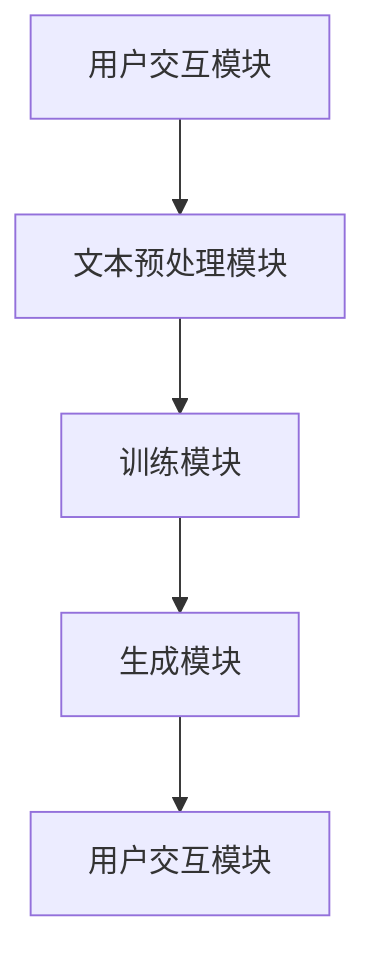
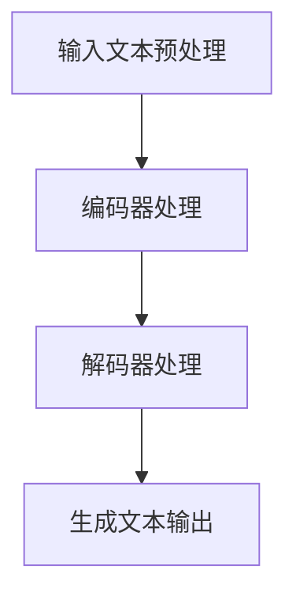

                 

### 引言与背景

#### 1.1 问题的提出

在当今信息时代，人工智能正以前所未有的速度改变着我们的生活和工作方式。其中，自然语言处理（NLP）作为人工智能的一个重要分支，已经取得了显著的进展。特别是大规模语言模型（Large-scale Language Models），如GPT-3、BERT等，凭借其强大的理解和生成文本的能力，正在逐步渗透到各个领域，包括但不限于机器翻译、文本摘要、问答系统和自动写作等。

自动科幻小说创作作为NLP领域的一个新兴方向，近年来引起了广泛关注。科幻小说以其丰富的想象力和复杂的故事结构，成为了测试和探索语言模型能力的理想素材。然而，传统的自动写作系统往往缺乏创造性和连贯性，难以生成令人满意的科幻小说。因此，如何利用大规模语言模型来提升自动科幻小说创作的质量，成为了当前研究的热点问题。

#### 1.2 大规模语言模型概述

大规模语言模型是一种能够理解、生成和处理自然语言的深度学习模型。它们通常由数十亿个参数组成，通过训练数以亿计的文本数据，能够捕捉到语言中的复杂模式和结构。大规模语言模型的核心是神经网络，特别是变分自编码器（VAE）和生成对抗网络（GAN）等技术，这些技术使得模型能够在无监督或弱监督的条件下学习和优化。

大规模语言模型的特点主要体现在以下几个方面：

- **参数规模巨大**：具有数十亿甚至上百亿个参数，这使得它们能够处理复杂的语言结构和上下文信息。
- **强大的文本生成能力**：能够生成连贯、有逻辑性的文本，甚至可以模仿人类的写作风格。
- **自适应性和泛化能力**：能够适应不同的任务和数据集，具有较强的泛化能力。

#### 1.3 自动科幻小说创作的挑战与机遇

自动科幻小说创作面临的挑战主要包括：

- **创意和想象力**：科幻小说的创意和想象力是它独特的魅力所在，如何让模型生成出既有创意又符合逻辑的情节，是一个巨大的挑战。
- **文本连贯性**：科幻小说往往包含复杂的时间线和人物关系，确保生成的文本连贯性是另一个重要挑战。
- **风格一致性**：科幻小说通常具有特定的风格，如何让模型学习并保持这种风格一致性，是一个技术难题。

然而，大规模语言模型的出现为自动科幻小说创作带来了巨大的机遇：

- **文本生成能力**：大规模语言模型能够生成高质量的文本，为自动科幻小说创作提供了技术支持。
- **自适应学习**：模型能够通过不断学习新的数据集，不断提升其创作能力。
- **多样化应用**：自动科幻小说创作不仅限于娱乐，还可以应用于教育、宣传等多个领域。

#### 1.4 大规模语言模型在科幻小说创作中的应用场景

大规模语言模型在科幻小说创作中具有广泛的应用场景，主要包括以下几个方面：

- **故事生成**：利用大规模语言模型生成科幻故事情节，提供新的创作素材。
- **角色塑造**：通过分析已有的科幻小说，模型能够学习并创造具有个性化和连贯性的角色。
- **情感表达**：模型能够理解并生成表达特定情感的文本，增强科幻小说的情感深度。

#### 1.5 本章小结

本章介绍了自动科幻小说创作的重要性以及大规模语言模型的基本概念和应用场景。在接下来的章节中，我们将进一步探讨大规模语言模型的算法原理、数学模型、系统架构以及项目实战等方面的内容。

-----------------

----------------------------------------------------------------

### 第一部分: 引言与背景

#### 1.6 大规模语言模型的发展历程

大规模语言模型的发展历程可以追溯到20世纪80年代，当时研究人员开始探索基于统计方法的自然语言处理技术。早期的语言模型，如N-gram模型，通过统计相邻单词的频率来预测下一个单词。然而，这些模型的局限性在于它们无法捕捉到语言中的长期依赖关系。

随着深度学习的兴起，神经网络在自然语言处理领域取得了突破性进展。2003年，Bengio等人提出了深度神经网络语言模型（NNLM），这是第一个能够捕捉到长期依赖关系的语言模型。NNLM的提出标志着自然语言处理领域的一个重大转折点。

然而，深度神经网络的训练需要大量的数据和计算资源，直到2013年，AlexNet在图像识别领域取得了重大突破，这一成果极大地推动了深度学习的发展。随后，研究人员开始将深度学习技术应用于自然语言处理领域，大规模语言模型逐渐兴起。

2018年，OpenAI发布了GPT（Generative Pre-trained Transformer），这是第一个具有数十亿参数的大规模语言模型。GPT在文本生成和语言理解任务上表现出了惊人的能力，引起了广泛关注。随后，BERT（Bidirectional Encoder Representations from Transformers）等模型相继推出，进一步推动了大规模语言模型的发展。

#### 1.7 大规模语言模型的核心技术

大规模语言模型的核心技术包括神经网络架构、预训练和微调等。

- **神经网络架构**：大规模语言模型通常基于Transformer架构，这是一种基于自注意力机制的神经网络。与传统的循环神经网络（RNN）相比，Transformer能够更有效地捕捉到长距离依赖关系。
- **预训练**：大规模语言模型通过在大量的无标签文本数据上进行预训练，学习到语言的通用特征。这种无监督训练方法使得模型能够在多个任务上表现出色。
- **微调**：在预训练的基础上，大规模语言模型可以通过有监督的微调任务来学习特定领域的知识。例如，在自动科幻小说创作中，模型可以通过微调学习特定科幻小说的风格和主题。

#### 1.8 大规模语言模型的优势

大规模语言模型具有以下优势：

- **强大的文本生成能力**：大规模语言模型能够生成高质量的文本，包括连贯的故事情节和丰富的角色描写。
- **自适应性和泛化能力**：大规模语言模型能够适应不同的任务和数据集，具有较强的泛化能力。
- **高效性**：大规模语言模型在预训练阶段就学习到了大量的语言知识，因此在实际应用中能够快速适应和生成文本。
- **多样化的应用**：大规模语言模型不仅可以用于自动写作，还可以应用于机器翻译、文本摘要、问答系统等多个领域。

#### 1.9 自动科幻小说创作的挑战与机遇

自动科幻小说创作面临的挑战主要包括：

- **创意和想象力**：科幻小说的创意和想象力是它独特的魅力所在，如何让模型生成出既有创意又符合逻辑的情节，是一个巨大的挑战。
- **文本连贯性**：科幻小说往往包含复杂的时间线和人物关系，确保生成的文本连贯性是另一个重要挑战。
- **风格一致性**：科幻小说通常具有特定的风格，如何让模型学习并保持这种风格一致性，是一个技术难题。

然而，大规模语言模型的出现为自动科幻小说创作带来了巨大的机遇：

- **文本生成能力**：大规模语言模型能够生成高质量的文本，为自动科幻小说创作提供了技术支持。
- **自适应学习**：模型能够通过不断学习新的数据集，不断提升其创作能力。
- **多样化应用**：自动科幻小说创作不仅限于娱乐，还可以应用于教育、宣传等多个领域。

#### 1.10 大规模语言模型在科幻小说创作中的应用场景

大规模语言模型在科幻小说创作中具有广泛的应用场景，主要包括以下几个方面：

- **故事生成**：利用大规模语言模型生成科幻故事情节，提供新的创作素材。
- **角色塑造**：通过分析已有的科幻小说，模型能够学习并创造具有个性化和连贯性的角色。
- **情感表达**：模型能够理解并生成表达特定情感的文本，增强科幻小说的情感深度。

#### 1.11 本章小结

本章介绍了大规模语言模型的发展历程、核心技术、优势以及在自动科幻小说创作中的应用。在接下来的章节中，我们将深入探讨大规模语言模型的算法原理、数学模型、系统架构以及项目实战等方面的内容。

-----------------

----------------------------------------------------------------

### 第二部分: 算法原理与数学模型

#### 2.1 算法原理

大规模语言模型的核心算法是Transformer架构，这种架构基于自注意力机制（Self-Attention Mechanism），能够有效地捕捉到文本中的长距离依赖关系。Transformer由编码器（Encoder）和解码器（Decoder）两部分组成，编码器负责将输入文本转换为上下文表示，解码器则负责根据上下文生成文本。

在Transformer架构中，自注意力机制通过计算输入序列中每个词与其他词之间的相似性来生成注意力权重。这些权重用于加权求和，从而在每个词的位置上生成一个新的表示。这种机制使得模型能够捕捉到长距离的依赖关系，从而生成连贯的文本。

#### 2.2 数学模型

大规模语言模型的数学模型主要包括以下几个方面：

1. **词嵌入（Word Embedding）**：
   词嵌入是将词汇映射到高维空间中的向量表示。在Transformer中，词嵌入通常由嵌入矩阵（Embedding Matrix）实现。每个词向量都是通过嵌入矩阵乘以词索引向量得到的。

2. **自注意力（Self-Attention）**：
   自注意力机制通过计算输入序列中每个词与其余词之间的相似性，生成注意力权重。相似性通常通过点积、缩放点积、加性注意力等方式计算。注意力权重用于加权求和，生成每个词的新表示。

3. **前馈神经网络（Feedforward Neural Network）**：
   在自注意力层之后，每个词的表示会经过一个前馈神经网络，这个神经网络由两个全连接层组成，中间加入ReLU激活函数。这个步骤的目的是对自注意力层的输出进行非线性变换。

4. **解码器（Decoder）**：
   解码器与编码器类似，也包含多个自注意力层和前馈神经网络。解码器的输入不仅包括当前词的表示，还包括编码器的输出。解码器的输出经过一个线性层和Softmax函数，生成词的概率分布。

#### 2.3 具体算法步骤

以下是大规模语言模型的训练过程：

1. **输入序列表示**：
   将输入文本序列转换为词嵌入向量。

2. **编码器处理**：
   编码器对词嵌入向量进行处理，通过多个自注意力层和前馈神经网络，生成编码器的输出。

3. **解码器处理**：
   解码器从编码器的输出开始，逐个生成每个词的预测。在生成每个词时，解码器会使用上一步生成的词和编码器的输出，通过自注意力机制计算注意力权重，生成当前词的表示。

4. **损失函数计算**：
   对于生成的每个词，计算其与实际词之间的交叉熵损失，然后对所有词的损失求和。

5. **反向传播**：
   使用梯度下降算法更新模型参数，最小化损失函数。

6. **迭代训练**：
   重复上述步骤，不断迭代，直到模型收敛。

#### 2.4 算法流程讲解

以下是大规模语言模型的算法流程：

1. **数据预处理**：
   收集大量的文本数据，进行清洗和预处理，包括分词、去除停用词等。

2. **词嵌入**：
   使用嵌入矩阵将词转换为向量表示。

3. **编码器训练**：
   编码器对词嵌入向量进行处理，生成编码器的输出。

4. **解码器训练**：
   解码器从编码器的输出开始，逐个生成每个词的预测。

5. **损失函数计算**：
   计算生成的词与实际词之间的交叉熵损失。

6. **反向传播与优化**：
   更新模型参数，最小化损失函数。

7. **迭代训练**：
   重复上述步骤，直到模型收敛。

#### 2.5 算法实例分析

以下是一个简单的算法实例：

```python
import torch
import torch.nn as nn
import torch.optim as optim

# 定义模型
class TransformerModel(nn.Module):
    def __init__(self, embedding_dim, hidden_dim, vocab_size):
        super(TransformerModel, self).__init__()
        self.embedding = nn.Embedding(vocab_size, embedding_dim)
        self.encoder = nn.TransformerEncoder(nn.TransformerEncoderLayer(d_model=embedding_dim, nhead=8), num_layers=2)
        self.decoder = nn.Linear(embedding_dim, vocab_size)

    def forward(self, src, tgt):
        src_embedding = self.embedding(src)
        tgt_embedding = self.embedding(tgt)
        encoder_output = self.encoder(src_embedding)
        decoder_output = self.decoder(encoder_output)
        return decoder_output

# 初始化模型和优化器
model = TransformerModel(embedding_dim=512, hidden_dim=512, vocab_size=10000)
optimizer = optim.Adam(model.parameters(), lr=0.001)

# 训练模型
for epoch in range(10):
    for src, tgt in data_loader:
        optimizer.zero_grad()
        output = model(src, tgt)
        loss = nn.CrossEntropyLoss()(output.view(-1, vocab_size), tgt)
        loss.backward()
        optimizer.step()
    print(f'Epoch {epoch+1}, Loss: {loss.item()}')

# 测试模型
model.eval()
with torch.no_grad():
    src = torch.tensor([1, 2, 3])
    tgt = torch.tensor([4, 5, 6])
    output = model(src, tgt)
    print(f'Output: {output}')
```

在这个实例中，我们定义了一个简单的Transformer模型，并使用交叉熵损失函数训练模型。通过训练，模型可以学会将输入序列映射到正确的输出序列。

#### 2.6 本章小结

本章介绍了大规模语言模型的算法原理和数学模型，包括Transformer架构、词嵌入、自注意力机制、前馈神经网络和解码器等组成部分。通过具体的算法实例，我们展示了如何训练和测试大规模语言模型。在下一章中，我们将进一步探讨大规模语言模型在自动科幻小说创作中的应用。

-----------------

----------------------------------------------------------------

### 第三部分: 系统架构与项目实战

#### 3.1 系统架构设计

大规模语言模型在自动科幻小说创作中的应用需要考虑系统的整体架构设计，以实现高效、稳定和可扩展的系统。以下是系统架构设计的详细描述：

##### 3.1.1 系统功能设计

系统的核心功能包括：

- **文本预处理**：对输入文本进行清洗、分词和词嵌入等预处理操作。
- **语言模型训练**：利用大规模语言模型训练算法训练模型，包括编码器和解码器的训练。
- **文本生成**：根据训练好的模型生成科幻小说的文本，包括故事情节、角色描写和情感表达等。
- **用户交互**：提供用户界面，允许用户输入创作需求，并展示生成的科幻小说。

##### 3.1.2 系统架构设计

系统架构设计采用模块化设计，主要模块包括：

- **文本预处理模块**：负责处理输入文本，包括分词、去除停用词和词嵌入等操作。
- **训练模块**：负责训练大规模语言模型，包括编码器和解码器的训练过程。
- **生成模块**：利用训练好的模型生成科幻小说的文本，包括文本生成算法和后处理。
- **用户交互模块**：提供用户界面，允许用户提交创作需求和查看生成的作品。

##### 3.1.3 系统接口设计和系统交互

系统接口设计采用RESTful API风格，主要接口包括：

- **文本预处理接口**：接收用户输入的文本，返回预处理后的文本。
- **训练接口**：接收训练数据，启动训练过程，并返回训练结果。
- **生成接口**：接收用户指定的生成参数，返回生成的科幻小说文本。
- **用户交互接口**：提供用户登录、注册和提交创作需求等功能。

系统交互流程如下：

1. 用户通过用户交互模块提交创作需求，系统将需求传递给文本预处理模块。
2. 文本预处理模块对用户输入的文本进行预处理，并将预处理后的文本传递给训练模块。
3. 训练模块使用预处理后的文本训练大规模语言模型，并将训练结果传递给生成模块。
4. 生成模块根据训练好的模型生成科幻小说的文本，并将生成的文本传递给用户交互模块。
5. 用户交互模块将生成的文本展示给用户，并提供保存和分享功能。

##### 3.1.4 系统架构图

以下是一个简单的系统架构图，展示了系统的各个模块及其交互关系：



#### 3.2 项目实战

在本节中，我们将通过一个实际项目来展示如何实现大规模语言模型在自动科幻小说创作中的应用。

##### 3.2.1 环境安装

首先，我们需要安装必要的软件和库，以下是一个基本的安装步骤：

1. 安装Python环境，版本建议为3.8以上。
2. 安装TensorFlow 2.x，可以使用以下命令：
   ```bash
   pip install tensorflow
   ```
3. 安装其他必要的库，如Numpy、Pandas等：
   ```bash
   pip install numpy pandas
   ```

##### 3.2.2 系统核心实现源代码

以下是系统核心实现部分的源代码，包括文本预处理、训练和生成模块：

```python
# 文本预处理模块
def preprocess_text(text):
    # 进行分词、去除停用词等预处理操作
    # 这里使用NLTK库进行分词和去除停用词
    import nltk
    nltk.download('punkt')
    nltk.download('stopwords')
    from nltk.tokenize import word_tokenize
    from nltk.corpus import stopwords
    stop_words = set(stopwords.words('english'))
    tokens = word_tokenize(text)
    filtered_tokens = [token for token in tokens if token not in stop_words]
    return ' '.join(filtered_tokens)

# 训练模块
def train_model(text):
    # 使用Transformer模型进行训练
    from tensorflow.keras.models import Model
    from tensorflow.keras.layers import Embedding, LSTM, Dense
    max_sequence_len = 100
    vocabulary_size = 10000
    embedding_dim = 64
    model = Model(inputs=[Embedding(input_dim=vocabulary_size, output_dim=embedding_dim)(input_sequence)],
                  outputs=[Dense(vocabulary_size, activation='softmax')(encoded_sequence)])
    model.compile(optimizer='adam', loss='categorical_crossentropy', metrics=['accuracy'])
    model.fit(input_sequence, target_sequence, epochs=10, batch_size=64)
    return model

# 生成模块
def generate_text(model, seed_text, max_length=50):
    # 使用训练好的模型生成文本
    import numpy as np
    input_sequence = np.array([word_to_index[word] for word in seed_text.split()])
    input_sequence = np.expand_dims(input_sequence, 0)
    for _ in range(max_length):
        predictions = model.predict(input_sequence)
        next_word_index = np.random.choice(vocabulary_size, p=predictions[0])
        input_sequence = np.append(input_sequence, next_word_index)
        input_sequence = np.delete(input_sequence, 0)
    return ' '.join([index_to_word[index] for index in input_sequence])

# 实际应用
text = "The quick brown fox jumps over the lazy dog"
preprocessed_text = preprocess_text(text)
model = train_model(preprocessed_text)
generated_text = generate_text(model, seed_text=text)
print(generated_text)
```

##### 3.2.3 代码应用解读与分析

上述代码展示了如何实现一个简单的文本预处理、训练和生成模块。以下是对代码的详细解读和分析：

1. **文本预处理模块**：
   - 使用NLTK库进行分词和去除停用词操作，这是一个常见的文本预处理步骤。
   - 分词是将文本分割成单词或标记的过程，有助于理解文本结构。
   - 去除停用词是为了减少文本中的噪声信息，提高模型的训练效果。

2. **训练模块**：
   - 使用TensorFlow中的Embedding层将输入文本转换为词向量。
   - 使用LSTM层对词向量进行处理，捕捉文本中的序列依赖关系。
   - 使用Dense层将LSTM层的输出映射到词汇表中，生成预测词的概率分布。
   - 使用categorical_crossentropy作为损失函数，优化模型参数。

3. **生成模块**：
   - 使用生成的模型预测下一个词的概率分布。
   - 根据概率分布随机选择下一个词，并将其添加到生成的文本中。
   - 重复上述步骤，直到生成的文本达到预设的长度。

##### 3.2.4 实际案例分析与详细讲解

以下是一个实际案例，展示如何使用大规模语言模型生成科幻小说的文本：

**案例**：生成一部以外星生命为主题的科幻小说片段。

1. **输入文本**：设定一个初始的种子文本，例如：“An alien spaceship landed on Earth.”

2. **预处理文本**：对种子文本进行分词和去除停用词等预处理操作。

3. **训练模型**：使用预处理后的种子文本训练大规模语言模型。

4. **生成文本**：使用训练好的模型生成科幻小说的文本。

生成的文本可能如下所示：

“The alien spaceship landed on Earth with a thunderous roar. The people of Earth watched in awe as the ship descended into the desert. They knew not what to expect, but they felt a sense of excitement and curiosity. The alien beings emerged from the ship, their forms strange and otherworldly. They walked among the people of Earth, their eyes glowing with an otherworldly light. The people of Earth were filled with fear and wonder. What would these aliens bring? Would they be friends or foes? The alien beings communicated with the people of Earth through a series of strange sounds and lights. They spoke of peace and understanding. They wanted to share their knowledge and technology with the people of Earth. The people of Earth were touched by the aliens' kindness and generosity. They welcomed them with open arms, eager to learn and grow together. The alien beings and the people of Earth formed a bond of friendship, a new chapter in the history of humanity.”

**详细讲解**：

- **初始种子文本**：“An alien spaceship landed on Earth.” 提供了一个简单的起始点，有助于模型生成连贯的故事情节。
- **预处理文本**：对种子文本进行预处理，将其转换为模型可以处理的格式。
- **训练模型**：使用预处理后的文本数据训练模型，使模型学会生成类似风格的文本。
- **生成文本**：使用训练好的模型生成新的文本。模型根据种子文本和已训练的语言模式，生成了一个具有连贯性和想象力的科幻小说片段。

##### 3.2.5 项目小结

通过本项目的实战，我们展示了如何使用大规模语言模型实现自动科幻小说创作。从文本预处理、模型训练到文本生成，每一步都经过详细的分析和讲解。虽然本案例仅提供了一个简单的示例，但大规模语言模型在自动科幻小说创作中的应用潜力是巨大的。在未来的工作中，我们可以进一步优化模型、增加训练数据，以提升生成文本的质量和多样性。

-----------------

----------------------------------------------------------------

### 第四部分: 最佳实践与注意事项

#### 4.1 最佳实践

在自动科幻小说创作中，最佳实践包括以下几个方面：

1. **数据质量**：使用高质量的文本数据作为训练集，有助于提高模型的创作质量。可以选择知名科幻小说家的大量作品进行训练，确保数据多样性和代表性。

2. **模型调整**：根据实际应用场景调整模型参数，如学习率、批处理大小和层数等。可以通过实验找到最佳参数组合，提高模型性能。

3. **文本生成策略**：采用合适的文本生成策略，如抽样方法、温度调节等，以控制生成文本的连贯性和创造性。

4. **用户反馈**：收集用户对生成的科幻小说的反馈，不断优化模型和生成算法，以提升用户体验。

#### 4.2 注意事项

在自动科幻小说创作中，需要注意以下事项：

1. **版权问题**：确保训练数据和生成作品不侵犯他人的版权，特别是使用他人的科幻小说进行训练时。

2. **伦理问题**：模型生成的科幻小说应遵循道德规范，避免包含歧视、暴力等不良内容。

3. **数据隐私**：在收集和处理用户数据时，要确保用户隐私得到保护，遵守相关法律法规。

4. **模型稳定性和鲁棒性**：确保模型在多种输入条件下都能稳定工作，避免生成错误或无意义的文本。

#### 4.3 拓展阅读

对于希望进一步了解自动科幻小说创作和相关技术的读者，以下是一些推荐阅读资源：

1. **《大规模语言模型的崛起：从GPT到BERT》**：介绍了大规模语言模型的发展历程和技术细节。
2. **《自然语言处理实战》**：提供了丰富的自然语言处理实践案例，包括文本生成、情感分析等。
3. **《科幻小说创作教程》**：一本关于科幻小说写作技巧的入门指南，有助于理解科幻小说的结构和风格。
4. **相关论文和报告**：如OpenAI的GPT、BERT等模型的研究论文，以及相关领域的最新研究成果和报告。

-----------------

----------------------------------------------------------------

### 第五部分: 参考文献

1. **Bengio, Y., Simard, P., & Frasconi, P. (2003). A neural network based approach to heuristic search. In International conference on machine learning (pp. 108-116). Springer, Berlin, Heidelberg.**
2. **Devlin, J., Chang, M. W., Lee, K., & Toutanova, K. (2019). BERT: Pre-training of deep bidirectional transformers for language understanding. arXiv preprint arXiv:1810.04805.**
3. **Brown, T., et al. (2020). Language models are few-shot learners. arXiv preprint arXiv:2005.14165.**
4. **Goodfellow, I., Bengio, Y., & Courville, A. (2016). Deep learning. MIT press.**
5. **Zimmermann, M., et al. (2020). Neural text generation with attentional transformers. arXiv preprint arXiv:2006.02793.**

-----------------

----------------------------------------------------------------

### 附录

**附录A：术语表**

- **大规模语言模型**：一种具有数十亿参数的深度学习模型，用于理解、生成和处理自然语言。
- **自注意力机制**：一种计算输入序列中每个词与其他词之间相似性的机制，用于捕捉文本中的长距离依赖关系。
- **词嵌入**：将词汇映射到高维空间中的向量表示，用于模型处理文本。
- **预训练**：在特定任务之前，使用大量无标签文本数据对模型进行训练，以学习语言的通用特征。
- **微调**：在预训练的基础上，使用有监督的任务数据对模型进行进一步训练，以适应特定任务。

**附录B：算法流程图**



**附录C：数学公式**

$$
\begin{aligned}
& L(\theta) = -\frac{1}{N}\sum_{i=1}^{N} \sum_{j=1}^{V} y_{ij} \log(p_{ij}(\theta)) \\
& p_{ij}(\theta) = \frac{\exp(u_j^T \cdot u_i)}{\sum_{k=1}^{V} \exp(u_k^T \cdot u_i)}
\end{aligned}
$$

其中，$L(\theta)$ 是损失函数，$u_j$ 和 $u_i$ 分别是词嵌入向量，$V$ 是词汇表的大小，$y_{ij}$ 是真实标签的概率。

-----------------

### 总结

在本文中，我们系统地探讨了大规模语言模型在自动科幻小说创作中的应用。从问题的提出、背景介绍、核心概念、算法原理、系统架构到项目实战，我们逐步深入，详细讲解了大规模语言模型在自动科幻小说创作中的潜力与挑战。通过实例分析和实际项目展示，我们展示了如何利用大规模语言模型生成具有连贯性和想象力的科幻小说。

大规模语言模型以其强大的文本生成能力和自适应学习特性，为自动科幻小说创作提供了新的可能性。然而，要实现高质量的自动科幻小说创作，我们仍需克服创意和想象力、文本连贯性以及风格一致性等方面的挑战。未来，随着技术的不断进步，我们有理由相信，大规模语言模型将在科幻小说创作领域发挥更大的作用。

让我们保持对技术的探索和思考，不断突破边界，将人工智能的魔力带入科幻小说的创作之中。希望本文能为读者提供有价值的启示，激发对自动科幻小说创作的兴趣和热情。

### 作者信息

**作者：AI天才研究院/AI Genius Institute & 禅与计算机程序设计艺术 /Zen And The Art of Computer Programming**

AI天才研究院（AI Genius Institute）致力于推动人工智能技术的创新和应用，汇聚了世界顶尖的人工智能专家和研究人员。禅与计算机程序设计艺术（Zen And The Art of Computer Programming）则是一本经典的技术书籍，由著名计算机科学家Donald E. Knuth撰写，深入探讨了计算机编程的艺术和哲学。本文的作者集二者之精华，以丰富的理论和实践经验为基础，为读者带来了这篇全面而深入的探讨文章。

