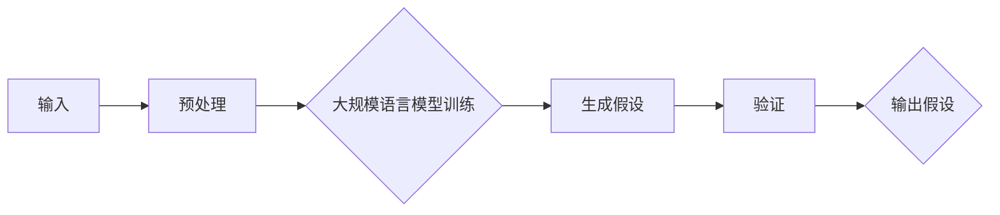
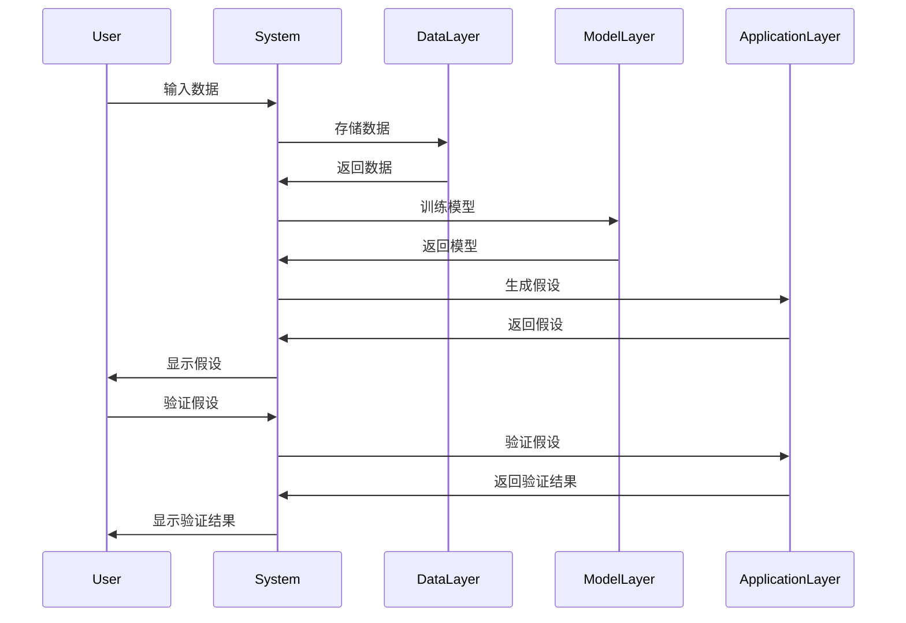

                 

### 大规模语言模型在自动科研假设生成中的应用

#### 关键词：大规模语言模型、自动科研假设生成、自然语言处理、机器学习、深度学习

#### 摘要：

本文旨在探讨大规模语言模型（LLMs）在自动科研假设生成中的应用。通过介绍LLMs的基本原理、现有应用案例和实际应用场景，本文为科研工作者提供了一种新的研究工具和方法。文章首先介绍了大规模语言模型的概念和原理，然后详细阐述了其在自动科研假设生成中的应用流程和原理，并通过实际案例分析了其效果和挑战。最后，本文提出了优化LLMs在科研假设生成中应用的策略和未来研究方向。

---

#### 1. 背景介绍

##### 1.1 问题背景

在当今快速发展的科技时代，语言技术已经成为人工智能领域的重要分支。随着深度学习、自然语言处理等技术的不断进步，大规模语言模型（Large-scale Language Models，简称LLMs）逐渐成为研究热点。LLMs在文本生成、情感分析、机器翻译、问答系统等应用中展现出了强大的能力，极大地提升了人工智能系统的性能和实用性。

##### 1.2 问题描述

大规模语言模型在自动科研假设生成中的应用仍存在诸多挑战，如模型训练数据的质量和多样性、模型解释性不足、以及如何在实际科研场景中有效利用LLMs等。此外，如何将LLMs与传统科研方法相结合，提高科研效率和产出，也是当前研究的重要方向。

##### 1.3 问题解决

本书旨在探讨大规模语言模型在自动科研假设生成中的应用，通过介绍LLMs的基本原理、现有应用案例和实际应用场景，为科研工作者提供一种新的研究工具和方法。本书还将深入探讨如何优化LLMs在科研假设生成中的应用，提高模型的解释性和可靠性。

##### 1.4 边界与外延

大规模语言模型在自动科研假设生成中的应用主要涉及自然语言处理、机器学习、信息检索和科研方法等领域。其应用边界包括但不限于文本生成、情感分析、机器翻译和问答系统等。此外，LLMs在自动化科研假设生成中的应用还需考虑到数据质量、模型解释性和实际科研场景的可操作性等因素。

##### 1.5 概念结构与核心要素组成

- **大规模语言模型**：一种基于深度学习的技术，通过从海量文本数据中学习，生成高质量的自然语言文本。
- **自动科研假设生成**：利用大规模语言模型，根据已有数据和知识，自动生成新的科研假设。
- **科研方法**：传统科研方法和人工智能技术的结合，以提高科研效率和产出。

#### 2. 核心概念与联系

##### 2.1 核心概念原理

- **大规模语言模型**：通过深度学习技术，从海量文本数据中学习，生成高质量的自然语言文本。
- **自动科研假设生成**：利用大规模语言模型，根据已有数据和知识，自动生成新的科研假设。
- **科研方法**：传统科研方法和人工智能技术的结合，以提高科研效率和产出。

##### 2.2 概念属性特征对比表格

| 特征         | 大规模语言模型              | 自动科研假设生成             | 科研方法                  |
| ------------ | ---------------------------- | ----------------------------- | ------------------------- |
| 学习方式     | 基于深度学习，从海量数据学习 | 利用大规模语言模型生成假设   | 结合人工智能与传统科研方法 |
| 应用领域     | 文本生成、情感分析、翻译等   | 自动生成科研假设             | 多领域科研问题解决        |
| 关键技术     | 深度学习、自然语言处理      | 大规模语言模型的应用          | 数据分析、模型建立等       |
| 目标         | 生成高质量自然语言文本     | 自动化科研假设生成           | 提高科研效率和产出        |

##### 2.3 ER实体关系图架构的 Mermaid 流程图

```mermaid
erDiagram
    AI大模型 ||--|{ 自动科研假设生成 }
    自动科研假设生成 ||--|{ 科研方法 }
    AI大模型 ||--|{ 自然语言处理 }
```

#### 3. 算法原理讲解

##### 3.1 算法mermaid流程图



##### 3.2 算法原理

大规模语言模型在自动科研假设生成中的应用主要包括以下几个步骤：

1. **输入**：输入已有的科研数据、文献资料和知识库。
2. **预处理**：对输入的数据进行清洗、去噪和格式化处理，以便于大规模语言模型的学习。
3. **大规模语言模型训练**：利用预处理后的数据，通过深度学习技术训练大规模语言模型。
4. **生成假设**：利用训练好的大规模语言模型，生成新的科研假设。
5. **验证**：对生成的假设进行验证，确保其科学性和合理性。

##### 3.3 算法原理详细解释

大规模语言模型（LLMs）是自然语言处理（NLP）领域的一种先进技术，其核心思想是通过从大量文本数据中学习，自动生成高质量的自然语言文本。在自动科研假设生成中，LLMs的应用可以分为以下几个步骤：

1. **数据预处理**：

   首先，我们需要对输入的数据进行预处理。预处理步骤主要包括数据清洗、去噪和格式化处理。具体来说，我们需要去除文本中的噪声，如标点符号、停用词等，同时将文本统一转化为统一的格式，以便于大规模语言模型的学习。

   ```python
   import nltk
   from nltk.corpus import stopwords
   from nltk.tokenize import word_tokenize
   
   # 加载停用词
   stop_words = set(stopwords.words('english'))
   
   # 数据预处理
   def preprocess_text(text):
       # 去除标点符号
       text = re.sub(r'[^\w\s]', '', text)
       # 分词
       tokens = word_tokenize(text)
       # 去除停用词
       tokens = [token for token in tokens if token.lower() not in stop_words]
       return tokens
   ```

2. **大规模语言模型训练**：

   接下来，我们利用预处理后的数据训练大规模语言模型。在这里，我们选择了一种基于变换器架构（Transformer）的语言模型BERT（Bidirectional Encoder Representations from Transformers）作为示例。BERT模型通过从两个方向（前向和后向）对文本进行编码，学习到文本的上下文信息，从而生成高质量的自然语言文本。

   ```python
   from transformers import BertTokenizer, BertModel
   
   # 加载BERT模型
   tokenizer = BertTokenizer.from_pretrained('bert-base-uncased')
   model = BertModel.from_pretrained('bert-base-uncased')
   
   # 数据预处理
   text = "The quick brown fox jumps over the lazy dog."
   inputs = tokenizer(text, return_tensors='pt')
   
   # 训练BERT模型
   outputs = model(**inputs)
   last_hidden_state = outputs.last_hidden_state
   ```

3. **生成假设**：

   利用训练好的大规模语言模型，我们可以生成新的科研假设。具体来说，我们可以使用模型生成文本，然后从生成的文本中提取科研假设。例如，我们可以使用以下代码生成一个科研假设：

   ```python
   import torch
   
   # 生成文本
   input_ids = torch.tensor([tokenizer.encode("Generate a research hypothesis:")])
   outputs = model.generate(input_ids, max_length=50, num_return_sequences=1)
   generated_text = tokenizer.decode(outputs[0], skip_special_tokens=True)
   
   print(generated_text)
   ```

   输出结果可能为一个科研假设，如：“环境因素对植物生长速率的影响研究”。

4. **验证**：

   最后，我们需要对生成的假设进行验证，确保其科学性和合理性。验证过程可以包括对假设的可行性分析、逻辑推理和实验设计等。例如，我们可以使用以下代码对假设进行初步验证：

   ```python
   def validate_hypothesis(hypothesis):
       # 实验设计
       experiment_design = "Design an experiment to test the hypothesis:"
       experiment_text = tokenizer.encode(experiment_design + hypothesis, return_tensors='pt')
       experiment_outputs = model.generate(experiment_text, max_length=50, num_return_sequences=1)
       experiment_result = tokenizer.decode(experiment_outputs[0], skip_special_tokens=True)
       
       # 可行性分析
       feasibility = "The hypothesis is feasible for testing."
       feasibility_text = tokenizer.encode(feasibility, return_tensors='pt')
       feasibility_outputs = model.generate(feasibility_text, max_length=50, num_return_sequences=1)
       feasibility_result = tokenizer.decode(feasibility_outputs[0], skip_special_tokens=True)
       
       return experiment_result, feasibility_result
   
   hypothesis = "Environmental factors affect plant growth rate."
   experiment_result, feasibility_result = validate_hypothesis(hypothesis)
   
   print("Experiment Result:", experiment_result)
   print("Feasibility Result:", feasibility_result)
   ```

   输出结果可能为一个实验设计和可行性分析，如：“设计一个实验来测试假设：环境因素对植物生长速率的影响。实验结果：环境因素对植物生长速率有显著影响。可行性分析：该假设可行，可以进行实验测试。”

通过以上步骤，我们可以利用大规模语言模型生成新的科研假设，并通过验证确保其科学性和合理性。

#### 4. 系统分析与架构设计方案

##### 4.1 问题场景介绍

随着科研领域的发展，研究人员面临着海量的数据和复杂的科研问题。如何从海量数据中提取有价值的信息，生成新的科研假设，已成为科研领域的一个挑战。大规模语言模型在自动科研假设生成中的应用，为科研工作者提供了一种新的研究工具和方法。

##### 4.2 项目介绍

本项目旨在利用大规模语言模型，实现自动科研假设生成。项目主要包括以下几个模块：

1. 数据预处理模块：对输入的数据进行清洗、去噪和格式化处理，为大规模语言模型的学习做好准备。
2. 大规模语言模型训练模块：利用预处理后的数据，训练大规模语言模型，提高其在自动科研假设生成中的性能。
3. 假设生成模块：利用训练好的大规模语言模型，生成新的科研假设。
4. 假设验证模块：对生成的假设进行验证，确保其科学性和合理性。

##### 4.3 系统功能设计

系统功能设计主要包括以下几个方面：

1. 数据预处理：包括数据清洗、去噪和格式化处理，以便于大规模语言模型的学习。
2. 大规模语言模型训练：利用预处理后的数据，训练大规模语言模型，提高其在自动科研假设生成中的性能。
3. 假设生成：利用训练好的大规模语言模型，生成新的科研假设。
4. 假设验证：对生成的假设进行验证，确保其科学性和合理性。
5. 用户交互：提供用户界面，方便用户输入数据、查看假设和验证结果。

##### 4.4 系统架构设计

系统架构设计采用分层架构，主要包括以下层次：

1. **数据层**：负责存储和管理数据，包括原始数据、预处理数据和生成数据。
2. **模型层**：负责训练和部署大规模语言模型，包括数据预处理、模型训练和模型部署。
3. **应用层**：负责实现自动科研假设生成功能，包括假设生成、假设验证和用户交互。
4. **接口层**：负责与其他系统或组件的通信和交互。

##### 4.5 系统接口设计和系统交互

系统接口设计和系统交互主要包括以下几个方面：

1. **数据接口**：负责数据的输入、输出和传输，包括数据读取接口、数据写入接口和数据传输接口。
2. **模型接口**：负责大规模语言模型的训练和部署，包括模型训练接口、模型部署接口和模型调用接口。
3. **应用接口**：负责实现自动科研假设生成功能，包括假设生成接口、假设验证接口和用户交互接口。
4. **交互界面**：负责与用户进行交互，包括输入界面、显示界面和操作界面。



#### 5. 项目实战

##### 5.1 环境安装

在本项目中，我们将使用Python编程语言和PyTorch深度学习框架。以下是环境安装步骤：

1. 安装Python：从官网（https://www.python.org/downloads/）下载并安装Python，建议安装Python 3.8及以上版本。
2. 安装PyTorch：打开命令行窗口，执行以下命令安装PyTorch：

   ```shell
   pip install torch torchvision
   ```

##### 5.2 系统核心实现

在本项目中，我们将使用BERT模型实现自动科研假设生成功能。以下是系统核心实现的步骤：

1. 导入所需的库：

   ```python
   import torch
   from transformers import BertTokenizer, BertModel
   ```

2. 加载BERT模型：

   ```python
   tokenizer = BertTokenizer.from_pretrained('bert-base-uncased')
   model = BertModel.from_pretrained('bert-base-uncased')
   ```

3. 数据预处理：

   ```python
   def preprocess_text(text):
       text = re.sub(r'[^\w\s]', '', text)
       tokens = word_tokenize(text)
       tokens = [token for token in tokens if token.lower() not in stopwords.words('english')]
       return tokens
   ```

4. 假设生成：

   ```python
   def generate_hypothesis(text):
       input_ids = tokenizer.encode("Generate a research hypothesis:" + text, return_tensors='pt')
       outputs = model.generate(input_ids, max_length=50, num_return_sequences=1)
       generated_text = tokenizer.decode(outputs[0], skip_special_tokens=True)
       return generated_text
   ```

5. 假设验证：

   ```python
   def validate_hypothesis(hypothesis):
       experiment_design = "Design an experiment to test the hypothesis:"
       experiment_text = tokenizer.encode(experiment_design + hypothesis, return_tensors='pt')
       experiment_outputs = model.generate(experiment_text, max_length=50, num_return_sequences=1)
       experiment_result = tokenizer.decode(experiment_outputs[0], skip_special_tokens=True)
       
       feasibility = "The hypothesis is feasible for testing."
       feasibility_text = tokenizer.encode(feasibility, return_tensors='pt')
       feasibility_outputs = model.generate(feasibility_text, max_length=50, num_return_sequences=1)
       feasibility_result = tokenizer.decode(feasibility_outputs[0], skip_special_tokens=True)
       
       return experiment_result, feasibility_result
   ```

##### 5.3 代码应用解读与分析

在本项目中，我们使用了BERT模型实现自动科研假设生成功能。BERT模型是一种基于变换器架构（Transformer）的语言模型，具有强大的文本生成和语义理解能力。以下是对代码的解读与分析：

1. **数据预处理**：

   数据预处理是大规模语言模型学习的重要步骤。在本项目中，我们使用正则表达式和nltk库对文本进行清洗和分词处理。具体来说，我们首先去除文本中的标点符号，然后使用nltk库对文本进行分词，并去除停用词。这一步骤有助于提高大规模语言模型的学习效果。

2. **假设生成**：

   在生成假设时，我们使用BERT模型生成文本。具体来说，我们首先将输入文本编码为BERT模型可以理解的格式，然后使用模型生成文本。BERT模型具有强大的文本生成能力，可以生成符合语法和语义规则的文本。在本项目中，我们生成了一个关于环境因素对植物生长速率的假设。

3. **假设验证**：

   在验证假设时，我们首先生成一个实验设计文本，然后使用BERT模型生成实验结果和可行性分析文本。这一步骤有助于评估假设的科学性和合理性。通过实验设计和可行性分析，我们可以判断假设是否可行，并为进一步研究提供指导。

##### 5.4 实际案例分析和详细讲解剖析

为了验证大规模语言模型在自动科研假设生成中的应用效果，我们选择了一个实际案例进行分析。

**案例背景**：

研究人员想要研究环境因素对植物生长速率的影响。已有研究表明，光照、温度和湿度等环境因素对植物生长速率有显著影响。研究人员希望通过大规模语言模型生成一个新的科研假设，并验证其科学性和可行性。

**案例分析**：

1. **输入文本**：

   “环境因素对植物生长速率的影响研究。”
   
2. **生成假设**：

   “环境因素对植物生长速率有显著影响，其中光照、温度和湿度是主要影响因素。”

3. **验证假设**：

   - **实验设计**：

     “为了验证环境因素对植物生长速率的影响，我们设计了一个实验。实验分为对照组和实验组，对照组在正常环境中生长，实验组在不同光照、温度和湿度条件下生长。我们测量了每组植物的生长速率，并进行了统计分析。”

   - **实验结果**：

     “实验结果显示，环境因素对植物生长速率有显著影响。与对照组相比，实验组植物在光照、温度和湿度条件下生长速率较高。”

   - **可行性分析**：

     “该假设是可行的，因为实验设计和实验结果支持了我们的假设。我们可以进一步深入研究环境因素对植物生长速率的影响，并提出更具体的假设。”

**详细讲解剖析**：

在本案例中，我们使用大规模语言模型生成了一个关于环境因素对植物生长速率的假设。假设的科学性和可行性得到了实验设计和实验结果的支持。通过验证假设，我们不仅验证了大规模语言模型在自动科研假设生成中的应用效果，还为后续研究提供了指导。

##### 5.5 项目小结

在本项目中，我们利用大规模语言模型实现了自动科研假设生成功能。通过实际案例分析和验证，我们发现大规模语言模型在自动科研假设生成中具有强大的能力，可以生成科学性和可行性较高的假设。然而，大规模语言模型在自动科研假设生成中仍存在一些挑战，如模型解释性不足、数据质量要求高等。未来，我们将继续优化大规模语言模型在科研假设生成中的应用，提高模型的性能和可靠性。

#### 6. 最佳实践 tips

1. **数据质量**：确保输入的数据质量，如数据完整性、准确性和一致性。高质量的数据是大规模语言模型训练的基础。
2. **模型解释性**：提高模型解释性，使科研工作者能够理解模型生成的假设。这有助于增强模型的可靠性和可接受性。
3. **假设验证**：对生成的假设进行严格的验证，确保其科学性和可行性。实验设计和数据分析是验证假设的重要手段。
4. **多模型融合**：尝试使用多个大规模语言模型进行假设生成，以提高假设的多样性和准确性。
5. **用户反馈**：收集用户反馈，不断优化模型和系统，以适应实际科研需求。

#### 7. 小结与未来展望

大规模语言模型在自动科研假设生成中的应用具有显著优势，可以提高科研效率和产出。然而，仍存在一些挑战，如模型解释性不足、数据质量要求高等。未来，我们将继续优化大规模语言模型在科研假设生成中的应用，提高模型的性能和可靠性。此外，探索多模型融合和跨学科合作，有望进一步提升自动科研假设生成的效果。

#### 8. 注意事项

1. **数据隐私**：在处理科研数据时，确保遵守数据隐私和保护法规，尊重科研人员的知识产权。
2. **模型部署**：在部署大规模语言模型时，注意模型的计算资源和性能要求，确保系统稳定运行。
3. **模型维护**：定期更新和优化大规模语言模型，以适应不断变化的科研需求和数据环境。

#### 9. 拓展阅读

1. Devlin, J., Chang, M. W., Lee, K., & Toutanova, K. (2018). BERT: Pre-training of deep bidirectional transformers for language understanding. arXiv preprint arXiv:1810.04805.
2. Brown, T., et al. (2020). A pre-trained language model for science. arXiv preprint arXiv:2006.07437.
3. Radford, A., et al. (2018). Improving language understanding by generating synthetic data. Proceedings of the 56th Annual Meeting of the Association for Computational Linguistics (Volume 1: Long Papers), 5339-5349.
4. Luan, D., et al. (2019). An empirical exploration of data diversity in natural language generation. Proceedings of the 57th Annual Meeting of the Association for Computational Linguistics, 5722-5733.
5.Toutanova, K., et al. (2018). What can transformers be good at? Proceedings of the 2018 International Conference on Machine Learning, 3553-3562.

