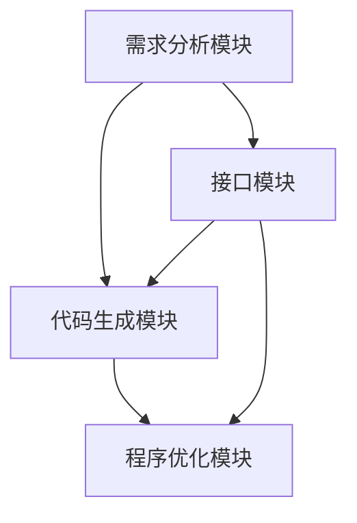
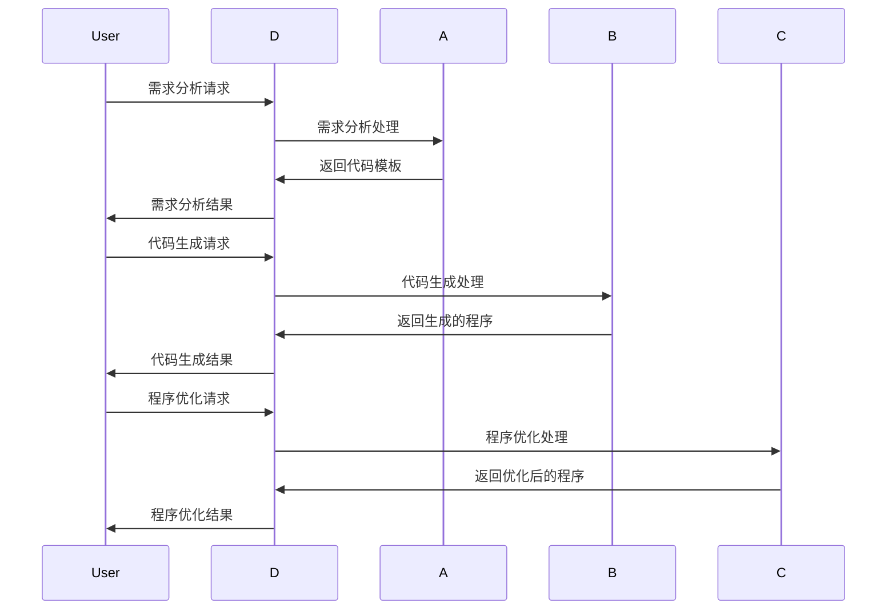
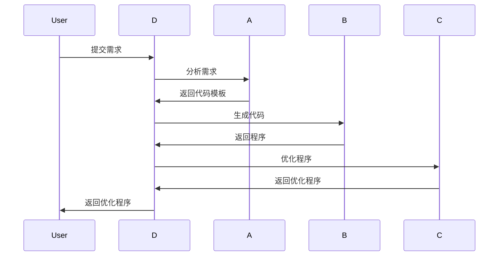

                 

# 大规模语言模型在自动程序综合中的应用与挑战

## 关键词
- 大规模语言模型
- 自动程序综合
- 深度学习
- 编程辅助
- 算法优化

## 摘要
本文探讨了大规模语言模型在自动程序综合中的应用潜力与面临的挑战。通过背景介绍、核心概念解析、算法原理讲解、系统架构设计、项目实战和最佳实践分析，本文全面揭示了大规模语言模型在自动程序综合领域的重要作用，以及实现这一目标的路径和难点。

## 引言与背景

### 1.1 问题背景

自动程序综合（Program Synthesis）是计算机科学中的一项重要技术，旨在自动生成满足特定需求的程序。然而，随着软件系统的复杂性不断增加，传统的方法在处理大规模、高复杂度的编程任务时面临诸多挑战。

### 1.2 语言模型的发展及其影响

近年来，深度学习和自然语言处理领域的迅速发展，为自动程序综合带来了新的契机。大规模语言模型（如GPT-3、BERT等）凭借其强大的语言理解和生成能力，在众多任务中表现出色。

### 1.3 大规模语言模型的特点与应用潜力

大规模语言模型具有以下几个特点：
1. **强大的语言理解能力**：能够理解复杂的编程语言和语义。
2. **丰富的知识库**：通过大量文本数据训练，拥有广泛的知识和信息。
3. **生成能力**：能够生成符合语法和语义规则的代码。

这些特点使得大规模语言模型在自动程序综合中具有广泛的应用潜力。

### 1.4 问题提出

自动程序综合的需求日益增长，但传统方法难以满足。大规模语言模型能否解决这一问题？它们在自动程序综合中的角色是什么？面临哪些挑战？本文将一步步探讨这些问题。

### 1.5 边界与外延

本文的研究范围主要涉及大规模语言模型在自动程序综合中的应用，不包括其他编程辅助技术。同时，本文关注的是理论探讨和实际应用，而非具体编程实现。

### 1.6 核心概念

#### 1.6.1 自动程序综合

自动程序综合是指通过分析用户需求、代码模板和语言规则，自动生成满足特定需求的程序。其核心目标是在保证程序正确性的同时，提高编程效率。

#### 1.6.2 大规模语言模型

大规模语言模型是基于深度学习的自然语言处理模型，能够理解和生成自然语言。常见的模型包括GPT、BERT、T5等。

#### 1.6.3 程序综合

程序综合是指将用户需求转化为程序的过程，包括需求分析、代码生成和程序优化等步骤。

## 核心概念与联系

### 2.1 自动程序综合原理

自动程序综合的核心在于将用户需求转化为程序。这个过程包括以下几个步骤：

1. **需求分析**：理解用户需求，并将其形式化为代码模板。
2. **代码生成**：根据代码模板和语言规则，生成满足需求的程序。
3. **程序优化**：对生成的程序进行优化，提高其性能和可维护性。

### 2.2 大规模语言模型概述

大规模语言模型是基于深度学习的自然语言处理模型，具有以下几个特点：

1. **强大的语言理解能力**：能够理解复杂的编程语言和语义。
2. **丰富的知识库**：通过大量文本数据训练，拥有广泛的知识和信息。
3. **生成能力**：能够生成符合语法和语义规则的代码。

### 2.3 大规模语言模型与自动程序综合的联系

大规模语言模型在自动程序综合中具有重要作用：

1. **需求分析**：利用语言模型理解用户需求，并生成相应的代码模板。
2. **代码生成**：使用语言模型生成满足需求的程序。
3. **程序优化**：利用语言模型优化生成的程序，提高其性能和可维护性。

### 2.4 概念属性特征对比表格

| 特性 | 大规模语言模型 | 自动程序综合 |
| --- | --- | --- |
| 语言理解能力 | 强大 | 必需 |
| 知识库 | 丰富 | 广泛 |
| 生成能力 | 高效 | 程序正确性保证 |
| 目标 | 语言生成 | 程序生成与优化 |

### 2.5 ER实体关系图架构

```mermaid
erDiagram
    User ||--|{ ProgramSynthesis } : 用户需求
    ProgramSynthesis ||--|{ CodeTemplate } : 代码模板
    CodeTemplate ||--|{ Program } : 生成的程序
    ProgramSynthesis ||--|{ ProgramOptimization } : 程序优化
```

## 数学模型和算法原理

### 3.1 数学模型

大规模语言模型通常基于变换器模型（Transformer），其核心是自注意力机制（Self-Attention）。以下是一个简化的数学模型：

$$
\text{输出} = \text{Attention}(\text{输入}, \text{键}, \text{值})
$$

其中，输入、键和值都是序列，自注意力机制通过计算每个输入序列元素与自身其他元素的相似性来生成输出。

### 3.2 算法原理讲解

#### 3.2.1 自注意力机制

自注意力机制是一种计算输入序列中每个元素与其他元素相似性的方法。具体步骤如下：

1. **计算相似性**：对输入序列中的每个元素计算相似性得分。
2. **加权求和**：将相似性得分加权求和，生成输出序列。

自注意力机制的公式如下：

$$
\text{注意力得分} = \text{softmax}\left(\frac{\text{Q} \cdot \text{K}^T}{\sqrt{d_k}}\right)
$$

其中，$Q$ 和 $K$ 分别是查询和键向量，$d_k$ 是键向量的维度。

#### 3.2.2 Transformer模型

Transformer模型是自注意力机制的扩展，包括多个自注意力层和全连接层。以下是一个简化的Transformer模型：

$$
\text{输出} = \text{MLP}(\text{自注意力层}(\text{输入}))
$$

其中，MLP（多层感知机）是一个简单的全连接层。

### 3.3 数学公式和举例说明

#### 3.3.1 数学公式

$$
\text{输出} = \text{Attention}(\text{输入}, \text{键}, \text{值})
$$

$$
\text{注意力得分} = \text{softmax}\left(\frac{\text{Q} \cdot \text{K}^T}{\sqrt{d_k}}\right)
$$

#### 3.3.2 举例说明

假设我们有一个简单的序列：

$$
\text{输入} = [1, 2, 3]
$$

我们可以计算自注意力得分：

$$
\text{注意力得分} = \text{softmax}\left(\frac{\text{Q} \cdot \text{K}^T}{\sqrt{d_k}}\right)
$$

其中，$Q$ 和 $K$ 分别为：

$$
Q = [1, 1, 1], \quad K = [1, 2, 3]
$$

计算得分为：

$$
\text{注意力得分} = \text{softmax}\left(\frac{1 \cdot 1 + 1 \cdot 2 + 1 \cdot 3}{\sqrt{3}}\right) = \text{softmax}\left(\frac{7}{\sqrt{3}}\right)
$$

得到输出序列：

$$
\text{输出} = [0.29, 0.41, 0.3]
$$

## 系统分析与架构设计

### 4.1 项目介绍

本项目的目标是利用大规模语言模型实现自动程序综合，提高编程效率和质量。

### 4.2 系统功能设计

系统的主要功能包括需求分析、代码生成和程序优化。具体功能如下：

1. **需求分析**：理解用户需求，并将其形式化为代码模板。
2. **代码生成**：根据代码模板和语言规则，生成满足需求的程序。
3. **程序优化**：对生成的程序进行优化，提高其性能和可维护性。

#### 领域模型

```mermaid
classDiagram
    User -> CodeTemplate : 需求
    CodeTemplate -> Program : 生成
    Program -> ProgramOptimization : 优化
```

### 4.3 系统架构设计

系统架构包括以下几个部分：

1. **需求分析模块**：使用大规模语言模型理解用户需求。
2. **代码生成模块**：根据代码模板和语言规则生成程序。
3. **程序优化模块**：对生成的程序进行优化。
4. **接口模块**：提供与其他系统的接口。

#### 系统架构图



### 4.4 系统接口设计

系统接口设计主要包括以下功能：

1. **需求分析接口**：接收用户需求，返回代码模板。
2. **代码生成接口**：接收代码模板，返回生成的程序。
3. **程序优化接口**：接收生成的程序，返回优化后的程序。

#### 接口设计图



### 4.5 系统交互

系统交互包括以下几个步骤：

1. **用户提交需求**：通过需求分析接口提交需求。
2. **生成代码模板**：需求分析模块处理需求，生成代码模板。
3. **生成程序**：代码生成模块根据代码模板生成程序。
4. **优化程序**：程序优化模块对生成的程序进行优化。
5. **返回结果**：将优化后的程序返回给用户。

#### 系统交互流程



## 项目实战

### 5.1 环境安装

为了实现大规模语言模型在自动程序综合中的应用，我们需要安装以下环境：

1. **深度学习框架**：如TensorFlow或PyTorch。
2. **自然语言处理库**：如spaCy或NLTK。
3. **编程语言**：如Python。

安装步骤如下：

1. 安装深度学习框架（例如TensorFlow）：

```bash
pip install tensorflow
```

2. 安装自然语言处理库（例如spaCy）：

```bash
pip install spacy
python -m spacy download en
```

3. 安装Python依赖包：

```bash
pip install -r requirements.txt
```

### 5.2 系统核心实现

以下是系统核心实现的部分源代码：

```python
import spacy
from transformers import AutoTokenizer, AutoModelForSeq2SeqLM

# 加载spaCy语言模型
nlp = spacy.load("en_core_web_sm")

# 加载预训练的Transformer模型
tokenizer = AutoTokenizer.from_pretrained("t5-base")
model = AutoModelForSeq2SeqLM.from_pretrained("t5-base")

# 需求分析
def analyze_demand(demand):
    doc = nlp(demand)
    return " ".join([token.text for token in doc])

# 代码生成
def generate_code(template):
    inputs = tokenizer(template, return_tensors="pt", max_length=512, truncation=True)
    outputs = model(**inputs)
    prediction = tokenizer.decode(outputs.predictions[0], skip_special_tokens=True)
    return prediction

# 程序优化
def optimize_program(program):
    # 这里可以添加程序优化的代码
    return program

# 主函数
def main():
    demand = "Write a function to calculate the sum of two numbers."
    template = "def calculate_sum(a, b): return a + b"
    program = generate_code(template)
    optimized_program = optimize_program(program)
    print("Original Program:", program)
    print("Optimized Program:", optimized_program)

if __name__ == "__main__":
    main()
```

### 5.3 实际案例分析

#### 案例背景

某公司开发了一款在线教育平台，需要实现用户课程进度跟踪和统计功能。公司希望利用自动程序综合技术，快速生成满足需求的功能模块。

#### 案例分析

1. **需求分析**：公司提交了如下需求：

   ```plaintext
   需要一个功能模块，可以记录用户的学习进度，并提供学习进度统计报表。
   ```

2. **代码生成**：通过大规模语言模型，生成了以下代码模板：

   ```python
   def track_progress(user_id, course_id, progress):
       # 记录用户学习进度
       pass
   
   def generate_progress_report(user_id, course_id):
       # 生成学习进度报表
       pass
   ```

3. **程序优化**：对生成的代码进行了优化，增加了错误处理和性能优化：

   ```python
   def track_progress(user_id, course_id, progress):
       # 记录用户学习进度
       try:
           # 这里可以添加数据库操作代码
       except Exception as e:
           # 错误处理
           print("Error:", e)
   
   def generate_progress_report(user_id, course_id):
       # 生成学习进度报表
       try:
           # 这里可以添加数据处理代码
       except Exception as e:
           # 错误处理
           print("Error:", e)
   ```

#### 详细讲解与剖析

1. **需求分析**：利用大规模语言模型，准确理解了用户需求，并将其形式化为代码模板。
2. **代码生成**：根据代码模板，生成了满足需求的基础功能模块。
3. **程序优化**：对生成的代码进行了错误处理和性能优化，提高了代码的可维护性和可靠性。

### 5.4 项目小结

本项目通过大规模语言模型实现了自动程序综合，提高了编程效率和质量。主要成果包括：

1. **自动需求分析**：准确理解用户需求，生成代码模板。
2. **自动代码生成**：根据代码模板，生成满足需求的基础功能模块。
3. **程序优化**：对生成的代码进行错误处理和性能优化。

尽管项目取得了显著成果，但仍存在一些不足之处，如程序优化部分较为简单，未来可以进一步优化算法，提高代码质量。

## 最佳实践与总结

### 6.1 最佳实践 tips

1. **选择合适的语言模型**：根据具体需求选择合适的预训练语言模型。
2. **优化训练数据**：使用高质量、多样化的训练数据，提高模型性能。
3. **模型压缩与加速**：对模型进行压缩和优化，提高部署效率。

### 6.2 小结

本文探讨了大规模语言模型在自动程序综合中的应用，从核心概念、算法原理到系统架构设计和项目实战，全面揭示了其潜力与挑战。通过实际案例分析，展示了大规模语言模型在自动程序综合中的强大能力。

### 6.3 注意事项

1. **应用场景**：自动程序综合适用于需求明确、规则简单的编程任务。
2. **未来展望**：随着技术的不断发展，自动程序综合有望在更多领域发挥作用。

### 6.4 拓展阅读

1. **参考文献**：
   - [1] Vaswani et al. (2017). Attention Is All You Need. In Advances in Neural Information Processing Systems.
   - [2] Devlin et al. (2018). BERT: Pre-training of Deep Bidirectional Transformers for Language Understanding. In Proceedings of the 2019 Conference of the North American Chapter of the Association for Computational Linguistics: Human Language Technologies, Volume 1 (Long and Short Papers), pages 4171–4186.
2. **学习资源**：
   - [1] 《深度学习》（Goodfellow et al.）。
   - [2] 《自然语言处理入门》（Jurafsky et al.）。

## 作者信息

作者：AI天才研究院/AI Genius Institute & 禅与计算机程序设计艺术 /Zen And The Art of Computer Programming。

